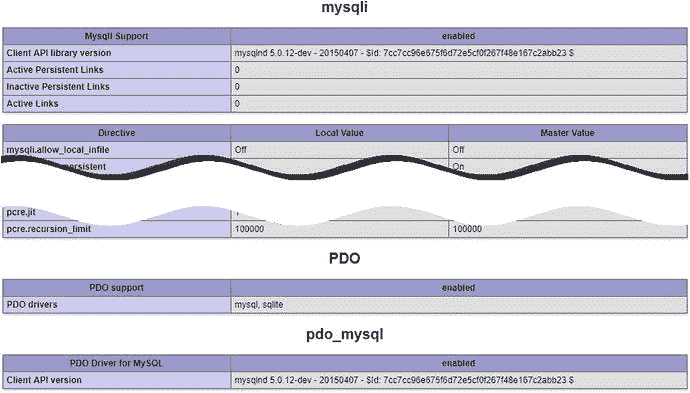

# 13. 使用 PHP 和 SQL 连接数据库

PHP 7 提供了两种连接并与 MySQL 数据库交互的方式：MySQL 改进版（`MySQLi`）和 PHP 数据对象（`PDO`）。选择哪种方式至关重要，因为它们使用不兼容的代码。你不能在同一数据库连接中混用它们。同样重要的是，不要将 `MySQLi` 与原始 MySQL 扩展混淆，后者在 PHP 7 中已不再支持。大多数情况下，`MySQLi` 函数名称唯一的区别是多了一个字母 *I*（例如，`mysqli_query()` 替代了 `mysql_query()`）。然而，参数的顺序通常不同，因此转换旧脚本不仅仅是在函数名中插入一个 *I* 那么简单。

顾名思义，`MySQLi` 是专门为与 MySQL 配合使用而设计的。它也与 MariaDB 完全兼容。另一方面，`PDO` 是与数据库系统无关的。至少理论上，你只需更改几行 PHP 代码，就能将网站从 MySQL 切换到 Microsoft SQL Server 或其他数据库系统。但在实践中，你通常需要至少重写部分 SQL 查询，因为每个数据库供应商都会在标准 SQL 之上添加自定义函数。

我个人偏好使用 `PDO`；但为了内容全面，其余章节将同时介绍 `MySQLi` 和 `PDO`。如果你只想专注于其中之一，忽略与另一种相关的部分即可。虽然你使用 PHP 连接数据库并存储结果，但数据库查询需要用 SQL 编写。本章教你检索表中存储信息的基础知识。

在本章中，我们将涵盖以下内容：

- 使用 `MySQLi` 和 `PDO` 连接到 MySQL 和 MariaDB
- 统计表中的记录数
- 使用 `SELECT` 查询检索数据并将其显示在网页上
- 使用预处理语句和其他技术确保数据安全

## 检查远程服务器设置

`XAMPP` 和 `MAMP` 都支持 `MySQLi` 和 `PDO`，但你需要检查远程服务器的 PHP 配置以验证其支持程度。在你的远程服务器上运行 `phpinfo()`，向下滚动配置页面，查找以下部分。它们是按字母顺序列出的，因此你需要向下滚动很长一段距离才能找到。



所有托管公司都应该拥有第一个部分（`mysqli`）。如果只列出了 `mysql`（不带最后的 *I*），说明你的服务器版本已过时，存在危险。请尽快让你的托管公司为你迁移到运行新版 PHP 7.x 的服务器上（你可以在 [`php.net/supported-versions.php`](https://php.net/supported-versions.php) 查看当前支持的 PHP 版本）。如果你打算使用 `PDO`，你不仅需要检查 `PDO` 是否已启用，还必须确保列出了 `pdo_mysql`。`PDO` 需要针对每种数据库类型使用不同的驱动程序。

## PHP 如何与数据库通信

无论你使用 `MySQLi` 还是 `PDO`，流程总是遵循以下顺序：

1.  使用主机名、用户名、密码和数据库名连接到数据库。
2.  准备一个 SQL 查询。
3.  执行查询并保存结果。
4.  从结果中提取数据（通常使用循环）。


用户名和密码是你在第 12 章创建或由托管公司提供的账户信息。那么主机名呢？在本地测试环境中，主机名是`localhost`。令人惊讶的是，在远程服务器上它通常也是`localhost`。这是因为在很多情况下，数据库服务器与你的网站位于同一台服务器上。换句话说，显示页面的 Web 服务器和数据库服务器是相互本地的。然而，如果数据库服务器位于另一台机器上，你的托管公司会告知你需要使用的地址。重点是主机名*通常不*等于你网站的域名。

让我们快速看看如何使用每种方法连接数据库。

## 使用 MySQL 改进版扩展连接

`MySQLi`有两种接口：过程式和面向对象式。过程式接口旨在简化从原始 MySQL 函数的过渡。由于面向对象版本更简洁，这里采用后者。

要连接 MySQL 或 MariaDB，你需要向构造函数传递四个参数来创建`mysqli`对象：主机名、用户名、密码和数据库名。以下是连接`phpsols`数据库的方式：

```php
$conn = new mysqli($hostname, $username, $password, 'phpsols');
```

这将连接对象存储为`$conn`。如果你的数据库服务器使用非标准端口，你需要将端口号作为第五个参数传递给`mysqli`构造函数。

**提示**：MAMP 使用套接字连接 MySQL，即使 MySQL 监听端口 8889，也无需添加端口号。这同时适用于`MySQLi`和`PDO`。

## 使用 PDO 连接

`PDO`需要略微不同的方法。最重要的区别是：如果连接失败，`PDO`会抛出异常。如果你不捕获异常，调试信息会显示所有连接详情，包括你的用户名和密码。因此，你需要将代码包裹在`try`块中并捕获异常，以防止敏感信息泄露。

传递给`PDO`构造函数的第一个参数是**数据源名称(DSN)**。这是一个字符串，由`PDO`驱动名称后跟冒号，再跟`PDO`驱动特定的连接详情组成。

要连接 MySQL 或 MariaDB，DSN 需采用以下格式：

```
'mysql:host=hostname;dbname=databaseName'
```

如果你的数据库服务器使用非标准端口，DSN 还应包含端口号，如下所示：

```
'mysql:host=hostname;port=portNumber;dbname=databaseName'
```

在 DSN 之后，你将用户名和密码传递给`PDO()`构造函数。因此连接`phpsols`数据库的代码如下：

```php
try {
$conn = new PDO("mysql:host=$hostname;dbname=phpsols", $username, $password);
} catch (PDOException $e) {
echo $e->getMessage();
}
```

使用`echo`显示异常生成的消息在测试阶段是可以接受的，但在将脚本部署到实际网站时，你需要将用户重定向到错误页面，如 PHP 解决方案 5-9 所述。

**提示**：DSN 是`PHP`代码中唯一需要更改以连接不同数据库系统的部分。所有剩余的`PDO`代码完全与数据库无关。关于如何为 PostgreSQL、Microsoft SQL Server、SQLite 和其他数据库系统创建 DSN 的详细信息，请访问[`www.php.net/manual/en/pdo.drivers.php`](http://www.php.net/manual/en/pdo.drivers.php)。

## PHP 解决方案 13-1：制作可复用的数据库连接器

连接数据库是一项常规任务，从现在开始每个页面都需要执行。这个 PHP 解决方案创建了一个存储在外部文件中的简单函数，用于连接数据库。它主要为测试剩余章节中不同的`MySQLi`和`PDO`脚本而设计，无需每次重新输入连接详情或在不同的连接文件之间切换。

1. 在`includes`文件夹中创建一个名为`connection.php`的文件，并插入以下代码（`ch13`文件夹中有一个完成脚本的副本）：

```php
    <?php
    function dbConnect($usertype, $connectionType = 'mysqli') {
    $host = 'localhost';
    $db = 'phpsols';
    if ($usertype  == 'read') {
    $user = 'psread';
    $pwd = 'K1yoMizu^dera';
    } elseif ($usertype == 'write') {
    $user = 'pswrite';
    $pwd = '0Ch@Nom1$u';
    } else {
    exit('Unrecognized user');
    }
    // Connection code goes here
    }
    ```

   该函数接受两个参数：用户类型和连接类型。第二个参数默认为`mysqli`。如果你想专注于使用`PDO`，请将第二个参数的默认值设置为`pdo`。

   函数内部的前两行存储了要连接的主机服务器和数据库的名称。

   条件语句检查第一个参数的值，并在`psread`和`pswrite`用户名和密码之间切换。如果用户账户无法识别，`exit()`函数会终止脚本并显示`Unrecognized user`。

2. 将`Connection code goes here`注释替换为以下内容：

```php
    if ($connectionType == 'mysqli') {
    $conn = @ new mysqli($host, $user, $pwd, $db);
    if ($conn->connect_error) {
    exit($conn->connect_error);
    }
    return $conn;
    } else {
    try {
    return new PDO("mysql:host=$host;dbname=$db", $user, $pwd);
    } catch (PDOException $e) {
    echo $e->getMessage();
    }
    }
    ```

   如果第二个参数设置为`mysqli`，则会创建一个名为`$conn`的`MySQLi`连接对象。错误控制运算符(`@`)阻止构造函数显示错误消息。如果连接失败，原因会存储在对象的`connect_error`属性中。如果该属性为空，则视为`false`，因此下一行被跳过，并返回`$conn`对象。但如果出现问题，`exit()`会显示`connect_error`的值并终止脚本。

   否则，函数返回一个`PDO`连接对象。无需对`PDO`构造函数使用错误控制运算符，因为如果有问题它会抛出`PDOException`。`catch`块使用异常的`getMessage()`方法显示问题原因。

