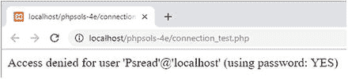
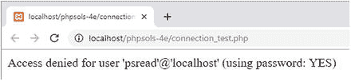
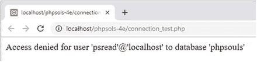
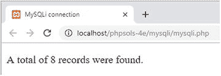

# 提示

如果你的数据库服务器使用非标准端口，不要忘记将端口号作为第五个参数添加到`mysqli()`构造函数中，并将其包含在`PDO`的 DSN 中，如前几节所述。如果数据库使用套接字连接（这在 macOS 和 Linux 上很常见），则不需要这样做。

3. 在`phpsols`站点根文件夹中创建一个名为`connection_test.php`的文件，并插入以下代码：

```php
<?php
require_once './includes/connection.php';
if ($conn = dbConnect('read')) {
echo 'Connection successful';
}
```

这包含了连接脚本，并使用`psread`用户账户和`MySQLi`进行测试。

4. 保存页面并在浏览器中加载。如果看到`Connection successful`，则一切正常。如果收到错误消息，请查阅下一节的故障排除提示。

5. 使用`pswrite`用户和`MySQLi`测试连接：

```php
if ($conn = dbConnect('write')) {
echo 'Connection successful';
}
```

6. 通过将`'pdo'`作为第二个参数传递给`dbConnect()`来测试两个用户账户与`PDO`的连接。

7. 如果一切顺利，你现在就可以开始与`phpsols`数据库交互了。如果遇到问题，请查看下一节。

## 解决数据库连接问题

连接数据库时最常见的失败原因是用户名或密码错误。密码和用户名是区分大小写的。请仔细检查拼写。例如，以下截图显示了将`psread`改为`Psread`会发生什么。



访问被拒绝是因为没有这个用户。用户名的首字母大写造成了完全不同的结果。但即使用户名正确，你也可能收到同样的错误信息，如下所示：



这让许多人感到十分困惑。错误信息确认你正在使用密码。那么为什么访问被拒绝呢？因为密码错误，就是这个原因。如果错误信息显示`using password: NO`，则表示你忘记提供密码。短语`using password`是问题与登录凭据相关的线索。当这个短语缺失时，表示是另一个不同的问题，如下一张截图所示。



这里的问题是数据库名称不正确。如果你拼写错了主机名，你会收到一条未知主机的消息。本节中的截图是由 MySQLi 生成的。PDO 会生成相同的消息，但还会包含错误编号和代码。

## 清洗来自数据库的文本结果

在显示 SQL 查询结果时，你可以确信存储在特定类型列中的值将采用特定格式。例如，数字类型的列只能存储数字。同样，日期和时间相关的列只能以 ISO 日期时间格式存储值。然而，文本相关的列可以存储任何类型的字符串，包括 HTML、JavaScript 和其他可执行代码。在输出来自文本列的值时，你应该始终对其进行清洗，以防止任意代码被执行。

清洗文本输出的简单方法是将其传递给`htmlspecialchars()`。此函数与`htmlentities()`相关，但它将更有限范围的字符转换为其等效的 HTML 字符实体。具体来说，它会转换&符号、引号和尖括号；但会保留句点（点号）。这起到了在浏览器中显示时中和执行代码尝试的效果，因为`<script>`和 PHP 标签的尖括号被转换了。重要的是不要转换点号，因为它们用于我们想要显示的文件名中。

`htmlspecialchars()`的缺点是默认情况下它会对现有的字符实体进行双重编码。结果，`&amp;`被转换为`&amp;amp;`。你可以通过将`false`作为第四个参数传递给`htmlspecialchars()`来关闭此默认行为。

每次调用`htmlspecialchars()`都输入四个参数很繁琐。因此，我在`ch13`文件夹中一个名为`utility_funcs.php`的文件里定义了以下自定义函数：

```php
function safe($text) {
return htmlspecialchars($text, ENT_COMPAT|ENT_HTML5, 'UTF-8', false);
}
```

这简单地将`$text`传递给`htmlspecialchars()`，设置了三个可选参数，并返回结果。其他参数如下：

- `ENT_COMPAT|ENT_HTML5`：将双引号转换为实体，但保留单引号不变，并将输出视为 HTML5

- `UTF-8`：将编码设置为 UTF-8

- `false`：关闭 HTML 字符实体的双重编码

将`utility_funcs.php`复制到`includes`文件夹，并在从数据库输出文本的脚本中引入它。

作为`htmlspecialchars()`的替代方案，你可以将文本值传递给`strip_tags()`，它允许你指定允许的 HTML 标签（参见第 7 章的“访问远程文件”）。

## 查询数据库并显示结果

在尝试显示数据库查询结果之前，最好先了解有多少条结果。如果没有结果，你将没有内容可显示。这也对于为长结果集创建分页导航系统是必要的（你将在下一章学习如何操作）。在用户认证中（第 19 章介绍），搜索用户名和密码时没有结果意味着登录应失败。

MySQLi 和 PDO 在计数和显示结果时使用不同的方法。接下来的两个 PHP 解决方案展示了如何使用 MySQLi 实现。对于 PDO，请跳到 PHP 解决方案 13-4。

### PHP 解决方案 13-2: 统计结果集中的记录数 (MySQLi)

此 PHP 解决方案展示了如何提交一条选择`images`表中所有记录的 SQL 查询，并将结果存储在`MySQLi_Result`对象中。该对象的`num_rows`属性包含查询检索到的记录数。

1. 在`phpsols-4e`站点根目录中创建一个名为`mysqli`的新文件夹，然后在该文件夹内创建一个名为`mysqli.php`的新文件。该页面最终将用于显示一个表格，因此它应包含`DOCTYPE`声明和一个 HTML 骨架。

2. 在`DOCTYPE`声明上方的 PHP 代码块中包含连接文件，并使用具有只读权限的账户连接到`phpsols`数据库，如下所示：

```php
require_once '../includes/connection.php';
$conn = dbConnect('read');
```

3. 接下来，准备 SQL 查询。在上一步之后（但在结束 PHP 标签之前）立即添加以下代码：

```php
$sql = 'SELECT * FROM images';
```

这意味着“从`images`表中选择所有内容”。星号（`*`）是“所有列”的简写。

4. 现在通过调用连接对象的`query()`方法并将 SQL 查询作为参数传递来执行查询，如下所示：

```php
$result = $conn->query($sql);
```

结果存储在一个变量中，我将其直观地命名为`$result`。

5. 如果出现问题，`$result`将为`false`。要找出问题所在，我们需要获取错误信息，该信息存储为`mysqli`连接对象的`error`属性。在前一行之后添加以下条件语句：

```php
if (!$result) {
$error = $conn->error;
}
```

6. 假设没有问题，`$result`现在持有一个`MySQLi_Result`对象，它有一个名为`num_rows`的属性。要获取查询找到的记录数，在条件语句中添加一个`else`块并将该值赋给一个变量，如下所示：

```php
if (!$result) {
$error = $conn->error;
} else {
$numRows = $result->num_rows;
}
```

7. 现在可以像这样在页面的主体中显示结果：

```php
$error";
} else {
echo "共找到 $numRows 条记录。";
}
?>
```

如果出现问题，`$error`将被设置，因此会显示它。否则，`else`块显示找到的记录数。两个字符串都嵌入了变量，因此它们用双引号括起来。

8. 保存`mysqli.php`并在浏览器中加载它。你应该会看到以下结果：



如有必要，请对照`ch13`文件夹中的`mysqli_01.php`检查你的代码。