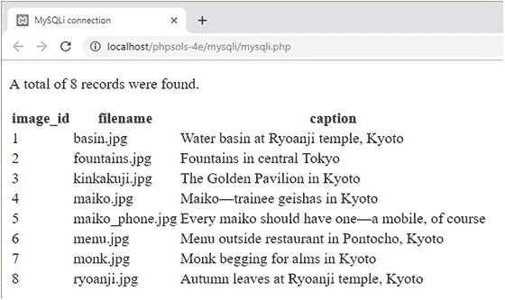

# PHP 解决方案 13-3：使用 MySQLi 显示 `images` 表

显示 `SELECT` 查询结果最常用的方法是使用循环每次从结果集中提取一行。`MySQLi_Result` 有一个名为 `fetch_assoc()` 的方法，它可以将当前行作为关联数组提取出来，以便在网页中显示。数组中的每个元素都以表中相应的列名命名。

本 PHP 解决方案演示了如何遍历 `MySQLi_Result` 对象来显示 `SELECT` 查询的结果。继续使用 PHP 解决方案 13-2 中的文件。

1.  将 `utility_funcs.php` 从 `ch13` 文件夹复制到 `includes` 文件夹，并将其包含在脚本顶部：

    ```php
    require_once '../includes/connection.php';
    require_once '../includes/utility_funcs.php';
    ```

2.  删除页面主体中 `else` 块末尾的右花括号（它应该在第 24 行左右）。虽然显示 `images` 表的大部分代码是 HTML，但它需要位于 `else` 块内部。

3.  在 PHP 结束标记后插入一个空行，并在下一行的一个单独的 PHP 代码块中添加右花括号。修改后的代码应如下所示：

    ```php
    } else {
    echo "共找到 $numRows 条记录。";
    ?>
    ```

4.  在 `mysqli.php` 主体中的两个 PHP 块之间添加下表，使其受 `else` 块控制。这样做是为了防止 SQL 查询失败时出现错误。显示结果集的 PHP 代码以粗体显示。

    ```php
    image_id
    filename
    caption

    fetch_assoc()) { ?>
    ```

**提示** `while` 循环遍历数据库结果，使用 `fetch_assoc()` 方法将每条记录提取到 `$row` 中。`$row` 的每个元素都显示在表格单元格中。循环会一直持续，直到 `fetch_assoc()` 到达结果集的末尾。

由于 `image_id` 存储在仅包含整数的列中，因此无需对其进行清理。

5.  保存 `mysqli.php` 并在浏览器中查看。您应该会看到 `images` 表的内容显示如下截图所示：



如有必要，您可以将代码与 `ch13` 文件夹中的 `mysql_02.php` 进行比较。

## MySQLi 连接速查表

表 13-1 总结了 MySQLi 的连接和数据库查询的基本细节。

**表 13-1.** 使用 MySQL 改进的面向对象接口连接到 MySQL/MariaDB

| 操作 | 用法 | 说明 |
| --- | --- | --- |
| 连接 | `$conn = new mysqli($h,$u,$p,$d);` | 所有参数都是可选的；但在实践中始终需要前四个：主机名、用户名、密码、数据库名。创建连接对象。 |
| 选择数据库 | `$conn->select_db('dbName');` | 用于选择不同的数据库。 |
| 提交查询 | `$result = $conn->query($sql);` | 返回结果对象。 |
| 统计结果数 | `$numRows = $result->num_rows;` | 返回结果对象中的行数。 |
| 提取记录 | `$row = $result->fetch_assoc();` | 将结果对象中的当前行提取为关联数组。 |
| 提取记录 | `$row = $result->fetch_row();` | 将结果对象中的当前行提取为索引（编号）数组。 |

