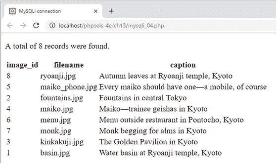
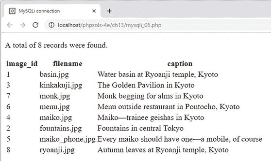
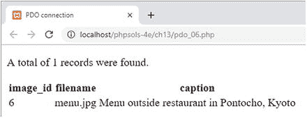
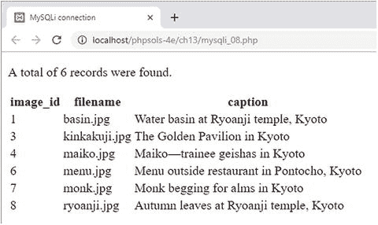
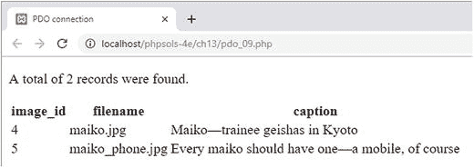
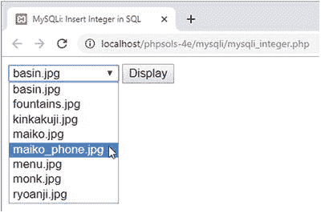

# PHP 解决方案 13-5：使用 PDO 显示 images 表

要使用 PDO 显示 `SELECT` 查询的结果，可以在 `foreach` 循环中使用 `query()` 方法将当前行提取为关联数组。数组中的每个元素都以表中相应的列名命名。

继续使用与上一个 PHP 解决方案相同的文件。

1.  将 `utility_funcs.php` 从 `ch13` 文件夹复制到 `includes` 文件夹，并将其包含在脚本顶部：

    ```php
    require_once '../includes/connection.php';
    require_once '../includes/utility_funcs.php';
    ```


2.  删除页面主体中 `else` 代码块末尾的右花括号（大约在第 26 行）。虽然显示 `images` 表的代码大部分是 HTML，但它需要放在 `else` 代码块内部。

3.  在结束 PHP 标签后插入一个空行，然后在新的一行中，通过一个单独的 PHP 代码块添加右花括号。修改后的代码应该如下所示：

```
    } else {
    echo "A total of $numRows records were found.";
    ?>

```

4.  在 `pdo.php` 主体中的两个 PHP 代码块之间添加下表，使其受 `else` 代码块控制。这样做是为了防止 SQL 查询失败时出现错误。显示结果集的 PHP 代码以粗体显示。

```

image_id
    filename
    caption

query($sql) as $row) { ?>

```

5.  保存页面并在浏览器中查看。它应该看起来像 PHP 解决方案 13-3 中的截图。你可以将代码与 `ch13` 文件夹中的 `pdo_02.php` 进行比较。

## PDO 连接速查表

表 13-2 总结了使用 PDO 进行连接和数据库查询的基本细节。某些命令将在后续章节中使用，但此处一并列出以便参考。

**表 13-2.** 使用 PDO 进行数据库连接

| 操作 | 用法 | 说明 |
| --- | --- | --- |
| 连接 | `$conn = new PDO($DSN,$u,$p);` | 实际使用时需要三个参数：数据源名称 (DSN)、用户名、密码。必须包裹在 `try/catch` 代码块中。 |
| 提交 `SELECT` 查询 | `$result = $conn->query($sql);` | 以 `PDOStatement` 对象的形式返回结果。 |
| 提取记录 | `foreach($conn->query($sql) as $row) {` | 一次操作中提交 `SELECT` 查询并将当前行作为关联数组获取。 |
| 统计结果数 | `$numRows = $result->rowCount()` | 在 MySQL/MariaDB 中，返回 `SELECT` 查询的结果数量。大多数其他数据库不支持。 |
| 获取单个结果 | `$item = $result->fetchColumn();` | 获取结果第一列的第一条记录。要获取其他列的结果，请将列号（从 0 开始计数）作为参数传入。 |
| 获取下一条记录 | `$row = $result->fetch();` | 从结果集中将下一行作为关联数组获取。 |
| 释放数据库资源 | `$result->closeCursor();` | 释放连接以允许执行新查询。 |
| 提交非 `SELECT` 查询 | `$affected = $conn->exec($sql);` | 虽然 `query()` 可用于非 `SELECT` 查询，但 `exec()` 会返回受影响的行数。 |

## 使用 SQL 与数据库交互

正如你刚看到的，PHP 负责连接数据库、发送查询并接收结果，但查询本身需要用 SQL 编写。尽管 SQL 是一种通用标准，但它有许多方言。包括 MySQL 在内的每个数据库供应商都对标准语言进行了扩展。这些扩展提高了效率和功能性，但通常与其他数据库不兼容。本书中的 SQL 适用于 MySQL 5.1 或更高版本以及 MariaDB，但不一定适用于 Microsoft SQL Server、Oracle 或其他数据库。

### 编写 SQL 查询

SQL 语法规则不多，而且都很简单。

#### SQL 关键字不区分大小写

从 `images` 表中检索所有记录的查询如下所示：

```
SELECT * FROM images
```

大写的单词是 SQL 关键字。这纯粹是一种约定俗成的写法。以下写法都是正确的：

```
SELECT * FROM images
select * from images
SeLEcT * fRoM images
```

虽然 SQL 关键字不区分大小写，但这*不*适用于数据库列名。使用大写字母作为关键字的优点在于能使 SQL 查询更易于阅读。你可以自由选择最适合自己的风格，但最后一种类似勒索信的风格最好避免使用。

#### 空格会被忽略

这允许你将 SQL 查询分散在多行以提高可读性。唯一*不允许*存在空格的地方是函数名和左括号之间。以下写法会报错：

```
SELECT COUNT (*) FROM images  /* 错误示例 */
```

空格需要像这样去掉：

```
SELECT COUNT(*) FROM images  /* 正确 */
```

你可能已从这些示例中猜到，可以通过将注释放在 `/*` 和 `*/` 之间来为 SQL 查询添加注释。

#### 字符串必须加引号

在 SQL 查询中，所有字符串都必须加引号。使用单引号还是双引号无关紧要，只要成对匹配即可。不过，通常最好使用 MySQLi 或 PDO 的预处理语句，本章稍后将对此进行说明。

#### 处理数字

一般来说，数字不应加引号，因为引号内的任何内容都是字符串。但是，MySQL 接受用引号括起来的数字，并将其视为等效的数字。请务必注意区分真正的数字和由数字组成的其他数据类型。例如，日期由数字组成，但应括在引号中并存储在日期相关的列类型中。同样，电话号码应括在引号中并存储在文本相关的列类型中。

#### 注意

SQL 查询通常以分号结尾，这是指示数据库执行查询的指令。在使用 PHP 时，必须从 SQL 中省略分号。因此，本书中独立的 SQL 示例在呈现时都不带结束分号。

## 优化 SELECT 查询检索的数据

到目前为止，你运行过的唯一 SQL 查询是从 `images` 表中检索所有记录。大多数情况下，你需要更有选择性。

### 选择特定列

使用星号选择所有列是一种便捷的快捷方式，但通常应只指定所需的列。在 `SELECT` 关键字之后列出列名，并用逗号分隔。例如，此查询仅选择每条记录的 `filename` 和 `caption` 字段：

```
SELECT filename, caption FROM images
```

你可以在 `ch13` 文件夹中的 `mysqli_03.php` 和 `pdo_03.php` 中测试这一点。

### 更改结果排序顺序

要控制排序顺序，请添加一个 `ORDER BY` 子句，其中按优先级顺序包含一个或多个列名。多个列名用逗号分隔。以下查询按字母顺序对 `images` 表中的标题进行排序（代码位于 `mysqli_04.php` 和 `pdo_04.php` 中）：

```
$sql = 'SELECT * FROM images ORDER BY caption';
```

**注意**
此处的分号是 PHP 语句的一部分，不是 SQL 查询的一部分。

上述查询产生如下输出：


要反转排序顺序，请像这样添加 `DESC`（表示“降序”）关键字（`mysqli_05.php` 和 `pdo_05.php` 中有示例）：

```
$sql = 'SELECT * FROM images ORDER BY caption DESC';
```



还有一个 `ASC`（表示“升序”）关键字。它是默认的排序顺序，因此通常省略。

然而，当同一表中的列以不同顺序排序时，指定 `ASC` 可以提高清晰度。例如，如果你每天发布多篇文章，可以使用以下查询按字母顺序显示标题，但按发布日期排序，最新的在前：

```
SELECT * FROM articles
ORDER BY published DESC, title ASC
```

### 搜索特定值

要搜索特定值，请在 `SELECT` 查询中添加一个 `WHERE` 子句。`WHERE` 子句跟在表名之后。例如，`mysqli_06.php` 和 `pdo_06.php` 中的查询如下所示：

```
$sql = 'SELECT * FROM images
WHERE image_id = 6';
```

**注意**
SQL 使用一个等号来测试相等性，这与 PHP 使用两个等号不同。


它会产生如下结果：  


除了测试相等性外，`WHERE` 子句还可以使用比较运算符，例如大于（`>`）和小于（`<`）。这里不一一列举所有选项，我将在需要时再介绍其他运算符。第 15 章对四个主要的 SQL 命令：`SELECT`、`INSERT`、`UPDATE` 和 `DELETE` 进行了全面总结，其中包含与 `WHERE` 一起使用的主要比较运算符列表。

如果与 `ORDER BY` 结合使用，`WHERE` 子句必须放在前面。例如（代码位于 `mysqli_07.php` 和 `pdo_07.php` 中）：

```
$sql = 'SELECT * FROM images
WHERE image_id > 5
ORDER BY caption DESC';
```

这会选择 `image_id` 大于 5 的三张图片，并按说明文字的降序对它们进行排序。

## 使用通配符搜索文本

在 SQL 中，百分号（`%`）是一个通配符，可以匹配任何内容或不匹配任何内容。它与 `LIKE` 关键字一起在 `WHERE` 子句中使用。

位于 `mysqli_08.php` 和 `pdo_08.php` 中的查询语句如下：

```
$sql = 'SELECT * FROM images
WHERE caption LIKE "%Kyoto%"';
```

它会搜索 `images` 表中所有 `caption` 列包含“Kyoto”的记录，并产生如下结果：  


如上截图所示，它会从 `images` 表的八条记录中找到六条。所有说明文字都以“Kyoto”结尾，因此结尾处的通配符未匹配任何内容，而开头的通配符则匹配了每条说明文字的其余部分。如果省略开头的通配符（`"Kyoto%"`），查询将搜索以“Kyoto”开头的说明文字。但没有一条记录以“Kyoto”开头，因此搜索不会返回任何结果。

位于 `mysqli_09.php` 和 `pdo_09.php` 中的查询语句如下：

```
$sql = 'SELECT * FROM images
WHERE caption LIKE "%maiko%"';
```

它会产生如下结果：  


查询中“maiko”全部是小写字母，但查询也能找到首字母大写的记录。使用 `LIKE` 的搜索是不区分大小写的。

要执行区分大小写的搜索，需要添加 `BINARY` 关键字，如下所示（代码位于 `mysqli_10.php` 和 `pdo_10.php` 中）：

```
$sql = 'SELECT * FROM images
WHERE caption LIKE BINARY "%maiko%"';
```

到目前为止，您看到的所有示例都是硬编码的，但大多数情况下，SQL 查询中使用的值需要来自用户输入。如果不加注意，这会使您面临一种称为 **SQL 注入** 的恶意利用风险。本章的其余部分将解释这种危险以及如何避免它。

## 理解 SQL 注入的危险

**SQL 注入** 与我在第 6 章中告诫过您的电子邮件头注入非常相似。注入攻击试图在 SQL 查询中插入虚假条件，以试图暴露或破坏您的数据。以下查询的含义应该很容易理解：

```
SELECT * FROM users WHERE username = 'xyz' AND pwd = 'abc'
```

这是登录应用程序的基本模式。如果查询找到一条 `username` 为 `xyz` 且 `pwd` 为 `abc` 的记录，则表明提交了正确的用户名和密码组合，因此登录成功。攻击者所需要做的只是像这样注入一个额外条件：

```
SELECT * FROM users WHERE username = 'xyz' AND pwd = 'abc' OR 1 = 1
```

`OR` 意味着只需要其中一个条件为真，因此即使没有正确的用户名和密码，登录也会成功。SQL 注入依赖于当部分查询源自变量或用户输入时，引号和其他控制字符未被正确转义。

根据具体情况，您可以采用几种策略来防止 SQL 注入：

*   如果变量是整数（例如，记录的主键），请使用 `is_numeric()` 和 `(int)` 转型运算符来确保将其插入查询是安全的。
*   使用**预准备语句**。在预准备语句中，SQL 查询中的占位符代表来自用户输入的值。PHP 代码会自动将字符串包裹在引号中，并转义嵌入的引号和其他控制字符。MySQLi 和 PDO 的语法不同。
*   前述策略均不适用于列名，因为列名不能加引号。要将变量用作列名，请创建一个可接受值的数组，并在将其插入查询之前检查提交的值是否在该数组中。

让我们来看一下这些技术的每一种用法。

**注意**  
我没有将 MySQLi 的 `real_escape_string()` 或 PDO 的 `quote()` 方法列为防止 SQL 注入的技术，因为两者都不能提供万无一失的保护。请使用预准备语句将用户输入的值嵌入到 SQL 查询中。

## PHP 解决方案 13-6：将用户输入的整数插入查询

该 PHP 解决方案演示了如何在将用户输入的值插入 SQL 查询之前，对其进行清理以确保该值只包含整数。该技术对于 MySQLi 和 PDO 是相同的。

1.  将 `ch13` 文件夹中的 `mysqli_integer_01.php` 或 `pdo_integer_01.php` 复制到 `mysqli` 或 `pdo` 文件夹，并从文件名中删除 `_01`。每个文件都包含一个从 `images` 表中选择 `image_id` 和 `filename` 列的 SQL 查询。在页面的主体部分，有一个包含下拉菜单的表单，该菜单由一个循环填充，该循环遍历 SQL 查询的结果。MySQLi 版本如下所示：

    ```
    <?php while ($row = $result->fetch_assoc()) { ?>
        <option value="<?= $row['image_id'] ?>" <?php if ($_GET['image_id'] == $row['image_id']) echo 'selected' ?>>
            <?= $row['filename'] ?>
        </option>
    <?php } ?>
    ```

表单使用 `get` 方法，并将 `image_id` 分配给 `<option>` 标签的 `value` 属性。如果 `$_GET['image_id']` 的值与 `$row['image_id']` 的值相同，则当前的 `image_id` 与通过页面查询字符串传递的相同，因此会将 `selected` 属性添加到开头的 `<option>` 标签中。`$row['filename']` 的值被插入在开头的 `<option>` 和结尾的 `</option>` 标签之间。

PDO 版本除了使用 PDO 的 `fetch()` 方法直接在 `foreach` 循环中运行查询这一点不同外，其他完全相同。

如果在浏览器中加载该页面，您会看到一个列出 `images` 文件夹中文件的下拉菜单，如下所示：  


2.  在结束的 `</form>` 标签之后立即插入以下代码。除了其中一行之外，该代码对于 MySQLi 和 PDO 是相同的。

    ```
    <?php
    if (isset($_GET['image_id'])) {
        $image_id = (int) $_GET['image_id'];
        $error = ($image_id == 0) ? true : false;
        if (!$error) {
            $sql = "SELECT filename, caption FROM images WHERE image_id = $image_id";
            $result = $conn->query($sql);
            $row = $result->fetch_assoc();
            ?>
            <h2><?= $row['caption'] ?></h2>
            " alt="<?= $row['caption'] ?>">
            <?php
        } else {
            echo 'Image not found';
        }
    }
    ?>
    ```

条件语句检查 `image_id` 是否已通过 `$_GET` 数组发送。如果已发送，则使用 `(int)` 转型运算符将其赋值给 `$image_id`。使用转型运算符有两个目的：它可以防止通过提交浮点数来尝试探测脚本的错误消息，并将非数值转换为 0。

下一行使用三元运算符，根据 `$image_id` 是否为 0 将 `$error` 设置为 `true` 或 `false`。

如果 `$error` 为 `false`，脚本将查询数据库并显示选中的图片和说明文字。由于您知道 `$image_id` 是一个整数，因此可以直接将其插入 SQL 查询中，这是安全的。因为它是一个数字，所以不需要用引号包裹，但赋值给 `$sql` 的字符串需要使用双引号，以确保 `$image_id` 的值被插入到查询中。


