# 文档排版结果

新查询通过 `query()` 方法提交给 MySQL，并将结果存储在 `$row` 中。最后，使用 `$row['filename']` 和 `$row['caption']` 在页面中显示图像及其说明文字。

然而，如果 `$error` 为 `true`，则最后的条件语句会显示“未找到图像”。

**提示** 我选择使用单独的条件语句来显示“未找到图像”，是因为计划稍后检查另一个错误，并希望两个错误共享同一条错误信息。

2. 如果你使用的是 PDO 版本，请找到这一行：

```
$row = $result->fetch_assoc();
```

将其修改为：

```
$row = $result->fetch();
```

3. 保存页面并加载到浏览器中。页面首次加载时，仅显示下拉菜单。

4. 从下拉菜单中选择一个文件名，然后点击`Display`。你选择的图像应该会显示出来，如下面的截图所示：

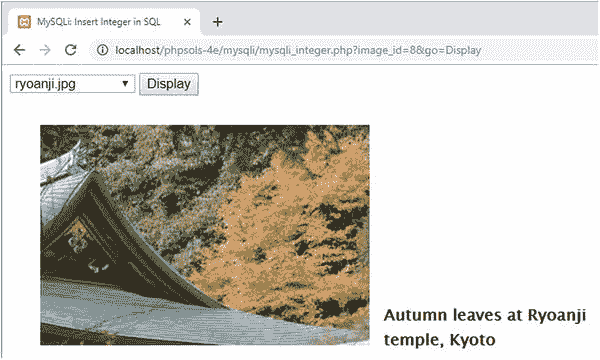

如果遇到问题，请对照 `ch13` 文件夹中的 `mysqli_integer_02.php` 或 `pdo_integer_02.php` 检查你的代码。

5. 在浏览器中编辑查询字符串，将 `image_id` 的值改为一个字符串。你应该会看到“未找到图像”。但是，如果该字符串以 1 到 8 之间的数字开头，你将看到与该数字对应的图像和说明文字。

6. 尝试输入一个介于 1.0 到 8.9 之间的浮点数。对应的图像会正常显示。

7. 尝试输入一个超出 1 到 8 范围的值。不会显示任何错误信息，因为查询本身没有问题。它只是查找一个不存在的值。在这个例子中，这无关紧要。你只会看到一个破损的图像图标。但通常情况下，你应该使用 MySQLi 的 `num_rows` 属性或 PDO 的 `rowCount()` 方法来检查查询返回的行数。

MySQLi 的代码修改如下：

```
$result = $conn->query($sql);
if ($result->num_rows) {
    $row = $result->fetch_assoc();
    ?>
    ">

$error = true;
    }
}
if ($error) {
    echo 'Image not found';
}
} ?>
```

对于 PDO，使用 `$result->rowCount()` 代替 `$result->num_rows`。

如果查询未返回任何行，PHP 会将 0 隐式视为 `false`，因此条件失败，转而执行 `else` 子句，将 `$error` 设为 `true`。

显示“未找到图像”的条件语句本可以移入 `else` 块中，但此脚本包含多个嵌套条件。将其分开处理能让脚本更容易阅读，并便于理解条件逻辑。

8. 再次测试页面。当你从下拉菜单中选择一张图像时，它会像之前一样正常显示。但如果你尝试在查询字符串中输入一个超出范围的值，则会看到以下信息：

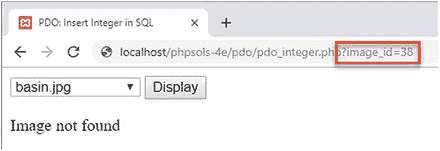

修改后的代码位于 `ch13` 文件夹中的 `mysqli_integer_03.php` 和 `pdo_integer_03.php` 文件。

## 使用预处理语句处理用户输入

MySQLi 和 PDO 都支持预处理语句，这提供了重要的安全特性。预处理语句是一种 SQL 查询模板，它为每个可变的值包含一个占位符。这不仅使在 PHP 代码中嵌入变量更加容易，而且还能防止 SQL 注入攻击，因为在执行查询之前，引号和其他字符会自动被转义。

使用预处理语句的其他优势在于，当同一查询被多次使用时，效率更高。此外，你还可以将 `SELECT` 查询中每个列的结果绑定到命名变量，从而更容易显示输出。

MySQLi 和 PDO 都使用问号作为匿名占位符，如下所示：

```
$sql = 'SELECT image_id, filename, caption FROM images WHERE caption LIKE ?';
```

PDO 还支持使用命名占位符。命名占位符以冒号开头，后跟标识符，如下所示：

```
$sql = 'SELECT image_id, filename, caption FROM images WHERE caption LIKE :search';
```

**注意** 占位符不需要用引号包裹，即使它们代表的值是字符串也是如此。这使得构建 SQL 查询变得容易得多，因为无需担心单引号和双引号的正确组合。

占位符仅能用于列值。它们不能用于 SQL 查询的其他部分，例如列名或运算符。这是因为包含非数字字符的值在执行 SQL 时会自动转义并用引号包裹。列名和运算符不能用引号包裹。

与直接提交查询相比，预处理语句需要稍多的代码，但占位符使 SQL 的读写更容易，且过程更安全。

MySQLi 和 PDO 的语法不同，因此以下部分将分别介绍它们。

## 在 MySQLi 预处理语句中嵌入变量

使用 MySQLi 预处理语句涉及多个阶段。

### 初始化语句

要初始化预处理语句，请在数据库连接上调用 `stmt_init()` 方法并将其存储在一个变量中，如下所示：

```
$stmt = $conn->stmt_init();
```

### 准备语句

然后，将 SQL 查询传递给语句的 `prepare()` 方法。这会检查你是否在错误的位置使用了问号占位符，并确保所有内容整合后，该查询是有效的 SQL。

如果存在任何错误，`prepare()` 方法会返回 `false`，因此通常会将后续步骤包含在条件语句中，以确保仅在所有内容正常时才运行。

可以通过语句的 `error` 属性访问错误信息。

### 将值绑定到占位符

将问号替换为变量中实际值的过程在技术上称为**绑定参数**。正是这一步保护你的数据库免受 SQL 注入攻击。

按照变量插入 SQL 查询的相同顺序，将变量传递给语句的 `bind_param()` 方法，同时传递第一个参数来指定每个变量的数据类型，顺序同样与变量一致。数据类型必须由以下四个字符之一指定：

- `b`：二进制（如图像、Word 文档或 PDF 文件）
- `d`：双精度（浮点数）
- `i`：整数（整数）
- `s`：字符串（文本）

传递给 `bind_param()` 的变量数量必须与问号占位符的数量完全一致。例如，要传递单个字符串值，可以使用：

```
$stmt->bind_param('s', $_GET['words']);
```

要传递两个值，`SELECT` 查询需要两个问号作为占位符，并且两个变量都需要通过 `bind_param()` 绑定，如下所示：

```
$sql = 'SELECT * FROM products WHERE price < ? AND type = ?';
$stmt = $conn->stmt_init();
$stmt->prepare($sql);
$stmt->bind_param('ds', $_GET['price'], $_GET['type']);
```

`bind_param()` 的第一个参数 `'ds'` 指定 `$_GET['price']` 为浮点数，`$_GET['type']` 为字符串。

### 执行语句

一旦语句被准备并且值被绑定到占位符，就调用语句的 `execute()` 方法。然后可以从语句对象中获取 `SELECT` 查询的结果。对于其他类型的查询，此步骤即为过程的终点。

### 绑定结果（可选）

或者，你可以使用 `bind_result()` 方法将 `SELECT` 查询的结果绑定到变量。这避免了提取每一行后，再以 `$row['column_name']` 的形式访问结果的麻烦。


为了绑定结果，你必须在`SELECT`查询中具体地命名每一列。按相同顺序列出你想使用的变量，并将它们作为参数传递给`bind_result()`。例如，假设你的 SQL 看起来像这样：

```php
$sql = 'SELECT image_id, filename, caption FROM images WHERE caption LIKE ?';
```

要绑定查询的结果，请使用以下代码：

```php
$stmt->bind_result($image_id, $filename, $caption);
```

这允许你直接以`$image_id`、`$filename`和`$caption`的形式访问结果。

**存储结果（可选）**

当你对`SELECT`查询使用预处理语句时，结果是无缓冲的。这意味着它们会保留在数据库服务器上，直到你获取它们。这样做的优点是需要更少的内存，特别是在结果集包含大量行的情况下。然而，无缓冲结果施加了以下限制：

*   一旦结果被获取，它们就不再存储在内存中。因此，你不能重复使用同一个结果集。
*   在所有结果被获取或清除之前，你不能在同一数据库连接上运行另一个查询。
*   你不能使用`num_rows`属性来找出结果集中有多少行。
*   你不能使用`data_seek()`来移动到结果集中的特定行。

为了避免这些限制，你可以选择使用语句的`store_result()`方法来存储结果集。但是，如果你只是想立即显示结果而不在以后重用，则无需先存储它。

> **注意**
> 要清除无缓冲结果，请调用语句的`free_result()`方法。

**获取结果**

要循环遍历已经通过预处理语句执行的`SELECT`查询的结果，请使用`fetch()`方法。如果你已将结果绑定到变量，请像这样操作：

```php
while ($stmt->fetch()) {
    // 显示每一行的绑定变量
}
```

如果你没有将结果绑定到变量，请使用`$row = $stmt->fetch()`并将每个变量作为`$row['column_name']`访问。

**关闭语句**

当你完成预处理语句的使用后，`close()`方法会释放使用的内存。

**PHP 解决方案 13-7：在搜索中使用 MySQLi 预处理语句**

此 PHP 解决方案展示了如何将 MySQLi 准备好的语句与`SELECT`查询一起使用；它还演示了将结果绑定到命名变量。

1.  从`ch13`文件夹复制`mysqli_prepared_01.php`，并将其保存到`mysqli`文件夹中，名称为`mysqli_prepared.php`。该文件包含一个搜索表单和一个用于显示结果的表格。

2.  在`DOCTYPE`声明上方的 PHP 代码块中，创建一个条件语句以包含`connection.php`和`utility_funcs.php`，并在提交搜索表单时创建一个只读连接。代码如下所示：

```php
if (isset($_GET['go'])) {
    require_once '../includes/connection.php';
    require_once '../includes/utility_funcs.php';
    $conn = dbConnect('read');
}
```

3.  接下来，在条件语句内部添加 SQL 查询。该查询需要命名你要从`images`表中检索的三列。使用问号作为搜索词的占位符，如下所示：

```php
$sql = 'SELECT image_id, filename, caption FROM images
WHERE caption LIKE ?';
```

4.  在将用户提交的搜索词传递给`bind_param()`方法之前，你需要向其中添加通配符并将其分配给一个新变量，如下所示：

```php
$searchterm = '%'. $_GET['search'] .'%';
```

5.  你现在可以创建预处理语句。`DOCTYPE`声明上方的 PHP 块中的完成代码如下所示：

```php
if (isset($_GET['go'])) {
    require_once '../includes/connection.inc.php';
    $conn = dbConnect('read');
    $sql = 'SELECT image_id, filename, caption FROM images
    WHERE caption LIKE ?';
    $searchterm = '%'. $_GET['search'] .'%';
    $stmt = $conn->stmt_init();
    if ($stmt->prepare($sql)) {
        $stmt->bind_param('s', $searchterm);
        $stmt->execute();
        $stmt->bind_result($image_id, $filename, $caption);
        $stmt->store_result();
        $numRows = $stmt->num_rows;
    } else {
        $error = $stmt->error;
    }
}
```

这将初始化预处理语句并将其分配给`$stmt`。然后， SQL 查询被传递给`prepare()`方法，该方法检查查询语法的有效性。如果语法有问题，`else`块会将错误消息分配给`$error`。如果语法没有错误，则执行条件语句内的其余脚本。

条件语句内的第一行将`$searchterm`绑定到`SELECT`查询，替换问号占位符。第一个参数告诉预处理语句将其视为字符串。

执行预处理语句后，下一行将`SELECT`查询的结果绑定到`$image_id`、`$filename`和`$caption`。这些变量需要与查询中的顺序相同。我已将变量命名为它们所代表的列，但你可以使用任何你想要的变量。

然后存储结果。请注意，你只需调用语句对象的`store_result()`方法即可存储结果。与使用`query()`不同，你不需要将`store_result()`的返回值分配给变量。如果你这样做，它只是`true`或`false`，具体取决于结果是否成功存储。

最后，从语句对象的`num_rows`属性获取查询检索到的行数，并将其存储在`$numRows`中。

6.  在开始的`<body>`标签之后添加一个条件语句，以便在发生问题时显示错误消息：

```php
<?php if (isset($error)) {
    echo "<p>$error</p>";
} ?>
```

7.  在搜索表单之后添加以下代码以显示结果：

```php
<?php if (isset($numRows)) { ?>
    <h2>Number of results for "<?= $_GET['search'] ?>": <?= $numRows ?></h2>
    <?php if ($numRows) { ?>
        <table>
            <tr>
                <th>image_id</th>
                <th>filename</th>
                <th>caption</th>
            </tr>
            <?php while ($stmt->fetch()) { ?>
                <tr>
                    <td><?= $image_id ?></td>
                    <td><?= $filename ?></td>
                    <td><?= $caption ?></td>
                </tr>
            <?php } ?>
        </table>
    <?php } ?>
<?php } ?>
```

第一个条件语句包裹着段落和表格，防止它们在`$numRows`不存在时显示（当页面首次加载时会发生这种情况）。如果表单已提交，则会设置`$numRows`，因此会重新显示搜索词，并且`$numRows`的值会报告匹配的数量。

如果查询没有返回结果，`$numRows`为 0，它被视为`false`，因此表格不会显示。如果`$numRows`包含任何非零值，则会显示表格。显示结果的`while`循环调用预处理语句的`fetch()`方法。无需将当前记录存储为`$row`，因为每列的值已绑定到`$image_id`、`$filename`和`$caption`。

8.  保存页面并将其加载到浏览器中。在搜索字段中输入一些文本，然后单击`Search`。结果数量将与包含搜索词的所有标题一起显示，如以下屏幕截图所示：

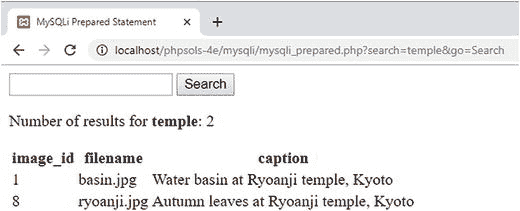

你可以将你的代码与`ch13`文件夹中的`mysqli_prepared_02.php`进行比较。

**在 PDO 预处理语句中嵌入变量**

PDO 预处理语句提供匿名和命名占位符两种选择。

**使用匿名占位符**

匿名占位符的使用方式与 MySQLi 完全相同，都使用问号：

```php
$sql = 'SELECT image_id, filename, caption FROM images WHERE caption LIKE ?';
```

**使用命名占位符**

命名占位符以冒号开头，像这样：


```sql
$sql = 'SELECT image_id, filename, caption FROM images WHERE caption LIKE :search';
```

使用命名占位符（named placeholders）使代码更易于理解，特别是当你选择基于包含要嵌入 SQL 的值的变量名时。

### 准备语句（Preparing the statement）

准备和初始化语句在一个步骤中完成（与需要两个步骤的 MySQLi 不同）。你将带有占位符的 SQL 直接传递给连接对象的`prepare()`方法，该方法返回准备好的语句，如下所示：

```php
$stmt = $conn->prepare($sql);
```

### 将值绑定到占位符（Binding values to the placeholders）

有几种不同的方法可以将值绑定到占位符。使用匿名占位符时，最简单的方法是创建一个与占位符顺序相同的值数组，然后将该数组传递给语句的`execute()`方法。即使只有一个占位符，也必须使用数组。例如，要将`$searchterm`绑定到一个匿名占位符，你必须用方括号将它括起来，如下所示：

```php
$stmt->execute([$searchterm]);
```

你也可以类似地将值绑定到命名占位符，但传递给`execute()`方法的参数必须是一个关联数组，使用命名占位符作为每个值的键。因此，以下代码将`$searchterm`绑定到`:search`命名占位符：

```php
$stmt->execute([':search' => $searchterm]);
```

或者，你可以使用语句的`bindParam()`和`bindValue()`方法在调用`execute()`方法之前绑定值。当与匿名占位符一起使用时，这两个方法的第一个参数是一个数字（从 1 开始计数），表示占位符在 SQL 中的位置。对于命名占位符，第一个参数是作为字符串的命名占位符。第二个参数是你要插入到查询中的值。

然而，这两种方法之间有一个微妙的区别：

*   使用`bindParam()`时，第二个参数*必须*是一个变量。它不能是字符串、数字或任何其他类型的表达式。
*   使用`bindValue()`时，第二个参数应该是一个字符串、数字或表达式。但它也可以是一个变量。

由于`bindValue()`接受任何类型的值，`bindParam()`可能显得多余。区别在于，传递给`bindValue()`的参数的值必须是已知的，因为它绑定的是实际值，而`bindParam()`只绑定变量。因此，该值可以在之后赋值给变量。

为了说明区别，我们使用“使用命名占位符”中的`SELECT`查询。`:search`占位符跟在`LIKE`关键字之后，因此该值需要与通配符组合。试图执行以下操作会产生错误：

```php
// 这不会生效
$stmt->bindParam(':search', '%'. $_GET['search'] .'%');
```

你无法使用`bindParam()`将通配符连接到变量上。通配符需要在变量作为参数传递之前添加，如下所示：

```php
$searchterm = '%'. $_GET['search'] .'%';
$stmt->bindParam(':search', $searchterm);
```

或者，你可以将表达式构建为`bindValue()`的参数。

```php
// 这会生效
$stmt->bindValue(':search', '%'. $_GET['search'] .'%');
```

`bindParam()`和`bindValue()`方法接受一个可选的第三个参数：一个指定数据类型的常量。主要的常量如下：

*   `PDO::PARAM_INT`：整数（整型）
*   `PDO::PARAM_LOB`：二进制（如：图像、Word 文档或 PDF 文件）
*   `PDO::PARAM_STR`：字符串（文本）
*   `PDO::PARAM_BOOL`：布尔值（真或假）
*   `PDO::PARAM_NULL`：空值

`PDO::PARAM_NULL`在你想将数据库列的值设置为`null`时非常有用。例如，如果主键是自动递增的，你需要在插入新记录时传递`null`作为值。以下是使用`bindValue()`将名为`:id`的命名参数设置为`null`的方法：

```php
$stmt->bindValue(':id', NULL, PDO::PARAM_NULL);
```

注意：没有一个用于浮点数的 PDO 常量。

### 执行语句（Executing the statement）

如果你使用`bindParam()`或`bindValue()`将值绑定到占位符，你只需调用不带参数的`execute()`方法：

```php
$stmt->execute();
```

否则，按上一节所述传递一个值数组。在这两种情况下，查询的结果都存储在`$stmt`中。

错误信息的访问方式与 PDO 连接相同。但是，不是在连接对象上调用`errorInfo()`方法，而是在 PDO 语句对象上使用它，如下所示：

```php
$error = $stmt->errorInfo()[2];
```

如果没有错误，`$error`将为`null`。否则，它将包含一个描述问题的字符串。

### （可选）绑定结果（Binding the results (optional)）

要将`SELECT`查询的结果绑定到变量，每个列需要使用`bindColumn()`方法单独绑定，该方法接受两个参数。第一个参数可以是列的名称，也可以是从 1 开始计数的列编号。该编号来自`SELECT`查询中的列位置，而不是其在数据库表中的显示顺序。因此，要将我们一直使用的 SQL 示例中的`filename`列的结果绑定到`$filename`，以下两种方式都是可以接受的：

```php
$stmt->bindColumn('filename', $filename);
$stmt->bindColumn(2, $filename);
```

因为每个列是单独绑定的，所以不需要绑定所有列。然而，这样做会更方便，因为它避免了将`fetch()`方法的结果赋值给数组。

### 获取结果（Fetching the result）

要获取`SELECT`查询的结果，请调用语句的`fetch()`方法。如果你使用了`bindColumn()`将输出绑定到变量，你可以直接使用这些变量。否则，它将返回一个当前行的数组，该数组既可以通过列名索引，也可以通过从 0 开始的列编号索引。

注意：你可以通过向 PDO 的`fetch()`方法传递一个常量作为参数来控制其输出类型。请参阅[`https://php.net/manual/en/pdostatement.fetch.php`](https://php.net/manual/en/pdostatement.fetch.php)。

## PHP 解决方案 13-8：在搜索中使用 PDO 预处理语句（Using a PDO Prepared Statement in a search）

该 PHP 解决方案展示了如何将用户从搜索表单提交的值嵌入到带有 PDO 预处理语句的`SELECT`查询中。它使用了与 PHP 解决方案 13-7 中 MySQLi 版本相同的搜索表单。

1.  从`ch13`文件夹复制`pdo_prepared_01.php`并将其保存到`pdo`文件夹中，命名为`pdo_prepared.php`。
2.  在`DOCTYPE`声明上方的 PHP 代码块中添加以下代码：

```php
if (isset($_GET['go'])) {
    require_once '../includes/connection.php';
    require_once '../includes/utility_funcs.php';
    $conn = dbConnect('read', 'pdo');
    $sql = 'SELECT image_id, filename, caption FROM images
    WHERE caption LIKE :search';
    $stmt = $conn->prepare($sql);
    $stmt->bindValue(':search', '%' . $_GET['search'] . '%');
    $stmt->execute();
    $error = $stmt->errorInfo()[2];
    if (!$error) {
        $stmt->bindColumn('image_id', $image_id);
        $stmt->bindColumn('filename', $filename);
        $stmt->bindColumn(3, $caption);
        $numRows = $stmt->rowCount();
    }
}
```

当表单被提交时，此代码包含连接文件并创建一个 `PDO` 只读连接。预处理语句使用`:search`作为命名参数，代替用户提交的值。

`%`通配符在绑定到预处理语句的同时与搜索词连接。因此，这里使用了`bindValue()`而不是`bindParam()`。

在语句执行后，调用语句的`errorInfo()`方法，查看是否生成了错误信息并存储在`$errorInfo[2]`中。
```


如果没有问题，结果会通过`bindColumn()`方法绑定到`$image_id`、`$filename`和`$caption`。前两个使用列名，但`caption`列通过其在`SELECT`查询中的位置（从 1 开始计数）来引用。

3. 显示结果的代码与 PHP Solution 13-7 中的步骤 6 和 7 完全相同。你可以在`ch13`文件夹中的`pdo_prepared_02.php`中查看完整的代码。

## PHP Solution 13-9: 调试 PDO 预处理语句

有时，数据库查询不会产生预期的结果。当这种情况发生时，查看脚本实际发送到数据库服务器的内容会很有帮助。对于 MySQLi，没有简单的方法来检查预处理语句插入到 SQL 查询中的值。但对于 PDO，这非常容易——前提是你的服务器运行的是 PHP 7.2 或更高版本。

1. 继续使用上一个 PHP 解决方案中的`pdo_prepared.php`。或者，将`ch13`文件夹中的`pdo_prepared_02.php`复制到`pdo`文件夹，并将其重命名为`pdo_prepared.php`。

2. 修改结束的`</table>`标签后的代码，如下所示：

```
    ';
    $stmt->debugDumpParams();
    echo '';
    }
    ?>
    ```

这会插入一对`<pre>`标签，使`PDOStatement`对象的`debugDumpParams()`方法的输出更易读。

3. 保存文件，在浏览器中加载它，并执行搜索。除了搜索结果之外，你应该会看到类似以下截图的输出：

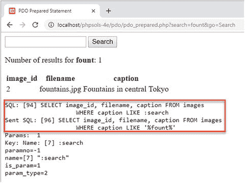

SQL 查询显示了两次。第一次显示的是 PHP 代码中的查询——在本例中，包括命名参数`:search`。第二次显示的是实际发送到数据库服务器的值。

在本例中，搜索"fount"返回了一个以"Fountains"开头的标题。如果这是你期望的结果，那没问题。但假设你只想要精确匹配，看到`%`通配符就能解释这个意外结果，从而更容易调试那些未产生预期结果的预处理语句问题。

你可以将代码与`ch13`文件夹中的`pdo_prepared_03.php`进行比较。

> **注意**
> 在调用`debugDumpParams()`之前，务必先调用`execute()`方法。PHP 7.2 之前的版本只显示带有匿名或命名参数的预处理语句。

## PHP Solution 13-10: 通过用户输入更改列选项

此 PHP 解决方案演示如何通过用户输入更改`SELECT`查询中的 SQL 关键字名称。SQL 关键字不能用引号括起来，因此使用预处理语句不起作用。相反，你需要确保用户输入与预期值的数组匹配。如果找不到匹配项，则使用默认值。该技术对 MySQLi 和 PDO 相同。

1. 从`ch13`文件夹中复制`mysqli_order_01.php`或`pdo_order_01.php`，并将其保存到`mysqli`或`pdo`文件夹中。两个版本都从`images`表中选择所有记录，并在表格中显示结果。页面还包含一个表单，允许用户选择用于按升序或降序排列结果的列名。在初始状态下，表单处于非活动状态。页面默认按`image_id`升序显示详细信息，如下所示：

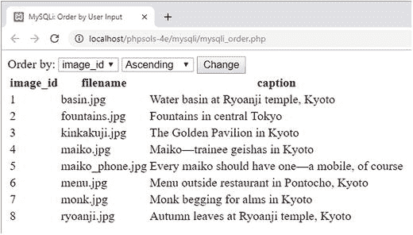

1. 修改`DOCTYPE`声明上方 PHP 块中的代码，如下所示（以下清单显示的是 PDO 版本，但以**粗体**突出显示的更改对于 MySQLi 是相同的）：

```
    require_once '../includes/connection.php';
    require_once '../includes/utility_funcs.php';
    // connect to database
    $conn = dbConnect('read', 'pdo');
    // set default values
    $col = 'image_id';
    $dir = 'ASC';
    // create arrays of permitted values
    $columns = ['image_id', 'filename', 'caption'];
    $direction = ['ASC', 'DESC'];
    // if the form has been submitted, use only expected values
    if (isset($_GET['column']) && in_array($_GET['column'], $columns)) {
    $col = $_GET['column'];
    }
    if (isset($_GET['direction']) && in_array($_GET['direction'], $direction)) {
    $dir = $_GET['direction'];
    }
    // prepare the SQL query using sanitized variables
    $sql = "SELECT * FROM images
    ORDER BY $col $dir";
    // submit the query and capture the result
    $result = $conn->query($sql);
    $error = $conn->errorInfo()[2];
    ```

新代码定义了两个变量`$col`和`$dir`，它们直接嵌入到`SELECT`查询中。由于它们已分配了默认值，当页面首次加载时，查询会按`image_id`列升序显示结果。

然后，两个数组`$columns`和`$direction`定义了允许的值：列名以及`ASC`和`DESC`关键字。条件语句使用这些数组来检查`$_GET`数组中的`column`和`direction`。提交的值仅在与`$columns`和`$direction`数组中的值匹配时，才会重新赋值给`$col`和`$dir`。这可以防止任何尝试向 SQL 查询注入非法值的行为。

2. 编辑下拉菜单中的`<option>`标签，使其显示`$col`和`$dir`的选中值，如下所示：

```

>image_id

>filename

>caption

>Ascending

>Descending

```

3. 保存页面并在浏览器中测试。你可以通过选择下拉菜单中的值并点击`Change`来更改显示的排序顺序。但是，如果你尝试通过查询字符串注入非法值，页面将使用`$col`和`$dir`的默认值，以按`image_id`升序显示结果。

你可以对照`ch13`文件夹中的`mysqli_order_02.php`和`pdo_order_02.php`来检查你的代码。

## 章节回顾

PHP 7 提供了两种与 MySQL 通信的方法：

*   **MySQL 改进版 (MySQLi) 扩展**：建议所有新的 MySQL 项目使用它。它比从 PHP 7 中移除的原始 MySQL 扩展效率更高。它具有预处理语句的附加安全性，并且与 MariaDB 完全兼容。
*   **PHP 数据对象 (PDO) 抽象层，它是数据库中立的**：这是我首选的与数据库通信的方法。它不仅数据库中立，而且具有为预处理语句使用命名参数的优势，使代码更易于阅读和理解。此外，在 PHP 7.2 及更高版本中调试预处理语句非常简单。尽管代码是数据库中立的，但 PDO 需要为所选数据库安装正确的驱动程序。MySQL 的驱动程序与 MariaDB 完全兼容，并且通常已安装。其他驱动程序不太常见。但是，如果安装了正确的驱动程序，只需更改连接字符串中的数据源名称 (DSN)，即可从一个数据库切换到另一个数据库。


# 14. 创建动态相册

尽管 PHP 能与数据库通信并存储结果，但查询仍需使用 SQL 编写——这是查询关系型数据库的标准语言。本章展示了如何通过`SELECT`语句检索数据库表中的信息，利用`WHERE`子句细化搜索条件，并使用`ORDER BY`改变排序顺序。你还学习了几种防止 SQL 注入的查询保护技术，包括使用占位符替代直接嵌入变量的预处理语句。

在下一章中，你将通过创建在线相册将所学知识付诸实践。

上一章主要侧重于以文本形式提取`images`表的内容。本章将在此基础上发展，构建图 14-1 所示的迷你相册。


*图 14-1. 该迷你相册通过从数据库提取信息驱动*

该相册还展示了一些你可能会想引入文本驱动页面的炫酷功能。例如，左侧的缩略图网格每行显示两张图片。只需修改两个数字，你就可以随心所欲地调整网格的列数和行数。点击任意缩略图会替换主图像和说明文字。虽然重新加载的是同一页面，但使用的技术完全相同——在线商品目录正是通过这种技术跳转至包含更多产品详情的页面。缩略图网格底部的“下一页”链接可显示下一组照片，其原理与你浏览长串搜索结果时翻页的技术完全一致。这个相册绝非徒有虚表……本章涵盖以下内容：

- 理解为何将图像存储在数据库中并非良策，以及应采用的替代方案
- 规划动态相册的布局
- 在表格行中显示固定数量的结果
- 限制每次检索的记录数量
- 对长串结果进行分页浏览

## 为何不将图像存储在数据库？

`images`表包含文件名和说明文字，但不包含图像本身。尽管你可以将二进制对象（如图像）存储在数据库中，但我并不打算这样做，原因很简单——这通常弊大于利。主要问题如下：

- 若不单独存储文本信息，则无法对图像进行索引或搜索。
- 图像通常体积较大，会膨胀表的大小。如果数据库存储空间有限，你可能会面临空间不足的风险。
- 若频繁删除图像，表碎片化会影响性能。
- 从数据库检索图像需将图像传递给独立脚本，这会拖慢网页显示速度。

更高效的做法是将图像存储在你的网站普通文件夹中，并使用数据库存储图像的相关信息。你只需要两样东西：文件名和可同时用作`alt`文本的说明文字。一些开发者会将图像的完整路径存入数据库，但我认为仅存储文件名能提供更大的灵活性。`images`文件夹的路径将被嵌入 HTML 中。无需存储图像的宽度和高度。正如你在第 5 章和第 10 章中看到的，你可以使用 PHP 的`getimagesize()`函数动态生成这些信息。

## 规划相册

我发现设计数据库驱动网站的最佳方式是从静态页面开始，并用占位符文本和图像填充内容。然后创建 CSS 样式规则，使页面达到理想效果，最后将每个占位符元素替换为 PHP 代码。每次替换后，我都会在浏览器中检查页面，确保一切正常。

图 14-2 展示了我制作的静态相册模型，并标出了需要转换为动态代码的元素。这些图像与第 5 章中随机图像生成器使用的图像相同，且尺寸各不相同。我尝试过缩放图像来创建缩略图，但觉得结果过于杂乱，因此将缩略图设为标准尺寸（80 × 54 像素）。此外，为了方便起见，我为每个缩略图赋予了与大版本相同的文件名，并将它们存储在`images`文件夹下一个名为`thumbs`的子文件夹中。

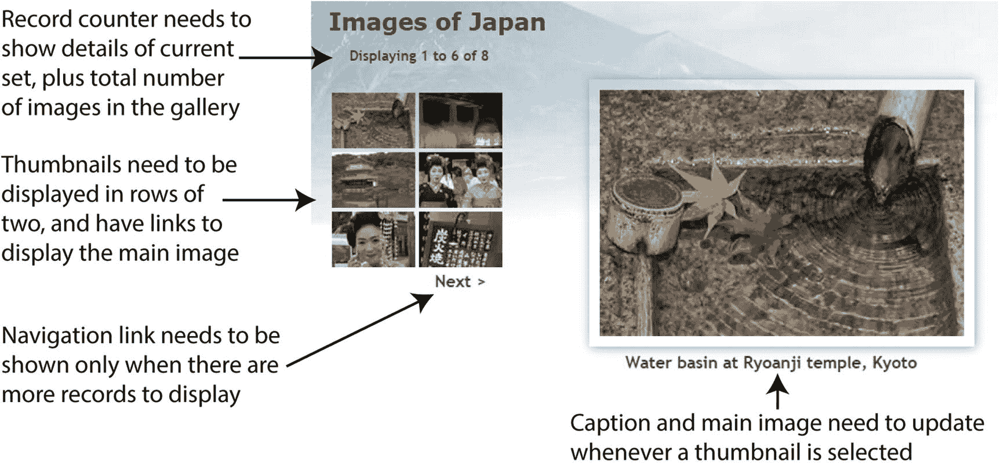

*图 14-2. 明确将静态相册转换为动态相册所需完成的工作*

在上一章中，显示`images`表的内容很简单。你创建了一个单行表格，每个字段的内容放在单独的表格单元格中。通过循环遍历结果集，每条记录都显示在独立行中，模拟了数据库表的列结构。但这次，缩略图网格的两列结构不再与数据库结构匹配。在创建下一行之前，你需要计数一行中已插入的缩略图数量。

确定需要完成的工作后，我删除了缩略图 2 到 6 以及导航链接的代码。以下代码清单显示了`gallery.php`中`<main>`元素剩余的内容，其中需要转换为 PHP 代码的元素以粗体突出显示（你可以在`ch14`文件夹的`gallery_01.php`中找到该代码）：

```
日本映像
正在显示 1 到 6 项，共 8 项

京都龙安寺的水钵
```

## 将相册元素转换为 PHP

在显示相册内容之前，你需要连接到`phpsols`数据库并检索`images`表中存储的所有记录。执行此操作的步骤与上一章相同，使用以下简单的 SQL 查询：

```
SELECT filename, caption FROM images
```

然后，你可以使用第一条记录来显示第一张图像及其关联的说明文字和缩略图。你不需要`image_id`。

### PHP 解决方案 14-1：显示第一张图像

如果你在第 5 章中设置了 Japan Journey 网站，可以直接使用原始的`gallery.php`。或者，从`ch14`文件夹复制`gallery_01.php`，并将其保存到`phpsols-4e`站点根目录下，命名为`gallery.php`。你还需要将`title.php`、`menu.php`和`footer.php`复制到`phpsols-4e`站点的`includes`文件夹中。如果你的编辑程序询问是否要更新文件中的链接，请选择不更新。

1. 在浏览器中加载`gallery.php`，确保其正确显示。页面主要部分应如图 14-3 所示，包含一张缩略图及其同图的大尺寸版本。


*图 14-3. 静态相册的简化版本，准备进行转换*

2. 相册依赖于数据库连接，因此请包含`connection.php`，创建到`phpsols`数据库的只读连接，并定义 SQL 查询。在`gallery.php`中`DOCTYPE`声明上方的关闭 PHP 标签之前添加以下代码（新代码以粗体突出显示）：


```php
include './includes/title.php';
require_once './includes/connection.php';
require_once './includes/utility_funcs.php';
$conn = dbConnect('read');
$sql = 'SELECT filename, caption FROM images';
```

如果使用 PDO，请将 `'pdo'` 作为第二个参数传递给 `dbConnect()`。

3.  提交查询并从结果中提取第一条记录的代码取决于你使用的连接方法。对于 MySQLi，请使用以下代码：

```php
// 提交查询
$result = $conn->query($sql);
if (!$result) {
    $error = $conn->error;
} else {
    // 将第一条记录提取为数组
    $row = $result->fetch_assoc();
}
```

对于 PDO，请使用以下代码：

```php
// 提交查询
$result = $conn->query($sql);
// 获取所有错误信息
$error = $conn->errorInfo()[2];
if (!$error) {
    // 将第一条记录提取为数组
    $row = $result->fetch();
}
```

要在页面加载时显示第一张图片，你需要在创建最终将显示缩略图网格的循环之前，先检索第一个结果。MySQLi 和 PDO 的代码都会提交查询、提取第一条记录，并将其存储在 `$row` 中。

4.  现在，第一条记录图片的详细信息已存储为 `$row['filename']` 和 `$row['caption']`。除了文件名和说明外，你还需要大图的尺寸，以便在页面主体中显示。在提取第一个结果的代码之后，立即在 `else` 代码块中添加以下代码：

```php
// 获取主图的名称和说明
$mainImage = safe($row['filename']);
$caption = safe($row['caption']);
// 获取主图的尺寸
$imageSize = getimagesize('images/'.$mainImage)[3];
```

数据库中的文本值通过上一章定义的 `safe()` 函数进行清洗。

如第 10 章所述，`getimagesize()` 返回一个数组，其第四个元素包含一个字符串，该字符串包含图片的宽度和高度，可用于插入到 `` 标签中。我们只对第四个元素感兴趣，因此可以使用第 7 章介绍的数组解引用技术。在 `getimagesize()` 的右括号后添加 `[3]` 将只返回数组的第四个元素，并将其赋给 `$imageSize`。

5.  现在，你可以利用这些信息动态显示缩略图、主图和说明。主图和缩略图名称相同，但你最终需要通过遍历整个结果集来显示所有缩略图。因此，放在表格单元格中的动态代码需要引用当前记录——换句话说，是 `$row['filename']` 和 `$row['caption']`，而不是 `$mainImage` 和 `$caption`。它们还需要通过传递给 `safe()` 函数进行清洗。稍后你会明白我为什么将第一条记录的值赋给了单独的变量。请像这样修改表格中的代码：

```html
" alt='' width='80' height='54'>
```

6.  如果查询出现问题，你需要检查 `$error` 是否等于 `true`，并阻止画廊的显示。在 `<h2>` Japan 图片标题之后，立即添加一个包含以下条件语句的 PHP 块：

```php
<?= $error ?>
<?php } else { ?>
```

**提示** 尽管步骤 3 中 PDO 版本的脚本为 `$error` 赋了值，但你可以在此处使用 `isset($error)`，因为如果查询成功执行，其值为 `null`。向 `isset()` 传递 `null` 会返回 `false`。

7.  在结束的 `</main>` 标签之前（大约第 55 行）插入一个新行，并添加一个包含 `else` 块右花括号的 PHP 块：

```php
<?php } ?>
```

8.  保存 `gallery.php` 并在浏览器中查看。它看起来应该与图 14-3 相同。唯一的区别是缩略图及其 `alt` 文本是动态生成的。你可以通过查看源代码来验证这一点。原始的静态版本有一个空的 `alt` 属性，但如下面的截图所示，它现在包含了第一条记录的说明：

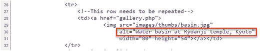

如果出现问题，请确保图片的 `src` 属性中静态文本和动态生成的文本之间没有间隙。同时检查你是否使用了与数据库所创建连接类型对应的正确代码。你可以将代码与 `ch14` 文件夹中的 `gallery_mysqli_02.php` 或 `gallery_pdo_02.php` 进行对照。

1.  确认你已成功从数据库获取详细信息后，就可以转换主图的代码。像这样修改它（新代码以粗体显示）：

```php
" alt='' >
```

`$mainImage` 和 `$caption` 不需要传递给 `safe()` 函数，因为它们已经在步骤 4 中被清洗过了。

`$imageSize` 会插入一个包含主图正确 `width` 和 `height` 属性的字符串。

2.  再次测试页面。它看起来应该与图 14-3 相同，但图片和说明是从数据库动态提取的，并且 `getimagesize()` 正在计算主图的正确尺寸。你可以将代码与 `ch14` 文件夹中的 `gallery_mysqli_03.php` 或 `gallery_pdo_03.php` 进行对照。

## 构建动态元素

转换静态页面后的第一个任务是显示所有缩略图，然后构建动态链接，以便能够显示任何被点击的缩略图的大图版本。显示所有缩略图很容易——只需遍历它们即可（我们稍后会研究如何将它们以两行一组的格式显示）。激活每个缩略图的链接则需要多考虑一些。你需要一种方法来告诉页面要显示哪张大图。

### 通过查询字符串传递信息

在上一节中，你使用 `$mainImage` 来标识大图，因此你需要一种在每次点击缩略图时改变其值的方法。解决方案是将图片的文件名添加到链接 URL 末尾的查询字符串中，如下所示：

```html
<a href='gallery.php?image=filename.jpg'>
```

然后，你可以检查 `$_GET` 数组是否包含一个名为 `image` 的元素。如果包含，则更改 `$mainImage` 的值。如果不包含，则保持 `$mainImage` 为结果集中第一条记录的文件名。

### PHP 解决方案 14-2：激活缩略图

继续使用上一节中的同一个文件。或者，将 `gallery_mysqli_03.php` 或 `gallery_pdo_03.php` 复制到 `phpsols-4e` 站点根目录，并将其保存为 `gallery.php`。

1.  找到包裹缩略图的链接的起始 `<a>` 标签。它看起来像这样：

```php
<?php
```

将其更改为：

```php
<?php
echo "<a href='gallery.php?image={$row['filename']}'>";
```

这会在 `href` 属性的末尾添加一个查询字符串，将当前文件名赋给一个名为 `image` 的变量。确保 `?image=` 周围没有空格至关重要。

2.  保存页面并在浏览器中加载。将鼠标指针悬停在缩略图上，并检查状态栏中显示的 URL。它应该如下所示：

```
http://localhost/phpsols-4e/gallery.php?image=basin.jpg
```

如果状态栏中没有显示任何内容，请点击缩略图。页面不应改变，但地址栏中的 URL 现在应该包含查询字符串。检查 URL 或查询字符串中是否有间隙。


3.  要显示所有缩略图，你需要将表格单元格包裹在一个循环中。在关于重复行的 HTML 注释后插入一个新行，并创建一个`do... while`循环的前半部分，如下所示（有关不同类型循环的详细信息，请参见第 4 章）：

4.  结果集中第一条记录的详细信息已经获取，因此获取后续记录的代码需要放在结束的`</td>`标签之后。在结束的`</td>`和`</tr>`标签之间留出一些空间，并插入以下代码。对于不同的数据库连接方法，代码略有不同。

    对于 MySQLi，请使用以下代码：

    ```
    <?php $row = $result->fetch_assoc()); ?>
    ```

    对于 PDO，请使用以下代码：

    ```
    <?php $row = $result->fetch()); ?>
    ```

    这会获取结果集中的下一行，并将循环送回顶部。由于`$row['filename']`和`$row['caption']`的值不同，下一个缩略图及其关联的`alt`文本将被插入到一个新的表格单元格中。查询字符串也会用新的文件名进行更新。

5.  保存页面并在浏览器中测试。现在你应该能看到所有八个缩略图在画廊顶部排成一行，如下面的截图所示。

    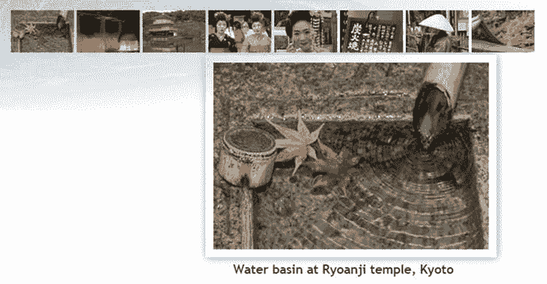

    将鼠标指针悬停在每个缩略图上，你应该能看到查询字符串显示文件名。你可以对照`gallery_mysqli_04.php`或`gallery_pdo_04.php`检查你的代码。

6.  点击缩略图仍然没有任何反应，因此你需要创建改变主图像及其关联说明文的逻辑。在`DOCTYPE`声明上方的代码块中找到以下代码段：

    ```
    // 获取主图像的文件名和说明文
    $mainImage = safe($row['filename']);
    $caption = safe($row['caption']);
    ```

    高亮定义`$caption`的那一行并将其剪切到剪贴板。将另一行包裹在如下条件语句中：

    ```
    // 获取主图像的文件名
    if (isset($_GET['image'])) {
        $mainImage = safe($_GET['image']);
    } else {
        $mainImage = safe($row['filename']);
    }
    ```

    `$_GET`数组包含通过查询字符串传递的值，因此如果设置了（定义了）`$_GET['image']`，它会从查询字符串中获取文件名并将其存储为`$mainImage`。如果`$_GET['image']`不存在，则像之前一样从结果集中的第一条记录中获取值。

7.  最后，你需要获取主图像的说明文。它不再每次都相同，因此你需要将其移动到`thumbs`表中显示缩略图的循环中。它应紧跟在循环的左花括号之后（大约第 48 行）。将光标定位在花括号之后并插入几行，然后粘贴你在上一步中剪切的说明文定义。你需要让说明文与主图像匹配，因此如果当前记录的文件名与`$mainImage`相同，那就是你要找的。将刚刚粘贴的代码包裹在如下条件语句中：

8.  保存页面并在浏览器中重新加载。这次，当你点击一个缩略图时，主图像和说明文将会改变。不用担心某些图像和说明文被页脚遮挡。当缩略图移动到主图像的左侧时，这种情况会自动修正。

    **注意** 像这样通过查询字符串传递信息是使用 PHP 和数据库结果的一个重要方面。虽然表单信息通常通过`$_POST`数组传递，但`$_GET`数组经常用于传递你想要显示、更新或删除的记录详情。它也常用于搜索，因为查询字符串可以轻松地添加书签。

9.  在这种情况下没有 SQL 注入的危险。但是，如果有人改变了通过查询字符串传递的文件名的值，并且`display_errors`处于开启状态，那么在找不到图像时你将会看到难看的错误消息。在调用`getimagesize()`之前，让我们先检查图像是否存在。将其包裹在如下条件语句中：

    ```
    if (file_exists('images/'.$mainImage)) {
        // 获取主图像的尺寸
        $imageSize = getimagesize('images/'.$mainImage)[3];
    } else {
        $error = 'Image not found.';
    }
    ```

10. 尝试将查询字符串中`image`的值改为除存在文件之外的任何值。当你加载页面时，应该会看到`Image not found`。

    如有必要，请对照`gallery_mysqli_05.php`或`gallery_pdo_05.php`检查你的代码。

## 创建多列表格

只有八张图像时，画廊顶部单行缩略图的显示效果还不算太差。然而，能够通过使用一个循环动态构建表格是非常有用的，该循环在移动到下一行之前，会在当前行中插入指定数量的表格单元格。这是通过记录已经插入了多少个单元格来实现的。当一行达到限制时，代码需要为当前行插入一个结束标签，并且如果还有更多缩略图，还需要为下一行插入一个开始标签。使其易于实现的是取模运算符`%`，它返回除法的余数。

其工作原理如下。假设每行需要两个单元格。插入第一个单元格后，计数器设置为`1`。如果用取模运算符将`1`除以`2`（`1 % 2`），结果是`1`。当插入下一个单元格时，计数器增加到`2`。`2 % 2`的结果是`0`。下一个单元格产生这个计算：`3 % 2`，结果是`1`；但第四个单元格产生`4 % 2`，结果又是`0`。因此，每次计算结果为`0`时，你就知道——更准确地说，PHP 知道——到达了一行的末尾。

那么，如何知道是否还有剩余的行呢？通过将插入关闭和开启`<tr>`标签的代码放在循环的顶部，必须始终至少剩下一张图像。然而，循环第一次运行时，余数也是`0`，所以问题在于你需要等到至少显示了一张图像后才能插入这些标签。呼……让我们试一试。

## PHP 解法 14-3：水平和垂直循环

这个 PHP 解法展示了如何控制循环，以便在表格中显示特定数量的列。列数通过设置一个常量来控制。继续使用上一节中的文件。或者，使用`gallery_mysqli_05.php`或`gallery_pdo_05.php`。

1.  你可能会在稍后阶段决定改变表格中的列数，因此在脚本顶部创建一个常量是个好主意，这样便于查找，而不是将数字深埋在代码中。在创建数据库连接之前插入以下代码：

    ```
    // 定义表格中的列数
    define('COLS', 2);
    ```

    **常量**与变量类似，不同之处在于其值不能被脚本的其他部分更改。你可以通过`define()`函数创建常量，该函数接受两个参数：常量的名称（例如`COLS`）和它的值。按照惯例，常量总是大写且区分大小写。与变量不同，它们不以美元符号开头。

2.  你需要在循环外部初始化单元格计数器。同时创建一个指示是否为第一行的变量。在你刚刚定义的常量之后立即添加以下代码：

    ```
    define('COLS', 2);
    // 初始化水平循环的变量
    $pos = 0;
    $firstRow = true;
    ```


### 3. 用于统计列数的代码需要放在显示缩略图的循环开始处的 PHP 代码块内。请按如下方式修改代码：

```
    ';
    }
    // 循环开始时，此值不再为 true
    $firstRow = false;
    ?>
```

由于递增运算符（`++`）位于 `$pos` 之后，其值在被 `1` 递增之前先被列数除。循环首次运行时余数为 `0`，但 `$firstRow` 为 `true`，因此条件语句不成立。然而，在条件语句之后，`$firstRow` 被重置为 `false`。在后续循环迭代中，每当余数为 `0` 时，条件语句会关闭当前表格行并开始新的一行。

### 4. 如果没有更多记录了，你需要检查表格底部是否存在未完成的行。在现有的 `do...while` 循环之后添加一个 `while` 循环。在 MySQLi 版本中，代码如下所示：

```
    fetch_assoc());
    while ($pos++ % COLS) {
        echo '&nbsp;';
    }
    ?>
```

新代码在 PDO 版本中完全相同。唯一的区别在于前一行使用的是 `$result->fetch()` 而不是 `$result->fetch_assoc()`。

第二个循环会持续递增 `$pos`，只要 `$pos++ % COLS` 产生余数（被解释为 `true`），就会插入一个空单元格。

**注意** 这个第二个循环并非嵌套在第一个循环内部。它只在第一个循环结束后才运行。

### 5. 保存页面并在浏览器中重新加载。画廊顶部单行的缩略图现在应该整齐地两两排列，如图 14-4 所示。


**图 14-4.** 缩略图现在排列成整齐的列

尝试更改 `COLS` 的值并重新加载页面。由于页面仅为两列设计，主图像可能会发生偏移，但你可以看到通过仅更改一个数字就能轻松控制每行的单元格数量。你可以将代码与 `gallery_mysqli_06.php` 或 `gallery_pdo_06.php` 进行对照。

## 对长记录集进行分页

八张缩略图的网格在画廊中相当合适，但如果你有 28 张或 48 张呢？答案是限制每页显示的结果数量，然后构建一个导航系统，让你可以在结果集中前后翻页。你在使用搜索引擎时已经无数次见过这种技术；现在你将学习如何自己构建它。该任务可以分为以下两个阶段：

1.  选择要显示的子记录集
2.  创建用于翻页浏览子集的导航链接

尽管这两个阶段都需要应用一些条件逻辑，但实现起来相对容易。保持冷静，你就能轻松掌握。

## 选择子记录集

限制每页的结果数量很简单——只需在 SQL 查询中添加 `LIMIT` 关键字，如下所示：

```
SELECT filename, caption FROM images LIMIT startPosition, maximum
```

`LIMIT` 关键字后面可以跟一个或两个数字。如果只使用一个数字，它设置的是要检索的最大记录数。这很有用，但不适用于分页系统。为此，你需要使用两个数字：第一个数字指示从哪条记录开始，第二个数字规定要检索的最大记录数。MySQL 从 0 开始计数记录，因此要显示前六张图片，你需要以下 SQL：

```
SELECT filename, caption FROM images LIMIT 0, 6
```

要显示下一组，SQL 需要更改为：

```
SELECT filename, caption FROM images LIMIT 6, 6
```

`images` 表中只有八条记录，但第二个数字只是一个最大值，因此这会检索第 7 和第 8 条记录。

要构建导航系统，你需要一种生成这些数字的方法。第二个数字从不改变，所以我们定义一个名为 `SHOWMAX` 的常量。生成第一个数字（称之为 `$startRecord`）也非常容易。从 0 开始为页面编号，并将第二个数字乘以当前页码。因此，如果你将当前页面称为 `$curPage`，公式如下：

```
$startRecord = $curPage * SHOWMAX;
```

而对于 SQL，则变成：

```
SELECT filename, caption FROM images LIMIT $startRecord, SHOWMAX
```

如果 `$curPage` 为 0，则 `$startRecord` 也为 0（0 × 6），但当 `$curPage` 增加到 1 时，`$startRecord` 变为 6（1 × 6），依此类推。

由于 `images` 表中只有八条记录，你需要一种找出总记录数的方法，以防止导航系统检索到空结果集。在上一章中，你使用了 MySQLi 的 `num_rows` 属性和 PDO 的 `rowCount()`。然而，这次这行不通，因为你想知道的是总记录数，而不是*当前*结果集中的记录数。答案是使用 SQL 的 `COUNT()` 函数，如下所示：

```
SELECT COUNT(*) FROM images
```

当与星号结合使用时，`COUNT()` 会获取表中的总记录数。因此，要构建导航系统，你需要同时运行两个 SQL 查询：一个用于查找总记录数，另一个用于检索所需的子集。这些是简单查询，因此结果几乎是即时的。

稍后我会处理导航链接。让我们先从限制第一页上的缩略图数量开始。

## PHP 解法 14-4：显示子记录集

本 PHP 解法展示了如何选择子记录集，为创建用于更长记录集翻页的导航系统做准备。它还演示了如何显示当前选择的编号以及总记录数。

继续使用之前的同一个文件。或者，使用 `gallery_mysqli_06.php` 或 `gallery_pdo_06.php`。

### 1. 定义 `SHOWMAX` 和用于查找表中总记录数的 SQL 查询。按如下方式修改页面顶部的代码（新代码以粗体显示）：

```
    // 初始化水平循环变量
    $pos = 0;
    $firstRow = true;
    // 设置最大记录数
    define('SHOWMAX', 6);
    $conn = dbConnect('read');
    // 准备获取总记录数的 SQL
    $getTotal = 'SELECT COUNT(*) FROM images';
```

### 2. 现在你需要运行新的 SQL 查询。该代码紧接在上一步的代码之后，但根据 MySQL 连接类型的不同而有所不同。对于 MySQLi，使用以下代码：

```
    // 提交查询并将结果存储为 $totalPix
    $total = $conn->query($getTotal);
    $totalPix = $total->fetch_row()[0];
```

这会提交查询，然后使用 `fetch_row()` 方法，该方法从 `MySQLi_Result` 对象中获取单行作为索引数组。结果中只有一列，因此我们可以通过在调用 `fetch_row()` 后添加方括号 `[0]` 来使用数组解引用获取 `images` 表中的总记录数。

对于 PDO，使用以下代码：

```
    // 提交查询并将结果存储为 $totalPix
    $total = $conn->query($getTotal);
    $totalPix = $total->fetchColumn();
```

这会提交查询，然后使用 `fetchColumn()` 获取单个结果，并将其存储在 `$totalPix` 中。

### 3. 接下来，设置 `$curPage` 的值。你稍后创建的导航链接将通过查询字符串传递所需页面的值，因此你需要检查 `curPage` 是否在 `$_GET` 数组中。如果是，则使用该值，但在其前面加上 `(int)` 类型转换运算符以确保它是一个整数。否则，将当前页面设置为 0。在上一步的代码之后立即插入以下代码：


```php
// 设置当前页
$curPage = (isset($_GET['curPage'])) ? (int) $_GET['curPage'] : 0;
```

4.  现在你已经具备了计算起始行和构建 SQL 查询以检索记录子集所需的所有信息。紧接上一步的代码之后，添加以下代码：

```php
// 计算子集的起始行
$startRow = $curPage * SHOWMAX;
```

5.  但这里存在一个问题。`$curPage` 的值来自查询字符串。如果有人在浏览器地址栏中手动修改了这个数字，`$startRow` 可能会大于数据库中的记录数。如果 `$startRow` 的值超过了 `$totalPix`，则需要将 `$startRow` 和 `$curPage` 都重置为 `0`。在上一步代码之后添加这个条件语句：

```php
if ($startRow > $totalPix) {
    $startRow = 0;
    $curPage = 0;
}
```

6.  原始的 SQL 查询现在应该位于下一行。按如下方式修改它：

```php
// 准备 SQL 以检索图像详情子集
$sql = "SELECT filename, caption FROM images LIMIT $startRow," . SHOWMAX;
```

这次我使用了双引号，因为我想让 PHP 处理 `$startRow`。与变量不同，常量在双引号字符串内不会被处理。因此，`SHOWMAX` 通过连接运算符（句点）被附加到 SQL 查询的末尾。闭合引号内的逗号是 SQL 的一部分，用于分隔 `LIMIT` 子句的两个参数。

7.  保存页面并在浏览器中重新加载。你应该只会看到六个缩略图，而不是八个，如图 14-5 所示。


**图 14-5.** 缩略图的数量受 `SHOWMAX` 常量的限制

更改 `SHOWMAX` 的值可以查看不同数量的缩略图。

8.  缩略图网格上方的文本没有更新，因为它仍然是硬编码的，所以让我们来解决这个问题。在页面主体中找到以下代码行：

```
Displaying 1 to 6 of 8
```

将其替换为：

```php
Displaying 
```

我们逐行分析这段代码。`$startRow` 的值是基于零的，因此你需要加 1 来得到更友好的数字。所以，`$startRow+1` 在第一页显示为 1，在第二页显示为 7。

在第二行中，将 `$startRow+1` 与记录总数进行比较。如果它更小，意味着当前页正在显示一个记录范围，因此第三行会显示两边带空格的文本“to”。

然后，你需要计算出范围的最大编号，因此一个嵌套的 `if ... else` 条件语句将起始行的值与页面要显示的最大记录数相加。如果结果小于记录总数，则 `$startRow+SHOWMAX` 给出页面上最后一条记录的编号。但如果结果等于或大于总数，则改为显示 `$totalPix`。

最后，退出两个条件语句，并显示“of”后跟记录总数。

9.  保存页面并在浏览器中重新加载。你仍然只会得到第一批缩略图子集，但当你修改 `SHOWMAX` 的值时，应该会看到第二个数字动态变化。如有必要，请对照 `gallery_mysqli_07.php` 或 `gallery_pdo_07.php` 检查你的代码。

## 浏览记录子集

正如我在上一节第 3 步中提到的，所需页面的值通过查询字符串传递给 PHP 脚本。页面首次加载时，没有查询字符串，因此 `$curPage` 的值被设置为 `0`。虽然点击缩略图显示不同图像时会生成查询字符串，但它只包含主图像的文件名，因此原始缩略图子集保持不变。要显示下一个子集，你需要创建一个将 `$curPage` 的值增加 `1` 的链接。相应地，要返回到上一个子集，你需要另一个将 `$curPage` 的值减少 `1` 的链接。这很简单，但你还需要确保只在存在有效子集可浏览时才显示这些链接。例如，在第一页上显示后退链接没有意义，因为不存在上一个子集。同样，你也不应该在显示最后一个子集的页面上显示前进链接，因为没有内容可浏览。

这两个问题都可以通过使用条件语句轻松解决。还有最后一点需要注意。你还必须在点击缩略图时生成的查询字符串中包含当前页的值。如果不这样做，`$curPage` 会自动重置为 `0`，并显示第一批缩略图，而不是当前子集。

## PHP 解决方案 14-5：创建导航链接

此 PHP 解决方案演示了如何创建导航链接，以在每个记录子集中前后翻页。继续使用之前的同一文件进行操作。或者，使用 `gallery_mysqli_07.php` 或 `gallery_pdo_07.php`。


**图 14-6.** 页面导航系统现已完成

1.  我已经将导航链接放置在缩略图表格底部的额外行中。在占位注释和闭合的 `</table>` 标签之间插入此代码：

```php
<?php
if ($curPage > 0) {
    echo '<a href="' . $_SERVER['PHP_SELF'] . '?curPage=' . ($curPage-1) . '">< Prev</a>';
} else {
    // 否则将单元格留空
    echo '&nbsp;';
}
?>

<?php
if ($startRow+SHOWMAX < $totalPix) {
    for ($i = 0; $i < SHOWMAX; $i++) {
        echo '<td>&nbsp;</td>';
    }
    echo '<td><a href="' . $_SERVER['PHP_SELF'] . '?curPage=' . ($curPage+1) . '">Next ></a></td>';
} else {
    // 否则将单元格留空
    echo '&nbsp;';
}
?>
```

看起来有很多代码，但这段代码可以分为三个部分：第一部分在 `$curPage` 大于 `0` 时创建一个后退链接；第二部分在列数超过两列时用空单元格填充表格的最后一行；第三部分使用与之前相同的公式（`$startRow+SHOWMAX < $totalPix`）来确定是否显示前进链接。

确保链接中引号的组合正确。另一点需要注意的是，`$curPage-1` 和 `$curPage+1` 的计算被括在括号中，以避免数字后的句点被误解为小数点。这里的句点用作连接运算符，用于连接查询字符串的各个部分。

2.  现在，你需要将当前页的值添加到缩略图周围的链接的查询字符串中。找到这段代码（大约在第 95 行）：

```php
<a href="<?php echo $_SERVER['PHP_SELF'] . '?image=' . $row['filename']; ?>">
```

将其修改为：

```php
<a href="<?php echo $_SERVER['PHP_SELF'] . '?image=' . $row['filename'] . '&amp;curPage=' . $curPage; ?>">
```

你希望在单击缩略图时显示相同的子集，因此只需通过查询字符串传递 `$curPage` 的当前值即可。

### 警告

所有代码*必须*位于同一行，且 PHP 结束标签与 `&amp;` 之间不能有空格。这段代码用于创建 URL 和查询字符串，其中不能包含空格。


3. 保存页面并进行测试。点击`Next`链接，应该会看到剩余的子集缩略图，如图 14-6 所示。由于没有更多图片需要显示，`Next`链接会消失，但缩略图网格左下角会出现一个`Prev`链接。图库顶部的记录计数器现在会反映当前显示的缩略图范围，如果你点击正确的缩略图，同一子集会保留在屏幕上，同时显示相应的大图。大功告成！

你可以对照`gallery_mysqli_08.php`或`gallery_pdo_08.php`检查代码。

## 章节回顾

仅用几页的篇幅，你就将一份枯燥的文件名列表转变为一个动态的在线图库，并配备了页面导航系统。所需做的只是为每张主要图片创建缩略图，将两张图片上传至相应的文件夹，并将文件名和说明文字添加到数据库的`images`表中。只要数据库与`images`和`thumbs`文件夹的内容保持同步，你便拥有一个动态图库。不仅如此，你还学会了如何选择记录子集、通过查询字符串链接到相关信息，以及构建页面导航系统。

使用 PHP 的次数越多，你就越能意识到，技能不在于记住大量晦涩函数的使用方法，而在于理清实现 PHP 达成目标的逻辑。这本质上是一个“如果这样，就那样做；如果那样，就做不同的事”的问题。一旦你能预见到某种情况可能出现的各种结果，通常就能构建出处理它的代码。

到目前为止，你一直专注于从简单的数据库表中提取记录。在下一章中，我将向你展示如何插入、更新和删除数据。

## 15. 管理内容

虽然你可以使用 phpMyAdmin 进行许多数据库管理操作，但你或许希望设置一些区域，让客户可以登录更新某些数据，而无需授予他们对数据库的完全控制权。为此，你需要构建自己的表单，并创建定制化的内容管理系统。

每个内容管理系统的核心通常是所谓的 CRUD 循环——创建(Create)、读取(Read)、更新(Update)和删除(Delete)——它仅使用四个 SQL 命令：`INSERT`、`SELECT`、`UPDATE`和`DELETE`。为了演示基本的 SQL 命令，本章将向你展示如何为名为`blog`的表构建一个简单的内容管理系统。即使你不想构建自己的内容管理系统，本章涵盖的这四个命令对于几乎所有基于数据库驱动的页面（如用户登录、用户注册、搜索表单、搜索结果等）来说也是必不可少的。

在本章中，你将学习以下内容：

-   在数据库表中插入新记录
-   显示现有记录的列表
-   更新现有记录
-   在删除记录前请求确认

### 设置内容管理系统

管理数据库表中的内容涉及四个阶段，我通常将其分配给四个独立但相互关联的页面：分别用于插入、更新和删除记录，以及一个现有记录列表。记录列表有两个用途：识别数据库中存储的内容，更重要的是，通过查询字符串传递记录的主键，链接到更新和删除脚本。

`blog`表包含一系列要在 Japan Journey 网站中显示的标题和文章内容，如图 15-1 所示。为简单起见，该表仅包含五列：`article_id`（主键）、`title`、`article`、`created`和`updated`。

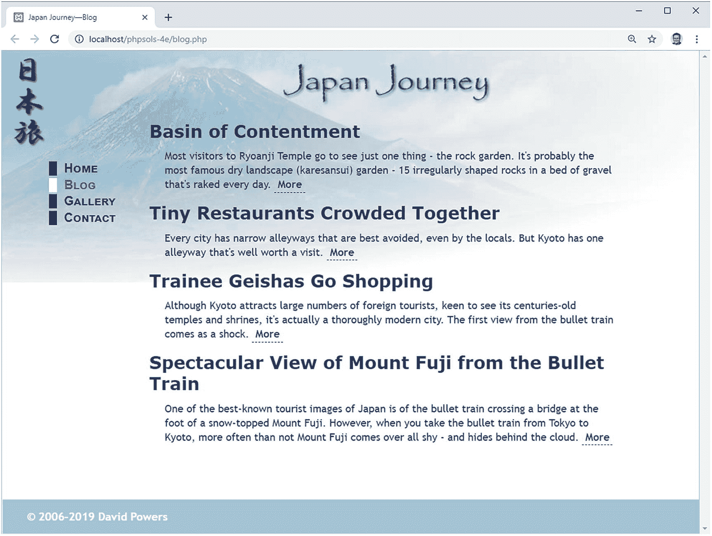

*图 15-1. Japan Journey 网站中`blog`表的内容*

### 创建博客数据库表

如果你只想直接学习内容管理页面，可以从`ch15`文件夹导入`blog.sql`中的表结构和数据。打开 phpMyAdmin，选择`phpsols`数据库，按照第 12 章的方法导入该表。该 SQL 文件会创建表并用四篇短文填充它。

如果你想从头开始自行创建所有内容，请打开 phpMyAdmin，选择`phpsols`数据库，如果未选中，请点击`Structure`标签页。在`Create table`部分，在`Name`字段中输入**blog**，在`Number of columns`字段中输入**5**。然后点击`Go`。使用以下截图和表 15-1 中显示的设置。

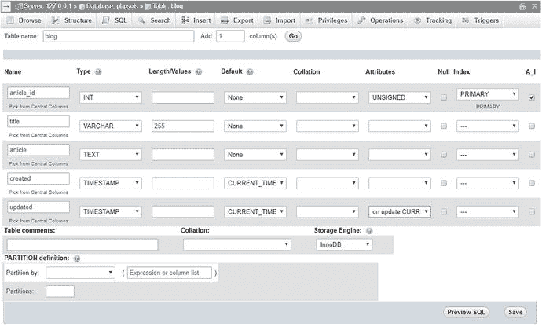

*表 15-1. `blog`表的列定义*

| 字段 | 类型 | 长度/值 | 默认值 | 属性 | 空值 | 索引 | A_I |
| --- | --- | --- | --- | --- | --- | --- | --- |
| `article_id` | `INT` |  |  | `UNSIGNED` | 取消选中 | `PRIMARY` | 选中 |
| `title` | `VARCHAR` | `255` |  |  | 取消选中 |  |  |
| `article` | `TEXT` |  |  |  | 取消选中 |  |  |
| `created` | `TIMESTAMP` |  | `CURRENT_TIMESTAMP` |  | 取消选中 |  |  |
| `updated` | `TIMESTAMP` |  | `CURRENT_TIMESTAMP` | `on update CURRENT_TIMESTAMP` | 取消选中 |  |  |

`created`和`updated`列的默认值设置为`CURRENT_TIMESTAMP`。因此，在首次输入记录时，这两列获得相同的值。`updated`列的`Attributes`设置为`on update CURRENT_TIMESTAMP`。这意味着每当对记录进行更改时，它都会被更新。为了跟踪记录最初创建的时间，`created`列中的值永远不会被更新。

### 创建基本的插入和更新表单

SQL 通过提供独立的命令来区分插入和更新记录。`INSERT`仅用于创建全新记录。一旦记录被插入，任何更改都必须使用`UPDATE`。由于这涉及到相同的字段，因此可以使用同一页面执行这两种操作。但这会使 PHP 代码更复杂，所以我更喜欢先为插入页面创建 HTML，将其另存为更新页面，然后分别编写代码。

插入页面中的表单只需要两个输入字段：标题和文章。其余三列（主键和两个时间戳）的内容会自动处理。插入表单的代码如下所示：

```html
<form method="post" action="blog_insert_mysqli.php">
    <p>
        <label for="title">标题:</label>
        <input type="text" name="title" id="title">
    </p>
    <p>
        <label for="article">文章:</label>
        <textarea name="article" id="article" cols="60" rows="10"></textarea>
    </p>
    <p>
        <input type="submit" name="insert" value="插入新条目">
    </p>
</form>
```

该表单使用`post`方法。你可以在`ch15`文件夹中的`blog_insert_mysqli_01.php`和`blog_insert_pdo_01.php`文件中找到完整代码。内容管理表单已使用`styles`文件夹中的`admin.css`进行了基本样式设置。在浏览器中查看时，表单如下所示：

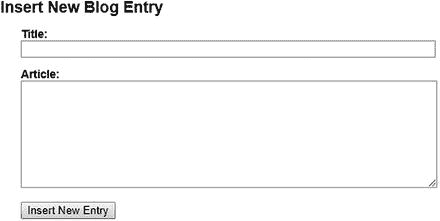

更新表单除了标题和提交按钮外完全相同。按钮代码如下所示（完整代码在`blog_update_mysqli_01.php`和`blog_update_pdo_01.php`中）：

```html
<input type="submit" name="update" value="更新条目">
```

我已将标题和文章输入字段命名为与`blog`表中列名相同的名称。这有助于稍后在编写 PHP 和 SQL 代码时跟踪变量。


# 提示
作为一项安全措施，一些开发者建议使用与数据库列名不同的名称，因为任何人都可以通过查看表单的源代码看到输入字段的名称。使用不同的名称会增加入侵数据库的难度。在网站需要密码保护的部分，这无需担忧。但对于可公开访问的表单（例如用于用户注册或登录的表单），你或许应该考虑这一思路。

## 插入新记录

向表中插入新记录的基本 SQL 语句如下：

```
INSERT [INTO] table_name (column_names)
VALUES (values)
```

`INTO` 位于方括号中，表示它是可选的。它的存在纯粹是为了让 SQL 读起来更像人类语言。列名可以按任何顺序排列，但第二组括号中的值必须与其对应的列顺序一致。尽管 MySQLi 和 PDO 的代码非常相似，但为了避免混淆，我将分别介绍它们。

> **注意** 本章中的许多脚本使用了一种称为“设置标志（setting a flag）”的技术。`flag` 是一个布尔变量，初始化为 `true` 或 `false`，用于检查某事是否发生。例如，如果 `$OK` 初始设置为 `false`，并且仅在数据库查询成功执行时才重置为 `true`，那么它就可以用作控制另一个代码块的条件。

## PHP 解决方案 15-1：使用 MySQLi 插入新记录

本 PHP 解决方案展示了如何使用 MySQLi 预处理语句向 `blog` 表插入新记录。使用预处理语句可以避免引用转义和控制字符的问题。它还能保护你的数据库免受 SQL 注入攻击（参见第 13 章）。

1. 在 `phpsols-4e` 站点根目录下创建一个名为 `admin` 的文件夹。从 `ch15` 文件夹复制 `blog_insert_mysqli_01.php`，并将其在新文件夹中保存为 `blog_insert_mysqli.php`。

2. 插入新记录的代码应仅在表单已提交时运行，因此它被包裹在一个条件语句中，该语句检查 `$_POST` 数组中提交按钮的 `name` 属性（`insert`）。将以下代码放在 `DOCTYPE` 声明之上：

   ```
   在包含连接函数之后，代码将 `$OK` 设置为 `false`。仅当没有错误时，它才会被重置为 `true`。末尾的五条注释勾勒出我们将要填写的剩余步骤。
   ```

3. 以具有读写权限的用户身份创建数据库连接，初始化预处理语句，并编写带有占位符的 SQL，这些占位符将用于存放从用户输入中获取的数据，如下所示：

   ```
   // 创建数据库连接
   $conn = dbConnect('write');
   // 初始化预处理语句
   $stmt = $conn->stmt_init();
   // 创建 SQL
   $sql = 'INSERT INTO blog (title, article)
   VALUES(?, ?)';
   ```

   将从 `$_POST['title']` 和 `$_POST['article']` 获取的值由问号占位符表示。其他列将自动填充。`article_id` 列是主键，使用 `AUTO_INCREMENT`，而 `created` 和 `updated` 列的默认值是 `CURRENT_TIMESTAMP`。

   > **注意** 此处的代码顺序与第 13 章略有不同。该脚本将在第 17 章进一步扩展以运行一系列 SQL 查询，因此预处理语句被首先初始化。

4. 下一步是将问号替换为变量中的值——这个过程称为**绑定参数**。插入以下代码：

   ```
   if ($stmt->prepare($sql)) {
   // 绑定参数并执行语句
   $stmt->bind_param('ss', $_POST['title'], $_POST['article']);
   $stmt->execute();
   if ($stmt->affected_rows > 0) {
   $OK = true;
   }
   }
   ```

   这部分代码用于保护数据库免受 SQL 注入攻击。将变量按照希望插入 SQL 查询的顺序传递给 `bind_param()` 方法，同时第一个参数指定每个变量的数据类型，同样按照与变量相同的顺序。两者都是字符串，因此这个参数是 `'ss'`。

   一旦值绑定到占位符，就调用 `execute()` 方法。

   `affected_rows` 属性记录了 `INSERT`、`UPDATE` 或 `DELETE` 查询影响的行数。

   > **注意** 如果查询触发了 MySQL 错误，`affected_rows` 返回 −1。与某些编程语言不同，PHP 将 −1 视为 `true`。因此，你需要检查 `affected_rows` 是否大于零，以确保查询成功。如果大于零，`$OK` 将被重置为 `true`。

5. 最后，将页面重定向到现有记录列表，或显示任何错误消息。在上一步之后添加此代码：

   ```
   // 重定向（如果成功）或显示错误
   if ($OK) {
   header('Location:
   http://localhost/phpsols-4e/admin/blog_list_mysqli.php');
   exit;
   } else {
   $error = $stmt->error;
   }
   }
   ?>
   ```

6. 在页面的主体中添加以下代码块，以便在插入操作失败时显示错误消息：

   ```
   插入新博客条目
   <?php
   if (isset($error)) {
   echo "<p>错误：$error</p>";
   }
   ?>
   ```

   完整代码位于 `ch15` 文件夹中的 `blog_insert_mysqli_02.php`。

至此，插入页面就完成了。但在测试之前，请先创建 `blog_list_mysqli.php`，该文件将在 PHP 解决方案 15-3 中介绍。

> **注意** 为了专注于与数据库交互的代码，本章中的脚本并未对用户输入进行验证。在实际应用中，你应该使用第 6 章中描述的技术来检查表单提交的数据，并在检测到错误时重新显示。

## PHP 解决方案 15-2：使用 PDO 插入新记录

本 PHP 解决方案展示了如何使用 PDO 预处理语句向 `blog` 表插入新记录。如果尚未创建，请在 `phpsols-4e` 站点根目录下创建一个名为 `admin` 的文件夹。

1. 将 `blog_insert_pdo_01.php` 复制到 `admin` 文件夹，并保存为 `blog_insert_pdo.php`。

2. 插入新记录的代码应仅在表单已提交时运行，因此它被包裹在一个条件语句中，该语句检查 `$_POST` 数组中提交按钮的 `name` 属性（`insert`）。将以下代码放在 `DOCTYPE` 声明之上的 PHP 代码块中：

   ```
   if (isset($_POST['insert'])) {
   require_once '../includes/connection.php';
   // 初始化标志
   $OK = false;
   // 创建数据库连接
   // 创建 SQL
   // 准备语句
   // 绑定参数并执行语句
   // 重定向（如果成功）或显示错误
   }
   ```

   在包含连接函数之后，代码将 `$OK` 设置为 `false`。仅当没有错误时，它才会被重置为 `true`。末尾的五条注释勾勒出剩余的步骤。

3. 以具有读写权限的用户身份创建 PDO 数据库连接，并构建 SQL 语句，如下所示：

   ```
   // 创建数据库连接
   $conn = dbConnect('write', 'pdo');
   // 创建 SQL
   $sql = 'INSERT INTO blog (title, article)
   VALUES(:title, :article)';
   ```

   将从变量获取的值由命名占位符表示，这些占位符由列名前加冒号组成（`:title` 和 `:article`）。其他列的值将由数据库生成。`article_id` 主键会自动递增，而 `created` 和 `updated` 列的默认值设置为 `CURRENT_TIMESTAMP`。


4. 下一步是初始化预处理语句，并将变量中的值绑定到占位符——这一过程称为**绑定参数**。添加以下代码：

```
// 准备语句
$stmt = $conn->prepare($sql);
// 绑定参数并执行语句
$stmt->bindParam(':title', $_POST['title'], PDO::PARAM_STR);
$stmt->bindParam(':article', $_POST['article'], PDO::PARAM_STR);
// 执行并获取受影响的行数
$stmt->execute();
$OK = $stmt->rowCount();
```

首先，将 SQL 查询传递给数据库连接对象（`$conn`）的 `prepare()` 方法，并将语句的引用存储为变量（`$stmt`）。

接着，将变量中的值绑定到预处理语句中的占位符，然后 `execute()` 方法执行查询。

当与 `INSERT`、`UPDATE` 或 `DELETE` 查询一起使用时，PDO 的 `rowCount()` 方法会报告查询影响的行数。如果记录插入成功，`$OK` 的值为 `1`，PHP 将其视为 `true`。否则，值为 `0`，被视为 `false`。

5. 最后，将页面重定向到现有记录列表，或显示错误信息。在上一步之后添加以下代码：

```
// 如果成功则重定向，否则显示错误
if ($OK) {
    header('Location: http://localhost/phpsols-4e/admin/blog_list_pdo.php');
    exit;
} else {
    $error = $stmt->errorInfo()[2];
}
}
?>
```

如果存在错误信息，它会被存储在由 `$stmt->errorInfo()` 返回的数组的第三个元素中，并通过数组解引用进行访问。

6. 在页面的主体中添加一个 PHP 代码块，用于显示任何错误信息：

```
<?php
if (isset($error)) {
    echo "<p>错误：$error</p>";
}
?>
```

完整的代码位于 `ch15` 文件夹中的 `blog_insert_pdo_02.php` 文件中。

至此，插入页面已完成，但在测试之前，请先创建接下来要描述的 `blog_list_pdo.php`。

### 链接到更新和删除页面

在更新或删除记录之前，需要先找到其主键。一个实用的方法是查询数据库，选择所有记录。你可以利用此查询结果显示所有记录的列表，并附带指向更新和删除页面的链接。通过在每个链接的查询字符串中添加 `article_id` 的值，你可以自动识别要更新或删除的记录。如图 15-2 所示，浏览器状态栏（左下角）中显示的 URL 将文章 `Trainee Geishas Go Shopping` 的 `article_id` 标识为 2。

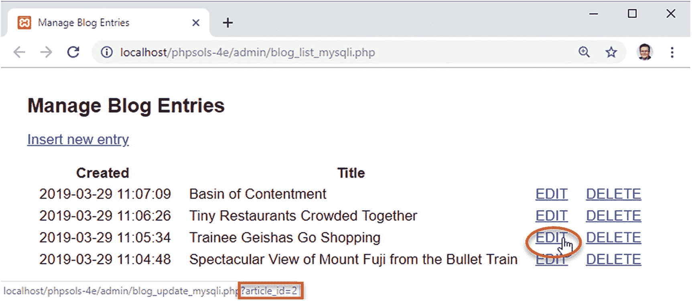

**图 15-2.** 编辑和删除链接的查询字符串中包含记录的主键

更新页面利用此信息显示正确的记录以供更新。删除链接中也会向删除页面传递相同的信息。

要创建这样的列表，你需要从一个包含两行以及所需列数（再加上两列用于编辑和删除链接）的 HTML 表格开始。第一行用于列标题。第二行包裹在一个 PHP 循环中，用于显示所有结果。`ch15` 文件夹中 `blog_list_mysqli_01.php` 的表格如下所示（`blog_list_pdo_01.php` 中的版本相同，只是最后两个表格单元格中的链接指向的是 PDO 版本的更新和删除页面）：

```
<table>
  <tr>
    <th>创建日期</th>
    <th>标题</th>
    <th>&nbsp;</th>
    <th>&nbsp;</th>
  </tr>
  <tr>
    <td>编辑</td>
    <td>删除</td>
  </tr>
</table>
```

### PHP 解决方案 15-3：创建指向更新和删除页面的链接

本 PHP 解决方案展示了如何通过显示所有记录的列表并链接到更新和删除页面，来创建管理 `blog` 表中记录的页面。MySQLi 和 PDO 版本之间只有细微差别，因此本说明将同时涵盖两者。

将 `blog_list_mysqli_01.php` 或 `blog_list_pdo_01.php` 复制到 `admin` 文件夹，并根据你计划使用的连接方式，将其保存为 `blog_list_mysqli.php` 或 `blog_list_pdo.php`。不同版本会链接到相应的插入、更新和删除文件。

1. 你需要连接到数据库并创建 SQL 查询。在 `DOCTYPE` 声明上方的 PHP 代码块中添加以下代码：

```
require_once '../includes/connection.php';
require_once '../includes/utility_funcs.php';
// 创建数据库连接
$conn = dbConnect('read');
$sql = 'SELECT * FROM blog ORDER BY created DESC';
```

如果你使用 PDO，请将 `'pdo'` 作为第二个参数添加到 `dbConnect()` 中。

2. 在结束 PHP 标签之前添加以下代码来提交查询。

对于 MySQLi，使用以下代码：

```
$result = $conn->query($sql);
if (!$result) {
    $error = $conn->error;
}
```

对于 PDO，使用以下代码：

```
$result = $conn->query($sql);
$error = $conn->errorInfo()[2];
```

3. 在表格之前添加一个条件语句来显示任何错误信息，并将表格包裹在 `else` 代码块中。表格前的代码如下所示：

```
<?php
if (isset($error)) {
    echo "<p>$error</p>";
} else { ?>
```

闭合的大括号应放在 `</table>` 标签之后的独立 PHP 代码块中。

4. 现在，你需要将第二行表格包裹在一个循环中，并从结果集中检索每条记录。以下代码位于第一行的结束 `</tr>` 标签和第二行的开始 `<tr>` 标签之间。

对于 MySQLi，使用以下代码：

```
<?php while ($row = $result->fetch_assoc()) { ?>
```

对于 PDO，使用以下代码：

```
<?php while ($row = $result->fetch()) { ?>
```

这与前一章中的内容相同，因此无需解释。

5. 在第二行的前两个单元格中显示当前记录的 `created` 和 `title` 字段，如下所示：

```
<td><?= $row['created'] ?></td>
<td><?= safe($row['title']) ?></td>
```

`created` 列存储的是 `TIMESTAMP` 数据类型，这是一种固定格式，因此不需要过滤。但是 `title` 列是文本相关的，因此需要传递给第 13 章中定义的 `safe()` 函数。

6. 在接下来的两个单元格中，将当前记录的 `article_id` 字段的查询字符串和值添加到两个 URL 中，如下所示（尽管链接不同，但高亮显示的代码对于 PDO 版本是相同的）：

```
<td><a href="blog_update_mysqli.php?article_id=<?= $row['article_id'] ?>">编辑</a></td>
<td><a href="blog_delete_mysqli.php?article_id=<?= $row['article_id'] ?>">删除</a></td>
```

这里所做的是在 URL 后添加 `?article_id=`，然后使用 PHP 显示 `$row['article_id']` 的值。`article_id` 列只存储整数，因此该值不需要过滤。重要的是不要留下任何可能破坏 URL 或查询字符串的空格。PHP 处理完成后，在浏览器中查看页面源代码时，开始的 `<a>` 标签应如下所示（尽管数字会根据记录而变化）：

```
<a href="blog_update_mysqli.php?article_id=2">编辑</a>
```

7. 最后，用大括号闭合包围第二行表格行的循环，如下所示：

```
<?php } ?>
```

8. 保存 `blog_list_mysqli.php` 或 `blog_list_pdo.php`，并将页面加载到浏览器中。假设你之前已将 `blog.sql` 的内容加载到 `phpsols` 数据库中，你应该会看到如图 15-2 所示的四个项目列表。现在你可以测试 `blog_insert_mysqli.php` 或 `blog_insert_pdo.php`。插入项目后，你应被重定向回相应版本的 `blog_list.php`，并且新项目的创建日期和时间以及标题应显示在列表顶部。如果遇到任何问题，请将你的代码与 `ch15` 文件夹中的 `blog_list_mysqli_02.php` 或 `blog_list_pdo_02.php` 进行核对。


**提示** 此代码假设表中始终存在记录。作为练习，请使用 PHP 解决方案 13-2（MySQLi）或 13-4（PDO）中的技术统计结果数量，并使用条件语句在未找到记录时显示消息。解决方案位于 `blog_list_norec_mysqli.php` 和 `blog_list_norec_pdo.php` 中。

## 更新记录

更新页面需要执行两个独立的流程，如下所示：

1.  检索选定的记录，并将其显示以供编辑
2.  在数据库中更新已编辑的记录

第一阶段使用 `$_GET` 超全局数组从 URL 中检索主键，然后使用它在更新表单中选择并显示记录，如图 15-3 所示。

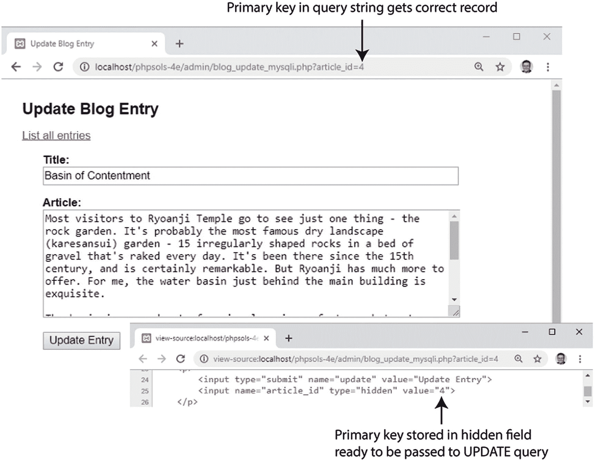

**图 15-3.** 在更新过程中，主键用于跟踪记录

主键存储在更新表单的隐藏字段中。在更新页面中编辑记录后，使用 `post` 方法提交表单，将所有详细信息（包括主键）传递给 `UPDATE` 命令。

SQL `UPDATE` 命令的基本语法如下所示：

```
UPDATE table_name SET column_name = value, column_name = value
WHERE condition
```

更新特定记录时的条件是主键。因此，在 `blog` 表中更新 `article_id 3` 时，基本的 `UPDATE` 查询如下所示：

```
UPDATE blog SET title = value, article = value
WHERE article_id = 3
```

尽管 MySQLi 和 PDO 的基本原理相同，但它们的代码差异很大，因此需要分别说明。

### PHP 解决方案 15-4：使用 MySQLi 更新记录

此 PHP 解决方案演示如何将现有记录加载到更新表单中，然后将编辑后的详细信息发送到数据库，以便使用 MySQLi 进行更新。要加载记录，您需要按照 PHP 解决方案 15-3 中的描述创建列出所有记录的管理页面。

1.  从 `ch15` 文件夹复制 `blog_update_mysqli_01.php`，并将其保存到 `admin` 文件夹中，命名为 `blog_update_mysqli.php`。

2.  第一阶段涉及检索要更新的记录的详细信息。将以下代码放在 `DOCTYPE` 声明上方的 PHP 块中：

```
    require_once '../includes/connection.php';
    require_once '../includes/utility_funcs.php';
    // 初始化标志
    $OK = false;
    $done = false;
    // 创建数据库连接
    $conn = dbConnect('write');
    // 初始化语句
    $stmt = $conn->stmt_init();
    // 获取选定记录的详细信息
    if (isset($_GET['article_id']) && !$_POST) {
    // 准备 SQL 查询
    $sql = 'SELECT article_id, title, article
    FROM blog WHERE article_id = ?';
    if ($stmt->prepare($sql)) {
    // 绑定查询参数
    $stmt->bind_param('i', $_GET['article_id']);
    // 执行查询并获取结果
    $OK = $stmt->execute();
    // 将结果绑定到变量
    $stmt->bind_result($article_id, $title, $article);
    $stmt->fetch();
    }
    }
    // 如果未定义 $_GET['article_id']，则重定向
    if (!isset($_GET['article_id'])) {
    $url = 'http://localhost/phpsols-4e/admin/blog_list_mysqli.php';
    header("Location: $url");
    exit;
    }
    // 如果查询失败，则获取错误消息
    if (isset($stmt) && !$OK && !$done) {
    $error = $stmt->error;
    }
```

虽然这与用于插入页面的代码非常相似，但前几行位于条件语句*之外*。更新过程的两个阶段都需要数据库连接和预处理语句，因此这避免了稍后重复相同代码。初始化了两个标志：`$OK` 用于检查检索记录是否成功，`$done` 用于检查更新是否成功。

第一个条件语句确保 `$_GET['article_id']` 存在且 `$_POST` 数组为空。因此，仅当设置了查询字符串但表单尚未提交时，才会执行花括号内的代码。

以与 `INSERT` 命令相同的方式准备 `SELECT` 查询，使用问号作为变量的占位符。但是，请注意，查询没有使用星号检索所有列，而是按名称指定了三列，如下所示：

```
$sql = 'SELECT article_id, title, article
FROM blog WHERE article_id = ?';
```

这是因为 MySQLi 预处理语句允许您将 `SELECT` 查询的结果绑定到变量，要能够做到这一点，您必须指定列名及其所需顺序。

首先，您需要初始化预处理语句，并使用 `$stmt->bind_param()` 将 `$_GET['article_id']` 绑定到查询。由于 `article_id` 的值必须是整数，因此您将 `'i'` 作为第一个参数传递。

该代码执行查询，然后在获取结果之前，将结果绑定到与 `SELECT` 查询中指定的列顺序相同的变量。

如果 `$_GET['article_id']` 未定义，下一个条件语句会将页面重定向到 `blog_list_mysqli.php`。这可以防止任何人在浏览器中直接加载更新页面。重定向位置已分配给一个变量，因为如果更新成功，稍后会将查询字符串添加到该变量。

最后一个条件语句会在已创建预处理语句但 `$OK` 和 `$done` 仍为 `false` 时存储错误消息。您尚未添加更新脚本，但如果记录检索或更新成功，其中一个将切换为 `true`。因此，如果两者都保持 `false`，您就知道其中一个 SQL 查询出了问题。

3.  现在您已经检索到记录的内容，需要在更新表单中显示它们。如果预处理语句成功，`$article_id` 应包含要更新记录的主键，因为它是您使用 `bind_result()` 方法绑定到结果集的变量之一。

但是，如果出现错误，您需要在屏幕上显示消息。但如果有人将查询字符串更改为无效数字，`$article_id` 将设置为 `0`，因此显示更新表单就没有意义了。在开始 `<form>` 标签之前立即添加以下条件语句：

```
<?php if (isset($error)) {
    echo "<p>Error: $error</p>";
} ?>
<?php if($article_id == 0) { ?>
    <p>Invalid request: record does not exist.</p>
    <p><a href="blog_list_mysqli.php">List all entries</a></p>
<?php } else { ?>
```

第一个条件语句显示 MySQLi 预处理语句报告的任何错误消息。第二个条件语句将更新表单包装在 `else` 块中，因此如果 `$article_id` 为 `0`，表单将被隐藏。

4.  在结束 `</form>` 标签之后立即添加 `else` 块的右花括号，如下所示：

```
<?php } ?>
```

5.  如果 `$article_id` 不是 `0`，您就知道 `$title` 和 `$article` 也包含有效值，并且可以在更新表单中显示，无需进一步测试。但是，您需要将文本值传递给 `safe()` 以避免引号和可执行代码带来的问题。像这样在 `title` 输入字段的 `value` 属性中显示 `$title`：

```
<input type="text" name="title" value="<?= safe($title) ?>">
```

6.  对 `article` 文本区域执行相同操作。由于文本区域没有 `value` 属性，因此代码如下所示放在开始和结束 `<textarea>` 标签之间：

```
<textarea name="article" cols="60" rows="10"><?= safe($article) ?></textarea>
```

确保开始和结束 PHP 标签与 `<textarea>` 标签之间没有空格。否则，在更新的记录中将会出现不需要的空格。


# 排版后的内容

7.  `UPDATE`命令需要知道要更改记录的主键。你需要将主键存储在一个隐藏字段中，这样它就会随其他详细信息一起在`$_POST`数组中被提交。由于隐藏字段不会在屏幕上显示，以下代码可以放在表单内的任何位置：

```
">
```

8.  保存更新页面，并通过在浏览器中加载`blog_list_mysqli.php`并进行测试，选择其中一条记录的`EDIT`链接。记录的详细信息应显示在表单字段中，如图 15-3 所示。

`Update Entry`按钮目前还没有任何功能。只需确保一切显示正确，并确认主键已注册在隐藏字段中。如有必要，你可以对照`blog_update_mysqli_02.php`检查代码。

9.  提交按钮的`name`属性是`update`，因此所有更新处理代码都需要放在一个检查`$_POST`数组中是否存在`update`的条件语句中。将以下加粗的代码放在步骤 1 中重定向页面的代码上方：

```
$stmt->fetch();
}
}
// if form has been submitted, update record
if (isset($_POST ['update'])) {
// prepare update query
$sql = 'UPDATE blog SET title = ?, article = ?
WHERE article_id = ?';
if ($stmt->prepare($sql)) {
$stmt->bind_param('ssi', $_POST['title'], $_POST['article'],
$_POST['article_id']);
$done = $stmt->execute();
}
}
// redirect page on success or if $_GET['article_id']) not defined
if ($done || !isset($_GET['article_id'])) {
$url = 'http://localhost/phpsols-4e/admin/blog_list_mysqli.php';
if ($done) {
$url .= '?updated=true';
}
header("Location: $url");
exit;
}
```

`UPDATE`查询是使用问号占位符准备的，这些占位符用于从变量中提供值。准备好的语句已在条件语句之外的代码中初始化，因此你可以将 SQL 传递给`prepare()`方法，并使用`$stmt->bind_param()`绑定变量。前两个变量是字符串，第三个是整数，因此第一个参数是`'ssi'`。

如果`UPDATE`查询成功，`execute()`方法返回`true`，重置`$done`的值。与`INSERT`查询不同，使用`affected_rows`属性意义不大，因为如果用户在不做任何更改的情况下点击`Update Entry`按钮，它会返回`0`，所以我们在此不使用它。你需要将`$done ||`添加到重定向脚本的条件中。这确保了页面在更新成功或有人试图直接访问页面时被重定向。

如果更新成功，一个查询字符串会被附加到重定向位置。

10. 编辑`blog_list_mysqli.php`中表格上方的 PHP 块，以显示记录已更新的消息，如下所示：

```
$error";
} else {
if (isset($_GET['updated'])) {
echo 'Record updated';
}
?>
```

这个条件语句嵌套在现有的`else`块中；它不是`elseif`语句。因此，在记录更新后，它会与数据库记录表格一起显示。

11. 保存`blog_update_mysqli.php`并通过加载`blog_list_mysqli.php`进行测试，选择一个`EDIT`链接，并对显示的记录进行更改。当你点击`Update Entry`时，页面应被重定向回`blog_list_mysqli.php`，并且“Record updated”应出现在列表上方。你可以通过再次点击同一个`EDIT`链接来验证你的更改是否已生效。如有必要，请对照`blog_update_mysqli_03.php`和`blog_list_mysqli_03.php`检查代码。

## PHP 解决方案 15-5：使用 PDO 更新记录

此 PHP 解决方案展示了如何将现有记录加载到更新表单中，然后使用 PDO 将编辑后的详细信息发送到数据库进行更新。要加载记录，你需要创建列出所有记录的管理页面，如 PHP 解决方案 15-3 所述。

1.  从`ch15`文件夹复制`blog_update_pdo_01.php`，并将其保存到`admin`文件夹中，命名为`blog_update_pdo.php`。

2.  第一阶段涉及检索要更新的记录的详细信息。将以下代码放在`DOCTYPE`声明上方的 PHP 块中：

```
require_once '../includes/connection.php';
require_once '../includes/utility_funcs.php';
// initialize flags
$OK = false;
$done = false;
// create database connection
$conn = dbConnect('write', 'pdo');
// get details of selected record
if (isset($_GET['article_id']) && !$_POST) {
// prepare SQL query
$sql = 'SELECT article_id, title, article FROM blog
WHERE article_id = ?';
$stmt = $conn->prepare($sql);
// pass the placeholder value to execute() as a single-element array
$OK = $stmt->execute([$_GET['article_id']]);
// bind the results
$stmt->bindColumn(1, $article_id);
$stmt->bindColumn(2, $title);
$stmt->bindColumn(3, $article);
$stmt->fetch();
}
// redirect if $_GET['article_id'] not defined
if (!isset($_GET['article_id'])) {
$url = 'http://localhost/phpsols-4e/admin/blog_list_pdo.php';
header("Location: $url");
exit;
}
if (isset($stmt)) {
// get error message (will be null if no error)
$error = $stmt->errorInfo()[2];
}
```

虽然这与插入页面使用的代码非常相似，但前几行*位于*第一个条件语句*之外*。更新过程的两个阶段都需要数据库连接，因此这避免了以后重复相同代码的需要。初始化了两个标志：`$OK`用于检查检索记录是否成功，`$done`用于检查更新是否成功。

第一个条件语句检查`$_GET ['article_id']`是否存在以及`$_POST`数组是否为空。这确保了仅当设置了查询字符串但表单尚未提交时，才执行其中的代码。

在准备插入表单的 SQL 查询时，你使用了命名占位符来表示变量。这次，让我们像这样使用问号：

```
$sql = 'SELECT article_id, title, article FROM blog
WHERE article_id = ?';
```

只有一个变量需要绑定到匿名占位符，因此将其作为单元素数组直接传递给`execute()`方法，如下所示：

```
$OK = $stmt->execute([$_GET['article_id']]);
```

### 注意事项

此代码使用了数组简写语法，因此`$_GET['article_id']`被包裹在一对方括号中。不要忘记数组的右方括号。

然后，结果通过`bindColumn()`方法绑定到`$article_id`、`$title`和`$article`。这次，我使用了数字（从 1 开始计数）来指示每个变量要绑定到哪一列。

结果中只有一条记录需要获取，因此立即调用`fetch()`方法。

下一个条件语句在未定义`$_GET['article_id']`时将页面重定向到`blog_list_pdo.php`。这防止了任何人尝试在浏览器中直接加载更新页面。重定向位置已分配给一个变量，因为稍后如果更新成功，将向其中添加查询字符串。

最后一个条件语句从准备好的语句中检索任何错误消息。它独立于准备好的语句代码的其余部分，因为它也将用于稍后添加的第二个准备好的语句。


3.  既然你已经检索到了记录的内容，就需要在更新表单中显示它们。如果预处理语句成功执行，`$article_id` 应包含待更新记录的主键，因为你使用 `bindColumn()` 方法将其作为绑定到结果集的变量之一。

然而，如果出现错误，你需要在屏幕上显示该消息。但如果有人将查询字符串修改为无效数字，`$article_id` 将被设为 `0`，此时显示更新表单就没有意义了。请在开头的 `<form>` 标签之前立即添加以下条件语句：

```
    List all entries 
    Error: $error";
    }
    if($article_id == 0) { ?>
    Invalid request: record does not exist.

```

第一个条件语句用于显示 PDO 预处理语句报告的任何错误消息。第二个条件语句将更新表单包裹在 `else` 代码块中，这样如果 `$article_id` 为 `0`，表单将隐藏。

4. 在结尾的 `</form>` 标签之后立即添加 `else` 代码块的闭合花括号，如下所示：

5. 如果 `$article_id` 不为 `0`，你就知道 `$title` 和 `$article` 也已经存在，并且无需进一步测试即可在更新表单中显示。但是，你需要将文本值传递给 `safe()` 函数，以避免引号和可执行代码带来的问题。像这样在 `title` 输入字段的 `value` 属性中显示 `$title`：

```
    ">
    ```

6. 对 `article` 文本区域执行相同操作。由于文本区域没有 `value` 属性，因此代码需要放在开头的 `<textarea>` 和结尾的 `</textarea>` 标签之间，如下所示：

```
    Make sure there is no space between the opening and closing PHP and
    `<textarea>` tags. Otherwise, you will get unwanted spaces in your updated
    record.

```

7. `UPDATE` 命令需要知道你要更改的记录的主键。你需要将主键存储在一个隐藏字段中，以便它随其他详细信息一起在 `$_POST` 数组中提交。由于隐藏字段不会在屏幕上显示，以下代码可以放在表单内的任何位置：

```
    ">
    ```

8. 保存更新页面并通过在浏览器中加载 `blog_list_pdo.php` 并选择其中一条记录的 `EDIT` 链接来测试。记录的详细信息应显示在表单字段中，如图 15-3 所示。

`Update Entry` 按钮目前还没有任何功能。只需确保所有内容都正确显示，并确认主键已注册到隐藏字段即可。如有必要，你可以对照 `blog_update_pdo_02.php` 检查代码。

9. 提交按钮的 `name` 属性是 `update`，因此所有更新处理代码都需要放在一个条件语句中，该语句检查 `$_POST` 数组中是否存在 `update`。将以下代码（以粗体突出显示）放在步骤 1 中重定向页面的代码之前：

```
    $stmt->fetch();
    }
    // if form has been submitted, update record
    if (isset($_POST['update'])) {
    // prepare update query
    $sql = 'UPDATE blog SET title = ?, article = ?
    WHERE article_id = ?';
    $stmt = $conn->prepare($sql);
    // execute query by passing array of variables
    $done = $stmt->execute([$_POST['title'], $_POST['article'],
    $_POST['article_id']]);
    }
    // redirect page on success or $_GET['article_id'] not defined
    if ($done || !isset($_GET['article_id'])) {
    $url = 'http://localhost/phpsols-4e/admin/blog_list_pdo.php';
    if ($done) {
    $url .= '?updated=true';
    }
    header("Location: $url");
    exit;
    }
    ```

同样，SQL 查询使用问号作为占位符，代表待从变量中获取的值。这次有三个占位符，因此需要将相应的变量作为数组传递给 `execute()` 方法。不用说，数组的顺序必须与占位符的顺序一致。

如果 `UPDATE` 查询成功执行，`execute()` 方法将返回 `true`，从而重置 `$done` 的值。你不能在此处使用 `rowCount()` 方法获取受影响的行数，因为如果点击 `Update Entry` 按钮但未做任何更改，它将返回 `0`。你会注意到我们在重定向脚本的条件中添加了 `$done ||`。这确保了无论是更新成功，还是有人试图直接访问页面，页面都会被重定向。如果记录已被更新，查询字符串将被附加到重定向位置。

10. 修改 `blog_list_pdo.php` 中表格上方的 PHP 代码块，像这样显示一条记录已更新的消息：

```
    $error";
    } else {
    if (isset($_GET['updated'])) {
    echo 'Record updated';
    }
    ?>

```

此条件语句嵌套在现有的 `else` 代码块中；它不是 `elseif` 语句。因此，它将在记录更新后，随数据库记录表一起显示。

11. 保存 `blog_update_pdo.php` 并通过加载 `blog_list_pdo.php` 进行测试，选择其中一个 `EDIT` 链接，并对显示的记录进行修改。当你点击 `Update Entry` 时，你应被重定向回 `blog_list_pdo.php`，并且“Record updated”应出现在列表上方。你可以通过再次点击同一个 `EDIT` 链接来验证你的更改是否已生效。如有必要，可以对照 `blog_update_pdo_03.php` 和 `blog_list_pdo_03.php` 检查代码。

---

## 删除记录

删除数据库中的记录与更新记录类似。基本的 `DELETE` 命令如下所示：

```
DELETE FROM table_name WHERE condition
```

`DELETE` 命令可能危险的地方在于它是最终性的。一旦删除了一条记录，就没有回头路了——它将永久消失。没有回收站或垃圾桶可以把它找回来。更糟糕的是，`WHERE` 子句是可选的。如果你省略它，表中的每一条记录都将不可挽回地被送入网络湮灭。因此，最好显示待删除记录的详细信息，并让用户确认或取消操作（参见图 15-4）。

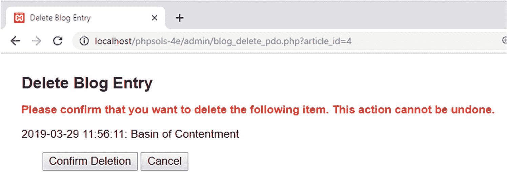

图 15-4。删除记录不可逆，因此在继续之前获取确认

构建和编写删除页面的脚本与更新页面几乎相同，因此我不会给出逐步说明。不过，以下是主要要点：

-   检索所选记录的详细信息。
-   显示足够的信息（例如标题），以便用户确认选择了正确的记录。
-   为 `Confirm Deletion` 和 `Cancel` 按钮设置不同的 `name` 属性，并使用 `isset()` 配合每个 `name` 属性来控制执行的操作。
-   不要将整个表单包裹在 `else` 代码块中，而是使用条件语句来隐藏 `Confirm Deletion` 按钮和隐藏字段。

以下是每种方法执行删除操作的代码。

### 对于 MySQLi：

```
if (isset($_POST['delete'])) {
$sql = 'DELETE FROM blog WHERE article_id = ?';
if ($stmt->prepare($sql)) {
$stmt->bind_param('i', $_POST['article_id']);
$stmt->execute();
if ($stmt->affected_rows > 0) {;
$deleted = true;
} else {
$error = 'There was a problem deleting the record.';
}
}
}
```

### 对于 PDO：


```
if (isset($_POST['delete'])) {
$sql = 'DELETE FROM blog WHERE article_id = ?';
$stmt = $conn->prepare($sql);
$stmt->execute([$_POST['article_id']]);
// 获取受影响的行数
$deleted = $stmt->rowCount();
if (!$deleted) {
$error = '删除记录时出现问题。';
$error .= $stmt->errorInfo()[2];
}
}
```

你可以在 `ch15` 文件夹中的 `blog_delete_mysqli.php` 和 `blog_delete_pdo.php` 文件中找到完整的代码。要测试删除脚本，请将相应的文件复制到 `admin` 文件夹。

## 回顾四个基本的 SQL 命令

现在你已经了解了 `SELECT`、`INSERT`、`UPDATE` 和 `DELETE` 的实际应用，让我们回顾一下 MySQL 和 MariaDB 的基本语法。这并不是一个详尽的列表，而是集中于最重要的选项，包括一些尚未涉及的。

我使用了与 MySQL 在线手册 [`dev.mysql.com/doc/refman/8.0/en/`](https://dev.mysql.com/doc/refman/8.0/en/) 相同的排版约定（你也可以参考该手册）：

*   大写内容均为 SQL 命令。
*   方括号内的表达式为可选。
*   小写斜体表示变量输入。
*   竖线（`|`）分隔备选项。

尽管某些表达式是可选的，但它们必须按列出的顺序出现。例如，在 `SELECT` 查询中，`WHERE`、`ORDER BY` 和 `LIMIT` 都是可选的，但 `LIMIT` 永远不能出现在 `WHERE` 或 `ORDER BY` 之前。

### SELECT

`SELECT` 用于从一个或多个表中检索记录。其基本语法如下：

```
SELECT [DISTINCT] select_list
FROM table_list
[WHERE where_expression]
[ORDER BY col_name | formula] [ASC | DESC]
[LIMIT [skip_count,] show_count]
```

`DISTINCT` 选项告诉数据库你想要从结果中消除重复的行。*select_list* 是一个以逗号分隔的列名列表，用于指定你想要包含在结果中的列。要检索所有列，请使用星号（`*`）。如果同一个列名在多个表中使用，则必须使用 *table_name.column_name* 的语法来明确引用。第 17 章和第 18 章详细解释了如何处理多个表。*table_list* 是一个以逗号分隔的表名列表，结果将从这些表中提取。所有你想要包含在结果中的表*必须*被列出。

`WHERE` 子句指定搜索条件，例如：

```
WHERE quotations.family_name = authors.family_name
WHERE article_id = 2
```

`WHERE` 表达式可以使用比较、算术、逻辑和模式匹配运算符。最重要的运算符列在表 15-2 中。

**表 15-2. MySQL `WHERE` 表达式中使用的主要运算符**

**比较** | | **算术** | |
--- | --- | --- | --- | --- | --- | --- | --- |
`<` | 小于 | `+` | 加法 |
`<=` | 小于或等于 | `-` | 减法 |
`=` | 等于 | `*` | 乘法 |
`!=` | 不等于 | `/` | 除法 |
`<>` | 不等于 | `DIV` | 整数除法 |
`>` | 大于 | `%` | 取模 |
`>=` | 大于或等于 | |
`IN()` | 包含在列表中 | |
`BETWEEN` *min* `AND` *max* | 介于（包含两个值）之间 | |

**逻辑** | | **模式匹配** | |
--- | --- | --- | --- |
`AND` | 逻辑与 | `LIKE` | 不区分大小写的匹配 |
`&&` | 逻辑与 | `NOT LIKE` | 不区分大小写的不匹配 |
`OR` | 逻辑或 | `LIKE BINARY` | 区分大小写的匹配 |
`||` | 逻辑或（最好避免使用） | `NOT LIKE BINARY` | 区分大小写的不匹配 |

在表示“不等于”的两个运算符中，`<>` 是标准 SQL。并非所有数据库都支持 `!=`。

`DIV` 是取模运算符的对应项。它产生除法结果为一个不带小数部分的整数，而取模只产生余数。

```
5 / 2        /* 结果 2.5 */
5 DIV 2      /* 结果 2  */
5 % 2        /* 结果 1  */
```

我建议你避免使用 `||`，因为在标准 SQL 中它实际上被用作字符串连接运算符。通过不在 MySQL 中使用它，如果你未来使用其他关系型数据库，可以避免混淆。对于字符串连接，MySQL 使用 `CONCAT()` 函数（参见 [`dev.mysql.com/doc/refman/8.0/en/string-functions.html#function_concat`](https://dev.mysql.com/doc/refman/8.0/en/string-functions.html%2523function_concat) ）。`IN()` 评估括号内以逗号分隔的值列表，如果找到一个或多个值，则返回 `true`。尽管 `BETWEEN` 通常与数字一起使用，但它也适用于字符串。例如，`BETWEEN 'a' AND 'd'` 对于 *a*、*b*、*c* 和 *d*（但不包括其大写形式）返回 `true`。`IN()` 和 `BETWEEN` 都可以在前面加上 `NOT` 来执行相反的比较。

`LIKE`、`NOT LIKE` 以及相关的 `BINARY` 运算符用于文本搜索，并与以下两个通配符结合使用：

*   `%`：匹配任何字符序列（包括无字符）
*   `_`（下划线）：恰好匹配一个字符

因此，以下 `WHERE` 子句匹配 Dennis、Denise 等，但不匹配 Aiden：

```
WHERE first_name LIKE 'den%'
```

要匹配 Aiden，请在搜索模式的前面加上 `%`。由于 `%` 匹配任何字符序列（包括无字符），因此 `'%den%'` 仍然匹配 Dennis 和 Denise。要搜索字面上的百分号或下划线，请在其前面加上反斜杠（`\%` 或 `\_`）。条件从左到右进行求值，但如果你希望一组条件被一起考虑，可以将它们分组在括号中。

`ORDER BY` 指定结果的排序顺序。这可以指定为单个列、以逗号分隔的列列表或一个表达式（例如 `RAND()`），该表达式用于随机化顺序。默认排序顺序为升序（a–z，0–9），但你可以指定 `DESC`（降序）来颠倒顺序。

`LIMIT` 后跟一个数字，规定了要返回的最大记录数。如果给出了两个由逗号分隔的数字，第一个数字告诉数据库要跳过多少行（参见第 14 章中的“选择记录子集”）。更多关于 `SELECT` 的详细信息，请参见 [`dev.mysql.com/doc/refman/8.0/en/select.html`](https://dev.mysql.com/doc/refman/8.0/en/select.html)。

### INSERT

`INSERT` 命令用于向数据库添加新记录。一般语法如下：

```
INSERT [INTO] table_name (column_names)
VALUES (values)
```

`INTO` 是一个可选词；它只是让命令读起来更像人类语言。列名和值都是逗号分隔的列表，并且两者必须顺序相同。因此，要将纽约（暴风雪）、底特律（烟雾）和檀香山（晴天）的天气预报插入到一个天气数据库中，你可以这样操作：

```
INSERT INTO forecast (new_york, detroit, honolulu)
VALUES ('blizzard', 'smog', 'sunny')
```

这样设计语法的原因是为了允许你一次插入多条记录。每条后续记录放在一组单独的括号中，每组之间用逗号分隔：

```
INSERT numbers (x,y)
VALUES (10,20),(20,30),(30,40),(40,50)
```

你将在第 18 章中使用这种多记录插入语法。任何在 `INSERT` 查询中省略的列都将被设置为其默认值。*切记，对于设置为* `AUTO_INCREMENT` *的列，绝不要为其主键设置显式值*；只需在 `INSERT` 语句中省略该列名即可。更多详情，请参见 [`dev.mysql.com/doc/refman/8.0/en/insert.html`](https://dev.mysql.com/doc/refman/8.0/en/insert.html)。

### UPDATE

此命令用于更改现有记录。基本语法如下所示：

```
UPDATE table_name
SET col_name = value [, col_name = value]
[WHERE where_expression]
```

`WHERE` 表达式告诉 MySQL 你想要更新哪条或哪些记录（或者在以下示例的情况下，或许只是梦想）：


```sql
UPDATE sales SET q4_2019 = 25000
WHERE title = 'PHP 7 Solutions, Fourth Edition'
```

有关`UPDATE`的更多详情，请参阅 [`https://dev.mysql.com/doc/refman/8.0/en/update.html`](https://dev.mysql.com/doc/refman/8.0/en/update.html)。

## `DELETE`

`DELETE`可用于删除单条记录、多条记录或整个表的内容。从单个表中删除数据的一般语法如下：

```sql
DELETE FROM table_name [WHERE where_expression]
```

尽管`phpMyAdmin`在删除记录前会提示您确认，但数据库会立即执行删除操作。`DELETE`是完全无情的——数据一旦被删除，就永久消失了。以下查询将删除`subscribers`表中`expiry_date`已过期日期的所有记录：

```sql
DELETE FROM subscribers
WHERE expiry_date < NOW()
```

更多详情，请参阅 [`https://dev.mysql.com/doc/refman/8.0/en/delete.html`](https://dev.mysql.com/doc/refman/8.0/en/delete.html)。

### 警告
虽然`WHERE`子句在`UPDATE`和`DELETE`中都是可选的，但您应该意识到，如果省略了`WHERE`，整个表都会受到影响。这意味着，不小心遗漏这两个命令中的任何一个，都可能导致每条记录完全相同——或者被完全删除。

## 安全与错误消息
在使用 PHP 和数据库开发网站时，显示错误消息至关重要，以便在出现问题时调试代码。然而，原始的错误消息在正式网站上看起来不专业。它们还可能向潜在攻击者泄露有关数据库结构的线索。因此，在将脚本部署到互联网上之前，您应该将数据库生成的错误消息替换为中立的消息，例如“抱歉，数据库不可用。”

## 章节回顾
使用数据库进行内容管理涉及插入、选择、更新和删除记录。每条记录的主键在更新和删除过程中起着至关重要的作用。大多数情况下，当记录首次创建时，主键由数据库自动生成。之后，查找记录的主键只需使用`SELECT`查询，方法是显示所有记录的列表或根据您了解的关于记录的信息（如标题或文章中的词语）进行搜索。`MySQLi`和`PDO`预处理语句通过消除确保引号和特殊字符正确转义的需要，使得数据库查询更加安全。如果在脚本中使用不同变量重复相同查询，它们还能加速应用程序。脚本无需每次都验证`SQL`，只需使用占位符验证一次即可。
尽管本章集中于内容管理，但相同的基本技术适用于大多数与数据库的交互。当然，`SQL`和`PHP`远不止于此。在下一章中，我将解决一些最常见的问题，例如仅显示长文本字段的第一句话或处理日期。然后，在第 17 章中，我们将探讨如何在数据库中处理多个表。

## 16. 格式化文本和日期

上一章还有一些未完成的任务。第 15 章的图 15-1 显示了`blog`表中的内容，只显示了每篇文章的前两句话，并提供了一个链接查看全文。但是，我没有向您展示这是如何实现的。从较长的文本开头提取较短的文本片段有几种方法。有些方法相当粗糙，通常会在末尾留下一个断词。在本章中，您将学习如何提取完整的句子。
另一个未完成的任务是，`blog_list_mysqli.php`和`blog_list_pdo.php`中的完整文章列表以原始状态显示`MySQL`时间戳，这不太优雅。您需要重新格式化日期以使其更友好。处理日期可能是一个大麻烦，因为`MySQL`和`MariaDB`以与`PHP`完全不同的方式存储日期。本章将指导您完成在`PHP/MySQL`环境中存储和显示日期的难题。您还将了解`PHP`的日期和时间特性，这些特性使复杂的日期计算（例如查找每个月的第二个星期二）变得轻而易举。

在本章中，您将学习以下内容：

*   提取较长文本项的第一部分
*   在`SQL`查询中使用别名
*   将数据库检索到的文本显示为段落
*   使用`MySQL`格式化日期
*   基于时间条件选择记录
*   使用`PHP`的`DateTime`、`DateTimeZone`、`DateInterval`和`DatePeriod`类

## 显示文本摘录
有许多方法可以从较长的文本中提取前几行或前几个字符。有时您只需要前 20 或 30 个字符来标识一个项目。其他时候，最好显示完整的句子或段落。

### 提取固定数量的字符
您可以使用`PHP`的`substr()`函数或`SQL`查询中的`LEFT()`函数从文本开头提取固定数量的字符。

> **注意**
> 以下示例将文本传递给第 13 章中定义的`safe()`函数。此函数通过将和号、双引号和尖括号转换为其`HTML`字符实体等价物来净化来自外部源的文本，但防止现有实体被双重编码。该函数定义包含在`utility_funcs.php`文件中。

### 使用`PHP Substr()`函数

`substr()`函数从较长的字符串中提取一个子串。它接受三个参数：要从中提取子串的字符串、起始点（从 0 开始计数）以及要提取的字符数。以下代码显示`$row['article']`的前 100 个字符：

```php
echo safe(substr($row['article'], 0, 100));
```

原始字符串保持不变。如果省略第三个参数，`substr()`将提取到字符串末尾的所有内容。这只有在您选择非 0 的起始点时才有意义。

### 在`SQL`查询中使用`LEFT()`函数

`LEFT()`函数从列的开头提取字符。它接受两个参数：列名和要提取的字符数。以下查询从`blog`表的`article`列中检索`article_id`、`title`和前 100 个字符：

```sql
SELECT article_id, title, LEFT(article, 100)
FROM blog ORDER BY created DESC
```

每当您像这样在`SQL`查询中使用函数时，该列名在结果集中将不再显示为`article`，而是显示为`LEFT(article, 100)`。因此，使用`AS`关键字为受影响的列分配**别名**是一个好主意。您可以将列的原始名称重新指定为别名，或者使用描述性名称，如以下示例所示（代码位于`ch16`文件夹中的`blog_left_mysqli.php`和`blog_left_pdo.php`中）：

```sql
SELECT article_id, title, LEFT(article, 100) AS first100
FROM blog ORDER BY created DESC
```


# 处理数据库记录

如果以 `$row` 的形式逐条处理记录，提取的内容保存在 `$row['first100']` 中。要同时获取前 100 个字符和完整文章，只需在查询语句中包含两者即可，如下所示：

```
SELECT article_id, title, LEFT(article, 100) AS first100, article
FROM blog ORDER BY created DESC
```

提取固定数量的字符会产生粗糙的结果，如图 16-1 所示。


**图 16-1.** 从文章中选取前 100 个字符会将许多单词截断

## 在完整单词处结束摘要

要在完整单词处结束摘要，你需要找到最后一个空格，并以此确定子字符串的长度。因此，如果你希望摘要最多为 100 个字符，请先使用前面任一种方法，并将结果存储在 `$extract` 中。然后你可以使用 PHP 字符串函数 `strrpos()` 和 `substr()` 找到最后一个空格，并按如下方式结束摘要（代码位于 `blog_word_mysqli.php` 和 `blog_word_pdo.php` 中）：

```
$extract = $row['first100'];
// 查找摘要中最后一个空格的位置
$lastSpace = strrpos($extract, ' ');
// 使用 $lastSpace 设置新摘要的长度并添加 ...
echo safe(substr($extract, 0, $lastSpace)) . '... ';
```

这样会生成更优雅的结果，如图 16-2 所示。它使用了 `strrpos()` 函数，该函数用于查找某个字符或子字符串在另一个字符串中最后一次出现的位置。由于你需要查找的是空格，第二个参数是一对引号，中间包含一个空格。结果存储在 `$lastSpace` 中，并作为第三个参数传递给 `substr()`，从而在完整单词处结束摘要。最后，添加一个包含三个点和一个空格的字符串，并使用连接运算符（点号）将这两部分连接起来。


**图 16-2.** 在完整单词处结束摘要能产生更优雅的结果

> **注意：** 不要将用于获取字符或子字符串最后位置的 `strrpos()` 与用于获取首次出现位置的 `strpos()` 混淆。多出的 "r" 代表 "reverse"（反向）——`strrpos()` 从字符串末尾开始搜索。

## 提取第一段

假设你在输入数据库中的文本时，使用回车键或换行键来表示新段落，那么这一操作非常简单。只需获取全文，使用 `strpos()` 找到第一个换行符，然后使用 `substr()` 提取到该位置为止的第一段文本。

以下 SQL 查询用于 `blog_para_mysqli.php` 和 `blog_para_pdo.php`：

```
SELECT article_id, title, article
FROM blog ORDER BY created DESC
```

以下代码用于显示 `article` 的第一段：

```php
echo safe(substr($row['article'], 0, strpos($row['article'], PHP_EOL)));
```

我们来分解一下，单独看看第三个参数：

```
strpos($row['article'], PHP_EOL)
```

这行代码使用 `PHP_EOL` 常量以跨平台的方式定位 `$row['article']` 中的第一个行尾字符（参见第 7 章“使用 `fopen()` 追加内容”）。你可以将代码重写为：

```
$newLine = strpos($row['article'], PHP_EOL);
echo safe(substr($row['article'], 0, $newLine));
```

两段代码完成的功能完全相同，但 PHP 允许你将一个函数嵌套作为另一个函数的参数传递。只要嵌套函数返回有效结果，你就可以频繁使用这种快捷方式。使用 `PHP_EOL` 常量消除了处理 Linux、macOS 和 Windows 在插入换行时使用不同字符的问题。

## 显示段落

既然我们谈到了段落，很多初学者会对从数据库检索到的所有文本都显示为一个连续块、段落之间没有分隔而感到困惑。HTML 会忽略空白字符，包括换行符。要让存储在数据库中的文本以段落形式显示，你有以下选择：

- 将文本存储为 HTML。
- 将换行符转换为 `<br/>` 标签。
- 创建自定义函数，用段落标签替换换行符。

### 将数据库记录存储为 HTML

第一种选择涉及在内容管理表单中安装 HTML 编辑器，例如 CKEditor（[`ckeditor.com/`](https://ckeditor.com/)）或 TinyMCE（[www.tiny.cloud/](http://www.tiny.cloud/)）。在插入或更新文本时对其进行标记。HTML 存储在数据库中，文本会按预期方式显示。安装这类编辑器超出了本书的讨论范围。

> **注意：** 如果将文本作为 HTML 存储在数据库中，则不能使用 `safe()` 函数来显示它，因为 HTML 标签会作为文本的一部分显示。相反，应使用 `strip_tags()` 并指定哪些标签是允许的（参见第 7 章“访问远程文件”和 [www.php.net/manual/en/function.strip-tags.php](http://www.php.net/manual/en/function.strip-tags.php)）。

### 将换行符转换为 `<br/>` 标签

最简单的做法是在显示文本之前将其传递给 `nl2br()` 函数，如下所示：

```
echo nl2br(safe($row['article']));
```

瞧！——段落出现了。好吧，其实并非如此。`nl2br()` 函数将换行符转换为 `<br/>` 标签（结束斜杠是为了与 XHTML 兼容，在 HTML5 中也有效）。结果你得到的是伪段落。这是一种快速但粗糙的解决方案，并不理想。

> **提示：** 使用 `nl2br()` 并非最佳方案。但如果决定使用它，必须在将文本传递给 `nl2br()` 之前对其进行净化。否则，`<br />` 标签的尖括号会被转换为 HTML 字符实体，导致它们作为文本显示，而不是作为底层 HTML 中的标签。

### 创建插入 `<p>` 标签的函数

要将从数据库中检索到的文本显示为真正的段落，请将数据库结果包裹在一对段落标签中，然后使用 `preg_replace()` 函数将连续的换行符转换为一个结束 `</p>` 标签，紧接着是一个开始 `<p>` 标签，如下所示：

```php
echo "<p>\n" . preg_replace('/[\r\n]+/', "</p>\n<p>\n", safe($row['article'])) . "</p>\n";
```

用作第一个参数的正则表达式匹配一个或多个回车符和/或换行符。你不能在此处使用 `PHP_EOL` 常量，因为你需要匹配所有连续的换行符，并将它们替换为一对段落标签。这对 `<p>` 标签放在双引号内，使用 `\n` 在它们之间添加一个换行符，以便使 HTML 代码更易于阅读。

记住正则表达式的模式可能比较困难，因此你可以轻松地将其转换为自定义函数，如下所示：

```php
function convertToParas($text) {
    $text = trim($text);
    $text = htmlspecialchars($text, ENT_COMPAT|ENT_HTML5, 'UTF-8', false);
    return '<p>' . preg_replace('/[\r\n]+/', "</p>\n<p>", $text) . "</p>\n";
}
```

该函数从文本的开头和结尾去除空白字符（包括换行符），然后通过将文本传递给包含四个参数的 `htmlspecialchars()` 函数进行净化。函数内部的第二行代码与第 13 章中定义的 `safe()` 函数中的代码相同。最后一行在开头添加 `<p>` 标签，将内部的连续换行符序列替换为结束和开始标签，并在末尾附加一个结束 `</p>` 标签和一个换行符。

然后你可以像这样使用该函数：

```php
echo convertToParas($row['article']);
```

该函数定义的代码位于 `ch16` 文件夹中更新版的 `utility_funcs.php` 文件中。你可以在 `blog_ptags_mysqli.php` 和 `blog_ptags_pdo.php` 中看到它的用法。


注意  
尽管`utility_funcs.php`的更新版本同时包含了`safe()`和`convertToParas()`函数定义，我决定不在`convertToParas()`内部调用`safe()`，因为这会产生潜在的不稳定依赖。如果在未来某个阶段你决定采用不同的文本清理方式并删除了`safe()`函数定义，调用`convertToParas()`时将触发致命错误，因为它依赖的正是已不存在的自定义函数。

## 提取完整句子

PHP 没有句子的概念。统计句号意味着你会忽略所有以感叹号或问号结尾的句子，还会面临在小数点处断句或在句号后截断闭合引号的风险。为解决这些问题，我设计了一个名为`getFirst()`的 PHP 函数，它能识别正常句子末尾的标点符号：

*   句号、问号或感叹号
*   可选地后接单引号或双引号
*   后接一个或多个空格

`getFirst()`函数接受两个参数：你要从中提取第一部分的文本，以及要提取的句子数量。第二个参数是可选的；如果未提供，函数默认提取前两个句子。代码如下（位于`utility_funcs.php`中）：

```
function getFirst($text, $number=2) {
    // 使用正则表达式拆分为句子
    $sentences = preg_split('/([.?!]["\']?\s)/', $text, $number+1,
        PREG_SPLIT_DELIM_CAPTURE);
    if (count($sentences) > $number * 2) {
        $remainder = array_pop($sentences);
    } else {
        $remainder = '';
    }
    $result = [];
    $result[0] = implode('', $sentences);
    $result[1] = $remainder;
    return $result;
}
```

此函数返回包含两个元素的数组：提取的句子和剩余的文本。你可以使用第二个元素创建指向全文页面的链接。

加粗的那一行使用正则表达式识别每个句子的结尾——句号、问号或感叹号，可选地后接双引号或单引号及一个空格。这作为第一个参数传递给`preg_split()`，该函数使用正则表达式将文本拆分为数组。第二个参数是目标文本。第三个参数决定文本拆分的最大块数，这里设为比要提取的句子数量多一。通常情况下，`preg_split()`会丢弃正则表达式匹配到的字符，但使用`PREG_SPLIT_DELIM_CAPTURE`作为第四个参数，并结合正则表达式中的一对捕获括号，能将它们保留为独立的数组元素。换句话说，`$sentences`数组的元素交替出现句子文本和标点及空格，如下所示：

```
$sentences[0] = '"Hello, world';
$sentences[1] = '!" ';
```

事先无法知道目标文本中有多少句子，因此需要判断提取所需数量的句子后是否还有剩余内容。条件语句使用`count()`确定`$sentences`数组中的元素数量，并将结果与`$number`乘以 2 进行比较（因为每个句子对应数组中的两个元素）。如果还有更多文本，`array_pop()`会移除`$sentences`数组的最后一个元素并将其赋值给`$remainder`。如果没有剩余文本，`$remainder`则为空字符串。函数的最后阶段使用`implode()`（以空字符串作为第一个参数）将提取的句子拼接起来，然后返回包含提取文本和剩余内容的双元素数组。

如果你觉得这段解释难以理解，别担心。这段代码相当高级，构建该函数经过大量实验，并且多年来我逐步改进它。

## PHP 方案 16-1：显示文章的前两个句子

本 PHP 方案展示如何使用前述的`getFirst()`函数显示`blog`表中每篇文章的摘要。如果你在本书前面创建了 Japan Journey 站点，请使用`blog.php`。或者，使用`ch16`文件夹中的`blog_01.php`，并将其另存为`phpsols-4e`站点根目录下的`blog.php`。你还需要`includes`文件夹中的`footer.php`、`menu.php`、`title.php`和`connection.php`。如果`includes`文件夹中尚未包含这些文件，`ch16`文件夹中有它们的副本。

1.  将`utility_funcs.php`的更新版本从`ch16`文件夹复制到`includes`文件夹，并在`blog.php`的`DOCTYPE`声明上方的 PHP 代码块中引入它。同时引入`connection.php`并创建数据库连接。此页面需要只读权限，因此使用`read`作为传递给`dbConnect()`的参数，如下所示：

```
    require_once './includes/connection.php';
    require_once './includes/utility_funcs.php';
    // 创建数据库连接
    $conn = dbConnect('read');
    ```

    如果你使用 PDO，请在`dbConnect()`中添加`'pdo'`作为第二个参数。

2.  准备一个 SQL 查询，检索`blog`表中的所有记录，然后提交查询，如下所示：

```
    $sql = 'SELECT * FROM blog ORDER BY created DESC';
    $result = $conn->query($sql);
    ```

3.  添加检查数据库错误的代码。

    对于 MySQLi，使用以下代码：

```
    if (!$result) {
        $error = $conn->error;
    }
    ```

    对于 PDO，调用`errorInfo()`方法并检查第三个数组元素是否存在，如下所示：

```
    $errorInfo = $conn->errorInfo();
    if (isset($errorInfo[2])) {
        $error = $errorInfo[2];
    }
    ```

4.  删除页面`<main>`元素内的所有静态 HTML，并添加代码以在查询出现问题时显示错误消息：

```
    $error";
    } else {
    }
    ?>

```

5.  在`else`块内创建一个循环以显示结果：

```
    while ($row = $result->fetch_assoc()) {
        echo "{$row['title']}";
        $extract = getFirst($row['article']);
        echo '' . safe($extract[0]);
        if ($extract[1]) {
            echo '
            <a href="details.php?article_id=' . $row['article_id'] . '">More</a>';
        }
        echo '';
    }
    ```

    对于 PDO，代码相同，但这一行除外：

```
    while ($row = $result->fetch_assoc()) {
    ```

    将其替换为：

```
    while ($row = $result->fetch()) {
    ```

    `getFirst()`函数处理`$row['article']`并将结果存储在`$extract`中。`$extract[0]`中的前两个句子会立即显示。如果`$extract[1]`包含内容，则表示还有更多要显示的内容。因此`if`块内的代码会显示一个指向`details.php`的链接，链接中带有文章主键的查询字符串。

6.  保存页面并在浏览器中测试。你应该会看到每篇文章的前两个句子如图 16-3 所示。


图 16-3. 前两个句子已从较长的文本中干净地提取出来

7.  通过向`getFirst()`添加数字作为第二个参数来测试函数，如下所示：

```
$extract = getFirst($row['article'], 3);
```

这将显示前三个句子。如果增加的数字等于或超过文章中的句子数量，则不会显示“More”链接。  
你可以将你的代码与`ch16`文件夹中的`blog_mysqli.php`和`blog_pdo.php`进行比较。  
我们将在第 17 章中介绍`details.php`。在此之前，让我们先处理动态网站中日期使用这个雷区。


# 一起来约会吧

日期和时间对现代生活如此重要，以至于我们很少停下来思考它们有多复杂。每分钟有 60 秒，每小时有 60 分钟，但每天有 24 小时。月份的天数在 28 到 31 天之间变化，而一年要么是 365 天，要么是 366 天。混乱还不止于此，因为 7 月 4 日对美国或日本人来说是 7/4，但对欧洲人来说是 4 月 7 日。更令人困惑的是，PHP 处理日期的方式与 MySQL 不同。是时候拨乱反正了……

> **备注**：MariaDB 处理日期的方式相同。为避免不必要的重复，我将仅提及 MySQL。

## MySQL 如何处理日期

在 MySQL 中，日期和时间始终按从大到小的降序表示：年、月、日、时、分、秒。小时始终使用 24 小时制，午夜表示为`00:00:00`。即使这对你来说似乎不熟悉，但这也是国际标准化组织（ISO）推荐的标准。MySQL 允许在单位之间的分隔符方面有相当大的灵活性（任何标点符号都可以接受），但顺序是确定的，不可更改。如果你尝试以年、月、日以外的任何格式存储日期，MySQL 会在数据库中插入 `0000-00-00`。

稍后我会回过头来讨论如何向 MySQL 插入日期，因为最好使用 PHP 来验证和格式化它们。首先，让我们看看日期存储在 MySQL 后，你可以用它做些什么。MySQL 有许多日期和时间函数，在 [`https://dev.mysql.com/doc/refman/8.0/en/date-and-time-functions.html`](https://dev.mysql.com/doc/refman/8.0/en/date-and-time-functions.html) 上有列表和示例。最有用的函数之一是 `DATE_FORMAT()`，它名副其实。

### 在 `SELECT` 查询中使用 `DATE_FORMAT()` 格式化日期

`DATE_FORMAT()` 的语法如下：

```
DATE_FORMAT(date, format)
```

通常，*date* 是要格式化的表列，而 *format* 是由格式化说明符和你希望包含的任何其他文本组成的字符串。表 16-1 列出了最常见的说明符，所有这些说明符都区分大小写。

**表 16-1. 常用的 MySQL 日期格式说明符**

| 时间段 | 说明符 | 描述 | 示例 |
| --- | --- | --- | --- |
| 年 | `%Y` | 四位数字格式 | 2014 |
| | `%y` | 两位数字格式 | 14 |
| 月 | `%M` | 完整名称 | January, September |
| | `%b` | 缩写名称，三个字母 | Jan, Sep |
| | `%m` | 带前导零的数字 | 01, 09 |
| | `%c` | 不带前导零的数字 | 1, 9 |
| 月中日 | `%d` | 带前导零 | 01, 25 |
| | `%e` | 不带前导零 | 1, 25 |
| | `%D` | 带英文文本后缀 | 1st, 25th |
| 工作日名称 | `%W` | 完整文本 | Monday, Thursday |
| | `%a` | 缩写名称，三个字母 | Mon, Thu |
| 小时 | `%H` | 带前导零的 24 小时制 | 01, 23 |
| | `%k` | 不带前导零的 24 小时制 | 1, 23 |
| | `%h` | 带前导零的 12 小时制 | 01, 11 |
| | `%l` (小写“L”) | 不带前导零的 12 小时制 | 1, 11 |
| 分钟 | `%i` | 带前导零 | 05, 25 |
| 秒 | `%S` | 带前导零 | 08, 45 |
| 上午/下午 | `%p` | | |

如前所述，在 SQL 查询中使用函数时，需要使用 `AS` 关键字将结果赋给一个别名。参考表 16-1，你可以将 `blog` 表中 `created` 列的日期格式化为常见的美国样式，并赋给一个别名，如下所示：

```
DATE_FORMAT(created, '%c/%e/%Y') AS date_created
```

要以欧洲样式格式化相同的日期，请反转前两个说明符，如下所示：

```
DATE_FORMAT(created, '%e/%c/%Y') AS date_created
```

> **提示**：使用 `DATE_FORMAT()` 时，不要使用原始列名作为别名，因为值会被转换为字符串，这会严重扰乱排序顺序。选择不同的别名，并使用原始列名对结果进行排序。

### PHP 解法 16-2：格式化 MySQL 日期或时间戳

此 PHP 解法对第 15 章博客条目管理页面中的日期进行格式化。

1. 在 `admin` 文件夹中打开 `blog_list_mysqli.php` 或 `blog_list_pdo.php`，并找到 SQL 查询。它看起来像这样：

   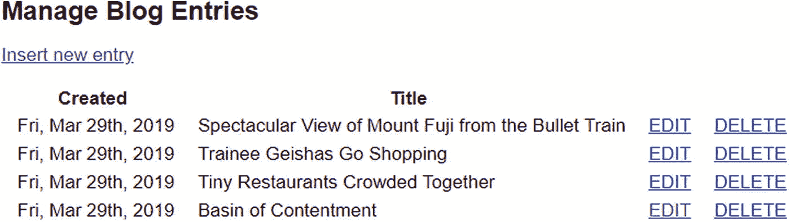

   **图 16-4.** MySQL 时间戳现在已格式整齐

2. 如下所示进行修改：

   ```sql
   $sql = 'SELECT article_id, title,
   DATE_FORMAT(created, "%a, %b %D, %Y") AS date_created
   FROM blog ORDER BY created DESC';
   ```

   我在整个 SQL 查询周围使用了单引号，因此 `DATE_FORMAT()` 内部的格式字符串需要使用双引号。

   确保 `DATE_FORMAT()` 的左括号前没有空格。

   格式字符串以 `%a` 开头，它显示工作日名称的前三个字母。如果使用原始列名作为别名，`ORDER BY` 子句将按反向字母顺序对日期排序：Wed、Thu、Sun，等等。使用不同的别名可以确保日期仍按时间顺序排列。

3. 在页面正文的第一个表格单元格中，将 `$row['created']` 更改为 `$row['date_created']`，以匹配 SQL 查询中的别名。

4. 保存页面并将其加载到浏览器中。现在日期应格式化如图 16-4 所示。尝试使用其他说明符以满足你的偏好。

```sql
$sql = 'SELECT * FROM blog ORDER BY created DESC';
```

`blog_list_mysqli.php` 和 `blog_list_pdo.php` 的更新版本位于 `ch16` 文件夹中。

## 日期的加减运算

处理日期时，添加或减去特定时间段通常很有用。例如，你可能希望显示过去 7 天内添加到数据库的项目，或者停止显示超过 3 个月未更新的文章。MySQL 通过 `DATE_ADD()` 和 `DATE_SUB()` 使这变得简单。这两个函数分别有同义词 `ADDDATE()` 和 `SUBDATE()`。

它们的基本语法相同，如下所示：

```
DATE_ADD(date, INTERVAL value interval_type)
```

使用这些函数时，*date* 可以是包含要更改日期的列、包含特定日期（采用 `YYYY-MM-DD` 格式）的字符串，或 MySQL 函数（如 `NOW()`）。`INTERVAL` 是一个关键字，后跟一个值和一个间隔类型，表 16-2 列出了最常见的间隔类型。

**表 16-2. `DATE_ADD()` 和 `DATE_SUB()` 最常用的间隔类型**

| 间隔类型 | 含义 | 值格式 |
| --- | --- | --- |
| `DAY` | 天数 | 数字 |
| `DAY_HOUR` | 天和小时 | 以 `'DD hh'` 格式呈现的字符串 |
| `WEEK` | 周数 | 数字 |
| `MONTH` | 月数 | 数字 |
| `QUARTER` | 季度数 | 数字 |
| `YEAR` | 年数 | 数字 |
| `YEAR_MONTH` | 年和月 | 以 `'YY-MM'` 格式呈现的字符串 |

间隔类型是常量，因此不要在 `DAY`、`WEEK` 等末尾添加“S”使其变为复数。

这些函数最有用的应用之一是仅显示表中最近的项目。

### PHP 解法 16-3：显示过去一周内更新的项目

此 PHP 解法展示了如何根据特定时间间隔限制数据库结果的显示。使用 PHP 解法 16-1 中的 `blog.php`。

1. 在 `blog.php` 中找到 SQL 查询。它看起来像这样：

   ```sql
   $sql = 'SELECT * FROM blog ORDER BY created DESC';
   ```

2. 如下所示进行修改：

   ```sql
   $sql = 'SELECT * FROM blog
   WHERE updated > DATE_SUB(NOW(), INTERVAL 1 WEEK)
   ORDER BY created DESC';
   ```

   这将告诉 MySQL，你只想要过去一周内更新过的项目。


### 3. 保存并在浏览器中重新加载页面。
根据你最后一次更新 `blog` 表中项目的时间，你可能看到的是空，也可能是有限范围内的项目。如有需要，可将时间间隔类型改为 `DAY` 或 `HOUR` 来测试时间限制是否生效。

### 4. 打开 `blog_list_mysqli.php` 或 `blog_list_pdo.php`，选择一个未显示在 `blog.php` 中的项目并编辑它。
重新加载 `blog.php`。你刚刚更新的项目现在应已显示。

你可以将自己的代码与 `ch16` 文件夹中的 `blog_limit_mysqli.php` 和 `blog_limit_pdo.php` 进行比较。

---

## 向 MySQL 插入日期

MySQL 要求日期格式必须为 `YYYY-MM-DD`，这对于允许用户输入日期的在线表单来说是个头疼的问题。正如你在第 15 章所见，可以通过使用 `TIMESTAMP` 列来自动插入当前日期和时间。你也可以使用 MySQL 的 `NOW()` 函数在 `DATE` 或 `DATETIME` 列中插入当前日期。只有当你需要其他日期时才会出现问题。

从理论上讲，HTML5 的 `date` 输入类型本应解决这个问题。支持日期输入字段的浏览器通常会在字段获得焦点时显示日期选择器，并以本地格式插入日期。`ch16` 文件夹中的 `date_test.php` 有一个示例。图 16-5 展示了 Google Chrome 如何在我的电脑上以正确的欧洲格式显示日期；但表单提交时，该值会被转换为 ISO 格式。不幸的是，即使到 2019 年初，当前使用的浏览器中仍有超过 10% 不支持 `date` 输入字段。它们会将其视为纯文本输入。

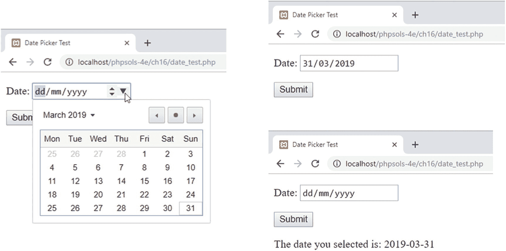

**图 16-5.** HTML5 日期输入字段以本地格式显示日期，但以 ISO 格式提交日期。

因此，使用单个输入字段输入日期，依赖于用户能遵循固定的日期输入模式，例如 `MM/DD/YYYY`。如果每个人都遵循，你可以使用 `explode()` 函数来重新排列日期各部分，如下所示：

```php
if (isset($_POST['theDate'])) {
    $date = explode('/', $_POST['theDate']);
    $mysqlFormat = "$date[2]-$date[0]-$date[1]";
}
```

如果有人偏离了格式，你的数据库中就会出现无效日期。因此，从在线表单收集日期最可靠的方法仍然是使用独立的月份、日期和年份输入字段。

---

## PHP 解决方案 16-4：为 MySQL 输入验证和格式化日期

此 PHP 解决方案专注于检查日期的有效性并将其转换为 MySQL 格式。它被设计用于集成到你自己的插入或更新表单中。

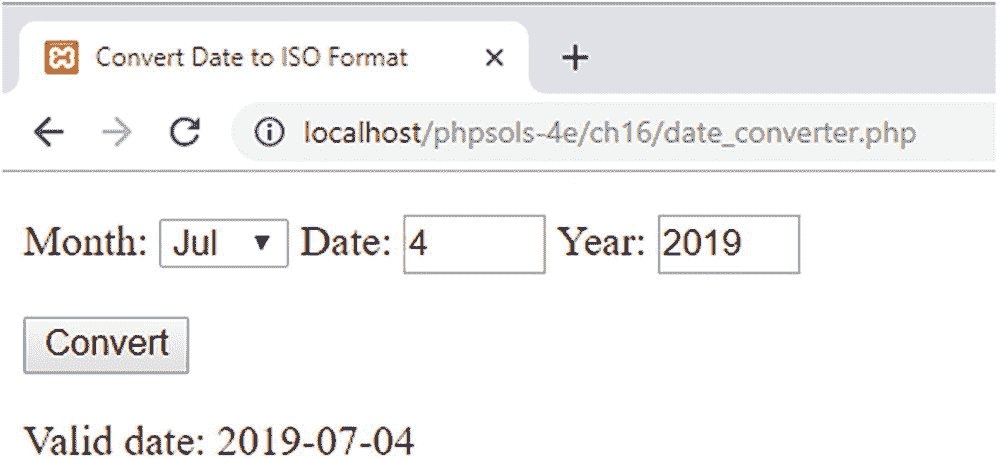

**图 16-7.** 日期已被验证并转换为 ISO 格式。

### 1. 执行所有检查的代码是 `utility_funcs.php` 中的一个自定义函数。它看起来像这样：

```php
function convertDateToISO($month, $day, $year) {
    $month = trim($month);
    $day = trim($day);
    $year = trim($year);
    $result[0] = false;
    if (empty($month) || empty($day) || empty($year)) {
        $result[1] = '请填写所有字段';
    } elseif (!is_numeric($month) || !is_numeric($day) ||
              !is_numeric($year)) {
        $result[1] = '请仅使用数字';
    } elseif (($month < 1 || $month > 12) || ($day < 1 || $day > 31) ||
              ($year < 1000 || $year > 9999)) {
        $result[1] = '请使用正确范围内的数字';
    } elseif (!checkdate($month, $day, $year)) {
        $result[1] = '您输入了无效日期';
    } else {
        $result[0] = true;
        $result[1] = sprintf('%d-%02d-%02d', $year, $month, $day);
    }
    return $result;
}
```

该函数接受三个参数：月份、日期和年份，这三个参数都应为数字。前三行代码会去除输入内容两端的空白字符，接下来的一行初始化了一个名为 `$result` 的数组的第一个元素。如果输入未通过验证，数组的第一个元素为 `false`，第二个元素包含错误消息。如果通过验证，`$result` 的第一个元素为 `true`，第二个元素包含格式化后的日期，可用于插入 MySQL。

这一系列条件语句检查输入值是否为空或非数字。第三个测试检查数字是否在可接受的范围内。年份的范围由 MySQL 的合法范围决定。万一你需要超出此范围的年份，则必须选择不同的列类型来存储数据。

通过使用一系列 `elseif` 子句，这段代码在遇到第一个错误时便停止测试。尽管表单已预填充值，但并不能保证输入一定来自你的表单。它可能来自自动化脚本，这就是为什么这些检查是必要的。

如果输入通过了前三个测试，它就会接受 PHP 函数 `checkdate()` 的检查，该函数足够智能，能识别闰年并避免如 9 月 31 日这样的错误。

最后，如果输入通过了所有这些测试，它会被使用 `sprintf()` 函数重新构建为正确的格式，以便插入 MySQL。此函数的第一个参数是一个格式化字符串，其中 `%d` 代表整数，`%02d` 代表一个两位整数，若有必要会在前面补零。连字符按字面处理。接下来的三个参数是要插入到格式化字符串中的值。这会生成 ISO 格式的日期，月份和日期都带有前导零。

**注意** 有关 `sprintf()` 的详细信息，请参见 [`www.php.net/manual/en/function.sprintf.php`](http://www.php.net/manual/en/function.sprintf.php)。

### 2. 为了测试，请将此代码添加到页面主体中表单的正下方：

```php
if (isset($_POST['convert'])) {
    $converted = convertDateToISO($_POST['month'], $_POST['day'],
                                  $_POST['year']);
    if ($converted[0]) {
        echo '有效日期：' . $converted[1];
    } else {
        echo '错误：' . $converted[1] . '';
        echo '输入内容为：' . $months[$_POST['month']-1] . ' ' .
             safe($_POST['day']) . ', ' . safe($_POST['year']);
    }
}
```

这段代码检查表单是否已提交。如果已提交，它将表单值传递给 `convertDateToISO()` 函数，并将结果保存在 `$converted` 中。

如果日期有效，`$converted[0]` 为 `true`，格式化的日期在 `$converted[1]` 中。如果日期无法转换为 ISO 格式，`else` 块会显示存储在 `$converted[1]` 中的错误消息以及原始输入内容。为了正确显示月份的值，从 `$_POST['month']` 的值中减去 1，并将结果用作 `$months` 数组的键。`$_POST['day']` 和 `$_POST['year']` 的值被传递给 `safe()` 函数，以防表单被用于远程利用。

### 3. 保存页面，输入日期并点击“转换”进行测试。
如果日期有效，你应该会看到它被转换为 ISO 格式，如图 16-7 所示。

### 4. 创建一个名为 `date_converter.php` 的页面，并插入一个包含以下代码的表单（或使用 `ch16` 文件夹中的 `date_converter_01.php`）：

```html
<form>
    月份：<input type="text" name="month"><br>
    日期：<input type="text" name="day"><br>
    年份：<input type="text" name="year"><br>
    <input type="submit" name="convert" value="转换">
</form>
```


这会创建一个名为`month`的下拉菜单，以及两个名为`day`和`year`的输入字段。该下拉菜单目前没有任何值，但稍后会用 PHP 循环来填充。`day`和`year`字段使用了 HTML5 的`number`类型和`required`属性。`day`字段还包含`max`和`min`属性，以便将范围限制在 1 到 31 之间。支持新 HTML5 表单元素的浏览器会在字段旁边显示数字步进器，并限制输入的类型和范围。其他浏览器则会将其渲染为普通的文本输入字段。为了兼容旧版浏览器，这两个字段都设置了`maxlength`属性，以限制可接受的字符数。

2. 修改构建下拉菜单的部分，如下所示：

```
"
    >
```

这会创建一个月份名称数组，并使用`date()`函数来查找当前月份的编号（传递给`date()`的参数含义将在本章后面解释）。

随后，一个`for`循环来填充菜单的`<option>`标签。我将`$i`的初始值设为`1`，因为我打算用它来表示月份的值。在循环内部，条件语句检查两组条件，这两组条件都用括号括起来，以确保它们以正确的顺序被求值。第一组检查`$_POST`数组是否为空，并且`$i`和`$thisMonth`的值是否相同。但如果表单已提交，`$_POST['month']`的值就会被设置，因此另一组条件检查`$i`是否与`$_POST['month']`相同。结果就是，首次加载表单时，`selected`会被插入到当前月份的`<option>`标签中。但如果表单已经提交，则会再次显示用户选择的月份。

月份名称通过从`$months`数组中提取，并显示在`<option>`标签之间。由于索引数组从 0 开始，你需要从`$i`的值中减 1 才能得到正确的月份。

3. 同样地，用当前日期或表单提交后选中的值来填充日和年的字段：

```
    Date:
    ">
    Year:
    ">
    ```

4. 保存页面并在浏览器中测试。它应该会显示当前日期，并且看起来类似于图 16-6。

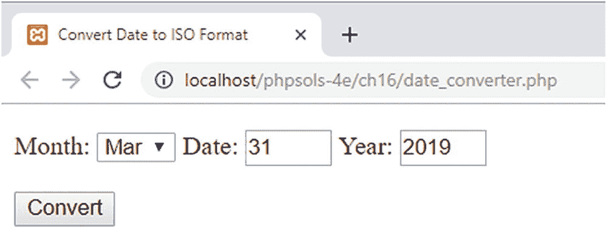

图 16-6.
为日期部分使用独立的输入字段有助于消除错误

如果你测试这些输入字段，在大多数浏览器中，Date 字段应最多接受两个字符，Year 字段最多接受四个字符。尽管这降低了出错的概率，但你仍然需要验证输入并正确格式化日期。

如果你输入了无效的日期，你应该会看到一条相应的错误消息（见图 16-8）。

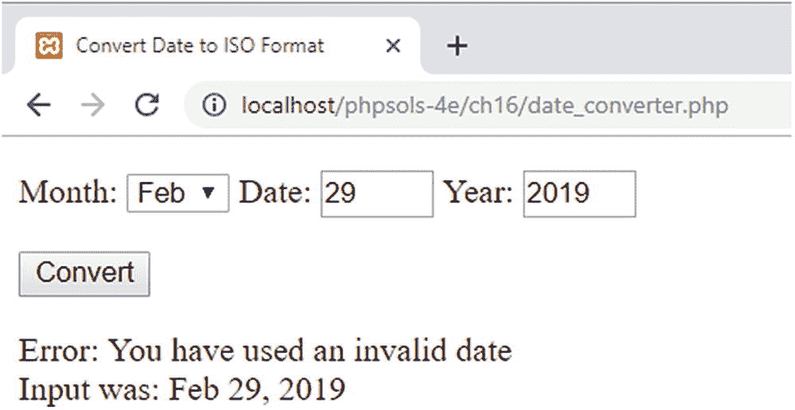

图 16-8.
`convertDateToISO()`函数会拒绝无效日期

你可以将自己的代码与 `ch16` 文件夹中的 `date_converter_02.php` 进行比较。

当为需要用户输入日期的表创建表单时，请按照与 `date_converter.php` 中相同的方式，添加月份、日期和年份三个字段。在将表单输入插入数据库之前，引入 `utility_funcs.php`（或你决定存储该函数的任何位置）文件，并使用 `convertDateToISO()` 函数验证日期并格式化，以便插入数据库：

```
require_once 'utility_funcs.php';
$converted = convertDateToMySQL($_POST['month'], $_POST['day'], $_POST['year']);
if ($converted[0]) {
$date = $converted[1];
} else {
$errors[] = $converted[1];
}
```

如果你的`$errors`数组包含任何元素，请中止插入或更新过程并显示错误。否则，`$date`即可安全地用于 SQL 查询。

**注意**
本章的其余部分专门讲述如何在 PHP 中处理日期。这是一个重要但复杂的话题。我建议你快速浏览每一节，以便熟悉 PHP 的日期处理功能，当你需要实现某个特定功能时再回到本节进行查阅。

## 在 PHP 中处理日期

与其他计算机语言一样，PHP 通过从 Unix 纪元（1970 年 1 月 1 日午夜 UTC，协调世界时）开始以秒为单位进行计算，来处理日期和时间的复杂性。在过去，当尝试设置过去或未来的日期（例如会员过期时），或者处理不同时区时，这涉及到繁琐的秒数和日期的相互转换计算。然而，由于 PHP 5 中引入了`DateTime`、`DateTimeZone`、`DateInterval`和`DatePeriod`类，这已不再是必需的操作。

可用的日期范围取决于 PHP 的编译方式。`DateTime`及相关类在内部以 64 位数字存储日期和时间信息，这使得能够表示大约从过去 2920 亿年到未来同样年份的日期。但是，如果 PHP 是在 32 位处理器上编译的，则表 16-3 后半部分中函数的范围将被限制在大约 1901 年至 2038 年 1 月之间。

表 16-3 总结了 PHP 中主要的日期和时间相关的类及函数。

**表 16-3.** PHP 日期和时间相关的类与函数

| 名称 | 参数 | 描述 |
| :--- | :--- | :--- |
| **类** | | |
| `DateTime` | 日期字符串，`DateTimeZone`对象 | 创建一个对时区敏感的对象，包含可用于日期和时间计算的日期和/或时间信息。 |
| `DateTimeImmutable` | 同 `DateTime` | 与`DateTime`相同，但更改任何值都会返回一个新对象，原始对象保持不变。 |
| `DateTimeZone` | 时区字符串 | 存储时区信息，供`DateTime`对象使用。 |
| `DateInterval` | 间隔说明 | 表示一个固定的时间段（年、月、小时等）。 |
| `DatePeriod` | 开始时间，间隔，结束时间/重复次数，选项 | 计算一段时间内或一定重复次数内的循环日期。 |
| **函数** | | |
| `time()` | 无 | 生成当前日期和时间的 Unix 时间戳。 |
| `mktime()` | 小时，分钟，秒，月，日，年 | 为指定的日期/时间生成 Unix 时间戳。 |
| `strtotime()` | 日期字符串，时间戳 | 尝试从英文文本描述（例如“next Tuesday”）生成 Unix 时间戳。返回的值相对于第二个参数（如果提供）。 |
| `date()` | 格式字符串，时间戳 | 使用表 16-4 中列出的说明符格式化英文日期。如果省略第二个参数，则使用当前日期和时间。 |
| `strftime()` | 格式字符串，时间戳 | 与`date()`相同，但使用系统区域设置指定的语言。 |

### 设置默认时区

PHP 中的所有日期和时间信息都根据服务器的默认时区设置进行存储。Web 服务器与目标受众位于不同时区是很常见的，因此了解如何更改默认设置非常有用。

服务器的默认时区通常应该在 `php.ini` 的 `date.timezone` 指令中设置，但如果你的托管服务提供商忘记设置，或者你想使用不同的时区，则需要自行设置。

如果你的托管服务提供商允许你控制自己的 `php.ini` 版本，请在其中更改 `date.timezone` 的值。这样，该设置就会自动应用于你所有的脚本。


如果你的服务器支持`.htaccess`或`.user.ini`文件，你可以通过在站点根目录添加相应的命令来更改时区。对于`.htaccess`，请使用以下内容：

```
php_value date.timezone 'timezone'
```

对于`.user.ini`，命令如下所示：

```
date.timezone=timezone
```

将`timezone`替换为适合你所在位置的正确设置。你可以在[`www.php.net/manual/en/timezones.php`](http://www.php.net/manual/en/timezones.php)找到有效的时区完整列表。

如果以上选项均不可用，请在任何使用日期或时间函数的脚本开头添加以下内容（将`timezone`替换为适当的值）：

```
ini_set('date.timezone', 'timezone');
```

## 创建 DateTime 对象

要创建一个`DateTime`对象，只需使用`new`关键字后跟`DateTime()`，如下所示：

```
$now = new DateTime();
```

这会创建一个对象，表示根据 Web 服务器时钟和默认时区设置的当前日期和时间。

`DateTime()`构造函数还接受两个可选参数：一个包含日期和/或时间的字符串，以及一个`DateTimeZone`对象。第一个参数的日期/时间字符串可以是[`www.php.net/manual/en/datetime.formats.php`](http://www.php.net/manual/en/datetime.formats.php)列出的任何格式。与仅接受一种格式的 MySQL 不同，PHP 走向了另一个极端。例如，要为 2019 年圣诞节创建一个`DateTime`对象，以下所有格式都是有效的：

```
'12/25/2019'
'25-12-2019'
'25 Dec 2019'
'Dec 25 2019'
'25-XII-2019'
'25.12.2019'
'2019/12/25'
'2019-12-25'
'December 25th, 2019'
```

这不是一个详尽的列表，仅是一些有效格式的示例。潜在的混淆点在于分隔符的使用。例如，正斜杠允许用于美式日期（`12/25/2019`）和 ISO 日期（`2019/12/25`），但在欧洲顺序表示日期或月份使用罗马数字时则不允许。要以欧洲顺序表示日期，分隔符必须是点、制表符或破折号。日期也可以使用相对表达式指定，例如“下周三”、“明天”或“上周一”。然而，这也存在混淆的可能性。有些人用“下周三”表示“下周的星期三”，而 PHP 按字面意思解释：如果今天是星期二，“下周三”指的是第二天。

你不能单独使用`echo`来显示`DateTime`对象中存储的值。除了`echo`，你还需要使用`format()`方法告诉 PHP 如何格式化输出。

## 在 PHP 中格式化日期

`DateTime`类的`format()`方法使用与`date()`函数相同的格式字符。虽然这保证了连续性，但格式字符通常难以记忆，并且背后似乎没有明显的逻辑依据。表 16-4 列出了最有用的日期和时间格式字符。

`DateTime`类和`date()`函数仅以英文显示星期和月份的名称，但`strftime()`函数使用服务器区域设置指定的语言。因此，如果服务器的区域设置为西班牙语，`DateTime`对象和`date()`显示为 Saturday，而`strftime()`显示为 sábado。除了`DateTime`类和`date()`函数都使用的格式字符外，表 16-4 还列出了`strftime()`使用的等效字符。并非所有格式在`strftime()`中都有等效项。

**表 16-4. 主要的日期和时间格式字符**

| 单位 | DateTime/date() | strftime() | 描述 | 示例 |
| --- | --- | --- | --- | --- |
| 日 | `d` | `%d` | 带前导零的月份中的日数 | 01 到 31 |
|     | `j` | `%e`* | 不带前导零的月份中的日数 | 1 到 31 |
|     | `S` |            | 月份的英文序数后缀 | st, nd, rd 或 th |
|     | `D` | `%a` | 星期名称的前三个字母 | Sun, Tue |


| `l`（小写字母 L） | `%A` | 星期几的全名 | Sunday, Tuesday |
| Month（月份） | `m` | `%m` | 带前导零的月份数字 | 01 到 12 |
| | `n` | | 不带前导零的月份数字 | 1 到 12 |
| `M` | `%b` | 月份名称的前三个字母 | Jan, Jul |
| `F` | `%B` | 月份的全名 | January, July |
| Year（年份） | `Y` | `%Y` | 四位数字显示的年份 | 2014 |
| `y` | `%y` | 两位数字显示的年份 | 14 |
| Hour（小时） | `g` | | 12 小时制，不带前导零 | 1 到 12 |
| `h` | `%I` | 12 小时制，带前导零 | 01 到 12 |
| `G` | | 24 小时制，不带前导零 | 0 到 23 |
| `H` | `%H` | 24 小时制，带前导零 | 01 到 23 |
| Minutes（分钟） | `i` | `%M` | 必要时带前导零的分钟数 | 00 到 59 |
| Seconds（秒） | `s` | `%S` | 必要时带前导零的秒数 | 00 到 59 |
| AM/PM（上午/下午） | `a` | | 小写 | am |
| AM/PM（上午/下午） | `A` | `%p` | 大写 | PM |

**注意：** Windows 系统不支持 `%e`。

你可以将这些格式字符与标点符号结合使用，根据自己的偏好，在网页中显示当前日期。

要格式化一个 `DateTime` 对象，可以向 `format()` 方法传递一个格式字符串作为参数，如下所示（代码位于 `ch16` 文件夹中的 `date_format_01.php`）：

```
现在是 format('g.ia') ?>，今天是 format('l, F jS, Y') ?>
2019 年的圣诞节是 format('l') ?>
```

在这个示例中，创建了两个 `DateTime` 对象：一个用于当前日期和时间，另一个用于 2019 年 12 月 25 日。使用表 16-4 中的格式字符，从这两个对象中提取出不同的日期部分，生成了如下截图所示的输出：
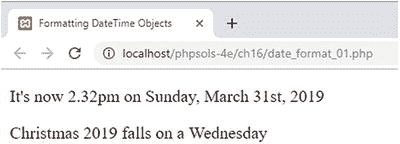

`date_format_02.php` 中的代码通过使用 `date()` 和 `strtotime()` 函数生成了相同的输出，如下所示：

```
现在是 
2019 年的圣诞节是 
```

第一行使用 `strtotime()` 为 2019 年 12 月 25 日创建了一个时间戳。无需为当前日期和时间创建时间戳，因为当没有第二个参数时，`date()` 函数默认使用当前日期和时间。

如果圣诞日的时间戳在脚本的其他地方没有用到，则第一行可以省略，对 `date()` 的最后一次调用可以重写如下（参见 `date_format_03.php`）：

```
date('l', strtotime('12/25/2019'))
```

## 从自定义格式创建 DateTime 对象

你可以使用表 16-4 中的格式字符，为 `DateTime` 对象指定一个自定义输入格式。创建该对象时，不是使用 `new` 关键字，而是使用 `createFromFormat()` 静态方法，如下所示：

```
$date = DateTime::createFromFormat(format_string, input_date, timezone);
```

第三个参数 *timezone* 是可选的。如果包含该参数，它应该是一个 `DateTimeZone` 对象。

**静态方法**属于整个类，而不是某个特定的对象。调用静态方法时，需要使用类名，后跟作用域解析运算符（双冒号）和方法名。

> **提示**
> 在内部，作用域解析运算符被称为 `PAAMAYIM_NEKUDOTAYIM`，这是希伯来语，意为 "双冒号"。为什么是希伯来语？驱动 PHP 的 Zend 引擎最初由 Zeev Suraski 和 Andi Gutmans 在以色列理工学院就读时开发。除了能在极客知识问答中得分外，了解 `PAAMAYIM_NEKUDOTAYIM` 的含义还能在你看到 PHP 错误信息中出现它时，省去你绞尽脑汁的烦恼。

例如，你可以使用 `createFromFormat()` 方法来接受使用欧洲日期格式（日、月、年，用斜杠分隔）的日期，如下所示（代码位于 `date_format_04.php`）：

```
$xmas2019 = DateTime::createFromFormat('d/m/Y', '25/12/2019');
echo $xmas2019->format('l, jS F Y');
```

这将产生以下输出：
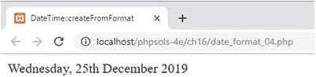

> **警告**
> 尝试使用 25/12/2014 作为 `DateTime` 构造函数的输入会触发致命错误，因为不支持 `DD/MM/YYYY` 格式。如果你想使用 `DateTime` 构造函数不支持的格式，则必须使用 `createFromFormat()` 静态方法。

尽管 `createFromFormat()` 方法很有用，但它只能在你确保日期始终是特定格式的情况下使用。

## 在 date() 和 DateTime 类之间进行选择

在显示日期时，使用 `DateTime` 类始终是一个两步过程。你需要在调用 `format()` 方法之前实例化该对象。而使用 `date()` 函数，则只需一步就能完成。由于它们使用相同的格式字符，在处理当前日期和/或时间时，`date()` 函数显然更胜一筹。

对于显示当前日期、时间或年份等简单任务，请使用 `date()`。而 `DateTime` 类的真正优势在于处理与日期相关的计算和时区时，可使用表 16-5 中列出的方法。

**表 16-5.** 主要的 `DateTime` 方法

| 方法 | 参数 | 描述 |
| --- | --- | --- |
| `format()` | 格式字符串 | 使用表 16-4 中的格式字符来格式化日期/时间。 |
| `setDate()` | 年、月、日 | 更改日期。参数应用逗号分隔。超出允许范围的月份或天数将累加到生成的日期中，如正文所述。 |
| `setTime()` | 小时、分钟、秒 | 重置时间。参数为逗号分隔的值。秒是可选的。超出允许范围的值将累加到生成的日期/时间中。 |
| `modify()` | 相对日期字符串 | 使用相对表达式（例如 `'+2 weeks'`）更改日期/时间。 |
| `getTimestamp()` | 无 | 返回日期/时间的 Unix 时间戳。 |
| `setTimestamp()` | Unix 时间戳 | 根据 Unix 时间戳设置日期/时间。 |
| `setTimezone()` | `DateTimeZone` 对象 | 更改时区。 |
| `getTimezone()` | 无 | 返回代表 `DateTime` 对象时区的 `DateTimeZone` 对象。 |
| `getOffset()` | 无 | 返回与 UTC 的时区偏移量，以秒为单位。 |
| `add()` | `DateInterval` 对象 | 按设定时间段增加日期/时间。 |
| `sub()` | `DateInterval` 对象 | 从日期/时间中减去设定时间段。 |
| `diff()` | `DateTime` 对象，布尔值 | 返回一个 `DateInterval` 对象，表示当前 `DateTime` 对象与作为参数传入的 `DateTime` 对象之间的差值。使用可选的第二个参数 `true` 会将负值转换为正数。 |

使用 `setDate()` 和 `setTime()` 添加超出范围的值会导致溢出值累加到结果日期或时间中。例如，使用 14 作为月份会将日期设置为下一年的二月。将小时设置为 26 会导致结果为次日凌晨 2 点。

`setDate()` 有一个有用的技巧：通过将月份值设置为下一个月，并将日期设置为 0，你就可以将日期设置为任何月份的最后一天。`setDate.php` 中的代码通过显示 2019 年和 2020 年（闰年）二月的最后一天来演示这一点：

```
setDate(2019, 3, 0);
?>
非闰年：format($format) ?>。
闰年：setDate(2020, 3, 0);
echo $date->format($format); ?>。
```

前面的示例产生以下输出：
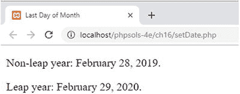


### 使用相对日期处理溢出问题

`modify()` 方法接受一个相对日期字符串，这可能会产生意外结果。例如，如果你向一个表示 2019 年 1 月 31 日的`DateTime`对象增加一个月，结果值不会是二月的最后一天，而是 3 月 3 日。

发生这种情况是因为，在原日期上增加一个月得到的是 2 月 31 日，但在非闰年中二月只有 28 天。因此，超出范围的值会累加到月份上，最终得到 3 月 3 日。如果随后从同一个`DateTime`对象减去一个月，你会回到 2 月 3 日，而不是原始的起始日期。`date_modify_01.php` 中的代码说明了这一点，如图 16-9 所示。

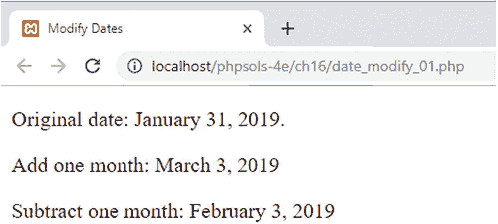

**图 16-9.** 增加和减少月份可能导致意外结果

```
原始日期: format($format) ?>.
增加一个月: modify('+1 month');
echo $date->format($format);
$date->modify('-1 month');
?>
减少一个月: format($format) ?>
```

避免此问题的方法是在相对表达式中使用`'last day of'`，如下所示（代码在 `date_modify_02.php`）：

```
原始日期: format($format) ?>.
增加一个月: modify('last day of +1 month');
echo $date->format($format);
$date->modify('last day of -1 month');
?>
减少一个月: format($format) ?>
```

如图 16-10 所示，这样做现在得到了期望的结果。

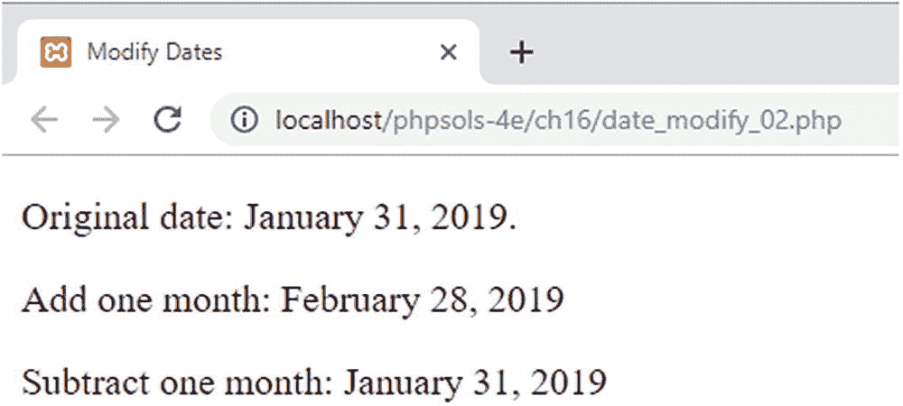

**图 16-10.** 在相对表达式中使用`'last day of'`解决了问题

### 使用 `DateTimeZone` 类

除非你已使用前面描述的方法之一重置了时区，否则`DateTime`对象会自动使用 Web 服务器的默认时区。但是，你可以通过构造函数的可选第二个参数或使用`setTimezone()`方法来设置单个`DateTime`对象的时区。在这两种情况下，参数都必须是一个`DateTimeZone`对象。

要创建一个`DateTimeZone`对象，需将`www.php.net/manual/en/timezones.php`列出的一个受支持的时区作为参数传递给构造函数，如下所示：

```
$UK = new DateTimeZone('Europe/London');
$USeast = new DateTimeZone('America/New_York');
$Hawaii = new DateTimeZone('Pacific/Honolulu');
```

查看受支持时区列表时，务必认识到它们是基于地理区域和城市，而非官方时区。这是因为 PHP 会自动考虑夏令时。亚利桑那州不使用夏令时，它被覆盖在`America/Phoenix`之下。将时区按地理区域组织会带来一些意外。`America` 并非指美国，而是指南北美洲和加勒比地区的大陆。因此，火奴鲁鲁并不在`America`之下，而是作为太平洋时区列出。`Europe` 也指的是欧洲大陆，包括不列颠群岛，但排除其他岛屿。因此，雷克雅未克和马德拉群岛被列为大西洋时区，而位于挪威斯瓦尔巴群岛上的朗伊尔城则独享作为唯一一个北极时区的特权。

`timezones.php`中的代码为伦敦、纽约和火奴鲁鲁创建了`DateTimeZone`对象，然后使用第一个对象初始化一个`DateTime`对象，如下所示：

```
$now = new DateTime('now', $UK);
```

在使用`echo`和`format()`方法显示日期和时间后，通过`setTimezone()`方法更改时区，如下所示：

```
$now->setTimezone($USeast);
```

下次显示`$now`时，它会显示纽约的日期和时间。最后，再次使用`setTimezone()`将时区更改为火奴鲁鲁，输出如下：

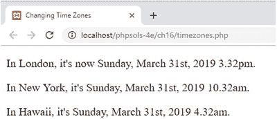

**注意：** 时区转换的准确性取决于 PHP 中编译的时区数据库是否为最新。欧盟计划从 2021 年起废除夏令时，但成员国将有权自由选择永久采用标准时间还是夏令时。如果某些服务器没有更新，这很可能会导致时间不正确。

要查找服务器的时区，你可以检查`php.ini`，或者对`DateTime`对象使用`getTimezone()`方法。`getTimezone()`方法返回的是一个`DateTimeZone`对象，而不是包含时区的字符串。要获取时区的值，你需要使用`DateTimeZone`对象的`getName()`方法，如下所示（代码在 `timezone_display.php`）：

```
$now = new DateTime();
$timezone = $now->getTimezone();
echo $timezone->getName();
```

`DateTimeZone`类还有其他几个方法，用于公开时区的相关信息。为完整起见，它们被列在表 16-6 中，但`DateTimeZone`类的主要用途是设置`DateTime`对象的时区。

**表 16-6.** `DateTimeZone` 方法

| 方法 | 参数 | 描述 |
| --- | --- | --- |
| `getLocation()` | 无 | 返回一个关联数组，包含国家代码、纬度、经度以及关于该时区的注释。 |
| `getName()` | 无 | 返回一个包含该时区地理区域和城市的字符串。 |
| `getOffset()` | `DateTime` 对象 | 计算作为参数传递的`DateTime`对象与 UTC 的偏移量（以秒为单位）。 |
| `getTransitions()` | 开始，结束 | 返回一个多维数组，包含夏令时启用和禁用的历史及未来日期和时间。接受两个可选的时间戳参数来限制结果范围。 |
| `listAbbreviations()` | 无 | 生成一个大的多维数组，包含 PHP 支持的时区的 UTC 偏移量和名称。 |
| `listIdentifiers()` | `DateTimeZone` 常量，国家代码 | 返回一个包含所有 PHP 时区标识符（例如`Europe/London`、`America/New_York`等）的数组。接受两个可选参数来限制结果范围。第一个参数使用`www.php.net/manual/en/class.datetimezone.php`列出的`DateTimeZone`常量之一。如果第一个参数是`DateTimeZone::PER_COUNTRY`，则可以使用两个字母的国家代码作为第二个参数。 |

表 16-6 中的最后两个方法是静态方法。使用范围解析运算符直接在类上调用它们，如下所示：

```
$abbreviations = DateTimeZone::listAbbreviations();
```

### 使用 `DateInterval` 类添加和减去固定时间段

`DateInterval`类用于指定要使用`add()`和`sub()`方法对`DateTime`对象增加或减去的时段。`diff()`方法也使用它，该方法返回一个`DateInterval`对象。起初使用`DateInterval`类可能会感觉有点奇怪，但它实际上相对容易理解。

要创建一个`DateInterval`对象，需要向构造函数传递一个指定间隔长度的字符串；该字符串必须按照 ISO 8601 标准格式化。该字符串始终以字母`P`（代表期间）开头，后跟一个或多个整数与字母（称为**期间指示符**）组成的对。如果间隔包含小时、分钟或秒，则时间元素前面需要加上字母`T`。表 16-7 列出了有效的期间指示符。

表 16-7. `DateInterval` 类使用的 ISO 8601 周期标识符

| 周期标识符 | 含义                     |
| :--------- | :----------------------- |
| `Y`        | 年                       |
| `M`        | 月                       |
| `W`        | 周——不能与天数组合       |
| `D`        | 天——不能与周数组合       |
| `H`        | 小时                     |
| `M`        | 分钟                     |
| `S`        | 秒                       |

以下示例应阐明如何指定时间间隔：

```
$interval1 = new DateInterval('P2Y');           // 2 years
$interval2 = new DateInterval('P5W');           // 5 weeks
$interval3 = new DateInterval('P37D');          // 5 weeks 2 days
$interval4 = new DateInterval('PT6H20M');       // 6 hours 20 minutes
$interval5 = new DateInterval('P1Y2DT3H5M50S'); // 1 year 2 days 3 hours 5 min 50 sec
```

请注意，`$interval3` 需要指定总天数，因为周会自动转换为天，因此在同一个时间间隔定义中不能组合使用 `W` 和 `D`。

要将 `DateInterval` 对象与 `DateTime` 类的 `add()` 或 `sub()` 方法一起使用，请将该对象作为参数传递。例如，这将为 2019 年圣诞节的日期增加 12 天：

```
$xmas2019 = new DateTime('12/25/2019');
$interval = new DateInterval('P12D');
$xmas2019->add($interval);
```

如果不需要重复使用此间隔，你可以直接将 `DateInterval` 构造函数作为参数传递给 `add()`，如下所示：

```
$xmas2019 = new DateTime('12/25/2019');
$xmas2019->add(new DateInterval('P12D'));
```

此计算的结果在 `date_interval_01.php` 中演示，并产生以下输出：
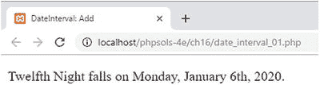

使用表 16-7 中列出的周期标识符的替代方法是使用静态的 `createFromDateString()` 方法，该方法接受一个英文的相对日期字符串作为参数，方式与 `strtotime()` 相同。使用 `createFromDateString()`，前面的示例可以重写如下（代码在 `date_interval_02.php` 中）：

```
$xmas2014 = new DateTime('12/25/2014');
$xmas2014->add(DateInterval::createFromDateString('+12 days'));
```

这会得到完全相同的结果。

**小心**
使用 `DateInterval` 加减月份的效果与前面描述的一致。如果结果日期超出了范围，则会增加额外的天数。例如，在 1 月 31 日上加一个月，结果会是 3 月 3 日或 2 日，具体取决于是否是闰年。要获取该月的最后一天，请使用前面在“使用相对日期处理溢出”中描述的技术。

### 使用 `diff()` 方法查找两个日期之间的差异

要查找两个日期之间的差异，请为两个日期分别创建一个 `DateTime` 对象，然后将第二个对象作为参数传递给第一个对象的 `diff()` 方法。结果将作为一个 `DateInterval` 对象返回。要从 `DateInterval` 对象中提取结果，你需要使用该对象的 `format()` 方法，该方法使用表 16-8 中列出的格式字符。这些字符与 `DateTime` 类使用的格式字符不同。幸运的是，其中大部分都很容易记住。

表 16-8. `DateInterval format()` 方法使用的格式字符

| 格式字符 | 描述                               | 示例        |
| :------- | :--------------------------------- | :---------- |
| `%Y`     | 年，至少两位，必要时前导零         | 12, 01      |
| `%y`     | 年，无前导零                       | 12, 1       |
| `%M`     | 月，带前导零                       | 02, 11      |
| `%m`     | 月，无前导零                       | 2, 11       |
| `%D`     | 日，带前导零                       | 03, 24      |
| `%d`     | 日，无前导零                       | 3, 24       |
| `%a`     | 总天数                             | 15, 231     |
| `%H`     | 小时，带前导零                     | 03, 23      |
| `%h`     | 小时，无前导零                     | 3, 23       |
| `%I`     | 分钟，带前导零                     | 05, 59      |
| `%i`     | 分钟，无前导零                     | 5, 59       |
| `%S`     | 秒，带前导零                       | 05, 59      |
| `%s`     | 秒，无前导零                       | 5, 59       |
| `%R`     | 负数显示负号，正数显示正号         | -, +        |
| `%r`     | 负数显示负号，正数不显示符号       | -           |
| `%%`     | 百分号                             | %           |

`date_interval_03.php` 中的以下示例展示了如何使用 `diff()` 获取当前日期与美国《独立宣言》签署日期之间的差异，并使用 `format()` 方法显示结果：

```
diff($independence);
echo $interval->format('%Y years %m months %d days'); ?>
since American Declaration of Independence.
```

如果将 `date_interval_03.php` 加载到浏览器中，您应该会看到类似于以下截图的内容（当然，实际时间段会有所不同）。
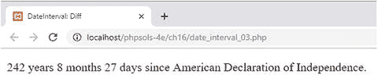
格式字符遵循逻辑模式。大写字符始终产生至少两位数字，必要时带有前导零。小写字符没有前导零。

**小心**
除了表示总天数的 `%a` 之外，其他格式字符仅表示整个时间间隔的特定部分。例如，如果将格式字符串更改为 `$interval->format('%m months')`，它将只显示自上个 7 月 4 日以来经过的整月数。它不会显示自 1776 年 7 月 4 日以来的总月数。

### 使用 `DatePeriod` 类计算重复日期

由于 `DatePeriod` 类的出现，计算重复日期（例如每个月的第二个星期二）现在变得异常简单。它与 `DateInterval` 协同工作。

`DatePeriod` 构造函数比较特殊，因为它可以以三种不同的方式接受参数。创建 `DatePeriod` 对象的第一种方法是提供以下参数：

-   一个表示开始日期的 `DateTime` 对象
-   一个表示重复间隔的 `DateInterval` 对象
-   一个表示重复次数的整数
-   `DatePeriod::EXCLUDE_START_DATE` 常量（可选）

创建 `DatePeriod` 对象后，您可以在 `foreach` 循环中使用 `DateTime` 的 `format()` 方法来显示重复日期。

`date_interval_04.php` 中的代码显示 2019 年每个月的第二个星期二：

```
$start = new DateTime('12/31/2018');
$interval = DateInterval::createFromDateString('second Tuesday of next month');
$period = new DatePeriod($start, $interval, 12, DatePeriod::EXCLUDE_START_DATE);
foreach ($period as $date) {
echo $date->format('l, F jS, Y') . '';
}
```

它产生的输出如图 16-11 所示。

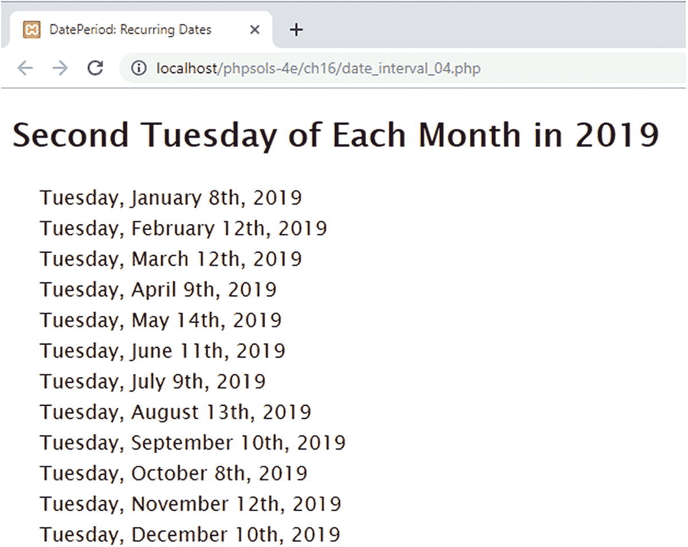

**图 16-11.** 使用 `DatePeriod` 类计算重复日期异常简单

PHP 代码的第一行将开始日期设置为 2018 年 12 月 31 日。下一行使用 `DateInterval` 的静态方法 `createFromDateString()` 将间隔设置为下个月的第二个星期二。这两个值与表示重复次数的整数 12 以及常量 `DatePeriod::EXCLUDE_START_DATE` 一起传递给 `DatePeriod` 构造函数。该常量的名称不言自明。最后，一个 `foreach` 循环使用 `DateTime` 的 `format()` 方法显示结果日期。

创建 `DatePeriod` 对象的第二种方法是用一个表示结束日期的 `DateTime` 对象替换第三个参数中的重复次数。`date_interval_05.php` 中的代码已按如下方式修改：

```
$start = new DateTime('12/31/2018');
$interval = DateInterval::createFromDateString('second Tuesday of next month');
$end = new DateTime('12/31/2019');
$period = new DatePeriod($start, $interval, $end, DatePeriod::EXCLUDE_START_DATE);
foreach ($period as $date) {
echo $date->format('l, F jS, Y') . '';
}
```

这将产生与图 16-11 完全相同的输出。


你可以使用 ISO 8601 重复时间间隔标准（[`https://en.wikipedia.org/wiki/ISO_8601#Repeating_intervals`](https://en.wikipedia.org/wiki/ISO_8601%2523Repeating_intervals)）来创建一个 `DatePeriod` 对象。这种方式不太直观，主要是因为需要以正确的格式构造一个字符串，其格式如下：

```
Rn/YYYY-MM-DDTHH:MM:SStz/Pinterval
```

`R`*n* 是字母 `R` 后跟重复次数；*tz* 是相对于 UTC 的时区偏移量（或 `Z` 表示 UTC，如以下示例所示）；`P`*interval* 使用与 `DateInterval` 类相同的格式。`date_interval_06.php` 中的代码展示了如何使用 ISO 8601 重复间隔的 `DatePeriod`。代码如下：

```
$period = new DatePeriod('R4/2019-07-10T00:00:00Z/P10D');
foreach ($period as $date) {
    echo $date->format('l, F j, Y') . '';
}
```

ISO 重复间隔设置了从 2019 年 7 月 10 日 UTC 时间午夜开始、间隔为 10 天的四次重复。重复次数是在原始日期之后进行的，因此上述示例产生了五个日期，如以下输出所示。
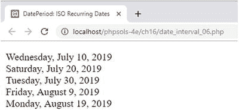

## 章节回顾

本章的很大一部分内容都致力于介绍 PHP 5 中引入的强大日期和时间类。我没有介绍 `DateTimeImmutable` 类，因为除了一个方面之外，它在其他所有方面都与 `DateTime` 相同。`DateTimeImmutable` 对象从不修改自身。相反，它总是返回一个包含修改后值的新对象。如果你有一个不会变化的日期（例如某人的出生日期），这会非常有用。对此类对象使用 `setDate()` 或 `add()` 方法会返回一个新对象，从而在保留原始细节的同时，为更新后的细节（如入职日期、结婚日期、退休年龄等）提供一个新对象。

你可能并不每天都用到日期和时间相关的类，但它们非常有用。MySQL 的日期和时间函数也使得根据时间条件格式化日期和执行查询变得容易。

日期最大的问题或许在于决定是使用 SQL 还是 PHP 来处理格式化和/或计算。PHP 的 `DateTime` 类的一个有用特性是，其构造函数接受以 ISO 格式存储的日期，因此你可以使用数据库中未格式化的日期或时间戳来创建 `DateTime` 对象。但是，除非你需要执行进一步的计算，否则在 `SELECT` 查询中使用 `DATE_FORMAT()` 函数会更高效。

本章还为你提供了三个用于格式化文本和日期的函数。在下一章中，你将学习如何在多个数据库表中存储和检索相关信息。

## 17. 从多个表中提取数据

正如我在第 13 章中所解释的，关系型数据库的主要优势之一是能够通过使用一个表中的主键作为另一个表中的外键来链接不同表中的数据。`phpsols` 数据库有两个表：`images` 和 `blog`。现在是时候添加更多表并进行连接了，这样你就可以为博客条目分配类别，并将图像与单个文章关联起来。

你实际上并不需要物理连接多个表，而是通过 SQL 来实现连接。通常，你可以通过识别主键和外键之间的直接关系来连接表。然而，在某些情况下，关系更为复杂，需要通过第三个表作为另外两个表之间的交叉引用来实现。

在本章中，你将学习如何建立表之间的关系，以及如何将一个表中的主键作为外键插入到另一个表中。尽管从概念上听起来很困难，但实际上相当简单——你使用数据库查询在第一个表中查找主键，保存结果，然后在另一个查询中使用该结果将其插入到第二个表中。

具体来说，你将了解以下内容：

*   理解不同类型的表关系
*   使用交叉引用表实现多对多关系
*   修改表结构以添加新列或索引
*   将主键作为外键存储在另一个表中
*   使用 `INNER JOIN` 和 `LEFT JOIN` 链接表

### 理解表关系

最简单的关系类型是**一对一**（通常表示为 **1:1**）。这种类型的关系常见于包含仅供特定人员查看信息的数据库中。例如，公司通常将员工的薪资和其他机密信息存储在一个表中，该表与更广泛可访问的员工列表分开。将每个员工记录的主键作为外键存储在薪资表中，就在这两个表之间建立了直接关系，从而允许财务部门查看全部信息，同时限制其他人只能查看公共信息。

`phpsols` 数据库中没有任何机密信息，但你可能会在 `images` 表中的单个照片与 `blog` 表中的一篇文章之间创建一对一关系，如图 17-1 所示。

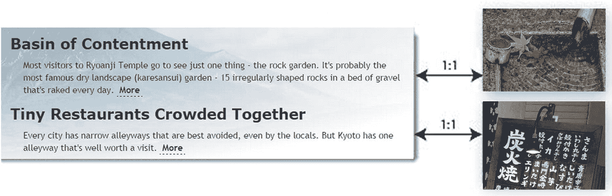

**图 17-1.** 一对一关系将一个记录直接链接到另一个记录

这是在两个表之间创建关系的最简单方法，但并不理想。随着更多文章的加入，关系的性质很可能会发生变化。图 17-1 中与第一篇文章关联的照片显示的是漂浮在水面上的枫叶，因此它可能适合用来图解一篇关于季节变换或秋色的文章。清澈的水、竹制水舀和竹管也暗示了其他可以用这张照片来阐释的主题。因此，你很可能会遇到同一张照片被用于多篇文章的情况，即**一对多**（或 **1:n**）关系，如图 17-2 所示。


**图 17-2.** 一对多关系将一个记录链接到多个其他记录


# 关系数据库中的表关联与外部键

## 主键、外键与关系类型

正如你已经了解到的，主键必须是唯一的。因此，在`1:n`关系中，你需要将关系`1`方表中的主键（**主表**或**父表**）作为外键存储在关系`n`方表（**从表**或**子表**）中。在这种情况下，`images`表中的`image_id`需要作为外键存储在`blog`表中。

关于`1:n`关系，需要理解的重要一点是：它实际上也是一系列`1:1`关系的集合。从右向左阅读图 17-2，每篇文章都与一张图片存在一对一的关系。如果没有这种一对一关系，你将无法确定哪张图片与特定文章相关联。

## 多对多关系

如果希望每篇文章关联多张图片，该怎么办？你可以在`blog`表中创建多个列来存储外键，但这很快就会变得难以管理。你可能从`image1`、`image2`和`image3`开始，但如果大多数文章只有一张图片，那么大部分时候两列都是冗余的。而且，你是否要为那篇需要四张图片的特殊文章再添加一列呢？

当需要处理**多对多**（或`n:m`）关系时，你需要采用不同的方法。`images`和`blog`表中的记录不足以演示`n:m`关系，但你可以添加一个`categories`表来标记单篇文章。大多数文章可能属于多个分类，而每个分类又可能与多篇文章相关联。

解决复杂关系的方法是使用**交叉引用表**（有时称为**链接表**），它建立了相关记录之间的一系列一对一关系。这是一个特殊的表，只包含两列，且这两列都被声明为联合主键。图 17-3 展示了其工作原理。交叉引用表中的每条记录都存储了`blog`表和`categories`表中单篇文章与分类之间的关系细节。要查找所有属于`Kyoto`分类的文章，你在`categories`表中将`cat_id 1`与交叉引用表中的`cat_id 1`进行匹配，从而确定`blog`表中`article_id`为`2`、`3`和`4`的记录与`Kyoto`相关联。

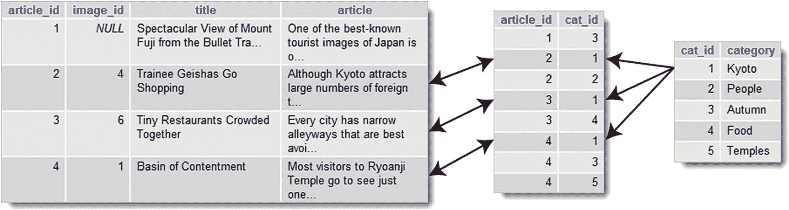

**图 17-3.** 交叉引用表将多对多关系分解为`1:1`关系

## 引用完整性

通过外键建立表之间的关系，对你更新和删除记录的方式有重要影响。如果不小心，就会产生断开的链接。确保依赖关系不被破坏，这被称为维护**引用完整性**。我们将在下一章讨论这个重要主题。首先，让我们专注于检索存储在通过外键关系连接的独立表中的信息。

## 将图片链接到文章

为了演示如何操作多个表，让我们从图 17-1 和图 17-2 中概述的简单场景开始：这些关系可以通过将一个表（父表）的主键作为外键存储在第二个表（子表或从表）中来解析为`1:1`关系。这需要在子表中添加一个额外的列来存储外键。

### 修改现有表结构

理想情况下，你应该在填充数据之前设计好数据库结构。然而，关系型数据库（如 MySQL）足够灵活，允许你在表已经包含记录时添加、删除或修改列。要将图片关联到`phpsols`数据库中的单篇文章，你需要在`blog`表中添加一个额外的列来存储`image_id`作为外键。

## PHP 解决方案 17-1：向表中添加额外列

本 PHP 解决方案演示了如何使用 phpMyAdmin 向现有表添加额外列。假设你已经在第 15 章中在`phpsols`数据库中创建了`blog`表。

1. 在 phpMyAdmin 中，选择`phpsols`数据库，然后点击`blog`表的`Structure`链接。

2. 在`blog`表结构下方，有一个表单允许你添加额外列。你只需要添加一列，因此`Add column(s)`文本框中的默认值是可以的。通常的做法是将外键放在表的主键之后，所以从下拉菜单中选择`after article_id`，如下面的截图所示。然后点击`Go`。

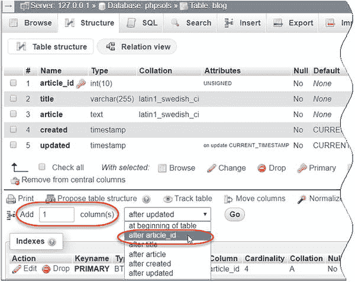

3. 这将打开定义列属性的屏幕。请使用以下设置：

*   名称：`image_id`
*   类型：`INT`
*   属性：`UNSIGNED`
*   Null：已选中
*   索引：`INDEX`（在弹出模态对话框中无需命名）

*不要*选中`A_I`（`AUTO_INCREMENT`）复选框。你不需要`image_id`自动递增。其值将从`images`表中插入。

`Null`复选框已被选中，因为并非所有文章都会关联图片。点击`Save`。

4. 选择`Structure`选项卡，检查`blog`表结构现在是否如下所示：

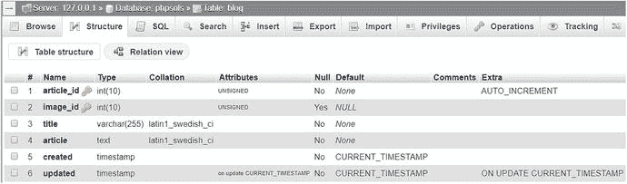

5. 如果点击屏幕左上角的`Browse`选项卡，你会看到每条记录中`image_id`的值都是 NULL。现在的挑战是如何在不手动查找编号的情况下插入正确的外键。我们将在下一步解决这个问题。

## 向表中插入外键

向另一个表插入外键的基本原理相当简单：你查询数据库，找到要链接到另一个表的记录的主键。然后，你可以使用`INSERT`或`UPDATE`查询将外键添加到目标记录中。

为演示基本原理，你将改编第 15 章中的更新表单，添加一个下拉菜单，列出`images`表中已注册的图片（见图 17-4）。

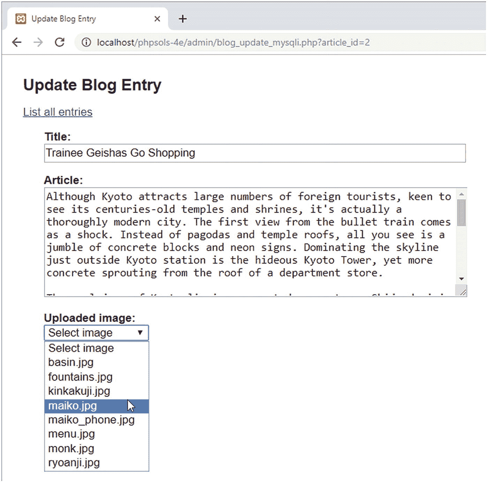

**图 17-4.** 动态生成的下拉菜单插入正确的外键

该菜单由一个循环动态生成，该循环显示`SELECT`查询的结果。每张图片的主键存储在`<option>`标签的`value`属性中。当表单提交时，选中的值会被合并到`UPDATE`查询中作为外键。

## PHP 解决方案 17-2：添加 image 外键（MySQLi）

本 PHP 解决方案演示了如何通过向`blog`表更新记录来添加选中图片的主键作为外键。它改编自第 15 章中的`admin/blog_update_mysqli.php`。请使用你在第 15 章中创建的版本。或者，将`ch15`文件夹中的`blog_update_mysqli_03.php`复制到`admin`文件夹，并从文件名中移除`_03`。


# 排版后的文本

## MySQLi 实现

1. 现有的 `SELECT` 查询用于检索待更新文章的详细信息，需要修改以包含外键 `image_id`，并将结果绑定到新的结果变量 `$image_id`。然后需要运行第二个 `SELECT` 查询来获取 `images` 表的详细信息。在此之前，需要调用预处理语句的 `free_result()` 方法来释放数据库资源。将以下加粗显示的代码添加到现有脚本中：

```
if (isset($_GET['article_id']) && !$_POST) {
    // prepare SQL query
    $sql = 'SELECT article_id, image_id, title, article FROM blog
    WHERE article_id = ?';
    if ($stmt->prepare($sql)) {
        // bind the query parameter
        $stmt->bind_param('i', $_GET['article_id']);
        // execute the query
        $OK = $stmt->execute();
        // bind the results to variables and fetch
        $stmt->bind_result($article_id, $image_id, $title, $article);
        $stmt->fetch();
        // free the database resources for the second query
        $stmt->free_result();
    }
}
```

可以在调用 `fetch()` 方法后立即释放结果，因为结果集中只有一条记录，且每列的值都已绑定到变量。

2. 在表单内部，需要显示 `images` 表中存储的文件名。由于第二个 `SELECT` 语句不依赖于外部数据，使用 `query()` 方法比预处理语句更简单。在 `article` 文本区域之后添加以下代码（所有代码都是新增的，但 PHP 部分以加粗显示以便参考）：

```
Uploaded image:

Select image
    query($getImages);
    while ($row = $images->fetch_assoc()) {
    ?>
    "
    >

```

第一个 `<option>` 标签硬编码了标签 `Select image`，其 `value` 设置为空字符串。其余 `<option>` 标签由 `while` 循环填充，该循环将每条记录提取到名为 `$row` 的数组中。

条件语句检查当前的 `image_id` 是否与 `articles` 表中已存储的相同。如果是，则在 `<option>` 标签中插入 `selected`，以便在下拉菜单中显示正确的值。

请确保不要遗漏以下代码行中的第三个字符：

```
?>>
```

它是 `<option>` 标签的右尖括号，夹在两个 PHP 标签之间。

3. 保存页面并在浏览器中加载。您应该会自动重定向到 `blog_list_mysqli.php`。选择一个 **EDIT** 链接，确保页面看起来像图 17-4。检查浏览器源代码视图，验证 `<option>` 标签的 `value` 属性是否包含每张图片的主键。

**提示**：如果 `<select>` 菜单没有列出图片，则几乎可以确定是步骤 2 中的 `SELECT` 查询存在错误。在调用 `query()` 方法后立即添加 `echo $conn->error;`，然后重新加载页面。您需要查看浏览器源代码才能看到错误信息。如果消息是“Commands out of sync; you can’t run this command now”，问题在于步骤 1 中没有使用 `free_result()` 释放数据库资源。

4. 最后阶段是将 `image_id` 添加到 `UPDATE` 查询中。由于某些博客条目可能没有关联图片，您需要创建替代的预处理语句，如下所示：

```
// if form has been submitted, update record
if (isset($_POST ['update'])) {
    // prepare update query
    if (!empty($_POST['image_id'])) {
        $sql = 'UPDATE blog SET image_id = ?, title = ?, article = ?
        WHERE article_id = ?';
        if ($stmt->prepare($sql)) {
            $stmt->bind_param('issi', $_POST['image_id'], $_POST['title'],
            $_POST['article'], $_POST['article_id']);
            $done = $stmt->execute();
        }
    } else {
        $sql = 'UPDATE blog SET image_id = NULL, title = ?, article = ?
        WHERE article_id = ?';
        if ($stmt->prepare($sql)) {
            $stmt->bind_param('ssi', $_POST['title'], $_POST['article'],
            $_POST['article_id']);
            $done = $stmt->execute();
        }
    }
}
```

如果 `$_POST['image_id']` 有值，则将其作为第一个参数（使用占位符问号）添加到 SQL 中。由于它必须是整数，在 `bind_param()` 的第一个参数开头添加 `i`。

但是，如果 `$_POST['image_id']` 没有值，则需要创建另一个预处理语句，将 SQL 查询中的 `image_id` 设置为 `NULL`。由于它具有显式值，因此不将其添加到 `bind_param()` 中。

5. 再次测试页面，从下拉菜单中选择一个文件名，然后点击 `Update Entry`。您可以通过刷新 phpMyAdmin 中的 `Browse`，或选择同一篇文章进行更新，来验证外键是否已插入到 `articles` 表中。这次，下拉菜单中应显示正确的文件名。

如有必要，请对照 `ch17` 文件夹中的 `blog_update_mysqli_04.php` 检查您的代码。

## PHP Solution 17-3: 添加图片外键 (PDO)

此 PHP 解决方案使用 PDO 通过将所选图片的主键作为外键添加来更新 `blog` 表中的记录。与 MySQLi 的主要区别在于，PDO 可以使用 `bindValue()` 方法将 `null` 值绑定到占位符。本说明将适配第 15 章的 `admin/blog_update_pdo.php`。使用您在第 15 章中创建的版本。或者，将 `ch15` 文件夹中的 `blog_update_pdo_03.php` 复制到 `admin` 文件夹，并从文件名中删除 `_03`。

1. 将 `image_id` 添加到检索待更新文章详细信息的 `SELECT` 查询中，并将结果绑定到 `$image_id`。这涉及重新编号作为第一个参数传递给 `bindColumn()` 的列，以对应 `$title` 和 `$article`。修订后的代码如下所示：

```
if (isset($_GET['article_id']) && !$_POST) {
    // prepare SQL query
    $sql = 'SELECT article_id, image_id, title, article FROM blog
    WHERE article_id = ?';
    $stmt = $conn->prepare($sql);
    // pass the placeholder value to execute() as a single-element array
    $OK = $stmt->execute([$_GET['article_id']]);
    // bind the results
    $stmt->bindColumn(1, $article_id);
    $stmt->bindColumn(2, $image_id);
    $stmt->bindColumn(3, $title);
    $stmt->bindColumn(4, $article);
    $stmt->fetch();
}
```

2. 在表单内部，需要显示 `images` 表中存储的文件名。由于第二个 `SELECT` 语句不依赖于外部数据，使用 `query()` 方法比预处理语句更简单。在 `article` 文本区域之后添加以下代码（所有代码都是新增的，但 PHP 部分以加粗显示以便参考）：

```
Uploaded image:

Select image
    query($getImages) as $row) {
    ?>
    "
    >

```

第一个 `<option>` 标签硬编码了标签 `Select image`，其 `value` 设置为空字符串。其余 `<option>` 标签由 `foreach` 循环填充，该循环执行 `$getImages SELECT` 查询并将每条记录提取到名为 `$row` 的数组中。


# 条件语句与数据库查询

## 用于图片选择的条件语句

条件语句会检查当前的 `image_id` 是否与 `articles` 表中已存储的相同。如果是，则向 `<option>` 标签中插入 `selected`，从而在下拉菜单中显示正确的值。

请确保不要遗漏以下代码行中的第三个字符：

```
    ?>>
```

它是 `<option>` 标签的闭尖括号，位于两个 PHP 标签之间。

## 保存并测试页面

3. 保存页面并在浏览器中加载。你应被自动重定向至 `blog_list_pdo.php`。选择任一 `EDIT` 链接，并确保你的页面显示如图 17-4 所示。查看浏览器源代码视图，确认 `<option>` 标签的 `value` 属性包含每张图片的主键。

4. 最后一步是将 `image_id` 添加到 `UPDATE` 查询中。当博客条目未关联图片时，需要在 `image_id` 列中插入 `null`。这需要更改将值绑定到预处理语句中匿名占位符的方式。你不再需要将值以数组形式传递给 `execute()` 方法，而应使用 `bindValue()` 和 `bindParam()`。修改后的代码如下所示：

```
    // 如果表单已提交，则更新记录
    if (isset($_POST['update'])) {
    // 准备更新查询
    $sql = 'UPDATE blog SET image_id = ?, title = ?, article = ?
    WHERE article_id = ?';
    $stmt = $conn->prepare($sql);
    if (empty($_POST['image_id'])) {
    $stmt->bindValue(1, NULL, PDO::PARAM_NULL);
    } else {
    $stmt->bindParam(1, $_POST['image_id'], PDO::PARAM_INT);
    }
    $stmt->bindParam(2, $_POST['title'], PDO::PARAM_STR);
    $stmt->bindParam(3, $_POST['article'], PDO::PARAM_STR);
    $stmt->bindParam(4, $_POST['article_id'], PDO::PARAM_INT);
    // 执行查询
    $done = $stmt->execute();
    }
```

这些值通过从 1 开始计数的数字绑定到匿名占位符，以标识它们应应用于哪个占位符。条件语句检查 `$_POST['image_id']` 是否为空。如果为空，`bindValue()` 将值设置为 `null`，使用关键字 `NULL` 作为第二个参数，并使用 PDO 常量作为第三个参数。如第 13 章的"在 PDO 预处理语句中嵌入变量"所述，当绑定的值不是变量时，你需要使用 `bindValue()`。

其余值都是变量，因此使用 `bindParam()` 进行绑定。我对其余的值使用了整数和字符串的 PDO 常量。这并非严格必要，但能使代码更清晰。

最后，`execute()` 方法括号内的值数组已被移除。

5. 再次测试页面，从下拉菜单中选择一个文件名，然后单击 `Update Entry`。你可以通过刷新 phpMyAdmin 中的 `Browse` 或者选择同一篇文章进行更新，来验证外键是否已插入到 `articles` 表中。此时，下拉菜单中应显示正确的文件名。

如有必要，可将你的代码与 `ch17` 文件夹中的 `blog_update_pdo_04.php` 进行对照。

## 从多张表中选取记录

在 `SELECT` 查询中有多种方式可以关联表，但最常见的是列出以 `INNER JOIN` 分隔的表名。单凭 `INNER JOIN` 会产生所有可能的行组合（即笛卡尔积）。要仅选择相关的值，你需要指定主键/外键关系。例如，要从 `blog` 和 `images` 表中选取文章及其相关图片，你可以使用 `WHERE` 子句，如下所示：

```
SELECT title, article, filename, caption
FROM blog INNER JOIN images
WHERE blog.image_id = images.image_id
```

`title` 和 `article` 列仅存在于 `blog` 表中。同样，`filename` 和 `caption` 仅存在于 `images` 表中。它们是明确的，无需限定。然而，`image_id` 存在于两张表中，因此你需要为每个引用加上表名和一个点作为前缀。

多年以来，一种常见的做法是使用逗号代替 `INNER JOIN`，如下所示：

```
SELECT title, article, filename, caption
FROM blog, images
WHERE blog.image_id = images.image_id
```

> **注意事项**：由于自 MySQL 5.0.12 以来对连接处理方式的更改，使用逗号连接表可能导致 SQL 语法错误。请改用 `INNER JOIN`。

除了 `WHERE` 子句，你也可以使用 `ON`，如下所示：

```
SELECT title, article, filename, caption
FROM blog INNER JOIN images ON blog.image_id = images.image_id
```

当两列名称相同时，可以使用以下语法，这也是我个人的偏好：

```
SELECT title, article, filename, caption
FROM blog INNER JOIN images USING (image_id)
```

> **注意**：`USING` 后的列名必须放在括号内。

## PHP 解决方案 17-4：构建详情页面

本 PHP 解决方案展示了如何连接 `blog` 和 `images` 表，以显示所选文章及其关联图片。MySQLi 和 PDO 的代码几乎相同，因此本方案涵盖了两种方式。

1. 将 `ch17` 文件夹中的 `details_01.php` 复制到 `phpsols-4e` 站点根目录，并重命名为 `details.php`。如果编辑环境提示更新链接，请勿操作。确保 `footer.php` 和 `menu.php` 位于 `includes` 文件夹中，然后在浏览器中加载该页面。它应显示如图 17-5 所示。


*图 17-5. 详情页面包含占位图片和文本*

2. 在浏览器中加载 `blog_list_mysqli.php` 或 `blog_list_pdo.php`，并通过分配指定的图片文件名来更新以下三篇文章：

   * Basin of Contentment：`basin.jpg`
   * Tiny Restaurants Crowded Together：`menu.jpg`
   * Trainee Geishas Go Shopping：`maiko.jpg`

3. 导航至 phpMyAdmin 中的 `blog` 表，单击 `Browse` 选项卡，检查外键是否已注册。至少有一篇文章的 `image_id` 值应为 `NULL`，如图 17-6 所示。

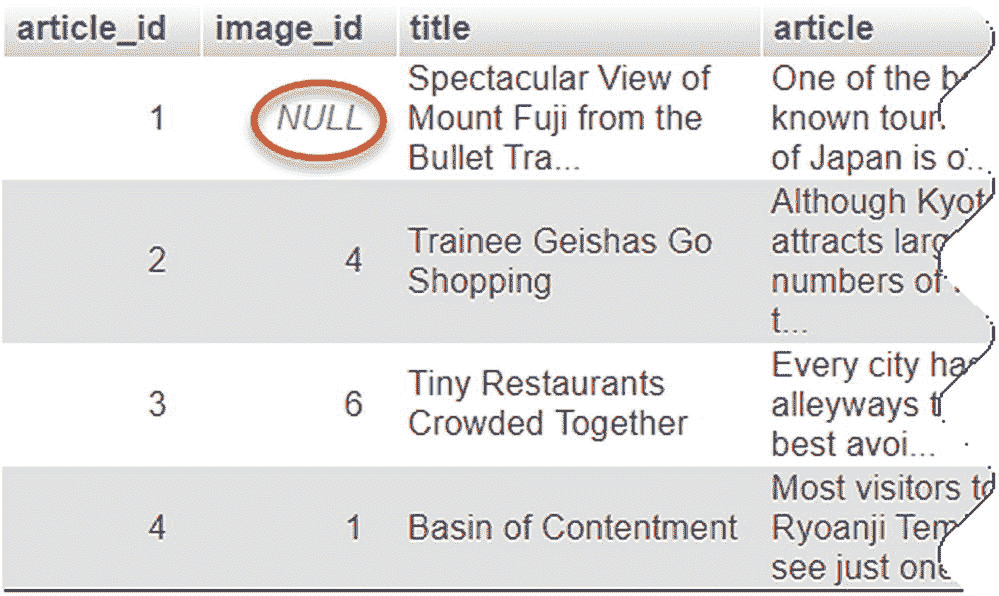

*图 17-6. 未关联图片的文章的外键被设置为 NULL*

4. 在尝试显示图片之前，我们需要确保图片来自预期的位置，并且它确实是一张图片。在 `details.php` 顶部创建一个变量，用于存储图片目录的相对路径（包含尾部斜杠），如下所示：

```
    // 图片目录的相对路径
    $imageDir = './images/';
```

5. 接下来，包含上一章的 `utility_funcs.php`（如有必要，将其从 `ch16` 文件夹复制到 `includes` 文件夹）。然后包含数据库连接文件，创建一个只读连接，并在 `DOCTYPE` 声明之前的 PHP 代码块中准备 SQL 查询，如下所示。


```php
require_once './includes/utility_funcs.php';
require_once './includes/connection.php';
// 连接数据库
$conn = dbConnect('read');  // 如需则添加 'pdo'
// 检查查询字符串中的 article_id
if (isset($_GET['article_id']) && is_numeric($_GET['article_id'])) {
    $article_id = (int) $_GET['article_id'];
} else {
    $article_id = 0;
}
$sql = "SELECT title, article, DATE_FORMAT(updated, '%W, %M %D, %Y') AS updated, filename, caption
        FROM blog INNER JOIN images USING (image_id)
        WHERE blog.article_id = $article_id";
$result = $conn->query($sql);
$row = $result->fetch_assoc();  // 若使用 PDO 则改用 $result->fetch();
```

代码检查`URL`查询字符串中的`article_id`。如果它存在且是数字，则通过`(int)`类型转换运算符将其赋给`$article_id`，以确保其为整数。否则，将`$article_id`设为`0`。你也可以选择一篇默认文章，但暂时先保留为`0`，因为我想说明一个重点。

`SELECT`查询从`blog`表中检索`title`、`article`和`updated`列，并从`images`表中检索`filename`和`caption`列。`updated`的值使用`DATE_FORMAT()`函数和别名进行格式化，如第 16 章所述。由于只检索一条记录，使用原始列名作为别名不会对排序顺序造成问题。

使用`INNER JOIN`和`USING`子句连接两个表，该子句匹配两个表中`image_id`列的值。`WHERE`子句选择由`$article_id`标识的文章。由于`$article_id`的数据类型已检查过，因此在查询中使用它是安全的。无需使用预处理语句。

请注意，查询被包裹在双引号中，以便解析`$article_id`的值。为避免与外层引号冲突，传递给`DATE_FORMAT()`的格式字符串参数使用单引号。

6.  现在我们已经查询了数据库，可以检查图像。为了确保它在预期位置，将`$row['filename']`的值传递给`basename()`函数，并将结果与图像目录的相对路径拼接。然后我们可以检查文件是否存在且可读。如果是，则使用`getimagesize()`获取其宽度和高度。在上一步插入的代码之后立即添加以下代码：

```php
if ($row && !empty($row['filename'])) {
    $image = $imageDir . basename($row['filename']);
    if (file_exists($image) && is_readable($image)) {
        $imageSize = getimagesize($image)[3];
    }
}
```

如第 10 章的 PHP Solution 10-1 所述，`getimagesize()`返回一个包含图像信息的数组，其中索引 3 包含一个字符串，该字符串包含正确的宽度和高度属性，可直接插入``标签。这里，我们使用数组解引用将其直接赋值给`$imageSize`。

7.  其余代码在页面主体中显示 SQL 查询的结果。像这样替换`<h2>`标签中的占位文本：

如果`SELECT`查询未找到结果，`$row`将为空，PHP 会将其解释为`false`。因此，这段代码显示标题，如果结果集为空，则显示“未找到记录”。

8.  像这样替换占位日期：

9.  在日期段落之后立即有一个包含占位图像的`<figure>`元素。并非所有文章都关联了图像，因此需要将`<figure>`包裹在一个检查`$imageSize`是否包含值的条件语句中。像这样修改`<figure>`：

```html
<figure>
" alt="<?= $row['caption']; ?>">
</figure>
```

10. 最后，你需要显示文章。删除占位文本的段落，并在上一步最后一个代码块的结束花括号和结束 PHP 标签之间添加以下代码：

```php
echo convertToParas($row['article']);
```

这使用了`utility_funcs.php`中的`convertToParas()`函数，将博客条目包裹在`<p>`标签中，并将换行符序列替换为闭合和开放标签（参见第 16 章的“显示段落”一节）。

11. 保存页面，并在浏览器中加载`blog.php`。点击某个通过外键分配了图像的文章的`更多`链接。你应该会看到`details.php`显示完整的文章和图像，布局如图 17-7 所示。

如有必要，请对照`ch17`文件夹中的`details_mysqli_01.php`或`details_pdo_01.php`检查你的代码。


**图 17-7.** 详情页从一张表中提取文章，从另一张表中提取图像。

12. 点击返回`blog.php`的链接，测试其他项目。每个关联了图像的文章都应正确显示。点击没有图像的文章的`更多`链接。这次你应该会看到如图 17-8 所示的结果。


**图 17-8.** 缺少关联图像导致 SELECT 查询失败。

你知道文章在数据库中，否则`blog.php`中就不会显示前两句。要理解这种突然“消失”的原因，请参考图 17-6。对于没有关联图像的记录，`image_id`的值为`NULL`。由于`images`表中的所有记录都有主键，`USING`子句无法找到匹配项。下一节将解释如何处理这种情况。

### 查找没有匹配外键的记录

从 PHP Solution 17-4 中取出`SELECT`查询，并移除搜索特定文章的条件，剩下如下：

```sql
SELECT title, article, DATE_FORMAT(updated, '%W, %M %D, %Y') AS updated, filename, caption
FROM blog INNER JOIN images USING (image_id)
```

如果在 phpMyAdmin 的 SQL 选项卡中运行此查询，将产生如图 17-9 所示的结果。

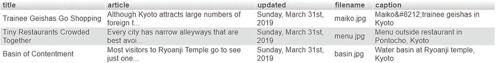

**图 17-9.** INNER JOIN 仅能找到在两个表中都匹配的记录。

使用`INNER JOIN`时，`SELECT`查询只能成功找到完全匹配的记录。其中一篇文章没有关联图像，因此`articles`表中`image_id`的值为`NULL`，这与`images`表中的任何内容都不匹配。

在这种情况下，你需要使用`LEFT JOIN`而不是`INNER JOIN`。使用`LEFT JOIN`，结果包括在左表中有匹配但在右表中没有匹配的记录。左和右指的是执行连接时的顺序。像这样重写`SELECT`查询：

```sql
SELECT title, article, DATE_FORMAT(updated, '%W, %M %D, %Y') AS updated, filename, caption
FROM blog LEFT JOIN images USING (image_id)
```

在 phpMyAdmin 中运行时，你将获得全部四篇文章，如图 17-10 所示。

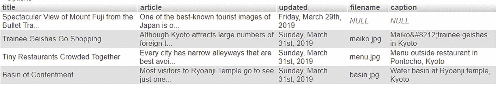

**图 17-10.** LEFT JOIN 包含在右表中没有匹配的记录。

如你所见，右表（`images`）中的空字段显示为`NULL`。


若两个表中的列名不同，请使用 `ON`，如下所示：

```
FROM table_1 LEFT JOIN table_2 ON table_1.col_name = table_2.col_name
```

现在，你可以像这样重写 `details.php` 中的 SQL 查询：

```
$sql = "SELECT title, article, DATE_FORMAT(updated, '%W, %M %D, %Y') AS updated,
filename, caption
FROM blog LEFT JOIN images USING (image_id)
WHERE blog.article_id = $article_id";
```

如果你点击「**More**」链接查看没有关联图片的文章，现在应该可以看到文章正常显示，如图 17-11 所示。其他文章也应能正常显示。完成的代码位于 `details_mysqli_02.php` 和 `details_pdo_02.php` 中。


图 17-11. `LEFT JOIN` 也能检索没有匹配外键的文章

## 创建智能链接

`details.php` 底部的链接直接返回到 `blog.php`。当 `blog` 表中只有四条记录时这没问题，但一旦数据库中开始有更多记录，你就需要构建一个导航系统，正如我在第 14 章中展示的那样。导航系统的问题在于，你需要一种方法将访问者返回到他们之前所在的同一结果集位置。

### PHP 解决方案 17-5：返回到导航系统中的同一位置

此 PHP 解决方案检查访问者来自内部链接还是外部链接。如果来源页面在同一网站内，则链接会将访问者返回到同一位置。如果来源页面是外部网站，或者服务器不支持必要的超全局变量，则脚本会替换为一个标准链接。此方案在 `details.php` 的上下文中展示，但可用于任何页面。

该代码不依赖于数据库，因此对 MySQLi 和 PDO 来说都是相同的。

1.  找到 `details.php` 主体部分中的返回链接，它看起来像这样：

    ```
    <a href="blog.php">回到博客</a>
    ```

2.  将光标紧贴在第一个引号的右侧，并插入以下用粗体突出显示的代码：

    ```
    <a href="<?php
    if (isset($_SERVER['HTTP_REFERER']) && isset($_SERVER['HTTP_HOST'])) {
        $url = parse_url($_SERVER['HTTP_REFERER']);
        if ($url['host'] == $_SERVER['HTTP_HOST']) {
            echo $_SERVER['HTTP_REFERER'];
        } else {
            echo 'blog.php';
        }
    } else {
        echo 'blog.php';
    }
    ?>">回到博客</a>
    ```

`$_SERVER['HTTP_REFERER']` 和 `$_SERVER['HTTP_HOST']` 是超全局变量，分别包含来源页面的 URL 和当前主机名。你需要使用 `isset()` 检查它们是否存在，因为并非所有服务器都支持它们。此外，浏览器可能会屏蔽来源页面的 URL。

`parse_url()` 函数会创建一个数组，其中包含 URL 的每一部分，因此 `$url['host']` 包含主机名。如果它与 `$_SERVER['HTTP_HOST']` 匹配，说明访问者来自内部链接，因此内部链接的完整 URL 会被插入到 `href` 属性中。这包括任何查询字符串，因此该链接会将访问者送回导航系统中的同一位置。否则，会创建一个指向目标页面的普通链接。

完成的代码位于 `ch17` 文件夹中的 `details_mysqli_03.php` 和 `details_pdo_3.php`。

## 章节回顾

使用 `INNER JOIN` 和 `LEFT JOIN` 从多个表中检索信息相对简单。成功处理多个表的关键在于构建它们之间的关系，使得复杂关系始终可以解析为 `1:1`，必要时可以通过交叉引用（或链接）表来实现。下一章将继续探索多表操作，展示在插入、更新和删除记录时如何处理外键关系。

## 18. 管理多个数据库表

前一章向你展示了如何使用 `INNER JOIN` 和 `LEFT JOIN` 检索存储在多个表中的信息。你还学习了如何通过向子表添加额外列并逐个更新每条记录来插入外键，从而链接现有表。然而，大多数情况下，你需要同时在两个表中插入数据。这带来一个挑战，因为 `INSERT` 命令一次只能操作一个表。你需要按正确的顺序处理插入操作，从父表开始，以便能够获取新记录的主键，并同时将其与其他详细信息一起插入子表。在更新和删除记录时也需要考虑类似的问题。涉及的代码并不复杂，但在编写脚本时，你需要清晰地记住事件的顺序。

本章将指导你完成在 `blog` 表中插入新文章的过程，可选地选择一张相关图片或上传一张新图片，并将文章分配到一个或多个类别，所有这些都在一个操作中完成。然后，你将构建脚本来更新和删除文章，同时不破坏相关表的参照完整性。

你还将学习使用事务批量处理多个查询，如果批次中的任何部分失败，则将数据库回滚到其原始状态，以及外键约束，它控制当你尝试删除另一个表中仍然存在外键关系的记录时会发生什么。并非所有数据库都支持事务和外键约束，因此检查你的远程服务器是否支持非常重要。本章还解释了如果你的服务器不支持外键约束，你可以采取哪些措施来维护数据的完整性。

具体来说，你将学习以下内容：

-   在相关表中插入、更新和删除记录
-   在记录创建后立即查找其主键
-   将多个查询作为单个批次处理，并在任何部分失败时回滚
-   转换表的存储引擎
-   在 InnoDB 表之间建立外键约束

### 维护参照完整性

对于单个表，无论你更新一条记录多少次或删除多少条记录，对其他记录的影响为零。一旦你将一条记录的主键作为外键存储在另一个表中，你就创建了一个需要管理的依赖关系。例如，图 18-1 展示了 `blog` 表中的第二篇文章（“见习艺伎去购物”）通过 `article2cat` 交叉引用表链接到了「**Kyoto**」和「**People**」类别。

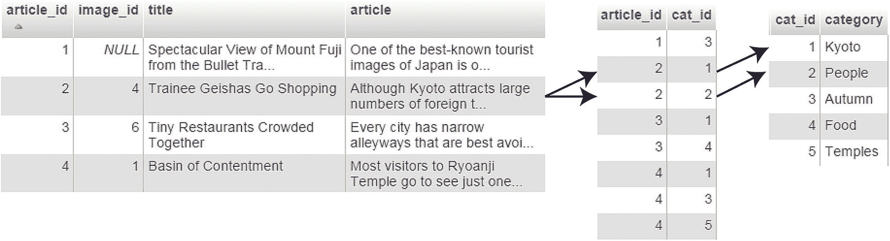

图 18-1. 你需要管理外键关系以避免孤立记录

如果你删除了这篇文章，但未删除交叉引用表中 `article_id 2` 的条目，那么查找「**Kyoto**」或「**People**」类别中所有文章的查询将尝试匹配 `blog` 表中不存在的记录。同样，如果你决定删除某个类别，但未删除交叉引用表中匹配的记录，那么查找与某篇文章关联的类别的查询将尝试匹配一个不存在的类别。

用不了多久，你的数据库中就会充斥着孤立记录。幸运的是，维护参照完整性并不困难。SQL 通过建立称为外键约束的规则来实现这一点，这些规则告诉数据库，当你更新或删除一条在另一张表中有依赖记录的记录时应该怎么做。


# 支持事务与外键约束

`InnoDB`（MySQL 5.5 及之后版本的默认存储引擎）支持事务和外键约束。MariaDB 中对应的存储引擎是`Percona XtraDB`，但它自识别为`InnoDB`，功能完全相同。即使远程服务器运行最新版 MySQL 或 MariaDB，也无法保证支持`InnoDB`，因为托管服务商可能已禁用它。

如果服务器运行旧版 MySQL，默认存储引擎为`MyISAM`，它不支持事务或外键约束。不过你仍有可能使用`InnoDB`，因为它自 4.0 版本起就已成为 MySQL 的组成部分。将`MyISAM`表转换为`InnoDB`非常简单，只需几秒钟。

如果无法使用`InnoDB`，则需要通过 PHP 脚本构建必要的规则来维护引用完整性。本章将介绍这两种方法。

> **注意**：`MyISAM`表的优势在于速度极快。它们占用磁盘空间更少，非常适合存储不常变动的大量数据。但由于`MyISAM`引擎已不再积极开发，不建议在新项目中使用。

## PHP 解决方案 18-1：检查是否支持 InnoDB

本 PHP 解决方案介绍如何检查远程服务器是否支持`InnoDB`存储引擎。

1. 如果托管服务商提供 phpMyAdmin 管理数据库，请登录远程服务器的 phpMyAdmin，点击屏幕顶部的`引擎`标签页（如果可用）。这将显示类似图 18-2 的存储引擎列表。

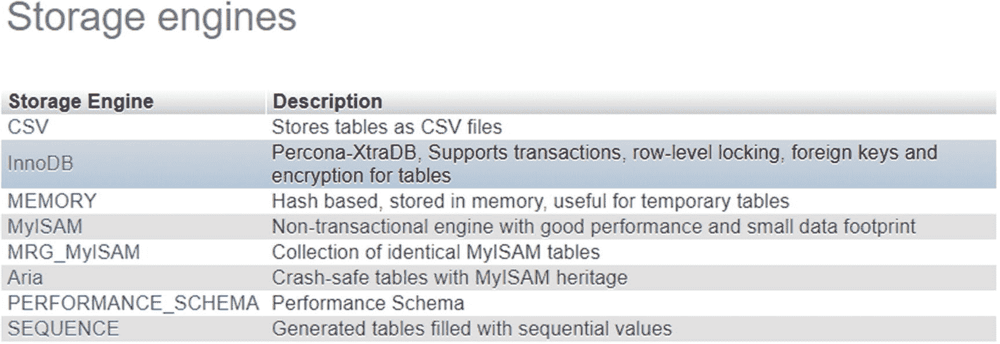

**图 18-2.** 通过 phpMyAdmin 检查存储引擎支持

> **注意**：图 18-2 中`InnoDB`的描述指向了`Percona XtraDB`。该截图取自 MariaDB 服务器。在 MySQL 服务器上你可能会看到不同的存储引擎列表，但 MySQL 和 MariaDB 通常都会提供至少`InnoDB`和`MyISAM`。`Aria`存储引擎是 MariaDB 对`MyISAM`的改进版本。由于本书不涉及 MySQL 以外的内容，因此不介绍`Aria`——它既不支持事务也不支持外键约束。

2. 列表显示所有存储引擎，包括不支持的引擎。不支持或禁用的存储引擎会呈灰色显示。如果不确定`InnoDB`的状态，请点击其名称。

3. 如果不支持`InnoDB`，会看到相应提示。反之，如果看到类似图 18-3 的变量列表，则说明支持——`InnoDB`已启用。

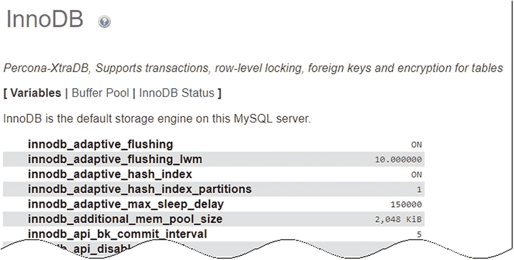

**图 18-3.** 确认`InnoDB`受支持

4. 如果 phpMyAdmin 中没有`引擎`标签页，请选择数据库中的任意表，点击屏幕右上角的`操作`标签页。在`表选项`部分，点击`存储引擎`字段右侧的下拉箭头查看可用选项（见图 18-4）。如果`InnoDB`出现在列表中，则表示支持。

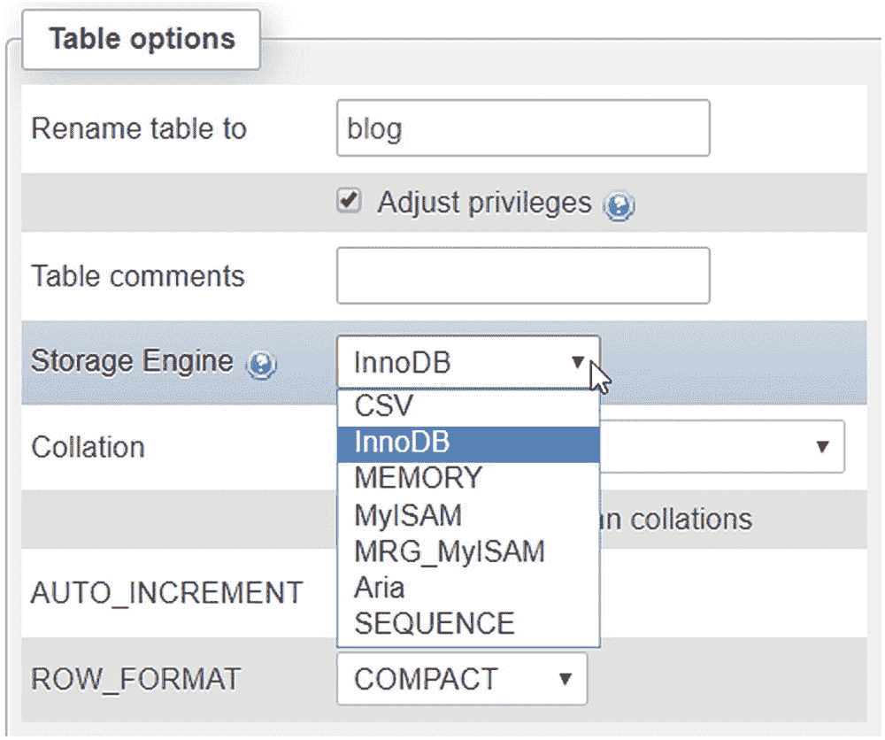

**图 18-4.** 表选项中列出了可用的存储引擎

5. 如果上述方法均无法确定，请打开`ch18`文件夹中的`storage_engines.php`。修改前三行，填入远程服务器数据库的主机名、用户名和密码。

6. 将`storage_engines.php`上传到网站并在浏览器中加载该页面。你将看到存储引擎列表及其支持级别，如图 18-5 所示。某些情况下，`NO`会显示为`DISABLED`。

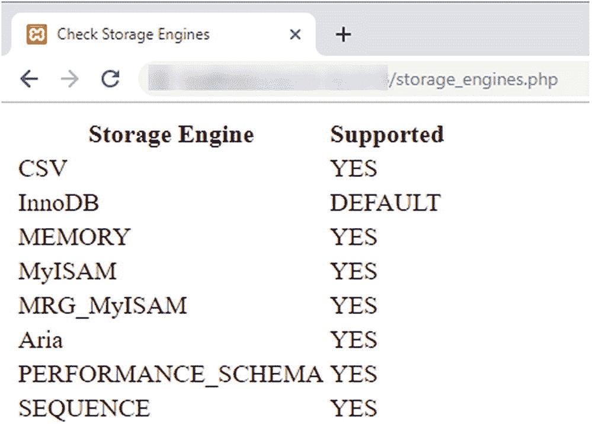

**图 18-5.** `storage_engines.php`中的 SQL 查询报告了哪些引擎受支持

如图 18-5 所示，典型安装支持多个存储引擎。令人惊讶的是，你可以在同一个数据库中使用不同的存储引擎。事实上，官方建议这样做。即使远程服务器支持`InnoDB`，对于不需要事务或外键关系的表，使用`MyISAM`或`Aria`通常更高效。对于需要事务或外键关系的表，则使用`InnoDB`。

本章稍后将介绍如何将表转换为`InnoDB`。在此之前，我们先看看如何在不依赖存储引擎的情况下建立和使用外键关系。

## 向多张表插入记录

`INSERT`查询每次只能向一张表插入数据。因此，处理多张表时，需要精心规划插入脚本，确保所有信息都被存储，并建立正确的外键关系。

上一章中的 PHP 解决方案 17-2（MySQLi）和 17-3（PDO）演示了如何为数据库中已存在的图片添加正确的外键。但在插入新的博客文章时，需要能够选择现有图片、上传新图片，或者选择不使用图片。这意味着处理脚本需要检查是否选择了或上传了图片，并据此执行相应命令。此外，为博客文章分配零个或多个分类会增加脚本需要做出的决策数量。图 18-6 展示了决策链。

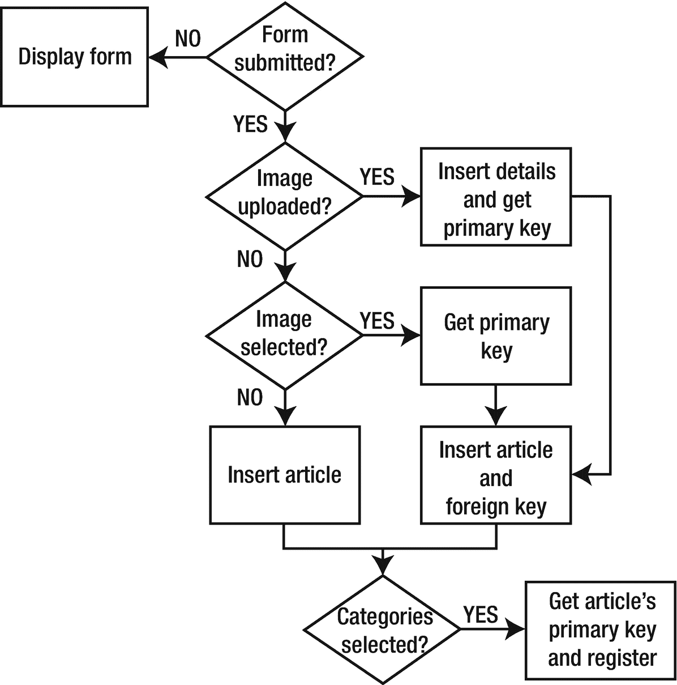

**图 18-6.** 插入带图片和分类的博客文章时的决策链

页面首次加载时，表单尚未提交，因此页面仅显示插入表单。通过查询数据库，插入表单中会列出所有现有图片和分类，方法与 PHP 解决方案 17-2 和 17-3 中更新表单处理图片的方式相同。

表单提交后，处理脚本将执行以下步骤：

1. 如果上传了图片，则处理上传，将图片详情存储到`images`表，并获取新记录的主键。
2. 如果未上传图片，但选择了现有图片，则通过`$_POST`数组提交的值获取其外键。
3. 无论哪种情况，新博客文章都会被插入`blog`表，同时将图片的主键作为外键。但如果既未上传也未选择现有图片，则文章插入`blog`表时不带外键。
4. 最后，脚本检查是否选择了任何分类。如果已选择，则获取新文章的主键，并与所选分类的主键组合后插入`article2cat`表。

如果在任何阶段出现问题，脚本需要放弃后续过程，并重新显示用户的输入。该脚本较长，因此我将分若干小节介绍。第一步是创建`article2cat`交叉引用表。

## 创建交叉引用表


在处理数据库中的多对多关系时，需要构建一个类似图 18-1 所示的交叉引用表。交叉引用表仅由两列组成，这两列联合声明为表的主键（称为复合主键）。

观察图 18-7 可以看到，`article_id`和`cat_id`列中都多次包含相同的数字——这种情况在主键中是不可接受的，主键必须唯一。然而，在复合主键中，是两个值的组合具有唯一性。前两个组合`1,3`和`2,1`在表中没有其他重复，其他组合也是如此。

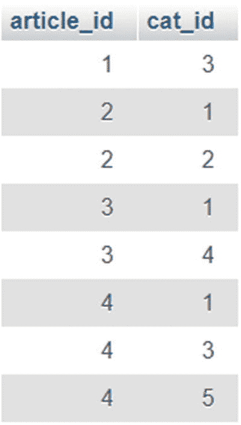

**图 18-7.** 在交叉引用表中，两列共同构成复合主键

**设置 categories 和交叉引用表**

在`ch18`文件夹中，可以找到`categories.sql`，其中包含用于创建`categories`表和交叉引用表`article2cat`的 SQL 语句，以及一些示例数据。在 phpMyAdmin 中，选择`phpsols`数据库，然后使用`Import`选项卡加载`categories.sql`来创建表和数据。表 18-1 和 18-2 列出了表的设置。两个数据库表都只有两列。

**表 18-2.** `article2cat`交叉引用表的设置

| Name | Type | Length/Values | Attributes | Null | Index | A_I |
| --- | --- | --- | --- | --- | --- | --- |
| `article_id` | `INT` | | `UNSIGNED` | 未选中 | `PRIMARY` | |
| `cat_id` | `INT` | | `UNSIGNED` | 未选中 | `PRIMARY` | |

**表 18-1.** `categories`表的设置

| Name | Type | Length/Values | Attributes | Null | Index | A_I |
| --- | --- | --- | --- | --- | --- | --- |
| `cat_id` | `INT` | | `UNSIGNED` | 未选中 | `PRIMARY` | 选中 |
| `category` | `VARCHAR` | 20 | | 未选中 | | |

关于交叉引用表定义的重要一点是，两列都设置为主键，并且两列的`A_I`（`AUTO_INCREMENT`）复选框都没有被选中。

**警告**
要创建复合主键，必须同时将两列都声明为主键。如果错误地只声明一列为主键，数据库会阻止稍后添加第二列。必须从单列中删除主键索引，然后将其重新应用到两列上。两列的组合被视为主键。

**获取上传图片的文件名**
该脚本使用了第 6 章中的`Upload`类，但该类需要稍作调整，因为上传文件的文件名会被合并到`$messages`属性中。

**PHP 解决方案 18-2：改进 Upload 类**

本 PHP 解决方案通过创建一个新的受保护属性来存储成功上传文件的名称，并提供一个公共方法来获取文件名数组，从而调整了第 9 章中的`Upload`类。

1.  打开`PhpSolutions/File`文件夹中的`Upload.php`。或者，从`ch18/PhpSolutions/File`文件夹复制`Upload.php`，并将其保存到`phpsols-4e`站点根目录下的`PhpSolutions/File`中。

2.  在文件顶部的属性列表中添加以下行：

```php
protected $filenames = [];
```

这会将一个名为`$filenames`的受保护属性初始化为空数组。

3.  修改`moveFile()`方法，如果文件上传成功，则将修改后的文件名添加到`$filenames`属性中。新代码已加粗显示。

```php
protected function moveFile($file) {
    $filename = $this->newName ?? $file['name'];
    $success = move_uploaded_file($file['tmp_name'], $this->destination . $filename);
    if ($success) {
        // add the amended filename to the array of uploaded files
        $this->filenames[] = $filename;
        $result = $file['name'] . ' was uploaded successfully';
        if (!is_null($this->newName)) {
            $result .= ', and was renamed ' . $this->newName;
        }
        $this->messages[] = $result;
    } else {
        $this->messages[] = 'Could not upload ' . $file['name'];
    }
}
```

仅当文件成功移动到目标文件夹时，其名称才会被添加到`$filenames`数组中。

4.  添加一个公共方法，用于返回存储在`$filenames`属性中的值。代码如下：

```php
public function getFilenames() {
    return $this->filenames;
}
```

在类定义中放置这段代码的位置无关紧要，但通常的做法是将所有公共方法放在一起。

5.  保存`Upload.php`。如果需要检查代码，请将其与`ch18/PhpSolutions/File`文件夹中的`Upload_01.php`进行比较。

**调整插入表单以处理多个表**

您在第 15 章中为博客文章创建的插入表单已经包含了将大部分详细信息插入`blog`表所需的代码。与其从头开始，不如调整现有页面。目前，该页面只包含用于标题的文本输入字段和用于文章的文本区域。

您需要为类别添加一个多选的`<select>`列表，并为现有图片添加一个下拉的`<select>`菜单。

为了防止用户在上传新图片的同时选择现有图片，使用复选框和 JavaScript 控制相关输入字段的显示。选中复选框会禁用用于现有图片的下拉菜单，并显示用于新图片和标题的输入字段。取消选中复选框会隐藏并禁用文件和标题字段，然后重新启用下拉菜单。如果禁用了 JavaScript，则上传新图片和标题的选项会被隐藏。

**注意**
为节省空间，本章剩余的大部分 PHP 解决方案仅提供 MySQLi 的详细说明。PDO 版本的结构和 PHP 逻辑是相同的。唯一的区别在于提交 SQL 查询和显示结果所使用的命令。带有完整注释的 PDO 文件位于`ch18`文件夹中。

**PHP 解决方案 18-3：添加类别和图片的输入字段**

本 PHP 解决方案通过添加类别和图片的输入字段，开始调整第 15 章中的博客条目插入表单。

1.  在`admin`文件夹中，找到并打开您在第 15 章中创建的`blog_insert_mysqli.php`版本。或者，将`ch18`文件夹中的`blog_insert_mysqli_01.php`复制到`admin`文件夹，并从文件名中删除`_01`。

2.  类别和现有图片的`<select>`元素需要在页面首次加载时查询数据库，因此需要将连接脚本和数据库连接移出检查表单是否已提交的条件语句。找到加粗显示的行：

```php
if (isset($_POST['insert'])) {
    require_once '../includes/connection.php';
    // initialize flag
    $OK = false;
    // create database connection
    $conn = dbConnect('write');
```

将它们移至条件语句之外，并包含`utility_funcs.php`，如下所示：

```php
require_once '../includes/connection.php';
require_once '../includes/utility_funcs.php';
// create database connection
$conn = dbConnect('write');
if (isset($_POST['insert'])) {
    // initialize flag
    $OK = false;
```


3.  页面主体中的表单需要能够上传文件，因此你需要在开头的`<form>`标签中添加`enctype`属性，如下所示：

4.  如果尝试上传文件时发生错误（例如，文件太大或不是图像文件），插入操作将停止。修改现有的文本输入字段和文本区域，使用与第 6 章相同的技术重新显示这些值。文本输入字段如下所示：

    ```
    ">
    ```

文本区域如下所示：

```
确保开始和结束的 PHP 标签与 HTML 之间没有间隙。否则，你会在文本输入字段和文本区域内部添加不需要的空白。
```

5.  新的表单元素位于文本区域和提交按钮之间。首先，为分类添加多选的`<select>`列表代码。代码如下所示：

```
分类：

query($getCats);
while ($row = $categories->fetch_assoc()) {
?>
" >

```

为了允许选择多个值，`multiple`属性已被添加到`<select>`标签中，并且`size`属性设置为`5`。这些值需要以数组形式提交，因此一对中括号已附加到`name`属性上。

SQL 查询`categories`表，`while`循环使用主键和分类名称填充`<option>`标签。`while`循环中的条件语句在`insert`操作失败时，会向`<option>`标签添加`selected`以重新显示已选中的值。

6.  保存`blog_insert_mysqli.php`并在浏览器中加载该页面。此时表单应如图 18-8 所示。

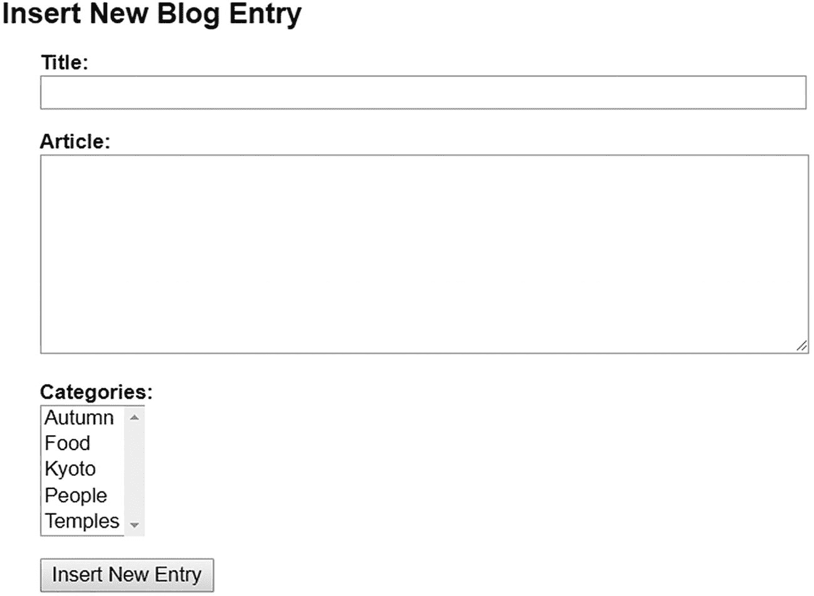

图 18-8.

多选`<select>`列表从`categories`表中拉取值

7.  查看页面的源代码，以验证每个分类的主键已正确嵌入到每个`<option>`标签的`value`属性中。你可以将自己的代码与`ch18`文件夹中的`blog_insert_mysqli_02.php`进行比较。

8.  接下来，创建`<select>`下拉菜单以显示已注册到数据库中的图像。在步骤 5 中插入的代码之后立即添加此代码：

```
已上传的图像：

选择图像
query($getImages);
while ($row = $images->fetch_assoc()) {
?>
"
>

```

这将创建另一个`SELECT`查询，以获取存储在`images`表中的每个图像的主键和文件名。现在你应该非常熟悉这段代码，因此无需解释。

9.  用于标题的复选框、文件输入字段和文本输入字段位于上一步的代码和提交按钮之间。代码如下所示：

```

上传新图像

选择图像：

标题：

```

包含复选框的段落已被赋予`allowUpload`的 ID，另外两个段落被分配了一个名为`optional`的类。`admin.css`中的样式规则将这些段落的`display`属性设置为`none`。

10. 保存`blog_insert_mysqli.php`并在浏览器中加载该页面。`images <select>`下拉菜单显示在`categories`列表下方，但你在步骤 9 中插入的三个表单元素是隐藏的。如果浏览器中禁用了 JavaScript，将会显示此状态。用户将可以选择分类和现有图像，但不能上传新图像。

如有必要，请对照`ch18`文件夹中的`blog_insert_mysqli_03.php`检查你的代码。

11. 将`toggle_fields.js`从`ch18`文件夹复制到`admin`文件夹。该文件包含以下 JavaScript：

```
var cbox = document.getElementById('allowUpload');
cbox.style.display = 'block';
var uploadImage = document.getElementById('upload_new');
uploadImage.onclick = function () {
var image_id = document.getElementById('image_id');
var image = document.getElementById('image');
var caption = document.getElementById('caption');
var sel = uploadImage.checked;
image_id.disabled = sel;
image.parentNode.style.display = sel ? 'block' : 'none';
caption.parentNode.style.display = sel ? 'block' : 'none';
image.disabled = !sel;
caption.disabled = !sel;
}
```

这使用了步骤 8 中插入的元素的 ID 来控制它们的显示。如果启用了 JavaScript，页面加载时会自动显示复选框，但标题的文件输入字段和文本输入字段仍保持隐藏。如果复选框被选中，现有图像的下拉菜单将被禁用，并且隐藏的元素会显示出来。如果随后取消选中复选框，下拉菜单会重新启用，文件输入字段和标题字段将再次隐藏。

12. 使用`<script>`标签将`toggle_fields.js`链接到`blog_insert_mysqli.php`，放在结束的`</body>`标签之前，如下所示：

在页面底部添加 JavaScript 可以加快下载和显示速度。如果你将其添加到`<head>`中，`toggle_fields.js`中的代码将无法正常运行。

13. 保存`blog_insert_mysqli.php`并在浏览器中加载该页面。在支持 JavaScript 的浏览器中，复选框应显示在`<select>`下拉菜单和提交按钮之间。选中复选框可禁用下拉菜单并显示隐藏字段，如图 18-9 所示。

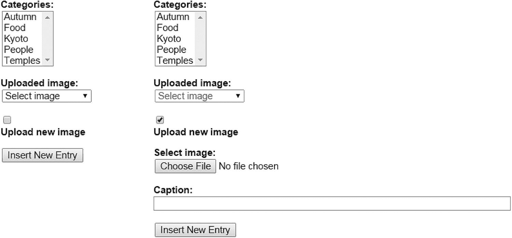

图 18-9.

复选框控制文件和标题输入字段的显示

14. 取消选中复选框。文件和标题输入字段被隐藏，下拉菜单重新启用。如有必要，你可以对照`ch18`文件夹中的`blog_insert_mysqli_04.php`和`toggle_fields.js`检查你的代码。

我使用 JavaScript 而不是 PHP 来控制文件和标题输入字段的显示，因为 PHP 是一种服务器端语言。在 PHP 引擎将输出发送到浏览器之后，除非你向 Web 服务器发送另一个请求，否则它将不再与页面进行交互。另一方面，JavaScript 在浏览器中运行，因此它能够在本地操作页面内容。JavaScript 还可以与 PHP 结合使用，在后台向 Web 服务器发送请求，并使用结果刷新页面的一部分而无需重新加载页面——这种技术称为 Ajax，超出了本书的范围。
更新后的插入表单现在包含了分类和图像的输入字段，但处理脚本仍然只处理标题的文本输入字段和博客条目的文本区域。

## PHP 解决方案 18-4：将数据插入多个表

此 PHP 解决方案改编了`blog_insert_mysqli.php`中的现有脚本，以按需上传新图像，然后按照图 18-6 中概述的决策链将数据插入`images`、`blog`和`article2cat`表。它假设你已经设置了`article2cat`交叉引用表，并完成了 PHP 解决方案 18-2 和 18-3。
不要试图匆忙完成本节。代码相当长，但它整合了许多你之前学过的技术。

> **注意**
> 如果你使用的是 PDO，此 PHP 解决方案之后会有一个单独的部分描述代码中的主要差异。


1.  你在 PHP Solution 18-2 中更新的 `Upload` 类使用了一个命名空间，因此你需要在脚本的顶层导入它。在 `blog_insert_mysqli.php` 顶部 PHP 开始标签之后立即添加此行：

```
use PhpSolutions\File\Upload;
```

2.  在预处理器语句初始化之后，立即插入以下条件语句来处理已上传或选择的图像。

```
// 初始化预处理语句
$stmt = $conn->stmt_init();
// 如果已上传文件，则处理它
if(isset($_POST['upload_new']) && $_FILES['image']['error'] == 0) {
    $imageOK = false;
    require_once '../PhpSolutions/File/Upload.php';
    $loader = new Upload('../images/');
    $loader->upload('image');
    $names = $loader->getFilenames();
    // 如果上传失败，$names 将是一个空数组
    if ($names) {
        $sql = 'INSERT INTO images (filename, caption) VALUES (?, ?)';
        if ($stmt->prepare($sql)) {
            $stmt->bind_param('ss', $names[0], $_POST['caption']);
            $stmt->execute();
            $imageOK = $stmt->affected_rows;
        }
    }
    // 获取图像的主键或查明问题所在
    if ($imageOK) {
        $image_id = $stmt->insert_id;
    } else {
        $imageError = implode(' ', $loader->getMessages());
    }
} elseif (!empty($_POST['image_id'])) {
    // 获取之前上传的图像的主键
    $image_id = $_POST['image_id'];
}
// 创建 SQL
$sql = 'INSERT INTO blog (title, article) VALUES(?, ?)';
```

这首先检查 `$_POST['upload_new']` 是否已设置。如第 6 章所述，复选框只有在被选中时才会包含在 `$_POST` 数组中。因此，如果复选框未被选中，条件失败，转而测试底部的 `elseif` 子句。`elseif` 子句检查 `$_POST['image_id']` 是否存在。如果存在且不为空，则表示已从下拉菜单中选择了一个现有图像，该值存储在 `$image_id` 中。

如果两个测试都失败，则表示既未上传也未从下拉菜单中选择图像。脚本稍后会在准备 `blog` 表的 `INSERT` 查询时考虑到这一点，允许你在没有图像的情况下创建博客条目。

但是，如果 `$_POST['upload_new']` 存在，则表示复选框已被选中，并且可能已上传图像。为了确保这一点，条件语句还会检查 `$_FILES['image']['error']` 的值。如第 9 章所学，错误代码 `0` 表示上传成功。任何其他错误代码意味着上传失败或未选择文件。

假设文件已成功从表单上传，条件语句会包含 `Upload` 类定义并创建一个名为 `$loader` 的对象，将目标文件夹设置为 `images`。然后调用 `upload()` 方法，将文件输入字段的名称传递给它，以处理文件并将其存储在 `images` 文件夹中。为避免使代码复杂化，这里使用了默认的最大文件大小和 MIME 类型。

你在 PHP Solution 18-2 中对 `Upload` 类所做的更改仅在文件成功移动到目标文件夹时，将上传文件的名称添加到 `$filenames` 属性中。`getFilenames()` 方法检索 `$filenames` 属性的内容，并将结果赋值给 `$names`。

如果文件成功移动，其文件名会作为 `$names` 数组的第一个元素被存储。因此，如果 `$names` 包含一个值，你可以安全地继续执行 `INSERT` 查询，该查询将 `$names[0]` 和 `$_POST['caption']` 的值作为字符串绑定到预处理语句。

语句执行后，`affected_rows` 属性会重置 `$imageOK` 的值。如果 `INSERT` 查询成功，`$imageOK` 为 `1`，这被视为 `true`。

如果图像详情已插入到 `images` 表中，预处理语句的 `insert_id` 属性会检索新记录的主键并将其存储在 `$image_id` 中。必须在运行任何其他 SQL 查询之前访问 `insert_id` 属性，因为它包含最近一次查询的主键。

但是，如果 `$imageOK` 仍为 `false`，则 `else` 块会调用上传对象的 `getMessages()` 方法，并将结果赋值给 `$imageError`。`getMessages()` 方法返回一个数组，因此使用 `implode()` 函数将数组元素连接成一个字符串。失败最可能的原因是文件过大或 MIME 类型错误。

3.  只要图像上传没有失败，过程的下一步就是将博客条目插入到 `blog` 表中。`INSERT` 查询的形式取决于博客条目是否与图像关联。如果有关联，`$image_id` 存在并需要作为外键插入到 `blog` 表中。否则，可以使用原始查询。

像这样修改原始查询：

```
// 仅当没有图像上传错误时才插入博客详情
if (!isset($imageError)) {
    // 如果设定了 $image_id，则将其作为外键插入
    if (isset($image_id)) {
        $sql = 'INSERT INTO blog (image_id, title, article) VALUES(?, ?, ?)';
        if ($stmt->prepare($sql)) {
            $stmt->bind_param('iss', $image_id, $_POST['title'], $_POST['article']);
            $stmt->execute();
        }
    } else {
        // 创建 SQL
        $sql = 'INSERT INTO blog (title, article)
        VALUES(?, ?)';
        if ($stmt->prepare($sql)) {
            // 绑定参数并执行语句
            $stmt->bind_param('ss', $_POST['title'], $_POST['article']);
            $stmt->execute();
        }
    }
    if ($stmt->affected_rows > 0) {
        $OK = true;
    }
}
```

整个代码段被包裹在一个条件语句中，该语句检查 `$imageError` 是否存在。如果存在，则无需插入新博客条目，因此整个代码块被忽略。

但是，如果 `$imageError` 不存在，嵌套的条件语句会根据 `$image_id` 是否存在来准备不同的 `INSERT` 查询，然后执行已准备好的那个。

检查 `affected_rows` 属性的条件语句被移出了 `else` 块，以便它适用于任一 `INSERT` 查询。

4.  过程的下一步是将值插入到 `article2cat` 交叉引用表中。代码紧跟在上一节的代码之后，如下所示：

```
// 如果博客条目插入成功，检查分类
if ($OK && isset($_POST['category'])) {
    // 获取文章的主键
    $article_id = $stmt->insert_id;
    foreach ($_POST['category'] as $cat_id) {
        if (is_numeric($cat_id)) {
            $values[] = "($article_id, " . (int) $cat_id . ')';
        }
    }
    if ($values) {
        $sql = 'INSERT INTO article2cat (article_id, cat_id)
        VALUES ' . implode(',', $values);
        // 执行查询，如果失败则获取错误信息
        if (!$conn->query($sql)) {
            $catError = $conn->error;
        }
    }
}
```


`$OK`的值由插入数据到`blog`表的查询的`affected_rows`属性决定，且仅当选中任意分类时，多选的`<select>`列表才会被包含在`$_POST`数组中。因此，仅当数据成功插入`blog`表，且表单中至少选中了一个分类时，此代码块才会执行。它首先从预处理语句对象的`insert_id`属性获取插入操作的主键，并将其赋值给`$article_id`。

表单将分类值作为数组提交。`foreach`循环检查`$_POST['category']`中的每个值。如果该值是数值，则执行以下行：

```
$values[] = "($article_id, " . (int) $cat_id . ')';
```

这会创建一个由两个主键`$article_id`和`$cat_id`组成的字符串，它们用逗号分隔并包裹在一对圆括号中。`(int)`强制转换运算符确保`$cat_id`是一个整数。结果被赋值给一个名为`$values`的数组。例如，如果`$article_id`是`10`且`$cat_id`是`4`，则赋值给数组的结果字符串为`(10, 4)`。

如果`$values`包含任何元素，则`implode()`会将其转换为逗号分隔的字符串，并追加到 SQL 查询中。例如，如果选中了分类`2`、`4`和`5`，生成的查询如下所示：

```
INSERT INTO article2cat (article_id, cat_id)
VALUES (10, 2),(10, 4),(10, 5)
```

正如第 15 章“回顾四个基本 SQL 命令”中所述，这是如何使用单个`INSERT`查询插入多行的方法。

由于`$article_id`来自可靠来源，并且`$cat_id`的数据类型已检查过，因此直接将这些变量用于 SQL 查询是安全的，无需使用预处理语句。查询通过`query()`方法执行。如果失败，连接对象的`error`属性将存储在`$catError`中。

5.  最后的代码段处理成功时的重定向和错误消息。修改后的代码如下所示：

```
// redirect if successful or display error
if ($OK && !isset($imageError) && !isset($catError)) {
header('Location: http://localhost/phpsols-4e/admin/blog_list_mysqli.php');
exit;
} else {
$error = $stmt->error;
if (isset($imageError)) {
$error .= ' ' . $imageError;
}
if (isset($catError)) {
$error .= ' ' . $catError;
}
}
```

控制重定向的条件现在确保`$imageError`和`$catError`不存在。如果任一存在，其值会被追加到原始的`$error`中，`$error`包含了来自预处理语句对象的任何错误消息。

6.  保存`blog_insert_mysqli.php`并在浏览器中测试。尝试上传一张过大的图片或一个 MIME 类型错误的文件。表单应重新显示，并附有错误消息，且博客详情得以保留。同时尝试插入带或不带图片和/或分类的博客条目。你现在拥有一个通用的插入表单。

如果你没有合适的图片供上传，请使用`phpsols images`文件夹中的图片。`Upload`类会重命名它们以避免覆盖现有文件。

你可以对照`ch18`文件夹中的`blog_insert_mysqli_05.php`检查你的代码。

## PDO 版本的主要差异

最终的 PDO 版本可以在`ch18`文件夹中的`blog_insert_pdo_05.php`找到。它遵循与 MySQLi 版本相同的基本结构和逻辑，但在将值插入数据库的方式上存在一些重要差异。

步骤 2 中的代码紧跟 MySQLi 版本，但使用了命名占位符代替匿名占位符。为了获取受影响的行数，PDO 在语句对象上使用`rowCount()`方法。最近一次插入操作的主键通过在连接对象上调用`lastInsertId()`方法获得。与 MySQLi 的`insert_id`属性类似，你需要在`INSERT`查询执行后立即访问它。

最大的变化在于步骤 3 中向`blog`表插入详情信息的代码。由于 PDO 可以使用`bindValue()`将`null`值插入列，因此只需要一个预处理语句。步骤 3 的 PDO 代码如下所示：

```
// insert blog details only if there hasn't been an image upload error
if (!isset($imageError)) {
// create SQL
$sql = 'INSERT INTO blog (image_id, title, article)
VALUES(:image_id, :title, :article)';
// prepare the statement
$stmt = $conn->prepare($sql);
// bind the parameters
// if $image_id exists, use it
if (isset($image_id)) {
$stmt->bindParam(':image_id', $image_id, PDO::PARAM_INT);
} else {
// set image_id to NULL
$stmt->bindValue(':image_id', NULL, PDO::PARAM_NULL);
}
$stmt->bindParam(':title', $_POST['title'], PDO::PARAM_STR);
$stmt->bindParam(':article', $_POST['article'], PDO::PARAM_STR);
// execute and get number of affected rows
$stmt->execute();
$OK = $stmt->rowCount();
}
```

如果已上传图片，以粗体高亮的条件语句会将`$image_id`的值绑定到命名的`:image_id`占位符。但如果没有上传图片，`bindValue()`会将该值设置为`NULL`。

在步骤 4 中，PDO 版本使用`exec()`代替`query()`来将值插入`article2cat`表。`exec()`方法执行一个 SQL 查询并返回受影响的行数，因此当不需要使用预处理语句时，它应与`INSERT`、`UPDATE`和`DELETE`查询一起使用。

另一个重要的区别在于构建错误消息的代码（如果出现问题）。由于在 PDO 中，创建和准备语句是一个步骤，因此如果出现问题，语句对象可能不存在。所以，在尝试调用`errorInfo()`方法之前，你需要检查其是否存在。如果没有语句，代码会从数据库连接对象获取错误消息。同时需要将`$error`初始化为空字符串，以便连接各种消息，如下所示：

```
// redirect if successful or display error
if ($OK && !isset($imageError) && !isset($catError)) {
header('Location: http://localhost/phpsols-4e/admin/blog_list_pdo.php');
exit;
} else {
$error = ";
if (isset($stmt)) {
$error .= $stmt->errorInfo()[2];
} else {
$error .= $conn->errorInfo()[2];
}
if (isset($imageError)) {
$error .= ' ' . $imageError;
}
if (isset($catError)) {
$error .= ' ' . $catError;
}
}
```

## 在多表中更新和删除记录

`categories`和`article2cat`表的添加意味着上一章 PHP 解决方案 17-2 和 17-3 中对`blog_update_mysqli.php`和`blog_update_pdo.php`所做的修改不再完全覆盖`phpsols`数据库中的外键关系。除了修改更新表单外，你还需要创建脚本来删除记录，而不破坏数据库的参照完整性。


# 更新交叉引用表中的记录

交叉引用表中的每条记录只包含一个复合主键。通常情况下，主键不应被修改，且必须保持唯一性。这给更新 `article2cat` 表带来了一个问题：如果在更新博客条目时对已选分类未作任何更改，则无需更新交叉引用表。但若分类发生了变动，则需要确定哪些交叉引用记录需要删除，哪些新记录需要插入。

与其纠结于是否发生了变更，一个简单的解决方案是：删除所有现有的交叉引用记录，然后重新插入所选分类。如果未作更改，只需再次插入相同的分类即可。

## PHP 解决方案 18-5：将分类添加到更新表单

本 PHP 解决方案对上一章 PHP 解决方案 17-2 中的 `blog_update_mysqli.php` 进行了修改，使其能够更新与博客条目关联的分类。为保持结构简单，对条目关联图片的唯一更改是选择一张不同的现有图片或不选择任何图片。

1. 继续使用 PHP 解决方案 17-2 中的 `blog_update_mysqli.php`。或者，从 `ch18` 文件夹复制 `blog_update_mysqli_04.php`，并将其保存到 `admin` 文件夹中，命名为 `blog_update_mysqli.php`。

2. 页面首次加载时，需要执行第二个查询来获取与博客条目关联的分类。将以下高亮代码添加到获取所选记录详细信息的条件语句中：

```
$stmt->free_result();
// 获取与文章关联的分类
$sql = 'SELECT cat_id FROM article2cat
WHERE article_id = ?';
if ($stmt->prepare($sql)) {
    $stmt->bind_param('i', $_GET['article_id']);
    $OK = $stmt->execute();
    $stmt->bind_result($cat_id);
    // 循环遍历结果并将其存储到数组中
    $selected_categories = [];
    while ($stmt->fetch()) {
        $selected_categories[] = $cat_id;
    }
}
```

该查询从交叉引用表中选取与所选博客条目主键匹配的所有记录中的 `cat_id`。结果绑定到 `$cat_id`，然后通过 `while` 循环将值提取到名为 `$selected_categories` 的数组中。

3. 在 HTML 页面的主体中，在文本区域和显示图片列表的 `<select>` 下拉菜单之间添加一个多选的 `<select>` 列表。使用另一个 SQL 查询来填充它，如下所示：

```
<label for="category">分类：</label>
<select name="category[]" size="5" multiple id="category">
<?php
$getCats = 'SELECT cat_id, category FROM category ORDER BY category';
$categories = $conn->query($getCats);
while ($row = $categories->fetch_assoc()) {
    ?>
    <option value="<?php echo $row['cat_id']; ?>"
    <?php
    if (in_array($row['cat_id'], $selected_categories)) {
        echo ' selected';
    }
    ?>><?php echo $row['category']; ?></option>
<?php } ?>
</select>
```

`while` 循环通过将 `cat_id` 插入 `value` 属性，并在开闭标签之间显示分类来构建每个 `<option>` 标签。如果 `cat_id` 存在于 `$selected_categories` 数组中，则在 `<option>` 标签中插入 `selected`。这样就能选中与博客条目已关联的分类。

4. 保存 `blog_update_mysqli.php`，然后选择 `blog_list_mysqli.php` 中的某个 `EDIT` 链接，以确保多选列表已填充分类。如果你在 PHP 解决方案 18-4 中插入了新条目，则与你输入的条目关联的分类应被选中，如下图所示。

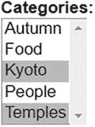

如有必要，你可以对照 `ch18` 文件夹中的 `blog_update_mysqli_05.php` 检查代码。PDO 版本位于 `blog_update_pdo_05.php`。

5. 接下来，需要编辑在提交表单时更新记录的那部分代码。新代码首先删除交叉引用表中与 `article_id` 匹配的所有条目，然后插入在更新表单中选择的值。内联注释标明了为节省篇幅而省略的现有代码位置。

```
// 如果表单已提交，则更新记录
if (isset($_POST ['update'])) {
    // 准备更新查询
    if (!empty($_POST['image_id'])) {
        // 现有代码已省略
    } else {
        // 现有代码已省略
        $done = $stmt->execute();
    }
}
// 删除交叉引用表中的现有值
$sql = 'DELETE FROM article2cat WHERE article_id = ?';
if ($stmt->prepare($sql)) {
    $stmt->bind_param('i', $_POST['article_id']);
    $done = $stmt->execute();
}
// 插入新值到 article2cat
if (isset($_POST['category']) && is_numeric($_POST['article_id'])) {
    $article_id = (int) $_POST['article_id'];
    foreach ($_POST['category'] as $cat_id) {
        $values[] = "($article_id, " . (int) $cat_id . ')';
    }
    if ($values) {
        $sql = 'INSERT INTO article2cat (article_id, cat_id)
                VALUES ' . implode(',', $values);
        $done = $conn->query($sql);
    }
}
```

在更新表单中插入所选值的代码与 PHP 解决方案 18-4 步骤 4 中的代码完全相同。关键点在于它使用的是 `INSERT` 查询，而非 `UPDATE` 查询。由于原始值已被删除，因此需要重新添加它们。

6. 保存 `blog_update_mysqli.php`，并通过更新 `blog` 表中的现有记录进行测试。如有必要，你可以对照 `ch18` 文件夹中的 `blog_update_mysqli_06.php` 检查代码。PDO 版本位于 `blog_update_pdo_06.php`。

## 将多个查询作为事务中的块处理

前述 PHP 解决方案在很大程度上依赖于信任。更新序列涉及三个独立的查询：更新 `blog` 表、删除 `article2cat` 表中的引用，以及插入新引用。如果其中任何一个失败，`$done` 将被设置为 `false`；但如果后续查询成功，它又会被重置为 `true`。你很容易最终只完成部分更新，而对此一无所知，除非失败的是查询序列中的最后一部分。

一个解决方案可能是运行一系列条件语句，如果前面的查询失败，则阻止后续执行。问题在于你仍然会得到部分更新。当更新多个表中的关联记录时，整个序列需要被视为一个块。如果一部分失败，则整个序列失败。更新序列只有在所有部分都成功时才会被处理。将多个查询视为一个统一块在 SQL 中被称为**事务**。

在 MySQLi 和 PDO 中实现事务都很简单。

> **注意**  
> 要在 MySQL 和 MariaDB 中使用事务，必须使用 InnoDB 存储引擎。

### 在 MySQLi 中使用事务

默认情况下，MySQL 和 MariaDB 在自动提交模式下工作。换句话说，SQL 查询会立即执行。要使用事务，你需要关闭自动提交模式，然后在数据库连接对象上调用 `begin_transaction()` 方法，如下所示（假设 `$conn` 是数据库连接）：

```
$conn->autocommit(false);
$conn->begin_transaction();
```

然后像平常一样运行 SQL 查询序列，根据查询是否成功执行，将变量设置为 `true` 或 `false`。如果在序列结束时检测到任何错误，可以将所有表回滚到原始状态。否则，提交事务，将序列作为单个块处理，如下所示：

```
if ($trans_error) {
    $conn->rollback();
} else {
    $conn->commit();
}
```

### 在 PDO 中使用事务

PDO 也在自动提交模式下工作。在数据库连接对象上调用 `beginTransaction()` 方法会关闭自动提交模式。与其使用变量来跟踪单个查询的成功与否，更简单的方法是让 PDO 在遇到问题时立即抛出异常。然后可以使用 `catch` 块将表回滚到原始状态。基本结构如下所示：


```php
// 设置 PDO 在遇到问题时抛出异常
$conn->setAttribute(PDO::ATTR_ERRMODE, PDO::ERRMODE_EXCEPTION);
try {
    $conn->beginTransaction();
    // 运行一系列 SQL 查询
    // 如果没有遇到问题，则提交事务
    $done = $conn->commit();
    // 如果出现问题，则捕获异常
} catch (Exception $e) {
    // 回滚到原始状态并获取错误信息
    $conn->rollBack();
    $trans_error = $e->getMessage();
}
```

**警告**：PHP 中的函数和方法名不区分大小写，因此对于 MySQLi 和 PDO，`rollBack()` 和 `rollback()` 都是可接受的。然而，`begin_transaction()`（MySQLi）和 `beginTransaction()`（PDO）之间存在细微差别。PDO 方法中没有下划线。

## PHP 解决方案 18-6：将表转换为 InnoDB 存储引擎

此 PHP 解决方案展示了如何将表从 MyISAM 转换为 InnoDB。如果你计划将表上传到远程服务器，该服务器也必须支持 InnoDB（参见 PHP 解决方案 18-1）。

1. 在 phpMyAdmin 中选择 `phpsols` 数据库，然后选择 `article2cat` 表。

2. 点击屏幕右上角的 **操作** 选项卡。

3. 在 **表选项** 部分，**存储引擎** 字段显示了表当前使用的引擎。如果显示为 **MyISAM**，从下拉菜单中选择 **InnoDB**，如图 18-10 所示。

   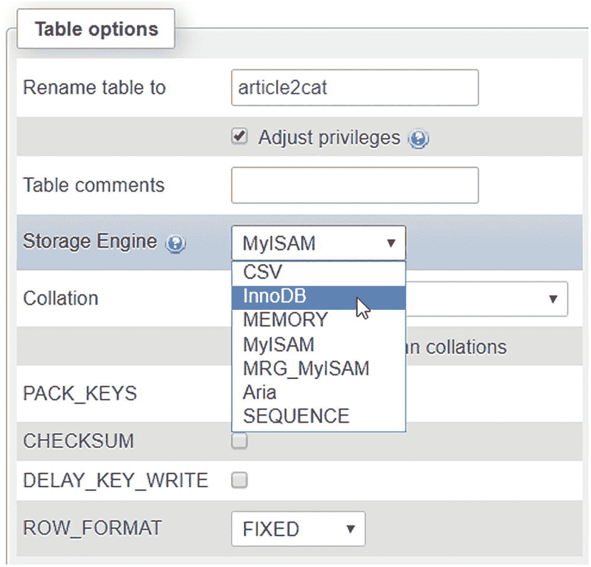

   **图 18-10.** 在 phpMyAdmin 中更改表的存储引擎非常容易

4. 点击 `Go`。更改存储引擎就这么简单！

**注意**：每个表都需要单独转换。你无法在一次操作中更改数据库中所有表的引擎。

## PHP 解决方案 18-7：将更新序列封装在事务中（MySQLi）

此 PHP 解决方案改进了 `blog_update_mysqli.php` 中的脚本，将更新 `blog` 和 `article2cat` 表的 SQL 查询序列封装在一个事务中，如果序列的任何部分失败，则将数据库回滚到其原始状态。

1. 如有必要，按照上一个 PHP 解决方案中所述，将 `blog` 和 `article2cat` 表的存储引擎转换为 InnoDB。

2. 继续使用 PHP 解决方案 18-5 中的 `blog_update_mysqli.php` 和 `blog_list_mysqli.php` 进行操作。或者，从 `ch18` 文件夹将 `blog_update_mysqli_06.php` 和 `blog_list_mysqli_04.php` 复制到 `phpsols-4e` 站点根目录下的 `admin` 文件夹，并移除文件名中的数字。

3. 在 `blog_update_mysqli.php` 顶部初始化一个空数组，用于存储错误消息：

   ```php
   $trans_error = [];
   ```

4. 在运行更新查询序列的条件语句开头，关闭自动提交模式并开始一个事务，如下所示：

   ```php
   // 如果表单已提交，则更新记录
   if (isset($_POST ['update'])) {
       // 关闭自动提交
       $conn->autocommit(false);
       $conn->begin_transaction();
       // 准备更新查询
   ```

5. 在更新 `blog` 表的查询之后，添加一个条件语句，以便在查询失败时将任何错误消息添加到 `$trans_error` 数组中。为节省空间，省略了部分现有代码：

   ```php
   if (!empty($_POST['image_id'])) {
       // 省略现有代码
       $done = $stmt->execute();
   }
   } else {
       // 省略现有代码
       $done = $stmt->execute();
   }
   }
   if (!$done) {
       $trans_error[] = $stmt->error;
   }
   ```

6. 添加类似的条件语句，以捕获从交叉引用表中删除现有值时可能出现的任何错误消息。

   ```php
   // 删除交叉引用表中的现有值
   $sql = 'DELETE FROM article2cat WHERE article_id = ?';
   if ($stmt->prepare($sql)) {
       $stmt->bind_param('i', $_POST['article_id']);
       $done = $stmt->execute();
       if (!$done) {
           $trans_error[] = $stmt->error;
       }
   }
   ```

7. 捕获向 `article2cat` 表插入更新值时可能出现的错误消息的代码需要略有不同，因为它使用的是 `query()` 方法而非预处理语句。你需要访问数据库连接对象的 `error` 属性，而不是语句对象的 `error` 属性，如下所示：

   ```php
   if ($values) {
       $sql = 'INSERT INTO article2cat (article_id, cat_id)
               VALUES ' . implode(',', $values);
       $done = $conn->query($sql);
       if (!$done) {
           $trans_error[] = $conn->error;
       }
   }
   ```

8. 在查询序列之后，使用条件语句来回滚或提交事务，如下所示（该代码放在点击“更新”按钮时运行脚本的条件语句内）：

   ```php
   if ($trans_error) {
       $conn->rollback();
       $done = false;
   } else {
       $conn->commit();
   }
   ```

   如果 `$trans_error` 包含任何错误消息，则必须将 `$done` 显式设置为 `false`。这是因为任何在事务外部本应成功的查询都会将 `$done` 设置为 `true`。

9. 需要修改重定向页面的条件语句以处理事务。添加以粗体突出显示的新代码：

   ```php
   // 更新后或未定义 $_GET['article_id'] 时重定向页面
   if (($done || $trans_error) || (!$_POST && !isset($_GET['article_id']))) {
       $url = 'http://localhost/phpsols-4e/admin/blog_list_mysqli.php';
       if ($done) {
           $url .= '?updated=true';
       } elseif ($trans_error) {
           $url .= '?trans_error=' . serialize($trans_error);
       }
       header("Location: $url");
       exit;
   }
   ```

   现在条件被分组在括号内，以确保它们被正确解释。第一对检查 `$done` 或 `$trans_error` 是否等于 `true`。最后一个条件通过检查 `$_POST` 数组是否为空来使其更具体。这是必要的，因为在点击“更新”按钮后，`!isset($_GET['article_id'])` 始终为 `true`。

   如果 `$trans_error` 包含任何错误消息，则它等于 `true`，因此会将查询字符串附加到重定向位置。由于 `$trans_error` 是一个数组，因此需要先将其传递给 `serialize()` 函数，然后才能将其连接到查询字符串上。这会将数组转换为一个字符串，该字符串可以转换回其原始格式。

10. 最后一个更改位于 `blog_list_mysqli.php` 中表格上方的 PHP 代码块中。添加以粗体显示的代码，以便在更新失败时显示任何错误消息：

    ```php
    if (isset($_GET['updated'])) {
        echo '记录已更新';
    } elseif (isset($_GET['trans_error'])) {
        $trans_error = unserialize($_GET['trans_error']);
        echo '由于以下错误，无法更新记录：';
        echo '';
        foreach ($trans_error as $item) {
            echo '' . safe($item) . '';
        }
        echo '';
    }
    ```

    `unserialize()` 函数反转了 `serialize()` 的效果，将错误消息转换回一个数组，然后在 `foreach` 循环中显示。

11. 保存 `blog_update_mysqli.php` 和 `blog_list_mysqli.php`，并更新一条现有记录。脚本应该像以前一样工作。

12. 在 `blog_update_mysqli.php` 的 SQL 中故意引入一些错误，并再次测试。这次，当你返回 `blog_list_mysqli.php` 时，应该会看到类似于图 18-11 的一系列错误消息。


# PHP 解决方案 18-8：在事务中包装更新序列（PDO）

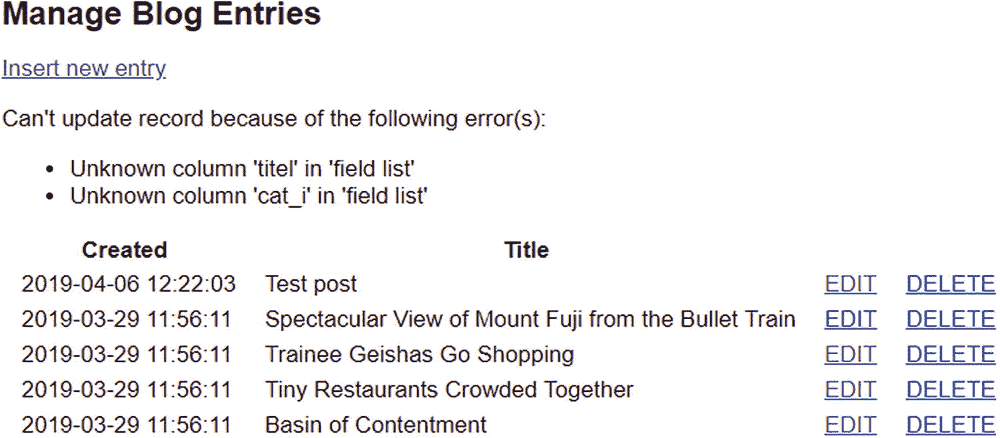

**图 18-11.** 由于列名错误，更新操作失败

13. 点击刚尝试更新的记录的`EDIT`链接，验证所有值均未改变。你可以对照`ch18`文件夹中的`blog_update_mysqli_07.php`和`blog_list_mysqli_05.php`检查代码。

本 PHP 解决方案改进了`blog_update_pdo.php`中的脚本，将更新`blog`和`article2cat`表的 SQL 查询序列包装在事务中，如果序列中的任何部分失败，则将数据库回滚到原始状态。

1. 如有必要，按照 PHP 解决方案 18-6 的描述，将`blog`和`article2cat`表的存储引擎转换为 InnoDB。

2. 继续使用 PHP 解决方案 18-5 中的`blog_update_pdo.php`和`blog_list_pdo.php`进行操作。或者，将`ch18`文件夹中的`blog_update_pdo_06.php`和`blog_list_pdo_04.php`复制到`phpsols-4e`站点根目录的`admin`文件夹中，并移除文件名中的数字。

3. 在页面顶部初始化一个变量用于跟踪事务，并将其值设置为`false`：

```php
$trans_error = false;
```

4. 在运行更新`blog`和`article2cat`表查询序列的条件语句内部，设置 PDO 在遇到问题时抛出异常，如下所示：

```php
if (isset($_POST['update'])) {
    $conn->setAttribute(PDO::ATTR_ERRMODE, PDO::ERRMODE_EXCEPTION);
    // 准备更新查询
    $sql = 'UPDATE blog SET image_id = ?, title = ?, article = ?
    WHERE article_id = ?';
```

5. 将所有运行更新查询的代码包装在`try`/`catch`块中，并在`try`块开头开始一个事务，如下所示：

```php
$conn->setAttribute(PDO::ATTR_ERRMODE, PDO::ERRMODE_EXCEPTION);
try {
    $conn->beginTransaction();
    // 准备更新查询
    // 其他数据库查询已省略
} catch (Exception $e) {
    $conn->rollBack();
    $trans_error = $e->getMessage();
}
```

6. 在现有代码中，每次执行查询的返回值都设置为`$done`。由于我们使用了事务，这不再必要。我们将使用`$done`作为成功提交事务的返回值。找到以下行（大约在第 53、57 和 69 行）：

```php
$done = $stmt->execute();
$done = $stmt->execute([$_POST['article_id']]);
$done = $conn->exec($sql);
```

将其修改为：

```php
$stmt->execute();
$stmt->execute([$_POST['article_id']]);
$conn->exec($sql);
```

7. 在`catch`块之前，立即添加以粗体显示的代码来提交事务：

```php
$done = $conn->commit();
} catch (Exception $e) {
    $conn->rollBack();
    $trans_error = $e->getMessage();
}
```

8. 需要修改重定向页面的条件语句以处理事务。添加以粗体高亮显示的新代码：

```php
// 更新后或当$_GET['article_id']未定义时重定向页面
if (($done || $trans_error) || (!$_POST && !isset($_GET['article_id']))) {
    $url = 'http://localhost/phpsols-4e/admin/blog_list_pdo.php';
    if ($done) {
        $url .= '?updated=true';
    } elseif ($trans_error) {
        $url .= "?trans_error=$trans_error";
    }
    header("Location: $url");
    exit;
}
```

现在条件语句被分组在括号内，以确保正确解析。第一对检查`$done`或`$trans_error`是否等于`true`。最终条件通过检查`$_POST`数组是否为空变得更加具体。这是必要的，因为点击更新按钮后，`!isset($_GET['article_id'])`始终为`true`。


# 处理后的文本

如果 `$trans_error` 包含任何错误消息，则其值为 `true`，因此会在重定向上追加一个查询字符串。

9.  最后的改动在 `blog_list_pdo.php` 中表格上方的 PHP 代码块里。添加粗体部分的代码，以便在更新失败时显示错误消息：

```
if (isset($_GET['updated'])) {
    echo 'Record updated';
} elseif (isset($_GET['trans_error'])) {
    echo "Can't update record because of the following error: ";
    echo safe($_GET['trans_error']) . '';
}
```

PDO 在遇到错误时会立即抛出异常，因此即使存在多个错误，也只会有一条错误消息。

10. 保存 `blog_update_pdo.php` 和 `blog_list_pdo.php`，并更新一条现有记录。脚本应像之前一样正常工作。

11. 在 `blog_update_pdo.php` 的某个更新查询中故意引入一个错误，然后再次测试。这一次，当你被重定向回 `blog_list_pdo.php` 时，将会看到错误消息。

12. 点击刚刚尝试更新的记录旁的 `EDIT` 链接，并验证没有任何值发生变化。你可以将你的代码与 `ch18` 文件夹中的 `blog_update_pdo_07.php` 和 `blog_list_pdo_05.php` 进行核对。

**提示：** 当事务需要满足特定条件才能处理一系列查询时，它们至关重要。例如，在金融数据库中，只有在资金充足时才能进行资金转账。

## 删除时保持参照完整性

在 PHP Solution 18-5 中，删除交叉引用表中的记录时无需担心参照完整性，因为每条记录中存储的值都是外键。每个记录只是引用了 `blog` 表和 `categories` 表中存储的主键。参照本章开头的图 18-1，从交叉引用表中删除组合了 `article_id 2` 和 `cat_id 1` 的记录，只是断开了题为“见习艺妓逛商店”的文章与 `Kyoto` 分类之间的链接。文章和分类本身不受影响，它们仍然保留在各自的表中。

如果你决定删除文章或分类，情况就完全不同了。如果你从 `blog` 表中删除“见习艺妓逛商店”这篇文章，则所有对 `article_id 2` 的引用也必须从交叉引用表中删除。同样地，如果你删除 `Kyoto` 分类，则所有对 `cat_id 1` 的引用都必须从交叉引用表中移除。或者，如果一个项目的主键作为外键存储在别处，你必须阻止该删除操作。

最好的方法是通过建立外键约束。为此，相关表必须使用 InnoDB 存储引擎。如果你使用的是 MySQL 或 MariaDB 5.5 或更高版本，InnoDB 是默认引擎。此外，本书附带的所有 `.sql` 文件都选择 InnoDB 引擎。但是，如果你有使用 MyISAM 存储引擎创建的现有表，则需要先转换它们，然后才能建立外键约束（参见 PHP Solution 18-6）。

## PHP Solution 18-9：设置外键约束

本 PHP 解决方案介绍如何在 phpMyAdmin 中设置 `article2cat`、`blog` 和 `categories` 表之间的外键约束。外键约束必须始终在子表中定义。在本例中，子表是 `article2cat`，因为它将其他表中的 `article_id` 和 `cat_id` 主键作为外键存储。

1.  在 phpMyAdmin 中选择 `article2cat` 表，然后点击“结构”选项卡。

2.  点击结构表上方的“关系视图”（如图 18-12 中圆圈所示）（在旧版 phpMyAdmin 中，它是结构表下方的一个链接）。

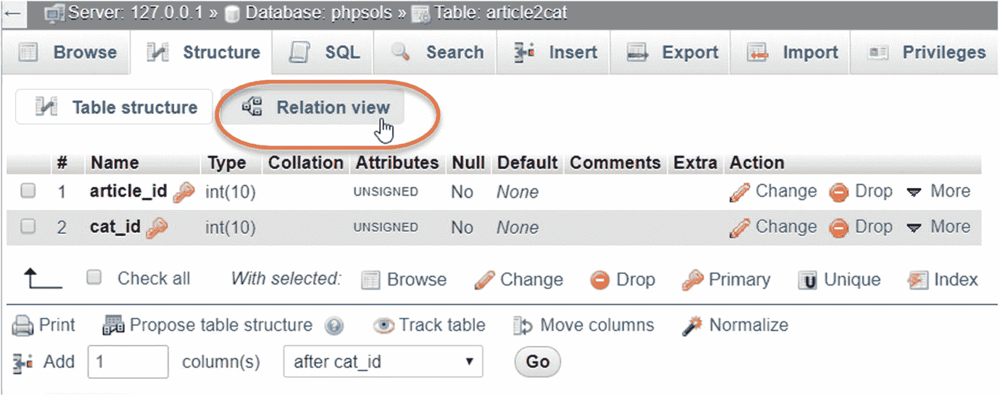

**图 18-12.** 在 phpMyAdmin 的关系视图中定义外键约束

3.  打开的屏幕就是你定义外键约束的地方。将“约束名称”字段留空。phpMyAdmin 会自动为约束生成一个名称。

4.  只能在已建立索引的列上设置外键约束。`article2cat` 表中的 `article_id` 和 `cat_id` 列是该表的复合主键，因此它们都列在“列”下拉菜单中。选择 `article_id`。然后在“外键约束（INNODB）”下选择以下设置：

    *   数据库：`phpsols`
    *   表：`blog`
    *   列：`article_id`

    这就在父表（`blog`）中的 `article_id` 和子表（`article2cat`）中的 `article_id` 之间建立了一个约束。

5.  接下来，你需要决定约束的行为方式。“ON DELETE”下拉菜单包含以下选项：

    *   `CASCADE`：当你删除父表中的一条记录时，子表中的所有依赖记录都会被删除。例如，如果你在 `blog` 表中删除了主键为 `article_id 2` 的记录，则 `article2cat` 表中所有包含 `article_id 2` 的记录都会被自动删除。
    *   `SET NULL`：当你删除父表中的一条记录时，子表中所有依赖记录的外键都会被设置为 NULL。外键列必须接受 NULL 值。
    *   `NO ACTION`：在某些数据库系统上，这允许延迟外键约束检查。MySQL 会立即执行检查，因此其效果与 `RESTRICT` 相同。
    *   `RESTRICT`：如果子表中仍存在依赖记录，则阻止删除父表中的记录。

    **注意：** `ON UPDATE` 也有相同的选项。除了 `RESTRICT` 之外，其他选项的用途有限，因为只有在特殊情况下才应该更改记录的主键。`ON UPDATE RESTRICT` 不仅阻止对父表中的主键进行更改；还会拒绝子表中任何会导致外键值在父表中找不到匹配行的插入或更新操作。

    对于交叉引用表来说，`CASCADE` 是合乎逻辑的选择。如果你决定删除父表中的一条记录，你希望该记录的所有交叉引用也同时被移除。但是，为了演示外键约束的默认行为，请为 `ON DELETE` 和 `ON UPDATE` 都选择 `RESTRICT`。

6.  点击“添加约束”链接，使用以下设置为 `cat_id` 建立外键约束：

    *   列：`cat_id`
    *   数据库：`phpsols`
    *   表：`categories`
    *   列：`cat_id`

7.  将 `ON DELETE` 和 `ON UPDATE` 设置为 `RESTRICT`。设置应如图 18-13 所示。然后点击“保存”按钮。

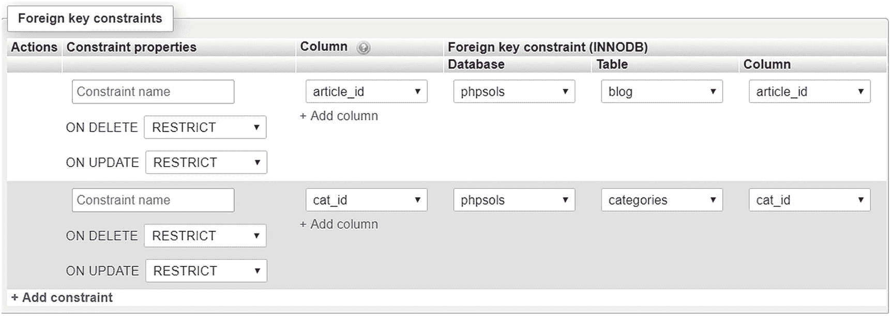

**图 18-13.** 为交叉引用表设置外键约束

**注意：** 旧版 phpMyAdmin 中关系视图的布局不同，它将“数据库”、“表”和“列”下拉菜单组合在一个下拉菜单中。

8.  如果尚未完成，请至少更新一篇博客条目，将其与一个分类关联起来。

9.  在 phpMyAdmin 中，选择 `categories` 表，然后点击已知与某博客条目关联的分类旁边的 `Delete`，如图 18-14 所示。

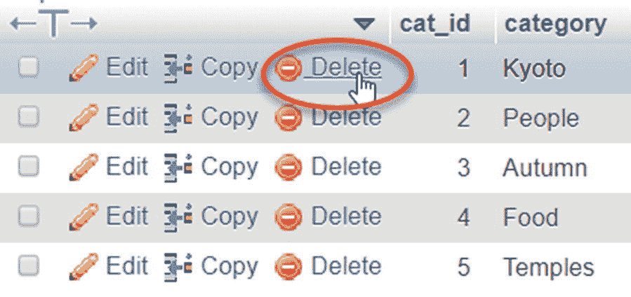

**图 18-14.** 尝试删除 `categories` 表中的一条记录


10. 点击 `OK`，当 phpMyAdmin 要求你确认删除时。如果你已正确设置外键约束，你将看到类似于图 18-15 的错误信息。

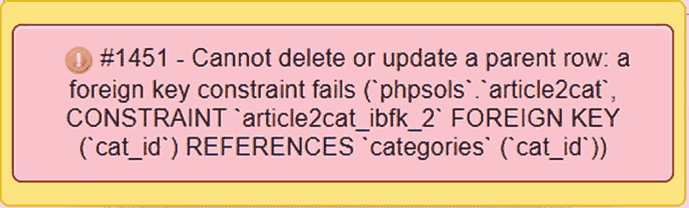

图 18-15. 如果存在依赖记录，外键约束会阻止删除。

11. 如果错误信息出现在模态对话框中，点击对话框将其关闭。

12. 选择 `article2cat` 表，然后点击“结构”选项卡。接着点击“关系视图”。

**注意**：在较旧版本的 phpMyAdmin 中，`ON DELETE` 和 `ON UPDATE` 可能为空。将这些选项留空与选择 `RESTRICT` 效果相同，后者是两者的默认值。

13. 将两个 `ON DELETE` 设置都改为 `CASCADE`，然后点击 `Save`。

14. 在 `blog` 表中选择一条你知道已关联某个分类的记录。记下其 `article_id`，然后删除该记录。

15. 检查 `article2cat` 表。与你刚刚删除的记录相关联的记录也已被删除。

要继续探索外键约束，请选择 `blog` 表，并与 `images` 表中的 `image_id` 建立外键关系。如果你从 `images` 表中删除一条记录，`blog` 表中的 `image_id` 外键需要被设置为 `NULL`。如果你将 `ON DELETE` 的值设置为 `SET NULL`，这将会自动完成。通过从 `images` 表中删除一条记录并检查 `blog` 表中的相关记录来测试它。

**注意**：如果你需要将 InnoDB 表转换回 MyISAM，你必须先移除所有外键约束。选择“关系视图”，然后点击每个约束左上角的“删除”。在较旧版本的 phpMyAdmin 中，将“外键 (INNODB)”字段留空，然后点击 `Save`。移除约束后，你可以按照 PHP 方案 18-6 中的描述更改存储引擎。选择 `MyISAM` 而不是 `InnoDB`。

## 创建带有外键约束的删除脚本

在 InnoDB 表中选择 `ON DELETE` 的值取决于表之间的关系性质。在 `phpsols` 数据库的情况下，不仅安全而且最好将 `article2cat` 交叉引用表中两列的选项都设置为 `CASCADE`。如果在 `blog` 或 `categories` 父表中删除了记录，则需要在交叉引用表中删除相关值。

`images` 表和 `blog` 表之间的关系不同。如果你从 `images` 表中删除一条记录，你可能不希望删除 `blog` 表中的相关文章。在这种情况下，选择 `SET NULL` 是合适的。当从 `images` 表中删除一条记录时，相关文章中的外键会被设置为 `NULL`，但文章内容保持不变。

另一方面，如果图像对文章理解至关重要，请选择 `RESTRICT`。任何删除仍有关联文章的图像的尝试都会被自动阻止。

这些考虑因素会影响你处理删除脚本的方式。当外键约束设置为 `CASCADE` 或 `SET NULL` 时，你不需要做任何特殊处理。你可以使用简单的 `DELETE` 查询，其余部分交给数据库处理。

然而，如果外键约束设置为 `RESTRICT`，`DELETE` 查询将会失败。为了显示适当的错误信息，请使用 MySQLi 语句对象的 `errno` 属性。由于外键约束而失败的查询的 MySQL 错误代码是 `1451`。在调用 `execute()` 方法之后，你可以按如下方式检查 MySQLi 中的错误：

```
$stmt->execute();
if ($stmt->affected_rows > 0) {
$deleted = true;
} else {
$deleted = false;
if ($stmt->errno == 1451) {
$error = 'That record has dependent files in a child table, and cannot be deleted.';
} else {
$error = 'There was a problem deleting the record.';
}
}
```

如果你使用 PDO，请使用 `errorCode()` 方法。由于外键约束而失败的查询的代码是 `HY000`。在检查受影响行数后，你可以像这样使用 PDO 预处理语句检查错误代码：

```
$deleted = $stmt->rowCount();
if (!$deleted) {
if ($stmt->errorCode() == 'HY000') {
$error = 'That record has dependent files in a child table, and cannot be deleted.';
} else {
$error = 'There was a problem deleting the record.';
}
}
```

如果你使用 PDO 的 `exec()` 方法，技术是相同的，该方法在使用非 `SELECT` 查询时返回受影响的行数。当使用 `exec()` 时，`errorCode()` 方法是在数据库连接上调用的：

```
$deleted = $conn->exec($sql);
if (!$deleted) {
if ($conn->errorCode() == 'HY000') {
$error = 'That record has dependent files in a child table, and cannot be deleted.';
} else {
$error = 'There was a problem deleting the record.';
}
}
```

## 创建没有外键约束的删除脚本

如果你不能使用 InnoDB 表，你需要在你自己的删除脚本中构建相同的逻辑。为了实现与 `ON DELETE CASCADE` 相同的效果，像这样连续运行两个 `DELETE` 查询：

```
$sql = 'DELETE FROM article2cat WHERE article_id = ?';
$stmt->prepare($sql);
$stmt->bind_param('i', $_POST['article_id']);
$stmt->execute();
$sql = 'DELETE FROM blog WHERE article_id = ?';
$stmt->prepare($sql);
$stmt->bind_param('i', $_POST['article_id']);
$stmt->execute();
```

为了实现与 `ON DELETE SET NULL` 相同的效果，像这样运行一个结合了 `DELETE` 查询的 `UPDATE` 查询：

```
$sql = 'UPDATE blog SET image_id = NULL WHERE image_id = ?';
$stmt->prepare($sql);
$stmt->bind_param('i', $_POST['image_id']);
$stmt->execute();
$sql = 'DELETE FROM images WHERE image_id = ?';
$stmt->prepare($sql);
$stmt->bind_param('i', $_POST['image_id']);
$stmt->execute();
```

为了实现与 `ON DELETE RESTRICT` 相同的效果，你需要在继续执行 `DELETE` 查询之前先运行一个 `SELECT` 查询来查找是否存在依赖记录，如下所示：

```
$sql = 'SELECT image_id FROM blog WHERE image_id = ?';
$stmt->prepare($sql);
$stmt->bind_param('i', $_POST['image_id']);
$stmt->execute();
// store result to find out how many rows it contains
$stmt->store_result();
// if num_rows is not 0, there are dependent records
if ($stmt->num_rows) {
$error = 'That record has dependent files in a child table, and cannot be deleted.';
} else {
$sql = 'DELETE FROM images WHERE image_id = ?';
$stmt->prepare($sql);
$stmt->bind_param('i', $_POST['image_id']);
$stmt->execute();
}
```

## 章节回顾

一旦你学会了与数据库通信所需的基本 SQL 和 PHP 命令，处理单张表就变得非常容易。然而，通过外键链接表可能相当具有挑战性。关系数据库的强大之处在于其极高的灵活性。问题在于这种无限的灵活性意味着没有单一的“正确”做事方式。

尽管如此，不要因此气馁。你的直觉可能是坚持使用单张表，但在那条路上会面临更大的复杂性。使数据库工作变得简单的关键在于在早期阶段限制你的野心。构建如本章中所示的简单结构，尝试它们，并了解它们的工作原理。逐步添加表和外键链接。具有丰富数据库经验的人说，他们经常花费超过一半的开发时间来思考表结构。在那之后，编码就是简单的事了！

在最后一章中，我们将回到处理单张表，讨论用户认证这一重要主题以及如何处理哈希和加密密码。

## 19. 使用数据库进行用户认证


# 第 11 章：用户身份验证与密码存储

第 11 章介绍了使用密码保护网站部分的用户身份验证和会话原理，但所有登录脚本都依赖于存储在 CSV 文件中的用户名和密码。将用户详细信息存储在数据库**既更安全又更高效**。数据库不仅可以存储用户名和密码列表，还能存储其他详细信息，例如名字、姓氏、电子邮件地址等。数据库还允许你选择使用**哈希处理（单向且不可逆）或加密（双向）**。在本章的第一节中，我们将探讨这两者之间的区别。然后，你将针对这两种存储方式创建注册和登录脚本。

本章涵盖：

*   决定如何存储密码
*   使用单向密码哈希处理进行用户注册和登录
*   使用双向加密进行用户注册和登录
*   解密密码

## 选择密码存储方法

第 11 章中的 PHP 解决方案使用了密码哈希处理——一旦密码被哈希，就无法逆转该过程。这既是一个优点也是一个缺点。它为用户提供了更高的安全性，因为以这种方式存储的密码仍然保密。然而，无法重新发放丢失的密码，因为即使是网站管理员也无法解密它。唯一的解决方案是**重置它**。

另一种方法是使用**密钥加密**。这是一个双向、可逆的过程，依赖于一对函数：一个用于加密密码，另一个用于将其转换回纯文本，从而可以轻松为健忘的用户重新发放密码。双向加密使用一个**密钥**，该密钥被传递给这两个函数以执行转换。这个密钥只是一个你自己构造的字符串。显然，为了确保数据安全，密钥需要足够难以猜测，并且**绝不应存储在数据库中**。但是，你需要将密钥嵌入到注册和登录脚本中——直接嵌入或通过包含文件嵌入——因此，如果你的脚本被暴露，你的安全性将彻底崩溃。

MySQL 和 MariaDB 提供了许多双向加密函数，但 `AES_ENCRYPT()` 被认为是最安全的。它使用美国**政府批准**的**高级加密标准**，具有 **128 位密钥长度**（AES-128），用于保护最高 SECRET 级别的机密材料（TOP SECRET 材料需要 AES-192 或 AES-256）。

哈希处理和密钥加密各有优缺点。许多安全专家建议密码应经常更改。因此，因为密码无法解密而强迫用户更改忘记的密码，可被视为一项良好的安全措施。另一方面，用户每次忘记现有密码都需要处理一个新密码，这可能会让他们感到沮丧。我将由你根据自身情况决定哪种方法最适合，我将仅专注于技术实现。

## 使用密码哈希处理

为了保持简单，我将使用与第 11 章相同的基本表单，因此数据库中仅存储用户名和哈希后的密码。

### 创建存储用户详细信息的表

在 phpMyAdmin 中，在 `phpsols` 数据库中创建一个名为 `users` 的新表。该表需要三列，设置如表 19-1 所示。

**表 19-1. users 表的设置**

| 名称       | 类型      | 长度/值 | 属性       | Null | 索引      | A_I |
|------------|-----------|---------|------------|------|-----------|-----|
| `user_id`   | `INT`     |         | `UNSIGNED` | 取消选择 | `PRIMARY` | 已选择 |
| `username`  | `VARCHAR` | `15`    |            | 取消选择 | `UNIQUE`  |     |
| `pwd`       | `VARCHAR` | `255`   |            | 取消选择 |           |     |

为了确保没有人可以注册已存在的相同用户名，`username` 列被赋予了 `UNIQUE` 索引。用于存储密码的 `pwd` 列允许存储最长 255 个字符的字符串。这比 `password_hash()` 使用的默认哈希算法所需的 60 个字符长得多。但是，`PASSWORD_DEFAULT` 常量旨在随着 PHP 添加新的、更强的算法而随着时间的推移而改变。因此，建议的大小为 255 个字符。

### 在数据库中注册新用户

要在数据库中注册用户，你需要创建一个要求输入用户名和密码的注册表单。`username` 列已定义为 `UNIQUE` 索引，因此如果有人试图注册与现有用户名相同的用户名，数据库将返回错误。除了验证用户输入外，处理脚本还需要检测错误并建议用户选择不同的用户名。

#### PHP 解决方案 19-1：创建用户注册表单

此 PHP 解决方案展示了如何改编第 11 章的注册脚本以用于 MySQL 或 MariaDB。它使用了 PHP 解决方案 11-3 中的 `CheckPassword` 类和 PHP 解决方案 11-4 中的 `register_user_csv.php`。

如有必要，将 `CheckPassword.php` 从 `ch19/PhpSolutions/Authenticate` 文件夹复制到 `phpsols-4e` 站点根目录下的 `PhpSolutions/Authenticate` 文件夹，并将 `register_user_csv.php` 从 `ch19` 文件夹复制到 `includes` 文件夹。你还应阅读 PHP 解决方案 11-3 和 11-4 中的说明，以了解原始脚本的工作原理。

1.  将 `register_db.php` 从 `ch19` 文件夹复制到 `phpsols-4e` 站点根目录下名为 `authenticate` 的新文件夹中。该页面包含与第 11 章相同的基本用户注册表单，包含用于用户名的文本输入字段、密码字段、用于确认的另一个密码字段以及用于提交数据的按钮，如下面的屏幕截图所示：

    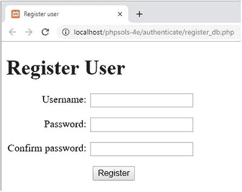

2.  在 `DOCTYPE` 声明上方的 PHP 代码块中添加以下代码：

    ```
    if (isset($_POST['register'])) {
        $username = trim($_POST['username']);
        $password = trim($_POST['pwd']);
        $retyped = trim($_POST['conf_pwd']);
        require_once '../includes/register_user_mysqli.php';
    }
    ```

    这与 PHP 解决方案 11-4 中的代码非常相似。如果表单已提交，用户输入将被去除首尾空白并分配给简单变量。然后包含一个名为 `register_user_mysqli.php` 的外部文件。如果你计划使用 PDO，请将包含文件命名为 `register_user_pdo.php`。

3.  处理用户输入的文件基于你在第 11 章中创建的 `register_user_csv.php`。复制原始文件并将其保存在 `includes` 文件夹中，命名为 `register_user_mysqli.php` 或 `register_user_pdo.php`。

4.  在你刚刚复制并重命名的文件中，找到以如下内容开头的条件语句（大约在第 23 行）：

    ```
    if (!$errors) {
        // 使用默认算法哈希密码
        $password = password_hash($password, PASSWORD_DEFAULT);
    ```

5.  删除条件语句中其余的代码。条件语句现在应如下所示：

    ```
    if (!$errors) {
        // 使用默认算法哈希密码
        $password = password_hash($password, PASSWORD_DEFAULT);
    }
    ```

6.  将用户详细信息插入数据库的代码位于条件语句内部。首先包含数据库连接文件并创建具有读写权限的连接。


```php
if (!$errors) {
    // 使用默认算法对密码进行哈希处理
    $password = password_hash($password, PASSWORD_DEFAULT);
    // 引入连接文件
    require_once 'connection.php';
    $conn = dbConnect('write');
}
```

连接文件同样位于 `includes` 文件夹内，因此你只需提供文件名即可。对于 PDO，需要在 `dbConnect()` 的第二个参数中传入 `'pdo'`。

7. 代码的最后一部分负责准备并执行预处理语句，以将用户详细信息插入数据库。由于 `username` 列设置了 `UNIQUE` 索引，如果用户名已存在，查询将会失败。一旦发生这种情况，代码需要生成一条错误信息。MySQLi 和 PDO 的代码实现有所不同。

对于 MySQLi，请添加以下加粗显示的代码：

```php
if (!$errors) {
    // 使用默认算法对密码进行哈希处理
    $password = password_hash($password, PASSWORD_DEFAULT);
    // 引入连接文件
    require_once 'connection.php';
    $conn = dbConnect('write');
    // 准备 SQL 语句
    $sql = 'INSERT INTO users (username, pwd) VALUES (?, ?)';
    $stmt = $conn->stmt_init();
    if ($stmt = $conn->prepare($sql)) {
        // 绑定参数并将详细信息插入数据库
        $stmt->bind_param('ss', $username, $password);
        $stmt->execute();
    }
    if ($stmt->affected_rows == 1) {
        $success = htmlentities($username) . ' 已注册成功。您现在可以登录了。';
    } elseif ($stmt->errno == 1062) {
        $errors[] = htmlentities($username) . ' 已被使用。请选择其他用户名。';
    } else {
        $errors[] = $stmt->error;
    }
}
```

新代码首先将参数绑定到预处理语句。用户名和密码都是字符串，因此 `bind_param()` 的第一个参数是 `'ss'`（参见第 13 章“在 MySQLi 预处理语句中嵌入变量”）。语句执行后，条件语句会检查 `affected_rows` 属性的值。如果值为 `1`，则表示详细信息已成功插入。

**提示：** 你必须显式检查 `affected_rows` 的值，因为如果发生错误，它的值是 -1。与某些编程语言不同，PHP 将 -1 视为 `true`。

另一种条件分支会检查预处理语句的 `errno` 属性值，该属性包含 MySQL 错误代码。对于带有 `UNIQUE` 索引的列，重复值的错误代码是 `1062`。如果检测到该错误代码，则会向 `$errors` 数组添加一条错误信息，要求用户选择其他用户名。如果生成了其他错误代码，则会将存储在语句 `error` 属性中的信息添加到 `$errors` 数组中。

PDO 版本如下所示：

```php
if (!$errors) {
    // 使用默认加密方式对密码进行加密
    $password = password_hash($password, PASSWORD_DEFAULT);
    // 引入连接文件
    require_once 'connection.php';
    $conn = dbConnect('write', 'pdo');
    // 准备 SQL 语句
    $sql = 'INSERT INTO users (username, pwd) VALUES (:username, :pwd)';
    $stmt = $conn->prepare($sql);
    // 绑定参数并将详细信息插入数据库
    $stmt->bindParam(':username', $username, PDO::PARAM_STR);
    $stmt->bindParam(':pwd', $password, PDO::PARAM_STR);
    $stmt->execute();
    if ($stmt->rowCount() == 1) {
        $success = htmlentities($username) . ' 已注册成功。您现在可以登录了。';
    } elseif ($stmt->errorCode() == 23000) {
        $errors[] = htmlentities($username) . ' 已被使用。请选择其他用户名。';
    } else {
        $errors[] = $stmt->errorInfo()[2];
    }
}
```

预处理语句对 `username` 和 `pwd` 列使用了命名参数。提交的值通过 `bindParam()` 方法进行绑定，并使用 `PDO::PARAM_STR` 常量将数据类型指定为字符串。语句执行后，条件语句使用 `rowCount()` 方法来检查记录是否已创建。

如果预处理语句因用户名已存在而失败，`errorCode()` 方法生成的值是 `23000`。PDO 使用的是 ANSI SQL 标准定义的错误代码，而非 MySQL 生成的错误代码。如果错误代码匹配，则会向 `$errors` 数组添加一条信息，要求用户选择其他用户名。否则，将使用 `errorInfo()` 方法返回的错误信息。

**注意：** 在 MySQLi 和 PDO 脚本中，当在实际网站上部署注册脚本时，请将 `else` 块中的代码替换为通用的错误信息。显示语句的 `error` 属性（MySQLi）或 `$stmt->errorInfo()[2]`（PDO）的值仅用于测试目的。

8. 剩下要做的就是添加在注册页面上显示结果的代码。请在 `register_db.php` 中开头的 `<form>` 标签之前添加以下代码：

```php
<?php
if (isset($success)) {
    echo "<p>$success</p>";
} elseif (isset($errors) && !empty($errors)) {
    echo '<ul>';
    foreach ($errors as $error) {
        echo "<li>$error</li>";
    }
    echo '</ul>';
}
?>
```

9. 保存 `register_db.php`，然后在浏览器中加载它。通过输入你知道会违反密码强度规则的输入来测试它。如果你在同一尝试中犯了多个错误，表单顶部应出现一个带项目符号的错误消息列表，如下一个屏幕截图所示。

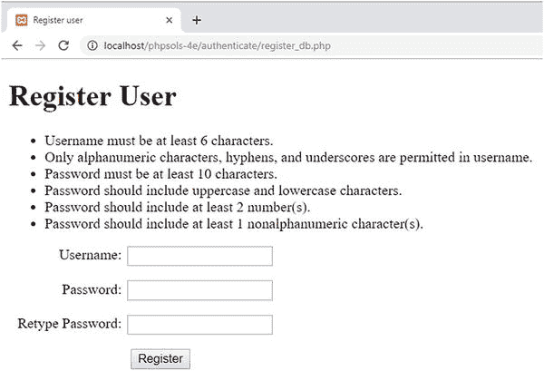

10. 现在正确填写注册表单。你应该会看到一条消息，提示你已为你选择的用户名创建了一个帐户。

11. 尝试再次注册相同的用户名。这次你应该会收到一条类似于以下屏幕截图所示的消息：

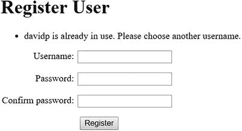

12. 如果需要，请对照 `register_db_mysqli.php` 和 `register_user_mysqli.php`，或对照 `register_db_pdo.php` 和 `register_user_pdo.php` 检查你的代码，所有这些文件都在 `ch19` 文件夹中。

现在你已在数据库中注册了用户名和密码，接下来需要创建一个登录脚本。`ch19` 文件夹包含一组文件，这些文件复制了 PHP 解决方案 11-5 到 11-7 的设置：一个登录页面和两个受密码保护的页面。

## PHP 解决方案 19-2：使用数据库验证用户凭证

此 PHP 解决方案演示了如何通过查询数据库来查找用户名的加密密码，然后将其与用户提交的密码一起作为参数传递给 `password_verify()`，从而验证用户存储的凭证。如果 `password_verify()` 返回 `true`，则将用户重定向到受限制的页面。

1. 将 `login_db.php`、`menu_db.php` 和 `secretpage_db.php` 从 `ch19` 文件夹复制到 `authenticate` 文件夹。同时将 `logout_db.php` 和 `session_timeout_db.php` 从 `ch19` 文件夹复制到 `includes` 文件夹。

这将设置与第 11 章中使用的基本测试平台相同。唯一的区别是链接已更改，以便重定向到 `authenticate` 文件夹。

2. 在 `login_db.php` 中，在 `DOCTYPE` 声明上方的一个 PHP 块中添加以下代码：


```php
$error = "";
if (isset($_POST['login'])) {
    session_start();
    $username = trim($_POST['username']);
    $password = trim($_POST['pwd']);
    // 成功登录后重定向的页面地址
    $redirect = 'http://localhost/phpsols-4e/authenticate/menu_db.php';
    require_once '../includes/authenticate_mysqli.php';
}
```

这段代码与第 11 章登录表单中的代码模式相似。首先将 `$error` 初始化为空字符串。条件语句会在表单提交时启动一个会话。用户输入字段中的空白字符被去除，成功登录后用户将被重定向到的页面地址存储在一个变量中。最后，引入了下一节将要构建的认证脚本。

如果你使用的是 PDO，请将 `authenticate_pdo.php` 作为处理脚本。

3. 创建一个名为 `authenticate_mysqli.php` 或 `authenticate_pdo.php` 的新文件，并将其保存在 `includes` 文件夹中。该文件仅包含 PHP 脚本，因此请去掉所有 HTML 标记。

4. 引入数据库连接文件，使用只读账户创建数据库连接，并使用预处理语句获取用户的详细信息。

对于 MySQLi，请使用以下代码：

```php
$stmt = $conn->stmt_init();
$stmt->prepare($sql);
// 绑定输入参数
$stmt->bind_param('s', $username);
$stmt->execute();
// 绑定结果，为密码使用一个新变量
$stmt->bind_result($storedPwd);
$stmt->fetch();
```

这是一个非常直接的 `SELECT` 查询，因此在将其传递给 MySQLi 的 `prepare()` 方法时，我没有使用条件语句。用户名是一个字符串，因此 `bind_param()` 的第一个参数是 `'s'`。如果找到匹配项，结果将被绑定到 `$storedPwd`。你需要为存储的密码使用一个新变量，以避免覆盖用户提交的密码。

语句执行后，`fetch()` 方法获取结果。

对于 PDO，请使用以下代码：

```php
$stmt = $conn->prepare($sql);
// 将输入参数作为单个元素的数组传递
$stmt->execute([$username]);
$storedPwd = $stmt->fetchColumn();
```

这段代码与 MySQLi 版本功能相同，但使用了 PDO 语法。用户名通过 `execute()` 方法作为单元素数组传递。由于结果中只有一列，`fetchColumn()` 会返回值并将其赋给 `$storedPwd`。

5. 获取用户名的密码后，你只需将提交的密码和存储的密码传递给 `password_verify()`。如果 `password_verify()` 返回 `true`，则创建会话变量以指示登录成功及会话开始时间，重新生成会话 ID，并重定向到受限页面。否则，将错误信息存储在 `$error` 中。

在上一步输入的代码之后插入以下代码。这对 MySQLi 和 PDO 是相同的。

```php
// 将提交的密码与存储的密码进行比对
if (password_verify($password, $storedPwd)) {
    $_SESSION['authenticated'] = 'Jethro Tull';
    // 获取会话开始的时间
    $_SESSION['start'] = time();
    session_regenerate_id();
    header("Location: $redirect");
    exit;
} else {
    // 如果验证失败，准备错误信息
    $error = '无效的用户名或密码';
}
```

如同第 11 章所述，`$_SESSION['authenticated']` 的值实际上并不重要。

6. 保存 `authenticate_mysqli.php` 或 `authenticate_pdo.php`，然后使用你在 PHP 解决方案 19-1 末尾注册的用户名和密码登录 `login_db.php` 进行测试。登录过程应与第 11 章完全相同。不同之处在于，所有详细信息都更安全地存储在数据库中。

必要时，你可以对照 `ch19` 文件夹中的 `login_mysqli.php` 和 `authenticate_mysqli.php`，或 `login_pdo.php` 和 `authenticate_pdo.php` 来检查你的代码。如果遇到问题，最常见的错误是在数据库中为哈希密码创建的列太窄。该列必须至少宽 60 个字符，建议使其能够存储多达 255 个字符，以防未来的加密方法生成更长的字符串。

尽管将哈希密码存储在数据库中比使用文本文件更安全，但密码是以纯文本（未加密）形式从用户的浏览器发送到服务器的。为了安全起见，登录和后续页面的访问应通过传输层安全（TLS）或安全套接字层（SSL）连接进行。

## 使用密钥加密

设置用户注册和认证用于密钥加密的主要区别在于，密码需要使用 `BLOB` 数据类型作为二进制对象存储在数据库中（更多信息请参见第 12 章的“存储二进制数据”），并且密码验证是在 SQL 查询中进行的，而不是在 PHP 脚本中。

### 创建存储用户详细信息的表

在 phpMyAdmin 中，在 `phpsols` 数据库中创建一个名为 `users_2way` 的新表。它需要三列，设置如表 19-2 所列。

**表 19-2.** `users_2way` 表的设置

| 名称       | 类型    | 长度/值 | 属性       | 空值      | 索引     | A_I       |
|------------|---------|---------|------------|-----------|-----------|-----------|
| `user_id`  | `INT`   |         | `UNSIGNED` | 未选中    | `PRIMARY` | 已选中    |
| `username` | `VARCHAR` | `15`   |            | 未选中    | `UNIQUE`  |           |
| `pwd`      | `BLOB`  |         |            | 未选中    |           |           |

### 注册新用户

`AES_ENCRYPT()` 函数接受两个参数：要加密的值和一个加密密钥。加密密钥可以是您选择的任何字符串。在本例中，我选择了 `takeThisWith@PinchOfSalt`，但使用随机的字母数字字符和符号序列会更安全。默认情况下，`AES_ENCRYPT()` 使用 128 位密钥对数据进行编码。要使用更安全的 256 位密钥长度，您需要在 MySQL 中将系统变量 `block_encryption_mode` 设置为 `aes-256-cbc`（更多详细信息，请参见 [`https://dev.mysql.com/doc/refman/8.0/en/encryption-functions.html#function_aes-decrypt`](https://dev.mysql.com/doc/refman/8.0/en/encryption-functions.html%2523function_aes-decrypt)）。用于单向密码哈希和密钥加密的基本注册脚本是相同的。唯一的区别在于将用户数据插入数据库的部分。

> **提示**  
> 以下脚本将加密密钥直接嵌入页面中。为了安全起见，您应该在包含文件中定义密钥，并将其存储在服务器文档根目录之外。

MySQLi 的代码如下所示（完整列表在 `ch19` 文件夹中的 `register_2way_mysqli.php`）：

```php
if (!$errors) {
    // 引入连接文件
    require_once 'connection.php';
    $conn = dbConnect('write');
    // 创建一个密钥
    $key = 'takeThisWith@PinchOfSalt';
    // 准备 SQL 语句
    $sql = 'INSERT INTO users_2way (username, pwd)
            VALUES (?, AES_ENCRYPT(?, ?))';
    $stmt = $conn->stmt_init();
    if ($stmt = $conn->prepare($sql)) {
        // 绑定参数并将详细信息插入数据库
        $stmt->bind_param('sss', $username, $password, $key);
        $stmt->execute();
    }
    if ($stmt->affected_rows == 1) {
        $success = htmlentities($username) . ' 已注册。您现在可以登录。';
    } elseif ($stmt->errno == 1062) {
        $errors[] = htmlentities($username) . ' 已被使用。请选择其他用户名。';
    } else {
        $errors[] = $stmt->error;
    }
}
```

对于 PDO，代码如下所示（完整列表请参见 `ch19` 文件夹中的 `register_2way_pdo.php`）：
```

好的，作为一名高级文档工程师和翻译员，我将严格遵循您提供的注意事项和示例，将以下英文文本翻译成专业、准确的中文。


```php
if (!$errors) {
// include the connection file
require_once 'connection.php';
$conn = dbConnect('write', 'pdo');
// create a key
$key = 'takeThisWith@PinchOfSalt';
// prepare SQL statement
$sql = 'INSERT INTO users_2way (username, pwd)
VALUES (:username, AES_ENCRYPT(:pwd, :key))';
$stmt = $conn->prepare($sql);
// bind parameters and insert the details into the database
$stmt->bindParam(':username', $username, PDO::PARAM_STR);
$stmt->bindParam(':pwd', $password, PDO::PARAM_STR);
$stmt->bindParam(':key', $key, PDO::PARAM_STR);
$stmt->execute();
if ($stmt->rowCount() == 1) {
$success = htmlentities($username) . ' has been registered. You may now log in.';
} elseif ($stmt->errorCode() == 23000) {
$errors[] = htmlentities($username) . ' is already in use. Please choose another username.';
} else {
$errors[] = 'Sorry, there was a problem with the database.';
}
}
```

严格来说，不需要为`$key`使用绑定参数，因为它并非来自用户输入。但是，如果直接将其嵌入查询中，整个查询需要用双引号括起来，并且`$key`需要用单引号括起来。

要测试前面的脚本，请将它们复制到 `includes` 文件夹中，并在 `register_db.php` 中引用它们，以替代 `register_db_mysqli.php` 或 `register_db_pdo.php`。

## 使用双向加密进行用户身份验证

使用双向加密创建登录页面非常简单。连接到数据库后，将用户名、密钥和未加密的密码合并到 `SELECT` 查询的 `WHERE` 子句中。如果查询找到匹配项，则允许用户访问网站的受限部分。如果没有匹配项，则拒绝登录。除了以下部分，代码与 PHP 方案 19-2 相同。

对于 MySQLi，代码如下所示（参见 `authenticate_2way_mysqli.php`）：

```php
$stmt = $conn->stmt_init();
$stmt->prepare($sql);
// bind the input parameters
$stmt->bind_param('sss', $username, $password, $key);
$stmt->execute();
// to get the number of matches, you must store the result
$stmt->store_result();
// if a match is found, num_rows is 1, which is treated as true
if ($stmt->num_rows) {
$_SESSION['authenticated'] = 'Jethro Tull';
// get the time the session started
$_SESSION['start'] = time();
session_regenerate_id();
header("Location: $redirect"); exit;
} else {
// if not verified, prepare error message
$error = 'Invalid username or password';
}
```

请注意，在访问 `num_rows` 属性之前，需要先存储预处理语句的结果。如果不这样做，`num_rows` 将始终为 `0`，即使用户名和密码正确，登录也会失败。

PDO 的修订代码如下所示（参见 `authenticate_2way_pdo.php`）：

```php
$stmt = $conn->prepare($sql);
// bind variables by passing them as an array when executing statement
$stmt->execute([$username, $password, $key]);
// if a match is found, rowCount() produces 1, which is treated as true
if ($stmt->rowCount()) {
$_SESSION['authenticated'] = 'Jethro Tull';
// get the time the session started
$_SESSION['start'] = time();
session_regenerate_id();
header("Location: $redirect"); exit;
} else {
// if not verified, prepare error message
$error = 'Invalid username or password';
}
```

要测试这些脚本，请将它们复制到 `includes` 文件夹中，并用它们替换 `authenticate_mysqli.php` 和 `authenticate_pdo.php`。

### 解密密码

解密使用双向加密的密码，只需在预处理语句中将密钥作为第二个参数传递给 `AES_DECRYPT()` 即可，如下所示：

```php
$key = 'takeThisWith@PinchOfSalt';
$sql = "SELECT AES_DECRYPT(pwd, '$key') AS pwd FROM users_2way
WHERE username = ?";
```

该密钥必须与最初用于加密密码的密钥完全相同。如果丢失密钥，密码将像使用单向哈希存储的密码一样无法访问。通常，唯一需要解密密码的情况是用户请求密码提醒时。为此类提醒制定适当的安全策略在很大程度上取决于您运营的网站类型。然而，不言而喻，您不应在屏幕上显示解密后的密码。您需要设置一系列安全检查，例如询问用户的出生日期或提出一个只有用户可能知道答案的问题。即使用户答对了，也应将密码通过电子邮件发送到用户的注册地址。如果您能成功读完本书至此，那么所有必要的知识应该已经尽在掌握。

### 更新用户详细信息

我没有为用户注册页面包含任何更新表单。这是一个您在这个阶段应该能够自行完成的任务。更新用户注册详细信息最重要的点是，您不应在更新表单中显示用户的现有密码。如果您使用的是密码哈希，无论如何也无法显示。

### 下一步做什么？

本书涵盖了大量的内容。如果您已经掌握了这里介绍的所有技术，那么您已经走在成为中级 PHP 开发人员的道路上，再稍加努力，就能进入高级水平。如果感觉有些吃力，请不要担心。重新阅读前面的章节。练习得越多，就会越容易。

您可能会想，“我到底怎样才能记住所有这些？”您不需要全部记住。查阅资料并不丢人。请收藏 PHP 在线手册 (`www.php.net/manual/en/`) 并经常使用它。它不断更新，并且包含许多有用的示例。在页面右上角的搜索框中输入函数名称，即可直接查看该函数的完整描述。即使您记不住准确的函数名，手册也会将您带到一个列出最可能候选项的页面。大多数页面都提供了实际示例，说明函数或类的使用方法。

使动态网页设计变得容易的，不是对 PHP 函数和类的百科全书式了解，而是对条件语句、循环和其他结构如何控制脚本流程的扎实掌握。一旦您能根据“如果发生这种情况，接下来应该发生什么？”来想象您的项目，您就成为自己游戏的主宰者。我经常查阅 PHP 在线手册。对我来说，它就像一本字典。大多数时候，我只是想检查参数顺序是否正确，但我经常发现某些东西会吸引我的眼球，并打开新的视野。我也许不会立即使用这些知识，但会将其存储在我的脑海深处以备将来使用，并在需要检查细节时再回去查阅。

MySQL 在线手册 (`https://dev.mysql.com/doc/refman/8.0/en/`) 同样有用。MariaDB 的文档在 `https://mariadb.com/kb/en/library/documentation/`。将 PHP 和数据库在线手册都当作您的朋友，您的知识将会突飞猛进。

## 索引

## A

- `action` 属性
- `AES_DECRYPT()` 函数
- `AES_ENCRYPT()` 函数
- Apache Web 服务器
- `array_diff_assoc()`
- `array_diff_key()`
- 数组元素
- `array_filter()` 函数
- `array_merge()` 函数
- `array_merge_recursive()`
- `array_multisort()` 函数
- 数组
  - 将元素赋值给变量
  - CSV 文件
  - `extract()`
  - `list()`
  - 构建嵌套列表
  - `csv_processor()`
  - JSON
  - 合并
    - `array_diff_assoc()`
    - `array_diff_key()`
    - `array_merge()`
    - `array_merge_recursive()`
    - `array_pop()`
    - 比较
    - `implode()`
    - `strcasecmp()`
    - 使用联合运算符
  - 修改元素
    - `array_walk()`, 182–184
    - 使用循环
  - 排序函数
  - 排序
    - `array_multisort()`
    - 排列
    - 宇宙飞船运算符
    - Splat 运算符
  - `array_slice()` 函数
- 数组排序函数


