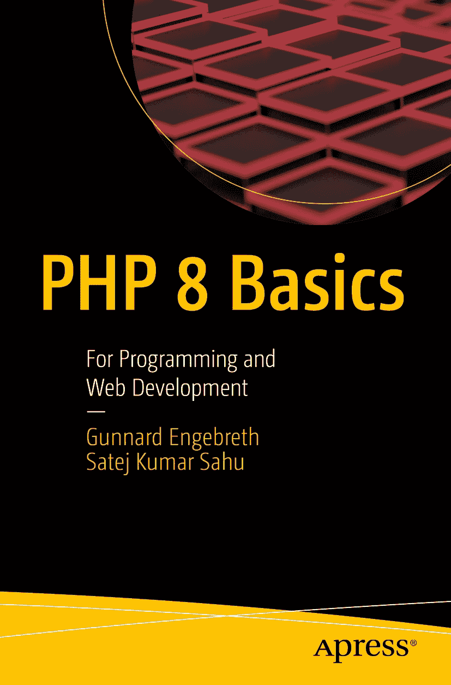

ISBN 978-1-4842-8081-2 e-ISBN 978-1-4842-8082-9 [`doi.org/10.1007/978-1-4842-8082-9`](https://doi.org/10.1007/978-1-4842-8082-9) © Gunnard Engebreth, Satej Kumar Sahu 2023 本作品受版权保护。所有权利，无论是整体还是部分材料，均专有且独家授权给出版商，具体包括翻译、重印、复用插图、朗诵、广播、以微缩胶片或其他任何物理方式复制，以及电子改编、计算机软件等信息存储和检索、传输，或利用目前已知或未来开发的类似或不同方法。在本出版物中使用通用描述性名称、注册商标名称、商标、服务标志等，即便没有明确声明，也不意味着这些名称不受相关保护性法律法规的约束，因此可供公众自由使用。出版商、作者和编辑可合理假定，本书中的建议和信息在出版之日是真实准确的。出版商、作者或编辑均不对本书所含材料或可能存在的任何错误或遗漏提供明示或暗示的担保。出版商对出版地图中的管辖权主张及机构所属关系保持中立。

本 Apress 印记由注册公司 APress Media, LLC（Springer Nature 旗下）出版。注册公司地址为：1 New York Plaza, New York, NY 10004, U.S.A.

*谨以此书献给我的妻子 Erica、我的孩子们 Trip 和 Wyatt，以及你——亲爱的读者。谢谢！*

*耶稣看着他们说：“在人这是不能的，在神凡事都能。”* ——马太福音 19:26