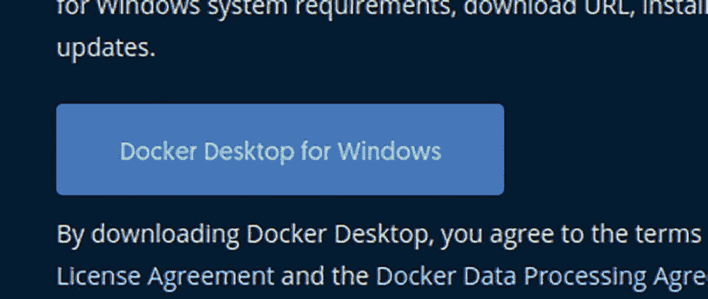
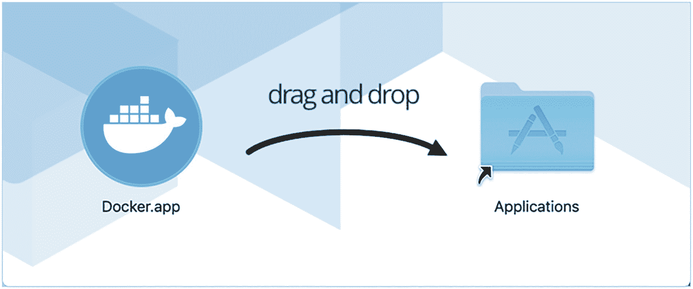
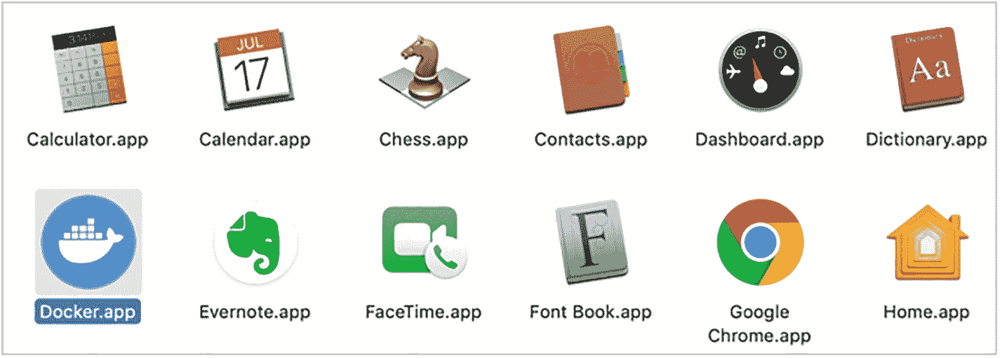
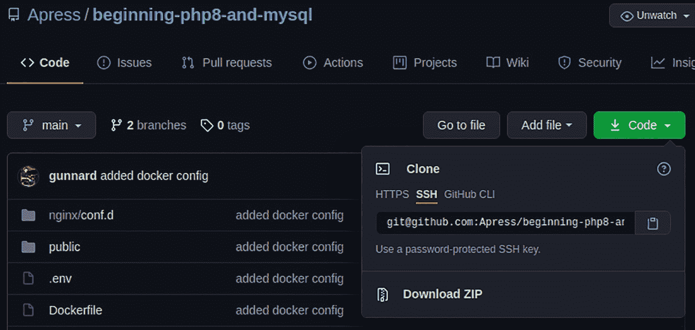
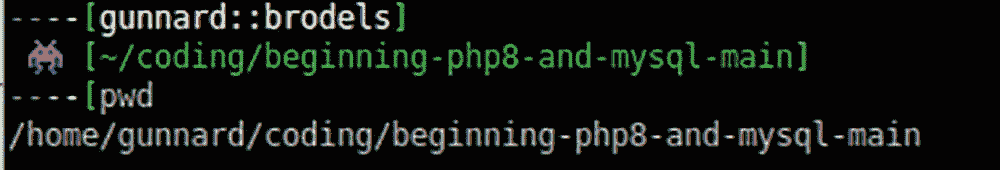
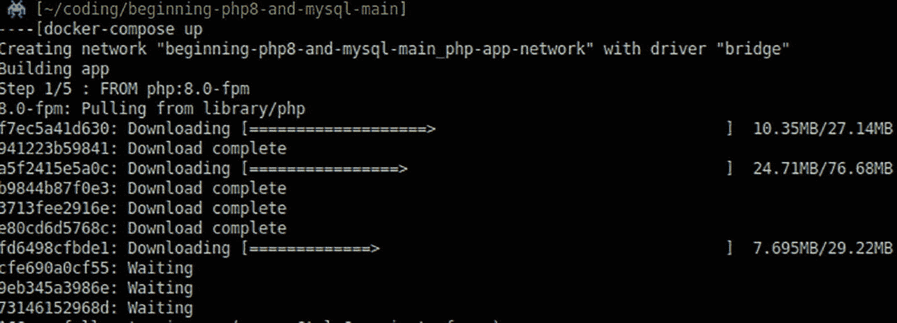

# 1. 入门指南

PHP 是事实上的编程语言，每月为数十亿（是“十亿”而非“百万”）次访问提供服务。PHP 从一个功能杂乱、可用于拼凑出功能性网站的脚本集合，成长为多家市值数十亿美元公司的技术支柱，影响着全球行业的运作方式。是的，还有其他语言能做很多事情，但你读这本书不是为了了解它们！你选择踏入 PHP 的世界，加入这个专注于解决方案、社区建设和 PHP 技术进步的开发者网络。本书这一章将涵盖为什么要、何时以及如何使用 PHP 编程语言。它还将介绍一些编程开发环境，并描述如何安装`Docker`——一个用于开发、交付和运行应用程序的开放平台。

## 为什么要使用 PHP？

**事实：** PHP 驱动着整个网络。这听起来有些夸张，但请看以下数据：

- **Facebook：** 每月预计访问量 257 亿次
- **维基百科：** 每月预计访问量 150 亿次
- **雅虎：** 每月预计访问量 48 亿次
- **Flickr：** 每月预计访问量 6544 万次
- **Tumblr：** 每月预计访问量 3.289 亿次

上述任何一个网站的访问数据都令人印象深刻，而当它们加在一起时，就构成了相当庞大的统计数据。即使你对其他编程语言情有独钟，也无法否认 PHP 在这些网站中扮演着举足轻重的角色。虽然我们可以看到大型企业已经信任这门语言，但像你和我这样的普通用户又如何呢？互联网上超过 39.5% 的网站都运行在 WordPress 上。请仔细想想这一点。几乎 40% 的网站都运行在一个用 PHP 开发（并且是开源的）的内容管理系统上。

PHP 的需求量每年都在激增。在任何求职网站上快速搜索一下，你都会得到成千上万的结果。

PHP 正在持续发展，拥有定期的版本发布和充满活力的开发者社区以保持其技术相关性。

PHP 是当今你能开始学习的最激动人心、同时也是最实用的编程语言。

诚然，我们可能带有一些偏见。

## 使用 PHP

开发者主要用两种方式使用 PHP。一种是从数据源（例如 MySQL 数据库）组织和传递数据到网页。想想 Facebook 或 Twitter。你在这些网站上看到的内容存储在数据库的某处，需要被检索出来，然后进行解析或组织，最终呈现给用户前端界面。你表妹那张获得 40 个赞的宝宝照片，需要被收集起来，点赞数需要被统计并关联到具体的人，然后它们才会出现在你的时间线上。根据基础设施的不同，这些数据可以存储在一个或多个位置，通过唯一标识符关联起来。我们可能说得有点超前了，但我们想传达的是，你在网页上看到的信息是由 PHP 从存储在数据库中的信息加工而来的。PHP 就是你用来构建这些强大应用程序的工具箱。

我们提到了两种主要的使用 PHP 的方式。另一种方式是在命令行中使用。服务器上通常有几种脚本语言可用于执行各种任务。我们能想到的有 Bash、Python 和 Perl，但 PHP 也能以同样的方式使用。如果还没试过，请前往本书`apress.com`产品页面链接的 GitHub 仓库，查看第 1 章的链接。从这里开始，你将搭建开发环境，以便查看并运行这些 PHP 脚本。

让我们启动开发环境，这样你就能看到 PHP 的实际运行了。

PHP 是一种服务器端脚本语言，因此需要一个具备相应设置和资源的服务器才能运行。虽然许多操作系统都原生安装了 PHP，但也可以单独安装或升级。其他服务器端语言的例子有 Python、Ruby 和 Perl。与此相对的是客户端语言，它们在浏览器中处理，基于 JavaScript。客户端语言的例子有 Vue.js、jQuery 和 Node.js。

## 为什么要用 PHP、Nginx 和 MySQL？

让我们来认识一下你的新好朋友，至少在你每天与它们打交道的过程中。作为一名开发者，你需要深入熟悉每一位新朋友。PHP（正如我们讨论过的）是我们编写脚本所使用的语言。Nginx 是 Web 服务器，它使得当用户访问服务器上的特定 URL 时能够提供网页服务。例如，当你访问`gunnard.org`时，托管网站的 Web 服务器会查看 URL（`www.gunnard.org`），并检查该网站是否有任何相关的 www 设置（在 Nginx 中）。如果有，这个软件（Nginx）会查找文档根目录设置，并将用户导向该位置。到达那里后，除非另有指定，服务器首先会查找`index.xhtml`或`index.php`页面。`index.xhtml/php`模式在业界相当标准，作为一种安全措施，可以防止目录被全网浏览。例如，如果你有一个包含私密信息且可公开访问的`assets/`目录，比如`gunnard.org/assets`，但里面没有`index.xhtml`文件，那么任何人都可以看到这个目录，并能看到该目录下的文件列表。如果在该位置放置一个空白的`index.xhtml`文件，则会显示该文件。在 Nginx 中，你可以设置 Nginx 查找这些默认文件的优先级和顺序。例如，在使用 PHP 时，必须指定 Nginx 优先查找`index.php`而不是`index.xhtml`。

为了使用你的开发环境，你需要一个叫做 Docker 的工具。Docker 能让你的电脑（宿主机）模拟成一台 Web 服务器，而无需创建一个独立于宿主环境的虚拟机。这听起来可能正是你想做的事情，事实也确实如此，但 Docker 以一种略微不同的方式实现，它比典型的虚拟机更健壮、更易管理、侵入性更小。可以将 Docker 想象成一个允许容器装扮成特定类型计算机或服务器的软件。这个容器独立于你的宿主机系统，但同时使用宿主机的资源（目录、CPU、内存），而无需实际更改或创建一台新机器。关于 Docker 与虚拟机内部工作机制的深入探讨超出了本书的范围，坦白说，可能需要一整本书才能比我们刚才说的更清楚。总而言之，使用 Docker，我们可以控制并使用 Web 服务器的有益部分，而无需创建、安装和维护一台真正的或虚拟的服务器。另外，截至目前，99% 的开发团队都在使用它；这非常符合行业标准。

## 安装 Docker

让我们在你的操作系统中安装 Docker。以下是具体方法。

### Windows

前往[`docs.docker.com/docker-for-windows/install/`](https://docs.docker.com/docker-for-windows/install/)，点击“Docker Desktop for Windows”按钮下载 Docker，如图 1-1 所示。



**图 1-1** Docker Desktop for Windows 下载按钮

1.  双击`Docker Desktop Installer.exe`运行安装程序。
2.  当系统提示时，确保**启用 Hyper-V Windows 功能**。如果你之前配置过 WSL 并且熟悉它，那么在配置页面上确保选中“安装 WSL 2 所需的 Windows 组件”选项。
3.  按照安装向导的说明授权安装程序并继续安装。
4.  安装成功后，点击**关闭**完成安装过程。
5.  如果你的管理员账户不同于用户账户，则必须将该用户添加到`docker-users`组。以管理员身份运行**计算机管理**，然后导航到**本地用户和组** ➤ **组** ➤ `docker-users`。右键点击将该用户添加到组中。注销并重新登录以使更改生效。

安装完成后，Docker Desktop 不会自动启动。要启动 Docker Desktop，请搜索**Docker**，并在搜索结果中选择**Docker Desktop**。当状态栏中的鲸鱼图标稳定下来时，Docker Desktop 就已启动、运行，并且可以从任何终端窗口访问了。

### Mac OS

访问[`https://docs.docker.com/docker-for-mac/install/`](https://docs.docker.com/docker-for-mac/install/)，如图 1-2 所示。


图 1-2 Mac 版 Docker 的下载选项

双击`Docker.dmg`打开安装程序，然后将 Docker 图标拖拽到`Applications`文件夹，如图 1-3 所示。



图 1-3 将 Docker 应用程序移动到 Applications 文件夹

双击`Applications`文件夹中的`Docker.app`启动 Docker。（在图 1-4 中，`Applications`文件夹处于网格视图模式。）



图 1-4 Docker Applications 文件夹

顶部状态栏中的 Docker 菜单表示 Docker Desktop 正在运行，并且可以通过终端访问。

### Linux

访问 [`https://docs.docker.com/engine/install/`](https://docs.docker.com/engine/install/)。在这里，您可以找到如何在几种流行的 Linux 发行版上安装 Docker 的说明链接。如果您使用的是 Debian/Ubuntu，可以按照以下说明操作（[`https://docs.docker.com/engine/install/ubuntu/`](https://docs.docker.com/engine/install/ubuntu/)）：

1.  确保系统中已移除所有旧版本安装。

2.  更新 `apt` 软件包索引并安装相关软件包，以便 `apt` 能够通过 HTTPS 使用仓库。

```
sudo apt-get remove docker docker-engine docker.io containerd runc
```

3.  添加 Docker 的官方 GPG 密钥。

```
sudo apt-get update
sudo apt-get install \
    apt-transport-https \
    ca-certificates \
    curl \
    gnupg \
    lsb-release
```

4.  使用以下命令设置稳定版仓库。若要添加每日构建版或测试版仓库，请在 `stable` 后面添加 `nightly` 或 `test`（或两者都加）。

```
curl -fsSL https://download.docker.com/linux/ubuntu/gpg | sudo gpg --dearmor -o /usr/share/keyrings/docker-archive-keyring.gpg
```

5.  更新 `apt` 软件包索引，并安装最新版本的 Docker Engine 和容器。

```
echo \
  "deb [arch=amd64 signed-by=/usr/share/keyrings/docker-archive-keyring.gpg] https://download.docker.com/linux/ubuntu \
  $(lsb_release -cs) stable" | sudo tee /etc/apt/sources.list.d/docker.list > /dev/null
```

```
sudo apt-get update
sudo apt-get install docker-ce docker-ce-cli containerd.io
```

如果您遇到任何困难，或者需要为您的系统安装特定版本的 Docker，请访问 [`https://docs.docker.com/engine/install/`](https://docs.docker.com/engine/install/)，那里涵盖了比本节范围更多的选项和配置。

Docker 安装完成后，您还需要安装 `docker-compose`。Compose 是一个用于定义和运行多容器 Docker 应用程序的工具。Compose 允许您在 YAML（Yet Another Markup Language）文件内定义应用程序。这使您能够通过单个命令启动 Docker 容器中所有定义的服务。这通常在开发团队中使用，以确保版本控制并维护第三方应用程序的使用。Compose 的其他功能包括：

- 在单个主机上拥有多个隔离环境

- 在创建容器时保留卷数据

- 仅重新创建已更改的容器

- 变量以及在不同环境间迁移组合配置

有关这些功能的更多信息，请访问 [`https://docs.docker.com/compose/#features`](https://docs.docker.com/compose/#features)。

## 安装 Docker-Compose

已安装 Docker Desktop 的 Mac 和 Windows 用户可以跳过安装步骤，因为 Compose 已包含在安装包中。

1.  对于 Linux 用户，运行以下命令下载 Docker Compose 的当前稳定版本：

```
sudo curl -L "https://github.com/docker/compose/releases/download/1.29.1/docker-compose-$(uname -s)-$(uname -m)" -o /usr/local/bin/docker-compose
```

2.  为二进制文件赋予可执行权限。

```
sudo chmod +x /usr/local/bin/docker-compose
```

**注意：** 如果安装后 `docker-compose` 命令失败，请检查您的路径。您也可以创建一个指向 `/usr/bin` 或路径中任何其他目录的符号链接。

例如：

```
sudo ln -s /usr/local/bin/docker-compose /usr/bin/docker-compose
```

（可选）安装 `bash` 和 `zsh` shell 的命令补全功能。

测试安装。

```
$ docker-compose --version
```

### 开发环境

现在您已安装好 Docker 并准备就绪，您需要项目的 YAML 文件来设置开发环境。访问 [`https://github.com/apress/php8-basics`](https://github.com/apress/php8-basics) 并点击 Download ZIP 按钮，如图 1-5 所示。



图 1-5

用于您项目的 YAML 文件

下载 ZIP 文件后，将其解压到您选择的目录中。我们使用了 `~/（我的用户主目录）~/coding`。解压后，您的目录结构应类似于图 1-6。



图 1-6

解压后的项目文件夹

此目录中包含 Docker 启动开发环境所需的所有信息。

继续运行：

```
docker-compose up
```

然后观察 Docker 启动（图 1-7）。



图 1-7

运行 `docker-compose` 命令

接下来，将浏览器指向：

```
http://localhost:8000
```

您应该会看到本书的目录页以及数据库已成功连接的验证信息。转到命令提示符并输入：

```
docker ps
```

此命令会显示 Docker 已使用或正在使用的所有容器。在这里您可以看到 `mysql`、`nginx` 和开头的 `php` 容器。最后需要验证的是您是否可以在 PHP 容器内运行 PHP。在命令行中，输入：

```
docker exe -ti php-app bash
```

这将像使用 `ssh` 一样为您连接到容器。进入后，进入 `Chapter1` 目录。

```
cd Chapter1
```

输入：

```
php first_script.php
```

您应该会看到以下输出：

```
Output here
```

## 本章小结

在本章中，您大致了解了在开发领域使用 PHP 编程语言的原因、内容和方式。我们介绍了为什么要使用 PHP、Nginx 和 MySQL 及其优势。作为后续步骤，您学习了如何安装 Docker 工具，这是一个用于开发、交付和运行应用程序的开放平台。最后，您了解了为什么需要项目的 YAML 文件来设置您的开发环境。

在下一章中，我们将解释编程语言如何使用变量来存储和操作数据，并在 PHP 中构建有用的工具。