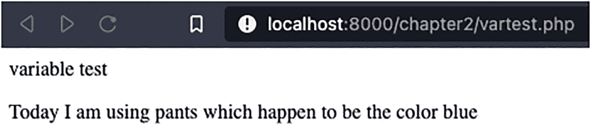
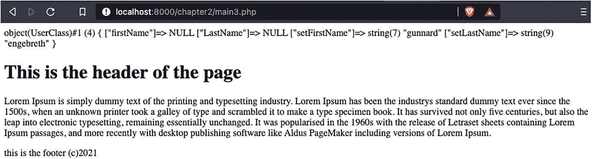
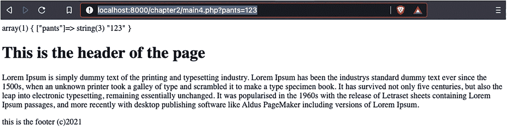
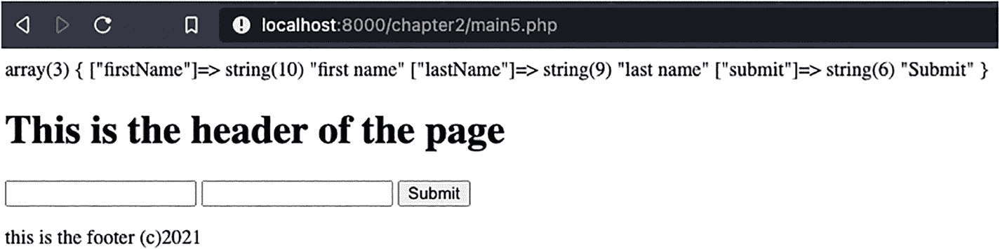

# 2. PHP 基础

为了在 PHP 中构建有用的工具，您需要知道如何操作数据。编程语言使用变量来存储和操作数据。

在本章中，您将学习编程语言如何使用变量来存储和操作数据，并在 PHP 中构建有用的工具。

此外，您还将探讨以下主题：

- 将错误用作工具

- 对象

- 动词：`GET` 和 `POST`

## 变量

PHP 对变量有一些规则：

- 变量必须以 `$` 符号开头，后跟变量名。

- 变量名必须以字母或下划线开头。

- 变量名不能以数字开头。

- 变量名只能包含字母数字字符和下划线（A-z、0-9 和 _）。

- 变量名区分大小写（`$pants` 和 `$PANTS` 是两个不同的变量）。

与其他编程语言不同，PHP 没有用于声明变量的特定命令。你必须注意变量的声明位置和方式，以及如何使用它们。

让我们编写一些代码，看看浏览器如何处理它们。进入你的 `beginning-php8-and-mysql` 目录，在 `chapter 2` 文件夹下，创建一个名为 `newtest.php` 的文件。在这个文件中，写入：

```
this is normal text
This is created by php';
?>
this is normal text again
```

上面的代码展示了三行。第一行是普通的 HTML，第二行运行 PHP 代码并生成 HTML，第三行是更多的 HTML，但位于 PHP 代码片段之后/之外。你可以在一个 `.php` 文件中随意在 PHP 和 HTML 之间来回切换多次。这样做可能会变得混乱，因此你应该将其限制在非常清晰和精确的代码元素中。现在创建一个名为 `vartest.php` 的文件并打开它。将以下代码输入到文件中并保存：

```
variable test";
$color = "blue";
$item = "pants";
echo "Today I am using $item which happen to be the color $color";
```

导航到 `localhost:8000/chapter2/vartest.php` 并查看结果（图 2-1）。



图 2-1

URL 结果网页

好的，我们来总结一下你在做什么。首先，你用 `<?php` 声明了 PHP 脚本。

接下来的一行，你使用了 `echo`。这是一个 PHP 命令，是向浏览器显示 PHP 文本最基本的方式之一。它只做一件事：将输出发送到浏览器或命令提示符。注意，在 `echo` 之后，你使用了双引号（`"`）作为分隔符，来分隔这一段文本，并开始你想要输出到屏幕的文本行。当你处理完文本后，用另一个双引号结束它。双引号是标记你想要使用的文本行开始和结束的分隔符。作为人类，我们可以很容易地识别出写在纸上或屏幕上的文本或句子。计算机需要特殊的标记，在这里就是分隔符，来确定文本的边界。这对于 `echo` 命令或设置变量（如下一行）都是如此。`$color` 是你想要使用的变量名，`"blue"` 是你为其设置的值。在这个特定例子中，`$color` 是一个字符串类型的变量。字符串是任何你希望使用的、不会用于计算（例如数学值）的文本。一旦你在 `$color` 中设置了 `"blue"` 这个值，你就可以使用 `echo` 在页面上显示它。当你将变量 `$item` 的值设置为 `"pants"` 时，也做了同样的事情。你还会注意到，每一行代码都以分号（`;`）结尾。在 PHP 中，这就是你告诉解释器停止读取该行并继续执行的方式。任何时候你遗漏了结尾的分号，都会收到一个错误。

说到错误，让我们继续前进，并习惯于将错误视为对我们有用的工具，而不是烦扰。

## 将错误用作工具

在 PHP 中，你并不总是能看到发生的错误。这是因为有三种不同的级别，以及关于如何以及在何处显示它们的配置。让我们回到 `vartest.php` 中，在文件顶部添加以下几行：

```
variable test";
$color = "blue";
$item = "pants";
echo "Today I am using $item which happen to be the color $color";
```

在运行之前，让我们解释一下你在做什么。

`error_reporting( E_ALL );` 是告诉 PHP 显示*所有*错误。以下是 `error_reporting` 的完整选项列表：

```
<?php
// 关闭所有错误报告
error_reporting(0);
// 报告简单的运行错误
error_reporting(E_ERROR | E_WARNING | E_PARSE);
// 报告 E_NOTICE 也可能是有用的（用于报告未初始化的
// 变量或捕捉变量名拼写错误...）
error_reporting(E_ERROR | E_WARNING | E_PARSE | E_NOTICE);
// 报告除 E_NOTICE 之外的所有错误
error_reporting(E_ALL & ~E_NOTICE);
// 报告所有 PHP 错误
error_reporting(E_ALL);
// 报告所有 PHP 错误
error_reporting(-1);
// 等同于 error_reporting(E_ALL);
ini_set('error_reporting', E_ALL);
```

接下来的一行是 `ini_set()`，它在 PHP 中用于覆盖在 `php.ini` 文件中设置的配置选项。当你需要进行一次性配置，或者你所在的服务器上无法访问 `ini` 文件时，这非常有用。再下一行是错误行。你看到了吗？继续，在浏览器中打开该文件，看看它显示什么。

```
Parse error: syntax error, unexpected token ">" in /var/www/chapter2/vartest.php on line 8
```

利用这个错误，你可以开始追踪 bug。这个错误是说第 8 行出现了一个意外的 `>`。看看你代码的第 8 行：

```
echo "variable test";
```

这一行在我看来完全没问题。PHP 告诉我们的是，你在第 8 行*之前*的那一行做了一些事情（在这个例子中设置了一个文本分隔符），导致本应完全正常的第 8 行的 `>` 变得意外了。你需要查看第 6 行，你会发现你的文本末尾缺少了结束分隔符 `"`。继续，在行末添加 `"` 并刷新页面，现在页面应该能正常渲染，没有错误了。

既然你可以创建和赋值变量、将文本渲染到屏幕上，以及触发/理解出现的错误，让我们开始构建一些页面吧。这正是你拿起这本书的原因，对吧？回到你的 `Chapter2` 目录，打开文件 `main.php`。

```
$title

$content

";
echo $html;
```

这些是包含 PHP 的 HTML5 网页所需的基本元素。你像之前一样在顶部声明了要打开错误报告。接下来的两行设置了两个变量，一个用于标题，一个用于内容。文件的其余部分将变量 `$html` 设置为你想要在页面上显示的全部 HTML 内容。在这段代码中，你将 `$title` 和 `$content` 变量放置在你希望在页面上显示它们的位置。继续，在你的浏览器中打开这个页面，看看它是什么样的。如果你有许多页面遵循相同的 HTML 呈现样式，这可能会变得有些重复。因此，你将使用这个页面作为一个模板，你可以调用它，只需替换你想要显示的值。在你的编辑器中打开 `main2.php`。

这里你引入了 `include_once` 函数。通过调用 `include_once`，你告诉 PHP 你想要将一个特定的文件加载到这个区域。通过将设计部分（HTML）与 PHP 分离，你可以更好地查看你的代码，并在其他 PHP 文件中重用 HTML 元素。基于这个例子，让我们更进一步，在你的模板中包含多个 PHP 文件。在 `main2.php` 中，将 `template.php` 改为 `template2.php` 并刷新页面。

在你的情况中，你首先引入了位于 `inc/` 目录下的 `header.php`。当你采用这种方法在 HTML 代码中嵌入 PHP 片段时，实际上就是在创建一种模板。这个模板（`main.php`）如果被其他文件使用，依然会包含页头、内容和页脚。让我们复制 `main.php` 文件并将其重命名为 `second.php`，从而创建一个名为 `second.php` 的新文件。

既然你已经理解了如何将模板分离并加以利用，现在我们来看看变量。到目前为止，你一直在为简单的内容、颜色和项目名称使用变量。如果你想存储某人的姓名和地址呢？像下面这样做是完全正确的：

```
$firstName = "gunnard";
$lastName = "engebreth";
```

这种写法在程序内部函数之间传递这些信息时也完全可行，直到你开始需要将这些信息在程序内部函数之间传递。基本上，想象一下递给朋友一把彩虹糖和递给一整袋彩虹糖的区别。朋友最终都得到了糖果，但其中一种方式更清爽、更优化，并且所有糖果都能保证到达朋友手中。这就引出了对象的概念。

### 对象

在 PHP 中，对象是由类定义的一组特定数据。在上面的代码示例中，你会说这些信息属于一个名为 `User` 的类。你应该这样定义这个类：

```php
class User {
    public $firstName;
    public $lastName;

    function setFirstName($firstName) {
        $this->firstName = $firstName;
    }
    function getFirstName() {
        echo $this->firstName;
    }
    function setLastName($lastName) {
        $this->lastName = $lastName;
    }
    function getLastName() {
        echo $this->lastName;
    }
}
```

要创建一个新用户，你可以调用：

```php
$user = new UserClass();
$user->setFirstName('gunnard');
$user->setLastName('engebreth');
var_dump($user);
```

让我们分析一下这段代码。

`$user = new UserClass();` 的作用正如其字面含义：现在变量 `$user` 将拥有你在 `UserClass` 类中定义的配置和格式。这也说明了在 PHP 中正确命名的重要性。看到这一行代码，你就能大概率确定变量 `$user` 极有可能与 `$UserClass` 关联，而很少会与名为 `$DumpTruckClass` 的类关联。

接下来的两行调用了你在 `UserClass` 中创建的一个方法（函数）。这些特定类型的方法，即 `Get____` 和 `Set___`，被称为辅助方法，通常也称为类的“getter”和“setter”。这些方法简化了在对象中设置值的操作。

最后一行是一个 PHP 特定的函数，常用于调试代码。`var_dump()` 可以精确显示变量中的内容及其类型。在你的示例中，调用 `var_dump` 显示了对象中的所有信息。`$user` 就是那袋彩虹糖，而 `$user->firstName` 则是其中的一颗糖果。

现在，如何将它们整合在一起使用呢？你需要在一个文件中定义类信息，然后在另一个文件中引入它。幸运的是，你已经知道如何操作。让我们打开 `main3.php`。

```php
<?php
require_once 'inc/UserClass.php';

$user = new UserClass();
$user->setFirstName = 'gunnard';
$user->setLastName = 'engebreth';
var_dump($user);
error_reporting(E_ALL);
ini_set("display_errors", 1);
$html = include_once "inc/template2.php";
?>
```

你已经了解了前两行的作用，即设置变量 `$user` 并将其作为 `UserClass` 类的一部分。接下来的两行设置了姓和名。如果你在命令行或浏览器中运行这个脚本，可以通过 `var_dump()` 函数进行验证。图 2-2 显示了你应该看到的结果。



**图 2-2** 代码结果的网页

这是开发中的一个基础阶段。你已经创建了一个对象，为其赋值，并能在页面上显示信息。现在你需要通过表单添加用户交互，使其变得动态化。

表单不仅仅用于在 Facebook 上评论他人的照片。表单是用户与程序交互的方法。用户可以直接与代码以及你创建的数据库进行通信。由于这种访问权限，必须花大量精力对输入进行验证和清理，我们后续会讨论这一点。现在，先熟悉如何获取和使用输入。让我们从技术层面探讨如何接收来自用户的数据。

HTTP（超文本传输协议）是连接你所知的 Web 的协议。这一达成共识的通信协议或方法，允许服务器、PHP 和用户之间相互通信。HTTP 中有许多规范，涵盖错误处理、预期的标准文档格式以及请求方法等方面。这些方法通过五个动词定义：

*   [`GET`](https://developer.mozilla.org/en-US/docs/Web/HTTP/Methods/GET)：`GET` 方法请求指定资源的表示。使用 `GET` 的请求应仅用于检索数据。

*   [`POST`](https://developer.mozilla.org/en-US/docs/Web/HTTP/Methods/POST)：`POST` 方法用于向指定资源提交实体，通常会导致服务器状态变更或产生副作用。

*   [`PUT`](https://developer.mozilla.org/en-US/docs/Web/HTTP/Methods/PUT)：`PUT` 方法用请求负载替换目标资源的所有当前表示。

*   [`DELETE`](https://developer.mozilla.org/en-US/docs/Web/HTTP/Methods/DELETE)：`DELETE` 方法删除指定的资源。

*   [`PATCH`](https://developer.mozilla.org/en-US/docs/Web/HTTP/Methods/PATCH)：`PATCH` 方法用于对资源进行部分修改。

你将重点关注 `GET` 和 `POST`，但请放心，在构建 REST API 时，你也会用到其他动词。

将浏览器指向 `http://localhost:8000/chapter2/main4.php?pants=123`。请注意，在 URL 中，你看到了 `main4.php?pants=123`。页面加载后，应如图 2-3 所示。



图 2-3

顶部是 `var_dump()`，你可以看到 URL 中的信息现在在 PHP 中作为变量 `$userVars` 可用。这是通过 HTTP 动词 `GET` 实现的，在 PHP 中你使用全局变量 `$_GET`。`GET` 特别允许通过 URL 传输数据。你也可以发送多个值。将 URL 修改为包含：

```
http://localhost:8000/chapter2/main4.php?pants=123&dog=poodle&food=spaghetti
```

刷新页面，你将看到 `Pants`、`Dog` 和 `Food` 都有了对应的值。另一种从用户向代码传输数据的方法是使用 `POST`。

`POST` 动词的行为方式几乎相同，但不使用 URL，从而使你传输的数据更安全。要查看 `POST` 功能，请打开 `main5.php` 并查看其内容。

```
$user->setFirstName = 'gunnard';
$user->setLastName = 'engebreth';
var_dump($userVars);
error_reporting( E_ALL );
ini_set( "display_errors",1);
$html = include_once "inc/template3.php";
```

这段代码的主要变化是你使用了 PHP 全局变量 `$_POST` 而非 `$_GET`，并且引入了 `template3.php`。让我们看看 `template3.php` 文件。

```
$content = include('contentPost.php');
```

`Template3` 引入了一个名为 `contentPost.php` 的特定内容片段。

```
<form action="<?php echo htmlspecialchars($_SERVER['PHP_SELF']); ?>" method="post">
```

在这里你可以看到允许你使用 `$_POST` 的差异。你定义了一个表单，并将其 `action` 设置为文件 (`main5.php`) 本身。你看到的这段代码通过动态定位包含表单的文件名并将其填入，使得表单可以在多个地方使用。`$_SERVER['PHP_SELF']` 是当前调用此脚本的文件，`htmlspecialchars` 是一个用于移除 HTML 的 PHP 函数，因为 HTML 可能被用于恶意目的。下面的两行声明了用于收集用户输入的 `firstname` 和 `lastname` 输入框。最后，你有一个提交按钮，触发表单供你的代码使用。请填写表单，然后查看结果页面（图 2-4）。



图 2-4

在 `var_dump` 中，你可以看到 `first name` 和 `last name` 的变量已经成功传递，并且如果你查看 URL，你会发现它是干净的，没有列出任何变量。在你的示例中，你使用了 `GET` 和 `POST` 来向你的 PHP 提交数据。从技术上讲，你也可以使用 `GET` 来提交此表单，但你确实不应该这样做。`GET` 和 `POST` 这两种方法（如上所述）是动词组的一部分，这些动词在现代 API 开发中正被广泛使用。应用程序编程接口（API）是一种允许开发者与应用程序交互的方法。可以这样理解：股票行情、推文流、WordPress 的 Instagram 插件——这些都是独立的软件片段，它们连接到其他事物：

*   股票行情 -> Bloomberg API

*   推文流 -> Twitter API

*   Instagram 画廊 -> Instagram API

软件将向 API 发送特定格式（通常是 JSON 或 XML）的数据，API 将验证软件的访问权限并返回所请求的数据。然后，软件将获取这些数据，读取并重新格式化，使其变得可用。回顾上面的 API 动词，软件会向 API 发送 `GET` 请求，并期望收到包含所请求数据的响应。这就是我们之前提到的股票、Twitter 或 Instagram 信息。软件也可以向 API `POST` 数据以创建或启动一个流程。`POST` 请求用于创建新的 Twitter 账户或与 Bloomberg 实际进行交易。`PUT` 和 `PATCH` 可以用作“更新”方法，例如，更改用户的状态或更换头像。`DELETE` 主要用于从 API 中移除或销毁数据。虽然完全有可能仅使用 `GET` 和 `POST` 来构建一个 API，但基于这些动词来分离动词和路由（正如你将要看到的）将为使用给定 API 的开发者提供更简单、更好的体验。如果你使用 `POST` 来进行创建、更新、删除和搜索操作，这可能会变得混乱，因为你不仅需要检查请求是 `GET` 还是 `POST`，还需要设置一个新变量来指定预期的动作（创建、更新、删除、搜索等）。清晰直接的通信方法不仅有助于人类沟通，也能使软件开发保持简洁明了。

## 总结

让我们回顾一下你目前学到的概念。

1.  变量存储供 PHP 使用的信息。这些信息可以由开发者在代码中设置，也可以由用户从外部接收。变量以 `$` 开头，并且其命名应与用途相关。

2.  PHP 和 HTML 可以混用。通过 `<?php` 和 `?>` 在 HTML 中打开和关闭 PHP 是完全可以接受的。保持代码整洁和可读性应是首要任务。

3.  `echo` 用于打印输出文本或变量。

4.  应拥抱错误，将其视为调试工具。错误可以通过以下方式开启/关闭和配置：

    *   `error_reporting( E_ALL );`

    *   `ini_set( "display_errors", 1);`

5.  `include_once()` 允许你从另一个文件中引入代码，从而能够将 PHP 和 HTML 分离到不同的文件中。

6.  PHP 对象允许你将一组信息分组成一个容器或对象。

7.  `GET` 和 `POST` 用于接收用户输入。`GET` 通过 URL 以明文传输，而 `POST` 则不会。

8.  `GET` 和 `POST` 是 API 常用的五个动词中的两个。

在下一章中，你将学习如何声明和使用类与函数（包括性状，即类对于对象而言）。同时，还将解释面向对象编程（OOP）。