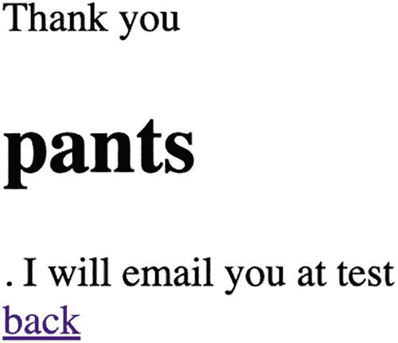
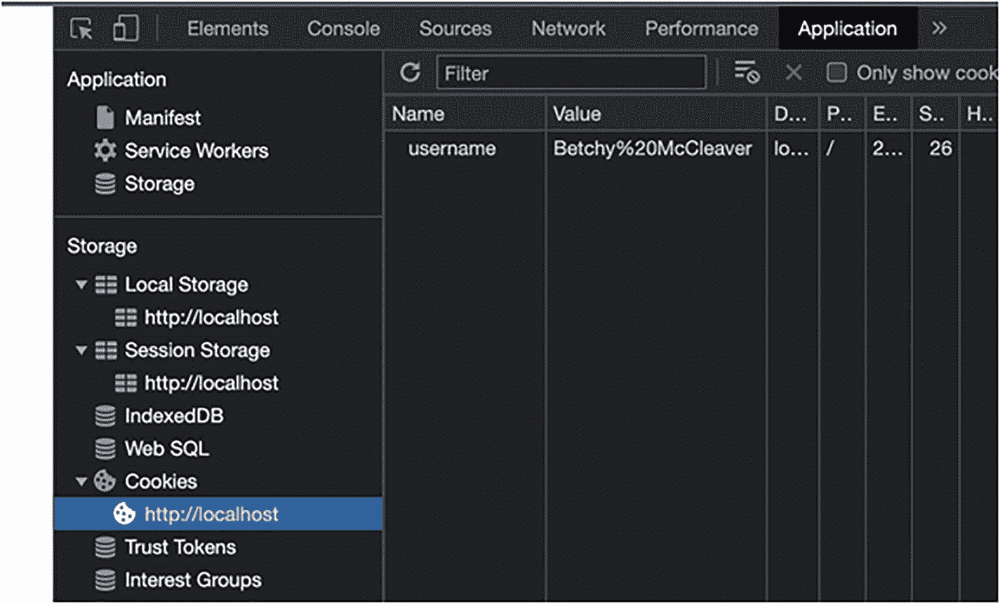
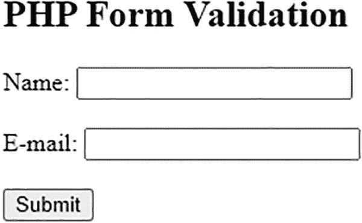
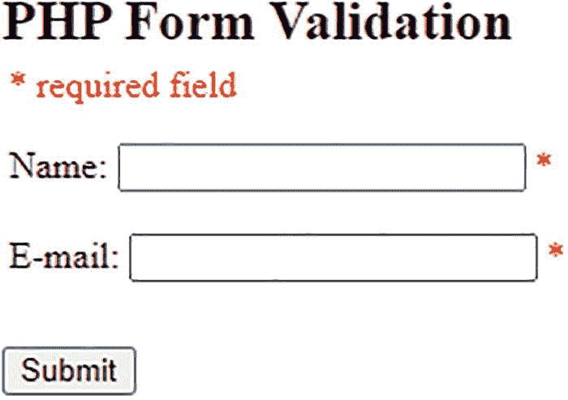
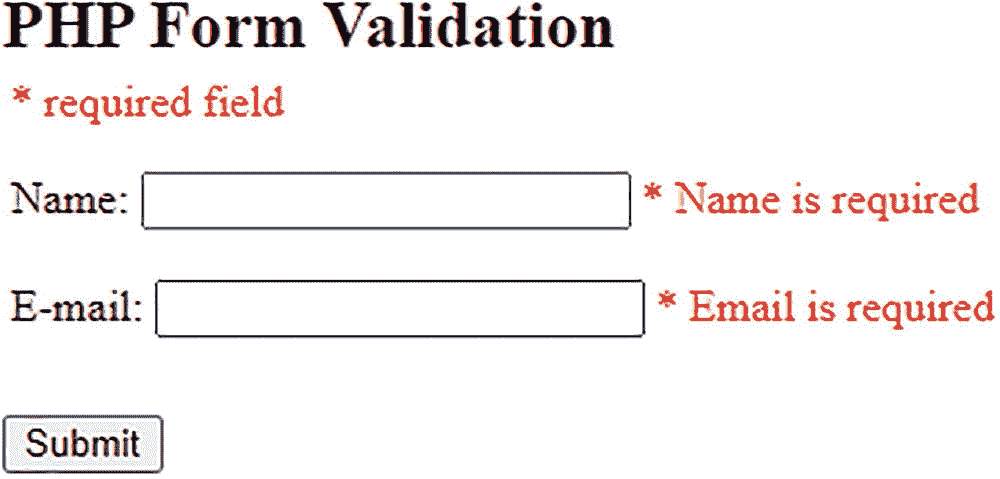
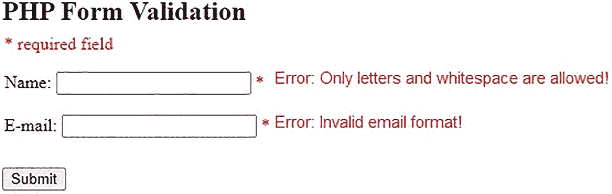

# 4. 数据与数据类型

在本章中，你将学习 PHP 如何处理数据与数据类型，以及如何在 PHP 中使用变量存储数据——从简单的字符串和数字，到更复杂的数组和对象。

数据类型是根据属性将数据分类为特定类别的方式，这些属性可以是：

- **字母数字型**：字符被归类为字符串
- **整数型**：归类为整数
- **浮点型**：带有小数点的数字
- **布尔型**：可以是 `true` 或 `false`

本章将涵盖以下主题：

- PHP 数据类型简介
- 标量类型（预定义）
- 复合类型（用户自定义）
- 特殊类型

### PHP 数据类型

通常，PHP 支持八种基本数据类型用于创建变量，根据你要存储的数据类型，选择合适的数据类型变量。如果你想在变量中存储短语 `"Hello World"`，你会选择 `string` 类型而不是 `integer` 类型。为什么？因为 `string` 是字符序列，而 `integer` 是介于 -2,147,483,648 和 2,147,483,647 之间的非小数的数字。出于实际目的，使用 `string` 更合理，如果你试图将 `"Hello World"` 赋值给一个 `integer` 类型的变量，PHP 会友善地告诉你不能这样做。

以下是 PHP 中用于创建变量的八种基本数据类型：

- 标量类型（预定义）：
  - `Boolean`
  - `Integer`
  - `Float`
  - `String`
- 复合类型（用户自定义）：
  - `Array`
  - `Object`
- 特殊类型：
  - `NULL`
  - `Resource`

## PHP 数据类型：标量类型

在 PHP 中，标量的含义是：

1. 一个完全由其大小决定且没有方向的量，例如质量、长度或速度。
2. 一个数字、数值量或域中的元素。
3. 一种设备，其输出等于输入乘以一个常数，如在线性放大器中。

你可以将诸如 10 或 5 这样的数字视为标量。像 `"Hello World"` 这样的单词、字母或短语也被视为标量。

这种 PHP 数据类型只保存单一值，包含四种标量数据类型：

- `Boolean`
- `Integer`
- `Float`
- `String`


##### 布尔型

布尔类型是最简单的类型。它表示一个“真”值，即 `true` 或 `false`。

要指定一个布尔字面量，请使用常量 `true` 或 `false`。两者均不区分大小写。

布尔类型常用于条件测试中。

##### 整型

`int` 是一个介于 -2,147,483,648 和 2,147,483,647 之间的非小数数字。整数可以用四种不同的进制来指定：

1.  十进制（基数为 10）[1, 2, 3, 4, 5, 6, 等]
2.  十六进制（基数为 16）[1A, 1B, 1C, 等]
3.  八进制（基数为 8）[1, 2, 3, 4, 5, 6, 7]
4.  二进制（基数为 2）[0, 1, 1011, 等]

整数还必须遵守以下规则：

*   整数必须至少包含一位数字。
*   整数不得包含小数点。

##### 浮点型

浮点型（浮点数）是一个带小数点的数字，或是指数形式的数字。

##### 字符串

字符串是一组字符序列，例如 "Hello World!"。

字符串可以是引号内的任何文本。你可以使用单引号或双引号。

字符串字面量可以通过四种不同的方式指定：

*   单引号
*   双引号
*   Heredoc 语法
*   Nowdoc 语法

将变量指定为字符串最基本的方法是用单引号（`'`）将其括起来。如果你想指定一个*真正的*单引号供使用，你需要“转义”该字符本身，即告诉 PHP 忽略此字符的功能，只将其作为你想要在某个地方打印出来的真实单引号。PHP 的转义字符是反斜杠（`\`）。这引发了一个问题：如何转义反斜杠才能使用一个字面反斜杠？很简单。以同样的方式转义它，即（`\\`）。与字符串的其他语法（双引号和 Heredoc）不同，使用单引号字符串时，变量和特殊字符的转义序列不会被展开。

使用双引号（`"`）时，PHP 会解释以下针对特殊字符的转义序列：

| 序列 | 含义 |
| -------- | ------- |
| `\n` | 换行（LF 或 ASCII 中的 0x0A (10)） |
| `\r` | 回车（CR 或 ASCII 中的 0x0D (13)） |
| `\t` | 水平制表符（HT 或 ASCII 中的 0x09 (9)） |
| `\v` | 垂直制表符（VT 或 ASCII 中的 0x0B (11)） |
| `\e` | 转义（ESC 或 ASCII 中的 0x1B (27)） |
| `\f` | 换页（FF 或 ASCII 中的 0x0C (12)） |
| `\\` | 反斜杠 |
| `\$` | 美元符号 |
| `\"` | 双引号 |
| `\[0-7]{1,3}` | 匹配此正则表达式的字符序列是八进制表示的一个字符，它会静默溢出以适配一个字节（例如，`"\400"` === `"\000"`） |
| `\x[0-9A-Fa-f]{1,2}` | 匹配此正则表达式的字符序列是十六进制表示的一个字符 |
| `\u{[0-9A-Fa-f]+}` | 匹配此正则表达式的字符序列是一个 Unicode 码点，该码点将以 UTF-8 编码形式输出到字符串中 |

双引号字符串的转义字符与单引号字符串相同，都是反斜杠（`\`）。单引号和双引号字符串的主要区别在于，如果在双引号内使用变量，变量会被展开。

在 PHP 中创建字符串数据类型的第三种方法是使用 Heredoc 语法：`<<<`。这种方法对于处理大量预格式化文本特别有用。要使用 Heredoc，你只需以这个运算符 `<<<` 开头，随后紧跟一个标识字符串名称或引用的标识符，然后是一个换行。接下来是字符串内容，最后用开头相同的标识符来闭合或结束引号。它看起来像这样：

```
Heredoc 中的文本行为与双引号字符串完全相同。上述转义码和引号仍然可以使用。变量也会被展开。
```

此外，闭合标识符必须遵循 PHP 中任何其他标签的相同命名规则：它只能包含字母数字字符和下划线，并且必须以非数字字符或下划线开头。

Nowdoc 是单引号版本的 Heredoc。Nowdoc 的指定方式相同，但标识符需要用单引号括起来。


使用双引号或 `heredoc` 指定的字符串会解析其中的变量。有两种语法可用于此：简单语法或复杂语法。这并非描述二者的易用性，而是描述被解析变量的复杂性。简单语法最常用，它提供了一种以最小工作量在字符串中嵌入变量、数组值或对象属性的方式。复杂语法则使用花括号来组织并告知 `PHP` 需要解析什么。

```
这将输出以下内容：
He drank some earl grey tea.
He drank some tea made of .
He drank some tea made of earl grey.
如之前所述，复杂语法之所以被称为“复杂”，并非因其语法复杂，而是因为它允许使用复杂表达式。通过复杂语法，任何具有字符串表示形式（具有字符串的变量）的数组元素、标量变量或对象属性都可以包含在此语法中。这意味着您不仅可以显示通过变量`$foo = "bar"`定义的简单字符串，还可以显示更复杂的情况，例如`$foo[$x] = "Bar"`。

这是有效的语法，尽管某些变量需要先定义。请查看以下正确语法示例：

```
width}00 centimeters broad.";
// 有效，带引号的键只能使用花括号语法
echo "This works: {$arr['key']}";
// 有效
echo "This works: {$arr[4][3]}";
// 这错误，原因与在字符串外使用 $foo[bar] 相同。
// 换句话说，它仍然会工作，但仅仅是因为 PHP 首先会寻找一个名为 foo 的常量；将会抛出一个 E_NOTICE 级别（未定义常量）的错误。
echo "This is wrong: {$arr[foo][3]}";
// 有效。在字符串内使用多维数组时，始终在数组周围使用花括号
echo "This works: {$arr['foo'][3]}";
// 有效。
echo "This works: " . $arr['foo'][3];
echo "This works too: {$obj->values[3]->name}";
echo "This is the value of the var named $name: {${$name}}";
echo "This is the value of the var named by the return value of getName(): {${getName()}}";
echo "This is the value of the var named by the return value of \$object->getName(): {${$object->getName()}}";
// 无效，输出：This is the return value of getName(): {getName()}
echo "This is the return value of getName(): {getName()}";
// 无效，输出：C:\folder\{fun}.txt
echo "C:\folder\{$great}.txt"
// 有效，输出：C:\folder\fun.txt
echo "C:\\folder\\{$great}.txt"
?>
```

访问类属性：

```
$bar}\n";
echo "{$foo->{$baz[1]}}\n";
?>
```

### PHP 字符串函数

PHP 有许多专门为字符串设计的内置函数，包括：

*   `substr()`
*   `strlen()`
*   `str_replace()`
*   `trim()`
*   `strpos()`
*   `strtolower()`
*   `strtoupper()`
*   `is_string()`
*   `strstr()`

#### `substr()`

```
string substr(string string, int start[, int length] );
```

返回值是从字符串中复制出来的一个子字符串。

```
$comment = 'your product works well!';
```

调用函数时，您可以使用正数或负数。正数表示从起始位置获取字符串直到字符串末尾。负数起始值表示从字符串末尾减去起始字符数开始获取字符串直到字符串末尾。请查看 `chapter4-substring.php`。

```
$comment = 'Your product is great!';
echo substr($comment, 1) . "\n";
//  返回 'Your product is great!'.
$comment = 'Your product is great!';
echo substr($comment, -9) . "\n";
//  返回 'is great!'
our product is great!
is great!
```

`length` 参数用于指定以下两者之一：

*   返回的字符数（正数长度）
*   返回序列的结束字符（负数长度）

```
$comment = 'Your product is great!';
substr($comment, 0, 4);
// 返回 'Your'
substr($comment, 5, -10);
// 返回 'product'
```

`5` 表示起始字符点（p），`-10` 确定结束点（从字符串末尾开始向前数 10 个位置）。

#### `strlen()`

`strlen()` 用于检查字符串的长度。

```
echo strlen("Harder Faster Better Stronger");
// 29
 0) {
echo 'that is valid foo';
} else {
echo 'that foo is too small';
}
?>
// that foo is too small
```

#### `str_replace()`

很多时候，使用字符串时，能够查找和替换子字符串非常有用。使用 `str_replace()`，这变得很容易。

```
mixed str_replace(mixed needle, mixed new_needle, mixed haystack[, int &count]));
```

`str_replace()` 使用 PHP 中一个常见概念：“needle”和“haystack”。看到这个，您可以想象在干草堆里找一根针的想法。这为您指明了哪个术语对应什么。我是在干草堆中寻找一根针，如 `str_replace("pants", $longParagraph)` 所示。要明确的是：`"pants"` == needle，`$longParagraph` == haystack。

```
<?php
$strings = array (
'You like to have a snazzy time',
'You are a really snazzy person',
'Would you like to drink a cup of coffee?'
);
$search = array (
'snazzy',
'cup',
'person',
'coffee'
);
$replace = array (
'great',
'bottle'',
'dude',
'Dark brown stuff'
);
$replaced = str_replace ( $search, $replace, $strings );
```

#### `trim()`

处理未知输入比较棘手，这正是 `trim()` 的用武之地。`trim()` 函数用于去除字符串左、右或两侧不需要的空格。您也可以指定想要去除的字符。

#### `strpos()`

`strpos()` 函数的运作方式与 `strstr()` 类似，不同之处在于它返回一个子字符串在干草堆中的数值位置，而不是返回一个子字符串。

```
int strpos(string haystack, string needle, int [offset] );
```

返回的整数是 needle 在 haystack 中首次出现的位置。第一个字符位于位置 0，与数组类似。

通过运行以下代码，您可以看到感叹号位于位置 13。

```
$awesome = "Super Awesome!";
echo strpos($awesome, "!");
// 13
```

此函数接受单个字符作为 needle，但它也可以接受任意长度的字符串。可选的 `offset` 参数决定了在 haystack 中开始搜索的点。

```
$awesome = "Super Awesome!";
echo strpos($awesome, 'm', 3);
// 11
```

这段代码向浏览器输出值 11，因为 PHP 从位置 3 开始寻找字符 `m`。

在任何这些情况下，如果 needle 不在字符串中，`strpos()` 将返回 `false`。为避免奇怪的行为，您可以使用 `===` 运算符来测试返回值。请查看 `chapter4-strpos.php`。

#### `strtolower()`

在 `PHP` 中经常需要比较字符串或纠正当人们使用全大写或奇怪写法时的大小写。为了比较字符串，您需要确保它们大小写一致。您可以为此目的使用 `strtolower()`。让我们使用一个用 `strtolower()` 创建的函数来安抚一个愤怒的人。

#### `strtoupper()`

`strtoupper()` 也很流行，原因与上述相反，即它接受一个小写或大小写混合的字符串并将其转换为全大写。让我们改变一下，创建一个叫醒函数让您的员工在早上精神起来。

#### `is_string()`

`is_string()` 用于检查一个值是否为字符串。让我们在 `if()` 语句中查看它，以便对字符串和非字符串采取不同的操作。`is_string()` 返回 `true` 或 `false`。

#### `strstr()`

最后但同样重要的是 `strstr()` 函数。`strstr()` 函数可用于在较长的字符串中查找字符串或字符匹配。此函数可用于在一个字符串内查找另一个字符串，包括查找仅包含单个字符的字符串。

```
string strstr(string haystack, string needle);
```


您向`strstr()`传递一个待搜索的`haystack`和一个待查找的`needle`。如果找到完全匹配的`needle`，`strstr()`函数将从`needle`开始返回`haystack`。如果未找到`needle`，则返回`false`。如果`needle`出现多次，返回的字符串将从`needle`第一次出现的位置开始。

举例来说，假设您有一个供人们提交其网站的提交表单，但您希望网站采用特定格式。您可以使用`strstr()`来检查字符串中是否包含某子字符串，从而帮助实现这一点。

```
两种复合类型：
I
在下一节中，您将学习复合数据类型。
```

## PHP 数据类型：复合类型

PHP 复合类型可以包含多个值，包括两种数据类型：

- 数组
- 对象

##### 数组
PHP 中的数组实际上是一个有序映射。映射是一种将值与键关联起来的类型。此类型针对多种不同用途进行了优化；它可以被视为数组、列表（向量）、哈希表（映射的一种实现）、字典、集合、栈、队列等。由于数组值可以是其他数组，因此树和多维数组也是可能的。对这些数据结构的解释超出了本手册的范围，但我们将为每种结构至少提供一个示例。有关更多信息，请查阅关于此广泛主题的大量现有文献。

PHP 中的数组是一种将值与键关联起来的类型。默认情况下，PHP 将键分配为从 0 开始、一直到数组大小的数字。请参见`chapter4.php`。

```
array(3) {
[0]=>
string(5) "first"
[1]=>
string(6) "second"
[2]=>
string(3) "3rd"
}
```

PHP 还允许您指定对应用程序可能更有意义的特定键，它们被称为关联数组。

```
array(3) {
["fruit"]=>
string(5) "apple"
["vegetable"]=>
string(6) "carrot"
["color"]=>
string(4) "blue"
}
```

您还可以创建多维数组。您可以将其想象成一个电视节目，由标题“Strangest Things”组成，分为多个季节，每个季节包含单集。作为 PHP 中的一个变量，它可能如下所示：

```
array(2) {
["season1"]=>
array(2) {
["episode1"]=>
string(12) "The Beginning"
["episode3"]=>
string(17) "The Third Episode"
}
[0]=>
array(1) {
[0]=>
string(13) "The Beginning"
}
}
```

接下来，您将探索面向对象编程中的“对象”。

#### 对象
对象以及类是面向对象编程（OOP）的主要组成部分。您可以将类视为模板或结构，当创建并使用新对象时，该对象将使用这个模板或结构。当对象数据类型作为变量创建，例如`$myCar`，它将拥有`$car`类的所有属性和功能，包括`$model`、`$color`、`$price`等。当创建各个对象时，它们继承类中的所有属性和行为，但每个对象的属性值不同。假设您有一个名为`Car`的类。`Car`可以拥有`model`和`color`等属性。您可以定义`$model`和`$color`等变量来保存这些属性的值。当创建各个对象（`Volvo`、`BMW`、`Toyota`等）时，它们继承类中的所有属性和行为，但每个对象的属性值不同。如果您创建了一个`__construct()`函数，那么当您从类创建对象时，PHP 将自动调用此函数。

## PHP 数据类型：特殊类型

在 PHP 中，有两种特殊类型：

- NULL
- 资源

##### NULL
`NULL`是一个特殊值，表示没有值的变量。`NULL`是唯一可能放入的值。特殊值`NULL`表示一个没有值的变量。`NULL`是类型为`NULL`的变量的唯一可能值。在以下情况下，变量被视为`null`：

- 已分配常量`null`。
- 未设置其他值。
- 它已被`unset()`。

（`chapter4-1.php`）

```
Null value
```

### 资源
资源在 PHP 中并不完全是一种数据类型，因为它们主要用于存储某些函数调用或作为对外部 PHP 资源的引用。

## 总结
在本章中，您了解到 PHP 中有不同的数据类型，如标量类型（预定义）、复合类型（用户定义）和特殊类型。您还了解到 PHP 数据类型可以是字母数字、整数、浮点数和布尔值。您特别关注了字符串，它是 PHP 中非常有用的类型，您将经常使用它。请记住，字符串的强大之处在于可以对其执行多种不同的操作，以及有大量可用的预构建字符串函数。在下一章中，您将学习 PHP 表单数据处理，并了解如何使用 PHP 超全局变量（如`$_GET`和`$_POST`）创建和使用表单来获取表单数据。

# 5. 表单数据

在本章中，您将学习如何使用`POST`和`GET`方法在 PHP 中创建和管理表单。您将探索三个超全局变量：`$_POST`、`$_GET`和`$_REQUEST`。`$_POST`和`$_GET`是在 PHP 中接收用户输入的两种最常见方式。`$_REQUEST`使用较少。

本章包括以下章节：

- PHP GET 表单
- PHP POST 表单

我们曾询问一位初级开发者`POST`和`GET`（总体上）的区别。他给出的答案虽然不太理想，但并非错误。他说`POST`用于发送数据，`GET`用于检索数据。这没错。当使用 RESTful API 时，我们会`POST`数据供服务器使用，并`GET`数据作为数据库查询的请求（例如）。然而，这并非我们期望的答案——甚至他都不知道自己在说什么。我们想找的`POST`和`GET`之间的区别如下：`POST`通过 HTTP 正文将数据发送到等待的服务器（API、特定 PHP 文件等）。`GET`将表单数据以名称-值对的形式附加到 URL。下次您点击表单上的“提交”按钮时，请查看 URL。如果您看到刚填写的任何信息，则说明使用了`GET`。如果 URL 是干净的，那么肯定使用了`POST`。老实说，您甚至不需要使用表单就能使用`GET`。`GET`是一种非常有用的方式来持久化唯一 ID、面包屑导航和各种数据。它们都有各自的功能和用例，但使用两者时，我们都必须将安全放在首位。曾经有个关于一位医生的电视节目，他以“永远不要相信病人。他们会撒谎。”而闻名。在我们的情况下，永远不要相信用户输入。将您的代码暴露给像表单这样的开放攻击向量……这本身就是一个攻击向量。这不是“是否”有人试图通过表单进行黑客攻击的问题，而是 100%的“何时”问题。如果您现在查看实时服务器日志，您会看到成百上千的请求涌入，扫描它们能找到的所有文件和目录。当他们试图找到您暴露的 WordPress 配置文件时，他们同时也在通过机器人攻击前端，试图对您的表单进行 SQL 注入。一旦您创建了一个表单，您就向外部世界敞开了大门，黑客们会欣然进入。现在，我已经把您完全吓跑了，以至于您再也不敢尝试编码了，但这是可以管理的。可以采取一些策略来减缓、阻止甚至完全阻止黑客通过您编写的代码获得访问权限。尽管如此，没有万无一失的方法来抵御 SQL 注入。不过，您可以遵循许多最佳实践来尽可能感到安全，在您设置好自己的黑客红地毯（我的意思是表单）之后，您将学习这些实践。

### PHP POST 表单

让我们看看 PHP POST 表单是如何工作的。让我们创建一个简单的 HTML 表单，看看`$_POST`如何从 HTML 页面中的 POST 请求变量接收数据。

这是一个基本的 HTML 表单：

```
(basicForm.php)

Name: 
E-mail:

```


该表单获取用户的姓名和电子邮件输入，并通过`POST`方法将其发送到`functions.php`。`method`设置指定了请求方法，而`action`设置则指定了数据发送的目标地址。如果你打开`functions.php`，就能看到后续的处理逻辑。

```php
back
```

上述代码接收并验证了从表单发送的两个`POST`变量`$_POST['name']`和`$_POST['email']`，然后将它们打印到屏幕上。你会看到`name="name"`和`name="email"`被发送到了`functions.php`，并通过`$_POST['name']`或`$_POST['email']`进行检索。如果你在表单页面中将电子邮件字段的`name`属性从`name="email"`改为`name="myEmail"`，那么就需要使用`$_POST['myEmail']`来引用它。

让我们快速尝试一下。
不要在“姓名”字段中输入你的名字，而是输入`pants`。

```
pants
```

现在按回车键，观察图 5-1 所示的结果。



图 5-1 POST 表单的代码结果

这并不是开发者在创建表单时所期望的结果。作为开发者，不仅要考虑代码的精确用例，还必须考虑到边界情况、边缘情况和最坏情况。用户通常很可靠，会按照“正确”的方式使用应用程序，但有时也可能出现上述示例中的情况。这通常是由于一次性的输入错误造成的，但现实是，越来越多的攻击者利用像你构建的这种表单，利用安全措施的缺失来入侵你的系统。无论你在哪里工作，或者你自认为系统多么安全，都必须将安全性放在首位。

让我们开始缓解这种情况。

打开`functions.php`，添加以下代码行，使其看起来像这样：

```php
back
```

返回并尝试再次将`<h1>pants</h1>`作为“name”发送。这次你会看到不同的结果。现在，你已经阻止了 HTML 元素被浏览器渲染。这是朝着正确方向迈出的积极一步。当今许多成功的攻击都是从简单的 HTML 元素在页面上渲染开始的。现在，让我们看看你能对电子邮件地址做些什么。

你已经对电子邮件地址进行了清理，以确保没有恶意字符通过，但你还希望验证其格式是否符合特定要求。你需要检查用户输入的电子邮件地址是否包含由字母、数字以及一些特殊字符（如`-`和`.`）组成的起始部分。然后，检查是否有`@`符号，其后是更多的字母和数字，最后是一个句点加上有效的域名（如`.com`、`.org`、`.net`等）。这可以通过使用之前用过的`filter_var`函数，并指定`FILTER_VALIDATE_EMAIL`选项来实现。再次打开`functions.php`，添加以下代码行以验证电子邮件地址：

```php
back
```

重新加载表单，并输入一个格式非常不正确的电子邮件地址，例如`pants one1@mail.$$$`。这将返回“Invalid email format”，因为其格式无效（明白了吗？）。当然，这种方法并非万无一失。如果没有实际从该域名的邮件服务器发送并接收响应，就无法真正验证这是一个真实且正在使用的电子邮件地址。这只是帮助你通过第一轮检查。下一步是实现“请检查您的电子邮件以验证您是真实用户”的步骤，以使流程更加真实。

你是否注意到，在收到“Invalid email format”消息并点击后退按钮后，输入框中的内容就消失了？你的姓名和电子邮件不再保留。如果能在输入框中保留这些内容，以防用户输错一个字母而不想重新输入所有内容，岂不是更好？

### PHP GET 表单
让我们看看 PHP GET 表单是如何工作的。

你可以使用`$_GET`轻松实现上述功能。再次打开`functions.php`，并在底部的“back”链接处添加以下代码行：

```php
&email=">back
```

这里，你将`$name`和`$email`变量添加到 URL 中，以便在返回`shortForm.php`时使用它们。不过，`<?=`是什么意思呢？这是 PHP 使用其短打开选项的方式。当你需要在 HTML 中使用 PHP 代码执行简单操作时，可以使用短打开标签`<?=`，而不必输入`<?php`。其中`=`代表`echo`。因此，有了这个工具，你可以快速将`$name`和`$email`变量放入 URL 中，以便在`basicForm.php`页面上使用`$_GET`变量。继续打开该文件，并添加以下代码行：

```php
Name: ">
E-mail: ">
```

表单页面现在会检查`$_GET`超级全局变量中是否设置了任何变量。如果有，它会检查`$_GET['name']`和`$_GET['email']`是否已设置。如果它们中有值，则分别将其赋给`$name`和`$email`。接下来，它会检查`$name`或`$email`是否已设置。这是一个`if`语句的三元表达式。与其这样写：

```php
if ($name != "" ) {
$name = $name;
} else {
$name = "";
}
```

不如这样写：

```
(Conditional statement) ? (Statement_1) : (Statement_2);
```

因此，你想要的是：

```
$name != "" ? $name : ""
如果$name 不为空，则将其值赋给$name，否则将其设置为""。
```

在输入框中，你使用`value`属性来添加刚从`$_GET`（通过 URL）接收到的姓名或电子邮件（或者为空）。现在，你可以获取用户信息并将其传递回自己的脚本，从而与用户进行完整的交互。使用`$_GET`和`$_POST`超级全局变量可以让你熟悉数组，特别是关联数组。

## 总结
在本章中，你学习了 PHP 表单数据处理。你学习了如何创建和使用表单，以及如何通过 PHP 超级全局变量（如`$_GET`和`$_POST`）获取表单数据。在下一章中，你将更深入地学习数组，数组用于在单个变量中保存多个相似类型的值。

# 6. 数组

在前面的章节中，你学习了如何处理 PHP 变量。在本章中，我们将教你如何创建和管理 PHP 数组。
假设你需要在单个变量中保存多个相似类型的值，而无需创建额外的变量来存储它们。你该如何实现呢？通过使用 PHP 数组。

本章包含以下部分：

*   PHP 索引数组和关联数组
*   PHP 多维数组
*   PHP 数组函数

## PHP 索引数组和关联数组
数组是 PHP 中最通用和最有用的元素之一。那么，究竟什么是数组？数组用于在单个变量中存储多个值。可以把数组想象成一个有多个隔间的容器。使用这个容器，你可以存储和组织其他信息，包括变量。
使用 PHP 关联数组，你可以通过`=>`符号为每个数组元素关联一个名称。

这看起来像：

```php
array(
key  => value,
key2 => value2,
key3 => value3,
...
)
```

对于 PHP 索引数组，索引由数字表示，从 0 开始，如下所示：

```php
$city=array("Rome","Naples","Milan");
$city[0] = "Rome";
$city[1] = "Naples";
$city[3] = "Milan";
```

使用关联数组的实际 PHP 代码如下所示：

`Chapter6/firstArray.php`

```php
 "bar",
"bar" => "foo",
);
// 使用短数组语法
$array2 = [
"foo2" => "bar2",
"bar2" => "foo2",
];
var_dump($array1);
echo '';
var_dump($array2);
```

输出结果如下：

```
array(2) { ["foo"]=> string(3) "bar" ["bar"]=> string(3) "foo" }
array(2) { ["foo2"]=> string(4) "bar2" ["bar2"]=> string(4) "foo2" }
```


第一部分 `array(2)` 告诉你正在使用的变量 `var_dump` 的类型是数组。其中的 `2` 表示该数组包含的元素数量。接下来是键值对列表：键位于方括号内，值位于 `=>` 符号右侧。在 `=>` 符号的右侧，你可以看到 `string(3)`，这表示该键值对中的值是一个长度为 3 的字符串（`"bar"`）。让我们看一下 `firstArray2.php`，了解使用不同类型变量的示例。

```
 "bar",
"bar" => "foo",
100   => -100,
-100  => 100,
);
var_dump($array);
?>
```

输出结果如下：

```
array(4) { ["foo"]=> string(3) "bar" ["bar"]=> string(3) "foo" [100]=> int(-100) [-100]=> int(100) }
```

注意，这个数组中包含了 `string` 和 `int` 类型的数据。到目前为止，你一直使用键值对关系来定义数组，但如果你“不需要”键呢？例如，当你只是用数组来存储首选客户的名字时，你不会想这样写：

```
"Customer" => "john",
"Customer" => "peter",
etc...
```

这样做行不通。首先，你不能成功地为多个值使用同一个键。其次，这样做毫无意义。当用户未定义键时，PHP 会自动分配数字键。

`firstArray3.php`

```
<?php
$array = array("foo", "bar", "hello", "world");
var_dump($array);
```

输出结果为：

```
array(4) { [0]=> string(3) "foo" [1]=> string(3) "bar" [2]=> string(5) "hello" [3]=> string(5) "world" }
```

你可以看到，PHP 使用数字来代替你定义的键。注意数组从 `0` 开始，而不是 `1`。在众多编程语言及其差异中，它们在一个问题上保持一致：数组从 `0` 开始。

如果你一直跟着学习，你可能会好奇是否可以在一个数组内包含另一个数组。答案是肯定的，这被称为多维数组。来看一下 `firstArray4.php`。

```
 "bar",
42    => 24,
"multi" => array(
"dimensional" => array(
"array" => "foobar"
)
)
);
var_dump($array["foo"]);
var_dump($array[42]);
var_dump($array["multi"]["dimensional"]["array"]);
```

输出结果为：

```
string(3) "bar" int(42) string(6) "foobar"
```

前两个示例：

```
var_dump($array["foo"]);
var_dump($array[42]);
```

相当直接明了，但最后一个：

```
var_dump($array["multi"]["dimensional"]["array"]);
```

则更为复杂，需要一些解释。这就是多维数组。可以把它想象成专辑中的一首歌。你可能在和朋友聊天时这样引用这首歌：`$artist['album']['trackNumber']`。如果这位艺术家有大量音乐作品，那么它可能是 `$music['artist']['album']['trackNumber']`，而 `$music['elvis']['live'][1]` 就是 Elvis 名为“Live”的专辑中的第一首歌。多维数组可能会变得相当复杂，但有时它们是存储和组织数据的唯一方法。以下是更多关于多维数组的使用场景：

`multiArray1.php`

```
<?php
$cars = array (
array("Subaru",21,17),
array("Toyota",13,12),
array("Lexus",6,8),
array("Ford",14,10)
);
```

这里你可以看到，使用二手车场的数据创建了一个二维数组。你正在跟踪汽车品牌、可用数量和已售数量。主数组包含四个独立的数组，每个数组包含特定数据。`Cars` 是一个数组，其第一个元素是一个包含 `Subaru`、`21` 和 `17` 的数组。要访问 `Subaru`，你使用：

```
$cars[0][0];
```

这意味着，在 `$cars` 数组中，你想要第一个元素（`[0]`）中的第一个元素（`[0]`）。如果你想访问 `21`，你使用 `$cars[0][1]`，即你想要第一个元素（`[0]`）中的第二个元素（`[1]`）。

```
echo $cars[0][0] . ": 现有库存: " . $cars[0][1] . ", 已售: " . $cars[0][2] . " . ";
echo $cars[1][0] . ": 现有库存: " . $cars[1][1] . ", 已售: " . $cars[1][2] . " . ";
echo $cars[2][0] . ": 现有库存: " . $cars[2][1] . ", 已售: " . $cars[2][2] . " . ";
echo $cars[3][0] . ": 现有库存: " . $cars[3][1] . ", 已售: " . $cars[3][2] . " . ";
```

当你需要处理存储在数组中的数据时，`for` 循环是一个很好的解决方案。这里你遍历数组并打印出所需信息：

```
for ($row = 0; $row < 4; $row++) {
    echo "第 #$row 行 -- {$cars[$row][0]}";
    echo "<br />";
    for ($col = 1; $col < 3; $col++) {
        echo " ".$cars[$row][$col]."";
    }
    echo "<br />";
}
```

## PHP 多维数组

PHP 多维数组也被称为数组的数组，通常用于在数组中存储表格数据，并以行乘列的矩阵形式呈现。

多维数组看起来像这样：

```
定义
$emp = array
(
array(1,"Luna",10000),
array(2,"Leo",20000),
array(3,"Neve",30000)
);
```

## PHP 数组函数

你已经了解了索引数组、关联数组和多维数组，现在我们来学习 PHP 数组函数，这些函数用于在 PHP 语言中访问和操作数组元素。PHP 数组的内置函数通常在你需要创建简单和多维数组时使用。

以下是 PHP 数组函数的完整列表；它们将在本章中进行解释。

`array_chunk()` `array_combine()` `array_count_values()` `array_diff_assoc()` `array_diff_keys()` `array_diff_uassoc()` `array_diff_ukey()` `array_diff()` `array_fill_keys()` `array_fill()` `array_filter()` `array_flip()` `array_intersect_assoc()` `array_intersect_key()` `array_intersect_uassoc()` `array_intersect()` `array_key_exists()` `array_keys()` `array_merge_recursive()` `array_multisort()` `array_pad()` `array_pop()` `array_product()` `array_push()` `array_rand()` `array_reduce()` `array_replace_recursive()` `array_replace()` `array_reverse()` `array_search()` `array_shift()` `array_slice()` `array_splice()` `array_sum()` `array_udiff_assoc()` `array_udiff()` `array_uintersect_assoc()` `array_uintersect_uassoc()` `array_uintersect()` `array_unique()` `array_unshift()` `array_values()` `array_walk_recursive()` `array_walk()` `array()` `arsort()` `asort()` `compact()` `count()` `current()` `end()` `extract()` `in_array()` `key()` `krsort()` `ksort()` `list()` `natcasesort()` `natsort()` `next()` `pos()` `prev()` `range()` `reset()` `rsort()` `shuffle()` `sizeof()` `sort()` `uasort()` `uksort()` `usort()` `each()`

现在我们来介绍一些最常用和常见的 PHP 数组函数。

### `array_change_key_case`

更改数组中所有键的大小写。

```
array_change_key_case(array $array, int $case = CASE_LOWER): array
```

返回一个数组，其中所有键都转换为小写或大写。数字索引保持不变。

**参数**

- `array`：要操作的数组
- `case`：`CASE_UPPER` 或 `CASE_LOWER`（默认值）

**返回值**

返回一个键已转换为小写或大写的数组，如果数组不是数组则返回 `null`。

### `array_chunk`

将数组分割成块。

```
array_chunk(array $array, int $length, bool $preserve_keys = false): array
```

将数组分割成包含 `length` 个元素的数组块。最后一个块可能包含少于 `length` 个元素。

**参数**

- `array`：要操作的数组
- `length`：每个块的大小
- `preserve_keys`：设置为 `true` 时，键将被保留。默认值为 `false`，将重新索引块为数字索引。

**返回值**

返回一个从 `0` 开始的多维数字索引数组，每个维度包含 `length` 个元素。

### `array_column`

返回输入数组中单个列的值。

```
array_column(array $array, int|string|null $column_key, int|string|null $index_key = null): array
```


## PHP 数组函数参考

### `array_column()`

`array_column()` 返回数组中指定单列的值，该列由 `column_key` 标识。还可以提供 `index_key`，通过输入数组中 `index_key` 列的值来索引返回数组中的值。

#### 参数

- **`array`**：一个多维数组或对象数组，从中提取列的值。如果提供的是对象数组，则可以直接提取公共属性。若要提取受保护或私有属性，该类必须同时实现 `__get()` 和 `__isset()` 魔术方法。
- **`column_key`**：要返回值的列。该值可以是要检索的列的整数键，也可以是关联数组的字符串键名或属性名。也可以为 `null` 以返回完整的数组或对象（这在使用 `index_key` 重新索引数组时很有用）。
- **`index_key`**：用作返回数组索引/键的列。该值可以是列的整数键，也可以是字符串键名。该值的强制类型转换与数组键的常规转换相同（不过在 PHP 8.0.0 之前，也允许支持转换为字符串的对象）。

#### 返回值

返回一个数组，其中包含输入数组中单个列的值。

---

### `array_combine`

通过使用 `keys` 数组的值作为键，`values` 数组的值作为对应的值，创建一个数组。

```
array_combine(array $keys, array $values): array
```

#### 参数

- **`keys`**：要使用的键数组。键的非法值将被转换为字符串。
- **`values`**：要使用的值数组。

#### 返回值

返回组合后的数组，如果每个数组的元素数量不相等，则返回 `false`。

---

### `array_count_values()`

`array_count_values()` 返回一个数组，使用 `array` 的值作为键，它们在 `array` 中出现的频率作为值。

```
array_count_values(array $array): array
```

#### 参数

- **`array`**：要计数值的数组。

#### 返回值

返回一个关联数组，以数组中的值为键，以其出现次数为值。

---

### `array_diff_assoc`

使用额外的索引检查计算数组的差集。

```
array_diff_assoc(array $array, array ...$arrays): array
```

与 `array_diff()` 不同，比较中也会使用数组键。

#### 参数

- **`array`**：要比较的数组。
- **`arrays`**：用于比较的数组。

#### 返回值

返回一个数组，包含 `array` 中所有其他数组中不存在的值。

---

### `array_diff_key`

使用键名比较计算数组的差集。

```
array_diff_key(array $array, array ...$arrays): array
```

此函数类似于 `array_diff()`，但比较的是键而不是值。

#### 参数

- **`array`**：要比较的数组。
- **`arrays`**：用于比较的数组。

#### 返回值

返回一个数组，包含 `array` 中所有键名在其他数组中都不存在的条目。

---

### `array_diff_uassoc`

使用用户提供的回调函数执行额外的索引检查，计算数组的差集。与 `array_diff()` 不同，比较中会使用数组键。

```
array_diff_uassoc(array $array, array ...$arrays, callable $key_compare_func): array
```

与 `array_diff_assoc()` 不同，索引比较使用用户提供的回调函数，而非内部函数。

#### 参数

- **`array`**：要比较的数组。
- **`arrays`**：用于比较的数组。
- **`key_compare_func`**：比较函数必须返回一个整数，如果第一个参数被认为分别小于、等于或大于第二个参数，则返回小于、等于或大于零的整数。

```
callback(mixed $a, mixed $b): int
```

#### 返回值

返回一个数组，包含 `array` 中所有其他数组中不存在的条目。

---

### `array_diff_ukey`

将 `array` 的键与 `arrays` 的键进行比较，并返回差集。此函数类似于 `array_diff()`，但比较的是键而不是值。

```
array_diff_ukey(array $array, array ...$arrays, callable $key_compare_func): array
```

与 `array_diff_key()` 不同，索引比较使用用户提供的回调函数，而非内部函数。

#### 参数

- **`array`**：要比较的数组。
- **`arrays`**：用于比较的数组。
- **`key_compare_func`**：比较函数必须返回一个整数，如果第一个参数被认为分别小于、等于或大于第二个参数，则返回小于、等于或大于零的整数。

```
callback(mixed $a, mixed $b): int
```

#### 返回值

返回一个数组，包含 `array` 中所有其他数组中不存在的条目。

---

### `array_diff`

计算数组的差集。

```
array_diff(array $array, array ...$arrays): array
```

将一个数组与一个或多个其他数组进行比较，并返回 `array` 中其他数组中不存在的值。

#### 参数

- **`array`**：要比较的数组。
- **`arrays`**：用于比较的数组。

#### 返回值

返回一个数组，包含 `array` 中所有其他数组中不存在的条目。`array` 中的键会被保留。

---

### `array_fill_keys`

使用 `keys` 数组的值作为键，用 `value` 参数的值填充数组。

```
array_fill_keys(array $keys, mixed $value): array
```

#### 参数

- **`keys`**：将用作键的值数组。键的非法值将被转换为字符串。
- **`value`**：用于填充的值。

#### 返回值

返回填充后的数组。

---

### `array_fill`

用值填充数组。

```
array_fill(int $start_index, int $count, mixed $value): array
```

用 `value` 参数的值填充 `count` 个条目，键从 `start_index` 参数开始。

#### 参数

- **`start_index`**：返回数组的第一个索引。如果 `start_index` 为负数，则返回数组的第一个索引为 `start_index`，后续索引从 0 开始（参见示例）。
- **`count`**：要插入的元素数量。必须大于或等于零。
- **`value`**：用于填充的值。

#### 返回值

返回填充后的数组。

---

### `array_filter`

使用 `callback` 函数过滤数组元素。

```
array_filter(array $array, ?callable $callback = null, int $mode = 0): array
```

遍历数组中的每个值，将其传递给 `callback` 函数。如果 `callback` 函数返回 `true`，则当前值会被包含在结果数组中。

数组键会被保留，如果数组是索引的，可能会导致键出现间隙。结果数组可以使用 `array_values()` 函数重新索引。

#### 参数

- **`array`**：要遍历的数组。
- **`callback`**：要使用的回调函数。如果未提供回调函数，则将移除 `array` 中的所有空条目。参见 `empty()` 了解 PHP 在这种情况下如何定义“空”。
- **`mode`**：决定哪些参数传递给 `callback` 的标志：
  - `ARRAY_FILTER_USE_KEY`：将键作为唯一参数传递给 `callback`，而不是值。
  - `ARRAY_FILTER_USE_BOTH`：将值和键都作为参数传递给 `callback`，而不是只传递值。默认值为 0，即只将值作为唯一参数传递给回调函数。

#### 返回值

返回过滤后的数组。

---

### `array_flip`

交换数组中的键及其关联的值。

```
array_flip(array $array): array
```


## PHP 数组函数参考

### `array_flip()`

`array_flip()`返回一个键值对反转的数组；换言之，原数组的键成为值，原数组的值成为键。

请注意，`array` 的值必须是合法的键，因此它们必须是 `int` 或 `string` 类型。如果某个值类型错误，将会产生警告，并且该键值对不会包含在结果中。

如果一个值出现多次，则最后一个键会被用作其值，而其他所有键都将丢失。

**参数**

-   `array`
    要反转的键值对数组

**返回值**

返回反转后的数组

---

### `array_intersect_assoc`

带索引检查计算数组的交集

```
array_intersect_assoc(array $array, array ...$arrays): array
```

`array_intersect_assoc()` 返回一个数组，其中包含所有出现在所有参数中的 `array` 的值。请注意，与 `array_intersect()` 不同，此函数在比较时也会用到键名。

**参数**

-   `array`
    用作主值进行检查的数组
-   `arrays`
    用于比较值的数组

**返回值**

返回一个关联数组，其中包含所有出现在所有参数中的 `array` 的值

---

### `array_intersect_key`

使用键名比较计算数组的交集

```
array_intersect_key(array $array, array ...$arrays): array
```

`array_intersect_key()` 返回一个数组，其中包含 `array` 中所有键名出现在所有参数中的条目。

**参数**

-   `array`
    用作主键进行检查的数组
-   `arrays`
    用于比较键名的数组

**返回值**

返回一个关联数组，其中包含 `array` 中所有键名出现在所有参数中的条目

---

### `array_intersect_uassoc`

带索引检查计算数组的交集，并通过 `callback` 函数比较索引

```
array_intersect_uassoc(array $array, array ...$arrays, callable $key_compare_func): array
```

`array_intersect_uassoc()` 返回一个数组，其中包含所有出现在所有参数中的 `array` 的值。请注意，与 `array_intersect()` 不同，此函数在比较时也会用到键名。

**参数**

-   `array`
    用于数组比较的初始数组
-   `arrays`
    用于比较键名的数组
-   `key_compare_func`

如果第一个参数被认为分别小于、等于或大于第二个参数，则比较函数必须返回一个小于、等于或大于零的整数。

```
callback(mixed $a, mixed $b): int
```

**返回值**

返回 `array` 中那些值存在于所有参数中的值

---

### `array_intersect_ukey`

使用 `callback` 函数比较键名来计算数组的交集

```
array_intersect_ukey(array $array, array ...$arrays, callable $key_compare_func): array
```

`array_intersect_ukey()` 返回一个数组，其中包含 `array` 中所有那些键名匹配且存在于所有参数中的值。

**参数**

-   `array`
    用于数组比较的初始数组
-   `arrays`
    用于比较键名的数组
-   `key_compare_func`

如果第一个参数被认为分别小于、等于或大于第二个参数，则比较函数必须返回一个小于、等于或大于零的整数。

```
callback(mixed $a, mixed $b): int
```

**返回值**

返回 `array` 中那些键名存在于所有参数中的值

---

### `array_intersect`

计算数组的交集

```
array_intersect(array $array, array ...$arrays): array
```

`array_intersect()` 返回一个数组，其中包含所有出现在所有参数中的 `array` 的值。注意键名会被保留。

**参数**

-   `array`
    用作主值进行检查的数组
-   `arrays`
    用于比较值的数组

**返回值**

返回一个数组，其中包含 `array` 中那些值存在于所有参数中的值

---

### `array_is_list`

检查给定数组是否为列表

```
array_is_list(array $array): bool
```

如果数组的键名由从 0 到 `count($array)-1` 的连续数字组成，则该数组被视为列表。

**参数**

-   `array`
    被评估的数组

**返回值**

如果 `array` 是列表则返回 `true`，否则返回 `false`

---

### `array_key_exists`

检查数组中是否存在指定的键名或索引

```
array_key_exists(string|int $key, array $array): bool
```

如果给定的 `key` 在 `array` 中已设置，则 `array_key_exists()` 返回 `true`。`key` 可以是任何可能作为数组索引的值。

**参数**

-   `key`
    要检查的值
-   `array`
    包含要检查的键名的数组

**返回值**

成功时返回 `true`，失败时返回 `false`

---

### `array_key_first`

获取数组的第一个键名，不影响内部数组指针

```
array_key_first(array $array): int|string|null
```

**参数**

-   `array`
    一个数组

**返回值**

如果数组不为空，则返回 `array` 的第一个键名，否则返回 `null`

---

### `array_key_last`

获取数组的最后一个键名，不影响内部数组指针

```
array_key_last(array $array): int|string|null
```

**参数**

-   `array`
    一个数组

**返回值**

如果数组不为空，则返回 `array` 的最后一个键名，否则返回 `null`

---

### `array_keys`

返回数组中的所有键名或键名的子集

```
array_keys(array $array): array
array_keys(array $array, mixed $search_value, bool $strict = false): array
```

`array_keys()` 返回 `array` 中的键名，包括数字和字符串键名。如果指定了 `search_value`，则仅返回该值的键名。否则，返回数组中的所有键名。

**参数**

-   `array`
    包含要返回的键名的数组
-   `search_value`
    如果指定，则仅返回包含此值的键名。
-   `strict`
    决定在搜索期间是否应使用严格比较 (`===`)。

**返回值**

返回一个包含 `array` 中所有键名的数组

---

### `array_map`

将回调函数应用到给定数组的元素上

```
array_map(?callable $callback, array $array, array ...$arrays): array
```

`array_map()` 返回一个数组，其中包含将 `callback` 应用到作为回调参数的 `array`（如果提供了更多数组，则还有 `arrays`）的相应值的结果。`callback` 函数接受的参数数量应与传递给 `array_map()` 的数组数量匹配。多余的输入数组会被忽略。如果提供的参数数量不足，则会抛出 `ArgumentCountError`。

**参数**

-   `callback`
    为每个数组中的每个元素运行的可回调函数。可以将 `Null` 作为值传递给 `callback` 以对多个数组执行 zip 操作。如果只提供一个数组，`array_map()` 将返回输入数组。
-   `array`
    要通过 `callback` 函数处理的数组
-   `arrays`
    要通过 `callback` 函数处理的补充变量列表数组参数

**返回值**

返回一个数组，其中包含将 `callback` 函数应用到作为回调参数的 `array`（如果提供了更多数组，则还有 `arrays`）的相应值的结果。当且仅当只传递一个数组时，返回的数组将保留该 `array` 参数的键名。如果传递了多个数组，则返回的数组将具有连续的整数键名。

---

### `array_merge_recursive`

递归地合并一个或多个数组

```
array_merge_recursive(array ...$arrays): array
```


## PHP 数组函数参考

### `array_merge_recursive()`

`array_merge_recursive()` 合并一个或多个数组的元素，将后一个数组的值追加到前一个数组的末尾。它返回结果数组。

如果输入数组具有相同的字符串键，则这些键的值会被合并到一个数组中，并且此过程会递归进行。因此，如果其中一个值本身是数组，该函数也会将其与另一个数组中的对应条目合并。然而，如果数组具有相同的数字键，后面的值不会覆盖原始值，而是会被追加。

**参数**

`arrays`  
要递归合并的可变参数列表。

**返回值**

返回合并所有参数后得到的结果数组。如果未传入任何参数，则返回空数组。

### `array_merge()`

`array_merge()` 合并一个或多个数组。

```
array_merge(array ...$arrays): array
```

将多个数组的元素合并，使后一个数组的值追加到前一个数组的末尾。它返回结果数组。

如果输入数组具有相同的字符串键，则该键的后面值会覆盖前面值。如果数组包含数字键，后面的值不会覆盖原始值，而是被追加。

输入数组中带有数字键的值会被重新编号，从零开始递增。

**参数**

`arrays`  
要合并的可变参数列表。

**返回值**

返回结果数组。如果未传入任何参数，则返回空数组。

### `array_multisort()`

`array_multisort()` 对多个数组或多维数组进行排序。

`array1_sort_flags`  
前一个数组参数的排序选项。

**排序类型标志：**

`SORT_REGULAR`  
正常比较项目（不改变类型）。

`SORT_NUMERIC`  
按数值比较项目。

`SORT_STRING`  
按字符串比较项目。

`SORT_LOCALE_STRING`  
基于当前区域设置，按字符串比较项目。它使用可通过 `setlocale()` 更改的区域设置。

`SORT_NATURAL`  
使用“自然排序”按字符串比较项目，类似于 `natsort()`。

`SORT_FLAG_CASE`  
可以与 `SORT_STRING` 或 `SORT_NATURAL`（按位 OR）组合，以不区分大小写的方式排序字符串。

此参数可以与 `array1_sort_order` 互换，或者完全省略，此时默认为 `SORT_REGULAR`。

`rest`  
更多数组，可选地后跟排序顺序和标志。仅比较前一个数组中对应元素相同的元素。换句话说，排序是按字典顺序进行的。

**返回值**

成功时返回 `true`，失败时返回 `false`。

### `array_pad()`

`array_pad()` 用指定值将数组填充到指定长度。

```
array_pad(array $array, int $length, mixed $value): array
```

`array_pad()` 返回数组的一个副本，并用 `value` 将其填充到 `length` 指定的大小。如果 `length` 为正，则数组从右侧填充；如果为负，则从左侧填充。如果 `length` 的绝对值小于或等于数组的长度，则不进行填充。每次最多可以添加 1,048,576 个元素。

**参数**

`array`  
要填充的初始数组。

`length`  
数组的新大小。

`value`  
当数组长度小于 `length` 时用于填充的值。

**返回值**

返回数组填充到 `length` 指定大小后的副本。如果 `length` 为正，则数组从右侧填充；如果为负，则从左侧填充。如果 `length` 的绝对值小于或等于数组的长度，则不进行填充。

### `array_pop()`

`array_pop()` 弹出数组末尾的元素。

```
array_pop(array &$array): mixed
```

`array_pop()`

**注意**

此函数在使用后会重置输入数组的指针（即调用 `reset()`）。

**参数**

`array`  
要从中获取值的数组。

**返回值**

返回数组最后一个元素的值。如果数组为空（或不是数组），则返回 `null`。

### `array_product()`

`array_product()` 计算数组中所有值的乘积。

```
array_product(array $array): int|float
```

**参数**

`array`  
要计算的数组。

**返回值**

返回乘积，类型为整数或浮点数。

### `array_push()`

`array_push()` 将一个或多个元素推入数组末尾。

```
array_push(array &$array, mixed ...$values): int
```

`array_push()` 将数组视为栈，并将传入的变量推入数组末尾。数组的长度会增加所推入变量的数量。其效果等同于：

```
$array[] = $value;
// 对每个传入的值重复
```

如果使用 `array_push()` 向数组添加一个元素，不如使用 `$array[] =`，因为那样可以避免调用函数的开销。

**参数**

`array`  
输入数组。

`values`  
要推入数组末尾的值。

**返回值**

返回数组中新的元素数量。

### `array_rand()`

`array_rand()` 从数组中随机选取一个或多个键，并返回随机条目的键（或键数组）。

```
array_rand(array $array, int $num = 1): int|string|array
```

它使用伪随机数生成器，不适用于加密目的。

**参数**

`array`  
输入数组。

`num`  
指定应选取的条目数量。

**返回值**

当只选取一个条目时，`array_rand()` 返回随机条目的键。否则，返回包含随机条目键的数组。这样设计是为了既可以随机选取数组的键，也可以选取随机值。如果返回多个键，它们将按照在原数组中出现的顺序返回。尝试选取超过数组中元素数量的条目会导致 `E_WARNING` 级别的错误，并返回 `NULL`。

### `array_reduce()`

`array_reduce()` 使用回调函数迭代地将数组缩减为单个值。

```
array_reduce(array $array, callable $callback, mixed $initial = null): mixed
```

**参数**

`array`  
输入数组。

`callback`  
`callback(mixed $carry, mixed $item): mixed`

`carry`  
保存上一次迭代的返回值；在第一次迭代时，它保存 `initial` 的值。

`item`  
保存当前迭代的值。

`initial`  
如果提供了可选的 `initial`，它将在处理开始时被使用，或者当数组为空时作为最终结果。

**返回值**

返回最终结果值。如果数组为空且未传递 `initial`，则 `array_reduce()` 返回 `null`。

### `array_replace_recursive()`

`array_replace_recursive()` 递归地将传入数组中的元素替换到第一个数组中。

```
array_replace_recursive(array $array, array ...$replacements): array
```

`array_replace_recursive()` 将第一个数组中的值替换为所有后续数组中相同的键对应的值。如果第一个数组中的键存在于第二个数组中，其值将被第二个数组中的值替换。如果键存在于第二个数组中但不在第一个数组中，它将被创建到第一个数组中。如果某个键仅存在于第一个数组中，则保持不变。如果传递了多个替换数组，它们将按顺序处理，后面的数组会覆盖前面的值。

`array_replace_recursive()` 是递归的：它会递归进入数组，并对内部值应用相同的过程。

当第一个数组中的值是标量时，无论第二个数组中的值是标量还是数组，它都会被第二个数组中的值替换。当第一个数组和第二个数组中的值都是数组时，`array_replace_recursive()` 会递归替换它们的相应值。

**参数**

`array`  
元素被替换的数组。

`replacements`  
从中提取元素的数组。

**返回值**

如果成功则返回数组，如果发生错误则返回 `null`。

### `array_replace()`

`array_replace()` 将传入数组中的元素替换到第一个数组中。

```
array_replace(array $array, array ...$replacements): array
```


### `array_replace()`

`array_replace()` 使用后续数组中具有相同键的值来替换 `array` 中的值。如果第一个数组中的某个键存在于第二个数组中，则该键的值将被第二个数组中的值替换。如果该键存在于第二个数组中，但不存在于第一个数组中，它将在第一个数组中被创建。如果某个键仅存在于第一个数组中，则其值保持不变。如果传入了多个数组用于替换，它们将按顺序处理，后面的数组会覆盖前面的值。`array_replace()` 不是递归的：它会将第一个数组中的值替换为第二个数组中任意类型的值。

#### 参数

- `array` — 元素被替换的数组。
- `replacements` — 从中提取元素的数组。后面数组中的值会覆盖前面的值。

#### 返回值

成功时返回一个 `array`，如果发生错误则返回 `null`。

---

### `array_reverse`

返回一个元素顺序相反的数组。

```
array_reverse(array $array, bool $preserve_keys = false): array
```

#### 参数

- `array` — 输入的数组。
- `preserve_keys` — 如果设为 `true`，则保留数字键名。非数字键名不受此设置影响，并始终会被保留。

#### 返回值

返回反转后的数组。

---

### `array_search`

在数组中搜索给定的值，如果成功则返回第一个对应的键名。

```
array_search(mixed $needle, array $haystack, bool $strict = false): int|string|false
```

在 `haystack` 中搜索 `needle`。

#### 参数

- `needle` — 要搜索的值。

> **注意：**  
> 如果 `needle` 是一个字符串，则比较是区分大小写的。

- `haystack` — 数组。
- `strict` — 如果将第三个参数 `strict` 设为 `true`，则 `array_search()` 函数将在 `haystack` 中搜索完全相同的元素。这意味着它还会对 `haystack` 中的 `needle` 执行严格的类型比较，并且对象必须是同一个实例。

#### 返回值

如果在数组中找到 `needle`，则返回其键名，否则返回 `false`。  
如果 `needle` 在 `haystack` 中出现多次，则返回第一个匹配的键名。要返回所有匹配值的键名，请改用 `array_keys()` 并传入可选的 `search_value` 参数。

---

### `array_shift`

将数组开头的元素移出。

```
array_shift(array &$array): mixed
```

`array_shift()` 移出数组的第一个值并将其返回，同时将数组长度减一并将所有元素下移。所有数字键名将被修改为从 0 开始计数，而文字键名则不受影响。

#### 参数

- `array` — 输入的数组。

#### 返回值

返回移出的值，如果数组为空或不是数组则返回 `null`。

---

### `array_slice`

从数组中取出一段。

```
array_slice(
    array $array,
    int $offset,
    ?int $length = null,
    bool $preserve_keys = false
): array
```

`array_slice()` 返回由 `offset` 和 `length` 参数指定的数组 `array` 中的元素序列。

#### 参数

- `array` — 输入的数组。
- `offset` — 如果 `offset` 为非负值，则序列将从数组中的该偏移量开始。如果 `offset` 为负值，则序列将从距离数组末尾该偏移量的位置开始。

> **注意：**  
> `offset` 参数表示在数组中的位置，而不是键名。

- `length` — 如果给出了 `length` 且为正数，则序列中将包含最多该数量的元素。如果数组长度小于 `length`，则仅包含可用的数组元素。如果给出了 `length` 且为负数，则序列将在距离数组末尾该数量的元素处停止。如果省略该参数，则序列将包含从 `offset` 到数组末尾的所有元素。
- `preserve_keys`

> **注意：**  
> `array_slice()` 默认会重新排序并重置整数数组索引。可以通过将 `preserve_keys` 设为 `true` 来更改此行为。字符串键名始终会被保留，不受此参数影响。

#### 返回值

返回取出的切片。如果偏移量大于数组大小，则返回一个空数组。

---

### `array_splice`

移除数组的一部分并用其他值替代。

```
array_splice(
    array &$array,
    int $offset,
    ?int $length = null,
    mixed $replacement = []
): array
```

从数组 `array` 中移除由 `offset` 和 `length` 指定的元素，并用 `replacement` 数组中的元素替换它们（如果提供了的话）。

#### 参数

- `array` — 输入的数组。
- `offset` — 如果 `offset` 为正数，则移除部分的起始位置位于数组 `array` 开头该偏移量处。如果 `offset` 为负数，则移除部分的起始位置位于数组 `array` 末尾该偏移量处。
- `length` — 如果省略 `length`，则移除从 `offset` 到数组末尾的所有元素。如果指定了 `length` 且为正数，则将移除该数量的元素。如果指定了 `length` 且为负数，则移除部分的结束位置位于距离数组末尾该数量的元素处。如果指定了 `length` 且为 0，则不移除任何元素。

> **提示：**  
> 要在同时指定了 `replacement` 的情况下移除从 `offset` 到数组末尾的所有元素，请将 `count($input)` 用作 `length` 的值。

- `replacement` — 如果指定了替换数组，则移除的元素将被此数组中的元素替换。如果 `offset` 和 `length` 使得没有元素被移除，则替换数组中的元素将被插入到偏移量指定的位置。如果 `replacement` 只有一个元素，则无需将其用 `array()` 或方括号括起来，除非该元素本身是数组、对象或 `null`。

#### 返回值

返回一个由被移除元素组成的数组。

---

### `array_sum`

计算数组中所有值的和。

```
array_sum(array $array): int|float
```

#### 参数

- `array` — 输入的数组。

#### 返回值

以整数或浮点数形式返回值的总和，如果数组为空则返回 0。

---

### `array_udiff_assoc`

带额外索引检查计算数组的差集，并通过 `callback` 函数比较数据。

```
array_udiff_assoc(array $array, array ...$arrays, callable $value_compare_func): array
```

#### 参数

- `array` — 第一个数组。
- `arrays` — 要与之比较的数组。
- `value_compare_func` — 比较函数必须返回一个整数，如果第一个参数被认为分别小于、等于或大于第二个参数，则返回值小于、等于或大于零。

```
callback(mixed $a, mixed $b): int
```

#### 返回值

`array_udiff_assoc()` 返回一个数组，其中包含所有在 `array` 中但不在任何其他参数中的值。注意，与 `array_diff()` 和 `array_udiff()` 不同，键名也用于比较。对数组数据的比较是通过使用用户提供的回调函数进行的。在这方面，其行为与 `array_diff_assoc()` 相反，后者使用内部函数进行比较。

---

### `array_udiff_uassoc`

带额外索引检查计算数组的差集，并通过回调函数比较数据和索引。

```
array_udiff_uassoc(
    array $array,
    array ...$arrays,
    callable $value_compare_func,
    callable $key_compare_func
): array
```

注意，与 `array_diff()` 和 `array_udiff()` 不同，键名也用于比较。

#### 参数

- `array` — 第一个数组。
- `arrays` — 要与之比较的数组。
- `value_compare_func` — 比较函数必须返回一个整数，如果第一个参数被认为分别小于、等于或大于第二个参数，则返回值小于、等于或大于零。

```
callback(mixed $a, mixed $b): int
```

- `key_compare_func` — 键名（索引）的比较也由回调函数 `key_compare_func` 完成。此行为与 `array_udiff_assoc()` 不同，因为后者使用内部函数比较索引。

#### 返回值

返回一个数组，其中包含所有在 `array` 中但不在任何其他参数中的值。

---

### `array_udiff`

通过使用回调函数比较数据来计算数组的差集。


```php
array_udiff(array $array, array ...$arrays, callable $value_compare_func): array
```

这与 `array_diff()` 不同，后者使用内部函数来比较数据。

**参数**  
`array`  
第一个数组  
`arrays`  
用于比较的数组  
`value_compare_func`  
回调比较函数。如果第一个参数被认为分别小于、等于或大于第二个参数，则比较函数必须返回一个小于、等于或大于零的整数。

```php
callback(mixed $a, mixed $b): int
```

**返回值**  
返回一个数组，包含 `array` 中所有未出现在其他任何参数中的值。

---

### `array_uintersect_assoc`

使用额外的索引检查计算数组的交集，并通过回调函数比较数据

```php
array_uintersect_assoc(array $array, array ...$arrays, callable $value_compare_func): array
```

注意，与 `array_uintersect()` 不同，此函数在比较中使用了键名。数据通过回调函数进行比较。

**参数**  
`array`  
第一个数组  
`arrays`  
用于比较的数组  
`value_compare_func`  
如果第一个参数被认为分别小于、等于或大于第二个参数，则比较函数必须返回一个小于、等于或大于零的整数。

```php
callback(mixed $a, mixed $b): int
```

**返回值**  
返回一个数组，包含 `array` 中所有出现在所有参数中的值。

---

### `array_uintersect_uassoc`

使用额外的索引检查计算数组的交集，并通过单独的回调函数比较数据和索引

```php
array_uintersect_uassoc(
    array $array1,
    array ...$arrays,
    callable $value_compare_func,
    callable $key_compare_func
): array
```

**参数**  
`array1`  
第一个数组  
`arrays`  
更多的数组  
`value_compare_func`  
如果第一个参数被认为分别小于、等于或大于第二个参数，则比较函数必须返回一个小于、等于或大于零的整数。

```php
callback(mixed $a, mixed $b): int
```

`key_compare_func`  
键名比较回调函数

**返回值**  
返回一个数组，包含 `array1` 中所有出现在所有参数中的值。

---

### `array_uintersect`

计算数组的交集，并通过回调函数比较数据

```php
array_uintersect(array $array, array ...$arrays, callable $value_compare_func): array
```

**参数**  
`array`  
第一个数组  
`arrays`  
用于比较的数组  
`value_compare_func`  
如果第一个参数被认为分别小于、等于或大于第二个参数，则比较函数必须返回一个小于、等于或大于零的整数。

```php
callback(mixed $a, mixed $b): int
```

**返回值**  
返回一个数组，包含 `array` 中所有出现在所有参数中的值。

---

### `array_unique`

移除数组中的重复值

```php
array_unique(array $array, int $flags = SORT_STRING): array
```

它接受一个输入数组，并返回一个不含重复值的新数组。注意，键名会被保留。如果在给定的 `flags` 下多个元素比较相等，则保留第一个相等元素的键名和值。

> **注意**  
> 当且仅当 `(string) $elem1 === (string) $elem2` 时，两个元素被认为相等；换句话说，当字符串表示相同时，将使用第一个元素。

**参数**  
`array`  
输入数组  
`flags`  
可选的第二个参数 `flags` 可用于通过以下值修改排序行为：

**排序类型标志**：
- `SORT_REGUALR` – 正常比较项目（不改变类型）。
- `SORT_NUMERIC` – 以数字方式比较项目。
- `SORT_STRING` – 以字符串方式比较项目。
- `SORT_LOCALE_STRING` – 基于当前区域设置，以字符串方式比较项目。

**返回值**  
返回过滤后的数组

---

### `array_unshift`

将一个或多个元素添加到数组的开头

```php
array_unshift(array &$array, mixed ...$values): int
```


注意，元素列表会作为一个整体进行前置（prepend），因此前置的元素会保持原有的顺序。所有数字类型的数组键名将被修改为从零开始计数，而字面量键名则保持不变。

**参数**  
`array`  
输入的数组  
`values`  
要前置的值  

**返回值**  
返回数组中新的元素数量

---

`array_values`

返回数组中所有的值，并对数组进行数值索引

```
array_values(array $array): array
```

**参数**  
`array`  
数组  

**返回值**  
返回一个包含所有值的索引数组

---

`array_walk_recursive`

对数组中的每个成员递归地应用用户自定义函数

```
array_walk_recursive(array|object &$array, callable $callback, mixed $arg = null): bool
```

此函数会递归到更深层的数组中。

**参数**  
`array`  
输入的数组  
`callback`  
通常，`callback` 接受两个参数：数组参数的值和键名/索引。  
`arg`  
如果提供了可选的 `arg` 参数，它将被作为第三个参数传递给回调函数。

**返回值**  
成功时返回 true，失败时返回 false

---

`array_walk`

对数组中的每个成员应用用户提供的函数

```
array_walk(array|object &$array, callable $callback, mixed $arg = null): bool
```

`array_walk()` 不受数组内部数组指针的影响。无论指针位置如何，`array_walk()` 都会遍历整个数组。

**参数**  
`array`  
输入的数组  
`callback`  
通常，`callback` 接受两个参数：数组参数的值和键名/索引。只有数组的值可能被改变；数组的结构不能被修改，因此程序员不能添加、删除或重新排序元素。如果回调函数不遵守此要求，则该函数的行为是未定义且不可预测的。  
`arg`  
如果提供了可选的 `arg` 参数，它将被作为第三个参数传递给回调函数。

**返回值**  
返回 true

---

`array`

创建一个数组

```
array(mixed ...$values): array
```

请阅读关于数组类型的章节以获取更多关于数组的信息。

**参数**  
`values`  
语法 “`index => values`”，用逗号分隔，定义了 `index` 和 `values`。`index` 可以是字符串或整数类型。当省略 `index` 时，会自动生成一个从 0 开始的整数索引。如果 `index` 是整数，则下一个生成的索引将是最大的整数索引加 1。注意，当定义了两个相同的索引时，后者会覆盖前者。在最后一个定义的数组条目后面加上一个尾随逗号，虽然不常见，但也是有效的语法。

**返回值**  
返回包含参数（作为元素）的数组。可以使用 `=>` 运算符为参数指定索引。请阅读关于数组类型的章节以获取更多关于数组的信息。

---

`arsort`

对数组进行降序排序并保持索引关联

```
arsort(array &$array, int $flags = SORT_REGULAR): bool
```

它就地（in place）对数组进行降序排序，使其键名与关联的值保持对应关系。这主要用于对实际元素顺序很重要的关联数组进行排序。

**参数**  
`array`  
输入的数组  
`flags`  
可选的第二个参数 flags 可用于通过以下值修改排序行为：

**排序类型标志：**  
`SORT_REGULAR` – 正常比较元素；详情见比较运算符章节。  
`SORT_NUMERIC` – 按数值比较元素。  
`SORT_STRING` – 按字符串比较元素。  
`SORT_LOCALE_STRING` – 基于当前区域设置，按字符串比较元素。它使用可通过 `setlocale()` 更改的区域设置。  
`SORT_NATURAL` – 使用类似 `natsort()` 的“自然排序”按字符串比较元素。  
`SORT_FLAG_CASE` 可以与 `SORT_STRING` 或 `SORT_NATURAL` 进行组合（按位 OR）以实现不区分大小写的字符串排序。

**返回值**  
总是返回 true

---

`asort`

对数组进行升序排序并保持索引关联

```
asort(array &$array, int $flags = SORT_REGULAR): bool
```

就地（in place）对数组进行升序排序，使其键名与关联的值保持对应关系。这主要用于对实际元素顺序很重要的关联数组进行排序。

**参数**  
`array`  
输入的数组  
`flags`  
可选的第二个参数 flags 可用于通过以下值修改排序行为：

**排序类型标志：**  
`SORT_REGULAR` – 正常比较元素；详情见比较运算符章节。  
`SORT_NUMERIC` – 按数值比较元素。  
`SORT_STRING` – 按字符串比较元素。  
`SORT_LOCALE_STRING` – 基于当前区域设置，按字符串比较元素。它使用可通过 `setlocale()` 更改的区域设置。  
`SORT_NATURAL` – 使用类似 `natsort()` 的“自然排序”按字符串比较元素。  
`SORT_FLAG_CASE` 可以与 `SORT_STRING` 或 `SORT_NATURAL` 进行组合（按位 OR）以实现不区分大小写的字符串排序。

**返回值**  
总是返回 true

---

`compact`

创建一个包含变量及其值的数组

```
compact(array|string $var_name, array|string ...$var_names): array
```

对于每个参数，`compact()` 会在当前符号表中查找具有该名称的变量，并将其添加到输出数组中，使得变量名成为键名，变量的内容成为该键的值。简而言之，它的作用与 `extract()` 相反。

**参数**  
`var_name`  
`var_names`  
`compact()` 接受可变数量的参数。每个参数可以是一个包含变量名的字符串，或者是一个包含变量名列表的数组。该数组内部可以包含其他变量名数组；`compact()` 会递归地处理这种情况。

**返回值**  
返回包含所有添加的变量的输出数组

---

`count`

统计数组或 `Countable` 对象中所有元素的数量

```
count(Countable|array $value, int $mode = COUNT_NORMAL): int
```

当用于实现了 `Countable` 接口的对象时，它返回 `Countable::count()` 方法的返回值。

**参数**  
`value`  
一个数组或 `Countable` 对象  
`mode`  
如果将可选的 mode 参数设置为 `COUNT_RECURSIVE`（或 1），则 `count()` 会递归地统计数组。这对于统计多维数组的所有元素特别有用。

**警告**  
`count()` 能够检测递归以避免无限循环，但每次检测到递归时都会发出 `E_WARNING` 警告（以防数组包含自身多次），并且返回的计数值可能高于预期。

**返回值**  
返回 value 中的元素数量。在 PHP 8.0.0 之前，如果参数既不是数组也不是实现了 `Countable` 接口的对象，则返回 1，除非 value 是 `null`，在这种情况下返回 0。

---

`current`

返回数组中的当前元素

```
current(array|object $array): mixed
```

每个数组都有一个指向其“当前”元素的内部指针，该指针初始化为插入数组的第一个元素。

**参数**  
`array`  
数组  

**返回值**  
`current()` 函数简单地返回内部指针当前指向的数组元素的值。它不会以任何方式移动指针。如果内部指针指向元素列表末尾之外，或者数组为空，则 `current()` 返回 false。

**警告**  
此函数可能返回布尔值 false，但也可能返回一个求值为 false 的非布尔值。请阅读关于布尔类型的章节以获取更多信息。请使用 `===` 运算符来测试此函数的返回值。

---

`each`

从数组中返回当前的键值对，并向前移动数组指针

```
each(array|object &$array): array
```


当 `each()` 执行完毕后，数组光标将停留在数组的下一个元素上，如果已到达数组末尾，则会停留在最后一个元素之后。如果你想使用 `each()` 再次遍历数组，必须使用 `reset()`。

**参数**

`array`
输入的数组

**返回值**

返回数组 `array` 中当前的键值对。该键值对以包含四个元素的数组形式返回，其键分别为 0、1、key 和 value。元素 0 和 key 包含数组元素的键名，元素 1 和 value 包含数据。如果数组的内部指针指向了数组内容的末尾之外，`each()` 将返回 false。

## end

将数组的内部指针指向其最后一个元素，并返回其值。

```
end(array|object &$array): mixed
```

**参数**

`array`
数组。该数组通过引用传递，因为函数会修改它。这意味着你必须向其传递一个真实的变量，而不是一个返回数组的函数，因为只有实际变量才能通过引用传递。

**返回值**

返回最后一个元素的值，如果数组为空则返回 false。

## extract

从数组中将变量导入到当前的符号表。

```
extract(array &$array, int $flags = EXTR_OVERWRITE, string $prefix = ""): int
```

检查每个键，看其是否具有有效的变量名。同时还会检查与符号表中已有变量的冲突。

**警告**

不要对不可信的数据使用 `extract()`，例如用户输入（如 `$_GET`、`$_FILES`）。

**参数**

`array`
一个关联数组。此函数将键视为变量名，将值视为变量值。对于每个键值对，它将在当前符号表中创建一个变量，具体行为受 `flags` 和 `prefix` 参数的影响。你必须使用关联数组；除非你使用了 `EXTR_PREFIX_ALL` 或 `EXTR_PREFIX_INVALID`，否则使用数字索引的数组不会产生结果。

`flags`
无效/数字键以及冲突的处理方式由提取标志决定。它可以取以下值之一：

- `EXTR_OVERWRITE` – 如果有冲突，覆盖已有的变量。
- `EXTR_SKIP` – 如果有冲突，不覆盖已有的变量。
- `EXTR_PREFIX_SAME` – 如果有冲突，在变量名前加上 `prefix`。
- `EXTR_PREFIX_ALL` – 给所有变量名前加上 `prefix`。
- `EXTR_PREFIX_INVALID` – 仅在无效/数字变量名前加上 `prefix`。
- `EXTR_IF_EXISTS` – 仅在当前符号表中已存在该变量时覆盖它；否则不执行任何操作。这对于定义一组有效变量，然后仅从 `$_REQUEST` 等数组中提取那些已定义的变量非常有用。
- `EXTR_PREFIX_IF_EXISTS` – 仅在当前符号表中存在不带前缀的相同变量时，才创建带前缀的变量名。
- `EXTR_REFS` – 以引用方式提取变量。这实际上意味着导入变量的值仍然引用着 `array` 参数的值。你可以单独使用此标志，或通过 `OR` 操作将其与其他任何标志组合。

如果未指定 `flags`，则默认为 `EXTR_OVERWRITE`。

`prefix`
请注意，仅当 `flags` 为 `EXTR_PREFIX_SAME`、`EXTR_PREFIX_ALL`、`EXTR_PREFIX_INVALID` 或 `EXTR_PREFIX_IF_EXISTS` 时才需要 `prefix`。如果添加前缀后的结果不是有效的变量名，则不会将其导入到符号表。前缀会自动通过下划线字符与数组键分隔开。

**返回值**

返回成功导入到符号表中的变量数量。

## in_array

检查数组中是否存在某个值。

```
in_array(mixed $needle, array $haystack, bool $strict = false): bool
```

在 `haystack` 中搜索 `needle`，除非设置了 `strict`，否则使用松散比较。

**参数**

`needle`
被搜索的值。

**注意**

如果 `needle` 是字符串，则比较是区分大小写的。

`haystack`
数组。

`strict`
如果将第三个参数 `strict` 设置为 `true`，则 `in_array()` 函数还将检查 `haystack` 中 `needle` 的类型。

**返回值**

如果在数组中找到 `needle` 则返回 `true`，否则返回 `false`。

## key_exists

`array_key_exists` 的别名。

## key

从数组中获取一个键。

```
key(array|object $array): int|string|null
```

`key()` 返回当前数组位置的索引元素。

**参数**

`array`
数组。

**返回值**

`key()` 函数简单地返回内部指针当前所指向的数组元素的键。它不会以任何方式移动指针。如果内部指针指向元素列表末尾之外，或者数组为空，则 `key()` 返回 `null`。

## krsort

按键名对数组进行降序排序。

```
krsort(array &$array, int $flags = SORT_REGULAR): bool
```

原地按键名降序排序数组。

**参数**

`array`
输入的数组。

`flags`
可选的第二个参数 `flags` 可用于使用以下值修改排序行为：

**排序类型标志：**

- `SORT_REGULAR` – 正常比较元素；详细描述见比较运算符章节。
- `SORT_NUMERIC` – 按数字方式比较元素。
- `SORT_STRING` – 按字符串方式比较元素。
- `SORT_LOCALE_STRING` – 基于当前区域设置，按字符串方式比较元素。它使用可通过 `setlocale()` 更改的区域设置。
- `SORT_NATURAL` – 使用“自然排序”像 `natsort()` 一样比较字符串。
- `SORT_FLAG_CASE` 可以与 `SORT_STRING` 或 `SORT_NATURAL` 组合（按位 OR）以不区分大小写的方式排序字符串。

**返回值**

始终返回 `true`。

## ksort

按键名对数组进行升序排序。

```
krsort(array &$array, int $flags = SORT_REGULAR): bool
```

**参数**

`array`
输入的数组。

`flags`
可选的第二个参数 `flags` 可用于使用以下值修改排序行为：

**排序类型标志：**

- `SORT_REGULAR` – 正常比较元素；详细描述见比较运算符章节。
- `SORT_NUMERIC` – 按数字方式比较元素。
- `SORT_STRING` – 按字符串方式比较元素。
- `SORT_LOCALE_STRING` – 基于当前区域设置，按字符串方式比较元素。它使用可通过 `setlocale()` 更改的区域设置。
- `SORT_NATURAL` – 使用“自然排序”像 `natsort()` 一样比较字符串。
- `SORT_FLAG_CASE` 可以与 `SORT_STRING` 或 `SORT_NATURAL` 组合（按位 OR）以不区分大小写的方式排序字符串。

**返回值**

始终返回 `true`。

## list

如同数组一样给变量赋值。

```
list(mixed $var, mixed ...$vars = ?): array
```

类似于 `array()`，这实际上不是一个函数，而是一个语言结构。`list()` 用于在一次操作中给一组变量赋值。字符串不能被解包，且 `list()` 表达式不能完全为空。

**参数**

`var`
一个变量。

`vars`
更多的变量。

**返回值**

返回被赋值的数组。

## natcasesort

使用不区分大小写的“自然顺序”算法对数组进行排序。

```
natcasesort(array &$array): bool
```

`natcasesort()` 是 `natsort()` 的不区分大小写版本。此函数实现了一种排序算法，该算法按人类习惯的方式对字母数字字符串进行排序，同时保持键/值关联。这被称为“自然排序”。

**参数**

`array`
输入的数组。

**返回值**

始终返回 `true`。

## natsort

使用“自然顺序”算法对数组进行排序。

```
natsort(array &$array): bool
```

此函数实现了一种排序算法，该算法按人类习惯的方式对字母数字字符串进行排序，同时保持键/值关联。这被称为“自然排序”。

**参数**

`array`
输入的数组。

**返回值**

始终返回 `true`。

## next

将数组的内部指针向前移动一位。

```
next(array|object &$array): mixed
```


## PHP 数组函数

### `next()`

`next()` 的行为与 `current()` 类似，但有一个区别。它在返回元素值之前，会将内部数组指针向前移动一位。这意味着它返回下一个数组值，并将内部数组指针向前移动一位。

**参数**

`array` - 受影响的数组

**返回值**

返回内部数组指针指向的下一个位置的数组值，如果没有更多元素则返回 `false`。

> **警告**
> 
> 此函数可能返回布尔值 `false`，但也可能返回一个计算值为 `false` 的非布尔值。请阅读布尔值章节以获取更多信息。请使用 `===` 运算符来测试此函数的返回值。

**`pos()`** - `current()` 的别名

### `prev()`

将内部数组指针倒回一位

```
prev(array|object &$array): mixed
```

`prev()` 的行为与 `next()` 类似，区别在于它是将内部数组指针向后移动一位，而不是向前移动。

**参数**

`array` - 输入的数组

**返回值**

返回内部数组指针指向的上一个位置的数组值，如果没有更多元素则返回 `false`。

> **警告**
> 
> 此函数可能返回布尔值 `false`，但也可能返回一个计算值为 `false` 的非布尔值。请阅读布尔值章节以获取更多信息。请使用 `===` 运算符来测试此函数的返回值。

### `range()`

创建一个包含指定范围元素的数组

```
range(string|int|float $start, string|int|float $end, int|float $step = 1): array
```

**参数**

- `start` - 序列的第一个值
- `end` - 序列在达到结束值时终止。
- `step` - 如果指定了步进值，则将其用作序列中元素之间的增量（或减量）。`step` 不能等于 0，且不能超过指定的范围。如果未指定，则 `step` 默认为 1。

**返回值**

返回一个包含从 `start` 到 `end`（包括两端）的元素的数组

### `reset()`

将数组的内部指针指向其第一个元素

```
reset(array|object &$array): mixed
```

`reset()` 将数组的内部指针倒回到第一个元素，并返回第一个数组元素的值。

**参数**

`array` - 输入的数组

**返回值**

返回第一个数组元素的值，如果数组为空则返回 `false`

> **警告**
> 
> 此函数可能返回布尔值 `false`，但也可能返回一个计算值为 `false` 的非布尔值。请阅读布尔值章节以获取更多信息。请使用 `===` 运算符来测试此函数的返回值。

### `rsort()`

对数组进行降序排序

```
rsort(array &$array, int $flags = SORT_REGULAR): bool
```

**参数**

- `array` - 输入的数组
- `flags` - 可选的第二个参数 `flags` 可用于使用以下值修改排序行为：

**排序类型标志：**

| 标志 | 描述 |
|------|-------------|
| `SORT_REGULAR` | 正常比较项目；详细信息在比较运算符章节中描述。 |
| `SORT_NUMERIC` | 数值比较项目。 |
| `SORT_STRING` | 作为字符串比较项目。 |
| `SORT_LOCALE_STRING` | 基于当前语言环境将项目作为字符串进行比较。它使用可以通过 `setlocale()` 更改的语言环境。 |
| `SORT_NATURAL` | 使用“自然排序”（如 `natsort()`）将项目作为字符串进行比较。 |
| `SORT_FLAG_CASE` | 可以与 `SORT_STRING` 或 `SORT_NATURAL` 结合（按位 OR）以不区分大小写的方式对字符串进行排序。 |

**返回值**

始终返回 `true`

### `shuffle()`

打乱数组

```
shuffle(array &$array): bool
```

此函数打乱（随机化数组中元素的顺序）一个数组。它使用一个不适合加密目的的伪随机数生成器。

**参数**

`array` - 数组

**返回值**

成功时返回 `true`，失败时返回 `false`。

**`sizeof()`** - `count()` 的别名

### `sort()`

对数组进行原地升序排序

```
sort(array &$array, int $flags = SORT_REGULAR): bool
```

**参数**

- `array` - 输入的数组
- `flags` - 可选的第二个参数 `flags` 可用于使用以下值修改排序行为：

**排序类型标志：**

| 标志 | 描述 |
|------|-------------|
| `SORT_REGULAR` | 正常比较项目；详细信息在比较运算符章节中描述。 |
| `SORT_NUMERIC` | 数值比较项目。 |
| `SORT_STRING` | 作为字符串比较项目。 |
| `SORT_LOCALE_STRING` | 基于当前语言环境将项目作为字符串进行比较。它使用可以通过 `setlocale()` 更改的语言环境。 |
| `SORT_NATURAL` | 使用“自然排序”（如 `natsort()`）将项目作为字符串进行比较。 |
| `SORT_FLAG_CASE` | 可以与 `SORT_STRING` 或 `SORT_NATURAL` 结合（按位 OR）以不区分大小写的方式对字符串进行排序。 |

**返回值**

始终返回 `true`

### `uasort()`

使用用户自定义的比较函数对数组进行排序，并保持索引关联

```
uasort(array &$array, callable $callback): bool
```

使用用户自定义的比较函数对数组进行原地排序，并保持其键与关联值之间的相关性。这主要用于排序关联数组，其中实际元素的顺序很重要。

**参数**

- `array` - 输入的数组
- `callback` - 比较函数必须返回一个整数，如果第一个参数被认为分别小于、等于或大于第二个参数，则返回小于、等于或大于零的值。

```
callback(mixed $a, mixed $b): int
```

**返回值**

始终返回 `true`

### `uksort()`

使用用户自定义的比较函数按键对数组进行排序

```
uksort(array &$array, callable $callback): bool
```

**参数**

- `array` - 输入的数组
- `callback` - 比较函数必须返回一个整数，如果第一个参数被认为分别小于、等于或大于第二个参数，则返回小于、等于或大于零的值。

```
callback(mixed $a, mixed $b): int
```

**返回值**

始终返回 `true`

### `usort()`

使用用户自定义的比较函数按值对数组进行排序

```
usort(array &$array, callable $callback): bool
```

**参数**

- `array` - 输入的数组
- `callback` - 比较函数必须返回一个整数，如果第一个参数被认为分别小于、等于或大于第二个参数，则返回小于、等于或大于零的值。

```
callback(mixed $a, mixed $b): int
```

**返回值**

始终返回 `true`

## 总结

总的来说，数组可以如你所愿地简单或复杂。一旦你熟练掌握了它们，它们就是你的工具箱中一个很棒的工具。

在本章中，你学习了如何使用 PHP 数组在单个变量中保存多个相似类型的值，这些数组可以是索引数组、关联数组和多维数组。你还了解了最常见的 PHP 数组函数。

在下一章中，你将学习如何使用会话（在 PHP 中用于跟踪你在应用程序中的活动）和 Cookie（用于存储有限数据，例如用户身份）。

# 7. 会话与 Cookie

在前面的章节中，你学习了如何使用 PHP 中最通用、最有用的元素之一——数组，在单个变量中存储多个值。现在，假设你需要在多个网页之间存储一些信息。你需要将某些信息存储在本地计算机上（客户端），或者使用网页在服务器上（服务端）存储某些信息一段时间。你会怎么做？通过使用会话和 Cookie。

会话和 Cookie 的主要区别在于，如前所述，Cookie 用于将某些用户信息作为客户端文件存储在本地计算机上，而会话是将用户信息存储在 Web 服务器上的服务端文件。

Cookie 在你定义的指定生命周期结束后立即过期，而会话在你关闭 Web 浏览器或从网页或程序注销时结束。

本章包含以下部分：

- PHP 会话
- PHP Cookie


## PHP 会话

会话（Session）是 PHP 用来追踪你在应用中活动的机制。例如，当你登录一个应用、进行一些修改、上传图片然后离开网站时，整个过程就是一个会话。应用知道你是谁，并且一直在传递和追踪一个变量（`$_SESSION`）。会话变量存储着关于单个用户的信息，并在应用中传递以追踪用户活动。

与普通变量不同，会话需要被启动才能保持完整性。为此，PHP 提供了一个 `session_start()` 函数。之后，通过 `$_SESSION` 全局变量就可以设置会话变量了。

让我们创建一个包含基本会话声明的简单页面。打开 `chapter7` 文件夹和 `first_session.php` 文件。

那么，会话数据已经设置好了，但它在哪里呢？会话存储在服务器端，所以你无法通过 `检查元素` 这类方法来查看它们。不过，你可以使用 `var_dump()` 来确保它们被正确存储。

请浏览回 `chapter7` 文件夹并打开 `first_session2.php`。太棒了！现在你成功保存了会话变量。要进行真正的测试，请回到 `chapter7` 文件夹并找到 `session_test.php`。如果你能打开一个全新的页面并且仍然能读取到会话数据，那么你就成功了。在 `session_test.php` 中，你只需要使用 `session_start()` 函数来访问会话数据。继续点击 `session_test.php` 来查看数据。

```
";
echo "最喜欢的动物是 " . $_SESSION["favanimal"] . ".";
?>
```

最后一个小技巧，让我们查看会话变量，然后销毁它们！这将移除通过 `session_start()` 启动的当前活跃的会话信息。

点击 `chapter7` 目录下的 `remove_session.php` 来查看并移除会话数据。以下是 `remove_session.php` 的内容：

```
";
var_dump($_SESSION);
echo "";
// 移除所有会话变量
session_unset();
echo "执行 session_unset 后的变量：";
var_dump($_SESSION);
echo "";
// 销毁会话
session_destroy();
echo "执行 session_destroy 后的变量：";
var_dump($_SESSION);
echo "";
?>
```

让我们将这个概念应用到实际场景中，比如一个连接到数据库的登录页面。访问 `http://localhost/chapter7/` 会显示一个名为 `seedDB.php` 的文件。继续点击它。你将用这个文件向数据库中填充一些数据。如果一切正常，你应该会在浏览器中看到如下输出：

```
向表中添加用户..1..2..3
用户已添加
1 - tom - hanks - 1234 - 2022-04-15 17:39:21
2 - billy - mitchell - 1234 - 2022-04-15 17:39:21
3 - mega - man - 1234 - 2022-04-15 17:39:21
```

这是你可以用于此示例的测试数据。打开 `login.php` 并查看代码。

```
登录

0){
// 将匹配的用户设置为当前用户
$_SESSION['first_name'] = $first_name;
$_SESSION['timestamp'] = date("h:i:sa");
// 显示成功消息
echo "您已登录！";
if (isset($_SESSION)) {
echo "";
print_r($_SESSION);
}
// 如果行数小于零
} else {
// 显示失败消息
echo "错误！名字或密码无效。";
}
}
}
?>
```

让我们逐行分析一下。

```
<?php
// 启动一个 PHP 会话
session_start();
```

这里你使用 `session_start()` 函数来启动你的会话。

```
?>

登录

```

这是一个基本表单，用来收集用户的凭据。使用与数据库一致的命名方式以便于追踪。这可以是任何名称，例如“用户名”/“密码”或“用户”/“密钥”。

```
<?php
// 数据库主机名
$host = "mysql-db";
// 数据库用户
$user = "user";
// 数据库密码
$password = "pass";
// 数据库名称
$db = "beginningPHP";
$connection = mysqli_connect($host, $user, $password, $db);
```

这使用本书中会一直使用的凭据连接到你的数据库。下面，你检查连接是否成功，如果因任何原因失败，则显示错误：

```
// 如果连接失败
if (!$connection) {
// 显示消息并终止脚本
die("连接失败：" . mysqli_connect_error());
}
// 如果提交按钮被按下
if(isset($_POST['submit'])){
// 转义字符串中的特殊字符
$first_name = mysqli_real_escape_string($connection, $_POST['first_name']);
$password = mysqli_real_escape_string($connection, $_POST['password']);
// 如果用户名和密码不为空
if ($first_name != "" && $password != ""){
```

在将输入数据引入数据库之前，你需要检查并清理它。这将有助于防止 MySQL 注入攻击。

```
$query = "select count(*) as countUser from users where first_name='".$first_name."' and password='".$password."'";
```

这是你的查询语句，用来检查数据库中的 `first_name` 值是否等于表单中的 `$first_name`。

```
// 存储查询结果
$result = mysqli_query($connection, $query);
// 将结果行作为关联数组获取
$row = mysqli_fetch_array($result);
// 获取行数
$count = $row['countUser'];
// 如果行数大于零
if($count > 0){
// 将匹配的用户设置为当前用户
$_SESSION['first_name'] = $first_name;
$_SESSION['timestamp'] = date("h:i:sa");
// 显示成功消息
echo "您已登录！";
if (isset($_SESSION)) {
echo "";
print_r($_SESSION);
}
// 如果行数小于零
} else {
// 显示失败消息
echo "错误！名字或密码无效。";
}
}
}
?>
```

使用测试数据 “tom” 和密码 “1234” 进行测试。你可以随时回到 `chapter7` 目录，运行 `remove_session.php` 来清除或注销会话数据。

请注意，为了防止 SQL 注入，你可以使用 PDO（PHP 数据对象），它是一个抽象层，可以作为 MySQLi 的替代方案用于数据库查询。

## PHP Cookie

Cookie 常用于识别用户。Cookie 是由服务器嵌入到用户计算机上的一个小文件。请记住，与 Cookie 不同，会话变量是存储在服务器上的。每当同一台计算机请求页面时，应用程序就可以读取 Cookie 来识别用户。PHP 可用于创建和检索这些 Cookie 值。

与会话类似，你需要使用一个名为 `setcookie()` 的内置 PHP 函数来开始使用它们。设置 Cookie 的语法是：

```
setcookie(name, value, expire, path, domain, secure, httponly);
```

`Name` 是唯一必需的值。打开 `chapter7` 中的 `first_cookie.php` 文件并查看代码。

```
";
echo "值为：" . $_COOKIE[$cookie_name];
}
?>
```

在这个例子中，你创建了一个名为 `username` 的 Cookie，并将其值设置为 `Betchy McCleaver`（我八年级的科学老师）。该 Cookie 的过期时间是 30 天。你是通过将 86,400（24 小时/一天的总秒数）乘以 30（你希望 Cookie 保持有效的天数）来得出这个值的。接下来，你设置了网站中可以访问此 Cookie 的路径：`/`，这意味着该域名下的任何 PHP 应用都可以访问。为了检索 Cookie，与 `$_SESSION` 非常相似，你使用 `$_COOKIE`。

在浏览器的本地主机上进入 `chapter7` 目录，并点击 `first_cookie.php`。你会看到它显示 Cookie 未设置。这是因为你第一次运行该脚本。按刷新按钮，你就会看到 Cookie！你可以通过浏览器的 `检查元素` 功能来验证这个 Cookie。右键点击页面，选择 `检查元素`，然后点击右上角的 `应用程序`，接着点击左侧栏的 `Cookie`，如图 7-1 所示。



**图 7-1** 检查元素页面以查看 Cookie 信息

现在让我们修改一个 Cookie。打开 `modify_cookie.php`。将 `username` 的值改为 `杰森·伯恩`。你可以通过刷新页面或使用上述的 `检查元素` 方法来验证这一点。


## 删除 Cookies

要删除一个 Cookie，你基本上需要使其时间失效。Cookie 被创建，但将其过期时间设置为一个过去的日期。这将使 Cookie 失效并将其从系统中删除。

你可以点击`delete_cookie.php`查看一个可运行的示例。

在依赖 Cookie 之前，养成检查 Cookie 是否启用的好习惯。

```php
<?php
if (count($_COOKIE) > 0) {
    echo "Cookies are enabled.";
} else {
    echo "Cookies are disabled.";
}
?>
```

这里，你尝试设置一个任意的 Cookie，然后读取它。如果你能验证 Cookie 已被设置，你就知道用户的 Cookie 已启用！

## 总结

在本章中，你学习了如何在 PHP 语言中使用会话（Sessions）和 Cookie 来跟踪你在 Web 应用中的活动。你了解了如何在 PHP 会话和 Cookie 中创建、存储和管理信息。
在下一章中，你将学习如何使用 PHP 对象，这是另一种复合数据类型。它们类似于数组，可以设置和使用多种类型的信息，从字符串到所有类型的数字。

# 8. 对象

到目前为止，我们已经介绍了几种数据类型，包括字符串、整数和浮点数。你已经学会了如何使用字符串、整数和数组。这些类型各有其优点和局限性。整数不能使用字母“s”作为值，而字符串可以包含整数“1”。通过数组，你了解了复合数据类型的概念。这种数据类型允许组合和混合不同的元素。一个数组可以同时包含字母和数字，包含特定的键值对（关联数组），或者仅包含一组组织有序的数据。最终结果是，多种类型的值可以一起存储在一个单独的变量中。

在这一简短的章节中，我们将重点讨论我们在第 2 章和第 4 章中简要提及的一种 PHP 数据类型：对象。请注意，一般来说，类和对象是面向对象编程的两个主要方面，因此它们非常重要。

要理解类和对象是如何相互关联的，我们可以说，类是对象的模板，而对象是某个类的实例。与数组类似，你可以设置和使用多种类型的信息，从字符串到所有类型的数字。然而，对象赋予你定义特定功能的能力。这个功能在类定义中设置。因此，当你创建一个单独的对象时，它将继承其关联类的所有属性和行为，但每个对象的属性值仍然是不同的。

对象是用户定义的类，可以存储值和函数，并且必须显式声明。

让我们看一些基本的例子。

```php
<?php
class Vegetable {
    var $name;
    var $color;

    function set_name($name) {
        $this->name = $name;
    }
    function get_name() {
        return $this->name;
    }
}
?>
```

这里，你声明了一个名为`Vegetable`的类。这个类同时包含了属性和方法。请记住，属性是变量，方法是函数。两个属性是`$name`和`$color`。两个方法是`set_name`和`get_name`。它们通常被称为“getters 和 setters”。这类方法在对象中很常见，因为你不断地“获取”和“设置”类属性的值。创建这些辅助函数非常方便。如果你的对象中有这些函数，你只需要记住`$vegetable->get_name();`和`$vegetable->set_name();`。

这是另一个对象的例子：

```php
<?php
class Message {
  function hi() {
    echo "Hello World";
  }
}
$msg = new Message();
$msg->hi();
?>
```

输出：Hello World

在某些情况下，你可能想要动态创建一个对象。PHP 有`stdClass`，它允许你这样做。

```php
<?php
$obj = new stdClass();
$obj->name="gunnard";
$obj->age=26;
$obj->twitter="@gunnard";
print_r($obj);
?>
```

输出

这将产生以下结果：

```
stdClass Object(
[name] => gunnard
[age] => 26
[twitter] => @gunnard
)
```

让我们从一个基础的类开始，看看类中的变化如何影响对象。你将创建一个`Beverage`类来对你经营的披萨店中的饮料进行分类和跟踪信息。

```php
<?php
class Beverage {
    public $name;
    public $type;
    public $temperature;
    public $price;
    public $sale;
}
```

为了将这个类作为一个对象使用，你需要实例化它。这通过`new`关键字完成。

```php
$cola = new Beverage();
```

现在你有了一个名为`$cola`的对象，它包含了你在`Beverage`类中定义的属性。你可以通过`->`运算符为属性赋值来使用这个对象。这将允许你为每个属性分配特定的值。

```php
<?php
$cola->name = "Rocky Cola";
$cola->type = "Soda";
$cola->temperature = "45 f";
$cola->price = "0.50";
$cola->sale = null;
?>
```

现在你可以为类属性设置值了，让我们添加类方法（或类中的函数），这些方法允许对象操作数据。例如，

```php
<?php
class Beverage {
    public $name;
    public $type;
    public $temperature;
    public $price;
    public $sale;

    public function getMenuName() {
        return $this->type . ' ' . $this->name . ' ' . $this->price;
    }
}
?>
```

使用`getMenuName`方法，目的是显示饮料的类型、名称和价格。这在显示餐厅的完整菜单时可以使用。你可以使用这个方法处理所有格式化工作，而不是使用对象分别返回名称、类型和价格，然后再进行格式化。
`$this`变量指的是当前正在使用的对象。当你调用`getMenuName()`方法时，`$this`指的是调用该方法的特定对象。对象方法的访问方式与属性类似，使用对象运算符`->`，但与任何函数一样，末尾需要加上括号，例如`()`。

## 总结

在本章中，你学习了如何使用 PHP 对象，这是另一种复合数据类型。它类似于数组，可以设置和使用多种类型的信息，从字符串到所有类型的数字。
在下一章中，你将学习如何……

# 9. PHP 异常、验证和正则表达式

PHP 确实是世界上用于在互联网上开发应用程序和网站的最常用的编程语言之一。PHP 8 是一种非常动态、灵活的编程语言；它也易于作为嵌入式语言使用，例如用于 HTML。
在本章中，你将学习关于异常、表单验证和正则表达式的所有内容。它们是什么以及什么时候我们需要使用它们？
PHP 确实是一种非常灵活的编程语言，在处理异常时也是如此，异常是代码中可能出现的非正常场景。代码异常可能是输入错误或代码错误，与之前的版本相比，PHP 8 已经更新，更加安全，并能更好地处理更多的异常。
我们将解释如何使用 PHP 异常，使用`try`、`catch`和`throw`。
此外，作为开发者，你将需要进行 Web 表单验证，这意味着验证在 PHP 表单中输入的各种字段类型的特定值，例如文本框、复选框、单选按钮和清单。
最后，我们将描述 PHP 正则表达式的用法，它只是一系列形成搜索模式的字符，可用于（例如）在你的 PHP 代码中检查提供的文本字符串是否包含特定的字符模式。

本章包含以下部分：

*   PHP 异常（`try`、`catch`、`finally`和`throw`）
*   PHP 表单验证（验证名称和电子邮件值）
*   PHP 正则表达式


### PHP 异常

正如本章引言所述，编程语言中的异常就是 PHP 程序出现的意外结果。你的目标是告诉代码如何尽可能自行处理任何意外结果。

请记住，错误和异常的主要区别在于，异常会中断代码的正常流程，但通过添加一些额外的代码可以处理它；而错误则无法由代码本身处理。你将看到如何使用 PHP 来处理并捕获抛出的异常。

PHP 与所有编程语言一样，必须拥有一种代码异常机制来处理运行时错误，这些错误也称为异常。在 PHP 以及其他任何语言中，这对于维持应用程序的正常流程都是必要的。

每种语言都包含一组可抛出的异常和错误。在 PHP 中，代码中可能发生多种不同类型的错误。以下是一些例子：

* `CompileError`
* `ParseError`
* `TypeError`
* `ArithmeticError`

PHP 还包含一个名为 `Throwable` 的异常，它可以表示以下这些：

* `ClosedGeneratorException`：当试图对已关闭或终止的生成器执行遍历时发生。
* `DOMException`：当由于逻辑原因无法执行某项操作时发生。
* `ErrorException`：用于将 PHP 错误转换为异常。
* `IntlException`：根据 PHP 文档，当 `intl` 函数内部发生错误时，使用此类生成异常。仅在启用 `intl.use_exceptions` 时才会生成此类异常。

PHP 可以帮助我们处理诸如 `IOException`、`SQLException`、`ClassNotFoundException` 等运行时错误。

让我们从一个不幸未被捕获的异常示例开始，该异常会生成一个带有"未捕获异常"消息的致命错误。在此示例中，你将抛出一个异常而不捕获它，方法是将数字 3 发送给一个名为 `checkMyNum()` 的 PHP 函数，该函数只期望接收 1 或更小的值。

代码如下：

`Chapter9/exception1.php`

```
<?php
function checkMyNum($number) {
if($number > 1) {
throw new Exception("输入的数字必须为 1 或更小！！");
}
return true;
}
checkMyNum(3);
?>
致命错误：未捕获异常 'Exception'
消息为：输入的数字必须为 1 或更小！！'，位于 C:\mytest.php:5
堆栈跟踪：#0 C:\mytest.php(11): checkMyNum(3) #1 {main} 在 C:\mytest.php 第 5 行抛出
```

要修复此错误，让我们看看如何使用名为 `try`、`catch` 和 `throw` 的 PHP 异常处理方法来处理和纠正上述未捕获的异常错误。

* `try`：`try` 块包含你的函数，在代码发生异常的情况下触发。如果没有异常触发 `try`，代码将像往常一样继续执行。如果触发了异常，则表示该异常被"抛出"。
* `throw`：这就是你触发特定异常的方式，但请记住，每个 `throw` 在代码中必须至少有一个对应的 `catch`。
* `catch`：`catch` 块主要检索发生的异常，创建一个包含异常信息的对象，并决定如何处理，例如打印错误消息。
* `finally`：`finally` 块可以在 `catch` 块之后指定，或者代替 `catch` 块。`finally` 块中的代码将在 `try` 和 `catch` 块之后始终执行，无论是否抛出了异常，并且在恢复正常执行之前。

`try...catch...finally` 块的语法如下所示：

```
<?php
try {
// 在我们的代码中执行某些操作
} catch (Exception $e) {
// 处理任何异常的代码
} finally {
// 清理资源并完成代码执行的代码
}
```

一般来说，当运行代码并触发异常时，会发生以下情况：

* 代码的当前状态将被保存。
* 代码的执行将自动切换到你在代码中添加的预定义异常处理函数。
* 最后，处理函数将停止程序的执行，要么从最后保存的代码状态恢复执行，要么从代码的另一部分继续执行。

现在，让我们获取你未捕获异常的 PHP 代码，并使用 `try`、`catch`、`finally` 和 `throw` 方法来修复它。

`Chapter9/exception2.php`

```
<?php
function checkMyNum($number) {
if($number > 1) {
throw new Exception("输入的数字必须为 1 或更小！！");
}
return true;
}
// 让我们在 "try" 块中触发异常，发送数字 3
try {
checkMyNum(3);
// 如果抛出异常，此文本将不会显示给用户
echo '你输入的数字为 1 或更小！！';
}
// 我们的代码将捕获异常并生成一条消息
catch(Exception $e) {
echo '捕获到异常：',  $e->getMessage(), "\n";
}
// finally 块完成我们的代码执行过程
finally {
echo "代码执行完成。";
}
?>
```

这段代码的输出如下：

```
捕获到异常：输入的数字必须为 1 或更小！！
代码执行完成。
```

让我们解释一下这段代码。

* 你创建了一个 `checkMyNum()` 函数，它简单地检查数字是否大于 1。
* 由于你发送了数字 3，`checkMyNum()` 函数内部的异常被抛出。
* `checkMyNum()` 函数在 `try` 块中被调用。
* `catch` 块中的代码将简单地检索异常并创建包含异常信息的对象（`$e`），在你的例子中，使用 `echo` 打印"捕获到异常"错误消息，最后通过调用 `$e->getMessage()` 打印异常中的错误消息。
* `finally` 块将完成你的代码，只是关闭代码执行并写入消息"代码执行完成。"

请记住，你可以通过创建一个特殊的类，其中包含在 PHP 代码中发生特定异常时可以调用的函数，来开发自己的 PHP 自定义异常处理程序。这个自定义异常处理程序类必须是异常类的扩展。

接下来，让我们看看如何验证一个 PHP 网页表单。

### PHP 表单验证

出于安全原因，客户端的网页表单验证非常重要，它帮助开发者保护 PHP 表单免受黑客和垃圾邮件发送者的攻击。

你可能需要对包含各种类型字段（如文本框、复选框、单选按钮和核对清单）的 PHP 表单中输入的值进行 PHP 表单验证。

假设你有一个 HTML 网页表单，并且希望在将其发送到服务器之前使用 PHP 验证表单中输入的值。

首先，构建一个简单的 HTML 网页表单，如下所示：

`Chapter9/form-action.xhtml`

```html
<html>
<head>
<title>PHP 表单验证</title>
</head>
<body>
<form method="post" action="form-action.php">
姓名：<input type="text" name="name">
电子邮件：<input type="text" name="email">
<input type="submit">
</form>
</body>
</html>
```

当你运行 HTML 表单时，它将如图 9-1 所示。



**图 9-1** HTML 表单网页

现在你需要编写一些 PHP 代码，以便在将 `姓名` 和 `电子邮件` 的值发送到服务器之前，简单验证它们。

假设你希望 `姓名` 的 HTML 值是必需的，并且它只能包含字母和空格。`电子邮件` 值也是必需的，并且必须包含一个有效的电子邮件地址（包括 `@` 和 `.` 作为典型的电子邮件格式字符）。

让我们从之前的 HTML 网页开始，并添加一些 PHP 验证代码。创建一个名为 `form-action.php` 的新 PHP 文件，目前它仅验证输入的值是否不为空：

`Chapter9/form-action.php`

```php
<html>
<head>
<style>
.error {color: #FF0000;}
</style>
<title>PHP 表单验证</title>
</head>
<body>
<form method="post" action="form-action.php">
姓名：<input type="text" name="name"> *<br>
电子邮件：<input type="text" name="email"> *<br>
<input type="submit">
</form>
</body>
</html>
```

当你运行 PHP 文件时，它将如图 9-2 所示。



**图 9-2** PHP 表单网页


如你所见，该网页表单提示 `Name` 和 `E-mail` 字段为必填项，因此不能为空。当你在一个或两个字段为空的情况下尝试提交表单时，将会收到如图 9-3 所示的错误消息。



**图 9-3** 提交时带有空字段的 PHP 表单网页

让我们更新该 PHP 示例，使其能够验证 `Name` 字段输入的值（必须仅包含字母和空白字符），并验证 `E-mail` 值的格式必须包含 `@` 和 `.` 字符。以下是更新后的代码：

`Chapter9/form-action.php`

```
.error {color: #FF0000;}

PHP Form Validation
* required field

Name: 
*

E-mail: 
*

```

重新运行你的 PHP 文件。现在，如果在 `Name` 字段中输入一些特殊字符，或者输入没有 `@` 或 `.` 字符的 `E-mail` 值，将会出现字符不被允许或邮箱格式无效的错误消息。见图 9-4。



**图 9-4** 提交时带有无效值的 PHP 表单网页

当你分析代码时，会发现为了验证 `Name` 值，你使用了 PHP 正则表达式函数 `preg_match()`（稍后本章将详细介绍），如果在该字符串中找到该模式，则返回 `1`，否则返回 `0`。因此，在你的 PHP 代码中，你将函数定义为 `preg_match("/^[a-zA-Z-' ]*$/",$name)`，从而强制输入的值仅包含字母和空白字符。否则，代码将产生一条错误消息：“Error: Only letters and whitespace allowed!”。为了验证 `E-mail` 值，你使用了名为 `filter_var()` 的 PHP 函数，该函数使用指定的过滤器过滤变量，并利用了 PHP 预定义的过滤器常量 `FILTER_VALIDATE_EMAIL`，该常量会将值验证为有效的邮箱地址格式。如果你没有输入 `@` 或 `.`，代码将产生错误：“Error: Invalid email format!”。现在让我们学习如何使用 PHP 正则表达式。

## PHP 正则表达式

正如我们在本章引言中所说，正则表达式只是一个构成搜索模式的字符序列。正则表达式通常被称为**正则**，默认情况下是区分大小写的。

总的来说，一个正则表达式可以是一个单一的字符，也可以是由多个字符组成的更复杂的模式。例如，它们主要在你需要执行文本搜索、执行文本替换操作或将字符串拆分为多个块时使用。正则表达式使用算术运算符（`+`, `-`, `^`）来创建复杂的表达式。

考虑在以下情况下使用正则表达式：

- 你需要在代码中验证某个特定的文本字符串。
- 你需要分析并在某个字符串中搜索模式，或者修改一个文本字符串。
- 你需要搜索特殊的关键词。
- 你需要协助进行用户输入验证测试、验证浏览器检测、垃圾邮件过滤、密码强度检查等。

PHP 正则表达式的语法如下所示：

```
$pattern = "/mas[si]mo/i";
$text = "My name is Massimo.";
```

其中：

- `/` 是定界符。
- `mas[si]mo` 是你正在搜索的模式。
- `i` 是一个可以在正则表达式中使用的特殊字符的示例（在这种情况下，它强制进行不区分大小写的搜索）。
- `[si]`：这个方括号定义了在特定模式中可能或不可能搜索哪个字符（在这种情况下，意味着匹配一个字符 `s` 或 `i`）。
- `@Text` 是你将搜索模式的给定字符串。

在正则表达式中，定界符可以是任何字符，但不能是字母、数字、反斜杠或空格。

### 正则表达式修饰符

正则表达式使用名为修饰符的特殊字符来定义搜索的执行方式。它们包括：

- `i`：当你需要进行不区分大小写的模式搜索时使用
- `m`：当你需要使用模式在字符串的开头或结尾进行多行搜索以进行匹配时使用
- `u`：当你需要启用对 UTF-8 编码模式的正确匹配时使用

### 正则表达式元字符

正则表达式语法包括使用具有某些特殊含义的特殊字符，也称为元字符：

- `\` 是一个通用转义字符，有几种用途。
- `^` 表示断言主题的开始（或在多行模式下的行首）。
- `$` 表示断言主题的结束或终止换行符之前（或在多行模式下的行尾）。
- `.` 表示匹配除换行符以外的任何字符（默认情况下）。
- `[` 表示开始字符类定义。
- `]` 表示结束字符类定义。
- `|` 表示替代分支的开始。
- `(` 表示开始一个子模式。
- `)` 表示结束一个子模式。
- `?` 扩展了 `(` 的含义，也表示 0 或 1 量词，还使贪婪量词变得懒惰（参见重复）。
- `*` 用于 0 个或多个量词。
- `+` 用于 1 个或多个量词。
- `{` 是开始最小/最大量词。
- `}` 是结束最小/最大量词。

### 正则表达式方括号

在正则表达式中，括起一组字符的方括号称为字符类。因此 `[abcdef]` 将匹配你指定字符列表中的单个字符。在这个正则表达式示例中，`[abcdef]` 只会匹配 `a`, `b`, `c`, `d`, `e`, 或 `f` 这些字符，而不会匹配其他任何字符。

以下是方括号在正则表达式中的使用方式：

- `[abc]` 表示匹配方括号中选项的一个字符。
- `[^abc]` 表示匹配任何**不在**方括号中的字符。
- `[0-9]` 表示匹配 `0` 到 `9` 范围内的一个字符。

### 正则表达式量词

正则表达式还包含所谓的量词，用于指定一个字符或一组字符在正则表达式中可以重复的特定次数。以下是一些示例：

- `a+` 匹配任何包含至少一个字符 `a` 的字符串。
- `a*` 匹配任何包含零个或多个字符 `a` 的字符串。
- `a{x}` 匹配任何包含字符 `a` 恰好 `x` 次的字符串。
- `a{2}` 匹配任何包含字符 `a` 恰好两次的字符串。
- `a{x,y}` 匹配任何包含 `a` 介于 `x` 和 `y` 次之间的字符串。

最后，PHP 正则表达式通过括号使用分组来为整个模式应用量词。

#### 正则表达式函数

现在让我们看一下用于 PHP 的主要正则表达式函数：

- `preg_match()` 如果在该字符串中找到该模式则返回 `1`，否则返回 `0`。
- `preg_match_all()` 返回该模式在字符串中被找到的次数，如果失败则返回 `false`。
- `preg_replace()` 返回一个新字符串，其中匹配的模式已被另一个字符串替换；否则，返回主题字符串不变，如果发生错误则返回 `null`。

让我们开始你的第一个使用 `preg_match()` 的 PHP 正则表达式示例，如果在该字符串中找到该模式则返回 `1`，否则返回 `0`。代码如下：

Chapter 9 (regexpress1.php)

```
The output of this code is **Match was found!** because
“Massimo” is in the text and the `i` means
case-insensitive, which means “Massimo” and “Massimo” are the same.
Removing the `i` from the pattern means a match
will be not found because regular expressions are by default
case-sensitive.
Let’s have the same example but using some squared brackets.

`Chapter 9/regexpress2.php`
```


```  
该代码的输出结果为 `Match was found!`，因为文本中包含 "Massimo"，而 `i` 表示不区分大小写，但在此例中，所需字符之一 `s` 正好位于 `[trgs]` 方括号内，这意味着匹配方括号选项中的任一字符。由于 `s` 在方括号中，因此模式匹配成功。  

以下是使用元字符 `$` 的示例，该字符表示在字符串末尾查找匹配：  

`Chapter9/regexpress3.php`  

```  
该代码的输出结果为 `Match was found!`，因为模式 "imo" 在文本 "Massimo" 的末尾被找到。  
```  

让我们创建一个包含分组和量词的正则表达式示例。你希望在一个字符串中搜索恰好出现两次字母 "co" 的匹配项。  

`Chapter9/regexpress4.php`  

```  
该代码的输出结果为 `Match was found!`，因为模式 "co" 在文本 "I love coconut." 中恰好出现了两次。  
```  

让我们创建一个使用 `preg_match_all()` 的新 PHP 正则表达式示例，该函数将返回模式在字符串中被找到的次数。  

`Chapter9/regexpress5.php`  

```  
该代码的输出结果为 `2`，因为模式 "na" 被找到了两次：分别出现在单词 "name" 和 "Naples" 中，这是因为你添加了 `I` 标志，所以不区分大小写。  
```  

最后，让我们创建一个使用 `preg_replace()` 的新 PHP 正则表达式示例，该函数返回一个新字符串，其中匹配的模式被替换为另一个字符串。  

`Chapter9/regexpress6.php`  

```  
该代码的输出结果为 `“My favorite color is blue!”`，因为模式 "red" 在文本中被找到，并被替换为新文本 "blue"。由于添加了 `i` 标志，因此不区分大小写。  
```  

## 总结  

在本章中，你首先学习了 PHP 正确的异常处理方式，以及如何使用 `try`、`throw` 和 `catch` 方法来处理异常。接着，你了解了如何使用 PHP 在将客户端 HTML 表单值发送到服务器之前对其进行验证。最后，你学习了 PHP 正则表达式，该技术在当前应用程序编程中几乎无处不在，它允许你在给定字符串中搜索特定的字符模式。  

在下一章中，你将看到 PHP 和 MySQL 如何协同工作，并学习如何创建 MySQL 数据库、表，以及如何使用 PHP 编程代码来处理它们。  

