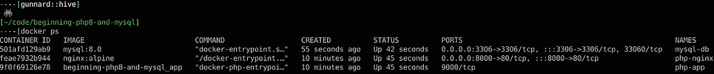

# 10. PHP 与 MySQL 协同工作

到目前为止，你已经看到 PHP 功能强大且易于操作和显示数据。那么这些数据从何而来？PHP 可以使用两种类型的数据：静态数据和动态数据。我们可以将静态数据视为不变的数据，而动态数据则是可变化的数据。这种动态数据存储在数据库中。简单来说，数据库是一种结构化的数据组织方式。可以把它想象成一个包含多个电子表格的文件夹。然而，数据库的关键在于，我们可以根据已建立的结构轻松地搜索或查询数据库。这些查询可以从简单的“显示所有用户的名字”，到复杂的“显示所有在星期二下午 2 点后注册的用户的名字”。查询的复杂性源于 MySQL 中的 SQL（结构化查询语言）。一旦理解了这种语言，就可以在 PHP 中采用类似填词游戏的方式来使用它。我们只需将特定的单词和短语替换为 PHP 变量，从而动态地影响查询结果。

当然，本章将从基础开始，让 PHP 能够与 MySQL 进行通信。

本章包含以下部分：

* PHP 与 MySQL 的通信

* MySQLi 的优势

* PHP 与数据库的连接

## PHP 与 MySQL 的通信

正如你之前所见，PHP 需要 Web 服务器才能在 Web 上运行。MySQL 也是如此。运行和维护数据库需要一个数据库服务器（DB）。在你的 Docker 开发环境中，这已经配置好了。使用 Docker，你可以在宿主机（你正在使用的实际物理机器）上随时输入 `docker ps` 来查看正在运行的 Docker 容器，如图 10-1 所示。

### 运行中的 Docker 容器



最上方一行是 `mysql:8.0` 的**镜像**，最右侧是容器名称 `mysql-db`。为了让 PHP 能够使用 MySQL，你首先需要连接到数据库。PHP 提供了两种不同的方法：通过 `MySQLi` 和 `PDO` API。以下是两种方法的代码示例。

### PHP 通过 MySQLi 方法通信

```php
$mysqli = new mysqli("db.mysite.com", "user", "password", "database");
$result = $mysqli->query("SELECT 'message' AS theMessage FROM 'messages'");
$row = $result->fetch_assoc();
echo $row['theMessage'];
```

暂时不深入细节，至少在这些示例的上下文中，我们不妨对其进行分解，看看你正在做什么以及为什么这样做。

在第一个 `MySQLi` 示例中，应该有一些一眼就能认出的醒目元素。

```php
$mysqli = new mysqli("db.mysite.com", "user", "password", "database");
```

你有一个 `$mysqli`，这是一个 PHP 变量，被设置为带有若干参数的 `new mysqli`。由此可以推断，`mysqli` 是一个类，而 `$mysqli` 在创建后将会成为一个对象。暂且不需要用谷歌搜索答案，看看你是否能推断出这些类构造函数的参数含义。第一个参数是 `"db.mysite.com"`。子域名中的 `db` 代表数据库，因此合乎逻辑的猜测是，第一个参数就是数据库服务器。接下来的几个参数很直观：`"user"` 是用户名，`"password"` 是你通过 PHP 连接时所用用户的密码。最后一个参数 `"database"` 自然就是数据库的名称了。要创建一个有效的 `MySQLi` 连接，这四个参数是必需的。它们可以直接输入，就像此示例中那样；或者你也可以使用变量，例如 `$dbServer`、`$dbUser`、`$dbPass` 和 `$dbName`，并将它们存储在一个单独的文件中，以便自己管理。在 PHP 应用中，后一种情况很常见。

下一行代码是：

```php
$result = $mysqli->query("SELECT 'message' AS theMessage FROM 'messages'");
```

这将 `$result` 设置为 `$mysqli` 对象的 `query` 方法执行后的结果。你看到的语法形式是 `$mysqli->query`。传入的属性组成了你希望发送给 MySQL 的实际查询语句。关于这些查询，我们稍后再详谈。

再下一行是：

```php
$row = $result->fetch_assoc();
```

这行代码将 `$row` 变量设置为 `$result` 对象在运行 `fetch_assoc()` 方法后的值。执行查询后，你可以一次性从服务器获取所有结果，也可以逐行获取。为了节省服务器资源，你希望一次性获取所有数据。这样一来，你可以用 PHP 按需消费和解析数据，而无需不必要地打扰数据库服务器。`fetch_assoc()` 方法是 MySQL 可用方法集合中的一个。这些方法包括：

- `mysqli_fetch_assoc()` - 将结果行作为关联数组获取。

- `mysqli_fetch_array()` - 将结果行作为关联数组、数值数组或两者兼有地获取。

- `mysqli_fetch_row()` - 将结果行作为枚举数组获取。

- `mysqli_fetch_object()` - 将结果集的当前行作为对象返回。

在我们的示例中，`$row` 是一个包含关联值（即数组的键值）的数组。这不同于带有数字键的传统数组：

```php
$row['firstname'] vs $row[0]
```

`firstname` 是关联键值，用于关联数据库中的 `firstname` 列。现在，变量 `$row` 被设置为包含从数据库查询到的数据的一个或多个行。

下一行是：

```php
echo $row['_message'];
```

这里使用 `echo` 来输出变量 `$row` 经过 `htmlentities` PHP 函数处理后的结果，具体是数组中 `['_message']` 标识符对应的数据。这正是你查询的具体数据。

### PHP 通过 PDO 方法通信

现在我们来看看 `PDO` 版本有何不同。

```php
$pdo = new PDO('mysql:host=localhost;dbname=myDatabase', 'user', 'password');
$statement = $pdo->query("SELECT 'message' AS theMessage FROM 'messages'");
$row = $statement->fetch(PDO::FETCH_ASSOC);
echo $row['theMessage'];
```

第一行是：

```php
$pdo = new PDO('mysql:host=localhost;dbname=myDatabase', 'user', 'password');
```

这里你从 `PDO` 类创建了一个名为 `$pdo` 的新对象，其构造函数传入的参数结构与之前的类似，用于传递数据库主机、数据库名、用户名和密码。

下一行是：

```php
$statement = $pdo->query("SELECT 'message' AS theMessage FROM 'messages'");
```

这里你以类似的方式，通过 `$pdo` 对象的 `query` 方法设置了 `$statement`。再下一行是：

```php
$row = $statement->fetch(PDO::FETCH_ASSOC);
```

与 `MySQLi` 类似，数据被获取到一个关联数组中。

最后一行是：

```php
echo $row['_message'];
```

它简单地输出来自数据库的结果数据。

那么现在你已经知道如何以**两种**不同的方式连接 MySQL 了，该用哪一种呢？实际上，这两种方式在性能上**并没有**太大的差别。PHP.net 的文档指出：“性能差异低至 0.1%。”以下是 `MySQLi` 和 `PDO` 之间的一些关键优势。

#### MySQLi 的优势

- 异步查询

- 能够获取受影响行的更多信息

- 正确的数据库关闭方法

- 一次性执行多条查询

- 持久连接自动清理

#### PDO 的优势

- 有用的获取模式

- 允许直接在 `execute` 中传递变量和值

- 能够自动检测变量类型

- 预处理语句可选择自动缓冲结果

- 命名参数

真正的区别在于使用 MySQL 或 MariaDB 之外的数据库系统时。`PDO` 支持 12 种数据库类型，而 `MySQLi` 只处理 MySQL 特有的功能。由于你使用的是 MySQL 8.0，并且只想使用这些函数，因此你使用 `MySQLi`。

### PHP 连接数据库

现在让我们创建一个连接并测试你的数据库。首先，访问 `http://localhost/chapter4/seedDB.php`。你看到下面这些内容了吗？

**警告**

`mysqli::__construct(): (HY000/2002): No such file or directory in /var/www/chapter4/seedDB.php on line 4`

`Fatal error: Uncaught Error: mysqli object is already closed in /var/www/chapter4/seedDB.php:6 Stack trace: #0 /var/www/chapter4/seedDB.php(6): mysqli->query('Select * from u...') #1 {main} thrown in /var/www/chapter4/seedDB.php on line 6`

嗯，一定是某些地方配置不正确。错误信息指出 `seedDB.php` 的第四行有问题。我们去看看。

第四行是 `$mysqli = new mysqli` 这一行。在我看来这行没问题，所以问题一定出在 `mysqli` 构造函数中使用的变量上。正如你在第三行看到的，这些变量是从 `db.php` 文件中读取的。我们打开那个文件。

啊哈！看这里！在第二行，`$DB_HOST` 被设置为 `''`，而不是一个实际的主机名。如果你还记得，你的主机名应该是 `db`。让我们把空字符串替换成 `db`。

好了。如果你保存文件并重新加载 `http://localhost/chapter4/seedDB.php`，你应该会看到一些更好的结果。

```
Creating table "USERS"...
Seeing Users into table..1..2..3
Users added
1 - tom - hanks - 2021-06-25 17:58:42
2 - billy - mitchell - 2021-06-25 17:58:42
3 - mega - man - 2021-06-25 17:58:42
```

当你开发应用程序时，手头有一些虚拟数据以便适当测试代码是很好的做法。获取数据（虚拟数据或生产环境中的实际数据）并将其填充到数据库中的过程称为*数据填充*（seeding）。此处你正在填充数据库 `beginningPGP`，特别是 `users` 表，填充了三行用户信息。在这个案例中，你使用了一个包含数据的简单 `.sql` 文件。在像 Laravel 这样的大型框架中，这是通过迁移和一个名为 `artisan` 的程序完成的。这不仅让你能用数据填充数据库，还能让你的开发团队通过允许像在 `git`（版本控制）中访问代码一样访问这些迁移，从而在数据方面保持一致。运行此页面后，请按刷新。会发生什么？代码首先检查表是否存在，如果已存在，则不会填充用户信息。让我们编写一些代码来显示这个表中的用户。

打开 `chapter4` 文件夹中的 `showUsers.php`。

```php
<?php

require 'db.php';

$mysqli = new mysqli($DB_HOST, $DB_USER, $DB_PASS, $DB_DATABASE);

$query = "SELECT * FROM users";

$result = $mysqli->query($query);

if ($result) {

    echo 'Users in Database';

    while ($row = $result->fetch_assoc()) {

        echo "Name: {$row['first_name']} {$row['last_name']} = Created: {$row['created']} ";

    }

} else {

    echo "No Results. Have you run SeedDB?";

}

?>
```

让我们逐行分析这段代码。

这是 PHP 文件的标准开头。你首先需要加载 `db.php` 文件。记住，这会为你的数据库主机、用户名、密码和数据库名称设置变量。

```php
$mysqli = new mysqli($DB_HOST, $DB_USER, $DB_PASS, $DB_DATABASE);

$query = "SELECT * FROM users";

$result = $mysqli->query($query);
```

在这里，你使用 `$mysqli` 对象及其 `query` 方法将查询提交给数据库。结果将被设置为变量 `$result`。

```php
if ($result) {

    echo 'Users in Database';

    while ($row = $result->fetch_assoc()) {

        echo "Name: {$row['first_name']} {$row['last_name']} = Created: {$row['created']} ";

    }

} else {

    echo "No Results. Have you run SeedDB?";

}
```

这段代码看起来可能很复杂，但你只是在执行一些（对人类来说）非常基本的逻辑。在编程语言中，这种“对人类显而易见”的逻辑需要精确的逻辑处理，以确保你考虑到所有情况并避免错误。`if ($result)` 是 PHP 在检查 `$result` 是否计算为任何“真值”（truthy value）。这可以是：

*   布尔值 `TRUE`
*   非空值
*   非 `NULL` 值
*   非零数字

你基本上是在询问是否找到并返回了任何有用的数据。你将在下面几行处理未返回任何数据的情况。首先，让我们处理已有的数据。

```php
    echo 'Users in Database';

    while ($row = $result->fetch_assoc()) {

        echo "Name: {$row['first_name']} {$row['last_name']} = Created: {$row['created']} ";

    }
```

这里，你使用 HTML 的 `<h1>` 标签为页面输出一个标题。然后你开始一个 `while` 循环，PHP 会从头到尾循环，直到满足指定条件。你可以将其理解为“当交通灯是绿色时，继续开车”或“当意大利面没煮熟时，继续煮”。一旦这两个条件中的任何一个发生变化（交通灯变红或意大利面煮熟），循环就会停止。在你的代码中，你是在说“当 `$row` 等于从数据库作为关联数组获取的数据时，运行循环”。你的循环很简单，它一次一行地从数据库输出结果。一旦 `$row` 不再等于来自数据库的数据，或者数据库完成数据返回，这个循环就会停止。

```php
} else {

    echo "No Results. Have you run SeedDB?";

}
```

这个 `else` 对应于上面的 `if ($results)`。这是当 `$result` 返回为空时发生的情况。当这种情况发生时，你想向用户返回一些有用的错误信息，而不是标准的 MySQL 或 PHP 错误。攻击者可能会利用这些类型的错误来对付你。这里你向用户输出提示，可能数据库是空的，他们可能需要运行你之前运行的 `seedDB` 文件，以便将数据放入数据库。

这里你看到了使用 MySQLi（相对于 PDO）将 PHP 连接到数据库，产生了一个名为 `$mysqli` 的数据库对象。你想要从数据库的 `users` 表中选择所有内容，因此你使用了查询 `SELECT * FROM users`。`SELECT` 告诉 MySQL 你正在请求数据。`*` 表示所有内容。`FROM` 告诉 MySQL 你希望从哪里获取这些数据，预期下一个词会给出位置。最后，`users` 是你要从中获取数据的表。这是你可以在 MySQL 中执行的最通用的查询之一。让我们稍微修改一下。如果你想按姓氏字母顺序检索名称列表该怎么办？修改查询并运行：

```php
$query = "SELECT * FROM users ORDER by last_name ASC"
```

这段代码也可以在 `showUsers2.php` 中找到。

这个查询看起来与第一个非常相似，但添加了一些修饰符。在 `users` 之后，你添加了 `ORDER`，它告诉 MySQL 你希望以有序的方式返回数据。此时，你还没有告诉 MySQL 其他任何信息。要使 MySQL 能够对这些结果排序，你需要两个因素。首先，你需要告诉 MySQL 你想要对哪一列数据进行排序。目前，你有 `id`、`first_name`、`last_name` 和 `created`。在你的查询中，你使用了 `ORDERED by last_name`，这满足了第一个要求，但现在你需要告诉 MySQL 排序顺序。有两个主要选项：升序（`ASC`）或降序（`DESC`）。在处理像姓氏这样的字符串时，升序是 A-Z，因为 `a` 的数值小于 `z`，所以这被认为是升序。反之是 `DESC`，即 Z-A。如果你现在运行这段代码，你应该会看到如下输出：

```
Users in Database
```

Name: tom hanks = Created: 2021-06-28 14:17:45

Name: mega man = Created: 2021-06-28 14:17:45

Name: billy mitchell = Created: 2021-06-28 14:17:45

另一个有用的查询修饰符是`LIMIT`。例如，假设这个数据库中有成千上万的用户，但你只想要按分数排序的前三名。这个查询看起来像下面这样（也可以在`showUSers3.php`中找到）：

```php
$query = "SELECT * FROM users ORDER by score DESC LIMIT 3";
```

到目前为止，你已经通过`SELECT`查询从数据库中读取了数据。在网站后端使用数据库的目的是为了既能读取数据也能存储数据。这就是照片如何出现在 Instagram 上，以及推文如何进入推特世界的方式。用户可以将他们的推文（数据）发送到数据库，在那里它被存储在一个表中，并为其关联的列分配特定的值。让我们向数据库添加另一个用户，你将看到这是如何工作的。你将使用 PHP MySQL 预处理语句。使用预处理语句的好处是双重的：

1.  在多次查询迭代中，尽管查询运行了多次，但解析时间减少了，因此结果是查询以高效率执行。
2.  PHP MySQL 预处理语句对于防止 SQL 注入非常有用。

打开`addUser.php`，让我们分解它。

```php
<?php

require 'db.php';

$mysqli = new mysqli($DB_HOST, $DB_USER, $DB_PASS, $DB_DATABASE);

$query = $mysqli->prepare("INSERT INTO users (first_name, last_name, age, score) values (?,?,?,?)");

$query->bind_param("ssii",$firstName, $lastName, $age, $score);

$firstName = "Freddy";

$lastName = "Krueger";

$age = 40;

$score = 301;

$query->execute();

$mysqli->close();

?>
```

前几行在这一点上应该看起来很熟悉。这就是你引入存储在`db.php`中的数据库变量，并从`mysqli`类创建一个名为`$mysqli`的对象的地方。

```php
$query = $mysqli->prepare("INSERT INTO users (first_name, last_name, age, score) values (?,?,?,?)");
```

这一行看起来熟悉但大不相同。这是你的 `INSERT` 查询，你正在创建它以便用作预处理语句。

```php
$query = $mysqli->prepare
```

这里你创建了一个名为 `$query` 的变量，它是从 `$mysqli` 对象调用 `prepare` 方法得到的结果。`prepare` 方法接收你希望在 MySQL 中运行的查询，但允许你绑定参数，从而减少服务器带宽占用，因为每次只发送参数，而不是整个查询。该查询使用了动词 `INSERT`，其结构如下：

```
INSERT INTO (column1, column2, column3, ...) VALUES (Value1, value2, value3, ...);
```

你使用 `users` 表的列结构来插入 `first_name`、`last_name`、`age` 和 `score` 的值。但值在哪里？只有问号（`?`）。这就是绑定元素。MySQL 会识别这些问号，并为后续需要赋值的指定数量参数预留空间；在你的代码中，这发生在下一行。

```php
$query->bind_param("ssii",$firstName, $lastName, $age, $score);
```

这段代码使用了你之前创建的 `$query` 对象，这次你调用了 `bind_param` 方法，它接收两组参数。在你的示例中，第一组参数（`"ssii"`）是你所绑定参数的类型列表。你使用的 `"ssii"` 代表“字符串、字符串、整数、整数”，分别对应 `first_name`、`last_name`、`age`、`score`。MySQL 支持四种类型：

- `i`：整数（例如 `1`、`199`、`4421`）

- `d`：双精度浮点数（例如用 `1.0e6` 表示一百万）

- `s`：字符串（例如 `"pants"`、`"Bananas"`）

- `b`：BLOB（二进制大对象，是一种可变长度的二进制字符串，最长可达 2,147,483,647 个字符）

既然你已经告诉了 MySQL 期望的参数类型，接下来就列出你将使用的变量。

```php
$firstName = "Freddy";
$lastName = "Krueger";
$age = 40;
$score = 301;
```

现在，你为之前已告知 MySQL 将在查询中使用的变量赋值：两个字符串和两个整数，与你用 `"ssii"` 声明的一致。

```php
$query->execute();
$mysqli->close();
```

最后，你通过调用 `$query` 对象的 `execute` 方法来执行查询，然后关闭与 MySQL 的连接。访问 `http://localhost/chapter4/addUser.php`，再返回 `http://localhost/chapter4/showUser.php` 查看结果。你应该会在表中看到一个新增用户。如果你多次刷新 `addUser`，表格中会多次添加用户。现在你已经掌握了一些与 MySQL 交互的基本技巧，下一章你将更深入地学习更复杂的查询、数据组织以及 MySQL 的特性。

## 总结

在本章中，你学习了使用 PHP 和 MySQL 的基础知识。首先，你学习了如何使用 `MySQLi` 和 `PDO` 这两种方法连接数据库。你了解了使用一种方法相对于另一种方法的优势。最后，你探索了连接数据库并展示其中用户所需的代码。在下一章中，你将学习更多关于 MySQL 数据库表中可使用的数据类型，如 `CHAR` 和 `VARCHAR`，以及如何在查询中定义多重依赖关系。