# 13. 框架介绍

在学习了前面章节如何构建网站之后，本章将重点介绍编程开发框架。您将了解它们是什么以及何时使用它们。

本章包括以下部分：

- 框架介绍
- 框架的优缺点
- MVC 模式
- 框架的不同层次
- 不同类型的框架
- PHP 标准建议（PSR）介绍
- PHP 框架


## 框架简介

到目前为止，你已经构建了一个应用的不同层级：用于解析值并显示视图页面的 UI 组件、连接数据库并获取数据、对用户进行身份验证以及维护会话。如果你留意观察，会发现这些上下文区域是基于不同用例，在每个项目或应用中都会用到的可复用结构和元素。它们具有结构性价值，但在帮助开发者和团队开发新功能与业务逻辑方面，并不能增加额外价值。认识到这些常见结构元素的重复性后，许多聪明人认为可以将它们开发并打包在一起，使这些结构能够相互对接并被复用。本质上，他们创建了一个**框架**，这是一种支持性结构，能帮助你快速开始开发应用，从而交付业务价值，而无需将时间花费在开发会话层、数据库连接层，然后再开发安全组件上。

框架运用了大量最佳实践和设计模式，使开发者能够快速使用它们来解决问题。既然如此，你是否应该为自己的用例构建一个框架？这可能没有必要，因为如今所有框架都提供了一种安装你可能需要但框架内尚未包含的任何包的方式。它们还允许你通过扩展框架或插件系统来构建自定义层。如果它们是开源的，当有需要时，你可以进行分支（fork）操作，并利用现有框架的基础进行扩展构建。

## 框架的优缺点

框架有很多优点，但也并非没有缺点。在本节中，你将探讨其优缺点。

### 使用框架的优点

使用框架有许多益处：

1. **加速应用开发**

   框架帮助你专注于处理新功能/需求，而不是构建可复用的模式以及测试框架、身份验证和授权流程。这节省了大量时间，因为无需再去构建一个安全、标准的代码库基础，而框架已经提供了这一点。

2. **简化应用维护**

   由于核心基础由框架团队维护，开发团队可以轻松维护应用功能，并定期升级核心框架。

3. **解耦模式**

   框架预先加载了多种模式，这些模式类似于解耦的系统设计，例如在各种消息队列平台之上提供一个消息队列抽象层，从而提供了先进且本需由开发者自行开发的编码结构。

4. **更新补丁**

   框架由大量的内部以及基于社区的开源开发者、QA 工程师和其他聪明人共同构建和维护，他们负责处理变更、升级包、在相关时集成新功能，以及修补安全问题。凭借这样一个社区团队的知识，只需通过版本升级就能轻松获得这些变更。

5. **任务自动化**

   框架提供了命令行工具，用于为新功能（如单元测试用例或具有标准结构的控制器）创建基础代码，然后你可以根据应用的具体需求对其进行修改。这使得快速构建原型和组件变得非常容易。

### 使用框架的缺点

如前所述，框架确实存在一些潜在缺点：

1. **应用性能受到影响。**

   框架包含了大量用于基础结构的代码，这有助于快速启动你的项目。另一方面，这会带来性能损失，因为许多组件可能不适用于你的项目，但在打包和运行时仍会被加载。

2. **缺乏支持或活跃开发**


一个框架可能当前正处于活跃的开发周期中，但未来情况可能会发生变化。因此，审视框架团队、开发工作及其相关活动的历史与当前模式至关重要。

#### 3. 学习曲线

学习框架既有趣又充满挑战。有些框架非常直观，而另一些则在开始前需要大量配置工作。由于拥有众多基础和高级组件及概念，学习一个框架需要开发团队投入大量时间。

### MVC 模式

`MVC` 代表模型（Model）、视图（View）和控制器（Controller）模式。这是一种非常实用且高效的设计模式，许多框架都利用它来实现关注点分离。在之前的章节中，你将代码分为了用户界面、路由、处理和业务逻辑层。同样，框架也将代码分离到这些逻辑结构中，并通过许多标准化、演进和安全的实践，允许它们之间进行集成和控制流。

如图 13-1 所示，当 PHP 服务器收到任何请求时，它首先到达控制器，控制器通常是负责定义 `GET`、`POST` 及其他基于 REST 动词的 API 端点的路由层。各个端点的控制器函数接收请求，然后调用模型层来获取数据，或在从其他服务获取数据后执行业务逻辑。控制器收到这些数据后，将其发送到视图层，视图层包含你的 UI 代码，并根据发送过来的模型数据生成动态 UI。视图层处理完毕后，结果会作为响应发送回浏览器或用户。

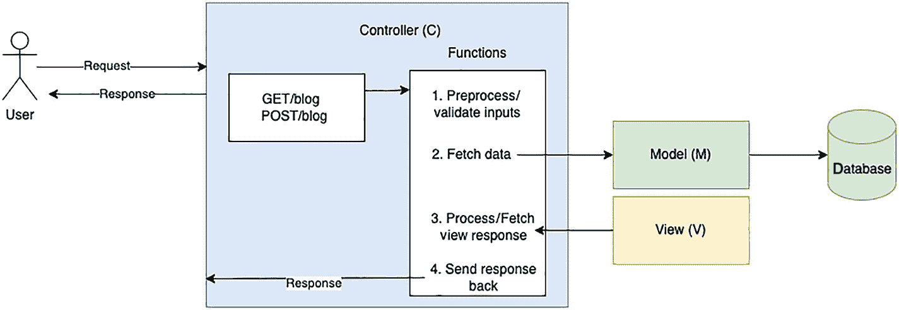

**图 13-1** 模型-视图-控制器架构

### 框架的不同层级

1.  **MVC 层**  
    所有主流框架都使用某种变体的 `MVC` 模式作为核心结构组件来管理请求和控制流。

2.  **依赖注入**  
    由于存在许多核心组件，例如认证/授权/实体访问，通过动态注入而非在每次使用这些实体/组件的文件中进行初始化，来实现对这些组件访问的集中式逻辑变得至关重要，从而实现了复用和可管理性。

3.  **认证/授权**  
    认证/授权允许开发者通过标准化实践来验证用户并实现授权，并且在许多情况下，还允许集成到 Active Directory 和其他第三方服务中。

4.  **会话管理**  
    会话管理有助于在用户登录后对其进行验证。在许多情况下，这是通过使用 `JWT` 和其他标准的基于令牌的认证来实现的。

5.  **数据库库**  
    框架提供的数据库库可以连接到多种数据库。

6.  **测试框架**  
    框架还提供测试框架，用于编写单元测试、功能测试和集成测试。这些测试有助于模拟和存根内部组件，从而让开发者能够实践基于 TDD 的设计开发。

7.  **包管理**  
    `Composer` 是库管理的核心，它允许跨框架重用许多标准库，从而有助于实现框架之间的互操作性。

8.  **其他**  
    还有许多其他组件，如防护栏、消息队列管理和缓存，它们都是核心组件的一部分。

### 不同类型的框架

下面我们快速浏览一些可供 PHP 开发者使用的不同框架。

基于用例分类：

1.  **基于 REST API 的框架**  
    如今许多后端应用只提供一个 RESTful 接口，供基于 React、Angular 或其他前端库/框架构建的前端应用访问。因此，许多框架都提供了开箱即用的解决方案来创建 REST API 后端。  
    示例：`Lumen`， `Silex`， `Slim`， `Guzzle`， `Symfony`

2.  **基于全栈的框架**


## PHP 框架与标准

这些框架集成了部分 UI 组件，使你能够在平台内直接开发 UI 代码。

例如：Laravel、CakePHP、CodeIgniter、Laminas

基于初始打包的组件：

### 微框架

这些框架为你提供最基本的起点和指导方针。它们非常轻量。你可以根据具体用例选择不同的包和设计模式。这需要你付出额外的努力并具备相应的知识来构建这些模式。

例如：Slim

### 全栈框架

这些框架功能强大。在很多情况下，你可能并不需要某些包，但它们在部署应用时仍会被包含在内。缺点是框架体积庞大，但对于团队使用既定的模式和风格来说很有帮助。

例如：Laravel

### Composer 的作用

随着众多框架的出现，集成不同 API 所需的第三方库也日益增多。这些库可以通过扩展并遵循框架特定的方法集成到框架中。这可能会相当繁琐，因为你需要深入了解框架内部机制以及外部 API。此外，在此过程中你还必须处理标准、最佳实践和安全问题。而这并非开发者的核心职责。因此，PHP 引入了一个包管理器，用于安装由社区和第三方供应商创建的第三方包和库。借助它，开发者可以重用这些库，并在源团队发布更新时及时获取。这有助于在不同框架中使用版本化的库。

链接：[`https://getcomposer.org/`](https://getcomposer.org/)

安装 Composer 非常简单。只需在 [`https://getcomposer.org/download/`](https://getcomposer.org/download/) 执行这几条命令即可。

所有 PHP 框架都使用 Composer 管理内部依赖。因此，它们都预先打包了 Composer 配置，并且可以进行扩展。

使用 Composer 时，会生成一个 `composer.json` 文件，该文件以 JSON 格式存储所有已安装的包及其对应版本。

### PHP 标准建议 (PSR) 介绍

随着众多 PHP 框架的出现以及 Composer 用于包管理，为了简化开发者使用不同框架的流程并实现互操作性，需要制定一个所有框架都应遵循的共同标准。这促成了 PHP 标准建议 (PSR) 的诞生，它是由 PHP 框架互操作性小组 (PHP-FIG) 发布的 PHP 规范，旨在实现 PHP 编程概念的标准化。

其目标是实现组件和包之间的互操作性。PHP-FIG 由多位 PHP 框架创始人共同建立。其核心理念是“通过协作和标准推动 PHP 向前发展”。

完整的标准列表可在 [`www.php-fig.org/psr/#numerical-index`](http://www.php-fig.org/psr/#numerical-index) 找到。其中一些已弃用，一些处于草案状态。当前活跃的标准可在 [`www.php-fig.org/psr/#index-by-status`](http://www.php-fig.org/psr/#index-by-status) 找到。

以下是 PSR 的几个主要领域：

#### 自动加载

自动加载通过将命名空间解析到对应的文件系统路径，帮助加载类和库。

相关 PSR：PSR-4 改进版自动加载

#### 接口

接口有助于在可共享的代码结构之间建立契约。

相关 PSR：

- PSR-3：日志记录器接口
- PSR-6：缓存接口
- PSR-11：容器接口
- PSR-13：超媒体链接
- PSR-14：事件调度器
- PSR-16：简单缓存

#### HTTP

一种基于标准的方法，用于处理 HTTP 请求和响应。

相关 PSR：

- PSR-7：HTTP 消息接口
- PSR-15：HTTP 处理器
- PSR-17：HTTP 工厂
- PSR-18：HTTP 客户端


#### 编码风格

旨在减少认知摩擦并提升可读性的编码规范。

## 相关 PSR 标准

- `PER 编码风格`
- `PSR-1：基础编码标准`
- `PSR-12：扩展编码风格指南`

## PHP 框架

以下是一些流行且广泛使用的 PHP 框架。你将在后续章节中使用其中的几个。

- Laravel, [`https://laravel.com/`](https://laravel.com/)
- [Codeigniter](https://www.codeigniter.com/), [`www.codeigniter.com/`](http://www.codeigniter.com/)
- [Symfony](https://symfony.com/), [`https://symfony.com/`](https://symfony.com/)
- [Cakephp](https://cakephp.org/), [`https://cakephp.org/`](https://cakephp.org/)
- [Laminas](https://getlaminas.org/), [`https://getlaminas.org/`](https://getlaminas.org/)

## 如何选择框架

面对众多可用的框架，可能会感到有些困惑。如何选择合适的框架？以下几点值得考虑：

1. **应用/业务用例的兼容性**  
   存在多种应用场景，每个应用的需求都独具特色。有些应用更侧重于内容管理。例如，管理团队博客时，WordPress 可能更合适。而在另一种情况下，团队可能需要构建一个 RESTful 应用，此时 Lumen 或类似的框架或许更有帮助。

2. **开发者的技能组合**  
   开发团队的核心技能组合也起着关键作用。如果团队已经熟悉某个特定框架或某个框架特有的设计模式，那么复用现有技能集将非常容易。

3. **学习曲线**  
   项目的时间线在选择框架时扮演着重要角色。选择一个具有合适学习曲线的框架，以便你能快速开始构建项目。

4. **文档质量**  
   文档至关重要。一个缺乏良好文档的框架，如同在没有地图的森林中徘徊。优秀的文档能让开发者充满信心地快速进行试验，并随后深入探索。

5. **测试框架**  
   一个框架应集成本身可用于编写集成测试、功能测试和单元测试的测试框架。许多框架提供了便捷的测试集成方式，并有助于模拟框架的内部功能，以便轻松快速地运行单元测试。

6. **社区支持**  
   在 Stack Overflow 等不同论坛上，来自内部、外部和开源社区的活跃支持与问题解答，是衡量框架用户群体活跃度以及开发者能否获得帮助的良好指标，这有助于增强开发团队的信心。

7. **持续发布与开发**  
   一个积极开发、并定期进行安全更新和错误修复的框架，能增强人们对该产品未来能得到长期支持的信心。

8. **许可证**  
   仔细审查框架在代码共享、编辑、开源性质以及生产使用方面的许可证细节是至关重要的。

9. **可定制性与可扩展性**  
   框架根据应用需求定制和扩展核心功能以支持独特扩展的能力非常重要。

10. **约定优于配置 vs. 定制化**  
    在“约定优于配置”和“定制化”之间总需要做出选择。有些框架严格遵守约定的规则，旨在简化设置并帮助项目快速启动；而另一些框架则选择更开放的结构，允许你根据自己的喜好和应用结构进行定制。

11. **IDE 支持**  
    如今，许多流行的 IDE 都至关重要，它们应支持通过快捷键生成代码片段，而非复制粘贴，以此来提高开发者的生产效率。

12. **博客与教程**  
    许多框架会提供自家的博客和教程，以利用核心开源社区团队的专业知识。它们还会通过新闻频道、公告和邮件列表等方式，定期发布新资源、新功能和新用例。

13. **测试覆盖率**  
    验证核心框架是否拥有完整的测试覆盖率非常重要。这体现了核心团队遵循 TDD（测试驱动开发）实践的重要性，同时也是衡量核心框架质量的一个指标。

## 总结

在本章中，你了解了为什么框架是软件开发生命周期中的重要组成部分。它们允许开发者复用框架的现有组件，快速开始构建新功能和进行创新，从而使开发者的工作更加轻松、更具趣味性。你探索了选择框架为何至关重要，必须综合考虑多个关键点以及待构建的应用本身。

在下一章中，你将重点关注 Laravel PHP 框架，这是一个非常流行的、易于使用且语法优雅的 Web 应用框架。

## Laravel 简介

近来，随着开发者使用各种开发工具，Web 应用和网站的构建变得越来越简单。让我们探索一下，当构建新的 Web 项目和应用程序时，哪个 PHP 框架能为 Web 开发者提供最好的支持。

在本章中，你将重点关注 Laravel PHP 框架。这是一个非常流行的 Web 应用框架，它易于使用且提供了优雅的语法。它能帮助你处理诸如快速路由引擎、实时事件广播、独立于数据库的架构迁移等常见任务。

本章包含以下小节：

- Laravel 简介
- 安装 Laravel
- 数据库设置与配置
- 数据库迁移
- 控制器路由
- 注册视图表单
- 将用户数据存储到数据库

## Laravel 简介

Laravel 是一个基于 MVC 设计模式的现代 PHP 框架。官网上的描述最能说明其特点：*“Laravel 是一个具有表现力、优雅语法的 Web 应用程序框架。我们已经为你打好了基础——让你能够自由创造，无需为琐事操心。”*

## 安装 Laravel

安装 Laravel 有多种方法。你可以在[`https://laravel.com/docs/9.x/installation#your-first-laravel-project`](https://laravel.com/docs/9.x/installation#your-first-laravel-project)找到相关说明。

你将按照最简单的方法来启动并运行。请确保在继续操作前已安装以下必备工具：

- `PHP`
- `Composer`

要启动一个名为 `blog-app` 的新项目，请运行以下命令：

```
composer create-project laravel/laravel blog-app
```

项目结构如图 14-1 所示（不含 `.git` 目录）。

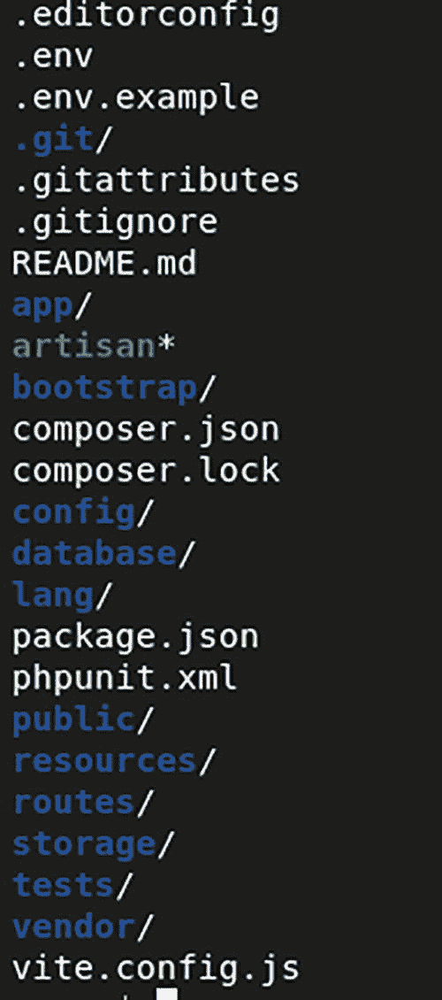

**图 14-1** Laravel 项目目录结构

让我们探索一下目录的常见部分。

项目创建完成后，使用以下命令启动它：

```
cd blog-app
php artisan serve
```

现在，你可以通过 `http://localhost:8000` 访问该应用，如图 14-2 所示。

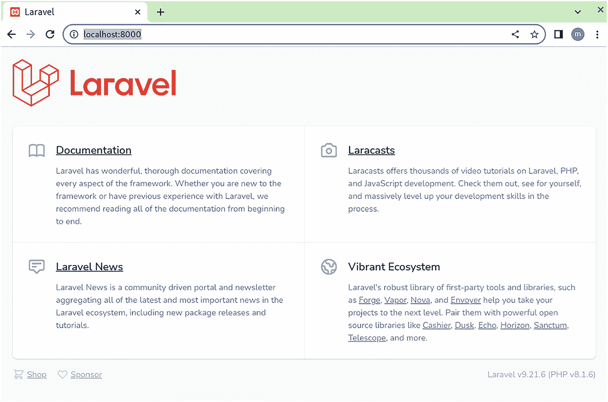

**图 14-2** Laravel 主网页

这应该能确认 Laravel 已成功安装和设置。


#### 数据库设置与配置

你将在构建博客应用的一个子模块——用户注册功能的过程中，了解 Laravel 的各种组件。在此过程中，你将看到 Laravel 如何简化此类应用的构建流程。

任何应用的核心都是数据，你需要一个数据库来存储与用户相关的数据。在逐步推进不同步骤时，你将采用递增方式创建数据表。在前面的章节中，你通过 phpMyAdmin 界面手动创建了数据库和数据表。这种方式在演示项目中通常可行，但在生产项目中，建议通过迁移（migrations）来维护数据库和数据表——这些迁移内容存储在文件中，并可提交到诸如 `git` 之类的源代码管理系统。这有助于实现可重复的数据结构，便于其他团队成员快速上手并搭建项目，同时也能为开发、预发和生产等不同运行环境创建对应的数据库环境。另一个好处是，通过版本化的数据库及数据表结构，你可以理解并维护变更历史，便于审计等其他目的。

在开始设置 Laravel 的迁移功能之前，必须先配置数据库连接参数。这些参数可以在 `config/database.php` 文件中找到。我们来查看一下这个文件的内容。

```
'default' => env('DB_CONNECTION', 'mysql'),
```

默认连接使用 `mysql` 适配器，这符合你的环境配置。查看 `connections` 部分，你可以看到针对 `mysql` 连接的具体配置。

```
'connections' => [
'sqlite' => [
...
],
'mysql' => [
'driver' => 'mysql',
'url' => env('DATABASE_URL'),
'host' => env('DB_HOST', '127.0.0.1'),
'port' => env('DB_PORT', '3306'),
'database' => env('DB_DATABASE', ''),
'username' => env('DB_USERNAME', 'root'),
'password' => env('DB_PASSWORD', ),
'unix_socket' => env('DB_SOCKET', ''),
'charset' => 'utf8mb4',
'collation' => 'utf8mb4_unicode_ci',
'prefix' => '',
'prefix_indexes' => true,
'strict' => true,
'engine' => null,
'options' => extension_loaded('pdo_mysql') ? array_filter([
PDO::MYSQL_ATTR_SSL_CA => env('MYSQL_ATTR_SSL_CA'),
]) : [],
],
```

`url`、`host` 和 `port` 的值取自 `.env` 环境文件。这是一种良好实践，而不是在源代码管理中硬编码敏感值。要设置正确的值，请打开项目根目录下的 `.env` 文件。你将看到以下内容：

```
DB_CONNECTION=mysql
DB_HOST=127.0.0.1
DB_PORT=3306
DB_DATABASE=laravel
DB_USERNAME=root
DB_PASSWORD=
```

更新后，请务必通过运行以下命令清除缓存并更新配置缓存：

```
php artisan cache:clear
php artisan config:cache
```

输出结果如图 14-3 所示。

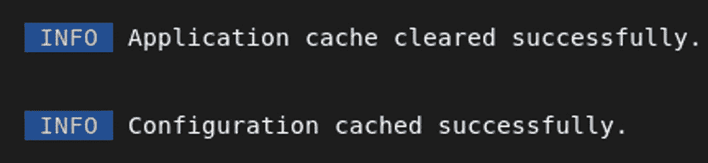

图 14-3 Laravel 缓存清理命令输出

将 `DB_DATABASE` 替换为你博客数据库的名称，并根据你的 MySQL 设置配置 `DB_USERNAME` 和 `DB_PASSWORD`。

#### 数据库迁移

Laravel 提供了一个创建迁移的命令：

```
php artisan make:migration 
```

你将创建一个名为 `users` 的数据表来存储用户数据。运行以下命令来完成此操作：

```
php artisan make:migration create_users_table --create=users --table=users
```

输出结果如图 14-4 所示。


图 14-4 Laravel 数据库表创建

`create` 和 `table` 选项分别表示在数据库中创建表以及指定表名。

运行 `git status` 后，你会看到在 `database/migrations/2022_07_31_095213_create_users_table.php` 位置创建了一个新文件。你的文件名可能与之类似，只是前缀不同（因为它会附加一个时间戳值）。这并不会在数据库中立即创建表。我们来查看一下这个文件的内容。


好的，作为一名高级文档工程师和翻译员，我将严格按照您提供的注意事项和示例格式，将给定的英文文本翻译成中文。


```php
2022_07_31_095213_create_users_table.php
use Illuminate\Database\Migrations\Migration;
use Illuminate\Database\Schema\Blueprint;
use Illuminate\Support\Facades\Schema;
return new class extends Migration
{
/**
* 运行数据库迁移。
*
* @return void
*/
public function up()
{
Schema::create('users', function (Blueprint $table) {
$table->id();
$table->timestamps();
});
}
/**
* 回滚数据库迁移。
*
* @return void
*/
public function down()
{
Schema::dropIfExists('users');
}
};
```

从这个默认模板中，你可以看到两个名为 `up` 和 `down` 的函数。`up` 用于执行迁移中的当前更改，而 `down` 用于撤销这些更改。在 `up` 函数内部，你可以看到 `create` 调用包含了两个字段： `id` 和 `timestamps`。让我们执行迁移，看看数据库中反映出的变化。运行以下命令前，请确保删除 `database/migrations` 目录中可能随初始设置附带的所有现有迁移文件。同时，确保你的 `vendor/laravel/sanctum/database/migrations` 目录也是空的。

```
php artisan migrate
```

输出结果如图 14-5 所示。


图 14-5 Laravel 迁移输出

在 phpMyAdmin 中刷新你的数据表，会显示两个表，如图 14-6 所示。

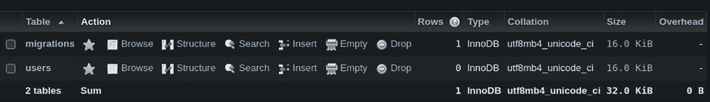

图 14-6 Laravel 数据表刷新输出

`migrations` 表是 Laravel 专用的表，用于跟踪迁移更改。图 14-7 快速展示了 `migrations` 表的结构，其中指定了你刚才执行的一次迁移。

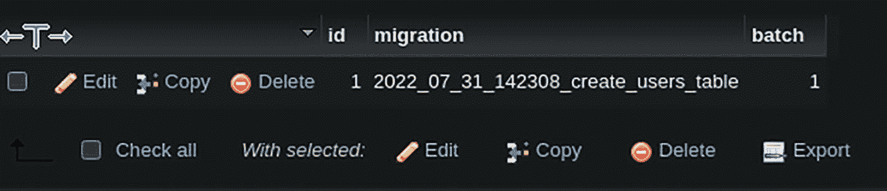

图 14-7 数据表列表

查看图 14-8 所示的 `users` 表结构，你会发现它有一个主键 id 和两个时间戳字段。你可能还需要一些其他字段，比如 name、email 和 password。你将在下一节中添加它们。

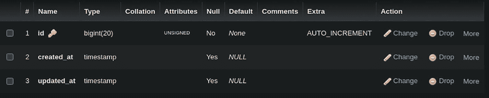

图 14-8 Laravel 数据表结构

创建一个新的迁移文件，具体操作如下：

```
php artisan make:migration update_users_table --table=users
```

输出结果如图 14-9 所示。


图 14-9 新迁移文件

在 `database/migrations` 目录中打开这个新迁移文件，其内容如下所示：

```php
<?php
use Illuminate\Database\Migrations\Migration;
use Illuminate\Database\Schema\Blueprint;
use Illuminate\Support\Facades\Schema;
return new class extends Migration
{
/**
* 运行数据库迁移。
*
* @return void
*/
public function up()
{
Schema::table('users', function (Blueprint $table) {
//
});
}
/**
* 回滚数据库迁移。
*
* @return void
*/
public function down()
{
Schema::table('users', function (Blueprint $table) {
//
});
}
};
```

让我们更新 `up` 方法，以包含你希望在此次迁移中进行的更改，并更新 `down` 方法以包含反向更改，以便在回滚时删除这些更改：

```php
/**
* 运行数据库迁移。
*
* @return void
*/
public function up()
{
Schema::table('users', function (Blueprint $table) {
$table->string('name');
$table->string('email');
$table->string('password');
});
}
public function down()
{
Schema::table('users', function (Blueprint $table) {
$table->dropColumn('name');
$table->dropColumn('email');
$table->dropColumn('password');
});
}
```

现在运行迁移：

```
php artisan migrate
```

输出结果如图 14-10 所示。

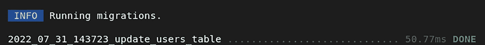

图 14-10 Laravel 迁移输出

重新查看数据表结构，你会发现更改已经生效。见图 14-11。

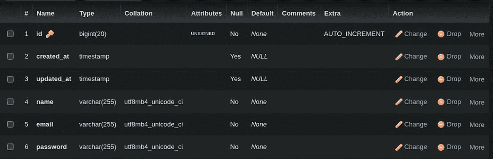

图 14-11 数据表结构中的变更

由于 `users` 表已经设置好，你现在可以创建用户注册功能了。从功能上来说，它将包含三个子功能：

1.  用于加载注册视图表单和接收表单提交请求的控制器路由
2.  注册视图表单
3.  在数据库中存储用户数据

#### 控制器路由

当你访问 `http://localhost:8000/register` 时，会得到图 14-12 所示的页面，这是一个 404 未找到页面，因为你的控制器中还没有这个 URL 的路由。

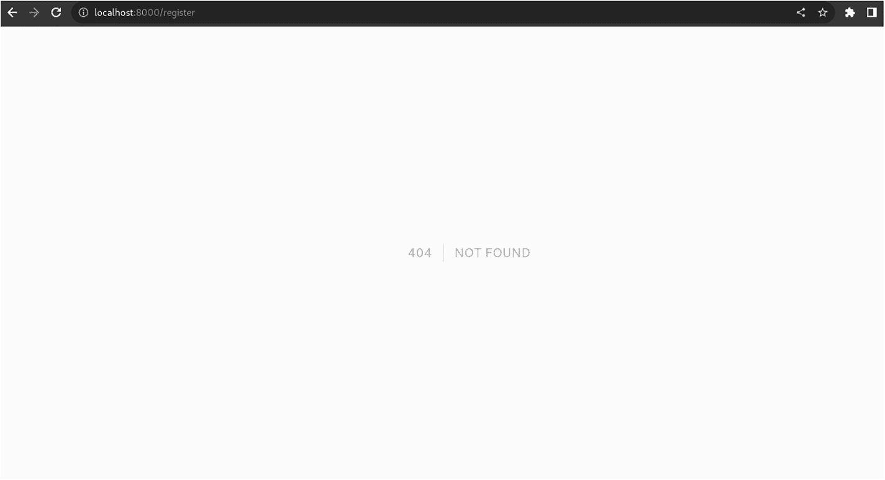

图 14-12 Laravel 未找到页面

打开 `routes/web.php` 文件，你会看到以下内容：

```php
<?php
use Illuminate\Support\Facades\Route;
/*
|--------------------------------------------------------------------------
| Web 路由
|--------------------------------------------------------------------------
|
| 这里是你可以为应用程序注册 Web 路由的地方。这些路由由 RouteServiceProvider
| 在一个包含 "web" 中间件组的组中加载。现在，开始创造一些了不起的东西吧！
|
*/
Route::get('/', function () {
return view('welcome');
});
```

让我们在 `resources/views/` 目录下创建一个名为 `register.blade.php` 的示例视图页面，并首先将它的内容设置如下：

```
注册页面
```

为了加载这个页面，请在 `routes/web.php` 文件中为 `/register` 路径添加一个路由，具体操作如下：

```php
Route::get('/register', function () {
return view('register');
});
```

分析这段代码，很明显，`get` 指定了 REST API 的动词，而 `/register` 是 GET 请求的相对 URI 路径。当控制器拦截到对 `/register` 路径的 GET 请求时，它将通过调用 `view('register')` 返回 `register.blade.php` 页面。

保存文件，然后访问 `http://localhost:8000/register`，你应该会看到图 14-13 所示的输出。

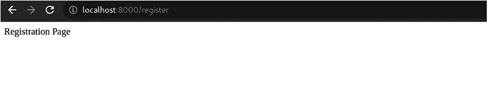

图 14-13 注册页面

你将在后续章节中开发注册表单。现在，让我们为注册成功页面创建一个示例视图页面，并为接收注册提交的表单提交请求创建另一个路由。

注册成功页面位于 `resources/views/registration_success.blade.php`。

```
您已成功注册！
```

以下代码应添加到 `routes/web.php` 中：

```php
Route::post('/register', function () {
return view('registration_success');
});
```

上面的路由是用于发送到 `/register` 路径的 POST 路由请求，它会返回 `registration_success` 页面。你将在稍后处理数据。要测试此更改，请打开终端使用 `curl` 命令，或者使用 Postman。Postman 是一个用于运行 API 请求的 UI 界面。有关其安装和使用的更多文档，请访问 `https://learning.postman.com/docs/getting-started/introduction/`。

`curl` 请求：

```
curl --location --request POST 'http://localhost:8000/register'
```

输出结果如图 14-14 所示。

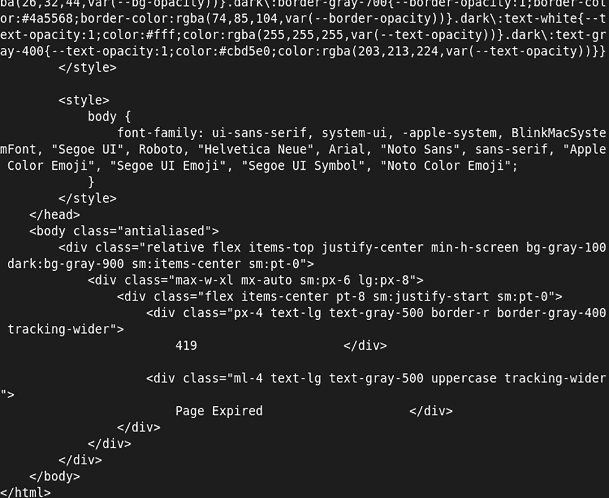

图 14-14 `curl` 请求命令输出

Postman 请求如图 14-15 所示。

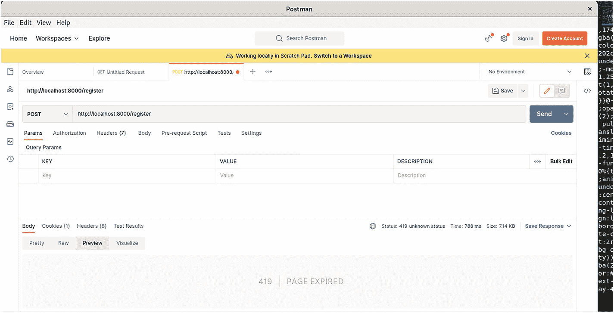

图 14-15 Postman 请求输出

输出应该会加载 419 | 页面已过期。这是一种安全机制，需要提供一个 csrf 令牌。当你构建注册表单时，我们将深入探讨更多细节。此输出应至少验证了你为注册功能设置的 POST 路由是正常工作的。


### 注册视图表单

Laravel 的 Blade 模板引擎提供了许多内置功能，可用于按需加载、循环、解析数据以及使用内置函数。您将学习如何创建一个表单，该表单可输入几个字段并将它们提交到您的 `/register` POST 路由。

要添加表单功能，请通过运行以下命令安装包含此功能的软件包：

```
composer require laravelcollective/html
```

您需要对 `resources/view/registration_success.blade.php` 视图文件进行如下修改：

```
Registration Page
{{ Form::open(array('url' => 'register')) }}
// 表单字段
{{ Form::close() }}
```

这将创建一个基本的 HTML 表单元素，其表单操作 URL 设置为 `/register` 路由，并包含一个用于跨站脚本攻击 (XSS) 保护的 CSRF 令牌，您可以从图 14-16 的开发工具检查中看到。

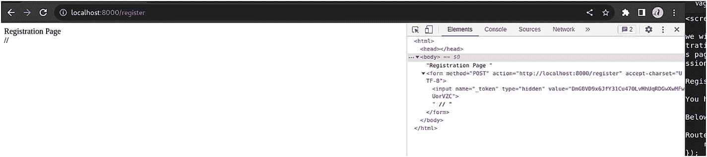

图 14-16 更新后的注册页面

接下来，让我们添加用户在注册时应填写的几个字段。

1.  姓名字段

    ```
    {{ Form::label('name', 'Name'); }}
    {{ Form::text('name'); }}
    ```

2.  电子邮箱字段

    ```
    {{ Form::label('email', 'Email'); }}
    {{ Form::email('email', $value = null, $attributes = array()); }}
    ```

3.  密码字段

    ```
    {{ Form::label('password', 'Password'); }}
    {{ Form::password('password'); }}
    ```

4.  提交按钮

    ```
    {{ Form::submit('Register'); }}
    ```

这些字段元素应添加在 `Form::open` 和 `Form::close` 调用之间。

最终的视图页面代码应如下所示：

```
Registration Page

{{ Form::open(array('url' => 'register')) }}
{{ Form::label('name', 'Name'); }}
{{ Form::text('name'); }}

{{ Form::label('email', 'Email'); }}
{{ Form::email('email', $value = null, $attributes = array()); }}

{{ Form::label('password', 'Password'); }}
{{ Form::password('password'); }}

{{ Form::submit('Register'); }}
{{ Form::close() }}
```

重新加载页面应显示如图 14-17 所示的输出。

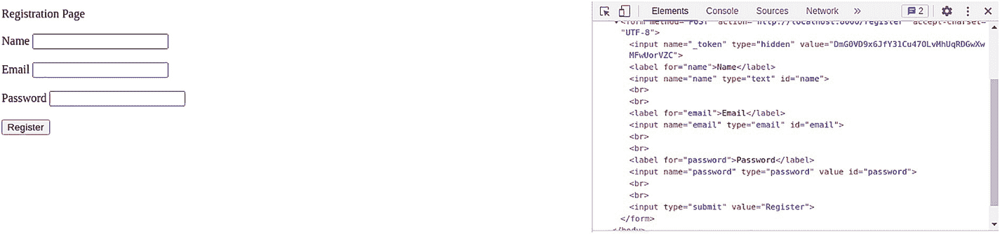

图 14-17 刷新后的注册页面

尝试用一些示例值填写字段详情，然后单击“注册”按钮，即可查看表单 POST 提交请求的实际情况。提交后，页面将类似于图 14-18。


图 14-18 注册成功页面

### 将用户数据存储到数据库

您已经设置了视图和控制器，但尚未对这些数据进行任何处理。其中一个重要部分是解析通过 POST 请求提交的数据，对其进行验证，然后保存到数据库。为简单起见，您将仅解析数据并将其保存到数据库。请注意，在处理用户提交的数据之前，验证非常重要。

现在您已经能够将数据发布到路由端点，接下来将解析这些不同的值。这些值作为传递给路由方法的 Request 对象的一部分提供。我们来看一下实际应用。对 `routes/web.php` 中的 POST 路由方法进行如下修改：

```
use Illuminate\Http\Request;
....
Route::post('/register', function (Request $request) {
return view('registration_success');
});
```

可以通过访问 `$request` 对象的属性来获取不同的值。例如，要获取电子邮箱的值，请使用 `$request->email`。现在您知道如何解析不同的 POST 参数了，因此可以继续使用这些值将其保存到数据库中。

Laravel 使用 Eloquent，这是一个对象关系映射器 (ORM)，它使得与数据库的交互变得非常灵活。使用这种方法，每个表都有一个对应的模型用于与该表进行交互。

```
Eloquent 参考：https://laravel.com/docs/9.x/eloquent
ORM：https://en.wikipedia.org/wiki/Object%E2%80%93relational_mapping
```

让我们使用以下命令为您的 `user` 表创建一个模型，位置在 `app/Models/User.php`：

```
php artisan make:model User
```


输出如图 14-19 所示。


图 14-19
模型创建输出

如果你希望同时创建迁移文件，请添加 `--migration` 选项。

```
php artisan make:model User --migration
```

这会在 `app/Models/User.php` 路径下创建一个包含以下默认模板的文件：

```
<?php
namespace App\Models;
use Illuminate\Database\Eloquent\Factories\HasFactory;
use Illuminate\Database\Eloquent\Model;
class User extends Model
{
use HasFactory;
}
```

若要添加更多字段，例如 `name`、`email` 和 `password`，请在类主体中添加以下代码：

```
/**
* 可批量赋值的属性。
*
* @var array
*/
protected $fillable = [
'name',
'email',
'password',
];
/**
* 序列化时应隐藏的属性。
*
* @var array
*/
protected $hidden = [
'password',
];
```

现在你的 `User` 模型已准备就绪。要在控制器中使用 `User` 模型，请更新 `routes/web.php` 文件，并添加以下命名空间声明来引入 `User` 模型：

```
use App\Models\User;
....
Route::post('/register', function (Request $request) {
User::create([
'name' => $request->name,
'email' => $request->email,
'password' => Hash::make($request->password)
]);
return view('registration_success');
});
```

这会将用户详情保存在 `user` 表中，并向用户返回注册成功模板。请注意，你正在使用 `Hash` 辅助函数对密码进行单向哈希处理，以便密码以加密格式存储在数据库中，确保安全。输出如图 14-20 所示。

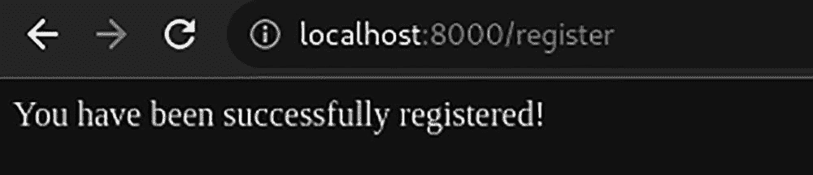

图 14-20
更新后的注册输出

我们再来检查一下数据库中以加密密码形式存储的用户详情，如图 14-21 所示。

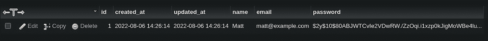

图 14-21
Laravel 数据库加密密码

## 总结

在本章中，你了解了开始使用 Laravel 所需的基本要素。你探索了 Laravel 的一些主要特性，但总体而言，还有许多你会觉得实用的功能，以及 Composer 仓库中存在的丰富包资源。在查看 Composer 库或创建自定义库之前，请始终查阅 Laravel 的文档，看是否有现成的组件、辅助函数或库能帮助你完成任务。这将在开发和维护方面为你节省大量时间。Laravel 在持续改进，因此请随时关注 Laravel 新闻、邮件列表和简报，以保持与时俱进。

在下一章中，你将专注于另一个 PHP 框架——Symfony，这是一个非常流行的 PHP 框架，已被数千个 Web 应用程序所采用。

