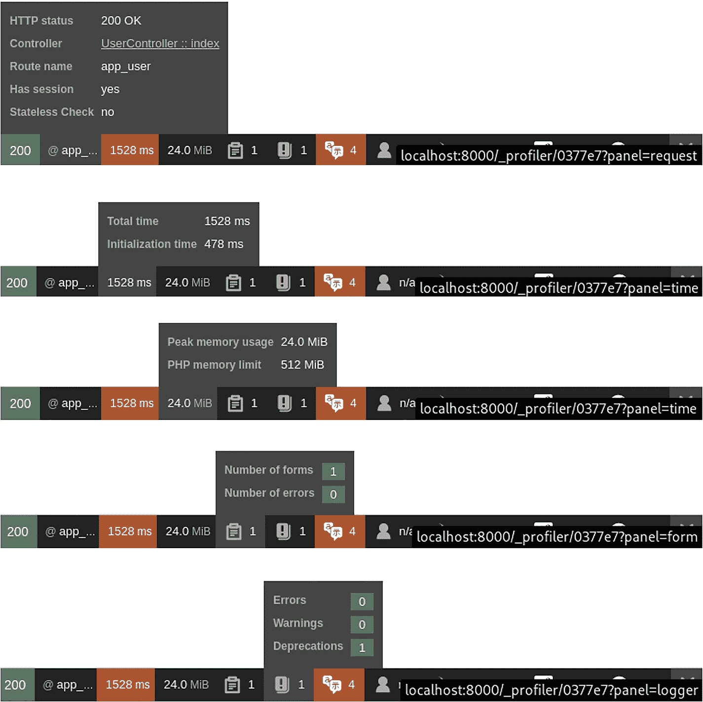
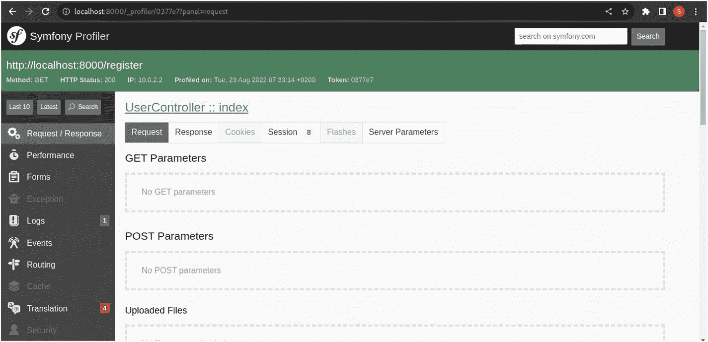
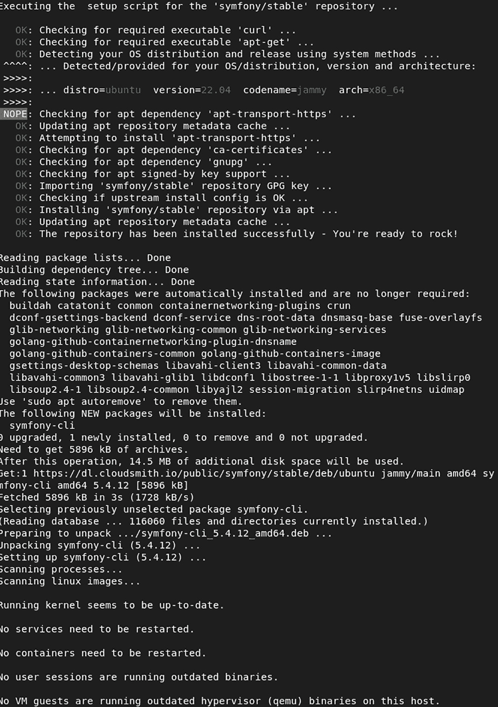
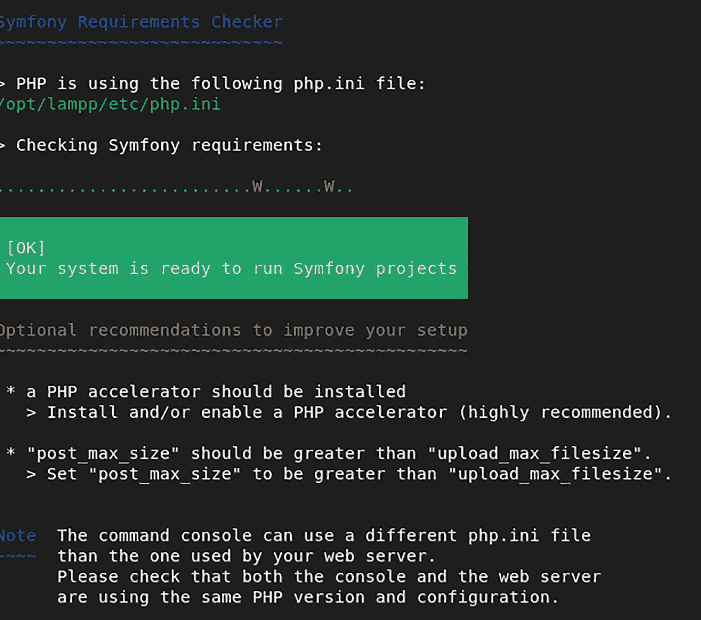
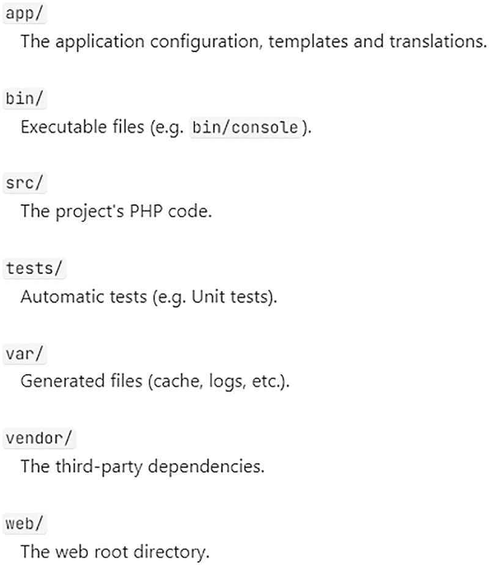
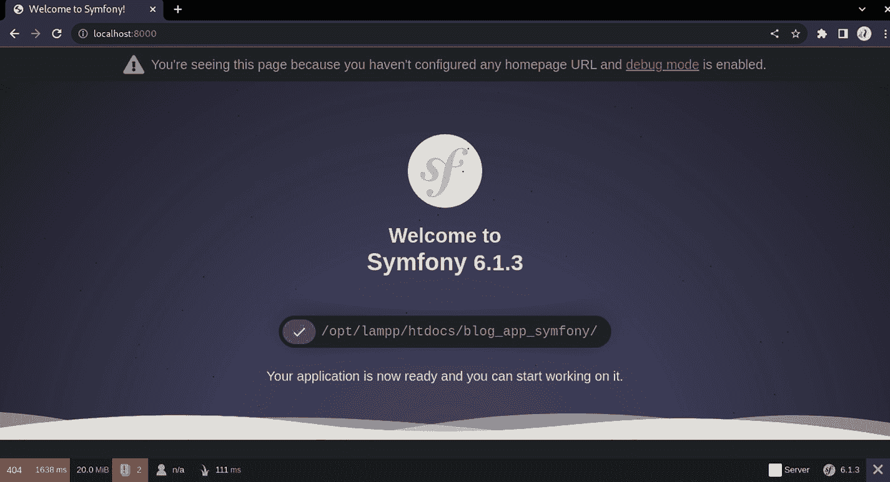

# 15. Symfony 入门

在前几章中，你学习了如何使用 Laravel（一种与 PHP 配合使用的 Web 应用程序框架）。在本章中，你将重点关注 Symfony，这是一个非常流行的 PHP 框架，已被用于开发网站和应用程序，其中包括大量可重用的 PHP 组件。

本章包含以下部分：

* Symfony 简介
* 安装 Symfony
* 创建 Symfony 应用程序

## Symfony 简介

Symfony 是一个使用标准可重用组件构建的全栈框架。它是一个项目，你可以选择使用其部分组件，也可以使用全栈。它由 Fabien Potencier 于 2005 年创建，并由 SensioLabs 赞助。用 Symfony 自己的话来说，“Symfony 是一组 PHP 组件、一个 Web 应用程序框架、一种哲学和一个社区——所有这一切和谐共处”（`https://symfony.com/what-is-symfony`）。

深入剖析这个总结：

一个 PHP 框架：

如你所知，框架是一个可供构建的基础模板。它包含：

1. 一个工具箱

## Symfony 框架概述

这是一组可在安全、验证、处理、会话管理等不同情境中复用的组件。这些基础元素让我们的工作变得更加轻松。

### 做事流程

有些框架足够灵活，可根据你的意愿拥有不同的结构、命名约定和控制流程；而有些框架则采用约定俗成的方式。Symfony 属于后者。理解这些约定需要一些初始学习，但一旦掌握，它们在使用现有组件、维护这些组件以及通过命令行工具等自动化工具轻松创建类似结构方面，都能让我们的工作更轻松。

### 一种理念

Symfony 诞生于 SensioLabs 网络创作者们的想象力。它*由*网络创作者*为*创作者而创建。这些创作者理解开发人员在创建网络应用时的需求。Symfony 采用开源许可发布，这使得开放社区能够对其进行贡献、改进和复用，从而汇集了顶尖人才的智慧。

### 一个社区

Symfony *由*社区支持*并*为社区做出贡献。Symfony 的社区支持包括 GitHub、Slack 聊天以及 SesioLabs。

### Symfony 的特性

Symfony 包含许多区别于其他框架的关键特性。它是一个非常灵活且基于 PHP 的框架，这对 PHP 网络开发者来说非常重要。它易于定制，既支持全栈式也支持积木式构建。最后，它非常稳定且可持续。


图 15-1 分析器工具集

#### 1. 用于 Web 项目的 PHP 框架

Symfony 能帮助你快速创建和维护 PHP 网络应用。它还可以帮你避免重复的编码任务，并管理代码控制和版本控制。

#### 2. 易于使用

Symfony 非常易于使用，因为它能灵活满足任何开发者的需求，并且易于上手。它附带大量文档，并得到强大的专业社区支持。对于初学者来说，它也非常容易使用，因为它包含了内嵌的最佳实践。

#### 3. 稳定可靠

Symfony 的发布节奏确保了所有版本的小版本之间的兼容性，并为所有主要 Symfony 版本提供三年支持。这提供了一种稳定且可持续的模式，值得信赖。

#### 4. 可扩展

Symfony 的核心组成部分是可复用的组件，这些组件可以用于其他项目或框架。这使得 Symfony 非常灵活，并且能够通过更改框架的核心行为进行扩展。与此同时，Symfony 利用 `Composer` 集成了不断增长的开源软件包列表，从而使开发者能够轻松地丰富其生态系统。

#### 5. 高性能

在性能方面，快速是每个人的追求，但很难实现。Symfony 从一开始就以性能为核心，旨在实现高速运行。

#### 6. 依赖注入

依赖注入是一个核心概念。它允许你在运行时实例化和使用不同的组件。Symfony 利用它提供了一种集中化的方式，用于在你的应用中初始化和提供不同的对象，从而实现简单性和模块化。

#### 7. 模块化组件

Symfony 提供了许多开箱即用的模块化组件，用于管理安全、会话、ORM 功能、表单以及模板引擎，这些组件只需很少的精力就能集成并适配到 Symonfy 中使用。

#### 8. 分析器工具

分析器工具是每个网页的一部分，并显示在你所有页面的底部。它在多种情境下提供配置信息，这些情境将在后续章节中讨论。这是每个开发者工具箱中非常重要的工具。请参见图 15-1。

在图 15-1 中，你可以看到一个包含摘要统计信息的工具栏。这是 Symfony 在调试模式下显示的开发工具栏，它为每个独特的页面包含了许多详细信息。图 15-2 显示了控制器路由、API 响应状态、请求时间、内存使用、表单错误和错误日志。



其他信息包括：

*   翻译信息
*   安全信息
*   Twig/模板调用
*   服务器信息
*   Symfony 配置信息

点击其中任何一个都可以让你进一步深入查看详细信息。例如，图 15-3 显示，点击请求面板会揭示与请求相关的更多详细信息。



在左侧面板中，你还可以访问与当前正在访问的页面相关的更多细节部分。

##### 1. 命令行工具

Symfony 的 `cli` 和 `bin` 命令允许你创建许多初学者模板，如控制器、实体模型和迁移，而无需深入研究它们。在接下来的章节和下一章中，你将看到它们是多么有用，从而使开发体验变得愉快。

##### 2. 文档与支持

Symfony 的文档无与伦比，涵盖了从入门指南、安装和教程到特定 API 文档的所有细节。开源社区随时准备在 Stack Overflow 平台和其他论坛上回答问题并提供支持。如果你更喜欢阅读书籍并想详细了解，他们有一本在线书籍 [`https://symfony.com/book`](https://symfony.com/book) 供你参考。他们还通过认证辅导、SensioLabs University 电子学习平台和视频教程提供 Symfony 培训。Symfony 还提供了一项认证，该认证广受重视，是一项值得取得的成就。

## 安装 Symfony

安装 Symfony 有多种方式。请参考 [`https://symfony.com/doc/current/setup.xhtml`](https://symfony.com/doc/current/setup.xhtml)。

你将按照最简单的方法来启动和运行。请确保在继续之前已安装以下先决条件：

*   PHP 8.1 或更高版本
*   PHP 扩展：`Ctype`、`iconv`、`PCRE`、`Session`、`SimpleXML` 和 `Tokenizer`。这些扩展在 PHP 8 安装中默认已安装。
*   `Composer` 工具，用于安装 Symfony 和依赖包

在下一章创建基本的 Symfony 项目之前，让我们先安装 Symfony CLI，它对于许多任务非常有用。根据操作系统的不同，有不同的安装方式；请参阅 [`https://symfony.com/download`](https://symfony.com/download)。

在 Ubuntu/Debian 系统中，可以通过以下命令运行：

```bash
curl -1sLf 'https://dl.cloudsmith.io/public/symfony/stable/setup.deb.sh' | sudo -E bash
sudo apt install symfony-cli
```

Symfony 安装的结果如图 15-4 所示。



一旦安装了 Symfony CLI，你可以使用它通过运行以下命令来验证你的系统是否满足 Symfony 应用程序的所有要求：

```bash
symfony check:requirements
```

如果一切顺利，你应该会得到类似于图 15-5 的输出。



现在 Symfony 已安装，让我们创建你的第一个应用程序。

## 创建一个 Symfony 应用程序

要启动一个名为 `blog-app` 的新项目，请运行以下命令：

```bash
composer create-project symfony/skeleton:"6.1.*" basic-starter-app
cd basic-starter-app
composer require webapp
```

## 基础 Symfony 应用结构分析

每个安装的 Symfony 应用都附带一个极其基础的目录结构，其中包含可复用组件。基础目录结构如图 15-6 所示。



图 15-6 Symfony 目录结构

图 15-6 展示了各子目录的职责并包含所有相关信息。基础 Symfony 应用结构可在 Symfony 官方网页 [`https://symfony.com/doc/current/bundles/best_practices.xhtml#directory-structure`](https://symfony.com/doc/current/bundles/best_practices.xhtml#directory-structure) 找到。

项目创建完成后，使用以下命令启动：

```bash
cd basic-starter-app
symfony server:start
```

现在你可以通过 `http://localhost:8000` 访问该应用，如图 15-7 所示。



**图 15-7** 新应用

这应该能确认 Symfony 的安装和设置有效。

## 本章小结

在本章中，你了解了 Symfony——一个可用于构建网站的现代框架。它提供了灵活的核心和不断增长的包生态系统。你学习了何时使用该框架以及如何使用它。下一章你将学习如何开发一个基础 Symfony 应用。