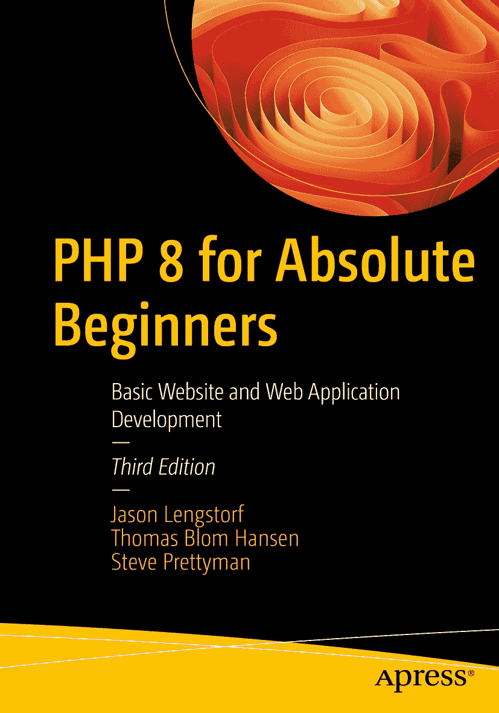

ISBN 978-1-4842-8204-5 e-ISBN 978-1-4842-8205-2 [`doi.org/10.1007/978-1-4842-8205-2`](https://doi.org/10.1007/978-1-4842-8205-2)

© Jason Lengstorf、Thomas Blom Hansen、Steve Prettyman 2022

本作品受版权保护。所有权利均已独家授权给出版商，包括内容全部或部分（特别是翻译、重印、插图复用、朗诵、广播、微缩胶片复制或以任何其他物理形式复制，以及信息存储与检索、电子改编、计算机软件，或当前已知或日后开发的任何类似或不同方法）的相关权利。

本出版物中使用的一般描述性名称、注册商标名称、商标、服务标记等，即使未作明确声明，也不意味着此类名称不受相关保护性法律法规的约束，因此可自由使用。

出版商、作者及编辑假定本书中的建议和信息在出版之日是真实准确的。出版商、作者及编辑不对本书所含内容或可能存在的任何错误或遗漏提供明示或暗示的担保。出版商对于已出版地图中的管辖权主张及机构归属保持中立。

本 Apress 印记由隶属于 Springer Nature 的注册公司 APress Media, LLC 出版。

注册公司地址为：美国纽约州纽约市新广场 1 号，邮编 10004。

*本书献给每一位为有志提升技能与学识者提供开源代码及培训（视频与教程）的志愿者。倘若没有你们对帮助同行程序员的奉献精神，我们整个行业就无法不断进步，提供尽可能最佳、最可靠、最安全的程序。*