# 第一部分

## 1. 编程准备工作

### 目标

完成本章后，你将能够

-   理解操作系统如何简化编程

-   理解 PHP 如何与 Apache 和 MySQL/MariaDB 协作创建动态网页

-   安装 PHP 测试环境

-   判断测试环境是否正常运行

-   创建简单的 PHP 程序

-   执行并测试简单的 PHP 程序

欢迎来到编程的世界！无论你此前从未尝试过编写程序，还是已经编写了一段时间，我们都希望这本书能帮助你理解程序开发的基础知识。你生命中的每一分钟都离不开计算机。从你出生那一刻产房里的监护仪，到今天早上为你冲泡黑咖啡（假设你喜欢咖啡）的咖啡机，计算机和程序都在努力让我们的生活更轻松。你对编程的兴趣可能源于在游戏世界中大放异彩的能力、使用社交媒体应用，或者观看电视上企业家推销发明、试图创建成功企业。无论原因是什么，你来到这里是为了探索如何使用 PHP 语言创建程序，更重要的是，判断编程是否是你想做的事情。

IT（信息技术）行业为你提供了无限的创造力和成为真正先驱者的潜力。你能设计和创造的东西没有限制。你的创造可能有助于拯救地球，或者让残疾人的生活更便捷。真正决定你将发明什么的权利在你手中。你可以选择为大型跨国公司、小型初创企业工作，或者独自冒险创业。随着职业生涯的发展，你可以根据需要多次改变路径。你可能先从大公司积累经验，一旦发现专长便跳槽到初创公司，最后开发出自己的应用，为退休铺平道路。IT 行业给了你决定自己道路的自由。

那么，让我们开始这段冒险吧。既然我们假设你想尽快开始编程（这就是你买这本书的原因，对吧？），让我们简要地介绍一些基础知识，以便大家从相同的理解水平出发。

开始吧！首先且最重要的是，“计算机是愚蠢的。”什么？但它们为我们提供了这么多惊人的工具，怎么会愚蠢呢？简单来说，计算机只知道两件事：0 和 1。这是基于电路要么有电（1）要么没电（0）的概念。这是计算机*硬件*和*软件*设计的基本构建块。当有人提到计算机时，我们通常想到的是硬件。物理组件，如键盘、屏幕、电路、内存芯片和其他内部组件。软件则是与硬件通信的实际程序（应用程序）。每台计算机都有一个*操作系统*，它为应用程序（也可能包括人）提供了与硬件通信的能力。操作系统就像一个语言翻译员；它将接收到的信息（来自应用程序或人）转换为计算机能理解的语言。就像人类翻译员可以将英语转换为西班牙语一样。

*程序*通常被定义为一组用于完成任务的代码。一个*应用程序*（app）可以由许多程序、多种硬件，甚至还包括人协作完成任务。但是，不要在这些定义上钻牛角尖，因为在现实世界中，我们往往互换使用这两个词。正如你会注意到的，我们在本书中已经这样做了。应用软件通常不是设计来直接与计算机硬件通信的。它与操作系统对话，然后操作系统再与硬件对话。

举个例子，想想你使用的应用程序。当你想要从某个应用程序打印东西时，会出现一个打印窗口，提供给你一些任务选项。如果你随后在计算机上打开另一个应用程序并从中打印，会弹出相同的打印窗口。这是从哪里来的？操作系统。操作系统包含了应用程序请求的常见任务的代码。这些模块包括代码块，以及在需要时的*界面*（图形窗口）。应用程序在使用这些工具时会进行一次 *API*（*应用程序编程接口*）调用。API 就是一行告诉操作系统要执行哪个代码块以及在执行代码时要使用什么参数（信息）的代码。

打印 API 可能会请求操作系统将指定的文档放入*打印队列*。打印队列是等待打印的文档列表。操作系统不仅能与打印机通信，打印机也能与操作系统通信。它实际上会发送一个特殊的信号（*中断*）回操作系统，告知打印作业何时完成（或者是否存在问题，例如缺纸）。一旦打印作业完成，操作系统会将该作业从队列中移除，并将下一个作业发送给打印机。

我们大大简化了实际过程。例如，当请求在操作系统和打印机之间来回发送时，指令（语言）会在操作系统能理解的语言和打印机能理解的语言之间来回转换。这种转换发生在哪里？是借助了一个叫做*打印驱动程序*的小应用程序。实际上，我们还可以更深入地探讨这一点，但关键是，应用程序、操作系统和硬件（包括打印机）协同工作来完成各种任务。没有软件的硬件毫无价值（也许除了当作门挡），没有硬件的软件也不存在（也许除了在我们的想象中）。

记住，我们说过计算机只知道 0 和 1。那么，如果它们只知道这些，又如何完成这么多事情呢？正如我们所知，计算机具有存储信息的能力。它们可以将信息存储在*内存*中、*内部存储设备*（*硬盘*、*芯片*）上，甚至*外部服务器*（云端）上。计算机存储的信息是以一系列 0 和 1 的形式存储的。一个*位*（bit）是一个单独的 0 或 1。一个*字节*（byte）是由多个 0 和 1 组成的序列。一个字节的大小（0 和 1 的数量）可能因计算机而异（例如 32、64、128 位），但它实现的功能相同：要么存储信息，要么执行任务。*字长*（word size）是指计算机在一个位置（内存或存储设备中）可以存储或一次执行的位数。字长越大，一次能保存或处理的信息就越多。字长更大的计算机处理信息的速度更快。

`Unicode` 是一个标准，它将比特组合起来，表示全世界使用的众多符号和语言。这确实是一项艰巨的任务！曾几何时，编程主要面向英语国家。然而今天，程序员遍布全球各地。让我们看一个示例，了解从键盘输入字符到文档中的简单过程。假设我们已经打开了最喜欢的文本处理器（例如 `Microsoft Word`），就可以开始打字。当我们点击键盘上的字母“s”时，它神奇地出现在屏幕上的文档中。这是如何发生的？当键盘上的一个键被按下时，该字母的比特模式（0 和 1）会通过操作系统发送到文本编辑器。然而，大多数人并不理解 0 和 1 的模式。因此，当文本编辑器接收到信息时，显示的信息会在显示器上转换为我们按下的字母（“s”）。请注意，我们说的是显示被转换了，而非实际数据本身。当我们存储数据时，它仍然以比特格式存储。

再次说明，我们简化了这个过程，因为实际的转换涉及内存、文本编辑器、其驱动程序、操作系统、显卡以及显示器及其驱动程序。这一切发生得非常快。幸运的是，我们只需理解这一切会发生，而无需深究细节。只需记住，计算机理解的内容与我们理解的内容是不同的。

除了作为语言解释器，操作系统还是一个内存管理器。在所有高级编程语言（如 `PHP`）中，当数据需要临时存储在内存中，或更永久地存储在存储设备（或云服务器）上时，操作系统就会接管。作为程序员，我们通过创建变量或常量来请求操作系统将数据存储在内存中。变量类似于我们在代数中使用的变量。在代数中，当 `A + B = C` 时，`A`、`B` 和 `C` 都是变量。我们知道它们可以代表任何数字。在编程中，同样的变量也可以存储数字，甚至字符，同时通知操作系统暂时将这些项目存储在内存中。

大多数编程语言（包括 `PHP`）将代数等式反转成 `C = A + B`。为什么？很高兴你问到这点。虽然 `A`、`B` 和 `C` 是变量，但编程中的等号实际上是一个赋值运算符。它会将右侧（`A + B`）的任何内容取过来，存储到左侧（`C`）中。因此，它取出存储在 `A` 中的值（数字），将其与存储在 `B` 中的值相加，然后将结果放入变量 `C` 中。这三个变量都驻留在计算机的内存中。

我们加法程序的结果存储在内存的某个位置，而我们不知道具体在哪里。什么？我们真的不关心在哪里，只要我们能使用变量 `C` 在需要时随时检索它即可。我们信任操作系统为我们提供支持（它会妥善地存储和保护我们的信息）。

操作系统会查看存储在变量中的值，或者查看程序代码中的变量声明语句，以帮助确定如何存储该变量。请记住，比特模式用于表示计算机中的所有字符（包括数字）。当信息存储在内存或存储设备中时，它以比特格式存储。因此，操作系统需要知道存储的是数字还是字符。数字 1 和字符 1 之间有区别。基本上，我们通常不对字符进行数学运算，但会对数字进行。因此，系统需要知道我们是否可能进行数学运算。如果我们要在计算中使用它，它会以一种允许我们进行计算的格式存储。我们将在使用 `PHP` 进行计算时进一步探讨这一点。

这也引出了我们与计算机之间的另一个区别。我们使用十进制系统创建数字。我们从 0 数到 9（十个不同的数字）。然后当需要进入下一个数字时，我们增加一位数形成数字 10。如你所知，当我们到 100（10 组 10）时，最终还要加一位数。然而，计算机使用二进制系统（基数为 2）来存储 0 或 1（两个不同的数字）。当计算机需要存储更大的数字时，它会增加一位（10）。你可能已经注意到，在使用计算机或购买计算机时，一切似乎实际上都基于八的倍数（8、16、32、64……）。为什么？实际上，这是随着我们添加更多比特而逻辑上产生的。

将二进制 0 转换为十进制 0（或将二进制 1 转换为十进制 1）很容易，因为它们表示相同的值（零或一）。然而，二进制 10 与十进制 10 是不同的。十进制 10 代表 10 个值（十个手指）。在上一段中，我们提到当二进制数需要大于 1 时，需要增加一位。二进制 10 比 1 大一；它是十进制中的数字 2（两根手指）。

困惑了吗？让我们看一些例子。

**表 1-1 十进制与二进制对比**

| 十进制 | 二进制（基数为 2） |
| :--- | :--- |
| 0 | 0 |
| 1 | 1 |
| 2 | 10 |
| 3 | 11 |
| 4 | 100 |

| 5 | 101 |

| 6 | 110 |

| 7 | 111 |

请记住，二进制中第一位（最右边）是 0 或 1。第二位代表 2。因此，`10` 是 2（2 + 0）。`11` 是 3（2 + 1）。由于 `11` 是 3，我们必须增加一位来产生 4（`100`）。5 是 `101`（4 + 0 + 1）。6 是 `110`（4 + 2 + 0）。7 是 `111`（4 + 2 + 1）。这需要一些练习才能习惯。不要纠结于细节；如果你理解了基本概念，随着编程技能的提升，你最终会恍然大悟。请注意，当我们达到三位数（`111`）时，实际上已经创建了八个值（0–7）。这逻辑上表明比特可以基于八的倍数进行收集。`111 111` 将是两组 8（8 × 2 = 16）。`111 111 111` 是三组 8（8 × 3 = 24）。`111 111 111 111` 是 32（8 × 4）。在确定计算机如何存储信息时，我们关注八的倍数就合乎逻辑了。我们继续吧；稍后会再次讨论这一点。

让我们回到操作系统的讨论。操作系统还会决定变量存储在内存中的什么位置。操作系统用来确定数据存储位置的算法（代码）非常精良且高效。它经过多年调整，为信息存储提供了最佳解决方案。操作系统会考虑很多因素（对于一个初级书籍来说，太多以至于无法深入探讨）来决定将数据存储在何处。它考虑的一些因素包括：数据可能被使用的频率、哪个程序在使用它、数据的大小以及存储的数据类型。

我们希望你现在能看到，操作系统使我们的生活作为程序员变得更加轻松。我们无需担心存储位置等细节，甚至不必担心实际程序在内存中的运行位置。操作系统会为我们的程序所需的一切分配内存位置。它还会努力保护我们的程序不受其他试图造成伤害的程序的侵扰，甚至在我们程序崩溃时处理问题。根据程序崩溃的原因，它甚至可能通过错误消息告诉我们发生了什么。例如，如果没有足够的内存来运行我们的程序（或继续运行我们的程序），它会告知我们。

当程序结束时（无论是正常结束还是崩溃），操作系统会清理该程序使用的内存，并将其提供给下一个可能需要它的程序。实际上，从技术上说，操作系统只是在内存位置设置一个*标志*（位），将其标记为可用。当另一个程序或数据存储到这些位置时，旧的 0 和 1 会被覆盖。由于新代码或数据将被放置到该位置，因此在使用前无需清空该位置，覆盖掉旧内容即可。

让我们看看操作系统为帮助程序运行所做的最后一件事情。操作系统是一个*任务管理器*，它决定程序在停止或中断之前可以运行多长时间以及何时运行。让我们通过一个快速练习来查看正在运行的任务。

**练习**：找到您操作系统的任务管理器。您可以在计算机上搜索“任务管理器”，如果您使用的是 Microsoft Windows 机器，可以同时按下`ctrl`（键盘左下角）、`alt`（键盘左下角）和`delete`（键盘右上角）键，然后在弹出的列表中点击“任务管理器”。

您的任务管理器应该类似于图 1-1。显示的图表提示了操作系统在计算机上维护的许多任务，它正在管理 CPU、内存、磁盘和网络的使用情况，这包括我们正在使用的任何应用程序（如 Microsoft Word）。其他我们可能直接使用或未直接使用的程序也在后台运行（例如 Amazon Photos）。正如任务管理器中的选项卡或图 1-1 所示，操作系统还管理性能和其他服务。

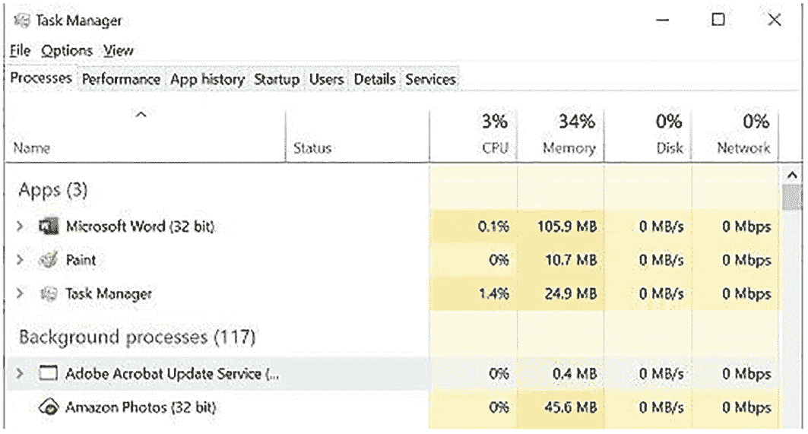

该图像反映了计算机上的任务管理器对话框，显示所有正在运行的应用程序和后台进程。

**图 1-1** 任务管理器

当我们启动一个程序时，如前所述，系统将为该程序确定内存使用量和内存位置。它还会确定程序在停止或中断之前运行多长时间以及何时运行。系统会确定程序的*优先级*（像操作系统这样的系统程序具有最高优先级）以及允许程序运行的时间片大小。系统的算法在确定程序的*运行时间*方面非常精确。然而，外部因素可能会减慢程序速度，例如紧急的系统问题（可能是内存不足）。必要时，操作系统可以对您的程序进行*交换*以运行其他更高优先级的程序。但通常情况下，因为一切执行速度极快，我们甚至不会注意到。

> **注意**
>
> 如果您已经使用计算机一段时间，您可能遇到过某些应用程序似乎永远无法正常工作（看起来像挂起）的情况。这可能是由内存（或存储）短缺引起的，系统试图通过将程序换入换出内存来共享有限的可用内存来解决这个问题。然而，这可能导致系统花费大量时间进行交换，而留给应用程序运行的时间很少。关注您要安装的任何应用程序高效运行所需的内存量（和存储量）非常重要。否则，不仅您的应用程序可能无法正常运行，而且持续的交换可能会拖慢您的计算机，导致所有程序都无法正常运行。

关于计算机如何运作这个话题，我们只是触及了广阔海洋的表面。有许多书籍、视频和课程可以帮助您获得更深入的理解。然而，我们的目标是让我们掌握足够的关于这一切如何影响我们创建的任何程序的知识。幸运的是，我们已经建立了这方面的基本理解，那么让我们继续下一个主题。

### 为什么要从 PHP 开始？

这确实是一个非常好的问题。有很多编程语言可供我们选择。为什么选择`PHP`作为我们的第一门语言体验？首先，`PHP`是比较容易学习的语言之一。仅凭一些基本命令和概念，您就能完成很多工作。它是最流行的语言之一，因为它能够管理网页和应用程序。它通常被认为是成为*全栈开发者*所需的技能之一。

> **注意**
>
> 全栈开发者既了解 Web 应用程序的前端（显示给用户的网页），也了解后端（存在于 Web 服务器上供网页使用的代码）。他们掌握前端工具的知识，如`HTML`、`CSS`和`JavaScript`。他们拥有使用能够支持后端的 Web 页面的语言（如`PHP`和`Java`）的经验。他们还可能使用其他工具来管理开发周期。

随着*PHP 8*的出现，该语言在操作和计算效率上比以往任何时候都高。虽然在本书编写时，由于先前的限制，`PHP`并不以开发游戏平台或大数据操作而闻名，但最新版本的效率可能很快让这成为现实。已经有一些团体开始使用`PHP`开发智能手机应用程序。但即使它永远不会成为游戏平台，仅通过托管网页和创建应用程序，`PHP`也有大量的工作要完成。

**练习**：`PHP`还活着并且发展良好吗？不要相信我们的话。去您最喜欢的搜索引擎并提问：“谁在使用`PHP`？”或者“`PHP`还活着且发展良好吗？”您找到了什么？答案应该告诉您：“是的，`PHP`还活着且发展良好”以及“很多组织都在使用`PHP`。”目前有哪些组织在使用`PHP`？他们用它来做什么？`PHP`的未来是怎样的？您会发现，除了 Web 应用程序之外，目前在创建大数据仪表盘、智能手机应用程序和游戏应用程序方面也有开发。小心点，`Python`，`PHP`可能正在抢你的饭碗！

### 搭建开发环境

搭建一个可用的*开发环境*起初可能会令人望而生畏，尤其是对于绝对的初学者而言。不过，开发者们已经创建了许多类型的软件包，这些软件包可以一键安装我们所需的一切，并采用默认设置。我们不再需要进入配置文件来手动连接各个环境组件（除非我们想这么做）。环境会自动为我们整合好。为了能够跟随本书中的项目进行实践，我们需要拥有一个包含*Apache*（*Web 服务器*）、PHP 和 *MySQL/MariaDB*（*数据库*）的可用的开发（测试）环境。出于速度和安全性考虑，在本地（单台机器上，而非服务器）进行测试总是更理想的选择。这样既能保护正在进行的工作免受开放互联网上黑客的攻击，又能减少上传文件到*Web 服务器*所花费的时间。它让你在将程序部署到线上环境之前，能够进行彻底测试并确保其安全性。

PHP 是一种功能强大的*脚本语言*，可以独立运行。然而，仅靠 PHP 本身并不足以构建动态网站应用程序。要使用 PHP 开发网站，我们需要一个知道如何处理 PHP 脚本的 Web 服务器。Apache 是一个免费的 Web 服务器，一旦安装在计算机上，它就能让开发者们在本地测试 PHP 脚本；这使得它成为本地开发环境中不可或缺的一部分。Apache 是与 PHP 结合使用的最流行的 Web 服务器。

此外，Web 应用程序还需要存储信息。可以开发 PHP 代码将这些信息存储在数据库中，以便能够快速、轻松地进行修改。这是 PHP 应用程序与*HTML*网站之间的显著区别。纯 HTML 的网站无法存储信息。这正是像 MySQL 这样的*关系型数据库管理系统*发挥作用的地方。本书中的许多示例都使用 MySQL/MariaDB 数据库系统来存储信息。

> **注意**：无需深入细节，MySQL 和 MariaDB 是非常相似的系统。当 Oracle 收购 MySQL 后，一些开发者希望确保仍有一个免费版本的 MySQL 存在（尽管在本书出版时 Oracle 确实仍提供免费版本）。MariaDB 正是这种合作努力的成果。他们确保使用任一数据库系统创建程序时，无需更改任何代码。你甚至会发现，有些软件包在使用“MySQL”这个术语时，实际上指代的却是 MariaDB 数据库。

#### 什么是 PHP？PHP 是如何工作的？

PHP 是一种通用脚本语言，最初由拉斯马斯·勒德尔夫（Rasmus Lerdorf）于 1995 年构思。勒德尔夫创建 PHP 是为了满足在创建*万维网*页面时，需要一种简单方法来处理数据的需求。

> **注意**：PHP 诞生于拉斯马斯·勒德尔夫想要创建一个能记录其在线简历访问次数的脚本的愿望。由于他创建的脚本大受欢迎，勒德尔夫继续开发了这种语言。随着时间的推移，其他开发者也加入了他一起开发该软件。如今，PHP 是最流行的脚本语言之一。

PHP 最初代表 *Personal Home Page*（个人主页），并以免费、*开源*项目的形式发布。随着时间的推移，这种语言经过重新设计以满足用户的需求。1997 年，PHP 更名为 PHP: *Hypertext Preprocessor*（超文本预处理器），也就是现在众所周知的名称。在撰写本书时，PHP 8.1.1 是当前稳定版本。许多服务器上仍在使用旧版本的 PHP。然而，这些旧版本可能不够安全。PHP 8 对该语言进行了许多强大的改进，提高了可用性、速度和安全性。本书中提供的所有代码均可使用 PHP 8（或更高版本）运行。部分代码也适用于之前的版本。我们建议您安装并使用最新的可用版本。

HTML 在页面下载后由用户计算机上的*浏览器*解析。浏览器根据 HTML 和 CSS 提供的代码决定如何展示信息。由于 PHP 代码（与 HTML 不同）保留在远程 Web 服务器上，因此浏览器无法处理 PHP 代码。PHP 由连接到 Web 服务器（如 Apache）的*PHP 解释器*进行处理。PHP 代码执行的结果（而不是 PHP 代码本身）会被包含在文档（网页）中，然后再发送给用户浏览器进行解释。因为 PHP 是在服务器上处理的，所以它是一种*服务器端脚本语言*。

**练习**：寻找一家使用 PHP 的公司。访问他们的网站。查看网站主页的源代码。你可以通过浏览器中的“查看源代码”选项来查看代码。你找到 PHP 代码了吗？答案是没有。为什么？因为你的浏览器显示的是 PHP 代码被 Web 服务器处理后的结果。你可以看到 HTML、CSS 和 JavaScript 代码，但看不到任何 PHP 代码。在哪里能看到 PHP 代码呢？如果你有访问权限，可以在服务器本身上查看它。

使用 PHP，你可以创建动态网页（能够根据条件变化的网页）。例如：当你登录自己的 Facebook 账户时，可以看到你的内容。当你登录另一个 Facebook 账户时，你会看到不同的内容。我们加载的是相同的资源（`www.facebook.com`）和代码，但为我们动态地提供了不同的内容。这对于纯 HTML 网页来说是不可能的，因为它们是*静态*的，意味着它们不能改变。每个用户都会看到完全相同的 HTML 页面。在本书中，我们很快就会探索更多动态网页的例子。

PHP 是一种解释型语言，这对 PHP 程序员来说是另一个巨大优势。许多编程语言要求你在运行之前将文件*编译*成*机器码*，这可能是一个耗时的过程。每次修改代码都无需编译，这意味着你可以更快地编辑和测试代码。然而，这也可能导致 PHP 在线上环境中比编译型程序运行得更慢。编译型程序已经是服务器可以直接运行的机器级程序。脚本程序（如 PHP）必须先被解释才能运行。使用 PHP 8，这一劣势已被消除。PHP 8 包含一个 *JIT（即时）**编译器*，可用于为线上站点编译 PHP 代码。这消除了延迟。

> **注意**：在初步测试代码时，我们首先关心的是消除所有语法和逻辑错误。在此阶段，我们可以使用原始的解释模式来测试 PHP。在消除错误后，对于高负载的 Web 应用程序，我们可以使用 JIT 编译器来加速线上环境中的 PHP 应用。由于这是一本面向初学者的书，我们大部分的测试将使用 PHP 的解释模式，以节省调试的时间和精力。

因为 PHP 是一种服务器端语言，运行 PHP 脚本需要一个服务器。在本地开发环境中开发 PHP 项目意味着我们需要在本地机器上安装一个服务器。本书中的示例依赖 Apache Web 服务器来交付我们的网页，因为它是与 PHP 结合使用的最流行的服务器。

### Apache 及其功能

截至本书发布时，`Apache` 托管了将近 40% 的现有网站。`Apache` 是一款开源服务器，几乎能在所有主流操作系统上运行。`Apache` 是一个社区驱动的项目，众多开发者为其进步贡献力量。`Apache` 的开源性质也意味着该软件是免费提供的，这很大程度上促成了`Apache` 相对于其竞争对手的压倒性普及。

在 Apache HTTP 服务器项目网站（`http://httpd.apache.org`）上，`Apache HTTP Server` 被描述为“一项为现代操作系统（包括 UNIX 和 Windows NT）开发和维护开源 HTTP 服务器的努力。该项目的目标是提供一个安全、高效且可扩展的服务器，能够根据当前的 HTTP 标准提供 HTTP 服务。”Apache 项目提供了数十亿行免费的开源代码供任何人使用。

与所有 Web 服务器一样，`Apache` 接收 *HTTP 请求* 并返回 *HTTP 响应*。当你在浏览器中输入一个 URL（`www.apress.com`）时，浏览器会将这些信息转换为一个 HTTP 请求。该信息被发送到 Web 服务器（`Apache`）。服务器确定所请求的内容（访问 Apress 网站）。然后，它会创建一个 HTTP 响应，其中包含所请求的信息（Apress 的主页），并将该信息发送回浏览器。在服务器创建响应的过程中，Web 服务器会将任何非编译的 PHP 代码发送给 PHP 处理器进行解释。所有 PHP 代码随后被执行，其结果连同任何 `HTML`、`CSS` 或 `JavaScript` 一起包含在响应中。用户的浏览器除了显示 PHP 代码的结果外，还会解释 `HTML`、`CSS` 和 `JavaScript` 代码，以在浏览器中格式化所请求的网页。

### 使用 MySQL/MariaDB 存储信息

`MySQL` 和 `MariaDB` 是关系型数据库管理系统 (*RDBMS*)。本质上，这意味着它们允许用户使用基于表格的结构存储信息，利用行和列来组织不同的数据片段。还有许多其他关系型数据库管理系统和*非关系型系统*（例如 *NoSQL 数据库*）。由于 `MySQL`/`MariaDB` 是最流行的 RDBMS 系统之一，本书中的许多示例都依赖它们来存储关系型数据。

现在我们已经熟悉了所需的工具，让我们开始安装这些工具，正式启动吧。

**练习**：在开始安装过程之前，请访问 PHP（`php.org`）、Apache（`apache.org`）和 MySQL（`mysql.com`）网站。每个软件当前最新的稳定版本是什么？在决定安装哪个软件包时，请寻找提供最新版本的软件包。

## 安装 PHP、Apache 和 MySQL/MariaDB

对于新程序员来说，最大的障碍之一就是如何开始。在过去，在你编写第一行 PHP 代码之前，你必须分别下载 `Apache`、`PHP` 和 `MySQL`/`MariaDB`，然后艰难地阅读充斥着你可能还不理解的技术术语的安装说明。这种经历让许多开发者对自己产生怀疑，不确定是否正确安装了所需的软件。仅仅让每个工具相互通信就是一个大麻烦，需要在配置文件中修改设置，而你却对这些文件的功能知之甚少或根本不了解。

这个障碍曾使许多新程序员数月之久无法开始学习编程，即使他们迫切希望超越普通的 `HTML`。在能够成功运行第一个命令之前，他们往往要经历无数次失败的 PHP 安装尝试。

幸运的是，开发社区已经回应了初学者的挫败感，提供了许多软件包，可以消除搭建开发环境的所有痛苦，无论你是为 Windows、Mac 还是 Linux 机器创建应用程序。这些选项包括用于搭建 Apache、MySQL 和 PHP 的一体化解决方案。我们将这些软件包称为 *LAMP*（Linux、Apache、MySQL/MariaDB、PHP）、*WAMP*（Windows、Apache、MySQL/MariaDB、PHP）和 *MAMP*（macOS、Apache、MySQL/MariaDB、PHP）技术栈。

截至 2021 年底，最流行和最好的软件包包括：

*   *AMPPS*：提供 LAMP、WAMP 和 MAMP 版本 – `www.ampps.com`

*   *WAMPSERVER*：仅提供 WAMP 版本 – `www.wampserver.com`

*   *XAMPP*：提供 LAMP、WAMP 和 MAMP 版本 – `www.apachefriends.org`

*   *Neard*：仅提供 WAMP 版本 – `www.neard.io`

*   *WAMP.NET*：仅提供 WAMP 版本 – `www.wamp.net`

*   *EasyPHP*：仅提供 WAMP 版本 – `www.easyphp.org`

**练习**：请访问上述每个网站，探索每个软件包包含的内容。这些软件包中的许多都附带有助于程序开发的额外工具。比较每个软件包提供的 `PHP`、`Apache` 和 `MySQL`/`MariaDB` 版本。目前哪一个比其他更新？有没有哪个软件包比另一个更吸引你？在本书中，我们将使用 `XAMPP`。但你可能会发现其他某个软件包更能满足你的需求。你可以在 YouTube 上找到演示每个软件包安装过程的视频。我们建议你现在安装 `XAMPP`，但获得经验后，请自行决定最适合你的软件包。

演示如何安装每个最流行的技术栈是多余的。因此，我们将展示本书中用于创建示例的软件包的安装过程。作者个人选择用于 PHP 代码创建和测试的是 `XAMPP`，这是最常见的一体化免费解决方案之一；它已经存在多年了。全球有成千上万的程序员使用 `XAMPP` 来创建动态 PHP 程序。`XAMPP` 凭借其易用性和可靠性，赢得了用户几乎完美的五星评价。对于初学程序员来说，这是一个不错的选择。

**注意**：大多数 Linux 发行版默认捆绑了某种类型的 LAMP 技术栈。某些版本的 Mac OS X 也默认安装了 `PHP` 和 `Apache`。

## 安装 XAMPP

背景知识已经足够。你现在可以准备在你的开发机器上安装 `XAMPP` 了。这个过程只需几分钟，希望是完全无痛的。

**注意**：`XAMPP` 的新版本会频繁发布。如果你发现当前版本的 `XAMPP` 与下面所示的版本有重大差异，请不要惊慌。你可以从 XAMPP 网站和 YouTube 上的视频了解当前的安装过程。在 YouTube 上搜索时，请确保包含 `XAMPP` 的版本号，例如“Installing XAMPP 8.1.1”。同时务必检查视频的创建日期，以确保它是最近制作的。

### 步骤 1：下载 XAMPP

在本演示中，我们将安装 Windows 版本的 XAMPP。其他操作系统的安装过程类似。如果你不清楚如何为你的操作系统安装 XAMPP，可以在 YouTube 上搜索相关视频。

你的第一项任务是获取 XAMPP 软件副本。请访问 XAMPP 官网（`www.apachefriends.org`）。然后点击菜单中的“下载”。通过点击版本右侧的“下载”按钮，为你的操作系统选择最新的稳定版本。以下步骤及本书中的示例均基于 Windows 版 8.1.1 版本制作。

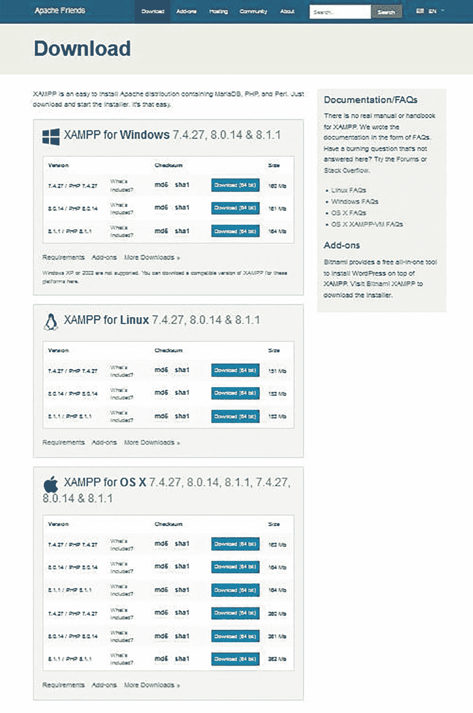

此窗口展示了 XAMPP 提供的不同版本，并附有 Windows、Linux 和 OS X 的下载选项。

**图 1-2** XAMPP 版本

点击按钮后，系统可能会询问你是要打开还是保存安装文件。如图 1-3 所示，选择“保存”。

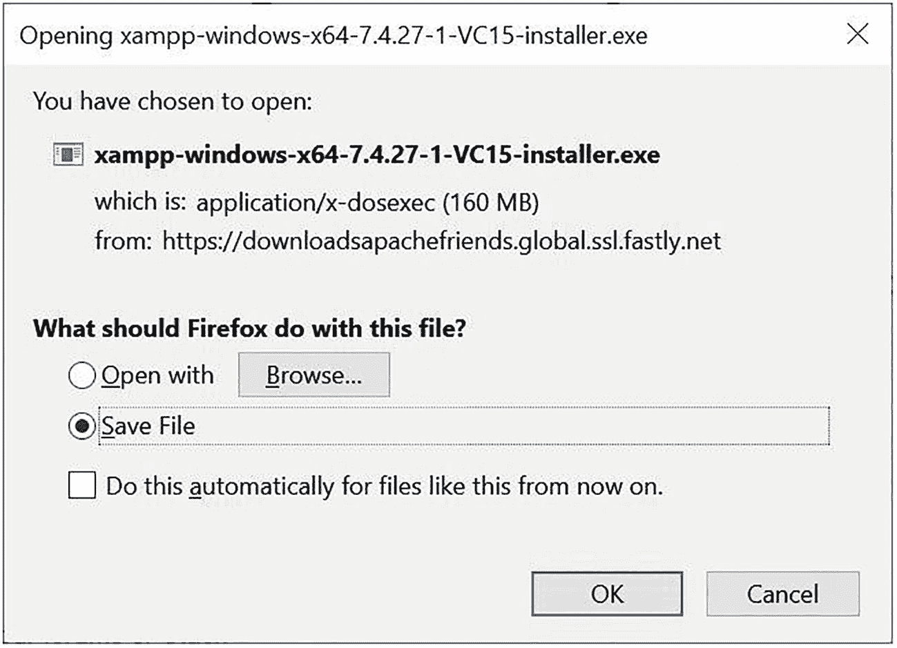

当我们开始将 XAMPP 版本下载到系统中时，会弹出此对话框，询问我们想要将文件保存到哪里或直接打开文件。

**图 1-3** 保存安装文件

点击“确定”后，安装程序将下载到你的计算机。根据你使用的浏览器不同，你需要找到已下载的文件。在 Firefox 中，你可以点击浏览器右上角的下载箭头找到该文件。找到安装文件后，点击它即可开始安装过程。

### 步骤 2：按照说明进行操作

在 Windows 环境下，操作系统可能会询问你是否允许此应用程序进行更改。请回答“是”。系统可能还会弹出关于用户账户控制（UAC）的警告。你可以选择关闭计算机上的这一安全功能，或者（更好的选择是）依照警告提示，将 XAMPP 安装到“Program Files”之外的其他位置。

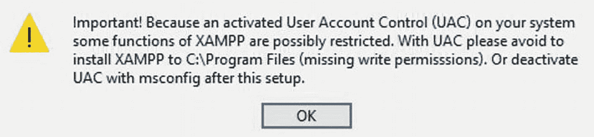

当我们开始下载 XAMPP 时，会显示一条警告信息，该信息可能因我们使用的浏览器而异。

**图 1-4** UAC 警告信息

点击警告信息上的“确定”，或点击初始窗口中的“确定”后，你应该会看到类似图 1-5 的界面。

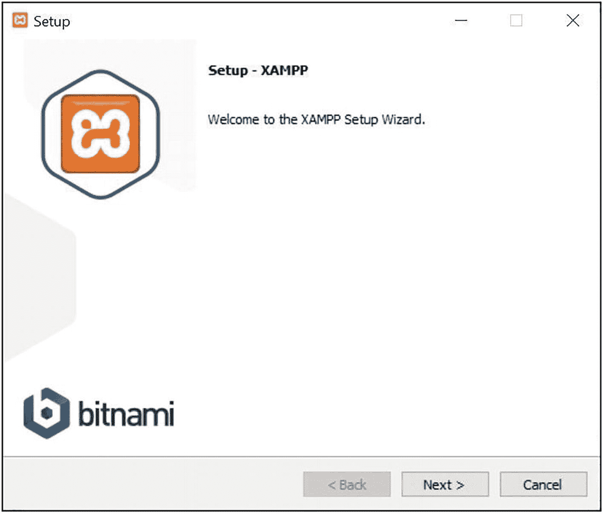

在针对警告信息点击“确定”按钮后，初始设置界面便会打开，在这里我们可以看到用于安装的“下一步”和“取消”选项。

**图 1-5** 初始设置界面

**注意：** 本书中的所有截图均取自运行 Windows 10 的计算机。如果你使用不同的操作系统，安装过程可能会略有差异。Windows 版 XAMPP 提供额外选项，例如可以将 FileZilla（一个 FTP 服务器）作为其服务之一进行安装。这是不必要的，并且会消耗计算机资源（即使在不使用时也是如此），因此最好保持这些服务处于关闭状态。此外，Windows 用户应选择将 XAMPP 安装到 `c:\xampp` 目录，以便更轻松地跟随本书的示例操作。

点击“下一步”按钮进入下一个界面（见图 1-6），以便选择要安装的组件。为了简化操作，我们就使用默认选项。这样会安装一些本书中不会用到的工具。然而，这些工具在程序开发中非常有用。XAMPP 安装程序会引导你完成整个安装过程。

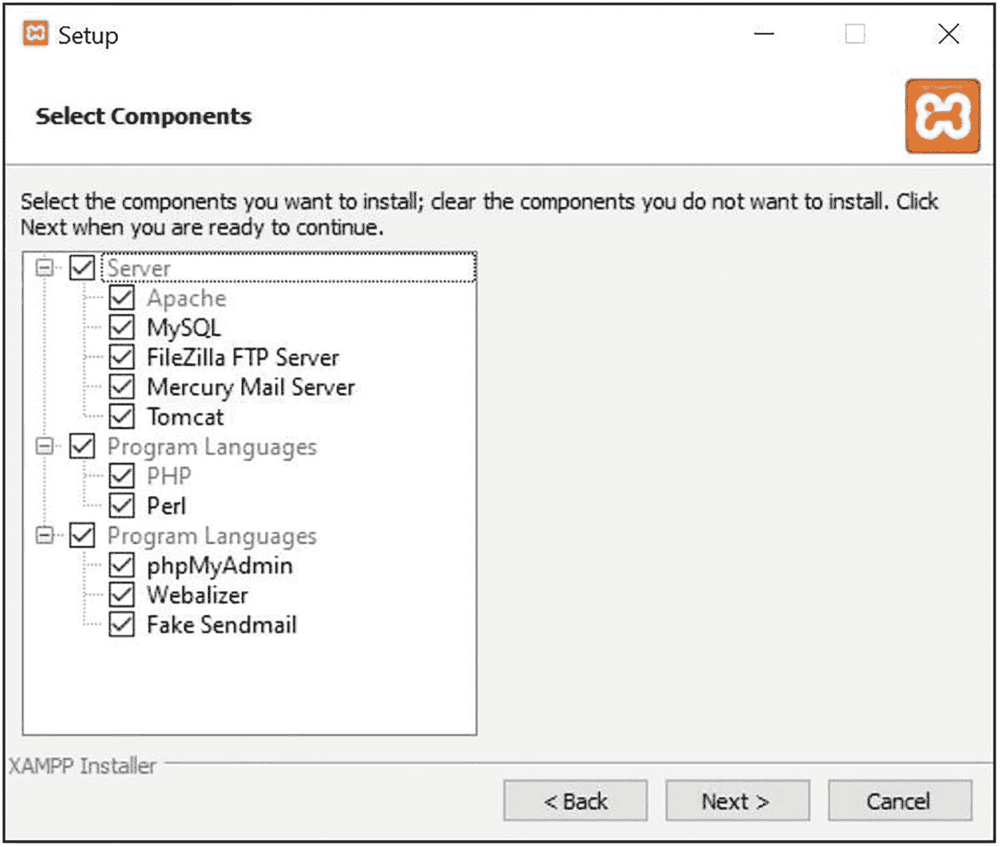

在安装对话框中点击“下一步”后，我们可以根据自己的需求选择需要安装的组件。

**图 1-6** 选择要安装的组件

如下所示，保留默认位置用于创建 XAMPP 文件。如果你之前已经安装过旧版本的 XAMPP，可以更改此位置。请记住，本书中的示例均假定文件位于 `C:\xampp`。

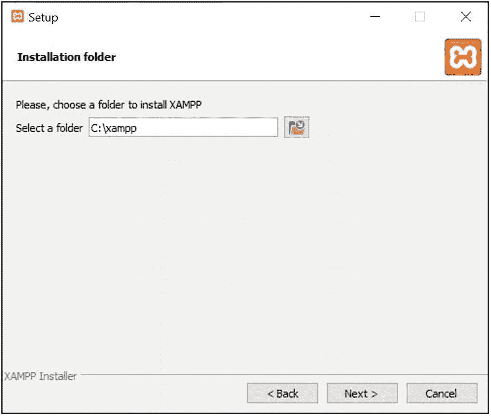

此对话框显示了我们希望将此下载文件保存到系统中的位置，我们可以自由选择。

**图 1-7** 安装文件夹

选择你偏好的语言。

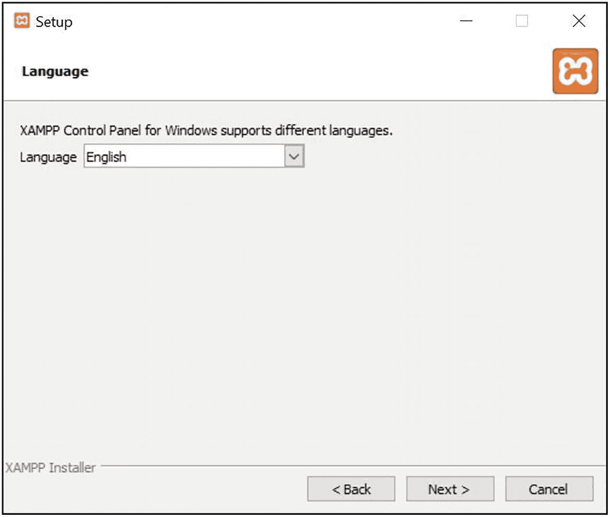

在选定位置并点击“下一步”后，我们可以选择希望用哪种语言与 XAMPP 控制面板交互。

**图 1-8** 选择语言

取消勾选“了解更多”选项，以节省时间和空间。你可以随时安装这些工具中的一个或多个。

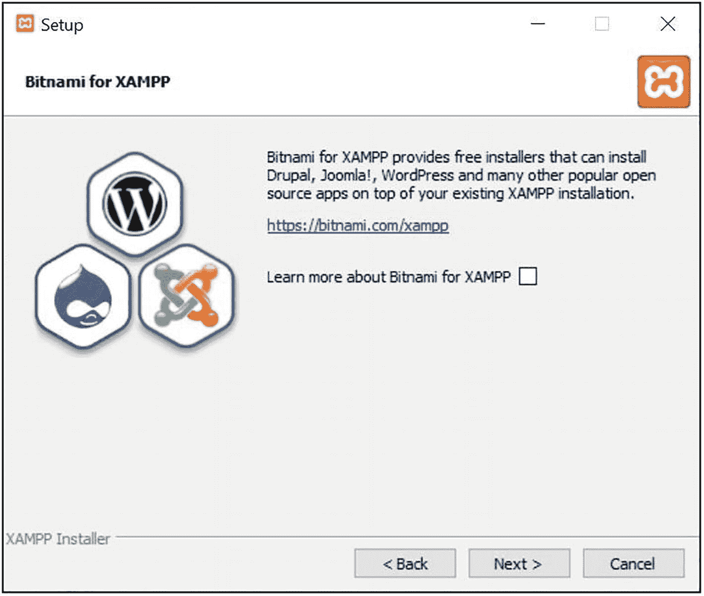

选择语言后点击“下一步”，你会看到这个对话框，这里可以选择是否进一步了解 Bitnami。

**图 1-9** 了解 Bitnami 更多信息

在图 1-10 所示的界面中点击“下一步”。

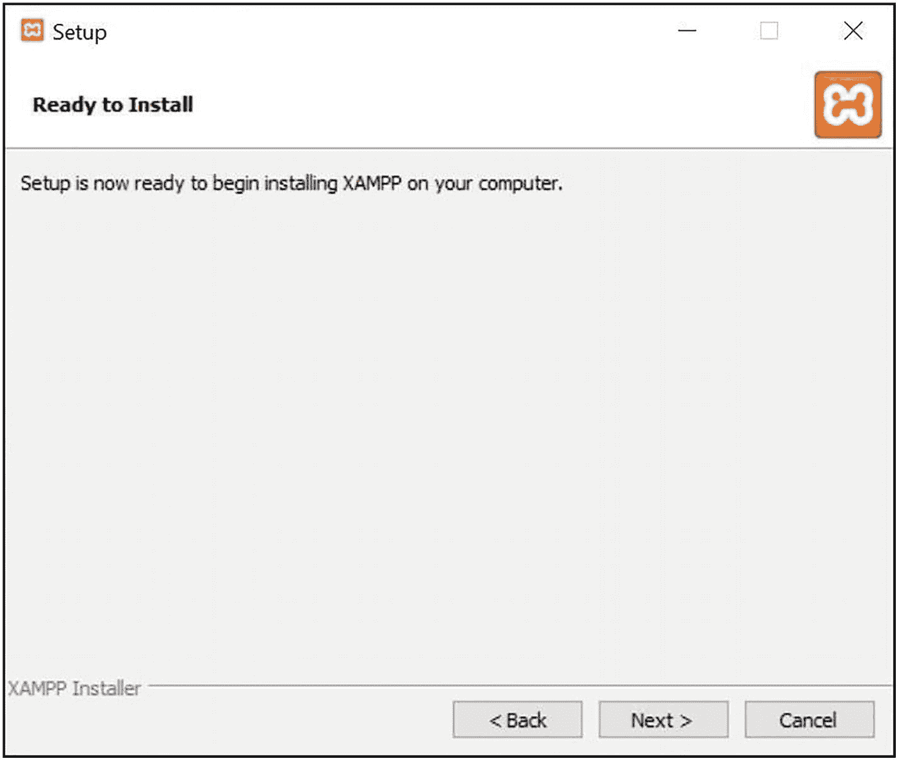

此对话框给了我们最后一次机会，来决定是否要在系统中安装 XAMPP。

**图 1-10** 准备安装

最后，安装开始了！

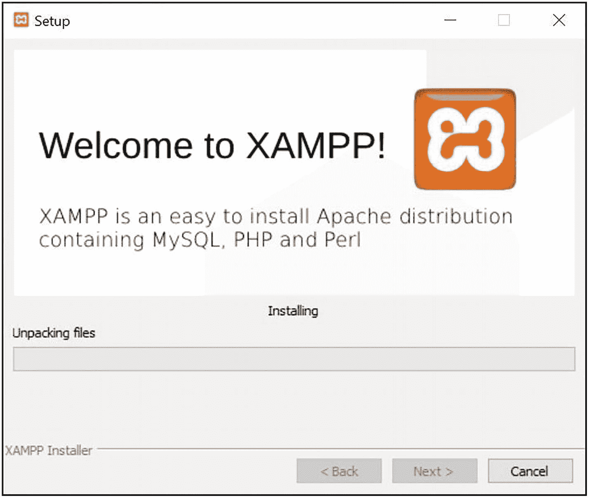

一旦 XAMPP 开始在系统中安装，此对话框便会显示安装进度。

**图 1-11** 安装开始

安装完成！点击“完成”。

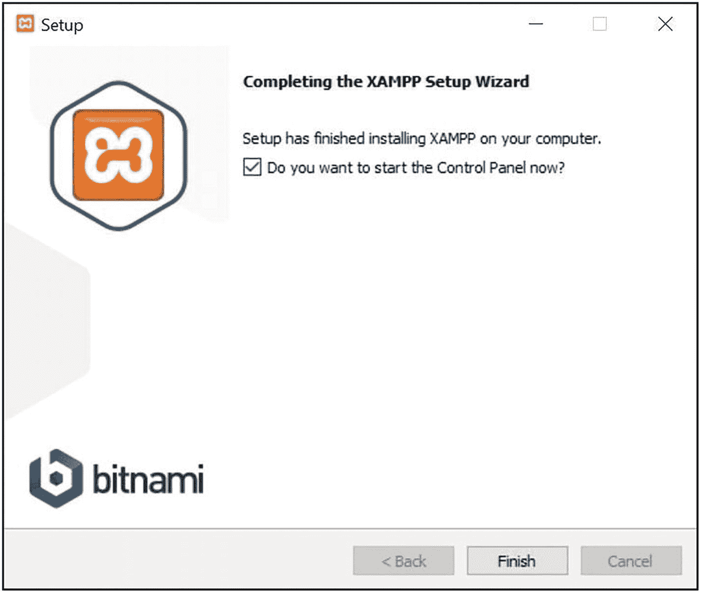

在系统完成安装过程后，此对话框提示我们需要点击“完成”，同时我们也可以在此处勾选启动控制面板。

**图 1-12** 安装完成

### 步骤 3：测试 XAMPP 以确保正确安装

到目前为止，我们已经使用 XAMPP 向导安装了 Apache、PHP 和 MySQL。下一步是激活 Apache，这样我们就可以编写一些 PHP 代码了。

#### 打开 XAMPP 控制面板

在图 1-12 中，我们勾选了“启动控制面板”选项。这将自动显示控制面板（图 1-13）。当你需要打开控制面板时，可以在操作系统的“开始”菜单中找到它。如果它已经启动而你之后需要再次访问，请点击系统托盘（操作系统窗口底部的菜单栏）中的 XAMPP 图标。该图标只有在控制面板首次启动后才会出现。

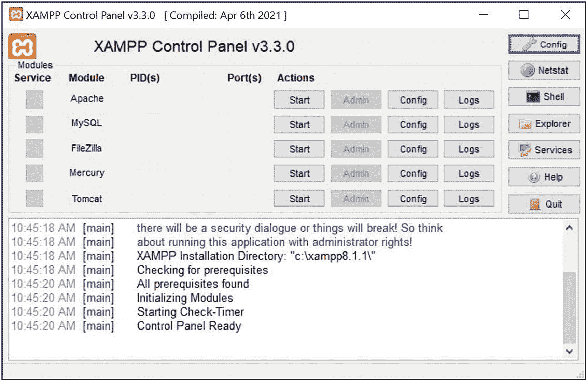

这个对话框代表 XAMPP 的控制面板，仅当我们选中了前一个对话框中的“现在启动控制面板”选项时才会显示。

**图 1-13** — 控制面板

**注意：** 作者已将文件存储在 `xampp8.1.1` 文件夹中，因为演示机器上存在其他版本。你的消息应指示文件存储在 `xampp` 文件夹中。

在你的开发机器上激活 Apache、PHP 和 MySQL 非常简单，只需在 XAMPP 管理器中点击 Apache 和 MySQL 旁边的“启动”按钮即可。系统可能会提示你确认允许服务器在计算机上运行，并且可能需要你输入系统密码。完成这些操作后，状态应显示 Apache 正在运行，如图 1-14 所示。

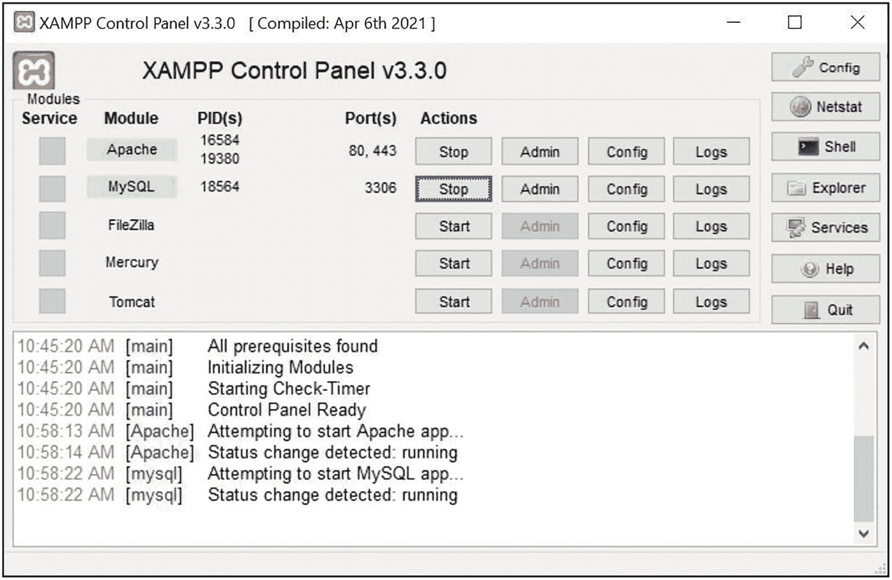

此对话框反映了不同的控制选项，我们可以在此管理所有模块的启动和停止操作，并且还可以查看配置信息。

**图 1-14** — Apache 和 MySQL 成功运行

**注意：** XAMPP 中提供了 FTP FileZilla（文件传输协议）选项。FTP 提供了一种在网络之间传输文件的方法。本书中的示例不需要此选项，因此无需在 XAMPP 控制面板中激活它。Mercury 和 Tomcat 也无需激活。前几章甚至不需要 MySQL 数据库。

#### 如果 Apache 无法运行怎么办？

有时，即使你尝试启动，XAMPP 的 Apache 服务器也无法运行。最常见的问题是它与计算机上使用相同*端口*的其他服务发生冲突。请检查你是否正在运行 Skype、Messenger 或类似的网络服务。请完全关闭它们，运气好的话，Apache 就能运行了。如果你胆子够大，也可以点击控制面板中的“配置”按钮，更改 Apache（或 MySQL）运行的端口。

如果仍然无法运行，你可以向互联网寻求帮助。XAMPP 在线社区非常有帮助，大多数安装问题已在 Apache Friends 论坛（[`https://community.apachefriends.org/f/`](https://community.apachefriends.org/f/)）中得到解答。你也可以查看 [`http://stackoverflow.com/`](http://stackoverflow.com/)。请记住，互联网是你的好帮手；肯定有人遇到过同样的问题。如果你收到错误消息，请将其复制并粘贴到浏览器中。你将找到针对你问题的建议解决方案。切勿为解决方案付费。有许多免费网站和博客会提供你正在寻找的答案。

##### 验证 Apache 和 PHP 是否在运行

检查 Apache 是否在你的开发机器上正常运行是一件简单的事情。只需打开浏览器并访问以下地址：`http://localhost`。如果一切顺利，你应该会看到一个类似于图 1-15 的屏幕。

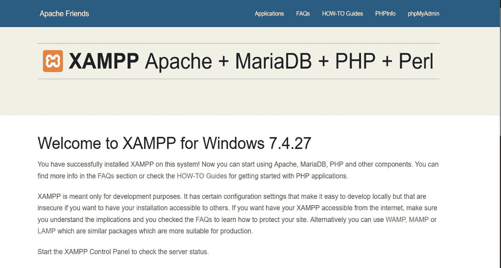

此窗口显示 XAMPP 的欢迎信息，同时还提供了关于我们可以通过它访问哪些模块的完整信息。

**图 1-15** — Apache 运行正常！

如果此屏幕加载成功，说明你已经成功在你的开发机器上安装了 Apache 和 PHP！我们尚未检查 MySQL/MariaDB 的状态；我们将在创建使用数据库的程序时检查该状态。地址 `http://localhost` 是当前所用计算机的别名。使用 XAMPP 时，在浏览器中访问 `http://localhost` 会告诉服务器打开根 Web 目录。该目录是 XAMPP 安装目录中的 `htdocs` 文件夹。另一种使用服务器访问本地机器根 Web 目录的方法是访问 *IP 地址*（分配给连接到计算机网络的任何设备的数字标识符），该地址是所有 HTTP 服务器的“主”地址：`http://127.0.0.1`。

### 选择 PHP 编辑器

你的开发机现已具备执行 PHP 所需的所有程序。下一步是决定如何编写脚本。PHP 脚本基于文本，因此你有众多选择，从简单的`Notepad.exe`和文本编辑程序，到高度专业化的*集成开发环境*（*IDE*）。

你很可能可以使用编写 HTML 和 CSS 的程序来编写 PHP 代码。一个好的编辑器应具备以下功能：

*   *语法高亮*：能够识别编程语言中的特定词汇，例如变量、控制结构及其他特殊文本。这些特殊文本会以高亮或其他方式区分，使代码浏览更加轻松。

*   *内置函数参考*：当你输入函数或对象方法名称时，此功能会显示可用参数、声明该函数的文件、函数的简短说明，以及参数和返回值的详细分解。处理大型库时，此功能价值连城，能免去你频繁访问 PHP 网站确认函数参数顺序或可接受参数的麻烦。

*   *自动补全功能*：此功能将可用 PHP 关键字添加到下拉列表中，让你能快速轻松地从中选择目标关键字，省去每次记忆和手动输入的麻烦。生产力争分夺秒，此功能是节省时间的绝佳方式。

*   *代码折叠*：此功能允许折叠代码片段，使工作区整洁有序，代码更易导航。

*   *自动缩进*：以一致的方式自动缩进你编写的代码。对人类阅读者而言，缩进后的代码更易读，因为缩进表明了代码块之间的关系。

*   *内置 FTP*：当你想将项目发布到万维网时，需要使用 FTP 将 PHP 文件上传到在线网络服务器。你可以使用独立的 FTP 程序，但如果 FTP 集成在 IDE 中，你只需单击一下即可上传整个项目。

有许多优秀的 IDE 和编辑器可供选择。初学者可能会发现从更简单的编辑器入手更容易。本书中的示例使用 Notepad++ (notepadplusplus.com) 创建，以保持开发的简洁性。当然，你也可以自由探索其他选项。以下列表提供了四种最受欢迎的免费 PHP IDE 的下载链接：

*   *NetBeans* – [`https://netbeans.org/`](https://netbeans.org/)

*   *Aptana* – [`www.aptana.com/`](http://www.aptana.com/)

*   *Eclipse* – [`www.eclipse.org/`](http://www.eclipse.org/)

*   *Visual Studio* – [`https://visualstudio.microsoft.com/`](https://visualstudio.microsoft.com/)

还有众多付费 PHP IDE，其中一些提供 30 天免费试用。我们选择推荐那些无需付费即可使用的产品。

**练习**：探索编辑 PHP 程序的不同选项。选择你觉得最顺手的编辑器或 IDE。如需安装帮助，请前往 YouTube 搜索相关安装演示视频。搜索时别忘了带上版本号。下一节，我们将创建第一个程序。为此，我们需要一个编辑器。

如前所述，本书示例将使用 Notepad++。使用其他任何编辑器，你也能毫无困难地跟进这些示例。如果你决定使用 IDE，则需查阅在线文档，了解如何在所选 IDE 中设置新项目。

### 创建你的第一个 PHP 程序

一切设置完毕并按预期运行后，就该投身实践，编写我们的第一个 PHP 脚本了。

作为一种服务器端脚本语言，PHP 需要像 Apache 这样的网络服务器才能运行。你刚刚在本地计算机上安装了 Apache，因此系统已准备就绪。Apache 会解释保存在名为`htdocs`文件夹内的任何 PHP 文件。你可以在 XAMPP 安装目录下的`XAMPP/xamppfiles/htdocs`中找到它。

你很快会创建许多 PHP 文件，因此最好保持文件井然有序。在`htdocs`内创建一个新文件夹，命名为`ch1`。

**注意**

要充分掌握和理解 PHP 编程，务必亲手编写本书提供的所有示例。虽然可以下载已完成代码，但只有通过实践才能学习和记住。花时间和精力自行创建程序是值得的。与所有编程书籍一样，可能存在出版错误。如果你确信代码与书中所示一致但仍收到错误，请检查本章提供的代码文件。每个代码文件都经过准确性和完整性测试。

现在打开你选择的编辑器或 IDE。弄清楚如何在编辑器中创建“新”文件，以便开始编码。然后严格按照所示输入以下程序。如果此代码遇到问题，请将你的代码与本书前言所述方式下载的第 1 章代码文件（`test.php`）中的示例进行核对。

```
Listing 1-1
test.php
```

务必在`htdocs`下创建的`ch1`文件夹中将文件另存为`test.php`。你的编辑器可能需要你“另存为”“所有文件”或“另存为”“php”。**务必**确保文件后缀为`.php`，而不是`.txt`或其他后缀。PHP 文件只有使用`.php`文件后缀才能执行。这是一个简单的过程，但如果保存不当，可能会让你“措手不及”。

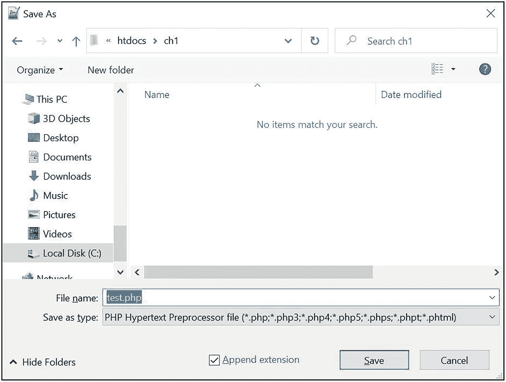

此对话框表示我们完成工作后希望如何保存输出文件，我们总是希望使用 Notepad 以`name.php`格式保存。

图 1-16

在 Notepad++中保存`test.php`

### 运行你的第一个 PHP 脚本

下一步是让 Apache 处理你的 PHP 脚本。如果你通过浏览器请求该脚本，此过程会自动发生。因此，打开网络浏览器，导航至`http://localhost/ch1/test.php`，欣赏浏览器中应出现的 PHP 生成输出（图 1-17）。你已经成功创建并执行了第一个 PHP 脚本！

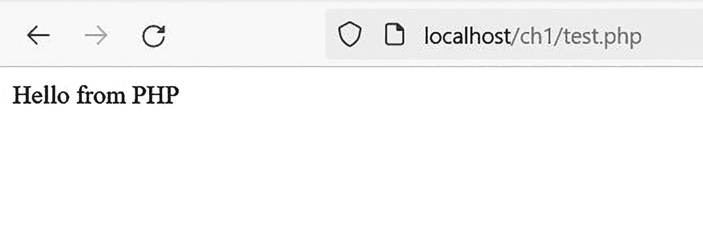

这是在系统中成功运行编写的程序后，我们看到的文件最终输出方式。

图 1-17

查看`test.php`的输出

如果你意外将文件保存为`.txt`后缀，你的代码将无法执行（图 1-18），你会看到代码的列表。如果你的代码未保存在`htdocs`文件夹下，或者 Apache 未运行，也会出现此情况。如果出现这种情况，请修正文件后缀、文件位置，或启动 Apache，然后重试。一旦成功，请为自己鼓掌。你做到了！你创建了第一个 PHP 程序（并顺利读完本章）。

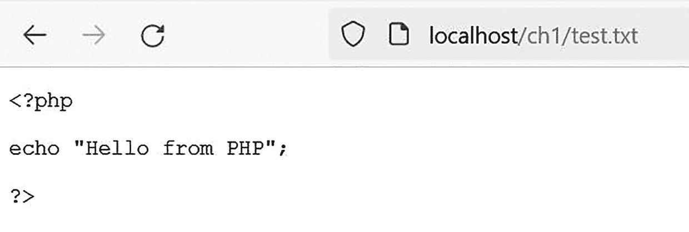

此窗口类型反映了编写的程序具有不正确的文件后缀。

图 1-18

以不正确文件后缀保存并运行`test.php`

## 总结

在本章中，我们学习了操作系统及其与程序的交互方式。我们了解到操作系统如何让程序开发者的工作变得更加轻松。我们还简单了解了 PHP、MySQL 和 Apache，明白了它们是什么以及在动态网站开发中扮演的角色。我们在本地计算机上快速便捷地安装了一个功能完备的开发环境，为测试程序创建了一个安全可靠的空间。

在下一章中，我们将学习 PHP 一个虽小但功能强大的子集，包括变量、对象以及一些原生语言结构和语句。你所学到的几乎所有内容都将在新的开发环境中进行测试，因此请保持 XAMPP 的 Apache 服务器处于开启和运行状态。

## 项目

1. 创建一个简单的 PHP 程序，使用本章介绍的 `echo` 指令显示你的姓名、地址以及一段关于你的个人信息。

2. 创建一个在`echo`指令内显示HTML代码的PHP程序。这对于动态网站有何用处？