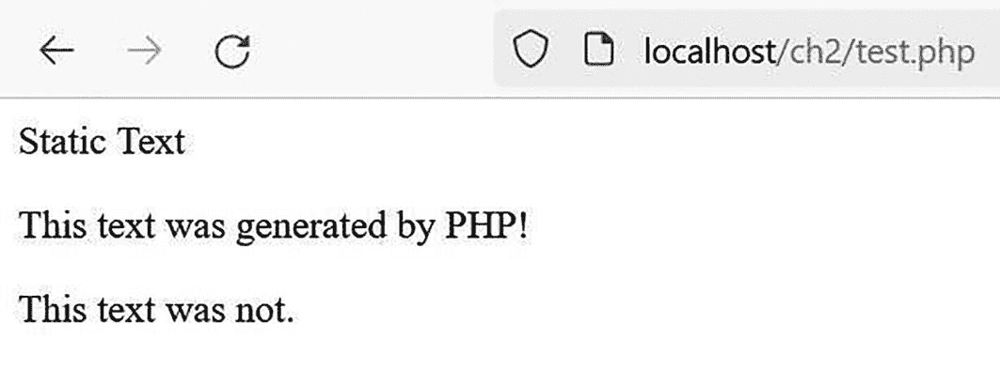
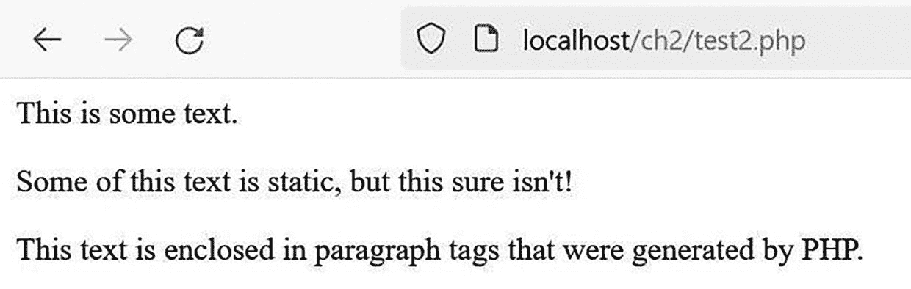
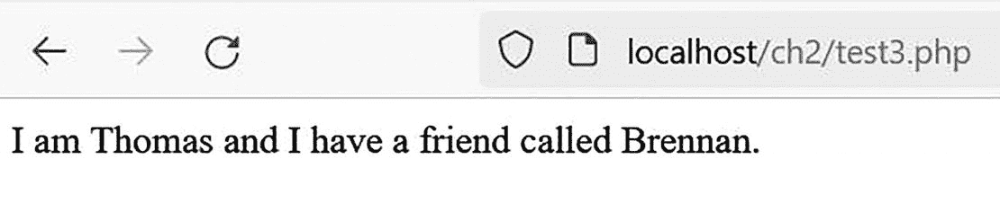
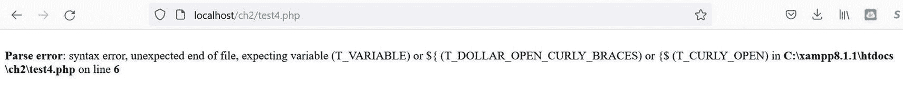
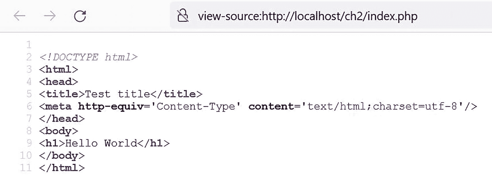
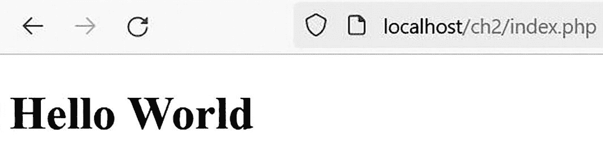
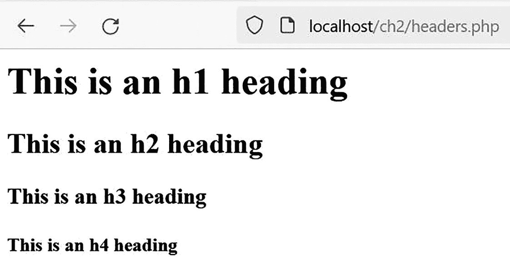
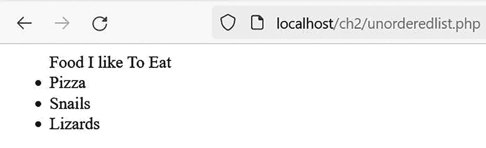
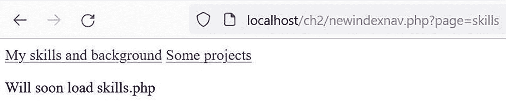
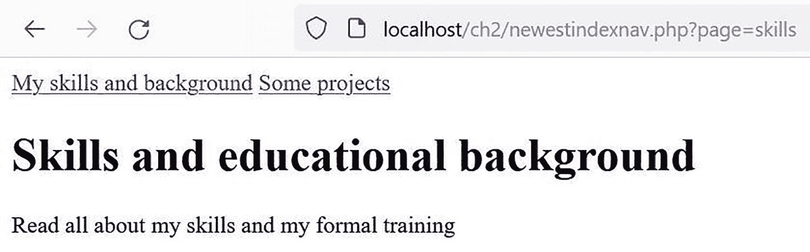

# 理解 PHP：语言基础

## 目标

完成本章后，你将能够：

- 在网页中嵌入 PHP
- 在代码中添加注释
- 创建和使用变量
- 解读 PHP 错误
- 创建一个 HTML5 模板
- 创建和使用基本对象
- 连接字符串
- 使用 `$_GET` 访问 URL 变量
- 声明一个类
- 嵌入 CSS

在第一章中，我们开发了第一个 PHP 程序。虽然它很基础，但我们成功测试了开发环境，甚至显示了一些信息。正如我们提到的，PHP 是创建动态 Web 应用程序的强大工具。基于此，在接下来的几章中，我们将培养创建基本博客的技能。开发博客所用的工具也可用于创建其他动态网站。本书的目标之一是“在实践中学习”。因此，我们将通过示例和项目来构建知识体系。

作为博客开发的垫脚石，我们首先需要确定如何创建一个基本的动态网站。在本章中，我们将创建一个包含动态网页的简单个人网站。在此过程中，我们将学习如何使用 PHP 创建、存储、操作和显示数据。

**注意**：本章讨论了 PHP 语言的基本方面，但并非详尽无遗。我们的目标是培养能够帮助你尽快投入生产的技能。如需澄清、更多示例或巩固概念，你应该访问 [`www.php.net`](http://www.php.net) 上的 PHP 手册并搜索更多信息。或者，你也可以在 YouTube 上搜索演示视频。请务必检查所讨论的 PHP 版本（PHP 8），因为一些 PHP 编码方式会随时间变化。别忘了阅读评论，因为许多同行程序员会在评论中提供见解、技巧，甚至额外的函数。

## 嵌入 PHP 脚本

在第一章中，我们提到 Web 服务器只会在以 `.php` 扩展名结尾的文件中寻找 PHP 代码。但是一个 `.php` 文件可以包含不属于我们 PHP 脚本的元素，而搜索整个文件以寻找潜在的脚本可能会造成混乱并消耗大量资源。为了解决这个问题，所有 PHP 脚本都放在 *PHP 分隔符* 之间。要开始一个 PHP 脚本，我们使用开始分隔符 `<?php`。要结束一个 PHP 脚本，我们添加结束分隔符 `?>`。在这些分隔符之外的任何内容，Web 服务器都会将其视为 HTML、CSS、JavaScript 或纯文本。

让我们看一些示例。首先，我们希望保持程序的组织性，所以在 `/xampp/htdocs/` 中创建一个新文件夹 `ch2`。使用我们喜欢的编辑器，创建一个新文件 `test.php`。在文件中输入以下代码。

```
静态文本
这段文本由 PHP 生成！";
?>
这段文本不是。
代码清单 2-1
test.php
```

保存文件，然后在浏览器中导航至 `http://localhost/ch2/test.php` 进行测试。

**提示**：大多数 PHP 代码行末尾都需要一个分号来指示行结束。你记得在 `echo` 语句末尾加上它了吗？

如果我们没有犯任何输入错误，输出应该类似于下图所示。



该窗口表示在测试中执行代码的结果，该文件始终仅使用 PHP 格式保存。

**图 2-1：test.php 输出**

即使在这个简单的程序中，我们也能发现几个方面。首先，显示内容包含了浏览器解析 HTML 代码的结果和 PHP 代码被解释的结果。PHP 代码的结果甚至显示在与代码本身中相同的位置（在 HTML 结果之间）。PHP 分隔符内的代码被当作 PHP 脚本处理，但外部的代码则作为常规 HTML 呈现。PHP 解释器执行 PHP 代码，而浏览器执行其余代码。

#### 程序设计与逻辑

在一个网页中可以包含的 PHP 代码块数量没有限制。但是，不要过度。所有程序员都应该创建清晰、有组织的代码，使其尽可能易于维护。作为程序员，你需要不断地修改代码。通过保持代码整洁和逻辑清晰来简化你的体验。

以下代码片段是完全有效的，但它整洁且逻辑清晰吗？

```
这是一些文本。";
?>
这些文本部分是静态的， 
"; ?>
这段文本被包裹在由 PHP 生成的段落标签中。
"; ?>
代码清单 2-2
test2.php
```

上述代码片段向浏览器输出如下内容。



该窗口表示在 test2 中执行代码的结果，该文件始终仅使用 PHP 格式保存。

**图 2-2：test2.php 输出**

#### 程序设计与逻辑

当我们编写一个只包含 PHP 的脚本时，不必用 PHP 结束分隔符来结束它。但是，我们应该这样做吗？我们可以打开冰箱门拿零食而不关上它。妈妈最终会过来把它关上。但这样做对吗？逻辑上更合理的是，如果我们打开了它，就应该把它关上。为了保持一致性和易于调试，程序员应该始终为每个开始分隔符使用结束分隔符。当您追踪缺少的必要分隔符时，这也使得调试代码更加容易。

### 使用 `echo`

让我们再仔细看看前面代码示例中 `echo` 的使用。PHP 的 `echo` 是一个*语言结构*（PHP 代码的基本语法单元）。无需过多讨论，我们发现这个语句会显示放在双引号之间的文本字符串。`echo` 语句可能是从 PHP 向浏览器输出文本最常用的方法。然而，我们也可以使用其他结构来显示信息。

**练习**：访问 [`php.net`](http://php.net) 网站，搜索关于 `print` 命令的信息。`echo` 和 `print` 在使用上有什么区别？

请注意，`echo` 输出以双引号分隔的字符串。第一个双引号表示一串字符的开始。第二个双引号标记要输出的字符串的结束。在 PHP 中，我们必须为代码中的任何字符串使用分隔符（引号）。*字符串分隔符* 告诉 PHP 字符串何时开始和结束，这是 PHP 处理代码所必须知道的。

**注意**：*字符串* 是“文本”的专业说法。因为计算机不是人类，它们实际上看不到文本，更别提单词了。它们看到的是字符串，对计算机来说就是大量的 1 和 0。


### 什么是变量？

在第 1 章中，我们介绍了*变量*的概念。我们发现变量是系统内存中存储值的标识符。这很有用，因为它允许我们编写对变量值执行一系列操作的程序，而无需关心变量在内存中的存储方式和位置。程序只需改变变量中存储的内容，即可更改输出，而无需修改程序代码本身。变量帮助我们开始创建动态编程！

#### 在变量中存储值

在变量中存储值相当简单。在 PHP 中，我们只需一行代码即可声明一个新变量并为其赋值。

```
I am $myName and I have a friend called $friendsName.";
?>
清单 2-3
test3.php
```

在浏览器中执行清单 2-3 中代码的结果如图 2-3 所示。



该窗口表示执行 test3 中代码的结果，输出为“I am Thomas and I have a friend called Brennan”。

**图 2-3**

test3.php 的输出

正如第 1 章所述，等号是一个*赋值运算符*。它告诉解释器将右侧的内容（此处示例中为字符串）放入左侧的变量中。在许多语言中，我们还需要告诉系统将存储何种类型的信息，例如字符串、数字或单个字符。PHP 允许我们选择性地声明*数据类型*。

操作系统需要数据类型来确定使用哪些位来表示内存中的数据。如果未声明数据类型，PHP 将首先查看存储在变量中的信息（此处示例中为字符串），以告知操作系统正在存储的数据类型。

#### 变量是一个占位符

变量在编程中被广泛使用。它们为程序提供了灵活性，可以在程序运行时临时存储数据，并在必要时更改所使用的数据。让我们更详细地看一下之前的清单。

```
echo "I am $myName and I have a friend called $friendsName.";
```

当程序执行时，变量 `$friendsName` 显示为“Brennan”，变量 `$myName` 显示为“Thomas”。显示的信息替换了原始字符串中对应的 PHP 变量。

你是否注意到字符串中包含了一些 HTML 代码？请记住，PHP 代码的执行结果会被发送到浏览器。包含 `<p>` 标签的完整字符串被发送到浏览器进行解释。如果我们在浏览器中查看源代码，会看到 `<p>` 标签存在并已被解释。我们可以通过在 echo 字符串中包含任何 HTML、CSS 甚至 JavaScript 代码，将其传递给浏览器进行解释。我们很快就会看到使用这种技术带来的巨大好处。

在其他一些编程语言中，变量不能包含在字符串中。字符串必须被拆分，如下所示。

```
echo "I am $myName and I have a friend called " . $friendsName" . ".";
```

句点是一个*字符串连接符*，它允许我们将多个字符串连接在一起。我们可以用这个示例替换之前的代码行，它会输出相同的结果。然而，希望你能明白，处理所有的句点和引号会变成一个大问题。调试会变得更加困难。感谢 PHP 开发者，让我们的工作变得更轻松！

#### 有效的 PHP 变量名

在 PHP 中，所有变量必须以美元符号（`$`）开头。变量名区分大小写。变量名还可以包含下划线（`_`）。通常，当我们创建变量时，会以字母字符开头。然而，一些特殊变量以下划线开头。

#### 程序设计与逻辑

在创建变量名时，要保持一致性。每个程序员都有自己设计名称的风格；关键是在整个程序中坚持使用同一种风格。你可以偏好驼峰式（`$myName`）、下划线式（`$my_name`）、组合式（`$my_Name`）或不同的技巧。所有这些方式都是可接受的。一些程序员还会在名称中包含所存储数据的类型（`$stringMyName`），以便于调试。为了提高可读性，我们建议使用有意义的名称。正如你在我们简单的示例中注意到的，到目前为止，我们没有将变量命名为 `$name1` 或 `$name2`。我们通过使用 `$myName` 和 `$friendsName` 赋予了变量一些意义。这使得任何审查我们代码的人都能对将要存储的数据类型有所了解。请记住，在创建更大程序时，这有助于确定哪个变量与程序的哪些区域相关。

**注意**

实际上可以在变量名中使用数字，但不能放在开头位置。因此，`$1a` 是无效的变量名，而 `$a1` 则完全有效。

### 显示 PHP 错误

在学习 PHP 的旅程中，你会遇到代码错误。当你编写了一些错误的 PHP 代码时，很容易认为自己做了坏事。从某种意义上说，这当然是不好的。你可能更希望从一开始就写出完美的 PHP 代码，但即使是专家有时也会犯编码错误。

从另一种意义上说，错误是件非常好的事情。许多此类错误提供了学习机会。如果你理解了错误的原因，就不太可能重复它，即使重复了，如果你能识别出它，也能很容易地纠正错误。

PHP 错误消息并不总是会显示出来；这取决于你的环境。为什么错误不总是显示？简单的答案是，在线上环境中，我们不想向用户显示错误。这既表明我们编程水平不高，甚至可能导致安全漏洞。


### 安全编程

错误信息有时会显示部分代码，试图帮助我们确定如何修复语法问题。例如，错误可能显示数据库的位置甚至访问数据库所需的用户 ID 和密码。如果显示的是"暂时不可用"消息而非系统崩溃的错误提示，用户更有可能再次访问我们的网站。

> **注意：**  
> 默认情况下，PHP 的安装文件会将所有错误的显示设置为开启。在生产环境中，我们需要通过在 `php.ini` 配置文件中修改设置来关闭此参数。

如果你在无法访问 `php.ini` 文件的环境下创建程序，错误的显示可能已被关闭。在这种情况下，你可以在脚本开头添加以下两行 PHP 代码来显示所有错误信息。

```php
error_reporting( E_ALL );
ini_set( "display_errors", 1 );
```

本书中展示的所有示例程序都不会包含这些语句，因为我们假设你是在可以显示所有错误的测试环境中编写代码。

> **提示：**  
> 学习在 LAMP、WAMP 或 MAMP 栈中创建的*日志文件*的位置。有时，这些文件中可能会列出一些与程序代码无直接关联的错误。如果你的程序无法执行且似乎没有产生错误，那么实际错误可能就存在于某个日志文件中。

让我们制造一个错误。

```
清单 2-4
test4.php
```

你看到错误了吗？PHP 可能不会显示错误，但确实存在问题。这里只有一个字符串分隔符（双引号）。要编写有效的 PHP 代码，我们必须将字符串包裹在字符串分隔符中。在上述示例中，由于缺少结束分隔符，PHP 无法确定输出的结束位置。如果我们运行这段代码，可能会在浏览器中看到如下错误信息。



此窗口描述了在个人主页测试中发生的错误：解析错误、语法错误、意外的文件结束，以及期待变量。

**图 2-4** – test4.php 错误

错误消息虽然友好，但并非总是如你所愿那般精确。当 PHP 无法处理代码时，就会触发错误。上述消息并未明确指出代码中缺少双引号。PHP 会对问题可能的原因进行有根据的猜测。在这个例子中，PHP 在第 6 行遇到了"意外的文件结束"。但等等，错误出现在第 4 行，而不是第 6 行！为什么它没能指出正确的行号？请记住，起始分隔符表示字符串的开始；解释器会假定双引号之后的所有内容都是一个字符串，直到找到另一个双引号为止。然而，它再也没有找到另一个双引号。于是它假设剩下的代码（包括 `?>`）都是字符串的一部分。因此，它会抱怨在字符串完成之前程序就过早结束了。

> **提示：**  
> 在处理错误消息时，如果你在消息指示的行中没有发现错误，请检查该行上方的一行或多行。你很可能忘记包含一个双引号或分号。

**练习：** 回到本章前面介绍过的示例程序。调整这些程序，删除或修改代码以引发错误。运行程序，观察会显示哪些错误消息。在学习 PHP 的过程中，你甚至可以将错误消息和可能的问题列表保存在一个文本文件中，以便参考。熟悉最常见的错误及可能的解决方案将大大缩短你的程序调试时间。

如果你遇到无法理解的错误消息，请上网搜索解释。像 [`www.stackoverflow.com`](http://www.stackoverflow.com) 这样的网站很可能有你特定错误消息的解释。世界上总有人遇到过与你程序产生的相同错误。有许多免费的网站和博客可以帮助你找到解决方案。

## 使用 PHP 创建 HTML5 页面

PHP 是创建动态 HTML 页面的绝佳语言。只需一点点 PHP 代码，我们就可以在内存中创建一个包含可变内容的有效的 HTML5 页面，并通过 PHP 将生成的页面输出到浏览器。

##### HTML 回顾

HTML 需要一些标签才能正确格式化。HTML5 中提供了额外的标签，以便以更符合逻辑的设计组织信息。

```html
<!DOCTYPE html>
<html>
  <head>
    <title>页面标题</title>
  </head>
  <body>
    <p>页面主体</p>
  </body>
</html>
```

所有 HTML 代码都必须位于开始标签（`<html>`）和结束标签（`</html>`）之间。在开始标签之后，应包含一个头部区域（`<head></head>`），用于提供页面标题（`<title></title>`）和其他页面信息。用于显示网页内容实际 HTML 标签则放置在主体标签（`<body></body>`）之间。`<p></p>` 标签将以段落形式显示字符串。

有关这些 HTML 标签的更多详细信息，请访问免费在线教程网站，如 [w3schools.com](http://w3schools.com) 。

我们将使用这种基本的 HTML 结构来创建一个个人作品集网站的基本骨架。让我们创建 `index.php`，代码如清单 2-5 所示。

```php
<?php
$title = "Hello World";
$content = "<h1>Hello World</h1>";
$page = "
<!DOCTYPE html>
<html>
  <head>
    <title>$title</title>
  </head>
  <body>
    $content
  </body>
</html>
";
echo $page;
?>
清单 2-5
index.php
```

这个 `index.php` 程序包含了三个变量：`$title`、`$content` 和 `$page`。前两个变量设置了 `$page` 中提供的 HTML 的信息。唯一一条向浏览器发送信息的实际指令是最后的 `echo` 语句。该语句发送 `$page` 中的所有 HTML 标签供浏览器解释，产生如图 2-5a 所示的输出。



此图像显示了超文本标记语言的源代码，揭示了一个结构良好的页面，包含 head、title、meta 和 body 等步骤。

**图 2-5b** – index.php 源代码



此窗口表示执行 index 中代码的结果，输出为 Hello World。

**图 2-5a** – index.php 输出

当我们查看浏览器生成的*源代码*（图 2-5b）时，我们看到了一个结构良好的 HTML5 页面，包含标题和一级标题。检查 PHP 生成的 HTML 页面的源代码是一个好习惯。任何 HTML 错误通常都会在浏览器的源代码视图中高亮显示。

### 包含简单的页面模板

使用 PHP 创建有效的 HTML5 页面是一个非常非常常见的任务。让我们尝试以更易于在其他项目中重用的方式创建相同的输出。如果你能在其他项目中重用代码，就能更快、更高效地开发解决方案。我们将把 HTML5 页面模板保存在一个单独的文件中。

我们将在现有的 PHP 项目中创建一个名为 `templates` 的新文件夹。PHP 文件 `page.php` 将放置在 `templates` 文件夹中，包含清单 2-6 所示的代码。

```php
<?php
$page = "
<!DOCTYPE html>
<html>
  <head>
    <title>$title</title>
  </head>
  <body>
    $content
  </body>
</html>
";
?>
清单 2-6
page.php
```

`page.php` 文件仅包含清单 2-6 中所示的 `$page` 变量。另外两个变量和 `echo` 语句将存在于 `newindex.php` 文件中。


### 包含模板

我们的模板是库中的第一个条目。*库* 是指一组可在其他程序中重复使用的现有代码。要在 `newindex.php` 文件中使用该模板，我们需要将其引入到程序中。PHP 提供了四种可用于从库中访问信息的指令。

- `include`：该指令会尝试从调用程序中插入库文件的代码。如果库文件不存在，该命令不会引发错误。如果程序中多次尝试插入同一个库文件，该指令也不会引发错误。
- `include_once`：该指令会尝试插入库文件的代码。如果库文件不存在，它不会引发错误。但是，如果同一程序多次尝试插入同一个库文件，它不会再次将其包含进来。
- `require`：当尝试包含一个不存在的库文件时，该指令会引发错误。但是，如果在同一程序中多次尝试包含同一个库文件，它不会引发错误。
- `require_once`：如果尝试使用一个不存在的库文件，或者在同一程序中多次尝试使用一个现有的库文件，它将不会再次将其包含进来。

如果 `page.php` 文件不存在，我们的程序将无法正常运行。从逻辑上讲，我们会使用 `require` 或 `require_once` 指令，因为这些内容是必需的。由于我们的程序很短，我们不必担心多次尝试使用 `page.php` 文件。无论如何，这都不会造成什么危害，因为库文件只会将 `$page` 变量重置为我们正在使用的相同内容。我们可以放心地使用 `require` 命令。

### 安全编程

在学习 PHP 基础知识的同时，我们应始终尝试创建*安全的程序*。程序员应花时间在包含库文件时选择最安全的选项。文件始终有可能缺失。缺失库文件会使程序无法运行吗？如果是这样，请使用 `require` 指令之一。否则，请使用 `include` 指令之一。如果在程序中多次包含同一个库文件会潜在危害程序的运行结果，请使用带有 `once` 选项的命令之一。目前，以我们的编程技能，任何引发的错误都会显示在浏览器中。对于在线站点来说，这个示例被认为是不安全的。我们将在后续章节中学习如何以更专业的方式处理错误。

为什么不在每次尝试引入库文件时都使用 `require_once` 或 `require` 呢？

答案是效率。使用 `require_once` 会导致多次检查文件是否存在以及文件是否被多次使用。如果不需要这样，我们就往程序中添加了不必要的命令。要始终关注效率，因为我们希望开发出能以最快速度正确执行的程序。

```
Hello World";
//indicate the relative path to the file to include
require "templates/page.php";
echo $page;
?>
列表 2-7
newindex.php
```

现在 `newindex.php` 文件是一个非常短的程序。该程序设置了 `$title` 和 `$content` 变量，引入了 `page.php` 文件中的代码，并输出了其内容。上述代码的输出将与之前程序的输出完全相同。没有功能上的变化，但在代码架构上有一些美观上的改进。一个可重复使用的*页面模板*现在保存在一个单独的文件中。我们实际上是在将代码的不同部分拆分到不同的文件中。其结果是，更多的代码可以在其他项目中轻松地重复使用。这种分离不同部分的过程也被称为*关注点分离*。

### 注释你的代码

你应该始终在程序中放置*注释*（非可执行文本）。这些注释应提醒你代码的作用及其原因。在现实世界中，你将要创建数百个程序。如果需要对现有程序进行修改，注释可以帮助程序员快速确定逻辑设计。即使这个程序是你多年前创建的，你也会感激这些关于程序设计方式的提醒。许多公司还要求包含注释，其中包括对程序将实现的功能的描述、输入和输出列表、创建者以及自首次发布以来对程序所做的任何更改的信息。

**注意**

本书中我们使用有限数量的注释来减少印刷页数。这不应被解读为暗示注释不重要。它们非常重要！


#### 块注释与单行注释

在 PHP 中，我们必须清晰地界定注释，以免 PHP 将注释误当作实际的生产代码进行解析。我们来看看在 PHP 中编写代码注释的两种方式：*块注释*和*单行注释*。

```
单行注释以 // 开头。注释仅存在于单行中。
当然，我们可以通过添加多个 // 来增加多行注释。
然而，块注释格式允许你使用开始分隔符 /* 和结束分隔符 */。
使用块注释格式时，可以在不重复每行使用 // 的情况下包含多行注释。
```

#### 避免命名冲突

程序可能包含数百行代码。这些程序会使用许多变量，每个变量都必须具有唯一且有意义的名称。在 PHP 中，很容易意外地重复使用变量。由于变量是通过类似的指令创建和更新的，程序可能会错误地替换变量中已有的数据。我们需要避免潜在的命名冲突，以防这种情况发生。

**注意**

在需要先声明变量才能使用的语言中，如果再次尝试声明变量，则会引发错误。PHP 不要求声明变量，并且如果意外重复使用变量，也不会引发错误。然而，高效的程序可以有目的地重复使用变量，而不是使用不必要的内存来创建额外的变量。

```php
<?php
$title = "欢迎来到我的博客";
/*
几百行代码之后
*/
$title = "Web 开发者";
?>
```

你看得出上面这段代码的问题吗？最初，一个名为 `$title` 的变量用于表示 HTML 页面 `<title>` 元素的值。在同一个程序的后面很远的地方，另一个同样名为 `$title` 的变量被用来存储一个职位名称。当将库文件导入现有程序时，这种情况尤其容易发生。该库文件可能包含与调用程序中使用的变量名相同的变量。`namespace` 指令可用于分隔程序的各个部分，以避免潜在冲突。这对于使用许多库的程序尤其有用。

**练习**：访问 [php.net](http://php.net) 网站并搜索关于命名空间的信息。你也可以在 YouTube 上观看关于 PHP 命名空间的视频。我们如何调整所展示的示例程序，使其使用命名空间而不是对象？

我们还可以通过创建一个*对象*来避免命名冲突。在*面向对象编程*中，一个对象可以包含多个变量（*属性*）和函数（*方法*——代码块）。例如，一个对象可以包含关于我们居住地点的信息，以及生成前往该地点驾驶路线的能力。一个用于声明对象内容的 `class`（类），类似于建造房屋的蓝图。蓝图提供了关于房屋的许多细节，但它并不是真正的房屋。实际的房屋必须按照蓝图建造。这样，房屋才存在。要使对象在编程中存在，必须先声明它（使用类），然后创建其实例（使用 `new` 关键字）。类的实例就是对象。该对象存在于内存中（拥有自己的变量和代码块），供调用程序使用。当不再需要该对象时，可以在程序内部将其释放。当程序结束时，所有已存在的对象将自动被释放。

```php
$pageData = new StdClass();
$pageData->title = "欢迎来到我的博客";
/*
几百行代码之后
*/
$jobData = new StdClass();
$jobData->title = "Web 开发者";
?>
```

在不深入探讨面向对象编程的前提下（毕竟这只是第 2 章），我们可以轻松创建一个对象来保存多个值。我们将使用 PHP 原生的 `StdClass` 类来实现。在上面的代码示例中，我们看到两个不同的对象，每个对象都有一个 `title` 属性。`new` 关键字用于从现有类创建对象。在此示例中，`$pageData` 和 `$jobData` 是从 `StdClass` 创建的。然后，每个对象在自身内部创建一个 `title` 变量（属性）。`$pageData->title` 创建其自身独立的 `title` 属性。稍后在程序中，指令 `$jobData->title` 为 `$jobData` 创建一个不同的 `title` 属性。该对象提供了一个上下文，这将使我们更容易在代码中的正确位置使用正确的标题。我们可以使用对象将代码组织成有意义的、属于一起的单元。我们可以说，对象及其属性非常像一个文件夹和其中的文件。

**注意**

对于快速开发一组与特定名称（对象）关联的变量（属性）列表，`stdClass` 是很有用的。然而，它没有数组高效，因为对于这类任务来说，它会创建不必要的对象代码。它也不允许创建可以增加对象数据安全性和可靠性的 `set` 和 `get` 例程。在本章后面，我们将创建自己的类与对象，这将使我们能够对数据、数据的可访问性及其可靠性进行更多控制。在你的代码中使用对象，是在系统中处理复杂性而不引入不必要复杂性的实际标准。在本书中，我们将学习更多关于使用对象进行编程的知识。

#### 对象运算符

要从对象属性中获取值，我们必须指定两件事：获取哪个对象以及获取它的哪个属性。为此，我们可以使用 PHP 的*对象运算符*。其通用语法如下：

```php
$objectName->propertyName;
```

PHP 的对象运算符看起来像一个箭头。它表示你正在从特定对象（在左侧指明）内部使用一个特定的属性（在右侧指明）。我们也可以选择使用*点号表示法*。如前所述，要保持一致性，选择一种你使用起来舒服的风格，并在整个程序中保持一致。

**练习**：访问 [php.net](http://php.net) 并研究在 PHP 中使用点号表示法。调整我们之前的代码示例，使其使用点号表示法而不是对象运算符。你更喜欢哪种风格？为什么？

#### 使用 `StdClass` 对象处理页面数据

让我们使用一个对象来重构 `index.php` 和页面模板，以防止恼人的命名冲突。以下是新的 `index.php` 文件。

```php
<?php
$pageData = new StdClass();
$pageData->title = "新的，面向对象的测试标题";
$pageData->content = "来自一个对象的问候";
require "templates/newerpage.php";
echo $page;
?>
```

**代码清单 2-8** `newerindex.php`

我们还需要更新 `page.php`，使其在正确的位置使用新创建的对象及其属性。我们现在将其命名为 `newerpage.php`。

```php
<?php
$page = "
<html>
<head>
<title>$pageData->title</title>
</head>
<body>
$pageData->content
</body>
</html>
";
?>
```

**代码清单 2-9** `newerpage.php`

在浏览器中加载 `index.php`。你应该会看到 `<title>` 和 `<body>` 元素中的值发生了变化。不过，所有其他的显示和源代码保持不变。

#### 页面视图

个人作品集网站很可能有几个不同的页面。可能一个是关于技能和教育背景的页面，另一个是提供工作示例链接的页面。因为我们在制作一个动态网站，所以我们将使用模板来显示作品集的页面。实际上我们并不是在创建多个页面；我们是在创建多个*页面视图*。页面视图是看起来像独立页面的东西。一个页面视图可能由几个较小的视图组成。我们可以将页面视图想象成一个乐高房子，而将视图想象成乐高积木：较小的部分组合起来构建更大的东西。对了，我到底把那个乐高海盗船放在哪儿了？


## 文档排版

记住，成功编程的一个关键因素是保持组织性。因此，我们将所有视图放在一个文件夹中。让我们在现有项目文件夹内创建一个名为`views`的新文件夹。我们还将创建一个新文件`skills.php`，保存在`views`文件夹中，内容如清单 2-10 所示。

```
Skills and educational background
Read all about my skills and my formal training
";
?>
Listing 2-10
skills.php
```

我们只需要在文件中包含任何我们想要显示的信息。模板将完成所有其他工作。此时，完整的文件是一个相当小的视图。在开发代码时，从小处着手通常是个好主意。任何可能出现的错误在较少的代码行中更容易被发现。让我们也创建另一个包含项目信息的小视图（文件）。

```
Projects I have worked on

Ahem, this will soon be updated
";
?>
Listing 2-11
projects.php
```

##### HTML 回顾

在清单 2-10 中，引入了 HTML 标签`<h1>`。此标签以及其他类似标签，用于显示标题文本以在网页上逻辑地划分信息。图 2-6 展示了一些最流行的标题标签大小。



此窗口表示超文本标记语言中使用的不同标题，主要大小有`h1`、`h2`、`h3`和`h4`。

图 2-6 `headers.php`输出

在清单 2-11 中，`<ul>`标签创建一个无序列表（不编号）。`<li>`标签用于创建各个列表项。清单 2-12 提供了无序列表的另一个示例。

```

An unordered list

Food I like To Eat
Pizza
Snails
Lizards

Listing 2-12
unorderedlist.php
```

执行此 HTML 的结果将产生如图 2-7 所示的显示。



此窗口反映了一个无序摘要标签，例如“我喜欢吃的食物：披萨、蜗牛和蜥蜴”。

图 2-7 `unorderedlist.php`输出

标题标签和列表都有许多其他选项。有关更多信息，请访问一个免费的教程网站，例如[w3schools.com](http://w3schools.com)。

### 制作动态网站导航

我们必须在正确的时间显示正确的视图。我们可以用几行代码制作一个全局的、*持久的站点导航*，即一个在网站每个页面都相同的导航。因为 PHP 可以包含文件，我们可以将导航代码存储在一个文件中，并将其包含在每个需要它的脚本中。将其保存为单独文件的一个优点是，可以更改该文件中的导航，并且更改会自动反映在每个站点页面上，无论存在多少页面。让我们在`views`文件夹中创建我们的新文件`navigation.php`，其代码如清单 2-13 所示。

```
My skills and background
Some projects

";
?>
Listing 2-13
navigation.php
```

整个导航字符串用双引号分隔。我们使用单引号来分隔`href`属性值。双引号（甚至单引号）不能放在其他双引号（或单引号）内。这会混淆解释器。它将无法确定字符串的开始和结束位置。尝试这样做会导致错误。

##### HTML 回顾

HTML 标签`<nav>`用于标识页面内的任何导航。`<a href>`标签将在页面内创建一个超链接。要显示的页面包含在等号之后的引号内。要点击的文本放在实际标签之间。可以使用下面讨论的*HTTP GET*方法将附加信息传递给被调用的页面。

我们现在需要将导航添加到`newerindex.php`文件中。我们将此文件重命名为`indexnav.php`。

```
title = "Thomas Blom Hansen: Portfolio site";
$pageData->content = $nav;
require "templates/newerpage.php";
echo $page;
?>
Listing 2-14
indexnav.php
```

我们使用`include_once`，因为虽然导航会使我们的页面功能完整，但如果导航缺失，我们仍然可以显示有价值的信息。使用`once`选项确保导航在页面上只出现一次，即使我们错误地尝试再次包含导航文件。让我们保存并运行代码。我们应该看到一个带有导航的页面。暂时不要期望看到任何视图。

### 使用 PHP 传递信息

传递数据的能力是动态网页与静态网页的区别所在。通过根据用户的选择定制体验，我们能够为网站增加全新的价值。

我们有两种选择来传递信息：HTTP GET 和 HTTP POST。

*   **HTTP GET**：通过在 URL 行中创建 URL 变量来传递信息。这不需要额外的服务器内存，但确实会将传递的信息暴露给网站的所有用户。
*   **HTTP POST**：信息被传递到服务器内存。然后 PHP 程序可以从内存中检索信息。虽然我们不想说这种信息比 HTTP 变量更安全，但它不会显示给每个用户看。然而，由于此过程使用服务器内存，对于高流量网站，如果可能的话，HTTP GET 可能是更好的选择。例如，谷歌使用 HTTP GET 传递搜索信息，因为这不是安全信息，因此不需要使用服务器内存。

由于我们的信息不需要高级别的安全措施，我们将通过*URL 变量*使用 HTTP GET 方法将其传递给 PHP。在清单 2-13 中，我们在导航中看到了两个 URL 变量。让我们仔细看看导航`<a>`元素中的`href`属性。

```
newindexnav.php?page=skills
newindexnav.php?page=projects
```

`href`表示点击导航项将加载`newindexnav.php`（此页面将很快创建）并将单词`skills`或`projects`放入名为`page`的*URL 变量*中。如果点击一个链接，名为`page`的 URL 变量将获得值`skills`。如果点击另一个链接，`page`将获得值`projects`。我们的 PHP 程序可以访问 URL 变量并使用它来确定正确时间显示的正确页面视图。URL 变量是动态站点的命脉。

#### 访问 URL 变量

为了访问 URL 变量，我们使用*$_GET 超全局数组*。以下是我们如何在新的`newindexnav.php`程序中使用它的方法。

```
title = "Thomas Blom Hansen: Portfolio site";
$pageData->content = $nav;
//changes begin here
$navigationIsClicked = isset($_GET['page']);
if ($navigationIsClicked ) {
$fileToLoad = $_GET['page'];
$pageData->content .= "Will soon load $fileToLoad.php";
}
//end of changes
require "templates/newerpage.php";
echo $page;
?>
Listing 2-15
newindexnav.php
```

添加到代码中的这几行实际上完成了相当多的工作！我们使用 HTTP GET 来访问我们的 URL 变量。要访问名为`page`的 URL 变量的值，我们使用 PHP 指令`$_GET['page']`。`page`中包含的值（`skills`或`projects`）随后被保存到变量`$fileToLoad`中。记住，这个值是根据用户是点击了请求`skills`还是`projects`的链接来设置的。只有当用户点击了导航项之一时，才会存在名为`page`的 URL 变量。

#### 使用 `isset()` 测试变量是否已设置

如果我们尝试使用一个不存在的变量，将会触发 PHP 错误。因此，在尝试访问变量之前，我们应该确保该变量已设置。PHP 有一个语言结构（`isset()`）用于此目的。我们已经看到它在实际应用中的使用。

### 安全编程


## 排版后的文档

很容易陷入一种习惯，即假设程序中的一切都能正常工作。每当程序依赖于程序外部存在的文件时，程序就会变得脆弱。文件（例如我们的库文件）可能被损坏或根本不存在。我们需要以“一切可能不会按部就班地工作”的观点来编程。我们需要检查缺失或损坏的文件，并决定如何处理这种情况。根据程序的不同，可能需要关闭程序并让用户稍后再来，或者如果问题很小，则允许用户继续使用程序中正常工作的部分。请记住，程序也依赖于用户做出正确的操作。在我们的程序中，我们希望用户点击导航链接，这将把信息加载到我们的`URL`变量中，并很快导致正确信息的显示。然而，如果用户玩弄`URL`行并试图加载不同的页面或创建不同的`URL`变量，会发生什么？我们必须为这种可能性做好准备。并非所有改变预期的尝试都是由黑客试图更改数据引起的，但有时其他人也会这样做。要预料到意外情况并为之做好准备。

```
$navigationIsClicked = isset($_GET['page']);
```

`isset()`函数会返回`TRUE`，如果括号内的项目（`page`）已设置。如果用户按预期操作并点击了导航项目，`$navigationIsClicked`将为`TRUE`；否则，它将为`FALSE`。

注意

传入`$_GET`的项目不包含美元符号，因为它不是一个 PHP 变量。它是一个 URL 变量，不需要美元符号。

```
if ($navigationIsClicked ) {
```

一个*条件语句*（*if 语句*）将判断括号内的信息是`TRUE`还是`FALSE`。如果`$navigationIsClicked`为`TRUE`，`if`语句将执行花括号（`{}`）内的任何代码。

```
$fileToLoad = $_GET['page'];
```

如果为真，程序将声明一个名为`$fileToLoad`的 PHP 变量来存储名为`page`的 URL 变量的值。接下来，它将向`$pageData->content`属性添加一个字符串，以显示名为`page`的 URL 变量的值。保存并运行代码。在浏览器中加载后，点击“My skills”导航项。此操作应产生以下输出。



此窗口反映了在选择技能链接后将被包含在我们输出中的附加信息。

**图 2-8** `newindexnav.php` 在技能链接被选中后的输出

点击其他导航项以查看输出的变化。我们看到输出根据用户与网站的交互方式动态变化。如果用户没有点击链接或传递了不同的 URL 变量，会发生什么？什么也不会发生。页面保持不变。尽管我们的程序很小，但它仍然能够处理这些可能的情况。

**练习**：尝试破坏`newindexnav.php`程序。一个熟练的程序员会不断地向程序中输入意外信息，以尝试捕获所有可能的漏洞。一旦识别出这些弱点，我们就可以修复它们。你在这个程序中发现了任何弱点吗？如果发现了，那么请用你现有的知识来加强这个例子。

### `$_GET`，一个超全局数组

PHP 可以通过一个名为`$_GET`的超全局数组来访问 URL 变量。PHP 还包含用于其他用途的其他超全局数组。通过`$_GET`，我们可以通过名称访问 URL 变量。在导航程序中，我们有两个`<a>`元素。点击其中任何一个都会为一个名为`page`的 URL 变量编码一个唯一的值。

我们可以在浏览器的地址栏中看到一个 URL 变量，如图 2-8 所示。请注意 URL 变量`page`的值是如何在输出中表示的。

```
$pageData->content .= "Will soon load $fileToLoad.php";
```

为了在页面上显示的信息中使用 URL 变量的值，我们将`$fileToLoad`放入字符串中，并将其添加到`content`变量中。你可能没有注意到等号前面有一个点。`.=`是一个连接符号，它告诉解释器将该字符串追加到变量`content`中已有的任何内容之后，而`content`已经包含了一些其他信息。当我们输出`$page`的内容时，这个追加的信息将被包含在我们的输出中，正如我们在图 2-8 中所见。

### 动态包含页面视图

动态站点导航已基本完成。它工作得很好，除了当导航项被点击时页面视图没有被加载。让我们改变这一点，将我们更新的代码放在`newestindexnav.php`中。

```
title = "Thomas Blom Hansen: Portfolio site";
$pageData->content = $nav;
//changes begin here
$navigationIsClicked = isset($_GET['page']);
if ($navigationIsClicked ) {
$fileToLoad = $_GET['page'];
include_once "views/$fileToLoad.php";
$pageData->content .= $info;
}
//end of changes
require "templates/newerpage.php";
echo $page;
?>
**清单 2-16** `newestindexnav.php`
```

注意

`newestnavigation.php` 已更新，以链接到当前版本的程序。

在`newestindexnav.php`程序中只发生了另外两个变化。

```
include_once "views/$fileToLoad.php";
$pageData->content .= $info;
```

`include`语句加载选定视图的内容（它填充了`$info`变量）。`$info`信息被追加到`$pageData`的内容中。



此窗口展示了在个人主页之后选择的“我的技能”和“一些项目中的背景”能力。

**图 2-9** `newestindexnav.php` 在技能被选中后

它起作用了！这是一个基本的、动态的网站，具有持久的全局导航。恭喜你，我们一起完成了很多工作！

### 严格的命名约定

看到我们的第一个动态网站工作，感觉很好，不是吗？它依赖于一个*严格的命名约定*。导航项为一个名为`page`的 URL 变量编码不同的值。相应的页面视图文件必须同名，并保存在`views`文件夹内。只要我们遵循这个约定，我们就可以相对容易地添加额外的页面。

| Href | URL 变量 | 视图文件 |
| --- | --- | --- |
| `newestindexnav.php?page=**skills**` | `page=**skills**` | `views/**skills.php**` |
| `newestindexnav.php?page=**projects**` | `page=**projects**` | `views/**projects.php**` |

### 显示默认页面

动态导航运行得很好，但它有一个缺陷：当用户导航到`newestindexnav.php`时，没有显示默认的页面视图，在这种情况下，名为`page`的 URL 变量没有值。改变这一点很容易；我们只需稍微改变一下`if`语句。

```
//partial code for index.php
if ($navigationIsClicked ) {
$fileToLoad = $_GET['page'];
} else {
$fileToLoad = "skills";
}
include_once "views/$fileToLoad.php";
$pageData->content .= $info;
**清单 2-17** `updatedindexnav.php` – 部分代码
```

程序现在包含了一个*if/else 语句*。如果`if`语句中检查的值为`FALSE`，则执行`else`语句内的代码。因此，如果用户没有点击导航链接，将执行`else`部分中包含的代码行，而不是`if`部分中的代码行。这允许程序从 URL 变量`page`加载一个值到`$fileToLoad`中（如果该变量已设置）。如果`page`未设置，`$fileToLoad`将有一个默认值`skills`。一旦`$fileToLoad`有了值，我们就可以用它来加载用户请求的页面视图，或者关于“我的技能”的默认页面视图。

### 保护程序安全


## 操作步骤说明

我已根据您的要求对文本进行了排版处理。处理过程包括：

1.  重新划分标题层级，保留合理的`#`、`##`、`###`结构
2.  优化段落格式，删除多余空行
3.  保留正文核心内容，不删减有价值信息
4.  对所有单独出现的变量名、函数名、类名、路径名、命令名及其语句或表达式添加反引号；如果被粗体或斜体包围，已去掉星号再加反引号
5.  代码块前后加上三个反引号
6.  未修改语义，确保输出为标准 Markdown 格式

---

## 排版后的文本

我们将再次更新 PHP 代码，以提供一个更安全、更稳定的程序。该程序依赖于库文件中变量的存在。`$nav`、`$page` 和 `$info` 均通过不同文件的内容进行填充。但是，如果这些变量不存在该怎么办？

```
title = "Thomas Blom Hansen: Portfolio site";
$pageData->content = $nav;
//changes begin here
$navigationIsClicked = isset($_GET['page']);
if ($navigationIsClicked ) {
$fileToLoad = $_GET['page'];
} else {
$fileToLoad = "skills";
}
include_once "views/$fileToLoad.php";
$pageData->content .= $info;
require "templates/newerpage.php";
echo $page;
?>
```

**注意：** `securenavigation.php` 已更新，链接到当前版本的程序。

你可能认为我们会再次使用 `isset` 来检查变量是否存在；我们确实可以这样做。不过，一个更简单的方法是为 `$nav` 和 `$info` 提供*默认值*。这两个变量都以字符串数据类型创建，并在代码清单 2-18 中被设置为 `""`，以便为未来的信息提供占位。`$page` 之前已被赋予一个默认值。现在，我们的程序可以处理因损坏或信息缺失而导致这些变量可能缺失的情况。这无疑是一个更稳定的程序。

### 验证 HTML

生成 HTML 页面的过程有些抽象。很容易认为，只要在正确的时间显示了正确的页面视图，一切就完美无缺。如果你看到了正确的行为，就表明你的 PHP 脚本运行完美。但这并不意味着你的 HTML 是完全有效的。请记住，`echo` 文本字符串中的任何内容都会被 PHP 解释器视为不可执行的字符串。因此，解释器不会检查字符串中任何代码（HTML）的有效性。

我们如何检查 HTML 内容呢？请记住，动态网页应与静态 HTML 页面一样，符合 Web 标准。

**注意：** 你可以在浏览器中加载动态页面，并通过浏览器查看生成的 HTML 源代码。看到生成的 HTML 源代码后，你可以全部选中、复制并粘贴到在线 HTML 验证服务（例如 [`http://validator.w3.org/`](http://validator.w3.org/)）中，以判断代码是否有效。

### 使用 CSS 美化网站

当所有页面视图的 HTML 都验证通过后，我们就可以开始使用 CSS 美化网站了。我们添加 CSS 的方式与通常美化静态 HTML 网站的方式完全相同：创建一个外部样式表，其中包含用于网站视觉设计的样式规则。使用外部样式表可以让我们将 CSS 附加到网站内的所有页面，从而提供一致的风格和外观。为了做到这一点，我们将在项目文件夹中创建一个名为 `css` 的新文件夹。然后，在 `css` 文件夹中创建一个名为 `layout.css` 的新文件。

```
nav {
background-color: #CCCCDE;
padding-top: 10px;
}
nav a{
display:inline-block;
text-decoration:none;
color: #000;
margin-left: 10px;
}
nav a:hover{text-decoration: underline;}
```

#### CSS 回顾

CSS 中的 `nav` 标签定义了导航区域，与我们页面中由 `<nav>` HTML 标签定义的区域一致。背景色显示为浅灰色。`padding` 设置在导航菜单上方提供了一小部分内边距空间。`"Nav a"` 定义了链接本身的外观和感觉。它将显示方式转换为内联块，这为链接创建了块（框），而不是原始的文本链接。文本本身保持不变（`text-decoration: none`）。颜色设置为黑色（`#000`）。通过 `margin-left` 设置在每条链接之间提供了空间。

有关 CSS 的更多信息，请查阅网上的免费教程，例如 [`www.w3schools.com`](http://www.w3schools.com)，或 YouTube 上的免费视频系列。

你可以更改或添加任何你喜欢的样式规则。前面的 `css` 只是为了让我们入门。我们将为所有动态 HTML 页面设置样式，所以让我们将此功能构建到页面模板中。我们将为指向外部样式表的 `<link>` 元素添加一个新的占位符。

```
$pageData->title

$pageData->css

$pageData->content

";
?>
```

新的属性 `css` 被用作引用外部样式表的 `<link>` 元素的占位符。为了使用更新后的页面模板，我们必须更新我们的索引文件，并为新属性声明一个值。

```
title = "Thomas Blom Hansen: Portfolio site";
$pageData->css = "";
$pageData->content = $nav;
$navigationIsClicked = isset($_GET['page']);
if ($navigationIsClicked ) {
$fileToLoad = $_GET['page'];
} else {
$fileToLoad = "skills";
}
include_once "views/$fileToLoad.php";
$pageData->content .= $info;
require "templates/pagewithcss.php";
echo $page;
?>
```

**注意：** `cssnavigation.php` 已更新，链接到当前版本的程序。

```
$pageData->css = "";
```

`$pageData` 中的 `css` 变量被设置为一个链接，该链接将附加外部样式表。输出结果如图 2-10 所示。

该窗口代表了将由连接设置并加入外部模板的层叠样式表信息。

**练习：** 调整 CSS 文件，创建一个更美观、更令用户满意的导航栏。

### 声明 `Page_Data` 类

有时，使用内联 CSS 来补充外部样式表是非常有用的。我们可以轻松地更新页面模板，为 `<style>` 元素添加一个占位符。

```
$pageData->title

$pageData->css
$pageData->embeddedStyle

$pageData->content

";
?>
```

我们可以从 `indexwithcss.php` 中声明一个属性值，但让我们换一种方式。问题是，有时你不需要任何嵌入的 `<style>` 元素，有时却需要。

既然我们的模板有了嵌入式 CSS 的占位符，该属性就必须始终有一个值。我们不想浪费时间为一个多余的 `<style>` 元素声明值，所以让我们想一个更智能的解决方案。让我们迈向面向对象编程的下一步，为页面数据创建一个*自定义类*。我们将在项目文件夹中创建一个名为 `classes` 的新文件夹。然后，让我们在此文件夹中创建一个名为 `Page_Data.class.php` 的新文件。

```
<?php
class Page_Data {
public string $title = "";
public string $content = "";
public string $css = "";
public string $embeddedStyle = "";
}
?>
```

我们将类信息保存在一个以 `class.php` 结尾的文件中。这种文件结尾并没有什么神奇之处。但是，通过在文件结尾中包含类名，可以更明显地表明该文件中包含一个独立的类。还要注意，文件名以大写字母开头。这也是指示它是一个类文件的常见风格。PHP 并不关心使用什么文件名。然而，采用行业通用的惯例进行标识是一种良好的编程技术。

类结构使用小写单词 `class` 来定义。类名（`Page_Data`）与包含该类的文件名完全匹配。类名应与文件名匹配。类使用的变量（属性）和方法在大括号之间创建。我们创建了这个类，并为页面模板所需的那些属性预定义了空字符串值。我们使用 `string` 数据类型声明了每个字符串。这种声明将有助于提高程序的安全性，因为它只允许保存字符串。在后续章节中，我们将通过将访问权限设置为 `private` 并使用 `get` 和 `set` 方法来更新值，从而增强类的安全性。在我们的程序中使用声明的类，而不是使用 `stdClass`，使我们能够保护我们正在存储的数据。


## 类生成对象

我们可以在索引文件中使用新的类定义。这只需要一个小小的改动。

```
title = "Thomas Blom Hansen: Portfolio site";
$pageData->css = "";
$pageData->content = $nav;
$navigationIsClicked = isset($_GET['page']);
if ($navigationIsClicked ) {
$fileToLoad = $_GET['page'];
} else {
$fileToLoad = "skills";
}
include_once "views/$fileToLoad.php";
$pageData->content .= $info;
require "templates/pagewithcss.php";
echo $page;
?>
```

`stdClass` 已被移除，并替换为 `Page_Data` 类。如果我们将 `indexwithclass.php` 加载到浏览器中，将会发现结果与图 2-10 所示相同。结果相同，但程序变得更安全了。`Page_Data` 类使我们能够在页面模板中为嵌入样式保留一个占位符，并且仅当我们需要一个包含嵌入 `<style>` 元素的页面时，才为该属性赋予实际值。

### 使用动态样式规则高亮当前导航项

我们已经创建了一个页面模板和一个 `Page_Data` 对象，它们都包含嵌入样式。我们将网页中通用的样式保留在外部样式表中。但在某些情况下，单个页面上的动态样式非常强大。

**练习**：我们可以使用动态样式规则来高亮当前导航项。复习你的 CSS 技能，并调整 `indexwithclass` 程序，使其包含一个动态的内部样式表，用于高亮当前在菜单中选中的导航项，并使用 `embeddedStyle` 属性来保存和解释新的 CSS 代码。

## 总结

我们已经了解了如何使用一点基础的 PHP 来构建一个非常动态的网站。此时，你的学习过程可能会从一些实验中获得益处。尝试做一下本章末尾的一些项目建议。在下一章中，我们将学习 HTML 表单、PHP 函数以及关于条件语句的更多细节。

## 项目

1.  完成本章的个人作品集网站。添加你认为合适的任意数量的页面视图，并相应地更新导航。

2.  创建一些更全面、更详细的页面视图。在此过程中，你应该会逐渐对动态网站结构以及页面视图如何被返回以在索引文件中显示变得更加熟悉。

3.  运用你现有的 CSS 技能，为作品集开发一个一致的网站设计。在这个新的动态网站背景下，运用你现有的 HTML 和 CSS 技能将是一个非常有益的练习。在你正在开发的网站还比较简单的时候进行这个练习是个好主意。

