# 3. 表单管理

## 目标

完成本章后，你将能够

*   创建和使用 HTML 表单

*   使用超全局数组

*   使用 `GET` 方法通过 HTML 表单编码 URL 变量

*   使用 `POST` 方法通过 HTML 表单编码 URL 变量

*   创建一个动态的 PHP 测验程序

*   使用 `if-else` 条件语句

*   创建和使用命名函数

*   使用构造函数、设置器和获取器创建安全的类和对象

*   理解一部美国西部片如何教你编写整洁的代码

*   发现为什么代码真的是诗

在第 2 章中，我们构建了一个动态的个人作品集网站。在此过程中，我们看到了如何使用 `<a>` 元素编码 URL 变量，以及如何利用 `$_GET` 超全局变量访问这些 URL 变量。传递数据是动态网页与静态网页的区别所在。通过根据用户的选择定制体验，我们能够为网站增加全新的价值。

现在我们已经接触了一点 PHP 并编写了一个基础的动态网站，我们准备更深入地研究 URL 变量。HTML `<form>` 元素通常用于创建允许用户与动态网站交互的界面。如果你在网络上花过一些时间，你一定使用过 HTML 表单来提交信息。为了创建一个交互式网站，我们需要学习如何创建和使用这些 HTML 表单。

## 什么是表单？

HTML 表单允许访问者与网站交互并提供信息。图 3-1 展示了 Google 的搜索表单。当用户访问 `www.google.com`，在文本输入字段中输入搜索词，然后点击谷歌搜索时，谷歌将执行所请求的搜索。


一个展示谷歌搜索栏如何对用户可见的模型，它有助于轻松搜索所需信息。

**图 3-1** 来自 `www.google.com` 的搜索表单

你可能遇到的另一种表单是登录表单，注册用户可以通过它登录并进入受限区域。当你登录 Facebook 账户、银行账户或 Gmail 账户时，你可能见过此类表单。图 3-2 中的登录框来自 Facebook。

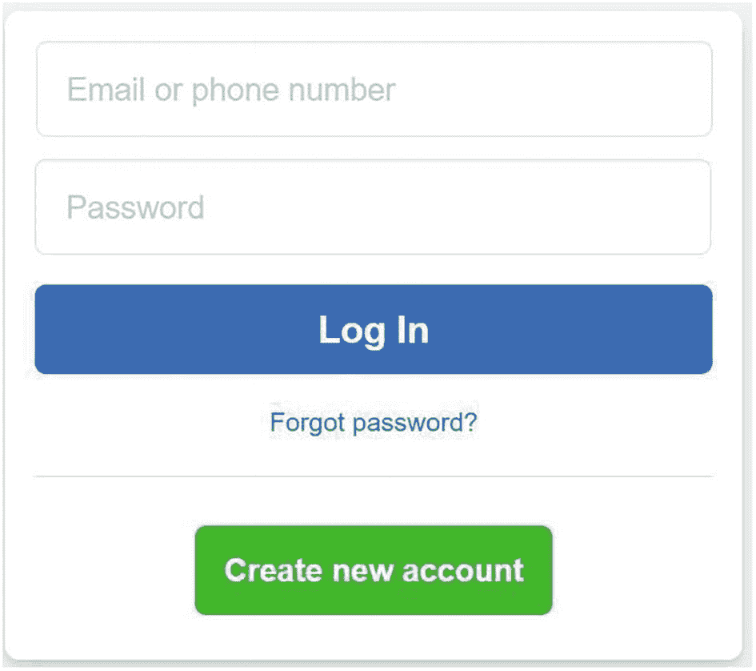

此图片展示了 Facebook 的登录页面，包含登录邮箱和密码，用于进入 Facebook 门户。底部有一个创建新账户的选项。

**图 3-2** 来自 `www.facebook.com` 的登录表单

最后一个熟悉的例子可能是星级评分系统。当你从在线书店购买一本书时，你可能遇到过星级评分系统。图 3-3 显示了来自亚马逊的星级评分表单。

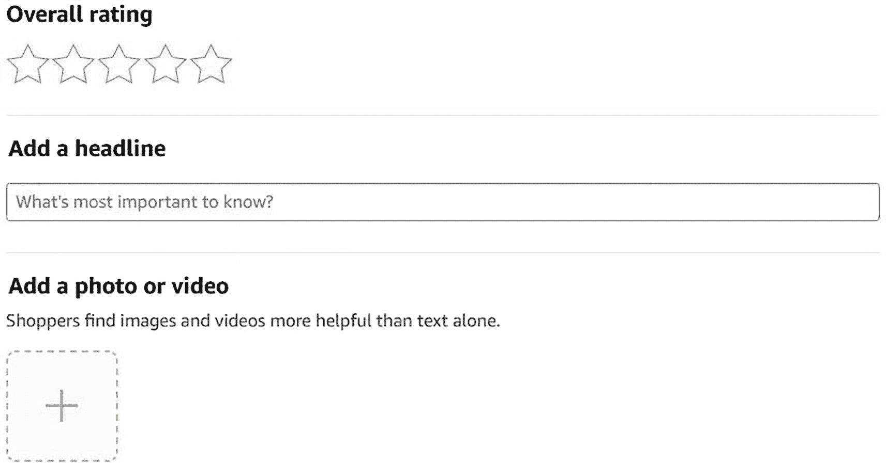

一个模型展示了亚马逊的星级评分如何对用户可见，其中还添加了标题撰写、照片和视频添加选项。

**图 3-3** 来自 `www.amazon.com` 的星级评分表单

如果你要成为一名 Web 开发人员或 Web 设计师，你将开发和设计可用且功能性的表单。Web 表单是系统与其用户之间的接口；开发和设计 Web 表单极其重要。

## 建立新的 PHP 项目

让我们在 `XAMPP/htdocs` 文件夹中创建一个名为 `ch3` 的新项目文件夹，用于存放我们在本章中将完成的所有工作。在 `ch3` 内部，我们需要从第 2 章中复制 `templates` 和 `classes` 文件夹以及 PHP 脚本的副本。我们可以从第 2 章文件夹中复制这些文件，或者从出版商的网站下载。我们还需要创建一个名为 `views` 的空文件夹。

让我们为 `index.php` 文件添加一个基础的 PHP 模板。请注意，我们正在重用第 2 章中的 `classes/Page_Data.class.php` 和 `templates/page.php`，而没有更改这两个脚本中的任何一行代码。高效且有效的程序员会在他们的程序中重用库文件。无论这些文件是由 PHP 提供的，还是由程序员（或公司中的其他人）创建的，通过重用已知可靠且安全的代码，可以以更高的效率和速度开发稳定安全的程序。解决问题一次就好；不要重复造轮子！

```php
$title = "Building and processing HTML forms with PHP";
$pageData->content = "will soon show a navigation...";
$pageData->content .= "...and a form here";
require "templates/pagewithcss.php";
echo $page;
?>
```

**清单 3-1** `index.php`

### 亲自查看

要检查所有内容是否已正确输入，请保存 `index.php` 文件，然后使用浏览器导航至 `http://localhost/ch3/index.php`。预期的输出如图 3-4 所示。

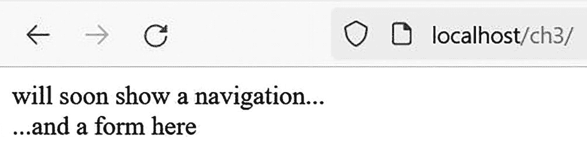

**图 3-4** `index.php` 的输出

**练习**：虽然没有禅师用棍子督促你，但请尝试回答以下问题。你的答案将表明你目前所学到的内容。如有疑问，可查阅第 2 章寻求解释。

*   `include_once` 的作用是什么？

*   `$pageData->title` 如何更改生成的 HTML 页面的 `<title>`？

*   `.=` 的含义是什么？其技术名称是什么？

*   当我们 `echo $page` 时会发生什么？

### 创建动态导航

我们将创建两个不同的表单。因此，我们需要一个站点菜单来在这些表单之间导航。让我们创建一个新文件 `ch3/views/navigation.php`，内容如下。

```php
<?php
$nav = <<< NAV
<nav>
<a href="index.php?page=search">在必应上搜索</a>
<a href="index.php?page=quiz">动态测验</a>
</nav>
NAV;
?>
```

**清单 3-2** `navigation.php`

请注意，我们用于导航的代码与第 2 章中使用的代码非常相似。我们只更改了页面以及导航中要显示的字符串。现在，让我们添加在索引文件中显示此导航所需的代码。

```php
<?php
$title = "Building and processing HTML forms with PHP";
$pageData->content = $nav;
$pageData->content .= "...and a form here";
require "templates/pagewithcss.php";
echo $page;
?>
```

**清单 3-3** `indexwithnavigation.php`

输出目前还不太美观。但我们正在取得进展。现在，通过使用与第 2 章所学的类似的代码，我们有了一个带有导航的新索引页面。

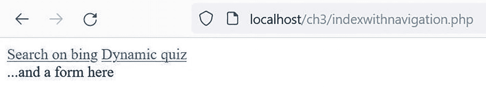

**图 3-5** `indexwithnavigation.php` 的输出

### 为表单创建页面视图

我们可以沿用第 2 章的命名约定，因为它为动态网站提供了稳固的代码架构。这种组织和命名页面视图的方式可以为我们构建动态站点提供思维框架。当我们内化了这个框架后，就会知道需要为站点开发哪些文件。我们无需每次新建站点时都重新设计一个良好的动态架构。

前一节中描述的导航包含指向名为 *search* 和 *quiz* 页面的链接。因此，我们必须在 `views` 文件夹中创建两个新的 PHP 文件。

| Href | url variable | view file |
| --- | --- | --- |
| `index.php?page=search` | `page=search` | `views/search.php` |
| `index.php?page=quiz` | `page=quiz` | `views/quiz.php` |

让我们按如下方式创建这两个新文件。

```php
<?php
// views/search.php
$info = "<h1>在必应上搜索</h1>";
$info .= "<p>使用一个简单的表单搜索网络。</p>";
?>
```

**清单 3-4** `search.php`

```php
<?php
// views/quiz.php
$info = "<h1>动态测验</h1>";
$info .= "<p>通过测验测试你的知识。</p>";
?>
```

**清单 3-5** `quiz.php`

代码非常简单。但足以帮助我们开始测试导航。

### 在索引页面上显示页面视图

为了在请求时显示这些页面视图，我们需要编写几行额外的代码，这些代码几乎与我们在第 2 章的索引文件中编写的代码相同。与第 2 章项目相比，唯一的变化是使用了 `quiz` 和 `search` 视图。专业的程序员会形成一种编码风格，并坚持使用这种风格，以提高可靠性、安全性和代码开发效率。

```php
<?php
$title = "Building and processing HTML forms with PHP";
$pageData->content = $nav;
$pageData->content .= "...and a form here";
$navigationIsClicked = isset($_GET['page']);
if ($navigationIsClicked ) {
    $fileToLoad = $_GET['page'];
} else {
    $fileToLoad = "search";
}
include_once "views/$fileToLoad.php";
$pageData->content .= $info;
require "templates/pagewithcss.php";
echo $page;
?>
```

**清单 3-6** `indexwithclass.php`

现在，该页面将加载用户请求的任何视图。如果没有点击任何导航项，它将显示`views/search.php`。我们可以通过在浏览器中加载`http://localhost/ch3/indexwithclass.php`来测试代码。

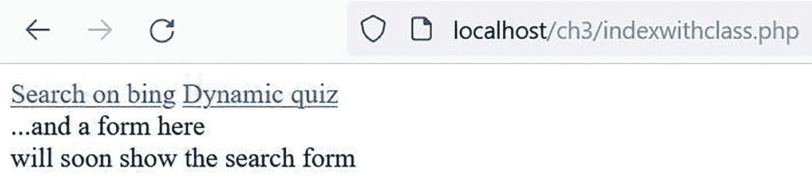

**图 3-6** `indexwithclass.php`的输出

### 程序设计及逻辑

重用代码是一个好主意，因为这能使程序员更快、更可靠、更安全地开发解决方案。如果你在一个经过良好测试的项目中拥有可用的脚本，那么你可以信任它们在其它项目中也能发挥相同的作用。因此，代码重用可以减少调试时间并加快开发速度。

总会有一些部分不容易重用，比如导航。但是，如果你养成了在不同项目中以大致相同的方式创建动态导航的习惯，你将能够快速且轻松地开发新的动态导航。因此，当你无法按原样重用代码时，你仍然可以重用那些已经过测试且可靠代码背后的原理。

### 一个简单的搜索表单

HTML 表单使用`<form>`元素创建。还有一些其他专门为表单设计的 HTML 元素。其中最基本的一个可能是`<input>`元素，用于接受用户输入的值。让我们创建一个简单的表单，如下所示。

```php
<?php
$info = "<h1>在必应上搜索</h1>";
$info .= "<form action=\"http://www.bing.com/search\" method=\"get\">";
$info .= "<input type=\"text\" name=\"q\" />";
$info .= "<input type=\"submit\" value=\"搜索\" />";
$info .= "</form>";
?>
```

**清单 3-7** `simplesearch.php`

**注意**：导航文件（`simplenavigation.php`）和索引文件（`simpleindex.php`）也已更新以使用此简单搜索表单。请花些时间查看这些文件的更改。

让我们通过从`simpleindex.php`调用新的搜索表单来测试它。

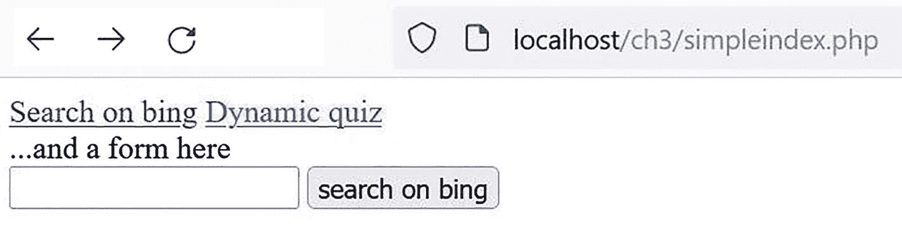

**图 3-7** `simpleindex.php`的输出

我们可以在文本字段中输入一个搜索字符串，然后点击按钮。浏览器将加载`bing.com`，因为表单标签中的 action 设置将通过 `get` 命令将信息传递给必应搜索引擎。必应会对我们输入的任何内容执行搜索。如果我们输入`cats`并点击搜索按钮，那么“cats”将被传递给必应。传递“cats”后，必应的 URL 将包含`www.bing.com/search?q=cats`。正如我们之前所述，搜索引擎通过 `get` 方法接受信息，以避免在完成搜索时使用额外的服务器内存。因此，必应期望一个 URL 变量，而我们提供了它。请注意，必应使用变量`q`来存储搜索信息。清单 3-7 显示，此变量是通过简单搜索表单中的文本框创建的。

**注意**：使用表单时，点击“提交”按钮将导致任何 GET 或 POST 变量被发送到 action 参数中列出的 web 服务器上的应用程序。然后，该应用程序可以检索该信息以供其使用。该应用程序将在 web 服务器内执行，执行结果将发送到用户的浏览器进行显示。在我们的示例中，浏览器将显示必应对 cats 的搜索结果。

## `<input>` 元素及常见类型

你是否注意到`<input type="text" />`显示为单行文本字段，而`<input type="submit"/>`则显示为提交按钮？`input`元素的`type`属性可以有多种取值。本书将介绍其中少数几种输入类型。掌握了这些类型后，你将能轻松学会如何使用其余输入类型。

## 理解 `method` 属性

到目前为止，我们只看到了能在浏览器地址栏 URL 中显示的变量。这种 URL 变量是通过 HTTP 方法`GET`编码的。我们曾用此类变量创建动态导航，以及一个可在[`www.bing.com`](http://www.bing.com)执行搜索的表单。任何通过`GET`编码的 URL 变量所能容纳的字符数都相对有限，具体数量因浏览器而异。由于`GET`变量在 URL 中显而易见，页面可以被收藏和链接。因此，`GET`变量非常适合网站导航，或任何需要限制服务器内存使用量的场景，例如高流量的网站。过度依赖服务器内存可能导致服务器内存迅速耗尽并关闭。这绝非你的网站繁忙时希望发生的事情！

## 命名 PHP 函数

编程语言最强大的功能之一，或许就是能够定义和执行函数。*函数*是我们在脚本中声明的一个命名代码块，可以随时调用。

#### 程序设计与逻辑

许多新手程序员认为，程序代码是从程序顶部开始逐条指令执行到底部。然而，事实并非如此。程序中包含许多导致执行流程走向不同路径的指令。例如，我们在第 2 章中介绍的`if`语句会根据条件选择执行第一组花括号内的代码，还是执行`else`语句之后的代码。我们称代码根据条件语句的真假，跳转到`else`结构或跳过`else`结构。

我们在示例中一直使用的页面对象存在于内存中的独立位置。每当使用该对象时，程序会跳转到该对象，然后跳回主代码中的下一条指令。函数也会引起类似的流程变化。调用函数时，程序会跳转到该函数，执行函数内的代码，然后返回主代码。我们很快就会了解其他会改变程序流程的指令。

### 命名函数的基本语法

让我们初步了解 PHP 中命名函数的基础知识。

```
function functionName () {
    //函数体
}
```

函数的语法格式要求我们首先使用`function`关键字声明函数，然后创建一个函数名以唯一标识该函数。函数名可以包含任何字母数字字符和下划线，但不能以数字开头。函数名后跟一对圆括号和一个由花括号分隔的代码块。

#### 程序设计与逻辑

尽管我们可以自由地以几乎任何格式创建函数名，但目标是创建一个易于阅读和理解的程序。考虑到这一点，一种声明函数名的标准方式是使用一个动作动词和一个主语，例如`getFirstName`。通过这种标准声明函数，我们就能清楚地知道该函数会返回名字，而无需查看实际代码。同样，通常也使用驼峰命名法（首单词小写，其余单词首字母大写）。一些程序员会用下划线分隔单词，例如`get_First_Name`。确定你自己的风格，并在整个程序中保持一致。

让我们在`ch3`文件夹中创建一个包含函数的新 PHP 文件。

```
<?php
function getParagraph() {
    echo "<p>此段落来自一个函数</p>";
}
?>
```

**清单 3-8** `testfunction.php`

如果我们在浏览器中加载`http://localhost/ch3/testfunction.php`，将看不到任何输出。许多初学者会期望看到上述代码的输出。但函数并不总是按初学者设想的方式运行。函数体中的代码在函数名被显式*调用*之前不会执行。我们可以在新文件`testfunction.php`中添加一个函数调用来执行代码，如下所示。

```
<?php
function getParagraph() {
    echo "<p>此段落来自一个函数</p>";
}
getParagraph();
?>
```

**清单 3-9** `calltestfunction.php`

如果在浏览器中运行这个新文件，我们将看到预期的输出。

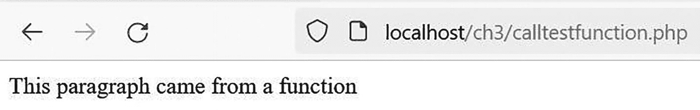

此窗口表示代码在程序中执行时返回测试函数的结果。

**图 3-8** `calltestfunction.php` 的输出

函数一个非常有趣的特点是它们非常易于复用。只需调用函数两次，它就会运行两次。我们来试试。

```
<?php
```

function getParagraph() {
    echo "<p>此段落来自一个函数</p>";
}

getParagraph();
getParagraph();
?>

清单 3-10 `calltwicetestfunction.php`

你大概能正确猜出，这段代码会输出两个`<p>`元素，每个元素都包含相同的文本：`此段落来自一个函数`。更重要的是，我们可以看出*函数声明*与*函数调用*之间的区别。该示例包含两个不同的函数调用。

这个函数不够灵活。它只能做一件事，即输出那个字符串。当我们创建函数时，应该考虑函数的所有可能用途。与其犯新手程序员常犯的错误，即在函数内部使用`echo`输出字符串，更好的选择是“返回”字符串，让调用函数的代码自行决定如何使用返回的字符串。让我们调整一下示例。

```php
<?php
function getParagraph() {
    return "<p>此段落来自一个函数</p>";
}

$output = getParagraph();
$output .= "只是某个标题";
$output .= getParagraph();
echo $output;
echo getParagraph();
?>
```

清单 3-11 `returntestfunction.php`

让我们看看运行此文件时的输出。

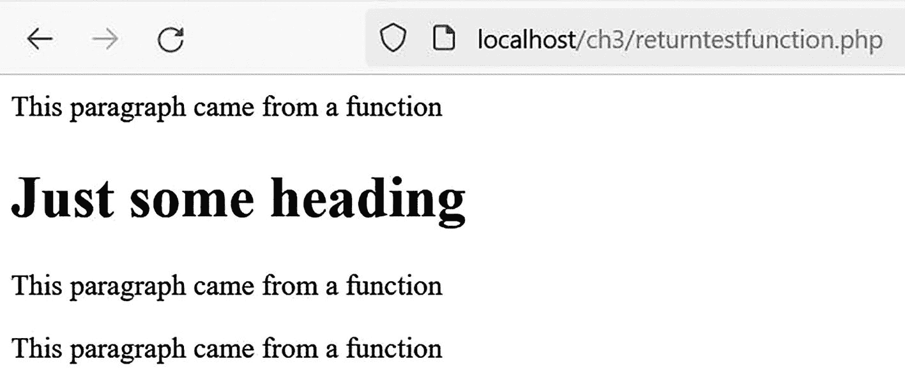

此页面反映了 return 测试函数的功能：将返回值导入真实的程序中，并为输出字符串保留原始代码。

**图 3-9** `returntestfunction.php` 的输出

现在好多了！为什么？让我们来看一下。

```php
return "<p>此段落来自一个函数</p>";
```

函数`return`语句将提供的字符串传回给调用该函数的指令。这使得该指令能够决定如何使用该字符串。

```php
$output = getParagraph();
```

我们可以创建一个变量来保存该字符串。

```php
$output .= getParagraph();
```

我们可以将返回的字符串追加到现有字符串变量的内容中。

```php
echo getParagraph();
```

或者我们可以直接将字符串`echo`给用户。我们有了更大的灵活性！

#### 程序设计与逻辑

经验丰富的程序员很少直接在函数内`echo`输出信息（字符串）。使用`return`语句要好得多。这样能创建更有用的函数，可以如前文所示通过多种方式使用。有用的函数可以放在库中，这样其他程序也可以使用这些函数。这些程序可以根据自身需求以最合适的方式使用这些函数。

**练习**：调整前面的示例，将函数放入一个库文件中。然后将该函数导入原始程序。保留`$output`字符串的原始代码。运行程序。输出应与图 3-9 相同。不过，现在你拥有了一个可以在任何程序中使用的函数！

### 使用函数参数提高灵活性

这个函数仍然不够灵活。因此，让我们通过*函数参数*来改进`function getParagraph()`。

```php
<?php
function getParagraph( string $content ) : string {
    return "<p>$content</p>";
}

$output = getParagraph( "I want this text in my first paragraph" );
$output .= "Just some heading";
$output .= getParagraph("...and this in my last paragraph." );
echo $output;
echo getParagraph("But I want to finish it with this paragraph");
?>
```

**列表 3-12** `argumenttestfunction.php`

每次函数调用的输出都会显示我们传入函数的任何内容。

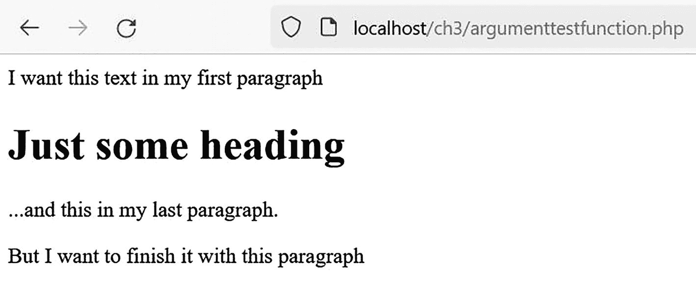

该窗口反映了文本参数函数的结果，代码执行后标题会加粗显示。

**图 3-10** `argumenttextfunction.php` 的输出

我们对函数头做了一些修改。

```php
function getParagraph( string $content ) : string {
```

现在，参数（`string $content`）将函数的所有输入限制为仅允许字符串。但它允许调用函数的指令传入任何字符串。函数中的返回语句也被限制（`:string`）为仅返回字符串。

```php
return "$content";
```

返回语句现在使用参数（无论传入了什么内容）来构建段落字符串，然后将该字符串传回调用它的指令。我们也可以将 `$output` 声明为字符串。不过，由于返回语句已经将输出限制为字符串，这样并非必要。

PHP 为我们在函数中使用提供了四种标量数据类型提示（类型）。

- **`int`**：整数，可用于计算。
- **`string`**：字符串，不会用于计算。
- **`float`**：带小数的数字，例如 `32.23`，可用于计算。
- **`bool`**：布尔值，值为 `true` 或 `false`。

让我们看看其他可能的用法。

```php
function getParagraph( ?string $content ) : string {
```

如上代码所示，如果我们在数据类型提示中加入问号，函数也将允许传入 `null` 值（空值）。如果没有传入值，则会引发错误。我们也可以加入问号，允许函数返回 `null` 值或字符串。

```php
function getParagraph( ?string $content ) : ?string {
```

我们甚至可以使用管道符号，允许向调用指令传回不同的数据类型。

```php
function getParagraph( ?string $content ) : int | string {
```

> **注意**
> 有关数据类型提示和函数的更多信息，请访问 [`www.php.net`](http://www.php.net)。

函数参数非常酷，因为它们允许我们编写一个可被多个不同值重复使用的函数。在本书后续内容中，我们将看到更多带参数的函数示例。接下来，让我们用函数编写一个动态测验。

---

#### 为测验创建表单

让我们在 `views` 文件夹中创建一个新的 PHP 文件，名为 `quizform.php`。

```php
<?php
echo "<form action='index.php' method='post'>";
echo "<p>Is it hard fun to learn PHP?</p>";
echo "<select name='answer'>";
echo "<option value='yes'>Yes, it is</option>";
echo "<option value='no'>No, not really</option>";
echo "</select>";
echo "<input type='submit' value='Submit'>";
echo "</form>";
?>
```

**列表 3-13** `quizform.php`

之前我们见过类似的表单标签，其中包含对索引文件的调用和传递页面 URL 变量。不过，这里我们加入了一些新的 HTML 语句。

##### HTML 回顾

让我们深入看一下我们的 HTML 字符串。

```html
<select name='answer'>
```

`<select>` 标签创建了一个变量（`answer`），该变量可以使用 `GET` 或 `POST` 方法传递给另一个程序。同时，它表明我们正在创建一个下拉列表。

```html
<option value='yes'>Yes, it is</option>
<option value='no'>No, not really</option>
```

`<option>` 标签为用户提供了“Yes, it is”或“No, not really”的选项。不过，实际设置到变量 `answer` 中的值是 `'yes'` 和 `'no'`。

```html
<input type='submit' value='Submit'>
```

之前我们见过提交输入类型。必须包含提交按钮，这样回答变量才能传递到表单标签中指定的程序。你是否注意到我们正在使用 `POST` 方法传递变量？我们很快就会了解如何在程序中接收这个值。

> **提示**
> 初学者经常会忘记，HTML 下拉列表框只负责设置变量，并不会将变量传递给其他程序。我们必须将输入提交标签与列表一起包含在内，才能将设置好的信息传递给另一个程序。

**显示测验表单**

## 显示测验表单

要显示测验表单，我们需要对索引文件和导航文件进行一些小的修改。在索引文件中，我们将修改引入导航的语句，以调用更新后的版本。

```php
include_once "views/quiznavigation.php";
```

> **注**：在新的导航文件（`quiznavigation.php`）中，我们将调用 `quizform` 程序，而不是 `quiz` 程序。

```php
<?php
echo "<a href='index.php?page=quizform'>Dynamic quiz</a>";
?>
```

请查看`indexquiz.php`和`navigationquiz.php`文件，以留意这些变化。

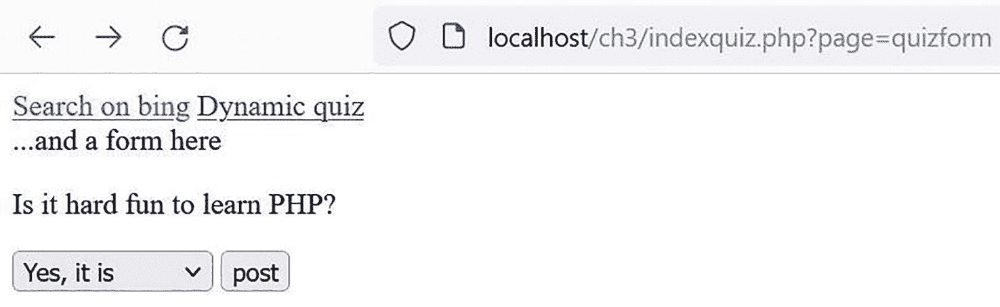

此窗口表示在必应动态测验学习个人主页上通过 localhost 搜索的结果。

**图 3-11** 使用`navigationquiz.php`的`indexquiz.php`的输出

尝试运行此程序，并在下拉列表框中选择一个值后确定结果。你发现了什么？我们还尚未使用传递过来的值。我们很快就会解决这个问题。

### POST 方法

第一个表单使用了`GET`方法，但这并非唯一的 HTTP 方法。还有另一种称为`POST`的方法。`POST`方法没有定义最大字符数——实际上，`POST`方法甚至不限于文本。当使用 HTTP `POST`方法时，甚至可以通过表单上传文件。HTTP `POST`变量在 URL 中不可见。它们被隐藏发送。这使得 HTTP `POST`成为处理大量内容以及包含敏感信息的表单的理想选择。

### 安全编程

不要将隐藏敏感信息与数据是安全的概念混淆。`POST`确实隐藏了信息。但是，它并不对信息进行加密。黑客仍然可以获取传递的信息。然而，`POST`确实消除了用户为包含 URL 变量的页面添加书签的能力。使用`POST`方法时，变量不再包含在 URL 字符串中。

#### 使用`$_POST`超全局变量

让我们使用名为`$_POST`的超全局变量在表单提交时处理它。让我们更新测验程序以显示我们的响应。

```php
You clicked $answer";

$response .= "

Try quiz again?

";

return $response;

}

?>
```

**代码清单 3-14** `newquiz.php`

```php
$quizIsSubmitted = isset( $_POST['quiz-submitted'] );
```

程序将首先使用 PHP 的`isset`函数来确定用户是否提交了测验。用户必须点击测验表单中的提交按钮，`if`语句的真值部分才会被执行。

## 程序设计逻辑

程序应该允许用户在选择列表中改变主意，尤其是在测验中！通过要求用户在做出决定后点击提交按钮，用户可以在提交答案之前再次检查他们的选择。否则，程序只会采用他们的第一选择。

```php
if ( $quizIsSubmitted ){

$answer = $_POST['answer'];

$info = showQuizResponse( $answer );

} else {

include_once "views/newquizform.php";

}
```

如果用户确实点击了提交按钮，答案将使用`$_POST`放入`$answer`中。然后该值被传递给一个名为`showQuizResponse`的函数。如果用户没有点击提交按钮，程序将显示表单，直到他们点击提交按钮或导航到其他位置。

```php
function showQuizResponse( string $answer ) : string {

$response = "You clicked $answer";

$response .= "

Try quiz again?

";

return $response;

}
```

如果提交按钮被点击，该函数接收响应（位于`$answer`中）并构建一个字符串（`$response`），其中包含所选答案和一个询问用户是否想再次尝试测验的链接。此字符串由函数返回。

```php
$info = showQuizResponse( $answer );
```

返回的字符串被放入`$info`中。索引程序（`indexnewquiz.php`）然后会显示`$info`的内容。

> **注**：已对`indexnewquiz.php`、`newquiznavigation.php`和`newquizform.php`进行了微小更改，以调用这些程序的新版本。但是，没有发生逻辑上的更改。

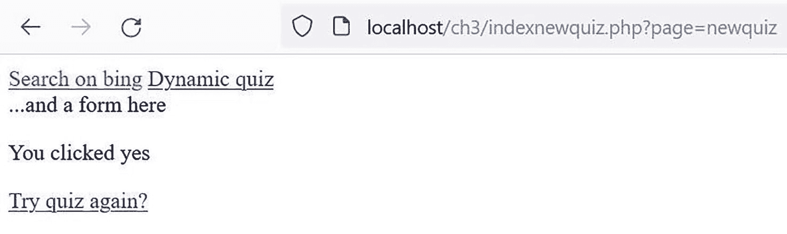

此窗口表示管理员为前一个窗口的帖子栏点击“是”时的结果。

**图 3-12** 点击“是”的结果

**练习**：调整`newquizform.php`程序以提出多个问题。调整`indexnewquiz.php`程序以显示所有问题的答案。

### `$_POST`是一个数组

我们曾说过`$_GET`是一个超全局数组。`$_POST`是另一个超全局数组。但数组到底是什么呢？基本上，一个*数组*可以容纳多个项目。每个项目都存储在一个索引下。在 PHP 中，索引可以是数字，也可以是字符串。具有字符串索引的数组被称为*关联数组*。`$_POST`和`$_GET`创建关联数组来保存从一个程序传递到另一个程序的值。当我们检索值时，我们实际上是在访问 PHP 在内存中创建的关联数组。

我们可以创建自己的关联数组。让我们看一个例子。

```
代码清单 3-15

testAssocArray.php
```

如果我们在浏览器中运行这个程序，我们会看到“My name is Thomas.”。在这个例子中，`$my`是一个关联数组。我们可以看到它保存了一个存储在同一个名称（`$my`）下但具有不同索引（`name`、`year-of-birth`、`height`）的数据集合。为了从数组中检索数据，我们必须使用带索引的数组名。“Thomas”存储在数组`$my`的`['name']`索引下。PHP 允许在同一数组中存储不同类型的数据。在我们的例子中，存储了两个字符串和一个整数。请记住，PHP 通常在存储第一个值时确定数据类型。因此，数据类型实际上是在数组初始创建之后才确定的。在许多其他编程语言中，数组仅限于一种数据类型，并且必须在创建数组时声明该类型。

检查数组中的所有项通常很方便。PHP 有一个专门用于此的函数。它叫做`print_r()`。这里有一种使用它的方法。

```php
";

$out .=print_r($my, true);

$out .= "";

echo $out;
```

**代码清单 3-16** `printAssocArray.php`

如果我们运行这段代码，我们会看到`$my`的每个索引及其对应的值。

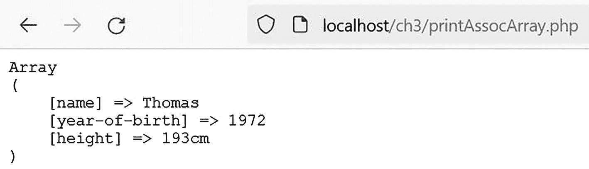

此窗口表示输出关联数组的代码是如何编写的。

**图 3-13** `printAssocArray.php`的输出

数组非常有用，因为它们允许我们将项目分组在一起。`$_GET`和`$_POST`数组由 PHP 提供，方便我们访问所有使用 HTTP 方法`GET`和`POST`编码的数据。让我们更新测验程序以查看所创建的关联数组。

```php
";

$info .= print_r($_POST, true);

$info .= "";

} else {

include_once "views/printnewquizform.php";

}

//declare a new function

function showQuizResponse( string $answer ) : string {

$response = "You clicked $answer";

$response .= "

Try quiz again?

";

return $response;

}

?>
```

```
**代码清单 3-17** `printnewquiz.php`

> **注**：以下文件也已更改以使用 `printnewquiz.php` 的新版本：`indexprintnewquiz.php`、`printnewquizform.php`

在 `printnewquiz.php` 中添加了一个 `print_r` 语句，用于显示数组的内容。

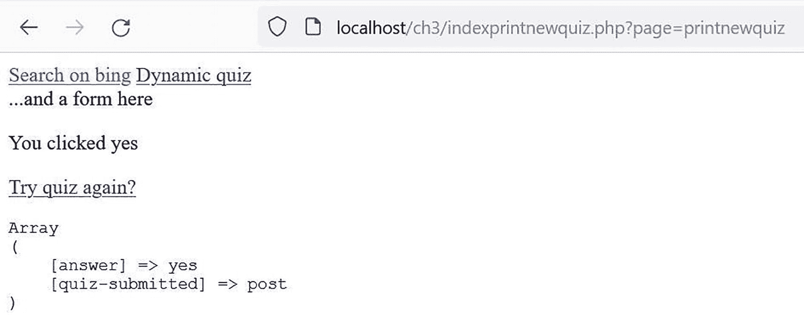

此拨号器表示在动态测验上通过 localhost 搜索的结果。

**图 3-14** 带数组的测验结果输出

从输出中我们可以看到，`answer` 和 `quiz-submitted` 索引都被创建了。`answer` 索引的值为 `yes`，因为用户选择了这个答案。存储在 `quiz-submitted` 中的值表明该数组是通过 `POST` 方法创建的。使用 `print_r` 可以成为一个很好的调试工具，使我们能够看到正在从一个程序传递到另一个程序的内容。

### 安全编程

不要向用户透露他们无需知道的信息。在线上环境中，我们不会使用 `print_r` 向用户显示信息，因为它会向用户展示我们在程序之间传递的所有信息。这可能会对我们程序中使用的数据造成重大的安全问题。

### 柯利定律：只做一件事

你看过 1991 年的电影《城市乡巴佬》吗？没错，就是那部由比利·克里斯托主演的治愈系西部喜剧。杰克·帕兰斯扮演的柯利是一位饱经风霜的老牛仔，他知晓生活的秘诀，并勉为其难地与克里斯托饰演的米奇分享：

*   *柯利*：你知道生活的秘诀是什么吗？
*   *（举起一根手指）*
*   *柯利*：就是这个！
*   *米奇*：你的手指？
*   *柯利*：一件事。就一件事。你坚持做这一件事，其他都无关紧要。
*   *米奇*：但那"一件事"是什么呢？
*   *柯利*：（微笑着）这就要*你*自己去发现了。

我们大可以放心，柯利指的不是简洁代码的原则。但巧合的是，他阐述了一个我们可以用来编写简洁函数的原则。每个函数应该只做一件事。仅仅是一件事。

> **注意**
> 杰夫·阿特伍德写了一篇关于将柯利定律应用于简洁代码的有趣博客文章。请阅读 [`blog.codinghorror.com/curlys-law-do-one-thing/`](http://blog.codinghorror.com/curlys-law-do-one-thing/)。

## 程序设计逻辑

简洁代码是更易于理解的代码。如果函数只做一件事，它们通常会很短。短代码比长代码更容易阅读和理解。一个函数的指令长度几乎不应该超过一个屏幕。如果你发现你的函数变得很长，请重新评估你的设计逻辑。这个函数能否分解成多个更简单的函数？如果我们能够阅读并理解自己的代码，发现错误就会容易得多——而且我们*一定*会犯错误！如果你发现自己花费了 50% 的开发时间在代码中追逐错误，请不要感到惊讶。

在之前的代码示例中，我们看到了两个简洁的函数，每个函数只做一件事。一个函数显示测验，另一个函数显示响应。

## 代码即诗

追求富有表现力、优美的代码。追求易于阅读的代码。当你用代码开发新的解决方案时，你会花相当大一部分时间阅读自己的代码。代码就像诗歌。你只写一次，但会阅读很多次。所以，请像写诗一样编写代码：字斟句酌。

在我们结束编码示例之前，让我们对页面数据类进行一些修改，以加强安全性。

## 面向对象编程：使用构造函数、Getter 和 Setter

自从我们上次更新页面数据类已经有一段时间了。如果你忘记了它当前的结构，请参阅以下代码。

```
清单 3-18

Page_Data.class.php
```

如我们所见，类名和文件名是相同的。在面向对象语言中，这种做法是标准实践。我们最初在类本身内部创建了字符串，并将它们设置为空字符串。然而，类包含一个称为*构造函数*的独特方法（函数），其主要目的是初始化属性（变量）。我们可以在构造函数中为每个字符串提供默认值。当使用 `new` 关键字从类创建对象时，会自动调用构造函数。

```
function __construct() {

print "In constructor";

}
```

对于 PHP 类，两个下划线符号（`__`）和单词 `construct` 标识了构造函数。在这个例子中，我们只是打印一条消息。但是，我们很快就会提供一些有意义的信息。

让我们更深入地了解一下面向对象编程，以理解为什么使用构造函数如此重要。

一个真正的面向对象程序必须提供三种方法论。其中包括：

*   **封装**：通过使用类、对象和其他面向对象技术，在代码周围形成一个保护层（胶囊）来保护程序的所有部分。
*   **多态性**：调用和使用具有相同名称但接受和产生不同结果的项（如方法/函数）的能力。例如，可以有两个名为 `adder` 的函数。一个函数将两个整数相加，另一个将两个浮点数相加。程序如何知道该使用哪一个？通过传递给函数的内容（整数或浮点数）以及函数返回的内容来判断，这通常称为函数头信息。
*   **继承**：一个对象继承另一个对象特征的能力。就像我们继承了父母的特征，但同时仍保留了一些自己的独特性。

让我们为我们的类提供改进的封装，同时提高程序的可靠性、完整性和安全性。

```
清单 3-19

Construct_Page_Data.class.php
```

在前面的示例中，我们在类的开头声明（创建）了每个属性。然后调用构造函数为每个属性赋予一个初始值，以防某些使用这个类的程序没有使用该属性。但是，我们仍然有一个潜在问题：任何程序都可以将几乎任何东西加载到这些属性中。这可能会损害网页的显示，甚至更糟的是，当我们讨论数据库时，可能会为黑客提供访问我们信息的机会。让我们通过拒绝不符合要求的内容来增加一些更好的安全性和可靠性。为此，我们将创建 setter 和 getter 方法。

```
title = "Title Goes Here";

$this->content = "Page Content Goes Here";

$this->css = "CSS Goes Here";

$this->embeddedStyle = "Embedded CSS Goes Here";

}

public function getTitle() : string {

return $this->title;

}

public function setTitle(string $value) {

if (strpos($value, '^')) {

$this->title = $value;

}

}

public function getContent() : string {

return $this->content;

}

public function setContent(string $value) {

if (strpos($value, 'content = $value;

}

}

public function appendContent(string $value) {

if (strpos($value, 'content .= $value;

}

}

清单 3-20

Private_Page_Data.class.php 部分代码
```

清单 3-20 是页面数据类代码更改的部分列表。有关完整列表，请查看 `Private_Page_data.class.php` 中的代码。

```
private string $title = "";
```

对程序的第一项更改是将每个属性的*访问修饰符*从 `public` 更改为 `private`。`public` 修饰符允许任何程序开放访问。当程序驻留在内存中（执行时）时，公共变量是脆弱的。`private` 变量只能由创建它的类访问。`protected` 变量可以由类本身以及任何继承类或父类访问。通过将变量设置为 `private`，我们可以控制对变量内容的任何更改。

```
$this->title = "Title Goes Here";
```

属性的使用已从 `$title` 更改为 `$this->title`。这是将变量更改为 `private` 的直接结果。`$this` 是一个特殊的 PHP 指针，它提供对对象内未声明为 `public` 的项的访问。在我们的示例中，`$this` 表示我们正在访问私有变量 `$title` 并将提供的字符串放入其中。

```
public function getTitle() : string {

return $this->title;

}
```

为了允许类外部的程序访问我们的私有变量，我们创建了 getter 和 setter 方法。可以将其视为提供对变量的读取和写入权限。一个 *get 方法*提供读取权限。一个 *set 方法*提供写入权限。我们实际上可以创建只读的变量（仅提供 get 方法），也可以创建只写的变量（仅提供 set 方法）。大多数 get 方法都是简单的，如示例所示；它们只是将请求的值返回给调用程序。
```

public function setTitle(string $value) {

    if (strpos($value, '^')) {

        $this->title = $value;

    }

}

```

set 方法的目标是保护数据（封装）。在更改变量之前，set 方法应检查信息的有效性。在示例中，一个 `if` 语句使用 PHP 函数 `strpos` 来判断变量 `$value`（传入函数的信息）是否包含脱字符（`^`）符号。如果包含，它允许用传入的信息更新 `title` 变量。这个示例实际上会失败，因为我们的 `title` 字符串不包含脱字符。如果你运行该程序，你会发现 `title` 使用的是默认值。

### 安全编程

一个安全可靠的程序会拒绝用无效数据更新信息的尝试，而不会导致程序引发错误和/或崩溃。在这个例子中，一个无效字符串被提交以更新 `title` 变量。程序仅拒绝无效数据并保留默认值。程序的用户只会看到 `title` 被设置为默认值，这不会影响用户试图完成的操作。因此，该程序比使用公共变量更安全、更可靠。如果程序因无效数据而无法继续运行，则应向用户提供信息性消息，该消息不会引发错误或导致程序崩溃。

```

public function appendContent(string $value) {

    if (strpos($value, 'content' . $value)) {

        $this->content .= $value;

    }

}

```

在代码示例中，`content` 变量有一个额外的方法，用于追加信息，而不是替换（设置）信息。我们的 `index` 程序对 `content` 变量进行设置和追加操作。因此，这个额外的方法对于此操作是必需的。

*我们应该总是使用 setter 和 getter 吗？*
答案是否定的。如果没有理由保护数据，那么数据可以保持公开。许多教科书演示了 setter 和 getter 的使用，但没有强调一个不进行任何验证的 set 例程只是在浪费效率。如果不需要验证，只需将变量设置为公共访问即可。然而，考虑到编程环境中存在的大量黑客攻击，程序员应该深思熟虑，避免将任何变量保留为完全公开的公共变量。

## 注意

`strpos` 方法在一个字符串中搜索以确定被检查的值是否存在于字符串中。如果存在，它返回该值在字符串中的位置。字符串位置从第一个位置的 0 开始编号。如果该值不在字符串中，则函数返回 `-1`。任何大于或等于 `1` 的值被判定为 `TRUE`。任何小于或等于 `0` 的值被判定为 `FALSE`。因此，只要发现该值，`if` 语句就为 `TRUE`；如果未找到该值，则变为 `FALSE`。有关 `strpos` 的更多信息，请访问 [`www.php.net/manual/en/function.strpos`](http://www.php.net/manual/en/function.strpos)。

```

setTitle("Building and processing HTML forms with PHP");

$pageData->setContent($nav);

$pageData->appendContent("...and a form here");

$navigationIsClicked = isset($_GET['page']);

if ($navigationIsClicked ) {

    $fileToLoad = $_GET['page'];

} else {

    $fileToLoad = "search";

}

include_once "views/$fileToLoad.php";

$pageData->appendContent($info);

require "templates/privatepage.php";

echo $page;

?>

既然我们不能再直接将值放入类中的变量，需要对索引文件做一些调整。

```
$pageData->setTitle("使用 PHP 构建和处理 HTML 表单");
$pageData->setContent($nav);
$pageData->appendContent("...以及一个表单");
```

将字符串传入变量的指令已被替换为对类中 `set` 和 `append` 方法的调用。

```
";
$page .= $pageData->getTitle();
$page .= "
";
$page .= $pageData->getCss();
$page .= "";
$page .= $pageData->getContent();
$page .="";
?>
清单 3-22
privatepage.php
```

还对页面程序进行了调整，以读取变量中的信息。

```
$page .= $pageData->getTitle();
```

现在调用 getter 方法来获取信息。`$page` 变量的更新也被拆分为多行，以提高流程的可读性。

**练习**：在 `Private_Page_Data.class.php` 中，`strpos` 函数检查的字符串被故意设置为逻辑上不合理的信息。扫描本章中使用的文件，确定哪些内容在逻辑上适合进行存在性检查。进行必要的更新，并运行程序以验证其正常运行。调整完毕后，返回程序，将字符串改为检查那些不期望出现在变量中的内容。运行程序并查看结果。发生了什么？程序应显示默认结果，但不会引发任何错误。

现在，我们有了一个更安全、更可靠的程序。这是结束本章讨论的好地方。

## 总结

本章内容覆盖面很广。我们学习了如何编写 HTML 表单。HTML 表单在提交时可以编码 URL 变量。URL 变量通过 GET HTTP 请求从浏览器传递到 Web 服务器。我们还了解到可以使用 POST HTTP 请求传递变量，该请求将变量传递到服务器内存中。实际上，该请求会创建一个包含所传递信息的数组。我们学习了如何使用 `$_GET` 或 `$_POST` 检索传递到 PHP 程序中的信息。我们发现了如何通过命名函数来组织代码并控制程序流程。我们通过使用 `private` 访问修饰符保护存储在类中的信息，以及使用构造函数、getter 和 setter 方法，更深入地探索了面向对象编程。但最重要的是，我们学习了如何应用 Curly 定律来增强代码的逻辑性和效率。

## 练习

1.  如果你熟悉 CSS，请创建一个外部样式表来控制我们创建的页面的外观和设计。将样式表链接到索引页（有关提示，请参见第 2 章）。进行所需的任何其他调整。不要忘记在多个浏览器中测试你的页面。有时，CSS 在不同浏览器中的行为可能会有所不同。

2.  重新设计动态测验。添加更多问题和问题格式。我们如何创建多项选择题、是非题或简答题？这需要一些研究来确定其他 HTML 表单输入对象的使用。如果你不熟悉它们，可以在 `www.w3schools.com` 或 YouTube.com 上找到更多信息。调整测验结果生成的输出，使其更有意义。

3.  创建另一个 HTML 表单，根据一个人的身高和体重计算其身体质量指数（BMI）。计算 BMI 的公式如下。任务是创建一个表单，用户可以在其中输入身高和体重，并编写一些 PHP 代码来根据输入计算 BMI。网上有示例可以指导你。但在寻找可能的解决方案之前，请先尝试自己完成。

```
// 公制
bmi = 体重（kg）/ （2 * 身高（m））
// 英制
bmi = （体重（lb）/ （2 * 身高（in）） ） * 703
```

4.  创建一个将货币从一种币种转换为另一种币种的表单。如果你想让它变得非常高级，可以使用一个 `<select>` 元素，其中包含一个可能转换的币种列表。同样，网上有示例程序，但请先尝试自己完成，然后再查看这些示例。