# 4. 构建动态图像画廊

## 目标

完成本章后，你将能够

*   设置动态网站
*   创建命名函数
*   使用 `$_GET` 和 `$_POST` 超全局数组
*   使用 `foreach` 循环创建和迭代
*   使用 PHP 的 `glob` 限制对特定文件类型的访问
*   编写自定义对象方法
*   使用 PHP 的 `$_FILES` 超全局数组上传文件

我们现在知道如何制作一个简单的动态网站。我们也知道如何创建动态表单。我们学习了如何使用 `$_GET` 或 `$_POST` 访问 URL 变量。是时候好好利用我们的新知识了。让我们构建一个动态图像画廊，并带有一个表单，允许用户向画廊上传新图像。在此过程中，我们将学习如何上传文件、使用循环以及提高创建动态网站的能力。

## 设置动态网站

让我们创建一个名为 `ch4` 的新项目文件夹。然后我们可以从出版商网站将文件夹和 PHP 文件复制到这些位置。当然，你也可以在阅读本章时逐步创建文件。熟能生巧。如果选择这样做，你需要创建几个文件夹：`classes`、`views`、`templates` 和 `imgs`。

## 先决条件：一个包含一些图像的文件夹

我们的图像画廊需要一些图像。我们将限制此图像画廊仅使用 JPEG 图像。让我们为画廊准备少量 JPEG 图像。这些图像将存放在 `img` 文件夹中。

## 版权法

作为开发者，我们必须了解我们网站可能使用的任何国家/地区的*版权法*。我们必须尊重并遵守这些法律。在美国，图像通常受版权保护，这意味着我们必须征得所有者的许可才能使用该图像。有一些例外情况，包括教育目的。但是，我们不应该养成看到喜欢的图片就随意抓取的习惯。

如何判断图像是否受版权保护？

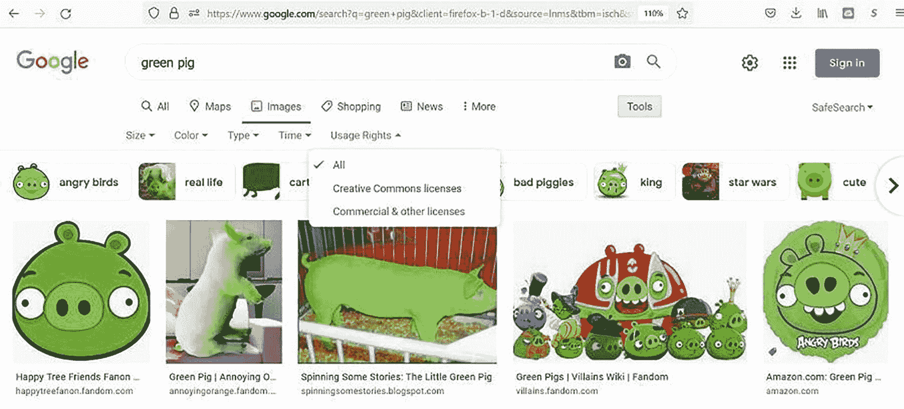

该图像反映了我们在搜索栏中搜索“green pig”时谷歌的显示方式。

**图 4-1** 谷歌搜索 green pig

在谷歌中，`Tools` 菜单选项允许你根据图像使用的限制类型来缩小搜索结果范围。然而，这并不是一个完美的方法（即使谷歌也同意这一点）。一旦你发现可能不受版权保护的图像，请访问包含该图像的网站。在网站上查找版权信息。如果你仍然不确定，请发送电子邮件给网站所有者以获得使用该图像的许可。一旦收到回复（如果收到的话），请保存该电子邮件。它可以在以后帮你避免麻烦。

获取非版权图像最安全的方法是在网上搜索非版权图像网站。网上有很多这样的网站。有些是免费的，有些则收取少量费用。这笔费用非常值得，可以避免未来的任何问题！

**练习**：搜索你所在国家、地区或州/省的版权法。这些法律与其他地区有何不同？请记住，你必须遵守可能使用你网站的国家的所有版权法。在网上搜索一些非版权图像，用于我们将要创建的照片画廊。

顺便说一下，我们将坚持使用前几章中使用的网站架构。这将使我们更容易重用以前项目中的代码。重用现有代码将有助于更快地开发出可靠的解决方案。让我们开始吧！

## 创建导航


### 创建导航项

本网站将有两个主页面视图：一个用于显示图库，另一个用于显示表单以便用户上传新图片。由于我们知道需要这两个页面视图，我们可以准备一个包含两个导航项的站点导航。让我们在 `views` 文件夹中创建一个新文件，命名为 `navigation.php`。

```
图库
上传新图片

";
?>
代码清单 4-1
navigation.php
```

### 创建两个虚拟页面视图文件

在编写新代码时，从小处着手总是一个明智的主意。让我们准备两个独立的页面视图：一个用于图库，另一个用于上传表单。每个页面视图都将从单独的文件中生成并返回。因此，我们在 `views` 文件夹中创建两个文件。

```
上传新图片";
?>
代码清单 4-3
upload.php
```

```
图片图库";
?>
代码清单 4-2
gallery.php
```

### 创建索引文件

如前所述，每个网站都有一个索引页面。当用户输入 URL（例如 [`www.google.com`](http://www.google.com)）时，这是浏览器中显示的默认页面。作为网站的主要入口，页面必须简洁、清晰、可靠且具有吸引力，这一点很重要。我们索引页面的第一个版本将显示一个功能性的动态导航，链接到两个非常简单的页面视图。

```
setTitle("动态图片图库");
$pageData->setContent($nav);
$navigationIsClicked = isset($_GET['page']);
if ( $navigationIsClicked ) {
$fileToLoad = $_GET['page'];
} else {
$fileToLoad = "gallery";
}
include_once "views/$fileToLoad.php";
$pageData->appendContent($info);
require "templates/page.php";
echo $page;
?>
代码清单 4-4
index.php
```

正如我们所见，索引页面与第 3 章的最后一个版本类似。重用代码可以加快创建时间，同时提高可靠性。`Page_Data` 类和页面文件没有显示，因为到目前为止，我们没有对之前的版本进行任何更改。

### 测试时间

到目前为止的所有代码都与我们在前几章中使用的代码类似。总共只有几行代码，但这些代码足以进行初步测试。在处理代码时，建议我们先写一点代码，进行测试，然后再写更多代码。

通过频繁测试进度，我们能够在错误初期就发现它们。在较少的代码行中查找错误要容易得多。测试进度只需要一点时间。让我们养成经常测试并尽早捕获错误的习惯。

如前所述，优秀的程序员会为意外情况做好准备。在测试程序时，要努力尝试破坏代码。看看是否能导致代码产生错误。如果产生了错误，调整代码使其能够优雅地处理意外情况。让我们测试代码并查看结果。

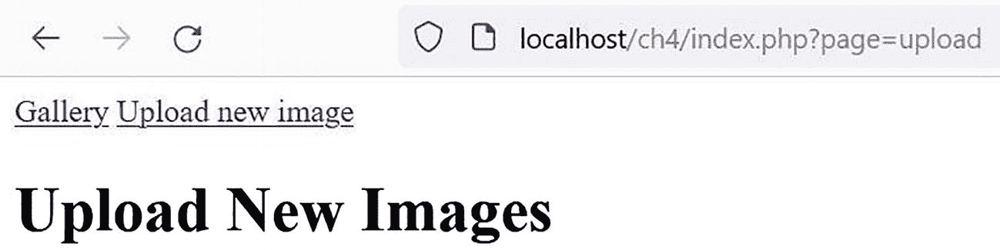

此图展示了程序员向网站上传新图片时窗口的显示效果。

**图 4-3** 点击“上传新图片”后的 `index.php` 视图

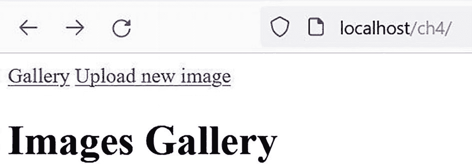

此图展示了程序员尝试查看网站图片时屏幕的显示效果。

**图 4-2** `index.php` 的默认视图

**练习**：尝试破坏当前代码。对 `Page Data` 类进行更改，导致上传页面无法正常显示。**提示**：更改 `if` 语句中检查的值。目前至少有一个 `if` 语句需要调整，以使所有信息都能正确显示。你能找到它吗？请记住，如果无法验证传入的信息，该类将显示默认值。

### 准备用于显示图片的函数

让我们更新图库文件，声明一个简单的函数，该函数仅返回一个 HTML 字符串，其中包含一个带有单个 `<li>` 的 `<ul>`。此更改是朝着网站能够显示给定文件夹（目录）中包含的所有图片迈出的一步。


```php
$out .= "图片画廊";
$out .= "";
$out .= "我将很快列出所有图像";
$out .= "";
return $out;
}
//函数调用
$info = showImages();
?>
代码清单 4-5
showgallery.php
```

请注意函数 `showImages()` 中的变量 `$out` 如何通过*增量拼接*在数行代码中逐渐累积内容。最终，当 HTML 字符串构建完成后，变量 `$out` 的内容被返回到调用该函数的代码行。

```php
$info = showImages();
```

生成的字符串通过 `$info` 变量返回到 `index.php`，在那里它将被添加到 `$pageData` 对象中，与页面模板合并，并输出到浏览器。

## 迭代

希望函数、变量和增量拼接的概念正在逐渐明朗。由于我们将要使用多张图片，我们需要花些时间来理解**迭代**：重复使用同一段代码多次。

### While 循环

让我们从 *while* *循环*开始。只要条件为真，`while` 循环就会重复执行同一个代码块。其基本语法是：

```php
while ( $condition ) {
    // 在此处重复代码
}
```

`while` 循环在语法上与 `if` 语句非常相似。如果条件为 `true`，则后续代码块中的代码将重复执行，直到条件变为 `false`。以下示例用于说明这一概念。

```php
<?php
$number = 1;
while ( $number < 5 ) {
    echo "<p>这是第 $number 行。</p>\n";
    $number = $number + 1;
}
?>
代码清单 4-6
whileloop.php
```

```php
while ( $number < 5 ) {
```

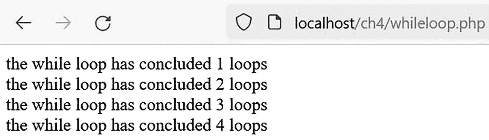

该图片反映了程序员在使用不同循环向网站上传图片后的窗口视图。

**图 4-4** whileloop.php 的输出

该代码块重复执行了四次。这是因为 while 语句括号内声明的条件所致。它检查 `$number` 是否小于五。循环首次执行时，`$number` 被设置为 1。

```php
$number = $number + 1;
```

每次代码块运行时，`$number` 都会增加 1。当 `while` 循环重复四次后，*计数变量* `$number` 的值为 5。因为五不小于五，所以 `while` 循环终止，第五行不会被输出。

> **注意：** 如果程序员忘记递增用于计数的变量会发生什么？如果变量不递增，其值就不会改变。循环会继续将表达式评估为 true，因为 1 的值不会改变，而且它仍然小于五。这会造成一个*死循环*。这是一个常见错误，尤其是对于初学者来说。务必反复检查是否记得包含了计数变量的递增。

### For 循环

作为一名新程序员，我们希望尽可能多地获得提示，以便成功创建迭代所需的任何代码。While 循环是一个很适合在条件发生变化前持续迭代的通用循环。然而，*for 循环*专门针对已知循环次数的情况而设计。

```php
<?php
for ( $number = 1; $number < 5 ; $number++ ) {
    echo "<p>这是第 $number 行。</p>\n";
}
?>
代码清单 4-7
forloop.php
```

如我们所见，要实现与 while 循环相同的结果，for 循环所需的代码行数更少。

```php
for ( $number = 1; $number < 5 ; $number++ ) {
```

计数变量 `$number` 被初始化为 1，与数字 5 进行比较，并在同一个程序语句中递增。实际上，for 循环会在循环开始时自动执行第一个位置（第一个分号前）的语句一次。然后，每当循环到达顶部时（包括首次进入循环时），它会执行第二个位置（两个分号之间）的代码。每当循环到达底部时，它会执行第三个位置（最后一个分号和右括号之间）的代码。换句话说，for 循环产生的结果与 while 循环相同。然而，它有助于提醒我们创建计数变量、为其赋予初始值、进行比较，以及——最重要的——每次递增它。


在继续之前，我们对上一个示例做了一处改动：增加了一种自增数值的方式。在 `for` 语句中，我们使用 `++` 来递增 `$number`，而不是 `$number = $number + 1`。实际上，有多种方法可以递增数值。

```
$number = $number + 1;
$number++;
$number += 1;
```

上述所有语句都会将变量加一。但请注意，每种方式都是在变量被使用后才进行递增。什么意思呢？

```
$number = 1;
echo $number++;
echo $number;
```

上述语句中，第一个 `echo` 会输出值 1，第二个 `echo` 输出值 2。因为 `$number++` 是在第一次输出之后才执行递增操作。

```
$number = 1;
echo ++$number;
echo $number;
```

如果将 `++` 符号移到左边，变量会在被使用前递增。因此，第一个 `echo` 语句会显示 2，第二个显示 3。

在 `for` 语句中，我们也可以将递增操作改为使用前进行。由于我们实际并未使用该值（例如用 `echo` 显示），因此在这个 `for` 循环示例中，结果不会发生任何变化。大多数情况下，先递增还是后递增并没有区别，但正如我们刚发现的，我们应当谨慎，确保能得到预期的结果。

```
$number = 2;
echo $number--;
echo --$number;
```

我们还可以使用 `--` 来递减变量。其过程相同：如果符号在右侧，则在变量使用后递减；如果在左侧，则在变量使用前递减。在这个示例中，第一个 `echo` 会显示 2，第二个显示 0。0？你是不是以为是 1？第一次 `echo` 后，值递减为 1。然后，在第二次 `echo` 显示结果之前，值再次递减为 0。

**练习**：调整 `for` 循环示例，使其循环十次。然后调整循环，使其仅显示奇数。提示：将递增改为每次加二。最后，查阅 [`www.php.net`](http://www.php.net) 上 `continue` 和 `break` 语句的用法。如何跳过值为 4 的情况，但继续循环？如果计数变量值为 6，如何提前退出循环？

现在我们回到构建图片库的工作。

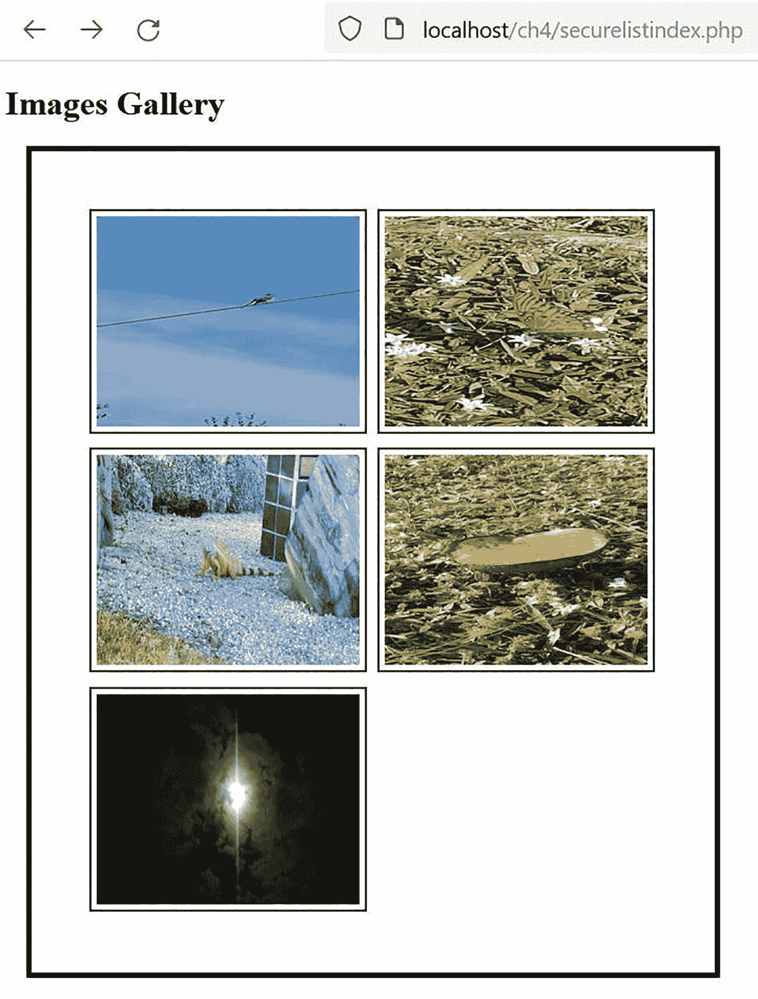

这张图片反映了开发者在图片成功上传到网站后所看到的窗口。

**图 4-5** `securelistgallery.php` 通过 `securelistindex.php` 的输出

### 使用 glob 查找文件夹中的文件

PHP 的 `glob` 方法可用于查找与模式匹配的路径名。它能快速扫描目录，并创建一个包含所有匹配项的数组。我们可以使用 `for` 循环来获取结果，因为我们不知道会返回多少结果。我们可以通过数组的 `length` 属性来获知这一信息。不过，还有一种更好的选择：`foreach` 循环。这种循环专为遍历数组和其他列表而设计。

#### For Each 循环

```
foreach ($arrayname as $value) {
语句
}
```

`foreach` 语法需要一个数组（或列表）名称和一个用于存储当前项的变量。例如：

```
<?php
$cars = array("Volvo", "BMW", "Toyota");
foreach ($cars as $value) {
  echo "$value <br>";
}
?>
```

在这个示例中，声明了一个汽车数组。`foreach` 循环会遍历该数组，并将每个值（汽车品牌）放入变量 `$value` 中，然后显示该值。循环会一直持续到数组中没有更多汽车为止。我们无需担心数组的大小，并且可以轻松更改数组而无需修改循环！

### 显示所有图片

现在让我们使用 `foreach` 循环来检索图片库中的图片。

```
<?php
function showImages() {
  $out = "<h1>图片库</h1>";
  $out .= "<div>";
  $dir_name = "imgs";
  chdir($dir_name);
  $images = glob("*.jpg");
  foreach($images as $image) {
    $out .= '';
  }
  $out .= "</div>";
  return $out;
}
$info = showImages();
?>
```

**列表 4-8** `listgallery.php`

函数的前几行将 HTML 代码传递给 `$out` 变量，以格式化图片的显示。我们将在另一个示例中优化这个显示效果。

```
$dir_name = "imgs";
```


`$dir_name`变量保存包含图像的目录。
由于该目录位于我们的`ch4`文件夹内，因此无需额外的路径。如果需要，我们也可以包含路径。

```
chdir($dir_name);
```

`chdir`命令将把我们的当前位置从`ch4`目录更改到`imgs`目录，为搜索目录中的图像做准备。

```
$images = glob("*.jpg");
```

这是一个非常强大的语句。`glob`会过滤掉当前文件夹内所有不以所示文件结尾的值。然后它会创建一个格式类似于以下的数组。

```
Array ( [0] => image4-1.jpg [1] => image4-2.jpg [2] => image4-3.jpg [3] => image4-4.jpg )
```

由于我们将结果放入了`$images`中，`glob`自动将`$images`格式化为一个数组，其中包含了目录中所有 JPEG 图像的文件名。如果我们想包含不止一种类型的图像，可以用逗号分隔它们，如下所示。

```
$images = glob("*.{jpg,jpeg,png,gif,JPG,JPEG,PNG,GIF}");
```

`foreach`循环用于显示图像。

```
foreach($images as $image) {
$out .= '';
}
$out .= "";
```

每张图像都被放入带有目录名的列表中，因为索引程序从`ch4`文件夹运行，而图像位于`imgs`文件夹中。

注意

对导航和索引程序做了微小的改动，以便使用`listgallery.php`程序。要测试当前版本，请在浏览器中运行`listindex.php`程序。

安全编程

让我们对画廊代码做一些修改，以减少系统因文件过大或总文件大小不合理而过载的可能性。

注意

*拒绝服务（DOS）攻击*是黑客试图导致网站和服务器崩溃的常见手段。所有程序员都应意识到，黑客在某个时候会试图使网页和/或服务器瘫痪。每当从其他位置检索文件或从用户处上传文件时，都应设置文件限制以防止这些尝试。

```
Images Gallery";
$out .= "";
$totalSize = 0;
$numberOfImages = 0;
$dir_name = "imgs";
chdir($dir_name);
$images = glob("*.jpg");
foreach($images as $image) {
if((filesize($image) ';
$totalSize += filesize($image);
$numberOfImages++;
}
if (($numberOfImages % 2) == 0) {
$out .= "";
}
}
$out .= "";
return $out;
}
$info = showImages();
?>
Listing 4-9
securelistgallery.php
```

注意

索引和导航文件做了微小的改动，以便使用`securelistgallery.php`。要测试此版本，请使用`securelistindex.php`。

起初，这个版本看起来比之前的版本复杂得多。然而，大部分增加的代码是用于格式化图像显示的 CSS。

CSS 回顾

```
style='
list-style-type:none;
width: 550px;
border: 5px solid black;
padding: 50px;
margin: 20px;'
```

`list-style-type`允许灵活选择在无序列表中显示的图像类型（圆形、点状）。在此示例中，该值设置为`none`，以便不在图片旁边显示任何图像。宽度设置为`550`像素，以便为两张宽度各为`250`像素的图片留出足够空间。`padding`（`50px`）是盒子内部图像与边框之间的空间量。`border`设置为`5`像素，颜色为黑色。`margin`（`20px`）是盒子（边框）外部的空间量。

```
if((filesize($image) < 500000) and ($totalSize < 2500000)) {
```

`filesize`方法返回文件的大小（以字节为单位）。因此，`500000`的大小相当于`500KB`（千字节）。`$totalSize`将跟踪正在显示的所有图片的总大小。在此示例中，总大小不会超过`2500 KB`。这个简单的`if`语句提高了我们程序的安全性。

```
$totalSize += filesize($image);
$numberOfImages++;
```

不要忘记将每张图像的文件大小加到`$totalSize`上，并递增图像数量。我们为什么要跟踪图像数量？

```
if (($numberOfImages % 2) == 0) {
$out .= "";
}
```

我们已经将显示设置为每行两张图片。因此，我们可以使用`if`语句来判断是否需要通过关闭列表元素（`</li>`）并打开一个新的列表元素（`<li>`）来换行。`%`运算符是一个*取模运算符*。它查看除法后的余数。如果没有余数，则图像数量能被二整除——这表明我们有 2 的倍数张图像（0, 2, 4, …），这时就应该开始新的一行。我们现在拥有一个美观且安全的画廊。
**练习**：调整`securelistgallery.php`程序中的设置，使其不显示某些提供的图像。它是否很好地处理了这些图片的移除？在文件夹中添加你自己的图像，并调整允许的文件大小和总大小以显示你的图像。我们如何为图像添加标题？我们如何为每张图像添加`Alt`参数？分别添加。记住，为了给视障观众提供最佳体验，我们必须包含`Alt`参数。

创建表单视图

让我们创建一个 HTML 表单来上传新的图像到画廊。我们将在`views`文件夹中创建一个文件，并将其命名为`uploadForm.php`。

```
Upload New jpg Images

Find a jpg image to upload

";
?>
Listing 4-10
uploadForm.php
```

前面的一些代码看起来应该很熟悉。我们有一个带有`method`和`action`属性的 HTML 表单。但这个表单与我们之前编写的表单确实有一些不同之处。

```
```

你注意到表单声明的`enctype`属性了吗？表单使用的默认编码不允许文件上传。我们必须特别声明，此特定表单应使用`multipart/form-data`作为`content-type`，因为这是通过 HTTP 上传文件所必需的。此信息附加在浏览器为从服务器请求信息而创建的 HTTP GET 命令中。

```
另一个显著的区别是新的输入类型`type='file'`属性。它将创建一个*文件上传控件*，允许用户浏览自己的硬盘来查找要上传的图像文件。注意同一个`<input>`元素上的`accept`属性。它将默认文件格式设置为`image/jpeg`的`content-type`。
声明`accept`属性对最终用户非常有帮助。声明后，它将缩小用户通过表单可以看到的文件范围。用户将被引导选择具有适当文件类型的文件。

注意

`accept`属性可以与任何*互联网媒体类型*一起使用。互联网媒体类型是一种标识文件类型的标准方式。在[`http://en.wikipedia.org/wiki/Internet_media_type`](http://en.wikipedia.org/wiki/Internet_media_type)查看有关互联网媒体类型的更多信息。请记住，黑客可以更改 HTML 代码设置的限制。而且，文件上传窗口仍然允许用户将文件类型更改为“所有文件”。我们还需要使用 PHP 限制文件类型，以确保没有未经批准的文件类型混入。

显示用于上传图像的表单

让我们更改上传程序，以便用户在导航中点击“上传新图像”选项时使用此表单。

```
Listing 4-11
imageUpload.php
```

`imageUpload.php`文件内容不多。不过，我们很快就会向其中添加更多内容。

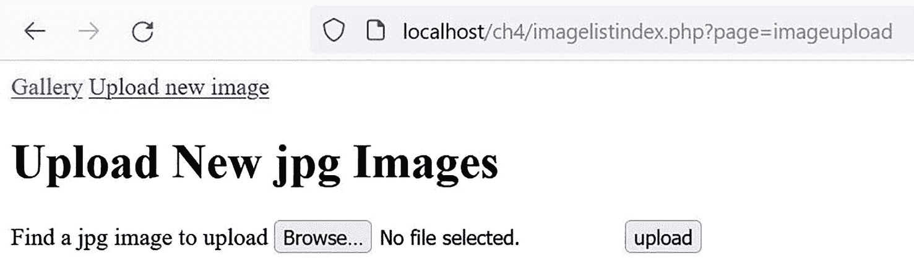

该图像表示程序员尝试上传 jpg 图像时窗口的外观。

图 4-6
`imageUpload.php`的输出

注意

对导航和索引程序做了微小的改动，以调用新的`imageUpload.php`程序。要测试此程序，请在浏览器中加载`imagelistindex.php`。此时，图像仍不会被上传。但我们很快会解决这个问题。

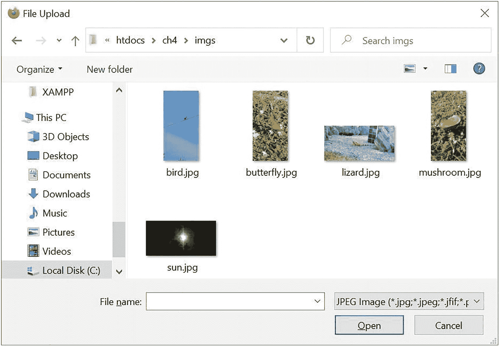

该图像表示程序员尝试将新的 jpg 图像上传到网站时拨号器窗口的外观。

图 4-7
在`imageUpload.php`中点击浏览按钮时的输出


好的，作为一名高级文档工程师和翻译员，我将遵循您提供的注意事项和示例，将给定的英文文本翻译成中文。


### 注意事项
当用户单击浏览按钮时，HTML 会弹出一个熟悉的文件上传窗口。该窗口实际上是通过向用户操作系统发送一个隐藏的*API（应用程序编程接口）调用*来打开的。这保证了用户体验的一致性。此外，仅允许上传 JPEG 图片的限制是通过 API 调用作为参数传递的，该参数设置为仅显示 JPEG 格式的文件。

### `php.ini`
我们需要检查或调整`php.ini`文件中的几个设置，以允许并限制文件上传。`php.ini`文件包含所有初始化设置，每当 PHP 程序被解释时都会访问这些设置。根据您选择安装的 Apache/PHP/MySQL 软件包，该文件的位置会有所不同。但是，它与其他 PHP 文件位于同一位置。如果您安装了 XAMPP，它位于 XAMPP 文件夹下的 PHP 文件夹中。您可以使用任何文本编辑器（如记事本或 Notepad++）查看和编辑此文件。但是，如果您确实进行了更改，请先制作一个备份副本，以防出错。为了使更改生效，必须停止并重新启动 Apache 服务器。

> **注意：** 可以通过在一个简单的 PHP 程序中显示（`echo`）PHP 函数`php_ini_loaded_file()`来发现`php.ini`文件的位置。

```
;;;;;;;;;;;;;;;;
; File Uploads ;
;;;;;;;;;;;;;;;;
; Whether to allow HTTP file uploads.
; http://php.net/file-uploads
file_uploads=On
; Temporary directory for HTTP uploaded files (will use system default if not
; specified).
; http://php.net/upload-tmp-dir
upload_tmp_dir="C:\xampp8.1.1\tmp"
; Maximum allowed size for uploaded files.
; http://php.net/upload-max-filesize
upload_max_filesize=40M
; Maximum number of files that can be uploaded via a single request
max_file_uploads=20
```

在`php.ini`文件中，我们需要确保`file_upload`设置为`On`。我们还可以指定一个不同的位置来临时保存上传的文件（如果我们选择这样做）。我们可以调整允许上传的最大文件大小以及单个请求中允许上传的最大文件数量。应仔细考虑应使用哪些限制。我们应该始终假设会有人试图通过大量文件上传来淹没我们的服务器，从而使其崩溃。

### `$_FILES`
当文件上传到 PHP 时，与文件相关的元数据会存储在一个关联数组中。这个超全局数组被命名为`$_FILES`。该数组包含有关上传文件的几个重要方面。

```
Array (
[image-data] => Array (
[name] => alberte-lea.jpg
[type] => image/jpeg
[tmp_name] => /Applications/XAMPP/xamppfiles/temp/phpYPcBjK
[error] => 0
[size] => 119090
)
)
```

`name`和`type`是自解释的。`tmp_name`是文件上传后的临时名称。如果文件太大（根据`php.ini`中的设置），则此项将设置为`"none"`。错误代码为`0`或`UPLOAD_ERR_OK`表示文件上传成功。`size`是文件的字节数。其他可能的错误消息如下所列。

```
UPLOAD_ERR_OK = 文件上传成功
UPLOAD_ERR_INI_SIZE = 文件太大，无法上传
UPLOAD_ERR_FORM_SIZE = 文件太大，无法上传
UPLOAD_ERR_PARTIAL = 文件仅部分上传
UPLOAD_ERR_NO_FILE = 没有上传文件
UPLOAD_ERR_NO_TMP_DIR = 服务器上缺少临时目录
UPLOAD_ERR_CANT_WRITE = 无法将文件保存到磁盘
UPLOAD_ERR_EXTENSION = 文件扩展名无效
```

### 安全编程
黑客可以操纵`$_FILES`关联数组的内容。唯一的例外是`tmp_name`不能被更改。因此，在使用此数组中的信息时，我们需要对其进行验证。

在移动文件之前，我们可以创建一个函数来验证文件及其大小。

```
<?php
function checkFile($tmpName, $variableName) {
    $valid_File_Types = array('image/jpeg' => 'jpg');
    $max_Size = 40 * 1024 * 1024;
    // 40MB must be the same size or less than the setting in php.ini
    $errorStatus = false;
    if (!isset($_FILES[$variableName])) {
        // error $_FILE does not exist
        $errorStatus = true;
    } else {
        $info = finfo_open(FILEINFO_MIME_TYPE);
        if (!$info) {
            // error Can't open finfo using mime type
            $errorStatus = true;
        } else {
            $mime_type = finfo_file($info, $tmpName);
            if (!in_array($mime_type, array_keys($valid_File_Types))) {
                // error invalid file type
                $errorStatus = true;
            } else {
                if (filesize($_FILES[$variableName]['tmp_name']) > $max_Size) {
                    // error file size too big
                    $errorStatus = true;
                }
                finfo_close($info);
            }
        }
    }
    return $errorStatus;
}
// Code below used for testing only
$variableName = 'image-data';
$tmp = $_FILES['image-data']['tmp_name'];
if (!checkFile($tmp, $variableName)) {
    echo "文件有效";
} else {
    echo "文件无效";
}
?>
```

**清单 4-12：`checkFile.php`**

哇，很多新代码。但让我们一步一步地分解它，看看发生了什么。

```
$valid_File_Types = array('image/jpeg' => 'jpg');
$max_Size = 40 * 1024 * 1024;
// 40MB must be the same size or less than the setting in php.ini
$errorStatus = false;
```

`$valid_File_Types`是包含我们可接受文件类型的数组。目前，只有一个条目，但我们可以轻松添加其他文件类型。`$max_Size`是我们允许的单个文件的最大大小。这必须等于或小于`php.ini`文件中存储的值。`$errorStatus`被设置为`false`，默认情况下表示我们正在上传的文件没有问题。

```
if (!isset($_FILES[$variableName])) {
    // error $_FILE does not exist
    $errorStatus = true;
```

如果从 HTML 表单传递的变量名（`image_data`）在`$_FILES`数组中不存在，我们将错误状态设置为`true`。这可能表明数组被篡改了。

```
$info = finfo_open(FILEINFO_MIME_TYPE);
if (!$info) {
    // error Can't open finfo using mime type
    $errorStatus = true;
```

如果`$info`未设置，则当我们尝试使用`finfo`查看 MIME 类型时发生了问题。这并不表示我们上传的文件有问题，而是表明我们遇到了其他问题。

```
$mime_type = finfo_file($info, $tmpName);
if (!in_array($mime_type, array_keys($valid_File_Types))) {
    // error invalid file type
    $errorStatus = true;
```

如果*MIME 类型*（文件后缀）与`$valid_File_Types`数组中的任何一个不匹配，则将错误状态设置为`true`。

```
if (filesize($_FILES[$variableName]['tmp_name']) > $max_Size) {
    // error file size too big
    $errorStatus = true;
```

如果上传的临时文件的大小大于我们允许的最大值，则错误状态设置为`true`。

```
return $errorStatus;
}
$variableName = 'image-data';
$tmp = $_FILES['image-data']['tmp_name'];
if (!checkFile($tmp, $variableName)) {
    echo "文件有效";
} else {
    echo "文件无效";
}
```

> **注意：**您可以使用`ch4`文件夹下`views`文件夹中的`testUploadForm.php`运行此程序。

错误状态会返回给调用它的程序。在这个测试中，我们在函数下方直接调用了它，并设置了变量名，从当文件通过 HTML 表单上传时创建的`$_FILES`数组中获取了文件的临时名称。然后将此信息传递到函数中。如果函数返回`false`，则表示一切正常。如果返回`true`，则说明有问题。

现在我们有了验证上传文件的能力，我们可以通过将文件从临时位置移动来完成上传过程。

### 使用 PHP 上传文件
当文件最初被上传时，它会被放置在服务器上的一个临时目录中，并使用一个临时名称，如数组中的`tmp_name`值所示。请记住，这个位置是在`php.ini`文件中确定的，并且可以通过更新`php.ini`并重启 Apache 来更改。要永久存储文件，我们必须将其从临时位置移动到一个永久位置。


```php
move_uploaded_file( $fileName, $destination );
```

函数 `move_uploaded_files()` 将完成此任务。它接受两个参数：第一个参数 `$fileName` 应包含有效的临时文件名（位于 `$_FILES` 关联数组的 `tmp_name` 中），第二个参数 `$destination` 是永久存储文件的文件夹。该位置必须存在且可写。如果文件保存成功，函数 `move_uploaded_file()` 将返回 `TRUE`，否则返回 `FALSE`。

## 规划上传器类

在作为 PHP 或全栈开发者的职业生涯中，您将多次编写文件上传代码。编写可重用的上传代码是一个明智的主意。对象易于重用，因此让我们规划一个可随时重用的上传类。

### UML

统一建模语言（UML）提供了规划类组织方式的简单图表。基本设计如下所示：

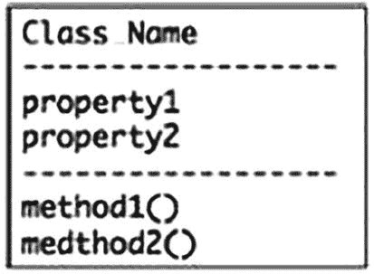

该图反映了基本的统一建模语言，包含类名、属性和方法。

**图 4-8** 基本 UML 图

请记住，类名的首字母始终大写。如果类名是复合词，每个附加单词的首字母也应大写。我们也可以选择用下划线分隔每个单词。如果类与主程序分开存放，则包含类的文件名应与类名相同。

> **注意：** UML 是 "Unified Modeling Language"（统一建模语言）的首字母缩写。该语言为记录代码提供了标准语法。UML 不仅仅包含类图。有关 UML 的更多信息，请访问 [`www.uml.org`](http://www.uml.org)。

### 上传器类需求

如前所述，我们需要将表单接收的文件数据从临时目录移动到永久位置。因此，该类需要一个属性来存储文件元数据，以及一个用于保存文件的方法。该方法需要一个文件名，因此我们创建一个 `$filename` 属性。我们还需要将文件保存到某处，因此创建一个存储位置的属性 `$destination` 和一个保存方法。现在可以开始规划新类的定义。

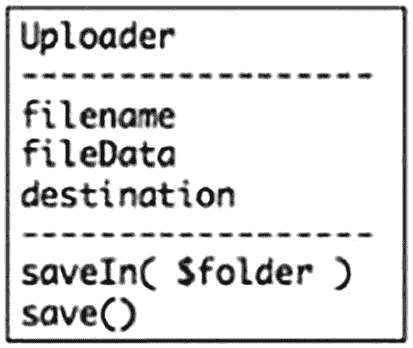

该图展示了统一建模语言的上传器类图。

**图 4-9** `Uploader` 类的 UML 图

有了规划和 UML 类图，编写类定义就变得容易了。让我们创建一个新文件 `classes/Uploader.class.php`，内容如下：

```php
<?php
class Uploader {
    public $filename;
    public $fileData;
    public $destination;

    public function saveIn( $folder ) {
        $this->destination = $folder;
    }

    public function save() {
        // 此处尚无代码
    }
}
?>
```

**清单 4-13** `Uploader.class.php`

上述代码声明了一个类，包含类名和用花括号分隔的类代码块。类内部声明了三个属性和两个方法。当我们已经创建了 UML 类图时，创建类会容易得多。属性 `destination` 将在调用 `saveIn` 方法时获取其值。属性 `filename` 和 `fileData` 当前没有任何值。我们可以从超全局数组 `$_FILES` 中检索 `filename` 和 `fileData` 的值。如果在创建新的 `Uploader` 对象时它们能自动获取值，那么它们的值就能反映当时要上传的文件。

### 魔术方法 `__construct()`

正好可以使用 `__construct()` 构造方法来完成此任务。它仅在每次使用 `new` 关键字创建新的 `Uploader` 对象时运行一次。请记住，方法名前有两个下划线字符。让我们为 `Uploader` 声明一个构造方法，以便在创建新的 `Uploader` 对象时，`filename` 和 `fileData` 属性能从 `$_FILES` 获取值。

```php
<?php
class Uploader {
    public $filename;
    public $fileData;
    public $destination;

    public function __construct( $key ) {
        $this->filename = $_FILES[$key]['name'];
        $this->fileData = $_FILES[$key]['tmp_name'];
    }

    public function saveIn( $folder ) {
        $this->destination = $folder;
    }

    public function save() {
        // 此处尚无代码
    }
}
?>
```

**清单 4-14** `ImageUploader.class.php`

请记住，我们必须知道用于上传文件的 `<input type="file">` 元素的 `name` 属性。正如我们之前发现的，我们需要 `name` 属性来访问 `$_FILES` 中的所有文件数据。在上述代码中，构造方法使用 `$key` 作为参数。`$key` 值将用于将 `name` 属性值传递给构造方法。这样，构造方法就能访问上传文件的所有元数据。

### 保存上传的文件

`Uploader` 类已接近完成。我们需要完成保存新文件的方法，并验证要上传的文件是否有效。请记住，始终要为意外情况做好准备。在执行文件上传时，我们可能会遇到一个常见问题：目标文件夹可能不可写。我们可以在代码中为此做好准备。

```php
<?php
class ImagesUploader {
    public $filename;
    public $fileData;
    public $destination;
    public $keyValue;

    public function __construct( $key ) {
        $this->keyValue = $key;
        $this->filename = $_FILES[$key]['name'];
        $this->fileData = $_FILES[$key]['tmp_name'];
    }

    public function saveIn( $folder ) {
        $this->destination = $folder;
    }

    public function save() {
        $variableName = $this->keyValue;
        $tmp = $_FILES[$this->keyValue]['tmp_name'];
        $folderIsWriteAble = is_writable( $this->destination );
        $notValid = checkImageFile($tmp, $variableName);
        if( !$notValid and $folderIsWriteAble) {
            $name = "$this->destination/$this->filename";
            $success = move_uploaded_file( $this->fileData, $name );
        } else {
            $success = false;
        }
        return $success;
    }
}
?>
```

**清单 4-15** `ImagesUploader.class.php`

让我们看一下这些更改：

```php
require_once "views/checkImageFile.php";
```

先前用于检查图像有效性的函数已稍作修改，删除了函数调用，现在该调用将在 `ImagesUploader` 类的 `save` 方法中执行。包含验证方法的新文件名是 `checkImageFile.php`。

```php
$variableName = $this->keyValue;
$tmp = $_FILES[$this->keyValue]['tmp_name'];
$folderIsWriteAble = is_writable( $this->destination );
$notValid = checkImageFile($tmp, $variableName);
if( !$notValid and $folderIsWriteAble) {
    $name = "$this->destination/$this->filename";
    $success = move_uploaded_file( $this->fileData, $name );
```

变量 `$variableName` 和 `$tmp` 在 `save` 方法中设置，其值与原始检查文件方法中设置的值相同。同时，使用 PHP 的 `is_writable` 函数来确定文件将要移动到的目录是否可写。如果文件通过验证且目录可写，则 `if` 语句产生 `true` 结果，文件被移动到永久位置。

```php
} else {
    $success = false;
}
return $success;
```

如果出现问题，则执行 `if` 语句的 `else` 部分。我们将 `$success` 设置为 `false`，表示出现问题，并将 `$success` 的值（`true` 或 `false`）返回给调用程序。

### 使用上传器类

现在我们可以有效使用 `Uploader` 类来上传文件了。代码量不大，因为大部分代码都写在 `Uploader` 类内部。

```php
<?php
function upload() {
    $uploader = new ImagesUploader( "image-data" );
    $uploader->saveIn("imgs");
    $fileUploaded = $uploader->save();
    if ( $fileUploaded ) {
        $out = "新文件已上传到图片库";
    } else {
        $out = "出现错误";
    }
    return $out;
}
$info = upload();
?>
```

**清单 4-16** `imagesUpload.php`

> **注意：** 以下文件已进行了微小调整以访问当前版本：`ImagesUploader.class.php`、`imageslistnavigation.php`、`imageslistindex.php`、`imagesUploadForm.php`。请花些时间查看发布商提供的这些文件的更改。


# 上传函数会引入上传类，然后创建一个上传器实例（`$uploader` 对象），并传入保存图片信息的属性名。该属性名已在 HTML 上传表单中设置。永久文件存储位置（`imgs`）也会传入 `saveIn` 方法并存储在对象中。接着调用 `$uploader` 的 `save` 函数，该函数会验证图片并检查文件夹（`imgs`）是否可写。如果文件成功移动，`$out` 会被设置为“新文件已上传到图片库”。如果文件因验证失败或文件夹不可写而未能移动，则会将“文件上传到图片库时出现错误”的消息传递给 `$out`。`$out` 被返回并赋值给 `$info`，从而在页面上显示。

使用 `imageslistindex.php` 测试程序。该程序应允许上传任何不超过大小限制的 JPEG 文件。

**练习**：可以在这些最终程序中添加哪些内容以使其更安全？逐个检查每个程序，并利用已掌握的知识提供更安全的程序。如何限制上传到最终目录的所有文件的总大小？添加代码以实现此限制。这也有助于降低成功发动 DOS 攻击的可能性。此外，请访问 [`www.php.net`](http://www.php.net) 了解如何创建常量。常量一旦初始创建后便无法更改。修改程序，将任何在赋予初始值后不再变化的变量改为常量。常量确实为创建安全程序提供了另一种工具。

这很酷吧？我们拥有一个完全动态的图片库，用户可以通过网站上传自己的图片。虽然这还算不上是 `flickr.com`，但我们希望您会认同，您已经开始真正使用 PHP 来创造有趣且实用的东西了。

## 单一职责原则

我们希望您能赞叹 `Uploader` 类定义的优雅之处。它的规划和编写聚焦于单一目标：上传文件。它所拥有的属性和方法仅用于完成这一任务。属性全部与要上传的文件相关，方法则全部与上传有效文件相关。

*单一职责原则*是面向对象编程中的常用原则。该原则规定，一个类应为单一目的而编写。类的所有属性和方法都应直接与该单一目的相关。该类应仅有一个需要变更的理由。

例如：`Uploader` 类只有一个变更的理由。如果你希望用它来上传不同的文件，它就会改变。单一职责原则是代码中一个值得追求的完美理念。这其实是“柯里定律”的再次体现，只是这次应用在了面向对象编程中。

> **注意**
>
> 你可以在 [`http://en.wikipedia.org/wiki/Single_responsibility_principle`](http://en.wikipedia.org/wiki/Single_responsibility_principle) 阅读更多关于单一职责原则的内容。

## 总结

在本章中，我们了解了如何利用对象和对象方法创建一个动态图片库。我们还用属性和方法声明了一个自定义类定义。我们学习了几种类型的循环，并发现 `foreach` 循环专门用于访问数组中的信息，尤其是我们可能不知道实际大小的数组。

目前，我们已经编写了两个类定义：`Uploader` 和 `Page_Data`。我们才刚刚开始学习类和对象。在本书的后续章节中，我们将接触到更多类和对象。在未来的页面中，有大量的示例和解释等着你，所以请坚持下去。学习需要时间，而我们才刚刚开始。

## 项目

1.  在网上探索关于使用 HTML 和 PHP 上传多个文件的示例。修改本章中的示例以实现同时上传多个文件。探索并使用 HTML 中用于限制上传大小的设置，使其与 `php.ini` 文件中设置的大小相同。但是，请注意，黑客可以修改 HTML 并绕过此限制。为应对这种可能性，在 PHP 上传器类中添加代码，将多文件上传的大小限制为 `php.ini` 中的值。同时，向 HTML 表单中添加代码，限制同时上传的文件数量为 `php.ini` 文件中设置的值。并在上传器类中添加 PHP 代码，同样限制要上传的文件数量。

2.  添加 PHP 代码，在显示图片前确定 `imgs` 文件夹中的文件数量。仅显示数量达到 `php.ini` 文件中设置值的图片数。

3.  在网上探索示例，通过要求在上传文件前输入用户 ID 和密码，将 HTML 上传表单的访问权限限制给特定用户。同样，需要预判到黑客可能尝试绕过此限制。在调用上传器程序之前，使用 PHP 代码检查用户 ID 和密码。如果你想要挑战一下，我们如何对密码进行哈希处理，并在哈希后验证它？请访问 [`www.php.net`](http://www.php.net) 了解保护密码的最新技术。

4.  修改程序示例，使其上传文档（如 PDF）而非图片。不显示图片，而是显示指向文档的 HTML 链接。

5.  复习 PHP 8 基本语法

## 目标

完成本章后，你应能够：

*   理解条件语句的用途和价值
*   理解 `for`、`while` 和 `foreach` 循环的用途和价值
*   理解函数的用途和价值
*   理解数组的用途和价值

既然我们已经成功创建了第一个可用的项目，让我们花点时间回顾一下 PHP 的基本语法。我们将复习一些已经介绍过的主题，并在本章中探索新的主题。在掌握了本章和前面章节的知识后，我们将准备探索数据库和其他外部文件的使用，并着手一个更大的项目：一个博客系统。花时间输入本章示例中的代码并对其进行修改，挑战自己，成为一名更好的程序员。你与代码打交道越多，就越能熟练掌握快速高效的代码开发。

### 从头开始

如前所述，所有 PHP 代码都必须放在 `<?php` 和 `?>` 标记之间。Web 服务器首先查看文件扩展名（`.php`）以判断是否存在 PHP 代码。一旦确定存在，便使用标记来指示代码的位置。

```
I love Green Tomatoes
My partner hates Green Tomatoes
```

如上所示，PHP 代码可以通过简单地使用起始和结束标记分散到文件（网页）的不同区域。但是，每次这样做都需要将代码发送给 PHP 解释器进行处理。所以，不要过度沉迷于此。你需要的是易于阅读和理解的代码。当代码流程易于理解时，你创建逻辑错误的机会也会减少。

### 注释

可以使用 `//` 或 `/*` 创建注释。请记住，注释不会被执行。但它们非常重要。优秀的程序员会提供注释，以便其他人能理解任何复杂的代码。程序只有一个人维护的时代已经过去了。任何支持你创建的代码的人，都会非常感激你在提供注释方面所做的努力。


许多组织通过记录程序的创建者、创建时间以及发生的任何变更来跟踪程序中的变更管理。注释还可以提供程序的输入输出列表以及程序本身的描述。此外，程序中创建的函数（方法或过程）也应提供类似的描述。

## PHP 函数

所有可执行代码的语句末尾都必须包含一个分号。作为标准，建议任何文本字符串（例如前面的 `Hello World`）都应包含在双引号中。PHP 确实允许某些例外情况（例如在某些情况下使用单引号），但只要你保持一致，就很少会遇到问题。使用 `echo` 展示了调用 PHP 函数的能力。

除前面展示的 `echo` 语句外，PHP 还提供了大量其他函数（代码块）。这些函数包含了经过充分测试、高效且安全的代码。明智的程序员会尽可能使用现有函数来节省时间，并减少编程错误和潜在的安全漏洞。

在创建自己的 PHP 函数时，函数名应以小写字母开头。后续单词可以大写首字母，例如 `myFunction`。一些程序员也会在单词之间使用下划线。在下面的例子中，字符串 “Hello World” 被传递到一个名为 `myFunction` 的函数中。本书将探讨大量 PHP 函数。在本章稍后部分，我们将看到更多关于程序员如何创建自己函数的示例。

## 变量

变量在内存中临时存储信息。正如我们所看到的，PHP 不要求你在使用变量时声明数据类型。然而，当有机会时，你应该考虑定义数据类型，因为这会通过限制可存储的信息类型来增强安全性。

> **注意**
> 数据类型描述了你计划存储的数据，例如字符串（文本）、整数（整型数）或浮点数（小数）。操作系统利用这些信息来确定存储该信息所需的空间大小。

在许多情况下，我们可以选择声明数据类型。当我们希望限制存储在内存中的数据类型时，声明数据类型是一个好主意。请记住，除非你阻止，否则 PHP 会进行*数据类型转换*（例如将字符串 `"10"` 转换为数值 `10`）。让我们看看在 PHP 中声明变量的标准方式。

在 PHP 中，我们通常不需要在使用变量之前单独声明它。声明变量或函数时，开发者可以使用多种风格。最常见的是驼峰命名法。在驼峰命名法中，第一个单词小写，其余单词首字母大写，例如 `addIt`。不过，其他风格也是可接受的，例如：

```
$first_number = 0;
$second_Number = 1;
$number1 = 12;
```

关键在于，无论你选择何种风格，都应在代码中保持一致。哪种格式更好其实并没有什么优势。尽管很多程序员会很乐意告诉你他们的看法！依我之见，你应该使用有意义的名称，例如 `total_Sales`。也有人会在名称中加入数据类型，例如 `int_Total_Sales`。在大型程序中，采用良好的命名约定将使跟踪变量使用情况变得容易得多。

> **注意**
> 变量名必须以 `$` 作为第一个字符，并跟随其他字母数字字符来完成命名。你也可以包含下划线（`_`）。但是，不允许使用其他特殊符号或空格。

在下面的例子中，变量 (`$result`) 将保存由名为 `addIt` 的函数返回的任何内容。由于我们没有声明数据类型，该变量可以保存数值结果、字符串结果或其他可能的格式。作为程序员，我们可能希望拥有这种灵活性。例如，如果函数能够产生结果，我们就返回结果；如果无法返回结果，我们可以返回一个字符串（`"Invalid Result"`），或者返回 `NULL`（表示无结果，与返回零不同）。

由于此函数接受两个参数（`12`，`13`），我们假设它会将数字相加并返回结果。然后，`echo` 语句将显示变量中包含的内容。

如果我们没有声明数据类型来限制传递给函数的内容（见下文），那么当传递其他类型的信息时，以下示例也可能产生正确的结果。然而，当传递了非预期的信息时，函数内部可能会有某些代码无法正确执行。一个好的程序员始终会编写代码，避免因无效数据被保存或传递给函数而引发的任何潜在错误情况。必须考虑每一种情况，即使是程序员认为不合逻辑或几乎不可能发生的情况也不例外。

如果我们想限制接受或使用的信息，我们可以声明数据类型。我们稍后将探讨几个例子。就目前而言，默认情况下，请记住，变量的数据类型是在变量首次被使用时确定的。

- **V-1**：数据类型为字符串（字符）。
  ```
  $myValue = "Help";
  ```

- **V-2**：数据类型设置为整数（整型数）。
  ```
  $myValue = 123;
  ```

- **V-3**：两个整数相加产生一个整数，然后存储到变量中。
  ```
  $myValue = 123 + 456;
  结果：$myValue 现在包含 579
  ```

- **V-4**：两个*浮点数*相加产生一个浮点数，存储到变量中。
  ```
  $myValue = 123.123 + 123.456;
  结果：$myValue 现在包含 246.579
  ```

- **V-5**：一个浮点数加上一个整数将产生一个浮点数。
  ```
  $myValue = 123.233 + 12;
  结果：$myValue 现在包含 135.233
  ```

- **V-6**：尝试将一个数字与一个字符串数字相加，如果该字符串可以转换为数字，则会成功。将数值相加会产生类似于前面示例的结果。
  ```
  $myValue = 123 + "456";
  结果：$myValue 现在包含 579
  ```

*字符串连接符* (`.`) 可用于将两个字符串合并在一起。然后，结果可以放入变量中（你猜对了，现在它包含一个字符串）。在下面的例子中，现有的两个字符串合并在一起，创建一个存储在 `$myValue` 中的新字符串。

```
$myValue = "Help" . " me!";
结果：$myValue 现在包含 "Help me!"
```

- **C-1**：当合并一个字符串和一个整数时，PHP 会将整数转换为字符串（`123`），以便将其与另一个字符串（`Help`）连接起来，生成一个字符串 `"Help 123"`，该字符串将被放入变量中。
  ```
  $myValue = "Help " . 123;
  结果：$myValue 现在包含 "Help 123"
  ```

- **C-2**：当尝试合并一个字符串和两个值（在此情况下，这两个值是要相加的）时，PHP 会先进行计算，然后将结果转换为字符串。
  ```
  $num1 = 1;
  $num2 = 2;
  $myValue = "Help " . $num1 + $num2;
  结果：$myValue 现在包含 "Help 3"
  ```

让我们看看如何使用数据类型提示来限制我们的数据类型。

在之前的例子中，函数将 `$value` 限制为仅能包含布尔（true/false）类型的值。同时，它也将返回值限制为布尔类型。

> **注意**
> `true` 不是字符串，而是一个布尔值。因此，它不需要引号。


在调用 `myFunction` 函数时，上述两种语句都可能有效。若未传递任何值，变量 `$value` 将被设为*默认值*，即 `null`。`Null` 表示该变量为空。然而，我们也可以传递一个布尔值（`true`），并将用它替代 `null`。

算术运算的运作方式与数学类似，但区别在于计算发生在赋值运算符的右侧（即 `=` 号的右边），结果则放入表达式左侧的变量、函数或其他对象中。PHP 已内置许多函数，可产生计算器上所见的结果。

> **注意**  
> 有关可用数学函数的更多信息，请访问 [`www.php.net/manual/en/ref.math.php`](http://www.php.net/manual/en/ref.math.php)。

PHP 允许使用圆括号 `()` 来改变值的计算顺序。否则，对于数值而言，该语言通常会遵循数学上的*运算顺序*。这一顺序与常规数学相似，但存在一些细微差异。随着本书后续内容的展开，我们将看到其中部分差异。

> **注意**  
> 有关运算顺序的更多信息，请访问 [`www.php.net/manual/en/language.operators.precedence.php`](http://www.php.net/manual/en/language.operators.precedence.php)。

让我们看一些示例。  
赋值运算符（`=`）会获取表达式右侧的值（`1`），并将其放入表达式左侧的变量（`$my_num`）中。如果该变量不存在，则会在内存中创建它。

```
$my_num = 1;
```

以下两条语句都将表达式右侧的值（`$my_num`）加到表达式左侧变量（`$value`）中已有的内容上。如果该变量此前不存在，则会将右侧的值加上零，并将结果放入变量（`$value`）。如果变量中包含字符串，则会在相加之前尝试将其转换为数字。

```
$value += $my_num;
$value = $value + $my_num;
```

以下示例与前一个类似，区别在于从变量所含的值中减去右侧的值。如果变量此前不存在，则从 `0` 中减去右侧的值（`$my_num`）。如果变量中包含字符串，则会在相减之前尝试将其转换为数字。

```
$value -= $my_num;
$value = $value - $my_num;
```

以下示例与前一个类似，区别在于进行乘法而非减法。如果变量此前不存在，则将右侧的值（`$my_num`）乘以 `0`。如果变量中包含字符串，则会在相乘之前尝试将其转换为数字。

```
$value *= $my_num;
$value = $value * $my_num;
```

以下示例与前一个类似，区别在于将右侧的值（`$my_num`）除以变量中所含的值。除法将返回一个浮点数，除非两个值都是整数且能整除（无小数部分）。如果变量中包含字符串，则会在相除之前尝试将其转换为数字。

> **注意**  
> 如果变量 `$my_num` 不存在，它将被设为 `0`。这会导致抛出异常，因为不能除以零！在除以零时，函数 `fdiv()` 会返回 `INF`（无穷大）、`-INF`（负无穷大）或 `NAN`（非数字），而不会抛出异常。

```
$value /= $my_num;
$value = $value / $my_num;
```

以下示例与前一个类似，区别在于将除法的余数放入变量中。如果变量中包含字符串，则会在取余之前尝试将其转换为数字。

```
$value %= $my_num;
$value = $value % $my_num;
```

以下语句将计算 `$value` 的 `$my_num` 次幂，并将结果放回 `$value`。

```
$value = $value ** $my_num;
```


变量可以在使用前递增/递减（`++$num`、`--$num`），也可以在使用后递增/递减（`$num++`、`$num--`）。

（假设每条语句执行前 `$num = 1`。）

```
$value = $num++ - 5; // $value 为 -4，$num 为 2
$value = $num-- + 5; // $value 为 6，$num 为 0
$value = ++$num – 5; // $value 为 -3，$num 为 2
$value = --$num + 5; // $value 为 5，$num 为 0
```

**练习**：编写一个程序，将两个数值赋予两个不同的变量。然后计算这两个数相加、相减、相除和相乘的结果。每次计算后，用一句话显示结果，例如"1 和 2 的和是 3。"

**提示**

在大多数情况下，PHP 允许你在字符串中直接放入变量名。例如，`"$firstNumber 和 $secondNumber 的和是 $sum"` 就能生成所需的结果。

## 条件语句

*条件语句*用于判断比较结果是否为"真"或"假"。如果语句为真，则执行紧跟在 `if` 语句后的代码。如果语句为假，则执行 `else` 语句后的代码（如果有）。与上一节中介绍的赋值运算符（`=`）不同，比较两个值是否相等需要两个（`==`）或三个（`===`）等号。两个等号会忽略大小写或数据类型，"A"和"a"会被视为相等，5 和 5.0 也会被视为相等。三个等号要求完全匹配，上述两个例子用三个等号比较都会被判定为不相等。

**注意**

如果程序员错误地只使用了一个等号，程序不会报错。它会认为条件为"真"，从而导致条件语句可能产生无效的结果。

```
if(要比较的语句) {
// 如果比较结果为真，则执行此处代码
}
// 无论结果为真还是假，if 语句后的代码都会执行
if(要比较的语句) {
// 如果比较结果为真，则执行此处代码
}
else {
// 如果比较结果为假，则执行此处代码
}
// 无论结果为真还是假，if/else 语句后的代码都会执行
```

以上展示了条件语句的基本结构。第一个例子中，只有条件为真时，`if` 语句内的代码才会执行。如果条件为假，则不执行任何额外代码。第二个例子中，在 `else` 语句后提供了当条件为假时执行的代码。还可以使用嵌套的 `if`/`else` 语句。

让我们来看一些结合比较运算符使用条件语句的例子。

I-1：

```
```

输出：36 和 25 不相等。

原因：`$a`（25）和 `$b`（36）的值不相同。因此，`else` 部分的代码会被执行。

I-2：

```
```

输出：A 和 a 不相等。
原因：使用三个等号（`===`）也会比较大小写。在此例中，由于大小写不同，比较结果为假。如果去掉一个等号，结果将变为真。

**注意**

在此例中，使用了双引号来创建字符串。由于每个字符串只有一个字符，也可以使用单引号。

I-3：

```
```

输出：36 和 25 不相等。

原因：非运算符（`!`）的作用与等于运算符的结果相反（参见示例 #1）。条件从假状态反转为真状态。执行紧跟在 `if` 表达式后的代码。

I-4：

```
```

输出：a 和 A 不相等。

原因：不区分大小写的非运算符（`!==`）作用与全等运算符的结果相反（参见示例 #2）。比较结果变为真。执行紧跟在 `if` 语句后的代码。

I-5：

```
```

输出：25.1 小于 36。

原因：如果左侧的值小于右侧的值，小于运算符返回真。我们可以混用浮点数（小数）和整数进行比较。在此例中，36 会在比较前被转换为 36.0。

I-6：

```
```

输出：36 小于或等于 36。

原因：小于或等于运算符与示例 #5 类似。但如果两个值相等，它也会返回真。

I-7：

```
 $b) {
echo "$a 大于 $b";
}
else {
echo "$b 大于 $a";
}
?>
```


输出：`36` 大于 `25`。

原因：大于比较运算符在左侧值大于右侧值时返回 `true`。在此示例中，`25` 小于 `36`。因此执行代码中 `else` 部分的内容。

```
I-8:
= $b) {
echo "$a 大于或等于 $b";
}
else {
echo "$b 大于 $a";
}
?>
```

输出：`36` 大于或等于 `36`。

原因：大于或等于比较运算符的工作方式与 #7 类似。然而，当两个值相等时，它会返回 `true`。

```
I-9:
 $b;
if( $result === 0) {
print "两者相等";
} else if( $result === 1) {
echo "$a 大于 $b";
} else {
echo "$b 大于 $a";
}
?>
```

输出：`两者相等。`

原因：*宇宙飞船运算符*在 `$a` 小于 `$b` 时返回 `-1`，在 `$a` 等于 `$b` 时返回 `0`，在 `$a` 大于 `$b` 时返回 `1`。所示的 `if` 语句判断宇宙飞船运算符返回的状态，并显示相应的结果。此处展示了如何使用 `if/else/elseif` 结构来判断一系列可能的值。

## 逻辑运算符

*逻辑运算符*允许你在条件语句中提出多个问题。让我们看一些例子。

### L-1

```
输出：我们中的一些或全部相等。
原因：或（or）语句的两侧都计算结果为 true。如果 *或运算符* 的任一侧或两侧都为 true，那么整个表达式的结果就是 true。
```

**注意**：也可以使用符号 `||` 来代替 `or`。

### L-2

```
输出：我们所有人都相等。
原因：当使用 *与运算符* 时，表达式的两侧必须都为 true，整个表达式才为 true。在这个例子中，两侧都为 true。
```

**注意**：也可以使用符号 `&&` 来代替 `and`。

### L-3

```
输出：有人不相等。
原因：使用 *异或*（`xor`）时，表达式中只能有一侧为 true。在这个例子中，两侧都为 true，因此它计算结果为 false。如果这是一个 `or` 语句，它原本会被计算为 true。
```

### L-4

```
输出：每个人都相等。
原因：*非表达式*（`!`）会反转结果。这个异或（`xor`）返回了 false，因为两侧都为 true。但是，`not` 将其反转了。
```

`?` 运算符是条件 `if-then-else` 语句的一种短编码版本。

```
输出：它们相等。
原因：如果比较结果为 true，则执行放在 `?` 和 `:` 之间的语句。如果比较结果为 false，则执行放在 `:` 和 `;` 之间的语句。由于 `print` 命令位于比较运算的左侧，因此比较的结果将被打印出来。`$a` 和 `$b` 的值相同；因此，显示了第一个字符串。
```

```
 $b ? "它们相等" : "$a 大于 $b" : "$b 大于 $a";
?>
```

输出：`36` 大于 `24`。

原因：你也可以使用宇宙飞船运算符来评估等于（`0`）、大于（`-1`）和小于（`1`）的情况。这种比较方式非常简短且高效，可以判断数值是否相等或谁更大。由于 `$a` 大于 `$b`，因此显示两个冒号（`:`）之间的语句。如果 `$a` 小于 `$b`，则会显示最后一个冒号和分号之间的语句。否则，当数值相等时，会显示问号（`?`）和第一个冒号之间的语句。

## 让我们看一些无效的比较及其产生的错误消息。

### E-1

```
"ten" > "eleven";
```

结果：错误：“比较时出现不支持的字符串类型”

### E-2

```
"eleven" > 10;
```

结果：错误：“比较时运算符类型不匹配：字符串和整数”

### E-3

```
"ten" == 10;
```

结果：错误：“比较时运算符类型不匹配：字符串和整数”

### E-4

```
"120" > "99.9";
```

结果：错误：“比较时出现不支持的字符串类型”

### E-5

```
"120"  "99.9";
```

结果：错误：“比较时出现不支持的字符串类型”

## `switch` 语句

*Switch 语句*可用于在确定变量中的值时消除嵌套的 `if-then-else` 语句。

```
switch (要比较的值) {
case 值:
// 如果为 true 则执行的代码
break;
case 值;
// 如果为 true 则执行的代码
break;
default:
// 如果没有匹配项则执行的代码
break;
}
```

`switch` 语句的结构要求在每个可能的 case 情况末尾使用 `break` 命令（`break;`）。冒号（`:`）用于每个 case 头部中要比较的值之后。

```
结果：未找到该数字。
原因：值 36 未被任何 case 语句捕获。如果可能，PHP 会进行类型转换。在这个例子中，它会将字符串中的值与给出的数字进行比较。由于没有匹配项，流程结构会落入 default 语句。default 语句的作用类似于 else 语句；它捕获所有剩余的可能性。在所有 case 结构中包含一个 default 语句来处理意外值，而不是可能导致异常情况，这是一个好习惯。
```

**练习**：创建一个程序，使用条件语句来确定字符串中包含的颜色。如果颜色是绿色，则显示“我爱地球。”如果颜色是蓝色，则显示“天空很美。”如果颜色是黄色或橙色，则显示“我爱日落。”对于任何其他颜色，显示“selectedcolor 是我最喜欢的颜色。”将 `selectedcolor` 替换为所选颜色。

**提示**：你可以将一个变量放在字符串内部。

## 函数

除了可供你使用的数千个内置或易于导入的 PHP 函数之外，你还可以创建自己的*函数*。

```
function 函数名(参数 1, 参数 2, …) {
// 代码写在这里
}
函数名(参数, 参数, …);
// 函数执行完成后的下一条语句
```

上面展示了函数的一般格式。`function` 关键字是小写的。你为函数提供的名称使用与变量几乎相同的格式，只是不包含 `$`。变量或值可以作为参数在括号中传递给函数。所有代码都放在花括号 `{}` 之间。使用函数名并传递任何必需的属性来调用函数。当函数被调用时，程序的执行会跳转到该函数。在所有代码执行完毕后，程序流程会跳转到调用函数之后的那条指令。

让我们看一些例子。

### F-1

```
输出：Hello
原因：没有值传入函数。但是，print 语句被执行了。
该函数也可以放置在代码的底部。但是，要保持一致性。要么将你的函数放在代码的顶部，要么放在代码的底部。函数也可以包含在一个单独的文件中，然后将其导入到主 PHP 程序中。我们很快就会看到这个例子。
```

### F-2

```
输出：Hello
原因：这个示例完成了相同的任务。但是，它允许用户传入要显示的值，从而提供了一些灵活性。请注意，在调用函数时，字符串是在括号内传递的。该字符串会落入变量 $value 中（它根据值传递的位置来决定值去哪）。然后，函数中的 print 语句使用变量 $value 来显示信息。尽管这个函数名为 display_hello，但它实际上可以显示几乎所有传入的内容（包括数字）。
```

### F-3

```
输出：你的名字是 James
你的名字是 Jackie
你的姓氏是 Jones
原因：前面的 display_names 函数接受两个值（$first_name, $last_name）。但是，它也为第二个参数提供了一个默认值。在第一次调用该函数时，"James" 会被传递到 $first_name 中。由于没有传入第二个参数，$last_name 将包含 "none"。屏幕将显示 "你的名字是 James"。if 语句判断出没有传入第二个值，将不会尝试显示 $last_name。在第二次调用中，两个值都被传入了。"Jackie" 被传入 $first_name。"Jones" 被传入 $last_name。该函数将显示 "你的名字是 Jackie" 和 "你的姓氏是 Jones。"
```

### F-4


```
输出：26
原因：在 `addtwo` 示例中，两个数值被传入函数。函数调用使得 `12` 被传入 `$first_value`，`14` 被放入 `$second_value`。这两个数字相加，结果存入 `$result`。`return` 语句将该值返回给调用它的程序（而非直接显示）。这使得调用代码可以灵活决定如何处理返回值。在本例中，该函数是在 `print` 执行中调用的。这将导致 `addtwo` 函数返回的值（`26`）被显示出来。

F-5：

```
输出：26
原因：我们可以添加标量类型提示，以限制传入和传出函数的参数类型。在前述示例中，传入的参数被限制为仅接受整数，如变量名前的 `int` 关键字所示。返回值也被限制为整数，如函数头部中的 `: int` 所示。
```

F-6：

```
输出：26.1
原因：此示例展示了不同数据类型的*联合*。该函数现在能够接受 `$first_value` 和 `$second_value` 为整数或浮点数。同时也能返回整数或浮点数。这在保持函数实际使用灵活性的同时，提供了额外的数据验证功能。

截至 PHP 8，当前有效的数据类型包括：

- `array`
- `bool`
- `callable`
- `int`
- `float`
- `null`
- `object`
- `resource`
- `string`

在使用函数时，你会发现有些函数可以在其他应用程序中复用。你可以将这些函数移到单独的文件中，然后导入到应用程序里。

存放在单独文件中的函数，仍应包含开闭 `php` 标签，如前所示。

```
上述程序将导入 addtwo.php 文件（其中包含 addtwo 函数）。导入后，即可按所示方式调用该函数。
```

**注意**

*当导入多个文件时，如果导入的函数中存在多个签名（名称和参数）相同的函数，可能会引发冲突。*

`include` 关键字会搜索文件并尝试将其包含到程序中。如果文件不存在，程序将继续运行。`include_once` 关键字与 `include` 类似，但它会额外检查文件是否已被导入。如果已导入，则会忽略该请求（不会产生错误）。而 `include` 在文件已被导入时会产生错误。`require` 关键字与 `include` 关键字类似，但如果文件不存在，则会生成错误。`require_once` 关键字与 `require` 关键字类似，但会额外检查，如果文件已加载则不再重复加载。

所展示的示例并未尝试处理任何错误。这些示例存在多个潜在问题，如果用户未按预期输入内容。我们可以通过添加 *try/catch* 结构来调整调用程序以处理可能的问题。

```
getMessage();
}
finally {
echo "此消息结束。";
}
?>
```

在前述示例中，`include` 语句和 `print` 语句都被放置在 *try 块* 中。程序会执行 try 块中的语句，直到遇到问题。当问题发生时，它会寻找 *catch 块* 来处理该问题。由于 `include` 语句依赖于程序外部的文件是否存在，因此程序能处理文件可能不存在的情况至关重要。此示例还将 `dividetwo` 函数放在了 try 块内。如果此 `dividetwo` 函数尝试除以零，PHP 将抛出异常。代码专门捕获了 PHP 在尝试除以零时会抛出的 `zeroException` 异常。如果发生这种情况，将显示块中所示的消息，并且程序将正常关闭（不会崩溃）。示例中还显示了其他 `catch` 块。`Throwable` 捕获会捕获所有由程序引起的其他异常。如果代码执行流程跳转进入这些块之一，则会显示标准错误消息，并且程序将执行 `finally` 块。即使未发现异常，*finally 块* 也会执行。确保正式运行的程序不会崩溃至关重要。最好捕获任何问题，然后向用户显示一条消息，请求他们稍后重试系统。

**练习**：创建一个函数，该函数接受两个数字和一个符号，以指示用户希望进行加、减、乘或除运算。使用 `switch` 语句来确定执行哪种运算。将函数调用包含在 `try/catch` 结构中，以捕获任何除以零的尝试。

## 数组

数组在内存中保存多个相关的信息。将信息保存在数组中的能力大大减少了创建多个变量来存储信息所需的编码量。数组还提供了在需要时轻松增加存储位置数量的能力。在 PHP 中，数组可以在需要时动态创建，也可以在实际使用前预先格式化。PHP 数组中每个单独项的数据类型是在存储值时确定的。

让我们看一个示例；一个数组可能包含课程信息，例如课程编号、课程名称、描述、教室、讲师和容量（学生人数）。

```
$class_array[0] = "CS122"; // 课程编号
$class_array[1] = "编程概念 1"; // 课程名称
$class_array[2] = "PHP 语言的基本概念。"; // 描述
$class_array[3] = "B123"; // 教室
$class_array[4] = "亚伯拉罕·埃克塞尔博士"; // 讲师
$class_array[5] = 50; // 学生人数
```

这个数组是动态创建的。PHP 中所有数字数组的*下标*（索引）都从零开始。然而，在动态创建数组时，你可以从任何下标开始，甚至可以跳过某些位置。数组名的语法与变量相同，但需额外添加包含在方括号（`[]`）中的数组下标。

我们也可以让 PHP 为我们创建下标编号，使用以下格式。

```
$class_array[ ] = "CS122"; // 课程编号
$class_array[ ] = "编程概念 1"; // 课程名称
$class_array[ ] = "PHP 语言的基本概念。"; // 描述
$class_array[ ] = "B123"; // 教室
$class_array[ ] = "亚伯拉罕·埃克塞尔博士"; // 讲师
$class_array[ ] = 50; // 学生人数
```

我们也可以通过其他编程语言中更常见的格式来实现同样的任务。

```
$class_array = array (  "CS122",
"编程概念 1",
"PHP 语言的基本概念。",
"B123", "亚伯拉罕·埃克塞尔博士", 50);
```


这种格式也能创建数组，且代码行数更少。`array` 关键字必须位于赋值运算符的右侧，后面跟要存储的项目（用括号括起来）。每个项目之间用逗号分隔。PHP 会将第一个项目放入下标位置零（`0`），后续每个项目将被放入接下来的位置，最终形成的数组结构与上一个示例完全相同。

该数组本身的行为实际上与之前的数组完全一致。这两种数组都要求我们记住每个位置存放的是什么内容。我们人类往往更擅长记忆词语而非数字。因此，PHP 为我们提供了关联数组，它允许我们为位置命名（键），而不是使用数字（尽管从技术上讲，我们也可以用数字命名），并将*键*与*值*关联起来。

```
$class_array["class number"] = "CS122";
$class_array["class name"] = "Programming Concepts 1";
$class_array["description"] = "Basic concepts of the PHP language.";
$class_array["room"] = "B123";
$class_array["instructor"] = "Dr. Abraham Excel";
$class_array["number of students"] = 50;
```

这样可以更轻松地理解值与该数组之间的关系。我们也可以使用另一种更常见的格式来建立同样的关系。

```
$class_array = array (  "class number” =>"CS122",
"class name" => "Programming Concepts 1",
"description"  => "Basic concepts of the PHP language.",
"room"  => "B123",  “instructor" => "Dr. Abraham Excel",
"number of students" => 50);
```

箭头（`=>`）符号在视觉上为数组中每个位置的键和值之间提供了关联。

接下来，我们来花点时间看看多维数组。

```
$class_array = array (
array (  "CS122", "Programming Concepts 1",
"Basic concepts of the PHP language.",
"B123", "Dr. Abraham Excel", 50),
array (  "CS123", "Programming Concepts 2",
"Advanced concepts of the PHP language.",
"B124", "Dr. Abraham Excel", 50)
);
```

数组也可以是多维的。上述数组包含两行，分别代表两个不同的班级。数组的维度并不局限于二维。然而，一旦我们超出三维或四维，我们人类就更难理解各维度之间的关联了。此外，你定义的维度越多，程序消耗的内存就越多，用于存储数据以及各维度之间的关联。尽量让你的结构保持简单。

## 循环

现在让我们回顾一下学过的循环知识。循环提供了多次执行相同代码的能力。稍后我们将看到，循环与向数组中检索和存储信息是密切配合的。

```
for ($I = 1; $I <= 10; $I++) {
echo "$I times ";
}
// 循环完成后的下一条语句
输出：1 times 2 times 3 times 4 times 5 times 6 times 7 times 8 times 9 times 10 times
```

当你能精确知道要循环多少次时，`for` 循环就很适用。在上面的示例中，`$I` 初始设置为 `1`。然后只要 `$I` 小于或等于 `10`，循环就会继续迭代。每次循环到达顶部时，`$I` 的值就增加 `1`。当 `$I` 的值达到 `11` 时，循环停止。程序随后会执行循环结束后的任何语句。

```
$I = 1;
while ($I <= 10) {
echo "$I times";
$I++;
}
输出：1 times 2 times 3 times 4 times 5 times 6 times 7 times 8 times 9 times 10 times
```

同样的任务也可以用 `while` 循环来完成。然而，正如你所见，它需要的代码稍微多一些。你必须记得包含计数变量的递增操作（`$I++`）。如果忘记了这条语句，就会变成无限循环。而使用 `for` 循环，你很容易就能想到要在循环顶部的语句中递增变量。`While` 循环适用于那些可能发生变化的条件——比如循环直到文件末尾或数组末尾。

```
foreach( $class_array as $value)
{
echo $value;
}
```


# PHP 数组与枚举

`foreach`循环与数组配合良好。前面的示例遍历了之前示例中展示的一维数值数组（`$class_array`），并显示每个值。`$value`代表循环当前在数组中查看的值。`foreach`循环不需要程序员编写检查数组末尾的代码，这消除了可能发生“越界”错误消息的任何可能性。此外，`foreach`循环会自动跳过数组中尚未声明的位置，这消除了在遍历数组时可能显示“空值”消息的情况。

有许多 PHP 函数可用于处理数组。让我们花点时间看几个例子。`array_merge()`可用于将一个或多个数组的内容追加到任何现有数组的末尾，或追加到已定义但当前不包含任何值的数组。

```
$result = array_merge($color1, $color2);
```

`$color2`数组被合并到`$color1`数组的末尾，结果被放入新的`$result`数组中。原始数组不会改变。`print_r()`函数是一个方便的工具，它会显示数组`$result`的内容，如下所示。

```
Array
(
[0] => red
[1] => green
[2] => blue
[3] => yellow
)
```

您也可以使用*展开运算符*来合并两个数组。

```
$cars = ["civic", "smart", ...$more_cars, "tuson"];
```

展开运算符（`...`）允许您将一个数组放置在另一个数组的任何位置。`var_dump()`函数是一个很好的工具，用于发现任何数组内部的内容以及数组中位置的数据类型。它比`print_r()`函数提供更多细节。`$cars`数组现在包含

```
array(5) {
[0]=>
string(5) "civic"
[1]=>
string(5) "smart"
[2]=>
string(5) "falcon"
[3]=>
string(7) "mustang"
[4]=>
string(5) "tuson"
}
```

## 枚举

枚举（`enum`）是具有固定数量可能值的类型集合。例如，让我们定义一个包含某些允许食物类型的 `Food` 枚举。

```php
enum Food {
    case Hotdog;
    case Fish;
    case Steak;
    case Salad;
}
```

声明后，您可以将枚举用作类型提示，以限制函数接受或返回的值。

```php
function eating(Food $type) {
    echo "I like $type";
}
```

要传递值或返回值，您必须包含枚举及其值（使用 `::`），否则会产生错误。
有关枚举的更多信息，请访问 [`www.zend.com/blog/php-8-1`](http://www.zend.com/blog/php-8-1) 。

## 总结

正如我们在本章开头所述，目标是向您介绍该语言的基本结构。我们回顾了函数、条件语句和变量的使用与创建。我们并不期望您现在就成为 PHP 专家。前面的章节还有很多，它们将构建您的知识。现在您已经有了基本理解，我们准备探索数据库的使用。我们将很快利用这些知识来构建一个博客系统。

## 项目

1.  创建一个包含您房屋或公寓信息的数值数组，包括卧室数量、浴室数量和街道地址。使用一种循环结构在格式良好的表格中输出信息。提示：您可以在 `print` 或 `echo` 语句中使用 HTML 和 CSS 代码来创建表格。

2.  使用关联数组完成第 1 题。

3.  修改第 1 题，使其包含一个二维数组，该数组将包含您街道上的所有房屋或您公寓楼中的所有单元。要输出信息，您将需要两个嵌套循环。您可以提前浏览书中示例，或在您喜欢的网络搜索引擎中搜索“displaying a php two-dimensional array”。

---

# 第二部分

# 6. 数据库、MVC 与数据对象

## 目标

完成本章后，您将能够

*   理解如何创建 MySQL/MariaDB 数据库
*   操作 MySQL/MariaDB 表中的数据
*   设计数据库表结构
*   使用 PHP 与 MySQL/MariaDB 数据库进行安全交互


## 使用模型-视图-控制器方法组织 PHP 脚本

## 创建和使用 PHP 数据对象

现代网站功能极其强大，而这种强大很大程度上源于它们存储信息的能力。信息存储能够实现软件与用户之间高度定制化的交互。这些交互涵盖从基于条目的博客和评论系统，到安全处理敏感交易的高性能银行应用程序。本章将介绍 MySQL/MariaDB 的基础知识——这是一个功能强大的开源数据库平台。我们还将探索在 PHP 项目中访问数据的面向对象方法。

> **注意**
> 
> 2009 年，Sun 微系统公司收购了 MySQL。不久之后，甲骨文公司又收购了 Sun 微系统公司。当时人们担忧 MySQL 将不再保持开源。部分 MySQL 开发者联合起来，创建了一个与 MySQL 高度兼容的免费开源数据库系统 MariaDB。多年来，虽然两个产品各自增加了一些对方未复制的功能，但用于访问和操作数据库的基本命令和例程始终保持一致。许多 WAMP、MAMP 和 LAMP 集成软件包实际上包含的是 MariaDB 而非 MySQL（尽管仍有免费版 MySQL 可用）。有些产品甚至使用命令和引用时标明所用数据库为 MySQL，而实际上却是 MariaDB。不过，由于两者访问和操作数据库的命令几乎相同，本书及其他许多书籍中的代码在两种数据库系统上均可运行。

## MySQL/MariaDB 数据存储基础

MySQL/MariaDB 是一种关系型数据库管理系统，允许我们将数据存储在多个表中。每个表包含一组命名的列，每一行则是表中的一个数据条目。表之间常常包含关于其他表条目的信息，这使得表可以通过存储在两者中的共同值相互关联。

比较表 6-1 和表 6-2 时，一个表中的值（艺术家表中的`artist_id`）可以与另一个表中的相同值（专辑表中的`artist_id`）关联。艺术家表中的`artist_id`是该表的*主键*，因为它能唯一标识每一行。专辑表中的`artist_id`是*外键*，因为它不用于唯一标识专辑表中的行（`album_id`唯一标识行，是主键），而是用于关联另一个表。

**表 6-2 专辑表**

| album_id | artist_id | album_name |
|----------|-----------|------------|
| 1        | 1         | For Emma, Forever Ago |
| 2        | 1         | Blood Bank - EP3 |
| 3        | 2         | Let It Die |
| 4        | 2         | The Reminder |

**表 6-1 艺术家表**

| artist_id | artist_name |
|-----------|-------------|
| 1         | Bon Iver    |
| 2         | Feist       |

艺术家表包含两列。第一列`artist_id`存储每位艺术家的唯一数字标识符。第二列`artist_name`存储艺术家的名字。

专辑表在`album_id`列中存储每张专辑的唯一标识符，在——你猜对了——`album_name`列中存储专辑名称。专辑表还包含第三列`artist_id`，用于关联艺术家表和专辑表。该列存储了录制该专辑的艺术家的唯一标识符。

乍一看，这似乎是一种愚蠢的数据存储方式。为什么要用抽象的、难以理解的数字，而不是简单地在每张专辑中直接写上艺术家的名字呢？表 6-3 说明了为何这不是个好主意。

**表 6-3 设计糟糕的专辑表**

| album_id | artist | album_name |
|----------|--------|------------|
| 1        | Bon Iver | For Emma, Forever Ago |
| 2        | Bon Iver | Blood Bank - EP3 |
| 3        | Feist   | Let It Die |
| 4        | fiest   | The Reminder |

你注意到`album_id`的拼写错误了吗？由于每张专辑都独立拼写艺术家的名字，就可能导致同一艺术家存储不同的名字。在像上面这样只有四个条目的小表中，很容易发现并纠正错误。但在现实世界中，表很少有如此小的。想象一下为音像店建立数据库时，我们需要管理成千上万张专辑。

这个问题也说明了以*第三范式*设计数据库的必要性。简而言之，如果数据库减少了数据冗余，并且记录能够轻松被唯一标识，那么它就符合第三范式。通过创建艺术家表，我们消除了在专辑表中重复艺术家名字的需要，也避免了两个艺术家可能同名的问题。使用艺术家 ID 可以确保每个艺术家名字的唯一性，即使名字拼写相同。如果不使用 ID，要唯一标识一行专辑记录，我们就需要同时包含专辑 ID 和艺术家名字（希望拼写正确）。  
通过设计只存储一条数据一次且仅一次的表，你就能构建一个具有数据完整性的健壮数据库。SQL 社区知名人物 Joe Celko 恰当地提出了一个口号：“一个简单事实，在一个地方，一次存储。”记住这句口号，让你的数据库表遵循这一规则。

## 使用 SQL 操作数据

我们可以通过*结构化查询语言（SQL）* 操作 MySQL/MariaDB 表中的数据。SQL 是一种在*关系型数据库系统*中管理数据的语言。关系型数据库系统（如 MySQL/MariaDB）将数据格式化为表，并使用主键和外键建立表之间的关系。在本节中，我们将了解 SQL 的基础知识，包括创建数据库、创建表、插入数据、更新数据和显示数据的功能。

许多 WAMP、LAMP 和 MAMP 集成环境都提供了*phpMyAdmin*，以便轻松创建和维护数据库。此外，其他工具如*MySQL Workbench*（`www.mysql.com/products/workbench/`）提供了更多设计、开发和保护 MySQL/MariaDB 数据库的方法。我们将从 phpMyAdmin 开始，因为它包含在 XAMPP 集成环境中。但首先，我们必须从 XAMPP 控制面板启动 Apache 和 MySQL。

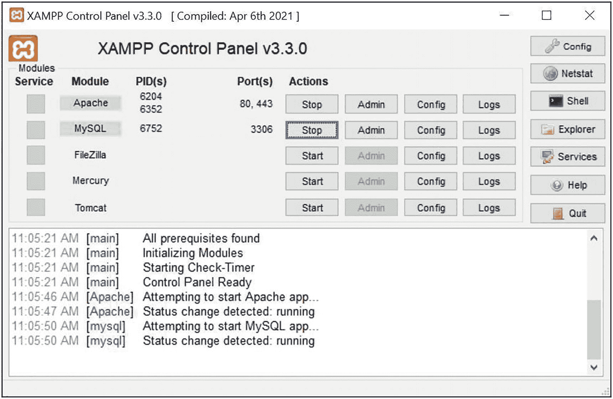

一个窗口显示了 XAMPP 控制面板 3.3.0 版本的模块，编译于 2021 年 4 月 6 日。这些模块包括服务、模块、PID、端口和操作。

**图 6-1** XAMPP 控制面板

要启动 Apache 和 MySQL，只需点击各自右侧的启动按钮。一旦它们正常启动，每个都会高亮显示为绿色，启动按钮会变为停止按钮。如果出现问题，程序会高亮显示为红色，并在查看框中显示错误信息。如果出现这种情况，请将错误信息复制到浏览器中，看看其他人是如何解决该问题的。

在 MySQL 和 Apache 运行后，打开浏览器并导航至`http://localhost/`。将显示 XAMPP 仪表盘。在仪表盘菜单中，选择 phpMyAdmin 以打开 phpMyAdmin 控制面板。

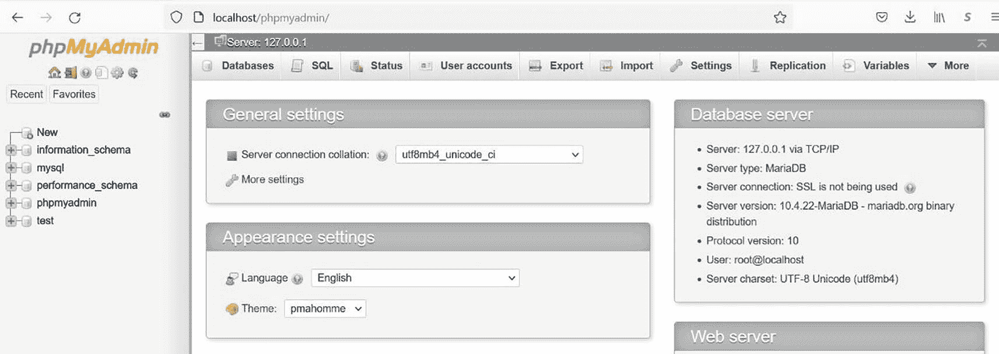

phpMyAdmin 应用程序的界面显示了服务器的一般设置、外观设置和数据库服务器。

**图 6-2** phpMyAdmin 控制面板

现在，我们已经准备好创建第一个 MySQL/MariaDB 数据库了！


## 为投票功能开发数据库

要深入理解数据库驱动的网页，最佳方法就是亲自创建一个来测试。在接下来的几页中，我们将创建一个数据库驱动的站点投票功能。这是一个简单的数据库驱动开发示例，但足以演示其核心原理。最简单的站点投票功能将展示一个问题，访问者可以回答*是*或*否*。所有用户的回复都会被显示，这样每个站点用户都能看到其他人的投票结果。

尽管这个示例非常简单，但它会用到我们目前掌握的许多技能，并教会我们如何在 PHP 项目中整合数据库驱动的数据。

该站点投票功能依赖一个数据库表来存储投票问题和投票回复。PHP 将连接到 `MySQL`/`MariaDB` 并检索相关数据，以便在浏览器中显示。使用 PHP，我们将输出一个 HTML 表单，让站点访问者能够与投票功能交互。每当访问者提交表单时，PHP 就会提交答案，并相应地更新 `MySQL`/`MariaDB` 数据库表。让我们首先创建一个包含表和一些投票数据的数据库。

### 使用 `CREATE` 构建数据库

SQL 使用关键字 `CREATE` 来构建数据库或数据库表。`CREATE` 语句必须包含 `CREATE` 关键字，以及一个表明我们想要构建的是数据库还是表的关键字。逻辑上，我们必须先创建数据库，然后才能在数据库中放置任何表。因此，我们将使用 `DATABASE` 关键字与 `CREATE` 关键字一起来构建数据库。当然，我们还需要为数据库提供一个名称。

```sql
CREATE DATABASE playground
```

要执行 SQL 语句，我们可以选择 phpMyAdmin 控制面板中的 **SQL** 选项卡（图 6-3）。选中后，会显示一个文本字段，用于输入任何有效的 SQL 命令。要执行 SQL，请点击文本字段下方的 **执行** 按钮。

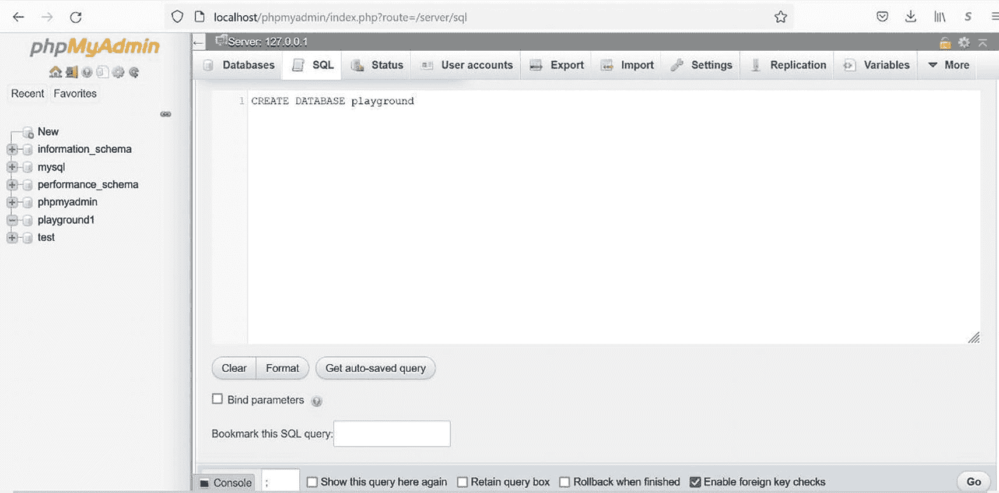

*一张 phpMyAdmin 应用程序的截图，显示了用于创建数据库的服务器 SQL 查询。*

**图 6-3** phpMyAdmin 中的 SQL 选项卡

我们也可以通过选择 **数据库** 选项卡来创建数据库。

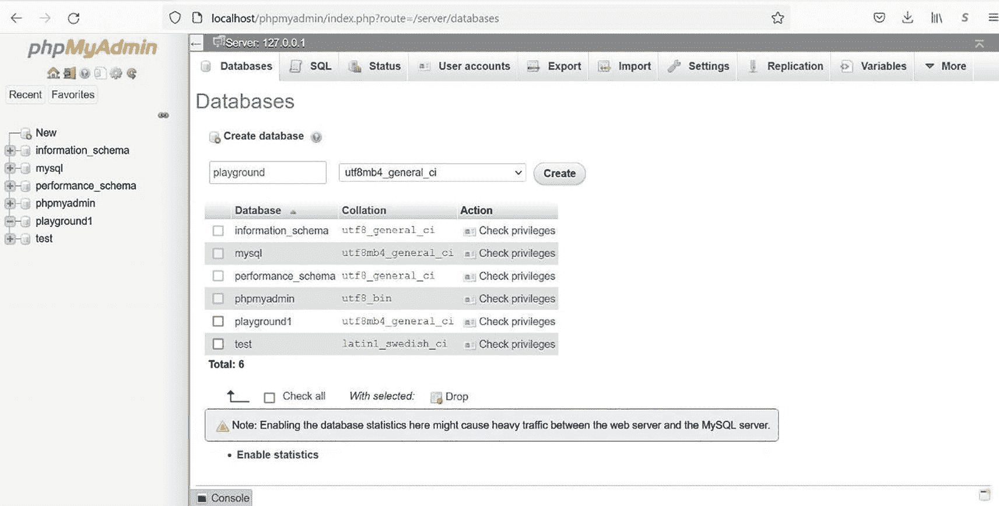

*一张 phpMyAdmin 应用程序的截图，显示了用于创建数据库的服务器数据库表。*

**图 6-4** phpMyAdmin 中的数据库选项卡

只需输入数据库名称，然后点击 **创建**。我们也可以选择要与数据库一起使用的排序规则类型。不过，使用默认设置是可以的。

> **注意**  
> 排序规则是一组规则，用于指定字符集中哪些字符排在前面。我们知道 *a* 排在 *b* 之前，但字符 *7* 呢？它应该排在字母字符之前还是之后？特殊字符如 *#”#€%*&* 呢？排序规则明确规定了字符的排序方式。

### `CREATE TABLE` 语句

如前所述，由于 `MySQL`/`MariaDB` 是关系型数据库，它以表的形式存储数据。自然地，创建数据库后，我们需要创建一个表。我们需要掌握更多一点 SQL 知识来完成这一操作。创建表的一般语法如下：

```sql
CREATE TABLE table_name (
    column_name datatype [any constraints or default values],
    column_name datatype [any constraints or default values]
)
```

同样，我们使用 `CREATE` 语句来构建表，其格式与构建数据库类似。我们将声明属性（列）的名称以及每个列或属性的数据类型。我们随时可以添加或删除列或属性。`CREATE` 语句还可以声明约束条件或默认值。

### 安全编程

在数据库中创建列时，应特别关注并仔细考虑数据类型、约束条件和默认值。一个安全的数据库会限制不符合这些参数的值进入。如果使用数据库的程序依赖于某个字段中存在的值，则应提供默认值。请记住，程序在尝试更新表之前可能会拒绝无效值。在这种情况下，使用默认值可能是可以接受的。然而，在某些情况下，为了确保创建的记录中存在足够的信息，可能需要该值。此时，应将数据库列设置为要求提供该信息。如果未提供，数据库管理系统将拒绝输入数据的尝试。

让我们通过点击 phpMyAdmin 控制面板左侧列中的 `playground` 数据库名称来访问它。点击屏幕顶部的 **SQL** 选项卡，然后我们就可以创建第一个表了。

```sql
CREATE TABLE poll (
    poll_id INT NOT NULL AUTO_INCREMENT,
    poll_question TEXT,
    yes INT DEFAULT 0,
    no INT DEFAULT 0,
    PRIMARY KEY (poll_id)
)
```

注意 `CREATE` 语句的格式。在每个语句之间包含正确的括号和逗号至关重要。最后一行不需要逗号。一旦我们在文本字段中输入了 SQL，就可以点击 **执行** 来运行它。这将创建新表。

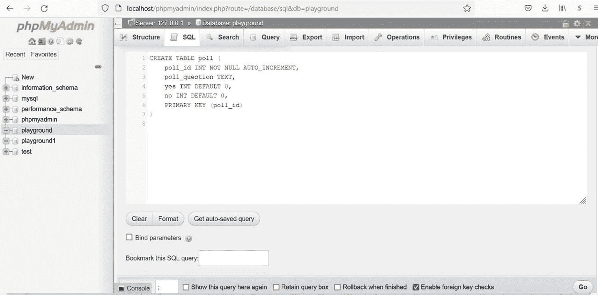

*一张 phpMyAdmin 应用程序的截图，显示了用于创建表 Poll 的数据库 SQL。*

**图 6-5** 在 `playground` 数据库中创建一个新表

在从左侧列中选择数据库后，我们也可以使用默认窗口创建表。输入表名后，我们还必须选择要创建的列数。点击按钮后，下一个屏幕将显示用于输入每列属性的框。输入的信息与前面程序代码中显示的信息相同。

让我们通过从 phpMyAdmin 左侧面板中选择 `poll` 表来探索我们创建的新表。接着，从菜单中选择 **结构** 选项卡。

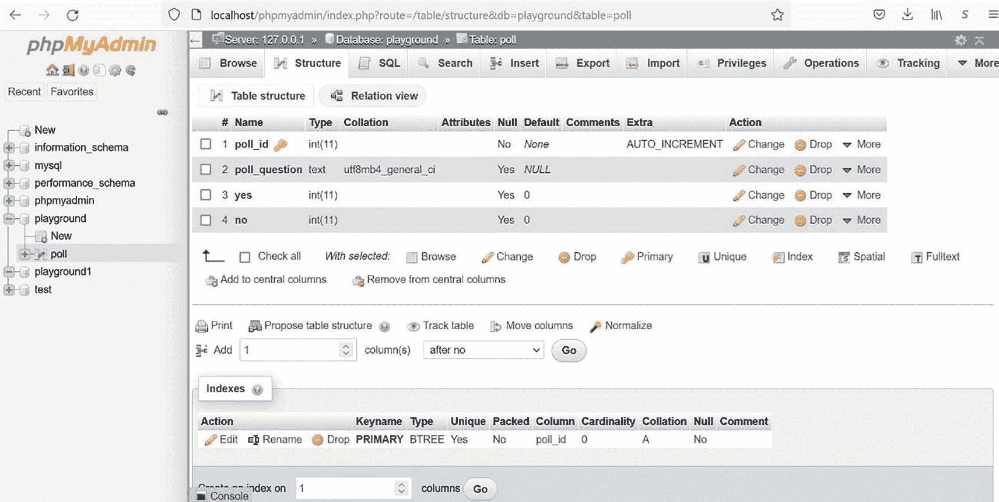

*一张 phpMyAdmin 应用程序的截图，显示了 poll 表下的结构标头。*

**图 6-6** Poll 表结构

`poll` 表有四个属性或列：`poll_id`、`poll_question`、`yes` 和 `no`。每个属性都有一个*类型*（数据类型）。表的字段只能存储正确类型的数据。例如，根据 `int` 类型的指示，我们只能在 `poll_id`、`yes` 和 `no` 中存储整数。数字 11 是整数的默认大小。这可以通过 SQL 代码进行调整，或者通过点击列右侧的 **更改** 关键字进行修改。我们将使用默认设置。`poll_question` 的类型设置将条目限制为仅文本。最后，`yes` 和 `no` 属性创建时设置了默认值 0。其他属性都没有默认值。


### 理解主键（PRIMARY KEY）

`poll_id` 属性右侧有一个可见的键图标。此外，它还在屏幕底部以 `PRIMARY` 键名列出。这表明 `poll_id` 现在是 `poll` 实体的主键。当一个属性被声明为主键时，它必须包含唯一的值。因此，无论 `poll` 表最终包含多少行数据，都不能存在两个相同的 `poll_id` 值。

假设我们有一行数据的 `poll_id` 为 1。如果我们再尝试插入另一行 `poll_id` 也为 1 的数据，新行将显示一条错误信息。主键用于明确标识一行数据。举个例子，想想有多少个叫“约翰·史密斯”的人。我们不能将姓名作为唯一标识符。然而，我们可以给每个约翰·史密斯分配一个唯一的 ID，以确定我们要查找的是哪一个。

实际上，我们可以在 MySQL/MariaDB 中创建没有主键的表，但这样的表属于特殊情况。大多数时候，你会希望创建带有主键的表，因为如果你无法唯一标识每个条目，数据就不是真正有用的。

我们现在知道 `poll` 表的创建方式要求主键 `poll_id` 必须有一个唯一的值。`poll_id` 属性被声明为 `NOT NULL`，这意味着 `poll_id` 不接受空值（null 基本上等同于没有输入任何内容）。`poll_id` 属性必须始终包含一个整数值。`poll_id` 属性不能留空。

### 理解自增（AUTO_INCREMENT）

那么 `poll_id` 的自增设置是怎么回事呢？它是一个简单但强大的工具：`poll` 表中的第一行数据将获得一个 `poll_id` 值为 1。下一行将自动获得 `poll_id` 值为 2。再下一行将获得 `poll_id` 值为 3，以此类推。`poll_id` 的值会自动递增！这是一种确保每一行都能被唯一值标识的好方法。

### INSERT 语句

表创建好了，我们就可以开始存储数据了。`poll` 表中的每一个新条目都将作为单独的一行存储。为简单起见，我们可以先插入一行数据。

```
INSERT INTO poll (
poll_question
) VALUES (
"Is PHP hard fun?"
)
```

这条 SQL 语句会向名为 `poll` 的表中插入一行新数据。它将为 `poll_question` 列（或属性）声明一个值。更具体地说，`poll_question` 列将获得值 *Is PHP hard fun?* 还记得 `poll` 表总共有四个属性或列吗？剩下的列 `poll_id`、`yes` 和 `no` 将被创建并赋予默认值。`poll_id` 将获得值 1，而 `yes` 和 `no` 都将获得值 0。

我们可以按照创建表时的相同方式来执行这条 SQL 语句。首先，在 phpMyAdmin 控制面板中选择 `playground` 数据库。然后，点击 SQL 选项卡并输入上述 SQL 语句。最后，点击“执行”（Go）来运行输入的 SQL 语句。系统随后会指示已插入一行。

或者，我们可以从控制面板中选择该数据库。然后点击菜单中的“插入”（insert）。系统会提供文本字段供我们输入数据。然后，我们可以在 `poll_question` 文本框中输入“Is PHP hard fun?”。接着，点击屏幕底部的“执行”（Go）按钮。这将生成一条类似于之前给出的 SQL 语句。系统还会包含之前未显示的默认值。要执行生成的语句，请点击屏幕底部的“执行”（Go）按钮。

如果要为多个列（属性）插入值，INSERT 语句的语法会略有不同。

```
INSERT INTO `poll` (`poll_id`, `poll_question`, `yes`, `no`) VALUES (NULL, '"Is PHP hard fun?" ', '0', '0');
```

如图所示，我们可以在第一组括号中指定属性（例如 `yes`），然后在第二组括号中指定其对应的值（`0`）。位置必须一一对应。`yes` 处于第三位，其值也处于第三位。对于列出的每个属性，都必须有一个关联的值。请记住，未列出的任何属性，如果在表中定义了默认值，都将被赋予默认值。请注意，在这个例子中，`poll_id` 被设置为 `NULL`。这个设置对于任何自增属性都是必需的。`NULL` 设置（记住，我们设置了不允许 `NULL` 的限制）将被拒绝，从而促使系统通过递增上一个数字来生成一个新的数字。还有其他格式可用于插入数据。不过，我们将使用这种格式，因为我们可以清楚地看到哪个值与哪个属性相关联。

### SELECT 语句

一旦我们向 `poll` 表中插入了一行数据，能够看到新行显示出来就太好了。要从数据库表中检索数据，我们将使用 SQL 的 `SELECT` 语句。

```
SELECT column_name, column_name FROM table_name
```

`SELECT` 关键字用于检索数据。`FROM` 关键字指定要从中检索信息的数据库表。`SELECT` 语句返回一个包含所有检索数据的临时表。这个临时表将具有紧随 `SELECT` 关键字之后指定的确切属性。

```
SELECT poll_id, poll_question, yes, no FROM poll
```

然后我们可以像之前提到的那样，将此语句粘贴到 SQL 文本框中，以产生所需的结果。

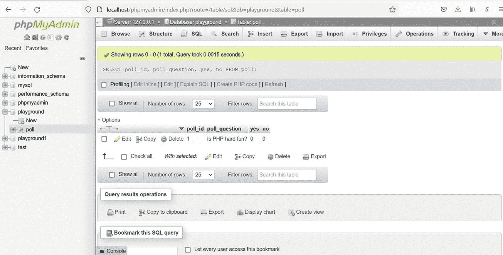

一张 phpMyAdmin 应用程序的图片，显示了 `poll` 表的 SQL 查询结果。

**图 6-7** 插入了一行数据的 poll 表

表中有一行数据。它的 `poll_id` 为 1，并有一个 `poll_question`。`yes` 和 `no` 列分别为 1 和 0。

### 安全编程

或者，我们可以使用 `*` 符号来请求显示所有字段。

```
SELECT * FROM poll
```

虽然这种格式创建起来肯定快捷简单，但它可能导致潜在的安全漏洞。请记住，将创建一个包含 `SELECT` 语句返回的所有属性的临时表。这个表可能会被黑客访问到。只暴露那些完成当前任务所必需的列。我们可以使用 `*` 符号来快速测试数据是否已存储。但我们不应该在最终产品中使用它。

目前来看，数据似乎并不多，但这就是在网站上显示一个站点投票所需的所有数据了。网站将显示投票问题。网站访问者可以通过 HTML 表单提交他们的回答。可能的选项是 *yes*（是）或 *no*（否）。网站访问者的所有回答随后将存储在 `yes` 或 `no` 字段中。因此，只需一点点数学计算，我们就能计算出相对的回答数量，并显示类似以下的信息：*79% 的网站访问者认为 PHP 既难又有趣*。

**练习**：使用 phpMyAdmin，执行代码来完成以下操作。你可以在不编写代码的情况下完成此任务，但本练习旨在帮助你练习 SQL 编码技能。首先，创建一个名为 Students 的数据库。在该数据库中，创建一个 student 表。在表中，创建以下属性（字段）：StudentID、Name、Address、City、State、Zip code 和 Major。填充至少三行信息。然后使用 `SELECT` 语句显示这些信息。

### UPDATE 语句

你可能已经猜到，`poll` 表中的 `yes` 或 `no` 值每次在网站访问者提交回答时都会发生变化。我们需要另一条 SQL 语句来进行这些更改。假设一个网站用户刚刚同意 PHP 很难学。我们需要生成一条 SQL 语句来将 `yes` 属性的存储值增加 1。


```sql
UPDATE poll SET yes = yes + 1
WHERE poll_id = 1
```

我们可以用之前讨论过的方式执行这条语句。

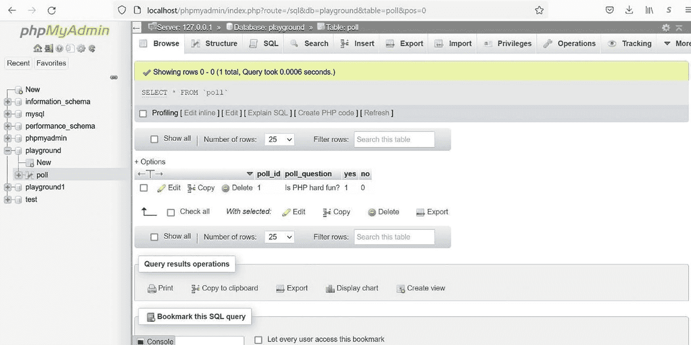

一张 PhpMyAdmin 应用程序的截图，显示了在投票（Poll）表下的浏览页面中，从 SQL 查询栏输入的内容。

**图 6-8**  
更新投票表后的结果

可以看到，投票表中第一行数据的 `yes` 属性已经增加到了 `1`。如果我们再次执行同样的 SQL 语句，`yes` 的值将继续增加到 `2`。请注意 `WHERE` 子句是如何限定受影响的行数的：只有 `poll_id` 为 `1` 的那一行会被更新。表中其他任何行都不会被更新，这都归功于 `WHERE` 子句。

### 安全编程

一条没有 `WHERE` 子句的 `UPDATE` 语句会更新投票表中所有行的 `yes` 属性。在这个例子中，表中只有一行数据，所以 `WHERE` 子句并非绝对必要。然而，你将要处理的大多数表都远不止一行数据，因此明确指出要更新的行是至关重要的。否则，可能会更新那些本不应被修改的属性，从而破坏数据库中的数据。现在我们已经掌握了一些基础的 SQL 知识，是时候为我们的数据库驱动型站点投票功能编写代码了。

## 编写数据库驱动型站点投票功能

显然，我们的程序需要通过 PHP 连接数据库，并利用额外的 PHP 脚本来显示网站内容。PHP 是一门非常宽容的语言，我们可以用多种方式来完成这项任务。但有些方式比另一些更具可扩展性。有些起初看似简单的方法，最终可能会让代码变得完全混乱、纠缠不清，如同意大利面条一般。让我们采用一种久经考验的代码架构方法，它可以进行扩展以适应复杂的项目。虽然这对我们简单的站点投票功能来说有些大材小用，但它给了我们一个介绍*模型-视图-控制器*（MVC）设计技术的机会。

## 使用 MVC 分离关注点

模型-视图-控制器（MVC）设计模式是一种常见的一致化组织脚本的方法。使用一致的方法来组织脚本可以帮助你更快速、更高效地进行开发和调试。MVC 框架建立在模型-视图-控制器所定义的基本原则之上。一旦你熟悉了基本概念，就有许多现成的 MVC 框架可用于逻辑地组织你的 PHP 项目，例如 CodeIgniter、CakePHP 和 Yii。这些框架将有助于设计和开发更复杂的 Web 应用程序。

在最基本的层面上，正如你所想，MVC 将编码关注点分为三类：模型（models）、视图（views）和控制器（controllers）。*模型*是代表数据的代码片段。你的模型还应该包含正在构建的系统中涉及的大部分逻辑。*视图*是用于可视化展示信息的代码片段。视图要显示的信息从模型接收。*控制器*是获取用户输入并向相关模型发送命令的代码片段。简而言之，MVC 将用户交互、可视化表示与系统逻辑和数据分离开来。这使得我们可以划分大型项目：HTML 专家可以创建视图，数据库专家可以创建模型，PHP 程序员则可以创建控制器。我们还可以包含多个视图，这样代码无需任何重大改动即可同时用于 Web 和应用程序。

> **注意**  
> 您可以在 [`http://en.wikipedia.org/wiki/Model-view-controller`](http://en.wikipedia.org/wiki/Model-view-controller) 了解更多关于 MVC 的信息。

我们已经见过将代码分离为模型、视图和控制的例子。还记得我们是如何为 HTML 页面制作模板的吗？我们当时使用的就是一个包含最简 HTML 页面骨架的视图。你可以在第 4 章开始构建的图库中找到它。该视图位于 `ch4/templates/page.php`。在同一项目中，我们创建了一个与该视图相关的模型：`ch4/classes/Page_Data.class.php`，它声明了许多与 HTML 页面内容相关的方法和属性。模型和视图通过一个控制器连接起来。在 `ch4/index.php` 中，我们为模型赋值，并将模型提供给视图，最终显示了一个格式良好的 HTML5 页面。因此，`index.php` 就是我们的控制器。

在本书中，目标是使用 MVC 的一个简单实现。你遇到的大多数其他 MVC 实现都可能要复杂得多。你可以轻易找到许多不适合初学者的 MVC 示例。一旦你理解了基本的 MVC 原则，并在简单的上下文中获得了使用这些原则的经验，你会发现理解更复杂的实现会容易得多。

**练习：** 既然我们已经发现之前的项目也使用了 MVC，请回到第 4 章的最后一个项目。修改文件夹名称，以指明该项目中的模型、视图和控制器。然后进行必要的代码更改（应该不多），以便在新文件夹中引用正确的文件。

## 规划逻辑

让我们把投票功能设计得简单一些。我们将创建一个 `index.php` 来输出一个格式良好的 HTML5 页面，用于显示投票。这个 `index.php` 将作为一个*前端控制器*（front controller）。前端控制器是 MVC Web 应用程序中非常常见的设计模式。前端控制器是 Web 应用程序的单一“入口”。我们在之前的项目中已经使用过前端控制器了。还记得 `index.php` 一直是你浏览器中唯一直接加载的脚本吗？它就是一个前端控制器。

> **注意**  
> 前端控制器设计模式在网上有详尽记载。你可以从 [`http://en.wikipedia.org/wiki/Front_Controller_pattern`](http://en.wikipedia.org/wiki/Front_Controller_pattern) 开始你自己的研究。

与之前的项目一样，`index.php` 将输出一个格式良好的 HTML5 页面，并加载投票控制器。投票控制器应将投票结果以 HTML 格式返回，以便在 `index.php` 上显示。请注意，每个视图都有自己专属的模型和控制器（图 6-7）。

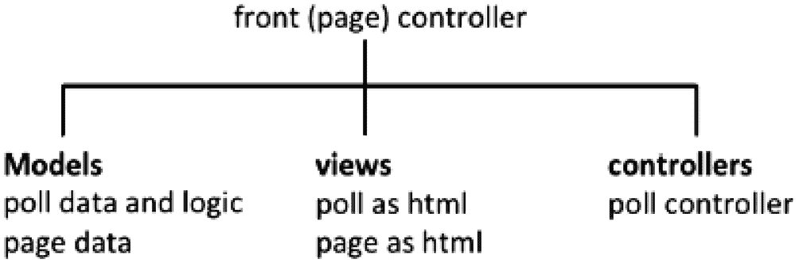

一张职责分配流程图，从前端（页面）控制器开始，指向模型-视图-控制器。

**图 6-9**  
职责分配

请注意投票模型、投票控制器和投票视图。这三者协同工作，以显示一个功能完整的投票功能。我们还可以看到，页面本身也有自己的模型、视图和控制器。前端控制器就是页面控制器。

## 创建投票项目

让我们使用基本的 MVC 结构来逻辑地组织项目。首先，在我们的可执行文件夹（在 XAMPP 中是 `htdocs` 文件夹）中创建一个新文件夹 `ch6`，然后在该文件夹内再创建一个 `poll` 文件夹。接着，在 `poll` 文件夹内创建三个子文件夹：`models`（模型）、`views`（视图）和 `controllers`（控制器）。现在，我们可以将 `ch4` 中 `template` 文件夹下的 `PrivatePage.php` 程序复制到 `poll` 下的 `views` 文件夹中（并将其重命名为 `page.php`）。同时，将 `ch4 classes` 文件夹中的 `Private_Page_Data.class.php` 程序复制到 `models` 文件夹中（并将其重命名为 `Page_Data.class.php`）。当然，你也可以从出版商的网站上下载本章的相关文件。

现在，让我们创建第一个版本的 `index.php` 程序来测试一切是否正常。该文件将直接放置在 `poll` 文件夹下。


### PHP/MySQL 网站投票示例

```php
<?php
setTitle("PHP/MySQL 网站投票示例");
$pageData->setContent("目前一切正常！");
$pageData->appendContent("...此处放置内容。");
require "views/page.php";
echo $page;
?>
```

**列表 6-1** `index.php`

此 `index` 程序仅对先前见过的原始 `privateindex` 程序稍作修改。删除了一些内容，并且文件夹名称以及标题和内容的值已更改！让我们测试一下。

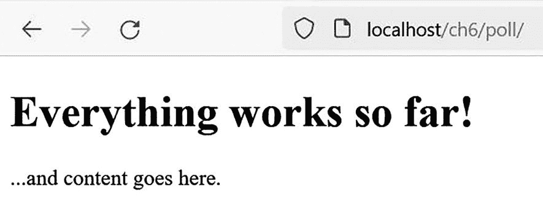

一张管理网页的图片，主标题为“目前一切正常！”，副标题为“此处放置内容。”

**图 6-10** 新 `index.php` 程序的输出

我们的视图现已更改。我们现在正从模型-视图-控制器的角度审视这段代码。我们可以看到创建的 HTML 页面是如何将*视图*与*模型*结合起来的。我们可以看到*前端控制器*如何连接模型和视图，并将格式良好的 HTML5 页面输出到浏览器供用户查看。

#### 创建投票控制器

有了一个使用其自身模型、视图和前端控制器设置创建的几乎空白的页面后，我们可以准备一个文件来在浏览器中显示我们的投票示例。坚持使用 MVC 方法，我们最终将需要一个投票模型、一个投票视图和一个投票控制器。让我们创建一个基本的投票控制器，并从前端控制器（`index.php`）加载它。让我们在 `controllers` 文件夹中创建一个新文件 `poll.php`。

```php
<?php
$info = "<p>投票即将在此显示</p>";
?>
```

**列表 6-2** `poll.php`

接下来，我们将从前端控制器（我们现在将其命名为 `pollindex.php`）加载投票控制器。

```php
<?php
$pageData = new stdClass();
$pageData->setTitle("PHP/MySQL 网站投票示例");
include_once "controllers/poll.php";
$pageData->setContent($info);
$pageData->appendContent("...and content goes here.");
require "views/page.php";
echo $page;
?>
```

**列表 6-3** `pollindex.php`

此格式应该看起来很熟悉，因为它与本教材中先前的索引示例非常相似。

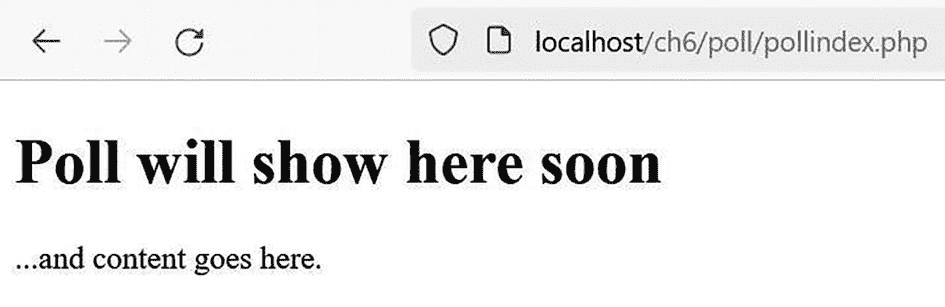

一张管理网页的图片，显示“投票即将在此显示。”

**图 6-11** `pollindex.php` 的输出

现在，我们的前端控制器和投票控制器正在协同工作，为我们的投票创建一个动态网页！接下来让我们开发投票模型。

#### 创建投票模型

有了初步的投票控制器，我们就可以开发一个初步的投票模型了。

```php
<?php
class Poll {
    private $poll_question = "Are you sure?";
    private $yes = 0;
    private $no = 0;

    public function getPollData() {
        return $this;
    }

    public function getPollQuestion() : string {
        return $this->poll_question;
    }

    public function getYes() : int {
        return $this->yes;
    }

    public function getNo() : int {
        return $this->no;
    }
}
?>
```

**列表 6-4** `Poll.class.php`

`Poll` 类定义了所有 `Poll` 对象的蓝图。`Poll` 类包含一个方法 `getPollData()`，它返回 `$this`。这个返回实现了什么？简单的答案是，它为调用此方法的任何代码返回一个指向该对象的*指针*（内存地址）。这个程序里有什么对象？在调用此方法之前，必须创建此类的一个实例（我们很快就会看到）。一旦创建，就可以调用 `getPollData()` 方法。此时，一个包含此类内容的对象将在其自己的内存空间中存在。`return` 语句将一个指向该对象的引用（指针）传递给调用该函数的代码。这将允许调用代码直接访问和使用该对象及其内容。

`$pollData` 对象具有 `poll_question`、`yes` 和 `no` 的属性及获取方法。`$pollData` 对象*表示*显示投票所需的所有内容。换句话说，`$pollData` *模型化*了投票数据。

#### 创建投票视图

我们现在可以创建一个投票视图来查看我们的数据（包含在我们刚刚创建的模型中）。

```php
<?php
echo "
<div>
<h2>投票结果</h2>
<ul>
<li>" . $pollData->getYes() . " 回答是</li>
<li>" . $pollData->getNo() . " 回答否</li>
</ul>
</div>
";
?>
```

**列表 6-5** `poll-html.php`

此视图使用获取方法来检索投票结果（目前默认值为零）并将它们放入一个无序列表中。

#### 连接投票视图与投票模型

在创建了初步的投票模型和投票视图后，我们可以更新投票控制器来连接模型和视图，并最终在浏览器中显示一些内容。

```php
<?php
include_once "models/Poll.class.php";
$poll = new Poll();
$pollData = $poll->getPollData();
include_once "views/poll-html.php";
?>
```

**列表 6-6** `newpoll.php`

`Poll` 类模型被包含到控制器中，并创建了一个实例（`$poll`）。调用了 `getPollData()` 方法，该方法创建了指向 `$poll` 对象的引用，命名为 `$pollData`。我们说 `$pollData` 现在是一个指向该对象的指针。我们现在可以使用 `$pollData` 访问对象中的任何内容。最后，附加了显示投票结果的 `poll-html.php` 视图。就是这样！我们有了一个 MVC 投票。

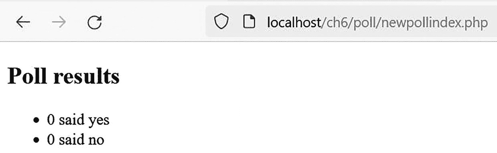

一个应用程序输出（`newpollindex.php`）显示了投票结果，YES 和 NO 均为 0。

**图 6-12** `newpollindex.php` 的输出

也许你非常想问这样一个问题：*为什么我要创建三个不同的文件来显示一个简单的 `<ul>` 元素？* 这是一个完全合理的问题。如果你只是想显示一个包含几个硬编码值的 `<ul>` 元素，那么 MVC 方法完全是小题大做。最好的方法可能是编写一个简短的 HTML 程序。

这里的重点是引入一个非常简单的示例来介绍 MVC 设计模式，这样就不会有过于复杂的代码来掩盖 MVC 的基本原则。通过 MVC 方法，你可以完美地搭建一个数据库驱动的 Web 应用程序。对于如此简单的事情，MVC 架构几乎不是必需的，但它确实可以解决你在更复杂的项目中会遇到的一些挑战，例如我们将在下一章开始制作的博客系统。

MVC 将视图与模型和控制器分离开。这意味着我们可以在不更改其他任何内容的情况下更改视图。假设我们不希望投票使用 `<ul>` 元素。我们可以简单地更改 `views/poll-html.php` 中使用的 HTML 标签，并相信其余代码能正确运行。我们可以在不更改其他任何内容的情况下轻松更改视图。

类似地，我们可以更改内容，同时仍然相信我们的代码能按预期运行。将 `no` 属性设置为 9 将是一项简单的任务。我们只需要更改一小段代码。这个投票应用程序是使用自包含元素构建的。

#### 从 PHP 连接到 MySQL/MariaDB

MVC 架构将使连接到数据库并使用数据库驱动的数据进行投票变得相当简单。一旦建立了这样的连接，我们就可以从数据库中检索数据并使用 HTML 进行查看。这就是 MVC 数据库驱动网站的精髓。

##### PHP 数据对象 (PDO)

PHP 提供了几种访问 MySQL/MariaDB 数据库的方法。在本书中，我们将专门使用 PHP 数据对象 (PDO)。这是一种从 PHP 连接到数据库的非常安全且高效的方式。PDO 支持多种数据库，并提供了一套统一的方法来处理大多数数据库交互。这对于需要支持多种数据库类型（如 PostgreSQL、Firebird 或 Oracle）的应用程序来说是一个巨大的优势。

##### 打开连接

是时候连接到我们的数据库了。请记住，模型包含所有检索数据的代码。因此，我们将创建一个模型程序来连接到我们的数据库，并很快创建一个程序来检索我们的数据库信息。以下代码假定数据库不需要用户 ID 和密码即可访问。但是，在生产环境中，使用登录凭据来保护数据库至关重要。这只需要进行简单的更改，即可用正确的用户 ID 和密码更新代码。

```php
<?php
try {
    $dbh = new PDO('mysql:host=localhost;dbname=bitter', 'root', '');
    $pageData->setContent("连接成功！");
} catch (PDOException $e) {
    $pageData->setContent("连接失败！$e");
    exit();
}
?>
```

**列表 6-7** `database.php`


好的，作为一名高级文档工程师和翻译员，我将遵循您提供的注意事项和示例，将给定的英文文本翻译成中文。


## 排版后的文档

前面的代码使用了之前介绍的`try/catch`块来处理可能抛出异常的任何代码。当尝试打开数据库时，我们可能不会成功。因此，这行代码被放在`try`块中。如果引发了异常，`catch`块将执行，显示异常消息、我们自己的消息并退出程序。如果一切正常，我们可以继续尝试检索数据。如果成功，代码会创建一个`PDO`对象并将其存储在`$db`变量中。

> **注意**  
> 你可能还有其他可用于创建到数据库的`PDO`连接的设置。你可以查阅[`www.php.net/manual/en/book.pdo.php`](http://www.php.net/manual/en/book.pdo.php)获取完整且详细的覆盖信息。

我们很快会将这个程序导入到我们的控制器中。

### 与 Poll 模型共享数据库连接

我们可以使用带参数的构造函数来与`Poll`模型共享数据库连接。

```
db property
$this->db = $dbConnection;
}
public function getPollData() {
return $this;
}
public function getPollQuestion() : string {
return $this->poll_question;
}
public function getYes() : int {
return $this->yes;
}
public function getNo() : int {
return $this->no;
}
}
?>
Listing 6-8
NewPoll.class.php
```

现在构造函数接受指向数据库连接对象的指针，并将其放入`$db`中。接下来，我们将调用`Poll`类的构造函数，并将`PDO`对象指针作为参数传递。暂停一下思考。在我们的代码中，我们应该在哪里加载`Poll`模型？

从`poll`控制器！

```
getPollData();
include_once "views/poll-html.php";
?>
Listing 6-9
newestpoll.php
```

现在，我们已经将数据库连接传递给了`Poll`模型。代码共享了一个数据库连接，但目前还没有使用它做任何事情。让我们更新`index.php`文件，以包含我们的数据库连接。

```
setTitle("PHP/MySQL site poll example");
include_once "models/database.php";
include_once "controllers/newestpoll.php";
$pageData->setContent($info);
require "views/page.php";
echo $page;
?>
Listing 6-10
newestpollindex.php
```

只有少数几个小改动。`database.php`程序已被包含，控制器已更新到最新版本。如果我们执行这个索引文件，在输出中不会看到任何变化。然而，我们已经连接到了数据库并传递了指向数据对象的指针。我们离一个完整的程序越来越近了！

变量`$db`在`newestpollindex.php`中声明。它在`newestpoll.php`中可用，因为它是在`newestpollindex.php`中被包含的。包含一个文件很像将代码从一个文件复制并粘贴到另一个文件中。因此，在任何包含文件中声明的所有变量都可以在其他被包含的文件中使用，只要这些文件是在之后被包含的。

### 使用 PDOStatement 检索数据

在数据库内部，我们有一个`poll`表，包含`poll_question`以及`yes`和`no`属性的值。我们准备从数据库中检索数据。

请记住，处理轮询数据的代码属于`Poll`模型。因此，我们需要修改`Poll`类中的`getPollData`方法。目前，该方法返回硬编码的轮询数据；我们希望返回基于数据库驱动的轮询数据。

```
?php
//complete code for models/Poll.class.php
class Poll {
private $db;
//method requires a database connection as argument
public function __construct( $dbConnection ){
//store the received connection in the $this->db property
$this->db = $dbConnection;
}
public function getPollData() {
$sql = "SELECT poll_question, yes, no FROM poll WHERE poll_id = 1";
$statement = $this->db->prepare($sql);
$statement->execute();
$pollData = $statement->fetchObject();
return $pollData;
}
}
?>
Listing 6-11
NewestPoll.class.php
```

`Poll`类实际上变成了一个更小的程序。我们不再需要存储问题和响应的值，因为我们正在将包含来自数据库信息的对象传递回调用程序。因此，属性和`get`方法不再需要。只需要几行代码就可以检索到我们的信息。

```
$sql = "SELECT poll_question, yes, no FROM poll WHERE poll_id = 1";
```

属性`$sql`包含用于检索所需信息的 SQL 语句。

```
$statement = $this->db->prepare($sql);
```

SQL 字符串在执行前被转换为`PDOStatement`对象。`prepare()`将一个简单的 SQL 字符串转换为`PDOStatement`对象。

```
$statement->execute();
```

`PDOStatement`方法`execute()`针对 MySQL/MariaDB 数据库执行 SQL。

```
$pollData = $statement->fetchObject();
```

`fetchObject()`从查询的数据库表中检索一行数据，创建一个`StdClass`对象（`$pollData`）。这个对象将公开暴露我们检索到的所有数据。然而，这并不是什么安全问题，因为我们原本就打算向所有人显示这些数据。如果我们打算使用这些数据更新数据库，则需要使用更安全的方法。返回的`StdClass`对象会自动创建属性`poll_question`、`yes`和`no`。

```
return $pollData;
```

该对象被返回给调用程序（`finalpoll.php`）。

> **注意**  
> 你可以在[`www.php.net/manual/en/class.pdostatement.php`](http://www.php.net/manual/en/class.pdostatement.php)查阅`PDOStatement`对象的官方文档。

```
getPollData();
include_once "views/finalpoll-html.php";
?>
Listing 6-12
finalpoll.php
```

`finalpoll.php`仅被修改为调用更新后的`Poll`类和一个略有修改的 HTML 视图。

```
Poll results

$pollData->yes said yes
 $pollData->no said no

";
?>
Listing 6-13
finalpoll-html.php
```

由于从数据库返回的是一个`StdObject`，我们可以直接访问属性而无需使用`get`方法。因此，视图程序（`finalpoll-html.php`）发生了一个小变化。

```
setTitle("PHP/MySQL site poll example");
include_once "models/database.php";
include_once "controllers/finalpoll.php";
$pageData->setContent($info);
require "views/page.php";
echo $page;
?>
Listing 6-14
finalpollindex.php
```

索引文件（控制器）也仅被略微修改以调用新版本的轮询控制器。如果我们在浏览器中执行`finalpollindex.php`程序，会发现与图 6-12 相同的输出格式。然而，一个重要的区别是现在数据是从数据库中提取的。一个真正的数据库驱动的网站！

### 显示轮询表单

我们还没有一个像样的站点轮询。站点访问者应该被允许提交他们的意见，从而为轮询结果做出贡献。我们必须为站点访问者提供一个表单。请记住，所有显示都是视图。那么，让我们更新视图，不仅要显示轮询结果，还要接受站点访问者的意见。

```

$pollData->poll_question

Yes, it is!
No, not really!

Poll results

$pollData->yes said yes
$pollData->no said no

";
?>
Listing 6-15
completepoll-html.php
```

```
$dataFound = isset( $pollData );
if( $dataFound === false ){
trigger_error( 'views/completepoll-html.php needs an $pollData object' );
}
```

为了提高程序的可靠性，我们添加了一个`if`语句，用于判断`$pollData`信息是否被正确创建。我们之前假设它总是被正确创建的。但永远不要假设。始终要预料到意外情况，并检查可能出错的情况。`trigger_error`将创建一个自定义错误消息。当表单在其他程序（如控制器）中使用时，你可以创建一个`try/catch`来捕获这个可能的错误。

```
form method='post' action='completepollindex.php'>
$pollData->poll_question

Yes, it is!
No, not really!

```


# 创建了一个用于获取客户意见的表单。

一旦客户点击提交按钮进行回复，该回复将通过 `post` 方法传递到索引（控制器）。

## 根据表单输入更新数据库表

完成站点投票示例还需要最后一步。我们需要检索用户通过表单提交的任何输入，并用接收到的输入更新投票表。如果网站访问者提交了 `no`，我们将增加投票数据库表中 `no` 属性的值。

所有数据交互都是模型的任务。让我们用一个更新数据库表的方法来更新投票模型类。

```
db property
$this->db = $dbConnection;
}
public function getPollData() {
$sql = "SELECT poll_question, yes, no FROM poll WHERE poll_id = 1";
$statement = $this->db->prepare($sql);
$statement->execute();
$pollData = $statement->fetchObject();
return $pollData;
}
public function updatePoll ( $input ) {
if ( $input === "yes" ) {
$updateSQL = "UPDATE poll SET yes = yes+1 WHERE poll_id = 1";
} else if ( $input === "no" ) {
$updateSQL = "UPDATE poll SET no = no+1 WHERE poll_id = 1";
}
$updateStatement = $this->db->prepare($updateSQL);
$updateStatement->execute();
}
}
?>
```

新方法 `updatePoll()` 与 `getPollData` 方法类似。但是，如果用户提交了 `yes`，我们将格式化一个 SQL 字符串来更新投票表中的 `yes` 属性。如果用户提交了 `no`，我们将格式化另一个 SQL 字符串来更新 `no` 属性。注意，yes 或 no 的值会增加 1，以便将用户的选择添加到数据库表中的正确位置。无论创建哪个 SQL 字符串，它都会被存储在一个名为 `$updateSQL` 的变量中。一旦 `$updateSQL` 字符串创建完成，我们再次使用 PDO 方法 `prepare()` 将 SQL 字符串转换为 `PDOStatement` 对象，并将其存储在变量 `$updateStatement` 中。然后我们调用 `execute()` 来更新投票表。

### 安全编程

我们应当时刻警惕黑客可能试图利用 *SQL 注入* 来破坏我们的表和数据库。SQL 注入是一种尝试将 SQL 语句插入到程序使用 SQL 进行插入或更新数据库数据中的行为。在未来的章节中，我们将使用预编译语句来创建我们的 SQL 命令，这将降低注入成功的可能性。我们还会在对数据库进行任何更新之前验证数据。在前面的例子中，我们没有使用任何从用户那里收集的信息来格式化 SQL 语句。因此，创建的 SQL 语句是安全的，能够抵御 SQL 注入。

## 响应用户输入

控制器负责处理用户交互。因此，`投票控制器` 是拦截来自投票表单的用户输入的正确位置。需要向脚本中添加几项内容。

```
updatePoll( $input );
}
$pollData = $poll->getPollData();
include_once "views/completepoll-html.php";
?>
```

```
//检查表单是否已提交
$isPollSubmitted = isset( $_POST['user-input'] );
//如果刚刚提交...
if ( $isPollSubmitted ) {
```

我们将使用 `isset` 方法来判断用户是否已选择在调查中发表意见。如果他们选择了，我们将更新结果。

```
//获取从表单接收的输入
$input = $_POST['user-input'];
//...更新模型
$poll->updatePoll( $input );
}
```

如果他们确实提交了，我们将检索选定的值并将其放入 `$input` 中。然后我们将该值传递给 `updatePoll` 方法，该方法将对数据库表进行更改。

```
$pollData = $poll->getPollData();
include_once "views/completepoll-html.php";
```

无论用户是否提供了意见，程序都将获取当前的投票结果，并通过调用 HTML 页面来显示它们。

**注意**：索引（控制器）程序发生了一个小改动，用于调用 `completepoll.php`。您可以在从出版商网站下载的文件中查看到此更改。

要查看结果，请在浏览器中运行 `completepollindex.php`。

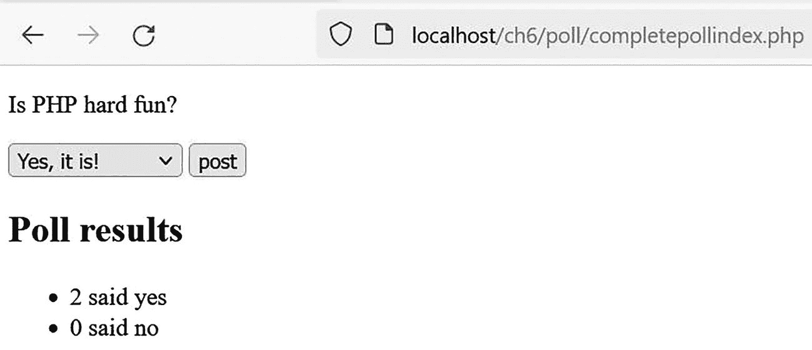  
**图 6-13** 来自 completepollindex.php 的输出

我们现在有一个功能完备的投票网站！这个最终版本有一个弱点。您能看出来吗？一旦用户输入了他们的意见，程序允许他们再次输入。如何纠正这个问题？我们可以更改输出，使其仅在页面首次显示时显示问题。一旦意见被提交，我们就可以显示不再询问问题但显示结果的页面。我们可以修改结果，使其使用之前创建的 `finalpoll-html.php`。这只需要更改前面讨论过的 include 语句。

**练习**：调整最终的投票项目，以接受用户的多个输入。调整控制器、模型和视图来请求、存储和显示这些信息。

## 总结

在本章中，我们学习了 SQL 语句的基础知识，以及如何使用 PHP 与数据库交互。我们学习了 MVC 如何为创建需要数据和界面的程序提供逻辑结构。在接下来的章节中，我们将学习如何构建一个带有基本条目管理器的博客，该管理器允许我们创建、修改和删除条目，并在公共页面上显示它们。

## 项目

1.  MVC 设计的力量在于，能够在很少或不需要更改项目其他组件的情况下更改模型或视图。查看 PHP 文档 ([`www.php.net/manual/en/function.file.php`](http://www.php.net/manual/en/function.file.php)) 关于文件读写的内容。更改示例中的模型代码，以将投票信息读取并存储到文件中，而不是数据库中。您应该能够在几乎无需修改控制器或查看器的情况下进行这些更改。大部分更改应发生在模型内部。
2.  访问 [`www.w3schools.in/laravel-tutorial/`](http://www.w3schools.in/laravel-tutorial/) 并了解 Laravel 如何帮助使用 PHP 和其他工具创建健壮的、数据驱动的 Web 应用程序。

# 7. 构建基本博客系统

## 目标

完成本章后，您将能够：

- 创建一个包含 HTML 表单的视图，用于接受新的博客条目
- 创建一个控制器，用于处理来自表单的输入
- 创建一个模型，用于使用数据库表保存和检索任何条目
- 设计并创建一个包含表的 MySQL/MariaDB 数据库
- 为前端控制器使用设计模式
- 为数据库访问使用表数据网关设计模式
- 使用 `while` 循环遍历数据集

在本章中，我们将开始构建我们的博客系统。我们将从创建一个条目管理器（前端控制器）开始。我们将为博客系统创建两个首页，一个用于管理员，一个用于用户。到本章结束时，基本博客系统将能够保存新博客并显示存储在数据库中的所有条目。在此过程中，我们将使用之前介绍过的概念和主题：数据库设计、SQL 和 MVC。我们还将学习新技术，包括设计实践和预编译 SQL 语句。

### 创建 blog_entry 数据库表

任何新应用程序最重要的步骤之一是规划用于保存数据的表。这对以后应用程序扩展的难易程度有着巨大的影响。*扩展*是指应用程序为管理更多信息和/或用户而进行的扩展，如果在开始新项目时没有长远考虑，这可能会非常痛苦。起初，博客需要存储几种类型的条目信息才能运行，包括以下内容：

- 唯一 ID
- 条目标题
- 条目文本
- 创建日期

第一步是确定条目表的字段类型。


## 数据库表单设计

-   `entry_id`：唯一标识条目的数字。这将是一个正整数，并且该数字自动递增以确保唯一性。`entry_id`将是该表的主键。

-   `title`：相对较短的字母数字字符串。我们将字符串限制为 150 个字符。

-   `entry_text`：长度不确定的字母数字字符串。我们不会限制此字段的长度（在合理范围内）。

-   `date_created`：在条目首次创建时自动生成的时间戳。我们将使用此字段对条目进行按时间排序，并让用户知道条目的原始发布时间。

现在我们已经确定了所需的字段，是时候创建数据库了。使用我们在前一章学到的技术，让我们开始吧。请记住，Apache 和 MySQL/MariaDB 都需要运行才能使我们的应用程序正常工作。

```sql
CREATE DATABASE simple_blog
```

我们可以将上述代码输入到 phpMyAdmin 的 SQL 窗口中，或者使用 phpMyAdmin 的“数据库”菜单项创建数据库。

下一步是创建`entries`表。请记住从 phpMyAdmin 控制面板左侧的菜单中选择`simple_blog`数据库。

```sql
CREATE TABLE blog_entry (
entry_id INT NOT NULL AUTO_INCREMENT,
title VARCHAR( 150 ),
entry_text TEXT,
date_created TIMESTAMP DEFAULT CURRENT_TIMESTAMP,
PRIMARY KEY ( entry_id )
)
```

我们可以在 SQL 窗口中输入上述代码。或者，在选择数据库后，使用 phpMyAdmin 提供的创建表文本框。如果选择使用文本框输入值，请确保输入的所有信息与上述代码中提供的信息一致。

`title`属性有一个新的数据类型：`VARCHAR(150)`。因此，任何标题都必须包含可变长度的`CHAR`acter。博客条目标题可以是 0 到 150 个字符之间的字符串。如果我们插入一个长度为 151 个字符的标题，则只有前 150 个字符会保存到`blog_entry`表中。数据库确保我们输入的值在保存之前是有效的。

`date_created`属性也声明了一个新的数据类型：`TIMESTAMP`。`TIMESTAMP`保存关于某一时刻的精确信息。它存储*年*、*月*、*日*、*时*、*分*和*秒*，格式为 YYYY-MM-DD HH:MM:SS。

我们已经讨论过在 MySQL 表中使用默认值。这里，它再次用于`date_created`属性。当第一次插入新条目时，MySQL/MariaDB 将根据服务器时钟自动存储当前的`TIMESTAMP`。服务器时钟将基于服务器所在的时区。

## 规划 PHP 脚本

我们的下一个逻辑步骤是创建一个博客条目编辑器，以便我们可以创建新的博客条目。此博客条目编辑器仅供博客作者使用。普通网站访问者无法创建新条目。普通网站访问者应只能查看博客条目，不能编辑现有条目或创建新条目。

处理此类任务的一种方法是创建两个主要的站点入口：`index.php`（供普通访问者使用）和`admin.php`。在 MVC 术语中，`index.php`和`admin.php`都将是*前端控制器*。在后面的章节中，我们将学习如何使用登录来限制对`admin.php`的访问。

管理页面将列出所有博客条目，并提供对条目编辑器的访问，以创建新条目以及编辑或删除现有条目。这将需要单独的视图：一个用于列出所有条目，另一个用于显示编辑器。

程序`admin.php`将显示一个 HTML5 页面。它将允许管理员决定是显示编辑器还是列出所有条目。图[7-1]使用 MVC 架构开发了博客管理模块的概要示意图。

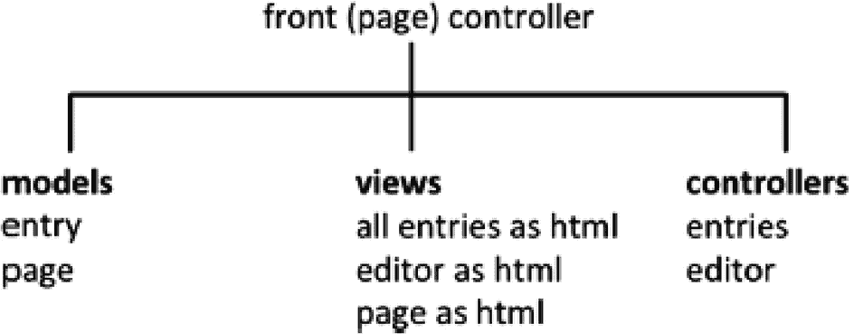

图表反映了前端控制器的职责，主要分为三个部分：模型、视图和控制器。

**图 7-1** 责任分配

请注意，每个视图都有一个对应的控制器。条目模型显示所有条目并保存任何新条目。

## 管理视图：创建管理博客站点

让我们创建一个名为`ch7`的新文件夹，并在`ch7`文件夹内创建一个`blog`文件夹。在`blog`文件夹内，我们还将创建另外四个文件夹：`models`、`views`、`controllers`和`CSS`。

我们现在可以将`ch4`中`template`文件夹中的`page.php`程序复制到`blog`下的`views`文件夹中。我们还可以将`ch4 classes`文件夹中的`Page_Data.class.php`程序复制到`models`文件夹中。我们将创建一个空白样式表（稍后编写代码），并将其放置在`CSS`文件夹中，命名为`blog.css`。当然，我们可以从出版商的网站下载本章的文件。

现在是时候创建`admin.php`的测试版本（我们的前端控制器）了，以验证一切是否正常协同工作。

```php
<?php
$pageData = new Page_Data();
$pageData->setTitle("PHP/MySQL blog demo");
$pageData->setCss("");
$pageData->setContent("YES!");
include_once "views/page.php";
echo $page;
?>
```

**清单 7-1** `admin.php`

> **注意**：如果您从`ch4`文件夹复制了`Page_Data.class.php`，则需要调整使用`if`语句进行的验证，以允许传入此清单以及本章后续清单中的值。如果您没有看到预期的结果，请检查此文件中的安全限制。出版商网站上的`Page_Data.class.php`文件已经包含了所需的调整。

这段代码看起来应该很熟悉，因为它类似于我们在前几章中创建的基本前端控制器。唯一的补充是包含的样式表。

测试此程序时，一切都应正常运行；我们应该得到一个格式良好的 HTML5 页面，其中`<title>`为“PHP/MySQL blog demo”，并且一个`<h1>`元素愉快地显示“YES！”在浏览器中看到“YES”是项目设置正确的视觉确认。如果我们查看源代码，我们还会看到用于访问 CSS 样式表的 HTML 链接已正确定位在标题部分。

### 创建管理员条目管理器导航

条目管理器（前端控制器）将有两个视图：一个用于列出所有条目，另一个用于显示条目编辑器。让我们创建一个导航来访问这些视图。

但首先，我们可以预料到，在完成之前，这个项目将包含许多 PHP 文件。让我们创建一些文件夹，将与管理模块相关的脚本分组在一起。我们将在现有的`views`文件夹中创建一个名为`admin`的文件夹。我们将在此文件夹中放置管理导航的第一个版本。

```php
<?php
$nav = "<h1>Blog Admin</h1>
<a href='admin.php'>All entries</a>
<a href='admin.php?editor'>Editor</a>
";
?>
```

**清单 7-2** `admin-navigation.php`

我们可以看到条目管理器导航与我们之前创建的导航非常相似。

管理导航是一个*静态视图*，意味着脚本中没有动态或数据库驱动的信息。我们不需要为导航创建模型，因为所有内容都是硬编码的。我们需要一个控制器来在需要加载导航时加载它。导航将一直加载并显示。我们将从一个新版本的前端控制器来控制这一点。

```php
<?php
include_once "models/Page_Data.class.php";
$pageData = new Page_Data();
$pageData->setTitle("PHP/MySQL blog demo");
$pageData->setCss("");
include_once "views/admin/admin-navigation.php";
$pageData->setContent($nav . "YES!");
include_once "views/page.php";
echo $page;
?>
```

**清单 7-3** `adminWithNavigation.php`

程序只做了三个小调整。导航程序已包含在代码的顶部。`$nav`变量已被添加到传递给`setContent`方法的字符串中。导航程序也已调整，以调用此新版本的管理页面。

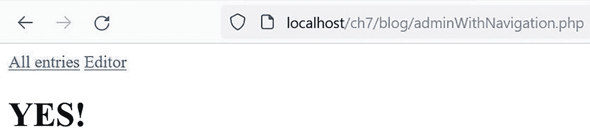


### 窗口与导航

当编辑器区域中的所有条目都完成输入后，窗口会进行刷新，以便进行导航。

**图 7-2**  
`adminWithNavigation.php` 的输出

在浏览器中运行程序时，我们应该会在浏览器窗口顶部看到导航栏。点击某个导航项不会立即产生可见效果；导航只是一个视图。点击任何导航项都会编码一个名为 `page` 的 URL 变量。如果我们查看浏览器的地址栏，就能看到它。接下来，我们将创建控制器代码来响应这些用户交互。

### 加载管理员模块控制器

如前所述，`admin.php` 程序是我们的前端控制器。因此，它将加载与用户点击的导航项相关联的任何其他控制器。导航栏中有两个链接，因此我们需要两个控制器。

让我们创建两个初步控制器，这样在点击导航项时就能在浏览器中看到可见的变化。我们在 `controllers` 文件夹中添加一个 `admin` 文件夹。我们将在此文件夹内为编辑器视图创建一个程序。

```
<?php
echo "editor controller loaded!";
?>
```

**列表 7-4**  
`editor.php`

这个编辑器控制器一开始不会做太多事情。最初，我们只想检查它是否正确连接了相关文件。有了这个基础，我们就可以开发更复杂的代码了。让我们再创建另一个文件，用于控制最终将列出所有条目的视图。

```
<?php
echo "entries controller loaded!";
?>
```

**列表 7-5**  
`entries.php`

现在我们可以调整管理员程序来处理这些控制器。

```
<?php
$pageData->setTitle("PHP/MySQL blog demo");
$pageData->setCss("");
$pageData->setContent($nav);
//新代码从这里开始
$navigationIsClicked = isset( $_GET['page'] );
if ( $navigationIsClicked ) {
    //准备加载对应的控制器
    $contrl = $_GET['page'];
} else {
    //准备加载默认控制器
    $contrl = "entries";
}
//加载控制器
include_once "controllers/admin/$contrl.php";
$pageData->appendContent($info);
include_once "views/page.php";
echo $page;
?>
```

**列表 7-6**  
`newadminWithNavigation.php`

同样，这个前端控制器的风格应该非常熟悉。它类似于之前的章节。请记住文件名 `entries.php` 和 `editor.php`。这些名字至关重要。它们必须与用户点击导航项时声明的 URL 变量 `page` 的对应值相匹配。让我们仔细看看导航中使用的 `href` 值：

```
<a href="?page=entries">All entries</a>
<a href="?page=editor">Editor</a>
```

当用户点击 `All entries` 项时，URL 变量 `page` 获得值 `entries`。URL 变量 `page` 通过 `$_GET` 获取。字符串值 `entries` 存储在一个名为 `$contrl` 的变量中，随后用于包含 `controllers/admin/$contrl.php`，这实际上会转换为包含 `controllers/admin/entries.php`，因为变量 `$contrl` 持有值 `entries`。如果用户点击 `Editor` 项，则会包含 `controllers/admin/editor.php`。

此时，我们可以再次测试系统，确保一切仍然正常工作。默认情况下，我们会看到从 `entries` 控制器返回的消息。如果我们点击编辑器导航项，则会看到从编辑器控制器返回的消息。

### 创建管理员条目输入表单

既然我们已经有了动态导航，是时候创建一个表单来接受博客条目了。同时，让我们创建一个用于删除条目的按钮。我们将在后续章节中创建删除代码。

```
<?php
return "
<form method='post' action='editor.php'>
    <fieldset>
        <legend>New Entry Submission</legend>
        <label for='title'>Title</label>
        <input type='text' id='title' name='title' maxlength='150' />
        <label for='entry'>Entry</label>
        <textarea id='entry' name='entry'></textarea>
    </fieldset>
    <fieldset id='editor-buttons'>
        <input type='submit' value='Save' />
        <input type='submit' value='Delete' />
    </fieldset>
</form>
";
?>
```

**列表 7-7**  
`editor-html.php`

如果你以前用过 HTML，上述大部分代码应该很熟悉。我们包含了两个 `<fieldset>` 元素。它们用于将相关的表单字段分组在一起。主 `<fieldset>` 有一个 `<legend>` 元素。`<legend>` 类似于 `<fieldset>` 元素的标题。

条目标题的 `<input>` 元素有一个设置为 150 的 `maxlength` 属性。你可能猜到了，显示的文本字段只接受 150 个字符。这很完美，因为我们数据库中的 `entries` 表对于新的 `title` 属性最多接受 150 个字符。我们应该始终确保 HTML 表单中设置的所有限制与存储此信息的数据库表中的限制相匹配。

`maxlength` 属性增强了表单的可用性，因为用户更难通过表单创建无效的标题。`maxlength` 属性执行客户端验证，并且只允许提交有效的标题。需要牢记的一点是，客户端验证非常适合增强可用性。它会在信息发送到服务器之前进行首次验证尝试。这提高了效率，因为信息在有效之前不会被发送到服务器。然而，它并不能提高安全性，因为恶意用户可以覆盖客户端验证。我们还需要在 PHP 内部对提交到服务器的信息进行验证，以确保我们收到了期望的信息。

创建了新的编辑器视图后，我们必须更新控制器，以便它显示新的视图。现在，你可以通过将以下控制器放入浏览器来测试我们当前的进度。

```
<?php
$info = include_once "views/admin/editor-html.php";
return $info;
?>
```

**列表 7-8**  
`neweditor.php`

目前，编辑器仅包含 HTML 页面。我们还需要更新导航，以调用这个新版本。

```
<?php
return "
<nav>
    <a href='?page=entries'>All entries</a>
    <a href='?page=neweditor'>Editor</a>
</nav>
";
?>
```

**列表 7-9**  
`updatedadminWithNavigation.php`

一个简单的更改现在将页面设置为 `neweditor`。最后，我们需要更新我们的前端控制器以使用新的导航。更改的行包含在下面。新的前端控制器现在是 `newestadminWithNavigation.php`。

```
include_once 'views/admin/updatedadminWithNavigation.php';
```

完成这些更改后，我们可以打开前端控制器，然后点击编辑器菜单项来查看表单。不过，让我们添加一点 CSS 来使表单看起来更好看。

### 样式化管理员编辑器

你可能会同意，未设置样式的条目编辑器表单不够专业。一点 CSS 就能极大地改善美学效果。

```css
/* code listing for blog/css/blog.css */
form#editor{
    width: 300px;
    margin-top:10px;
    padding:0px;
    background-color: #dedede;
}
form#editor label, form#editor input[type='text']{
    display:block;
}
form#editor #editor-buttons{
    border:none;
    text-align:right;
}
form#editor textarea, form#editor input[type='text']{
    width:90%;
    margin-bottom:2em;
}
form#editor textarea{
    height:10em;
}
```

**列表 7-10**  
`newblog.css`

前端控制器中的一行必须更新以使用新的 CSS 样式表。

```
$pageData->setCss("css/newblog.css");
```

最后，我们可以通过将 `updatedadminWithNavigation.php` 加载到浏览器中并点击编辑器菜单项来查看结果。

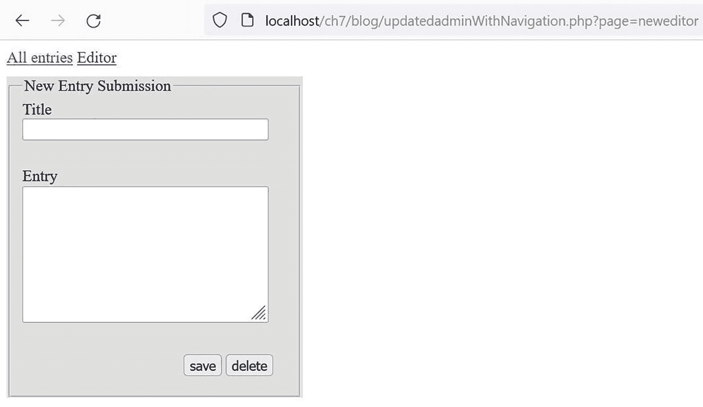

此对话框在点击编辑器菜单时刷新，包含两个栏区：一个标题栏和两个输入栏，以及保存和删除选项。

**图 7-3**  
点击编辑器菜单项后的输出

学习 CSS 的最佳方法是使用现有的样式表并根据你的喜好进行调整。这个样式表为表单提供了一个简单的显示——足以让它看起来更专业一些。

**练习**：调整 CSS 文件以使表单更具吸引力。使按钮更圆润，并磨平表单框的边角。调整菜单项使其显示更专业的外观。


```markdown

## 连接数据库

我们已经完成了基本的编辑器视图。不久，我们将能够通过编辑器表单将新的博客条目插入到`blog_entry`数据库表中。为此，我们需要从应用程序到数据库建立数据库连接。

我们将采用与投票应用程序相同的方法：使用`PDO`进行连接，并将连接包含在前端控制器中，以便与后续加载的控制器共享。

```php
<?php
### database.php

try {
    $db = new PDO("sqlite:../data/simple_blog.db");
    $db->setAttribute(PDO::ATTR_ERRMODE, PDO::ERRMODE_EXCEPTION);
} catch (Exception $e) {
    $pageData->setContent("Connection failed! $e");
    exit();
}
?>
```

我们可以使用位于投票程序`models`文件夹中的`database.php`文件来访问数据库。我们唯一需要做的更改是将数据库改为`simple_blog`。我们很快会将其包含到前端控制器中。

## 使用设计模式

设计模式是针对常见任务的通用最佳实践解决方案。有些设计模式被定义得很全面。随着经验的增长，你会遇到更多的设计模式。作为一名绝对初学者，你不需要全面了解设计模式——那可能弊大于利。

本书使用了几个设计模式的简单实现。我们已经看到了前端控制器设计模式的简单实现，以及同样简单的 MVC 实现。可以在同一个项目中组合多个设计模式。

> **注意**
> 
> 有关设计模式的更多信息，请访问[`http://en.wikipedia.org/wiki/Software_design_pattern`](http://en.wikipedia.org/wiki/Software_design_pattern)。

### 表数据网关设计模式

表数据网关设计模式是一个相对容易理解的设计模式。该模式规定，数据库中的每个表对应创建一个 PHP 类。其理念是系统与某个表之间的所有通信都通过一个特定的对象进行。表数据网关封装了系统与特定数据库表之间的数据通信。

所有用于此通信的 SQL 语句都将在表数据网关类定义中声明。这有几个优点：一是我们知道在哪里编写 SQL 语句。相应地，我们也知道在哪里找到与特定数据库表相关的 SQL 语句。

如果作为 PHP 开发者的你将所有 SQL 封装在相对较少的类定义中，那么团队中的任何数据库专家只需处理这几个类。这比将 SQL 语句分散在整个代码库中具有巨大优势。始终记住，保持代码尽可能简洁清晰。这有助于减少逻辑编码错误。

## 编写`Blog_Entry_Table`类

最初，我们需要能够插入从编辑器表单接收的新博客条目。我们可以为`blog_entry`表创建一个新的表网关类定义。

让我们在`models`文件夹中创建新的类定义，将其命名为`Blog_Entry_Table.class.php`。

```php
<?php
class Blog_Entry_Table {
    private $db;

    public function __construct($db) {
        $this->db = $db;
    }

    public function saveEntry($title, $entry) {
        // 注意 SQL 字符串中的占位符。? 是占位符
        // 注意属性的顺序：先是 title，然后是 entry_text
        $entrySQL = "INSERT INTO blog_entry (title, entry_text) VALUES (?, ?)";
        $entryStatement = $this->db->prepare($entrySQL);
        
        // 创建一个包含动态数据的数组
        // 顺序很重要：$title 必须在前，$entry 在后
        $formData = array($title, $entry);

        try {
            // 将$formData 作为参数传递给 execute
            $entryStatement->execute($formData);
        } catch (Exception $e) {
            $msg = "You tried to run this sql: $entrySQL Exception: $e";
            trigger_error($msg);
        }
    }
}
?>
```

`Blog_Entry_Table`在被其他脚本使用之前不会执行任何操作。`Blog_Entry_Table`有一个属性`db`和两个方法：构造函数和`saveEntry()`。构造函数接受一个`PDO`对象作为参数。接收到的`PDO`对象将存储在`db`属性中。这样，`Blog_Entry_Table`的所有方法都可以访问`PDO`对象并访问`simple_blog`数据库。

在面向对象的术语中，`Blog_Entry_Table`和`PDO`现在通过`has-a`关系关联。`Blog_Entry_Table`拥有一个`PDO`对象。

目前，我们只会保存新条目。因此，`Blog_Entry_Table`类除了构造函数外只有一个方法。`saveEntry()`方法接受两个参数：`title`和`blog_entry`。

代码使用了预处理语句将数据插入到表中。在创建投票应用程序时，我们没有直接将用户提供的任何信息插入到数据库中。但在博客中，我们希望保存标题和博客条目信息。

### 安全编程

你可能在网上发现一些 PHP 和 SQL 代码直接将信息保存到数据库中。然而，这是一个主要的安全风险。黑客可以利用 SQL 注入破坏我们的数据库信息。简单来说，黑客可以篡改我们原本要创建、更改或删除信息的 SQL 语句。

> **注意**
> 
> 有关 SQL 注入的更多信息，请访问[`http://en.wikipedia.org/wiki/SQL_injection`](http://en.wikipedia.org/wiki/SQL_injection)。

预处理语句还有一个积极作用，即允许用户将包含引号的信息传递到数据库中。预处理语句将所有输入视为不可执行的字符串，从而消除了这两个问题。

使用预处理语句有三个同等重要的要求：

1.  在 SQL 字符串中使用`?`字符作为占位符。

```php
$entrySQL = "INSERT INTO blog_entry (title, entry_text) VALUES (?, ?)";  // ? ? 用作占位符
```

2.  创建一个包含动态数据的数组。项目的顺序必须与 SQL 字符串中使用的顺序匹配。

```php
// $formdata 是一个包含动态数据的数组
// 顺序很重要：$title 必须在前，$entry 在后
$formData = array($title, $entry);
```

3.  将包含动态数据的数组作为参数传递给`execute()`方法。

```php
// 将$formData 作为参数传递给 execute
$entryStatement->execute($formData);
```

当语句执行时，数组中的值将被插入到占位符所在的位置。插入的信息不会允许任何 SQL 注入。

```php
} catch (Exception $e) {
    $msg = "You tried to run this sql: $entrySQL Exception: $e";
    trigger_error($msg);
}
```

如果发生异常，代码将触发一个错误，显示导致异常的 SQL 字符串以及对异常的更详细信息。在生产环境中，我们不想向用户显示所有这些信息，但这是一个帮助我们在开发过程中调试任何问题的好方法。

## 处理管理表单输入并保存条目

创建了`Blog_Entry_Table`类后，我们可以继续开发。逻辑上的下一步是处理从编辑器表单接收的输入，并使用`Blog_Entry_Table`对象将新的博客条目保存到数据库中。让我们更新编辑器控制器。

```php
<?php
### newesteditor.php

include_once "models/Blog_Entry_Table.class.php";
$entryTable = new Blog_Entry_Table($db);

if (isset($_POST['buttonClicked'])) {
    $buttonClicked = $_POST['buttonClicked'];

    if ($buttonClicked === 'save') {
        // 从编辑器表单获取标题和条目数据
        $title = $_POST['title'];
        $entry = $_POST['entry'];
        // 保存新条目
        $entryTable->saveEntry($title, $entry);
    }
}

include_once "views/admin/insert-editor-html.php";
?>
```

```php
include_once "models/Blog_Entry_Table.class.php";
$entryTable = new Blog_Entry_Table($db);
```

类被包含进来，数据库连接被传递到构造函数中。

```php
if ($buttonClicked === 'save') {
    // 从编辑器表单获取标题和条目数据
    $title = $_POST['title'];
    $entry = $_POST['entry'];
    // 保存新条目
    $entryTable->saveEntry($title, $entry);
}
```

```


如果点击了`save`按钮，则会获取标题和条目内容，并将其传递给`saveEntry`方法以插入到数据库中。

**注意：** 以下程序已更新为链接到最新版本。所有代码的改动都很微小。`insertadminWithNavigation.php`前端控制器现在也包含了一条`include_once`语句，用来插入`database.php`程序。（涉及文件：`insert-editor-html.php`、`insert-admin-navigation.php`、`insertadminWithNavigation.php`）

现在，我们可以通过在浏览器中执行`insertadminWithNavigation.php`程序来测试插入过程。然后点击`Editor`菜单项，输入一些测试数据，再点击保存按钮。这些信息将被正确地放入数据库的`blog_entry`表中。表单会自动清除所有数据，这通常向用户表明数据已成功插入。你可以通过 phpMyAdmin 控制面板浏览`blog_entry`表中的内容。

**练习：** 使用提供的代码或你自己开发的代码，对当前系统进行一次完整的测试。尝试让系统崩溃。输入 SQL 信息，看看能否攻破该程序。你发现任何弱点了吗？

## 用户视图：获取所有博客条目的数据

现在，我们需要让用户能够查看博客条目。我们将从管理员视角（最终会通过用户 ID 和密码进行控制）切换到用户视角。因此，我们将为用户创建一个不同的入口（前端控制器），它不需要用户 ID 和密码，还需要一个不同的模型和一个不同的视图。我们可以使用管理员前端控制器的精简版作为用户控制器。

```
setTitle("PHP/MySQL 博客演示");
include_once "models/database.php";
include_once "controllers/blog.php";
$pageData->setContent($info);
include_once "views/page.php";
echo $page;
?>
清单 7-14
index.php
```

如我们所见，当前不需要导航，因为用户只有查看博客条目的权限。使用了相同的`Page_Data`类、`database.php`和`page.php`脚本。由于没有菜单，当前也不需要判断选择了哪个菜单项。当然，控制器和视图已更改为用户版本。

接下来，我们开始处理`blog_entry`类中所需的更改。我们将显示数据库中所有博客条目的列表。我们将显示每个博客条目的`title`（标题）、`entry_text`（条目文本）的前 150 个字符，以及一个*Read more*（阅读更多）链接。

首先，我们创建一个新的方法，用于从`blog_entry`表中检索博客条目。

```
// 在 Blog_Entry_Table 类内部声明一个新方法
public function getAllEntries () {
$sql = "SELECT entry_id, title,
SUBSTRING(entry_text, 1, 150) AS intro
FROM blog_entry";
$statement = $this->db->prepare( $sql );
try {
$statement->execute();
} catch ( Exception $e ) {
$exceptionMessage = "你尝试运行此 SQL：$sql 
异常信息：$e";
trigger_error($exceptionMessage);
}
return $statement;
}
清单 7-15
New_Blog_Entry_Table.class.php 的部分代码
```

此方法将被放置在类中`saveEntries`方法之前。此方法与之前的`saveEntry`方法格式相似，但有一些细微的改动，例如这里是检索信息，而不是插入信息。

`getAllEntries()`方法将返回一个`PDOStatement`对象，通过该对象我们可以逐个访问所有博客条目。该语句涉及一些我们之前没见过的 SQL，因此一开始可能有点难以理解。我们一步一步地来分析。

### 使用 SQL SUBSTRING 子句

```
$sql = "SELECT entry_id, title,
SUBSTRING(entry_text, 1, 150) AS intro
FROM blog_entry";
```

首先要注意的是，`SELECT`语句从`blog_entry`表中选取了三列——`entry_id`、`title`和`entry_text`。但我们并没有选取`entry_text`列的全部内容，只选取了前 150 个字符。我们可以通过 SQL 的`SUBSTRING()`函数来实现这一点。`SUBSTRING()`函数的一般语法如下：

```
SUBSTRING( 字符串, 起始位置, 长度 )
```

`SUBSTRING()`函数返回字符串中请求的部分：一个子串。`string`参数指明要返回哪部分字符串。正如你可能猜到的，`start`位置参数指明子串从哪个位置开始。`length`参数指定返回的子串有多长。因此，在上述`SELECT`语句中，我们从`entry_text`字段中的字符串里选取了前 150 个字符。

### 使用 SQL 别名

在 SQL 语句中，我们可以使用别名来重命名表或列。在用于选取所有博客条目的 SQL 中，我们将子串结果命名为`intro`。虽然重命名并非必要，但它为我们提供了一种直接的方式来访问子串中的信息。

## 为所有博客条目准备用户视图

现在，是时候创建一个用户视图了。这个视图将列出所有博客条目。博客条目的数量可能会变化，因此为特定数量的条目创建视图是个坏主意。该视图应能自动调整，以适应数据库中无论有多少——或少——博客条目。我们将使用循环来遍历博客条目。

```
 元素
$info = "博客条目";
$info .= "";
// 循环遍历数据库中的所有 $entries
// 每次将一行临时记住为 $entry
// $entry 将是一个包含 entry_id、title 和 intro 属性的 StdClass 对象
while ( $entry = $entries->fetchObject() ) {
$href  = "index.php?page=blog&id=$entry->entry_id";
// 为每个条目创建一个 
$info .= "
$entry->title
$entry->intro
阅读更多

";
}
// 结束 
$info .= "";
?>
清单 7-16
list-entries-html.php
```

```
$entriesFound = isset( $entries );
if ( $entriesFound === false ) {
trigger_error( 'views/list-entries-html.php 需要 $entries' );
}
```

`$entries`将包含数据库中的博客条目。如果缺少该变量，则会触发错误以指示问题。在实际生产环境中，这需要替换为一条告知用户当前没有博客的提示信息。

```
while ( $entry = $entries->fetchObject() ) {
$href  = "index.php?page=blog&id=$entry->entry_id";
// 为每个条目创建一个 
$info .= "
$entry->title
$entry->intro
阅读更多

";
}
```

`while`循环首先尝试获取下一个对象（数据库表中的条目）并将其放入`$entry`中。`while`循环将成功的获取视为`true`状态。如果获取不成功（没有更多记录），则会向`$entry`放入一个`false`值，循环将停止。只要状态为`true`，循环就会根据`blog_entry`数据库表中的行数动态创建`<li>`元素。如果数据库里有一条博客条目，就会有一个`<li>`。如果数据库里有十条博客条目，就会有十个`<li>`元素。

`$href`变量包含一个链接，该链接将重新调用索引页面，并传递两个属性——`page`设置为`blog`，`id`设置为数据库表中记录包含的`entry_id`。如果用户想阅读更多博客内容，将用到此信息。除了显示`title`和`intro`（子串）之外，还提供了实际的`href`链接，允许用户点击`阅读更多`来查看完整的博客条目。

## 连接用户视图和用户模型

最后一步是将用户视图与用户模型中的数据连接起来。这不需要太多代码，但它会生成一个简单的条目显示页面。


```php
getAllEntries();
//load the view
include_once "views/list-entries-html.php";
?>
清单 7-17
blog.php
```

我们只需引入模型，实例化该类，将数据库连接对象传递给条目表对象，调用 `getAllEntries()` 方法，然后使用视图程序显示结果。就是这么简单！

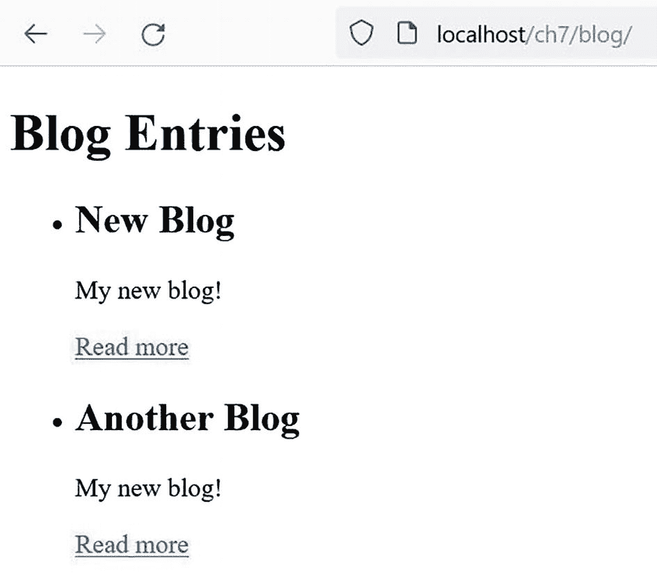

此窗口反映了博客条目作为主要部分显示时，新博客和其他博客在子部分中生成的情况。

**图 7-4** `index.php` 的输出结果

我们的视图可以添加一些 CSS 样式，但可以看到测试是成功的。我们可以访问 `http://localhost/blog/insertadminWithNavigation.php` 创建新条目，然后在浏览器中重新加载索引页，即可看到新创建的博客条目被列出。这个博客系统确实开始像一个真正的博客了。

是不是很想点击*阅读更多*？难道你不想点击它并阅读一篇博客条目吗？不过，此时点击*阅读更多*不会产生明显效果。我们尚未编写显示单个博客条目全部内容的代码，因此点击后不会发生任何变化。

**练习**：更新 `admin` 前端控制器中的导航，使用此程序显示所有条目。评估结果。缺少什么？目前，从管理员控制器显示所有条目时，我们失去了导航功能。我们将在本书后面纠正这个问题。

## 响应用户的“阅读更多”请求

当用户点击*阅读更多*时，我们将显示一个博客条目的全部内容。我们可以通过主键 `entry_id` 在数据库表中找到单个博客条目。如前所述，该值在代码中已经可用。

当用户点击*阅读更多*时，应由代码的哪一部分响应：模型、视图还是控制器？控制器！控制器管理用户交互。点击链接是一种用户交互。因此，我们需要对博客控制器进行更改，以处理点击*阅读更多*的用户。

## 获取条目数据

我们来处理显示条目这个问题。为此，我们将从 `blog_entry` 表中检索数据。我们已有一个提供对 `blog_entry` 表访问权限的类。我们将继续使用这个类来保持对该表的单一访问点。

```
$href  = "index.php?page=blog&id=$entry->entry_id";
```

记住，`entry_id` 是通过我们之前创建的 `fetchObject()` 方法，通过 URL 调用传递给索引页（博客控制器）的。我们可以访问这个值来检索数据库中请求的记录。因此，我们可以声明一个方法，该方法将 `entry_id` 作为参数（当前存储在 `id` 属性中），并返回一个包含相应博客条目所有内容的 `StdClass` 对象。

```
public function getEntry( $id ) {
$sql = "SELECT entry_id, title, entry_text, date_created
FROM blog_entry
WHERE entry_id = ?";
$statement = $this->db->prepare( $sql );
$data = array( $id );
try{
$statement->execute( $data );
} catch (Exception $e) {
$exceptionMessage = "You tried to run this sql: $sql 
Exception: $e";
trigger_error($exceptionMessage );
}
$model = $statement->fetchObject();
return $model;
}
清单 7-18
Newest_Blog_Entry_Table.class.php 的部分代码
```

我们可以将此方法放在类中 `getAllEntries()` 方法的上方。现在我们有了两个访问条目的方法：一个提取所有条目，一个提取特定条目。这个新方法与 `getAllEntries()` 方法非常相似。

```
$sql = "SELECT entry_id, title, entry_text, date_created
FROM blog_entry
WHERE entry_id = ?";
```

SQL 字符串与 `getAllEntries()` 中创建的几乎相同，只是 `WHERE` 子句会将选择限制为仅一条具有正确 `entry_id` 的记录。

```
$statement = $this->db->prepare( $sql );
```

`prepare()` 方法将 SQL 字符串转换为 `PDOStatement` 对象。

```
$data = array( $id );
```

声明一个数组来保存 `$id` 中的值，该值将被填充为 `entry_id`。

```
$statement->execute( $data );
```

`execute()` 方法将用 `$id` 中的值替换占位符（`?`），并尝试检索请求的记录。

```
$model = $statement->fetchObject();
```

`fetchObject()` 方法将尝试从返回的表中检索第一行数据。`return` 方法将把创建的 `StdClass` 对象传递给博客控制器。由于我们只从数据库表中检索一条记录，因此无需包含循环。

### 安全编程

为什么我们使用预处理语句？`$id` 来自 URL 变量，因此可以被篡改；应将其视为不安全。恶意黑客可能会尝试更改变量中的值并进行 SQL 注入攻击。预处理语句可以阻止任何此类尝试。

现在，我们准备为用户选择的特定条目创建视图。

## 创建博客视图

同样，我们为单个条目创建的代码将与为查看所有条目创建的代码类似。

```
详细博客";
//$entry 中可用的属性：entry_id, title, entry_text, date_created
$info .= "
$entryData->title
$entryData->date_created
$entryData->entry_text
";
?>
清单 7-19
entry-html.php
```

```
$info .= "
$entryData->title
$entryData->date_created
$entryData->entry_text
";
```

`$info` 通过检索单个条目的标题、创建日期和条目文本来填充。这个过程类似于检索所有博客条目的方法，只是我们不需要循环。本质很熟悉：将存储在 `StdClass` 对象中的一些数据与预定义的 HTML 结构合并。视图需要一个存储在名为 `$entryData` 的变量中的 `StdClass` 对象。因此，前几行代码会检查 `$entryData` 的可用性。如果未找到，代码将触发自定义错误。请记住，在生产环境中，如果出现问题，我们将显示一条更友好、面向用户的消息。不过，在开发过程中，这为我们提供了纠正问题所需的信息。

## 显示条目

我们已经有了模型；我们也有了视图。最后一步是更新博客控制器。它负责从模型中提取条目数据，将其与条目视图共享，并将生成的 HTML 字符串返回给 `index` 控制器，在那里进行显示。

```
getEntry( $entryId );
include_once "views/entry-html.php";
//代码更改结束
} else {
$entries = $entryTable->getAllEntries();
include_once "views/new-list-entries-html.php";
}
?>
清单 7-20
newblog.php
```

```
$isEntryClicked = isset( $_GET['id'] );
```

如果用户点击了*更多详情*链接，`id` 将填充在用于调用索引页的 URL 中。`isset()` 将向 `$isEntryClicked` 返回一个真值。

```
if ($isEntryClicked ) {
$entryId = $_GET['id'];
//新代码从这里开始
$entryData = $entryTable->getEntry( $entryId );
include_once "views/entry-html.php";
```

如果点击了，则使用 `$_GET` 从 URL 中获取 `id`。然后将此值传递给 `getEntry()` 方法。然后包含条目视图以显示检索到的单个条目。如果链接未被点击，则执行 if 语句的 else 部分，显示所有条目。

> **注意**
> `list-entries-html.php` 已更新，现在调用 `newindex.php` 而不是 `index.php`。它现在被命名为 `new-list-entries-html.php`。`index.php` 现在也已更新，包含 `newblog.php` 而不是 `blog.php`。它现在被命名为 `newindex.php`。

我们现在可以通过在浏览器中加载 `newindex.php` 并点击*阅读更多*链接来测试程序。

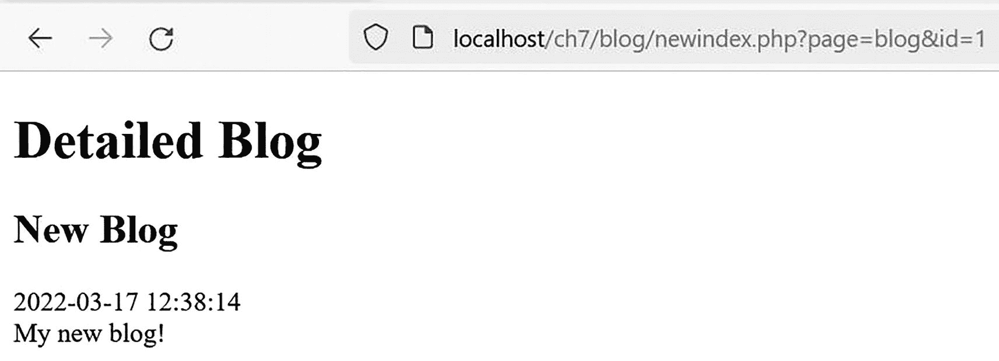

此详细博客反映了新博客创建时，它包含了与主机创建博客相关的所有信息。

**图 7-5** 在 `newindex.php` 中点击*阅读更多*链接的结果


再次强调，我们可以使用一些 CSS，但目前我们已经拥有一个功能性的博客，允许用户选择查看更详细的信息。它同时包含了管理员功能（添加新博客条目）和普通用户功能。现在是时候庆祝一下我们的进展了！自第一章以来，我们已经取得了长足的进步。但是……

**练习**：更新项目，通过添加本章前面类似代码，使用相同的 CSS 样式表来专业地设计所有条目的显示效果以及单个条目的详细显示效果。向样式表中添加 CSS，使所有当前视图都能以类似的专业用户友好设计进行显示。

### 代码异味：重复代码

你闻到了吗？我们的代码中传来了一股难闻的气味。这是每个程序员都知道的典型代码异味之一。随着你编程能力的提升，你应该学会避免这类问题。

> **注意**  
> 可以在[`http://en.wikipedia.org/wiki/Code_smell`](http://en.wikipedia.org/wiki/Code_smell)找到一份长长的典型代码异味列表。

重复代码是指*相同或相似的代码出现在多个地方*。你已经知道在哪里可以闻到这种味道了吗？它就在 `models/Newest_Blog_Entry_Table.class.php` 文件中。下面是一个例子：

```
//models/Blog_Entry_Table.class.php 的部分代码
public function getEntry( $id ) {
$sql = "SELECT entry_id, title, entry_text, date_created
FROM blog_entry
WHERE entry_id = ?";
$statement = $this->db->prepare( $sql );
$data = array( $id );
try{
$statement->execute( $data );
} catch (Exception $e) {
$exceptionMessage = "You tried to run this sql: $sql 
Exception: $e";
trigger_error($exceptionMessage );
}
$model = $statement->fetchObject();
return $model;
}
```

在 `Newest_Blog_Entry_Table` 类中还有几个类似的方法。它们都 `prepare()` 一个 `PDOStatement` 并 `try()` 去 `execute()` 它。在这三个方法中，我们都可以找到许多几乎相同的代码行。这很糟糕！

### 遵循 Curly 法则保持 DRY

重复代码不好，原因有很多。其一是不够高效；我们只是使用了比必要更多的代码行。代码不必要地冗长。更长的代码不可避免地会导致更多潜在错误。更少的代码意味着更少的出错机会。重复代码不好的另一个原因是它会随着时间的推移使程序的维护变得复杂。随着时间的推移，代码极有可能需要更新。如果代码在多个不同的方法中完全相同或极其相似，那么可能所有这些方法都需要进行更改。我们应该始终创建尽可能易于维护的代码。

我们可以将重复的代码放在一个独立的方法中，这样对代码的任何修改都可以在一个地方完成。然后每个方法都可以调用这个新方法。这减少了维护时间并提高了可靠性。

这实际上只是遵循 Curly 法则（或至少是 Curly 法则的一个变体）进行编码的另一个例子。Curly 的原始法则是：*只做一件事*。这个特定的变体应该是：*仅做一次一件事*。还有一种极客的说法：保持 DRY。*DRY* 是“don’t repeat yourself”（不要重复自己）的缩写。

### 使用 Curly 法则进行重构

*重构*是在不改变代码功能的前提下修改代码的过程。这对程序员来说是一件大事。每当我们意识到项目需求已经超出了代码架构，或者换句话说，当代码架构无法以优雅的方式支持项目所需的功能时，我们都应该重构代码。简单来说，当我们在多个地方发现重复的逻辑时，就需要修复它。

是时候重构 `Newest_Blog_Entry_Table` 类了，让它变得更 DRY。让我们从将准备 SQL 语句的代码封装到一个独立的方法开始。

```
//$sql 参数必须是 SQL 字符串
//$data 必须是用于 SQL 的动态数据数组
private function executeSQL ( $sql, $data) {
//创建一个 PDOStatement 对象
$statement = $this->db->prepare( $sql );
try{
//使用动态数据并执行查询
$statement->execute( $data );
} catch (Exception $e) {
$exceptionMessage = "You tried to run this sql: $sql 
Exception: $e";
trigger_error($exceptionMessage);
}
//返回 PDOStatement 对象
return $statement;
}
public function executeSQL ( $sql, $data) {
```

这个新方法接受 `$sql` 中的预处理语句和从另一个程序或方法调用时要放入预处理语句的数据数组 `$data`。然后它以我们在 Blog Entry 类中包含的其他方法中发现的方式使用这些信息。

声明了新方法后，我们可以重构其中一个现有方法，使其使用这个新方法。

```
public function getEntry( $id ){
$sql = "SELECT entry_id, title, entry_text, date_created
FROM blog_entry
WHERE entry_id = ?";
$data = array($id);
//调用新的 DRY 方法
$statement = $this->executeSQL($sql, $data);
$model = $statement->fetchObject();
return $model;
}
清单 7-21
Updated_Blog_Entry_Table.class.php 的 getEntry 方法
```

新的 `executeSQL()` 方法使 `getEntry()` 方法稍微短了一些。代码也更容易理解，因为它只创建了预处理语句和数组，然后调用了 `executeSQL` 方法。接着它获取结果并返回。

有一个小的语法细节需要注意。看到我们如何在一个方法调用同一个类中声明的另一个方法时使用 `$this` 关键字了吗？这与使用 `$this` 访问属性并没有太大的不同。在这两种情况下，`$this` 都是对象对自身的引用。这是面向对象中表达“我的”的方式。

让我们重构 `saveEntry()` 方法。

```
public function saveEntry ( $title, $entry ) {
$entrySQL = "INSERT INTO blog_entry ( title, entry_text )
VALUES ( ?, ?)";
$formData = array($title, $entry);
//更改从这里开始
//$this 是对象表达“我的”的方式
//所以 $this->executeSQL 调用 Blog_Entry_Table 的 executeSQL 方法
$entryStatement = $this->executeSQL( $entrySQL, $formData );
//更改结束
}
清单 7-22
Updated_Blog_Entry_Table.class.php 的 saveEntry 方法
```

最后，让我们重构 `getAllEntries()` 方法。

```
public function getAllEntries () {
$sql = "SELECT entry_id, title, SUBSTRING(entry_text, 1, 150) AS intro  FROM blog_entry";
$statement = $this->executeSQL($sql);
return $statement;
}
清单 7-23
Updated_Blog_Entry_Table.class.php 的 getAllEntries 方法
```

这里有一个小问题。我们只需要 SQL 字符串，而不需要数组来检索所有记录，因为我们没有使用预处理语句。然而，当我们调用 `executeSQL()` 时，它需要两个参数。我们只想传递一个。

有时，我们希望用一个参数调用 `executeSQL()`，有时又希望用两个参数调用它。第二个参数需要是可选的。幸运的是，PHP 有一种非常简单的方法使参数成为可选参数。我们只需为参数声明一个默认值，如果没有传递参数，就会使用这个默认值。让我们更新 `executeSQL` 方法来允许这样做。

```
private function executeSQL ( $sql, $data = NULL ){
//代码更改结束
$statement = $this->db->prepare( $sql );
try{
$statement->execute( $data );
} catch (Exception $e){
$exceptionMessage = "You tried to run this sql: $sql 
Exception: $e";
trigger_error($exceptionMessage );
}
return $statement;
}
清单 7-24
Updated_Blog_Entry_Table.class.php 的 executeSQL 方法
```

在上述代码中，参数 `$data` 获得了默认值 `NULL`。因此，如果调用 `executeSQL()` 时没有提供第二个参数，那么创建的 `PDOStatement` 对象将以 `NULL` 执行。不会有动态值替换预处理语句中的占位符。这正是我们想要的，因为这条语句的 SQL 中没有占位符。


您可以访问[`www.w3schools.com/php/php_functions.asp`](http://www.w3schools.com/php/php_functions.asp)来了解更多关于函数参数默认值的知识。

在其他情况下，当使用两个参数调用`executeSQL()`时，第二个参数将用于用实际值替换 SQL 占位符。在代码中使用可选参数是一个非常强大的概念。在将近乎重复的代码封装到一个单独的方法中时，这通常会带来简洁的解决方案。

**注意**：对以下文件进行了微小改动以正确使用新的`Blog Entry Table`类。
`updated-entries-html.php`, `updatedblog.php`, `updatedindex.php`

我们可以通过在浏览器中执行`updatedindex.php`来测试我们的改动。当显示所有条目并为单个条目检索更多信息时，输出结果将是相同的。请记住：重构就是在不改变代码行为的前提下修改代码。因此，成功的测试可以确认代码的行为与重构前完全一致。重构的唯一目的是使代码更易于维护和更高效。

### 安全编程

你可能已经注意到，`executeSQL()`方法是`private`而非`public`的。它是`Blog Entry Table`类的一个脆弱成员。它只应在类内部被调用，并且只能由该类中的其他方法调用。它当然不应被类外部的代码调用。
`executeSQL()`方法是其他方法使用的*子方法*。此方法对数据库表中的数据执行实际的更改。它非常容易受到黑客攻击。因此，它需要受到保护，以防被类外部的任何尝试所使用。简单地将其设置为`private`就提供了这种额外的保护。它只能被类本身内部的方法使用。

请记住：单一职责原则（也称为 Curly 定律）适用于类。一个类应只有一个目的，其所有属性和行为都应严格与该目的保持一致。具有单一职责的类比具有多个职责的类更简单，而简单的类比复杂的类更容易使用。通过使用`private`访问修饰符隐藏一些属性和方法，我们提供了一个更简单、更易于使用的公共接口。因此，作为经验法则，默认使用`private`，在需要时再使用`public`。

**注意**：还有第三个访问修饰符：`protected`。在 PHP 中，它与`private`类似，但可以通过*继承*与子类共享。你可以在[`www.killerphp.com/tutorials/object-oriented-php/`](http://www.killerphp.com/tutorials/object-oriented-php/)找到一篇很好的教程，涵盖继承、访问修饰符和其他核心 OOP 主题。

## 总结

在本章中，我们创建了一个基本的博客。该博客提供了管理员创建新条目的功能，以及用户显示博客条目的功能。在此过程中，我们学习了预处理语句，并介绍了设计模式。我们还发现了如何重构重复代码。我们创建了一个`Blog Entry Table`类，它是一个数据网关，提供了从 PHP 代码到`blog_entry`数据库表的单一访问点。我们消除了糟糕的代码，并在此过程中生成了符合 DRY 原则的代码。

虽然我们的代码提供了一个功能良好的博客，但它缺少一些关键组件。例如，我们无法更新或删除博客条目。接下来，我们将增强这个博客的功能。

## 项目

1. 使用本章和前几章的设计实践，创建一个学生注册系统。该系统应接受学生信息（姓名、地址、出生日期和专业）并将信息保存到数据库中。系统还应显示所有已注册学生的姓名。每个学生姓名旁边应有一个链接，用于提供额外的学生信息。点击链接时，将显示姓名、地址、出生日期和专业。

2. 使用 MVC 模式，创建一个用户可以请求更多信息的网页。该页面应接受用户的姓名、电子邮件、主题和详细描述。这些信息将存储在数据库中。创建管理员页面，以显示所有用户输入的主题。在每个主题旁边提供一个链接，用于显示用户的姓名、电子邮件和详细描述。作为额外挑战，请搜索[`www.php.net`](http://www.php.net)来了解如何使用 PHP 发送电子邮件。在用户提交信息后（除了将信息保存到数据库之外），向你的电子邮件地址发送一封电子邮件。

---

# 8. 基础博客：条目与评论

## 目标

完成本章后，你将能够：

*   创建一个包含交互式 HTML 表单的视图
*   创建一个控制器来处理来自表单的输入
*   创建一个模型，用于使用数据库表保存和检索任何条目
*   使用外键来关联数据库中的行和表注释
*   使用继承来避免冗余代码
*   创建一个搜索算法来查找数据库表中的数据

在本章中，我们将对管理员模块和用户（博客）模块进行改进。我们将从管理员模块开始。

管理员模块的第二次迭代将通过条目编辑器（前端控制器）更新和删除现有条目。在改进条目管理器的过程中，我们将从编写小型、非正式的代码测试开始。这些测试在添加额外代码之前检查控制器、模型和视图之间的信息逻辑流程，以避免使调试过程复杂化。将测试集成到开发过程中将提高整体代码质量并减少调试时间。

## 为管理员模块创建模型

查看前一章中我们的管理员模块版本，我们可以清楚地看到已经有一些按钮可用于保存或删除现有条目。我们还可以看到缺少了一些东西。我们应该在哪里点击才能将现有条目加载到条目编辑器中，以便我们可以编辑或删除它呢？

让我们开始我们的开发过程来解决这个问题，首先从发布商的网站复制文件。你可以选择复制`ch7`文件夹中的文件并进行修改，如下一段所述。但是，由于改动数量较多，不推荐这样做。如果你确实想涉足那片沼泽，请遵循以下说明。

首先，创建一个`ch8`文件夹。在此文件夹下，创建一个`blog`文件夹。在`blog`文件夹下，创建`controllers`、`css`、`models`和`views`文件夹。在`controllers`文件夹下，创建一个`admin`文件夹。在`views`文件夹下，创建一个`admin`文件夹。然后按照下表所示，从`ch7`文件夹复制程序。

| 原始名称 | 新名称 | 位置 |
| :--- | :--- | :--- |
| `newesteditor.php` | `editor.php` | `controllers/admin` |
| `database.php` | `database.php` | `Models` |
| `Page_Data.class.php` | `Page_Data.class.php` | `Models` |
| `Updated_Blog_Entry_Table.class.php` | `Blog_Entry_Table.class.php` | `Models` |
| `updated-admin-navigation.php` | `admin-navigation.php` | `views/admin` |
| `insert-editor-html.php` | `editor-html.php` | `views/admin` |
| `insertadminWithNavigation.php` | `admin.php` | `Blog` |
| `newblog.css` | `blog.css` | `css` |
| `page.php` | `page.php` | `views` |

**注意**


## 排版后的文档

每个被复制的文件都需要更新，以使用任何重命名的程序。

接下来，为了完成更新和删除的任务，让我们向管理员显示所有条目的列表。点击一个条目会将其加载到条目编辑器中。我们可以使用`Blog`类中的`getAllEntries()`方法来完成此任务。

### 显示管理链接

在之前的模型（`Blog_Entry_Table.class.php`）经过尝试、测试和理解后，我们可以开始处理视图。让我们创建一个可点击的博客条目标题列表。这使我们能够采用与`blog.php`程序类似的逻辑。我们可以使用`while`循环通过`PDO Statement`对象迭代数据库记录。数据库表中的每一行数据都将由一个单独的`<li>`元素表示。我们可以将各个博客标题包裹在`<a>`元素中，以创建可点击的条目列表。让我们对第 7 章的`updated-entries-html.php`程序进行这些调整。

```
<?php
$info = "<ul>";
$info .= "Blog Entries";
$info .= "</ul>";
$info .= "<ul>";
//loop through all $entries from the database
//remember each one row temporarily as $entry
//$entry will be a StdClass object with entry_id, title and intro
while ( $entry = $entries->fetchObject() ) {
$href  = "admin.php?page=editor&id=$entry->entry_id";
//create an <li> for each of the entries
$info .= "<li><a href='$href'>$entry->title</a></li>";
}
//end the <ul>
$info .= "</ul>";
echo $info;
?>
Listing 8-1
entries-html.php
```

点击一个条目将请求一个类似`admin.php?page=editor&id=2`的 URL。这样，编辑器控制器将能访问到被点击条目的`entry_id`。此代码与我们之前创建的代码类似。

现在我们可以创建一个用于管理访问的条目控制器。

```
<?php
$entries = $entryTable->getAllEntries();
include_once "views/admin/entries-html.php";
?>
Listing 8-2
entries.php
```

这段代码与第 7 章的`updatedblog.php`类似。实际上它是一个简化版本，因为我们没有检查用户是否点击了按钮。默认情况下，我们会显示所有条目。

我们可以通过在浏览器中加载`http://localhost/ch8/blog/admin.php?page=entries`来测试程序的逻辑流程。一旦我们对一切正常感到满意，就可以向代码中添加更多细节。

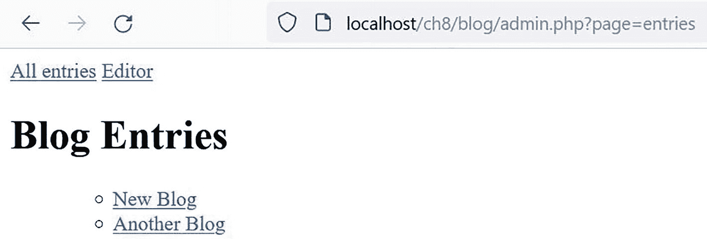

一个管理网页的快照，以博客条目作为主标题，新博客和另一个博客作为副标题。

**图 8-1** 从`admin.php?page=entries`输出的结果

我们现在看到一系列可点击的博客条目标题。如果我们点击一个标题，将显示空的条目编辑器。我们可以更改此行为，使条目编辑器加载被点击博客条目的内容并显示在编辑器中。

### 用待编辑的条目填充表单

有时，条目编辑器表单应显示为空白字段，以便我们可以创建新条目。其他时候，编辑器应显示现有条目，以便进行编辑。用户可以点击博客标题将值加载到编辑器中。点击博客标题会将条目的`entry_id`编码为 URL 变量。因此，如果条目的`entry_id`作为 URL 变量可用，我们可以将相应的条目加载到编辑器中。如果未找到此类 URL 变量，我们可以显示一个空白编辑器。

让我们调整编辑器视图，以便在找到`id`时显示内容；否则，它仍将显示一个空表单。

```
<?php
$info .= "
<form method='post' action='admin.php?page=neweditor'>
<fieldset>
<legend>New Entry Submission</legend>
<label>Title</label>
<input type='text' name='title' value='$entryData->title' />
<label>Entry</label>
<textarea name='entry'>$entryData->entry_text</textarea>
<input type='submit' value='Save' />
</fieldset>
</form>
";
?>
Listing 8-3
new-editor-html.php
```

```
$entryDataFound = isset( $entryData );
if( $entryDataFound === false ){
    //default values for an empty editor
    $entryData = new StdClass();
    $entryData->entry_id = 0;
    $entryData->title = "";
    $entryData->entry_text = "";
}
```

如果`$entryData`中包含信息（如果用户点击了标题，则通过从数据库中拉取记录来填充），那么该信息将被放入`$entryDataFound`中。该信息包含在一个`StdClass`中。如果没有拉取到信息（用户想输入新博客），则使用默认值。

```
<input type='hidden' name='id' value='$entryData->entry_id' />
```

`entry_id`被保存到一个隐藏变量`id`中，因为该值对用户没有意义。在显示页面时，它将从视图中隐藏。但是，如果用户查看浏览器中形成的 HTML 代码（查看源代码），该值将是可见的。因此，它是隐藏的，但不被认为是安全的。

```
<input type='text' name='title' value='$entryData->title' />
<textarea name='entry'>$entryData->entry_text</textarea>
```

标题和条目字段都使用`StdClass`中的值填充。这将显示要更新的博客数据，如果用户想输入新博客，则显示默认值。

最后一步是更新`editor.php`程序，以使用`Blog_Entry_Table`中的`getEntry()`方法来检索用户请求的任何博客条目的数据。

```
<?php
if ( isset( $_POST['title'] ) && isset( $_POST['entry'] ) ){
    $title = $_POST['title'];
    $entry = $_POST['entry'];
    $entryTable->saveEntry( $title, $entry );
}
$entryRequested = isset( $_GET['id'] );
//create a new if-statement
if ( $entryRequested ) {
    $id = $_GET['id'];
    //load model of existing entry
    $entryData = $entryTable->getEntry( $id );
    $entryData->entry_id = $id;
}
include_once "views/admin/new-editor-html.php";
?>
Listing 8-4
neweditor.php
```

```
$entryRequested = isset( $_GET['id'] );
//create a new if-statement
if ( $entryRequested ) {
    $id = $_GET['id'];
    //load model of existing entry
    $entryData = $entryTable->getEntry( $id );
    $entryData->entry_id = $id;
}
```

`isset`用于确定隐藏的`id`值是否已被设置。如果已设置，则将其检索并放入`$id`中。然后将`$id`值传递给`getEntry()`方法，以从数据库表中该特定记录中检索数据。然后，`$id`值被添加到名为`$entryData`的`StdObject`的`entry_id`属性中，该对象在数据检索时被创建。

> **注意**
> 为了访问`neweditor.php`和`new-editor-html.php`，已创建了以下带有微小更改的新版本：`new-entries-html.php`、`newentries.php`。

让我们在继续之前花点时间测试一下代码的逻辑。我们可以通过在浏览器中输入`http://localhost/ch8/blog/admin.php?page=newentries`，然后选择显示的博客之一来测试代码。

编辑器还不完美。我们可以在编辑器中看到任何现有条目，但无法保存任何更改。如果我们点击“保存”按钮，将插入一个新条目，但无法更新现有博客。编辑器还不能正确处理现有条目，也无法删除现有条目。删除很容易，所以我们将首先实现它。

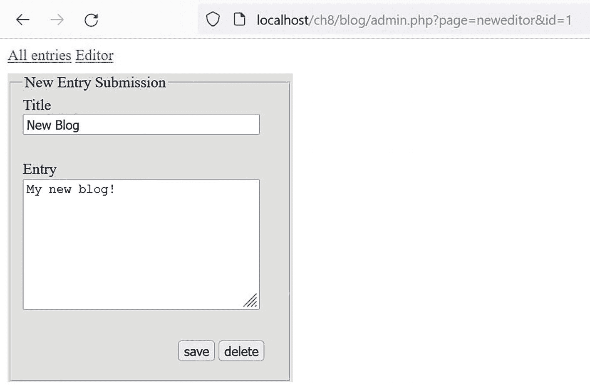

此对话框反映了主持人点击编辑器创建新博客时的界面，该对话框包含标题栏和条目栏。

**图 8-2** 通过`admin.php`调用`neweditor.php`并选择一个博客后的输出结果

### 处理条目删除

模型将逻辑上包含用于从数据库中删除条目数据的代码。视图已经有一个“删除”按钮，因此无需更改。控制器也必须更新，以便在用户点击“删除”按钮时执行代码。

#### 从数据库中删除条目

要删除`blog_entry`表中的一行数据，我们需要创建更多的 SQL。让我们花一分钟思考一下。我们应该在哪里编写删除条目的代码？用于删除`blog_entry`表中条目的 PHP 代码属于`Blog_Entry_Table`类——我们访问数据库表的单一网关。我们将创建一个新方法来完成此任务。


```php
// models/New_Blog_Entry_Table.class.php 的部分代码
// 在 Blog_Entry_Table 类中声明新方法
public function deleteEntry ( $id ) {
$sql = "DELETE FROM blog_entry WHERE entry_id = ?";
$data = array( $id );
$statement = $this->executeSQL( $sql, $data );
}
代码清单 8-5
New_Blog_Entry_Table.class.php 的部分代码
```

此方法中的代码应该看起来很熟悉。它使用了与 `Blog_Entry_Table` 中其他方法相同的逻辑。唯一的区别在于 SQL 语句。

从数据库中删除数据是最终操作，无法撤销！务必避免误删任何内容。数据库表在设计上很合理：每条记录都有主键。这意味着只要拥有某条记录的主键，就能唯一标识该记录。因此，我们也能通过 `entry_id` 确定要删除的记录。

### 响应删除请求

编辑器模型已准备好删除条目，现在需要更新控制器中的代码，以判断删除按钮是否被点击。如果删除按钮被点击，控制器应调用模型来删除相关条目。

```php
// views/admin/editor-html.php 的部分代码
// 两个按钮，同一名称，不同值
```

点击编辑器表单中的任意提交按钮，都会生成一个名为 `action` 的 URL 变量。如果点击保存按钮，`action` 的值为 `save`；如果点击删除按钮，`action` 的值为 `delete`。基于此，我们更新编辑器程序。

```php
saveEntry( $title, $entry );
} else if ($buttonClicked === 'delete' ) {
$entryTable->deleteEntry( $id );
}
}
$entryRequested = isset( $_GET['id'] );
// 创建新的 if 语句
if ( $entryRequested ) {
$id = $_GET['id'];
// 加载已有条目的模型
$entryData = $entryTable->getEntry( $id );
$entryData->entry_id = $id;
}
include_once "views/admin/new-editor-html.php";
?>
代码清单 8-6
newesteditor.php
```

实际上只需要进行少量修改。

```php
$id = $_POST['id'];
```

将隐藏字段 `id` 的值存入 `$id`。

```php
} else if ($buttonClicked === 'delete' ) {
$entryTable->deleteEntry( $id );
}
```

添加了一个 `else if` 语句，用于检查是否点击了删除按钮。如果是，则将 `$id` 值传递给新增的 `deleteEntry()` 方法。

> **注意**  
> 以下程序已更新，以调用新版本的 `newesteditor.php` 和 `New_Blog_Entry_Table.php`：  
> `new-entries-html.php`、`newestentries.php`、`newadmin.php`、`newest-editor-html.php`、`newest-admin-navigation.php`。

我们可以再次暂停，测试对模型、控制器和视图的更新。在浏览器中输入 `http://localhost/ch8/blog/newadmin.php?page=newestentries` 即可检查进度。选择一篇要删除的博客并点击删除按钮后，表单内容会被清空，这向用户提示记录已被删除。点击“所有条目”菜单项，可发现该条目不再显示。我们也可以通过检查数据库表来验证这一点。

> **注意**  
> `entry_id` 会在两处出现。在程序的一部分中，代码通过 `$_POST['id']` 查找 `entry_id`；在另一部分中，代码则通过 `$_GET['id']` 查找。两者值相同但用途不同，这一点略有特殊。  
>  
> 每次用户点击列出的博客标题时，都会生成 `$_GET['id']` 的编码值。因此，`$_GET['id']` 代表用户希望在条目编辑器中看到的博客条目的 `entry_id`。  
> 每次条目被加载到编辑器时，都会生成 `$_POST['id']` 的编码值。它代表用户刚刚在编辑器中看到的条目的 `entry_id`。因此，`$_GET['id']` 表示待加载的条目，而 `$_POST['id']` 表示已加载的条目。

现在我们有了一个可以创建新条目并删除已有条目的编辑器。接下来，我们通过允许管理员更新条目来完成整个流程。

### 准备模型以更新数据库中的条目

更新数据库中的已有条目显然是模型的任务。让我们向 `Blog_Entry_Table` 中添加一个更新方法。

```php
// models/Newest_Blog_Entry_Table.class.php 的部分代码
// 声明新方法
public function updateEntry ( $id, $title, $entry) {
$sql = "UPDATE blog_entry
SET title = ?,
entry_text = ?
WHERE entry_id = ?";
$data = array( $title, $entry, $id );
$statement = $this->executeSQL( $sql, $data) ;
return $statement;
}
代码清单 8-7
Newest_Blog_Entry_Table.class.php 的部分代码
```

此函数的逻辑和 SQL 的基本结构应该很熟悉。我们在更新投票时曾使用过更新 SQL 语句。不过，这里我们使用了预处理语句来将更改写入数据库表记录，以确保任何 SQL 注入尝试都会失败。现在我们可以更新代码，使其在用户点击保存按钮时调用此方法。保存按钮将同时处理新条目的插入和已有条目的更新。

### 控制器：插入还是更新？

当用户点击保存时，显示的条目要么插入数据库，要么更新数据库。采取何种操作取决于条目编辑器表单中显示的是哪个条目。

还记得编辑器视图中的隐藏输入吗？它存储当前显示条目的 `entry_id`，如果编辑器字段为空（设置为默认值），则存储 `0`。我们可以利用这一信息来判断管理员是尝试在 `blog_entry` 表中插入新行，还是更新现有行。

当点击保存按钮时，我们将从隐藏输入中获取值。如果编辑器为空，隐藏输入的值是 `0`，表明管理员刚刚创建了新条目。代码随后会在 `blog_entry` 中插入新行。如果隐藏输入的值是其他整数，代码则会更新 `blog_entry` 中对应 `entry_id` 的行。让我们更新控制器来完成这些任务。

```php
saveEntry( $title, $entry );
} else if  (($buttonClicked === 'save') and ($id != '0')) {
$entryTable->updateEntry( $id, $title, $entry );
} else if ($buttonClicked === 'delete' ) {
$entryTable->deleteEntry( $id );
}
}
$entryRequested = isset( $_GET['id'] );
// 创建新的 if 语句
if ( $entryRequested ) {
$id = $_GET['id'];
// 加载已有条目的模型
$entryData = $entryTable->getEntry( $id );
$entryData->entry_id = $id;
}
include_once "views/admin/updated-editor-html.php";
// 新增函数以移除无效代码
function clean_input($value) {
$value = trim($value);
$value = stripslashes($value);
$value = strip_tags($value);
return $value;
}
?>
代码清单 8-8
updatededitor.php
```

### 安全编程

```php
$id = clean_input($_POST['id']);
$title = clean_input($_POST['title']);
$entry = clean_input($_POST['entry']);
...
function clean_input($value) {
$value = trim($value);
$value = stripslashes($value);
$value = strip_tags($value);
return $value;
}
```

除了上述更改，我们还利用三个 PHP 函数（`trim()`、`stripslashes()` 和 `strip_tags()`）改进了输入数据的有效性。  
`trim()` 会移除多余的空格、制表符和/或换行符。`stripslashes()` 会移除反斜杠。  
`strip_tags()` 会移除任何输入的 PHP 或 HTML 标签，防止其被执行。

> **注意**  
> 以下程序已更新，以访问最新版本的更新文件：  
> `updated-editor-html.php`、`updated-entries-html.php`、`updatedentries.php`、`updatedadmin.php`、`updated-admin-navigation.php`。

代码必须能够区分两种用户操作（保存、更新）。当用户点击保存按钮且 `entry_id` 为 `0` 时，用户实际上是在尝试插入新条目。

```php
$id = clean_input($_POST['id']);
$title = clean_input($_POST['title']);
$entry = clean_input($_POST['entry']);
```


当用户点击按钮时，这三个值都会被保存。如果用户想保存新条目，这些值将是默认值，且`$id`将包含零。如果用户想更新现有条目，`$id`将包含该条目的 ID 编号。

```
if ( ($buttonClicked === 'save') and ($id === '0' ) ) {
$entryTable->saveEntry( $title, $entry );
} else if ( ($buttonClicked === 'save') and ($id != '0')) {
$entryTable->updateEntry( $id, $title, $entry );
} else if ($buttonClicked === 'delete' ) {
$entryTable->deleteEntry( $id );
}
```

如果是新条目，则调用`saveEntry()`方法，并传入`$title`和`$entry`。如果是更新条目，则调用`updateEntry()`方法，并传入`$id`、`$title`和`$entry`。如果点击了删除按钮，则调用`deleteEntry()`方法，并传入`$id`。

现在我们可以再次暂停，通过在浏览器中输入`http://localhost/ch8/blog/updatedadmin.php?page=updatedentries`来测试我们的修改。点击列出的博客后，我们可以对博客进行更新，然后点击提交按钮。表单将被清空，这表明更改已生效。然后我们可以使用导航菜单再次显示所有博客，并点击更新后的博客来确认更新确实发生了。

### 强制要求输入标题

我们的逻辑存在一个可用性缺陷：可以创建一篇没有标题的新博文！

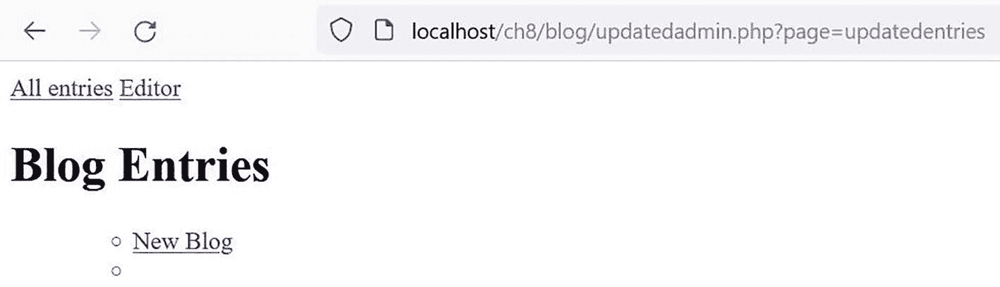

此弹窗显示了当主机试图输入无标题博客时的情形。

**图 8-3** 输入无标题的博客

问题在于，没有标题的博文无法被点击，因此这类条目无法被加载到条目编辑器中。如果我们真的想编辑这篇博文，可以直接在数据库表中修改条目。我们可以说这是一个可用性问题，而非功能性问题。从功能上讲，*确实*可以编辑该条目，但如果所有博文都能通过条目编辑器进行编辑，对用户来说会更加方便和简单。

**安全编程**
这可能会被视为我们程序中的一个安全漏洞，或者至少是一个验证漏洞。请记住，在数据进入数据库之前，我们必须确保所有数据都是有效的。而我们显然没有做到这一点。为了实现安全的验证，必须在两个位置进行：客户端和服务器端。我们必须记住，黑客可以绕过我们的表单，尝试将信息直接发送到服务器上的程序。如果我们只在客户端进行验证，就会留下可乘之机。

那么，为什么不在服务器端验证所有内容，而跳过客户端的验证呢？答案是效率问题。每次我们使用 PHP 代码时，都在与服务器进行交互。因此，如果我们只使用 PHP 进行验证，就必须将信息传递到服务器进行验证，再将信息和错误消息传回客户端机器的表单，如果用户仍然没有输入正确的信息，还需要重复这一过程。如果我们先在客户端进行验证，就可以确保有效的信息（从表单发送时）仅被发送到服务器——从而减少服务器调用，使程序更加用户友好和高效。当然，我们仍然会使用 PHP 进行验证，以确保数据在传输到服务器的途中没有被破坏，或者黑客没有试图向服务器发送无效数据。

让我们先对编辑器 HTML 代码做一个小改动，以实现客户端验证。尽管我们已经在服务器端清理了数据，但还要更新用户端，不允许输入可能表示试图输入 HTML 代码的特殊字符。同时，我们将要求必须输入标题。这将消除图 8-3 所示的问题。

```
//views/admin/another-editor-html.php 的部分代码
title !="") {
$info .= "value='$entryData->title' ";
}
$info .= "pattern='[A-Za-z]{,150}'"
title='标题只能包含字母字符，不能有特殊字符。标题为必填项。'
required />
```

模式`pattern='[a-z][A-Z]{,150}'`只允许字母字符，且要求至少一个字符，最多 150 个字符。HTML 的`required`属性也会检查用户是否已输入信息。`title`属性定义了当用户未输入正确的必填信息时要显示的错误消息。只有当标题不是默认值时，标题文本框才会被设置一个值。否则，模式测试将失败。

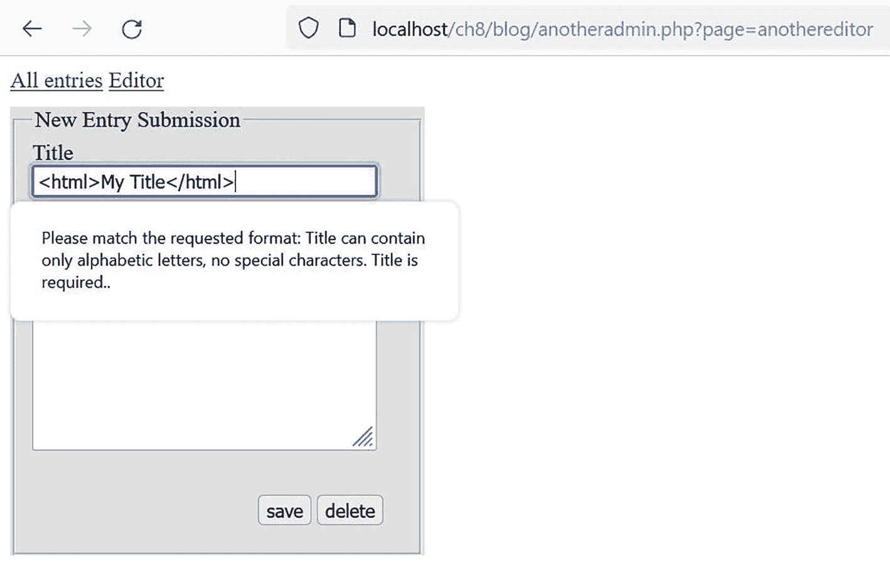

此对话框显示了当主机尝试使用无效标题创建新条目时的情形。

**图 8-4** `another-editor-html.php` 对无效输入的处理输出

**注意**
以下文件已进行微调以使用修改后的表单：`another-admin-navigation.php`、`anothereditor.php`、`anotheradmin.php`、`another-entries-html.php`、`anotherentries.php`。有关输入模式的更多信息，请访问[`www.w3schools.com/tags/att_input_pattern.asp`](http://www.w3schools.com/tags/att_input_pattern.asp)。

此解决方案在大多数现代浏览器中都能完美运行。然而，任何旧版浏览器都会忽略它们无法执行的 HTML，并简单地将输入的值传递给服务器上的 PHP 程序。

为了验证标题是否有值，我们只需要修改`anothereditor.php`程序中的一行代码。

```
if (( $editorSubmitted ) && (isset( $_POST['title']))) {
```

**练习**：调整`another-editor-html.php`表单中文本字段的 HTML 代码，以及`anothereditor.php`中的 PHP 代码，以允许几种类型的 HTML（和/或 CSS）格式。为此，你需要创建一个 JavaScript 函数用于在用户端进行验证，并更新服务器端的清理函数。

## 用户视图：构建和显示评论输入表单

让我们切换到应用程序的用户端，并纠正博客中另一个缺失的必要功能。任何博客系统都应该允许用户对现有博文发表评论。我们将从创建一个用于接收用户评论的评论表单（*视图*）开始。这个表单还需要相应的模型和控制器。

**注意**
以下文件已从`ch7/blog`文件夹复制，并按如下所示重命名。这些文件也已修改，以使用当前版本的其他相关文件。建议你从出版商网站的第 8 章文件夹中复制文件，以避免出现问题。

| 原始名称 | 新名称 | 位置 |
| --- | --- | --- |
| `updatedindex.php` | `index.php` | `Blog` |
| `updatedblog.php` | `blog.php` | `blog/controllers` |
| `updated-entries-html.php` | `entries-html.php` | `blog/views` |
| `entry-html.php` | `entry-html.php` | `blog/views` |

让我们看看评论表单的代码。

```
您的姓名
您的评论
";
?>
清单 8-9
comments-html.php
```

```
$idIsFound = isset($entryId);
if( $idIsFound === false ) {
trigger_error('views/comments-html.php 需要一个 $entryId');
}
```

如果没有传递条目 ID，则不会尝试接受评论。用户只有在选择了一篇博文（该博文有一个条目 ID）并尝试添加与该博文相关的评论时，才应该进入此表单。如果缺少条目 ID，则会引发错误。

当表单被提交时，`page`被设置为`blog`，`id`被设置为`$entryid`中的值。`$entryid`也存储在一个隐藏属性`entry-id`中。此逻辑与前一章展示的逻辑类似。


`name`文本框还限制输入为字母字符，必填，最多 30 个字符。我们还将过滤掉任何无效数据，这些过滤将在服务器端的 PHP 代码中完成。

要显示评论表单，需要一个评论控制器。在早期阶段，它的工作只是加载视图并返回 HTML，以便显示评论表单。

**清单 8-10** `comments.php`

到目前为止，代码简短而切题，与之前的代码示例非常相似。评论控制器加载评论视图。但谁应该加载评论控制器并实际显示评论表单呢？

### 组合视图

评论表单只应在显示完整条目（已选择更多详细信息）时显示。因此，显示条目的页面也应显示评论表单：这是一个由其他视图组成的复杂视图。图 8-5 展示了一个组合视图的简单解决方案。

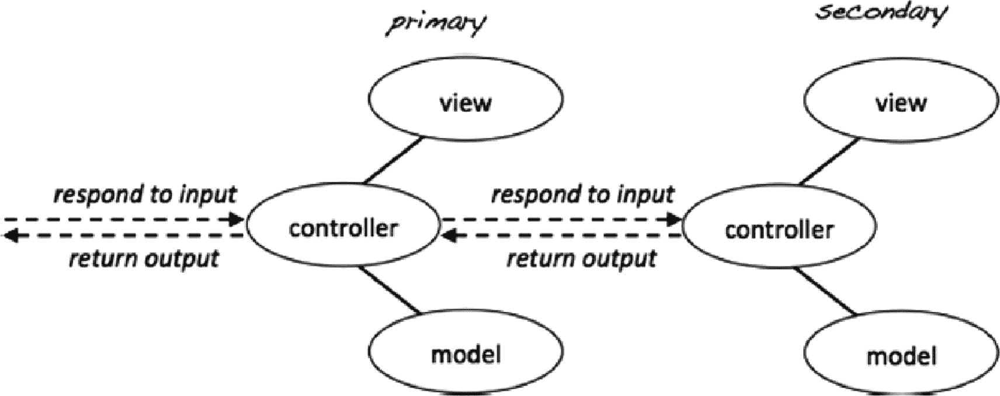

*流程图描述了主通道和次通道如何相互响应。*

**图 8-5** 构建复杂视图

我们之前的一些前端控制器也提供了多个视图。`anotheradmin.php`中的代码加载模型和视图以生成 HTML5 页面。根据条件，`anotheradmin.php`加载编辑器控制器或列表条目控制器，每个控制器都会返回一些内容嵌入到生成的页面中。因此，`anotheradmin.php`是*主控制器*，随后加载的控制器是*次控制器*。

在此示例中，主控制器是博客控制器。评论表单仅在博客条目的上下文中才有意义。博客控制器加载博客条目。然后博客控制器将加载评论控制器（次控制器）。

```
getEntry( $entryId );
include_once "views/entry-html.php";
include_once "controllers/comments.php";
} else {
$entries = $entryTable->getAllEntries();
include_once "views/new-entries-html.php";
}
?>
```

**清单 8-11** `newblog.php`

```
include_once "controllers/comments.php";
```

与我们之前的博客控制器相比，唯一的变化就是上面这行包含`comments.php`次控制器的代码。

**练习**：表单完全没有样式，看起来不太美观。请随意按照您的喜好为评论表单添加样式。在`css`文件夹下的`newblog.css`文件中已经包含了一些 CSS 代码。但是，请发挥您的创造力。确保添加必要的代码以使用 CSS 样式表，如之前章节所示。

当然，我们还不能显示或存储我们的评论。让我们创建数据库表来保存用户提供的信息。

### 在数据库中创建评论表

让我们在`simple_blog`数据库中创建一个名为`comment`的表。我们将使用它来存储所有关于评论的信息。我们将在此表中包含以下几种不同类型的信息：

*   `comment_id`：评论的唯一标识符。这是表的主键。我们将使用`AUTO_INCREMENT`属性，以便自动为新评论分配唯一的 ID 编号。
*   `entry_id`：评论对应的博客条目的标识符。此列是`INT`（整数）类型。`entry_id`引用另一个表中的主键。`entry_id`是评论表中的外键。
*   `author`：评论作者的姓名。此列最多接受 30 个字符，类型为`VARCHAR`（字符串）。
*   `txt`：实际的评论文本。列的数据类型为`TEXT`。
*   `date`：评论发布的日期，以`TIMESTAMP`类型存储。我们可以为此列设置一个默认值：`CURRENT_TIMESTAMP`，它将在用户向表中添加新评论时提供精确日期和时间的`TIMESTAMP`。

要创建此表，我们将在浏览器中导航到`http://localhost/phpmyadmin`，选择`simple_blog`数据库，然后打开 SQL 选项卡。接着，我们将执行以下命令来创建评论表：

```
CREATE TABLE comment (
comment_id INT NOT NULL AUTO_INCREMENT,
entry_id INT NOT NULL,
author VARCHAR( 75 ),
txt TEXT,
date TIMESTAMP DEFAULT CURRENT_TIMESTAMP,
PRIMARY KEY (comment_id),
FOREIGN KEY (entry_id) REFERENCES blog_entry (entry_id)
)
```

**注意**

您也可以使用`phpmyadmin`中的 GUI 屏幕来创建评论表及其内容，正如其他章节中讨论的那样。

评论是用户对某一特定博客条目的回应。因此，每个新评论都必须与一个博客条目唯一关联。当显示特定博客条目时，只会显示与该博客条目相关的评论。

因此，数据库的设计必须能够表示博客条目和评论之间的关系。数据库设计必须支持任何一个评论只能与一个博客条目相关。一个逻辑解决方案是创建评论表，其中包含`entry_id`列，如表 8-1 所示。这样，一个评论就会知道特定条目的相关`entry_id`。

**表 8-1** 与特定条目相关的评论行

| comment_id | entry_id | Author | txt | date |
| --- | --- | --- | --- | --- |
| 1 | 1 | Thomas | […] | 2022-09-02 12:54:15 |
| 2 | 8 | Thomas | […] | 2022-09-02 13:25:41 |
| 3 | 1 | Brennan | […] | 2022-09-07 01:43:19 |

让我们看看表 8-1 中填充的评论表。看到任何人的评论是如何显式地与特定条目的`entry_id`相关联的吗？这样，每个评论都知道关联的博客条目。还要注意，一个博客条目可能有许多关联的评论。在上面的例子中，`entry_id = 1`的条目有两个评论。这种关系在关系数据库术语中称为*一对多关系*。

### 使用外键

在建立两个表之间的关系时，使用*外键*非常常见。您可以在前面的 SQL 语句中看到如何声明外键。但它究竟有什么用呢？外键也是对*外部*表中*主键*列的*引用*。在前面的例子中，评论表的`entry_id`是对`blog_entry`表的`entry_id`列的引用。外键有助于维护数据完整性，因为评论表只接受那些能在`blog_entry`表中找到相应`entry_id`的评论。换句话说，评论表只接受与已存在的博客条目相关的评论。

### 构建 Comment_Table 类

现在让我们为评论创建模型，该模型将用于访问数据库中的新评论表。我们继续使用表数据网关设计，它提供了从 PHP 代码到单个数据库表的单一访问点。`Blog_Entry_Table`类包含几个我们也会在评论表中使用的项目。这包括接受 PDO 对象的构造函数，以及将执行我们新 SQL 语句的`executeSQL()`方法。我们可以简单地将重用的代码复制到新类中。然而，这不是代码效率。这种情况为我们提供了另一个学习新东西的机会：使用*继承*来在不同类之间共享公共代码。

### 继承

使用*继承*时，我们可以创建一个单独的类定义来保存多个类之间共享的代码。我们将创建独立的*子类*，其中包含各个类的独特代码。

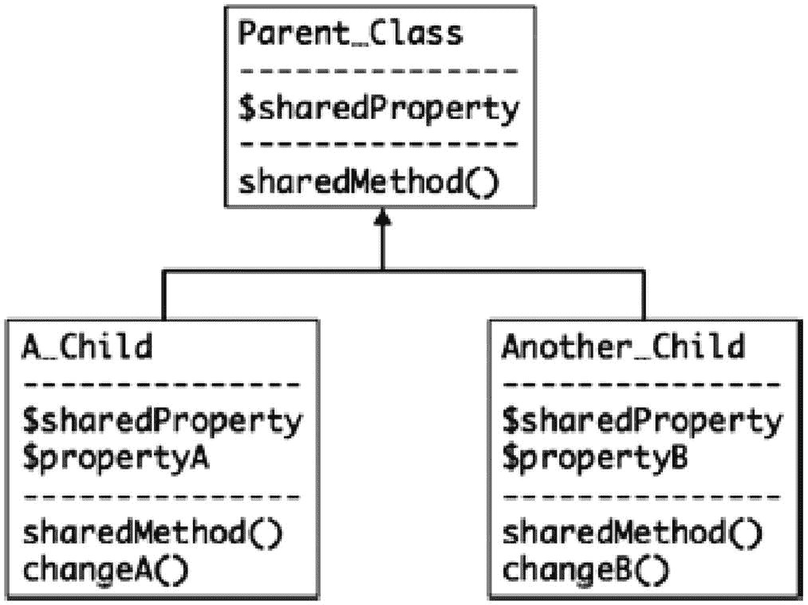

*图表表示父类中使用的共享属性和共享方法，以及两个子类。*

**图 8-6** 子类从父类继承属性和方法


图 8-6 展示了一些代码如何在父类中声明，以便在多个类之间共享。父类的所有子类将天生拥有这些属性。在图 8-6 中，我们可以看到`A_Child`和`Another_Child`都拥有`$sharedProperty`和`sharedMethod()`，这些是从父类继承而来的。在图 8-6 中，我们还可以看到`A_Child`和`Another_Child`各自拥有特殊的属性和方法。这些是在子类定义中声明的。例如，只有`A_Child`拥有`changeA()`方法。我们将利用这个思路，在`Blog_Entry_Table`和`Comment_Table`类之间共享`$db`的内容以及函数`executeSQL()`。`Comment_Table`和`Blog_Entry_Table`类都将天生拥有从`Table`类（父类）继承的`$db`属性和`executeSQL()`方法。

**Is-a 关系**  
在面向对象术语中，父类和子类之间的关系被称为“is-a”关系。一个`Comment_Table`是一个`Table`。`Table`是一个表示数据库表的通用抽象。`Comment_Table`是特定数据库表的表示。  
对象间的“is-a”关系概念在你日常思维中也会用到。咖啡是一种饮料。橙汁也是一种饮料。橙汁和咖啡虽然明显不同，但共享一些特征。饮料是可饮用液体的抽象概念，而咖啡和橙汁是特定种类的可饮用液体。面向对象编程借用了这种广泛使用的人类推理方式，并将其用于为计算机程序带来层次结构。

**在我们的代码中使用继承**  
子类之间共享的代码必须使用`public`或`protected`访问修饰符。任何具有`private`访问修饰符的属性或方法都不会通过继承共享。让我们创建一个通用的`Table`类，它将包含由子类共享的那些项。

```php
db = $db;
}
protected function executeSQL ( $sql, $data = NULL) {
//create a PDOStatement object
$statement = $this->db->prepare( $sql );
try{
//use the dynamic data and run the query
$statement->execute( $data );
} catch (Exception $e) {
$exceptionMessage = "You tried to run this sql: $sql 
Exception: $e";
trigger_error($exceptionMessage);
}
//return the PDOStatement object
return $statement;
}
}
?>
Listing 8-12
Table.class.php
```

这段代码看起来应该非常熟悉，因为它是从`Blog Entry`类复制过来的，只做了一些小修改。

```php
protected $db;
...
protected function executeSQL ( $sql, $data = NULL) {
```

`protected`访问修饰符与我们已使用的`private`访问修饰符非常相似。`protected`方法和属性不能从类外部访问，但可以从类内部访问。如果我们对这些语句使用`private`，那么需要用到它们的子类将无法访问它们。

要使此代码对诸如`Comment_Table`之类的子类可用，我们必须在代码中包含`Table`类脚本，并使用关键字`extends`指示其用途。

```php
executeSQL($sql, $data);
return $statement;
}
public function getAllById ( $id ) {
$sql = "SELECT author, txt, date FROM comment
WHERE entry_id = ?
ORDER BY comment_id DESC";
$data = array($id);
$statement = $this->executeSQL($sql, $data);
return $statement;
}
}
?>
Listing 8-13
Table.class.php
```

现在，`Comment_Table`类仅包含特定于访问和更新数据库中评论表的代码。`saveComment()`函数使用熟悉的代码将评论插入到表中。`getAllById()`函数使用熟悉的代码检索与特定`entry_id`相关的所有评论。请注意，这两个函数都使用`Table`类中包含的`executeSQL()`函数来执行每个 SQL 命令。这个函数是从`Table`类继承而来的，因此可供两个函数使用。`getAllById()`函数还对结果进行降序排序（`DESC`），以便将最新的评论显示在结果顶部。

**注意**  
可以编写很长的继承链。你可以创建一个`Dog`类，它是`Wolf`的子类，`Wolf`是`Canine`的子类，`Canine`是`Quadruped`的子类，`Quadruped`是`Mammal`的子类。但经验表明，浅层继承关系更可取。长继承链会导致依赖性问题，因为`Dog`将依赖于`Wolf`的存在，而`Wolf`又依赖于`Canine`，`Canine`依赖于`Quadruped`。请保持继承链简短。

花点时间阅读前面代码中使用的 select SQL 语句。它将为与特定`entry_id`关联的所有评论选择`author`、`txt`和`date`列。请记住，`entry_id`被声明为外键。它是对`blog_entry`表主键的引用。通过`entry_id`，我们可以明确地识别出一条特定的`blog_entry`：我们知道哪条评论与哪个博客条目相关。  
在 insert SQL 语句中，`comment_id`列被声明为`auto_incrementing`，这意味着插入的第一条评论将自动获得`comment_id`值 1。下一条评论将获得`comment_id`值 2，依此类推。因此，最新的评论将具有最高的`comment_id`值。所以，降序排列会将新评论列在前面，旧评论列在后面。  
现在模型已经创建，是时候创建一个视图来检查一切是否正常运行了。

**为评论列表创建视图**  
我们正在创建的视图将使用与之前创建的其他视图类似的逻辑。

```php
";
//iterate through all rows returned from database
while ($commentData = $allComments->fetchObject() ) {
//notice incremental concatenation operator
//it adds  elements to the 
$allCommentsHTML .= "
$commentData->author wrote:
$commentData->txt
";
}
$allCommentsHTML .= "";
$info .= $allCommentsHTML;
?>
Listing 8-14
comments-html.php
```

```php
while ($commentData = $allComments->fetchObject() ) {
//notice incremental concatenation operator .=
//it adds  elements to the 
$allCommentsHTML .= "
$commentData->author wrote:
$commentData->txt
";
}
```

`while`循环会遍历包含从数据库表中检索到的评论的标准对象。只要存在评论，就会从`$commentData`（其中包含从标准对象中拉取的当前记录）中显示`txt`属性的内容（即实际评论）。循环将持续到没有与特定博客条目相关的更多评论为止。

**连接视图和模型以显示评论**  
显示评论的最后一步是加载视图，该视图将显示从数据库中检索到的所有评论。

```php
getAllById( $entryId );
include_once "views/comments-html.php";
?>
Listing 8-15
newcomments.php
```

前面的代码将显示一个博客条目，然后是评论表单，最后是与该博客条目关联的所有评论列表。我们可以手动将一条评论输入到数据库表中。不过，让我们继续创建一个通过表单实现此功能的方法——尤其是我们已经创建了插入函数。

**通过评论表单插入评论**  
使用 PHP 检索表单输入对于 Web 开发人员来说是一项非常常见的任务。在本书的这个阶段，你应该开始理解这一点。

请提供您的姓名


```php
<?php
?>
清单 8-16
comment-form-html.php
```

表单的 `method` 属性设为 `post`。`page` 属性设为 `blog`，`id` 属性保存着 `$entryId` 的值。

其中有一个名为 `user-name` 的 `<input>` 字段、一个名为 `entry-id` 的隐藏 `<input>` 字段，以及一个名为 `new-comment` 的 `<textarea>` 字段。了解了这些之后，我们可以在评论控制器中编写一小段 PHP 代码，用于插入用户的新评论。

```php
saveComment( $whichEntry, $user, $comment );
}
//end of new code
include_once "views/updated-comment-form-html.php";
$allComments = $commentTable->getAllById( $entryId );
include_once "views/comments-html.php";
function clean_input($value) {
$value = trim($value);
$value = stripslashes($value);
$value = strip_tags($value);
return $value;
}
?>
清单 8-17
updatedcomments.php
```

```php
$newCommentSubmitted = isset( $_POST['new-comment'] );
if ( $newCommentSubmitted ) {
$whichEntry = $_POST['entry-id'];
$user = clean_input($_POST['user-name']);
$comment = clean_input($_POST['new-comment']);
$commentTable->saveComment( $whichEntry, $user, $comment );
}
```

代码中新增的循环将获取用户提交的评论，移除任何无效代码，并将信息传递给 `saveComment()` 函数。该函数随后会将评论存入评论数据库表中。

**注意**

以下文件已更新为使用最新版本的评论逻辑：`updatedblog.php`、`updatedindex.php`、`updated-comment-form-html.php`、`updated-entries-html.php`。

让我们花点时间测试一下我们的逻辑。让我们打开浏览器，执行 `updatedindex.php`，然后让浏览器指向任意一篇博客文章，并通过表单提交一条新评论。我们应该能看到这条提交的评论与该博客文章的其他已有评论一同列出。评论系统可以运行了！

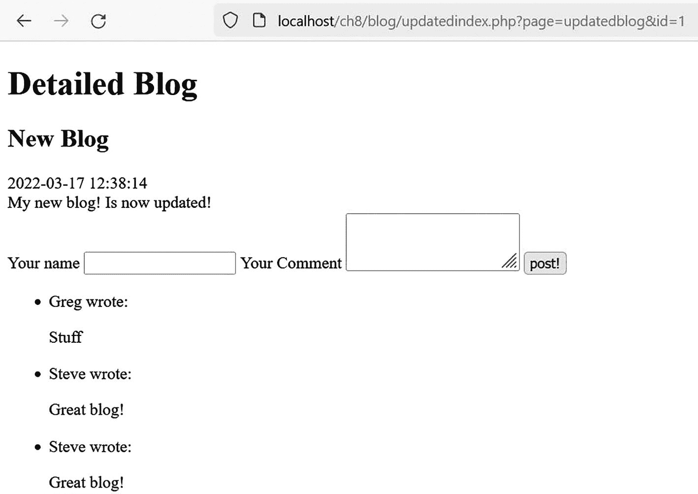

此窗口显示的是博客回复界面，用于添加姓名和评论。图中展示了 Greg 和 Steve 的示例评论。

**图 8-7** 在 `updatedindex.php` 中选择“更多详情”后的输出结果

**练习**：修改 `Blog_Entry_Table` 类，使其继承自 `Table`，以练习继承。这和我们之前对 `Comment_Table` 类的操作非常相似。

## 搜索文章

我们的博客系统已经取得了长足的进步。访问博客的人可能想查找某个特定时间写过的具体内容，但他们可能不记得哪篇文章包含了这些信息。我们可以为他们提供一个搜索文章的选项。

我们将展示一个搜索表单，让访问者可以输入搜索文本。我们将接受任何输入的搜索文本，在数据库中进行搜索，并返回与输入的搜索信息相匹配的文章。

我们需要一个*视图*来显示搜索表单，另一个*视图*来显示搜索结果。还需要一个*模型*来执行数据库搜索并返回结果。此外，需要一个*控制器*来响应用户交互。如果表单已提交，控制器应显示搜索结果；否则，它将显示搜索表单。

### 搜索视图

从小处着手总是一个好主意。我们将首先为搜索视图创建一个 HTML 表单。保持简单，无需花哨。在 `views/search-form-html.php` 中创建一个新文件。

```php
<?php
?>
清单 8-18
search-form-html.php
```

该视图将显示一个 HTML 搜索表单。`search` 输入类型只是一个特殊的单行文本字段。搜索字段会记住用户之前的搜索词，并在用户输入时提供一个包含历史搜索词的下拉列表。较旧的浏览器可能不支持 `search` 类型。但不支持它的浏览器会默认将其显示为基本的 `<input type="text">`，因此即使浏览器不支持该类型，搜索表单仍然可以工作。

要显示搜索表单，我们需要考虑将它放在哪里。最好是在每个页面上都显示搜索表单。为了无论显示什么内容都能显示搜索表单，我们可以从前端控制器 `index.php` 中加载它。我们将在 `index.php` 末尾附近添加一行代码。

```php
setTitle("PHP/MySQL blog demo");
include_once "models/database.php";
include_once "controllers/searchblog.php";
//new code: include the search view before the blog controller
include_once "views/search-form-html.php";
//end of new code
$pageData->setContent($info);
include_once "views/page.php";
echo $page;
?>
清单 8-19
searchindex.php
```

让我们再停一下，测试一下我们的逻辑。我们可以通过在浏览器中加载 `http://localhost/blog/searchindex.php` 来查看进度。

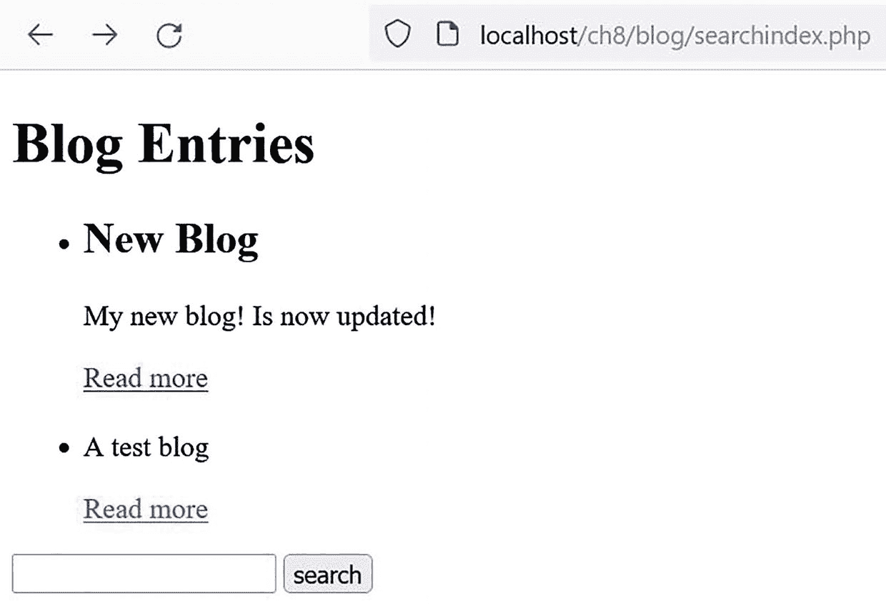

此窗口显示了带有搜索选项的博客文章列表。

**图 8-8** 从 `searchindex.php` 输出的结果

我们可以看到搜索区域显示在列表的底部。如果我们点击某个“阅读更多”链接，我们也会在所提供信息的底部看到搜索区域。

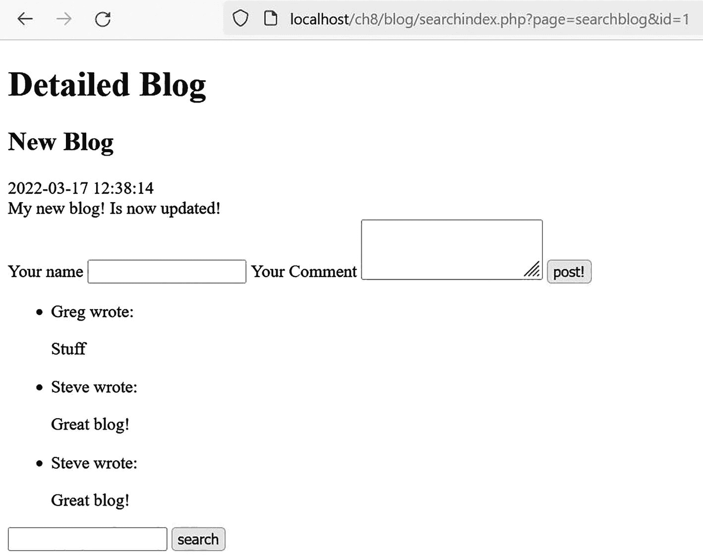

此窗口显示了在 `searchindex.php` 中选择“阅读更多”选项后，带有搜索选项的详细博客内容。此处展示了博客评论。

**图 8-9** 在 `searchindex.php` 中选择“阅读更多”后的输出结果

我们也可以将搜索区域放在显示区域的顶部，或者仅在 `searchindex.php` 的初始显示中显示它。当然，目前实际的搜索功能还不工作。但很快它就会工作了！

**练习**：将搜索区域的位置调整到显示区域的顶部。如何做到仅在其初始显示时才显示在 `searchindex.php` 上？

### 响应用户搜索

当执行搜索时，我们将从索引中加载搜索控制器。如果没有执行搜索，索引应加载博客控制器。请注意搜索表单的 `action` 属性：

```php
//partial code from views/search-form-html.php, don't change anything

```

每当用户提交搜索表单时，一个名为 `page`、值为 `search` 的 URL 变量会被编码为请求的一部分。因此，当 `page` 的值为 `search` 时，Web 应用程序应显示搜索结果。在索引程序中实现这一点将非常容易。

```php
setTitle("PHP/MySQL blog demo");
include_once "models/database.php";
$pageRequested =  isset( $_GET['page'] );
//default controller is searchingblog
$controller = "searchingblog";
if ( $pageRequested ) {
//if user submitted the search form
if ( $_GET['page'] === "search" ) {
//load the search by overwriting default controller
$controller = "search";
}
}
include_once "controllers/$controller.php";
include_once "views/searching-form-html.php";
$pageData->setContent($info);
include_once "views/page.php";
echo $page;
?>
清单 8-20
searchingindex.php
```

```php
//default controller is searchingblog
$controller = "searchingblog";
if ( $pageRequested ) {
//if user submitted the search form
if ( $_GET['page'] === "search" ) {
//load the search by overwriting default controller
$controller = "search";
}
}
```

默认情况下，将显示 `searchingblog.php` 控制器。但是，如果用户在搜索框中输入了值并点击了搜索按钮，则将显示 `search.php` 控制器。

### 搜索模型

我们已经有了搜索表单视图和一个初步的搜索控制器。现在该着手处理搜索模型了，这样我们才能执行实际的搜索。为了执行搜索，我们需要查询 `blog_entry` 数据库表。我们已经有了一个 `Blog_Entry_Table` 类来提供对该表的单一访问点。明智的做法是向 `Blog_Entry_Table` 类添加另一个方法。


```php
// 在 Blog_Entry_Table 类中声明新方法
public function searchEntry ( $searchTerm ) {
$sql = "SELECT entry_id, title FROM blog_entry
WHERE title LIKE ?
OR entry_text LIKE ?";
$data = array( "%$searchTerm%", "%$searchTerm%" );
$statement = $this->executeSQL($sql, $data);
return $statement;
}
```
清单 8-21
部分清单 `Searched_Blog_Entry_Table.class.php`

或许需要为 `$data` 数组稍作解释。*当两个元素完全相同时*，创建包含两个独立元素的数组难道不奇怪吗？实际上，SQL 中未命名占位符的数量必须与数组中执行的项目数量完全一致。由于 SQL 中有两个占位符，我们需要一个包含两个值的数组用于搜索。在上述示例中，代码将在两个不同的表列（`title` 和 `entry_text`）中搜索相同的搜索词。

### 使用 LIKE 条件进行搜索

前面的 SQL 语句展示了一个本书先前示例中未使用过的 SQL 关键字：`LIKE`。

```php
$sql = "SELECT entry_id, title FROM blog_entry
WHERE title LIKE ?
OR entry_text LIKE ?";
$data = array( "%$searchTerm%", "%$searchTerm%" );
```

`%` 字符表示通配符。通配符可以代表任何内容。该查询将返回所有 `title` 或 `entry_text` 包含搜索值（无论出现在这些列中的任何位置）的行结果集。例如，如果搜索值为“test”，则可能返回 `title` 为“test if it works”的行；也可能返回 `entry_text` 值为“This is a test”的行。由于通配符同时位于搜索词的前后，因此两种结果都有可能。

### 搜索结果视图

为了以用户易于理解的方式展示搜索结果，我们需要创建一个搜索视图。我们将为返回的数据包裹一些 HTML 代码。

```php
您搜索的关键词为：$searchTerm";
while ( $searchRow = $searchData->fetchObject() ){
$href = "searchedindex.php?page=searchedblog&id=$searchRow->entry_id";
$searchedHTML .= "$searchRow->title";
}
$searchedHTML .= "";
$info .= $searchedHTML;
?>
```
清单 8-22
`searched-results-html.php`

上述代码假定存在一个 `$searchData` 变量。如果找不到该变量，则会触发错误。如果找到 `$searchData` 变量，代码将通过 `while` 语句遍历结果集。`while` 循环将为每个与搜索条件匹配的 `blog_entry` 创建一个 `<li>` 元素。

### 从控制器加载搜索结果视图

为了在浏览器中显示搜索结果，我们必须加载搜索结果视图。将视图与模型关联是控制器的任务。

```php
searchEntry( $searchTerm ) ;
include_once "views/searched-results-html.php";
}
?>
```
清单 8-23
`searched.php`

就是这样。前端控制器将仅显示博客页面或搜索页面。搜索页面将显示搜索结果——即使没有匹配结果也会显示。

**注意**

以下文件已更新，引用了搜索方法的最新版本：`Searchedindex.php`、`searchedblog.php`、`searched.php`、`searchedcomments.php`、`Searched_Blog_Entry_Table.class.php`、`searched-comments-form-html.php`、`searched-comments-html.php`、`searched-entries-html.php`、`searched-form-html.php`、`searched-results-html.php`。

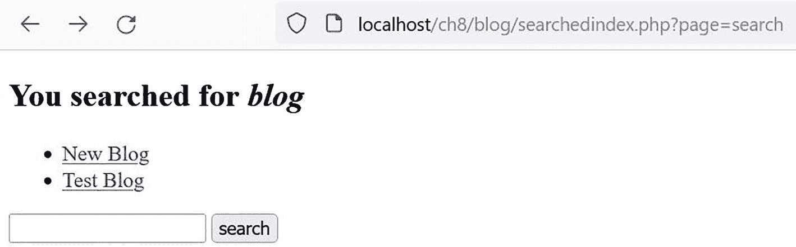

此窗口显示了搜索“blog”后的结果，展示了新博客和测试博客以及搜索栏。

**图 8-10** 在 `searchedindex.php` 中搜索“Blog”的结果

搜索成功找到了所有出现的搜索字符串，如图 8-10 中搜索“Blog”所示。

### 练习：优化搜索

你是否注意到搜索功能有一个小问题？尝试搜索一个你确定数据库中不存在的词。如果查看生成的 HTML 源代码，会发现以下内容：

```html
您搜索的关键词为：
```

请修改代码，使其能够检测何时没有返回结果。提示：`PDOStatement` 将包含 `FALSE`。显示一条消息，例如“没有条目匹配您的搜索。”

## 总结

本章我们在学习内容和博客优化方面都取得了很大进展。就互动交流而言，评论系统是一个重要的变革。突然间，网站不再仅仅是发布博客供世人阅读。有了评论系统，我们开启了作者与读者之间的双向沟通。

我们仍希望通过增加安全功能和发布图片的能力来完善博客系统。我们将在下一章完成对这个系统的讨论。

## 项目

1.  运用本章及前几章的设计实践，更新第 7 章的学生注册系统。提供一个搜索程序，允许用户按姓名或专业搜索学生记录。程序应显示所有姓名相似的学生或所有相同专业的学生。

2.  更新第 7 章的信息请求网站，允许管理员搜索详细描述字段中包含的信息。结果应显示所有包含搜索字符串数据的记录的全部信息（用户姓名、电子邮件和完整描述）。

# 9. 基础博客：图片与身份验证

## 学习目标

完成本章后，你将能够：

*   从数据库的关联表中删除条目
*   创建动态下拉选择框
*   使用 `password_hash()` 对密码进行哈希处理
*   使用 `strlen()` 确定字符串长度
*   使用 `preg_match()`、正则表达式和 `filter_var()` 验证字符串
*   使用 `password_hash` 和 `password_verify()` 验证用户访问权限
*   使用会话保护 Web 应用程序
*   记录错误和异常

基础博客已基本完成！当然还有改进空间，但功能已经完备。管理模块可用于创建博客条目，但存在一些严重缺陷：

*   如果数据库中有与条目相关的评论，则无法删除该条目。
*   无法向博客条目添加图片。

现在我们来解决这些问题。我们通过复制出版商网站上的文件来开始修复这些缺陷的开发过程。你可以选择复制 `ch8` 文件夹中的文件并进行修改，如下一段所述。但由于改动量较大，不建议这样做。如果你喜欢冒险，请按照以下说明操作。

首先创建一个 `ch9` 文件夹。在该文件夹下创建一个 `blog` 文件夹。在 `blog` 文件夹下创建 `controllers`、`CSS`、`models` 和 `views` 文件夹。在 `controllers` 文件夹下创建 `admin` 文件夹。在 `views` 文件夹下创建 `admin` 文件夹。然后按下表所示复制 `ch8` 文件夹中的程序。

| **原文件名** | **新文件名** | **所在位置** |
| --- | --- | --- |
| `anotheradmin.php` | `admin.php` | `Blog` |
| `anothereditor.php` | `editor.php` | `controllers/admin` |
| `updatedentries.php` | `entries.php` | `controllers/admin` |
| `blog.css` | `blog.css` | `Css` |
| `Comment_Table.class.php` | `Comment_Table.class.php` | `Models` |
| `Searched_Blog_Entry_Table.class.php` | `Blog_Entry_Table.class.ph` | `p models` |
| `database.php` | `database.php` | `Models` |
| `Page_Data.class.php` | `Page_Data.class.php` | `models` |
| `Table.class.php` | `Table.class.php` | `models` |
| `another-admin-navigation.php` | `admin-navigation.php` | `views/admin` |
| `another-editor-html.php` | `editor-html.php` | `views/admin` |
| `updated-entries-html.php` | `entries-html.php` | `views/admin` |
| `page.php` | `page.php` | `views` |

**注意**

每个复制的文件都需要更新，以使用任何重命名的程序。
```


## 删除关联表中的条目

评论系统是一项很棒的改进。但遗憾的是，评论也给管理模块带来了我们不希望看到的系统行为：现在无法删除带有评论的条目了。我们可以尝试删除一篇带有评论的博客来测试这一点，系统会忽略该请求。这是一个*完整性违规*问题。

你甚至可能会看到如下错误提示，它指明了问题所在。

```
Exception: exception 'PDOException' with message 'SQLSTATE[23000]: Integrity constraint violation: 1451 Cannot delete or update a parent row: a foreign key constraint fails'
```

### 理解外键约束

遇到错误总是有点烦人，但这个错误其实很友好。它实际上是在阻止我们破坏数据库的完整性。表 9-1 展示了 `blog_entry` 表内部的结构。

**表 9-1** `blog_entry` 表中的一行数据

| `entry_id` | 标题 | `entry_text` | 创建时间 |
|------------|------|--------------|---------|
| 17         | 删除我 | 测试        | 2022-07-23 10:26:18 |

一条评论可能与这篇特定的博客条目相关联。表 9-2 显示了评论表中对应的行。

**表 9-2** 评论表中的一行数据

| `comment_id` | `entry_id` | 作者 | 文本 | 日期 |
|--------------|------------|------|------|------|
| 4            | 17         | Thomas | 测试评论 | 2022-07-23 10:26:40 |

想象一下，如果删除了 `entry_id = 17` 的 `blog_entry`，那么就会有一条评论关联着一个已不存在的博客条目。评论只有在正确的上下文中才有意义。`comment_id = 4` 的这条评论将失去其上下文，失去其完整性。再想象一下，如果我们插入一条新的 `entry_id = 17` 的博客条目，那么这条新的博客条目将天生附带一条完全无关的评论！外键的目的就是维护数据完整性。因此，当我们尝试删除一条拥有评论的 `blog_entry` 时，MySQL/MariaDB 会阻止我们，因为删除操作会导致一条“叛逃的”评论在数据库中飘荡，毫无上下文意义。请记住，只有删除没有评论的博客条目，才不会丢失数据完整性。

### 在删除博客条目之前先删除评论

在删除博客条目时，我们首先会删除与该条目相关的所有评论。我们已有一个类提供了对评论表的单一访问点。我们可以添加一个新方法，用于删除与特定 `entry_id` 相关的所有评论。

```
// models/Comment_Table.class.php 的代码片段
public function deleteByEntryId( $id ) {
    $sql = "DELETE FROM comment WHERE entry_id = ?";
    $data = array( $id );
    $statement = $this->executeSQL( $sql, $data );
}
```

**代码清单 9-1** `Comments_Table.class.php` 的代码片段

这个方法将在删除博客条目之前被调用。博客条目是从 `Blog_Entry_Table` 类中删除的。

```
// models/Blog_Entry_Table.class.php 的代码片段
// 编辑现有方法
public function deleteEntry ( $id ) {
    // 新代码：在删除条目之前删除所有评论
    $this->deleteCommentsByID( $id );
    $sql = "DELETE FROM blog_entry WHERE entry_id = ?";
    $data = array( $id );
    $statement = $this->executeSQL( $sql, $data );
}

// 新代码：在 Blog_Entry_Table.class.php 中声明一个新的私有方法
private function deleteCommentsByID( $id ) {
    include_once "models/Comment_Table.class.php";
    // 创建一个 Comment_Table 对象
    $comments = new Comment_Table( $this->db );
    // 在删除条目之前删除所有评论
    $comments->deleteByEntryId( $id );
}
```

**代码清单 9-2** `Blog_Entry_Table.class.php` 的代码片段

现在，如果 `blog_entry` 有关联的评论，这些评论会被优先删除，以避免违反外键约束！

## 创建图片管理器

目前，`admin` 模块有两个不同的页面视图：条目列表和条目编辑器。现在我们将添加第三个页面，用于上传和删除我们将在博客条目中使用的图片。我们可以从为图片管理器创建菜单项开始。

```
所有条目
编辑器
图片管理器
";
?>
```

**代码清单 9-3** `admin-navigation.php`

点击“图片管理器”链接将生成一个名为 `page` 的 URL 变量，并将其值设置为 `images`。前端控制器 `admin.php` 将引入一个名为 `images.php` 的新控制器脚本。一如既往，我们会从一小步开始，以便在错误还容易纠正时及时发现。

```
图片管理器即将上线！
";
?>
```

**代码清单 9-4** `images.php`

如果我们浏览器中加载 `http://localhost/ch9/blog/admin.php?page=images`，应该会看到新的菜单和这条消息。

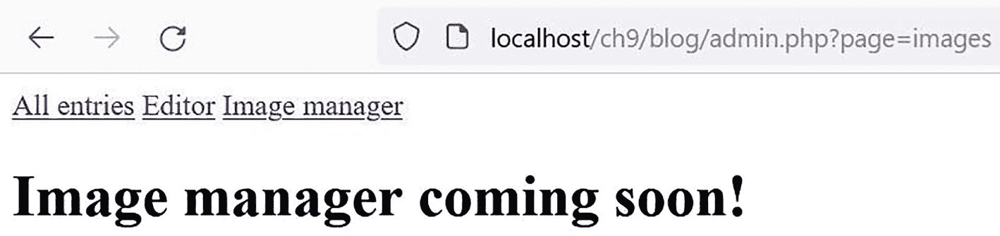

网页（`admin.php?page=images`）的快照显示了“图片管理器即将上线！”这段文字。

**图 9-1** `http://localhost/ch9/blog/admin.php?page=images` 的输出

### 显示用于上传图片的表单

现在我们有了图片管理器控制器脚本，可以创建图片管理器的视图了。让我们从一个基本的 HTML 表单开始，我们最终可以用它来上传图片。

```
图片上传

$uploadMessage

";
?>
```

**代码清单 9-5** `images-html.php`

我们可以看到，`views` 代码已经预留了一个占位符，用于向用户显示上传消息。默认的上传消息是*上传一张新图片*。很快，系统就会让我们的用户知道上传是否成功。请记住，为了允许用户上传图片等文件，我们需要一个 HTML 表单。我们必须使用 HTTP 方法 `POST`，并且必须显式声明表单的编码类型，以允许文件上传。我们必须将表单的 `enctype` 设置为 `multipart/form-data`，这样既能接受文件，也能接受普通的 URL 编码表单数据。如前所述，带有 `type=file` 的 `<input>` 元素会从操作系统调出文件窗口；这允许用户浏览本地计算机以选择要上传的文件。`accept` 属性已设置为仅允许 JPEG 图像。

请记住，客户端验证可以提高可用性，但不能提高安全性。在文件窗口中，文件类型可以更改为“所有文件”。我们还应该预料到，恶意用户会绕过任何客户端验证。为了保护我们的系统免受攻击，我们还将实现服务器端验证。我们很快会添加这个功能。但首先，让我们更新图片管理器控制器，以便显示上传表单。

```
代码清单 9-6
newimages.com
```

现在，我们可以将浏览器指向 `http://localhost/ch9/blog/newadmin.php?page=newimages`，以确认表单确实在浏览器中显示了。

> **注**  
> 以下文件已更新，以访问新的图片控制器：`newadmin.php`、`new-admin-navigation.php`。

### 快速回顾 `$_FILES` 超全局数组

我们在第 4 章学习了 `$_FILES` 超全局变量，但在继续之前，复习一下它的功能可能会有所帮助。每当通过 HTML 表单上传文件时，该文件会存储在临时内存中，关于该文件的信息会通过 `$_FILES` 超全局数组传递出去。该数组包含关于所上传文件的几个重要方面。

```
Array (
    [image-data] => Array (
        [name] => alberte-lea.jpg
        [type] => image/jpeg
        [tmp_name] => /Applications/XAMPP/xamppfiles/temp/phpYPcBjK
        [error] => 0
        [size] => 119090
    )
)
```

名称（name）和类型（type）不言自明。`tmp_name` 是文件上传后的临时文件名。如果文件太大（根据 `php.ini` 中的设置），则此项会被设置为 `"none"`。错误代码为 0 或 `UPLOAD_ERR_OK` 表示文件上传成功。文件大小（size）以字节为单位。

`image-data` 这个名字是从哪里来的？

```
// 来自 views/admin/images-html.php 的一段代码

```


## 排版后的文本

答案是我们提供了它！`image-data`之所以存在，是因为文件选择器窗口的 `name` 属性。如果我们查看 `views/admin/images-html.php` 中的代码，就会发现它是在文件输入中设置的。

我们离上传图片只差一两行代码。我们需要做的就是在服务器上保存文件数据。文件数据已经上传并临时保存在 `$_FILES` 中的 `image-data` 数组内的 `tmp_name` 下。要获取文件数据，我们只需编写类似于以下几行的代码：

```
//先不要在任何地方写这段代码
$fileData = $_FILES['image-data']['tmp_name'];
```

与其每次需要时都重新发明解决方案，不如编写一个可重用的上传类。这样，我们可以在许多项目中复用上传代码而无需修改。回想一下，我们在第 4 章中已经编写了一个 `Uploader` 类。让我们从 `ch4/classes/ImagesUploader.class.php` 复制 `Uploader` 类，并将其保存到 `ch9/blog/models/Uploader.class.php`。或者，我们也可以从出版社网站下载该类。让我们还将 `checkImageFile.php` 程序（用于上传器）从 `ch4/views/CheckImageFile.php` 复制到 `ch9/blog/views/CheckImageFile.php`。我们也可以从出版社网站复制这个文件。

### 上传图片

要使用 `Uploader` 类上传图片，我们首先在 `ch9/blog` 文件夹下直接创建一个新的图片文件夹（`imgs`）。

当图片管理器上传表单提交时，代码将尝试上传指定的文件。提交表单是一种用户交互，因此代码属于控制器。我们将从 `ch4/views/imagesUpload.php` 复制代码，只需稍作修改。复用经过充分测试且成功使用的代码总是合乎逻辑的。

```
$uploader = new ImagesUploader( "image-data" );
$uploader->saveIn("imgs");
$fileUploaded = $uploader->save();
if ( $fileUploaded ) {
$out = "新图片已上传";
} else {
throw new Exception("错误：文件未上传到 Imgs 文件夹");
}
return $out;
}
$imageSubmitted = isset( $_POST['new-image'] );
//如果上传表单已提交
if ( $imageSubmitted ) {
$info = upload();
}
else {
include_once "views/admin/newest-images-html.php";
}
?>
清单 9-7
newestimages.php
```

```
$uploader = new ImagesUploader( "image-data" );
$uploader->saveIn("imgs");
$fileUploaded = $uploader->save();
if ( $fileUploaded ) {
$out = "新图片已上传";
} else {
$out = "文件未上传到 Imgs 文件夹。请检查文件大小和类型。");
}
return $out;
}
```

来自第 4 章的上传函数保持不变，除了显示消息的更改。该方法使用 `Uploader` 类来设置图片的存储位置。然后调用 `Uploader` 类的 `save()` 方法来尝试保存图片。如果上传成功与否，会显示相应的消息。

```
if ( $imageSubmitted ) {
$info = upload();
}
else {
include_once "views/admin/newest-images-html.php";
}
```

仅当从 `newest-images-html.php` 页面选择了图片时，才会调用该函数。如果未选择图片，则会显示该页面以允许用户选择文件。

```
keyValue = $key;
$this->filename = $_FILES[$key]['name'];
$this->fileData = $_FILES[$key]['tmp_name'];
}
public function saveIn( $folder ) {
$this->destination = $folder;
}
public function save(){
$variableName = $this->keyValue;
$tmp = $_FILES[$this->keyValue]['tmp_name'];
$folderIsWriteAble = is_writable( $this->destination );
$notValid = checkImageFile($tmp, $variableName);
if ( !$notValid and $folderIsWriteAble) {
$name = "$this->destination/$this->filename";
$success = move_uploaded_file( $this->fileData, $name );
} else {
$success = false;
}
return $success;
}
}
?>
清单 9-8
Uploader.class.php
```

`Uploader` 类与第 4 章中的相同。不过，值得回顾一下用于验证用户尝试上传的文件的代码。

```
$folderIsWriteAble = is_writable( $this->destination );
$notValid = checkImageFile($tmp, $variableName);
if ( !$notValid and $folderIsWriteAble) {
$name = "$this->destination/$this->filename";
$success = move_uploaded_file( $this->fileData, $name );
} else {
$success = false;
}
```

检查文件夹以确保其可写。调用 `checkimagefile.php` 中的 `checkImageFile()` 函数来验证文件。如果有效，文件将存储在 `imgs` 文件夹中。如果移动成功，`$success` 设置为 `true`；如果移动不成功或文件无效，则设置为 `false`。

```
 'jpg');
$max_Size  = 40 * 1024 * 1024;
//  40MB 必须小于或等于 php.ini 中的设置
$errorStatus = false;
if(!isset($_FILES[$variableName]) ) {
// 错误：$_FILE 不存在
$errorStatus = true;
} else {
$info = finfo_open(FILEINFO_MIME_TYPE);
if (!$info) {
// 错误：无法使用 MIME 类型打开 finfo
$errorStatus = true;
} else {
$mime_type = finfo_file($info, $tmpName);
if (!in_array($mime_type, array_keys($valid_File_Types))) {
// 错误：无效的文件类型
$errorStatus = true;
} else {
if (filesize($_FILES[$variableName]['tmp_name']) > $max_Size) {
// 错误：文件大小过大
$errorStatus = true;
}
finfo_close($info);
}
}
}
return $errorStatus;
}
?>
清单 9-9
checkImageFile.php
```

该函数将检查文件是否存在（`if(!isset($_FILES[$variableName])`）以及 MIME 信息是否可访问（`$info = finfo_open(FILEINFO_MIME_TYPE);`）。如果存在，它将检查有效的文件类型（`if (!in_array($mime_type, array_keys($valid_File_Types)))`）以及文件是否未超过最大文件大小（`if (filesize($_FILES[$variableName]['tmp_name']) > $max_Size) {`）。如果任何测试失败，`$errorStatus` 将设置为 `true`；否则设置为 `false`。此状态随后返回给 `Uploader` 类。我们可以通过在浏览器中输入 `http://localhost/ch9/blog/newestadmin.php` 并选择“图片管理器”菜单项，然后选择要上传的文件来测试上传过程。此时最常见的错误与文件夹权限有关。如果目标文件夹受写保护，PHP 将无法保存上传的文件。因此，如果我们无法上传文件，必须将 `img` 文件夹的权限更改为“读取和写入”模式。

## 练习

1. 我们可以进一步改进错误消息。我们可以检查错误代码（参见第 4 章提供的列表）并为其提供自定义错误消息。要完成此任务，您需要学习如何触发这些错误并向用户显示有意义的错误消息。
2. 如果我们能在上传前检查名称冲突，这将是一个重大改进。系统是否应该抛出异常并提示用户在上传前重命名图片？或者我们甚至可以通过更改上传表单来允许用户通过表单重命名图片？

### 显示图片

我们现在有一个允许上传图片的图片管理器。博客管理员应该能够看到所有可用的图片，并在博客条目中使用其中任意一张。我们可以重用第 4 章的代码，并做了一些修改，以满足大部分需求。

以下附加文件已从第 4 章和第 8 章复制并重命名，以便开始显示上传的图片。每个文件都经过调整，以使用重命名后的附加文件。建议您使用编辑者网站上的文件，以避免任何逻辑错误。

| 原始名称 | 新名称 | 位置（从->到） |
| --- | --- | --- |


`ImagesUploader.class.php` | `Uploader.class.php` | `ch4 classes -> models` |
`gallery.php` | `gallery.php` | `ch4 views -> views/admin` |
`searchedblog.php` | `blog.php` | `ch8 controller-> controllers` |
`searchedcomments.php` | `comments.php` | `ch8 controller->controller` |
`searched.php` | `searched.php` | `ch8 controller->controller` |
`searched-comment-form-html.php` | `comment-form-html.php` | `ch8 views-> views` |
`searched-comments-html.php` | `comments-html.php` | `ch8 views-> views` |
`searched-entry-html.php` | `entry-html.php` | `ch8 views-> views` |
`searched-form-html.php` | `form-html.php` | `ch8 views-> views` |
`searched-results-html.php` | `results-html.php` | `ch8 views-> views` |

现在让我们回顾一下位于 `views/admin` 目录下的 `gallery.php` 文件内容。

```php
<?php
function showImages() {
    $out = "<div id='gallery'>\n";
    $out .= "<h2>Images Gallery</h2>";
    $out .= "";
    $totalSize = 0;
    $numberOfImages = 0;
    $dir_name = "imgs";
    chdir($dir_name);
    $images = glob("*.jpg");
    foreach($images as $image) {
        if((filesize($image) < 50000) && (getimagesize($image) )) {
            $out .= ' ';
            $totalSize += filesize($image);
            $numberOfImages++;
        }
        if (($numberOfImages % 2) == 0) {
            $out .= "";
        }
    }
    $out .= "";
    return $out;
}
$info = showImages();
?>
```

*代码清单 9-10：`gallery.php`*

与原始第 4 章的 gallery 程序相比，仅需做一个微小改动。我们稍后将查看这项改动。但首先，让我们看看 `showimages()` 实现了什么功能。函数 `showImages()` 使用 CSS 来格式化图片的容器。它为尺寸要求设置了默认值，并使用 `glob` 从 `img` 文件夹中获取图片。然后，如果图片尺寸合适，它会使用 CSS 格式化图片，并每行显示两张图片。

```php
$out .= '';
```

唯一的改动是增加了 `alt` 和 `title` 属性值。现在，管理员可以将鼠标悬停在图片上，以查看其文件名。这将会很有用，因为管理员很快就能选择一张图片与博客关联。

导航功能也已更新，允许管理员选择查看所有图片。

```php
<?php
// Navigation
echo "<ul>
<li><a href='updatedadmin.php?page=entries'>所有条目</a></li>
<li><a href='updatedadmin.php?page=editor'>编辑器</a></li>
<li><a href='updatedadmin.php?page=images'>图片管理器</a></li>
<li><a href='updatedadmin.php?page=gallery'>图片库</a></li>
</ul>";
?>
```

*代码清单 9-11：`updated-admin-navigation.php`*

现在，这个新的导航在 `updatedadmin.php` 中被访问。一旦保存了这些更新，就可以通过在浏览器中加载 `updatedadmin.php` 来测试图片库。当然，`imgs` 文件夹中必须先存在一些图片，它们才会被显示。图片的显示方式与第 4 章相同，唯一区别是增加了工具提示（将鼠标悬停在图片上）来显示图片名称。

**练习**：虽然我们的程序在显示图片方面做得很好，但它没有提供删除功能来移除文件夹中不需要的图片。请为图片管理器添加链接，以便删除每张图片。然后使用 `unlink` 函数从文件夹中移除图片。可以使用以下函数来完成此过程。

```php
if ( $deleteImage ) {
    //获取要删除图片的 src 地址
    $whichImage = $_GET['delete-image'];
    unlink($whichImage);
}
```

你可以格式化一个类似下面的 URL 字符串，供该函数使用。

```html
<a href="updatedadmin.php?page=images&delete-image=img/coffee.jpg">删除</a>
```

看到 URL 变量 `page` 是如何设置为 `images`，另一个 URL 变量 `delete-image` 是如何设置为 `img/coffee.jpg` 了吗？点击这个删除链接将加载 `images` 控制器，然后可以用 `if` 语句来判断是否希望删除图片。提示：将链接放在循环内，这样每张图片都有其自己的删除链接。

#### 在博客条目中使用图片

我们现在可以对编辑器进行更改，允许管理员选择他们想在博客中使用的图片。

```php
<?php
if ( $entryData->title !="" ) {
    $info .= "value='$entryData->title' ";
}
$info .= "pattern='[A-Za-z]{,150}'
      title='标题只能包含字母，不能包含特殊字符。标题为必填项。'
      required />";

$info .= "<br /><label>图片</label><br />";
$info .= "<select name='image'>";

$dir_name = "imgs";
chdir($dir_name);
$images = glob("*.jpg");
$info .="<option value=''";
if ($entryData->image =="") {
    $info .=" selected ";
}
$info .= ">无";

foreach($images as $value) {
    $info .= "<option value='$value'";
    if ($entryData->image == $value) {
        $info .=" selected ";
    }
    $info .= ">$value";
}
$info .= "</select>";
?>
```

*代码清单 9-12：`updated-editor-html.php` 的部分代码*

这段来自 `updated-editor-html.php` 的部分代码展示了一个非常常用的算法：使用 `imgs` 文件夹中的内容来创建 HTML 的 `select` 列表。`glob` 函数创建了一个 `$images` 数组。`foreach` 循环遍历该数组，并将文件名放入 `select` 语句的 `option` 标签中。如果这是一次更新操作，`if` 语句会将 `$entryData->image` 的内容与文件夹中的当前文件名进行比较。如果匹配，则还会将选中的值附加到 `option` 标签上，以高亮显示之前选择的图片。

但等等，`$entryData->image` 是从哪里来的？啊，被你发现了。让我们看看其他一些改动。

首先，我们必须使用 `phpMyAdmin` 向数据库表中添加一列。可以在 `Adobe` 仪表板中找到 `phpMyAdmin`。只需在浏览器中输入 `http://localhost/`。然后点击右侧的菜单项。从左侧菜单中选择数据库（`simple_blog`）。接着选择表（`blog_entry`）。点击 `结构` 菜单选项卡。

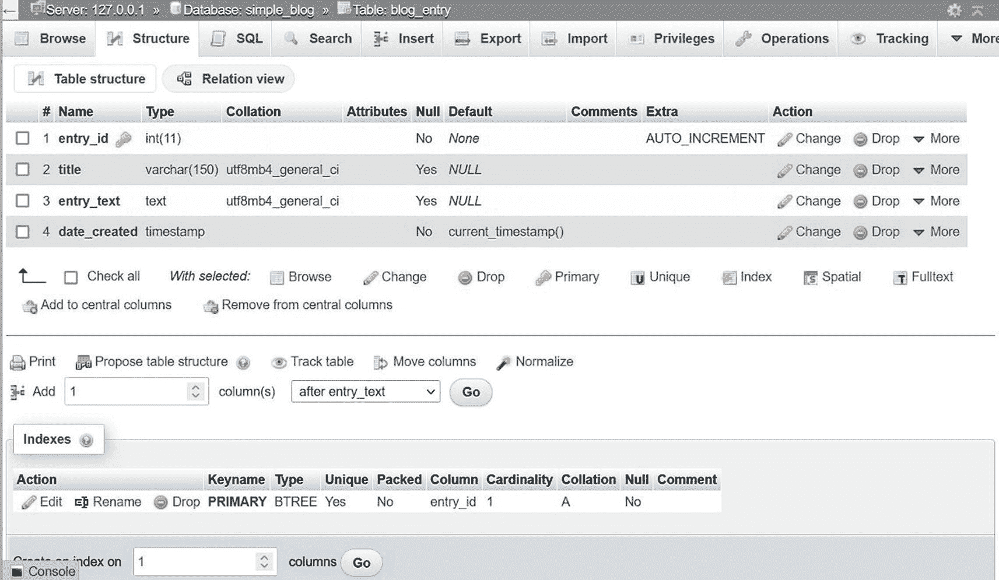

在窗口底部附近有一个 `添加` 区域。在图 9-2 中，它指示将在 `entry_text` 列之后添加一列。点击 `执行` 按钮。

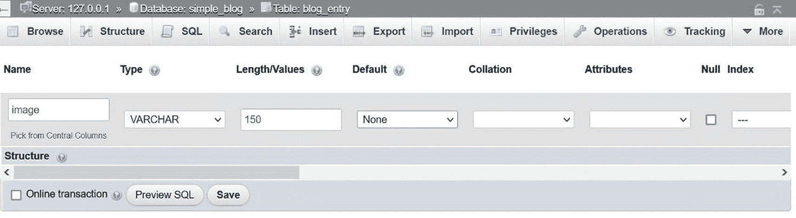

输入前面所示的信息，然后点击 `保存` 按钮。该列现在将被添加到表中。

> **注意**：在本章的示例中，创建了该表的一份副本（`simple_blog1`），其中包含了新列，以保持原始表的完整性。

现在我们已经调整了表结构，需要对这些使用该表的函数进行一些小调整，以便在需要时检索和保存信息。

在博客条目表（现在命名为 `Updated_Blog_Entry_Table.class.php`）中，每个函数都已更新，以访问新添加的列。

```php
public function searchEntry ( $searchTerm ) {
    $sql = "SELECT entry_id, title, image FROM blog_entry
            WHERE title LIKE ?
            OR entry_text LIKE ?";
    $data = array( "%$searchTerm%", "%$searchTerm%" );
    $statement = $this->executeSQL($sql, $data);
    return $statement;
}
```

*代码清单 9-13：`Updated_Blog_Entry_Table.class.php` 的部分代码*

例如，在代码清单 9-13 中，`searchEntry()` 函数已更新，除了返回其他列外，还会返回 `image` 列。一旦包含了这些更新，`select` 列表就会被填充，管理员就可以使用它来创建新条目或更新现有条目。我们现在可以在浏览器中进入 `updatedadmin.php` 程序，点击 `编辑器` 菜单项来测试该功能。


好了，但是我们如何将图片附加到博客的显示中呢？实际上，既然其他所有功能都能正常工作，这项任务就相当直接了。


好的，作为高级文档工程师和翻译员，我将根据您提供的注意事项和示例，将给定的英文文本翻译成中文。


```
Detailed Blog";
//properties available in $entry: entry_id, title, entry_text, image, date_created
$info .= "
$entryData->title";
if((isset($entryData->image)))
{
if(($entryData->image == "None") or ($entryData->image == "")) {
$info .="";
}
else {
$info .= "image' alt='$entryData->image'
style='height: 200px;
width: 250px;
border: 2px solid black;
padding: 5px;
margin: 5px;'/>";
}
}
$info .= "$entryData->date_created
$entryData->entry_text
";
?>
列表 9-14
entry-html.php
```

在`entry-html.php`程序中，我们可以判断博客是否有相关联的图片。如果`$entryData->image`的值是`None`或`""`，则表示管理员没有分配图片。在这种情况下，我们不做任何更改。如果博客确实有关联的图片，它将使用与展示图库相同的`CSS`来显示。通过将代码放在`entry-html`中，用户在点击`Read more`链接后会看到图片。通过在浏览器中输入`index.php`并选择一个带图片的博客来测试这个过程。当然，你可能需要先创建一个！

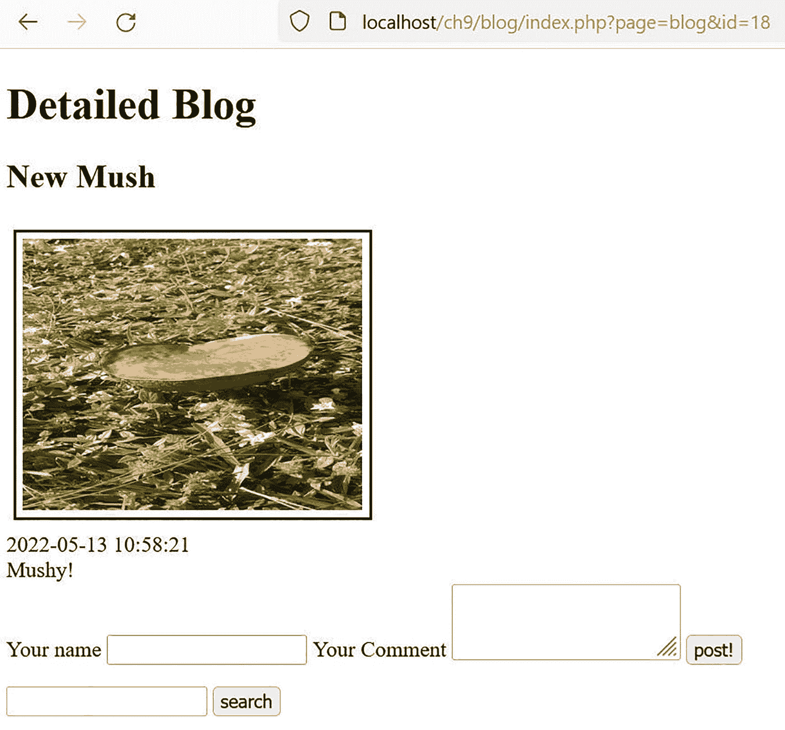

一个网页快照展示了详细博客，一张拍摄于 2022-5-13 10:58:21 的新蘑菇照片。在其下方，要求输入姓名和评论进行发布。

**图 9-5** `entry-html.php`

终于成功了！我们有了一个带图片的博客系统！

**练习**：在`entry-html.php`中，如果没有可用图片，`if`语句不会向`$info`添加任何内容。请编写代码，以便在管理员未选择图片时显示一张默认图片。

## 通过身份验证增强安全性

我们需要做的最后几件事之一是关闭一个大的安全漏洞。我们的管理模块是完全开放的，对所有用户都可用。让我们创建一个过程，要求所有管理员在使用系统之前必须登录。创建此过程需要我们执行以下任务：

*   在`simple_blog`数据库中创建一个管理员表
*   使用密码的单向哈希
*   创建一个用于创建新管理员的 HTML 表单
*   为管理员创建一个登录表单
*   对未授权用户隐藏管理模块
*   使用会话在多个 HTTP 请求之间保持登录状态

## 在数据库中创建管理员表

为我们的站点启用授权管理员，需要我们创建一个表来存储他们的数据。我们将创建一个`admin`表来存储以下管理员信息：

*   `admin_id`：标识管理员的唯一编号
*   `email`：管理员的电子邮件地址
*   `userid`：管理员的用户 ID
*   `password`：管理员的密码

我们将使用 BCRYPT（PHP 8 中的默认哈希算法）对密码进行哈希处理，该算法当前会生成一个 72 字符的字符串。但是，未来的版本会扩展这个字符串。因此，我们将使用`VARCHAR`数据类型创建`password`列，并将输入限制为 255 个字符以备将来扩展。我们还将允许使用`VARCHAR`数据类型、大小为 255 个字符的`userid`。但是，我们将对`userid`和`password`都要求最小长度为八个字符，这将通过 HTML 和 PHP 代码进行验证。

要创建`admin`表，我们将导航到浏览器中的`http://localhost/phpmyadmin`，选择`simple_blog`数据库，然后打开 SQL 选项卡。接着，我们将输入以下命令来创建表。

```
create table admin(
admin_id INT NOT NULL AUTO_INCREMENT,
email TEXT,
userid VARCHAR(72),
password VARCHAR(72),
primary key (admin_id)
)
```

> **注意**：你也可以选择数据库，然后向下滚动到创建表区域并输入表名（`admin`）。然后点击`执行`按钮。系统会提供一个用于填写表中字段的表单。输入与前面脚本中所示相同的信息，点击`保存`按钮后会产生相同的结果。

## 使用 BCRYPT 对密码进行哈希处理

当我们开始向`admin`表插入新用户时，我们将了解如何使用 BCRYPT 对字符串进行哈希处理。BCRYPT 算法提供单向哈希。

对密码进行哈希处理是强安全的绝对要求，因为哈希后的密码更难被盗取。让我们假设密码是`Test`。如果我们使用 BCRYPT 对其进行哈希处理，那么`Test`就变成了：

```
$2y$10$xJN9J3cSlTp25rqS5MNYFepRs5Mkcs0y.zya6MFshLPDllWBTav4S
```

这无疑使得密码极难破解！即使数据库遭受严重攻击，所有用户名和密码都暴露了，攻击者仍然很难滥用这些用户名和密码。

### 单向哈希

密码应始终通过单向哈希来保护。如果密码使用单向哈希算法进行哈希处理，那么几乎不可能确定真实的密码。任何能够恢复丢失密码的系统本质上都是不安全的。如果原始密码可以被恢复，那么系统必定以某种方式记住了密码。如果系统记住了密码，系统管理员很可能也能看到密码。如果密码可见，它就很容易受到攻击。一个安全的系统只存储哈希后的密码。如果有人忘记了密码，安全的系统会提供重置密码的机会。

在博客系统的上下文中，这意味着管理员的密码对所有博客管理员都是受保护的。如果用户丢失了密码，就无法再次发送给他们。相反，系统可以为他们提供重置密码的机会。

### 足够的安全性

始终假设即使是最安全的系统也可能被攻破。问题在于攻击者需要投入多少时间和精力。我们的任务是提供足够的安全性，以阻止攻击者尝试访问数据库内容。

> **注意**：有关使用 PHP 对密码进行哈希处理的更多信息，请访问[`www.php.net/manual/en/function.password-hash.php`](http://www.php.net/manual/en/function.password-hash.php)。

## 在数据库中添加管理员

我们现在有了一个用于保存管理员凭据的数据库表；我们准备好开始创建博客管理员了。第一步是创建一个表单，允许我们输入电子邮件地址、`userid`和相应的密码。完成此操作后，我们将信息存储到数据库中以备后用。

### 构建 HTML 表单

正如我们已经学到的，最好创建能为用户提供反馈的表单。我们可以立即准备好用于用户反馈的表单。让我们来看看代码。

```
创建新的管理员用户
用户 ID

密码

邮箱

$adminFormMessage

";
?>
列表 9-15
new-admin-form-html.php
```

```
用户 ID
```

`userid`设置了最小长度为八个字符，并且是必填项。

```
密码
```

密码设置为必须包含一个数字、一个大写字母、一个小写字母，并且至少八个字符的组合。

```
邮箱
```

电子邮件输入类型将验证电子邮件格式。所有三个输入项也很快会通过 PHP 在服务器端进行验证。

为了显示表单，我们需要一个控制器来加载它并将其返回给前门管理员控制器。我们需要创建一个新的导航项和一个相应的控制器。让我们从向导航中添加一个额外的链接开始。

```
所有条目
编辑器
图片管理器
图片库
创建管理员用户
";
?>
列表 9-16
secure-admin-navigation.php
```

有了表单视图和新的导航项，下一步是创建一个控制器来加载视图。在前面的例子中，请求新页面的新链接的`href`被称为`users`。因此，系统期望有一个名为`users.php`的控制器。

```
列表 9-17
users.php
```

我们现在可以通过在浏览器中加载`http://localhost/ch9/blog/secureadmin.php?page=users`来测试我们的工作。


以下是根据要求翻译的中文内容：


以下文件已更新以访问新版本文件：`secureeditor.php`、`secureimages.php`、`secureentries.php`、`secure-editor-html.php`、`secure-entries-html.php`、`secure-images-html.php`。

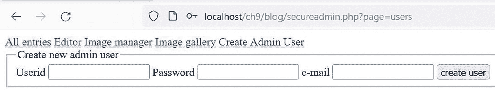

应用程序截图显示了五个导航按钮，从"所有条目"开始，以"创建管理员用户"结束。页面显示了"创建新管理员用户"及其详细信息。

**图 9-6** `new-admin-form-html.php`的输出

我们应该看到一个有效的 HTML 表单。目前我们还不能真正使用它：它无法将新管理员插入数据库表。现在让我们来处理这个问题。

### 在数据库中保存新管理员

向数据库表插入新行是*模型*程序的任务。我们已经多次很好地使用了表数据网关设计模式。我们已经有一个基础的`Table`类，可以扩展它以创建 admin 表的表数据网关。

我们希望避免名称冲突，因此在创建新管理员用户之前，代码应检查电子邮件和/或用户 ID 是否已存在于表中。如果电子邮件和用户 ID 均未被使用，模型脚本可以向 admin 表中插入新条目。我们将创建一个继承`Table`类信息的新文件。

```
validate_password($password)) and ($valid_email) and (strlen($userid) >= 8)) {
//检查电子邮件是否可用
if ($this->checkAvailable( $email, $userid )) {
//使用 BCRYPT 对密码进行哈希
$hashedpassword = password_hash($password, PASSWORD_DEFAULT);
$sql = "INSERT INTO admin ( email, userid, password )
VALUES( ?, ?, ? )";
$data= array( $email, $userid, $hashedpassword );
$this->executeSQL( $sql, $data );  }
else { throw new Exception("电子邮件和/或用户 ID 已被使用。"); }
}
else { throw new Exception("用户 ID 和/或密码无效。"); }
}
private function checkAvailable (string $email, string $userid) : bool {
$sql = "SELECT email FROM admin WHERE email = ? OR userid = ?";
$data = array( $email, $userid );
$this->executeSQL( $sql, $data );
$statement = $this->executeSQL( $sql, $data );
//如果在数据库中找到使用该电子邮件的用户
if ( $statement->rowCount() >= 1 ) {
return false;
} else {
return true;
}
}
private function validate_password(string $password) : bool {
//验证密码强度
$uppercase = preg_match('@[A-Z]@', $password);
$lowercase = preg_match('@[a-z]@', $password);
$number    = preg_match('@[0-9]@', $password);
//不允许特殊字符
$specialCharacters = !(preg_match('@[^\w]@', $password));
$length = strlen($password);
if ((strlen($length >=8)) and ($uppercase) and ($lowercase) and ($number) and ($specialCharacters)) {
return true; }
else {
return false; }
}
}
?>
```

**清单 9-18** `Admin_Table.class.php`

```
$valid_email = filter_var($email, FILTER_VALIDATE_EMAIL);
```

使用 PHP 函数`filter_var()`并传入参数`FILTER_VALIDATE_EMAIL`验证电子邮件，如果电子邮件格式正确则返回 true，否则返回 false。

> **注意：** 有关使用 PHP 函数`filter_var()`的更多信息，请访问[www.php.net/manual/en/filter.examples.validation.php](http://www.php.net/manual/en/filter.examples.validation.php)。

```
if (($this->validate_password($password)) and ($valid_email) and (strlen(userid) >= 8)) {
//检查电子邮件是否可用
if ($this->checkAvailable( $email, $userid )) {
```

密码通过`validate_password()`函数（我们稍后将探讨）进行验证，用户 ID 通过使用 PHP 函数`strlen()`确定其至少包含八个字符来验证。电子邮件已经过验证。此外，通过`checkAvailable()`函数检查数据库表，以查看电子邮件和用户 ID 是否已被使用过。

```
//使用 BCRYPT 对密码进行哈希
$hashedpassword = password_hash($password, PASSWORD_DEFAULT);
$sql = "INSERT INTO admin ( email, userid, password )
VALUES( ?, ?, ? )";
$data= array( $email, $userid, $hashedpassword );
$this->executeSQL( $sql, $data );  }
```

PHP 函数`password_hash()`用于使用`BCRYPT`创建哈希版本，这是 PHP 当前默认的算法。我们本可以直接指定`BCRYPT`；但是，使用默认参数，程序将自动使用可用的最新哈希版本。此时，所有内容均有效且准备就绪。因此，电子邮件、用户 ID 和密码被插入数据库表。

```
else { throw new Exception("电子邮件和/或用户 ID 已被使用。"); }
}
else { throw new Exception("用户 ID 和/或密码无效。"); }
}
```

如果电子邮件和/或用户 ID 已存在于数据库表中，则引发异常。如果用户 ID 和/或密码无效，则引发不同的异常。我们很快将处理这些异常。

```
private function checkAvailable (string $email, string $userid) : bool {
$sql = "SELECT email FROM admin WHERE email = ? OR userid = ?";
$data = array( $email, $userid );
$this->executeSQL( $sql, $data );
$statement = $this->executeSQL( $sql, $data );
//如果在数据库中找到使用该电子邮件的用户
if ( $statement->rowCount() >= 1 ) {
return false;
} else {
return true;
}
```

函数`checkAvailable()`使用`SQL SELECT`语句尝试检索具有匹配电子邮件或用户 ID 的记录。如果其中之一匹配（表现为找到一行或多行），则返回`false`。否则返回`true`。

```
private function validate_password(string $password) : bool {
//验证密码强度
$uppercase = preg_match('@[A-Z]@', $password);
$lowercase = preg_match('@[a-z]@', $password);
$number    = preg_match('@[0-9]@', $password);
//不允许特殊字符
$specialCharacters = !(preg_match('@[^\w]@', $password));
$length = strlen($password);
if (($length >=8) and ($uppercase) and ($lowercase) and ($number) and ($specialCharacters)) {
return true; }
else { return false; }
}
```

函数`validate_password()`使用 PHP 函数`preg_match()`判断密码是否至少包含一个大写字母、一个小写字母和一个数字。出于担心用户可能试图进行 SQL 注入的考虑，它不允许出现特殊字符。如果格式正确且密码长度为 8 个或更多字符，则返回`true`。否则返回`false`。

> **注意：** 有关`preg_match`的更多信息，请访问[www.php.net/manual/en/function.preg-match.php](http://www.php.net/manual/en/function.preg-match.php)。

**练习**：在`create()`函数中，仅检查用户 ID 是否具有八个或更多字符。我们还应对用户 ID 施加哪些其他限制？请更新函数和表单，用这些新限制来验证用户 ID。

前面的代码正等待从控制器调用。这段代码会抛出两个异常。我们现在使用`try-catch`语句来捕获异常。如果操作失败，代码应通过捕获异常并向用户提供相关反馈来优雅地处理失败。让我们回到控制器脚本，修改一些代码以插入新的管理员用户 ID。

```
create( $newEmail, $newUserid, $newPassword );
//告知用户操作结果
$adminFormMessage = "已为 $newEmail 创建新用户！";
} catch ( Exception $e ) {
//如果操作失败，告知用户哪里出了问题
$adminFormMessage = $e->getMessage();
}
}
//新代码结束
include_once "views/admin/new-admin-form-html.php";
?>
```

**清单 9-19** `validusers.php`

这段代码大部分应该看起来很熟悉。不过，我们包含了一个`try/catch`块来处理可能引发的任何异常。HTML 代码通常会捕获输入新用户信息时的无效尝试。但是，我们必须预期黑客可能会试图绕过输入表单。如果引发异常，异常消息将传递给`$adminFormMessage`变量，该变量将显示在创建管理员用户 ID 的表单上。


以下文件已更新以访问新版本：`valideditor.php`、`validimages.php`、`validentries.php`、`valid-editor-html.php`、`valid-entries-html.php`、`valid-images-html.php`。

让我们花些时间进行测试：在浏览器中运行 `http://localhost/ch9/blog/validadmin.php?page=validusers`。尝试创建一个管理员用户。你应该会在表单中看到一条确认消息。在 `http://localhost/phpmyadmin` 中检查该管理员用户是否确实被插入到了管理员数据库表中。你至少需要创建一个用户，因为后续创建其他用户时需要用到它。请务必记下该用户 ID 和密码！

创建完一个新管理员用户后，尝试使用相同的电子邮件地址再创建一个管理员用户。此操作应被禁止，并且你应在表单中收到一条错误消息。
**练习**：尝试创建一个包含特殊字符的密码。当前的 HTML 不会阻止此尝试，但 PHP 代码会捕获它并抛出异常。请调整 HTML 代码，使其在请求发送至服务器之前就捕获该尝试。

## 规划登录功能

现在，让我们使用用户 ID 和密码进行*身份验证*，以限制对博客管理模块的访问。我们需要两个*视图*：一个登录表单和一个退出登录表单。我们还需要一个*控制器*来处理来自这两个视图的用户交互，以及一个*模型*来实际执行登录和退出操作。该模型还应当记住一个状态：它需要记住用户是否已登录。

## 创建登录表单

我们将从登录表单开始。我们的目标是创建一个系统，用户必须提供有效的用户 ID 和匹配的密码才能访问博客管理模块。因此，我们需要一个用户 ID 字段和一个密码字段。

```
登录以访问受限制区域
用户 ID
密码

";
?>
代码清单 9-20
login-form-html.php
```

只需一个非常简单直接的表单即可。我们也可以创建一个简单的控制器来测试逻辑。

```
代码清单 9-21
login.php
```

管理导航中没有为登录提供菜单项，这也不应有。我们希望登录表单作为管理模块前端控制器的默认视图显示。只有当用户通过身份验证并登录后，才允许其看到博客管理模块。

## 对未授权用户隐藏控件

非常重要的一点是，登录功能必须对未授权用户隐藏系统的某些部分。到目前为止，任何访问前端管理控制器的用户都可以轻易访问管理模块。我们将通过进行以下修改来解决这个问题：

- 我们将创建一个 `Admin_User` 对象来记住登录状态。
- 如果访客未登录，我们只显示登录表单。
- 如果用户已登录，我们将显示管理导航和管理模块。

为此，我们需要对管理模块的前端控制器进行一些修改。

```
setTitle("PHP/MySQL 博客演示");
$pageData->setCss("");
include_once "models/updatedatabase.php";
include_once "models/Admin_User.class.php";
$admin = new Admin_User();
//加载登录控制器，它将显示登录表单
include_once "controllers/admin/login.php";
$pageData->setContent($info);
//添加一个新的 if 语句
//仅在用户登录时显示管理模块
if( $admin->isLoggedIn() ) {
include "views/admin/login-admin-navigation.php";
$pageData->setContent($nav);
$navigationIsClicked = isset( $_GET['page'] );
if ($navigationIsClicked ) {
$controller = $_GET['page'];
} else {
$controller = "loginentries";
}
include_once "controllers/admin/$controller.php";
$pageData->appendContent($info);
} //结束 if 语句
include_once "views/page.php";
echo $page;
?>
代码清单 9-22
loginadmin.php
```

```
include_once "models/Admin_User.class.php";
$admin = new Admin_User();
```

引入了一个新的 `Admin_User` 类，并声明了一个实例 `$admin`。该类将判断用户是否已登录。我们稍后会查看其代码。

```
include_once "controllers/admin/login.php";
$pageData->setContent($info);
```

显示登录页面。

```
if( $admin->isLoggedIn() ) {
include "views/admin/login-navigation.php";
$pageData->setContent($nav);
$navigationIsClicked = isset( $_GET['page'] );
if ($navigationIsClicked ) {
$controller = $_GET['page'];
} else {
$controller = "loginentries";
}
```

如果用户已登录，则显示默认的 `entries` 页面或用户选择的页面。代码与之前相同，但现在由 if 语句控制。

## HTTP 是无状态的

超文本传输协议（HTTP）是互联网上大量数据通信的基础。它是*无状态的*，这意味着它将每个新请求视为一个独立的事务。在实际应用中，这意味着每次新请求时，所有的 PHP 变量和对象都会从头开始创建。

这给我们带来了一些影响。当我们提交登录表单时，就是发起了一个 HTTP 请求。PHP 会运行，`$admin` 对象会记住我们已登录。如果我们尝试点击一个条目，这将发起一个新的 HTTP 请求，因此会创建一个新的 `$admin` 对象。PHP 不会记住我们刚刚登录过，因为新的 HTTP 请求被视为一个独立的、分离的事务。之前的 HTTP 请求被完全遗忘。

## 超全局变量：$_SESSION

这种无状态的 HTTP 对我们的登录功能来说是个坏消息。无论我们登录多少次，PHP 都会在每个新请求中将其忘记。这非常不实用，当然，也有解决方案：在请求之间形成持久状态。我们需要一种方法强制 PHP 记住某个特定用户已登录。PHP 的 `session` 可以完成这个任务。

当 PHP 会话启动时，访问用户的浏览器会被分配一个唯一的识别号：一个*会话 ID*。服务器会在服务器端（默认情况下）创建一个小的临时文件。我们应用程序需要在请求之间记住的任何信息都可以存储在这个文件中。PHP 会话的持续时间可以在 `php.ini` 文件中配置。

> **注意**：更多信息请阅读 [`www.php.net/manual/en/intro.session.php`](http://www.php.net/manual/en/intro.session.php)。

PHP 提供了一个超全局变量来创建会话。现在，是时候认识一下 `$_SESSION` 了。

## 使用会话保持状态

要使用会话，我们必须启动一个会话。有了会话之后，我们可以创建一个*会话变量*，这是一个值具有*状态性*的变量，意味着它的值可以在 HTTP 请求之间持久存在。

让我们使用一个会话变量来记住我们的登录状态。

```
<?php
//用于 models/Admin_User.class.php 的完整代码
class Admin_User {
//声明一个新方法，一个构造函数
public function __construct(){
//启动一个会话
session_start();
}
public function isLoggedIn(){
$sessionIsSet = isset( $_SESSION['logged_in'] );
if ( $sessionIsSet ) {
$out = $_SESSION['logged_in'];
} else {
$out = false;
}
return $out;
}
public function login () {
//将会话变量 ['logged_in'] 设置为 true
$_SESSION['logged_in'] = true;
}
public function logout () {
//将会话变量 ['logged_in'] 设置为 false
$_SESSION['logged_in'] = false;
}
}
public function __construct(){
//启动一个会话
session_start();
}
代码清单 9-23
Admin_User.class.php
```

当创建 `Admin_User` 的实例时，构造函数会启动一个会话。

```
public function isLoggedIn(){
$sessionIsSet = isset( $_SESSION['logged_in'] );
if ( $sessionIsSet ) {
$out = $_SESSION['logged_in'];
} else {
$out = false;
}
return $out;
}
```

`isLoggedIn()` 函数判断会话变量是否已创建。如果已创建，则将其内容放入 `$out`。如果未创建（未登录），则将 `false` 存储到 `$out` 中。然后返回 `$out`。


```php
public function login () {
// 将会话变量 ['logged_in'] 设置为 true
$_SESSION['logged_in'] = true;
}
public function logout () {
// 将会话变量 ['logged_in'] 设置为 false
$_SESSION['logged_in'] = false;
}
```

`login()` 函数会将会话变量的内容设置为 `true`。`logout()` 函数会将会话变量的内容设置为 `false`。

## 退出登录

为已登录用户提供退出登录选项是一种惯例，也是一个好主意：我们不想让管理员一直处于登录状态而无法退出。如果管理员需要离开电脑去冲杯咖啡怎么办？我们可不希望管理模块暴露在外。让我们创建一个用于退出登录的新视图。

```
logged in as administrator

";
?>
清单 9-24
logout-form-html.php
```

这个视图应在用户登录时显示。但仅仅显示退出表单并不能真正让用户退出登录。如果用户点击“退出”按钮，这应该运行一个脚本以退出登录。这些是控制器的工作。

让我们更新登录控制器的代码以支持退出登录。

```
login();
}
$loggingOut = isset ( $_POST['logout'] );
if ( $loggingOut ){
$admin->logout();
}
if ( $admin->isLoggedIn() ) {
include_once "views/admin/logout-form-html.php";
} else {
include_once "views/admin/login-form-html.php";
}
?>
清单 9-25
newlogin.php
```

```
$loginFormSubmitted = isset( $_POST['log-in'] );
if( $loginFormSubmitted ) {
$admin->login();
}
```

如果用户是通过登录表单到达这里的，那么 `log-in` 会被设置，代码将调用 `$admin->login()` 函数。

```
$loggingOut = isset ( $_POST['logout'] );
if ( $loggingOut ){
$admin->logout();
}
```

如果用户是通过退出表单到达这里的，那么 `logout` 会被设置，代码将调用 `$admin->logout()` 函数。

```
if ( $admin->isLoggedIn() ) {
include_once "views/admin/logout-form-html.php";
} else {
include_once "views/admin/login-form-html.php";
}
```

如果已登录，则显示退出表单。如果已退出，则显示登录表单。

**注意**

以下文件已更新以访问新版本：`newsessioneditor.php`、`newsessionimages.php`、`newsessionentries.php`、`new-session-editor-html.php`、`new-session-entries-html.php`、`new-session-images-html.php`。

我们现在可以暂时停止编码，测试一下系统。可以在浏览器中打开 `newsessionadmin.php`。系统应跳转到登录界面。一旦输入用户 ID 和密码，将显示 `newsessionadmin.php` 界面。

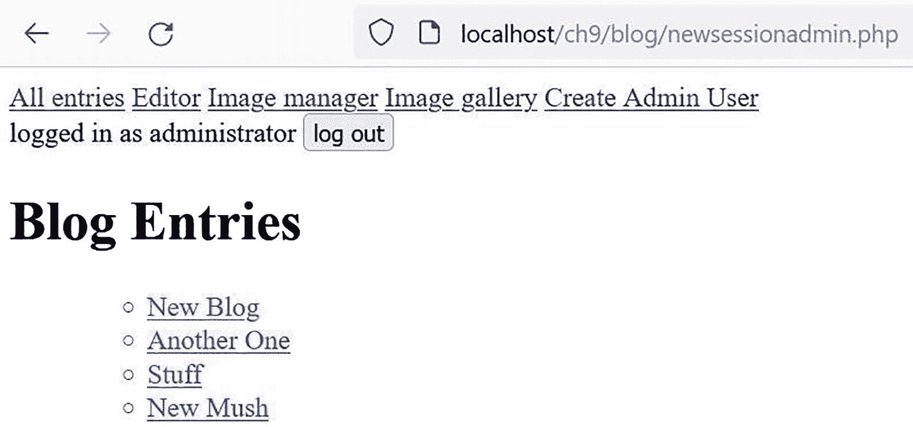

应用程序截图显示五个导航按钮，从 All entries 开始，到 Create admin User 结束。页面显示 Blog Entries 及其四个项目符号。

**图 9-7** 登录后的 `newsessionadmin.php`

我们现在可以看到管理界面，其中显示已登录状态，并且能够退出登录。点击“退出”按钮将退出用户登录并显示登录界面。尝试任意的用户 ID/密码。你是否注意到什么？系统接受任何值。接下来让我们修复这个问题。我们已经涵盖了很多内容，但很快就完成了。请坚持住。现在我们已经能够使用会话变量来确定状态，从而实现登录和退出功能。我们几乎完成了！

## 仅允许授权用户访问

我们现在需要检查提供的用户 ID 和密码是否与数据库中的某一条记录完全匹配。这些信息可在 admin 表中找到，而我们已经有名为 `Admin_Table` 的表数据网关。我们可以创建一个新方法来检查提交的凭据是否有效。

```
// models/admin/New_Admin_Table.class.php 的部分代码
public function checkCredentials( $userid, $password ){
$sql = "SELECT userid, password FROM admin
WHERE userid = ?";
$data = array($userid);
$statement = $this->executeSQL( $sql, $data );
if ( $statement->rowCount() === 1 ) {
$userData = $statement->fetchObject();
if((password_verify( $password, $userData->password))) {
return "Valid";
} else { return "Password not valid!";}
} else { return "Userid not valid"; }
}
$sql = "SELECT userid, password FROM admin
WHERE userid = ?";
清单 9-26
New_Admin_User.class.php
```

该函数尝试匹配 userid，如果存在记录，则从表中检索 userid 和 password。

```
if ( $statement->rowCount() === 1 ) {
if((password_verify( $password, $statement->password)) {
return "Valid";
} else { return "Password not valid!";}
} else { return "Userid not valid"; }
```

如果返回一条记录，则使用 PHP 函数 `password_verify()` 验证密码。不能直接进行比较，因为必须确定哈希算法才能比较值。该函数会检索此信息以及其他进行比较所需的信息。如果比较不匹配，则返回字符串 `"Password not valid"`。如果在数据库中未找到该 userid，则返回字符串 `"Userid not valid!"`。如果一切匹配，则返回字符串 `"Valid"`。

**注意**

有关 PHP 函数 `password_verify()` 的更多信息，请访问 [`www.php.net/manual/en/function.password-verify.php`](http://www.php.net/manual/en/function.password-verify.php)。

声明此方法后，我们可以在用户尝试登录时，从登录控制器调用它。

```
checkCredentials( $userid, $password );
if( $message === "Valid" ) {
$admin->login();
} else {
$loginFormMessage = $message;
}
}
$loggingOut = isset ( $_POST['logout'] );
if ( $loggingOut ){
$admin->logout();
}
if ( $admin->isLoggedIn() ) {
include_once "views/admin/complete-logout-form-html.php";
} else {
include_once "views/admin/complete-login-form-html.php";
}
?>
include_once "models/New_Admin_Table.class.php";
清单 9-27
completelogin.php
```

包含了 Admin_Table 类的最新版本。

```
$loginFormSubmitted = isset( $_POST['log-in'] );
if( $loginFormSubmitted ) {
$userid = $_POST['userid'];
$password = $_POST['password'];
$adminTable = new Admin_Table( $db );
$message = $adminTable->checkCredentials( $userid, $password );
if( $message === "Valid" ) {
$admin->login();
} else {
$loginFormMessage = $message;
}
```

该 `if` 语句确保用户从登录表单点击了登录按钮。如果是，则获取 userid 和 password。然后创建 `Admin_Table` 类的实例 (`$adminTable`)，并将 `$db` 传入构造函数。然后将 userid 和 password 传入新的 `checkCredentials()` 函数。如果返回 `"Valid"`，则一切正常，并调用 `login()` 函数。否则，将返回的消息放入 `$loginFormMessage` 中。登录表单已修改以接受并显示此消息。

```
Login to access restricted area
userid
password

$loginFormMessage";
?>
清单 9-28
complete-login-form-html.php
```

使用的格式与创建 userid 表单中的代码相同。

既然 userid 和 password 可以被验证，让我们对管理前端控制器做一两个最终修改。


```php
setTitle("PHP/MySQL 博客演示");
$pageData->setCss("");
include_once "models/updateddatabase.php";
include_once "models/New_Admin_User.class.php";
$admin = new Admin_User();
include_once "controllers/admin/completelogin.php";
$pageData->setContent($info);
if( $admin->isLoggedIn() ) {
include "views/admin/complete-admin-navigation.php";
$pageData->setContent($nav);
$navigationIsClicked = isset( $_GET['page'] );
if ($navigationIsClicked ) {
$controller = $_GET['page'];
} else {
$controller = "completeentries";
}
include_once "controllers/admin/$controller.php";
$pageData->appendContent($info);
}
include_once "views/page.php";
echo $page;
}
catch(Exception $e) {
echo "系统繁忙，请稍后再试";
$currentDateTime = date('Y-m-d H:i:s');
$errorString = $currentDateTime . "-" . $e->getMessage();
error_log($errorString, 3, "error-log.log");
}
?>
```

**列表 9-29** `completeadmin.php`

已添加 try/catch 块来捕获任何意外错误或异常。在 `catch` 块中，向用户显示一条通用消息。他们无需了解发生的任何细节。我们不希望暴露任何潜在的安全漏洞。

```
$currentDateTime = date('Y-m-d H:i:s');
$errorString = $currentDateTime . "-" . $e->getMessage();
error_log($errorString, 3, "error-log.log");
```

使用 `date()` 函数及所示的格式获取当前时间和日期。然后将此信息追加到一个包含消息的字符串中。接着使用 `error_log()` 函数将该字符串放入错误日志文件中。你可以通过在 `completeadmin.php` 中引发一个 `exception` 来测试此功能，然后在文本编辑器中打开 `error-log.log` 文件，会发现消息已被保存。

**注意：** 有关 PHP 错误日志的更多信息，请访问 [`www.php.net/manual/en/function.error-log.php`](http://www.php.net/manual/en/function.error-log.php)。

使用 try/catch 块以及错误日志记录，能够确保系统为实际应用做好充分准备。此时是邀请用户进行 Beta 测试以全面检查系统漏洞和可用性的好时机。以下文件已修改为可访问新版本：`completeeditor.php`、`completeimages.php`、`completeentries.php`、`complete-editor-html.php`、`complete-entries-html.php`、`complete-images-html.php`。现在，我们可以通过将 `completeadmin.php` 放入浏览器中来测试系统的身份验证和所有其他功能，从而完成最终测试。

## 练习

1.  除非你已经这样做，否则在程序发布前，菜单仍需要完善。CSS 文件 `newblog.css` 包含一些可供使用的代码，或者你也可以创建自己的代码。为菜单添加使用新 CSS 的能力。
2.  尝试在不登录的情况下访问系统中的其他文件。某些文件只会显示空白页面；另一些则会显示因文件缺失而引发的异常。虽然程序更安全了，但更好的做法是，每当用户试图访问需要管理员权限的页面时，都会重定向到登录页面。使用 `completeadmin.php` 中的部分代码在每个页面上检查登录状态，如果用户未登录，则将其重定向到登录页面。

## 总结

这一章很长。我们涵盖了很多内容，多到无法在此一一列举。但我们学到的一些最重要的新技能包括：用于隐私保护的单向加密、用于有状态记忆的会话（session），以及有效限制对博客管理模块的访问。我希望你会认同实现一个登录系统是非常有收获的。如前所述，这个博客已准备好进行 Beta 测试。让你的伴侣或朋友来测试一下这个系统。它并不完美，但已接近完善。无论测试者发现什么潜在问题，都要花时间修复它们。请记住，PHP 程序不仅能管理网站。在最后一章中，我们将偏离创建网站的主题，转而探讨如何创建数据仪表盘以及跳棋游戏的逻辑。

## 项目

1.  运用本章及前几章的设计实践，更新第 7 章中的学生注册系统。增加一个要求：用户必须先登录系统才能访问学生记录。
2.  更新博客应用程序，使其具备密码找回功能。程序应要求用户验证其用户 ID 或密码。验证通过后，用户将可以访问修改密码的表单。如果想要更大的挑战，学习 PHP 如何发送电子邮件。让系统向用户发送一封包含临时密码的邮件。然后要求用户在更改密码前输入该临时密码。
3.  更新博客应用程序，使其能够删除系统中未使用的管理员用户 ID。
4.  更新博客应用程序的管理员用户验证系统，将登录尝试次数限制为四次。四次之后，系统应在十分钟内拒绝来自同一用户 ID 的所有尝试。这可以通过创建另一个会话变量来实现，该变量在四次尝试失败后记录上次尝试时间。十分钟后清除该变量。这是 IT 行业中常见的授权要求。

