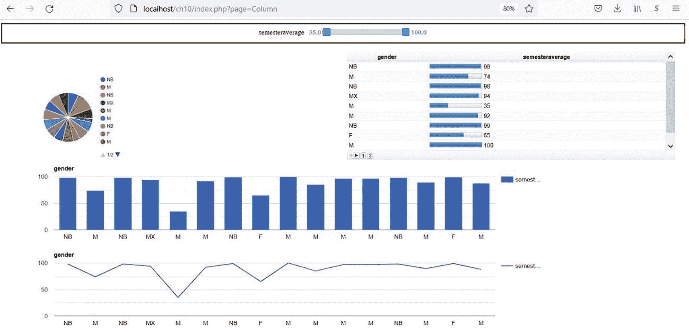

# 10. 数据仪表盘与游戏

## 目标

完成本章后，你将能够：

*   将数据从一种数据类型转换为另一种数据类型
*   使用 PHP 函数 `json_encode()` 创建 JSON 数据
*   使用 PHP 函数 `fputcsv()` 创建 CSV 数据
*   使用 SQL 语句确定数据库名称、表名和列名
*   使用 SQL 语句判断某列的值是否为数字
*   将数据库表转换为 PHP 数组
*   使用 PHP 函数 `fopen()` 读写文件
*   使用 PHP 函数 `fgetcsv()` 将 CSV 文件转换为数组
*   使用 PHP 函数 `file_get_contents()` 一次性检索文件的所有内容
*   使用 PHP 函数 `json_decode()` 将 JSON 文件转换为数组
*   使用开源类 `SIMPLEXLSX` 从 Microsoft Excel 电子表格中读取数据到数组
*   使用 PHP 函数 `explode()` 根据分隔符将字符串拆分为数组
*   使用 PHP 函数 `is_numeric()` 判断一个值是否包含数字
*   使用 PHP 函数 `is_string()` 判断一个值是否为字符串
*   使用 PHP `continue` 语句跳过循环的一次迭代
*   根据 PHP 数组创建 *Google 数据表*（Google Data Table）
*   使用 JavaScript 和 *Google 图表库*（Google Charts Library）创建数据仪表盘
*   使用二维数组创建跳棋游戏的逻辑
*   使用 `switch` 控制结构根据单个变量确定多种结果

在这最后一章中，我们将探讨 PHP 除控制标准网站交互性之外还能完成的其他任务。尽管 PHP 并非以*数据分析*和游戏开发工具而闻名，但我们将证明它完全可以用于此目的。让我们先简要了解一下数据分析，并探索如何显示仪表盘及相关图表。


## 设置数据仪表盘

*数据挖掘*和*数据收集*对于中型和大型企业都至关重要。快速分析数据的能力能对任何公司的利润产生重大影响。公司必须能够利用现有信息（如销售数据）来确定最佳策略，从而获得成功。数据可以从多种来源收集，包括内部、外部（竞争对手）、环境（某个地区经济状况）以及通过政府渠道。合并和对比这些信息的能力至关重要。

Python 编程语言的流行，部分归因于该语言中可用于高效处理和显示数据的库的数量。然而，其他语言也可以使用一些技术来实现类似的目标。其中一个工具是 *Google Charts*。

`Google Charts` 是专门设计用来与 HTML5 网页交互的 JavaScript 类。这为图表与 PHP 交互提供了天然的能力，因为 PHP、HTML 和 JavaScript 协同工作得很好。图表从*数据表*（特殊类型的数组）中检索信息。因此，任何能够将数据显示到数组中的数据源都可以作为 `Google Chart` 的提供者。

我们将构建一个*数据仪表盘*来显示我们的图表。数据仪表盘就是一个以多种格式显示数据的屏幕（网页）。Google 提供了超过 30 种不同类型的*图表*，可以放置在仪表盘中。为了演示使用不同数据源的能力，我们的示例将允许用户决定信息的来源。我们将通过允许从数据库表、*JSON 文件*、*CSV 文件*或 *Microsoft Excel 工作表*中拉取数据来展示这一能力。然后，这些信息将在仪表盘内的多个图表中显示。

在开始任务之前，让我们讨论一些流程。`Google Dashboard` 是使用 `google.visualization.Dashboard Classes` 定义的。`Dashboard` 实例使用一个包含待显示数据的数据表，并将这些数据分发给属于该仪表盘的所有图表。*控件*为用户提供了与数据交互以及更改图表中使用数据子集的能力。这些控件是常见的组件，如选择器、滑块和自动完成器，用户可以轻松操作它们。

现在我们大致了解了仪表盘中可以包含什么，让我们看看实现目标所需的步骤。

- *HTML 仪表盘骨架*：我们将设计一个 HTML 框架，用于定位和容纳要在仪表盘中显示的图表。
- *库文件*：我们必须加载两个 Google 库（一个 *Google AJAX API* 和一个 *Google Visualization Control Package*）来访问仪表盘和图表。
- *数据*：我们将从多个来源检索数据，允许用户选择在仪表盘内显示结果时要使用的数据源。选定的数据将被放入一个二维数组中，该数组将被转换为`Google Data Table`，以便仪表盘内的图表轻松使用。
- *仪表盘*：我们将使用 *Google Dashboard 类*，通过创建它的一个实例（对象）并传递一个对 HTML 中仪表盘位置（div 标签位置）的引用来实现。
- *控件/图表*：我们将创建供用户操作的控件，以及将在仪表盘内显示数据的图表。
- *依赖关系*：我们将把仪表盘和图表绑定在一起，当用户操作控件时，显示的数据会自动更新。
- *显示仪表盘*：我们将绘制仪表盘并将数据传递给仪表盘，数据随后会在图表中显示。
- *编程*：最后，我们将包含额外的编程代码，以便在用户操作控件时更新仪表盘内的图表。

首先，我们需要开发能够检索信息的程序，这取决于用户选择的数据类型。请记住，成功开发程序的关键是不要重复造轮子。我们将使用一些现有的开源代码，使我们的程序尽可能可靠和简单。

### 收集 Microsoft Excel、CSV、JSON 和数据库数据

本章附带的代码包含几个数据文件（`data.csv`、`data.json` 和 `datatest.xlsx`）。提供的 Excel 电子表格用于设计我们测试所用的数据格式和内容。CSV 文件、JSON 文件和数据库表是通过提取电子表格数据并针对每种数据类型重新格式化而创建的。虽然这些程序不会在生产中使用，但它们为我们提供了如何从 Excel 电子表格中检索信息并将其重新格式化为其他数据格式的示例。

```
rows();
$file = fopen("data.csv","w");
foreach ($values as $value) {
fputcsv($file, $value);
}
echo "data.csv created";
fclose($file);
} else {
echo SimpleXLSX::parseError();
}
?>
清单 10-1
createCSV.php
```

使用 PHP 访问 Microsoft Excel 数据的一种流行方法是使用 GitHub 上提供的开源 *SimpleXLSX 类*：[`https://github.com/shuchkin/simplexlsx`](https://github.com/shuchkin/simplexlsx)。

可以从提供的链接下载此类，并在解压缩后将其放置在 `ch10` 文件夹中。在网页位置和类本身的注释中都提供了代码示例。为方便起见，这些文件已包含在出版商网站的 `ch10` 文件夹中。

```
use Shuchkin\SimpleXLSX;
```

该类包含一个*命名空间*（这将确保它不会与其他现有类冲突）。`use` 语句声明，所使用的任何类或函数都将通过命名空间（`Shuchkin`）和类名（`SimpleXLSX`）进行访问。

```
require_once __DIR__.'/simplexlsx-master/src/SimpleXLSX.php';
```

`require_once` 语句包含了一个 PHP 常量 `__DIR__`，它返回当前目录位置。因此，该类是从当前目录下的 `simplexlsx_master` 源代码（`src`）目录中导入的。

```
if ( $xlsx = SimpleXLSX::parse('testdata.xlsx') ) {
$values = $xlsx->rows();
```

`SimpleXLSX` 类的 `parse()` 方法将从 Excel 电子表格中检索所有数据。这些数据包含的内容不仅仅是单元格中的值。由于我们只使用存储在单元格中的值，我们可以使用 `SimpleXLSX` 函数 `rows()` 来检索所有行的数据。该函数创建一个仅包含数据的二维数组，我们将其命名为 `$values`。

```
$file = fopen("data.csv","w");
foreach ($values as $value) {
fputcsv($file, $value);
}
echo "data.csv created";
fclose($file);
```

使用 PHP 函数 `fopen()`，我们可以创建一个新文件（`data.csv`）并声明我们要写入（`w`）该文件。`foreach` 循环现在将遍历 `$values` 数组中的每个数据项。PHP 函数 `fputcsv()` 将以逗号分隔的格式将信息传递到文件中。最后，一旦所有信息都写入完毕，使用 `fclose()` 关闭文件。我们仅用了几行代码就改变了数据的格式！

**注意**

访问 [`www.php.net/manual/en/function.fopen.php`](https://www.php.net/manual/en/function.fopen.php) 获取关于 `fopen()` 的更多信息。访问 [`www.php.net/manual/en/function.fputcsv.php`](https://www.php.net/manual/en/function.fputcsv.php) 获取关于 `fputcsv()` 的更多信息。

```
rows());
file_put_contents("data.json", $netJSON);
echo "data.json created";
} else {
echo SimpleXLSX::parseError();
}
?>
清单 10-2
createJSON.php
```

```
$netJSON = json_encode($xlsx->rows());
file_put_contents("data.json", $netJSON);
```


创建 *JSON 文件*的逻辑与之前的逻辑类似。不过，为了转换数据，我们使用了 PHP 函数 `json_encode()`。一旦数据被转换为 JSON 格式，我们就可以使用 PHP 函数 `file_put_contents()` 将 JSON 格式数据的完整内容复制到一个文件中。相当快速且高效！

**注意**

关于 `file_put_contents()` 的更多信息，请访问 [`www.php.net/manual/en/function.file-put-contents`](http://www.php.net/manual/en/function.file-put-contents)。

```
$rows();
foreach($rows as $row) {
if($row[0]=="Last Name") {
continue;
}
$lastname = $row[0]; $firstname = $row[1]; $gender = $row[2]; $assignmentaverage = $row[3];
$discussionaverage = $row[4]; $researchaverage = $row[5];
$semesteraverage = $row[6]; $semestergrade = $row[7];
$entrySQL = "INSERT INTO student_data( lastname, firstname, gender, assignmentaverage, discussionaverage,
researchaverage, semesteraverage, semestergrade) VALUES ( ?, ?, ?, ?, ?, ?, ?, ?)";
$formData = array($lastname, $firstname, $gender, $assignmentaverage, $discussionaverage, $researchaverage,
$semesteraverage, $semestergrade);
$statement = $db->prepare( $entrySQL );
$statement->execute( $formData );
}
echo "Database studentresults, database table student_data populated";
} else {
echo SimpleXLSX::parseError();
}
?>
Listing 10-3
populateDatabase.php
```

这个程序的大部分逻辑现在应该看起来很熟悉了，因为程序使用与之前相同的逻辑从 Excel 电子表格中检索数据。然后，它打开数据库并将信息插入到数据库表中。

**注意**

为了使用不同的数据集，需要根据新格式修改此程序中的代码。为了填充用于测试的数据库表，你可以将此程序与章节文件提供的电子表格数据结合使用。不过，首先你需要使用 *phpMyAdmin* 创建数据库和表。在 `student_data` 表（位于 `studentresults` 数据库中）中应创建以下字段：`studentindex (auto increment) lastname (varchar), firstname (varchar), gender (varchar), assignmentaverage (float), discussionaverage (float), researchaverage (float), semesteraverage (float), semestergrade (varchar)`。

现在我们有四种类型的测试数据可用于填充图表！我们已经准备好进入下一步了！

但在我们查看更多代码之前，需要先确定程序的逻辑。让我们考虑一下用户向我们提供必要信息所需的步骤，以及创建仪表盘和图表的流程。

- *选择文件格式*：数据库、Excel 电子表格、JSON 或 CSV。
- *如果选择了数据库*：确定要使用的数据库以及该数据库中的表。
- *如果选择了 Excel 电子表格*：选择要使用的电子表格。
- *如果选择了 JSON*：选择要使用的 JSON 文件。
- *如果选择了 CSV*：选择要使用的逗号分隔文件。
- *对于任何选择*：确定要使用的数值列和一个附加列。必须有一列是数值型的，用于填充滑块控件以显示选定的数据子集。
- *对于任何选择*：检索选定的列（数组）并将其格式化为 Google Data Table，以便仪表盘和图表访问。
- *显示图表*：创建图表包装器，绑定数据，并绘制仪表盘和图表（我们之前提到的步骤）。

我们还将使用前几章开发的基本 MVC 逻辑。这包括使用第 9 章的 `Page_data.class.php` 模型来组织我们的程序流程。我们只对该类进行微小的修改，使其仅接受与仪表盘程序相关的信息。要查看这些修改，请从出版商网站复制本章的文件。然后在浏览器中打开该文件。接下来我们将创建另一个模型来检索数据。我们还将创建任何必要的控制器和视图来完成应用程序的设计。

### 创建模型数据类

从程序所需的任务列表中，许多任务都需要能够访问所选数据。这些任务都属于一个模型类，该类将包含从请求的数据源（数据库、电子表格、JSON 文件、CSV 文件）返回请求数据的函数。让我们看看每个任务所需的函数。所有函数都将放在 `accessData.class.php` 文件中。

首先，让我们看看在选择数据库数据时所需的函数。

```
function returnDatabases() {
$user = 'root';
$password = '';
$dbInfo = "mysql:host=localhost";
$pdo = new PDO($dbInfo, $user, $password);
$stmt = $pdo->query('SHOW DATABASES');
$databases = $stmt->fetchAll(PDO::FETCH_COLUMN);
$data = "";
foreach($databases as $database){
if(($database=="information_schema" or $database=="mysql" or
$database=="performance_schema" or $database=="phpmyadmin"))
{ continue; }
$data .= "$database";
}
$data .= "";
return $data;
}
Listing 10-4
Function returnDatabases from accessData.class.php
```

函数 `returnDatabases()` 创建一个数据库下拉列表。

```
$pdo = new PDO($dbInfo, $user, $password);
$stmt = $pdo->query('SHOW DATABASES');
$databases = $stmt->fetchAll(PDO::FETCH_COLUMN);
```

使用提供的位置（`localhost`）、用户 ID（`root`）和密码（`""`）打开 MySQL/MariaDB 数据库管理系统。然后执行 SQL 命令 `SHOW DATABASES` 以返回数据库及相关信息。由于我们只想要数据库名称，因此使用 `PDO` 函数 `fetchAll()` 并带参数 `FETCH_COLUMN` 来创建一个数组（`$databases`）。

```
foreach($databases as $database){
if(($database=="information_schema" or $database=="mysql" or
$database=="performance_schema" or $database=="phpmyadmin"))
{ continue; }
$data .= "$database";
}
```

我们将使用 `continue` 命令跳过任何由 MySQL/MariaDB 填充的标准数据库，该命令会跳过循环的一次迭代。

选择数据库后，我们需要从所选数据库中选择一个表来获取图表信息。

```
function returnDatabaseTables($database){
$user = 'root';
$password = '';
$dbInfo = "mysql:host=localhost;dbname=$database";
$pdo = new PDO( $dbInfo, $user, $password );
$stmt = $pdo->query('SHOW TABLES');
$tables = $stmt->fetchAll(PDO::FETCH_COLUMN);
$data = "";
$data .= "";
foreach($tables as $table){
$data .= "$table";
}
$data .= "";
return $data;
}
Listing 10-5
Function returnDatabaseTables from accessData.class.php
```

```
$pdo = new PDO( $dbInfo, $user, $password );
$stmt = $pdo->query('SHOW TABLES');
$tables = $stmt->fetchAll(PDO::FETCH_COLUMN);
$data = "";
```

首先，我们通过创建一个新的 PDO 对象（`$pdo`）来打开对数据库的访问。然后，我们提交 SQL 查询 `SHOW TABLES` 来检索数据库中的所有表信息。我们使用带 `FETCH_COLUMN` 参数的 `fetchAll()` 函数来创建一个表名数组（`$tables`）。我们将数据库名保存在一个隐藏变量中，以便在下个调用的函数中使用。

```
foreach($tables as $table){
$data .= "$table";
}
```

我们使用一个 `foreach` 循环创建一个包含所有表名的下拉列表。接下来，我们需要检索所选表中的列名。


```php
function returnDatabaseTitles($database, $table, $title, $flag=false) {
// $flag == false - 所有列，== true - 仅数值列
$user = 'root';
$password = '';
$dbInfo = "mysql:host=localhost;dbname=$database";
$pdo = new PDO( $dbInfo, $user, $password );
$sqlstring = "select * from " . $table . " limit 1";
$result = $pdo->query($sqlstring);
$data = "";
$data .= "";
$data .= "";
$data .= "";
$fields = array_keys($result->fetch(PDO::FETCH_ASSOC));
$column_count = 0;
foreach($fields as $column) {
if($column_count == 0) {
$column_count = 1;
continue;
}
if($flag==true) {
$meta = $result->getColumnMeta($column_count);
if($meta["native_type"]=="VAR_STRING") {
// 假定仅字符串或数值
$column_count++;
continue;
}
}
$data .= "$column";
$column_count++;
} //foreach
$data .= "";
return $data;
}
```
**清单 10-6** `accessData.class.php` 中的 `returnDatabaseTitles` 函数

```php
function returnDatabaseTitles($database, $table, $title, $flag=false) {
```

该函数调用接受四个参数。如果未传递 `$flag` 参数，则其被设置为默认值（`false`）。

```php
$pdo = new PDO( $dbInfo, $user, $password );
$sqlstring = "select * from " . $table . " limit 1";
$result = $pdo->query($sqlstring);
```

接下来，我们连接到数据库表。然后执行一条 SQL 命令，仅检索数据库中指定表的第一行。这也会检索关于该表的其他信息，包括列名。

```php
$fields = array_keys($result->fetch(PDO::FETCH_ASSOC));
```

`PDO fetch()` 函数配合 `FETCH_ASSOC` 参数，会创建一个包含表信息（包括列名）的关联数组。PHP 函数 `array_keys()` 会创建一个仅包含键名（不包括值）的数组。这些键名就是实际的列名。这些列名存储在数组 `$fields` 中。

```php
if($column_count == 0) {
$column_count = 1;
continue;
}
```

第一列包含自动编号的 id 字段，我们的数据中不需要它。因此，它会递增计数器并跳过当前循环迭代的剩余部分。

```php
if($flag==true) {
$meta = $result->getColumnMeta($column_count);
if($meta["native_type"]=="VAR_STRING") {
// 假定仅字符串或数值
$column_count++;
continue;
}}
```

用户将选择两列，一列为数值型，另一列可以是任意类型。此函数接受一个参数（`$flag`），用于指示函数调用是仅返回数值列（`$flag==true`）还是返回所有列（`$flag==false`）。如果仅返回数值列，则检索当前列的*元数据*并存入 `$meta`。所创建的关联数组包含一个键 `"native_type"`，它提供了数据库表中该列设置的数据类型。如果该值为 `"VAR_STRING"`，则跳过该列，递增计数器，并进入下一列。

```php
$data .= "$column";
$column_count++;
```

如果标志为 `true` 且我们找到了一个数值列，或者标志为 `false`，则为当前列在下拉列表中创建一个条目。现在我们已经能够选择列了。让我们来检索这些列的数据。

```php
function returnDatabaseData($database, $table, $row, $column){
$user = 'root';
$password = '';
$dbInfo = "mysql:host=localhost;dbname=$database";
$pdo = new PDO( $dbInfo, $user, $password );
$sqlString = "SELECT " . $row . " , " . $column . " From " . $table;
$results = $pdo->prepare($sqlString);
$results->execute();
$result = $results->fetchAll();
return $result;
}
```
**清单 10-7** `accessData.class.php` 中的 `returnDatabaseData` 函数

希望到此时这个清单在逻辑上已经清晰。它类似于我们在前几章展示的内容。

**练习**: 函数 `returnDatabaseData()` 和 `returnDatabaseTitles()` 没有使用预处理语句。虽然在这种情况下可能相当安全，但请修改两个函数以使用预处理语句，从而提供最佳的安全性。

现在我们已经能够检索数据库数据，让我们来看看如何检索 Microsoft Excel 数据。我们假设在一个 *Excel 工作簿*中只有一个工作表。我们还假设列标题在工作表的第一行。

```php
function returnExcelTitles($file, $title, $title_Name, $flag=false) {
//$flag==true 仅返回数值，$flag==false 返回所有
if ( $xlsx = SimpleXLSX::parse($file) ) {
$rows = $xlsx->rows();
$data = "";
$data .= "";
$data .= "";
$data .= "";
$count = 0;
foreach($rows[0] as $column) {
if($flag==true) {
if(is_string($rows[1][$count])) {
//假定值为数值或字符串 $count++;
continue;
}
}
$value = $count . ',' . $column;
$data .= "$column";
$count++;
}
$data .="";
return $data;
} else {
echo SimpleXLSX::parseError();
}
}
```
**清单 10-8** `accessData.class.php` 中的 `returnExcelTitles` 函数

该函数的大部分逻辑与数据库函数相似，只有少数例外。

```php
if ( $xlsx = SimpleXLSX::parse($file) ) {
$rows = $xlsx->rows(); }
```

Excel 电子表格使用 `SimpleXLSX` 类进行解析。`parse()` 函数返回一个包含电子表格及其相关信息的标准对象。`rows()` 函数会仅从该对象中检索数据并创建一个数组（`$rows`）。

```php
foreach($rows[0] as $column) {
if($flag==true) {
if(is_string($rows[1][$count])) {
//假定值为数值或字符串
$count++;
continue;
}}
```

`foreach` 循环仅查看第一行（包含列标题）。如果 `$flag` 为 `true`（仅检索数值列），PHP 函数 `is_string()` 会查看下一行（实际数据的第一行）中的同一列，以确定它是否为字符串。如果是，则跳过该列。

```php
$data = "";
$data .= "";
$data .= "";
$data .= "";
$count++;
```

如果标志等于 `true` 且该列为数值列，或者标志为 `false`，则将数值标题（已传递给函数）、标题（列）名以及文件名保存在隐藏变量中，以备将来使用。列名被放入下拉框。然后递增计数器。

```php
} else {
echo SimpleXLSX::parseError();
}
```

如果解析电子表格时出现问题，则会显示解析错误。

**练习**: 在函数 `returnExcelTitles()` 中，不要直接输出错误，而是使用 `try/catch` 来抛出并捕获错误。同时，调整其他需要 `try/catch` 来捕获问题的程序。

现在我们已经确定了列；让我们来检索列中的实际数据。

```php
function returnExcelData($file, $row, $col) {
if ( $xlsx = SimpleXLSX::parse($file) ) {
$rows = $xlsx->rows();
$i = 0;
foreach($rows as $column) {
$results[$i][0] = $column[$row];
$results[$i][1] = $column[$col];
$i++;
}
return $results;
} else {
echo SimpleXLSX::parseError();
}
}
```
**清单 10-9** `accessData.class.php` 中的 `returnExcelData` 函数

```php
$i = 0;
foreach($rows as $column) {
$results[$i][0] = $column[$row];
$results[$i][1] = $column[$col];
$i++;
}
```

与之前的示例相比，代码中唯一实际的改变发生在 `foreach` 循环内部。要检索的第一列在 `$row` 中，要检索的第二列在 `$col` 中。列信息被放入 `$results` 数组中并返回。`$row` 和 `$col` 的值将在用户选择他们要使用的列时设置。

接下来让我们转到 *CSV 文件*以及访问其列名和列数据的能力。

```php
function returnCSVTitles($file, $title, $title_Name, $flag=false) {
//$flag==true 仅返回数值，$flag==false 返回所有
$file_to_read = fopen($file, 'r');
if($file_to_read !== FALSE){
$data ="";
$data .= "";
$data .= "";
$data .= "";
$info = fgetcsv($file_to_read, 1000, ',');
$info2 = fgetcsv($file_to_read, 1000, ',');
for($i = 0; $i $info[$i]";
}
$data .= "";
fclose($file_to_read);
return $data;
}
}
```
**清单 10-10** `accessData.class.php` 中的 `returnCSVTitles` 函数


整体逻辑相同，但与之前的示例存在若干差异。

```
$file_to_read = fopen($file, 'r');
if($file_to_read !== FALSE){
```

CSV 文件将使用 PHP 函数 `fopen()` 打开。参数 `r` 表示以*读取模式*打开。现在我们拥有一个访问文件数据的渠道。如果文件成功打开，我们将读取列标题。

```
$info = fgetcsv($file_to_read, 1000, ',');
$info2 = fgetcsv($file_to_read, 1000, ',');
```

我们将获取两行信息（最多 1000 个字符）。`fgetcsv()` 会创建一个数组，以逗号作为分隔符，决定数组中每列的值。`$info` 将包含列名（假设列名在第一行）。`$info2` 将包含第一行数据。

```
for($i = 0; $i < count($info); $i++) {
if($flag==true) {
if(!is_numeric($info2[$i])) {
continue;
}
}}
```

如果标志设置为 `true`，我们只需要数值数据。PHP 函数 `is_numeric()` 将检查第二行中的同一列，判断其是否为数值。如果不是数值，则跳过本次循环迭代。

```
$data .= "$info[$i]";
```

如果标志设置为 `true` 且数据为数值，或者标志设置为 `false`，则将当前列名放入下拉列表中。

让我们检索 CSV 数据。

```
function returnCSVData($file, $row, $col) {
$file_to_read = fopen($file, 'r');
if($file_to_read !== FALSE){
$lines = array();
while(!feof($file_to_read) && ($line = fgetcsv($file_to_read)) !== false) {
$lines[] = $line;
}
$i = 0;
foreach($lines as $line) {
$results[$i][0] = $line[$row];
$results[$i][1] = $line[$col];
$i++;
}
return $results;
fclose($file_to_read);
}
}
Listing 10-11
来自 accessData.class.php 的 returnCSVData 函数
```

```
$file_to_read = fopen($file, 'r');
if($file_to_read !== FALSE){
$lines = array();
```

如果文件打开成功，则创建一个空数组 `$lines`。

```
while(!feof($file_to_read) && ($line = fgetcsv($file_to_read)) !== false) {
$lines[] = $line;
}
```

如果未到达文件末尾（`feof`）且能从 CSV 文件读取数据，则将数据放入 `$lines` 数组。`fgetcsv()` 会从当前行创建一个数据数组。该数组实际被添加到 `$lines` 数组中。仅两行代码就做了很多工作！

```
foreach($lines as $line) {
$results[$i][0] = $line[$row];
$results[$i][1] = $line[$col];
$i++;
}
```

然而，我们只需要用户指定的两列，因此我们使用 `$row` 和 `$col` 作为索引来检索每一列，并创建一个只包含这两列的新数组 `$results`。

最后，让我们看一下 JSON 文件的处理过程。

```
function returnJSONTitles($file, $title, $title_Name, $flag=false) {
// 读取 JSON 文件
$json = file_get_contents($file);
// 解码 JSON 文件
$json_data = json_decode($json,true);
$data = "";
$data .= "";
$data .= "";
$data .= "";
// 显示数据
$i = 0;
foreach($json_data[0] as $title) {
if($flag==true) {
if(!is_numeric($json_data[1][$i])) {
$i++;
continue;
}
}
$value = $i . ',' . $title;
$data .= "$title";
$i++;
}
$data .= "";
return $data;
}
Listing 10-12
来自 accessData.class.php 的 returnJSONTitles 函数
```

```
// 读取 JSON 文件
$json = file_get_contents($file);
// 解码 JSON 文件
$json_data = json_decode($json,true);
```

我们将使用 PHP 函数 `file_get_contents()` 一次性获取整个文件，并将其放入 `$json`。然后使用 PHP 函数 `json_decode()` 将 JSON 数据转换为 PHP 数组（`$json_data`）。

```
foreach($json_data[0] as $title) {
if($flag==true) {
if(!is_numeric($json_data[1][$i])) {
$i++;
continue;
}
}
```

我们将遍历第一行数据（存储标题的位置）。如果标志为 `true`，我们将检查第二行（即实际包含数据的第一行）的同一列，判断其是否为非数值。如果不是数值，则跳过本次循环迭代的结果。

```
$data .= "$title";
```

如果标志为 `true` 且数据为数值，或者标志为 `false`，我们将列名保存到下拉框中。

让我们检索实际的 JSON 数据。

```
function returnJSONData($file, $row, $col) {
// 读取 JSON 文件
$json = file_get_contents($file);
// 解码 JSON 文件
$json_data = json_decode($json,true);
$i = 0;
foreach($json_data as $column) {
$results[$i][0] = $column[$row];
$results[$i][1] = $column[$col];
$i++;
}
return $results;
}
}
Listing 10-13
来自 accessData.class.php 的 returnJSONData 函数
```

此代码与上一个示例类似。

```
// 读取 JSON 文件
$json = file_get_contents($file);
// 解码 JSON 文件
$json_data = json_decode($json,true);
```

我们首先将文件的全部内容转储到 `$json` 中。然后使用 `json_decode()` 从 JSON 数据创建一个数组（`$json_data`）。

```
foreach($json_data as $column) {
$results[$i][0] = $column[$row];
$results[$i][1] = $column[$col];
$i++;
}
```

对于 `$json_data` 数组中的每一行数据，我们提取用户请求的两列数据，放入数组 `$result` 中，然后返回该数组。

**练习**：创建一个测试程序，测试 `accessData.class.php` 程序中提供的每个函数。你发现了任何问题吗？如果有，在继续之前请纠正这些问题。

### 创建下拉列表和文件类型视图

让我们创建一些视图来处理我们向用户请求的信息。首先，我们需要请求将要使用的数据类型。我们可以使用简单的单选按钮集合来收集此信息。

```
选择数据文件类型

mySQL/MariaDB 数据库

Microsoft Excel
 JSON - JavaScript 数组

CSV - 逗号分隔

";
?>
Listing 10-14
filetype-form-html.php
```

此表单提供了四种数据文件类型的选择（数据库、Excel、JSON、CSV）。无论用户选择哪个，该值都保存在 `file_type` 名称中，并连同设置为 `filetype` 的 `page` 值一起传回 `index.php` 页面。用户选择数据文件类型后，如果选择 `"Database"`，则必须提供数据库列表，然后是数据库中的表列表，最后是数值列和所有列的列表。如果用户选择其他选项，则在选择要打开的文件后，逻辑将跳转到列出数值列和所有列。

在 `accessData` 类中创建的函数已经创建了下拉列表。我们的表单只需要提供表单信息和提交按钮以及下拉列表。这个过程对于大多数视图是相同的（除了要获取要打开的非数据库文件名）。因此，我们可以创建一个 HTML 视图外壳，它将接受下拉列表代码并围绕它显示一个表单。这将把我们的代码从多个表单减少到只有一个。

```
选择一项 $type"
. $dropdown .
" 
";
?>
Listing 10-15
dropdown-form-html.php
```

代码期望设置两个值（`$type`、`$dropdown`）。`$type` 将描述我们请求的数据类型（`"Database"`、`"Table"`……）。如果缺少任何一个，程序将引发错误。如果提供了这两个值，则表单标签使用 `$type` 值来设置页面参数。`$dropdown` 中的代码显示在请求用户选择的标签和提交按钮之间。一个简单的外壳为我们做了很多工作！

要完成从用户收集信息，我们需要一个表单来选择要打开的任何非数据库文件。

```
选择 $type 数据文件

";
?>
Listing 10-16
file-form-html.php
```


## PHP 仪表盘控制器实现指南

如果设置了`$type`和`$file_type`，则表单会将文件类型选择限制为`$file_type`中的值，并使用`$type`显示打开文件的请求。当信息传递到索引文件时，`$type`也会被传递到页面参数中。我们现在能够向用户请求所有必需的信息。让我们看看主控制器和其他控制器。

### 创建前门控制器和子控制器

前门控制器（`index.php`）的大部分代码看起来应该很熟悉。

```
setTitle("PHP Dashboard demo");
$pageRequested =  isset( $_GET['page'] );
//default controller file_type
$controller = "file_type";
if ($pageRequested ) {
$controller = $_GET['page'];
}
include_once "controllers/$controller.php";
$pageData->setContent($info);
include_once "views/page.php";
echo $page;
?>
Listing 10-17
index.php
```

让我们看看与我们之前的主控制器的一些不同之处。

```
require_once __DIR__.'/simplexlsx-master/src/SimpleXLSX.php';
```

我们将使用开源类`SimpleXLSX`来访问我们的 Excel 文件。因此，我们将从其文件夹位置检索代码。

```
$controller = "file_type";
```

我们的默认程序将是`file_type.php`，它请求用户选择文件类型。

> **注意**：本程序的当前版本要求包含数据的文件与程序位于同一文件夹中。读者可以调整此设置以接受完整路径名。

### 其他控制器

让我们看看其他控制器。一旦选择了文件类型，就会调用文件类型控制器。

```
returnDatabases();
require_once "views/dropdown-form-html.php";
}
else if($file_type == "Excel") {
$type = "Excel";
$file_type = ".xlsx";
require_once "views/file-form-html.php";
}
else if($file_type == "JSON") {
$type = "JSON";
$file_type = ".json";
require_once "views/file-form-html.php";
}
else if($file_type == "CSV") {
$type = "CSV";
$file_type = ".csv";
require_once "views/file-form-html.php";
}
}
?>
Listing 10-18
filetype.php
```

```
$file_type = $_POST['file_type'];
require_once "models/accessData.class.php";
$dataObject =  new accessData();
if($file_type == "Database") {
$type = "Database";
$dropdown = $dataObject->returnDatabases();
require_once "views/dropdown-form-html.php";
}
```

如果`$file_type`已填充，则会创建`accessData()`类的一个实例。如果选择的文件类型是`"Database"`，则`$type`变量设置为`"Database"`，并调用`returnDatabases()`函数，将其传递给`dropdown-form-html.php`，该文件将显示可供选择的数据库。

```
else if($file_type == "Excel") {
$type = "Excel";
$file_type = ".xlsx";
require_once "views/file-form-html.php";
}
```

如果选择了其他任何文件类型，则`$type`变量设置为文件类型，`$file_type`变量设置为所需的文件扩展名，然后在`file-form-html.php`表单中使用该扩展名，要求用户选择指定文件类型的文件。

一旦选择了数据库或文件，每种文件类型（数据库、Excel、JSON、CSV）都需要一个控制器，该控制器将在选择特定文件类型时被调用。让我们看看这些控制器中的每一个。

```
returnDatabaseTables($database);
require_once "views/dropdown-form-html.php";
}
?>
Listing 10-19
Database.php
```

必须设置`columns`变量（包含所选数据库）。如果已设置，则数据库名称被放入`$database`。创建`accessData()`的实例（`$dataObject`）；`$type`变量设置为`"Table"`，然后由`returnDatabaseTables()`函数用于创建下拉列表。然后使用`dropdown-form-html.php`显示，该文件显示所选数据库中的表。

```
returnExcelTitles($file,'','', true);
require_once "views/dropdown-form-html.php";
}
?>
Listing 10-20
Excel.php
```

如果选择了 Excel 作为文件类型，`if`语句将验证是否也选择了 Excel 文件。如果已选择，文件名将被放入`$file`。创建`accessData()`的实例（`$dataObject`）。`$type`设置为`"Numeric_Column"`，将由下拉表单使用。调用`returnExcelTitles()`函数，传入`$file`变量和布尔值`true`。这将导致该函数仅检索数值列名。中间两个参数设置为`""`，因为在此过程中不需要它们。包含数值列下拉列表的表单将显示给用户进行选择。

`JSON.php`和`CSV.php`控制器都使用与`Excel.php`程序类似的逻辑。一旦选择了数值列，则必须选择另一列。所有文件类型都将调用`Numeric_Column.php`控制器来请求另一列。

```
use Shuchkin\SimpleXLSX;
if((isset($_POST['table'])) and (isset($_POST['database']))and (isset($_POST['titles']))){
// database
$columns = $_POST['table'];
$database = $_POST['database'];
$title = $_POST['titles'];
require_once "models/accessData.class.php";
$dataObject =  new accessData();
$type = "Column";
$dropdown = $dataObject->returnDatabaseTitles($database, $columns, $title);
require_once "views/dropdown-form-html.php";
}
Listing 10-21
Partial Listing of Numeric_Column.php
```

如果已选择数据库、表和数值列（由`if`语句确定），则表名、数据库名和数值列被存储在变量中。创建`accessData()`类的实例，`$type`变量设置为`"Column"`，并将此信息传递给`returnDataTitles()`函数。由于没有向第四个参数传递值，函数将设置标志为`false`，以在下拉列表中显示所有列。然后下拉表单将显示列表，供用户选择另一列。

```
else if((isset($_POST['filename'])) and (isset($_POST['all_Columns']))) {
// Excel
$file = $_POST['filename'];
$numeric_Column = $_POST['all_Columns'];
require_once "models/accessData.class.php";
$dataObject =  new accessData();
$type = "Column";
$numeric_Info = explode(",", $numeric_Column);
$dropdown = $dataObject->returnExcelTitles($file,$numeric_Info[0],$numeric_Info[1]);
require_once "views/dropdown-form-html.php";
}
Listing 10-22
Partial Listing of Numeric_Column.php
```

如果选择了 Excel 文件类型，函数将验证是否已选择 Excel 文件以及是否已选择数值列。如果是，则文件名和数值列名被存储在变量中。`$type`变量设置为`"Column"`。从前一次调用此函数检索到的信息将传回列号和列名。PHP 函数`explode()`将通过使用分隔符（`,`）分割字符串来创建一个数组。这将把列号放在数组的零位置，列名放在数组的第一个位置。将文件名、列号和列名传递给函数`returnExcelTitles()`。同样，由于未传递第四个参数，函数将创建一个所有列的下拉列表，并使用`returnExcelTitles()`函数显示。用户现在可以选择另一列。`Numeric_Column.php`文件中 JSON 和 CSV 代码的逻辑与 Excel 逻辑相同。

一旦选择了第二列，程序最终将拥有足够的信息来显示仪表盘。每种文件类型都将调用`Column.php`控制器来完成该过程。


```php
if((isset($_POST['table'])) and (isset($_POST['database'])) and
(isset($_POST['titles'])) and (isset($_POST['title']))){
// 数据库
$columns = $_POST['table'];
$database = $_POST['database'];
$Label = $_POST['titles'];
$RangeLabel = $_POST['title'];
require_once "models/accessData.class.php";
$dataObject =  new accessData();
$Data = $dataObject->returnDatabaseData($database, $columns, $Label, $RangeLabel);
require_once "views/googleDashboard.php";
$info .= displayDashboard($Data, $RangeLabel, $Label);
}
代码清单 10-23
Column.php 部分代码
```

如果数据库、数据表、数值列以及另一列（如 `if` 语句所验证）都已确定，程序即可完成显示仪表盘的流程。这四个值都被存入相应的变量中。创建 `accessData()` 类的实例，然后将所有变量传入 `returndatabaseData()` 函数。该函数将返回一个包含请求信息的两列数组。创建好表格后，引入 `googleDashboard.php` 程序。该程序包含 `displayDashboard()` 函数，该函数将利用数组（`$Data`）和列名（`$Rangelabel`、`$label`）来创建仪表盘。

```php
else if((isset($_POST['filename'])) and (isset($_POST['numeric_Title'])) and ($_POST['all_Columns']) and ($_POST['numeric_Name'])) {
// Excel
$file = $_POST['filename'];
$numeric_Column = $_POST['numeric_Title'];
$numeric_Name = $_POST['numeric_Name'];
$columns = $_POST['all_Columns'];
$columns_Info = explode(',',$columns);
require_once "models/accessData.class.php";
$dataObject =  new accessData();
$Data = $dataObject->returnExcelData($file, $columns_Info[0], $numeric_Column);
require_once "views/googleDashboard.php";
$info .= displayDashboard($Data, $numeric_Name, $columns_Info[1]);
}
代码清单 10-24
Column.php 部分代码
```

如果选择了任何非数据库类型，则使用类似的逻辑来准备显示仪表盘。文件名、数值列名、数值列编号以及另一列的列信息都被存储在变量中。另一列的信息通过 `explode()` 转换为数组。创建 `accessData()` 类的实例。文件名、数值列名和另一列的名称都传入 `returnExcelData()` 函数。该函数将返回一个包含所请求信息的二维数组。然后导入 `Dashboard.php` 文件。调用 `displayDashboard()` 函数，传入数组数据（`$Data`）、数值列的名称以及另一列的名称。这将显示我们的仪表盘。

终于到了显示仪表盘的时候了！用于准备仪表盘的代码是 PHP、HTML 和 JavaScript 的混合体。为了让学习者能够将此示例与其他 Google 仪表盘示例联系起来，我们直接借用了 Google Charts 网站的代码，并做了一些修改。

> **注意**  
> 本练习旨在让我们练习为在图表中显示而准备数据。截止目前，代码实际上并不依赖于使用 Google Charts 来实际显示信息。程序员（您）可以修改此代码，为任何可用的图表工具准备数据。Google Charts 并非为显示大量数据（数千条记录）而设计。实际数据会上传到 Google 网站上的 Google Charts API（应用程序编程接口）中。因此，您不应尝试上传数千条记录，因为这样效率低下。此外，由于数据会被发送到 Google，我们必须考虑安全风险。如果这些数据旨在成为公开信息（或非敏感信息），那么 Google Charts 是一个不错的选择。如果需要保护信息的机密性，则应使用其他应用程序。

```javascript
// 加载可视化 API 和控制包。
google.charts.load('current', {'packages':['corechart', 'controls']});
// 设置一个回调函数，在 Google 可视化 API 加载完成后运行。
google.charts.setOnLoadCallback(drawDashboard);
// 回调函数，用于创建并填充数据表，
// 实例化仪表盘、范围滑块和图表，
// 传入数据并绘制它。
function drawDashboard() {
var data = new google.visualization.DataTable();
// 添加列
data.addColumn('string','" . $Label . "');
data.addColumn('number','" . $RangeLabel . "');
";
代码清单 10-25
googleDashboard.php 部分代码
```

现在，我们可以完成显示仪表盘所需的条件了。首先，我们将导入 Google Charts JavaScript 加载代码，这是一个 *AJAX API*。AJAX 是一种 JavaScript 代码，可在网页内提供信息的异步显示。它允许更新页面的部分内容，而无需重新加载整个网页（就像我们之前一直在做的那样）。这使得程序能够在不影响页面其余部分的情况下更改图表信息。接下来，我们调用 Google 可视化 API，并传入参数以指明哪些项目将使用 AJAX 显示。在本例中，我们包含了图表和控件。每次尝试重新加载页面时，`OnLoadCallback()` 函数都会重新绘制仪表盘。`drawDashboard()` 是一个 JavaScript 函数，它从数组中创建 `DataTable`，并为仪表盘、滑块和图表设置参数。创建 `DataTable`（`data`）的实例。然后是将包含数值列名的 `$RangeLabel` 变量（已传入 PHP 函数 `displayDashBoard()`）作为 `'number'` 列添加到数据表中。另一列的名称（`$Label`）也作为 `'string'` 列传入 PHP 函数。

```php
$info .="data.addRows([";
$count = 0;
foreach($Data as $row) {
if($count == 0) { $count++; continue; }
$info .= "['" . $row[0] . "'," . $row[1] . "],";
$count++;
}
$info .= "]);
// 创建一个仪表盘。
var dashboard = new google.visualization.Dashboard(
document.getElementById('dashboard_div'));
代码清单 10-26
googleDashBoard.php 部分代码
```

定义完列之后，我们使用 PHP 通过从 `$Data` 数组（已传入 PHP 函数）中提取信息来“`addRows`”到数据表中。建立数据表后，我们就可以补全仪表盘、控件和图表的信息。我们创建仪表盘（`dashboard`）的实例，并定义它在网页中的位置（在标识为 `'dashboard_div'` 的 HTML `div` 标签内）。

```javascript
// 创建一个范围滑块，传入一些选项";
$info .="
var donutRangeSlider = new google.visualization.ControlWrapper({
'controlType': 'NumberRangeFilter',
'containerId': 'filter_div',
'options': {
'filterColumnLabel': '" . $RangeLabel . "'
}
});
var pieChart = new google.visualization.ChartWrapper({
'chartType': 'PieChart',
'containerId': 'chart_div',
'options': {
'width': 300,
'height': 300,
'pieSliceText': '" . $Label . "',
'legend': 'right'
}
});
var lineChart = new google.visualization.ChartWrapper({
chartType: 'LineChart',
options: {'title': '". $Label . "'},
containerId: 'vis_div'
});
var columnChart = new google.visualization.ChartWrapper({
chartType: 'ColumnChart',
options: {'title': '" . $Label . "'},
containerId: 'column_div'
});
var tableChart = new google.visualization.ChartWrapper({
chartType: 'Table',
containerId: 'table_div',
options: {
'allowHtml': true,
'page': 'enable',
'width':'48%',
'height':'250px',
'pageSize': 10,
'alternatingRowStyle' : true
}
});
代码清单 10-27
googleDashboard.php 部分代码
```


我们使用*控件包装器*来设置仪表盘中要显示的每个项目。对于*范围滑块*（用户可调整，并会自动调整显示的数据），我们声明了用于容纳滑块的`div`标签（`filter_div`），声明了要使用的实际范围控件（`NumberRangeFilter`），并声明要显示数字列名称。

```javascript
var pieChart = new google.visualization.ChartWrapper({
'chartType': 'PieChart',
'containerId': 'chart_div',
'options': {
'width': 300,
'height': 300,
'pieSliceText': '" . $Label . "',
'legend': 'right'
}
});
```

对于*饼图*，我们有类似的设置，但也包含一些格式设置，例如宽度和高度。显示的标签将是并非专门数字的列名称。*折线图*和*柱状图*具有类似的设置。

```javascript
var tableChart = new google.visualization.ChartWrapper({
chartType: 'Table',
containerId: 'table_div',
options: {
'allowHtml': true,
'page': 'enable',
'width':'48%',
'height':'250px',
'pageSize': 10,
'alternatingRowStyle' : true
}
});
```

*表格图*具有额外的设置，包括显示 HTML 的能力、分页功能（超过十行时）、交替行颜色以及宽度和高度设置。

```javascript
var formatter = new google.visualization.BarFormat({width: 120});
formatter.format(data, 1); // 将格式化器应用于第二列
// 建立依赖关系，声明 'filter' 驱动 'pieChart'，
// 这样饼图将只显示在所选滑块范围内允许通过的条目。
dashboard.bind(donutRangeSlider, [pieChart, tableChart, columnChart, lineChart]);
// 绘制仪表盘。
dashboard.draw(data);
}
```

列表 10-28
googleDashboard.php 的部分清单

现在，我们可以将图表*绑定*到仪表盘。这将导致所有绑定的图表在用户滑动范围条时（通过 AJAX）自动调整。最后，我们可以`draw`（绘制）仪表盘。当然，我们需要一个地方来显示所有的仪表盘信息。

```
";
return $info;
列表 10-29
googleDashboard.php 的部分清单
```

HTML 代码包含用于定义仪表盘、滑块和图表位置的`div`标签。它还包括一些使用 CSS 进行的格式设置。

现在，我们可以从浏览器运行`index.php`，选择数据类型、文件（或数据库和表）以及列。然后，我们的仪表盘就出现了！



两个条形图、饼图和折线图代表仪表盘显示，y 轴反映学期平均分，x 轴是性别。

图 10-1
来自 index.php 的仪表盘显示

看起来不错的仪表盘！可以操作滑块控件。选择不同的列。它非常具有交互性！我们可以做和显示的事情还有很多。然而，对于您可以在 Google 仪表盘中使用的 30 多种图表而言，其格式化逻辑是相似的。

**注意**
有关 Google 图表的更多信息，请访问 [`https://developers.google.com/chart`](https://developers.google.com/chart)。

希望这增加了您对 PHP 除了显示网页之外还能做什么的兴趣。当我们从外部来源接收数据时，它可以有多种格式。在此示例中，我们使用了四种常见格式。有时，我们需要合并数据并消除任何无效数据。虽然我们可以使用 PHP 的众多数组函数之一（数量很多）来合并数据，但使用我们的源数据平台来合并数据会更高效。例如，如果我们的数据全部是 MySQL/MariaDB 的，那么使用 *SQL JOIN 子句* 合并数据将高效得多。

**注意**
有关 SQL JOIN 子句的更多信息，请访问 [`www.w3schools.com/sql/sql_join.asp`](http://www.w3schools.com/sql/sql_join.asp)。

对于多个 Excel 数据源，我们可以使用*合并数据工具*。

**注意**
有关合并 Excel 电子表格的更多信息，请访问 [`https://support.microsoft.com/en-us/office/combine-data-from-multiple-sheets-dd7c7a2a-4648-4dbe-9a11-eedeba1546b4`](https://support.microsoft.com/en-us/office/combine-data-from-multiple-sheets-dd7c7a2a-4648-4dbe-9a11-eedeba1546b4)。

对于混合数据源，我们可以使用开源合并工具，或者使用 PHP 将我们的数据转换为 MySQL/MariaDB 或 Excel 数据，然后使用我们刚刚提到的方法。任何时候我们想要合并数据（即使我们使用另一种编程语言），我们都应该尽可能使用数据管理系统功能。它们高效，并且在许多情况下可以管理大量数据的合并。始终偏向于效率！

**练习**：使用提到的一种技术，合并来自多个来源的数据，然后使用我们的 Google 图表程序显示结果。

最后一点，对于我们想要执行的任何计算（例如创建平均值、中位数和众数），应使用数据管理应用程序中可用的工具来执行所需的数学运算，然后将结果返回到 PHP 程序以在仪表盘中显示。使用这些技术将提高使用 PHP 进行数据分析的性能。

在我们结束最后一章之前，让我们再看一个逻辑示例。

### 创建跳棋游戏的逻辑

在本节中，我们将探讨创建跳棋游戏的逻辑。目的是演示使用数组来完成我们的任务的重要性。希望这个例子能表明理解数组对于成为一名优秀的程序员至关重要。这个练习还将给我们提供一个使用嵌入式 if/then/else 结构和 case 语句的机会。在这个过程中，我们还将发现 PHP 子字符串函数的用法。

此示例将提供几个关于创建和更新表示棋盘二维数组的演示。本示例的目的并非提供完整的运行代码或最高效的代码。更高效的示例将包括使用对象进行递归循环。这对于初学者来说过于高级。一旦您掌握了这个示例（可能需要一段时间才能完全吸收），您可以通过查看互联网上许多关于创建跳棋游戏的示例来扩展您的知识。


这个空棋盘由 8 行 8 列组成，带有二维数组，通过使用黑色和红色来突出显示。

图 10-2
空棋盘

1. 我们下跳棋时做的第一件事是什么？打开盒子，把棋盘放在桌子上。
   这可以直接映射到创建跳棋游戏的第一个逻辑步骤。可以设计一个 `display_board()` 函数来显示初始棋盘。每次用户移动棋子时，都需要重绘棋盘以指示显示内容的变化。因此，每当需要重绘棋盘时，都会调用 `display_board()` 函数。
   由于棋盘上棋子的位置不断变化，需要有一种方法来保存这些变化。从图 10-2 可以看出，棋盘的行和列就像一个二维数组。我们可以使用一个二维数组来表示棋盘及其内容。
   棋盘有八列八行。红色和黑色方格按列和行交替排列。

```
列表 10-30
初始棋盘数组 (checkerarray.php)
```

**注意**
在上图中，红色和黑色方格与下图中的相反。所演示的数组与讨论的图像相关。


## 排版后内容

一旦如上所示创建了数组，`display_board()` 函数就可以遍历该数组，通过一系列嵌入的 `if` 语句或 `switch` 语句来显示正确的棋盘及颜色组合。尽管 `switch` 语句已在第 5 章中讨论过，但我们此前尚未有机会演示它。下面的例子展示了 `switch` 语句如何使代码逻辑更易于理解。

```
Listing 10-31
display_board 函数 (display_board.php)
```

基本结构会遍历数组中的每个位置，确定所需的颜色，然后显示该颜色。由于创建实际棋盘图像的方法有很多种，此处的代码留给读者自行决定。

我们可以创建一个二维表格来容纳每个方格。然后，可以使用通过 HTML 设计的颜色块来创建这些方格，也可以为每个位置插入小图像。

**练习**：决定你希望如何显示红色和白色方格，并向 `switch` 结构中添加代码以显示棋盘。

2.  玩家将棋盘摆放在桌上后，棋子便会被放置在各自正确的位置上。在应用程序中，这可以通过用棋子替换数组中的位置来实现。


一个摆满棋子的二维棋盘，由 8 行 8 列组成，棋盘上使用了红色和黑色方格。

**图 10-3** 摆有棋子的棋盘

程序员可以选择在游戏开始时棋子已经摆在棋盘上，或者要求用户表明他们已准备好开始游戏（例如点击一个 `'start game'` 按钮）。我们假定玩家必须表明他们想要开始一局游戏（或开始一局新游戏）。

每次点击 `'start game'` 按钮时，都可以执行一个 `start_game()` 函数。该函数通过更新包含棋盘的数组，将棋子放置在正确的位置，然后调用 `display_board()` 函数来显示带有棋子的棋盘。正如我们所知或从上图中可以看到的，所有棋子都放在黑色方格上。对于白棋来说，第一行的棋子位于奇数位置，第二行在偶数位置（假设零为偶数），第三行又是奇数位置。红棋则相反。

```
Listing 10-32
start_game 函数 (start_game.php)
```

外层的 `for` 循环（包含 `$I`）控制行。然后，初始的 `if` 语句使用 `$I` 来判断该行是否为偶数（同样假设零为偶数）。如果该行是偶数且不是空行（第 4 行），则会调用 `$J for` 循环。此循环从第 1 列开始（因为在第 0 行的第 0 列不放置棋子），并在棋盘上的每个黑色方格中放置一个红色或白色棋子。如果是第 6 行，则放置一个 `"red checker"`。如果是其他任何行，则放置一个 `"white checker"`。

**建议**：要么使用一个棋盘，要么在纸上画一个棋盘，并跟随这些示例的逻辑进行演练。

> **注意**  
> 此示例不会清除 `"blank"` 行中已有的任何棋子。这可以通过对涉及的两行进行循环编码，并将每个可用位置设置为 `"black"` 来实现。

`if` 语句的 `else` 部分处理奇数行。逻辑相同，只是 `$I` 从 0 开始而不是从 1 开始。此外，如果该行是第 1 行，则在该位置放置一个 `"white checker"`。否则，放置一个 `"red checker"`。它会跳过第三行空行。执行 `start_game()` 函数后，数组将包含以下内容。

```
Listing 10-33
执行开始游戏函数后的棋盘数组 (game_start_array.php)
```

我们需要对 `display_board()` 函数做一些修改，以处理棋子的添加。

```
Listing 10-34
显示棋盘函数版本 2 (display_board_version2.php)
```

我们添加了 `case` 过程来处理现在数组中存在的白色和红色棋子。当 `start_game()` 函数调用此 `display_board()` 函数时，棋盘将显示棋子位于正确的位置。

3.  现在是时候让我们的其中一位玩家移动棋子了。我们只关注尝试移动一个棋子，而不考虑可能影响移动的其他所有因素。我们始终可以在确定了基本移动规则后，再向现有函数中添加功能。

棋盘顶部

```
x     w     x          w     x
w     x     start     x     w
x     a     x         b     x
```

使用上面的示意图，遵循跳棋规则，如果我们想移动 `'start'` 白色棋子（尚未成王），它只能移动到位置 `'a'` 或 `'b'`。所有其他位置都是无效的。注意，位置 `'a'` 比 `'start'` 多一行。同样注意，位置 `'b'` 比 `'start'` 多一行。

因此，有效移动的一部分是只移动到下一行（我们暂不考虑跳跃）。`'a'` 的列比 `'start'` 的列少一。`'b'` 的列比 `'start'` 的列多一。这表明，如果移动到的列比原始列少一或多一，也是一个有效移动。尝试这个逻辑，你会发现这对于从棋盘顶部向底部移动的所有步骤都成立（直到它成为王）。

```
X       a      x          b      x
w      x      start      x      w
x      w      x          w      x
```

棋盘底部

如果我们想移动一个 `'start'` 红色棋子，它会向相反方向移动。有效移动由位置 `'a'` 和 `'b'` 指示。注意，有效的列再次比 `'start'` 的列多一或少一。唯一的区别是行数将比 `'start'` 的行数少一。而对于白色 `'start'` 棋子，则是多一行。

为了确定有效移动，我们需要收集即将移动的棋子的原始位置（行，列）以及用户尝试将棋子移动到的位置。然后，我们需要进行上面几段中描述的比较。

> **注意**  
> 我们可以通过为棋盘上的每个位置创建对象来完成上述信息收集。但是，为了尽可能简化此示例，我们将使用不同的技术。

如果棋盘上的每个黑色方格都是一个按钮，而每个红色方格只是一个图像，我们就消除了对用户尝试跳到红色方格甚至跳到棋盘之外的担忧。我们只需关注已经讨论过的限制条件即可。

每个黑色按钮实际上都会执行相同的代码，只有一个例外——将其位置保存在 `$checker_board()` 数组中。

我们可以从任何按钮调用一个函数，并将该按钮在数组中的位置传递进去。

```
make_move(3, 3);
```

每个按钮可以将其在数组中的行和列传递到 `make_move()` 函数中。然后，`make_move()` 函数将判断这是第一次点击（选择棋子）还是第二次点击（指示棋子将移动到的位置）。

```
Listing 10-35
移动函数 (make_move.php)
```

`make_move()` 函数必须判断它是第一次点击还是第二次点击。如果是第一次点击，`$first_click` 标志被设置为 `true`。然后，传入函数的行和列被保存到 `$first_row` 和 `$first_column` 中。第一次点击只需做这些。如果是第二次点击，则将 `$first_click` 设置回 `false`，行和列的值被保存在 `$second_row` 和 `$second_column` 中，然后这四个行和列的值被传递到一个 `valid_move()` 函数中。

```
Listing 10-36
有效移动函数（If 语句） (valid_move.php)
```


```markdown

`valid_move()`函数必须判断正在移动的是何种棋子以确定移动方向。如果是白色棋子，则从上往下移动。同时必须确保第二次点击的区域为空（`"black"`格子）。第二行必须比第一行多一行。第二列必须比第一列多一列或少一列。如果条件成立，`"white checker"`会被放入数组中第二次点击的位置。第一次点击的位置则被改为空（`"black"`格子）。

```
} else {
If ( ($checker_board[$first_row] [$first_column] ==  "red checker") &&
($checker_board[$second_row] [$second_column] ==  "black"))
{
If(($second_row - $first_row == -1) &&   (($second_column - $first_column == 1) ||
($second_column - $first_column == -1))) {
$checker_board[$second_row][$second_column] = "red checker";
$checker_board[$first_row][$first_column] = "black";
}
} // if both if statements fail it is not a valid move
}
display_board();
}
```

清单 10-37 部分有效移动函数（`else`语句）（`valid_move_with_else.php`）

如果移动的是红色棋子且第二次点击的区域为空（`"black"`格子），`valid_move()`函数会判断选择的第二行是否比第一行少一行。同时也会判断列是否比第一列多一列或少一列。如果条件为`true`，则将`"red checker"`移动到数组中第二次点击的位置。第一次点击的位置被设为空（`"black"`格子）。

如果发生以下任一情况，该函数将不会执行移动：

*   第一次点击选择了空格。
*   第二次点击选择了已占用的格子。
*   第二次点击没有选择正确的移动格子。

如果移动未执行，用户可以重试，因为`$first_click`标志已被设为`false`。无论是否发生移动，棋盘都会重新显示（`display_board()`）。如果移动发生了，`display_board()`函数会显示这些变化。

4. 现在我们来考虑棋子变成`'King'`的过程。这发生在红色棋子到达第 0 行或白色棋子到达第 7 行时。我们可以在`valid_move()`函数中添加一些`if`语句来判断这种情况。此外，王棋可以向前或向后移动，但仍需遵守其他规则。

```
清单 10-38
有效移动函数版本 2（if 语句）（valid_move_version_2.php）
```

与其分别检查白色棋子、白王或红王以允许向下移动，更简洁的做法是检查所有非红色棋子的对象。只有红色棋子不能向下移动。然而，在检查第 7 行以确定是否需要加冕时，我们还需要确保第 7 行的是白色棋子。我们既不能给红色棋子加冕，也无需给白王或红王加冕！如果不是在给白色棋子加冕，那么我们就是在将白色棋子、白王或红王移动到一个新位置。由于我们不知道移动的是什么，可以直接取第一次点击位置的值并将其复制到第二次点击位置。这样就能移动正确的对象。

```
} } else {
If ( ($checker_board[$first_row] [$first_column] !=  "white checker") &&
($checker_board[$second_row] [$second_column] ==  "black"))
{
If(($second_row - $first_row == -1) &&
(($second_column - $first_column == 1) ||
($second_column - $first_column == -1))) {
If((second_row == 0) &&
($checker_board[$first_row] [$first_column] == "red checker"))  {
$checker_board[$second_row][$second_column] =
"red king";
} else {
$checker_board[$second_row] [$second_column] =
$checker_board[$first_row] [$first_column];
} // else
$checker_board[$first_row] [$first_column] = "black";
} // end if $second_column - $first_column == -1
} // not white checker - if both if statements fail it is not a valid move
}
display_board();
}
```

清单 10-39 部分有效移动函数版本 2（`else`语句）（`valid_move_version_2_with_else.php`）

对于向上移动，只有白色棋子受到限制。如果红色棋子到达第 0 行，它将成为`"red king"`。既然我们已经实现了向下移动，还需要对`display_board()`函数进行调整，使其能够显示`"red king"`和`"white king"`。

```
清单 10-40
显示棋盘函数版本 3（display_board_version_3.php）
```

如你所见，只需要为`"white king"`和`"red king"`添加两个额外的`case`语句即可。

5. 当然，除非能跳过对手棋子并将其从棋盘上移除，否则无法赢得比赛。

```
} // end if $second_column - $first_column == -1
} // not white checker - if both if statements fail it’s not a valid move
}
display_board();
}
```

在`valid_move()`函数中，如果代码流程落到了最后两个花括号之间，则说明这不是一次有效的移动。然而，这可能是一次有效的跳吃。

```
}
} else { // not white checker, could it be a jump?
valid_jump(($first_row, $first_column, $second_row, $second_column);
}
}
display_board();
}
```

与其在`valid_move()`函数中添加更多代码，不如创建一个`valid_jump()`函数，并在没有有效移动时调用它。

棋盘顶部

```
W      x      w      x          w      x      w
X      w      x      start      x      w      x
W      x      ar     x          br     x      w
X      a      x      w          x      b      x
```

白色棋子`'start'`的两个有效跳吃位置是`'a'`或`'b'`。另外需要关注的是，`'ar'`或`'br'`位置（被跳过的棋子所在的位置）必须存在一个红色棋子或红王。如果存在王棋，根据某些跳棋规则，这可能不是一次有效的跳吃。然而，我们这里假定它是有效的。

从逻辑上讲，这与移动过程大部分相似。以此例来看，对于白色棋子，一次有效跳吃的行数比原始行数多两行。有效跳吃的列数比原始列数少两列或多两列。如果棋子跳到了`'a'`，我们还需要检查比`'a'`位置少一行且多一列的位置，以确定是否存在红色棋子或红王。如果棋子跳到了`'b'`，我们需要检查比`'b'`位置少一行且少一列的位置，以确定是否存在红色棋子或红王。如果跳吃有效，`'start'`位置变为空格，`'ar'`（或`'br'`）位置变为空格，而`'a'`位置或`'b'`位置将包含执行跳吃的棋子。

```
function 
清单 10-41
部分有效跳吃函数（右侧）（valid_jump.php）
```

这是一大段代码。请花时间仔细分解它，尝试理解这里讨论的逻辑。查看这段代码的一半，其逻辑顺序如下：

1.  如果棋子不是红色，它可以向下跳吃。跳吃到的位置也必须是空的（`"black"`）。
2.  如果跳吃的位置比原始位置多两行且多两列，则尝试的是棋盘右侧的跳吃。（左侧跳吃见第 7 点。）

```


3.  如果跳棋棋子没有跳过空（`“black”`）格子，并且没有跳过己方棋子，那么这是一个有效跳跃。代码通过检查前三个字符来匹配`“red”`或`“white”`，以区分普通棋子和王棋。

4.  跳跃的棋子是否落在第 7 行？如果是，且该棋子为白色，则将其升变为王。如果不是，则将棋子从第一个位置移动到第二个位置。

5.  将第一个位置设置为空（`"black"`）。

6.  将被跳过的位置设置为黑色。

7.  棋子是否向左跳了两列？如果是，则表示它试图在棋盘左侧进行跳跃。

8.  如果被跳过的位置不为空（不是`"black"`）且不是己方棋子类型，则该跳跃有效。

9.  跳跃的棋子是否落在第 7 行？如果是，且该棋子为白色，则将其升变为王。如果不是，则将棋子从第一个位置移动到第二个位置。

10. 将第一个位置设置为空（`"black"`）。

11. 将被跳过的位置设置为黑色。

```
else {
if (($checker_board[$first_row] [$first_column] != "white checker") &&
(checker_board[$second_row] [$second_column] ==  "black")){
if($second_row - $first_row == -2) {
if($second_column - $first_column == 2) {
// 尝试向右跳跃
if((($checker_board[$first_row-1] [$first_column+1] !=
"black") && // 不是跳过空位
(substr(
$checker_board[$first_row-1] [$first_column+1],0,3) !=
substr(
$checker_board[$first_row] [$first_column],0,3))))
// 不是跳过己方棋子
{
if((second_row == 0) &&
($checker_board[$first_row] [$first_column] ==
"red checker"))  {
$checker_board[$second_row] [$second_column] =
"red king";
} else {
$checker_board[$second_row] [$second_column] =
$checker_board[$first_row] [$first_column];
}
$checker_board[$first_row] [$first_column] = "black";
$checker_board[$first_row-1] [$first_column+1] =
"black";
} // 结束非己方且非空跳跃的检查
} // 结束向右跳跃尝试
}
if  ($second_column - $first_column == -2) {
// 尝试向左跳跃
if((($checker_board[$first_row-1] [$first_column-1] !=
"black") &&
// 不是跳过空位
(substr(
$checker_board[$first_row-1] [$first_column-1],0,3) !=
substr(
$checker_board[$first_row] [$first_column],0,3))))
// 不是跳过己方棋子
{
if((second_row == 0) &&
($checker_board[$first_row]  [$first_column] ==
"white checker"))  {
$checker_board[$second_row] [$second_column] =
"white king";
} else {
$checker_board[$second_row] [$second_column] =
$checker_board[$first_row] [$first_column];
}
$checker_board[$first_row] [$first_column] = "black";
$checker_board[$first_row-1] [$first_column-1] = "black";
} // 结束非己方且非空跳跃的检查
} // 结束向左跳跃尝试
} // 结束跳过两行的检查
} // 结束非白色且非空位置的跳跃检查
}
代码清单 10-42
部分有效跳跃函数（左侧）（valid_jump_with_else.php）
```

你以为逻辑就到此为止了？这只是一半的乐趣。主`if`语句的`else`部分负责处理从棋盘底部向顶部的跳跃。逻辑大致相同，只有细微的调整。第二行必须比第一行少两行（而不是多两行）。`display_board()` 函数无需修改即可管理跳跃，因为所有变化仅体现在数组中的元素定位方式上，数组中并未新增元素。正如本示例开头所述，目的是展示数组的必要性，尤其是在游戏行业中。通过对象数组和递归来设计这类应用有更高效的方法。然而，这些技术超出了本书的范畴。

要完成一个国际象棋游戏的编码，还需要添加额外的代码来强制执行以下规则和技巧。尝试设计一些逻辑，看看你的掌握程度如何。记住，互联网上有大量示例可以帮助你成功：


## 计分能力

计分能力必须追踪棋子的数量，并在每颗棋子被移出棋盘时减少计数。当所有对手的棋子都被移除时，玩家获胜。然而，当对手无法进行任何其他移动时，玩家也会获胜。这要求程序能够查看玩家所有可能的走法。因此，需要一种技术来记录每位玩家的获胜次数。

还需要一种技术来防止玩家在非自己回合时尝试移动棋子。

根据跳棋的版本不同，有些版本不允许普通棋子跳跃王棋。有些版本则完全不允许普通棋子跳跃。此处展示的代码允许普通棋子跳跃王棋。

为了实现同一回合内的多次跳跃，需要使用递归技术。根据跳棋的版本不同，玩家在可以跳跃时可能被强制要求跳跃。这需要在玩家选择要移动的棋子后，通过代码判断所有可能的跳跃路径。

## 总结

又长了一章！我们涵盖了很多内容。现在我们知道，可以使用 PHP 通过开源类来访问多种数据类型，并展示仪表盘和图表。我们还开始通过使用数组搭建跳棋游戏来探讨游戏开发的逻辑。是时候结束我们的冒险了。我们希望你学到了很多，并且意识到 PHP 能完成多少事情。我们只是触及了可能性的皮毛。请通过网上免费的教程和视频保持学习进程。祝你好运。你正走在成为优秀程序员的道路上！

## 项目

1.  使用本章及之前章节的设计实践（MVC），完成跳棋游戏的编程和设计。首先测试提供的示例函数并将它们连接起来。逐一攻克各个部分，测试逻辑和代码，然后再处理下一部分。

2.  更新 Google Dashboard 程序，以显示文件类型请求。然后，一旦文件类型被选中，再次显示它，同时显示对用户的下一个要求（数据库名称或文件名）。当用户已选择所有要求时，继续此过程以显示所有下拉列表。允许用户更改选择并重新显示更改后的内容。

3.  研究 PHP 访问其他数据库类型的能力。对 Google Dashboard 程序进行修改，允许用户选择一种数据库类型，然后为所选类型选择可用的数据库。继续该过程，以从新的数据库类型中选择表和列。

