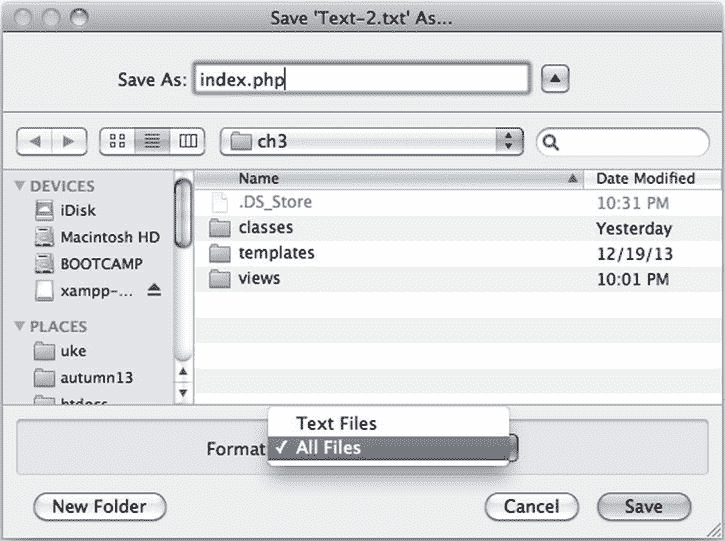

# 三、表单管理

在[第二章](02.html)，我们建立了一个动态的个人作品集网站。在这个过程中，您看到了如何用`<a>`元素对 URL 变量进行编码，以及如何使用`$_GET`超全局变量来访问这些 URL 变量。传递数据是区分动态网页和静态网页的关键。通过根据用户的选择定制体验，您可以为网站增加全新的价值。

现在，您已经了解了一些 PHP 并编写了一个基本的动态站点，您已经准备好深入研究 URL 变量了。HTML `<form>`元素通常用于创建允许用户与动态站点交互的界面。你必须学会如何处理这样的 HTML 表单。在本章中，您将学习以下内容:

*   什么是 HTML 表单以及如何创建它们
*   什么是超全局数组以及如何使用它们
*   如何使用`GET`方法在 HTML 表单中编码 URL 变量
*   如何使用`POST`方法在 HTML 表单中编码 URL 变量
*   如何编写一个动态 PHP 测试
*   何时使用`if-else`条件语句
*   什么是命名函数以及如何编写一个命名函数
*   一部美国西部电影能教会你什么是干净的代码
*   为什么代码真的是诗歌

## 什么是表格？

HTML 表单允许访问者与站点进行交互。图 [3-1](#Fig1) 显示了谷歌的搜索表单。当用户访问 [`www.google.com`](http://www.google.com/) ，在文本输入字段中键入搜索词，并点击谷歌搜索时，谷歌执行搜索。

图 3-1。

Search form from [`www.google.com`](http://www.google.com/)

你一定遇到过的另一种表单是登录表单，注册用户可以通过它登录并进入受限区域。当您登录您的脸书帐户、银行帐户或 Gmail 帐户时，您可能会看到此类表单。图 [3-2](#Fig2) 中的登录名来自脸书。

图 3-2。

Login form from [`www.facebook.com`](http://www.facebook.com/)

最后一个熟悉的例子是星级评定系统。如果你在网上书店买过一本书，你可能会遇到一个星级系统。图 [3-3](#Fig3) 显示了亚马逊的星级评定表。

图 3-3。

Star rating form from [`www.amazon.com`](http://www.amazon.com/)

如果你打算从事网页开发或网页设计，你肯定会从事开发和设计有用的、功能性的表单。因为 web 表单是系统和用户之间的接口，所以开发和设计 web 表单是非常重要的。

## 建立一个新的 PHP 项目

学习需要重复，所以让我们重复上一章学到的一些东西。在`XAMPP/htdocs`文件夹中创建一个名为`ch3`的新项目文件夹。在`ch3`中，你需要来自之前项目的`templates`和`classes`文件夹的副本，以及里面的 PHP 脚本。创建一个名为`views`的空文件夹。打开 Komodo Edit 并在`ch3`中创建新的`index.php`文件。请确保在保存文件时将格式设置为所有文件。图 [3-4](#Fig4) 说明了如何操作。

图 3-4。

Save a new file as `index.php` with Komodo Edit

你需要在`index.php`中安装一些 PHP 来做更多的事情。您可以从输出一个简单的 HTML 页面开始。注意，您应该重用`classes/Page_Data.class.php`和`templates/page.php`，而不需要修改任何一个脚本中的一行代码。当你知道了 PHP，你就不用多次解决同一个任务了。只需解决一次，并对其进行编码以便重用，如下所示:

`<?php`

`//code listing for index.php`

`error_reporting( E_ALL );`

`ini_set( "display_errors", 1 );`

`include_once "classes/Page_Data.class.php";`

`$pageData = new Page_Data();`

`$pageData->title = "Building and processing HTML forms with PHP";`

`$pageData->content = "<nav>will soon show a navigation...</nav>";`

`$pageData->content .= "
...and a form here
";`

`$page = include_once "templates/page.php";`

`echo $page;`

### 亲眼看看

为了检查您输入的内容是否正确，您可以保存`index.php`并在浏览器中导航到 http://localhost/ch3/index.php。

`will soon show a navigation...`

`...and a form here`

没有禅师会拿棍子戳你，但我有几个问题要问你。你的答案将表明你到目前为止学到了什么。如有疑问，可查阅[第 2 章](02.html)进行解释。

*   `include_once`是做什么的？
*   `$pageData->title`如何改变生成的 HTML 页面的`<title>`？
*   `.=`是什么意思？它的专业名称是什么？
*   当我们`echo $page`的时候会发生什么？

### 创建动态导航

您将创建两个不同的表单。您将需要一个站点导航来在这些表单之间导航。创建一个新文件`ch3/views/navigation.php`，如下所示:

`<?php`

`//code listing for views/navigation.php`

`return "`

`<nav>`

`<a href='index.php?page=search'>Search on bing</a>`

`<a href='index.php?page=quiz'>Dynamic quiz</a>`

`</nav>`

`";`

就像在第二章中一样，你创建一个 PHP 脚本，简单地返回一小段 HTML 代码。在`index.php`中，您将使用一些 PHP 将一些小的 HTML 片段拼接在一起，生成一个格式良好的动态 HTML 页面。以下，`index.php`更新显示导航:

`<?php`

`//code listing for index.php`

`error_reporting( E_ALL );`

`ini_set( "display_errors", 1 );`

`include_once "classes/Page_Data.class.php";`

`$pageData = new Page_Data();`

`$pageData->title = "Building and processing HTML forms with PHP";`

`//change this one line below only`

`$pageData->content = include_once "views/navigation.php";`

`$pageData->content .= "
...and a form here
";`

`$page = include_once "templates/page.php";`

`echo $page;`

### 为表单创建页面视图

你可以遵循第 2 章中页面视图的命名约定，因为它似乎为动态网站提供了一个可靠的代码架构。这种组织和命名页面视图的方式可以给你一个构建动态站点的心理框架。当你有了内在的框架，你就会知道你需要哪些文件来开发你想要开发的网站。你不必每次创建一个新的站点都要重新发明一个好的动态代码架构。

上一节描述的导航包含指向名为“搜索”和“测验”的页面的链接。因此，我们必须在`views`文件夹中创建两个新的 PHP 文件。

   
| 超链接 | 可变 url | 视图文件 |
| --- | --- | --- |
| index.php？页面=搜索 | 页面=搜索 | views/search.php |
| index.php？page =测验 | page=测验 | views/quick . PHP |

使用 Komodo Edit 创建两个新文件，如下所示:

`<?php`

`//code listing for views/search.php`

`return "will soon show the search form";`

`<?php`

`//code listing for views/quiz.php`

`return "quiz will go here";`

#### 显示 index.php 的页面浏览量

为了让`index.php`在被请求时显示这些页面视图，您必须额外编写几行代码，这些代码几乎与您在`index.php`中为上一个项目编写的代码相同，如下所示:

`<?php`

`//code listing for ch3/index.php`

`error_reporting( E_ALL );`

`ini_set( "display_errors", 1 );`

`include_once "classes/Page_Data.class.php";`

`$pageData = new Page_Data();`

`$pageData->title = "Building and processing HTML forms with PHP";`

`$pageData->content = include_once "views/navigation.php";`

`//changes begin here`

`//$pageData->content .= "
...and a form here
";`

`$navigationIsClicked = isset($_GET['page']);`

`if ( $navigationIsClicked ) {`

`$fileToLoad = $_GET['page'];`

`} else {`

`$fileToLoad = "search";`

`}`

`$pageData->content .=include_once "views/$fileToLoad.php";`

`//no changes below`

`$page = include_once "templates/page.php";`

`echo $page;`

这段代码实际上是告诉 PHP 加载站点访问者请求的任何视图。如果没有点击导航项目，我们将显示`views/search.php`。您可以通过在浏览器中加载 http://localhost/ch3/index.php 来测试您的代码是否工作。

### 明智地使用时间:惯例和重用

你肯定已经注意到这个动态网站非常像第二章中的动态网站。我们重用了一些文件，比如`Page_Data`类和页面模板。我们不能完全像在第二章中一样重用`index.php`或`navigation.php`，但是这个项目是按照相同的惯例构建的。

重用代码是一个好主意，因为这允许您更快地开发解决方案。如果您有在一个项目中工作的脚本，您可以非常信任它们在其他项目中做同样的事情。因此，代码重用减少了调试时间。

总会有你不容易重用的部分，比如导航。但是如果你养成了在不同的项目中以相同的方式创建动态导航的习惯，你将能够快速而轻松地开发新的动态导航。因此，当您不能按原样重用代码时，也许您可以重用那些支持您知道有效的代码的原则。

## 一个超级简单的搜索表单

HTML 表单是用`<form>`元素创建的。还有许多专门为表单设计的 HTML 元素。也许最重要的是`<input>`元素。让我们在`views/search.php`中创建一个例子，如下:

`<?php`

`return "`

`<form method='get' action='`[`http://www.bing.com/search`](http://www.bing.com/search)

`<input type='text' name='q' />`

`<input type='submit' value='search on bing' />`

`</form>`

`";`

### 尝试您的搜索表单

保存您的工作，将浏览器指向 http://localhost/ch3/index.php 以查看表单。你应该会看到类似图 [3-5](#Fig5) 的东西。

图 3-5。

A simple search form completely unstyled

您可以在文本字段中键入一些搜索词，然后单击按钮。你的浏览器会加载`bing.com`，Bing 会搜索你输入的任何内容。我输入了猫。完成搜索后，查看一下浏览器的地址栏。你会发现类似 [`http://www.bing.com/search?q=cats`](http://www.bing.com/search?q=cats) 的东西。

Tip

一个

<form>就像一个 </form>

当您单击提交按钮时，您的浏览器会请求一个新的 URL。这就像点击一个`<a>`元素。当您单击一个`<a>`元素时，您的浏览器将请求由其`href`属性指示的资源。当您提交表单时，您的浏览器将请求由`<form>`元素的`action`属性指示的资源。

### 表单编码 URL 变量

`<form>`元素的`action`属性是 [`http://www.bing.com/search`](http://www.bing.com/search) ，但是当您提交表单时，您的浏览器请求了 [`http://www.bing.com/search?q=cats`](http://www.bing.com/search?q=cats) 。不知何故，表单将一个名为`q`的 URL 变量编码到请求的 URL 中，并将其值设置为`cats`。这就是表单可以做的:它们可以在 HTTP 请求中编码 URL 变量。

正如你在前一章看到的，URL 变量可以用 PHP 访问。URL 变量对于动态网站来说是必不可少的。显然，如果设置了名为`q`的 URL 变量， [`www.bing.com`](http://www.bing.com/) 将执行搜索。Bing 将寻找`q`拥有的任何价值。

#### Name 属性声明 URL 变量的名称

理解 URL 变量`q`是如何声明的很重要。理解了这一点，你就理解了形式的本质！

URL 变量`q`之所以得名，是因为`<form>`有一个`<input>`元素，其`name`属性设置为 q。如果`<input>`元素嵌套在`<form>`中，你可以推断出具有`name`属性的`<input>`元素将声明一个 URL 变量。这条规则也适用于表单中常用的其他 HTML 元素的一小部分。在本书中，你会看到更多这样的与表单相关的元素。

#### <input>元素和一些常见的类型

您是否注意到`<input type='text' />`显示为单行文本字段，而`<input type='submit'/>`显示为提交按钮？输入`type`属性有许多可能的值。在这本书里，你会看到一些输入类型。一旦你能使用这些，学习如何使用剩下的输入类型应该没有问题。

Note

HTML5 引入了不少新的`<input>`类型，但并不是所有主流浏览器都实现了这些类型。这些新类型中有许多非常有用。在 [`http://caniuse.com/#search=input`](http://caniuse.com/#search=input) 看哪些浏览器实现了哪些功能。

#### 了解方法属性

到目前为止，您只看到了可以在浏览器地址栏的 URL 中看到的 URL 变量。这种 URL 变量使用 HTTP 方法`GET`进行编码。您已经使用这些变量创建了一个动态导航和一个可以在 [`www.bing.com`](http://www.bing.com/) 执行搜索的表单。

任何用`GET`编码的 URL 变量都被限制为相对较少的字符。具体数字因浏览器而异，但有效的最大值似乎是 2000 个字符左右。因为 URL 中的变量是显而易见的，页面可以被书签标记和链接。因此，`GET`变量非常适合站点导航。

## 命名 PHP 函数

也许 PHP 最强大的特性之一是能够在代码中定义和执行函数。函数是在脚本中声明的命名代码块，您可以在以后调用它。您将很快使用函数编写一个动态测验，但是让我们先来看看 PHP 中命名函数的基础知识:

`function functionName () {`

`//function body`

`}`

### 函数的基本语法

函数的基本格式要求您首先在函数名前面使用`function`关键字来声明函数。函数名可以包含任何字母数字字符和下划线，但不能以数字开头。函数名后面必须跟一组括号和一个用花括号分隔的代码块。在`ch3`中用 Komodo Edit 创建一个新的 PHP 文件。称它为`test-functions.php`。声明一个命名函数，如下所示:

`<?php`

`function p(){`

`echo "
This paragraph came from a function
";`

`}`

如果您加载 http://localhost/CH3/test-functions . PHP，您将看不到任何输出。许多初学者希望看到前面代码的输出。但是函数并不总是像初学者假设的那样运行。在显式调用函数名之前，不会执行函数体内的代码。您可以在`test-functions.php`中添加一个函数调用来执行代码，如下所示:

`<?php`

`//function declaration`

`function p(){`

`echo "
This paragraph came from a function
";`

`}`

`//function call`

`p();`

再次运行代码，您将在浏览器中看到预期的输出。函数的一个非常有趣的特性是它们可以非常容易地被重用。简单地调用一个函数两次，它就运行两次。开始吧。

`<?php`

`//function declaration`

`function p(){`

`echo "
This paragraph came from a function
";`

`}`

`//function calls`

`p();`

`p();`

你大概能猜对，代码会输出两个`
`元素，每个元素都有相同的文本:`This paragraph came from a function`。更重要的是，您可以看到函数声明和函数调用之间的区别。该示例有两个不同的函数调用。因为函数调用两次，所以会运行两次。

但这是一个极其丑陋的例子。功能非常不灵活。它只能做一件事，即输出那一个字符串。让我们把它变得更聪明一点。

`<?php`

`//function declaration`

`function p(){`

`return "
This paragraph came from a function
";`

`}`

`//function calls`

`$output = p();`

`$output .= "<h1>Just some heading</h1>";`

`$output .=p();`

`echo $output;`

现在这样好多了！显著的变化是函数不再有`echo`。相反，它返回一个生成的`
`。这是有后果的。为了让`
`得到回应，你必须把`echo`写在别的地方。在这个例子中，`echo`现在出现在最后。

你可能会问为什么这更聪明？那很简单！既然函数没有`echo`，如果需要的话，你可以在`echo`它之前进一步操作输出。

实际上，这是一个很好的经验法则:不要直接从一个函数开始。使用`return`语句要好得多。在代码中的一个地方有一个单独的`echo`语句比把`echo`语句分散在各处要好得多。

### 使用函数参数增加灵活性

你可能认为让一个函数总是返回一个内容完全相同的`
`有点傻。当然，你说得很对。它不是很灵活。所以，让我们用一个函数参数来改进`function p()`。

`<?php`

`//function declaration`

`function p( $content ){`

`return "
$content
";`

`}`

`//function calls`

`$output = p( "I want this text in my first paragraph" );`

`$output .=p( "...and this in my second" );`

`echo $output;`

注意，我在函数声明中的括号内声明了一个名为`$content`的变量。这是一个函数参数。`$content`用于存储返回的`
`元素中使用的内容。但是`$content`如何获得一个值呢？每次调用函数时都会发生这种情况。函数`p()`被调用时使用的参数将被临时存储在`$content`中。函数参数非常酷，因为它们允许你编写一个函数，这个函数可以用许多不同的值重用。在本书的后面，你将会看到更多带参数函数的例子。

你考虑过函数名`p()`吗？我喜欢我的函数名有意义，因为这个函数总是返回一个`
`元素，我想`p()`会是一个很好的名字。你可以考虑使用另一个名字，比如`returnPTag()`。好的函数名应该准确且有意义。无论如何，这是探索 PHP 函数可以做的一些事情的一个小弯路。接下来，让我们使用函数编写一个动态测验。

## 为测验创建表单

在`views`文件夹中创建一个名为`quiz-form.php`的新 PHP 文件。

`<?php`

`//complete code for views/quiz-form.php`

`return "<form method='post' action='index.php?page=quiz'>`

`
Is it hard fun to learn PHP?
`

`<select name='answer'>`

`<option value='yes'>Yes, it is</option>`

`<option value='no'>No, not really</option>`

`</select>`

`<input type='submit' name='quiz-submitted' value='post' />`

`</form>";`

### 显示测验表格

要显示测验表格，您必须更新`views/quiz.php`中的代码，如下所示:

`<?php`

`$output = include_once "views/quiz-form.php";`

`return $output;`

保存这两个文件，将浏览器指向 http://localhost/ch3/index.php？page = quiz，看看你创造了什么。

#### 使用<select>和</select>

前面的表单使用了两个您可能不熟悉的 HTML 元素。当您希望用户在几个预定义的选项之间进行选择时，`<select>`元素是一个很好的元素。选项通过嵌套`<option>`元素来显示。其结构非常类似于常规的 HTML 列表，如`<ul>`和相应的`<li>`。

当用户选择一个选项时，新的 URL 变量将被编码到提交表单时发送的请求中。注意，URL 变量的名称将由`<select>`元素的`name`属性定义，其值由所选`<option>`元素的`value`属性定义。

#### POST 方法

您的第一个表单使用了`GET`方法，但它不是唯一可能的 HTTP 方法。还有一种方法叫`POST`。`POST`方法没有定义最大字符数——事实上，`POST`方法甚至不限于文本。当使用 HTTP `POST`方法时，可以通过表单上传文件。

此外，HTTP `POST`变量在 URL 中不是直接可见的。它们被隐藏起来发送。这使得 HTTP `POST`成为必须处理大量内容和带有敏感信息的表单的完美候选。因为 HTTP`OST`变量不是 URL 的一个组成部分，所以用户不能将依赖于 HTTP `POST`变量的页面视图标记为书签。

#### 使用$_POST 超级全局

PHP 有一个名为`$_POST`的原生超级全局。它可以用来访问用`POST`方法编码的 URL 变量。提交表单时，您可以使用它来处理表单。更新`views/quiz.php`，如下:

`<?php`

`//add a new variable and an if statement`

`$quizIsSubmitted = isset( $_POST['quiz-submitted'] );`

`if ( $quizIsSubmitted ){`

`$answer = $_POST['answer'];`

`$output = showQuizResponse( $answer );`

`} else {`

`$output = include_once "views/quiz-form.php";`

`}`

`//keep the return statement as it was`

`return $output;`

`//declare a new function`

`function showQuizResponse( $answer ){`

`$response = "
You clicked $answer
";`

`$response .= "
`

`<a href='index.php?page=quiz'>Try quiz again?</a>`

`
";`

`return $response;`

`}`

可以加载 http://localhost/ch3/index.php？page =在您的浏览器中进行测验，查看代码的作用。它首先检查表单是否被提交。还记得表单有一个提交按钮吗？

`<input type='submit' name='quiz-submitted' value='post' />`

好吧，如果 PHP 可以找到用名称为`quiz-submitted`的`POST`方法编码的 URL 变量，您就知道表单已经提交了。如果表单已提交，您可以使用超级全球`$_POST`获得所选答案。然后，答案作为参数传递给新函数`showQuizResponse()`，该函数将简单地返回一个字符串来指示用户的答案，并显示一个`<a>`元素来重新开始测验。

您制作的第一个表单的`action`属性指向 [`www.bing.com`](http://www.bing.com/) 。提交表单时，测验表单应重新加载测验页面。加载测验的 URL 是`index.php?page=quiz`，所以`<form>`的`action`属性准确地引用了那个资源。

#### $_POST 是一个数组

你已经知道`$_GET`是一个超级全局数组。`$_POST`是另一个超全局数组。但是什么是真正的数组呢？基本上，数组是一种可以保存多项的数据类型。每一项都存储在一个索引下。我想分享一个例子。如果您愿意，可以创建一个新的 PHP 文件并编写示例代码，但这并不是真正必要的。我把下面的代码保存在一个叫做`test-assoc-array.php`的文件中:

`<?php`

`//complete code for ch3/test-assoc-array.php`

`$my['name'] = "Thomas";`

`$my['year-of-birth'] = 1972;`

`$my['height'] = "193cm";`

`$out = "My name is " . $my['name'];`

`echo $out;`

如果您在浏览器中运行 http://localhost/CH3/test-assoc-array . PHP，您会看到“我的名字是 Thomas”的输出。在前面的示例中，`$my`是一个数组。您可以看到它保存了存储在同一个变量中的数据集合。为了从数组中获取数据，必须使用正确的索引。在前面的示例中，“Thomas”存储在索引[ `'name']`下。在命名索引下存储项目的数组称为关联数组。

检查数组中的所有项目通常会很方便。PHP 有这样一个功能。它叫做`print_r()`。下面是使用它的一种方法:

`<?php`

`//complete code for ch3/test-assoc-array.php`

`$my['name'] = "Thomas";`

`$my['year-of-birth'] = 1972;`

`$my['height'] = "193cm";`

`$out = "<pre>";`

`$out .=print_r($my, true);`

`$out .= "</pre>";`

`echo $out;`

如果运行这段代码，可以看到`$my`的每个索引及其对应的值。您将看到如下内容:

`Array`

`(`

`[name] => Thomas`

`[year-of-birth] => 1972`

`[height] => 193cm`

`)`

你看到的是 PHP 看到的数组。您会看到一个包含三个命名索引及其值的数组。数组在您的代码中非常有用，因为它们允许您将项目分组在一起。PHP 提供了`$_GET`和`$_POST`数组，让您可以访问用 http 方法`GET`或`POST`编码的所有数据。测验示例使用了`POST`。我想让您检查一下`$_POST`，这样您就可以亲眼看到表单提交后的效果。更新`views/quiz.php`中`if-else`语句的一些代码，如下所示:

`<?php`

`//complete code for views/quiz.php`

`$quizIsSubmitted = isset( $_POST['quiz-submitted'] );`

`if ( $quizIsSubmitted ){`

`$answer = $_POST['answer'];`

`$output = showQuizResponse( $answer );`

`//inspect the $_POST superglobal array`

`$output .= "<pre>";`

`$output .= print_r($_POST, true);`

`$output .= "</pre>";`

`} else {`

`$output = include_once "views/quiz-form.php";`

`}`

`return $output;`

`function showQuizResponse( $answer ){`

`$response = "
You clicked $answer
";`

`$response .= "
`

`<a href='index.php?page=quiz'>Try quiz again?</a>`

`
";`

`return $response;`

`}`

保存工作，将浏览器指向 http://localhost/ch3/index.php？page =测验。如果您提交测验表单，您可以看到`$_POST`数组中的所有项目:

`Array`

`(`

`[answer] => yes`

`[quiz-submitted] => post`

`)`

您可以从输出中看到，我在提交表单之前选择了`yes`，您还可以看到索引`quiz-submitted`包含一个值`post`。我真正希望您看到的是，当提交表单时，每个带有 name 属性的表单相关 HTML 元素在`$_POST`中编码一个命名索引。在`views/quiz-form.php`看一看。看看 Submit 按钮是如何对索引`quiz-submitted`进行编码的，因为它有一个值为`quiz-submitted`的 name 属性。`<select>`元素编码`answer`索引，因为它有一个值为`answer`的 name 属性。PHP 通过`$_POST`超全局数组提供对所有编码的测验表单数据的访问。

您将学习使用`print_r()`来调试您的 PHP 代码。这个例子只是开胃菜。通常你不想在后台向用户展示传递给 PHP 的数据。您只需检查$_POST，看看 PHP 看到了什么。现在您已经看到了，您可以注释掉检查$_POST 的代码部分:

`//partial code for views/quiz.php`

`//$output .= "<pre>";`

`//$output .=print_r($_POST, true);`

`//$output .= "</pre>";`

#### 如果和否则解释

测验依赖于用`$_POST`编码的表单数据。它也依赖于`if-else`语句。你已经看到过`if-else`语句使用过几次。是时候得到关于这种条件语句的更详细的解释了。所有条件语句都遵循一定的模式。

`if ( Boolean expression ) {`

`//code block`

`}`

在任何条件语句的括号内，必须编写一个计算结果为`TRUE`或`FALSE`、0 或 1 的表达式。在计算机科学中，这样的表达式被称为布尔表达式。如果表达式计算结果为`TRUE`，代码块将运行。如果表达式计算结果为`FALSE`，代码块将不会运行。

通常，如果表达式是`TRUE`就做一件事，如果表达式是`FALSE`就做另一件事是很方便的。这可以通过一个`else`代码块轻松实现。一般形式如下所示:

`if ( boolean expression ) {`

`code block`

`} else {`

`another code block`

`}`

如果表达式是`TRUE`，第一个代码块将运行。第二个代码块如果是`FALSE`就会运行。您可以在测验示例中看到它的工作情况。PHP 可以检查用户是否提交了表单。如果发生这种情况，PHP 代码将获得用户提供的答案并生成一个响应。如果没有，PHP 将简单地返回显示测验的 HTML。

### 评估测验回答

现在的测验回答提供的反馈不比鹦鹉提供的多。它只是重复用户选择的答案。有了 PHP，你可以做得更好。在编辑器中打开`views/quiz.php`并更新`showQuizResponse()`，如下所示:

`function showQuizResponse( $answer ){`

`//changes begin here`

`$response = "
You clicked $answer";`

`if ( $answer === "yes" ){`

`$response .= " - I know exactly how you feel!";`

`}`

`$response .= "
";`

`//end of changes`

`$response .= "
`

`<a href='index.php?page=quiz'>Try quiz again?</a>`

`
";`

`return $response;`

`}`

#### 相同的比较运算符

在前面的代码示例之前，您没有见过任何`===`。三个等号组成了 PHP 的相同比较运算符。它比较两个值是否相同。相同的比较运算符通常用于为`if`语句制定条件。上一节示例中使用的条件实际上是指“如果用户的回答与‘是’相同。”"

Note

如果你在其他地方找到 PHP 代码示例，你会经常看到`==`。双等号表示 PHP 的相等比较运算符。它几乎等同于相同的比较运算符。在大多数情况下，您可以互换使用这两者。在 [`http://php.net/manual/en/language.operators.comparison.php`](http://php.net/manual/en/language.operators.comparison.php) 了解更多。

## 卷毛定律:做一件事

你看过 1991 年的电影《都市滑头》吗？是的，那部由比利·克里斯托主演的感觉不错的西部喜剧。杰克·帕兰斯扮演卷毛，一个粗犷的老牛仔，他知道生活的秘密，并不情愿地与克里斯托的角色米奇分享:

*   卷毛:你知道生活的秘密是什么吗？
*   (举起一根手指)
*   卷毛:这个！
*   米奇:你的手指？
*   一件事。只有一件事。你坚持这一点，其余的都不算什么。
*   米契:但是“一件事”是什么？
*   卷毛:(微笑)那是你必须去发现的。

我们可以放心，Curly 说的不是干净代码的原则。但是，顺便提一下，他提出了一个原则，我们可以用它来写干净的函数。每个函数都应该做一件事。只有一件事。

Note

Jeff Atwood 写了一篇关于将 Curly 定律应用于干净代码的有趣的博客文章。在 [`http://blog.codinghorror.com/curlys-law-do-one-thing/`](http://blog.codinghorror.com/curlys-law-do-one-thing/) 念。

干净的代码是易于使用的代码。如果你的函数只做一件事，它们会很短。短代码通常比长代码更容易阅读和理解。如果你能阅读并理解你的代码，那么发现错误就变得容易多了——而你将会犯错误。如果你花了 50%的开发时间来追踪代码中的错误，不要感到惊讶。

在前面的测试示例中，您可以看到两个 clean 函数，每个函数只做一件事。一个函数显示测验；另一个函数显示一个响应。

### 有意义的名字

函数和变量名是任意的。你可以给他们打任何电话。在测验中，我们有以下内容:

`if ( $quizIsSubmitted ){`

`$answer = $_POST['answer'];`

`$output = showQuizResponse( $answer );`

`} else {`

`$output = include_once "views/quiz-form.php";`

`}`

我们可以重命名文件、函数和变量，而不会失去任何功能。例如，我们可以:

`if ( $a ){`

`$c = d( $_POST['answer'] );`

`} else {`

`$c = include_once "views/e.php";`

`}`

前面的代码很糟糕，因为这些名字根本没有表达意义。代码可以工作，但是很难阅读和理解。阅读这样的代码需要一个非常细心的读者。但是也有可能写出更糟糕的代码。您可以使用容易引起误解的名称。下面的代码仍然是测验示例，它仍然有效，但是变得很难阅读:

`if ( $itIsLate ){`

`$output = goToSleep( $_POST['answer'] );`

`} else {`

`$output = include_once "views/coffee.php";`

`}`

#### 代码是诗歌

努力编写有表现力的、漂亮的代码。努力编写易读的代码。当你用代码开发新的解决方案时，你会花大量的时间阅读你自己的代码。代码就像诗歌。你写一遍，却读了很多遍。所以像写诗一样写你的代码:小心选择你的用词。

函数名和变量名应该是描述性的，准确的，不要过长。它们应该让你的代码更容易阅读和理解——而不是更难。通常，你会发现一个函数或变量无法用一个词来准确描述。我经常使用复合变量或函数名，比如`$quizIsSubmitted`。我喜欢用骆驼大小写来写这样的名字:每个新单词都大写。Camel case 是一个相当常见的命名约定。我喜欢它，因为我发现 ?? 比 ?? 更容易阅读。

## 样式表单

第一次尝试设计表单样式时，可能会对不熟悉的元素名称感到困惑。但是您可以像处理任何其他 HTML 元素一样处理表单和大多数相关元素。通常可以完全避免使用`id`和`class`属性作为 CSS 钩子。使用 CSS 属性选择器，您的表单及其各种属性将为您提供大量的机会来选择您想要的元素。这里有一个让你开始的例子:

`/*this selector will target the quiz form only*/`

`form[action='index.php?page=quiz']{`

`position:relative;`

`margin: 30px 10px;`

`}`

`/*select only 
 and <select> inside the quiz form*/`

`form[action='index.php?page=quiz'] p,`

`form[action='index.php?page=quiz'] select{`

`display:inline-block;`

`}`

## 练习

锻炼你所学的是真正学习的好方法。下面是一些简单的练习，可以帮助你理解你所遇到的一些 PHP。其中一些练习可能看起来很简单。您已经编写了代码来解决更复杂的任务。但是从一本书上复制代码示例是一回事。从头开始编写自己的代码是完全不同的事情。

借此机会挑战自己。您可能会发现，通过编写自己的代码来解决简单的问题，您会学到很多东西——也许至少与通过本书中的示例学习一样多。

首先，您可以尝试创建一个外部样式表并将`index.php`页面链接到该样式表。如果你忘了怎么做，参考第二章中的提示。

你也可以试着改进一下动态测验。改变`views/quiz.php`并让它在用户选择 no 选项时输出有意义的响应怎么样？

您还可以编写另一个 HTML 表单，根据一个人的身高和体重来计算这个人的身体质量指数(身体质量指数)。计算身体质量指数的公式如下。您的任务是创建一个表单，用户可以在上面输入身高和体重，并编写一些 PHP 代码来计算基于输入的身体质量指数。

`//metric`

`bmi = kg/ (2 * m)`

`//for UK and US readers`

`bmi = ( lb/(2 * in) ) * 703`

最后但同样重要的是，您可以尝试编写一个将货币从一种货币转换为另一种货币的表单。如果你想让它变得更高级，你可以有一个`<select>`元素，里面有一个可以转换的货币列表。

## 摘要

我们在这一章中涉及了很多内容。你已经学会了如何编写 HTML 表单。HTML 表单在提交时会对 URL 变量进行编码。URL 变量通过 HTTP 请求从浏览器传递到 web 服务器。您已经学习了如何使用`GET`或`POST`方法处理编码了 URL 变量的 HTTP 请求。您已经学会了用命名函数来组织代码。但最重要的是，您已经了解了 Curly 法则以及如何应用它来增强代码的美感。