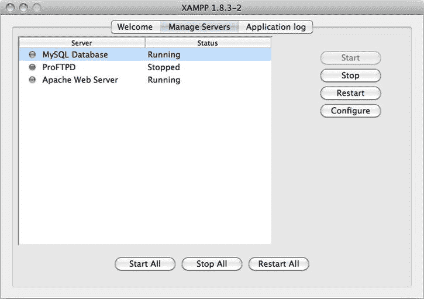
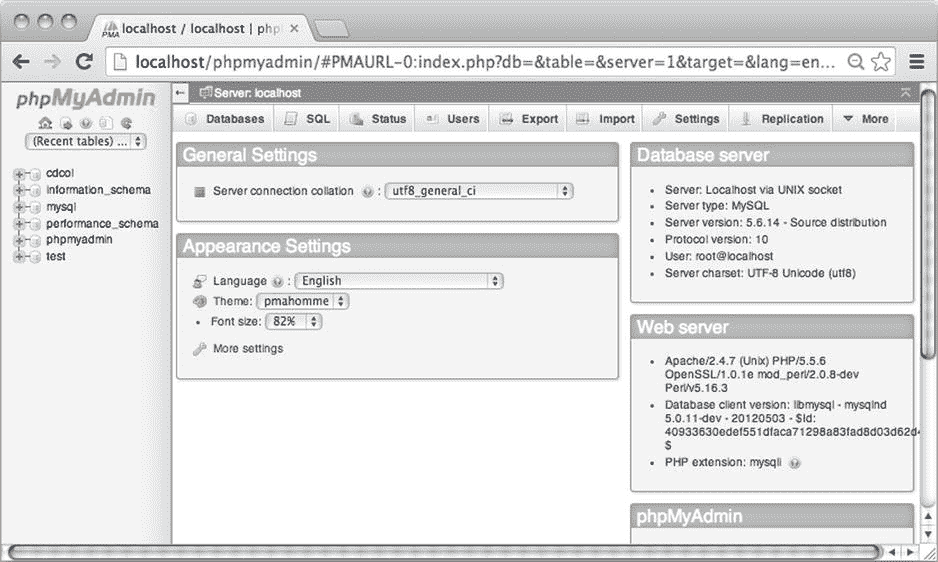
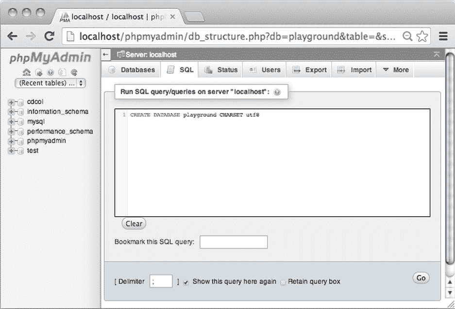
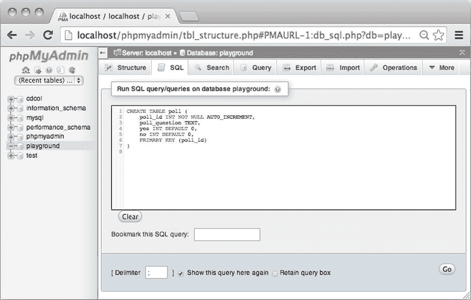
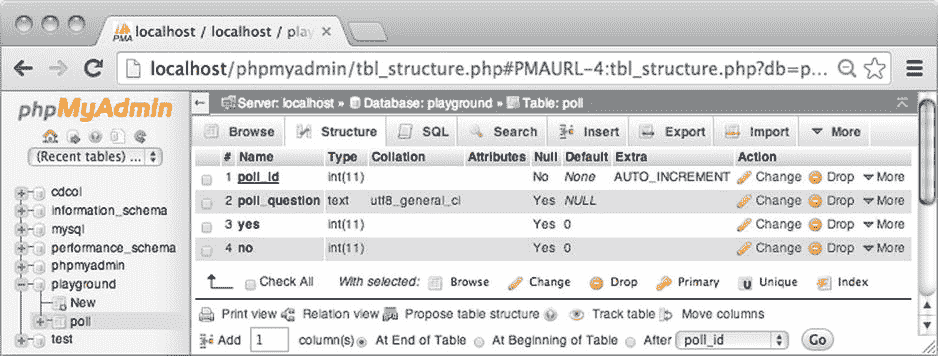
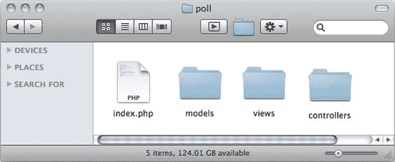
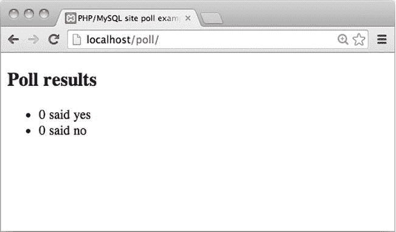

# 六、使用数据库

现代网站非常强大，这种强大的力量很大程度上来源于它们存储信息的能力。存储信息允许开发者在他们的软件和用户之间创建高度可定制的交互，从基于条目的博客和评论系统到安全处理敏感交易的高性能银行应用。

本章涵盖了 MySQL 的基础知识，这是一个强大的开源数据库。我还演示了在 PHP 项目中使用 MySQL 的面向对象方法。涵盖的主题包括以下内容:

*   MySQL 数据存储的基础
*   操作 MySQL 表中的数据
*   数据库表结构
*   使用 PHP 与 MySQL 数据库交互
*   用模型-视图-控制器方法组织 PHP 脚本
*   为什么编码就像演奏布鲁斯

这一章有很多东西要学，其中一些可能会让你头大。但是请放心，所有涉及的主题将在后续章节中重复和详细阐述。你将会有大量的学习机会。

## MySQL 数据存储的基础

MySQL 是一个关系数据库管理系统，允许您在多个表中存储数据。每个表包含一组命名列，每一行由表中的一个数据条目组成。表格通常包含关于其他表格条目的信息。这样，一个事实可以存储在一个表中，但可以在其他表中使用。例如，看看如何存储音乐艺术家的信息(见表 6-1 和 6-2 )。

表 6-2。

The Album Table

   
| 相册 id | 艺术的 | 相册名称 |
| --- | --- | --- |
| one | one | 对艾玛来说，永远以前 |
| Two | one | EP3 血库 |
| three | Two | 让它死去 |
| four | Two | 提醒 |

表 6-1。

The Artist Table

  
| 艺术的 | 艺术家 _ 姓名 |
| --- | --- |
| one | 好的 Iver |
| Two | Feist |

第一个表 artist 包含两列。第一列`artist_id`，存储每个艺术家的唯一数字标识符。第二列`artist_name`，存储艺术家的名字。

第二个表 album 在`album_id`列中存储每个专辑的唯一标识符，在`album_name`列中存储专辑名称。专辑表包括第三列`artist_id`，它与艺术家和专辑表相关联。该列存储与录制专辑的艺术家相对应的唯一艺术家标识符。

乍一看，这似乎是一种愚蠢的数据存储方式。为什么要保留一个抽象的，无法理解的数字，而不是简单的写下每张专辑的艺人名字？表 6-3 想象你做了那件事。

表 6-3。

The Badly Designed Album Table

   
| 相册 id | 艺术家 | 相册名称 |
| --- | --- | --- |
| one | 好的 Iver | 对艾玛来说，永远以前 |
| Two | 好的 Iver | EP3 血库 |
| three | Feist | 让它死去 |
| four | 第一 | 提醒 |

请注意`album_id 4`的拼写错误。因为每张专辑的艺术家姓名都是分开拼写的，所以可以为同一位艺术家存储不同的姓名。在一个只有四个条目的小表中，就像前面的表一样，很容易发现和纠正错误。但是在现实世界中，表很少这么小。假设您正在为一家音乐商店构建数据库。你必须记录数以千计的专辑。

如果你幸运的话，你会发现这个错误——然后你必须检查 Feist 的每张专辑，检查艺术家的名字是否拼写正确。这是可能的，但这将是对时间的疯狂浪费。

对另一个表结构(列于表 6-2 中)进行同样的思考实验。如果你把 Feist 拼错成 fiest，你就更有可能发现这个错误，因为 Feist 的每张专辑都会列在 fiest 下面。此外，纠正错误不会让你跋涉数以千计的条目。你只需简单地去一个声明艺术家名字的地方，写 Feist 而不是 fiest，每张专辑就会正确地列出来。

通过设计只存储一段数据一次的表，可以设计一个具有数据完整性的健壮数据库。SQL 社区的杰出人物 Joe Celko 恰当地创造了一个口号“一个简单的事实，在一个地方，一个时间。”记住这句口号，让你的数据库表遵循这条规则。

## 使用 SQL 操作数据

您可以通过结构化查询语言(SQL)操作 MySQL 表中的数据。SQL 是一种小型语言，大部分都非常容易阅读和理解。在本节中，您将学习执行以下操作的 SQL 语句:

*   创建数据库
*   在数据库中创建一个表
*   将数据插入表格
*   从表中检索数据
*   更新表中的数据

您将使用 XAMPP 提供的 phpMyAdmin 控制面板来测试这些命令。要使用 XAMPP，您必须先启动它。打开 XAMPP 控制面板(见图 6-1 )并启动 MySQL 数据库和 Apache Web 服务器。

图 6-1。

The XAMPP control panel

在 MySQL 和 Apache 运行的情况下，您可以打开浏览器并导航到 http://localhost/phpMyAdmin，以访问 phpMyAdmin 控制面板(图 6-2 )。

图 6-2。

The phpMyAdmin control panel

## 为民意调查开发数据库

感受数据库驱动的 web 页面的最好方法是创建一个用于测试的页面。在接下来的页面中，您将创建一个数据库驱动的网站投票。这是数据库驱动开发的一个简单例子，但它足以展示基本原理。最简单的站点投票将提出一个问题，站点访问者可以回答“是”或“否”。用户的所有答复都将显示出来，因此每个站点用户都可以看到其他站点访问者是如何回答的。

虽然这个例子很简单，但是它将总结到目前为止您在书中看到的所有内容，并且它将要求您学习如何在您的 PHP 项目中集成数据库驱动的数据。

这是一个完美的学习项目，因为它非常简单。它将需要相对较少的代码行，这意味着您可以专注于相关的原则，而不是淹没在冗长的语法中。这将是你在下一章开始的个人博客系统的完美准备。

网站投票依靠数据库表来存储投票问题和投票回复。PHP 将不得不连接到 MySQL 并检索相关数据，因此它可以在浏览器中显示为 HTML。从 PHP 中，您还将输出一个 HTML 表单，允许站点访问者与站点投票进行交互。每当访问者提交表单时，PHP 应该获得提交的答案，并相应地更新 MySQL 数据库表。首先创建一个包含一个表和一些投票数据的数据库。

### 使用 CREATE 创建数据库

SQL 使用 CREATE 一词来表示正在创建一个表或数据库。启动 CREATE 子句后，必须指明是创建数据库还是表。在您的例子中，您使用关键字 DATABASE 来表明您实际上正在创建一个数据库。最后，您必须指明新数据库的名称。

MySQL 最初是在瑞典开发的。所以，MySQL 中使用的默认字符集是瑞典语。也许你不想在你的解决方案中使用瑞典语。我喜欢在我的解决方案中使用 utf-8。创建使用 utf-8 的数据库很容易；您只需指定 utf-8 作为要使用的字符集。完整的命令应该如下所示:

`CREATE DATABASE playground CHARSET utf8`

要执行 SQL 语句，必须在 phpMyAdmin 控制面板中选择 SQL 选项卡(图 6-3 )。这将弹出一个文本字段，您可以使用它来输入 SQL 语句。要实际执行 SQL，您必须单击文本字段下面的 Go 按钮。

图 6-3。

The SQL tab in phpMyAdmin

#### CREATE TABLE 语句

MySQL 将数据存储在表中。自然，开始使用 MySQL 的第一件事就是创建第一个表。要做到这一点，您必须了解更多的 SQL。幸运的是，SQL 语法非常容易阅读和理解。创建表的一般语法如下:

`CREATE TABLE table_name (`

`column_name datatype [any constraints or default values],`

`column_name datatype [any constraints or default values]`

`)`

正如您所看到的，一个`SQL CREATE`语句必须声明一个表名。它还应该声明每个表列或属性的名称和数据类型。SQL 语句可以为创建的属性声明约束或默认值。

通过在 phpMyAdmin 控制面板的左栏中单击数据库名称来访问数据库`playground`。单击屏幕顶部的 SQL 选项卡，就可以创建第一个表了。下面是您需要的 SQL:

`CREATE TABLE poll (`

`poll_id INT NOT NULL AUTO_INCREMENT,`

`poll_question TEXT,`

`yes INT DEFAULT 0,`

`no INT DEFAULT 0,`

`PRIMARY KEY (poll_id)`

`)`

在 phpMyAdmin 的 SQL 选项卡中输入 SQL 后，可以单击 Go 来执行 SQL(图 6-4 )。这将创建新表。

图 6-4。

Create a new table in the playground database

您可以通过从 phpMyAdmin 左侧的面板中选择 poll 表来研究刚刚创建的新表。接下来，选择“结构”选项卡，该选项卡位于“SQL”选项卡的旁边(图 6-5 )。

图 6-5。

Poll table structure

这里有很多信息供你思考。您可以看到投票表有四个属性或列:`poll_id`、`poll_question`、`yes`和`no`。

您可以看到每个属性都有一个类型。表的字段只能保存正确类型的数据。比如，你只能在`poll_id`、`yes`和`no`中存储整数。你可以在上图中看到，因为类型是`int(11)`。你可以无视 11 这个数字。它在那里是因为 11 恰好是 MySQL 整数的默认显示宽度。

Note

整数是一个非十进制数，也就是你所说的整数。

你也可以看到你只能在`poll_question`中存储文本。再往`poll_question`里看，还可以看到归类是 utf8。

Note

归类是一组规则，用于指定字符集中哪些字符先出现。很明显 a 在 b 之前，但是字符 7 呢？应该放在字母字符之前还是之后？像#"#€%&这样的特殊字符呢？归类明确规定了字符应该如何排序。

最后，您可以看到`yes`和`no`属性是用默认值 0 创建的。其他属性都没有默认值。

#### 了解主键

您可以看到,`poll_id`属性带有下划线。这是一个直观的指示，表明`poll_id`被设置为投票实体的主键。当属性被声明为主键时，它必须具有唯一的值。因此，无论投票表最终包含多少行数据，都不可能有两个相同的`poll_id`值。

假设您有一行`poll_id`为 1 的数据。如果您试图插入另一行数据，并且`poll_id`也是 1，MySQL 将拒绝新行并给出一个错误消息。主键用于明确地标识一行数据。您实际上可以在 MySQL 中创建没有主键的表，但是这种表是特例。大多数情况下，您会希望创建带有主键的表，因为如果您不能唯一地标识条目，数据就没有什么用处。

您可以看到，poll 表是以这样一种方式创建的，即主键`poll_id`必须有一个值。属性`poll_id`被声明为 NOT NULL，这意味着空值对于`poll_id`来说是不可接受的。`poll_id`属性必须始终保持一个`INTeger`值。`poll_id`属性不能为空或未声明。

#### 了解自动增量

轮询表有一个自动递增的主键。这是一个简单但强大的想法:投票表中的第一行数据将得到 1 的`poll_id`。下一行将自动获得 2 的`poll_id`。下一行将得到 3 的`poll` _ `id`，以此类推。`poll_id`的值会自动增加。

MySQL 将跟踪已经被用作`poll_id`的值。这样，`poll`中的每一行新数据都将获得一个唯一的`poll_id`。从某种意义上说，自动递增的主键非常类似于世界上许多国家用来唯一标识一个公民的社会安全号:它是一个用来唯一标识一个事物的任意数字。

### INSERT 语句

创建好表后，就可以开始存储数据了。轮询表中的每个新条目都将存储为单独的一行。为了简单起见，您可以从插入单行数据开始。下面是一个 SQL 语句:

`INSERT INTO poll (`

`poll_question`

`) VALUES (`

`"Is it hard fun to learn PHP?"`

`)`

这个 SQL 语句将在表中插入一个新的数据行，称为`poll`。它将为`poll_question`列或属性声明一个值。更具体地说，`poll_question`列将得到一个值 PHP 很有趣吗？还记得投票表总共有四个属性或列吗？其余的列`poll_id`、`yes`和`no`将简单地用默认值创建。所以`poll_id`会得到值 1，而`yes`和`no`都会得到值 0。

要让 MySQL 程序执行 SQL 语句，必须首先在 phpMyAdmin 控制面板中选择 playground 数据库。接下来，单击 SQL 选项卡并输入前面的 SQL 语句。最后，单击 Go，实际执行输入的 SQL 语句。

我假设您可以推导出一些`INSERT`语句的通用语法。我希望您学习以下通用语法，这样您就可以很快开始制定自己的`INSERT`语句:

`INSERT INTO table_name (`

`column_name, other_column_name`

`) VALUES (`

`[data for column], [data for other column]`

`)`

当您编写 I `NSERT`语句时，您必须首先指出您想要将数据插入哪个表。然后，指定要将数据插入该表的哪些列。如果表中有更多的列，它们将获得默认值。

一旦指定了要添加插入内容的表和列，就必须列出要插入的实际数据。如果在`INSERT`语句中指定一列，则必须列出一个值。如果指定两列，则必须列出两个值。换句话说，列的数量必须与 I `NSERT`语句中指示的值的数量相匹配。

### SELECT 语句

将一行数据插入投票表后，您可能希望看到新的一行。您可能需要一些视觉上的确认，以确认该行确实被插入了，所以您知道您有一个数据库表，其中存储了一些数据。要从数据库表中检索数据，必须使用 SQL `SELECT`语句。`SELECT`语句的一般语法非常简单。

`SELECT column_name, column_name FROM table_name`

需要注意的主要关键词是`SELECT`。它用于检索数据库中指定表的数据指定属性`FROM`。一个`SELECT`语句总是返回一个填充了任何检索到的数据的临时表。临时表将具有紧接在关键字`SELECT`之后的属性。您可以使用以下 SQL 语句从轮询表中检索数据:

`SELECT poll_id, poll_question, yes, no FROM poll`

请转到 phpMyAdmin 控制面板中的 SQL 选项卡，输入上面的`SELECT`语句，并查看返回的表(参见图 6-6 )。

图 6-6。

Poll table with one row inserted

在图 6-6 中可以看到，`SELECT`语句返回一个临时的、未命名的表，该表有四列，每一列对应于`SELECT`语句中指示的一列。您可以看到表中有一行数据。它有一个为 1 的`poll_id`和一个`poll_question`。`yes`和`no`列分别为 1 和 0。

就其目前的状态来看，这并不算什么，但也许您会意识到，这就是在您的网站上显示站点投票所需的全部数据。您的网站将显示投票问题。网站访问者可以通过 HTML 表单发布他们的回答。可能的选项是“是”或“否”。来自站点访问者的所有响应都将存储在“是”或“否”字段中。所以，用一点数学知识，你可以计算出相对的反应，并显示如下信息:79%的网站访问者认为 PHP 学习起来很难也很有趣。

### 更新语句

您可能会发现，每次站点访问者提交响应时，您都必须更改投票表中的`yes`或`no`值。要做到这一点，您必须知道更多的 SQL 语句。你可以假装一个网站用户同意 PHP 很难学。您需要一条 SQL 语句将`yes`属性的存储值增加 1，如下所示:

`UPDATE poll SET yes = yes + 1`

`WHERE poll_id = 1`

如果您愿意，您可以通过在 phpMyAdmin 的 SQL 选项卡中输入并单击 Go 来运行`UPDATE`语句。如果这样做，可以看到`poll`中第一行数据的 yes 属性的值为 1。如果再次运行相同的 SQL 语句，`yes`将得到值 2。

请注意`WHERE`子句如何限制哪些行将受到更新的影响。只有`poll_id`为 1 的行将受到影响。由于`WHERE`子句，表中的任何其他行都不会被更新。

没有`WHERE`子句的`UPDATE`语句将更新轮询表中所有行的`yes`属性。在您的例子中，只有一行，所以`WHERE`子句不是绝对必要的。但是您将使用的大多数表都不止一行，所以明确指出要更新哪一行是一个好习惯。

在前面的`WHERE`子句中，您可以确定只有一行将被更新，因为`WHERE`子句通过主键标识一行数据。您总是可以相信主键可以唯一地标识一行(除非您的表设计得非常糟糕)。

## 编写数据库驱动的站点投票

为了学习如何从 PHP 使用 MySQL 数据库，让我们编写一个数据库驱动的站点投票。让我们使用操场数据库和投票表来存储数据。您将学习使用所谓的 PDO 对象将您的 PHP 应用连接到 MySQL 数据库。从基本的动态 PHP 站点升级到数据库驱动的动态 PHP 站点会带来一些后果。

显然，您必须从 PHP 连接到数据库，并且您的 PHP 脚本必须与数据库表通信，以获取您的站点所需的内容。PHP 是一种非常宽容的语言，您可以用许多方式来完成这项任务。但是其中一些方法比其他方法更具可扩展性。一旦你开始处理更大的项目，比如一个博客系统，一些起初看起来很容易的方法可以把你的代码变成一个完全没有组织的，混乱的，意大利面条一样的混乱。让我们采用一种经过反复试验的方法来编写可以扩展以适应复杂项目的代码架构，即使这个站点投票是一个简单的项目。

### 用 MVC 分离关注点

模型-视图-控制器(MVC)设计模式是一致地组织脚本的常用方法。使用一致的方法来组织脚本可以帮助您更快、更有效地开发和调试。

学习理解 MVC 背后的基本原理也可以为学习 MVC 框架做好准备。最终，您可能会遇到 CodeIgnitor、cakePHP、yii 或其他 PHP MVC 框架。这样的框架将帮助您设计和开发更复杂的 web 应用。

最基本的，MVC 将编码问题分成三类:模型、视图和控制器。模型是代表数据的一段代码。您的模型还应该包含您正在构建的系统中涉及的大多数逻辑。视图是可视化显示信息的一段代码。视图要显示的信息是从模型接收的。控制器是一段代码，它从用户那里获取输入，并向相关模型发送命令。简而言之，MVC 将用户交互从系统逻辑和数据的可视化表示中分离出来。

Note

你可以在 [`http://en.wikipedia.org/wiki/Model-view-controller`](http://en.wikipedia.org/wiki/Model-view-controller) 阅读更多关于 MVC 的内容。

您已经看到了分离模型、视图和控制器的例子。还记得你是如何为 HTML 页面制作模板的吗？您已经使用了一个包含基本 HTML 页面框架的视图。你可以在第四章中开始建造的画廊中找到它。视图在`ch4/templates/page.php`中。

在同一个项目中，您创建了一个与视图相关的模型:`ch4/classes/Page_Data.class.php`，它声明了许多与 HTML 页面内容相关的方法和属性。

模型和视图通过控制器连接起来。在`ch4/index.php`中，您为模型赋值，并使模型对视图可用，因此可以创建一个包含内容的格式良好的 HTML5 页面，并在浏览器中显示。所以，`index.php`是你的控制器。

在本书中，我的目标是使用 MVC 的一个简单实现。您将遇到的大多数其他 MVC 实现可能要复杂得多。你可以很容易地找到许多不适合初学程序员的 MVC 例子。一旦您理解了基本的 MVC 原则，并且获得了一些在简单环境中使用这些原则的经验，您会发现理解更复杂的实现要容易得多。

#### 规划 PHP 脚本

让我们保持简单的投票。创建一个`index.php`来输出一个显示投票的有效 HTML5 页面。索引将是一个前端控制器。

前端控制器是 MVC web 应用中常见的一种设计模式。前端控制器是 web 应用的单一“入口”。到目前为止，您已经在项目中使用了前端控制器。还记得`index.php`是唯一一个直接载入浏览器的脚本吗？这是给你的前端控制器的想法。

Note

前端控制器设计模式在网上有很好的文档。你可以在 [`http://en.wikipedia.org/wiki/Front_Controller_pattern`](http://en.wikipedia.org/wiki/Front_Controller_pattern) 开始你自己的研究。

和前面的项目一样，`index.php`将输出一个有效的 HTML5 页面，并加载投票控制器。投票控制器应该将`poll`作为 HTML 返回，这样它就可以显示在`index.php`上。注意每一个视图都有自己的模型和控制器(图 6-7 )。

图 6-7。

Distribution of responsibilities

查看如何有一个投票模型、投票控制器和投票视图。这三者应该协同工作来显示功能性投票。您还可以看到页面有自己的模型、视图和控制器。前端控制器是页面控制器。

### 创建投票项目

您可以创建一个站点结构来模拟代码职责。在`XAMPP/htdocs`中新建一个文件夹。调用新文件夹`poll`。在投票文件夹中，您可以创建另外三个文件夹:`models`、`views`和`controllers`(图 6-8 )。

图 6-8。

Folder structure for the poll project

您可以从图库项目中复制`ch4/templates/page.php`文件。将`page.php`的副本保存为`poll/views/page.php`。

同样，从图库项目中复制`ch4/classes/Page_Data.class.php`，并在`poll/models/Page_Data.class.php`中保存一份副本。

现在是时候创建`poll/index.php`并编写一点代码来检查到目前为止一切都很好地一起工作了:

`<?php`

`//complete code for htdocs/poll/index.php`

`error_reporting( E_ALL );`

`ini_set( "display_errors", 1 );`

`//load model`

`include_once "models/Page_Data.class.php";`

`$pageData = new Page_Data();`

`$pageData->title = "PHP/MySQL site poll example";`

`$pageData->content .= "<h1>Everything works so far!</h1>";`

`//load view so model data will be merged with the page template`

`$page = include_once "views/page.php";`

`//output generated page`

`echo $page;`

这段代码应该不会让你感到意外。它与您在本书的其他项目中使用的代码几乎相同。只有文件夹名称改变了！

我想你的观点也改变了。您现在正从模型-视图-控制器的角度查看这段代码。您可以通过将浏览器指向 http://localhost/poll/index . PHP 来测试代码。您可以看到前端控制器如何将模型和视图连接起来，并将一个格式良好的 HTML5 页面输出到浏览器供用户查看。

### 制作投票控制器

有了一个用自己的模型和视图创建的几乎空白的页面，并且设置了一个前端控制器，您就可以准备一个文件，用于在浏览器中显示您的投票示例。坚持 MVC 方法，您最终将需要一个投票模型、一个投票视图和一个投票控制器。最小的可能步骤是创建一个基本的轮询控制器，并从前端控制器`index.php`加载它。在`controllers`文件夹中创建一个新文件`poll.php`:

`<?php`

`//complete code listing for controllers/poll.php`

`return "Poll will show here soon";`

接下来，您应该从`index.php`加载轮询控制器。您应该在创建了`$pageData`对象之后、包含页面模板之前加载控制器，如下所示:

`//partial code listing for index.php`

`//comment out or delete this line`

`$pageData->content .= "<h1>Everything works so far!</h1>";`

`//new line of code to load poll controller`

`$pageData->content = include_once "controllers/poll.php";`

`//no changes below`

`$page = include_once "views/page.php";`

`echo $page;`

如果您保存文件并在浏览器中加载 http://localhost/poll/index . PHP，您应该会看到 Poll 将显示在这里。如果你不这样做，当你输入代码的时候就会出错。

### 制作民意测验模型

有了初步的投票控制器，您就可以继续开发初步的投票模型了。仅用一种方法定义一个投票类。在`models/Poll.class.php`中创建一个新文件，如下:

`<?php`

`//complete code for models/Poll.class.php`

`//beginning of class definition`

`class Poll {`

`public function getPollData() {`

`$pollData = new stdClass();`

`$pollData->poll_question = "just testing...";`

`$pollData->yes = 0;`

`$pollData->no = 0;`

`return $pollData;`

`}`

`}`

`//end of class definition`

注意关键字`class`是如何用来声明一个类名的。这个类叫做`Poll`，类定义中的代码定义了所有`Poll`对象的蓝图。`Poll`类只有一个方法。它将创建一个名为`$pollData`的硬编码的`StdClass`对象，并将其返回给调用者。

看看`$pollData`对象如何拥有`poll_question`、`yes`和`no`的属性。`$pollData`对象表示显示投票所需的所有内容。换句话说，`$pollData`模型会对数据进行投票。

### 制作投票视图

一个数据对象没什么好看的。您可以创建一个简单的投票视图，以便查看投票。在`views/poll-html.php`中创建一个新文件，如下:

`<?php`

`//complete code for views/poll-html.php`

`return "`

`<aside id='poll'>`

`<h1>Poll results</h1>`

`<ul>`

`<li>$pollData->yes said yes</li>`

`<li>$pollData->no said no</li>`

`</ul>`

`</aside>`

`";`

### 使用投票模型查找投票视图

创建了初步的投票模型和投票视图后，您可以打开投票控制器来连接模型和视图，最后在浏览器中显示一些内容。在编辑器中打开`controllers/poll.php`,进行以下必要的更改:

`<?php`

`//complete code listing for controllers/poll.php`

`include_once "models/Poll.class.php";`

`$poll = new Poll();`

`$pollData = $poll->getPollData();`

`$pollView = include_once "views/poll-html.php";`

`return $pollView;`

就这样！你有一个 MVC 投票。如果保存文件并在浏览器中加载 http://localhost/poll/index . PHP，您应该会看到一个格式良好的 HTML5 页面，其中有一个简单的`<ul>`元素，显示一些初步的、硬编码的投票数据。你可以在图 6-9 中看到它应该是什么样子。

图 6-9。

The initial poll, seen in Chrome

也许你很想问一个问题，比如为什么我要创建三个不同的文件来显示一个简单的`<ul>`元素？这是一个完全合理的问题。如果您想要的只是显示一个带有一些硬编码值的`<ul>`元素，那么 MVC 方法完全是多余的。最好的方法可能是手工编写一个简短的 HTML 文件。

这里的重点是用一个非常简单的例子来介绍 MVC 设计模式，这样就不会有过于复杂的代码隐藏 MVC 的基本原理。使用 MVC 方法，您可以很好地创建数据库驱动的 web 应用。MVC 架构对于这么简单的东西来说几乎是不必要的，但是它确实可以解决你在更复杂的项目中遇到的一些挑战，比如你将在下一章开始制作的博客系统。

MVC 封装了来自控制器的模型视图。这意味着您可以在不更改任何其他内容的情况下更改视图。假设您不想在投票中加入`<ul>`元素。您可以简单地更改在`views/poll-html.php`中使用的 HTML 标签，并相信您的代码的其余部分能够正确运行。您可以轻松地更改视图，而无需更改任何其他内容。

类似地，您可以更改内容，并且仍然相信您的代码会按预期运行。将`no`属性设置为 9 是一个简单的任务。你只需要修改`models/Poll.class.php`中的一点点代码。您的投票应用是用独立的、松散耦合的元素构建的。

### 编码就像演奏布鲁斯

一些有创造性倾向的读者可能会反对严格的代码组织。你可能会觉得编码，尤其是当你试图实现一个标准化的方法，比如 MVC，是你的创造力的监狱。你可能会得出这样的结论:它没有给创造力留下空间。

我明白这种反对的理由，但我强烈反对。编码真的很像演奏蓝调音乐，它同样富有创造性，同样需要创造性的个人表达。

是的，实现 MVC 要求你把你的代码分成三类。是的，MVC 会强迫你在特定的、定义明确的地方写代码。当你在学习的时候，这样的限制就像监狱一样。但这就像学习演奏布鲁斯一样。

布鲁斯不是任何一种音乐:布鲁斯就是布鲁斯！要获得蓝调音乐，你不能只弹奏乐器上任何一个音符。在许多蓝调音乐中，你有三个和弦，所有的蓝调即兴创作都源于五声音阶——音乐家只有五个音符可供选择。也许严格的限制对创造性表达没有反作用。也许布鲁斯音乐家如此擅长创造性地表达自己，是因为布鲁斯仅限于三个和弦和五个音符。

要成为一名伟大的蓝调音乐家，你必须熟知蓝调音乐的规则。然后你开始弯曲它们。你开始添加过渡和弦来引导这三个基本蓝调和弦之间的音乐。你开始压五声音阶的五个音符。你开始在布鲁斯的限制下创造性地表达自己。

编码就是这样。这里有严格的、限制性的规则，个人创造性表达的空间很大。在学习的过程中，你会逐渐找到自己的路，但成为一个伟大的程序员和成为一个伟大的音乐家需要付出同样多的努力。所以开始练习吧！

### 从 PHP 连接到 MySQL

您的 MVC 架构将使建立数据库连接和使用数据库驱动的数据进行投票成为一项相当简单的任务。一旦建立了这样的连接，就可以从数据库中检索数据，并使用 PHP 将其发布为 HTML。这就是数据库驱动网站的本质。

有几种方法可以将 PHP 连接到 MySQL。如果您在互联网或其他书籍上寻找 PHP 代码示例，您可能会遇到一些不同的方法。你很有可能遇到过时的`MYSQL()`和更新的`MYSQLI()`。

#### PHP 数据对象(PDO)

在本书中，你将专门使用 PHP 数据对象(PDO)。这是一种从 PHP 连接到数据库的非常安全和有效的方式。PDO 支持多个数据库，并为处理大多数数据库交互提供了一套统一的方法。对于必须支持多种数据库类型的应用，如 PostgreSQL、Firebird 或 Oracle，这是一个很大的优势。

使用 PDO，从一种数据库类型转换到另一种数据库类型通常只需要重写非常少量的代码，然后继续照常工作。

使用 PDO 的一个潜在缺点是它依赖于 PHP5 的面向对象特性，这意味着运行 PHP4 的服务器不能运行使用 PDO 的脚本。这不再是一个大问题，因为很少有服务器不能访问 PHP5 然而，这仍然是你需要注意的事情。

#### 打开连接

是时候连接到您的数据库了。为了简单起见，我建议您在`index.php`中编写连接代码。当数据库连接在前端控制器中可用时，将它传递给任何其他需要它的代码将会非常容易。

默认 XAMPP 安装有默认用户名 root，没有密码。您为这个学习练习创建了一个名为 playground 的数据库。因此，您可以使用这些凭证连接到本地主机上运行的 MySQL 数据库。

您的 XAMPP 可能使用不同的凭据。您必须使用有效的凭证。您可以通过在`index.php`中添加几行代码来创建新的数据库连接，如下所示:

`<?php`

`//complete code for index.php`

`error_reporting( E_ALL );`

`ini_set( "display_errors", 1 );`

`include_once "models/Page_Data.class.php";`

`$pageData = new Page_Data();`

`$pageData->title = "PHP/MySQL site poll example";`

`//new code starts here`

`//database credentials`

`$dbInfo = "mysql:host=localhost;dbname=playground";`

`$dbUser = "root";`

`$dbPassword = "";`

`try {`

`//try to create a database connection with a PDO object`

`$db = new PDO( $dbInfo, $dbUser, $dbPassword );`

`$db->setAttribute( PDO::ATTR_ERRMODE, PDO::ERRMODE_EXCEPTION );`

`$pageData->content = "<h1>We're connected</h1>";`

`}catch ( Exception $e ) {`

`$pageData->content = "<h1>Connection failed!</h1>
$e
";`

`}`

`//comment out loading poll controller`

`//$pageData->content = include_once "controllers/poll.php";`

`//end of code changes`

`$page = include_once "views/page.php";`

`echo $page;`

前面的代码创建了一个 PDO 对象，并将其存储在`$db`变量中。默认情况下，PDO 将隐藏任何错误消息。您希望看到错误消息来学习。前面的代码会将任何与 PDO 相关的错误显示为所谓的异常。

Note

您还可以使用其他设置来创建到数据库的 PDO 连接。完整详细的报道可以咨询 [`www.php.net/manual/en/book.pdo.php`](http://www.php.net/manual/en/book.pdo.php) 。

保存`index.php`中的更改，并在浏览器中加载 http://localhost/poll/index . PHP。如果您完全正确地做了所有事情，您应该会在浏览器中看到一个输出，确认您连接成功。请注意，轮询控制器不再加载。我们很快会再次加载它。这段代码只测试数据库连接是否成功建立。

#### 使用 try-catch 语句

当您尝试连接到数据库时，许多事情都可能出错。也许您的 XAMPP MySQL 服务器没有运行，或者您提供了无效的凭据，例如拼错的用户名或数据库名称。如果您的代码尝试连接到数据库并失败，则整个脚本都会失败。这是因为 PDO 会抛出一个所谓的异常。

异常很有趣，因为如果您处理异常，您的代码可以继续执行。这就是一条`try-catch`语句所能做到的。它将尝试运行可能导致异常的代码块。如果抛出一个异常，它将被捕获并处理，因此剩下的脚本可以继续。一个优点是您可以为用户制定有意义的错误消息。`try-catch`语句的一般语法如下:

`try{`

`//try something that can fail`

`} catch ( Exception $e ) {`

`//whoops! It did fail`

`}`

如果您更改了`index.php`中的一行代码，您可以看到一条`try-catch`语句正在运行。您可能会尝试使用错误的凭据连接到数据库，如下所示:

`//partial code from index.php`

`//$dbUser = "root";`

`//use an invalid database user name for testing purposes`

`$dbUser = "bla bla";`

保存并运行`index.ph` p，您将看到 catch 块正在做它的事情。它将处理抛出的异常并输出一条错误消息。

请改回有效的数据库凭据。现在，您应该已经连接到数据库了。更改您的代码以再次加载轮询控制器:

`//partial code listing for index.php`

`try {`

`$db = new PDO( $dbInfo, $dbUser, $dbPassword );`

`$db->setAttribute( PDO::ATTR_ERRMODE, PDO::ERRMODE_EXCEPTION );`

`//delete or comment out the connection message`

`//$pageData->content = "<h1>We're connected</h1>";`

`}catch ( Exception $e ) {`

`$pageData->content = "<h1>Connection failed!</h1>
$e
";`

`}`

`//loading poll controller again`

`$pageData->content = include_once "controllers/poll.php";`

你的代码已经设置好了。您将很快使用数据库驱动的内容进行调查。但是首先，稍微绕一下面向对象编程中的一个重要话题:构造函数。

### 使用构造函数参数

当使用对象编程时，通常需要在新创建的对象中设置一些初始值。在 PHP 中，您可以通过使用构造函数方法来实现这一点。构造函数是一种方法，当对象第一次被创建时，它在对象的生存期内只运行一次。

这是一个需要了解的重要话题，也是面向对象工具箱的一个强大工具。您可以慢慢来，从一个简单的没有构造函数的类定义的例子开始。我在`poll/test.php`中创建了一个 PHP 脚本。你不必这样做；您可以简单地阅读下面的代码示例:

`<?php`

`class Greeter {`

`private $greeting = "Hello";`

`private $subject = "World";`

`public function greet(){`

`return "$this->greeting $this->subject";`

`}`

`}`

`$greeter = new Greeter();`

`echo $greeter->greet();`

如果您要运行 http://localhost/poll/test.php，您将看到以下预期输出:

`Hello World`

您可以看到如何使用属性`$greeting`和`$subject`从方法`greet()`中返回一个字符串。您还可以观察到如何使用`$this`关键字从类定义内部访问对象属性。

想象一下，你想要一个除了“你好”之外还可以用来说话的`Greeter`您必须能够在调用`greet()`之前更改`$greeting`属性。一种方法是在创建`Greeter`对象时使用参数，如下所示:

`<?php`

`class Greeter {`

`private $greeting = "Hello";`

`private $subject = "World";`

`//notice the two underscore characters in __construct()`

`//declare a constructor method with an argument`

`public function __construct( $g ) {`

`$this->greeting = $g;`

`}`

`public function greet(){`

`return "$this->greeting $this->subject";`

`}`

`}`

`//call constructor with an argument`

`$greeter = new Greeter( "Good Morning" );`

`echo $greeter->greet();`

如果您要在浏览器中重新加载 http://localhost/poll/test.php，您会看到以下内容:

`Good Morning World`

构造函数方法是在创建新对象时运行的方法。在技术术语中，创建新对象的过程通常称为实例化。为了声明一个类的构造函数，你声明一个必须被调用的新方法`__construct()`。注意，有两个下划线字符。

如果一个类有一个构造函数方法，这个构造函数方法将在一个新的对象被实例化时运行。所以，写`new Greeter()`会调用`Greeter`的构造函数。在前面的测试示例中，构造函数接受一个参数，因此在调用它时必须发送一个值。接收到的值存储在预定义的属性`$greeting`中。这样，只要对象存在，接收到的值就会被记住。

Note

理解论点可能很棘手。你可以重读第三章中关于函数参数的解释，或者你可以在网上搜索“理解带参数的 PHP 函数”或者“学习 PHP 方法和参数”你一定会发现许多使用各种隐喻和代码示例的解释。我希望你能找到一个对你有用的解释。

### 与轮询模型共享数据库连接

您已经在`index.php`中创建了一个数据库连接，一个 PDO 对象。您可以使用带参数的构造函数的思想来共享与轮询模型的数据库连接。在`models/Poll.class.php`中更新您的代码，如下所示:

`<?php`

`//complete code listing for models/Poll.class.php`

`class Poll {`

`//new code: declare a new property`

`private $db;`

`//new code: declare a constructor`

`//method requires a database connection as argument`

`public function __construct( $dbConnection ){`

`//store the received conection in the $this->db property`

`$this->db = $dbConnection;`

`}`

`//no code changes below – keep method getPollData() as it is`

`public function getPollData(){`

`$pollData = new stdClass();`

`$pollData->poll_question = "just testing...";`

`$pollData->yes = 0;`

`$pollData->no = 0;`

`return $pollData;`

`}`

`}`

前面的变化已经准备好了`Poll`类。它现在可以接收一个 PDO 对象。所以现在，你必须调用`Poll`类的构造函数并传递一个 PDO 对象作为参数。停下来思考一下。您将在代码中的什么位置加载您的投票模型？

从您的投票控制器，从`poll/controllers/poll.php`，如下所示:

`<?php`

`//complete code listing for controllers/poll.php`

`include_once "models/Poll.class.php";`

`//Only change here: pass PDO object as argument`

`$poll = new Poll( $db );`

`$pollData = $poll->getPollData();`

`$pollView = include_once "views/poll-html.php";`

`return $pollView;`

现在，您已经将数据库连接传递给了轮询模型，传递给了刚刚创建的新的`Poll`对象。您现在可以保存并测试您的工作。您应该会看到和以前完全一样的投票。您的代码共享一个数据库连接，但是它还没有使用它做任何事情。

也许你想知道`controllers/poll.php`中的 PHP 代码是如何知道变量`$db`的。毕竟，`$db`是在`index.php`中声明的，那么怎么可能在另一个文件中使用呢？这是一个很好的问题，答案一点也不明显——除非你理解它。

变量`$db`在`index.php`中声明。在`controllers/poll.php`有，因为`controllers/poll.php`包含在`index.php`里。包含一个文件很像从一个文件中复制所有代码并粘贴到另一个文件中。因此，包含文件中声明的所有变量都可以在包含文件中使用，反之亦然。

### 使用 PDOStatement 检索数据

您已经建立了从 PHP 到运行在本地 XAMPP 上的 MySQL 的连接。PDO 对象通过 phpMyAdmin 控制面板显式地连接到您已经用 SQL 创建的操场数据库。

在操场数据库中，有一个`poll`表，其中有一个`poll_question`以及它的`yes`和`no`属性值。您已经准备好从数据库中检索数据，因此可以在 PHP 中使用它。这需要 PHP 代码中的几个步骤。

处理投票数据的代码属于投票模型。所以，你要开`models/Poll.class.php`。可以改变现有的方法`getPollData`。此时，该方法返回硬编码的轮询数据。您希望它返回数据库驱动的轮询数据。

首先，您必须编写一条 SQL 语句，并使用 PDO 将它传递给 MySQL。PDO 可以告诉 MySQL 它应该执行 SQL 语句并返回一个结果:投票数据。下面是如何用 PHP 来表达:

`//partial code listing for models/Poll.class.php`

`//udate existing method`

`public function getPollData () {`

`//the actual SQL statement`

`$sql = "SELECT poll_question, yes, no FROM poll WHERE poll_id = 1";`

`//Use the PDO connection to create a PDOStatement object`

`$statement = $this->db->prepare($sql);`

`//tell MySQL to execute the statement`

`$statement->execute();`

`//retrieve the first row of data from the table`

`$pollData = $statement->fetchObject();`

`//make poll data available to the caller`

`return $pollData;`

`}`

前面的代码查询数据库并从 poll 表中检索第一行数据。您已经有了一个投票视图和一个将投票模型与投票视图联系起来的投票控制器。

保存您的工作，并在浏览器中加载 http://localhost/poll/index . PHP，查看它的运行情况。您应该看到投票表中的数据以 HTML 的形式表示和显示。只需花一分钟来惊叹您所看到的:一个数据库驱动的网页！

您可能还会欣赏 HTML 和数据之间的清晰分离。如果您不喜欢我在示例中使用的 HTML 元素，您可以很容易地将其更改为其他元素。改变 HTML 元素不会以任何方式影响 PHP 脚本。

同样，您很快就会看到，数据可以改变，而不必改变 HTML 元素。HTML 元素的内容将根据从数据库中检索到的值动态更新。

不过，有一个依赖，重要的是你要看到它。在`views/poll-html.php`中，您需要一个`$pollData`对象，并且它必须具有 yes 和 no 属性。因此，在`views/poll.php`中，您必须创建这样一个对象，否则轮询将失败。该对象的名称和属性是至关重要的。

### PDO 和 PDOStatement 对象

我想指出的是，在 PDO 将 SQL 传递给 MySQL 之前，应该将 SQL 字符串转换成一个`PDOStatement`对象，然后在 MySQL 中执行 SQL。PDO 有一个叫做`prepare()`的方法，它将一个简单的 SQL 字符串转换成一个`PDOStatement`对象。

`PDOStatement`对象有另一个方法，叫做`execute()`，用于让 MySQL 执行 SQL。`PDOStatement` s 还有一个方法，叫做`fetchObject()`，从查询的数据库表中检索一行数据。

Note

可以在 [`www.php.net/manual/en/class.pdostatement.php`](http://www.php.net/manual/en/class.pdostatement.php) 查阅`PDOStatement`对象的官方文档。

#### PDOStatement 的 fetchObject()方法

`fetchObject()`方法返回一个`StdClass`对象，代表被查询表中的一行数据。在前面的代码中，您有一个 SQL 语句，它从投票表中选择了`poll_question`、`yes`和`no`。

因此，返回的`StdClass`对象将被自动创建，并带有`poll_question`、`yes`和`no`的属性。您可以通过`StdClass`对象属性访问投票表中的数据。在下面的内容中，您可以看到这些属性是如何在`views/poll-html.php`中使用的，以在网页上显示从投票表中检索到的数据:

`<?php`

`//complete code for views/poll-html.php`

`//$pollData->no holds the current value of the no attribute`

`//$pollData->yes holds the current value of the yes attribute`

`return "`

`<aside id='poll'>`

`<h1>Poll results</h1>`

`<ul>`

`<li>$pollData->yes said yes</li>`

`<li>$pollData->no said no</li>`

`</ul>`

`</aside>`

`";`

您已经为`$pollData`使用了一个`StdClass`。最初，您对轮询的属性和值进行了硬编码。最大的不同是，`fetchObject()`会自动创建一个新的`StdClass`对象并返回它。创建的`StdClass`对象的属性名与表格列名相同。

例如，`$pollData`有`poll_question`、`yes`和`no`属性，因为 SQL `SELECT`语句创建了一个带有`poll_question`、`yes`和`no`列的临时表。临时表从 MySQL 返回到 PHP。PDO 将接收到的数据转换成了一个`StdClass`对象，因为您使用了`fetchObject()`方法。

### 显示投票表格

你展示了数据库驱动的内容，这真是太棒了，但是你的例子还不是一个很好的网站投票。网站访问者应该被允许提交他们的意见，从而对投票结果做出贡献。不管怎样，你必须为站点访问者提供一个图形用户界面:HTML 表单是显而易见的选择。花几秒钟思考一下。这种表单的 HTML 属于哪里？在模型、视图或控制器中？在你继续阅读之前，想出你的最佳答案...

HTML 表单是用户看到的东西，所以它是一个视图。更新`views/poll-html.php`中的投票视图代码，如下所示:

`<?php`

`//complete code listing for views/poll-html.php`

`//new code below`

`$dataFound = isset( $pollData );`

`if( $dataFound === false ){`

`trigger_error( 'views/poll-html.php needs an $pollData object' );`

`}`

`return "`

`<aside id='poll'>`

`<form method='post' action='index.php'>`

`
$pollData->poll_question
`

`<select name='user-input'>`

`<option value='yes'>Yes, it is!</option>`

`<option value='no'>No, not really!</option>`

`</select>`

`<input type='submit' value='post' />`

`</form>`

`<h1>Poll results</h1>`

`<ul>`

`<li>$pollData->yes said yes</li>`

`<li>$pollData->no said no</li>`

`</ul>`

`</aside>`

`";`

正如您可能已经想到的，这将显示一个 HTML 表单，非常类似于您在第三章中为动态测验创建的表单。你可以刷新你的浏览器看看它是什么样子。

#### 触发自定义错误消息

你注意到那些触发错误信息的初始代码行了吗？好了，您已经确定了`$pollData`对象对于脚本在输出投票时进行有意义的协作是至关重要的。

如果你——或者从事同一项目的开发人员——忘记创建一个`$pollData`对象或者可能拼错了(例如，`$pillData`)，站点投票将不会正常进行。你可以测试一个`$postData`对象是否可用。如果不是，您可以触发一个自定义的错误消息。这实际上是一种自助:如果您或其他开发人员偶然犯了这个错误，您可以相信系统会输出一个有意义的错误消息，这样就可以轻松快速地纠正错误。

当你独自开发新项目时，你可能会花大量的时间来修正错误。使用自定义错误信息，您可以通过测试您预测可能发生的错误来加快开发时间。

### 根据表单输入更新数据库表

完成站点投票示例还需要最后一步。您应该检索通过表单提交的任何用户输入，并用收到的输入更新投票表。如果一个站点访问者提交了一个 no，您应该增加轮询数据库表中的`no`属性的值。

这与动态测验非常相似:您需要检测表单是否被提交。如果是，您可以检索提交的输入并相应地更新投票表。您可以看到这里有两个关注点:第一，检测输入；接下来，更新数据库。

更新数据库是模型的任务。处理用户交互是管制员的工作。您可以从用更新数据库表的方法更新轮询模型类开始。更新`models/Poll.class.php`。

`<?php`

`//declare a new method for the Poll class in models/Poll.class.php`

`//NB. Declare the method inside the Poll class code block`

`public function updatePoll ( $input ) {`

`if ( $input === "yes" ) {`

`$updateSQL = "UPDATE poll SET yes = yes+1 WHERE poll_id = 1";`

`} else if ( $input === "no" ) {`

`$updateSQL = "UPDATE poll SET no = no+1 WHERE poll_id = 1";`

`}`

`$updateStatement = $this->db->prepare($updateSQL);`

`$updateStatement->execute();`

`}`

`//no other code changes in Poll class`

新方法`updatePoll()`，应该相当容易理解。如果用户提交了 yes，那么您创建一个 SQL 字符串来更新 poll 表中的`yes`属性。如果用户提交了一个 no，您创建一个不同的 SQL 字符串来更新`no`属性。注意，无论提交的是 yes 还是 no，创建的 SQL 字符串都将存储在一个名为`$updateSQL`的变量中。

一旦创建了`$updateSQL`字符串，就使用 PDO 方法`prepare()`将 SQL 字符串转换成一个`PDOStatement`对象，该对象存储在变量`$updateStatement`中。通过`PDOStatement`，你可以`execute()`查询到实际更新的民意测验表。

在被调用之前,`updatePoll()`方法不会做任何事情。调用模型方法是控制器的工作...

#### 响应用户输入

控制器负责处理用户交互。因此，`poll controller`是从投票表单中截取用户输入的合适位置。脚本中还需要添加一些内容。

你必须检查表格是否已经提交。如果表单已提交，您应该获取通过表单接收的提交输入。当您调用方法到`updatePoll()`时，接收到的输入应该被传递给模型。下面是如何在 controllers/poll.php 中用 PHP 来表达这一点:

`<?php`

`//complete code listing for controllers/poll.php`

`include_once "models/Poll.class.php";`

`$poll = new Poll( $db );`

`//check if form was submitted`

`$isPollSubmitted = isset( $_POST['user-input'] );`

`//if it was just submitted...`

`if ( $isPollSubmitted ) {`

`//get input received from form`

`$input = $_POST['user-input'];`

`//...update model`

`$poll->updatePoll( $input );`

`}`

`//no changes here`

`$pollData = $poll->getPollData();`

`$pollAsHTML = include_once "views/poll-html.php";`

`return $pollAsHTML;`

如果您输入此代码，您将拥有一个全功能的站点投票，允许站点访问者查看其他站点访问者对您的投票问题的看法。任何网站访问者都可以通过表单发表意见。输入将保存在数据库中，并显示在`index.php`上。

您可以看到前面的脚本检查是否提交了调查表。它发生在剧本的顶部附近。代码寻找一个名为`user-input`的 URL 变量。这样的 URL 变量将在提交投票表单时声明，因为投票表单有一个`<select name='user-input'>`元素。投票表单使用了`POST`方法，所以您的代码应该在`$_POST`超全局中寻找用户输入，如下所示:

`//check if form was submitted`

`$isPollSubmitted = isset( $_POST['user-input'] );`

`if ( $isPollSubmitted ) {`

`$input = $_POST['user-input'];`

`$poll->updatePoll( $input );`

`}`

如果设置了 URL 变量，就知道已经提交了`poll`表单。在这种情况下，您可以检索站点访问者的输入。接下来，代码调用`Poll`对象中的`updatePoll()`方法，并将用户输入作为参数传递。

## 摘要

现在您已经了解了全貌——您正在用面向对象的 PHP 开发数据库驱动的 web 应用！这幅图的某些部分可能还不太清楚。随着你阅读本书的其余部分，其中一些将会改变。但是真正的改变，真正有意义的学习，发生在你开始创建自己的项目的时候。

当你开始阅读这本书时，你可能对静态网站有所了解，也就是用手写 HTML 创建的网站。有了静态 HTML，你可以写一篇关于你认为 PHP 有多难/多容易的文章。用户将能够阅读你的观点——从你到你的用户的交流是单向的。

在前几章中，你学习了用 PHP 制作动态解决方案。您创建了动态测验，允许您的用户与您的内容进行交互。因为用户可能对测验问题有不同的回答，所以不同的用户会看到不同的内容。你的测验是一种交流你对学习 PHP 的看法的吸引人的方式。用户可以阅读他们的观点是否和你的一致，你可以写一个小测验，让它提供幽默的回答——交流仍然是单向的，从你到你的用户。

现在，您开始了解数据库驱动的网站。当您使用数据库存储内容时，新的可能性就出现了。用户可以向您创作的网站提供新内容。可以发布用户提交的新内容，以便所有站点访问者可以看到其他站点访问者所做的贡献。您制作了一个便于网站访问者之间交流的网页。注意现在的交流是多方向的，你不再是内容的唯一作者。随着您从静态解决方案发展到动态解决方案，再发展到数据库驱动的解决方案，这些都是向您展现的一些新的可能性。

在这一章中，你已经学习了 SQL 语句的基础知识，以及如何通过 PHP 脚本与数据库进行交互。在接下来的章节中，你将学习如何用一个基本的条目管理器来创建一个博客，它将允许你创建、修改和删除条目，以及在公共页面上显示它们。