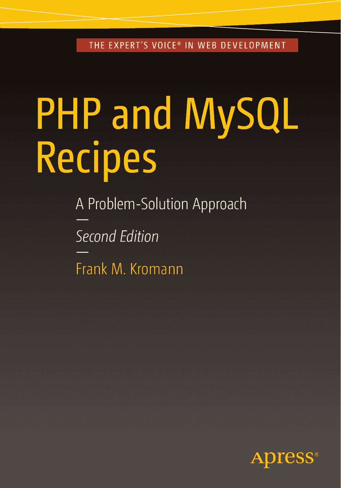

# 专家之声® 系列 WEB 开发

## PHP 与 MySQL 实战技巧：问题解决方案

*第二版*

弗兰克·M·克罗曼

**PHP 与 MySQL 实战技巧：问题解决方案（第二版）**

弗兰克·M·克罗曼

美国加利福尼亚州特拉布科峡谷

ISBN-13（平装）：978-1-4842-0606-5

ISBN-13（电子版）：978-1-4842-0605-8

DOI 10.1007/978-1-4842-0605-8

美国国会图书馆控制号：2016943555

版权 © 2016 弗兰克·M·克罗曼

本作品受版权保护。出版商保留所有权利，无论涉及全部或部分材料，特别是翻译、重印、重用插图、朗诵、广播、以缩微胶卷或任何其他物理方式复制、传输或信息存储与检索、电子改编、计算机软件，或目前已知或未来开发的任何类似或不类似方法的权利。以下情况不受此法律保留限制：与评论或学术分析相关的简短摘录，或为专门输入和执行于计算机系统而提供的材料，仅供购买者独占使用。未经出版商现行版权法允许，不得复制本出版物或其部分内容，且使用许可必须始终从 Springer 获取。使用许可可通过 Copyright Clearance Center 的 RightsLink 获取。违者将根据相应版权法受到起诉。

本书中可能出现商标名称、标志和图像。为避免每次出现商标名称、标志或图像时都使用商标符号，我们仅在编辑风格中使用这些名称、标志和图像，以维护商标所有者的利益，且无意侵犯商标权。

本出版物中使用的商品名称、商标、服务标志及类似术语，即使未被明确标识为商标，也不应被视为对其是否受所有权保护的表达意见。

尽管本书中的建议和信息在出版时被认为是真实且准确的，但作者、编辑或出版商均不对可能出现的任何错误或遗漏承担法律责任。出版商对本书内容不作任何明示或默示的保证。

管理总监：Welmoed Spahr

首席编辑：Steve Anglin

技术审稿人：Massimo Nardone

编辑委员会：Steve Anglin, Pramila Balan, Louise Corrigan, Jonathan Gennick, Robert Hutchinson, Celestin Suresh John, Michelle Lowman, James Markham, Susan McDermott, Matthew Moodie, Jeffrey Pepper, Douglas Pundick, Ben Renow-Clarke, Gwenan Spearing

协调编辑：Mark Powers

文字编辑：Karen Jameson

排版：SPi Global

索引编制：SPi Global

插图：SPi Global

本书通过 Springer Science+Business Media New York（地址：233 Spring Street, 6th Floor, New York, NY 10013）在全球图书贸易中发行。电话：1-800-SPRINGER，传真：(201) 348-4505，电子邮件：`orders-ny@springer-sbm.com`，或访问 `www.springeronline.com`。Apress Media, LLC 是一家加利福尼亚有限责任公司，其唯一成员（所有者）是 Springer Science + Business Media Finance Inc (SSBM Finance Inc)。SSBM Finance Inc 是一家特拉华州公司。

如需翻译相关信息，请发送电子邮件至 `rights@apress.com`，或访问 `www.apress.com`。

Apress 和 friends of ED 图书可批量购买用于学术、企业或促销目的。大多数图书也提供电子版及许可。更多信息，请参考我们的特殊批量销售–电子书许可网页：`www.apress.com/bulk-sales`。

作者在本书中引用的任何源代码或其他补充材料，读者可在 `www.apress.com/9781484206065` 获取。有关如何查找本书源代码的详细信息，请访问 `www.apress.com/source-code/`。读者也可在 SpringerLink 上各章节的“补充材料”部分访问源代码。

在无酸纸上印刷

## 内容概览

**关于作者** ......................................................................................................xxix

**关于技术审稿人** ...........................................................................................xxxi

**引言** ...........................................................................................................xxxiii

**第 1 章：** 安装与配置 ......................................................................................1

**第 2 章：** 类与对象 ........................................................................................29

**第 3 章：** 数学运算 ........................................................................................61

**第 4 章：** 数组处理 ........................................................................................77

**第 5 章：** 日期与时间 .....................................................................................109

**第 6 章：** 字符串 ..........................................................................................125

**第 7 章：** 文件与目录 ....................................................................................143

**第 8 章：** 动态图像 .......................................................................................169

**第 9 章：** 正则表达式 .....................................................................................197

**第 10 章：** 变量 ............................................................................................209

**第 11 章：** 函数 ............................................................................................231

**第 12 章：** Web 基础 .......................................................................................249

**第 13 章：** 创建与使用表单 .............................................................................271

**第 14 章：** XML、RSS、WDDX 与 SOAP ..............................................................293

**第 15 章：** 数据交换与 JSON ............................................................................317

**第 16 章：** 使用 MySQL 数据库 .........................................................................333

# 索引

## 目录

**关于作者**

**关于技术审稿人**

**引言**

## 第 1 章：安装与配置

### 技巧 1-1. 安装 PHP

**问题**

**解决方案**

**工作原理**

### 配方 1-2：配置 PHP

**问题**

**解决方案**

**工作原理**

### 配方 1-3：编译 PHP

**问题**

**解决方案**

**工作原理**

### 配方 1-4：安装 MySQL

**问题**

**解决方案**

**工作原理**

### 配方 1-5：虚拟机

**问题**

**解决方案**

**工作原理**
