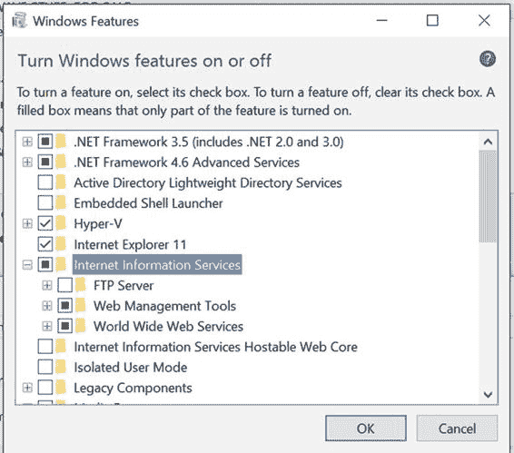
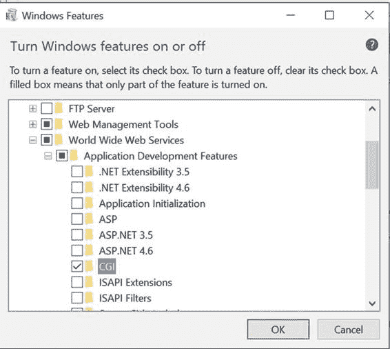

# `php -m`

[PHP 模块]

`bz2`  
`calendar`  
`Core`  
`ctype`  
`curl`  
`date`  
`ereg`  
`exif`  
`fileinfo`  
`filter`  
`ftp`  
`gettext`  
`gmp`  
`hash`  
`iconv`  
`json`  
`libxml`  
`mhash`  
`mysql`  
`mysqli`  
`openssl`  
`pcntl`  
`pcre`  
`PDO`  
`pdo_mysql`  
`pdo_sqlite`  
`Phar`  
`readline`  
`Reflection`  
`session`  
`shmop`  
`SimpleXML`  
`sockets`  
`SPL`  
`sqlite3`  
`standard`  
`tokenizer`  
`xml`  
`zip`  
`zlib`  

[Zend 模块]

在 Mac OSX 平台上，PHP 是预装的。在我使用的 Mac OSX 版本（El Capitain）上，可以使用与上述相同的命令列出已安装的版本：

```
$ httpd -v
Server version: Apache/2.4.16 (Unix)
Server built:   Jul 31 2015 15:53:26

$ php -v
PHP 5.5.30 (cli) (built: Oct 23 2015 17:21:45)
Copyright (c) 1997-2015 The PHP Group
Zend Engine v2.5.0, Copyright (c) 1998-2015 Zend Technologies
```

默认安装的模块如下：

```
$ php -m
[PHP Modules]
bcmath
bz2
calendar
Core
ctype
curl
date
dba
dom
ereg
exif
fileinfo
filter
ftp
gd
hash
iconv
json
ldap
libxml
mbstring
mysql
mysqli
mysqlnd
openssl
pcre
PDO
pdo_mysql
pdo_sqlite
Phar
posix
readline
Reflection
session
shmop
SimpleXML
snmp
soap
sockets
SPL
sqlite3
standard
sysvmsg
sysvsem
sysvshm
tidy
tokenizer
wddx
xml
xmlreader
xmlrpc
xmlwriter
xsl
zip
zlib
[Zend Modules]
```

在 Windows 上运行 PHP 也几乎同样简单。请注意，PHP 已不再支持较旧版本的 Windows（如 XP/2003 等）。第一步是安装一个 Web 服务器：IIS 或 Apache。如今，这两者在性能或功能上已没有太大区别。如果你计划在 Windows 服务器的 IIS 上部署 PHP 脚本，建议在类似的平台上进行开发。Apache 的部署也同样如此。

当在 Windows 上进行开发而部署到 Linux 时，需要注意这两个操作系统之间的几个关键差异。首先，Windows 上的文件名不区分大小写。如果你的脚本引用了一个名为 `MyFile.php` 的文件，但实际文件名是 `myfile.php`，那么它在 Windows 上可以正常运行，但当你部署到 Linux 平台时就会出错。其次，是目录分隔符的问题。在 Linux 和 Unix 环境中是斜杠（`/`），而在 Windows 上是反斜杠（`\`）。在引用本地文件时，PHP 两种符号都可以使用，但在 URL 中务必始终使用斜杠。建议在 Windows 上始终使用斜杠作为目录分隔符，因为当它作为双引号字符串的一部分时，无需转义该字符。



要在 Windows 10 系统上安装 Internet 信息服务（IIS 版本 7 或更高版本），请打开控制面板，点击“程序和功能”。在左侧栏中有一个“启用或关闭 Windows 功能”的链接。点击后会弹出一个包含 Windows 功能的窗口。只需启用 Internet 信息服务的选项，然后点击确定按钮，如下图所示。

请务必展开“万维网服务”文件夹，接着展开“应用程序开发功能”，并选择“CGI”选项。



这将安装 Web 服务器、PHP 所需的 CGI 模块以及管理工具。请注意，计算机上安装的其他进程（如 Skype 和 Plex）可能已在占用默认的 Web 端口（80）。如果是这种情况，你可以禁用这些服务，或者为 Web 服务器使用不同的端口。

为你正在开发的每个网站使用不同的端口，可以让你托管多个站点。这也允许在同一个系统上同时使用 Apache 和 IIS。

可以在同一个服务器上让多个网站共享一个端口。通过为每个网站使用不同的主机名来实现这一点。这些主机名可以在本地的 `hosts` 文件中管理。该文件在 Windows 系统中的位置是 `c:\Windows\System32\Drivers\etc`，在 Mac 或 Linux 系统中的位置是 `/etc`。