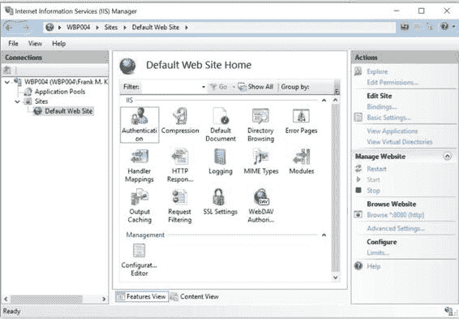
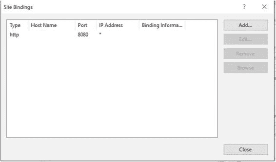
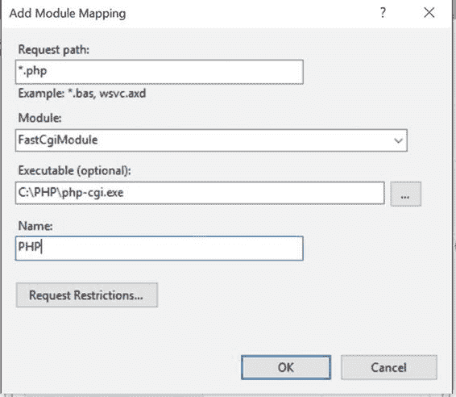

# 默认的 IIS 配置会创建一个在端口 `80` 上监听、且使用 `%SystemDrive%\inetpub\wwwroot` 作为文档根目录的 Web 服务器。`%SystemDrive%` 通常解析为 `C:\`。网站并不一定要使用此目录结构。

下一步是启动网站。就我而言，由于端口 `80` 被 Skype 占用，我必须使用其他端口。使用 `IIS` 管理器应用程序对网站进行更改。Internet 信息服务 (IIS) 管理器可以在控制面板的管理工具中找到，也可以在搜索栏中输入 `IIS` 找到。该应用程序的界面如下所示：





右键单击“默认网站”，选择 `编辑绑定` 选项，然后双击相应行以更改配置。只需将端口号从 `80` 改为 `8080`。还可以限制 IP 地址或主机名，并且在需要时，可以添加其他绑定，将同一网站绑定到不同的端口号和/或主机名。

最后一步是启动网站。在左窗格中右键单击“默认网站”，然后选择 `管理网站` 选项展开菜单，再选择 `启动` 选项即可完成。

现在，可以通过浏览器访问该网站了。本例中的 URL 是 `http://localhost:8080`。

与在 Linux 上安装 Apache 一样，如果启用了 ASP，此网站仅提供静态 HTML 和 ASP 文档。若要获得对 PHP 的支持，还需要一些额外步骤。

首先，从 [`windows.php.net/download`](http://windows.php.net/download) 下载 PHP 二进制包。这里有多个不同版本可供选择。建议使用最新版本，并且该版本应使用最新版本的 Microsoft Visual Studio 编译。当前推荐的是使用 Visual Studio 2015 (VC14) 编译的 PHP 7.0.5。直接下载 zip 文件并将其解压到 `C:\PHP` 或其它任意文件夹。这将生成如下所示的目录结构：

```
PS C:\PHP> ls

    目录: C:\PHP

模式                上次写入时间        长度 名称
----                -------------         ------ ----
d-----        2016/4/2   13:48                dev
d-----        2016/4/2   13:48                ext
d-----        2016/2/13  14:52                extras
d-----        2016/2/13  14:52                lib
d-----        2016/4/2   13:48                sasl2
-a----        2016/4/2   13:49          98816 deplister.exe
-a----        2016/4/2   13:49        1175552 glib-2.dll
-a----        2016/4/2   13:49          15872 gmodule-2.dll
-a----        2016/4/2   13:49       25048064 icudt56.dll
-a----        2016/4/2   13:49        1820160 icuin56.dll
-a----        2016/4/2   13:49          41984 icuio56.dll
-a----        2016/4/2   13:49         226816 icule56.dll
-a----        2016/4/2   13:49        1188864 icuuc56.dll
-a----        2016/4/2   13:49          79407 install.txt
-a----        2016/4/2   13:49        1389568 libeay32.dll
-a----        2016/4/2   13:49          36352 libenchant.dll
-a----        2016/4/2   13:49         135168 libpq.dll
-a----        2016/4/2   13:49          77824 libsasl.dll
-a----        2016/4/2   13:49         235008 libssh2.dll
-a----        2016/4/2   13:49           3286 license.txt
-a----        2016/4/2   13:49          51511 news.txt
-a----        2016/4/2   13:49             43 phar.phar.bat
-a----        2016/4/2   13:49          53242 pharcommand.phar
-a----        2016/4/2   13:49          52736 php-cgi.exe
-a----        2016/4/2   13:49          30720 php-win.exe
-a----        2016/4/2   13:49          98304 php.exe
-a----        2016/4/2   13:49           2523 php.gif
-a----        2016/4/2   13:49          70752 php.ini-development
-a----        2016/4/2   13:49          70784 php.ini-production
-a----        2016/4/2   13:49        7088640 php7.dll
-a----        2016/4/2   13:49         869002 php7embed.lib
-a----        2016/4/2   13:49         197632 php7phpdbg.dll
-a----        2016/4/2   13:49         214528 phpdbg.exe
-a----        2016/4/2   13:49          20183 readme-redist-bins.txt
-a----        2016/4/2   13:49          12722 snapshot.txt
-a----        2016/4/2   13:49         274944 ssleay32.dll
```



在大多数情况下，还需要安装 Microsoft 提供的可再发行组件库。安装正确版本非常重要，但也可以全部安装，其中有些可能已由系统上安装的其他程序和工具预先安装。不同版本的链接可以在网站 [`windows.php.net`](http://windows.php.net) 的左窗格中找到。