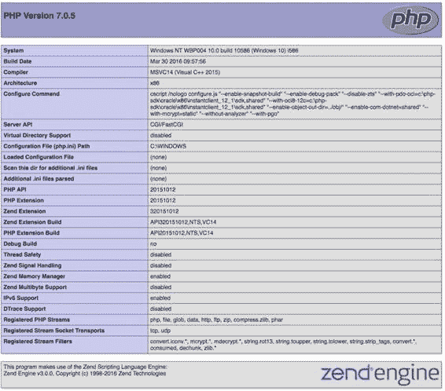
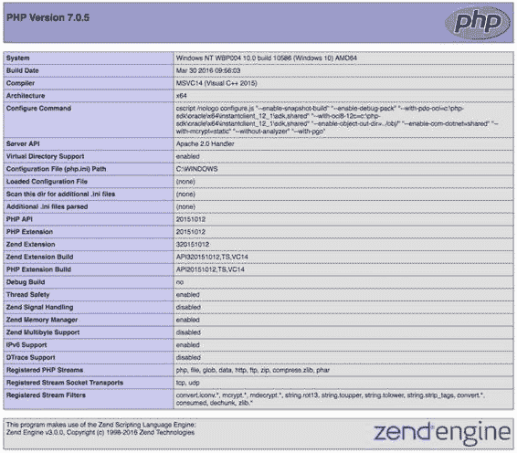

# 安装与配置

## 在 IIS 中启用 PHP

最后一步是在 Web 服务器中启用 PHP。这与在 Linux 上的 Apache 中的操作方式类似。

IIS 使用 FastCGI 接口在 IIS 和 PHP 之间进行通信。在 Linux 上，PHP 是作为 Web 服务器下的模块安装和加载的。

首先，在 IIS 管理器的左侧窗格中点击`Default Web Site`，这将显示一个图标列表。然后双击名为`Handler Mappings`的图标，接着点击右侧窗格中的`Add Module Mapping`链接。这将打开一个包含四个输入框的输入对话框。第一个输入框用于定义请求路径。我们希望 PHP 解释器对所有以`.php`结尾的文件进行调用，因此该值应为`*.php`。

下一个输入框是一个下拉菜单，包含多个可供选择的模块。请务必选择`FastCGIModule`，而不是`CGIModule`。Web 服务器与模块之间的接口不同，如果使用了错误的版本，请求将失败。在第三个输入框中，输入`php-cgi.exe`的路径（或使用浏览按钮定位该文件），最后为模块映射输入一个名称。如下面的屏幕截图所示，我选择了`PHP`。

至此，IIS Web 服务器已配置为可以处理对 PHP 脚本的请求。重启 Web 服务器，并将之前使用的`phpinfo.php`文件放置在文档根目录（`c:\inetpub\wwwroot`）中。如果你想从其他计算机访问该服务器，则需要关闭防火墙，或为 TCP 端口 8080（如果你使用的是该端口）添加一条规则。



示例脚本将生成如下输出：

## 使用 Apache Lounge 提供的二进制文件安装 Apache

可以从 Apache Lounge 获取 Apache 的二进制文件。相关链接可以在 [`windows.php.net`](http://windows.php.net/) 找到。下载与你的系统版本匹配的 zip 文件，并将内容解压到`C:\Apache24\`。该目录与`httpd.conf`文件中的配置相匹配。如果你选择安装在其他目录中，请更新`httpd.conf`文件以匹配该位置。

默认配置也使用端口 80。为了同时运行 IIS 和 Apache，以及其他可能使用端口 80 的应用程序，有必要更改 Apache 的端口。在本示例中，我通过更新`c:\Apache24\conf\httpd.conf`中的以下行，将端口更改为 8090：

从：

```
Listen 80
```

改为：

```
Listen 8090
```

最后一步是使用以下命令启动 Web 服务器：

```
C:\Apache24\bin\httpd.exe
```

此命令用于创建服务器的单个实例。只有当该进程运行时，服务器才会运行。也可以安装一个服务，使其在计算机启动时自动启动。在启动命令中添加`-k install`参数即可实现：`C:\Apache24\bin\httpd.exe -k install`

与之前一样，在浏览器中指向该服务器，即可测试 Web 服务器。此时 URL 为 `http://localhost:8090`。

## 配置 Apache 以支持 PHP 请求

最后一步是配置服务器以支持 PHP 请求。这可以通过使用 PHP 线程安全版本附带的 Apache 模块来实现，也可以通过使用用于 IIS 服务器的 FastCGI 接口来实现。

### 使用 Apache 模块进行配置

进行以下更改：

首先，创建一个名为`C:\Apache24\conf\extras\httpd-php.conf`的文件，并添加以下内容：

```
#
LoadModule php7_module "C:/PHP/php7apache2_4.dll"
AddHandler application/x-httpd-php .php
<IfModule php7_module>
PHPIniDir "C:/PHP"
</IfModule>
```

然后，在`C:\Apache24\conf\httpd.conf`文件的末尾添加以下行：

```
Include conf/extra/httpd-php.conf
```



启动 Apache 服务器后，它将支持 PHP 请求，并且`phpinfo()`的输出将如下所示：

### 使用 FastCGI 接口进行配置

为了配置 Apache 使用 FastCGI 版本的 PHP，需要下载并安装一个额外的 Apache 模块，名为`mod_fcgid.so`。该文件应放置在`c:\Apache24\modules`中，并且 PHP 的配置文件（`C:\Apache24\conf\extras\httpd-php.conf`）应更改为以下内容：

```
#
LoadModule fcgid_module modules/mod_fcgid.so
FcgidInitialEnv PHPRC "C:/PHP"
AddHandler fcgid-script .php
FcgidWrapper "C:/PHP/php-cgi.exe" .php
```

第一行也可以放在主配置文件（`C:\Apache24\conf\httpd.conf`）中。第二行指示 PHP 在`C:\PHP`中查找`php.ini`文件。第三行指示 Apache 通过 FastCGI API 处理对`.php`文件的请求，最后一行指示 FastCGI 调用`php-cgi.exe`可执行文件。

此外，还需要添加一个名为`ExecCGI`的选项，以允许 Apache 执行 CGI 脚本。这可以通过在主文件中更改`<Directory>`部分的`Options`来实现，将`Options Indexes FollowSymLinks`改为`Options ExecCGI Indexes FollowSymLinks`，或者对每个需要相同权限的虚拟主机进行类似的更改。

如果我们在浏览器中加载`phpinfo.php`文件，输出将显示服务器正在使用 CGI/FastCGI 服务器 API，而不是 Apache2Handler。

在 Apache 和 IIS 中使用 FastCGI 接口，可以在同一系统上安装多个版本的 PHP。创建多个指向同一文档根目录但使用不同 CGI 处理程序的虚拟主机，可以非常方便地使用不同版本的 PHP 测试应用程序代码。

---

## 配方 1-2：配置 PHP

### 问题

上一节的重点是安装 Web 服务器并对其进行基本配置，以便与 PHP 配合使用。PHP 有大量独立于 Web 服务器的配置选项。那么，配置 PHP 的最佳方法是什么？

### 解决方案

基本配置通过一个名为`php.ini`的文件完成。该文件可以位于多个不同的位置，具体取决于 PHP 的编译和安装方式以及所安装的操作系统。此外，还可以根据执行 PHP 脚本所使用的服务器 API，拥有不同的`php.ini`文件。这使得可以为 Web 服务器使用一个`php.ini`文件，而为作为 cron 作业或命令行执行脚本的 CLI 版本 PHP 使用另一个不同的文件。

在大多数 Linux 和 Mac OSX 系统上，`php.ini`文件的常见位置是`/etc/php.ini`，而在 Windows 上，通常将这些文件放在`C:\Windows`文件夹中，但也可以根据环境变量或其他配置选项将其放置在其他位置。

如果只找到一个`php.ini`文件，它将用于所有服务器 API。有一种特殊的命名约定，可以为每个服务器 API 指定特定的文件。这些文件的名称可以通过将 SAPI 的名称替换到`php-SAPI.ini`文件的名称中来实现。常见的 SAPI 名称包括`cli`、`apache`、`apache2handler`、`cgi-fcgi`、`isapi`等。

`php.ini`中的某些设置可以在运行时设置或覆盖。这通过`ini_set()`函数完成。一些设置会影响资源和安全性，这些设置只能在主`php.ini`文件（系统管理员）中定义；其他设置可以在每个目录的基础上设置，还有一些可以由脚本在运行时设置（通过`ini_set()`）。

通常的做法是为开发环境使用一种配置，为生产环境使用另一种配置。在开发环境中，通常希望将错误和警告直接显示在网页中；而在生产环境中，最好不显示任何可能暴露漏洞或仅仅使访问者感到困惑的错误或警告。

如果服务器托管多个虚拟主机，则可能需要在 PHP 级别覆盖某些值。

以下是排版后的 Markdown 文档：

`ini file for one or more of these virtual hosts`。这样，即使两个站点安装在同一台 Web 服务器上、共用同一个 `php.ini` 文件，也可以为开发实例和生产实例分别设置不同的错误报告配置。这些覆盖设置可以在 Apache 配置中定义虚拟主机的部分进行定义，或者放在特定目录下的 `.htaccess` 文件中。

建议尽量减少`.htaccess`文件的使用。这些文件会在每次请求时被解析，可能对性能产生影响。使用Apache配置或`php.ini`文件则只需在服务器启动时读取一次设置。

## 第 1 章 ■ 安装与配置

如果在`php.ini`中将`display_errors`选项设置为关闭，而希望为某个单独的主机设置不同的值，可以通过在Apache配置的`<VirtualHost></VirtualHost>`段中添加`php_flag`来实现。这既可以放在主`httpd.conf`文件中，也可以放在主机专属的配置文件中，示例如下。

```
<VirtualHost *:80>
ServerName www.example.com
DocumentRoot /var/www/example.com/root
DirectoryINdex index.html index.php
php_flag display_errors on
</VirtualHost>
```

`php_flag`选项用于设置布尔值类型的选项。其他`php.ini`值可以使用`php_value`选项进行设置或覆盖。若要将`error_reporting`的值设置为`E_ALL`（显示所有错误、警告和通知等），则需要使用`E_ALL`对应的整数值。在`php.ini`文件中进行配置时，可以使用名称（如`E_ALL`、`E_ERROR`、`E_NOTICE`等）。但这些名称在Apache配置中无法识别，因此必须使用对应的整数值。可通过以下命令行脚本查找`E_ALL`常量的值：