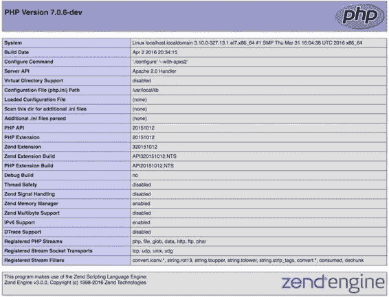

# `php -r 'echo E_ALL;'`

在运行 CLI 版本的 PHP 时，`-r` 选项是执行简单单行 PHP 脚本的便捷方式。该脚本会显示该值为整数前 15 个位之和，即 32767。因此，要在 Apache 配置中将 `error_reporting` 设置为 `E_ALL`，请使用以下行：`php_value error_reporting 32767`

## 工作原理

从源码安装 PHP 时，会包含两个不同版本的 `php.ini` 文件，分别名为 `php.ini-development` 和 `php.ini-production`。这两个文件可作为两种不同环境的推荐基线。大多数情况下，它们是配置 PHP 的良好起点，但随着网站功能的增加，往往需要添加或更改某些值。这些文件的开头有一个快速参考部分，列出了在两个环境中通常不同，或在没有设置时与默认值不同的选项：

```
;;;;;;;;;;;;;;;;;;;
; Quick Reference ;
;;;;;;;;;;;;;;;;;;;

; The following are all the settings that are different in either the production
; or development versions of the INIs with respect to PHP's default behavior.
; Please see the actual settings later in the document for more details as to why
; we recommend these changes in PHP's behavior.

; display_errors
; Default Value: On
; Development Value: On
; Production Value: Off

CHAPTER 1 ■ INSTALLATION AND CONFIGURATION

; display_startup_errors
; Default Value: Off
; Development Value: On
; Production Value: Off

; error_reporting
; Default Value: E_ALL & ~E_NOTICE & ~E_STRICT & ~E_DEPRECATED
; Development Value: E_ALL
; Production Value: E_ALL & ~E_DEPRECATED & ~E_STRICT

; html_errors
; Default Value: On
; Development Value: On
; Production value: On

; log_errors
; Default Value: Off
; Development Value: On
; Production Value: On

; max_input_time
; Default Value: -1 (Unlimited)
; Development Value: 60 (60 seconds)
; Production Value: 60 (60 seconds)

; output_buffering
; Default Value: Off
; Development Value: 4096
; Production Value: 4096

; register_argc_argv
; Default Value: On
; Development Value: Off
; Production Value: Off

; request_order
; Default Value: None
; Development Value: "GP"
; Production Value: "GP"

; session.gc_divisor
; Default Value: 100
; Development Value: 1000
; Production Value: 1000

; session.hash_bits_per_character
; Default Value: 4
; Development Value: 5
; Production Value: 5

CHAPTER 1 ■ INSTALLATION AND CONFIGURATION

; short_open_tag
; Default Value: On
; Development Value: Off
; Production Value: Off

; track_errors
; Default Value: Off
; Development Value: On
; Production Value: Off

; url_rewriter.tags
; Default Value: "a=href,area=href,frame=src,form=,fieldset="
; Development Value: "a=href,area=href,frame=src,input=src,form=fakeentry"
; Production Value: "a=href,area=href,frame=src,input=src,form=fakeentry"

; variables_order
; Default Value: "EGPCS"
; Development Value: "GPCS"
; Production Value: "GPCS"
```

如果你是从预编译的发行版安装，可能会看到默认标准，并且 `php.ini` 文件可能被拆分为多个文件以便管理。

除了 `display_errors` 和 `error_reporting`，还有一个名为 `log_errors` 的选项。当它启用时，根据 `error_reporting` 标志遇到的所有错误都会被写入日志文件。这在开发或生产服务器上发生错误后尝试追踪错误时非常有用。作为开发者，你可能无法访问出现错误的浏览器，因此事后能够翻阅错误日志是一种有用的调试工具。与 `log_errors` 选项一起，还有一个选项（`error_log`）用于指定错误日志文件的名称。如果未指定，错误将被写入 Apache 的错误日志。

`error_log` 选项可以设置为文件名或完整路径。当只配置为文件名时，文件将被放置在请求的主 PHP 脚本所在的同一目录中。如果使用完整路径，错误文件将写入特定位置，甚至可以由同一服务器上的多个主机共享。

如果启用了 `E_NOTICE` 选项，错误日志文件可能会增长得非常快。建议定期清除这些文件。

`register_argc_argv` 选项用于定义是否定义 `$argc` 和 `$argv` 变量。这些值通常与 CLI 版本的 PHP 一起使用，以访问传递的参数数量（`$argc`）和这些参数的值（`$argv`）。CLI 版本实际上会覆盖 `php.ini` 中的这个值，并始终启用这些值。在 Web 环境中，该值的意义不大，因为脚本的参数存储在 `$_POST`、`$_GET` 和其他超全局变量中。

默认的 `php.ini` 文件大小约为 68kb。它们包含大量描述性文本，在解析文件时这些文本会被忽略。`php.ini` 文件的大小对大版本或小版本并无明显影响，因为该文件仅在服务器启动时读取一次。

除了这里描述的值之外，查看内存使用、执行时间、POST 大小和上传数据的配置值也很重要。如果最大内存限制设置得太高，在高流量情况下可能会耗尽资源。另一方面，内存限制必须足够高以处理数据。重要的是以合理限制内可行的方式编写网站代码。如果你遇到内存问题，可以直接增加配置值，但这可能表明你需要重构脚本以更有效地利用资源。

内存分配只能在 `php.ini`（或 Apache 配置）中进行配置。而 `max_execution_time` 则不是这样。它默认设置为 30 秒，对于大多数网站上的请求来说应该足够了。实际上，任何耗时超过 4 秒的请求都应尽可能优化，以给用户提供最佳体验。然而，在某些请求上可能需要增加执行时间。如果你有一个分析大型数据集的查询，并且需要额外的时间，可以通过 `ini_set()` 函数指定所需时间。将最大执行时间延长到 90 秒的语法如下：

```
ini_set('max_execution_time', 90);
```

Web 服务器可能有自己的超时值，如果超过该值，则会中断 PHP 脚本的执行。`max_execution_time` 仅影响 PHP 实际运行时间。如果 PHP 脚本包含系统调用，则在这些调用运行期间“时钟”会停止。

一个重要的配置选项是默认时区。如果没有此配置，每次使用日期函数时系统都会生成警告。该设置称为 `date.timezone`，可以设置为任何受支持的时区值。将其设置为 `UTC` 会导致所有日期/时间函数与以 `gm` 为前缀的函数行为相同。函数 `date()` 和 `gmdate()` 将返回相同的值。将其设置为任何其他值，如 `'America/Los_Angeles'`，将导致这两个函数返回偏移 8 小时的值。

脚本在需要时可以更改默认时区。如果用户的时区存储在数据库中，脚本可以使用该值来设置时区。这样，所有日期/时间值的表示都可以根据每个用户的时区进行。动态设置时区的函数称为`date_default_timezone_set()`，它接受一个字符串作为唯一参数。

大多数配置选项同时适用于 Windows 和 Linux，但其中一些是 Windows 特定的。主要区别在于扩展的命名。在 Linux 上，名称以`.so`结尾；在 Windows 上，它们以`php_`开头并以`.dll`结尾（`mysqli.so`对比`php_mysqli.dll`）。

扩展可以通过以下配置加载：

```
extension=mysqli.so
```

或在 Windows 上：

```
extension=php_mysqli.dll
```

扩展也可以编译进去，因此无需在`php.ini`中加载它们。标准扩展（`Core`、`ctype`、`date`等）就是这种情况。

## 配方 1-3：编译 PHP

### 问题

对于大多数 PHP 开发者来说，使用预编译版本的 PHP 很可能已经足够，但如果操作系统未提供最新版本，或者你想创建自己的扩展，甚至想为 PHP 项目做出贡献，你就需要从源码编译 PHP。这该如何实现？

### 解决方案

获取 PHP 源码有两种基本方式。第一种是下载预配置且官方发布的 PHP 版本，另一种是从 git 仓库获取源码。第一个选项提供匹配特定版本的所有文件，当发布新版本时，开发者必须下载该软件包并重新编译所有内容。使用 git 仓库可以非常轻松地在版本之间切换，并且也很容易始终拥有最新版本。不建议在当前开发分支上运行生产服务器。它可能包含未经测试的功能。生产服务器应运行在官方发布的版本上，因为这些版本已经过严格的 QA 测试。

要从源码编译 PHP，需要安装一些工具。在 Linux 环境下，这些工具包括`automake`、`autoconf`、`libtool`和编译器（`gcc`）。在 Windows 上，你需要安装 Microsoft Visual Studio 的一个版本。除此之外，PHP 还依赖许多开源库。在 Linux 上，这些库大多可以在安装过程中被检测到，并通过包管理器快速安装。在 Windows 上没有使这变得简单的包管理器，但仍然可以下载这些库的源码包并根据需要编译它们。

### 工作原理

使用 PHP 官方发布版和从 git 仓库编译的主要区别在于`buildconf`工具的使用。在官方发布版中，这是在打包源文件时完成的，如果你尝试运行该命令，它会生成一个警告。`buildconf`脚本的基本功能是扫描源码树中的所有目录并生成`configure`文件。然后使用`configure`文件生成`Makefile`，它是编译器的输入，描述了编译配置选项所需的所有文件和依赖关系。本节将演示从克隆的 git 仓库构建 PHP 7。

在全新安装的 CentOS 7 上，第一步是安装一个 git 版本。使用包管理器来执行此操作：

```
$ yum install git
```

确保以 root 身份运行此命令，或者记得在前面加上`sudo`。根据系统上已安装的软件包，此操作可能会安装 git 依赖的其他一些软件包。

在主目录中创建一个名为`Source`的文件夹，切换到该文件夹，然后使用 git 命令克隆 git 仓库：

```
$ mkdir Source
$ cd Source
$ git clone http://git.php.net/repository/php-src
```

这将创建一个名为`php-src`的目录，其中包含所有源文件的副本。如果你需要特定版本的 PHP，请使用`git checkout`命令切换到特定分支。命令`git branch -a`将列出所有可用分支。该列表相当长，因为仓库包含可追溯到 PHP 4.0 的版本。

默认情况下，会检出`master`分支。该分支包含最新、最好的代码。截至目前，这对应于未发布的 PHP 7.1 版本。要获取最新发布的版本（PHP 7.0），请使用以下命令：

```
$ git checkout PHP-7.0
Branch PHP-7.0 set up to track remote branch PHP-7.0 from origin.
Switched to a new branch 'PHP-7.0'
```

在执行`buildconf`命令之前，必须确保工具链完整：

```
$ yum install gcc autoconf automake libtool
```

这将安装足够的工具来运行`buildconf`命令：

```
$ ./buildconf
buildconf: checking installation...
buildconf: autoconf version 2.69 (ok)
rebuilding aclocal.m4
rebuilding configure
rebuilding main/php_config.h.in
```

这将生成用于指定编译 PHP 时使用的操作的`configure`脚本。此时运行此命令会产生一个长输出，并以错误结尾：

```
$ ./configure
checking for grep that handles long lines and -e... /usr/bin/grep
checking for egrep... /usr/bin/grep –E
...
configure: WARNING: This bison version is not supported for regeneration of the Zend/PHP
parsers (found: none, min: 204, excluded: ).
checking for re2c... no
configure: WARNING: You will need re2c 0.13.4 or later if you want to regenerate PHP parsers.
configure: error: bison is required to build PHP/Zend when building a GIT checkout!
```

此错误表明系统缺少编译 PHP 所需的一些功能。在这种情况下，是缺少`bison`库。可以通过以下命令安装：

```
$ yum install bison
```

之后，我们可以再次运行 configure 脚本并查找更多错误。接下来会缺少`libxml2`库。默认情况下，PHP 包含对 SimpleXML 和其他 XML 扩展的支持。仅安装库是不够的。系统需要库以及链接所需的头文件和其他文件，因此安装命令如下：

```
$ yum install libxml2-devel
```

在本示例中，configure 脚本是在没有任何选项的情况下运行的。如果使用了包含各种扩展的选项，可能会出现其他依赖项，你必须安装这些依赖项并重复 configure 步骤，直到所有依赖项都安装完成。

当 configure 脚本成功完成时，输出将以以下行结尾：


```
Generating files
configure: creating ./config.status
creating main/internal_functions.c
creating main/internal_functions_cli.c
+--------------------------------------------------------------------+
| License:                                                            |
| This software is subject to the PHP License, available in this      |
| distribution in the file LICENSE. By continuing this installation   |
| process, you are bound by the terms of this license agreement.      |
| If you do not agree with the terms of this license, you must abort  |
| the installation process at this point.                             |
+--------------------------------------------------------------------+
Thank you for using PHP.

config.status: creating php7.spec
config.status: creating main/build-defs.h
config.status: creating scripts/phpize
config.status: creating scripts/man1/phpize.1
config.status: creating scripts/php-config
config.status: creating scripts/man1/php-config.1
config.status: creating sapi/cli/php.1
config.status: creating sapi/cgi/php-cgi.1
config.status: creating ext/phar/phar.1
config.status: creating ext/phar/phar.phar.1
config.status: creating main/php_config.h
config.status: executing default commands
```

现在，通过运行 `make` 命令即可开始构建。根据启用的扩展数量，这需要几分钟时间。`make` 命令会产生许多输出行，并以这些行结尾：

```
Build complete.
Don't forget to run 'make test'.
```

在安装之前运行测试套件总是一个好主意。通过发送失败的测试列表，它为 QA 团队提供了有价值的反馈。

新版本的 PHP 现在已准备好安装。默认安装位置是 `/usr/local`，因为没有向 `configure` 脚本提供其他位置。这实际上允许将此新编译版本与通过 CentOS 包管理器安装的版本一起安装。要安装此版本，请运行以下命令：

```
$ sudo make install
```

安装后，检查 PHP 的版本：

```
$ php -v
PHP 7.0.6-dev (cli) (built: Apr 2 2016 20:05:26) ( NTS )
Copyright (c) 1997-2016 The PHP Group
Zend Engine v3.0.0, Copyright (c) 1998-2016 Zend Technologies
```

到目前为止，只编译了 CLI 和 CGI 版本的 PHP。为了编译 Apache 模块版本，需要向 `configure` 命令添加至少一个选项：

```
$ ./configure --with-apxs2
```

此命令很可能会失败，因为 `apxs` 脚本默认未随 CentOS 的 Apache 软件包安装。`apxs` 脚本随 `httpd-devel` 软件包一起安装：

```
$ sudo yum install httpd-apxs2
$ ./configure --with-apxs2
$ make
$ sudo make install
```



这将把 PHP 模块安装到位于 `/etc/httpd` 的 `httpd.conf` 文件中。由于之前安装了 PHP 5.4 版本，现在两者之间存在冲突，并且在不出现错误的情况下无法再启动 Apache 服务器。要解决这些错误，必须编辑文件以禁用 PHP 5 版本的模块。安装脚本将新模块安装在 `/etc/httpd/conf/httpd.conf` 中，而 CentOS 安装创建了一个模块配置文件 `/etc/httpd/conf.modules.d/10-php.conf`。首先编辑文件 `/etc/httpd/conf/httpd.conf` 并找到以下行：

```
LoadModule php7_module /usr/lib64/httpd/modules/libphp7.so
```

应移除这一行，并将其添加到文件 `/etc/httpd/conf.modules.d/10-php.conf` 中。现在该文件将如下所示：

```
#


# PHP 是一种嵌入 HTML 的脚本语言，旨在让开发者能够轻松编写动态生成的网页。

```

<IfModule prefork.c>
