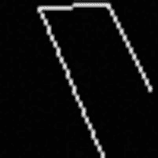
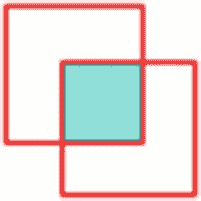

# PHP 文件包含与读取指南

PHP 使用一个名为`include_path`的配置选项来定位包含文件。其工作方式类似于操作系统的环境变量`PATH`。在 Mac 和 Linux 系统上，`include_path`是由冒号（`:`）分隔的一组目录；在 Windows 系统上，分隔符是分号（`;`）。当包含或引入（`require`）一个文件时，解释器会按照`include_path`中指定的目录顺序查找该文件。如果该文件存在于多个目录中，将使用最先找到的那个。

`include_path`配置中的每个目录都可以指定为绝对路径或相对路径。如果指定了相对路径，它将从 PHP 脚本执行的当前工作目录开始查找。在大多数情况下，这将是文档根目录或其下的一个子目录。如果你将所有 PHP 文件放在文档根目录，并将`include_path`配置为`../inc`，那么你可以将所有包含文件放在一个名为`inc`的目录中，该目录位于文档根目录的旁边。

`include`和`require`都可以将文件指定为绝对路径或相对路径。绝对路径以`/`开头，系统将只在该位置查找包含文件。如果使用相对路径，系统会在路径前依次拼接`include_path`配置中的每个部分，直到找到该文件。

根据包含文件的内容，可能无法多次包含它。

对于定义函数或类的包含文件，情况就是如此。多次尝试声明相同的函数或类会导致编译错误。

包含变量定义的其他文件可以多次包含。在大多数情况下，每个文件应该只被包含一次，但也有一些用例，从不同目录包含同名文件是有意义的。

`include`和`require`有特殊的版本，称为`include_once`和`require_once`。这些函数会确保，如果用户尝试多次包含同一个文件，系统只会加载该文件一次，从而防止因多次定义相同的函数或类而引发错误。

`include`和`require`可用于加载非 PHP 文件。如果你有一段 HTML 代码需要从文件系统中读取并按原样提供给请求的浏览器，这会很有用。在这种情况下，被包含的文件不会包含开头的`<?php`标签，其内容将作为输出传递。它会被精确地注入到文件被包含的位置，并且脚本可以在包含文件的前后向浏览器发送其他输出。

注意：尽管 Windows 使用反斜杠（`\`）作为目录分隔符，但 PHP 可以同时使用斜杠（`/`）和反斜杠（`\`）。这使得可以使用 PHP 编写能够在 Linux 和 Windows 平台上无需特别处理即可运行的代码。建议始终使用`/`作为目录分隔符。

### 工作原理

如果你有一个类定义在一个文件中，并且你想从其他文件中访问它，则必须包含定义该类的文件。

```php
<?php
// 7_1.php

class Test {

    protected $a = null;

    function __construct($a) {

        $this->a = $a;

    }

}
```

```php
<?php
// 7_2.php

require "7_1.php";

class Test2 extends Test {

    function SetValue($a) {

        $this->a = $a;

    }

    function GetValue() {

        return $this->a;

    }

}

$t = new Test2(15);

echo $t->GetValue() . "\n";

$t->SetValue(30);

echo $t->GetValue() . "\n";
```

在上面的例子中，我们在一个文件中定义了一个类，并在下一个脚本中包含该文件，在该脚本中，类`Test()`被扩展为`Test2()`。根据`php.ini`中如何定义`include_path`，或者是否使用`ini_set()`函数重新定义它，如果文件与主脚本位于同一目录，你可能需要在文件名前面加上`./`。

如果在`include_path`定义指定的任何位置存在多个同名文件，系统将只包含根据`include_path`指令中列出的目录顺序找到的第一个文件。如果你想绕过在`include_path`包含的所有目录中搜索文件，可以指定一个绝对路径。如果你打算与可能将应用安装在不同位置的用户共享该应用，这样做可能会引起问题。

---

## 配方 7-2：读取文件

### 问题

在之前的配方中，我们研究了包含代码片段或其他文件，这些文件要么被执行，要么作为输出传递给客户端。但是，如果文件包含的数据在发送到客户端之前必须经过处理，该怎么办？

### 解决方案

PHP 附带了许多用于读取文件的函数。最基础的函数（如`fopen()`，`fclose()`，`fread()`等）模拟了操作系统的底层文件处理功能；而更高级的函数（如`file_get_contents()`，`file()`，`fgetcsv()`）允许你通过单个命令读取文件、读取文件并将其转换为数组，或者读取文件并将其内容解析为逗号分隔值（CSV）文件。

其他函数如`readfile()`和`fpassthru()`，会简单地将文件内容或文件指针的内容读取出来，并直接发送到输出。

### 工作原理

使用`fopen()`创建一个可用于对文件进行读和/或写操作的文件句柄，其工作方式与 C/C++ 中相同函数的类似。

```php
<?php
// 7_3.php

$f = '';

$fp = fopen('myfile.txt', 'r');

if ($fp) {

    while ($s = fread($fp, 100)) {

        $f .= $s;

    }

    fclose($fp);

}

var_dump($f);
```

在这个例子中，文件`myfile.txt`被以只读模式打开，这由`fopen()`函数的第二个参数`r`指示。该文件可以指定为相对路径或绝对路径。在此例中，文件预期与 PHP 脚本位于同一目录。

如果文件成功打开，`fopen()`函数将返回一个文件句柄。良好的编程实践是在读取任何内容之前检查错误。如果文件缺失或被另一个进程锁定以进行写入，导致系统无法打开该文件，它将返回`0`而不是一个文件句柄。这使得错误检查非常容易。只需在进入读取步骤之前检查文件句柄是否有值即可。

通过循环读取文件，每次读取最多 100 字节。内部文件指针会移动 100 字节，然后为下一次迭代做准备。此过程持续进行，直到`fread()`函数无法读取更多数据。`fread()`函数将返回实际读取的字节数。如果文件长度为 233 字节，循环将进行 3 次迭代：前两次将读取 100 字节，最后一次将读取剩余的 33 字节。`fread()`函数被第 4 次调用，但由于没有更多数据可读，返回值将为`0`，循环将退出。之后，使用`fclose()`函数关闭文件，并使用`var_dump()`函数将文件内容写入标准输出。

解释器会在脚本终止时自动关闭任何脚本未关闭的文件。这对于在 Web 环境中使用的脚本来说很方便，但如果脚本用于长时间运行的进程，建议在所有文件不再使用时关闭它们。
```


### 使用 `fopen()` 与文件读取

使用 `fopen()` 并每次只读取文件的一部分，有助于降低内存使用量。`fopen()` 的第一个参数是文件名和路径，第二个参数用于标识文件打开时的模式。该参数由一个或多个字符组成。选项包括：`r` 表示读取，`w` 表示写入，`a` 表示追加。这些选项可与 `+` 组合，以添加相反的模式。此外，还可以使用 `x` 来打开文件进行写入，但如果文件已存在，操作将失败。模式 `c` 表示以写入方式打开文件，文件指针位于文件开头，但与 `w` 模式不同，文件不会被截断。

如果你在文件中查找特定模式，可以丢弃每个片段，直到找到目标内容。或者，如果你知道要从哪个特定偏移量开始读取，可以在读取或写入之前使用 `fseek()` 函数将文件指针移动到该位置。这比逐块读取文件要快。

在上面的例子中，我们最终将整个文件读取并存储到一个变量中，因此需要足够的内存来容纳整个文件。以下是通过使用 `file_get_contents()` 函数获得相同结果的更简单方法。


## 第 7 章 ■ 文件与目录

```php
<?php
// 7_4.php
$f = file_get_contents('myfile.html');
echo $f;
```

此示例读取文件内容并将其发送回客户端。如果文件包含以下内容：

```html
<!DOCTYPE html>
<html>
<head>
<title>PHP 与 MySQL 配方</title>
</head>
<body>
<h1>第 7 章</h1>
<p>本章是关于文件和目录的内容</p>
</body>
</html>
```

浏览器中的输出将如下所示：

无需打开和关闭文件，也无需指定读取操作。这些全部在内部处理。一个命令即可完成打开文件、读取内容、将其存储为变量并关闭文件的操作。

## 配方 7-3：写入文件

### 问题

并非所有 PHP 输出都旨在发送到浏览器或控制台（标准输出）。在调试代码问题时有帮助的日志函数、写入缓存内容以便 Web 服务器无需调用 PHP 即可读取，或仅仅是与其他系统交换数据，这些都需要以某种形式写入本地文件系统上的文件。

### 解决方案

写入文件遵循与上一配方中描述的文件读取相同的语义。基本函数（`fopen()`、`fclose()` 和 `fwrite()`）是底层函数的封装，而像 `file_put_contents()` 和 `fputcsv()` 这样的函数则允许你通过单个命令执行更高级的操作。

## 第 7 章 ■ 文件与目录

### 工作原理

在以下示例中，一个字符串被写入文件。

```php
<?php
// 7_5.php
$f = '';
$fp = fopen('myfile.txt', 'at');
if ($fp) {
    fwrite($fp, "要写入此文件的文本\n 以及第二行的一些内容");
    fclose($fp);
}
```

文件以选项 `'at'` 打开。这表示如果文件已存在，文本将追加到文件末尾。使用 `'wt'` 则会覆盖文件的任何现有内容。选项中的 `t` 表示内容为文本。使用 `b` 则表示二进制内容。

类似地，也可以通过单个函数调用写入文件。`file_put_contents()` 函数接受两个参数，其中第一个是文件路径，第二个是要写入的内容。如果文件已存在，它将被新内容覆盖。可以向函数调用传递第三个参数，以强制将内容追加到现有内容后面。第三个参数是一个位掩码标志，其中 `FILE_APPEND` 是使函数追加内容的值。在第三个参数中添加标志 `LOCK_EX` 将确保对文件进行独占锁定，这样其他进程就无法同时写入该文件。

编写一个简单的日志记录系统可能如下所示：

```php
<?php
// 7_6.php
```


`$msg = date("Ymd H:i:s ") . "Script started\n";`

`file_put_contents('myfile.log', $msg, FILE_APPEND);`

在该示例中，要记录的消息是带有预定义格式的日期，然后是实际消息。

请注意，`date()` 函数调用时只传入了单个格式化参数。这使得该函数在生成字符串时会使用当前的日期/时间。格式化字符串末尾还包含一个空格，用于与实际消息之间产生一些间隔。消息以 `\n` 字符结尾，以强制下一条消息在新的一行中记录。多次运行此脚本后，文件内容将类似这样：

`20160201 20:33:49 Script started`

`20160201 20:36:48 Script started`

`20160201 20:36:49 Script started()`

## 诀窍 7-4：复制、重命名和删除文件

### 问题

通过以指定模式打开文件，可以创建文件并从中读取内容，但如果需要删除文件、复制文件或将其移动到文件系统中的其他位置，该怎么办？

### 解决方案

`copy()` 和 `rename()` 函数作用于源文件名和目标文件名。第一个参数是源文件，第二个参数是目标文件。每个文件名可以是相对路径或绝对路径，用于指定这两个文件。

`copy()` 函数仅能用于复制文件。如果你想复制一个包含所有文件和子目录的目录，则必须编写一个函数来读取所有目录和文件的名称，并逐一复制它们。

将文件移动到其他位置与重命名文件是相同的操作。使用相同的文件名但不同的路径，即可将文件移动到新位置。`rename()` 函数可用于普通文件、链接和目录。

文件可以通过 `unlink()` 函数来移除或删除。该函数适用于普通文件和链接，但不适用于目录。要删除一个目录，你必须首先确保该目录中的所有文件和子目录已被删除，然后使用 `rmdir()` 函数来移除该目录。

### 工作原理

要将文件复制到同一目录下的新文件，你可以这样做：

```php
// 7_7.php
copy('myfile.log', 'myfile.log.1');
```

此示例使用了我们在示例 7_6 中创建的同一个日志文件。两个文件名都是相对于脚本执行位置的，本例中两个文件将位于同一目录下。

如果你想将文件从另一个目录复制到当前目录，只需更改源路径为源文件所在的绝对路径或相对路径即可。例如，该文件可能来自一组位于当前目录旁边 `config` 目录中的分发文件。

```php
// 7_8.php
copy('../config/config.php.tmpl', 'config.php');
```

运行此脚本会将位于 `../config` 中的 `config.php.tmpl` 文件复制到脚本所在的同一目录，并将其重命名为 `config.php`。如果你对 `config.php` 进行了修改，再次运行脚本则会在无警告的情况下覆盖该文件，使其恢复为原始文件的副本。

如果你不想复制文件，而只是想将其从 config 目录移动到当前目录，只需像示例 7_9.php 所示那样，将 `copy()` 函数替换为 `rename()` 函数即可。

```php
// 7_9.php
rename('../config/config.php.tmpl', 'config.php');
```

如果源文件缺失，或者目标文件/目录对于执行脚本的用户缺少写入权限，`copy()` 和 `rename()` 函数都会输出警告。

如果你正在创建一个缓存系统并希望删除缓存文件，可以使用 `unlink()` 函数来实现。在示例 7_10.php 中，我们展示了如何创建一个函数，在尝试删除文件之前先检查文件是否存在。这可以防止因文件不存在而触发警告。

```php
// 7_10.php
function DeleteCache($name) {
   if (file_exists($name)) {
       unlink($file);
   }
}
DeleteCache('cache.html');
```


此函数适用于普通文件以及指向其他文件的符号链接。如果文件是符号链接，则只会移除该链接，原始文件仍将保留。有关符号链接的更多信息，请参见第 7-7 节。

## 技巧 7-5. 文件属性

### 问题
除了文件名和内容之外，文件还有其他属性可能对开发人员甚至最终用户有用。了解文件的大小、创建时间或最后修改时间，有助于判断文件是否包含新信息。

### 解决方案
`filesize()`、`filectime()`、`filemtime()` 和 `fileatime()` 函数提供了文件大小、创建时间、修改时间和访问时间的信息。`stat()` 函数可以提供关于文件的更详细信息，因为它返回一个值数组，其中包含设备编号、inode、文件大小、ctime、mtime、atime、块大小和块数。除此之外，还可以使用 `file_exists()`、`is_readable()`、`is_dir()`、`is_file()`、`is_link()` 来判断文件是目录、普通文件还是符号链接。

上述所有函数都接受一个参数，即文件名，包含相对路径或绝对路径。这些函数不适用于由 `fopen()` 函数返回的文件句柄。`fstat()` 函数可用于从文件句柄获取文件信息。此函数接受文件句柄作为参数，而不是文件名。

许多提供文件系统中文件信息的函数会缓存其结果，以提高调用性能，避免每次对同一文件调用这些函数时都去执行底层系统调用。要清除此缓存，可以调用 `clearstatcache()` 函数。如果在单次执行过程中多次检查同一个文件，则需要在每次检查之间调用 `clearstatcache()` 函数。

### 工作原理
`filesize()`、`filectime()`、`filemtime()` 和 `fileatime()` 函数都返回整数值。从创建、修改和访问时间得出的 UNIX 时间戳可以通过 `date()` 函数转换为人类可读的数值，如下例所示。使用 `date()` 函数时，指定时区非常重要。这可以在 `php.ini` 中完成，或者使用 `date_default_timezone_set()` 函数。如果未找到时区，系统将打印警告并使用 UTC 时间。

```php
<?php
// 7_11.php
date_default_timezone_set("America/Los_Angeles");
clearstatcache();
$file = "7_11.php";
echo "File Size: " . filesize($file) . "\n";
echo "Created : " . date("Y-m-d H:i:s", filectime($file)) . "\n";
echo "Modified : " . date("Y-m-d H:i:s", filemtime($file)) . "\n";
echo "Accessed : " . date("Y-m-d H:i:s", fileatime($file)) . "\n";
?>
```

输出将如下所示：
```
File Size: 354
Created : 2016-04-10 11:30:46
Modified : 2016-04-10 11:30:46
Accessed : 2016-04-10 11:31:19
```

在某些 UNIX/Linux 平台上，可以将系统配置为忽略访问时间的更新。这样做通常是为了提高性能。在这种情况下，`fileatime()` 函数作用不大。

您也可以使用 `stat()` 函数通过一次函数调用获取类似的数据。

```php
<?php
// 7_12.php
date_default_timezone_set("America/Los_Angeles");
clearstatcache();
$file = "7_11.php";
$stat = stat($file);
print_r($stat);
?>
```

该脚本的输出将如下所示：
```
Array
(
    [0] => 16777220
    [1] => 145615535
    [2] => 33188
    [3] => 1
    [4] => 502
    [5] => 20
    [6] => 0
    [7] => 356
    [8] => 1454365742
    [9] => 1454361413
    [10] => 1454361413
    [11] => 4096
    [12] => 8
    [dev] => 16777220
    [ino] => 145615535
    [mode] => 33188
    [nlink] => 1
    [uid] => 502
    [gid] => 20
    [rdev] => 0
    [size] => 356
    [atime] => 1454365742
    [mtime] => 1454361413
    [ctime] => 1454361413
    [blksize] => 4096
    [blocks] => 8
)
```

请注意数据是如何重复的。`stat()` 函数为相同的数据同时返回数字索引和名称索引的值。

## 技巧 7-6. 权限

### 问题


如果 PHP 运行所在文件系统与多个用户共享，或者不同进程之间通过文件进行交换，则可能有必要使用文件权限来控制可以对文件执行的操作。

### 解决方案

PHP 诞生于 Linux 平台，并使用 POSIX 系统来管理文件权限。POSIX 系统使用三个位来表示执行（1）、读取（2）和写入（4）权限，并且可以为文件所有者、用户组和其他用户分别定义这些权限。通常用三位八进制数来表示这些权限。在 PHP 中，我们在三位数前面加上一个 `0`，以表明该数字是八进制而非十进制。权限 `0755` 表示文件所有者拥有执行、读取和写入权限，而用户组和其他用户拥有执行和读取权限。

用于设置访问权限的函数包括：设置所有者的 `chown()`、设置用户组的 `chgrp()` 以及设置权限的 `chmod()`。这些函数的用法与同名的命令行函数类似，不过 PHP 函数没有递归设置权限的选项。

### 工作原理

当使用 `file_put_contents()` 或 `fopen()`/`fwrite()` 函数创建文件时，默认行为是将文件所有者和用户组设置为运行脚本的用户，默认的访问模式为所有者可读写，用户组和其他用户可读。为了更改模式，使得只有用户可以读写，可以这样做：

```php
<?php
// 7_13.php
file_put_contents('private.txt', 'The content of this file is private');
chmod('private.txt', 0600);
```

执行结果会得到一个权限如下的文件：
```
-rw------- 1 kromannf staff 35 Feb 1 14:16 private.txt
```

类似地，可以使用 `chown()` 和 `chgrp()` 来更改文件或目录的所有者和用户组。

请注意，只有超级用户才被允许更改文件的所有者和用户组。这些函数最常被安装进程或其他长时间运行进程所使用的 shell 脚本调用。

为了创建文件和目录，运行 PHP 脚本的用户必须对创建文件的文件夹拥有写入权限。在 Web 安装中，通常会对文件和目录移除写入权限，以防止网站修改自身的代码。如果网站包含上传图片和其他文件的功能，那么这些文件上传到的目录必须具有写入权限。

## 方案 7-7\. 符号链接

### 问题

符号链接在 Linux 和 Unix 文件系统中经常被使用，它允许同一个文件存在于多个位置，而无需为每个文件占用磁盘空间。如果你通过一个符号链接打开并读取文件，实际上你是在打开一个位于其他位置、被该链接指向的文件。写入操作也是如此。

### 解决方案

如果传递给 `is_link()` 函数的文件名实际上是一个指向文件或目录的链接，则该函数返回 `true`。你可以使用 `is_dir()` 和 `is_file()` 来检查链接指向的是目录还是文件。PHP 还可以通过 `link()`（硬链接）和 `symlink()`（软链接）函数来创建和删除符号链接。

硬链接和软链接的区别在于链接的创建方式。对于硬链接，链接直接指向 inode（文件的数据部分）；而对于软链接，链接指向的是另一个文件名，该文件名内部又指向一个 inode。

当链接指向另一个文件系统上的文件，或者想要链接一个目录时，会使用软链接。硬链接用于同一文件系统上的文件，其优点是可以将原始文件移动到不同位置而不会破坏链接。软链接则无法做到这一点，因为它的链接目标可能被移动或删除。

如果在符号链接上使用 `stat()` 函数，你将获得关于原始文件的信息。要获取关于链接本身的信息，你必须使用 `lstat()` 函数。

链接通过 `unlink()` 函数来删除。如果指定的路径是一个链接或符号链接，则只会删除该链接。如果该路径是最后一个指向数据区的硬链接，或者是一个真实文件，则该文件会被删除。

### 工作原理

存储在文档根目录及其子目录之外的文件，用户无法通过浏览器和 Web 服务器直接访问。如果出于某种原因，你想让这些文件中的某个可供下载，你可以创建一个指向该文件的符号链接，并使用这个链接生成一个可下载的 URL。这仅在 Web 服务器配置为允许跟随符号链接时才有效。对于 Apache，配置如下所示：

```
<Directory path/to/documentroot">
    Options FollowSymLinks
    AllowOverride None
    Require all granted
</Directory>
```

创建符号链接并使其可供下载的代码如下所示：

```php
<?php
// 7_14.php
// 在此处执行一些访问控制
$token = sha1(random_bytes(50));
link('../data/bigfile.tgz', $token);
header("Location: $token");
```

这段代码生成一个随机的字节字符串，然后为该字符串创建 `sha1` 哈希值。这样做是为了让其他用户难以猜测实际的字符串，同时仍然允许用户下载文件，而无需在 PHP 中将文件读入内存。这个方法有几个缺陷，不应在实际环境中使用。首先，脚本从未删除这些符号链接。一个定期运行的清理脚本可以解决这个问题。但只要符号链接存在，任何知道该 URL 的用户都有可能下载该文件，因为这里不再有任何验证或访问控制。

解决此问题的一个更好的方法是使用 PHP 脚本读取文件，并将其直接发送给客户端，而不是重定向到符号链接。这个选项也存在问题，特别是对于超过 PHP 配置内存限制的大型文件。

使用 Apache Web 服务器的一个名为 `mod_xsendfile` 的扩展可以更好地解决这个问题。其基本功能是，允许 Apache 从一个预定义的、文档根目录之外的位置下载文件，但前提是在下载开始前设置了特定的头部。由于文件存储在 Web 根目录之外，因此无法通过浏览器或其他客户端的请求直接访问。这些文件通过一个 PHP 脚本进行访问，该脚本可以验证用户是否有权下载该文件，如果有权，则通过头部告诉 Apache 可以下载该文件。`Xsendfile` 扩展必须通过配置来指定允许进行这些下载的目录。此扩展的优点是，允许 PHP 脚本终止并释放资源，同时 Apache 从磁盘读取文件并将数据发送给客户端。

`Xsendfile` 扩展可以从这个网站下载：[`tn123.org/mod_xsendfile/`](https://tn123.org/mod_xsendfile/)

在 Apache 中安装并配置此扩展后，就可以在不影响安全性或超出 PHP 内存限制的情况下下载大文件。

```php
<?php
// 7_15.php
// 在此处执行访问控制
header("X-Sendfile: ../data/some_file.tgz");
```

如果你使用的是 NginX，则无需任何特殊扩展即可实现相同的功能。

```php
<?php
// 7_16.php
// 在此处执行访问控制
header("X-Accel-Redirect: ../data/some_file.tgz");
```

如果你创建一个可以部署在 Apache 和 NginX 两种平台上的应用程序，可以编写代码来检查服务器类型，然后选择正确的头部。

```php
<?php
// 7_17.php
// 在此处执行访问控制
if (stristr($_SERVER["SERVER_SOFTWARE"], 'nginx')) {
    header("X-Accel-Redirect: ../data/some_file.tgz");
} else if (stristr($_SERVER["SERVER_SOFTWARE"], 'apache')) {
    header("X-Sendfile: ../data/some_file.tgz");
}
```


# 设置 `X-` 标头后，PHP 代码可以结束，Web 服务器将接管并向用户提供所选文件。如果文件缺失或服务器缺少相应配置，Web 服务器将返回 `404 – file not found` 状态码。

## 方案 7-8. 目录

### 问题

正如我们所见，在文件系统中，文件和目录并没有太大区别。它们都通过相对路径或绝对路径来标识。大多数用于获取状态或检查特定类型的函数都同样适用于文件和目录，但我们如何创建、移动和删除目录呢？

### 解决方案

使用 `mkdir()` 函数可以创建目录。此函数最多接受四个参数，其中第一个参数是新目录的相对或绝对路径，第二个参数是文件权限或模式，其格式与之前描述的 `chmod()` 函数相同。第三个参数是一个布尔标志，用于指示是否启用递归功能，可用来创建嵌套目录。无需多次调用 `mkdir()`，只需提供一个路径，如果设置了递归标志，该函数将创建指定路径中所有尚未存在的目录。第四个参数是上下文（context），仅在该函数与流一起使用时才生效。

要删除目录，需使用 `rmdir()` 函数。在调用此函数之前，请确保目录为空。

### 工作原理

在大多数情况下，网站并不需要创建新目录。其设计初衷是为已位于服务器上的内容提供服务。如果你正在构建一个支持用户之间交换文件或允许用户上传图片的系统，你可能希望为每个用户创建一个目录。这样便于追踪文件来源，并避免一个用户覆盖其他用户的文件。你的应用程序甚至可以允许用户自行创建目录来对文件进行分组。

一个用于创建目录的简单脚本可能如下所示：

```php
<?php

// 7_18.php

// 在此处执行访问控制

mkdir('MyFiolder', 0700);
```

创建完成完整路径所需的所有目录的脚本如下：

```php
<?php

// 7_19.php

// 在此处执行访问控制

mkdir('path/to/MyFiolder', 0700, true);
```

在这个例子中，第三个参数表示系统应创建所有缺失的目录。此脚本将首先在脚本所在位置旁边创建一个名为 `path` 的目录，随后在 `path` 目录内创建一个名为 `to` 的目录，最后在 `to` 目录内创建名为 `MyFolder` 的目录。所有这三个目录的权限均为：所有者拥有 `rwx` 权限，组用户和其他用户没有任何权限。

第二次运行此脚本将会产生一个警告，这是因为名为 `'MyFolder'` 的最终目录已经存在。当仅存在 `'path'` 和 `'path/to'` 目录时运行该脚本，则不会产生任何警告。

## 方案 7-9. CSV 文件

### 问题

如果你要处理大型数据集，将数据导出为能被 Microsoft Excel 等程序读取的格式可能会很有用；或者你可能从其他系统接收使用逗号分隔值（CSV）格式的数据。因此，需要能够基于用户提供的参数（例如用于过滤数据等），使用 PHP 创建或解析 CSV 文件。

### 解决方案

`fgetcsv()` 和 `fputcsv()` 函数用于读取或写入 CSV 文件。这些函数操作由 `fopen()` 函数创建的文件句柄，并且在读取或写入之前，需要以正确的读取或写入模式打开文件。

### 工作原理

从一个数据数组（例如数据库查询的结果集，其中每行包含相同数量的列）创建一个 `.csv` 文件，可能如下所示：

```php
<?php

// 7_20.php

$data = [

['orange', 10],

['blood orange', 10],

['apple', 25],

['pineapple', 1]

];

$fp = fopen('fruits.csv', 'wt');

if ($fp) {

foreach($data as $fruit) {

fputcsv($fp, $fruit);

}

fclose($fp);

}
```


此脚本将生成如下所示的输出：

`orange,10`

`"blood orange",10`

`apple,25`

`pineapple,1`

请注意 `blood orange` 被括在引号中。这是因为字符串中包含一个空格。默认的封闭字符是双引号。

创建制表符分隔文件（`.tsv`）或使用其他分隔符（而非逗号分隔文件），可以通过添加第三个参数（即分隔符）来实现，如下例所示。

```php
// 7_21.php

$data = [
    ['orange', 10],
    ['blood orange', 10],
    ['apple', 25],
    ['pineapple', 1]
];

$fp = fopen('fruits.tsv', 'wt');

if ($fp) {
    foreach($data as $fruit) {
        fputcsv($fp, $fruit, "\t");
    }
    fclose($fp);
}
```

上述代码会产生以下输出：

`orange	10`

`"blood orange"	10`

`apple	25`

`pineapple	1`

从前面的示例可以看出，`fputcsv()` 函数每次处理一行。而 `fgetcsv()` 函数的工作方式略有不同。这与文件中每行长度不一有关。`fgetcsv()` 函数接受的参数数量与 `fputcsv()` 函数相同。第二个参数是从文件中读取的字节长度。此数值必须大于文件中最长行的长度。这是为了让函数能够一直读到第一个换行符。如果该值过小，系统只会读取该行的一部分，返回的数据数组将不完整。该行的剩余部分将在下一次迭代中读取。从 PHP 5.1.0 开始，可以将长度参数设置为 `0`。但这会导致读取速度变慢，因为函数将逐个字节读取，直到遇到换行符或文件末尾。

## 第 7 章 ■ 文件与目录

从示例 `7_21` 创建的 `fruits.csv` 文件中读取数据的代码如下所示：

```php
// 7_22.php

$data = [];
$fp = fopen('fruits.csv', 'rt');

if ($fp) {
    while ($row = fgetcsv($fp, 25)) {
        $data[] = $row;
    }
    fclose($fp);
}

print_r($data);
```

该代码将生成以下输出：

```
Array
(
    [0] => Array
        (
            [0] => orange
            [1] => 10
        )

    [1] => Array
        (
            [0] => blood orange
            [1] => 10
        )

    [2] => Array
        (
            [0] => apple
            [1] => 25
        )

    [3] => Array
        (
            [0] => pineapple
            [1] => 1
        )
)
```

## 方案 7-10. 流

**问题**

文件可能并不总是位于本地文件系统，也可能存在其他类型的数据，这些数据可以使用加载文件所提供的基本功能集来消费。这些功能可以包括读取、写入和定位操作。

**解决方案**

在 PHP 4.3 版本中引入了流的概念。流使开发者能够使用 URL 风格协议从多种不同系统读取和写入数据。甚至可以注册自定义的流包装器，以便使用 `fopen()`、`fread()` 和 `fwrite()` 函数访问自己的数据。

除了从本地硬盘读取文件，您还可以使用 `file_get_contents()` 从 URL 读取数据。

`file_get_contents()` 函数是将本地或远程文件的内容读入字符串的首选方法，前提是文件内容足够小，可以放入内存。这可以是返回 HTML 文档的普通网站，也可以是返回 JSON 或 XML 格式数据的 Web 服务。

**工作原理**

使用 `file_get_contents()` 函数从 URL 下载文件或文档，就如同从本地磁盘读取文件一样简单。您只需提供文件的 URL 而非路径。因此，如果您想从最喜欢的网站获取默认的 HTML 文档，可以这样做：

```php
// 7_23.php

$html = file_get_contents("http://google.com");
echo $html;
```

HTML 文档是为浏览器渲染而设计的，因此除非您正在编写将 HTML 文档复制为静态文件的代码，否则这个示例并非最实用。但 Web 服务器也可以用来托管其他类型的内容，例如 XML 文件或 JSON 字符串。我将在后面的章节中详细介绍这些 Web 服务，但接下来的示例展示了如何使用 PHP 获取 JSON 字符串并将其转换为 PHP 对象。


大多数网络服务或 API 都需要将认证信息和其他参数传递给服务器，以便获取数据。也有一些 API 可以在无需认证的情况下使用，就像这里用到的这个，它会直接返回网络服务器所看到的你电脑的公网 IP 地址。

```php
<?php

// 7_24.php

$data = json_decode(file_get_contents("http://jsonip.com")); print_r($data);
```

## 第 7 章 ■ 文件与目录

此示例的输出是来自 API 的响应。在这个例子中，响应是一个包含三个属性的对象。

```
stdClass Object
(
    [ip] => 180.190.203.15
    [about] => /about
    [Pro!] => http://getjsonip.com
)
```

### 7-11. 流上下文

**问题**

处理不同类型的流时，可能需要一些无法以通用方式传递给 `fopen()` 函数的选项和参数。这些选项和参数可以用来控制流如何响应各种请求。

**解决方案**

使用 `stream_context_create()` 函数可以创建一个上下文资源，这个资源可以作为可选参数用于大多数文件处理函数。要创建流上下文，必须向该函数传递一个或两个关联数组。第一个数组包含选项，第二个可选数组则是参数。第二个 `params` 参数使用并不广泛，但可用于设置一个通知回调函数，该函数可用来实现进度指示等功能。

**工作原理**

默认情况下，当使用 `file_get_contents()` 函数通过 HTTP 协议获取内容时，请求会以 GET 请求的形式创建，所有参数都作为 URL 的一部分传递。如果你想将参数作为头部值传递，或者想发送 POST 请求，则可以使用 `stream_context_create()` 来生成这些参数，使其能够作为第三个参数传递给 `file_get_contents()`。下面的示例展示了如何创建一个脚本，该脚本能够向一个 URL 生成表单 POST 请求（示例中的 URL 是虚构的，但其他部分都是可运行的）。脚本从一个函数开始，该函数用于生成 POST 请求的负载或主体。`http_build_form()` 函数接收两个参数：第一个是用于分隔 POST 中每个变量的边界字符串，第二个是要提交给服务器的键值对关联数组。

在函数之后，数据被填充。这些数据可能来自用户的输入或数据库的查询。在脚本的最后一部分，根据一个选项数组创建了流上下文，并发送了请求。虽然使用了 `file_get_contents()`，但它实际上会先将所有数据发送到服务器，然后获取该请求的响应。服务器在 POST 之后可能会进行重定向；如果是这种情况，请求会自动处理，无需编写额外的代码来处理。如果响应是文件未找到 (404)、访问被拒绝 (403) 或任何其他状态，脚本应自行处理。

## 第 7 章 ■ 文件与目录

```php
<?php

// 7_25.php

function http_build_form($mime_boundary, $data) {
    $eol = "\r\n";
    $form_data = '';

    if (is_array($data)) {
        foreach ($data as $name => $value) {
            if (is_array($value)) {
                foreach($value as $val) {
                    $form_data .= '--' . $mime_boundary . $eol .
                        "Content-Disposition: form-data; name=\"{$name}[]\"" .
                        $eol . $eol . $val . $eol;
                }
            } else {
                $form_data .= '--' . $mime_boundary . $eol .
                    "Content-Disposition: form-data; name=\"{$name}\"" .
                    $eol . $eol . $value . $eol;
            }
        }
    }

    $form_data .= "--" . $mime_boundary . "--" . $eol . $eol;
    return $form_data;
}

$data = [
    'name' => 'Donald Duck',
    'phone' => '555 555 1234'
];

$url = 'http://example.com/form';
$mime_boundary = md5(time());
$content = http_build_form($mime_boundary, $data);

$options = array('http' =>
    array(
        'method' => 'POST',
        'header' => 'Content-Type: multipart/form-data; boundary=' .
            $mime_boundary,
        'content' => $content
    )
);

$context = stream_context_create($options);
$response = file_get_contents($url, FILE_TEXT, $context);
var_dump($response);
```

## 第 7 章 ■ 文件与目录


# 食谱 7-12\. 文件迭代器

### 问题

当要对多个文件执行相同操作时，我们需要一种方法来确定目录中存储了哪些文件，并且需要能够递归遍历目录结构。

### 解决方案

遍历目录中所有文件的简单方法是使用 `glob()` 函数创建一个包含所有匹配特定文件模式的文件的数组，然后使用 `foreach()` 或其他循环方法逐个处理这些文件。`glob()` 函数仅在单个目录中查找。要获取子目录中的文件，必须为每个子目录调用 `glob()` 函数。

第二种选择是使用 `opendir()`、`readdir()` 和 `closedir()` 函数，或者使用更面向对象的方法 `dir()`，它会返回内置类 `Directory` 的一个实例。自 PHP 5.0 起，这些函数已支持 `ftp://` URL 封装器。

另一种选择是使用 SPL 扩展中包含的迭代器类。SPL 代表标准 PHP 库，它是一个默认启用的扩展。迭代器类可以直接与 `foreach()` 一起使用，无需在迭代文件之前将文件系统的内容读入内存。

### 工作原理

接下来的三个示例展示了如何使用上述方法获取目录的内容。

这些脚本将使用脚本所在的同一目录，并打印每个文件的名称，如果是目录则在名称后添加斜杠。

```php
<?php
// 7_26.php
$pattern = "*";
$files = glob($pattern);
foreach ($files as $file) {
    echo $file;
    if (is_dir($file)) {
        echo "/";
    }
    echo "\n";
}
```

这种获取目录中文件名的方法适用于文件数量较少且路径较短的情况。如果处理的目录路径很长或包含大量文件，可能会消耗过多内存。

```php
<?php
// 7_27.php
$dir = dir(".");
while (($file = $dir->read()) !== false) {
    echo $file;
    if (is_dir($file)) {
        echo "/";
    }
    echo "\n";
}
$dir->close();
```

在这个示例中，我们任意时刻在内存中只保留目录中的一个元素。另一个区别是，此方法包含 `'./'` 和 `'../'` 条目。当使用 `glob()` 函数时，这些条目会被自动排除。

若要使用 SPL DirectoryIterator 实现类似功能，代码可能如下所示：

```php
<?php
// 7_28.php
foreach (new DirectoryIterator('.') as $fileInfo) {
    if ($fileInfo->isDot()) continue;
    echo $fileInfo->getFilename();
    if ($fileInfo->isDir()) {
        echo "/";
    }
    echo "\n";
}
```

使用 SPL DirectoryIterator 的一个优点是，尽管行为略有不同，但很容易实现递归。

```php
<?php
// 7_29.php
$iterator = new RecursiveDirectoryIterator('.',
    FilesystemIterator::CURRENT_AS_FILEINFO);
foreach (new RecursiveIteratorIterator($iterator) as $fileInfo) {
    if ($fileInfo->isDot()) continue;
    echo $fileInfo->getPathname();
    if ($fileInfo->isDir()) {
        echo "/";
    }
    echo "\n";
}
```

# 食谱 7-13\. 下载文件

### 问题

Web 服务器向浏览器输出的标准内容是某种包含 HTML、JavaScript、CSS 或 JSON 内容的文本文件。Web 服务器也可以返回浏览器支持渲染的其他类型的文件（如图像和视频文件）。但如果文件用于浏览器渲染以外的其他用途，我们需要一种方法来下载内容并将其保存到磁盘，或者让不同类型的客户端来消费它。

### 解决方案

标准的 Web 服务器配置会根据文件扩展名识别文件的 MIME 类型。如果文件位于 Web 服务器可用于提供文件的目录结构中，大多数情况下你可以直接链接到该文件，浏览器会识别出它不知道如何处理该文件，并将其保存到磁盘。

如果文件位于可用目录结构之外，或者需要根据输入参数组装文件，你可以使用 PHP 读取或生成文件，并使用 `header()` 函数指定 `Content-Type` 和 `Content-Disposition`，以帮助浏览器按照你的意图处理文件。如果你想下载包含 HTML 或图像的文件，并阻止浏览器显示该文件，这也很有用。这将导致浏览器显示保存文件对话框，而不是直接在浏览器中显示内容。

### 工作原理

如果你的文档中有一个链接指向某张图片，你可以创建如下所示的 HTML：

```html
<a href="myfile.gif"></a>
```

这会显示一张图片并创建一个指向同一文件的链接，因此当用户点击该图片时，浏览器只会将该图片作为浏览器中的唯一内容显示。

如果将该 HTML 修改为如下所示：

```html
<a href="myfile.php"></a>
```

你将需要编写一个 PHP 脚本来处理渲染并设置头部信息。该脚本可能如下所示：

```php
<?php
// 7_30.php
header("Content-Type: image/gif; Content-Disposition: attachment;");
readfile('myfile.gif');
```

这将告诉浏览器响应的内容是一个 gif 类型的图像，并指示浏览器打开保存对话框而不是显示文件。你可以添加更复杂的逻辑来处理访问控制、即时生成图像或允许下载任何文件。请务必添加验证检查，以确保文件可以被下载。否则，你可能会让用户下载你的 PHP 脚本或密码文件。

# 食谱 7-14\. 上传文件

### 问题

在 Web 环境中，内容的主要流向是客户端（浏览器）向服务器发送请求，并获取以 HTML 文档形式返回的响应，然后由浏览器渲染。渲染过程可能会向原始服务器或其他服务器发送额外的请求，以获取原始文档中链接标识的其他内容。在这种场景下，传输的大部分字节是从服务器到客户端。

如果你正在构建一个需要用户上传图片或头像的应用程序，或者你想构建一个文档库，其中包含多种类型的文件供其他用户下载，那么你需要一种将文件从客户端推送到服务器的方法。

使用 FTP 或 SFTP 服务器可以解决这个问题，但它们通常无法提供你真正需要的东西。这些服务器只是通向文件系统上预配置位置的网关，用户可以在那里创建文件夹并上传文件，但服务器不对文件进行任何处理，并且通常没有 PHP 集成。你可以创建一个基于 Web 的 API，当上传到 SFTP 服务器完成时由上传应用程序调用，但这会增加额外的复杂性，并且用户无法仅通过浏览器执行这些操作。

### 解决方案

大多数现代浏览器都支持 `multipart/form-data` 编码类型的 `POST` 请求，并允许你包含一个类型为 `file` 的输入字段。这将指示浏览器从本地文件系统中读取一个或多个文件，并将其与 `POST` 请求的其余部分一起发送到服务器。只有用户选择的文件才能被上传。

如果 `POST` 请求的目标是一个 PHP 脚本，数据将在超全局变量 `$_POST` 和 `$_FILES` 中提供，供脚本处理。这些文件将被临时存储在 `php.ini` 中 `upload_dir` 指定的文件夹中，并在 PHP 请求结束时从该目录中删除。由脚本负责将文件复制或移动到其最终位置。


大多数现代浏览器还支持一种基于 JavaScript 的表单数据 API，允许用户通过拖放操作，将本地文件系统中的文件拖拽到浏览器窗口的特定位置。这会触发一个 JavaScript 函数，该函数可以读取文件系统中的文件并创建 POST 请求。使用这种模式，无需每 500 毫秒就由一个独立的进程向服务器发送请求，即可获得精确的上传进度。上传过程不必与 HTML 表单关联。这可以用于让用户轻松地通过一次拖放操作上传新的个人资料图片。

### 工作原理

基本的文件上传包含两个部分。第一部分是一个 HTML 表单，其属性 `enctype` 设置为 `multipart/form-data`。默认值为 `application/x-www-form-urlencoded`，这会导致数据以与 URL 或查询字符串参数相同的方式进行编码。该 HTML 表单至少需要一个类型为 file 的输入字段，如下所示：

```
<html>
<body>
<form method="POST" enctype="multipart/form-data" action="/upload.php">
<input type="file" name="file" />
<button type="submit">上传</button>
</form>
</body>
</html>
```

这将创建一个表单，允许用户从本地文件系统中选择一个文件，然后点击提交按钮将文件发送到服务器。服务器上应有一个 PHP 脚本来接收文件。在此例中，该脚本名为 `upload.php`。在下面的示例中，PHP 脚本在上传后简单地显示了 `$_FILES` 变量的内容。

```
<?php
// upload.php
header("Content-Type: text/plain");
print_r($_FILES);
```

该脚本的输出显示了如下信息：

```
Array (
    [file] => Array
        (
            [name] => myfile.gz
            [type] => application/x-gzip
            [tmp_name] => /tmp/php1zqVJF
            [error] => 0
            [size] => 23435
        )
)
```

这个数组提供了元数据以及临时文件的位置，可供进一步处理。位于 `/tmp/php1zqVJF` 的文件会在脚本结束时自动删除，可以使用 `move_uploaded_file()` 函数将其复制/移动到所需位置。该函数接受两个参数。第一个是临时文件的路径，第二个是新位置的路径。在移动文件之前，调用 `is_uploaded_file()` 也是一个好主意。

## 配方 7-15\. 压缩文件

### 问题

虽然上传系统可用于选择多个文件并将其上传到 Web 服务器，但每个请求只能下载一个文件。如果用户想下载一个相册中的所有图片，那么逐个点击每个图片的链接并选择保存位置将会是一个缓慢的过程。如果服务器能够接收一个包含多个文件的上传文件，或者创建一个包含多个文件供下载的单一文件，那就太好了。

### 解决方案

`ZipArchive()` 类可用于在服务器上组装或解压缩 zip 文件。

### 工作原理

一个简单的函数，用于将服务器上某个目录中的所有文件打包成一个 zip 文件，并将其内容作为响应发送出去，可能如下所示：

```
<?php
// 7_31.php

ini_set("zlib.output_compression", "Off");

$files = glob('.');

if (!empty($files)) {
    $zip = new ZipArchive();
    $tmp_name = tempnam("/tmp", "zipfile");
    $res = $zip->open($tmp_name . ".zip", ZipArchive::CREATE);
    if ($res === true) {
        foreach($files as $file) {
            if (is_file($file) || is_link($file)) {
                $zip->addFile($file);
            }
        }
        $zip->close();
        if (file_exists($tmp_name . ".zip")) {
            $file_name = 'archive.zip';
            $file_size = filesize($tmp_name . ".zip");
            header('Content-Type: application/octet-stream; Content-Disposition: attachment');
            readfile($tmp_name . ".zip");
            unlink($tmp_name . ".zip");
            unlink($tmp_name);
        }
    }
}
```

首先，关闭了输出压缩。如果开启此功能，可能会导致下载的文件出现问题，而且它是一个 zip 文件，本身就已经被压缩了。

然后，我们从当前目录生成一个文件列表。如果数组中存在文件，则在 `/tmp` 文件夹中创建临时存档。zip 文件可能很容易变得过大而无法在内存中处理，因此它将在磁盘上创建。如果创建成功，则逐个添加文件，最后，如果 zip 文件仍然存在，我们设置用于下载文件的标头并将文件发送给客户端。任何临时文件都会在脚本结束时被删除。

与上传许多单独的文件相比，在本地将文件压缩，上传一个单独的文件，然后在服务器上解压缩以便访问各个文件，可能会更快，并且在浏览器中的点击次数也更少。执行解压功能的脚本可能类似于下一个示例。该脚本应从表单的 POST 请求中调用，该请求至少包含一个类型为 file 且名称为 `file` 的输入字段。

```
<?php
// 7_32.php

// 此脚本期望从一个表单的 POST 请求中调用，该表单至少包含一个输入字段
// <input type="file" name="file" />

// 这将在 $_FILES 超全局变量中生成以下值
// $_FILES['file']['error']
// $_FILES['file']['name']
// $_FILES['file']['tmp_name']
// $_FILES['file']['type']
// $_FILES['file']['size']

// 从文件名中获取文件扩展名
function GetExtension($file_name) {
    $arrParts = explode(".", $file_name);
    if (sizeof($arrParts) > 1) {
        return strtolower(end($arrParts));
    }
    else {
        return null;
    }
}

$res = false;
$ext = GetExtension($_FILES['file']['name']);
if ($ext == "zip") {
    $zip = new ZipArchive();
    $res = $zip->open($_FILES['file']['tmp_name']);
}

if ($res === true) {
    $zip->extractTo('folder');
    $zip->close();
}
```

# 第 8 章

# 动态图像

上传到网站的图像可能并不总是立即可用。直接来自智能手机或高分辨率数码相机的图像，其分辨率/尺寸可能过高，不适合在网站上使用。如果要将图像用作个人资料图片或缩略图，最好将其缩小或裁剪出一部分，以去除图像中无关的区域。可以使用 CSS 进行缩放和裁剪，但这仍然需要将完整图像下载到客户端，这会浪费带宽。

使用 PHP 的 GD 扩展，可以在服务器上执行这些以及许多其他图像处理任务。本章将演示如何执行这些以及许多其他任务。示例中使用的函数名称采用所谓的驼峰式写法，即每个单词的首字母大写。这样做是为了提高可读性。PHP 中的所有内部函数都不区分大小写，可以以任何你喜欢的方式编写，只要所有字母的顺序正确即可。

## 配方 8-1\. 创建图像

### 问题

浏览器可以渲染多种不同的图像格式。这些都是像素和颜色的二进制编码，可能带有压缩，也可能没有。最常见的是 GIF、JPEG 和 PNG。虽然可以根据每种文件格式的规范，将图像构建为字节字符串，但这并不实用，并且很可能导致性能问题。

### 解决方案

PHP 的 GD 扩展是一个封装库，它包装了一个名为 `libgd` 的库以及许多其他用于处理和创建各种图像格式及压缩的库。`libgd` 与 PHP 源代码捆绑在一起，因此启用该扩展相对容易。GD 扩展也适用于大多数 Linux 发行版，并且作为标准 DLL 随 Windows 版本的 PHP 一起提供。

GD 扩展中有几个用于创建图像的函数。可以通过使用 `ImageCreateFromJpeg()`、`ImageCreateFromGif()`、`ImageCreateFromPng()` 函数复制文件系统中已存在的图像来实现。PHP 还支持 GD 和 GD2 格式。这些格式在浏览器中不受支持，但可以作为创建其他类型图像的基础格式。


好的，作为高级文档工程师和翻译员，我将遵循您的注意事项和示例，将给定的英文文本翻译成中文。


`ImageCreateFrom*()` 函数都接受一个参数，该参数可以是本地文件系统中的文件路径或 URL。大多数情况下，从本地文件系统加载图像速度更快，但如果图像在多个服务器之间共享，使用 URL 获取图像后再进行处理可能更实用。如果不需要处理图像，则让客户端直接从 URL 加载图像或使用简单的 HTTP 重定向会更快。

© Frank M. Kromann 2016

F.M. Kromann, *PHP and MySQL Recipes*, DOI 10.1007/978-1-4842-0605-8_8

## 第 8 章 ■ 动态成像

此外，可以通过 `ImageCreateFromString()` 函数从字符串创建图像。如果图像存储在数据库或其他存储中，或者通过 API 调用获取图像，这会非常有用。如果传入的字符串不表示有效图像，该函数会发出错误。

最后，还可以创建一个指定大小的新空白图像。这是通过 `ImageCreate()` 和 `ImageCreateTrueColor()` 函数完成的。这两个函数都接受两个参数：新图像的宽度和高度。建议使用 `ImageCreateTrueColor()`，因为它提供了最高质量的图像。使用 `ImageCreate()` 会创建基于调色板的图像，其中每个像素由颜色调色板中的索引表示。使用 `ImageCreateTrueColor()` 时，每个像素将由实际颜色表示。

尽管 PHP 在脚本结束时提供自动清理，但最好手动处理不再需要的图像资源。这通过调用 `ImageDestroy()` 函数完成。

### 工作原理

最简单的图像是所有像素颜色相同的图像。当你使用 `ImageCreateTrueColor()` 创建新的空白图像时，就会得到这样的图像。根据要发送给浏览器的格式，你可以选择相应的输出函数。在此示例中，我们创建一个 50x50 像素的小图像，并使用查询参数 `f` 选择格式。如果参数 `f` 缺失、为空或格式不受支持，默认格式将为 GIF。

```php
// 8_1.php

$img = ImageCreateTrueColor(50, 50);

$f = $_GET['f'] ?: 'gif';

switch (strtolower($f)) {

case 'jpg' :

case 'jpeg' :

header('Content-Type: image/jpeg');

ImageJPEG($img);

break;

case 'png' :

header('Content-Type: image/png');

ImagePNG($img);

break;

default :

header('Content-Type: image/gif');

ImageGIF($img);

break;

}

ImageDestroy($img);
```

来自 PHP 脚本的 `Content-Type` 标准值是 `text/html`。当浏览器返回二进制数据流时，帮助浏览器了解它正在接收什么类型的数据是个好主意。现代浏览器能够查看数据内容并确定其类型。对于图像数据尤其如此，因为其格式众所周知。在此情况下，我们根据请求的文件类型将 `Content-Type` 设置为 `image/jpeg`、`image/png` 或 `image/gif`。

如果从命令行执行此脚本，它将产生以字符串 `GIF87a22?,223?????` 开头的二进制输出。如果将其放置在 Web 服务器上并通过浏览器请求，它将提供一个小的黑色图像。

## 第 8 章 ■ 动态成像

单色图像并不那么有用。实际上，使用 HTML 和 CSS 可以达到相同效果，且不会对服务器产生任何影响，但此示例演示了图像生成的基本功能。接下来让我们看一些更有用的示例。

### 配方 8-2：图像缩放

### 问题

在你的网站上，有一个允许注册用户上传图像的板块，他们可以在博客评论中将其用作头像。用户使用最新的智能手机拍摄自拍照并将其上传到你的网站。这将是一张高分辨率图像，每次新访客浏览你网站的页面时都会占用空间和带宽。可以在浏览器中缩放图像，但这仍然会导致高分辨率图像至少每个访客从服务器传输一次到浏览器。

### 解决方案

基于前面的示例，我们可以创建一个从文件加载图像的脚本。然后它会计算同一图像的较小版本。为了不使图像变形，我们必须保持与原始图像相同的宽高比。要获取图像的大小，可以使用 `ImagesX()` 和 `ImagesY()` 函数，或者使用 `GetImageSize()`，该函数还会返回其他信息，如图像类型。当你知道原始图像的宽度和高度时，可以计算新的宽度和高度，使其保持在固定尺寸的边界内。在此示例中，缩放后图像的大小被设置为 160x120 像素以内。

从 PHP 5.6.3 开始，可以将高度设为 `-1`，缩放将自动保留宽高比。

### 工作原理

示例中使用的基础图像名为 `IMG_0099.JPG`。其宽度为 2048 像素，高度为 1536 像素。首先，我们查看 `GetImageSize()` 返回的值。

```php
// 8_2.php

$orig = GetImageSize('IMG_0099.JPG');

print_r($orig);
```

这将产生以下输出：

```
Array
(
    [0] => 2048
    [1] => 1536
    [2] => 2
    [3] => width="2048" height="1536"
    [bits] => 8
    [channels] => 3
    [mime] => image/jpeg
)
```

## 第 8 章 ■ 动态成像

前两个值包含宽度和高度。第三个值是图像类型。你可以使用常量 `IMG_GIF`、`IMG_JPG`、`IMG_JPEG`（与 `IMG_JPG` 相同）、`IMG_PNG`、`IMG_WBPM` 和 `IMG_XPM` 来比较该值以确定类型，或者直接使用 MIME 字符串。第三个值是一个表示宽度和高度的字符串，而 `bits` 和 `channels` 的值表示比特数和通道数。在此示例中，图像有 8 比特和 3 个通道，允许每像素 24 比特。

```php
// 8_3.php

$size = [160, 120];
$orig = GetImageSize('IMG_0099.JPG');
$a1 = $size[0] / $size[1];
$a2 = $orig[0] / $orig[1];
if ($a1 > $a2) {
    $d = ceil($orig[0] / $size[0]);
}
else {
    $d = ceil($orig[1] / $size[1]);
}
$w = $orig[0] / $d;
$h = $orig[1] / $d;
$img = ImageCreateFromJpeg('IMG_0099.JPG');
$thumb = ImageScale($img, $w, $h);
header('Content-Type: ' . $orig['mime']);
switch ($orig[2]) {
case IMG_JPG :
case IMG_JPEG :
    ImageJPEG($thumb);
    break;
case IMG_PNG :
    ImagePNG($thumb);
    break;
case IMG_GIF :
    ImageGIF($thumb);
    break;
}
ImageDestroy($thumb);
ImageDestroy($img);
```

首先，我们计算新图像的宽高比（`$a1`）和原始图像的宽高比（`$a2`）。然后根据宽度或高度的尺寸比例确定缩放因子。这将确保两个维度都按相同因子缩放，并且整个图像将适合较小的框内。

此代码假设原始图像大于所需的缩略图。如果原始图像较小，则无需缩放，可以直接使用原始图像。

最后有两个对 `ImageDestroy()` 函数的调用。这是因为 `ImageScale()` 创建了原始资源的副本，我们需要同时释放原始资源和副本。`ImageDestroy()` 仅从内存中移除图像。使用 `unlink()` 从磁盘删除图像文件。


## 第 8 章 ■ 动态成像

结果图像如下所示：

### 配方 8-3：图像裁剪

### 问题

在前面的示例中，我们努力保持了与原始图像相同的宽高比。如果我们想从上传的图像中创建一个正方形图像呢？换句话说，基于最小边缩放图像，并剪掉另一个维度中不适合正方形的部分。


### 解决方案

我们可以使用 `ImageCrop()` 函数来代替 `ImageScale()` 函数。这是一个相对较新的函数（PHP 5.5.0 和 PHP 7.0.0）。如果你使用的是旧版本的 PHP，可以使用 `ImageCopyResampled()` 来实现相同的结果。该函数用于将一个图像的矩形区域复制到另一个图像（或同一图像）的矩形区域，并对像素进行重采样，以使复制结果尽可能平滑。

`ImageCrop()` 函数接受两个参数。第一个参数是原始图像的图像资源，第二个参数是一个包含四个值的数组，分别表示要返回区域的 `x`、`y`、`width` 和 `height`。坐标 `x`、`y` 从图像的左上角开始计算。

### 工作原理

如果我们使用与之前相同的图像，但希望将其裁剪并缩放到适合 150x150 像素的盒子中，首先需要计算要裁剪哪一侧，然后计算从原始图像中复制的 `x`、`y`、`width` 和 `height`。

当我们有一个正方形图像时，它可以被缩放到所需尺寸。假设原始图像的宽度和高度都大于 150 像素。本例中没有对此进行检查，但可以轻松添加。对于已经适合盒子大小的图像，无需进行裁剪。

```
<?php
// 8_4.php

$size = [150, 150];

$orig = GetImageSize('IMG_0099.JPG');

$a1 = $orig[0] / $size[0];
$a2 = $orig[1] / $size[1];

if ($a1 < $a2) {
    $width = $size[0] * $a1;
    $height = $size[1] * $a1;
    $x = 0;
    $y = ($orig[1] - $height) / 2;
}
else {
    $width = $size[0] * $a2;
    $height = $size[1] * $a2;
    $x = ($orig[0] - $width) / 2;
    $y = 0;
}

$area = ['x' => $x, 'y' => $y, 'width' => $width, 'height' => $height];
$img = ImageCreateFromJpeg('IMG_0099.JPG');
$crop = ImageCrop($img, $area);
$thumb = ImageScale($crop, $size[0], $size[1]);

header('Content-Type: ' . $orig['mime']);

switch ($orig[2]) {
    case IMG_JPG :
    case IMG_JPEG :
        ImageJPEG($thumb);
        break;
    case IMG_PNG :
        ImagePNG($thumb);
        break;
    case IMG_GIF :
        ImageGIF($thumb);
        break;
}

ImageDestroy($thumb);
ImageDestroy($crop);
ImageDestroy($img);
```

在这个例子中，我们最终在脚本末尾需要释放三个图像资源。此代码生成的图像现在是一个包含图像中心的正方形。


如果你使用的是旧版本的 PHP，或者希望少用一个图像资源，可以使用 `ImageCopyResampled()` 函数来实现相同的结果。

```
<?php
// 8_5.php

$size = [150, 150];

$orig = GetImageSize('IMG_0099.JPG');

$a1 = $orig[0] / $size[0];
$a2 = $orig[1] / $size[1];

if ($a1 < $a2) {
    $width = $size[0] * $a1;
    $height = $size[1] * $a1;
    $x = 0;
    $y = ($orig[1] - $height) / 2;
}
else {
    $width = $size[0] * $a2;
    $height = $size[1] * $a2;
    $x = ($orig[0] - $width) / 2;
    $y = 0;
}

$img = ImageCreateFromJpeg('IMG_0099.JPG');
$thumb = ImageCreateTrueColor($size[0], $size[1]);

ImageCopyResampled($thumb, $img, 0, 0, $x, $y, $size[0], $size[1], $width, $height);

header('Content-Type: ' . $orig['mime']);

switch ($orig[2]) {
    case IMG_JPG :
    case IMG_JPEG :
        ImageJPEG($thumb);
        break;
    case IMG_PNG :
        ImagePNG($thumb);
        break;
    case IMG_GIF :
        ImageGIF($thumb);
        break;
}

ImageDestroy($thumb);
ImageDestroy($img);
```

在这个例子中，我们创建了一个新的空白图像，并将原始图像中调整大小后的区域复制到这个图像上。`ImageCopyResampled()` 函数需要跟踪 10 个参数，包括目标图像和源图像，以及两个图像的 `x`、`y`、`width` 和 `height`。

## 技巧 8-4. 图像旋转

### 问题

手机拍摄的图像可能是纵向或横向（或介于两者之间）。有时，根据拍照时手机的握持方式，图像甚至会出现上下颠倒的情况。

手机软件和一些图像查看程序可以利用图像中的元数据在显示时纠正这个问题。但浏览器通常不支持这种操作。当用户从手机上传图像时，他们可能希望在调整大小或裁剪之前旋转图像。

### 解决方案


# 图像旋转

使用 `ImageRotate()` 函数可将 `图像` 旋转任意度数。旋转以逆时针方向为计。若要将图像顺时针旋转 90 度，可使用 `-90` 或 `270` 度作为旋转角度。与多数图像函数类似，该函数同样将图像资源作为第一个参数。其后，依次指定旋转角度、用于填充图像未覆盖区域的颜色，最后是一个可选的忽略透明值的参数。

旋转中心为原始图像的中心。旋转后的图像尺寸可能与原始图像不同。若将正方形图像旋转 45 度，最终图像在两个方向上的尺寸都会增大 1.41 倍。若将图像旋转 180 度，最终图像尺寸则与原图完全相同。

### 工作原理

以下示例展示如何将图像旋转 30 度，并将图像新区域的背景色设为黑色。

```php
<?php

// 8_6.php

$orig = GetImageSize('IMG_0099.JPG');

$img = ImageCreateFromJpeg('IMG_0099.JPG');

$thumb = ImageRotate($img, 30, 0);

header('Content-Type: ' . $orig['mime']);

switch ($orig[2]) {

case IMG_JPG :

case IMG_JPEG :

ImageJPEG($thumb);

break;

case IMG_PNG :

ImagePNG($thumb);

break;

case IMG_GIF :

ImageGIF($thumb);

break;

}

ImageDestroy($thumb);

ImageDestroy($img);
```

---

# 方法 8-5. 图像翻转

### 问题

在前一个方法中，我们讨论了如何旋转图像以修正不同相机方向。如果需要创建一幅水平或垂直镜像的图像副本，该怎么办？

### 解决方案

可通过 `ImageFlip()` 函数实现此功能。

> **注意：** 此函数仅在 GD 扩展使用捆绑版本的 `libgd` 编译时可用。

`ImageFlip()` 函数可以水平、垂直或同时两个方向翻转图像，不过同时翻转两个方向等效于旋转 180 度。

### 工作原理

`ImageFlip()` 接受两个参数：第一个是图像资源，第二个是翻转方向。翻转方向可以是以下预定义常量之一：`IMG_FLIP_HORIZONTAL`、`IMG_FLIP_VERTICAL` 或 `IMG_FLIP_BOTH`。

```php
<?php

// 8_7.php

$orig = GetImageSize('IMG_0099.JPG');

$img = ImageCreateFromJpeg('IMG_0099.JPG');

ImageFlip($img, IMG_FLIP_HORIZONTAL);

header('Content-Type: ' . $orig['mime']);

switch ($orig[2]) {

case IMG_JPG :

case IMG_JPEG :

ImageJPEG($img);

break;

case IMG_PNG :

ImagePNG($img);

break;

case IMG_GIF :

ImageGIF($img);

break;

}

ImageDestroy($img);
```

`ImageFlip()` 函数的工作方式与复制和旋转函数略有不同。该函数不会创建图像的副本，它只是在原地（内存中）翻转图像（文件不会被更改）。无需在脚本末尾销毁额外的副本。

---

# 方法 8-6. 添加水印

### 问题

如果你是一位摄影师，希望在自己的网站上展示高分辨率图像，可能需要通过添加水印来保护图像。如果你出售用于其他网站的图像，并希望防止购买者不付费就使用你目录页中的图像，也可以使用同样的技术。无论哪种情况，最佳实践始终是保留原始图像，在上传文件时创建新的副本，并将水印添加到该副本中。

### 解决方案

水印可以简单到在图像顶部某处添加一行文本字符串，也可以是覆盖在图像上方的另一张图像。添加文本将在方法 8-10 中介绍。本方法将介绍如何将两张图像合并为一张。

在方法 8-3 中，我们讨论了图像裁剪以及使用 `ImageCopyResampled()` 函数将图像的一部分复制并调整大小到另一张图像上。我们可以使用同样的函数将小图像复制到大图像上。

### 工作原理


如果所有图片尺寸一致，添加水印相对简单；但若图片尺寸不一，则可能需要调整水印大小以适应图片。建议创建与最宽图片等宽的水印文件，再将其缩小以适配较小图片。若最小与最大图片尺寸差异过大，也可创建多个水印，选择最合适的一个。

```php
// 8_8.php

$orig = GetImageSize('IMG_0099.JPG');

$wm = GetImageSize('watermark.png');

$img = ImageCreateFromJpeg('IMG_0099.JPG');

$watermark = ImageCreateFromPng('watermark.png');

if ($orig[0] > $wm[0]) {

$width = $wm[0];

$height = $wm[1];

$x = ($orig[0] - $wm[0]) / 2;

$y = ($orig[1] - $wm[1]) / 2;

}

else {

$d = $orig[0] / $wm[0];

$width = $orig[0];

$height = $wm[1] * $d;

$x = 0;

$y = ($orig[1] - $height) / 2;

}

ImageCopyResampled($img, $watermark, $x, $y, 0, 0, $width, $height, $wm[0], $wm[1]); header('Content-Type: ' . $orig['mime']);

switch ($orig[2]) {

case IMG_JPG :

case IMG_JPEG :

ImageJPEG($img);

break;

case IMG_PNG :

ImagePNG($img);

break;

case IMG_GIF :

ImageGIF($img);

break;

}

ImageDestroy($watermark);

ImageDestroy($img);
```

## 第 8 章 ■ 动态图像处理

开头的计算比较了原始图片与水印的宽度。如果原始图片比水印宽，水印将居中放置；如果水印更宽，则按宽度比例缩小，并保持垂直居中。

若原始图片的高度大于宽度，或需要窄而高的水印，则需要修改 `x`、`y`、`width` 和 `height` 的计算逻辑，但添加水印的核心思路仍然适用。

### 配方 8-7 颜色变换

### 问题

在处理图片（从零创建或对现有图片进行编辑）时，需要定义添加到图片中对象所使用的颜色。

### 解决方案

位图通常由像素表示，每个像素被赋予一种颜色及可能的透明/不透明度。根据图片格式和压缩方式，颜色处理方式有所不同。`gd` 扩展使用内部 GD/GD2 格式表示图片，在生成最终输出图片时再转换为目标格式。

在 GD 格式中，每种颜色都存储在调色板中，通过索引指向特定颜色。为图片像素添加颜色时，只需指定使用某个索引。如果之后要更改所有使用该颜色的像素，只需修改该索引对应的颜色即可。

基于此原理，使用颜色前需先在调色板中分配颜色。若使用现有图片，调色板会初始化所有已用颜色；若从零创建，则调色板为空。常用的颜色分配与释放函数有三个：`ImageColorAllocate()`、`ImageColorAlocateAlpha()` 和 `ImageColorDeallocate()`。第一个分配的颜色将作为图片背景色。如配方 8-1 所示，用 `ImageCreate()` 创建空白图片时，背景色默认为黑色，除非通过分配函数定义。分配函数使用三个 0 到 255 的整数值分别表示红、绿、蓝分量。若分配带 alpha 透明度的颜色，还需第四个值（0 到 127）表示透明度，其中 0 为完全不透明，127 为完全透明。

#### 实现原理

以示例 `8_1.php` 代码为基础，将 `ImageCreateTrueColor()` 改为 `ImageCreate()`，并添加一行分配黄色颜色的代码，则生成的图片将不再是黑色。

```php
// 8_9.php
```


```php
$img = ImageCreate(50, 50);

ImageColorAllocate($img, 0xe3, 0xda, 0x2b);

$f = $_GET['f'] ?: 'gif';
```

# 第 8 章：动态图像处理

```php
switch (strtolower($f)) {
    case 'jpg':
    case 'jpeg':
        header('Content-Type: image/jpeg');
        ImageJPEG($img);
        break;
    case 'png':
        header('Content-Type: image/png');
        ImagePNG($img);
        break;
    default:
        header('Content-Type: image/gif');
        ImageGIF($img);
        break;
}

ImageDestroy($img);
```

你也可以用 `ImageCreateTrueColor()` 实现同样的效果，但那样你需要设置所有像素的颜色。这可以通过 `ImageFill()` 函数完成。该函数执行泛洪填充，接收四个参数。第一个参数是有效的图像资源，第二和第三个参数是填充起始点的 X 和 Y 坐标，最后一个参数是填充的颜色。在一张空白图像上，通常从左上角 `(0, 0)` 开始填充。

```php
<?php
// 8_10.php

$img = ImageCreateTrueColor(50, 50);
$col = ImageColorAllocate($img, 0xe3, 0xda, 0x2b);
ImageFill($img, 0, 0, $col);

$f = $_GET['f'] ?: 'gif';

switch (strtolower($f)) {
    case 'jpg':
    case 'jpeg':
        header('Content-Type: image/jpeg');
        ImageJPEG($img);
        break;
    case 'png':
        header('Content-Type: image/png');
        ImagePNG($img);
        break;
    default:
        header('Content-Type: image/gif');
        ImageGIF($img);
        break;
}

ImageDestroy($img);
```

处理真彩色图像时，在使用颜色之前不必预先分配。颜色的索引和 RGB 值将是相同的。

```php
<?php
// 8_11.php

$img = ImageCreateTrueColor(50, 50);
ImageFill($img, 0, 0, 0xe3da2b);

$f = $_GET['f'] ?: 'gif';

switch (strtolower($f)) {
    case 'jpg':
    case 'jpeg':
        header('Content-Type: image/jpeg');
        ImageJPEG($img);
        break;
    case 'png':
        header('Content-Type: image/png');
        ImagePNG($img);
        break;
    default:
        header('Content-Type: image/gif');
        ImageGIF($img);
        break;
}

ImageDestroy($img);
```

### 配方 8-8：在图像上绘制

**问题**

我们已经了解了如何缩放、裁剪甚至合并图像，但如何在图像上添加元素呢？有没有办法在空白图像或现有图像上绘制像素、线条和其他形状？

**解决方案**

gd 扩展提供了大量的函数来操作图像内容，从设置单个像素的颜色，到绘制线条、矩形、弧线和椭圆等。所有绘图函数都作用于一个图像资源、一种颜色、一个或多个坐标集以及用于定义形状的其他参数。

**工作原理**

最简单的绘图函数是设置单个像素颜色的函数。我们可以用它来创建一个具有白色背景和 10 个随机黑色点的图像。


```php
<?php
// 8_12.php

$img = ImageCreateTrueColor(50, 50);
ImageFill($img, 0, 0, 0xffffff);

for ($i = 0; $i < 10; $i++) {
    $x = mt_rand(0, 49);
    $y = mt_rand(0, 49);
    ImageSetPixel($img, $x, $y, 0);
}

$f = $_GET['f'] ?: 'gif';

switch (strtolower($f)) {
    case 'jpg':
    case 'jpeg':
        header('Content-Type: image/jpeg');
        ImageJPEG($img);
        break;
    case 'png':
        header('Content-Type: image/png');
        ImagePNG($img);
        break;
    default:
        header('Content-Type: image/gif');
        ImageGIF($img);
        break;
}

ImageDestroy($img);
```

这将生成如下所示的图像：

请注意，坐标是从 0 开始的。图像大小为 50x50 像素，但每个像素的坐标范围是从 `0, 0` 到 `49, 49`。

现在我们可以转向更高级的形状。绘制线条的函数需要两组坐标，分别表示线条的起点和终点。下一个示例将绘制三条线，它们从随机位置开始和结束，但都连接成一条线。



```php
<?php
// 8_13.php

$img = ImageCreateTrueColor(50, 50);
ImageFill($img, 0, 0, 0xffffff);

$sx = mt_rand(0, 49);
$sy = mt_rand(0, 49);

for ($i = 0; $i < 3; $i++) {
    $x = mt_rand(0, 49);
    $y = mt_rand(0, 49);
    ImageLine($img, $sx, $sy, $x, $y, 0);
    $sx = $x;
    $sy = $y;
}

$f = $_GET['f'] ?: 'gif';

switch (strtolower($f)) {
    case 'jpg':
    case 'jpeg':
        header('Content-Type: image/jpeg');
        ImageJPEG($img);
        break;
    case 'png':
```

```php
header('Content-Type: image/png');

ImagePNG($img);

break;

default :

header('Content-Type: image/gif');

ImageGIF($img);

break;

}

ImageDestroy($img);
```

生成的图像可能如下所示：

如您所见，线条的宽度仅为单个像素，因此除非是垂直或水平线条，否则它们看起来不会完全像直线。

要获得更好看（更平滑一点）的线条，您可以开启抗锯齿模式。这将使绘制函数将线条颜色与背景颜色混合。此模式仅适用于真彩色图像，并且不支持 Alpha 分量（透明度）。下一个示例展示了未开启和开启抗锯齿绘制的两条线之间的区别。


## 第 8 章 ■ 动态图像处理

```php
<?php

// 8_14.php

$img = ImageCreateTrueColor(100, 50);

ImageFill($img, 0, 0, 0xffffff);

ImageLine($img, 0, 49, 49, 0, 0);

ImageAntialias($img, true);

ImageLine($img, 49, 49, 99, 0, 0);

$f = $_GET['f'] ?: 'gif';

switch (strtolower($f)) {

case 'jpg' :

case 'jpeg' :

header('Content-Type: image/jpeg');

ImageJPEG($img);

break;

case 'png' :

header('Content-Type: image/png');

ImagePNG($img);

break;

default :

header('Content-Type: image/gif');

ImageGIF($img);

break;

}

ImageDestroy($img);
```

请注意，第二条线两侧有一些灰色像素，使其看起来更平滑。由于背景为白色，线条为黑色，因此自动选择了灰色。其他颜色组合将产生不同的颜色。

有两个函数用于绘制矩形：一个绘制轮廓，一个填充矩形。

它们分别是 `ImageRectabgle()` 和 `ImageFilledRectangle()`。这两个函数都使用两组坐标。这限制了矩形的所有边必须与图像的边缘平行。如果您需要放置在不同角度的矩形，可以创建一个小图像，旋转它，然后将其合并到大图像上，或者使用 `ImagePolygon()` 函数。

下一个示例在图像的随机位置绘制一个红色正方形：

```php
<?php

// 8_15.php

$img = ImageCreateTrueColor(50, 50);

ImageFill($img, 0, 0, 0xffffff);

$x1 = mt_rand(0, 49);

$y1 = mt_rand(0, 49);

$x2 = mt_rand(0, 49);
```


## 第 8 章 ■ 动态图像处理

```php
$y2 = mt_rand(0, 49);

ImageRectangle($img, $x1, $y1, $x2, $y2, 0xFF0000);

$f = $_GET['f'] ?: 'gif';

switch (strtolower($f)) {

case 'jpg' :

case 'jpeg' :

header('Content-Type: image/jpeg');

ImageJPEG($img);

break;

case 'png' :

header('Content-Type: image/png');

ImagePNG($img);

break;

default :

header('Content-Type: image/gif');

ImageGIF($img);

break;

}

ImageDestroy($img);
```

通过将函数调用改为 `ImageFilledRectangle()` 并保持相同参数，可以轻松修改为绘制填充正方形。此函数通常用于通过循环遍历一组数据点来绘制图案。如果有两个矩形重叠，可以使用 `ImageFillToBorder()` 函数仅填充重叠区域，如下一个示例所示，其中绘制了两个红色矩形，重叠区域用另一种颜色填充。

```php
<?php

// 8_16.php

$img = ImageCreateTrueColor(50, 50);

ImageFill($img, 0, 0, 0xffffff);

$x1 = 1; $y1 = 1; $x2 = 35;$y2 = 35;

ImageRectangle($img, $x1, $y1, $x2, $y2, 0xFF0000);

$x1 = 15; $y1 = 15; $x2 = 48;$y2 = 48;

ImageRectangle($img, $x1, $y1, $x2, $y2, 0xFF0000);

ImageFillToBorder($img, 16, 16, 0xFF0000, 0x00FFFF);

$f = $_GET['f'] ?: 'gif';

switch (strtolower($f)) {

case 'jpg' :

case 'jpeg' :

header('Content-Type: image/jpeg');

ImageJPEG($img);
```



## 第 8 章 ■ 动态图像处理

```php
break;

case 'png' :

header('Content-Type: image/png');

ImagePNG($img);

break;

default :

header('Content-Type: image/gif');

ImageGIF($img);

break;

}

ImageDestroy($img);
```

圆形是椭圆的一种特殊形式，其中宽度和高度相等。`ImageEllipse()` 函数用于绘制这些形状。椭圆的宽度始终平行于图像的 X 轴，高度平行于图像的 Y 轴。

```php
<?php

// 8_17.php
```


`$img = ImageCreateTrueColor(50, 50);`

`ImageFill($img, 0, 0, 0xffffff);`

`ImageFilledEllipse($img, 20, 20, 20, 10, 0xFF0000);`

`$f = $_GET['f'] ?: 'gif';`

`switch (strtolower($f))` {
`case 'jpg'` :
`case 'jpeg'` :
`header('Content-Type: image/jpeg');`
`ImageJPEG($img);`
`break;`
`case 'png'` :
`header('Content-Type: image/png');`
`ImagePNG($img);`
`break;`
`default` :
`header('Content-Type: image/gif');`
`ImageGIF($img);`
`break;`
}

`ImageDestroy($img);`


# 第 8 章 ■ 动态图像处理

本示例中最后两个绘图函数是 `ImageArc()` 和 `ImagePolygon()`，顾名思义，这两个函数用于绘制弧线和多边形。弧线由中心坐标、宽度、高度、起始角度、终止角度以及颜色来描述。如果绘制一个起始角度和终止角度相差 360 度的弧，将得到一个椭圆。

```php
// 8_18.php
$img = ImageCreateTrueColor(50, 50);
ImageFill($img, 0, 0, 0xffffff);
ImageFilledArc($img, 5, 25, 70, 70, -45, 45, 0xFF0000, IMG_ARC_PIE);
$f = $_GET['f'] ?: 'gif';
switch (strtolower($f)) {
case 'jpg' :
case 'jpeg' :
header('Content-Type: image/jpeg');
ImageJPEG($img);
break;
case 'png' :
header('Content-Type: image/png');
ImagePNG($img);
break;
default :
header('Content-Type: image/gif');
ImageGIF($img);
break;
}
ImageDestroy($img);
```

请注意，这里的宽度和高度超过了图像本身的宽高。这些宽度和高度代表的是椭圆（如果从 0 度绘制到 360 度）的大小。

最后一个名为 `style` 的参数决定了对象的绘制方式。这是一个位图值，有四种不同的选项。`IMG_ARC_PIE` 会绘制一个圆形的弧，而 `IMG_ARC_CHORD` 则会在起始角度和终止角度之间用一条直线连接。这两个值是互斥的。最后两个选项是 `IMG_ARC_NOFILL`（仅绘制轮廓）和 `IMG_ARC_EDGED`（将起始和终止角度上的点与中心点连接起来）。


# 第 8 章 ■ 动态图像处理

`ImageFilledArc()` 和 `ImageFilledPolygon()` 函数接受相同的参数，但它们会使用绘图颜色完全填充对象。

到目前为止，我们已经看到了如何绘制由整数或浮点数值描述的对象。`ImagePolygon()` 函数则略有不同，因为它处理的是任意数量的点或坐标。

坐标以整数数组的形式传递给该函数。每个点需要两个整数值。该函数至少需要三个点来创建一个多边形。多边形的最后一条边，即连接最后一个点与第一个点的边，是自动处理的。无需将起始点作为数组的最后一个点添加进去。

```php
// 8_19.php
$img = ImageCreateTrueColor(50, 50);
ImageFill($img, 0, 0, 0xffffff);
$points = [
10, 10,
45, 5,
25, 25,
45, 45,
10, 40
];
ImagePolygon($img, $points, sizeof($points) / 2, 0xFF0000);
$f = $_GET['f'] ?: 'gif';
switch (strtolower($f)) {
case 'jpg' :
case 'jpeg' :
header('Content-Type: image/jpeg');
ImageJPEG($img);
break;
case 'png' :
header('Content-Type: image/png');
ImagePNG($img);
break;
default :
header('Content-Type: image/gif');
ImageGIF($img);
break;
}
ImageDestroy($img);
```

# 第 8 章 ■ 动态图像处理

## 范例 8-9. 透明度

### 问题

图像由给定宽度和高度的矩形框表示。如果在图像上绘制对象，可能不会使用到画布上的每一个像素。将图像放置到网页上时，除非有办法使某些像素透明，从而让图像背后的背景透过部分图像可见，否则图像的所有像素都会显示出来。

### 解决方案

某些图像格式（GIF 和 PNG）支持透明像素。JPEG 格式不支持透明度。

使用 GD 扩展创建的图像，可以将其中一种颜色定义为透明色，或者可以针对特定颜色设置部分透明度，以使背景部分可见。这被称为 Alpha 混合。要创建带有透明度的颜色，请使用 `ImageColorAllocateAlpha()` 函数。

### 工作原理

好的，作为一名高级文档工程师和翻译员，我将严格遵循您提供的注意事项和示例格式，对给定的英文文本进行翻译。


设置透明度的简单方法是使用一种在图像中未使用的特定颜色，然后将该颜色转换为透明。可以像这样实现：

```php
// 8_20.php

$img = ImageCreateTrueColor(50, 50);

ImageFill($img, 0, 0, 0xffffff);

ImageColorTransparent($img, 0);

ImageLine($img, 10, 10, 40, 10, 0xFF0000);

ImageLine($img, 10, 30, 40, 30, 0);

$f = $_GET['f'] ?: 'gif';

switch (strtolower($f)) {

case 'jpg' :

case 'jpeg' :

header('Content-Type: image/jpeg');

ImageJPEG($img);

break;

case 'png' :

header('Content-Type: image/png');

ImagePNG($img);

break;

default :

header('Content-Type: image/gif');

ImageGIF($img);

break;

}

ImageDestroy($img);
```


首先，创建一个大小为 50x50 像素的图像。然后，用白色填充背景。

选择黑色作为透明色。这一步可以在图像渲染之前的任何时刻进行。用红色和黑色绘制的两条线在图像被使用时将表现出不同的行为。如下图所示，当图像覆盖在彩色背景上时，红线显示为红色，而黑色则与背景颜色相同。

## 技巧 8-10. 添加文本

### 问题

在之前的几个技巧中，我们了解了如何在图像上绘图以及将一张图像合并到另一张图像上，但如果想添加文本呢？可以使用字体，还是只能使用系统定义的字体？

### 解决方案

根据 PHP 和 GD 扩展的编译方式，有几种添加文本的选项。基本功能由 `ImageString()` 函数提供。该函数可以使用五种内置字体之一插入字符串，或者您可以使用 `ImageLoadFont()` 来加载 GD 字体。这些字体文件必须在与其使用的 CPU 架构相同的环境下生成。此函数只能绘制水平文本。

此外，PHP 可以编译为支持 FreeType。启用此功能后，您可以使用计算机上的任何 TrueType 字体（`.ttf`）在图像上渲染文本。函数 `ImageTTFText()` 用于使用 TrueType 字体绘制文本。所使用的字体必须位于服务器上，但无需在客户端计算机上安装它们。

使用 TrueType 字体时，很难知道结果字符串的尺寸（以像素为单位）。尺寸将取决于字体、字号和所写的字符。函数 `ImageTTFBox()` 可用于计算给定文本的包围框尺寸。如果您想检查给定字符串是否适合图像，或者想要居中显示文本，这将非常有用。

### 工作原理

第一个示例展示了如何使用 `ImageString()` 函数向图像添加文本。


```php
// 8_21.php

$img = ImageCreateTrueColor(250, 50);

ImageFill($img, 0, 0, 0xffffff);

ImageString($img, 4, 10, 10, "PHP Recipes", 0);

$f = $_GET['f'] ?: 'gif';

switch (strtolower($f)) {

case 'jpg' :

case 'jpeg' :

header('Content-Type: image/jpeg');

ImageJPEG($img);

break;

case 'png' :

header('Content-Type: image/png');

ImagePNG($img);

break;

default :

header('Content-Type: image/gif');

ImageGIF($img);

break;

}

ImageDestroy($img);
```

这将生成一个如下所示的图像：

有一个类似的函数叫 `ImageChar()`。通常它接受与 `ImageString` 相同的参数，但它只会绘制传入字符串值的第一个字符。

要使用 TrueType 字体创建类似的图像，您需要一个将 TrueType/FreeType 编译到 GD 扩展中的 PHP 版本。这在 Mac OSX 上不是标准的，但在大多数 Linux 发行版上可用。代码看起来如下所示：

```php
// 8_22.php

$img = ImageCreateTrueColor(250, 50);

ImageFill($img, 0, 0, 0xffffff);

ImageTTFText($img, 12, -10, 10, 10, 0, "Verdana.ttf", "PHP Recipes"); $f = $_GET['f'] ?: 'gif';

switch (strtolower($f)) {

case 'jpg' :

case 'jpeg' :

header('Content-Type: image/jpeg');

ImageJPEG($img);

break;

case 'png' :

header('Content-Type: image/png');
```


# 动态图像

`ImagePNG($img);`

`break;`

`default :`

`header('Content-Type: image/gif');`

`ImageGIF($img);`

`break;`

`}`

`ImageDestroy($img);`

最终生成的输出将是一幅包含以下文字的图像：

除了文字倾斜 10 度之外，这两种绘制文字的方式还存在另一个差异。这与文字的位置有关。`ImageString()`函数将文字的左上角放置在函数调用中指定的坐标处。而`ImageTTFText()`函数则将文字的左下角定位在所提供的坐标处。

## 技巧 8-11. 图像缓存

### 问题

尽管可以创建、缩放和旋转图像，但每次请求都这样做并非最佳方案。这些图像处理操作会消耗大量 CPU 周期，并在一定程度上消耗内存。长期占用这些资源会减少服务器在给定时间范围内能够处理的请求数量。

### 解决方案

那些可以只生成一次并存储在磁盘上供其他用户共享的图像，将能提供更好的性能。如果图像生成作为请求的一部分来处理，那么第一个访问图像的*用户*可能会经历加载时间。如果这成为了一个问题，可以将图像生成与上传过程或离线进程关联起来，后者负责检测新图像并生成所需文件。

### 工作原理

此示例是对技巧 8-6（为图像添加水印）的扩展。如果你的网站托管了你想保护以免被复制和在其他地方使用的图像，你可能会创建分辨率较低的版本并添加带有你徽标的水印。不必每次请求都这样做，而是可以实现一个缓存系统，检查请求的图像是否已存在于磁盘上，并使用该缓存版本。

在下一个示例中，脚本接收两个参数（文件名和最大宽度），以演示我们如何查找先前生成的图像，如果存在则使用它；否则根据参数创建新图像，将其保存到磁盘以供下一次请求使用，并将其返回给用户。

## 第 8 章 ■ 动态图像

```php
// 8_23.php

$file = $_REQUEST['file'] ?: 'IMG_0099.JPG';

$max_width = $_REQUEST['w'] ?: 600;

if (file_exists($file)) {

$orig = GetImageSize($file);

header('Content-Type: ' . $orig['mime']);

header('Content-Disposition: inline; filename="'. $file . '"'); if (!file_exists("_" . $file)) {

if ($orig[0] > $max_width) {

$src = ImageCreateFromJpeg($file);

$img = ImageScale($src, $max_width);

ImageDestroy($src);

$orig[0] = ImageSX($img);

$orig[1] = ImageSY($img);

}

else {

$img = ImageCreateFromJpeg($file);

}

$wm = GetImageSize('watermark.png');

$watermark = ImageCreateFromPng('watermark.png');

if ($orig[0] > $wm[0]) {

$width = $wm[0];

$height = $wm[1];

$x = ($orig[0] - $wm[0]) / 2;

$y = ($orig[1] - $wm[1]) / 2;

}

else {

$d = $orig[0] / $wm[0];

$width = $orig[0];

$height = $wm[1] * $d;

$x = 0;

$y = ($orig[1] - $height) / 2;

}

ImageCopyResampled($img, $watermark, $x, $y, 0, 0,

$width, $height, $wm[0], $wm[1]);

switch ($orig[2]) {

case IMG_JPG :

case IMG_JPEG :

ImageJPEG($img, '_' . $file);

break;

case IMG_PNG :

ImagePNG($img, '_' . $file);

break;

case IMG_GIF :

ImageGIF($img, '_' . $file);

break;

}

ImageDestroy($watermark);

ImageDestroy($img);

}

readfile("_" . $file);

}
```

第一步是获取两个参数：文件名和最大宽度。然后检查该文件是否存在缓存版本。在本例中，文件名前加了一个下划线以指示该文件已被缓存。我们还可以包含此图像的宽度信息。这将允许我们缓存同一图像的多个版本。例如，一个用于缩略图，另一个用于预览。如果缓存文件缺失，脚本会根据需要将图像缩放到最大尺寸，然后添加水印。在此例中，三个`Image...()`函数使用了一个额外参数，该参数会导致图像被保存到磁盘，而不是返回给客户端。最后一步是从磁盘读取图像文件并将其发送给客户端。

# 第 9 章

# 正则表达式

PHP 通常被描述为一种模板语言，其中 HTML 部分和脚本混合在一起，以生成供浏览器渲染的 HTML 文档。随着网络技术的发展，PHP 被用于生成其他类型的内容（JSON，参见第 14 章；图像，参见第 8 章等），PHP 脚本中包含的内嵌 HTML 部分越来越少。相反，脚本会从磁盘或数据库读取模板，并在将内容发送给客户端之前对其执行字符串替换。

简单的字符串替换可以使用`str_replace()`函数完成，但此函数会将一个固定的字符串替换为另一个不同的字符串，除非使用该函数的`str_ireplace()`版本，否则替换是区分大小写的。通过使用`str_pos()`和`substr()`函数可以创建其他类型的逻辑，但这通常会导致创建难以维护的复杂逻辑，并且由于它是用 PHP 编写的，可能不是最高效的资源利用方式。

使用正则表达式函数，可以用很少的代码行实现高级的搜索和/或替换功能。正则表达式的语法非常强大，但有时可能难以理解。

在 PHP 的早期版本中，正则表达式由几个系统函数组成：`ereg()`、`eregi()`、`ereg_replace()` 和 `eregi_replace()`。这些函数在 PHP 5.3 中被弃用，并在 PHP 7.0 中被完全移除。这些函数被一个更强大的库所取代，称为 Perl 兼容正则表达式（PCRE）。PCRE 库随 PHP 源码一起发布，并且在 Linux、OSX 和 Windows 上，大多数 PHP 发行版默认启用它。

正则表达式的核心是一个描述表达式的模式或字符序列。

该表达式由多个组件构成，称为元字符、字符类、子模式、限定符和分支。

元字符是一个具有特殊表达式意义的常规字符。它可以是一个转义字符，能够改变其后跟随字符的意义。反斜杠`\`字符用作转义字符，通过在字符`n`前添加反斜杠`\n`，它会将字符`n`转换为换行符。它也可以用于将元字符转换为常规字符，例如`\(`或`\)`等。表 9-1 显示了受支持的元字符的完整列表。

© Frank M. Kromann 2016  
F.M. Kromann, *PHP and MySQL Recipes*, DOI 10.1007/978-1-4842-0605-8_9

## 第 9 章 ■ 正则表达式

### 表 9-1. 元字符

| 字符 | 描述 |
|-----------|-------------|
| `\` | 转义字符 |
| `^` | 匹配字符串或行的开头 |
| `$` | 匹配字符串或行的结尾 |
| `[` | 字符类起始符 |
| `]` | 字符类结束符 |
| `(` | 子模式起始符 |
| `)` | 子模式结束符 |
| `.` | 匹配任意单个字符 |
| `*` | 限定符，重复 0 次或多次 |
| `+` | 限定符，重复 1 次或多次 |
| `{` | 限定符范围起始符 |
| `}` | 限定符范围结束符 |
| `?` | 允许模式存在与否 |

字符类由方括号`[]`定义。它可以定义一个字符列表或范围。`[abc]`将匹配字符 a、b 或 c 中的任意一个，而`[a-z]`将匹配 a 到 z 之间的任意字符。字符类将匹配主题字符串中的单个字符，但它们可以与重复限定符一起使用，以匹配由该字符类定义的任意数量的字符。

子表达式或子模式使用常规圆括号`()`创建，既用于分组，也用于提取模式中的特定部分以便进一步使用。


# 正则表达式

最后，限定符用于表示某个内容被重复。星号 `*` 表示重复 0 次或更多次，加号 `+` 表示重复 1 次或更多次，而使用花括号 `{}` 可以指定一个固定的重复次数或一个范围（例如 `{3,7}`），该范围会作用于限定符之前的模式，并允许重复 3 到 7 次。星号和加号分别是 `{0,}` 和 `{1,}` 的简写形式，分别表示 0 次或更多次以及 1 次或更多次。同样，问号可以写为 `{0,1}`，表示前面的元素出现 0 次或 1 次。

重复限定符可以用在单个字符之后，例如 `a{1,3}` 表示一个包含 1、2 或 3 个 `a` 的字符串。

当用于字符类之后时，例如 `[^"]*`，它表示该类定义了除双引号之外的任何字符，并且可以重复 0 次或更多次。如果与子模式一起使用，例如 `([a-z0-9]+\.){2,4}`，则表示该模式必须匹配一个包含 2 到 4 个部分的字符串，其中每个部分包含 1 个或多个来自 a-z 或数字 0-9 的字符，并且每个部分以句点结尾。

有三个元字符（如表 9-2 所列）可以在字符类内部使用。除了通用转义字符之外，还有用于取反的 `^` 和用于范围的 `-`。

**表 9-2.** 字符类中的元字符

| 字符 | 描述                                                                                           |
|------|------------------------------------------------------------------------------------------------|
| `\`  | 通用转义字符                                                                                   |
| `^`  | 取反。当作为字符类中的第一个字符使用时，该类将匹配除列表中列出的字符之外的任何字符                       |
| `-`  | 范围分隔符                                                                                     |

## 第 9 章 ■ 正则表达式

有许多字符在它们前面加上转义字符时会获得特殊含义。其中一些已列在表 9-3 中。请参阅 PHP 文档以获取完整列表：

[`php.net/manual/en/regexp.reference.escape.php`](http://php.net/manual/en/regexp.reference.escape.php)

**表 9-3.** 特殊字符

| 字符 | 描述                                                                                         |
|------|----------------------------------------------------------------------------------------------|
| `\b` | 单词边界。可以是空格、句点或其他字符。                                                       |
| `\d` | 十进制数字                                                                                     |
| `\D` | 任何非十进制数字的字符                                                                         |
| `\n` | 换行符                                                                                       |
| `\r` | 回车符                                                                                       |
| `\t` | 制表符                                                                                       |
| `\s` | 空白字符（空格、换行符、制表符等）                                                             |
| `\S` | 非空白字符                                                                                     |

至此，关于正则表达式构建块的简要描述就结束了。在实践中，情况要更复杂一些。表达式通常放在两个斜杠之间，当在 PHP 中使用时，你还需要将整个表达式放在引号中以创建一个字符串。在 JavaScript 中，由于该语言原生支持正则表达式，因此无需将表达式创建为字符串。匹配单词 `new` 的任何实例的正则表达式是这样写的：`/new/`。

虽然 `/` 是常用的分隔符，但使用井号（`#`）、加号（`+`）和百分号（`%`）也是有效的。`/new/`、`#new#`、`+new+` 和 `%new%` 都是相同的正则表达式。

使用不同分隔符的一个好处是免去了使用转义字符的需要。如果你想创建一个匹配特定协议（如 `http://`）的正则表达式，当使用 `/` 分隔符时，它会写成这样：

```
/http:\/\/(.*)/
```

而使用 `#` 分隔符时，它会看起来像这样：

```
#http://(.*)#
```

这可能更具可读性，但两者提供的结果完全相同。

除了正则表达式的构建块之外，还有一些修饰符。这些修饰符由放置在结束分隔符（`/`）后面的字符标识。在 PHP 中，有许多修饰符可用于改变表达式的工作方式。表 9-4 列出了其中一部分。完整列表可以在这里找到：

[`php.net/manual/en/reference.pcre.pattern.modifiers.php`](http://php.net/manual/en/reference.pcre.pattern.modifiers.php)

**表 9-4.** 修饰符

| 修饰符 | 描述                                                                                                                                                                                                                             |
|--------|----------------------------------------------------------------------------------------------------------------------------------------------------------------------------------------------------------------------------------|
| `i`    | 使模式不区分大小写。                                                                                                                                                                                                             |
| `m`    | 将主题视为多行文本。如果没有此修饰符，模式将被视为单行字符串，其中 `^` 和 `$` 将匹配字符串的开头和结尾，即使字符串包含换行符也是如此。如果使用了 `m` 修饰符，`^` 和 `$` 将匹配字符串中每一行的开头和结尾。                           |
| `s`    | 改变点（`.`）元字符的工作方式。如果没有此修饰符，点将不匹配换行符。                                                                                                                                                    |
| `u`    | 此修饰符将使模式和主题字符串被视为 UTF-8 编码的字符串。                                                                                                                                                                        |

## 第 9 章 ■ 正则表达式

对于之前的表达式 `/new/`，我们可以添加一个修饰符，通过指定 `i` 修饰符 `/new/i`，来匹配单词 `new` 的所有可能大小写版本。

## 配方 9-1. 格式验证

### 问题

正则表达式可以同时在 PHP 和 Javascript 中使用，以验证来自用户的输入。在浏览器中使用 Javascript 验证输入可以防止提交带有无效数据的表单，但数据仍应在服务器端进行验证，因为无法保证客户端在提交请求前验证了内容。该 POST 请求可能来自非基于浏览器的客户端。

我们如何使用正则表达式来验证诸如电子邮件地址或电话号码之类的内容？

### 解决方案

任何内容验证都始于要验证的模式的定义。电子邮件地址将始终包含一些字母和/或数字，后跟 `@` 字符，然后是更多的字母和数字，接着是一个句点和更多的字母。可以使用字符类、`@` 字符、另一个字符类、一个句点以及最后一个字符类来创建一个简单的验证模式。

```
/[a-zA-Z0-9]+@[a-zA-Z0-9]+\.[a-zA-Z0-9]+/
```

通过使用不区分大小写的修饰符，这可以变得更简短一些。

```
/[a-z0-9]+@[a-z0-9]+\.[a-z0-9]+/i
```

在这个示例中，我们允许在所有三个字符类中使用 a-z 和 A-Z 的字符以及数字，每个字符类后面的 `+` 号表示我们在每个这些位置至少需要一个来自该字符类的字符。

在不久之前，顶级域名（最后一个句点之后的字符）是两到三个字符，但近来，包含更多字母的顶级域名，例如 `.info`、`.software` 和其他更长的名称，要求允许更多字符。

电话号码也遵循一些模式。根据国家/地区的不同，这些模式可能会略有不同。

美国电话号码通常用国家代码 `1` 后跟 10 位数字来描述。这些数字通常用空格、破折号、括号等分隔，以增加可读性。

用于验证美国电话号码的模式可能类似于这样：`1?\d{7}|\d{10}`，这将允许一个可选的领先 `1` 作为国家代码，以及 7 或 10 位数字。这种格式不允许用户输入空格或其他字符，我们可以通过将表达式扩展为 `1?\d{7}|\d{10}|(\d{3} \d{3} \d{4})` 来允许这些，或者写成完整的正则表达式：

```
/1?\d{7}|\d{10}|(\d{3} \d{3} \d{4})/
```

此模式将允许一个以可选的前导 1 开头的字符串，后跟以下三种选项之一：7 位数字、10 位数字，或者以 `### ### ####` 格式表示并包含 3 个空格的 10 位数字。

### 工作原理

在第一个示例中，我们从包含名为 `e-mail` 的值的 POST 请求中获取输入。仅当该字段包含有效的电子邮件地址时，它才会被添加到数据库中。

## 第 9 章 ■ 正则表达式

```php
<?php

// 9_1.php

function AddEmail($email) {

  // 执行数据库查询。

  echo "$email 已添加到数据库\n";

}

if ($_POST['email']) {

  if (preg_match("/[a-z0-9]+@[a-z0-9]+\.[a-z0-9]+/i", $_POST['email'])) {

    AddEmail($_POST['email']);

  }

}
```

假设 `AddEmail()` 函数将接收一个电子邮件地址并向数据库表中添加一行。

这个示例中我们关注的函数是 `preg_match()` 函数。该函数至少接受两个参数，第一个是模式，第二个是主题。如果主题与模式匹配，它将返回 `true`；否则返回 `false`。


好的，作为高级文档工程师和翻译员，我将严格遵循您的格式要求，将英文文本翻译成中文。


使用上述表达式，用户可能会输入超出有效电子邮件地址的内容，并将完整的字符串插入数据库。这可以通过使用名为 `$matches` 的第三个参数来避免。该参数用于返回与模式匹配的实际值。`$matches` 将返回一个包含所有匹配字符串的数组。因此，我们不直接使用用户提供的输入调用 `AddEmail()` 函数，而是使用从 `preg_match()` 函数返回的值。

```
<?php

// 9_2.php

function AddEmail($email) {

// 执行数据库查询。

echo "$email 已添加到数据库\n";

}

if ($_POST['email']) {

if (preg_match("/[a-z0-9]+@[a-z0-9]+\.[a-z0-9]+/i",

$_POST['email'],

$matches)) {

AddEmail($matches);

}

}
```

使用这段代码，用户可以输入“email@example.com”、“My Name email@example.com”或“My Name <email@example.com>”，正则表达式会提取出电子邮件地址部分，并将仅此部分添加到数据库中。

在下一个示例中，我们将仔细研究之前的电话号码示例。对于模式 `/1?\d{7,10}|(\d{3} \d{3} \d{4})/`，由于我们只关心数字，因此无需使用 `I` 修饰符，但在将号码插入数据库之前，清除所有非数字字符可能会很有用。

这可以通过 `preg_replace()` 函数实现。此函数的工作方式类似于 `str_replace()`，但不同之处在于，它使用正则表达式来查找要替换的字符串部分，而不是匹配一个或多个预定义字符串。假设用户可以在电话号码字段中输入数字、空格、点、破折号和括号，我们可以使用 `str_replace()` 函数来清除这些字符，如下所示：

```
<?php

// 9_3.php

$phone = str_replace([' ','.','-','(',')'],

['','','','',''],

$_POST['phone']);
```

要使用正则表达式执行相同的操作，我们使用一个定义任何非数字字符 `[^\d]` 的字符类，并将其替换为空字符串。正则表达式将清除所有非数字字符。在上面的示例中，只有第一个数组中列出的特殊字符会被移除。

```
<?php

// 9_4.php

$phone = preg_replace("/[^\d]/", "", $_POST['phone']);
```

移除了所有非数字字符后，就可以轻松执行验证，检查用户输入的数字位数是否足以构成一个有效的美国电话号码。这需要 10 位或 11 位数字，且第一位数字为 1。仅检查字符串的长度是行不通的，但可以在没有正则表达式的情况下进行检查：

```
<?php

// 9_5.php

$phone = preg_replace("/[^\d]/", "", $_POST['phone']);
if (strlen($phone) == 10 || (strlen($phone) == 11 && $phone[0] == '1')) {

echo "$phone 是一个有效的美国号码\n";

}
```

使用正则表达式进行相同的检查会稍微简短一些：

```
<?php

// 9_6.php

$phone = preg_replace("/[^\d]/", "", $_POST['phone']);
if (preg_match("/¹?\d{10}$/", $phone)) {

echo "$phone 是一个有效的美国号码\n";

}
```

请注意，模式中使用了元字符 `^`、`?` 和 `$`。`^` 在行首进行主题匹配，然后查找可选的 `1`，最后在行尾查找 10 位数字。如果没有开头的 `^` 和结尾的 `$`，该模式可能会匹配其他超过 10 位或 11 位的数字。例如，数字字符串 `00` **`13215554444`** `99` 就会被模式 `/1?\d{10}/` 匹配（如粗体数字所示）。

## 技巧 9-2. 子模式

### 问题

在前面的示例中，分支（`|`）被用来定义内容的多个选项，但解析器如何知道最后一个选项何时结束呢？

### 答案

答案是子模式。这些子模式通过用圆括号将模式括起来来定义。要查找多个短语：new car、new house 或仅单词 new，我们可以创建如下模式：

`/new|new car|new house/`

这可以通过使用子模式更有效地编写。单词 new 在所有三个分支的开头都有使用，因此可以将其提取到子分支之外，如下所示：

`/new( car| house|)/`

请注意，最后一个管道符和右括号之间没有任何内容。这允许子模式中存在一个空分支。将空字符串放在子模式的开头是行不通的。

### 工作原理

下一个示例展示了如何使用正则表达式扫描文本并查找短语 new、new car 和 new house 的所有实例。这里的方法是从前面示例中使用的 `preg_match()` 函数开始。

```
<?php

// 9_7.php

$txt = "我得到了一辆新车，现在正在找一栋新房子";
if (preg_match("/new(( car| house)|)/", $txt, $matches) {

print_r($matches);

}
```

输出结果是一个包含三个元素的数组。第一个元素的索引为 0，对应于整个模式找到的字符串。接下来的两个元素分别对应每个子模式的匹配字符串。

```
Array

(

[0] => new car

[1] => car

[2] => car

)
```

这表明 `preg_match()` 函数只返回找到的第一个实例。可以传递一个带有字符计数的参数，用作搜索开始的偏移量。

要获取目标字符串中所有匹配该模式的字符串，我们可以改用 `preg_match_all()` 函数。该函数将返回一个数组的数组，其中第一个数组包含所有匹配完整模式的字符串，然后每个子模式对应一个数组。

```
<?php

// 9_8.php

$txt = "我得到了一辆新车，现在正在找一栋新房子";
if (preg_match_all("/new(( car| house)|)/", $txt, $matches)) {

print_r($matches);

}
```

输出结果如下：

```
Array

(

[0] => Array

(

[0] => new car

[1] => new house

)

[1] => Array

(

[0] => car

[1] => house

)

[2] => Array

(

[0] => car

[1] => house

)

)
```

同时获取每个子模式以及完整模式的匹配结果非常有用，因为无需多次调用 `preg_match()` 函数来获取这些信息。在下一个示例中，我们使用一组包含不同信息量的电子邮件地址来生成两个列表。第一个是姓名列表，第二个是电子邮件地址列表。从一个可以匹配任意行的正则表达式开始，可能如下所示：`/^"?[a-z0-9, ]*"? ?<[a-z0-9]+@[a-z0-9]+.[a-z0-9]+>$/mi`。此模式不包含任何子模式，因此返回的数组将是完整模式匹配结果的列表。添加几个子模式可以让我们分离出姓名和电子邮件部分：`/^"?([a-z0-9, ]*) ?<([a-z0-9]+@[a-z0-9]+.[a-z0-9]+)>$/mi`。姓名部分的子模式使用了 `*` 元字符，它指定字符类重复 0 次或多次。而两个引号以及姓名和电子邮件地址之间的空格则通过问号使其成为可选项。

```
<?php

// 9_9.php

$emails = <<<HEREDOC

Joe Smith <smithj@example.com>

"Scott, Colin" <scottc@example.com>

<new@example.com>

some other content

HEREDOC;

if (preg_match_all(

'/^"?([a-z0-9, ]*)"? ?<([a-z0-9]+@[a-z0-9]+.[a-z0-9]+)>$/mi', $emails, $matches)) {

echo "名字: " . implode(", ", $matches[1]) . "\n";
echo "电子邮件: " . implode(", ", $matches[2]) . "\n";

}
```

输出结果只是两行以逗号分隔的列表。

```
名字: Joe Smith , Scott, Colin,

电子邮件: smithj@example.com, scottc@example.com, new@example.com
```

列表中的其中一个电子邮件地址没有对应的名字。这就是为什么名字的输出末尾会有一个逗号。`$matches` 变量中的所有数组都包含相同数量的元素。


注意，第一个名字“Joe Smith”后面列出了一个尾随空格。这是因为没有办法明确判断这个空格是属于名字，还是名字和电子邮件地址之间的可选空格。电子邮件地址，尤其是 RFC822 地址，非常复杂，要将所有可能的选项都考虑进一个正则表达式中，会产生一个非常长的模式。更高效且更易读的做法可能是，编写一个只匹配允许组合的子集的正则表达式。关于文档和动态环境下的模式测试，可以在[`regexr.com/`](http://regexr.com/)找到一个很好的参考。

## 配方 9-3. 字符串替换

### 问题

在配方 9-1 中展示了如何使用`preg_replace()`根据模式查找字符串，并将该字符串的所有实例替换为新的静态字符串。如果需要保留匹配子字符串的一部分，该如何使用这种方法？换句话说，替换函数如何在字符串中创建新值时使用找到的部分内容？

### 解决方案

解决方案是使用子模式和特殊的占位符来替换值。

子模式根据它们在模式中出现的顺序进行编号。第一个括号表示第一个子模式的开始，它将被引用为索引 1。这与`preg_match()`和`preg_match_all()`函数返回的数组中的编号方式一致。子模式可以包含在其他子模式内部，编号遵循模式中左括号的位置顺序。

当替换字符串时，特定的子模式通过转义字符后跟子模式的索引来引用。如果替换字符串以双引号字符串提供，则反斜杠必须转义。否则，字符串会尝试使用转义版本的索引。

PCRE 替换函数名为`preg_replace()`，它接受三个参数。第一个是用于匹配主题字符串部分内容的正则表达式模式，第二个参数是替换字符串，第三个参数是执行替换操作的主题字符串。这与`str_replace()`函数类似。

### 工作原理

HTML 文档包含图像和其他资源，这些通常通过`src`属性和相对 URL 引用。当 HTML 文档作为对 Web 服务器请求的响应发送时，这种方式有效；但如果相同的 HTML 文档嵌入到电子邮件中，则需要完整的 URL，以便电子邮件客户端能够渲染图像。

如果所有相对 URL 都是已知的，使用`str_replace()`函数替换它们很容易，但在大多数情况下，确切的 URL 是未知的。唯一已知的是模式`src="/some/path/image."`。这可以转化为正则表达式`/src="[^"]*"/`。这个表达式中不包含任何子模式，因此为了能够识别 URL 部分，通过在`[^"]*`周围加上括号`()`来引入一个子模式。最终的模式变为`/src="([^"]*)"/`。子模式中的字符类将匹配除了预期结束`src`属性的双引号之外的任何字符。

```php
<?php
// 9_10.php

$html = <<<HEREDOC


HEREDOC;

$body = preg_replace('/src="([^"]*)"/mi',
    'src="http://mydomain.com\1"', $html);

echo $body;
```

在这个例子中，模式和替换字符串被创建为单引号字符串。如果使用双引号字符串，模式看起来会略有不同，因为双引号和转义字符都必须被转义。

```php
$body = preg_replace("/src=\"([^\"]*)\"/mi",
    "src=\"http://mydomain.com\\1\"", $html);
```

此脚本将输出重新格式化后的 HTML，如下所示：

```


```

在这个例子中，假设所有 URL 相对于文档根目录都是绝对的（以斜杠开头），并且没有 URL 是完整的。为了处理 URL 可能的各种编写方式，我们可以使用`preg_match_all()`函数来识别所有可能需要替换的位置，然后遍历所有匹配项并逐一替换。

```php
<?php
// 9_11.php

$html = <<<HEREDOC


HEREDOC;

if (preg_match_all('/src="([^"]*)"/mi', $html, $matches)) {
    foreach ($matches[0] as $i => $str) {
        if ($matches[1][$i][0] == "/") {
            $html = str_replace($str,
                "src=\"http://mydomain.com{$matches[1][$i]}\"", $html);
        }
        else if (substr($matches[1][$i], 0, 7) == "http://" ||
                 substr($matches[1][$i], 0, 8) == "https://") {
            // 无需操作，URL 是完整的。
        }
        else {
            $dir = dirname($_SERVER['REQUEST_URI']);
            $html = str_replace($str,
                "src=\"http://mydomain.com/{$dir}/{$matches[1][$i]}\"", $html);
        }
    }
}

echo $html;
```

`$matches`数组将包含两个元素（数组）。第一个将包含对完整模式的匹配项，第二个（索引 1）将包含对第一个子模式的匹配项。两个数组中的元素数量相同。循环遍历第一个数组，并使用索引（`$i`）来引用第二个数组中对应的元素。

在上面的例子中，HTML 包含了四个使用不同方式编写的 URL 的图像。第一个 URL 相对于文档根目录是绝对的。只需为其添加域名即可。第二个 URL 相对于当前脚本的执行路径。在这种情况下，需要添加域名和文件的路径。第三个 URL 也是相对于文档根目录的绝对路径。第四个，也就是最后一个 URL，是一个指向不同网站的完整 URL，因此无需对其进行任何操作。

当脚本从一个名为`folder`的目录执行时，输出将如下所示：

```


```

## 变量

变量用于临时将数据存储在内存中。变量只在 PHP 脚本运行时存在。它们通过美元符号后跟一个名称来标识。变量名可以以字母（a-z 或 A-Z）或下划线开头。之后的任何字符可以是数字、字母或任何从 127 到 255（0x7f – 0xff）的 ASCII 字符。名称的字符数没有限制。

变量名是大小写敏感的，因此`$var`、`$Var`和`$VAR`将是三个不同的变量。

PHP 是一种松散类型的语言，变量可以根据计算或操作的结果改变类型。如果整数值增加到超过最大值，它将被转换为浮点值。如果整数用作字符串操作的一部分，它将被转换为字符串。

使用美元符号来指定变量，这使得变量和函数可以使用相同的名称，例如内置函数`date()`和变量`$date`。语句`$date = date('c');`将生成一个根据 ISO 8601 标准格式化的当前日期字符串。

PHP 有一组预定义变量，这些变量根据 PHP 的版本、Web 服务器的类型、配置、HTTP 请求的类型等因素而可用。这些预定义变量的完整列表可以在在线 PHP 手册中找到：[`php.net/manual/en/reserved.variables.php`](http://php.net/manual/en/reserved.variables.php)。这些变量通常包含有关环境、传递给脚本的参数等信息。


# PHP 中的变量

使用变量前无需进行任何特殊声明；只需在需要时写入美元符号后跟变量名即可定义。变量可以在 `assign` 语句中使用，也可以作为语句或计算的一部分。如果在语句中使用变量时尚未为其赋值，系统可能会产生一条提示信息。这取决于 `php.ini` 中 `error_reporting` 的配置。向新变量赋值时不会出现这种情况，但如果使用未赋值的值，则会发出提示并使用默认值。该默认值可能是空字符串，也可能是值为 0 的整数，具体取决于使用该变量的上下文环境。

## 配方 10-1. 转换变量类型

### 问题

在像 PHP 这样的松散类型语言中，无法定义变量为特定类型。计算的结果决定了实际使用的类型。

### 解决方案

使用新值覆写变量，或将值强制转换为不同类型，可以帮助程序员控制变量的具体类型。

© Frank M. Kromann 2016

F.M. Kromann, *PHP and MySQL Recipes*, DOI 10.1007/978-1-4842-0605-8_10

第十章 ■ 变量

### 工作原理

变量没有严格的类型，任何变量的类型都可以在脚本执行期间的任何时候通过赋值为不同类型或强制转换为新类型来改变。在下面的例子中，变量 `$a` 首先被赋值为整数 5，然后被赋值为一个字符串。当新值被赋值时，对整数值的引用丢失，整数使用的内存被释放。变量 `$b` 也被赋值为整数 5，然后将其转换为字符串并重新赋值给自己。

```php
<?php

// 10_1.php

$a = 5;

$a = "Some string";

$b = 5;

$b = (string)$b;
```

PHP 会尝试转换任何变量值，以使其最佳匹配变量所使用的环境。如果变量是字符串，并且在数学运算中使用，它将在数学运算应用之前被转换为数值。如果字符串无法转换为数值，这可能导致值为 0。变量类型的转换只是临时的，不会影响变量本身。必须进行转换才能使比较或计算有意义。

在下面的例子中，两个变量（整数和字符串）进行了比较。这通过先将字符串 `"10"` 转换为整数值 10，然后再比较两者来完成。

```php
<?php

// 10_2.php

$a = 5;

$b = "10";

if ($b > $a) {

echo '$b is greater than $a';

}
```

## 配方 10-2. 分配内存

### 问题

当定义变量并赋值时，系统会根据数据的类型和大小处理所有需要的内存分配。当变量大小改变时，也会根据需要分配内存。可用内存限制由 `php.ini` 中的配置选项 `memory_limit` 控制。如果内存超过允许的最大大小，将抛出致命错误并停止执行。出于性能原因，建议将此配置保持在较低值，但要足够大以处理网站任何请求所需的内存。

使用太多变量或在数组或字符串中存储大量数据可能会导致内存溢出。在这些情况下，方便的做法是清除未使用的变量并释放它们占用的内存。

### 解决方案

在大多数情况下，无需清除变量或释放内存。当脚本结束时，所有对它们的引用都会自动移除，所有使用的内存都会释放回系统。由于 PHP 的主要用途是生成对 HTTP 请求的响应，脚本通常应该运行不超过几秒甚至几百毫秒。如果脚本处理大型数据集，在为新变量赋值之前移除不再需要的变量引用，有助于控制内存消耗。这有助于使内存使用量保持在配置的限制以下。

第十章 ■ 变量

### 工作原理

如果脚本用于向网络浏览器提供动态内容，脚本通常会快速终止，在大多数情况下，即使对于大型数据集也无需执行清理。在某些情况下，内存限制可能不允许在内存中保留大量数据，因此可能需要分批处理数据。如果脚本从命令行或作为 cron 作业执行，它可能会运行很长时间并处理大量数据。在这些情况下，最好保守一些，释放未使用的资源。

通过将变量赋值为 `null` 值或使用 `unset()` 函数来释放内存。

```php
<?php

// 10_3.php

$a = array("abc", "def", "ghi");

$a = null;

$a = array("abc", "def", "ghi");

unset($a);
```

两种方法都会清除数据并释放内存，如果使用 `isset()`、`empty()` 或 `is_null()` 来检查该变量，它们都会给出相同的结果，分别为 `false`、`true` 和 `true`。下一个示例展示了在赋值为 `null` 值或使用 `unset()` 函数取消设置的变量上使用这三个函数的情况。

```php
<?php

// 10_4.php

$a = 5;

$a = null;

var_dump(isset($a));

var_dump(empty($a));

var_dump(is_null($a));

unset($a);

var_dump(isset($a));

var_dump(empty($a));

var_dump(is_null($a));
```

将产生以下输出：

```
bool(false)

bool(true)

bool(true)

bool(false)

bool(true)

bool(true)
```

结果显示有换行，如同使用 PHP 命令行版本执行代码时一样。如果添加内容类型头部并将其设置为 `text/plain`，在浏览器中也会得到相同的结果。

第十章 ■ 变量

## 配方 10-3. 确定内存使用量

### 问题

在处理大型数据集或调试系统资源使用时，了解脚本使用了多少内存是非常有益的。

### 解决方案

PHP 有几个内置函数来检查当前脚本的实际内存使用量。它们分别叫做 `memory_get_usage()` 和 `memory_get_peak_usage()`。这些函数返回以字节为单位的值。要获得 kb、Mb、Gb 等单位，这些结果必须除以 1024（2 的 10 次方）的倍数。第一个函数返回当前内存使用量，第二个函数返回执行期间的最大使用量。两个函数都返回以字节为单位的内存使用量。

### 工作原理

下面的例子展示了数组如何从空增长到包含 100 个元素，以及当添加和移除元素时内存使用量如何增加和减少。

```php
<?php

// 10_5.php

$a = array();

for ($i = 0; $i < 100; $i++) {

$a[] = "This is a short string";

echo "Memory usage for $i elements = " . memory_get_usage() . "\n";

}

while (($i = sizeof($a))) {

echo "Memory usage for $i elements = " . memory_get_usage() . "\n"; unset($a[$i - 1]);

}

echo "Maximum memory usage = " . memory_get_peak_usage() . "\n";
```

这个脚本会产生相当长的输出。以下是前几行的列表。

```
Memory usage for 0 elements = 352736

Memory usage for 1 elements = 352768

Memory usage for 2 elements = 352768

Memory usage for 3 elements = 352768

Memory usage for 4 elements = 352768

Memory usage for 5 elements = 352768

Memory usage for 6 elements = 352768

Memory usage for 7 elements = 352768

Memory usage for 8 elements = 353088

Memory usage for 9 elements = 353088

Memory usage for 10 elements = 353088

Memory usage for 11 elements = 353088

Memory usage for 12 elements = 353088
```


# 内存使用量

```
13 个元素的内存使用量 = 353088
14 个元素的内存使用量 = 353088
15 个元素的内存使用量 = 353088
16 个元素的内存使用量 = 353728
```

# 第 10 章：变量

第一个循环将相同的字符串添加到数组 100 次，每次都会打印出内存使用量。第二个循环运行的次数与数组中的元素数量相同，每次都会打印当前内存使用量，并移除数组的最后一个元素。

### 方案 10-4：利用变量作用域

### 问题

同一个变量可以在代码的不同位置使用，并持有不同的值。因此，相同的名称可用于指示不同的变量。临时变量或循环中使用的变量（`$i`、`$j`、`$k`）通常就是这种情况。

### 解决方案

变量在其定义的作用域内有效。PHP 中最基本的作用域是全局作用域。除了全局作用域，PHP 还有类作用域和函数/方法作用域。在全局作用域中定义的变量仅在全局作用域中有效和可用。如果不同作用域中的变量使用了相同的变量名，它们将被视为两个不同的变量，除非使用特殊措施来引用同一个变量。

始终建议使用唯一的变量名以避免混淆。

### 工作原理

在以下示例中，变量 `$a` 在全局作用域中被定义并赋值为 5。`$a` 也在 `MyTest()` 函数中被定义为一个变量，并在此处被赋值为 7。在运行时，函数被调用，局部版本的 `$a` 被赋值，但函数在其执行任何其他操作前结束，局部版本的 `$a` 被丢弃。全局变量 `$a` 不受该函数影响。

```php
<?php
// 10_6.php
$a = 5;

function MyTest() {
    $a = 7;
}

MyTest();
echo $a;
```

可以从函数或类方法内部访问全局作用域中的变量。通过在首次使用变量之前在其前面加上关键字 `global`，将使局部变量成为全局变量的引用，并且对局部变量的任何更新也会影响全局变量。如果该变量在全局作用域中未定义，它将在全局作用域中被定义，并且赋给它的任何值都将在函数结束后保留。

在以下示例中，内部变量 `$a` 被赋值为 7。稍后在同一个函数中，`$a` 被更改为全局版本 `$a` 的引用，然后被赋予一个新值。因此，在执行此脚本后，全局版本 `$a` 的值变为 6。当变量从局部变量变为全局变量的引用时，局部值将丢失。

```php
<?php
// 10_7.php
$a = 5;

function MyTest() {
    $a = 7;
    global $a;
    $a = 6;
}

MyTest();
echo $a;
```

### 方案 10-5：使用超全局变量避免全局变量问题

### 问题

使用 `global` 关键字访问全局变量时，如果你忘记使用它，可能会引发问题。在这种情况下，该变量会变成局部变量，代码的行为将不同于预期。

### 解决方案

使用 `global` 关键字的一种替代方法是使用所谓的超全局变量来引用全局作用域中的变量。超全局变量是预定义的变量，可以在全局作用域以及任何函数或方法作用域中访问，而无需使用 `global` 关键字。这些变量填充了 get（`$_GET`）、post（`$_POST`）、cookie（`$_COOKIE`）、环境（`$_ENV`）、服务器（`$_SERVER`），以及一个用于全局变量的特殊版本（`$GLOBALS`）。

超全局变量的可用性由 `php.ini` 中一个名为 `variables_order` 的配置选项控制。此配置是一个由字母 `E`、`G`、`P`、`C` 和 `S` 组成的字符串，分别代表环境（Environment）、GET、POST、Cookie 和服务器（Server）。如果配置设置为空字符串，则这些超全局变量都不会被填充。

### 工作原理

所有超全局变量都是关联数组（键值对），变量名都以 `$_` 开头，但 `$GLOBALS` 除外。这是历史原因造成的，因为它在其他任何超全局变量被引入该语言之前就这样命名了。下一个示例展示了如何使用 `$GLOBALS` 变量来更改全局变量的值。

```php
<?php
// 10_8.php
$a = 5;

function MyTest() {
    $GLOBALS['a'] += 7;
}

MyTest();
echo $a;
```

当脚本同时使用 GET（查询字符串）和 POST（请求体）请求时，可以访问一个名为 `$_REQUEST` 的单一超全局变量中的内容。这可以简化代码，只需检查一个变量中是否存在特定值，而无需同时检查 `$_GET` 和 `$_POST`。该数组的元素按照配置选项 `request_order` 指定的顺序填充，如果未定义该配置，则系统将使用与配置 `variables_order` 相同的顺序。

如果 `request_order` 设置为 “GP”，系统将首先获取所有对应 `$_GET` 数组的变量，然后应用 `$_POST` 中的所有值。如果两个数组中的索引相同，`$_REQUEST` 变量将仅包含来自 `$_POST` 的值。将配置改为 “PG” 将改变顺序，如果设置为 “P” 或 “G”，则 `$_REQUEST` 变量将仅包含 GET 或 POST 的值。

### 方案 10-6：确定变量类型

### 问题

PHP 中的变量可以根据赋值和计算结果等改变类型。我们如何知道给定变量的实际类型？

> **注意：** 方案 10-1 涵盖了如何更改 PHP 变量的类型。

### 解决方案

PHP 中的基本变量类型包括整型、浮点型、字符串、数组、对象和资源，每种类型都有对应的函数来检查数据类型，并根据变量的实际类型返回 `true` 或 `false`：`is_integer()`、`is_float()`、`is_string()`、`is_array()`、`is_object()` 和 `is_resource()`。

除此之外，还有其他一些 `is_*` 函数可用于检查变量的内容：`is_numeric()`、`is_nan()`（非数字）、`is_finite()`、`is_infinite()`、`is_null()`、`empty()` 和 `isset()`。`empty()` 和 `isset()` 这两个名称之所以保持这样，是出于历史原因，以保持与旧版本 PHP 的兼容性。

### 工作原理

当整型变量被赋予大于 `PHP_INT_MAX` 常量的值时，该变量会自动变为浮点型。`PHP_INT_MAX` 的实际值取决于 PHP 的平台和版本。对于 32 位版本，该值为 2 的 31 次方；对于 64 位版本，该值为 2 的 63 次方。最后一位用于符号，因为 PHP 中的所有整型值都是有符号的。

除了检查特定类型的变量外，还可以使用 `gettype()` 函数来获取类型的字符串表示。`gettype()` 可能的返回值是 “Boolean”、“integer”、“double”、“string”、“array”、“object”、“resource”、“NULL” 和 “unknown type” 这些字符串之一。这在下一个示例中得到了演示，其中变量被赋值为 `PHP_INT_MAX`，然后递增。

```php
<?php
// 10_9.php
$i = PHP_INT_MAX;
echo $i . "\n";
echo gettype($i) . "\n";
$i++;
echo $i . "\n";
echo gettype($i) . "\n";
```

第一次调用 `gettype()` 将返回 ‘integer’，第二次将返回 ‘double’。出于历史原因，此处使用字符串 double 而不是 float。

在 64 位系统上，输出将如下所示：

```
integer
9.2233720368548E+18
double
```


# 变量与资源

无法在不调用返回资源的函数的情况下创建 `resource` 类型的变量。这可以是内置函数，也可以是来自众多扩展的函数。`resource` 类型用于文件句柄、数据库连接和结果集等场景。这些资源通常由打开文件或连接数据库的函数返回，并在针对该特定资源执行操作（如向数据库发送查询或向文件写入内容）时传递给其他函数。

函数 `is_finite()` 和 `is_infinite()` 在 32 位和 64 位平台上可能产生不同的结果，因为它们使用 `float` 类型的极限来判断数字是否能够容纳。

---

## 方法 10-7：通过引用减少内存使用

### 问题

在某些情况下，让多个变量指向内存中的同一个值是很有用的。这将减少对额外内存的需求。

### 解决方案

通常，变量通过值进行赋值，且 PHP 不支持像 C 和其他语言中那样的指针。按值赋值会导致每个值拥有自己的内存段，即使将一个变量赋值给另一个变量，它们也各自引用独立的内存段。

### 工作原理

以下示例展示了一个变量如何被赋予另一个变量的值，并且当这两个变量中的任何一个被更新时，另一个不会受到影响。

```php
<?php
// 10_10.php

$a = 5;
$b = $a;

$a++;
echo "\$a = $a\n";
echo "\$b = $b\n";

$a = 6
$b = 5
```

在某些情况下，可能需要多个变量引用同一个值或内部内存段。使用 `global` 关键字让内部变量访问全局变量的值是实现这一点的一种方式。在同一作用域中，也可以通过在被赋值运算符右侧的变量名前添加 `&` 来实现这一点。最后，还可以在向函数传递变量时实现。如果函数在其某个参数前定义了 `&`（取地址符），则该参数将以引用方式传递，而非传递原始值的副本。

通过引用传递变量意味着所有引用同一内存对象的变量都可以对该对象进行读写操作。更新其中一个变量会影响所有引用该内存对象的变量。这在跨作用域的情况下也同样适用，因此，如果一个变量从全局作用域或另一个函数通过引用传递给某个函数，两者仍将引用同一个内存对象。

PHP 还使用了写时复制（copy-on-write）的概念，这意味着即使不打算传引用，变量也会按引用传递，并且只有当内部函数改变变量的内容时，才会在修改之前复制该变量。这在向函数传递大型字符串或数组时节省了大量时间，因为仅当函数修改变量时才会复制数据。如果显式设置了按引用传递，则永远不会执行复制操作。在下一个示例中，变量 `$a` 被赋值为 `5`，变量 `$b` 被创建为对 `$a` 的引用。当变量 `$a` 发生变化时，两个变量都会受到影响。

```php
<?php
// 10_11.php

$a = 5;
$b = &$a;

$a++;
echo "\$a = $a\n";
echo "\$b = $b\n";

$a = 6
$b = 6
```

在这种情况下，两个变量 `$a` 和 `$b` 引用同一个值（内存），当其中一个改变时，另一个也会改变。在内部，PHP 会维护每个值的引用计数，并在引用计数变为 0（即没有变量引用该值）之前不会释放内存。

在处理数组和迭代时，使用引用也很方便。考虑以下循环遍历数组并对每个元素执行操作的代码：

```php
<?php
// 10_12.php

$a = array(1,2,3,4,5,6,7,8,9);

foreach($a as $e) {
    if ($e % 2 == 0) {
        $e *= 2;
    }
}

print_r($a);
```

使用 PHP CLI 执行此代码时的输出如下：

```
Array
(
    [0] => 1
```


```php
[1] => 2
[2] => 3
[3] => 4
[4] => 5
[5] => 6
[6] => 7
[7] => 8
[8] => 9
)
```

这段代码通过遍历数组，检查元素是否为偶数并计算新值来完成一些工作，但它**没有**对原始数组 `$a` 进行任何修改。所有对变量 `$e` 的更新都是在每个元素的副本上进行的，并且每次迭代结束后，当 `$e` 被赋值为下一个元素的副本时，这些更新就被丢弃了。将循环修改为包含数组中每个元素的索引，就可以对原始数组进行修改。

```php
<?php

// 10_13.php

$a = array(1,2,3,4,5,6,7,8,9);

foreach($a as $i => $e) {

if ($e % 2 == 0) {

$a[$i] = $e * 2;

}

}

print_r($a);
```

这段代码的输出如下：

```
Array
(
    [0] => 1
    [1] => 4
    [2] => 3
    [3] => 8
    [4] => 5
    [5] => 12
    [6] => 7
    [7] => 16
    [8] => 9
)
```

## 第 10 章 ■ 变量

这种方法有些笨拙，并且需要使用额外的索引变量。通过将变量 `$e` 设置为数组每个元素的**引用**，脚本会变得更简洁：

```php
<?php

// 10_14.php

$a = array(1,2,3,4,5,6,7,8,9);

foreach($a as &$e) {

if ($e % 2 == 0) {

$e *= 2;

}

}

print_r($a);
```

这与第一个例子几乎一样简单，但好处在于，当元素 `$e` 的引用被更新时，原始数组 `$a` 的值也会随之改变。

## 配方 10-8. 使用常量

### 问题

有些值，比如配置选项或用于控制流程的特殊值，在整个程序运行期间都不应该改变。我们可以使用变量来存储这些值，但这会允许代码修改这些值，从而可能改变程序的功能。

### 解决方案

可以定义无需使用超全局变量或 `global` 关键字就能全局访问的值。这是通过定义常量来实现的。常量的命名规则与变量相同，但变量名前没有美元符号，并且它们只能通过 `define()` 函数来定义，或者由 PHP 内部函数或扩展来定义。通常，常量会全部使用大写字母书写，但这并非强制要求。

### 工作原理

下一个示例在全局作用域中定义了 `MY_CONSTANT`，并在 `MyFunc()` 函数内部用它来执行简单的乘法运算。

```php
<?php

// 10_15.php

define('MY_CONSTANT', 12);

function MyFunc($v) {

return $v * MY_CONSTANT;

}

echo MyFunc(2);
```

常量可以在全局作用域、函数内部或作为类的成员方法中定义。无论在哪里定义，它们都将是全局可用的。

为了避免警告，在尝试使用常量之前，可能需要检查该常量是否已定义。这可以通过 `defined()` 函数实现。该函数接受一个字符串形式的常量名作为参数，并返回 `true` 或 `false`。该函数的使用方式如下：`if (defined('MY_CONSTANT')) { ... }`。使用常量本身（而非其名称的字符串值）作为参数传递，仍然会导致运行时警告，除非该常量保存的是字符串值。在这种情况下，当常量值不匹配已定义的常量时，函数可能会返回 `false`。

如果脚本不再需要某些常量，或者需要将它们更改为不同的值，也可以移除它们。这可以通过 `undefine()` 函数实现，该函数同样接受一个包含常量名称的字符串作为参数。

PHP 自带了许多预定义常量：最常见的可能是布尔值 `TRUE` 和 `FALSE`，但也定义了用于标识 PHP 版本（`PHP_VERSION`）和圆周率（`M_PI`）的常量。此外，在任何时候，加载的扩展都可能定义常量。这些常量通常以扩展名作为前缀，并用作该扩展内各种函数的标志或参数。此类扩展特定常量的示例包括 `MYSQL_ASSOC`、`MYSQL_NUM` 和 `MYSQL_BOTH`。这些常量用于告诉扩展的 `mysql_fetch_row()` 函数如何返回数组。


常量有助于提高代码的可读性。预定义的常量列表可以在此处找到：

[`php.net/manual/en/reserved.constants.php`](http://php.net/manual/en/reserved.constants.php) 。

食谱 10-9. 可变变量（`Variable Variables`）

问题

有时需要以编程方式使用一个变量的值来查找另一个变量的内容，这非常有用。

解决方案

PHP 拥有可变变量的概念，允许基于包含字符串值的其他变量的内容来定义和使用变量。只要该变量的内容遵循变量命名规则，此方法即可生效。

工作原理

可变变量通过在普通变量前添加一个额外的美元符号来定义。

```php
<?php

// 10_16.php

$var = "abc";

$$var = 6;

echo $var . "\n";

echo $abc . "\n";
```

在这个例子中，基于变量`$var`的内容创建了一个变量`$abc`。`$var`前的两个美元符号会获取`$var`的值（`"abc"`），并将其转换为`$abc`。值`6`将被赋给`$abc`，而不是`$var`，如以下输出所示：

```
abc
6
```

只要遵循变量命名约定，此模式可以重复使用。

```php
<?php

// 10_17.php

$var = "abc";

$$var = "def";

$$$var = "ghi";

$$$$var = 6;

echo $ghi;
```

可变变量的一个更有用的示例是使用逻辑来计算用于特定操作的变量名称。

```php
<?php

// 10_18.php

$us = "m/d/Y";

$eu = "d-m-Y";

$format = "us";

echo date($$format);
```

定义一个包含可能值的数组，然后计算要使用的索引，可以实现类似的结果。

```php
<?php

// 10_19.php

$format = array(

    'us' => 'm/d/Y',

    'eu' => 'd-m-Y',

);

echo date($format['us']);
```

超全局变量不能用作可变变量。

食谱 10-10. 比较变量（`Comparing Variables`）

问题

由于 PHP 的松散类型特性，比较两个变量可能会产生意外结果。

解决方案

可以使用下表中列出的多个运算符来比较变量。PHP 的松散类型特性提供了一种按值或按值和类型比较变量的方式。

***表 10-1.** 比较运算符*

| **运算符** | **含义** | **描述** |
| --- | --- | --- |
| `==` | 等于 | 如果两个值相同则为真 |
| `!=` | 不等于 | 如果两个值不同则为真 |
| `<>` | 不等于 | 如果两个值不同则为真 |
| `===` | 全等 | 如果类型和值都相同则为真 |
| `!==` | 不全等 | 如果类型或值不同则为真 |
| `>` | 大于 | 如果左侧大于右侧则为真 |
| `<` | 小于 | 如果左侧小于右侧则为真 |
| `>=` | 大于或等于 | 如果左侧大于或等于右侧则为真 |
| `<=` | 小于或等于 | 如果左侧小于或等于右侧则为真 |
| `<=>` | 太空船运算符 | 如果左侧更大、两个值相等或右侧更大，则返回 -1、0 或 1。这是 PHP 7 中的新特性。 |

工作原理

比较整数`7`与字符串`"7"`会根据所选的比较方法得出两种不同的结果。使用松散比较方法，`7 == "7"`将返回`true`，而严格比较`7 === "7"`将返回`false`。这是因为松散比较会先将两侧之一转换为与另一侧相同的类型。一侧如何转换的规则取决于两侧变量的类型。如果一侧是`NULL`，另一侧是字符串，则在比较两个值之前，`NULL`值将被转换为空字符串`""`。如果一侧是布尔值，则另一侧会在比较之前转换为布尔值。如果一侧是数字，另一侧是字符串或资源，则字符串和资源会在比较之前转换为数字。在带有数值的字符串情况下，字符串也会在比较值之前转换为数字。

数组基本上是根据每个对象中的元素数量进行比较，或者如果两个对象的所有键都相同，则逐值比较数组。


# PHP 中的对象比较与字符串处理

## 对象比较

不同类实例化的对象永远不相等，但同一类实例化的对象在使用松散运算符（`==`）进行比较时，如果具有相同的属性和属性值，则可能相等。若使用严格运算符（`===`）进行比较，则必须指向同一个实例才视为相等。

完整的规则列表可在 PHP 手册[此处](http://php.net/manual/en/language.operators.comparison.php)查看。

以下示例展示了比较不同类型或相同类型的值时，比较运算符的几种工作方式。

```php
// 10_20.php

$i = 100;
$f = 12.2;
$s = "abc";
$s2 = "100";

var_dump($i == $s2);
var_dump($i === $s2);
var_dump($i != $s2);
var_dump($i !== $s2);
```

第 10 章 ■ 变量

```php
var_dump($i >= $f);
var_dump($s <=> $s2);
var_dump($s2 <=> $s);
var_dump($s <=> $s);
```

输出结果将是一系列 `true` 和 `false` 值，最后三行除外。

```
bool(true)
bool(false)
bool(false)
bool(true)
bool(true)
int(1)
int(-1)
int(0)
```

## 方法 10-11：处理字符串

### 问题

PHP 最常见的用途是生成 HTML 文档（或其他动态文档）。这些文档通常通过拼接字符串或将以模板形式将变量内容插入其他字符串中来创建。

### 解决方案

PHP 在定义字符串时同时支持单引号（`'`）和双引号（`"`）。生成的字符串本身没有区别，但 PHP 处理字符串内容的方式略有不同。使用单引号时，美元符号（`$`）会作为普通字符被接受，无需用反斜杠（`\`）转义，且不支持变量替换。变量替换使得无需使用拼接即可将变量嵌入字符串中。简单变量可以直接嵌入字符串（双引号版本）。更复杂的变量（如数组和对象）则需要用花括号（`{}`）包裹才能嵌入字符串。

### 工作原理

```php
// 10_21.php

$a = 5;
$s1 = '$a = 5';
$s2 = "$a = 5";
```

字符串也可以通过使用 `.`（句点）运算符拼接多个变量来生成。可以混合使用单引号、双引号字符串以及任意变量。变量在拼接前会被转换为字符串。

第 10 章 ■ 变量

```php
// 10_22.php

$a = 5;
$s = '该字符串由 ' .
     '字符串拼接 ' .
     '以及变量 $a ' .
     "（值为 $a）共同创建\n";
```

字符串比较可以使用常规比较运算符，但这可能并不总是能给出理想的结果。

## 方法 10-12：处理浮点数

### 问题

使用浮点数可能会引起一些困惑。在十进制中有精确表示的数，并不总能转换为二进制中的精确表示。这会导致对这些值进行数学运算时出现舍入误差。即使是看似简单的数学运算和比较操作，也可能产生看似错误的结果。

### 解决方案

永远不要依赖精确比较两个浮点数值。

更好的方法是检查两个值之间的差值，并判断该差值是否大于或小于某个阈值。

### 工作原理

运算 `8 - 7.7` 结果应为 `0.3`，但执行运算后再与值 `0.3` 进行比较会显示不同的结果。

```php
// 10_23.php

$v = 8 - 7.7;
$u = 0.3;
echo "$v\n";

if ($v == $u) {
    echo "\$v == \$u\n";
} else {
    echo "\$v != $u\n";
}
```

与其比较两个变量是否完全相同，不如检查两者的差值，并将其与代表所需精度的数值进行比较。该数值通常称为 epsilon。

第 10 章 ■ 变量

```php
// 10_24.php

$epsilon = 0.00001;
$v = 8 - 7.7;
$u = 0.3;
echo "$v\n";

if (abs($v - $u) < $epsilon) {
    echo "\$v == \$u\n";
} else {
    echo "\$v != $u\n";
}
```

该脚本的输出如下：

```
0.3
$v == $u
```


# 配方 10-13：特殊语言结构

PHP 内置了大量函数，以及一些看似函数但行为略有不同的语言结构。

### 问题

数组是变量的索引列表，其索引可以是数字键或字符串值。如果未定义键，PHP 会在每次添加新元素时自动分配值。为了处理数组，必须使用特殊的语言结构来创建数组或提取值等。

### 解决方案

PHP 中有一些特殊的语言结构可以简化数组操作。第一个是 `array()`。虽然它看起来像一个函数，但实际上它是一种用于定义数组变量的语言结构。如果在括号之间不写入任何内容，该变量将变成一个空数组。

### 工作原理

下面是初始化数组变量的常见方式。

```php
// 10_25.php
$a = array();
```

其他语言将数组视为对象，并且必须使用 `new` 运算符来实例化它们。在 PHP 中则不需要，因为数组是其自身的原生类型。如果值以逗号分隔列表的形式列出，这些值将成为数组的元素。数组元素可以是任何受支持的类型，包括数组本身，甚至可以混合使用。

```php
// 10_26.php
$a = array(1, 2, "3", array(4, 5, 6));
```

由于 PHP 和 JavaScript 经常一起使用，PHP 5.4 版本引入了一种更简短的新语法来创建数组。这种新语法看起来更像 JSON 编码的字符串：

```php
// 10_27.php
$a = [1, 2, "3", [4, 5, 6]];
```

在上述示例中，所有值均在未提供键的情况下添加。这会导致 PHP 为每个元素生成索引值，从 0 开始。索引并非必须从 0 开始，并且允许在索引中存在“空洞”。

```php
// 10_28.php
$a = [7 => 1, 2, "3", 100 => [4, 5, 6]];
```

这将使得第一个值设置在键 7 上，所有后续值将拥有索引 8、9，而最后一个值拥有索引 100。

除了数字值，字符串也允许作为键。这是处理键值对的一种非常常见的方式。

```php
// 10_29.php
$a = [
    'host' => 'localhost',
    'user' => 'root'
];
```

检查数组中是否存在特定键可以使用 `isset()` 函数或 `array_key_exists()`。它接受两个参数，第一个参数代表键，第二个参数代表数组。

根据数组元素的值，这两个函数可能产生不同的结果，如下例所示：

```php
// 10_30.php
$a = [
    0 => '123',
    1 => null,
    'a' => 'abc',
    'b' => null
];

var_dump(isset($a[0]));
var_dump(isset($a[1]));
var_dump(isset($a['a']));
var_dump(isset($a['b']));

var_dump(array_key_exists(0, $a));
var_dump(array_key_exists(1, $a));
var_dump(array_key_exists('a', $a));
var_dump(array_key_exists('b', $a));
```

此脚本将产生以下输出：

```
bool(true)
bool(false)
bool(true)
bool(false)
bool(true)
bool(true)
bool(true)
bool(true)
```

就像可以用 `array()` 结构创建数组一样，也可以使用 `list()` 结构来分解数组。`list()` 结构位于赋值语句的左侧，用于获取数组的元素并将其分配给各个变量，如下例所示。

```php
// 10_31.php
$a = [1, 2, 3];

list($v1) = $a;
echo "$v1\n";

list($v1, $v2) = $a;
echo "$v1, $v2\n";

list($v1, $v2, $v3) = $a;
echo "$v1, $v2, $v3\n";

list($v1, $v2, $v3, $v4) = $a;
echo "$v1, $v2, $v3, $v4\n";

$b = ['a' => 7, 'b' => 8];
list($x1, $x2) = $b;
echo "$x1, $x2\n";
```

此示例不会给 `$x1` 和 `$x2` 赋值任何值，因为 `list()` 结构仅适用于从 0 开始的数字索引。此脚本的输出如下所示：

```
1
1, 2
1, 2, 3
1, 2, 3,
,
```

使用 `extract()` 可以处理关联数组，并将它们转换为使用该结构的所在作用域中的变量。

```php
// 10_32.php
$a = [
    'host' => 'localhost',
    'database' => 'mydb',
    'user' => 'user'
];

foreach($a as $key => $value) {
    if (isset($$key)) {
```


```php
$key = "prefix_" . $key;
```

```php
$$key = $value;
```

```php
echo "$host, $database, $user\n";
```

使用 `extract()` 结构可以简化此操作。

```php
<?php

// 10_33.php

$a = [
    'host' => 'localhost',
    'database' => 'mydb',
    'user' => 'user'
];

extract($a, EXTR_PREFIX_SAME, 'prefix');

echo "$host, $database, $user\n";
```

输出结果如下：

```
localhost, mydb, user
```

## 技巧 10-14：遍历数组的值

### 问题

处理数组时，程序通常需要对数组中的每一行执行相同的操作。例如，从数据库查询中获取结果集，并将其转换为用于展示的 HTML 结构。

### 解决方案

有多种方法可以访问数组中的元素。如果元素以整数作为索引，并且已知起始值，则可以使用 `for( ;; )` 或 `while()` 循环。如果索引中存在空隙，或者使用字符串值作为键，则可以使用 `each()` 或 `foreach()` 语言结构来遍历数组。

### 实现原理

`each()` 结构将数组作为参数，并返回当前内部索引指针所指向的元素。同时，它还会将内部索引指针递增到下一个元素。这在遍历数组元素时非常有用。

```php
<?php

// 10_34.php

$a = [10, 15, 20, 25];

while ($b = each($a)) {
    echo $b . "\n";
}
```

使用 `foreach()` 结构可以写得更简洁一些：

```php
<?php

// 10_35.php

$a = [10, 15, 20, 25];

foreach($a as $b) {
    echo $b . "\n";
}
```

如果在多个 `foreach()` 语句中使用了同一个数组，则无需调用 `reset()` 函数。而使用 `each()` 时，则必须在多次遍历之间调用 `reset()`。

还有另外一些语言结构值得注意。它们与变量无关，但对程序流程非常重要。

`include()` 结构会包含指定文件的内容（如果该文件存在）；否则会打印一条警告消息。`require()` 语句的工作方式与 `include()` 类似，但如果文件缺失，它会抛出一个致命错误并停止执行。当代码库不断增长，并且需要在多个脚本中使用相同的代码时，这两个结构都很有用。这些结构还有一种变体，称为 `include_once()` 和 `require_once()`，如果同一个文件被包含多次，它们不会抛出错误；由于文件已经加载，它会被简单地跳过。通常，建议编写只包含一次文件，并且只包含实际使用到的文件的代码。这将提供最佳性能。

## 技巧 10-15：生成输出

### 问题

生成输出是 PHP 的一个关键功能，因为它最常用于根据数据库查询和其他资源动态生成 HTML（或其他与网页相关的文档）。

### 解决方案

PHP 实现了一些语言结构：`echo()`、`print()` 和 `die()`。前两个仅用于输出，最后一个函数会打印传入参数的内容，然后停止脚本执行。

尽管这些语言结构看起来都像函数，但它们可以带括号使用，也可以不带括号使用。

### 实现原理

编写 `echo "a";` 和 `echo("a");` 会产生相同的结果。此外，`echo` 可以处理任意数量的参数，这些参数用逗号分隔，无需先将它们拼接成一个字符串。

```php
<?php

// 2_36.php

$a = 'value 1';
$b = 'value 2';

// 这将输出 $a 和 $b
echo $a, $b, "\n";

// 这将拼接 $a 和 $b 并输出结果
print $a . $b . "\n";
```

# 第 11 章：函数

函数是将多次使用的代码组织成便捷结构的一种方式。这是减少代码重复和提高可重用性的绝佳方法。PHP 中有超过 1000 个内置函数，用户自定义函数可以在主脚本或包含文件中声明，由脚本开发者负责确保在调用函数之前包含了正确的文件。

## 技巧 11-1：调用函数

### 问题


# 第 11 章：函数

在第 2 章中，我们讨论了如何使用类来构建数据（成员变量）和功能（方法）的对象。当有一种方法可以将逻辑简单地封装到一个单一函数中，其工作方式与语言内置函数大致相同时，使用类来实例化对象然后调用其中的某个方法可能显得过于复杂。

类与函数之间的一个主要区别在于声明成员为`public`、`protected`或`private`的能力。这一特性在函数中并不存在，但函数内部定义的函数除外，这将在本章后面讨论。

函数可以定义仅在函数内部可用的变量，这几乎类似于函数作用域相关技巧中描述的私有成员变量。

### 解决方案

函数的最简单形式是使用关键字`function`定义，后跟函数名、一对圆括号和一对花括号，用于函数定义。

```
function DeleteRows() {}
```

函数名不区分大小写。声明为`MyFunc()`的函数可以以`myfunc()`或`MYFUNC()`的方式调用，但建议使用与函数定义相同的大小写。要让此函数执行某些操作，我们需要在花括号之间编写逻辑。函数中的代码遵循与任何 PHP 脚本完全相同的结构。在函数外部可调用的任何函数在函数内部也同样可用。这对于内置函数和用户定义函数均适用。

假设函数有返回值，它可以作为语句调用，也可以作为计算的右值调用。

有一些看起来像函数的语言结构示例。最基本的是用于定义数组类型变量的`array()`结构。它被用作赋值的右值。

`list()`结构用于获取一个数组并将其元素拆分为单个变量。`list()`结构被用在赋值的左端。

© Frank M. Kromann 2016

F.M. Kromann 著作，《PHP 与 MySQL 实战》，DOI 10.1007/978-1-4842-0605-8_11

### 工作原理

在这个例子中，我们有一个可以删除特定表中所有行的函数。该函数没有任何输入参数，也不返回任何值。

```
<?php
// 11_1.php
function DeleteRows() {
    $con = mysqli_connect('host', 'user', 'secret');
    if ($con) {
        mysqli_select_db($con, 'mydb');
        mysqli_query($con, "delete from mytable;");
        mysqli_close($con);
    }
    else {
        echo "No database connection";
    }
}
// 调用函数
DeleteRows();
```

如果整个脚本不需要执行其他任何操作，那么将删除操作封装到函数中确实没有必要。但如果删除函数在多个脚本中使用，或者需要逻辑判断条件是否合适，那么将删除操作的逻辑放在一个单独的函数中将会提高代码的可读性。

在这种情况下，使用有意义的函数名非常重要。

## 技巧 11-2：变量作用域

### 问题

在上一个例子中，`DeleteRows()`函数在删除行之前创建了一个数据库连接，并在函数结束时关闭了连接。如果脚本对数据库执行大量操作，由于连接操作相对昂贵，会对性能产生影响。如果能在脚本开始时建立连接，并在所有数据库操作中使用同一连接，则整个请求只需执行一次连接操作。

为了获得脚本的最佳性能，尽量减少脚本执行的数据库操作次数始终是一个好主意。

### 解决方案

在函数外部定义的变量不能在函数内部直接访问。这称为作用域。

在 PHP 中，存在全局作用域，它包括在任何函数外部定义的所有变量。这些变量可以被任何在函数外部执行的代码直接访问。


# 函数作用域与参数传递

## 局部变量与全局变量

函数内部定义的变量仅对该函数内部的代码可用。

从函数内部访问全局作用域中的变量有两种方式。第一种方式是使用超全局变量`$GLOBALS`。内置变量`$GLOBALS`不像其他超全局变量那样带有前导下划线`_`，因为它早在超全局变量概念出现之前就已经被引入到语言中。所有超全局变量都可以在任何作用域中访问。`$GLOBALS`变量是一个数组，包含了在全局作用域中定义的所有变量。第二种方式是在一个或多个变量名前使用关键字`global`，变量名之间用逗号分隔。这将在全局作用域中创建并引用该变量。

### 工作原理

有了这些知识，我们现在可以重写示例`11_1.php`中的代码，使用上述两种方法之一来访问全局变量。

```php
// 11_2.php

$con = mysqli_connect('host', 'user', 'secret');

if ($con) {
    mysqli_select_db($con, 'mydb');
}

function DeleteRows() {
    if ($GLOBALS['con']) {
        mysqli_query($GLOBALS['con'], "delete from mytable;");
    } else {
        echo "No database connection";
    }
}

// Call the function
DeleteRows();
mysqli_close($con);
```

使用`$GLOBALS`数组会使代码稍微难以阅读，但能清晰地表明正在发生什么。使用`global`关键字的相同代码如下：

```php
// 11_3.php

$con = mysqli_connect('host', 'user', 'secret');

if ($con) {
    mysqli_select_db($con, 'mydb');
}

function DeleteRows() {
    global $con;
    if ($con) {
        mysqli_query($con, "delete from mytable;");
    } else {
        echo "No database connection";
    }
}

// Call the function
DeleteRows();
mysqli_close($con);
```

在这种写法中，脚本可读性稍好，但也很容易忘记添加`global`语句，导致即使脚本可能有数据库连接，也会显示错误消息。

---

# 食谱 11-3：传递参数

### 问题

删除特定表中的所有行并不是一个实用的函数。它只做一件事，而且只能用于这一个目的。我们如何创建一个更通用的函数，能够从任何表中删除特定的行？

### 解决方案

解决方案是为函数定义扩展一个或多个参数。函数参数就像函数内部定义的变量，但允许向函数传递信息或从函数接收信息。变量的顺序很重要。如果函数按顺序定义了三个变量`$a`、`$b`和`$c`，那么传入的第一个值将赋给`$a`，第二个值赋给`$b`，以此类推。

所有支持的变量类型都可以用作参数。名称本身不能直接作为参数，但可以通过传递一个数组来实现，数组中的每个元素都是一个键值对。这样参数的顺序就不再重要了。

与任何输入一样，最佳实践是在使用变量之前验证其类型和内容。这可以防止错误。

### 工作原理

扩展`DeleteRows()`函数，使用两个参数：第一个参数是一个字符串，表示要删除行的表名；第二个参数是一个数组，包含要删除的 ID。这假设所有表都包含一个作为主键的`id`列。

```php
// 11_4.php

$con = mysqli_connect('host', 'user', 'secret');

if ($con) {
    mysqli_select_db($con, 'mydb');
}

function DeleteRows($table, $ids) {
    global $con;
    if ($con) {
        $where = "";
        if (is_array($ids) && sizeof($ids)) {
            $strids = implode(", ", $ids);
            $where = " where id in ({$strids})";
        }
        mysqli_query($con, "delete from {$table}{$where};");
    } else {
        echo "No database connection";
    }
}

// Call the function
DeleteRows("mytable", [1, 3, 5]);
mysqli_close($con);
```

将空数组作为第二个参数传入会导致`where`子句为空，函数将删除表中的所有行。

这里没有对`$table`变量进行验证。这允许用户传递任何类型的变量，可能会引发 SQL 错误。如果向`$table`参数传递了一个数组，字符串替换将导致 SQL 语句变成`"delete from Array"`。


# 第 11 章：函数

## 技巧 11-4：可选参数

### 问题

在之前的示例中，用于指定要删除的 ID 的参数可能是一个空数组，导致函数删除表中的所有行。在参数以数组形式传递的示例中，可以省略 `ids` 键，函数仍然可以工作；但在 `table` 和 `ids` 作为两个独立变量传递的示例中，即使 `ids` 是一个空数组，也必须传递它。如果能够只传递在调用函数的上下文中有意义的参数，那将非常方便。

### 解决方案

可选参数是一种告诉函数，在调用者未提供某个参数的值时，使用特定值的方法。可选参数在参数列表中从右向左定义。第一个可定义的可选参数是列表中的最后一个参数，当该参数变为可选的之后，它前面的参数也可以被定义为可选。这个过程可以一直持续，直到所有参数都被定义为可选。

可选参数是通过在参数列表中为变量赋值来定义的。如果 `$ids` 参数应该有一个默认值为空数组，可以写成 `$ids = []`，或者如果你更喜欢传统语法，也可以写成 `$ids = array()`。

### 实现原理

通过将最后一个参数修改为具有默认值空数组，就可以只使用一个参数来调用 `DeleteRows()` 函数。在这种情况下，函数将删除指定表中的所有行。

```php
<?php
// 11_6.php

$con = mysqli_connect('host', 'user', 'secret');

if ($con) {
    mysqli_select_db($con, 'mydb');
}

function DeleteRows($table, $ids = []) {
    global $con;

    if ($con) {
        $where = "";

        if (is_array($ids) && sizeof($ids)) {
            $strids = implode(", ", $ids);
            $where = " where id in ({$strids})";
        }

        mysqli_query($con, "delete from {$table}{$where};");
    } else {
        echo "No database connection";
    }
}

// 调用函数
DeleteRows("mytable");

mysqli_close($con);
?>
```

带有可选值的变量要么在未向该参数传递任何值时被赋予可选值，要么被赋予调用者传递的值。当参数以数组形式传递时，可能会导致意外的覆盖效果。考虑函数声明：`function DeleteRows($options = ['table' => 'mytable']) {}`。如果使用 `DeleteRows(['ids' => [1, 3, 5]]);` 调用此函数，表名就会丢失，函数将不会删除任何内容。为了解决这个问题，我们可以在函数内部定义默认值，并将传入的选项合并到内部变量中。这可以通过 `array_merge()` 函数来实现。

```php
<?php
// 11_7.php

$con = mysqli_connect('host', 'user', 'secret');

if ($con) {
    mysqli_select_db($con, 'mydb');
}

function DeleteRows($opt = []) {
    global $con;

    $options = array_merge(['table' => 'mytable'], $opt);

    if ($con) {
        if (is_array($options) && $options['table']) {
            $where = "";

            if (is_array($options['ids']) && sizeof($options['ids'])) {
                $strids = implode(", ", $options['ids']);
                $where = " where id in ({$strids})";
            }

            mysqli_query($con, "delete from {$options['table']}{$where};");
        } else {
            echo '$options must be an array';
        }
    } else {
        echo "No database connection";
    }
}

// 调用函数
$params = [
    'ids' => [1, 3, 5]
];

DeleteRows($params);

mysqli_close($con);
?>
```

`$opt` 参数不是可选的，内部变量 `$options` 被定义为一个静态数组（定义了 table 参数）与 `$opt`（如果有值）合并的结果。`array_merge()` 函数会用第二个数组中的值覆盖第一个数组中的键，或者添加第一个数组中缺失但存在于第二个数组中的键。

不传递任何参数调用 `DeleteRows()` 函数将删除 `mytable` 表中的所有行。仅传递 ids 参数将删除 `mytable` 中匹配的行。如果需要对不同的表进行删除操作，调用者只需为 table 提供一个选项，并可附带一个可选的 id 列表。

此外，该函数允许用户删除数据库中任何表中的记录。最好验证一下表是否存在以及用户是否有权执行删除操作。

同样的示例也可以通过一个命名参数的数组来实现。

```php
<?php
// 11_5.php

$con = mysqli_connect('host', 'user', 'secret');

if ($con) {
    mysqli_select_db($con, 'mydb');
}

function DeleteRows($options) {
    global $con;

    if ($con) {
        if (is_array($options) && $options['table']) {
            $where = "";

            if (is_array($options['ids']) && sizeof($options['ids'])) {
                $strids = implode(", ", $options['ids']);
                $where = " where id in ({$strids})";
            }

            mysqli_query($con, "delete from {$options['table']}{$where};");
        } else {
            echo '$options must be an array';
        }
    } else {
        echo "No database connection";
    }
}

// 调用函数
$params = [
    'ids' => [1, 3, 5],
    'table' => 'mytable'
];

DeleteRows($params);

mysqli_close($con);
?>
```

现在该函数接受一个名为 `$options` 的单一参数。它必须是一个数组，并且必须定义 `'table'` 键，否则函数将输出一条错误消息。参数在数组中创建的顺序无关紧要。

使用数组作为参数，可以在不破坏使用该函数的现有代码的情况下改变函数的工作方式。这仅在添加新参数时成立。重命名或删除参数可能仍需要更改调用该函数的现有代码。

同样，此函数不提供任何检查，以确定表是否存在或用户是否有权删除数据（访问控制）。

## 技巧 11-5：类型声明

### 问题

在像 C 语言这样的强类型语言中，编译器会检查传递给函数的所有参数类型是否正确，如果类型不匹配，代码在执行之前就会编译失败。在像 PHP（参见第 10 章）这样的弱类型语言中，变量可以接受任何类型的数据，并且可以在运行时更改类型。有没有可能启用一些功能，帮助开发者将正确类型的数据传递给函数和类方法？

### 解决方案

类型声明是在 PHP 5.0 版本中引入的。当时这个概念被称为类型提示。在这个版本中，只能使用类/接口或 `self` 作为类型声明。PHP 5.1 版本增加了对数组的支持，PHP 5.4 版本增加了对可调用类型（callable）的支持，PHP 7.0 版本增加了对标量类型（`bool`、`int`、`float` 和 `string`）的支持。

类型声明的工作原理是在变量前面添加一个类型字符串。该类型字符串可以是类或接口的名称，或者 `'self'` 关键字（表示与方法定义所在类相同的对象），也可以是 `array`、`callable`、`bool`、`int`、`float` 或 `string` 等关键字。

当使用类型声明时，参数将不接受空值。空值没有任何类型。但是，可以通过使参数变为可选并将其默认值定义为 null，来允许参数接受空值。

### 实现原理

在下一个示例中，函数定义被修改为接受字符串类型和数组类型作为参数。

```php
<?php
// 11_8.php

$con = mysqli_connect('host', 'user', 'secret');

if ($con) {
    mysqli_select_db($con, 'mydb');
}

function DeleteRows(string $table, array $ids = []) {
    global $con;

    if ($con) {
        $where = "";

        if (is_array($ids) && sizeof($ids)) {
            $strids = implode(", ", $ids);
            $where = " where id in ({$strids})";
        }

        mysqli_query($con, "delete from {$table}{$where};");
    } else {
        echo "No database connection";
    }
}

// 调用函数
DeleteRows("mytable");

mysqli_close($con);
?>
```

如果使用除字符串和数组之外的其他类型参数调用此函数，PHP 将导致一个可捕获的致命错误（PHP 5）或抛出一个 `TypeError` 异常（PHP 7）。


# 排版后内容

**严重错误：传递给 `DeleteRows()` 的参数 1 必须是字符串实例，但给定的是整型**

## 方案 11-6. 返回值

### 问题

到目前为止，我们讨论了如何调用函数和传递参数，但如何处理数据库计算或数据库查询的结果呢？

### 解决方案

从函数调用中获取值有两种方法。第一种方法是定义返回值，这通过使用关键字 `return` 实现。`return` 关键字可以单独使用，此时函数将在该位置停止执行，且不返回任何值。

如果 `return` 关键字后跟一个值或表达式，函数将返回该值。这个值可以是标量，也可以是更复杂的值，如数组或对象。

另一种从函数返回数据的方法是使用通过引用传递的参数。具体做法是在函数声明的参数名称前添加一个 `&`。早期版本的 PHP 允许在调用时使用此语法，但这种方式已被弃用。现在只能在声明时使用。

一个函数可以通过 `return` 语句返回一个值，同时还可以通过引用传递的参数返回一个或多个值。通常的做法是将返回值用作易于检查的状态码，而将返回参数用作实际返回的数据。

### 工作原理

本章示例中使用的 `DeleteRows()` 函数可以进行扩展，使其返回实际删除的行数。

```php
<?php
// 11_9.php

$con = mysqli_connect('host', 'user', 'secret');

if ($con) {
    mysqli_select_db($con, 'mydb');
}

// 第 11 章 ■ 函数

function DeleteRows(string $table, array $ids = []) {
    global $con;
    if ($con) {
        $where = "";
        if (is_array($ids) && sizeof($ids)) {
            $strids = implode(", ", $ids);
            $where = " where id in ({$strids})";
        }
        mysqli_query($con, "delete from {$table}{$where};");
        return mysqli_affected_rows($con);
    } else {
        echo "No database connection";
        return -1;
    }
}

// 调用函数
DeleteRows("mytable");
mysqli_close($con);
```

该函数包含两个 `return` 语句，每个语句都会在执行到该位置时终止函数执行。第二个 `return` 语句用于处理未连接到数据库的错误情况。

成功删除时可能的返回值是 0 或更高，因此为了表示错误，选择此范围之外的值作为返回值。

良好的编程实践是尽可能减少函数中 `return` 语句的数量，这能使代码更易于理解。在上面的例子中，我们可以将受影响的行数赋值给一个变量，将 `-1` 值也做同样处理，然后在函数末尾只保留一个 `return` 语句。

为了展示函数如何通过引用传递的参数返回数据，我们可以创建一个从表中选取行的函数。

```php
<?php
// 11_10.php

$con = mysqli_connect('host', 'user', 'secret');

if ($con) {
    mysqli_select_db($con, 'mydb');
}

function SelectRows(string $table, &$data) {
    global $con;
    $data = [];
    if ($con) {
        $where = "";
        $rs = mysqli_query($con, "select * from {$table};");
        if ($rs) {
            while($row = mysqli_fetch_assoc($rs)) {
                $data[] = $row;
            }
            mysqli_free_result($rs);
        }
        // 第 11 章 ■ 函数
    } else {
        echo "No database connection";
    }
    return sizeof($data);
}

// 调用函数
if (SelectRows("mytable", $mytable)) {
    // 执行某些操作
}
mysqli_close($con);
```

在这个例子中，函数 `SelectRows()` 接受两个参数。第一个参数是一个字符串，用于指定要操作的表名。第二个参数没有类型声明，因为函数会清空该参数中已有的任何数据并将其作为返回值。

该函数始终返回 0 或更高的值，即使在发生错误时也是如此。

## 方案 11-7. 检查函数是否存在

### 问题

调用未定义的函数会导致致命错误。大多数情况下这是由于拼写错误导致的，但也有程序员希望检查函数是否已定义，然后根据结果采取相应操作的情况。

### 解决方案


有多个内置函数可以帮助程序员确定函数是否存在。第一个是`get_defined_functions()`。该函数不接受任何参数，返回一个包含两个键（`'internal'`和`'user'`）的多维数组。根据已安装扩展的数量，存在超过 1500 个内置函数。这使得该方法在检查单个函数时不太实用。

下一个函数是`function_exists()`。该函数接受一个参数，用于描述要查找的特定函数。参数可以是字符串值或包含字符串值的变量。该值不区分大小写，这与 PHP 中任何函数名称的处理方式一致。

最后，还有一个名为`is_callable()`的函数。该函数检查传入的变量内容是否是可调用的函数或类的方法。变量可以是指向函数的字符串值，也可以是一个包含两个值的数组：第一个值是对象，第二个值是该对象方法的名称字符串。

### 工作原理

使用`function_exists()`函数的一个简单应用是判断特定的包含文件是否已加载。

```php
<?php
// 11_11.php
if (!function_exists('MyFunction')) {
    include "myfunc.inc";
}
```

## 第 11 章 ■ 函数

### 方案 11-8：计算出的函数名称

### 问题

如果脚本包含许多功能相似的函数，并且你需要根据变量的值调用正确的函数，你可能会写出一系列嵌套的`if`语句或`switch/case`语句。对于少量函数，这可能不是大问题，但随着函数数量增加，会导致冗长复杂的逻辑。

### 解决方案

解决方案是利用 PHP 将变量用作函数的能力。就像可以有可变变量（名称前有多个`$`符号）一样，也可以用`$`开头来调用函数。在这种情况下，PHP 会取变量内容并将其用作函数名。如果变量包含非字符串值，或者值是无法匹配到函数名的字符串，系统会抛出致命错误。

### 工作原理

首先，我们看一个使用传统`switch/case`语句调用所需函数的例子。

```php
<?php
// 11_12.php
$v = 1.25;

function FormatInteger($i) {
}

function FormatFloat($f) {
}

function FormatBool($b) {
}

function FormatString($s) {
}

switch (gettype($v)) {
    case 'integer' :
        FormatInteger($v);
        break;
    case 'double' :
        FormatFloat($v);
        break;
    case 'boolean' :
        FormatBool($v);
        break;
    case 'string' :
        FormatString($v);
        break;
}
```

同样的功能可以通过计算函数名来实现。首先，我们需要确保函数命名正确，使其名称与有效类型名称匹配。

```php
<?php
// 11_13.php
$v = 1.25;

function FormatInteger($i) {
}

function FormatDouble($f) {
}

function FormatBoolean($b) {
}

function FormatString($s) {
}

$f = "Format" . gettype($v);
if (is_callable($f)) {
    $f($v);
}
```

然后，我们可以创建一个包含所有函数前缀（`Format`）的变量，接着加上变量类型名称。变量类型名称为全小写，但由于函数名不区分大小写，这仍能解析到正确的选项。我们使用`is_callable()`函数来检查`$f`是否指向一个函数。在这个小例子中，没有为数组、对象或资源定义函数，因此如果`$v`的值为这些类型之一，代码将会失败。

### 方案 11-9：匿名函数

### 问题

在上一节中，我们了解了如何计算函数名、将其赋值给变量并执行。是否也有可能将完整的函数“存储”在变量中？

### 解决方案

答案是肯定的，这些函数被称为匿名函数或闭包。自 PHP 5.3 起，它们就已可用，并在多个方面非常有用。


  
最基础的使用方式是作为回调函数。它被当作参数传递给另一个函数，该函数会执行这个回调一次或多次。通过使用匿名函数，该函数将仅在所调用函数的作用域内可用。  

另一种用途是让函数在短时间内存在，并根据需要重新定义。这通过创建一个变量并为其赋值一个函数值来实现：`$a = function($b) {};`。  

### 工作原理  

首先，我们来看作为回调函数的用法。PHP 有许多内置函数，它们接受回调作为参数。`usort()` 函数就是其中之一。这个函数设计用于接受用户自定义函数，并使用它来对数组进行排序。  

### 第 11 章 ■ 函数  

在引入闭包之前，`usort` 函数的使用方式如下：  

```php
<?php
// 11_14.php
function compare($a, $b) {
    if ($a == $b) {
        return 0;
    }
    return ($a < $b) ? -1 : 1;
}

$arr = [1, 9, 3, 1, 5, 7, 4];
usort($arr, 'compare');
print_r($arr);
```

随着 PHP 7.0 中“太空船操作符”（`<=>`）的引入以及闭包的使用，我们可以用更简洁的方式编写同样的代码：  

```php
<?php
// 11_15.php
$arr = [1, 9, 3, 1, 5, 7, 4];
usort($arr, function($a, $b) { return $a <=> $b; });
print_r($arr);
```

太空船操作符会比较两边的值：如果左边小于右边则返回 `-1`，两边相等则返回 `0`，右边小于左边则返回 `1`。  

匿名函数仅在 `usort()` 函数运行期间存在于内存中，当函数结束时，它便无法再被调用。  

匿名函数和变量函数的组合可用于在执行过程中根据逻辑或其他标准修改函数。在下一个示例中，我们创建一个匿名函数来计算销售利润。我们决定给在周三购物的客户提供一个小折扣。  

与其为所有交易检查星期几，我们可以只检查一次，然后定义计算函数。  

```php
<?php
// 11_16.php
if (date('w') == 3) {
    $profit = function($p) {
        return $p * 1.25;
    };
}
else {
    $profit = function($p) {
        return $p * 1.30;
    };
}

// 从数据库中读取所有交易
foreach($transaction as $t) {
    $p = $profit($t);
}
```

### 第 11 章 ■ 函数  

这个示例本可以使用常规函数定义来实现。根据逻辑，只会定义其中一个函数。但如果你需要在执行过程中重新定义一个函数，就必须使用闭包。  

```php
<?php
// 11_17.php
$profit = function($p) {
    return $p * 1.30;
};
echo $p = $profit(100) . "\n";

// 执行一些操作
$profit = function($p) {
    return $p * 1.25;
};
echo $p = $profit(100) . "\n";
```

在这个例子中，第一个 `profit` 函数被使用一次后，当一个新的函数被赋值给变量 `$profit` 时，它并没有被丢弃。这个操作不会导致编译器或运行时错误。  

由于 PHP 解析器的工作方式，我们有可能定义嵌套函数。虽然这是可行的，但不推荐这样做。内部函数只有在外部函数执行时才会被定义，并且如果外部函数被多次调用，内部函数会被重新定义，从而导致致命错误，如下一个示例所示。  

```php
<?php
// 11_18.php
function A() {
    function B($i) {
        echo "B called with $i\n";
    }
    for ($i = 1; $i < 3; $i++) {
        B($i);
    }
    echo "A called\n";
}

A();
B(0);
```

在这个例子中，首先调用了 `A()`，这导致函数 `B()` 被定义，因此在 `A()` 之后调用 `B()` 仍然有效。如果先调用 `B()`，或者 `A()` 被多次调用，则会引发致命错误。  

闭包可以解决这个问题，并创建函数内部的“私有”函数。  

```php
<?php
// 11_19.php
function A() {
    $f = function ($i) {
        echo "B called with $i\n";
    };
```

### 第 11 章 ■ 函数  

```php
    for ($i = 1; $i < 3; $i++) {
        $f($i);
    }
    echo "A called\n";
}

A();
A();
```

现在，我们可以根据需要多次调用 `A()` 函数，而由变量 `$f` 定义的函数只能在 `A()` 函数内部被调用。  

### 配方 11-10. 可变参数列表  

#### 问题  


# 是否可以定义一个接受可变数量参数的函数？

### 解决方案

函数在被调用时，可以传入比其声明时更多的参数。在这种情况下，有几个特殊的函数可以用来获取参数的相关信息。`func_num_args()` 函数返回传递给函数的参数数量。`func_get_arg()` 和 `func_get_args()` 函数可用于获取单个参数（按序号）或传递给函数的所有参数。

如果在全局作用域中调用这些函数中的任何一个，都会发出警告。它们只应在函数或方法内部调用。

## 实现原理

在下一个示例中，声明了一个没有必需参数的函数，然后用一个字符串、一个整数和一个数组作为参数来调用它。该函数将显示有三个参数被传递给了它。

```php
<?php
// 11_20.php
function MyFunc() {
    echo func_num_args() . "\n";
}

MyFunc("A", 1, [1,2,3]);
```

如果函数有一些必需和可选参数，仍然可以传递并处理额外的参数。

```php
<?php
// 11_21.php
function MyFunc(string $s, int $i = 0) {
    echo func_num_args() . "\n";
    print_r(func_get_args());
}

MyFunc("Abc", 1, [1,2,3]);
```

尽管定义了参数 `$s` 和 `$i`，但它们将被分配函数调用时传入的前两个参数；`func_num_args()` 和 `func_get_args()` 将计算并返回传入的参数总数。在 PHP 7 下执行时，输出将如下所示：

```
3
Array
(
    [0] => Abc
    [1] => 1
    [2] => Array
        (
            [0] => 1
            [1] => 2
            [2] => 3
        )
)
```

# Web 基础

PHP 的主要目的是通过 Web 服务器处理来自浏览器的 Web 或 HTTP 请求，并生成对这些请求的有效响应。Web 请求的特点是通常是短期的，并且不保留关于之前或未来请求的任何信息。这一原则使得即使是一般的硬件配置也可以在短时间内处理大量请求。这通常通过平均响应时间或每秒（或每小时）处理的请求数来衡量。

最初，PHP 是一种将值或内容片段注入现有 HTML 文档的方法，但从 PHP 3 版本开始，已经可以从脚本语言以及 PHP 在运行时可用的任何资源中动态创建完整的 HTML 文档。PHP 文件的结构可以包含静态 HTML 部分以及解析为动态内容的 PHP 代码段，也可以不包含静态块，而只是一个脚本，其输出返回给发出请求的客户端。

## 配方 12-1. 标头 (Headers)

### 问题

超文本传输协议（HTTP）非常简单。当浏览器和 Web 服务器之间建立 TCP/IP 套接字连接时，浏览器会发送一个包含两个基本部分的请求。第一部分是标头（headers），第二部分是消息主体（body）。当服务器返回响应时，也由标头和主体组成。标头和主体之间的分隔符是 `\r\n\r\n`（两个回车换行符组合）。

对于大多数简单的请求，开发者可以忽略请求和响应中的标头值。PHP 的默认配置会自动设置有效的标头，假设响应是一个 HTML 文档。但在其他情况下，可能需要覆盖这些标头或添加额外信息。对于请求，可能需要验证某个标头才能继续处理。

### 解决方案

随 PHP 响应发送的默认标头（用于 `Content-Type`）是在 `php.ini` 中配置的，设置项为 `default_mimetype`，默认值为 `text/html`。此外，还有一个名为 `default_charset` 的设置项，默认值为 `UTF-8`。旧版本的 PHP 使用 `ISO-8859-1` 作为默认字符集。如果要添加或覆盖任何标头，可以使用 `header()` 函数。每个标头都是一个键值对，由标头名称后跟冒号（`:`）和值组成。设置 `Content-Type` 标头的方法如下：

```php
header("Content-Type: text/html");
```

有几种方法可以获取请求标头。在标准配置下，标头会位于名为 `$_SERVER` 的超全局变量中，并且键会以 `HTTP_` 作为前缀。除了请求标头外，`$_SERVER` 变量还包含环境变量和其他数据。

一个常用的请求标头是用户代理（`$_SERVER['HTTP_USER_AGENT']`）变量。这可用于检测请求内容的客户端类型，并据此为特定客户端格式化响应。

所有标头值都很容易被伪造，任何标头值都应像其他用户输入一样处理。

### 实现原理

在接下来的示例中，我们使用 `header()` 函数将 `Content-Type` 设置为 `text/plain`，然后向客户端发送一些纯文本内容。所有对 `header()` 函数的调用都应在向客户端发送任何其他输出之前完成。

```php
<?php
// 12_1.php
header("Content-Type: text/plain");
?>
This software is licensed under the MIT license
Please see https://opensource.org/licenses/MIT for details
```

如果您想将移动设备的用户重定向到网站的特定版本，可以通过检查用户代理字符串和一个用于检查特定关键词的正则表达式来实现。如果找到匹配的关键词，则使用 `header()` 函数重定向请求。

```php
<?php
// 12_2.php
$mobile = '/(ios|ipod|mobile|pad|phone|tablet|' .
    'symbian|android|blackberry|webos)/i';

if (isset($_SERVER['HTTP_USER_AGENT']) &&
    preg_match($mobile, $_SERVER['HTTP_USER_AGENT'])) {
    header("Location: http://m.mysite.com");
}
```

`if` 语句中检查变量是否已设置的第一部分，是为了避免在从未设置用户代理值的客户端请求脚本时产生警告。这可能是一个使用打开包装器（open wrappers）从远程服务器请求内容的 PHP 脚本。这可以是对 `file_get_contents()` 的简单调用。这是将文件或流的内容读入变量的首选方式。除非提供了流上下文，否则不会设置任何标头。

请注意，所有标头值必须在生成任何其他输出之前设置。如果在生成输出后设置标头，PHP 将生成一个警告。

## 配方 12-2. $_GET 和 $_POST

### 问题

GET 和 POST 是浏览器支持的两种 HTTP 请求方法。当用户点击文档中的链接或在地址栏中输入 URL 时，使用 GET 方法。POST 方法与从网页提交 HTML 表单相关联。

如何在 PHP 脚本中访问来自 GET 或 POST 请求的数据？

### 解决方案

解决方案仍然是使用超全局变量。根据 `php.ini` 中的配置值 `variables_order`，超全局变量将被来自请求的值填充。有效的配置选项是字母 `G`、`P`、`C`、`E` 和 `S` 的零个或多个组合。这些字母分别代表 Get、Post、Cookie、Environment 和 Server。

环境变量通常不被 PHP 脚本使用，因此常见的配置是 `variables_order = "GPCS"`。除了 `variables_order`，你还可以配置 `request_order` 来定义哪些请求数据会被填充到 `$_REQUEST` 数组中。

`$_REQUEST` 超全局变量是来自其他请求数据的组合，并且可能存在重叠，因此数据填充的顺序很重要。如果你提交一个带有名为 `phone` 字段的表单，并且提交的 URL 是 `http://mydomain.com?phone=123`，那么结果将是 `$_GET` 和 `$_POST` 数组中都会有一个名为 `phone` 的索引。


`$_POST`超级全局变量。当数据填充到`$_REQUST`数组中时，其值来自`request_order`配置中最后定义的数组。如果`request_order`设置为`GP`，则`$_POST`数组中的值胜出。如果设置为`PG`，则得到`$_GET`数组中的值。

### 工作原理

当执行不带任何参数的`GET`请求时，`$_GET`数组将是一个空数组。当向 URL 添加参数时，每个参数都将作为键存入`$_GET`数组。例如，URL `http://mydomain.com?p1=test&p2=123`将在`$_GET`变量中产生以下值：
```
Array (
    [p1] => test
    [p2] => 123
)
```

可以多次使用相同的变量名，但由于键必须唯一，只有最后一个值会被注册。例如，URL `http://mydomain.com?p1=test&p2=123&p1=abc`中参数`p1`被包含了两次，且值不同，这将在`$_GET`数组中生成以下值：
```
Array (
    [p1] => abc
    [p2] => 123
)
```

就像 PHP 可以使用语法`$a[] = 'abc'`向数组添加元素一样，也可以在`$_GET`数组中生成包含值数组的元素。例如，URL `http://mydomain.com?p1[]=test&p2=123&p1[]=abc`将实现这一点：
```
Array (
    [p1] => Array (
        [0] => test
        [1] => abc
    )
    [p2] => 123
)
```

## 第 12 章 Web 基础

如果你想指定数组中的键，也可以这样做。例如，URL `http://mydomain.com?p1[a]=test&p2=123&p1[b]=abc`将在`$_GET`数组的`p1`元素上生成键`a`和`b`：
```
Array (
    [p1] => Array (
        [a] => test
        [b] => abc
    )
    [p2] => 123
)
```

将数据填充到`$_POST`数组要复杂一些。虽然它遵循与`$_GET`数组完全相同的规则，但需要用户通过浏览器（或其他能生成`POST`请求的客户端）提交 HTML 表单。这就是`POST`请求被用于甚至更倾向于用于 API 请求的原因之一。

要求使用`POST`请求可以防止用户通过浏览器或`wget`命令行工具发送请求，也可能使测试变得更复杂。要求使用`POST`请求并没有真正的安全保障，但增加了难度。

在浏览器中创建`POST`请求始于一个包含提交按钮的 HTML 表单。表单包含两个 HTML 组件：首先是包裹一个或多个输入标签的`<form>`标签。`<form>`标签具有定义方法（`GET`或`POST`）和动作（`action`）的属性。动作是接收`POST`请求的目标 URL，可以是相对于加载包含该表单的 HTML 文档所在 URL 的绝对或相对路径，也可以是不同网站上的完整 URL。一个能填充与前面示例类似值的`$_POST`数组的 HTML 表单可能如下所示：
```
<form method="POST" action="/">
    <input name="p1[a]" type="text" />
    <input name="p1[b]" type="text" />
    <input name="p2" type="text" />
    <input type="submit" />
</form>
```

而`$_POST`数组的内容将如下所示：
```
Array (
    [p1] => Array (
        [a] => abc
        [b] => def
    )
    [p2] => 123
)
```

并非必须使用 HTML 表单才能创建`POST`请求。这也可以通过异步 JavaScript 和 XML 请求（AJAX）实现，本章后续部分将详细介绍。

如以下示例所示，可以在查询字符串和请求体中使用相同的变量名：
```
<form method="POST" action="/?p2=value">
    <input name="p1[a]" type="text" />
    <input name="p1[b]" type="text" />
    <input name="p2" type="text" />
    <input type="submit" />
</form>
```

这将导致`$_GET`和`$_POST`数组中都包含`p2`的值。

`$_GET`的内容将如下所示：
```
Array (
    [p2] => value
)
```

而`$_POST`数组仍将包含这些值：
```
Array (
    [p1] => Array (
        [a] => abc
        [b] => def
    )
    [p2] => 123
)
```

## 配方 12-3 Cookie


好的，作为高级文档工程师和翻译员，我将严格按照您提供的注意事项和示例，将以下英文文本翻译成中文。


### 问题

由于 Web 服务器和浏览器交互的本质是每个请求都是浏览器和服务器之间的一个新连接，因此服务器很难得知请求来自同一个浏览器。服务器可以使用请求的 IP 地址和/或用户代理字符串。但在多个用户可以共享同一个公共 IP 地址（NAT）的环境中，这并不能保证请求来自同一个用户。那么，是否有可能识别出这些请求来自同一个客户端呢？

### 解决方案

客户端和服务器之间可以交换的标头之一是 cookie 标头。此值源自服务器，作为响应的一部分。如果服务器设置了 cookie，浏览器将在后续对该服务器的请求中自动包含该 cookie。可以使用 `header()` 函数设置 cookie，但 cookie 的格式并不简单，因此 PHP 提供了一个 `SetCookie()` 函数，该函数接受多个参数，使得设置和清除 cookie 相对容易。

浏览器可以将 cookie 存储在几个不同的位置。 cookie 可以存储在磁盘上。这使得 cookie 可以在客户端上持久存在很长时间，即使关闭并重新启动浏览器应用程序，它们也仍然可访问。所有 cookie 都必须有一个过期时间。当设置非零值时，cookie 将自动写入磁盘，浏览器将在过期日期/时间后将其清除。

另一种选择是使用内存 cookie，其过期时间设置为 0。这不会被写入磁盘，并且在浏览器关闭时会被删除。此外，`SetCookie()` 函数有几个选项可以将 cookie 设置为安全，这意味着它仅在通过 HTTPS 连接时使用，并且 cookie 可以定义为仅限 HTTP。这将阻止客户端脚本代码（JavaScript）访问 cookie。

浏览器的用户可以随时清除 cookie，并且由于 cookie 只是磁盘上的文件，它们可以被伪造。服务器端的代码应采取适当措施来处理 cookie。此外，许多国家/地区要求网站声明其使用 cookie 的目的。

### 工作原理

以下示例展示了如何使用 cookie 来跟踪用户之前是否访问过该网站，并相应地打印一条特殊消息。

```php
//12_3.php

if ($_COOKIE['visited']) {

echo "欢迎回来！";

}

else {

echo "欢迎访问 mydomain.com";

}

SetCookie('visited', time(), time() + 30 * 86400);
```

除了第一个参数（`name`）之外，`SetCookie()` 函数的所有参数都是可选的。

首先，我们在超全局变量 `$_COOKIE` 中检查一个名为 `visited` 的键。这是检查是否设置了 cookie 的方式。基于此检查，脚本将打印两条消息之一，然后设置一个在未来 30 天过期的 cookie。cookie 的值被设置为当前时间。这可以用来显示关于用户上次访问网站时间的附加信息。

用户第一次请求该脚本时，他们会收到通用的欢迎消息，如果页面刷新或用户在 30 天内再次访问，他们将收到欢迎回来的消息。

仅存在于内存中的 cookie 通常用于存储用户信息，这样网站就可以运行，而无需用户反复登录。这可以用作一个计时器，检查自上次请求服务器以来经过的时间，如果自上次请求以来时间过长，则强制用户再次提供凭据。

```php
//12_4.php

if (empty($_COOKIE['access']) || $_COOKIE['access'] < time() - 15 * 60) {

SetCookie('access');

登录();

}

else {

SetCookie('access', time(), 0);

// 执行操作;

}
```

在这个例子中，我们检查一个名为 `access` 的 cookie，如果它未定义或其值早于 15 分钟，则强制用户执行登录，否则，`access` cookie 的值被设置为当前时间，允许用户在下一次操作之前再有 15 分钟的锁定时间。

`SetCookie()` 函数也可以只用一个参数调用，即 cookie 的名称。这将导致 cookie 被设置，但值为空。删除 cookie 是通过设置一个过期时间在过去的方式完成的。删除 cookie 对内存 cookie 和写入磁盘的 cookie 都有效。

在第 12-5 节中，我们将讨论会话数据的使用。当使用会话数据时，PHP 会自动生成一个名为 `PHPSESSID` 的 cookie。这是一个仅用于内存的 cookie，用于标识存储在服务器端、特定于该浏览器的数据。

## 方案 12-4. 服务器变量

### 问题

我们已经了解了如何根据用户与网站的交互来改变程序流程，但如果我们无法根据用户的地理位置或他们使用的是 HTTP 还是 HTTPS 版本的网站来做出响应，该怎么办？

### 解决方案

`$_SERVER` 超全局变量中存储了许多与请求相关的值。这些值可用于提供特定内容或将用户重定向到不同的网站。请求方案可以通过 `$_SERVER['REQUEST_SCHEME']` 检查。其值可以是 `http` 或 `https`。

您还可以通过 `$_SERVER['REMOTE_ADDR']` 获取客户端机器的公网 IP 地址。这可用于检测用户的来源国家/地区。此信息并非总是准确的，因为用户在访问互联网之前可能经过多个代理，因此 `$_SERVER` 变量中填充的将是请求来源的最后一个代理的 IP 地址。

如果您决定“信任”该 IP 地址，您可以使用像 GeoIP 这样的服务将 IP 地址转换为地理位置。根据您使用的 GeoIP 订阅类型，这可以是一个国家/地区，也许还可以是一个州/省和一个城市名称。

### 工作原理

如果您想确保用户在访问某些 URL 时使用的是您网站的安全版本，您可以将其添加到脚本中：

```php
// 12_5.php

if ($_SERVER['REQUEST_SCHEME'] == 'http') {

$Location = $_SERVER['SERVER_NAME'] . $_SERVER['REQUEST_URI'];

header("Location: https://" . $Location);

exit;

}
```

作为替代方案，您可以使用浏览器的地理位置 API 来获取用户的位置。这在大多数支持 HTML 5 标准的浏览器中都可用。尽管大多数浏览器都支持该 API，但需要注意的是，用户必须同意披露这些信息。地理位置 API 提供经度和纬度数据，可用于定位浏览器或提供与用户当前位置相关的内容。

地理位置 API 是用 JavaScript 实现的，您需要一个表单或一个 AJAX 请求来将数据提交到服务器端。下一个示例展示了一个 HTML 5 文档，它将检测地理位置是否可用，如果用户接受请求，它将获取并打印纬度和经度。

```html
<!DOCTYPE html>
<!-- Position.html -->
<html>
<head>
<script>
function showPosition(position) {
document.write("纬度: " + position.coords.latitude +
"<br>经度: " + position.coords.longitude);
}

if (navigator.geolocation) {
navigator.geolocation.getCurrentPosition(showPosition);
}
else {
document.write("此浏览器不支持地理位置功能。");
}
</script>
</head>
<body>
</body>
</html>
```

如果运行浏览器的设备配备了 GPS 接收器，其定位精度将高于连接到互联网的笔记本电脑或台式电脑。


最后，有许多第三方 JavaScript 库可用于收集用户的有用信息。我经常使用的一个是`jstz`库，它能够获取用户的时区，并将其作为在网站上注册账户请求的一部分。了解用户的时区，就可以根据用户的当地时间显示日期/时间值。简单的方法是提供一个包含有效时区的下拉列表。这个列表会相当长，因此能够为用户预选一个值会非常方便。该库可在此处找到：[`pellepim.bitbucket.org/jstz/`](http://pellepim.bitbucket.org/jstz/)。

这个库使用起来非常简单。加载库后，你可以通过`var timezone = jstz.determine();`实例化时区对象，然后通过`timezone.name();`访问时区的名称。

一个用于用户注册并自动选择时区的完整脚本如下所示。

```php
<?php
// 12_6.php

if (empty($_POST)) {
    echo <<<HEREDOC
<!DOCTYPE html>
<html>
<head>
<script src="/js/jstz.js"></script>
</head>
<body>
<form method="POST" action="{$_SERVER['PHP_SELF']}">
<div>
<label for="user">用户名</label>
<input name="user" type="text" required />
</div>
<div>
<label for="timezone">时区</label>
<input id="tz" name="timezone" type="text" required />
</div>
<div>
<input type="submit" />
</div>
</form>
<script>
var timezone = jstz.determine();
var tz = document.getElementById('tz');
tz.value = timezone.name();
</script>
</body>
</html>
HEREDOC;
} else {
    date_default_timezone_set($_POST['timezone']);
    $lt = date('M d Y H:i:s');
    echo <<<HEREDOC
<!DOCTYPE html>
<html>
<head>
<script src="/js/jstz.js"></script>
</head>
<body>
<div>欢迎您：{$_POST['user']}</div>
<div>本地时间为：{$lt}</div>
</body>
</html>
HEREDOC;
}
?>
```

在这个例子中，我们使用了一个简单的文本输入字段，并通过 JavaScript 为时区填充一个值。在我的例子中，该值是`America/Los_Angeles`。用户可以手动输入另一个时区（例如`Europe/Paris`），当表单提交后，脚本会显示一条欢迎信息以及所输入时区的当地时间。

这个脚本没有对任何输入进行验证，如果向用户提供一个包含所有有效时区的列表，用户体验会更好。这可以防止输入错误，用户也无需知道确切的时区名称。

在 PHP 端，当表单提交时，我们在使用任何日期函数之前，使用函数`date_default_timezone_set()`来设置当前时区。该函数需要一个强制参数，即表示时区的字符串，例如`"Europe/Paris"`。

## 食谱 12-5. 会话数据

### 问题

如 12-3 节所述，我们可以使用 cookie 在客户端存储数据，但这有些不够安全，因为客户端可以在请求之间访问并操作这些数据。如果有一种方法能将数据存储在服务器端，只有服务器端脚本可以访问，那就太好了。

### 解决方案

数据可以通过多种不同的方式存储在服务器上。服务器可以写入文件、在数据库中创建记录，或使用其他类型的存储方式。这些方式通常都与浏览器中的特定会话无关。通过使用 PHP 中的会话数据，系统会生成一个唯一的 ID，用作 cookie。它存储在浏览器的内存中，并与所有对服务器的请求一起发送。会话 ID 用于从磁盘（或其他存储引擎）加载或保存序列化的数据数组。这一切都由`session_start()`函数处理。

在任何输出之前调用此函数，它会查找名为`PHPSESSID`的 cookie 是否存在。如果存在，它将加载与该 ID 匹配的所有现有数据，并且后续引用将使用相同的 ID。如果 cookie 不存在，则会生成一个新的 ID 并设置该 cookie。

添加到`$_SESSION`变量中的任何变量，都会在脚本终止或调用`session_close()`函数时被存储，并且所有写入的数据在下次调用`session_start()`的请求中会自动填充到`$_SESSION`中。

会话数据有一个可配置的过期时间。如果在数据过期之前，客户端没有向服务器发出任何请求，则所有数据都将从会话存储中移除。过期的默认值是 1440 秒，即 24 分钟。这可以在`php.ini`中通过配置项`session.gc_maxlifetime = 1440`进行设置。每次写入数据时，计数器都会重置。

我建议在会话配置中使用许多其他配置选项：

会话 ID 可以从许多来源初始化，但通过在`php.ini`中设置`session.use_only_cookies = 1`，可以将来源限制为仅使用 cookie。为确保脚本语言无法访问 cookie 的值，可以设置`session.cookie_httponly = 1`，最后，设置`session.hash_function = 1`将使用 SHA-1 函数代替 MD5 函数来创建 cookie 的值。

### 工作原理

在这个例子中，我们使用会话存储来存储值，这些值通过名为`PHPSESSID`的 cookie 与浏览器关联。

```php
<?php
// 12_7.php
date_default_timezone_set('UTC');
session_start();

if ($_SESSION['last_request']) {
    echo "上次访问时间是 " . date('M d Y H:i:s');
} else {
    echo '这是对本站的首次请求';
}

$_SESSION['last_request'] = time();
?>
```

用户第一次请求该脚本时，会看到一条提示信息，表明他们之前没有访问过该网站。由于这是通过会话 cookie 处理的，如果他们关闭浏览器并重新打开，或者等待时间超过了垃圾回收器配置的生命周期（24 分钟），他们会再次看到同样的提示信息。在所有其他情况下，脚本会显示他们上次访问同一服务器（启动该会话的服务器）上任何内容的时间。

`$_SESSION`数组可以包含任何类型的数据值。它可以用于存储标量（如上所示）、数组，甚至实例化的对象。

在示例`12_3.php`中，我们使用了一个 cookie 变量（`visited`）来存储关于网站访问时间的数据。使用客户端存储使得用户可以在发送后续请求之前更改数据，因此这是一种不安全的存储形式。通过将数据转移到服务器端的会话数据中，我们可以将多个值与单个会话 cookie 关联起来，同时防止用户在请求之间操作数据。

唯一的安全问题就在于会话 cookie 本身。如果某个用户能够获取 cookie 的值，并将其注入到不同的浏览器或其他类型的客户端中，那么他们就有可能访问存储在会话数据中的数据，从而获得对该网站的访问权限（如果会话数据包含识别用户身份的信息）。

## 食谱 12-6. 内容类型与处置方式

### 问题

尽管 PHP 旨在生成 HTML 文档，但它也可以用于生成其他形式的内容。这些内容可以在浏览器中使用或保存到磁盘，但我们如何告诉浏览器它是什么类型的内容，以及期望它如何处理呢？

### 解决方案

大多数浏览器遵循一些默认约定。如果内容被定义为`Content-Type`，并将其设置为`text/html`或`text/plain`，浏览器会将其作为文档进行渲染。

同样，如果`Content-Type`被定义为`application/octet-stream`，浏览器会尝试通过打开“另存为”对话框将内容保存到一个文件，允许用户选择文件夹并指定文件名。

如果 PHP 没有提供`Content-Type`头，则会提供默认值；如果文件直接从 Web 服务器下载（如图片文件等），Web 服务器会应用适当的头信息。


# Web 基础

## Content-Type 和 Content-Disposition 标头

如果指定了错误的 `Content-Type`，浏览器甚至可能检查内容并覆盖它，从而仍然正确呈现内容。例如，对于图像，可以使用 `image/jpeg` 来处理 GIF 文件，也可以将 `.jpg` 文件重命名为 `.gif`，浏览器仍然能正确渲染图像。

`Content-Type` 标头的目的是告知浏览器它在 HTTP 请求正文中接收到的是什么内容。同样，我们可以使用 `Content-Disposition` 标头告知浏览器如何处理响应。

`Content-Disposition` 可以有两个值：
- `inline` 值表示如果可能的话，内容应作为文档的一部分进行渲染（例如文本、HTML、图像等）。
- `attachment` 值表示浏览器应将文件保存到磁盘。如果你希望用户下载一个可以在浏览器中渲染的文件，这会很有用。

如果你不指定 `Content-Disposition`，浏览器将使用其默认行为，用户必须使用浏览器的“另存为”功能将内容保存到磁盘。

这两个标头都可以通过 `header()` 函数设置，并且它们都有可以提供的附加选项。对于 `Content-Type`，我们可以添加 `charset`，并指定我们使用的是 `utf-8`、`iso-8889-1` 或其他字符集。

对于 `Content-Disposition`，我们可以添加 `filename` 选项来建议一个与内容相关的文件名。如果未提供文件名，浏览器将默认使用从服务器获取的文件名。如果文件是直接从 Web 服务器提供的，这或许没问题，但如果文件是使用 PHP 生成的，文件名将是脚本的名称。

### 工作原理

如果你有一个图像文件，希望在浏览器中查看时将其缩放到较小尺寸，但同时也允许用户点击链接下载全尺寸版本的图像，你可以使用 `example 8_3.php` 中的代码，并添加用于下载图像的标头。

```php
<?php

// 12_8.php

$size = [160, 120];
$img_name = 'IMG_0099.JPG';
$orig = GetImageSize($img_name);

$a1 = $size[0] / $size[1];
$a2 = $orig[0] / $orig[1];

if ($a1 > $a2) {
    $d = ceil($orig[0] / $size[0]);
} else {
    $d = ceil($orig[1] / $size[1]);
}

$w = $orig[0] / $d;
$h = $orig[1] / $d;

header('Content-Type: ' . $orig['mime']);

if ($_REQUEST['Download']) {
    header('Content-Disposition: attachment; filename="' . $img_name . '"');
    readfile($img_name);
} else {
    $img = ImageCreateFromJpeg('IMG_0099.JPG');
    $thumb = ImageScale($img, $w, $h);
    
    switch ($orig[2]) {
        case IMG_JPG:
        case IMG_JPEG:
            ImageJPEG($thumb);
            break;
        case IMG_PNG:
            ImagePNG($thumb);
            break;
        case IMG_GIF:
            ImageGIF($thumb);
            break;
    }
    
    ImageDestroy($thumb);
    ImageDestroy($img);
}
?>
```

用于显示图像并提供下载链接的 HTML 代码可以如下所示：

```html
<!DOCTYPE html>
<!-- 12_8.html -->
<html>
<body>
    
    <a href="12_8.php?Download=1">下载此图像</a>
</body>
</html>
```

`` 标签将渲染图像的缩略图，然后 `<a>` 标签将提供一个链接用于下载全尺寸图像。根据浏览器的设置，用户可能会也可能不会看到对话框。在当今大多数浏览器中，默认操作是将文件保存到预先配置的下载文件夹中。

## 配方 12-7. 缓存

### 问题

不同类型的内容可能以不同的频率发生变化。像 JavaScript 和图像这样的静态文件可能不常变化，让浏览器使用已下载的版本（如果存在）是个好主意。这将节省带宽并减少服务器负载。这通常通过 Web 服务器的配置来处理。

对于由 PHP 生成的内容，默认行为是在每次请求时生成并发送内容给客户端，即使客户端已经拥有该内容的副本。这既消耗带宽，也消耗服务器的 CPU 和内存资源。此外，脚本可能还会使用其他资源来获取数据。

我们如何动态处理请求，以确定客户端是否已经拥有内容的副本，以及是否可以使用客户端已有的副本？

### 解决方案

第一步是将内容分成不同的组：

- 由 Web 服务器直接提供（不调用 PHP）的图像、脚本和其他文件应由 Web 服务器配置处理。
- 通常对公众可用的内容（无需登录或其他用户身份识别）可以作为静态文件提供。这意味着当内容发生变化时，服务器上的进程会生成一个新副本，所有对该内容的请求只需提供预生成的文件即可。所有这些都可以在服务器上处理，无需特定的标头。
- 变化更频繁的内容可以给定一个过期时间。如果仅此而已，浏览器将使用本地副本直到过期。但如果我们告知浏览器每次请求都必须重新验证，浏览器将添加可测试的标头。只有当服务器上的内容发生更改时，才会重新生成；否则，服务器只需通过状态码 `304` 告知浏览器使用其已有的副本。这确实需要浏览器和服务器之间进行一些通信，但服务器只需花时间检查缓存是否仍然有效。

### 工作原理

技巧是使用一系列标头来标识浏览器可以缓存内容、应如何处理缓存、内容何时被修改以及何时过期。

```php
<?php

// 12_9.php

function Cache($last_mod, $ttl = 86400) {
    $gmt_mod = gmdate('D, d M Y H:i:s', $last_mod) . ' GMT';
    $gmt_expires = gmdate('D, d M Y H:i:s', time() + $ttl) . ' GMT';
    
    header("Pragma: Cache");
    header("Cache-Control: max-age=0, must-revalidate");
    header("Last-Modified: " . $gmt_mod);
    header("Expires: " . $gmt_expired);
    
    if (!empty($_SERVER['HTTP_IF_MODIFIED_SINCE']) &&
        $_SERVER['HTTP_IF_MODIFIED_SINCE'] == $gmt_mod) {
        http_response_code(304);
        exit();
    }
}

// 查找数据更改时的时间戳
$LastMod = GetModified();
Cache($LastMod);

// 检查服务器上的缓存版本
if (file_exists("cache_12_9.php")) {
    readfile("cache_12_9.php");
} else {
    // 生成内容
}

?>
```

在示例中，我们使用 `Cache()` 函数来检查内容是否已更改，并为内容设置标头。此函数可以添加到一个包含文件中，以便多个请求使用。

`Last-Modified` 和 `Expires` 标头的日期/时间值格式应使用非常特定的格式 `'D, d M Y H:i:s'`，或使用预定义常量之一 `DATE_RSS`。日期还必须始终使用 GMT 时间。

当 `Cache-Control` 标头定义为 `must-revalidate` 时，浏览器将始终向服务器发送一个请求，其中包含 `HTTP_IF_MODIFIED_SINCE` 标头，其值为原始响应中的 `Last-Modified` 日期。该值将存储在超全局变量 `$_SERVER['HTTP_IF_MODIFIED_SINCE']` 中，并可以直接与修改日期/时间进行比较。如果它们相同，脚本将发送状态码 `304`，告知浏览器使用缓存的内容，并且脚本退出，从而无需花费资源重新生成内容。


要实现此功能，获取修改时间的代码必须生成一致的 UNIX 时间戳，直到内容实际发生变化。

脚本的最后一部分会检查服务器上是否存在内容的缓存版本。如果存在此文件，它会直接将其发送给客户端；否则，脚本会生成内容，并可能保存一个缓存版本。用于更新内容的代码元素也可以在保存新内容时生成缓存版本。这种缓存方式适用于高流量站点，这些站点向大量用户提供完全相同版本的内容。对于低流量站点，每次请求都重新生成内容可能也是可行的。

## 配方 12-8\. 远程内容

### 问题

到目前为止，我们主要关注服务器与浏览器之间的通信，但如果所需数据位于另一台（Web）服务器上呢？

### 解决方案

可以利用 `fopen` 封装器（如第 7 章所述）和 PHP 中的流函数与其他服务器进行通信。最简单的方法是使用带有 URL 的 `file_get_contents()` 函数，而不是本地文件。但这本身并不能指定请求的标头值，也无法访问响应标头。这时就需要用到流上下文。可以在调用所有函数（如 `fopen()`、`file_get_contents()` 等）且未指定流上下文时，设置默认的流上下文。这通过 `stream_context_set_default()` 函数实现。如果单个函数调用需要特定的流上下文，则可以通过调用 `stream_context_create()` 函数来创建。这两个函数都基于一个选项数组进行操作。

可用的选项很多，且这些选项特定于与服务器通信所使用的协议。支持的协议包括 HTTP、FTP、SSL、CURL、Phar 和 MongoDB。

如果安装了相应的模块，这些选项即可使用。在本示例中，我们重点关注 HTTP 协议，但其他协议遵循类似模式。更多信息可在此处找到：[`php.net/manual/en/context.php`](http://php.net/manual/en/context.php)。

HTTP 协议可用的重要选项包括 `method`、`header`、`user_agent` 和 `content`。

此外，还有一些其他选项用于启用/禁用重定向以及其他高级功能。

`method` 可以是 `GET` 或 `POST`，如果未定义，则默认为 `GET`。`headers` 可以是一个字符串，如果需发送多个标头，则可以是字符串数组。它遵循与 `header()` 函数完全相同的模式或语法。`user_agent` 是一个标识客户端的字符串。它可以为任意内容，并可用于模拟各种设备。如果未定义，将使用 `php.ini` 中定义的默认值。如果该值也未定义，系统将使用 PHP 作为用户代理。最后，`content` 应为 POST 请求的正文，遵循 HTTP 请求的标准格式规则。

### 工作原理

在下一个示例中，我们将研究如何使用流上下文以不同用户代理的身份从服务器获取内容。第一步是确定要使用的用户代理字符串。以下是几个常用的字符串：

iPad 上的 Safari：

`Mozilla/5.0 (iPad; CPU OS 6_0 like Mac OS X) AppleWebKit/536.26 (KHTML, like Gecko) Version/6.0 Mobile/10A5355d Safari/8536.25`

Windows 上的 Google Chrome：

`Mozilla/5.0 (Windows NT 6.1) AppleWebKit/537.36 (KHTML, like Gecko) Chrome/41.0.2228.0 Safari/537.36`

网站 [`www.useragentstring.com/pages/useragentstring.php`](http://www.useragentstring.com/pages/useragentstring.php) 上列出了许多浏览器及其不同版本所使用的用户代理字符串列表。

下一步是创建一个流上下文，用于设置所需的用户代理和其他参数，最后我们可以向目标服务器发起请求。

```php
// 12_10.php
```


`$options = array('http' => array(  
    'user_agent' => 'Mozilla/5.0 (iPad; CPU OS 6_0 like Mac OS X) AppleWebKit/536.26 (KHTML, like Gecko) Version/6.0 Mobile/10A5355d Safari/8536.25',  
));`  

`$context = stream_context_create($options);`  
`$data = file_get_contents('http://mydomain.com/myfile.php', false, $context);`

第二个参数指示是否应该遵循包含路径。它默认为`false`，但为了指定第三个参数（流上下文），必须传递一个值。

## 第 12 章 ■ WEB 基础

我们这里唯一改变的是用户代理字符串。如果我们想使用 POST 方法并添加一些实际内容到请求中，我们仍然会使用`file_get_contents()`函数，但流上下文的选项会略有不同。

```
<?php  
// 12_11.php  
function FormEncode($data) {  
    $val = [];  
    foreach($data as $key => $value) {  
        $val[] = "$key=$value";  
    }  
    return implode("&", $val);  
}  

$content = [  
    'a' => 1,  
    'b' => 2,  
];  

$options = array('http' => array(  
    'method' => 'POST',  
    'content' => FormEncode($content)  
));  

$context = stream_context_create($options);  
$data = file_get_contents('http://mydomain.com/myfile.php', false, $context);  

var_dump($data);  
var_dump($http_response_header);  
```

函数`FormEncode()`用于创建 POST 请求的主体。当没有使用特殊标头时，表单预期是一系列由`&`分隔的键值对。

变量`$data`将包含来自请求的响应，而魔法变量`$http_response_header`将是一个数组，包含上次流操作的所有响应标头。这些变量的转储结果大致如下：

```
array(7) {  
  [0] => string(15) "HTTP/1.1 200 OK"  
  [1] => string(35) "Date: Sun, 28 Feb 2016 01:33:41 GMT"  
  [2] => string(62) "Server: Apache/2.4.18 (Unix) OpenSSL/1.0.1e-fips PHP/7.1.0-dev"  
  [3] => string(27) "X-Powered-By: PHP/7.1.0-dev"  
  [4] => string(18) "Content-Length: 47"  
  [5] => string(17) "Connection: close"  
  [6] => string(38) "Content-Type: text/html; charset=UTF-8"  
}
```

## 配方 12-9：HTTPS 协议

### 问题

浏览器和 Web 服务器之间通信的传统协议是 HTTP 协议。该协议以明文形式发送所有数据（双向），这使得代理服务器和其他技术可以拦截甚至修改内容。如何避免这种情况？

### 解决方案

HTTPS 协议对双向数据进行加密。加密基于安装在服务器上的一对加密密钥。Web 服务器处理所有加密和解密操作，对于大多数 PHP 脚本来说，无需做任何特殊处理或不同操作。PHP 脚本可以使用`$_SERVER['REQUEST_SCHEME']`来确定实际使用的方案。这在创建重写响应或指向站点其他部分的链接时非常有用。

### 工作原理

HTTPS 在建立到服务器的连接方面与 HTTP 类似。HTTP 使用 80 端口作为标准 TCP 端口，而 HTTPS 使用 443 端口。也可以使用任何其他端口，但如果使用了非标准端口，则必须在 URL 中显式指定。

当套接字连接建立后，服务器会向浏览器发送公钥。浏览器将使用此密钥加密请求并解密响应。通过加密请求和响应，代理和其他第三方将不再能够了解通信内容，除了知道浏览器和服务器之间存在连接这一事实。

一个与请求方案匹配的重定向可以这样编写：

```
header("Location: " . $_SERVER['REQUEST_SCHEME'] . "://" . $_SERVER['SERVER_NAME'] . "/some/new/document");
```

或者，如果请求是通过 HTTP 进来的，而你希望强制使用 HTTPS：

```
<?php  
// 12_12.php  
if ($_SERVER['REQUEST_SCHEME'] == 'http') {  
    header("Location: https://{$_SERVER['SERVER_NAME']}" . $_SERVER['REQUEST_URI']);  
    exit;  
}  
```

## 配方 12-10：AJAX 请求

### 问题


# PHP 请求与响应

PHP 曾经用于向浏览器发送完整的 HTML 文档。浏览器随后会渲染该文档，并从同一服务器或其他服务器获取其他资源（如图片和 JavaScript）。为了最小化数据量并创建更具动态性的网站，向服务器发送请求以仅获取最新信息、获取状态更新或获取页面上某些内容的详细信息变得非常有用。

### 解决方案

从 PHP 的角度来看，完整 HTML 文档的请求、图片的请求或部分 HTML/JSON 文档的请求之间没有真正的区别。它们都遵循标准的 HTTP 协议，我们已经了解了如何创建对这些请求的响应的所有构建模块。

在客户端方面，我们讨论了在地址栏中输入或用户点击链接时生成的 `GET` 请求，并且我们看到了如何使用 HTML 表单生成 `POST` 请求。在本节中，我们将使用 JavaScript 生成 `GET` 或 `POST` 请求。可以使用纯 JavaScript 创建这些请求，或者您可以选择像 jQuery 这样的库，它将某些功能封装到简单易用的函数中。

### 工作原理

该功能的基础始于创建通信对象。在所有浏览器中，创建方式并不完全相同，但当对象创建后，它提供了相同的功能。

```
if (window.XMLHttpRequest) { // code for Mozilla, etc.
    var xmlhttp = new XMLHttpRequest()
}
else if (window.ActiveXObject) { // code for IE
    var xmlhttp = new ActiveXObject("Microsoft.XMLHTTP")
}
```

在这个小例子中，我们测试了 `XMLHttpRequest` 对象是否在 `window` 上定义，或者 IE 浏览器是否支持 `ActiveXObject`。

`XMLHttpResponse` 的异步特性要求定义一个函数来处理传入的响应。可以像这样定义一个函数：`ProcessStatus = function()` {

```
switch (xmlhttp.readyState) {
    case 4 :
        switch (xmlhttp.status) {
            case 0 : // Aborted
                break;
            case 200 : // if Ok
            case 304 : // if not modified
                resp = xmlhttp.responseText;
                break;
        }
}
```

而启动请求的代码如下所示：

```
xmlhttp.onreadystatechange = ProcessStatus;
try {
    xmlhttp.open("GET", 'http://mydomain.com/12_12.php', true);
}
catch (e) {
    alert('Error');
}
```

在 PHP 端，响应的格式应符合 JavaScript 代码期望的格式。这可以是一个字符串或 JSON 编码的字符串。

```
<?php
// 12_13.php
$resp = [
    'a' => 1,
    'b' => 2
];
header('Content-Type: application/json');
echo json_encode($resp);
```

输出将是响应变量的 JSON 编码字符串：`{"a":1,"b":2}`。

# 配方 12-11. Web 套接字

### 问题

到目前为止，我们处理的问题都是由客户端向服务器发送请求并接收响应开始的。除非有客户端发送请求，否则服务器上不会发生任何事情。是否可以在浏览器停留在页面的整个期间保持通信线路开放？

### 解决方案

Web 套接字是一种双向（全双工）通信管道，允许浏览器连接到专用的 PHP 脚本。Web 套接字协议不使用 HTTP 或 HTTPS 作为通信基础，而是使用 `ws` 或 `wss` 进行 SSL 加密连接。

### 工作原理

开始使用 Web 套接字的简单方法是下载并扩展现有的套接字服务器。这可以是 [`github.com/ghedipunk/PHP-WebSockets`](https://github.com/ghedipunk/PHP-WebSockets)。这是一个独立脚本，从命令行执行。这些脚本不应放置在 Web 根目录中，并且甚至可以在没有常规 Web 服务器的服务器上使用。

一个简单的服务器，接收消息并返回字符反转顺序的字符串，如下所示：

```
#!/usr/bin/env php
<?php
// 12_14.php
require('./websockets.php');

class echoServer extends WebSocketServer {
    protected function process ($user, $message) {
        $this->send($user, str_reverse($message));
    }
    protected function connected ($user) {
    }
    protected function closed ($user) {
    }
}

$echo = new echoServer("0.0.0.0","9000");
try {
    $echo->run();
}
catch (Exception $e) {
    $echo->stdout($e->getMessage());
}
```

`WebSocketsServer` 类使用了一些必须在该类中定义的抽象方法，即使它们在此示例中不执行任何操作。这些函数可用于在客户端连接和断开连接时配置数据和进行清理。

一个可以发送和接收来自服务器消息的 HTML 文档如下所示：

```
<!DOCTYPE html>
<!- 12_14.html ->
<html>
<head>
<script>
var socket;
function init() {
    var host = "ws://127.0.0.1:9000/echobot";
    try {
        socket = new WebSocket(host);
        socket.onmessage = function(msg) {
            var div = document.createElement("div");
            div.innerHTML = msg.data;
            document.getElementsByTagName('body')[0].appendChild(div);
        };
    }
    catch (e) {
        alert(e);
    }
}
function send(msg) {
    try {
        socket.send(msg);
    }
    catch (e) {
        alert(e);
    }
}
</script>
</head>
<body onload="init();">
<button onclick="send('This is a test');">Send</button>
</body>
</html>
```

# 第十三章 创建和使用表单

HTML 表单有许多用途，从简单的联系表单到在基于 Web 的应用程序中收集和编辑数据。表单可以创建为 HTML 的静态部分，也可以基于来自数据库或其他来源的数据集使用 PHP 动态生成。无论表单如何生成，在提交表单之前验证输入都是良好的实践。这将有助于防止数据错误，并且用户可以在不将数据发送到服务器进行验证的情况下纠正错误。在将数据插入数据库或在服务器上以其他方式使用之前，还需要验证 `POST` 请求的内容。

## 配方 13-1. 表单元素

### 问题

HTML 表单中可以使用多种不同类型的输入。这些输入如何映射到原生 PHP 数据类型，甚至数据库中的列类型？

### 解决方案

通常，来自 HTML 表单的所有输入在 PHP 中都被视为字符串值。这是因为类型不会从客户端传递到服务器。`POST` 请求包含键/值对，没有其他信息。接收 `POST` 请求的 PHP 脚本必须执行必要的类型转换。

HTML 支持许多输入类型。最通用的类型是文本字段，可用于输入用户可以在键盘上键入的任何字符。文本输入的基本 HTML 语法如下：

```
<input type="text" name="text" />
```

`name` 属性的值会导致在 `$_POST`（或 `$_GET`）数组中创建一个具有相同值的索引，用户输入的值可以在该索引处访问。

一种特殊的文本输入类型称为密码。这将在用户键入时替换输入的内容，防止他人从旁窥视。

```
<input type="password" name="password" />
```

每个字符通常被替换为星号 `*`。请注意，表单上的内容仍以明文传输，除非客户端和服务器之间使用了加密连接。不需要加密将空表单从服务器发送到客户端的 `GET` 请求，但将数据发送回服务器的 `POST` 请求应该加密以保护密码。


某些类型的输入不适合自由文本输入字段。如果表单包含是/否问题或其他类似情况（用户可从有限的值集合中选择一个选项），建议使用单选按钮或下拉列表。当选项较多时（例如州列表），下拉列表非常有用，因为表单所需的总空间被缩减为单行。以下几行展示了一个名为“agree”的变量的输入结构。用户有两个选项可供选择。只有被选中的值（如果有）才会作为表单的一部分提交。由于这两个输入具有相同的名称，且浏览器只允许用户选择其中一个值，因此服务器只需检查该变量。

<input type="radio" name="agree" value="0" />否

<input type="radio" name="agree" value="1" />是

创建下拉列表稍微复杂一些。需要两个 HTML 标签。外层标签称为`select`，内层标签称为`option`。内层标签可根据需要重复多次。

<select name="state">

<option value="AL">Alabama</option>

<option value="AK">Alaska</option>

<option value="AZ">Arizona</option>

<option value="AR">Arkansas</option>

<option value="CA">California</option>

...

<option value="WY">Wyoming</option>

</select>

此元素将在`$_POST`变量上创建一个名为`state`的索引。它仅包含选中的值，在本例中是州的两位字母代码。

单选按钮和下拉列表的共同点是，它们可以显示更易读的选项版本，并仅向服务器发送一个简短的值。

如果用户应能选择多个值，表单可以包含复选框或多选列表。

为了使复选框正常工作，需要为每个选项使用唯一的名称，或使用一个能使 PHP 创建值数组的名称。上述是/否示例可以用单个复选框实现。

<input type="checkbox" name="agree" value="1" />我同意

提交表单时，仅当复选框被选中时，`'agree'`变量才有值。PHP 脚本必须检查`$_POST`中是否存在`agree`索引。如果未定义，则表示该值未被选中。

创建一个包含用户编程技能选择的表单如下所示：

<input type="checkbox" name="skill[]" value="1" />PHP

<input type="checkbox" name="skill[]" value="2" />JavaScript

<input type="checkbox" name="skill[]" value="4" />C/C++

<input type="checkbox" name="skill[]" value="8" />Java

如果提交表单时未选中任何值，`$_POST`数组将不会包含名为`'skill'`的索引。如果选中一个或多个值，该变量将是一个包含所选值的数组。选择 PHP 和 JavaScript 将在`$_POST`中创建以下内容。

```
Array (
    [skill] => Array
        (
            [0] => 1
            [1] => 2
        )
)
```

示例中的可能值被选为整数中单个位的值。这样，这些值可以通过按位或运算组合成一个整数值，该值可以存储在数据库的单个列中。

同样的示例可以用多选列表创建：

<select multiple name="skill[]">

<option value="1">PHP</option>

<option value="2">JavaScript</option>

<option value="4">C/C++</option>

<option value="8">Java</option>

</select>

这将在`$_POST`数组中产生与复选框相同的内容。用户需要按住 Ctrl（Windows）或 Cmd（Mac）才能选择多个值。

如果名称末尾缺少方括号`[]`，PHP 会将这些值视为一个，并且只包含列表中最后选中的选项的值。

在 HTML 5 中，引入了几个新的输入选项。新类型如下所示：

**类型** | **描述**
---|---
Color | 允许从颜色选择器中选择颜色值
Date | 用于输入月、日、年的日期选择器控件
datetime-local | 用于同时输入日期和时间的控件


`Email`

`Month`

`Number`

`Range`

`Search`

`Tel`

`Time`

`url`

`Week`

用于输入电子邮件地址的控件（`Email`），支持简单验证。

用于输入月份和年份的控件（`Month`）。

用于输入整数值的控件（`Number`）。

一个用滑块表示的整数控件（`Range`）。

用于输入搜索内容的文本字段（`Search`）。

用于输入电话号码的控件（`Tel`）。

用于输入时间的控件（`Time`）。

用于输入 URL 的文本字段（`url`）。

用于输入周编号和年份的控件（`Week`）。

每个浏览器自行决定这些新控件的外观和行为，并且浏览器可能并未全部实现对这些控件的支持。

网上有大量 HTML 文档资源。我最喜欢的一个是 W3Schools 网站：

[`www.w3schools.com`](http://www.w3schools.com/)

该网站是 HTML、CSS、JavaScript 和数据库的参考资料，也包含一些 PHP 文档。我倾向于使用 PHP 手册，因为它更完整且包含用户贡献的代码片段。

# 第十三章 创建和使用表单

### 工作原理

表单的基本功能包含两个步骤。第一步是请求一个包含表单定义的 HTML 文档。第二步是将所有数据提交到服务器。数据可以提交到同一台服务器，也可以提交到完全不同的服务器。常见的实现方式是用一个 PHP 脚本检查是否收到了 POST 请求。如果未收到数据，则显示一个允许用户输入数据的表单。

如果收到了 POST 数据，则处理该数据，脚本将显示某种形式的感谢信息。

下面的示例实现了一个简单的“联系我们”表单，包含多个输入字段，并使用了 jQuery 库和 Bootstrap 框架。

```php
<?php

// 13_1.php

if (empty($_POST)) {

   // nothing posted show the form

   echo <<<HEREDOC

<!DOCTYPE html>

<html>

<head>

<title>Contact Us</title>

<!-- Latest compiled and minified CSS -->

<link rel="stylesheet" href="https://maxcdn.bootstrapcdn.com/bootstrap/3.3.6/css/

bootstrap.min.css" integrity="sha384-1q8mTJOASx8j1Au+a5WDVnPi2lkFfwwEAa8hDDdjZlpLegxhjVME1

fgjWPGmkzs7" crossorigin="anonymous">

<!-- Optional theme -->

<link rel="stylesheet" href="https://maxcdn.bootstrapcdn.com/bootstrap/3.3.6/css/

bootstrap-theme.min.css" integrity="sha384-fLW2N01lMqjakBkx3l/M9EahuwpSfeNvV63J5ezn3uZzap T0u7EYsXMjQV+0En5r" crossorigin="anonymous">

<!-- jQuery (necessary for Bootstrap's JavaScript plugins) -->

<script src="https://ajax.googleapis.com/ajax/libs/jquery/1.11.3/jquery.min.js"></script>

<!-- Latest compiled and minified JavaScript -->

<script src="https://maxcdn.bootstrapcdn.com/bootstrap/3.3.6/js/bootstrap.min.js"

integrity="sha384-0mSbJDEHialfmuBBQP6A4Qrprq5OVfW37PRR3j5ELqxss1yVqOtnepnHVP9aJ7xS"

crossorigin="anonymous"></script>

</head>

<body>

<form name="contact" method="POST" action="{$_SERVER['PHP_SELF']}">

<div>

<label for="name">Name</label>

<input class="form-control" name="name" type="text" />

</div>

<div>

<label for="email">Email</label>

<input class="form-control" name="email" type="text" />

</div>

<div>

<label for="phone">Phone</label>

<input class="form-control" name="phone" type="text" />

</div>

<div>

<label>Best way to contact you</label>

<div class="radio">

<label><input name="cnt" type="radio" value="0"/>Don't contact</label>

</div>

<div class="radio">

<label><input name="cnt" type="radio" value="1"/>Email</label>

</div>

<div class="radio">

<label><input name="cnt" type="radio" value="2"/>Phone</label>

</div>

</div>

<button class="btn btn-default" onclick="document.contact.submit()">Submit</button>

</form>

</body>

</html>

HEREDOC;

}

else {

   switch ($_POST['cnt']) {

       case 0:

       default:

           $contact = "We will not contact you!";

           break;

       case 1:

           $contact = "We will contact you via email!";

           break;

       case 2:

           $contact = "We will contact you via phone!";

           break;

   }

   echo <<<HEREDOC

<!DOCTYPE html>

<html>

<head>

<title>Thank You</title>

</head>

</body>

<div>Thank you for your input. We have received the following input from you:<div>

<div>Name: {$_POST['name']}</div>

<div>Email: {$_POST['email']}</div>

<div>Phone: {$_POST['phone']}</div>

<div>{$contact}</div>

</body>

</html>

HEREDOC;

?>
```


$mysqli = new mysqli("localhost", "user", "secret", "contact_db"); $name = $mysqli->real_escape_string($_POST['name']);

$email = $mysqli->real_escape_string($_POST['email']);

$phone = $mysqli->real_escape_string($_POST['phone']);

$cnt = (int)$_POST['cnt'];

$SQL = "insert into contacts (contact_name, email, phone, cnt) values " .
"('{$name}', '{$email}', '{$phone}', $cnt)";
$mysqli->query($SQL);

}

## 第 13 章 ■ 创建和使用表单

使用 jQuery 库或 Bootstrap 框架并非必需，但它们能让表单看起来比纯 HTML 表单更美观一些。

jQuery 库是与 JavaScript 中 DOM 进行交互的事实标准。它通过使用接近 CSS 的选择器语法，使开发者能够轻松访问元素。

Bootstrap 框架是响应式的，能让内容在移动设备和笔记本电脑/桌面设备上呈现相似的观感和体验。由于来自移动设备的网络请求占比越来越高，强烈建议创建响应式内容，以便其能适应不同设备。事实上，许多搜索引擎会在搜索结果中对不友好的移动端内容进行降权处理。

将收集到的数据显示给用户后，脚本会使用 `mysqli` 扩展将这些值插入到数据库中。本例中采用了面向对象的风格。在用于数据库查询之前，字符串值会被转义，并且 `cnt` 值会被强制转换为整数，以避免值缺失或包含字符串时出现错误。

### 配方 13-2. 默认值

### 问题

前面示例中使用的表单在首次加载时都是空的。有时需要为表单添加默认内容，这有几种用例。一种是用常见值填充表单，或选中下拉列表中最常见的值等；另一种是允许用户编辑之前已提交并保存在服务器上的记录。

### 解决方案

为 `input` 标签设置默认值取决于输入类型。对于文本输入，使用 `value` 属性设置值。

```
<input type="text" name="name" value="某个默认值" />
```

对于复选框和单选按钮，使用 `checked` 属性来指示是否选中。对于只能选中一个值的单选按钮，只有最后一个带有 `checked` 属性的元素会被选中。在之前“否/是”示例的第一个值上添加 `checked` 属性，会改变表单的行为。在原始示例中，表单首次加载时没有选中任何值，但在“否”值上设置 `checked` 后，表单加载时该单选按钮就会被选中。

```
<input type="radio" name="agree" value="0" checked />否
<input type="radio" name="agree" value="1" />是
```

对于可以同时选中多个值的复选框，可以使用同样的机制。

```
<input type="checkbox" name="skill[]" value="1" checked />PHP
<input type="checkbox" name="skill[]" value="2" checked />JavaScript
<input type="checkbox" name="skill[]" value="4" />C/C++
<input type="checkbox" name="skill[]" value="8" />Java
```

在此示例中，表单加载时前两个值将处于预选状态。

最后，对于下拉列表，应在作为默认值的 `option` 上使用 `selected` 属性，这将使该值在下拉列表中预选。对于单值 `select`，可以在多个值上设置 `selected` 属性，但只有最后一个带有该属性的值会成为选中选项。如果是多选列表，则所有带有 `selected` 属性的选项都将显示为已选中。

在下一个示例中，加利福尼亚州将作为下拉列表的默认值。

```
<select name="state">
<option value="AL">阿拉巴马州</option>
<option value="AK">阿拉斯加州</option>
<option value="AZ">亚利桑那州</option>
<option value="AR">阿肯色州</option>
<option value="CA" selected>加利福尼亚州</option>
...
<option value="WY">怀俄明州</option>
</state>
```


与多选复选框类似，我们可以使用`selected`属性在多选列表中同时选中 PHP 和 JavaScript。

```
<select multiple name="skill[]">
<option value="1" selected>PHP</option>
<option value="2" selected>JavaScript</option>
<option value="4">C/C++</option>
<option value="8">Java</option>
</select>
```

`checked`和`selected`属性使用时无需赋值。你也可以给这些属性添加一个值，例如`checked="true"`或`selected="true"`。但请留意，`checked="false"`或`selected="false"`仍然会将它们设置为默认值。属性的值是什么并不重要，只要该属性存在，元素就会被勾选或选中。

### 工作原理

扩展食谱 13-1，可以在将数据插入数据库之前，在服务器端进行一些检查。如果姓名或电子邮件列为空，则重新生成表单，其中包含用户已提交的值，并添加一条消息提示用户缺少数据。

```
<?php
// 13_2.php
if (empty($_POST) ||
    empty($_POST['name']) ||
    empty($_POST['email'])) {
    $warning = empty($_POST) ? "" : "<div style=\"color:red;\">请提供所有必填字段</div>";
    // 未提交或缺少姓名或电子邮件，显示表单
    $checked0 = $_POST['cnt'] == 0 ? " checked" : "";
    $checked1 = $_POST['cnt'] == 1 ? " checked" : "";
    $checked2 = $_POST['cnt'] == 2 ? " checked" : "";
    echo <<<HEREDOC
<!DOCTYPE html>
<html>
<head>
<title>联系我们</title>
<!-- 最新编译且压缩的 CSS -->
<link rel="stylesheet" href="https://maxcdn.bootstrapcdn.com/bootstrap/3.3.6/css/
bootstrap.min.css" integrity="sha384-1q8mTJOASx8j1Au+a5WDVnPi2lkFfwwEAa8hDDdjZlpLegxhjVME1
fgjWPGmkzs7" crossorigin="anonymous">
<!-- 可选主题 -->
<link rel="stylesheet" href="https://maxcdn.bootstrapcdn.com/bootstrap/3.3.6/css/
bootstrap-theme.min.css" integrity="sha384-fLW2N01lMqjakBkx3l/M9EahuwpSfeNvV63J5ezn3uZzapT
0u7EYsXMjQV+0En5r" crossorigin="anonymous">
<!-- jQuery（Bootstrap JavaScript 插件所需） -->
<script src="https://ajax.googleapis.com/ajax/libs/jquery/1.11.3/jquery.min.js"></script>
<!-- 最新编译且压缩的 JavaScript -->
<script src="https://maxcdn.bootstrapcdn.com/bootstrap/3.3.6/js/bootstrap.min.js"
integrity="sha384-0mSbJDEHialfmuBBQP6A4Qrprq5OVfW37PRR3j5ELqxss1yVqOtnepnHVP9aJ7xS"
crossorigin="anonymous"></script>
</head>
<body>
{$warning}
<form name="contact" method="POST" action="{$_SERVER['PHP_SELF']}">
<div>
<label for="name">姓名（必填）</label>
<input class="form-control" name="name" type="text" value="{$_POST['name']}" />
</div>
<div>
<label for="email">电子邮件（必填）</label>
<input class="form-control" name="email" type="text" value="{$_POST['email']}" />
</div>
<div>
<label for="phone">电话</label>
<input class="form-control" name="phone" type="text" value="{$_POST['phone']}" />
</div>
<div>
<label>最佳联系方式</label>
<div class="radio">
<label><input name="cnt" type="radio" value="0"{$checked0}/>不联系</label>
</div>
<div class="radio">
<label><input name="cnt" type="radio" value="1"{$checked1}/>电子邮件</label>
</div>
<div class="radio">
<label><input name="cnt" type="radio" value="2"{$checked2}/>电话</label>
</div>
</div>
<button class="btn btn-default" onclick="document.contact.submit()">提交</button>
</form>
</body>
</html>
HEREDOC;
}
else {
    switch ($_POST['cnt']) {
        case 0:
        default:
            $contact = "我们不会联系您！";
            break;
        case 1:
            $contact = "我们将通过电子邮件联系您！";
            break;
        case 2:
            $contact = "我们将通过电话联系您！";
            break;
    }
    echo <<<HEREDOC
<!DOCTYPE html>
<html>
<head>
<title>谢谢您</title>
</head>
<body>
<div>感谢您的输入。我们已收到以下信息：</div>
<div>姓名：{$_POST['name']}</div>
<div>电子邮件：{$_POST['email']}</div>
<div>电话：{$_POST['phone']}</div>
<div>{$contact}</div>
</body>
</html>
HEREDOC;
    $mysqli = new mysqli("localhost", "user", "secret", "contact_db");
    $name = $mysqli->real_escape_string($_POST['name']);
}
?>
```


`$email = $mysqli->real_escape_string($_POST['email']);`

`$phone = $mysqli->real_escape_string($_POST['phone']);`

`$cnt = (int)$_POST['cnt'];`

`$SQL = "insert into contacts (contact_name, email, phone, cnt) values " . "('{$name}', '{$email}', '{$phone}', $cnt)";`

`$mysqli->query($SQL);`

现在，当变量`$_POST`为空（未提交任何内容）或`$_POST['name']`或`$_POST['email']`为空时，将显示表单。此外，还添加了一些代码，用于在需要时生成警告消息，并在正确的单选按钮上设置`checked`属性。这允许用户编辑已输入的值，并在再次提交表单前填写缺失的数据。

此处执行的验证仅在服务器端完成。这要求整个表单被提交并在服务器上验证，如果出现错误，则将返回给用户重新输入。

# 第 13 章 ■ 创建和使用表单

## 13-3 配方：表单验证

### 问题

HTML5 在输入字段上支持一个名为`required`的新属性。设置此属性将阻止浏览器在输入字段为空白/空时提交表单。这是一种添加验证的简便方法，但可能还不够。标记为`required`的字段如果只包含空格，仍允许提交表单。如何在客户端添加表单验证？

### 解决方案

解决方案是使用 JavaScript 遍历所有（或选定的几个）输入字段，并在表单提交之前验证内容是否符合预期。这并不能消除进行服务器端验证的需求。提交表单的客户端可能不是浏览器，或者可能禁用了 JavaScript，从而导致验证失败。

### 工作原理

为了使用 jQuery，必须有一种方法来标识表单的元素。这可以通过表单的`name`属性来实现，但如果为表单添加`id`属性，语法会更简单。

```
<form id="cont" name="contact" method="POST" action="{$_SERVER['PHP_SELF']}">
</form>
```

要通过 jQuery 访问此表单，我们使用选择器`'#cont'`，表示选择所有`id="cont"`的元素。如果存在其他具有相同`id`的元素，可以通过添加元素类型来减少所选元素的数量。选择器`'form#cont'`将选择所有类型为`form`且`id`为`cont`的元素。

下一步是找到表单的所有输入元素。这通过将选择器扩展为`'form#cont :input'`来完成。此选择器将选择所有位于`id`为`cont`的 form 标签内部的输入元素。遍历这些元素并对每个元素应用验证规则，代码可能如下所示：

```
<?php
// 13_3.php

if (empty($_POST) ||
    empty($_POST['name']) ||
    empty($_POST['email'])) {
    $warning = empty($_POST) ? "" : "<div style=\"color:red;\">请提供所有必填字段</div>";
    // 未提交任何内容或缺少姓名或邮箱，显示表单
    $checked0 = $_POST['cnt'] == 0 ? " checked" : "";
    $checked1 = $_POST['cnt'] == 1 ? " checked" : "";
    $checked2 = $_POST['cnt'] == 2 ? " checked" : "";
    echo <<<HEREDOC
<!DOCTYPE html>
<html>
<head>
<title>联系我们</title>
<!-- 最新编译的压缩版 CSS -->
<link rel="stylesheet" href="https://maxcdn.bootstrapcdn.com/bootstrap/3.3.6/css/bootstrap.min.css" integrity="sha384-1q8mTJOASx8j1Au+a5WDVnPi2lkFfwwEAa8hDDdjZlpLegxhjVME1fgjWPGmkzs7" crossorigin="anonymous">
<!-- 可选主题 -->
<link rel="stylesheet" href="https://maxcdn.bootstrapcdn.com/bootstrap/3.3.6/css/bootstrap-theme.min.css" integrity="sha384-fLW2N01lMqjakBkx3l/M9EahuwpSfeNvV63J5ezn3uZzapT0u7EYsXMjQV+0En5r" crossorigin="anonymous">
<!-- jQuery（Bootstrap JavaScript 插件必备） -->
<script src="https://ajax.googleapis.com/ajax/libs/jquery/1.11.3/jquery.min.js"></script>
<!-- 最新编译的压缩版 JavaScript -->
<script src="https://maxcdn.bootstrapcdn.com/bootstrap/3.3.6/js/bootstrap.min.js" integrity="sha384-0mSbJDEHialfmuBBQP6A4Qrprq5OVfW37PRR3j5ELqxss1yVqOtnepnHVP9aJ7xS"
```


```html
<!DOCTYPE html>
<html>
<head>
<title>感谢您</title>
</head>
<body>

<form name="contact" method="POST" action="{$_SERVER['PHP_SELF']}">
<div>
<label for="name">姓名（必填）</label>
<input class="form-control" name="name" type="text" value="{$_POST['name']}" />
</div>
<div>
<label for="email">邮箱（必填）</label>
<input class="form-control" name="email" type="text" value="{$_POST['email']}" />
</div>
<div>
<label for="phone">电话</label>
<input class="form-control" name="phone" type="text" value="{$_POST['phone']}" />
</div>
<div>
<label>最佳联系方式</label>
<div class="radio">
<label><input name="cnt" type="radio" value="0"{$checked0}/>不联系</label>
</div>
<div class="radio">
<label><input name="cnt" type="radio" value="1"{$checked1}/>邮箱</label>
</div>
<div class="radio">
<label><input name="cnt" type="radio" value="2"{$checked2}/>电话</label>
</div>
</div>
<button class="btn btn-default" onclick="$('form#cont').submit()">提交</button>
</form>

<script>
$(document).ready(function() {
  $('form#cont').submit(function() {
    $('form#cont :input').each(function() {
      if (this.name == 'name' && $(this).val() == '') {
        alert('姓名不能为空');
        return false;
      }
      if (this.name == 'email' && $(this).val() == '') {
        alert('邮箱不能为空');
        return false;
      }
    });
  });
});
</script>

</body>
</html>
```

```php
HEREDOC;
}
else {
  switch ($_POST['cnt']) {
    case 0:
    default:
      $contact = "我们不会联系您！";
      break;
    case 1:
      $contact = "我们将通过邮箱联系您！";
      break;
    case 2:
      $contact = "我们将通过电话联系您！";
      break;
  }
  echo <<<HEREDOC
<!DOCTYPE html>
<html>
<head>
<title>感谢您</title>
</head>
<body>
<div>感谢您的输入。我们收到以下来自您的信息：</div>
<div>姓名：{$_POST['name']}</div>
<div>邮箱：{$_POST['email']}</div>
<div>电话：{$_POST['phone']}</div>
<div>{$contact}</div>
</body>
</html>
HEREDOC;
  $mysqli = new mysqli("localhost", "user", "secret", "contact_db");
  $name = $mysqli->real_escape_string($_POST['name']);
  $email = $mysqli->real_escape_string($_POST['email']);
  $phone = $mysqli->real_escape_string($_POST['phone']);
  $cnt = (int)$_POST['cnt'];
  $SQL = "insert into contacts (contact_name, email, phone, cnt) values " .
          "('{$name}', '{$email}', '{$phone}', $cnt)";
  $mysqli->query($SQL);
}
```

添加一小段 JavaScript 代码将遍历表单的所有元素，验证姓名或邮箱字段是否为空，如果为空则显示错误信息。在验证错误时返回`false`将确保表单不会被提交。

该验证可以轻松扩展，使用正则表达式检查开头/结尾的空格，甚至可以验证邮箱地址是否包含可用于发送邮件的有效邮箱地址。

当同一个脚本用于生成表单和处理 POST 请求时，通常的做法是在表单标签的 action 属性中使用`$_SERVER['PHP_SELF']`。这将确保即使脚本被重命名也能正常工作。

## 食谱 13-4. 表单生成

### 问题

使用静态 HTML 文件或嵌入在 php 脚本中的 HTML 片段来创建 HTML 表单可能很繁琐，尤其是当应用程序中有多种数据类型需要编辑时。如何让表单创建变得更简单？

### 解决方案

大多数在多个地方使用的表单元素每次使用时都遵循相同的模式。可以创建一个通用函数或类，用于根据简单的表单定义生成 HTML 表单。

第一步是定义表单类应支持的输入类型，然后可以搭建实现框架，最后创建代码来处理实际表单标签的生成。

如前所述，表单由 form 标签定义，内部包含一个或多个输入元素。一个基本表单可以包含文本、数字、单选按钮、下拉列表、复选框和多选选项。每个选项都可以有一个预定义的布局，可以根据需要多次重复使用。


生成 HTML 表单的基础类可以通过几个方法创建。

```php
<?php

class HTMLForm {

    function __constructor($id, $action, $method = "POST") {

    }

    function AddInput($name, $type, $value = null) {

    }

    function __toString() {

    }

}
```

第一个方法是构造函数，在实例化对象时被调用。构造函数接受几个参数，这些参数定义了表单标签上的一些属性。

接下来是一个用于向表单添加输入项的函数。所列出的参数是最小集合。随着类的开发，可能需要添加诸如最小值和最大值、下拉选项以及验证函数等内容，但这是一个好的开始。最后，`__toString()`方法用于生成输出。当对象在字符串上下文中使用时，`__toString()`函数将被调用，其返回值将作为对象的值。

**工作原理**

构造函数的目的是初始化对象。在此例中，它所做的只是存储传入的参数。这些值将在生成输出时使用。

```php
<?php

// 13_4.php

class HTMLForm {

    private $id;
    private $action;
    private $method;
    private $inputs = [];

    function __constructor($id, $action, $method = "POST") {
        $this->id = $id;
        $this->action = $action;
        $this->method = $method;
    }

    function AddInput($type, $name, $label, $value = null) {
        $this->inputs[] = [
            $type,
            $name,
            $label,
            $value
        ];
    }

    function __toString() {
        $form = '<form id="%s" action="%s", method="%s>%s</form>';
        $inputs = [];

        foreach($this->inputs as $input) {
            switch($input[0]) {
                case "hidden" :
                    $template = '<input type="hidden" name="%s" value="%s" />';
                    $inputs[] = sprintf($template, $input[1], $input[3]);
                    break;
                case "text" :
                    $template = '<div><label for="%s">%s</label><input type="text" name="%s" value="%s" /></div>';
                    $inputs[] = sprintf($template, $input[1], $input[2], $input[1], $input[3]);
                    break;
                case "textarea" :
                    $template = '<div><label for="%s">%s</label><textarea type="text" name="%s" />%s</textarea></div>';
                    $inputs[] = sprintf($template, $input[1], $input[2], $input[1], $input[3]);
                    break;
                case "number" :
                    $template = '<div><label for="%s">%s</label><input type="number" name="%s" value="%s" /></div>';
                    $inputs[] = sprintf($template, $input[1], $input[2], $input[1], $input[3]);
                    break;
                case "select" :
                    $template = '<div><label for="%s">%s</label><select name="%s" >%s</select></div>';
                    $options = [];
                    if (is_array($value)) {
                        $option = '<option value="%s">%s</option>';
                        foreach($value as $k => $v) {
                            $options[] = sprintf($option, $k, $v);
                        }
                    }
                    $inputs[] = sprintf($template, $input[1], $input[2], $input[1], implode("", $options));
                    break;
            }
        }
        $form = sprintf($form, $this->id, $this->action, $this->method, implode("", $inputs));
        return $form;
    }
}
```

`AddInput()`方法用于向表单添加新的输入项。该方法有三个必需参数和一个可选参数，主要目的是创建一个包含所有输入字段定义的数组。

最后，`__toString()`方法用于生成实际的表单。此方法使用多个 HTML 标签的字符串模板，并使用 `sprintf()`函数将占位符（`%s`）替换为实际值。

`HTMLForm`类定义在名为 `13_4.php` 的文件中。可以包含此文件并实例化该对象。

```php
<?php

// 13_5.php

require "./13_4.php";

$form = new HTMLForm('contact', $_SERVER['PHP_SELF']);
$form->AddInput('text', 'name', 'Name');
$form->AddInput('text', 'email', 'Email');
$form->AddInput('text', 'phone', 'Phone');
$form->AddInput('textarea', 'comment', 'Comment');

echo <<<HEREDOC
<!DOCTYPE html>
<html>
<body>
$form
</body>
</html>
HEREDOC;
```

此示例没有添加任何特定样式，因此浏览器将为每个元素添加默认样式。添加 Bootstrap CSS 相对简单，并且可以轻松添加更多属性来处理每个元素上的`class`、`required`和其他属性。

此示例中使用了几种新的输入类型。`hidden`类型是一种添加额外信息的方式，这些信息超出用户控制范围，但会作为请求的一部分传递给服务器。`textarea`类型是一种多行输入形式，允许用户输入包含换行符的较长文本。

可以将`AddInput()`方法拆分为每个输入类型的独立函数，每个方法可以具有与该特定类型匹配的参数。

```php
<?php

// 13_6.php

class HTMLForm {

    private $id;
    private $action;
    private $method;
    private $inputs = [];

    function __constructor($id, $action, $method = "POST") {
        $this->id = $id;
        $this->action = $action;
        $this->method = $method;
    }

    function AddHidden($name, $value = null) {
        $this->inputs[] = <<<HEREDOC
<input type="hidden" name="{$name}" value="{$value}" />
HEREDOC;
    }

    function AddText($name, $label, $value = null, $required = false) {
        $attrib = $required ? " required" : "";
        $this->inputs[] = <<<HEREDOC
<div>
    <label for="{$name}">{$label}</label>
    <input type="text" name="{$name}" value="{$value}"{$attrib} />
</div>
HEREDOC;
    }

    function AddTextArea($name, $label, $value = null) {
        $this->inputs[] = <<<HEREDOC
<div>
    <label for="{$name}">{$label}</label>
    <textarea name="{$name}">{$value}</textarea>
</div>
HEREDOC;
    }

    function AddNumber($name, $label, $value = null, $required = false, $min = null, $max = null) {
        $attrib = $required ? " required" : "";
        if (is_numeric($min)) {
            $attrib .= " min=\"{$min}\"";
        }
        if (is_numeric($max)) {
            $attrib .= " max=\"{$max}\"";
        }
        $this->inputs[] = <<<HEREDOC
<div>
    <label for="{$name}">{$label}</label>
    <input type="number" name="{$name}" value="{$value}"{$attrib} />
</div>
HEREDOC;
    }

    function AddSelect($name, $label, $values = [], $selected = null) {
        $options = [];
        if (is_array($values)) {
            $option = '<option value="%s"%s>%s</option>';
            foreach($values as $k => $v) {
                if ($k == $selected) {
                    $options[] = sprintf($option, $k, " selected", $v);
                } else {
                    $options[] = sprintf($option, $k, "", $v);
                }
            }
        }
        $options = implode("", $options);
        $this->inputs[] = <<<HEREDOC
<div>
    <label for="{$name}">{$label}</label>
    <select name="{$name}">$options</select>
</div>
HEREDOC;
    }

    function __toString() {
        $form = '<form id="%s" action="%s", method="%s>%s</form>';
        $inputs = [];
        $form = sprintf($form, $this->id, $this->action, $this->method, implode("", $this->inputs));
        return $form;
    }
}
```

在这种情况下，每个`Add...()`方法负责为输入创建 HTML 布局。这使得`__toString()`方法更简单。使用这个类与之前的示例非常相似。

```php
<?php

// 13_7.php

require "./13_6.inc";

$form = new HTMLForm('contact', $_SERVER['PHP_SELF']);
$form->AddHidden('form', 'Contact');
$form->AddText('name', 'Name', null, true);
$form->AddText('email', 'Email', null, true);
$form->AddText('phone', 'Phone');
$form->AddSelect('ref', 'How did your find us?', ['Google', 'Bing', 'Ask', 'Yahoo', 'Other']);
$form->AddTextarea('comment', 'Comment');

echo <<<HEREDOC
<!DOCTYPE html>
<html>
<body>
$form
</body>
</html>
HEREDOC;
```

## 13-5. 文件上传

### 问题

到目前为止，我们研究了使用键盘或鼠标输入填充的 HTML 表单。这主要生成文本输入，但鉴于网页的图形特性，有必要包含来自计算机硬盘的文件。

### 解决方案

将文件上传到 PHP 脚本需要在`php.ini`中启用一些设置。首先，有`file_uploads = On`。如果未设置此项，PHP 将忽略所有上传的文件。其次，有上传大小的限制。这用于防止用户上传非常大的文件，这些文件最终会填满磁盘。


# PHP 中的文件上传

控制此功能的设置名为 `upload_max_filesize`，其默认值为 2Mb。此外，还有针对每次请求最大文件数的设置 `max_file_uploads`，默认值为 20。通常还有一个针对 POST 请求最大尺寸的设置，该值由 `post_max_size` 定义，默认值为 8Mb。如果你打算允许输入大段文本，则需要相应调整此设置。

特殊的输入类型 `"file"` 允许用户浏览本地硬盘以选择特定文件。文件的选择需要用户主动操作。浏览器无法通过脚本代码被指示从用户硬盘中任意选取文件。

文件输入框会为用户提供一个 **"浏览"** 按钮。当用户点击浏览按钮时，浏览器会打开一个文件对话框。浏览器会根据平台指南处理浏览按钮和对话框的外观与交互。这些元素是无法进行样式定制的。

创建 HTML 表单时，必须在表单中添加 `enctype` 属性，以便表单能够处理文件上传。该属性的值定义为 `enctype="multipart/form-data"`，并且方法必须设置为 `POST`。无法将文件上传作为 `GET` 请求的一部分。忘记设置 `enctype` 属性会导致文件名被存储在 `$_POST` 数组中，而文件本身则不会存在于服务器上。

# 第 13 章：创建和使用表单

在服务器端，上传文件的内容并不存在于常规的 `$_POST` 数组中，而是可以在 `$_FILES` 数组中找到。文件的上传发生在 PHP 脚本开始执行之前。文件会被赋予一个临时名称并放置在 `/tmp` 文件夹中。实际的位置由 `php.ini` 中的 `upload_temp_dir` 设置控制。此外，还可以通过 `php.ini` 中的设置来限制上传文件的最大尺寸以及整个 POST 请求的尺寸。如果你计划允许用户上传大文件，则必须相应调整这些值。

超级全局变量 `$_FILES` 会根据输入的名称、所选文件的名称以及上传文件的大小，包含一系列值。

### 工作原理

文件上传通过一个表单（用户在此选择文件）和一个接收上传文件的 PHP 脚本来处理。和之前一样，这两者可以位于同一个 PHP 脚本中。下一个示例展示了一个包含两个输入框的简单表单。第一个是文本字段，第二个是文件字段。

```php
<?php
// 13_8.php

if (empty($_POST)) {
    // 没有提交内容，显示表单
    echo <<<HEREDOC
<!DOCTYPE html>
<html>
<head>
<title>文件上传</title>
</head>
<body>
<form name="contact" method="POST" action="{$_SERVER['PHP_SELF']}" enctype="multipart/form-data" >
<div>
<label for="name">姓名</label>
<input name="name" type="text" />
</div>
<div>
<label for="email">文件</label>
<input name="file" type="file" />
</div>
<button class="btn btn-default" onclick="document.contact.submit()">提交</button>
</form>
</body>
</html>
HEREDOC;
}
else {
    print("<pre>");
    print_r($_POST);
    print_r($_FILES);
    print("</pre>");
}
?>
```

脚本的初始输出是表单，当表单被提交时，它会显示两个超级全局变量 `$_POST` 和 `$_FILES` 的内容：

```
Array (
    [name] => test
)
Array (
    [file] => Array
        (
            [name] => city.list.json
            [type] => application/json
            [tmp_name] => /tmp/php0pdVpy
            [error] => 0
            [size] => 19208925
        )
)
```

`$_FILES` 数组的属性是输入框的名称。它本身也是一个数组，包含文件名、MIME 类型、临时名称和路径、错误代码（0 表示无错误）以及上传文件的字节大小。

临时文件会在脚本终止时自动删除，除非脚本中发生了致命错误。为了将文件保留在服务器上，脚本必须将文件移动到其他位置。除了检查上传过程中的错误状态外，还有几个函数对移动文件非常有用。


函数 `is_uploaded_file()` 用于检查文件是否通过 HTTP POST 方式上传。该函数接受一个参数，通常为 `$_FILES['file']['tmp_name']`。另一个函数 `move_uploaded_file()` 用于将上传的文件移动并重命名到其永久位置。该函数接受两个参数：第一个是临时文件名，第二个是新文件/位置的路径和名称。在上面的示例中，代码大致如下：

```php
<?php
// 13_9.php

if ($_FILES['file']['error'] == UPLOAD_ERR_OK &&
    is_uploaded_file($_FILES['file']['tmp_name'])) {
    move_uploaded_file($_FILES['file']['tmp_name'],
        "/path/to/file/{$_FILES['file']['name']}");
}
```

## **配方 13-6. 表单数据**

### **问题**

在前面的所有配方中，我们都使用了 HTML 表单让用户输入数据，并通过按钮将数据提交到服务器。是否可以在没有提交按钮的情况下提交表单？

### **解决方案**

在大多数现代浏览器（Firefox、Chrome、IE 10 及更新版本）中，存在一个名为 `FormData` 的对象。该对象可用于构建并提交具有动态字段数量的表单。

## **第 13 章 ■ 创建和使用表单**

### **工作原理**

从服务器端来看，POST 的接收和管理方式没有区别，但在客户端，POST 完全由 JavaScript 创建，并通过 `XMLHTTPRequest` 请求提交。

```javascript
var content = new FormData();
content.append('name', 'Frank Kromann');
content.append('email', 'fmk@php.net');
xmlhttp = new XMLHttpRequest();
xmlhttp.open("POST", URL, true);
xmlhttp.send(content);
```

这可用于在提交整个表单之前验证部分表单。例如，您可以先检查数据库中是否存在用户名，然后再允许用户提交表单，或者用于其他服务器端验证。

## **第 14 章**

## **XML、RSS、WDDX 和 SOAP**

Web 技术不仅仅是浏览器和 Web 服务器使用的 HTML 和 JavaScript。其他类型的客户端使用其他协议和数据格式来交换和呈现数据。本章包含如何使用 HTML 和 JavaScript 以外的格式创建内容的配方。

### **配方 14-1. 使用 XML 交换数据**

#### **问题**

XML 是一种结构化数据格式，具有类似 HTML 的标签和属性。它通常更严格一些，因为缺少相应结束标签的标签会导致错误。在 HTML 中，允许出现 `<hr>` 或 `<br>` 标签而不需要对应的 `</hr>` 或 `</br>`。XHTML 标准强制执行 XML 约定，要求将标签写成 `<hr/>` 或 `<br/>`，这些是有效的 XML。

XML 通常用于交换数据，因为它是一种平台无关的标准，易于阅读和解析。就像 PHP 可以用于生成 XML 内容一样，方法类似于生成 HTML 内容，但将 XML 结构作为字符串管理并不总是最有效的方式，尤其是在将 XML 作为 PHP 脚本输入时解析值。PHP 提供了哪些工具来生成和使用 XML 内容？

#### **解决方案**

有多种不同的方式可以使用 PHP 生成 XML。最简单的方法是创建一个包含 XML 字符串的字符串，并输出给客户端，同时设置正确的头信息。对于像插入或更新命令的响应这样的小型 XML 字符串，这种方法效果很好，因为 XML 相对简单。下一个示例展示了如何使用 PHP 生成一个包含错误或成功 XML 结构的简单响应。

```php
<?php
// 14_1.php
// Process request and make a response

header("Content-Type: text/xml");

if ($error) {
    $resp = <<<HEREDOC
<?xml version="1.0" encoding="UTF-8"?>
<error>
    <code>100</code>
    <message>The insert failed</message>
</error>
HEREDOC;
} else {
    $resp = <<<HEREDOC
<?xml version="1.0" encoding="UTF-8"?>
<success>
    <message>The record was added</message>
</success>
HEREDOC;
}
```


# XML 处理扩展概览

当 XML 结构变得更加复杂，或者你想要从 XML 结构转换为可用于遍历值的对象结构时，PHP 提供了多种选项。其中大多数都需要系统安装名为`libxml`的库。

`DOM`扩展允许通过所谓的 DOM API 来操作 XML 文档。这是一个面向对象的接口。

`libxml`扩展是围绕`libxml`库的“包装器”。它主要被许多其他 XML 扩展所使用，但它本身也提供了一些可以直接调用的函数。

`SDO`扩展提供了一种使用相同接口处理来自不同数据源的数据的方法。数据的使用者无需了解底层数据源以及如何与之交互。数据源可以是 XML 文件、电子表格、数据库查询等。

`SimpleXML`扩展是在 PHP 5 中引入的。这是一个轻量级且易于使用的扩展，用于读写 XML 内容。

`WDDX`扩展使得通过不同协议在不同编程语言之间进行数据交换成为可能。

`XMLDiff`扩展可用于比较两个 XML 文档，并像源代码控制系统那样对 XML 文档应用补丁。

`XML Parser`扩展是一组函数，可用于为特定的文档定义构建 XML 解析器。这些解析器可以处理文件的较小部分，因此无需将大型 XML 文档一次性全部加载到内存中。

`XML Reader`扩展充当一个游标，一次读取一个节点的 XML 结构。

`XML Writer`扩展可用于创建 XML 流，其中每个节点被处理和写入，无需将整个数据结构加载到内存中来创建 XML 内容。

最后，还有`XSLT`扩展，它使得转换 XML 结构成为可能。此扩展需要`libxslt`库。

### 工作原理

`SimpleXML`扩展可能是最容易使用的。解析 XML 文档并将其转换为 PHP 对象结构只需几行代码即可完成。在本例中，我们将使用一个外部源作为 XML 文档。该示例使用了 OpenWeatherMap.com 的数据源。这是一个免费的天气数据源。你只需要注册一个 API 密钥。该 API 密钥必须作为参数传递给每个请求。在示例中，使用`<API KEY>`的地方应替换为你自己的密钥。你可以通过以下链接获取 API 密钥：[`openweathermap.org/appid`](http://openweathermap.org/appid)。

要获取洛杉矶的当前天气，你可以使用以下带有几个参数的 URL：`http://api.openweathermap.org/data/2.5/weather`

该 API 接受三个参数。第一个是位置的指示。这可以是一个城市和一个国家代码。

`q=Los%20Angeles,us`

第二个参数是`mode`。API 默认返回 JSON 响应。要获取 XML 响应，请添加以下参数：

`mode=xml`

最后，添加一个包含您的 API 密钥的参数：

`appid=<API KEY>`

当使用`simplexml:load_file()`函数时，作为第一个参数提供的文件名可以指向本地文件系统上的一个文件，也可以是一个用于从远程服务器读取 XML 内容的 URL：

```php
<?php
// 14_2.php

$xml = simplexml:load_file("http://api.openweathermap.org/data/2.5/weather?q=Los%20
Angeles,us&mode=xml&appid=<API KEY>");
print_r($xml);
```

在这个简单的示例中，XML 结构被请求并在同一个函数调用中传递。`simplexml:load_file()`函数将返回一个`SimpleXMLElement`类的实例，如下面的示例输出所示。

```
SimpleXMLElement Object
(
    [city] => SimpleXMLElement Object
        (
            [@attributes] => Array
                (
                    [id] => 5368361
                    [name] => Los Angeles
                )
            [coord] => SimpleXMLElement Object
                (
                    [@attributes] => Array
                        (
                            [lon] => -118.24
                            [lat] => 34.05
                        )
                )
            [country] => US
            [sun] => SimpleXMLElement Object
                (
                    [@attributes] => Array
                        (
                            [rise] => 2016-04-10T13:26:29
                            [set] => 2016-04-11T02:21:43
                        )
                )
        )
)
```


# 第 14 章 ■ XML、RSS、WDDX 与 SOAP

```
[temperature] => SimpleXMLElement Object
(
    [@attributes] => Array
        (
            [value] => 292.26
            [min] => 285.15
            [max] => 294.15
            [unit] => kelvin
        )
)
[humidity] => SimpleXMLElement Object
(
    [@attributes] => Array
        (
            [value] => 56
            [unit] => %
        )
)
[pressure] => SimpleXMLElement Object
(
    [@attributes] => Array
        (
            [value] => 1013
            [unit] => hPa
        )
)
[wind] => SimpleXMLElement Object
(
    [speed] => SimpleXMLElement Object
        (
            [@attributes] => Array
                (
                    [value] => 6.2
                    [name] => Moderate breeze
                )
        )
    [gusts] => SimpleXMLElement Object
        (
        )
    [direction] => SimpleXMLElement Object
        (
            [@attributes] => Array
                (
                    [value] => 260
                    [code] => W
                    [name] => West
                )
        )
)
[clouds] => SimpleXMLElement Object
(
    [@attributes] => Array
        (
            [value] => 90
            [name] => overcast clouds
        )
)
[visibility] => SimpleXMLElement Object
(
)
[precipitation] => SimpleXMLElement Object
(
    [@attributes] => Array
        (
            [mode] => no
        )
)
[weather] => SimpleXMLElement Object
(
    [@attributes] => Array
        (
            [number] => 804
            [value] => overcast clouds
            [icon] => 04d
        )
)
[lastupdate] => SimpleXMLElement Object
(
    [@attributes] => Array
        (
            [value] => 2016-04-10T20:27:02
        )
)
```

使用 `var_dump()` 函数可以快速获取 XML 对象的信息，但就为网站生成内容而言，它的作用并不大。

为了让这个示例更有实用价值，我们可以从 XML 中提取一些值，并以表格形式展示它们。其中值得关注的数值包括温度、风和云量。通过将对象传递给 `foreach` 循环，可以列出 XML 对象中所有可用的属性。

```php
<?php
// 14_3.php
$xml = simplexml:load_file('http://api.openweathermap.org/data/2.5/weather?q=Los%20Angeles,us&mode=xml&appid=<API KEY>');
foreach($xml as $attrib => $value) {
    echo $attrib . "\n";
}
```

这将生成以下输出。

```
city
temperature
humidity
pressure
wind
clouds
visibility
precipitation
weather
lastupdate
```

这些属性中的每一个也都是一个对象，它们是 `SimpleXMLElement` 类的实例。temperature 对象具有 value、min、max 和 unit 参数。在这个例子中，温度单位是开尔文，因此需要做一些数学计算才能以摄氏度或华氏度显示当前温度。

```php
<?php
// 14_4.php
$xml = simplexml:load_file('http://api.openweathermap.org/data/2.5/weather?q=Los%20Angeles,us&mode=xml&appid=<API KEY>');
echo "City: {$xml->city['name']}\n";
if ($xml->temperature['unit'] == 'kelvin') {
    $k = $xml->temperature['value'];
    $c = $k - 273.15;
    $f = $c * 9 / 5 + 32;
}
printf("Temperature: %3.1f K / %3.1f C / %3.1f F\n", $k, $c, $f);
```

这将显示所请求城市名称，以及根据开放天气地图在一个“寒冷”的三月夜晚测得的开尔文、摄氏度和华氏度温度。

```
City: Los Angeles
Temperature: 282.2 K / 8.9 C / 47.9 F
```

请注意，顶层属性（如 city、temperature 等）作为对象的成员变量进行访问，而内部元素的成员则作为属性的数组键进行访问。这一区别可以从 `$xml` 变量的原始转储中看出：其中每个内部对象上的 `@attributes` 元素被标记为数组，而不是 `SimpleXMLElement` 类的实例。这在原始 XML 内容中也能看到，城市名称和 temperature 元素的值是 XML 标签上的属性。

```xml
<current>
    <city id="5368361" name="Los Angeles">
        <coord lon="-118.24" lat="34.05"/>
        <country>US</country>
        <sun rise="2016-03-13T14:05:11" set="2016-03-14T01:59:41"/>
    </city>
    <temperature value="282.202" min="282.202" max="282.202" unit="kelvin"/>
    <humidity value="85" unit="%"/>
    <pressure value="966.32" unit="hPa"/>
    <wind>
        <speed value="0.84" name="Calm"/>
        <gusts/>
        <direction value="202.504" code="SSW" name="South-southwest"/>
    </wind>
    <clouds value="0" name="clear sky"/>
    <visibility/>
    <precipitation mode="no"/>
    <weather number="800" value="clear sky" icon="01n"/>
    <lastupdate value="2016-03-13T01:42:16"/>
</current>
```


### 添加风况（速度和方向）到输出

需要第二层间接访问。因为风元素包含三个独立的子元素：速度、阵风和风向。

```php
<?php

// 14_5.php

$xml = simplexml:load_file('http://api.openweathermap.org/data/2.5/weather?q=Los%20

Angeles,us&mode=xml&appid=<API KEY>');

echo "City: {$xml->city['name']}\n";

if ($xml->temperature['unit'] == 'kelvin') {

$k = $xml->temperature['value'];

$c = $k - 273.15;

$f = $c * 9 / 5 + 32;

}
```

第 14 章 ■ XML、RSS、WDDX 和 SOAP

```php
printf("Temperature: %3.1f K / %3.1f C / %3.1f F\n", $k, $c, $f); echo "Wind: {$xml->wind->speed['value']} mph, " .

"direction: {$xml->wind->direction['name']}\n";
```

现在将产生以下输出：

```
City: Los Angeles

Temperature: 282.2 K / 8.9 C / 47.9 F

Wind: 0.84 mph, direction: South-southwest
```

如果你希望在网站中使用这些及类似的 API 来获取数据，建议为每个 API 调用构建缓存系统。这样可以防止每次用户访问你的网站时都调用 API。首先，数据通常每小时甚至更长时间才更新一次；其次，从本地服务器获取内容总比通过互联网向远程服务器发送查询要快。

这里使用的 SimpleXML 解析器可以被 DOM 解析器替代，但这需要更多代码，同时也能提供更多功能。SimpleXML 解析器正如其名：简单。

## 配方 14-2：生成 XML 响应

### 问题

上一个配方专注于将 XML 文档解析成 PHP 可用的结构，并可以通过已知路径或遍历 SimpleXMLElement 对象访问元素。当 PHP 脚本消费已经处于 XML 格式的数据时，这非常有用。当服务器需要生成 XML 响应供其他客户端消费时，我们需要一套工具来将 PHP 数组和其他值转换为 XML 文档。

### 解决方案

仍然可以使用 SimpleXMLElement 类，但这次不是从 XML 文档开始，而是从一个空的 SimpleXMLElement 实例开始。然后我们可以使用 `addChild()` 和 `addAttribute()` 方法构建 XML 对象，最后使用 `asXML()` 方法将对象转换为 XML 字符串。

### 工作原理

本示例从一个行星列表开始。每个行星都有若干参数，描述其与太阳的距离、行星类型、卫星数量和平均表面温度。

```php
<?php

// 14_6.php

$planets = [

'mercury' => [

'type' => 'rock',

'dist' => 0.39,

'moons' => 0,

'temp' => 452

],

'venus' => [

'type' => 'rock',

'dist' => 0.723,

'moons' => 0,

'temp' => 726

],

'earth' => [

'type' => 'rock',

'dist' => 1,

'moons' => 1,

'temp' => 285

],

'mars' => [

'type' => 'rock',

'dist' => 1.524,

'moons' => 2,

'temp' => 240

],

'jupiter' => [

'type' => 'gas',

'dist' => 5.203,

'moons' => 67,

'temp' => 120

],

'saturn' => [

'type' => 'gas',

'dist' => 9.539,

'moons' => 62,

'temp' => 88

],

'uranus' => [

'type' => 'gas',

'dist' => 19.18,

'moons' => 27,

'temp' => 59

],

'neptune' => [

'type' => 'gas',

'dist' => 30.06,

'moons' => 13,

'temp' => 48

],

'plutu' => [

'type' => 'rock',

'dist' => 39,53,

'moons' => 4,

'temp' => 37

],

];
```

第 14 章 ■ XML、RSS、WDDX 和 SOAP

```php
$base = "<?xml version=\"1.0\" ?><planets></planets>"; $xml = new SimpleXMLElement($base);

foreach($planets as $name => $data) {

$p = $xml->addChild('planet');

$p->addAttribute('name', $name);

$a = $p->addChild('dist');

$a->addAttribute('value', $data['dist']);

$a->addAttribute('unit', 'AU');

$p->addChild('moons', $data['moons']);

$a = $p->addChild('temp');

$a->addAttribute('value', $data['temp']);

$a->addAttribute('unit', 'kelvin');

}

header("Content-Type: text/xml");

echo $xml->asXML();
```

`asXML()` 方法接受一个可选的文件名参数。如果传入文件名，该方法会将 XML 结构保存到文件中。如果不传参数，该方法仅返回 XML 结构作为字符串，该字符串可以发送给客户端。


原始输出是一长串人类难以阅读的数据，但对于计算机解析来说完全没问题。

```
<?xml version="1.0"?>
<planets><planet name="mercury"><dist value="0.39" unit="AU"/><moons>0</moons><temp value="452" unit="kelvin"/></planet><planet name="venus"><dist value="0.723" unit="AU"/><moons>0</moons><temp value="726" unit="kelvin"/></planet><planet name="earth"><dist value="1" unit="AU"/><moons>1</moons><temp value="285" unit="kelvin"/></planet><planet name="mars"><dist value="1.524" unit="AU"/><moons>2</moons><temp value="240" unit="kelvin"/></planet><planet name="jupiter"><dist value="5.203" unit="AU"/><moons>67</moons><temp value="120" unit="kelvin"/></planet><planet name="saturn"><dist value="9.539" unit="AU"/><moons>62</moons><temp value="88" unit="kelvin"/></planet><planet name="uranus"><dist value="19.18" unit="AU"/><moons>27</moons><temp value="59" unit="kelvin"/></planet><planet name="neptune"><dist value="30.06" unit="AU"/><moons>13</moons><temp value="48" unit="kelvin"/></planet><planet name="plutu"><dist value="39.53" unit="AU"/><moons>4</moons><temp value="37" unit="kelvin"/></planet></planets>
```

添加一些换行和缩进可以让它更容易阅读。

```
<?xml version="1.0"?>
<planets>
<planet name="mercury">
<dist value="0.39" unit="AU"/>
<moons>0</moons>
<temp value="452" unit="kelvin"/>
</planet>
<planet name="venus">
<dist value="0.723" unit="AU"/>
<moons>0</moons>
<temp value="726" unit="kelvin"/>
</planet>
<planet name="earth">
<dist value="1" unit="AU"/>
<moons>1</moons>
<temp value="285" unit="kelvin"/>
</planet>
<planet name="mars">
<dist value="1.524" unit="AU"/>
<moons>2</moons>
<temp value="240" unit="kelvin"/>
</planet>
<planet name="jupiter">
<dist value="5.203" unit="AU"/>
<moons>67</moons>
<temp value="120" unit="kelvin"/>
</planet>
<planet name="saturn">
<dist value="9.539" unit="AU"/>
<moons>62</moons>
<temp value="88" unit="kelvin"/>
</planet>
<planet name="uranus">
<dist value="19.18" unit="AU"/>
<moons>27</moons>
<temp value="59" unit="kelvin"/>
</planet>
<planet name="neptune">
<dist value="30.06" unit="AU"/>
<moons>13</moons>
<temp value="48" unit="kelvin"/>
</planet>
<planet name="plutu">
<dist value="39.53" unit="AU"/>
<moons>4</moons>
<temp value="37" unit="kelvin"/>
</planet>
</planets>
```

# 配方 14-3. 通过 RSS 共享数据

### 问题

前面的示例使用了相对静态的数据。短期内预计不会在我们的太阳系中发现新的行星，尽管与太阳的距离和表面温度在变化，但这些数值的变化频率远不如新闻博客的头条。此外，示例中使用了有效的 XML 格式的行星列表和数据，但如果缺少关于内容的额外信息，消费者将无法使用这些数据。如何共享易于被多个客户端消费的数据呢？

### 解决方案

使用 XML 是朝着正确方向迈出的一步。为 XML 添加预定义的模式（Schema）使得各种客户端都能消费这些数据。关于如何使用 XML 有很多标准，有的用于特定目的（如新闻摘要），有的用于更通用的场景。其中一种称为 **Rich Site Summary（丰富站点摘要）** 或 **Really Simple Syndication（真正简易聚合）**，简称 RSS。所使用的模式（Schema）有多个变体，但最流行的两个称为 RSS 2.0 和 Atom 1.0。

这两种模式提供了几乎相同的值，但使用了不同的标签名称。许多浏览器和电子邮件客户端都支持 RSS 格式，同时也有许多专门的阅读器应用可用。由于 RSS 格式的流行度下降，其中一些应用已经停止维护。

### 工作原理

RSS 源（feed）的顶层元素是 `<rss></rss>`，通常带有 `version` 属性。


`<rss version="2.0"></rss>`。在顶级元素内部，有一个名为`<channel>`的元素。该元素用于描述内容提供者，并包含`title`、`description`、`link`等字段。`<channel>`元素还包含一个或多个`<item>`元素。每个`<item>`描述一篇文章或故事。

使用`dom`扩展，我们可以创建一个简单的`RSSWriter`类，用于为不同类型的数据创建 RSS 订阅。新类继承了`domDocument`类，为了初始化父类，需要调用`parent::__construct()`方法。

```php
//14_7.php

class RSSWriter extends domDocument {
    private $rss;
    private $channel;

    function __construct($xml = "1.0", $encoding = "UTF-8") {
        parent::__construct($xml, $encoding);
        $this->formatOutput = true;
        $this->rss = $this->CreateElement("rss");
        $this->rss->setAttribute("version", "2.0");
        $this->channel = $this->CreateElement("channel");
    }

    function SetChannel($title, $description, $link, $pubdate, $ttl=1800) {
        $element = $this->CreateElement('title');
        $element->appendChild($this->CreateTextNode($title));
        $this->channel->appendChild($element);

        $element = $this->CreateElement('description');
        $element->appendChild($this->CreateTextNode($description));
        $this->channel->appendChild($element);

        $element = $this->CreateElement('link');
        $element->appendChild($this->CreateTextNode($link));
        $this->channel->appendChild($element);

        $element = $this->CreateElement('pubDate');
        $element->appendChild($this->CreateTextNode(gmdate("D, d M Y H:i:s", (int)$pubdate) . " GMT"));
        $this->channel->appendChild($element);

        $element = $this->CreateElement('ttl');
        $element->appendChild($this->CreateTextNode($ttl));
        $this->channel->appendChild($element);
    }

    function AddItem($title, $link, $description = null, $attribs = null) {
        $item = $this->CreateElement("item");

        if (!empty($title)) {
            $obj = $this->CreateElement("title");
            $obj->appendChild($this->CreateTextNode($title));
            $item->appendChild($obj);
        }

        if (!empty($link)) {
            $obj = $this->CreateElement("link");
            $obj->appendChild($this->CreateTextNode($link));
            $item->appendChild($obj);
        }

        if (!empty($attribs["description"])) {
            $obj = $this->CreateElement("description");
            $obj->appendChild($this->CreateTextNode($attribs["description"]));
            $item->appendChild($obj);
        }

        if (!empty($attribs["pubDate"])) {
            $obj = $this->CreateElement("pubDate");
            $obj->appendChild($this->CreateTextNode(gmdate("D, d M Y H:i:s", (int)$attribs["pubDate"]) . " GMT"));
            $item->appendChild($obj);
        }

        if (!empty($attribs["category"])) {
            $obj = $this->CreateElement("category");
            $obj->appendChild($this->CreateTextNode($attribs["category"]));
            $item->appendChild($obj);
        }

        if (!empty($attribs["author"])) {
            $obj = $this->CreateElement("author");
            $obj->appendChild($this->CreateTextNode($attribs["author"]));
            $item->appendChild($obj);
        }

        if (!empty($attribs["guid"])) {
            $obj = $this->CreateElement("guid");
            $obj->appendChild($this->CreateTextNode($attribs["guid"]));
            $item->appendChild($obj);
        }

        if (!empty($attribs["comments"])) {
            $obj = $this->CreateElement("comments");
            $obj->appendChild($this->CreateTextNode($attribs["comments"]));
            $item->appendChild($obj);
        }

        $this->channel->appendChild($item);
    }

    function Output($file_name = "opensearch.xml") {
        $this->rss->appendChild($this->channel);
        $this->appendChild($this->rss);
        header("Content-Type: text/xml; name=\"{$file_name}\"");
        header("Content-Disposition: inline; filename=\"{$file_name}\"");
        echo $this->saveXML();
    }
}

$rss = new RSSWriter();
$rss->SetChannel("PHP & MySQL Recipes", "一本关于 PHP 和 MySQL 的书", "http://example.com", time());
$rss->AddItem("PHP 7", "http://php.net", "更快更新的 PHP 版本");
$rss->AddItem("MariaDB", "http://mariadb.org", "开源数据库");
$rss->Output();
```

在脚本末尾，`$rss`变量被赋值为`RSSWriter()`类的一个实例，然后定义了频道并添加了几个条目。


# RSS 订阅源消费最佳实践

遵循最佳实践时，推送列表应限制为最近 5 或 10 条数据。订阅该源的所有客户端均可按用户意愿保存元素副本。在未超过 `ttl` 值之前，客户端不应重复请求同一源。此例中 `ttl` 值设为 1800 秒（即半小时）。过于频繁地向源请求更新会给服务器带来高负载。

将 `RSSWriter()` 类放在单独文件中，便于使用同一个类生成包含不同内容的多个 RSS 推送源。

## 秘诀 14-4：消费 RSS 推送源

### 问题

根据不同的定义解释，RSS 末尾的 S 代表"聚合"。聚合是一种分享或分发信息的方式。如何利用这一点，从几个太空相关网站创建一篇帖子列表？

### 解决方案

我们可以使用 `SimpleXML` 扩展创建一个类，用于读取推送源、提取数据并进行格式转换。

### 工作原理

该类的构造函数接收一个参数，即 RSS 推送源的 URL。当类被实例化时，会读取推送源内容并存储在名为 `$xml` 的私有变量中。

`channel()` 方法同样接收一个参数，用于标识并返回对应值。该方法可用于从推送源的频道部分获取 `title` 和 `description` 的值。

最后，`items()` 方法用于提取推送源中每个条目的部分值。

```php
<?php

// 14_8.php

date_default_timezone_set('America/Los_Angeles');

$feeds = [

    'https://www.nasa.gov/rss/dyn/breaking_news.rss',

    'http://www.nasaspaceflight.com/feed/'

];

class RSSReader {

    private $xml;

    function __construct($url) {

        $this->xml = simplexml:load_file($url);

    }

    function channel($name) {

        return $this->xml->channel->$name;

    }

    function items() {

        $i = [];

        foreach($this->xml->channel->item as $item) {

            $i[] = [

                (string)$item->title,

                (string)$item->description,

                (string)$item->link,

                strtotime((string)$item->pubDate)

            ];

        }

        return $i;

    }

}

foreach($feeds as $f) {

    $rss = new RSSReader($f);

    echo "<div>频道: {$rss->channel('title')}</div>"; echo "<div>{$rss->channel('description')}</div>"; foreach($rss->items() as $item) {

        echo <<<HEREDOC

<div>

<a href="{$item[2]}">{$item[0]}</a>

<div>{$item[1]}</div>

</div>

HEREDOC;

    }

}
```

此示例使用两个推送源，并将内容转换为指向各网站完整故事的链接列表。由于使用了 `strtodate()` 函数将 `pubDate` 值转换为 Unix 时间戳，因此必须调用 `date_default_timezone_set()` 函数或在 `php.ini` 中定义默认时区值。

最佳做法是将每次响应的值保存到数据库中，并且每小时仅查询一次新数据。

## 秘诀 14-5：标准数据交换

### 问题

使用 RSS 交换或同步数据虽然简单高效，但仅限于标准中定义的值。添加新字段在大多数情况下可能无法正常工作。是否有一种方法，能以服务器可描述、客户端可消费的格式交换结构化数据（如数字、字符串和布尔值等）？

### 解决方案

在互联网早期，人们开发了 Web 分布式数据交换（WDDX）平台。该平台基于 XML，通过一组标签定义值的名称、类型和实际值。以下是一个交换两个值的 XML 结构简单示例。

```xml
<wddxPacket version='1.0'>

<data>

<var name="语言">

<string>PHP</string>

</var>

<var name="版本">

<number>7</number>

</var>

</data>

</wddxPacket>
```

WDDX 格式非常简单易用，但大多已被功能更丰富的 SOAP 和 XML-RPC 所取代。

### 工作原理

WDDX 扩展默认未启用，但如果你安装了 `libxml` 和 `expat` 库（Apache 1.3.7 版本起已捆绑包含），则可以启用它。


该扩展提供了一些函数，用于在 WDDX 数据包格式和变量之间进行序列化和反序列化。

要创建一个包含单个值的 WDDX 数据包，可以使用`wddx_serialize_value()`函数。该函数接受两个参数。第一个参数是值：

```
<?php
// 14_9.php

echo wddx_serialize_value("PHP & MySQL Recipes", "Packet");
```

此脚本将生成以下 XML：

```
<wddxPacket version='1.0'>
<header><comment>Packet</comment></header>
<data><string>PHP &amp; MySQL Recipes</string></data>
</wddxPacket>
```

要将 WDDX 数据包转换回 PHP 变量，可以像这样使用`wddx_deserialize()`函数：

```
<?php
// 14_10.php

$wddx = <<<HEREDOC
<wddxPacket version='1.0'>
<header><comment>Packet</comment></header>
<data><string>PHP &amp; MySQL Recipes</string></data>
</wddxPacket>
HEREDOC;

var_dump(wddx_deserialize($wddx));
```

此脚本将生成以下 XML：

```
<wddxPacket version='1.0'>
<header><comment>Packet</comment></header>
<data><string>PHP &amp; MySQL Recipes</string></data>
</wddxPacket>
```

这可用于交换任何类型的单个变量，但通过使用更多函数，可以交换多个变量。

```
<?php
// 14_11.php

$int = 1234;
$str = "PHP & MySQL Recipes";
$arr = [
    12,
    "abc",
    [
        3.15,
        7.25
    ]
];

$packet_id = wddx_packet_start("Packet");
wddx_add_vars($packet_id, "int");
wddx_add_vars($packet_id, "str");
wddx_add_vars($packet_id, "arr");
echo wddx_packet_end($packet_id);
```

经过换行和缩进格式化后，输出如下所示：

```
<wddxPacket version='1.0'>
<header>
<comment>Packet</comment>
</header>
<data>
<struct>
<var name='int'>
<number>1234</number>
</var>
<var name='str'>
<string>PHP &amp; MySQL Recipes</string>
</var>
<var name='arr'>
<array length='3'>
<number>12</number>
<string>abc</string>
<array length='2'>
<number>3.15</number>
<number>7.25</number>
</array>
</array>
</var>
</struct>
</data>
</wddxPacket>
```

## 方案 14-6：SOAP 服务器与客户端

### 问题

尽管上一节中的 WDDX 扩展可用于在不同系统和不同编程语言之间交换数据，但它仅支持有限的数据类型，并且直接对编程语言中的变量进行操作。拥有一种包含所交换数据的定义以及数据如何被验证的描述的数据交换格式，将大大提升交换的质量和灵活性。

### 解决方案

SOAP（最初称为“简单对象访问协议”）就是解决方案。从该标准的 1.2 版本开始，这个缩写被弃用，现在简称为 SOAP。SOAP 是一种基于 XML 的格式，其消息定义在 WSDL 文件（同样为 XML 格式）中提供。通过使用 WSDL 文件，客户端可以自动使用 SOAP API，而无需事先了解 API 的结构。

SOAP 可工作于任何类型的传输协议，但通常与 HTTP/HTTPS 一起使用。

PHP 实现了用于创建 SOAP 服务器和 SOAP 客户端功能的类。其基本功能是接受一个 PHP 类，并使用它来生成一个 SOAP 服务器。该类中的每个公共方法都将作为端点暴露出来，供客户端访问。

### 工作原理

SOAP 格式支持向端点传递参数。这些参数可以作为查询的输入，就像方法是在本地调用一样。

在第一个示例中，我们将创建一个能够执行一些简单数学运算的 SOAP 服务器。名为`Math`的类包含三个方法：`Add`、`Subtract`和`Multiply`，用于对两个数字进行加、减、乘运算。

```
<?php
// 14_12.php

class Math {
    function Add($i, $j) {
        return $i + $j;
    }

    function Subtract($i, $j) {
        return $i - $j;
    }

    function Multiply($i, $j) {
        return $i * $j;
    }
}
```


要在 SOAP 服务器中使用此类，需要定义一个`SoapServer`类的实例。`SoapServer`类的构造函数接受两个参数：第一个是 WSDL，第二个是要使用的选项数组。将 WSDL 设为`null`可以省略它，第二个参数中最基本的选项是服务器 API 端点的 URI。在此示例中，SOAP 服务器将在本地主机上运行，因此服务器配置如下所示：

```php
// 14_13.php

include "./14_12.php";

$server = new SoapServer(null, ['uri' => 'http://localhost/14_13.php']);
$server->setClass('Math');
$server->handle();
```

最后两个方法调用用于将`Math`类添加到服务器，暴露其公共函数，并启动服务器。

下一步是创建一个能够使用这些 API 的客户端。由于该文件没有 WSDL 定义，客户端必须事先了解可用的 API。

```php
// 14_14.php

$client = new SoapClient(null, array(
    'location' => "http://localhost/14_13.php",
    'uri' => "http://localhost/14_13.php",
    'trace' => 1
));

echo $return = $client->__soapCall("Add", array(5, 2)) . "\n";
echo $return = $client->__soapCall("Subtract", array(5, 2)) . "\n";
echo $return = $client->__soapCall("Multiply", array(5, 2)) . "\n";
```

`SoapClient()`类遵循与`SoapServer()`相同的机制，可以搭配或不搭配 WSDL 文件使用。但如果没有 WSDL 文件，则必须传入端点的 location 和 uri。

创建 WSDL 文件可能有些繁琐，但这是值得的，因为它能使客户端代码更简洁、更易读。作为上述`Math`服务的示例，我们可以创建一个 WSDL 文件，定义每个过程调用的输入和输出，并将它们绑定到一个服务中：

```xml
<?xml version="1.0" encoding="UTF-8" ?>
<definitions name="Math"
             targetNamespace="http://localhost/math.wsdl"
>

  <message name="addRequest">
    <part name="i" type="xsd:int"/>
    <part name="j" type="xsd:int"/>
  </message>
  <message name="addResponse">
    <part name="Result" type="xsd:int"/>
  </message>

  <message name="subtractRequest">
    <part name="i" type="xsd:int"/>
    <part name="j" type="xsd:int"/>
  </message>
  <message name="subtractResponse">
    <part name="Result" type="xsd:int"/>
  </message>

  <message name="multiplyRequest">
    <part name="i" type="xsd:int"/>
    <part name="j" type="xsd:int"/>
  </message>
  <message name="multiplyResponse">
    <part name="Result" type="xsd:int"/>
  </message>

  <portType name="MathPortType">
    <operation name="Add">
      <input message="tns:addRequest"/>
      <output message="tns:addResponse"/>
    </operation>
    <operation name="Subtract">
      <input message="tns:subtractRequest"/>
      <output message="tns:subtractResponse"/>
    </operation>
    <operation name="Multiply">
      <input message="tns:multiplyRequest"/>
      <output message="tns:multiplyResponse"/>
    </operation>
  </portType>

  <binding name="MathBinding" type="tns:MathPortType">
    <soap:binding style="rpc"
                  transport="http://schemas.xmlsoap.org/soap/http"/>
    <operation name="Add">
      <soap:operation soapAction="http://localhost/Add"/>
      <input>
        <soap:body use="encoded"
                   namespace="http://localhost/math.wsdl"
                   encodingStyle="http://schemas.xmlsoap.org/soap/encoding/"/>
      </input>
      <output>
        <soap:body use="encoded"
                   namespace="http://localhost/math.wsdl"
                   encodingStyle="http://schemas.xmlsoap.org/soap/encoding/"/>
      </output>
    </operation>

    <operation name="Subtract">
      <soap:operation soapAction="http://localhost/Subtract"/>
      <input>
        <soap:body use="encoded"
                   namespace="http://localhost/math.wsdl"
                   encodingStyle="http://schemas.xmlsoap.org/soap/encoding/"/>
      </input>
      <output>
        <soap:body use="encoded"
                   namespace="http://localhost/math.wsdl"
                   encodingStyle="http://schemas.xmlsoap.org/soap/encoding/"/>
      </output>
    </operation>

    <operation name="Multiply">
      <soap:operation soapAction="http://localhost/Multiply"/>
      <input>
        <soap:body use="encoded"
                   namespace="http://localhost/math.wsdl"
                   encodingStyle="http://schemas.xmlsoap.org/soap/encoding/"/>
      </input>
      <output>
        <soap:body use="encoded"
                   namespace="http://localhost/math.wsdl"
                   encodingStyle="http://schemas.xmlsoap.org/soap/encoding/"/>
      </output>
    </operation>
  </binding>
</definitions>
```


```xml
<soap:body use="encoded"
namespace=http://localhost/math.wsdl
encodingStyle="http://schemas.xmlsoap.org/soap/encoding/"/>
</output>
</operation>
</binding>
<service name="MathService">
<port name="MathPort" binding="MathBinding">
<soap:address location="http://localhost/14_15.php"/>
</port>
</service>
</definitions>

通过这种新的数据结构定义，示例 `14_13.php` 和 `14_15.php` 可以简化为例 `14_15.php` 和 `14_16.php` 中所示的代码。

```php
// 14_15.php
include "./14_12.php";
$server = new SOAPServer('math.wsdl', ['encoding'=>'UTF-8']);
$server->setClass('Math');
$server->handle();
```

`14_15.php` 中的代码被设计为服务端运行。在此情况下，`math.wsdl` 文件与 PHP 脚本位于同一文件夹中，并从服务端加载。

```php
// 14_16.php
$client = new SoapClient('https://localhost/math.wsdl');
echo $return = $client->Add(5, 2) . "\n";
echo $return = $client->Subtract(5, 2) . "\n";
echo $return = $client->Multiply(5, 2) . "\n";
```

在客户端示例中，wsdl 文件是从服务端加载的。也可以本地加载以节省一次网络请求，但 soap 客户端支持缓存 wsdl 文件，避免每次请求都重新加载。缓存通常存储在 `/tmp` 目录中，如果服务端更新了 wsdl 文件，必须手动清除缓存。

