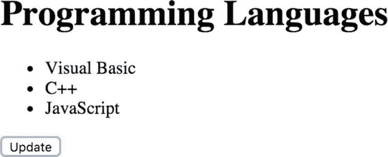

# 第 15 章：使用 JSON 进行数据交换

第 [14 章](http://dx.doi.org/10.1007/978-1-4842-0605-8_14)介绍了如何使用 XML 在客户端和服务端之间交换数据。当客户端使用浏览器中的 JavaScript 创建时，使用一种名为 JSON 的东西来交换数据要容易得多。JSON 是 JavaScript Object Notation（JavaScript 对象表示法）的缩写。它是一种类似字符串的表示法，可以轻松声明像数组和对象这样的复杂结构。

## 配方 15-1：使用 AJAX 获取数据

### 问题

传统上，浏览器用于从服务端获取 HTML 页面。通过 HTML 文档中的链接导航到同一或不同服务器的不同页面。当用户点击链接时，浏览器会获取并渲染新页面的内容。

随着 Web 技术的发展，为了减少加载时间，加载页面的一部分变得越来越常见。当用户点击“阅读更多”链接或滚动到页面底部时，浏览器会获取更多内容并内联渲染，而无需重新加载现有文档。

### 解决方案

所使用的技术是 AJAX 请求。这是一段 JavaScript 代码，它会向服务器执行 HTTP 请求（通常是与加载页面相同的服务器），然后使用响应结果将额外内容插入到 HTML 文档中。

简单的方法是让服务端生成需要添加的 HTML，并将返回的值直接追加到 HTML 文档中。

### 工作原理

在浏览器中使用 `XMLHTTP` 对象相对简单，但使用 jQuery 可以使其更简单。jQuery 是一个 JavaScript 库，它使得操作 HTML 文档、添加事件监听器和执行 AJAX 请求变得非常容易。本章的所有配方都将使用 jQuery 库。

© Frank M. Kromann 2016

F.M. Kromann, *PHP and MySQL Recipes*, DOI 10.1007/978-1-4842-0605-8_15

第一个示例展示了如何使用 jQuery 和 PHP 脚本加载一个包含几行数据的简单文档，然后发起 AJAX 请求来更新部分数据，而无需重新加载文档。

```php
// 15_1.php
$languages = [
    'PHP', 'JavaScript',
    'C', 'C++', 'C#', 'Objective-C',
    'Python', 'Java', 'Ruby',
    'Visual Basic',
    'Scala'
];
shuffle($languages);
$data = array_slice($languages, 0, 3);
$html = "";
foreach($data as $lang) {
    $html .= "<li>$lang</li>";
}

if ($_REQUEST['data']) {
    echo $html;
}
else {
    echo <<<HEREDOC
<!DOCTYPE html>
<html>
<head>
<script src="https://code.jquery.com/jquery-1.12.2.min.js"
    integrity="sha256-lZFHibXzMHo3GGeehn1hudTAP3Sc0uKXBXAzHX1sjtk="
    crossorigin="anonymous"></script>
</bead>
<body>
<h1>编程语言</h1>
<ul id="lang">
$html
</ul>
<button onclick="Update()">更新</button>
<script>
function Update() {
    $.get("{$_SERVER['PHP_SELF']}?data=1", function(data) {
        $("#lang").html(data);
    });
}
</script>
</body>
</html>
HEREDOC;
}
```



此脚本初始加载的输出如下所示：

每当用户点击“更新”按钮时，同一脚本会以参数 `data=1` 被调用，并仅返回 3 个 `<li>` 元素的 HTML。返回的字符串将被插入到具有 `id="lang"` 属性的 `<ul>` 元素中，并替换原有的内容。

## 配方 15-2：返回 JSON

### 问题

从服务端返回完整的 HTML 字符串使得客户端难以在需要时操作数据。有没有一种方法可以以结构化形式获取数据，从而允许客户端操作数据，并可能创建适合其渲染设备所需的 HTML？

### 解决方案

PHP 具有将变量编码和解码为 JSON 格式及从 JSON 格式还原的函数。函数 `json_encode()` 会将变量转换为字符串化版本，`json_decode()` 会将一个字符串化的 JSON 字符串转换回 PHP 变量。将变量编码为 JSON 常用于生成响应，而解码则用于 PHP 作为客户端调用返回 JSON 响应的 API。除了 encode 和 decode 函数，PHP 还支持 `json_last_error()`。此函数不接受任何参数，可在 encode 或 decode 之后调用。它会返回一个代表上次操作结果的整数值。可能的返回值可以与以下常量之一进行比较：

| 常量 | 含义 | 可用版本 |
|---|---|---|
| `JSON_ERROR_NONE` | 未检测到错误 | |
| `JSON_ERROR_DEPTH` | 超出最大堆栈深度 | |
| `JSON_ERROR_STATE_MISMATCH` | 无效的 JSON | |
| `JSON_ERROR_CTRL_CHAR` | 无效的控制字符 | |
| `JSON_ERROR_SYNTAX` | 语法错误 | |
| `JSON_ERROR_UTF8` | 格式错误的 UTF-8 字符 | 5.3.3 |
| `JSON_ERROR_RECURSION` | 递归引用 | 5.5.0 |
| `JSON_ERROR_INF_OR_NAN` | 发现 NAN 或 INF 值 | 5.5.0 |
| `JSON_ERROR_UNSUPPORTED_TYPE` | 不支持的类型 | 5.5.0 |

当需要返回多个变量时，最简单的方法是将它们放入一个数组，然后返回该数组的 JSON 编码版本。

### 工作原理

将之前的示例改为使用 JSON 而非 HTML 字符串只需要做少量修改。

首先，确保 `Content-Type` 设置正确。这个简单示例即使不设置也能运行，但始终建议设置正确的 `Content-Type`，以便告知客户端期望接收的内容类型。第二步是仅生成用于完整文档加载的 `$html` 变量，并返回 `$data` 变量的 JSON 编码值。最后，JavaScript 代码需要做一些小改动。在本示例中，代码会生成最终要插入文档的 HTML 片段。具体来说，代码会检查数据，如果返回的语言是 PHP，则在其周围添加粗体标签。

```php
<?php

// 15_2.php

$languages = [

'PHP', 'JavaScript',

'C', 'C++', 'C#', 'Objective-C',

'Python', 'Java', 'Ruby',

'Visual Basic',

'Scala'

];

shuffle($languages);

$data = array_slice($languages, 0, 3);

if ($_REQUEST['data']) {

header("Content-Type: application/json");

echo json_encode($data);

}

else {

$html = "";

foreach($data as $lang) {

$html .= "<li>$lang</li>";

}

echo <<<HEREDOC

<!DOCTYPE html>

<html>

<head>

<script src="https://code.jquery.com/jquery-1.12.2.min.js"

integrity="sha256-lZFHibXzMHo3GGeehn1hudTAP3Sc0uKXBXAzHX1sjtk="

crossorigin="anonymous"></script>

</bead>

<body>

<h1>编程语言</h1>

<ul id="lang">

$html

</ul>

<button onclick="Update()">更新</button>

<script>

第 15 章 ■ 使用 JSON 进行数据交换

function Update() {

$.getJSON("{$_SERVER['PHP_SELF']}?data=1", function(data) {

var html = '';

$.each(data, function(key, value) {

if (value == 'PHP') {

html += '<li><b>PHP</b></li>';

}

else {

html += '<li>' + value + '</li>';

}

});

$('#lang').html(html);

});

}

</script>

</body>

</html>

HEREDOC;

}
```

第一个示例中使用的 jQuery 函数是`$.get()`。现在它被替换为`$.getJSON()`函数。该函数会自动将 JSON 字符串转换为数组或对象，以便脚本可以遍历其中的值。

## 方案 15-3：消费 JSON API

### 问题

当你创建 Web API 时，通常最好创建一个测试客户端，用于消费并验证 API 的响应。

### 解决方案

PHP 内置了通过`fopen`包装器获取远程内容的支持，该包装器允许使用 URL 从基于 HTTP 的端点获取内容。我们可以结合使用`file_get_contents()`和`json_decode()`来处理基于 JSON 的 API。

### 工作原理

创建一个简单的命令行脚本，调用示例`15_2.php`中的 API 并显示输出，代码大致如下：

```php
<?php

// 15_3.php

$url = "http://localhost/15_2.php?data=1";

$response = file_get_contents($url);

$languages = json_decode($response);

var_dump($languages);
```

该脚本将产生类似如下的输出：

```
array(3) {
  [0] =>
  string(3) "PHP"
  [1] =>
  string(12) "Visual Basic"
  [2] =>
  string(1) "C"
}
```

示例`14_4.php`曾用于消费来自`openweathermap.com`的基于 XML 的 API。该服务实际上默认使用 JSON 格式。将 XML 脚本转换为使用 JSON 相对简单。数据结构并不完全相同，但遵循相同的结构。

当我使用 API 时，我喜欢创建一个简单的脚本来获取数据，将其转换为 PHP 变量，然后将内容转储到控制台，以便清晰了解响应的样子。以天气 API 为例，JSON 响应的数据如下所示：

```
stdClass Object
(
    [coord] => stdClass Object
        (
            [lon] => -118.24
            [lat] => 34.05
        )

    [weather] => Array
        (
            [0] => stdClass Object
                (
                    [id] => 721
                    [main] => 霾
                    [description] => 薄雾
                    [icon] => 50d
                )
        )

    [base] => stations
    [main] => stdClass Object
        (
            [temp] => 290.6
            [pressure] => 1018
            [humidity] => 72
            [temp_min] => 289.15
            [temp_max] => 292.15
        )

    [visibility] => 3219
    [wind] => stdClass Object
        (
            [speed] => 2.1
            [deg] => 260
        )

    [clouds] => stdClass Object
        (
            [all] => 40
        )

    [dt] => 1458413206
    [sys] => stdClass Object
        (
            [type] => 1
            [id] => 372
            [message] => 0.0446
            [country] => US
            [sunrise] => 1458395766
            [sunset] => 1458439495
        )

    [id] => 5368361
    [name] => 洛杉矶
    [cod] => 200
)
```