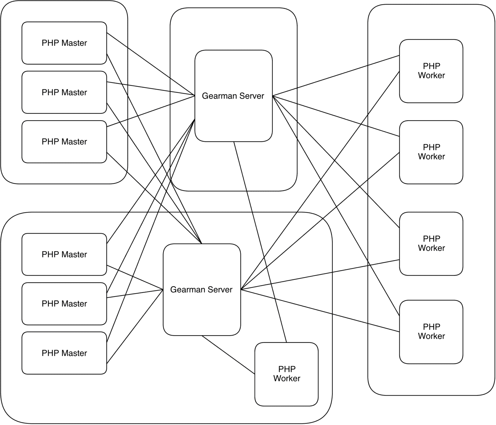
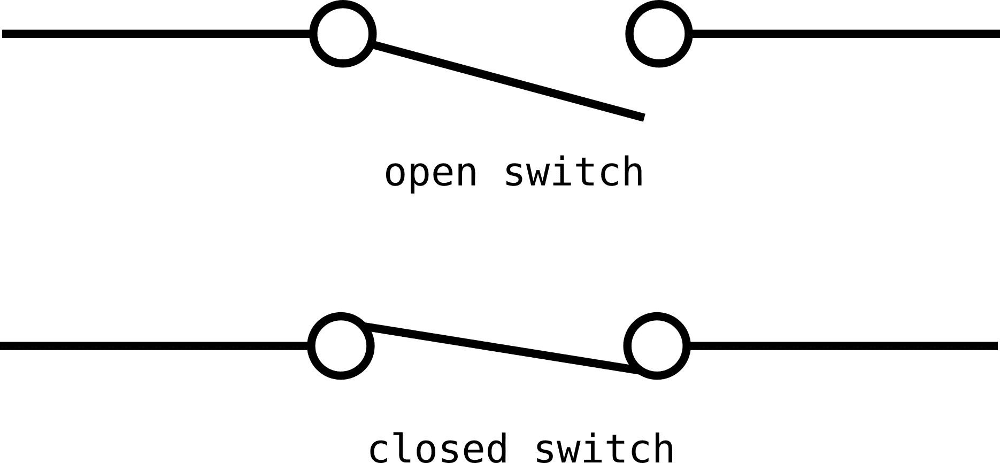
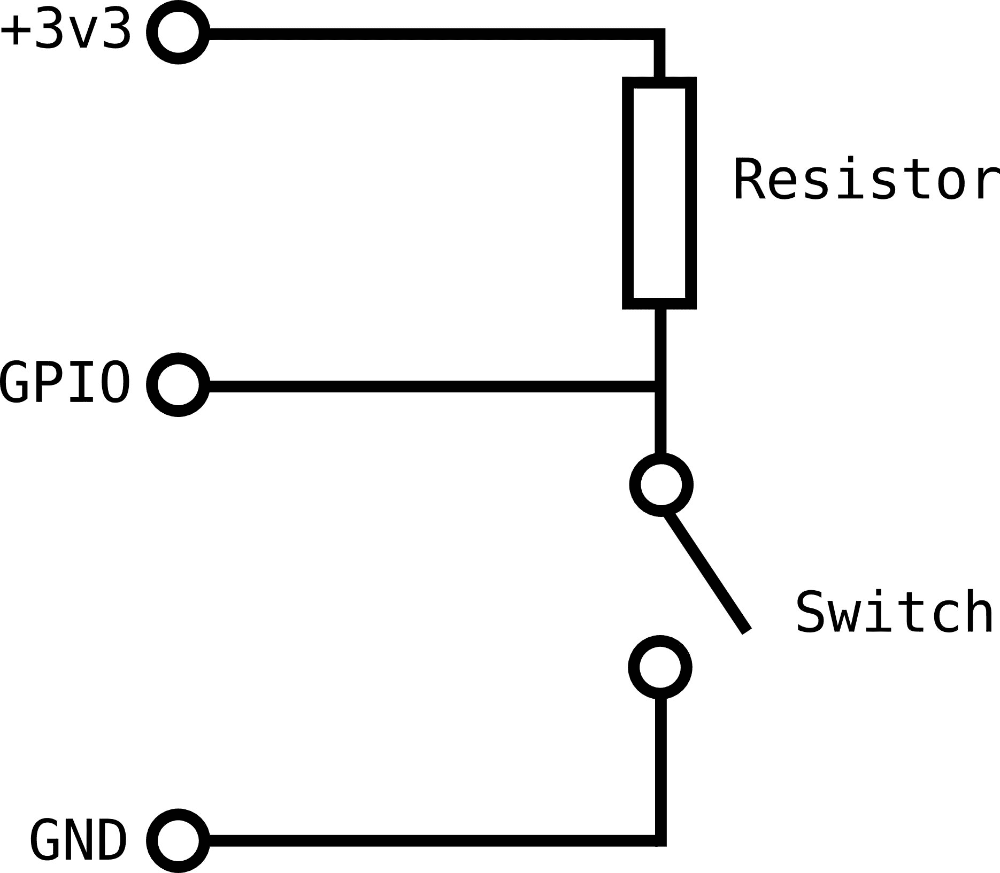
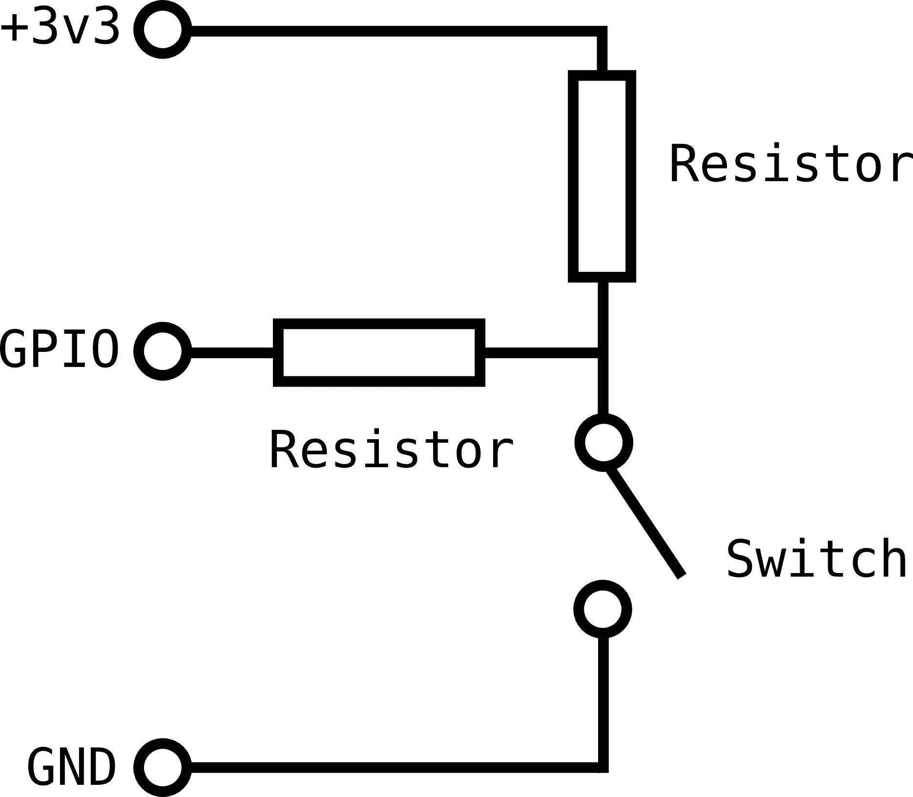

# 5. 面向用户的软件

在艰难地掌握了在非网页环境下开发 PHP 所需的预备知识后，我们现在要开始探讨如何在不借助网页浏览器渲染引擎的情况下与用户进行沟通。

有些软件可以在无人交互的情况下安静地运行，我们称之为“系统软件”，这将在第 6 章中讨论。然而，大部分软件都需要与用户进行交互，而 PHP 提供了多种实现交互的方式。从交互式命令行到功能完善的图形用户界面软件，PHP 都能胜任。

在选择软件与用户交互的方式时，你需要关注用户的需求，并尽可能地将个人偏好放在一边。命令行交互（通常）编码非常简单，文本嘛，就是文本而已，而这正是 PHP 的强项。然而，许多用户，尤其是非技术用户，往往会回避基于文本的命令行软件。除非你对软件结构和界面流程非常精心设计，否则基于文本的输入可能会：

*   容易出错
*   难以导航
*   需要用户具备一定的思维能力
*   可发现性低
*   并且初始使用速度比图形界面慢

如果你选择基于文本的界面，请确保你的目标用户能够接受它（你可能觉得没问题，但你的用户通常和你不一样！）。由于编码简单，文本界面通常是概念验证和原型软件的不错选择（尤其是在应用程序的主要优势在于其功能，而非用户交互方式的情况下），但要注意，临时界面常常会“被保留下来”。此外，一些非技术的委托用户（这里不禁让人联想到“尖头发老板”）可能会只看到界面的表面，而无法关注底层的应用程序，即使你解释界面只是临时的，他们也可能对你的项目提案不满意。这在某种程度上是可以理解的，因为对于大多数用户来说，应用程序就是界面。这是他们日复一日看到和使用的一切。对文件和其他功能的更改当然“神奇地”发生了。良好的用户界面设计（无论是针对文本界面还是功能完善的图形界面）本身就是一个需要努力的领域，所以尽可能向专业人士寻求帮助，阅读一些关于该主题的众多书籍，或者参加相关课程。如果你曾经看着某个软件，纳闷它怎么如此流行，而你偏爱的、功能上优越得多的软件却默默无闻，那么答案往往至少有一部分要归功于良好的用户界面设计。

## 5.1 命令行界面基础

如上所述，基于文本的界面仍有其用途，尤其是在用户具备技术能力的场景中。在创建基于文本的命令行程序时，除了你已熟悉的 PHP 知识外，还有三个主要的考量因素。它们是：

1.  获取键盘输入
2.  向屏幕输出文本（和图形）
3.  程序流程控制

我们不单独描述每一个，而是通过一个包含这些要素的简单程序来逐一了解。请阅读下面的代码和注释。该程序是一个屏幕保护类的程序，通过一条类似蛇形蠕动的光标来用颜色填充终端。

```php
<?php

# 首先，我们会定义一些命名常量。
# 这些是 shell 转义码，用于格式控制。
# 将它们定义为命名常量有助于让代码更易读。

define("ESC", "\033");
define("CLEAR", ESC."[2J");
define("HOME", ESC."[0;0f");

# 我们会向用户输出一些指令。请注意，我们使用了
# fwrite 而非 echo。目的是将输出内容写回到
# 用户可以看到的终端中。fwrite(STDOUT...) 写入的是
# php://stdout 流。而 echo（和 print）写入的是 php://output
# 流。通常这两者是一样的，但也并非必须如此。
# 此外，php://output 会受到输出控制与
# 缓冲函数（http://www.php.net/manual/en/book.outcontrol.php）的影响，
# 这可能是我们需要的，也可能不是。

fwrite(STDOUT, "按回车键开始，再按回车键结束");

# 现在，我们等待用户按下回车键。默认情况下，STDIN
# 是一个阻塞流，这意味着当我们尝试从中读取数据时，
# 脚本会暂停并等待输入。当用户按下回车键时，
# 传给终端的键盘输入会被传递到我们的脚本（通过 fread）。

fread(STDIN, 1);

# 我们希望程序一直运行，直到用户再次按下回车键。这意味着
# 我们需要定期用 fread 检查输入，但如果没有任何输入，
# 程序不能暂停/阻塞。因此，我们将 STDIN 设置为
# 非阻塞模式。

stream_set_blocking(STDIN, 0);

# 为输出做准备时，我们希望清除终端并绘制一个漂亮的
# 边框。为此，我们需要知道当前终端窗口的大小。
# PHP 本身没有内置的方法来实现，因此我们调用一个
# 名为 tput 的外部 shell 命令，它能提供当前终端的信息。

$rows = intval(`tput lines`);
$cols = intval(`tput cols`);

# 现在，我们向终端写入两个特殊的转义码。第一个
# (\033[2J) 清除屏幕，第二个 (\033[0;0f)
# 将光标置于屏幕左上角。我们在脚本开头已经将
# 这些定义为常量 CLEAR 和 HOME。

fwrite(STDOUT, CLEAR.HOME);

# 现在，我们要在窗口周围绘制一个边框。
# 在终端中绘制“图形”（或“半图形”）最简单的方法是使用
# 大多数固定宽度字体（用于终端）都包含的制表符。

# 通过逐步向下移动光标，绘制两侧的垂直边框。
# 光标通过由 ESC."[$rowcount;1f" 生成的转义码来移动。

for ($rowcount = 2; $rowcount < $rows; $rowcount++) {
	fwrite(STDOUT, ESC."[$rowcount;1f"."║"); # 例如 \033[7;1f║ 表示第 7 行
	fwrite(STDOUT, ESC."[$rowcount;${cols}f"."║");
}

# 现在，用同样的方法绘制水平边框。

for ($colcount = 2; $colcount < $cols; $colcount++) {
	fwrite(STDOUT, ESC."[1;${colcount}f"."═");
	fwrite(STDOUT, ESC."[$rows;${colcount}f"."═");
}

# 最后，填充四个角。

fwrite(STDOUT, ESC."[1;1f"."╔");
fwrite(STDOUT, ESC."[1;${cols}f"."╗");
fwrite(STDOUT, ESC."[$rows;1f"."╚");
fwrite(STDOUT, ESC."[$rows;${cols}f"."╝");
```

```php
80 # 您可以查看制表符的可用范围，参见
81 # http://en.wikipedia.org/wiki/Box-drawing_character
82 # 它们与其他字符一样是“文本”，因此可以轻松复制
83 # 并粘贴到大多数编辑器中。

85 # `$p` 是一个数组 `[x,y]`，用于存储光标的位置。我们将
86 # 其初始化为屏幕中心。

88 `$p = ["x"=>intval($cols/2), "y"=>intval($rows/2)];`

90 # 现在介绍第一个流程控制元素。我们需要让程序
91 # 持续运行，直到用户提供输入。最简单的方法是使用
92 # 一个永不结束的循环，用 `while(1)` 实现。“1”始终求值为 `true`，因此
93 # while 循环永远不会结束。当程序（或用户）准备结束
94 # 时，我们可以使用 `break` 结构跳出循环，
95 # 并在循环结束后继续执行剩余脚本。

97 `while (1)` {

99 	# 每次进入循环时，我们都要检查用户是否在上一轮循环中
100 	# 按下了回车键。请记住，`STDIN` 不再阻塞，
101 	# 因此如果没有输入，程序会立即继续执行。
102 	# 如果有输入，我们使用 `break` 退出 while 循环。

104 	`if (fread(STDIN,1)) { break; };`

106 	# 我们将更新存储在 `$p` 中的光标位置，在 `x` 和 `y` 轴上
107 	# 随机移动一定量。这将让我们的蛇形光标蠕动起来！

109 	`$p['x'] = $p['x'] + rand(-1,1);`
110 	`$p['y'] = $p['y'] + rand(-1,1);`

112 	# 我们检查蛇形光标不会越界或超出边框，以保持
113 	# 它在自己的方框内！

115 	`if ($p['x'] > ($cols-1)) { $p['x'] = ($cols-1);};`
116 	`if ($p['y'] > ($rows-1)) { $p['y'] = ($rows-1);};`
117 	`if ($p['x'] < 2) { $p['x'] = 2;};`
118 	`if ($p['y'] < 2) { $p['y'] = 2;};`

120 	# 我们希望留下漂亮的轨迹，因此需要为蛇形光标的
121 	# 前景色和背景色随机选择颜色，并且每步
122 	# 都发生变化。终端中的颜色通过更多转义
123 	# 码设置，这些转义码来自一个由整数指定的有限调色板。

125 	`$fg_color = rand(30,37);`
126 	`$bg_color = rand(40,47);`

128 	# 选定后，我们通过输出转义码来设置颜色。这
129 	# 不会立即打印任何内容，而是设置后续所有内容的颜色。

132 	`fwrite(STDOUT, ESC."[${fg_color}m");` # `\033[$32m` 设置绿色前景
133 	`fwrite(STDOUT, ESC."[${bg_color}m");` # `\033[$42m` 设置绿色背景

135 	# 最后，我们在新位置输出一段蛇形光标（另一个制表符）。
136 	# 它将使用我们刚才设置的颜色显示在 `$p` 存储的位置。

139 	`fwrite(STDOUT, ESC."[${p['y']};${p['x']}f"."╬");`

141 	# 在让 while 循环重新开始之前，还有一件非常
142 	# 重要的事情要做。我们需要让处理器休息一下。
143 	# 如果立即继续循环，您会发现即使对于这个相对简单的程序，
144 	# 处理器也会被持续占用。
145 	# 我们的蛇形光标还会以超高速吞噬屏幕！
146 	# `usleep` 会暂停程序执行，以便其他程序可以使用
147 	# 处理器，或者让处理器“休息”。这一点点延迟有助于
148 	# 提高机器的响应能力，因此即使您需要程序
149 	# 尽可能快地循环，也请考虑在可能的情况下添加一个小的 `usleep`。

151 	`usleep(1000);`
152 `};`

154 # 如果执行到这一行代码，说明我们已经 `break` 跳出
155 # 了 while 循环。

157 # 为了成为终端的良好公民，我们需要在退出前
158 # 清理屏幕。否则，光标将停留在蛇形光标
159 # 最后所在的行，而背景/前景色将是
160 # 为蛇形光标段选择的最后一种颜色。

162 # 以下转义码告诉终端使用其默认颜色。

164 `fwrite(STDOUT, ESC."[0m");`

166 # 然后我们清除屏幕并将光标置于左上角，正如
167 # 之前做的那样。

169 `fwrite(STDOUT, CLEAR.HOME);`
```

此程序应演示我们之前列出的三个基础内容。

1.  获取键盘输入。您可以像读取任何流一样从 `STDIN` 读取。

2.  将文本（以及图形）输出到屏幕。您可以输出到 `STDOUT`（或使用 `echo`/`print`），通过转义字符控制外观和光标，并使用块状绘制字符制作“半图形”。

3.  程序流程控制。`while(1)` 循环可用于保持程序运行，使用 `break` 使流程跳出循环。使用 `usleep` 或 `sleep` 来防止进程独占处理器非常重要。

### 5.2 高级命令行输入

在上一节中，我们使用 `fread()` 来读取键盘输入。这种方法适用于简单的程序，但如果你希望创建一个更复杂的界面来允许用户发出命令，那么你可能需要考虑 `readline` 扩展，它可用于实现一个类似 Shell 的可编辑命令行程序。

下面的示例脚本展示了如何使用 `readline` 库实现一个简单的、定制的命令行类型界面。

```php
<?

# 创建数组来保存我们的命令历史记录和有效命令列表。

$history = array();
$validCommands = array();

# 定义一些有效命令。

$validCommands[] = 'kill';
$validCommands[] = 'destroy';
$validCommands[] = 'obliterate';
$validCommands[] = 'history';
$validCommands[] = 'byebye';

# 我们希望启用命令的 Tab 补全功能，允许用户开始输入一个命令，然后按 Tab 键完成它，
# 就像在 Bash Shell 中那样。我们需要提供一个函数（通过 `readline_completion_function`），
# 该函数将提供一个可能的函数名称数组。这可以基于用户已输入的 `$partial` 字符、
# 程序当前所处的阶段，或我们想要的任何其他因素。在我们的例子中，我们只需提供
# 所有有效命令的数组。

function tab_complete ($partial) {
	global $validCommands;
	return $validCommands;
};

readline_completion_function('tab_complete');

# 我们现在进入主程序循环。注意我们没有包含 `usleep`，
# 因为 `readline` 在等待用户输入时会暂停程序执行。

while (1) {

	# 我们调用 `readline`，并传入一个构成命令提示符的字符串。在我们的例子中，
	# 我们将在其中放入日期和时间，以表明我们每次调用时都可以更改它。
	# 用户输入的任何内容都会被返回。这一行简单的代码实现了 `readline` 的大部分魔力。
	# 在此阶段，用户可以享受 Tab 补全、历史记录（使用上/下光标键）等功能。

	$line = readline(date('H:i:s')." 输入命令 > ");

	# 我们需要手动将命令添加到历史记录中。这用于用户通过上/下光标键访问的命令历史。
	# 如果我们愿意，可以选择忽略某些命令（例如，输错的命令或中间输入）。

	readline_add_history($line);

	# 如果我们想以编程方式检索历史记录，可以使用一个名为 `readline_list_history()`
	# 的函数。但是，这仅在 PHP 使用 `libreadline` 编译时才可用。在大多数情况下，
	# 由于许可和其他原因，现代发行版会使用兼容的 `libedit` 库来编译它。
	# 因此，我们将在数组中保留一份历史记录的并行副本，以便进行编程访问。

	$history[] = $line;

	# 现在我们决定如何处理用户的输入。在实际应用中，我们可能希望先使用
	# `trim()`、`strtolower()` 或其他方式过滤输入。

	switch ($line) {

	    case "kill":
	        echo "你不会想那么做的。\n";
	        break;

	    case "destroy":
	        echo "那真不是个好主意。\n";
	        break;

	    case "obliterate":
	        echo "好吧，如果我们真的必须这么做的话。\n";
	        break;

		case "history":

			# 我们将使用之前创建的命令历史并行副本来显示命令历史。

        	$counter = 0;

			foreach($history as $command) {
				$counter++;
				echo("$counter: $command\n");
			};

	        break;

	    case "byebye":

	    	# 如果是时候退出了，我们希望同时跳出 `switch` 语句和 `while` 循环，
	    	# 因此我们使用 `break` 并指定层级为 2。

    	    break 2;

	    default :

    		# 始终记得在用户出错时给出反馈。

    		echo("抱歉，命令 ".$line." 无法识别。\n");
	}

};

# 如果我们到达这里，说明用户输入了 `byebye`。

echo("再见，欢迎下次再来！\n");
```

您可能已经注意到，我选择使用 `byebye` 作为退出程序的命令。这并非我一时兴起的随意选择，而是为了说明需要考虑**可发现性**。如果您面对这个程序，但没看到上面的源代码，并要求您关闭它，您很可能会先尝试 `quit`、`exit`、`end` 等命令，最后才求助于老办法 `Ctrl-C`。在 GUI 界面中，面对一个写着“再见！”的按钮，您就不会有这种问题。对于基于文本的输入，最好坚持使用常见且易于记忆的命令格式，在可能的情况下提供视觉提示和线索，并通过良好的文档、`help` 命令和用户培训来辅助**可发现性**。

|  | **扩展阅读** PHP 手册中的 Readline 扩展 [`www.php.net/manual/en/intro.readline.php`](http://www.php.net/manual/en/intro.readline.php) |

### 5.3 使用 STDIN、STDOUT 和 STDERR

当您的脚本启动时，PHP CLI SAPI 会自动为您打开标准流，因此无需发出像 `fopen('php://stdin', 'r')` 这样的命令。您可以像处理任何其他 PHP 流一样处理这些流，并立即开始使用它们。我们在上面已经包含了一些示例，但这里再提供一些，以说明可用的选项。

```php
<?

# 从 STDIN 获取一行输入

echo ('请输入一些内容：>');

$line1 = fgets(STDIN);

echo ('**** 第 1 行 : '.$line1." ****\n\n");

# 获取一行输入，不包含换行符

echo ('请再输入一些其他内容：>');

$line2 = trim(fgets(STDIN));

echo ('**** 第 2 行 : '.$line2." ****\n\n");

# 以 CSV 格式将一个数组写入 STDOUT。
# 首先，创建一个数组的数组...

$records[] = array('用户', '全名', '性别');
$records[] = array('Rob', '罗伯特·阿利', 'M');
$records[] = array('Ada', '奥古斯塔·阿达·金，拉夫拉斯伯爵夫人', 'F');
$records[] = array('Grete', '格蕾特·赫尔曼', 'F');

echo ("以下是以 CSV 格式呈现的数据：\n\n");

# ...然后在写入时动态将每个数组转换为 CSV

foreach ($records as $record) {
	fputcsv(STDOUT, $record);
};

echo ("\n\nCSV 数据结束\n");

# 暂停直到用户输入以数字开头的内容

echo ('请输入一个或多个数字：>');

while (! fscanf(STDIN, "%d\n", $your_number) ) { 

	echo ("未找到数字：>"); 

};

echo ("您的数字是 $your_number\n\n");

# 将网页的文本发送到 STDOUT

echo ("按回车键获取一些网络内容：\n\n");

fread(STDIN, 1); # `fread` 会阻塞，直到按下回车键

fwrite(STDOUT, strip_tags( file_get_contents('http://www.cam.ac.uk') ) );

# 将错误消息发送到 STDERR。如果您愿意，可以直接 `fwrite(STDERR,...`
# 或者使用 `error_log` 函数，该函数使用已定义的错误处理例程。
# 对于 CLI SAPI，默认情况下，错误处理例程是将错误打印到 STDERR。

error_log('系统没啤酒了。中止。中止。',4);
```

最后一行的错误日志通常会与其它输出一起出现在您的 Shell 中，因为大多数 Shell 默认将 `STDERR` 放在那里。如果您想确认它确实是通过 `STDERR` 而不是 `STDOUT` 输出的，下面的 bash 命令会将所有 `STDERR` 输出（由 `2>` 表示）以红色高亮显示。它使用转义码来着色错误（31 设置颜色为红色，07 反色显示，然后 0 清除）：

```bash
php script.php 2> >(while read errors; do echo -e "\e[07;31m$errors\e[0m" 
	>&2;  done)
```

简而言之，我们可以以多种方式使用标准流，通常将它们视为标准的文件指针或流。

### 5.4 部分图形界面元素 - 对话框

在本章后续内容中，我们将探讨生成完整图形界面的系统。但对于那些仅需偶尔与用户交互或通知用户的简单程序而言，存在一个中间阶段，例如弹出警告或图形化的输入请求。使用 PHP，有多种方法可以调用或创建可视化显示元素，如下所述。

### 5.5 从 Shell 调用的对话框

有多种 Shell 命令可以在屏幕上调用图形元素。你可以通过多种方式从 PHP 调用 Shell 命令，包括使用 `shell_exec` 或下文将使用的反引号。更多详细信息和可能性，请参阅第 7 章的“从 PHP 启动外部进程”部分。这些命令包括：

- **`notify-send`**

在基于 Debian 的系统中，`notify-send` 会在用户屏幕上弹出一个通知“气泡”。其具体外观取决于发行版，但通常是系统标准的通知，类似于收到新邮件或发生系统事件时显示的通知。它使用 Gnome 项目的 `lib-notify`，可能需要安装（`sudo apt-get install libnotify-bin`）。在 PHP 中调用方式如下：

```php
<? 
shell_exec('notify-send -i error "法兰错误" '.
	'"法兰垫圈发生错误。未找到法兰 2.0。"');

# 或者

$command = 'notify-send -i info "法兰完成" '.
	'"法兰已完成垫圈处理。请参阅手册了解去垫圈操作信息。"';

`$command`;
```

`-i` 标志允许你指定一个图标。你可以提供图像的完整路径，或者引用一个标准图标（通常位于诸如 `/usr/share/icons/gnome/32x32/` 的位置），如上文所示。

使用 `man notify-send` 查看可用于自定义通知的各种选项。

Ubuntu Unity 用户请注意：`-t` 标志允许你指定通知消失的超时时间。然而，在 Ubuntu Unity 中此标志被忽略，通知的持续时间取决于其文本长度。在 Unity 中将 `-t=0` 设置会将该通知“气泡”变成一个需要用户显式关闭的警告框。

- **`zenity`**

`zenity` 允许你显示许多常见的对话框，从日历到颜色选择器。它基于 GTK+，提供各种格式和内容选项，并将任何输入返回以供使用。`zenity` 安装在大多数基于 Gnome 的系统上。

```php
<?
# 使用反引号执行 zenity。Zenity 将用户输入作为文本返回，
# 我们将其收集到一个字符串变量中。让我们用它弹出一个
# 日历，然后告诉用户这是星期几。

$day = `zenity --calendar --text="选择一天" --date-format="%d %b %Y"`;

if ($day) { 
	echo('选择的日期是 '.date('l', strtotime($day))."。\n"); 
};

# 现在我们将显示一个文件选择器，然后显示一个“信息”对话框，告诉
# 用户所选文件的大小。

$filename = trim(`zenity --file-selection`);

if (file_exists($filename)) { 

	$command = 'zenity --info --text "所选文件的大小为 '.
		filesize($filename).' 字节。"';

	`$command`; 

};
```

可用的全系列对话框包括颜色选择器、各种通知对话框、文本输入框、进度条等。

|  | **延伸阅读** `zenity` 中可用的对话框和选项完整列表 [`library.gnome.org/users/zenity/3.4/`](http://library.gnome.org/users/zenity/3.4/) |

- **`kdialog`**

`kdialog` 相当于上述用于 KDE 桌面环境的 `zenity`。

|  | **延伸阅读** 关于 `kdialog` 的更多信息和教程 [`techbase.kde.org/Development/Tutorials/Shell_Scripting_with_KDE_Dialogs`](http://techbase.kde.org/Development/Tutorials/Shell_Scripting_with_KDE_Dialogs) |

### 5.6 Windows 对话框

一个有用的 Pecl 包允许你从 PHP 访问 Win32 API。该 API 提供了创建常见 Win32 对话框的途径。我们将在第 8 章进一步研究这个库，届时会探讨如何利用它与 Windows 注册表进行交互。

|  | **`win32std`** |

|   |   |

|   | 一组标准 Windows API 函数。 |

|   |   |

|   | **主要网站**: [`pecl.php.net/package/win32std`](http://pecl.php.net/package/win32std) |

|   |   |

|   | **主要文档和安装信息**: 请参阅下载包中的 README 文件。 |

|   |   |

|   | **备用文档**: [`wildphp.free.fr/wiki/doku.php?id=win32std:index`](http://wildphp.free.fr/wiki/doku.php?id=win32std:index) |

### 5.7 静态 HTML 输出

PHP 当然非常擅长生成 HTML 输出，这毕竟是它最初存在的意义。在 CLI 运行结束时，HTML 可用于显示信息、图表、数据等，你可以使用 PHP 内置的 HTML 工具来实现这一点。这一过程通常通过像 Apache 这样的 Web 服务器完成，因此对于如何从 CLI 脚本创建和显示 HTML，可能不是那么一目了然。最终目标是创建一个或多个 HTML 文件来显示输出，将其保存到磁盘，并由本地 Web 浏览器展示。

你可能可以想象以字符串形式创建 HTML，然后类似于创建其他文本/数据文件的方式，顺序写入磁盘。然而，PHP 为我们提供了一个巧妙的技巧，称为**输出缓冲**，它允许我们假装自己实际上是在正常的 Web 服务器环境中发送 HTML。这使我们能够使用诸如将 HTML 块与代码交错、`echo` 和 `print_r` 数据等功能，但 PHP 不会将其发送到 Web 服务器，而是为我们捕获这些内容，并允许我们将其批量写入磁盘。如果你有来自基于 Web 的项目的现有报告或模板代码，并且希望轻松地在命令行中复用，这将特别有用。

以下示例展示了如何告知 PHP 开始收集输出，自行生成一些输出，将其保存到磁盘，并最终在本地 Web 浏览器中打开它。

```
1 <?

3 echo("这段文本将照常输出到 STDOUT（你的终端）\n");

5 # 开始缓冲输出，而不是将其发送到 STDOUT

7 ob_start();

9 # echo 和 print 会写入 `php://output` 流。默认情况下，
10 # `php://output` 写入 `STDOUT`，这就是 `echo` 通常将内容打印回终端的原因。
11 # `ob_start()` 会捕获 `php://output` 流，
12 # 然而，如果我们想告知用户当前的操作，仍然可以直接写入 `STDOUT`（而不是通过 `echo`）。

15 fwrite(STDOUT, "开始生成 HTML...\n"); # 显示在终端中

16 # 因此，我们就像在“网络上”一样创建 HTML

19 echo('<html>');

21 print("<head><title>我的 HTML 页面</title></head>\n");

23 ?>
24 <body>
25 <h1> 交错一些 HTML</h1>
26 <p>以传统的 PHP 方式</p>
27 <p>
28 <a href="http://www.php.net">一个重要的链接</A>|||
29 <?

31 echo('</body></html>');

33 fwrite(STDOUT, "HTML 生成完毕\n"); # 显示在终端中

35 # `ob_get_contents()` 创建一个包含到目前为止所有缓冲内容的字符串。

37 $ourHtml = ob_get_contents();

39 # 如果需要，我们可以继续缓冲，或者在此情况下我们
40 # 使用 `ob_end_clean` 优雅地结束。如果我们改用 `ob_end_flush()`，
41 # 那么缓冲区的内容将被推送到 `php://output`，在结束缓冲后
42 # 该输出流就是 `STDOUT`，这不是我们想要的。

44 ob_end_clean();

46 echo ("这段文本将输出到 STDOUT\n"); # 现在我们已经结束了缓冲

48 # 最后，我们想将缓冲的 HTML 保存到一个文件中。让我们创建一个
49 # 唯一的临时文件名 ....

51 $filename = tempnam(sys_get_temp_dir(), 'my_report_').'.html';

53 # 并将 HTML 字符串写入其中。

55 file_put_contents($filename, $ourHtml);

57 # 最后，我们想打开一个 Web 浏览器来查看刚刚创建的 HTML "报告"。
58 # 这里我们使用 `see` 命令（在大多数基于 Debian 的发行版上可用）
59 # 来打开该文件类型（HTML）的默认查看器。
60 # 在其他平台上，`open` 命令可实现同样的效果。你也可以指定
61 # 特定的浏览器，例如 `firefox $filename`

64 `see $filename`;
```

|  | **延伸阅读** PHP 手册中的输出缓冲控制 [`www.php.net/manual/en/book.outcontrol.php`](http://www.php.net/manual/en/book.outcontrol.php) |

### 5.8 完整的图形界面（GUI）

如今，许多用户期望完整的图形用户界面，这非常有道理。设计得当的 GUI 有利于功能发现和交互的便利性。它们能够以直观、人性化的方式呈现数据和信息，并且非常适合基于事件的编程。

大多数 GUI 程序都使用“控件工具包”（也称为 GUI 工具包）编写。这些工具包或框架提供了构建 GUI 基本元素的代码：窗口、表单、按钮、列表、鼠标交互、菜单、事件等等。控件工具包数量众多，有些是低级且特定于平台的，例如适用于 Windows 的 Windows API 或适用于 Mac OS X 的 Carbon；有些是高级且跨平台的，例如 GTK+ 和 QT；还有一些是语言特定的，例如适用于 Java 的 Swing 和适用于 Object Pascal 的 LCL。维基百科上有一个相当全面的列表。

|  | **延伸阅读** 维基百科上的控件工具包 [`en.wikipedia.org/wiki/List_of_widget_toolkits`](http://en.wikipedia.org/wiki/List_of_widget_toolkits) |

在 PHP 中有两种方法可以使用这些工具包来创建图形界面。第一种是通过直接绑定——你的 PHP 脚本通过库或 PHP 扩展直接调用工具包。第二种是通过辅助应用程序——你的 PHP 脚本使用中间语言（如 HTML 或 XUL）告诉辅助应用程序想要显示什么，然后辅助应用程序负责调用工具包（或其自身代码）的必要元素，并为你显示界面。前者是编写图形应用程序的传统方式，后者则更类似于 Web 方法（在 Web 方法中，浏览器是辅助应用程序，你的脚本向其发送 HTML）。两种方法各有利弊，下面我们将了解这两种方法当前的一些实现。

### 5.9 理解 GUI 和事件驱动编程

在此值得花点时间来探讨 GUI 应用与命令行编程之间的一个主要区别。大多数 GUI 编程都属于事件驱动编程，如果你以前没有使用过这种编程风格，可能需要一些时间才能理解。

在 GUI 程序中，你通常会像往常一样从“顺序”编程开始：打开一个窗口或表单，并用按钮、文本、图像、数据或其他元素填充它。

此时，程序会进入一个等待循环，通常等待用户（有时是系统）执行某个操作。这可能是在等待用户点击按钮、输入文本、选择选项，或者等待新数据的到达。这些操作中的每一个都被称为事件，而你通常无法预测它们发生的顺序。因此，你的代码会将事件绑定到函数或方法，并在相关事件发生时调用它们。

这意味着你的代码常常不按顺序执行，因此对状态的跟踪要比从上到下顺序执行的命令行脚本甚至 Web 脚本复杂得多。处理基于事件的程序最常用的方法是使用面向对象（OO）编程技术，事实上，GUI 软件的兴起也推动了面向对象编程的发展（或者说是紧随其后，具体说法因人而异）。当然，使用传统的“命令式”编程风格也完全可以，特别是如果你对状态和作用域等问题保持谨慎的话；但如果你打算大量进行 GUI 编程，而又不熟悉面向对象，那么找一本面向对象入门书籍快速翻看一下，或许会对你大有裨益。

|  | **延伸阅读**维基百科上的面向对象编程 [`en.wikipedia.org/wiki/Object-oriented_programming`](http://en.wikipedia.org/wiki/Object-oriented_programming)Lorna Mitchell 的“PHP OOP 入门” [`www.lornajane.net/posts/2012/introduction-to-php-oop`](http://www.lornajane.net/posts/2012/introduction-to-php-oop)Jason Lengstorf 的“面向初学者的面向对象 PHP” [`net.tutsplus.com/tutorials/php/object-oriented-php-for-beginners/`](http://net.tutsplus.com/tutorials/php/object-oriented-php-for-beginners/) |

从某种意义上说，Web 编程也是事件驱动的：你通常向用户展示一个 HTML 页面，然后等待他们点击按钮或链接，并通过另一个 HTML 页面（或者使用不同参数再次运行同一个脚本）来处理该“事件”。你的每个 HTML 页面（或生成它们的 PHP 脚本）在某种程度上等价于 GUI 脚本中调用的单个函数或方法，而你的 Web 服务器（如 `Apache` 等）则等价于 GUI 程序中的等待循环，它负责维系一切并对事件做出反应。不同之处在于，在 Web 编程中（尤其是使用 PHP 时），我们基于“无共享”（或几乎无共享）的原则运行——每次脚本执行或 HTML 页面获取都是刻意独立的，除非我们主动共享某些状态。而在 GUI 编程中，我们通常是在同一进程内的同一脚本集合中运行，因此这是一种“几乎共享一切”的架构。一旦你理解了这一概念，就会发现规划和设计软件变得容易得多。

现在让我们来看看一些可用的 GUI 工具包。

### 5.10 wxPHP

`wxPHP` 始于 2005 年，近期发展迅猛，是目前这里列出的部件库绑定中最活跃的一个。`wxPHP` 提供了 `wxWidgets` 的绑定，`wxWidgets` 是一个跨平台的原生部件库，支持 Linux、Windows 和 Mac OS X。最新的构建版本可直接从 `wxPHP` 的 Github 仓库获取，随后会在主站上发布正式版本。`wxWidgets` 主要是一个基于 C++ 的库，但也提供了多种其他语言的绑定，并且得到了良好的支持，内容全面且广泛，正处于积极开发中。一些观察者批评许多 wxWidgets 应用外观单调、风格保守（想想“大片的灰色”），但用它也能创建出相当吸引人的界面，`wxPHP` 网站上展示了使用 PHP 绑定创建的应用实例截图。

关于文档的简要说明：`wxPHP` 提供的文档（类参考等）相当简略，它们是在每次构建新版绑定时自动生成的，基本上只列出了支持的部件和属性。更有用的信息来源是官方的 `wxWidgets` 文档以及 `wxWidgets` 维基。它们共同提供了每个部件功能的详细信息以及指南和教程。这些内容并非 PHP 专用，但无论你使用哪种语言，通常都很有用。你应该将 `wxPHP` 文档视为一个简单的参考，用以确认特定部件或方法是否已在 PHP 中实现。

|  | **延伸阅读**官方 wxWidgets 文档 [`wxwidgets.org/docs/`](http://wxwidgets.org/docs/)官方 wxWidgets 维基 [`wiki.wxwidgets.org/`](http://wiki.wxwidgets.org/) |

安装完成后，创建应用就相当直接了。窗口（通常称为表单或框架）可以通过在 PHP 脚本中直接添加按钮、方框、输入框等元素，以编程方式构建。对于更复杂的布局，这种设计界面的方式可能比较繁琐。幸运的是，`WxFormBuilder`（可在大多数基于 Debian 的 Linux 发行版的软件仓库中找到）是一个用于 `wxWidgets` 的图形化布局工具，它允许你通过将元素拖放到窗口中来设计界面，并且现在支持输出必要的 PHP 代码，以便在程序中使用你的设计。你还可以用它来管理事件，例如指定在点击按钮时执行哪些函数。借助 `wxFormBuilder`，`wxPHP` 有充分理由将自己定位为领先的 PHP 快速应用开发（RAD）环境。

让我们来看一些 `wxPHP` 的示例代码。这将帮助你理解 GUI 应用在 PHP 中通常是如何构建的，以及它与典型 Web 应用的区别。虽然下面的代码是 `wxPHP` 专用的，但许多 GUI 工具包至少都遵循相同的面向对象、事件驱动的结构。以下代码由 `wxPHP` 项目编写，并经其许可转载。行内注释是我添加的。

```php
<?php

# 每个框架或窗口都是通过扩展 wxFrame 类来设计的，
# 并添加按钮、菜单、文本框等图形元素，
# 以及用于响应“事件”（如鼠标点击和窗口关闭）的函数。

# 我们将创建一个名为 "MainFrame" 的类，描述应用程序的窗口

class MainFrame extends wxFrame
{
    # 我们将添加一个函数，在退出时销毁框架对象。

    function onQuit()
    {
        $this->Destroy();
    }

    # 我们将添加一个函数，显示关于对话框以展示应用程序的信息

    function onAbout()
    {
        # "wxMessageDialog" 是该工具包中众多组件或“部件”之一。
        # 这可以避免你为了显示消息而创建新的框架/窗口。
        $dlg = new wxMessageDialog(
            $this,
            "欢迎使用 wxPHP！！\n 基于 wxWidgets 3.0.0\n\n".
            "这是一个极简的 wxPHP 示例！",
            "关于对话框...",
            wxICON_INFORMATION
        );

        # 显示我们上面创建的对话框。
        $dlg->ShowModal();
    }

    # 添加一个构造函数。当我们通过这个类创建新对象来创建应用程序窗口时，会运行此函数。
    function __construct()
    {
        # 这将调用我们继承的 wxFrame 类中的构造函数，创建一个标题为
        # "Minimal wxPHP App" 的框架窗口，位于屏幕默认位置，
        # 初始大小为 350 x 260 像素。请注意，此框架默认情况下是不可见的，
        # 它目前只是在内存中创建。这意味着我们可以在显示给用户之前，
        # 向它添加内容并充分准备它，而不是用户看到一个空白窗口，
        # 然后突然被按钮等填满。
        parent::__construct(null, null, "Minimal wxPHP App", 
            wxDefaultPosition, new wxSize(350, 260));

        # 我们将向窗口添加带有各种选项的菜单，
        # 这意味着首先添加一个菜单栏，然后将菜单放入其中。
        $mb = new wxMenuBar();

        # 现在我们添加菜单。首先是一个带有"退出"选项的"文件"菜单。
        $mn = new wxMenu();
        $mn->Append(2, "E&xit", "退出此程序");
        $mb->Append($mn, "&File");

        # 然后是一个带有"关于"选项的"帮助"菜单。
        $mn = new wxMenu();
        $mn->AppendCheckItem(4, "&About...", "显示关于对话框");
        $mb->Append($mn, "&Help");

        # 请注意，上面的菜单和选项都带有"&"符号。它位于
        # 应作为键盘快捷键使用的字母之前。使用这样的窗口小部件工具包意味着
        # 您不必编写自己的代码来管理键盘快捷键之类的事情，
        # 从而节省时间和精力，并为用户创造一致的体验。

        # 最后将菜单栏添加到框架中。
        $this->SetMenuBar($mb);

        # 让我们向框架添加一个源代码编辑框，这是该工具包中另一个可用的
        # 小部件，具有语法高亮、智能缩进等功能。
        $scite = new wxStyledTextCtrl($this);

        # 我们要添加的最后一个小部件是窗口底部的状态栏。
        $sbar = $this->CreateStatusBar(2);
        $sbar->SetStatusText("欢迎使用 wxPHP...");

        # 在这个类的开头，我们定义了几个函数，一个
        # 用于显示关于对话框，一个用于退出应用程序。它们本身
        # 不会做任何事情，我们需要将它们连接到我们之前创建的菜单
        # 选项上。更具体地说，连接到当用户从菜单中选择某项时
        # 被调用的"wxEVT_COMMAND_MENU_SELECTED"事件。
        $this->Connect(2, wxEVT_COMMAND_MENU_SELECTED, 
            array($this,"onQuit"));
        $this->Connect(4, wxEVT_COMMAND_MENU_SELECTED, 
            array($this,"onAbout"));
    }
}

# 我们现在已经设计好了框架，并用小部件和函数填充了它，
# 但在代码的这个阶段，它还不存在。我们需要使用我们的类创建一个
# 新对象，这将使其活跃起来，并调用上面的构造函数。
$mf = new mainFrame();

# 框架现在存在了，它填充了小部件，并且所有函数
# 都已连接到事件上。但是它是隐藏的，所以我们需要
# 使其可见。
$mf->Show();

# 此时，我们需要让 wxWidgets 接管并运行程序。
# 调用 wxEntry 让 wxWidgets 管理应用程序，等待并
# 响应事件，并调用我们之前指定的函数。
# 如您所见，我们需要在到达此点之前指定所有应用程序代码。
wxEntry();

# 如果我们到达此点，意味着我们的应用程序已退出（要么
# 用户关闭了它，要么我们代码中的某些东西关闭了它），并且
# 我们可以进行任何必要的清理工作或直接退出。
?>
```

安装了 `wxPHP` 后，上面的代码可以简单地保存为例如 `"myapp.php"`，并以与任何其他 PHP CLI 脚本相同的方式执行，例如通过调用 `php myapp.php`。

从上面的代码可以看出，与过程式 Web 脚本的主要区别之一是，我们通常不会边执行边执行代码。一切都在前期定义好，通常是在类中，然后根据用户输入的需要按需执行。这就是为什么面向对象代码特别适合 GUI 和基于事件的编程，因为它提供了一种模型，可以更自然地映射到通常"不按顺序"执行的代码，而窗口和小部件的视觉隐喻也自然地关联到类和对象的编程隐喻。

上面的示例非常简单，并不特别实用。要查看一个使用 `wxPHP` 编写的完整、实用的应用程序示例，请查看下面的 `phar-gui` 项目。这是一个由 `wxPHP` 项目维护者编写的开源 Phar 文件浏览器（关于 Phar 文件的信息请参见第 10 章）。它演示了较大型应用程序的结构，并演示了如何使用 `wxFormBuilder` 应用程序来设计图形界面。

|  | **wxPHP** |
| :--- | :--- |
| | wxWidgets 的 RAD 类型工具包 |
| | **主网站** : [`www.wxphp.org/`](http://www.wxphp.org/) |
| | **主文档和安装信息** : [`www.wxphp.org/docs`](http://www.wxphp.org/docs)，另见 [`github.com/wxphp/wxphp#table-of-contents`](https://github.com/wxphp/wxphp#table-of-contents) |
| | **界面设计工具** : [`sourceforge.net/projects/wxformbuilder/`](http://sourceforge.net/projects/wxformbuilder/) |
| | **设计工具文档** : [`sourceforge.net/apps/mediawiki/wxformbuilder/index.php?title=HomePage`](http://sourceforge.net/apps/mediawiki/wxformbuilder/index.php?title=HomePage) |
| | **为 Raspian (Raspberry Pi) 构建的版本** : [`www.wxphp.org/news/raspberry-pi-raspbian-binary-build`](http://www.wxphp.org/news/raspberry-pi-raspbian-binary-build) |
| | **phar-gui 工具** : [`github.com/jgmdev/phar-gui`](https://github.com/jgmdev/phar-gui) |

### 5.11 PHP-GTK

`PHP-GTK` 是一个官方的 PHP 扩展，它提供了从 PHP 到 `GTK+` 控件工具包的直接绑定。第一个版本于 2001 年发布，该项目取得了一定的成功。然而，近年来该项目的活动有所减少，在撰写本文时，官方网站（`gtk.php.net`）上的最新帖子大约是五年前的 2010 年。尽管如此，代码成熟且相当完整/稳定，并且入门相对容易。

优点：

*   提供对 `GTK+` 工具包的直接绑定
*   对工具包元素进行快速且完整的控制
*   官方支持的 PHP 项目
*   有诸如 `Glade` 之类的工具可用于帮助界面设计和布局，并且跨平台
*   像 `PriadoBlender`、`Roadsend PHP` 和 `bcompiler` 这样的 PHP 编译器对 `php-gtk` 提供了一些支持
*   通过 PEAR 仓库可以获得各种额外的 GTK 组件

缺点：

*   项目缺乏活动引发对其未来方向（如果有的话）的疑问
*   `GTK+` 在所有平台上看起来都不像原生工具，`GTK+` 应用的外观和体验在 Linux 类操作系统上最为自然。
*   `GTK+` 本身不如以前流行，尽管作为一个项目它仍然非常活跃并且正在发展

|  | **`php-gtk`** |
| :--- | :--- |
| | 官方 PHP GUI 工具包 |
| | **主要网站** : [`gtk.php.net/`](http://gtk.php.net/) |
| | **主要文档和安装信息** : [`gtk.php.net/docs.php`](http://gtk.php.net/docs.php) |
| | **Github 仓库** : [`github.com/php/php-gtk-src`](https://github.com/php/php-gtk-src) |
| | **邮件列表归档** : [`marc.info/?l=php-gtk-general`](http://marc.info/?l=php-gtk-general) |
| | **社区站点** |
| | 全球社区 [`php-gtk.eu/`](http://php-gtk.eu/) |
| | 巴西门户网站 [`www.php-gtk.com.br/`](http://www.php-gtk.com.br/) |

|  | **`Glade`** |
| :--- | :--- |
| | `GTK+` 可视化界面设计工具，可与 `php-gtk` 一起使用。 |
| | **主要网站** : [`glade.gnome.org/`](http://glade.gnome.org/) |
| | **主要文档和安装信息** : [`wiki.gnome.org/action/show/Apps/Glade`](https://wiki.gnome.org/action/show/Apps/Glade) |
| | **教程** : 将 `Glade` 与 `php-gtk` 一起使用 [`gtk.php.net/manual/en/tutorials.helloglade.php`](http://gtk.php.net/manual/en/tutorials.helloglade.php) |

### 5.12 本地 Web 服务器和浏览器

在创建本地 PHP 应用时，一种已被采用且取得不同程度成功的通用技术是在每台 PC 上本地部署整个 Web 栈。这意味着安装一份 `PHP` 和 `Apache`（或 `Nginx`，或类似软件）的副本，并通过 Web 浏览器访问本地端口（例如 `http://127.0.0.1:80`）上的 PHP 网页。

优点：

*   可以基本原样重用现有的 Web 代码和 Web 技能
*   跨平台

缺点：

*   Web 服务器资源开销大
*   非原生体验
*   必须进行安全设置以阻止外部访问
*   如果未针对其所在系统进行适当调优，Web 服务器可能会不稳定
*   维护开销大
*   安全漏洞攻击向量较大
*   使用冗长的 HTTP 协议进行用户界面与后端交互会带来性能损失
*   与 Web 一样会出现跨浏览器兼容性问题，除非部署或要求特定的浏览器。

总的来说，只要有可能，这绝对是一个应该避免的方式，特别是对于软件的公开分发。如果你有现成的 Web 应用需要在短时间内部署到你负责和控制的本地机器上，那么这种方法可能值得考虑。

如果你打算走这条路，那么考虑部署一个现成的栈“解决方案”是值得的，这些方案已经解决了本地部署 Web 栈所涉及的一些问题。在维基百科上可以找到一个方便的“LAMP”（Linux/Apache/MySQL/PHP|Perl|Python）类型栈列表，同样，也可以在那里找到 WAMP（Windows/Apache/MySQL/PHP）栈的比较。请记住，虽然该解决方案通常是跨平台的，但根据你的具体目标和应用的复杂程度，Web 栈的设置和微调在不同操作系统之间可能会有很大差异。

|  | **进一步阅读** 维基百科上 AMP（包括 LAMP 和 WAMP）类型栈的列表 [`en.wikipedia.org/wiki/List_of_Apache%E2%80%93MySQL%E2%80%93PHP_packages`](http://en.wikipedia.org/wiki/List_of_Apache%E2%80%93MySQL%E2%80%93PHP_packages) |
| :--- | :--- |

### 5.13 PHP 内置的测试服务器

自 v5.4 起，`PHP` 配备了一个内置的 Web 服务器，主要用于测试目的。它旨在供单个用户在本地使用，而不是在公共网络上使用，因此缺乏像 `Apache` 这样功能完备的 Web 服务器所具备的性能、安全性和资源管理控制，并且无法通过模块等方式进行扩展。尽管如此，对于本地应用来说，像这样轻量级的服务器比上述基于 `Apache` 的解决方案更有意义，因为这些额外的功能通常不是必需的。话虽如此，它的“缺点”部分仍然有一长串不太理想的地方。

优点：

*   可以基本原样重用现有的 Web 代码和 Web 技能
*   跨平台
*   除了 `PHP` 本身之外，无需部署额外的服务器

缺点：

*   非原生体验
*   必须进行安全设置以阻止外部访问
*   `PHP` 开发者已明确指出，它专门为测试/开发环境设计。
*   使用冗长的 HTTP 协议进行用户界面与后端交互会带来性能损失
*   与 Web 一样会出现跨浏览器兼容性问题，除非部署或要求特定的浏览器。
*   并非像 `Apache` 这样的服务器的所有功能都被包含，因此如果依赖这些功能，可能需要对 Web 应用进行一些重写。

|  | `PHP` 内置 Web 服务器 |
| --- | --- |
| | `PHP` 自身的内置测试 Web 服务器 |
| | **主要网站** : [`php.net/manual/en/features.commandline.webserver.php`](http://php.net/manual/en/features.commandline.webserver.php) |
| | **安装信息** : 作为标准 `PHP` 安装的一部分安装 |
| | **主要文档** : [`php.net/manual/en/features.commandline.webserver.php`](http://php.net/manual/en/features.commandline.webserver.php) |
| | **教程** |
| | “利用 PHP 内置服务器” by Vito Tardia |
| | [`www.sitepoint.com/taking-advantage-of-phps-built-in-server/`](http://www.sitepoint.com/taking-advantage-of-phps-built-in-server/) |

### 5.14 Web 套接字与浏览器

上述 Web 服务器/浏览器场景的一种变体是使用 Web 套接字，这是不断发展的 HTML5 规范的一部分，旨在允许浏览器中的双向通信和“推送”类型的数据流。LAMP 类技术栈和 `PHP Built in Web Server` 默认不处理 Web 套接字连接。该规范相当新，浏览器的支持情况各不相同，你需要部署一个专用的 Web 套接字服务器或一个 PHP Web 套接字服务器库（通常基于生成 `PHP CLI` 进程来处理通信）。除此之外，其优缺点与传统 Web 服务器通信中讨论的基本相同。由于套接字的“推送”能力，通信可能更快且频率更低。

|  | `Ratchet` |
| --- | --- |
| | 流行的 PHP WebSocket 库。使用 ReactPHP。 |
| | **主网站** : [`socketo.me/`](http://socketo.me/) |
| | **安装信息** : [`socketo.me/docs/install`](http://socketo.me/docs/install) |
| | **主要文档** : [`socketo.me/docs`](http://socketo.me/docs) |
|  | `whippy.php` |
| --- | --- |
| | 一个纯 PHP WebSocket 服务器 |
| | **主网站** : [`github.com/rthrfrd/whippy.php`](https://github.com/rthrfrd/whippy.php) |
|  | `Web Socket Service` |
| --- | --- |
| | 一个使用子进程处理 Web 套接字访问的 PHP 包 |
| | **主网站** : [`www.phpclasses.org/package/7259-PHP-Handle-Web-socket-accesses-using-child-processes.html`](http://www.phpclasses.org/package/7259-PHP-Handle-Web-socket-accesses-using-child-processes.html) |
|  | `Web Socks` |
| --- | --- |
| | 一个用 PHP 编写的 Web 套接字服务器。它实现了 76 版本握手。 |
| | **主网站** : [`code.google.com/p/web-socks/`](http://code.google.com/p/web-socks/) |

### 5.15 SiteFusion

`SiteFusion` 是一个基于 Mozilla `XULrunner` 的 GUI 解决方案。`XULrunner` 是 Mozilla 的技术平台，Firefox 和 Thunderbird 等应用程序就是基于它构建的，它是一个通用的 XUL/HTML/Javascript 运行时。`SiteFusion` 并非提供一个完全的本地解决方案，而是专注于服务器-客户端场景。一个本地客户端助手“XULrunner”应用程序安装在客户端 PC 上，但 PHP 应用程序代码则运行在服务器上，由定制的 `SiteFusion` 服务器软件管理。虽然可以将客户端和服务器安装在同一台机器上，但“本地 Web 服务器和浏览器”中列出的许多“缺点”也适用于这种配置。`SiteFusion` 将 XUL 作为构建界面的主要方法，尽管 XUL 与 HTML 类似，但仍有一个学习曲线。当然，由于 XUL 拥有浏览器元素，HTML 也可以被使用，然而 `SiteFusion` 没有提供任何 HTML/DOM 的抽象来辅助处理浏览器元素的内容。某些 HTML 标签可以直接在 XUL 代码中使用（在浏览器元素之外），但 Mozilla 出于各种原因不推荐这样做。`SiteFusion` 的主要市场目标以及绝对值得考虑的应用领域是客户端-服务器应用程序，即需要在组织内部的本地网络上部署，并且希望对应用程序进行集中控制的场景。

**优点：**

*   原生体验
*   跨平台
*   专为客户端-服务器应用程序设计
*   项目稳定、成熟且持续开发

**缺点：**

*   响应速度可能受网络延迟影响
*   不适用于纯本地安装
*   XUL 不如 HTML 常见，因此文档、支持和工具包较少，但 HTML 组件可以在浏览器元素中运行，并且一些 Javascript 工具/组件可以在 XUL 界面中/上运行。

全面的教程和文档可以在 `SiteFusion.org` 网站上找到。

|  | `SiteFusion` |
| --- | --- |
| | 基于 XUL 的客户端-服务器 PHP GUI 系统 |
| | **主网站** : [`sitefusion.org/`](http://sitefusion.org/) |
| | **安装信息** : [`sitefusion.org/10`](http://sitefusion.org/10) |
| | **主要文档** : [`sitefusion.org/tutorials`](http://sitefusion.org/tutorials) |

### 5.16 Winbinder

`Winbinder` 为 Windows API 提供 PHP 直接绑定。因此，它只能在基于 MS Windows 的平台（或 Windows 兼容层，如 Linux 上的 Wine）上运行。该项目的当前状态未知，网站仍在运行，文件可供下载。然而，社区论坛已经关闭，没有新闻更新，系统似乎仅支持较旧的 Win32 风格界面。

**优点：**

*   提供对 Windows API 的直接绑定
*   提供 PECL 包

**缺点：**

*   项目状态/活跃度/未来前景存疑
*   不支持跨平台
*   界面过时

|  | `WinBinder` |
| --- | --- |

| | 基于 Windows API 的 GUI 工具包 |

| | ***主网站*** : [`winbinder.org/`](http://winbinder.org/) |

| | ***主要文档和安装信息*** : [`winbinder.org/manual.php`](http://winbinder.org/manual.php) |

### 5.17 Adobe AIR

作为 LAMP 技术栈或 PHP 测试服务器部署的 Web 浏览器替代方案，Adobe AIR 允许你创建使用 Adobe 集成运行时（或 AIR）运行的本地 HTML/Javascript 应用程序。当你使用 Adobe 设想的方式，用 HTML 和 Javascript 创建整个应用程序，并允许其特权访问文件系统、离线存储等时，你可以像浏览器一样，轻松地将你的“Web”应用程序钩连到 PHP 脚本。从本质上讲，AIR 应用程序就是你的浏览器。这提供了一个比浏览器更好的可视化环境，但同样存在上面列出的大多数缺点。Adobe 最近也停止了对 Linux 的支持，尽管它们支持移动和电子阅读器平台。在后一种情况下，你可能无法在本地运行应用程序的 PHP 部分。

|  | ***Adobe AIR*** |

| --- | --- |

| | 支持可替代浏览器的 HTML 和 Javascript 应用程序的运行时 |

| | ***主网站*** : [`www.adobe.com/products/air.html`](http://www.adobe.com/products/air.html) |

| | ***主要文档和安装信息*** : [`www.adobe.com/devnet/air/documentation.html`](http://www.adobe.com/devnet/air/documentation.html) |

| | ***商业视频课程*** : [`my.safaribooksonline.com/video/programming/air/01220110006si`](http://my.safaribooksonline.com/video/programming/air/01220110006si) |

### 5.18 NW.js (原名 node-webkit)

与 Adobe AIR 的概念类似，NW.js 允许你使用 Chrome 浏览器（即脚本和渲染引擎）的元素创建 HTML 和 Javascript 应用程序。你可以使用它为你的本地或远程 PHP 应用程序创建一个自定义浏览器。作为一个基于积极开发中的浏览器的开源项目，它可能是比 Adobe 产品更安全、更标准的选择。

|  | ***NW.js*** |

| --- | --- |

| | 支持可替代浏览器的 HTML 和 Javascript 应用程序的运行时 |

| | ***主网站*** : [`nwjs.io/`](http://nwjs.io/) |

| | ***主要文档和安装信息*** : [`github.com/nwjs/nw.js`](https://github.com/nwjs/nw.js) |

### 5.19 `Atom Shell`

作为 `NW.js` 的新晋竞争者，`Atom Shell` 是由 Github 为其 `Atom` 编辑器开发的 JavaScript 应用运行时。与 `NW.js` 类似，它使用了 Chrome 的组件，但采用了 `io.js`（Node.js 的一个分支，目前开发更为活跃）替代了 Node 版的 JavaScript 引擎。`Atom Shell` 本身比 `NW.js` 更新、成熟度稍低，但正在迅速证明自身价值。

|  | ***`Atom Shell`*** |

|   |   |

|   | 支持 HTML 和 JavaScript 应用、可替代浏览器的运行时 |

|   |   |

|   | ***官方网站***：[`github.com/atom/atom-shell`](https://github.com/atom/atom-shell) |

|   |   |

|   | ***主要文档与安装信息***：[`github.com/atom/atom-shell/tree/master/docs#guides`](https://github.com/atom/atom-shell/tree/master/docs#guides) |

### 5.20 `Titanium`

`Titanium` 在概念上与 Adobe Air 类似，两者的优缺点及用法也基本相同。然而，它本可以截然不同——因为早期版本的 `Titanium` 曾将 PHP 作为一等公民语言集成支持。这意味着你可以像使用 JavaScript 一样，在 *HTML 内部* 使用 PHP，无需服务器。你可以直接在页面上运行 PHP 代码、访问页面 DOM，并完成 PHP 能做的所有事情。但自 v2 版本起，Appcelerator 移除了该功能，转而专注于 JavaScript。虽然较旧版本的开源核心产品仍保留 PHP 功能，但此处提及更多是作为历史记录。

|  | ***`Appcelerator Titanium`*** |

|   |   |

|   | 支持 HTML 和 JavaScript 应用、可替代浏览器的运行时 |

|   |   |

|   | ***官方网站***：[`www.appcelerator.com/`](http://www.appcelerator.com/) |

|   |   |

|   | ***主要文档与安装信息***：[`docs.appcelerator.com/`](http://docs.appcelerator.com/) |

|   |   |

|   | ***现已移除的 PHP 功能***：[`matthewturland.com/slides/titanium/`](http://matthewturland.com/slides/titanium/) |

|   |   |

|   | ***`Appcelerator` 许可争议***：[`arstechnica.com/information-technology/2012/09/when-free-isnt-developer-accuses-tool-vendor-of-extorting-customer/`](http://arstechnica.com/information-technology/2012/09/when-free-isnt-developer-accuses-tool-vendor-of-extorting-customer/) |

### 5.21 `PHP-Qt`

`PHP-Qt` 是一个扩展，旨在为流行的跨平台 QT 控件工具包提供 PHP 绑定。然而，该项目最后一次发布代码是在 2007 年，并于 2009 年被废弃。此处提及仅为完整性考虑，代码仍可供下载，可能对尝试开发类似解决方案的人有参考价值。

|  | ***`PHP-Qt`*** |

|   |   |

|   | 为 QT 工具包提供绑定的已停止项目 |

|   |   |

|   | ***信息***：[`en.wikipedia.org/wiki/PHP-Qt`](http://en.wikipedia.org/wiki/PHP-Qt) |

### 5.22 `PHP/TK`

`PHP` 是一个最后更新于 2004 年的项目，为 TCL/TK X-windows 接口工具包提供绑定。与上述 `PHP-Qt` 类似，此处提及仅为完整性考虑。

|  | ***`wxPHP`*** |

|   |   |

|   | 为 TCL/TK 工具包提供的绑定 |

|   |   |

|   | ***官方网站***：[`php-tk.sourceforge.net/`](http://php-tk.sourceforge.net/) |

|   |   |

|   | ***在 Delphi/Lazarus 中使用 `PHP/TK`***：[`web.fastermac.net/~MacPgmr/PhpTk/PhpTkStatus.html`](http://web.fastermac.net/~MacPgmr/PhpTk/PhpTkStatus.html) |

## 6. 系统软件

在前一章中，我们探讨了面向用户的软件，即人类用户直接交互的软件。在本章中，我们将探讨我称之为“系统软件”的内容，即（通常）无需人为驱动即可执行任务的软件。

要编写系统软件，我们通常需要创建一个“守护进程”，即一个持续运行的进程。创建守护进程后，我们需要确定其主要功能。部分守护进程持续工作（如测量、监控、通信等），另一些则等待并响应事件（如网络连接、系统变化、用户操作）而工作。我们将探讨如何在 PHP 中创建守护进程并使其持续运行，然后研究如何让这个基础守护进程不持续工作，而是仅在系统发生特定事件时被激活。

在前一章提到的面向用户软件中，软件通常一次仅供一个人或进程使用。而系统软件则通常同时服务于多个不同的“客户端”。此处的“客户端”可能指网络客户端（例如 Web 服务器的浏览器）、用户进程（访问 API 服务器的 GUI 客户端）、文件（日志服务器的日志文件）等。在此过程中，系统必须保持“响应性”，即一个客户端无需等待另一个客户端的请求完成。试想，如果 Apache 一次只能服务一个网页，Web 会变得多么拥堵！为了在 PHP 中管理并发任务并维护响应式守护进程，我们可以使用任务分发与管理系统，这将在本章最后部分讲解。

### 6.1 PHP 中的守护进程

守护进程是一种作为后台进程运行（通常为持续运行）的程序。它通常不直接与用户交互，而是执行后台任务，或响应系统事件、其他软件的调用、网络请求及其他机器间事件。以守护进程方式运行的程序示例包括 Cron（在后台等待并根据当前时间执行任务）和 Apache（等待远程机器对 Web 资源的调用）。守护进程通常：

*   永久运行（或长时间运行，或运行至预设事件发生）
*   在系统启动时自动启动
*   执行有用的任务
*   由 root 或（非人类）系统用户所有

不过，这些标准并非适用于所有守护进程。事实上，守护进程唯一共同的特点是它们没有控制终端（`tty`），因此被视为“在后台”运行。没有 `tty`，软件无法通过键盘获取用户输入，也无法通过终端向用户显示输出（尽管存在其他直接或间接与用户交互的方式）。虽然传统上消耗最少资源是后台进程的关键特征，但如今情况已大不相同。数据库管理系统和 Web 服务器等软件“服务端”虽然作为后台守护进程运行，但往往消耗大量（甚至全部）系统资源，并常配有专用机器来运行它们。因此，将守护进程视为通常不直接与用户交互的任何永久运行软件，或许更为恰当。

### 6.2 创建守护进程

要在 PHP 中创建守护进程，我们使用 PHP 进程控制扩展，即 `PCNTL`，该扩展仅在 Unix/Linux 类型系统上可用。在 Windows 上，你可以使用 `win32service` PECL 扩展来控制 Windows “服务”（即守护进程），包括将你自己的 PHP 脚本转变为服务。该扩展目前仅处于测试阶段且文档稀少，因此我们在此不做赘述。

| | |
|---|---|
|  | **`win32service` 扩展** |
| | 允许你创建和控制 Windows 服务的测试版扩展。 |
| | **主要网站**: [`pecl.php.net/package/win32service`](http://pecl.php.net/package/win32service) |
| | **主要文档和安装信息**: [`php.net/manual/en/book.win32service.php`](http://php.net/manual/en/book.win32service.php) |
| | **作为服务的 PHP 脚本示例**: [`php.net/manual/en/win32service.examples.php`](http://php.net/manual/en/win32service.examples.php) |

大多数预编译的 PHP 版本都包含了 `PCNTL` 扩展，但如果没有，你需要使用 `--enable-pcntl` 选项重新编译 PHP，或者通过包管理器安装该扩展。详见附录 A。

创建守护进程的概要流程如下：

*   我们运行一个进程（PHP 脚本）。我们称其为父进程。
*   从父进程中，我们 fork（复制）出一个子进程。
*   然后父进程退出。子进程现在变成了无父进程的孤儿。
*   `init` 进程收养了这个无父进程的子进程。`init` 是内核启动时启动的原始进程，是所有进程的祖先。
*   接着，我们与启动父进程的终端分离。这样做是为了：
    *   我们的任何输出都不会出现在终端中
    *   关闭终端不会终止我们的子进程
    *   我们真正在后台运行
*   要进行分离，我们需要：
    *   将子进程移入其自己的 POSIX 进程会话中
    *   再次 fork（创建孙进程）并终止子进程
    *   关闭任何可能将进程与终端关联的文件描述符，例如 `STDIN`

完成所有这些步骤后，你将回到终端的命令提示符下（假设你最初是从那里启动父进程的），而你的（孙进程）守护进程将自行运行。从现在起，你只能间接地与你的守护进程交互。最后，假设守护进程要持续运行（或运行一段固定时间），而不仅仅是完成一个任务后退出，那么该进程需要进入一个循环，在其中不断循环，例如，等待事件或执行持续任务。赋予其按需退出的能力可能也是明智之举。

这听起来可能是一个冗长且复杂的过程，但在 PHP 中相当直接。下面的脚本遵循了这一流程，并概述了基本要点。

## 6.2 避免常见陷阱

首先，当你像我们一样通过 `fork` 进程来创建子进程时，子进程几乎是父进程的精确副本，包含变量和资源的状态。这意味着，如果在 `fork` 之前在父脚本中执行了任何操作，这些操作都会在子进程的状态中复制。一个常见的陷阱（特别是在从同一脚本 `fork` 多个守护进程时）是在 `fork` 之前在父进程中设置数据库连接。子进程随后会与父进程及其他子进程共享相同的资源标识符（即完全相同的连接），一旦其中一个子进程关闭连接（例如通过退出），数据库将对所有其他进程不可用。另一方面，这不适用于变量。例如，如果你在父进程中设置了变量 `$foo = 6;`，当每个子进程启动时，`$foo == 6` 为真，但如果你在一个子进程中修改了它，它不会影响其他子进程，因为它们是独立的变量（只是在启动时设置为相同的值）。从技术上讲，数据库示例中的资源标识符在每个子进程中也是独立的标识符，它们只是恰好指向完全相同的外部数据库连接。

其次，对于运行时间非常长的脚本（例如守护进程），正确管理资源使用和垃圾回收非常重要。PHP 传统上采用“为退出而设计”的模型，例如，直到最近才默认启用垃圾回收。在 Web 脚本中，通常无需过多担心资源使用，短时间运行的脚本通常不会使用太多资源，PHP 会在脚本退出时为你清理。在长时间运行的脚本中，PHP 的垃圾回收只能做这么多（并且可能在不合时宜的时间执行），因此你需要仔细管理资源。如果你反复创建新的变量、对象、资源处理器等，或者依赖脚本的高响应性，这一点尤为重要。请参阅第 9 章，详细了解性能、垃圾回收、衡量/最小化资源使用以及保持脚本持续运行。

最后，某些平台对守护进程有标准实践，这有助于一切顺利运行。你可能需要考虑适用于你平台的实践。这些实践包括设置工作目录为 `/`（例如 `chdir /`），以及使用 `init` 脚本来启动和停止守护进程。这些实践因平台而异，并非 PHP 特有，因此超出了本书的范围。

|  | **延伸阅读**“进入多进程”——关于 `fork` 的讨论 [`www.tuxradar.com/practicalphp/16/1/3`](http://www.tuxradar.com/practicalphp/16/1/3) |

### 6.3 使用 `libevent` 的网络守护进程

在上一节中，我们使用一个相当基础的 `while(1) { }` 事件循环来保持守护进程运行，并响应事件或执行有用的工作。这种方法的优点是对于基本需求非常简单，并且是在 PHP 中本地实现的，无需外部依赖。然而，缺点是它让你自己实现所有细节，并且随着项目规模的增长，复杂性会增加。

一个值得考虑的流行替代方案是 `libevent`，这是一个为处理基于事件的编程提供框架的库。可以通过两个不同的 PECL 模块在 PHP 中访问该库：

*   `pecl-libevent`：这是一个较旧的模块，使用起来相当简单直接。但它不支持 `libevent2`（仅支持 1.x 版本，1.4.0 或更高版本），因此功能较少。

*   `pecl-event`：这是对 2004 年废弃的同名旧 PECL 模块的完全重写。它目前正在积极开发中，并支持 `libevent2`。它有更多选项，包括为 HTTP、DNS、SSL 和其他类型的事件连接量身定制的特定类。出于这些原因，我们将在下面的示例中使用此模块。

Libevent 将自己描述为“……一个提供机制的库，当文件描述符上发生特定事件或超时时间到达时，执行回调函数”。通俗地说，这意味着 libevent 将在预定的时间间隔或当特定的“文件描述符”事件发生时，执行你选择的函数。PHP 中的“文件描述符”不仅涵盖实际文件上发生的事件，还包括任何可以视为文件或流的内容。这包括网络套接字和系统流（如 `STDIN`）。实际上，由于 `epoll`（一个 Linux 内核事件通知系统，由 libevent 使用）兼容性问题，libevent 通常不能用于许多平台上的文件事件（检测文件访问和修改等）。因此，在下一节中，我们还将研究用于文件事件的 `inotify`。实际上，你应该只考虑将 libevent 用于网络/流类型的事件，这正是它的优势所在。

Libevent 还提供事件缓冲，因此在要求较高的环境中，它会为你排队事件，让你从容处理，这样就不会因为脚本在忙其他事情而错过某些事件。这在像 PHP 这样的非多任务环境中尤为重要。请注意，libevent 只处理事件响应，而不创建守护进程本身，因此你仍然需要使用上一节的代码将脚本转换为守护进程，然后再使用 Libevent 来执行工作。

以下示例展示了如何使用 `pecl-event` 模块调用 libevent 来充当一个非常简单的 HTTP 服务器。为了简洁，以下示例作为标准 CLI 进程运行，如果需要，你可以使用上一节中讨论的技术将其守护进程化。

```php
<?php

# 在开始实际工作之前，我们首先定义一系列函数，用于为我们的“事件”（此处为 HTTP 请求）提供响应。
# libevent 的真正魔力出现在本脚本的结尾。

function techInfo($req) {

    # 这是我们的第一个响应函数。传入的 $req 对象是当前的 HTTP 请求/连接。

    # 首先，我们设置一个“Content-Type”输出头，告诉 Web 浏览器期望纯文本而非 HTML。
    # 如果我们输出 HTML，仍然需要发送一个头部，但如果我们不自己添加，事件库会为我们完成。

    $req->addHeader ( 'Content-Type' , "text/plain; charset=ISO-8859-1" ,
                         EventHttpRequest::OUTPUT_HEADER );

    # 接着，我们将收集一些关于请求的信息，并将其格式化为字符串，发送回 Web 浏览器。
    $replyText .= 'Command : ' . $req->getCommand() . "\n";
    $replyText .= 'Host : ' . $req->getHost() . "\n";
    $replyText .= 'Input Headers : ' .
                var_export($req->getInputHeaders(),true) . "\n";
    $replyText .= 'Output Headers : ' .
                var_export($req->getOutputHeaders(),true) . "\n";
    $replyText .= 'URI : ' . $req->getUri() . "\n";

    # 为了发送回复，我们创建一个包含回复内容的"EventBuffer"，
    # 在本例中，该内容就是上面的 $replyText
    $reply = new EventBuffer;
    $reply->add($replyText);

    # 最后，我们发送 EventBuffer 到浏览器，并附带 HTTP 状态码 200-OK，
    # 以确认一切操作正确无误。
    $req->sendReply(200, "OK", $reply);
};

function closeServer($req) {

    # 我们的下一个函数允许访问者通过访问一个简单的 URL 来关闭服务器。
    # 在关闭之前，我们会向他们发送一条消息以告知此事。
    $reply = new EventBuffer;
    $reply->add("Ok 1337 haxor, you've killed the server...");
    $req->sendReply(200, 'OK', $reply);

    # 然后我们调用事件基础的 exit 方法，来退出事件循环，
    # 我们将在程序末尾看到这个操作。
    global $base;
    $base->exit();
};

function notFound($req) {

    # 该函数处理找不到资源的情况
    $req->sendError(404, '该页面似乎不存在，抱歉。');
};

function cat($req) {

    # 这个函数是互联网上最重要的函数之一。它返回一张猫的图片。
    # 你需要一张名为 cat.jpg 的猫图片放在同一目录下才能生效，
    # 但这应该不难安排……

    # 由于我们返回的是二进制图像文件，我们需要设置适当的 MIME 类型输出头。
    $req->addHeader ( 'Content-Type' , "image/jpeg" ,
                    EventHttpRequest::OUTPUT_HEADER );

    # 获取图像文件的内容……
    $cat = file_get_contents('cat.jpg');

    # 并将它们添加到一个新的 EventBuffer 中……
    $reply = new EventBuffer;
    $reply->add($cat);

    # 最后，将猫图传递给欣赏它的观众……
    $req->sendReply(200, "OK", $reply);
};

function genericHandler($req) {

    # 这个函数将处理之前其他函数未处理的任何请求。我们将借此机会
    # 提供一个包含标题和猫图的 HTML 页面。标签会使浏览器
    # 发出第二个请求，该请求将被路由到上面的 cat()函数
    # 来提供图像文件。
    $replyText = '<html><head><title>'.$req->getUri().'</title></head>';
    $replyText .= '<body><h1>猫的图片</h1><br>';
    $replyText .= '';
    $replyText .= '</body></html>';

    $reply = new EventBuffer;
    $reply->add($replyText);
    $req->sendReply(200, "OK", $reply);
};

# 现在我们已经定义了所有用于提供内容的函数，我们需要
# 实际地设置我们的服务器。

# 首先，我们创建一个"EventBase"，它是 libevent 用于持有和轮询
# 一组事件的对象。
$base = new EventBase();

# 然后，我们向基础对象添加一个 EventHttp 对象，它是 Event 扩展
# 用于处理 HTTP 连接/事件的辅助工具。
$http = new EventHttp($base);

# 我们将选择仅响应 GET 和 POST HTTP 请求
$http->setAllowedMethods(
        EventHttpRequest::CMD_GET | EventHttpRequest::CMD_POST);

# 接下来，我们使用函数回调将上面创建的函数绑定到特定的 URI。
$http->setCallback("/info", "techInfo");
$http->setCallback("/close", "closeServer");
$http->setCallback("/notfound", "notFound");
```

### 6.4 使用 inotify 的文件监控守护进程

能够响应文件系统事件的守护进程通常非常有用。示例用途包括：

- **文件转换守护进程**：守护进程监控特定文件夹，当指定类型的文件添加到该文件夹时，它会自动将其转换为另一种格式
- **文件同步守护进程**：守护进程监控一个或多个文件夹，并自动将任何更改与外部存储服务或设备同步
- **变更通知守护进程**：想知道别人何时更新你的重要文件吗？让一个守护进程监控它们并向你报告！
- **文件搜索服务**：守护进程监控文件系统，并在文件被创建或修改时对其建立索引，以便日后快速搜索

当然，能够监控文件和目录事件的守护进程还有很多其他用途。如上所述，`libevent` 可用于监控单个文件的变更，不过这在所有平台上并非都适用，并且监控目录更为复杂。

接下来介绍 `inotify`。`Inotify` 提供了一种监控文件或目录（如果你愿意，也可以监控整个文件系统）的简单方法。它在 Linux 类型的系统中可用，直接与内核通信以获取实时的文件系统事件，并将这些事件缓冲起来供你的脚本处理。

在你的 PHP 脚本中，可以通过两种不同的方式使用 `inotify`。第一种是使用 `inotify` PECL 扩展直接与之交互。第二种方式是从你的脚本中调用 `inotify-tools` 命令行程序之一。默认情况下，`inotify` 扩展允许你在一个*监控点*下监控*一个*文件或*一个*目录。因此，如果你想递归地监控给定目录的所有子目录，你需要遍历目录树并为每个目录设置监控点（同时还要监控新目录的创建，并为这些新目录也设置监控点）。如果你只对监控几个文件或几个目录感兴趣，那么使用 PECL 扩展是一种直接的方法，而且可以完全在 PHP 中完成。另一方面，如果你想递归地监控一个或多个目录及其子目录（或整个文件系统），那么命令行工具 `inotifywait` 通常更容易使用，因为它会自动为你递归地设置监控点。

#### 6.4.1 使用 inotify PECL 扩展

以下脚本是使用 PECL 扩展作为守护进程的一个示例，它用于监控当前目录中的任何文件 `访问` 或 `修改` 事件，并弹出一个通知气泡。

```php
<?php
// 创建一个 inotify 实例
$inotify = inotify_init();

// 监控当前目录的 IN_ACCESS 和 IN_MODIFY 事件
$watch_descriptor = inotify_add_watch($inotify, '.', IN_ACCESS | IN_MODIFY);

// 事件循环
while (true) {
    // 读取事件
    $events = inotify_read($inotify);
    
    if ($events) {
        foreach ($events as $event) {
            // 获取文件名
            $filename = $event['name'];
            
            // 根据事件类型显示不同的通知
            if ($event['mask'] & IN_ACCESS) {
                echo "文件被访问: $filename\n";
            }
            if ($event['mask'] & IN_MODIFY) {
                echo "文件被修改: $filename\n";
            }
        }
    }
}

// 清理（实际上不会执行到）
inotify_rm_watch($inotify, $watch_descriptor);
fclose($inotify);
?>
```

要试用这个脚本，请将你众多猫图片中的一张放在同一目录下，命名为`cat.jpg`，然后运行该脚本。打开一个网页浏览器，并导航到`http://localhost:12345`，你应该会看到一只猫的问候。要获取一些关于你连接的信息，请访问`http://localhost:12345/info`，要关闭服务器，请访问`http://localhost:12345/close`。

这是一个相当简单的例子，但它演示了事件驱动程序的基本结构。Event 库（通过 libevent）可以响应各种事件类型，并且包含了多种网络类型响应器的辅助工具。

下面列出了其他守护进程/事件工具、框架和相关信息。

|  | ***PHP Simple Daemon*** |
| --- | --- |
|   | 一个稳定、可用于生产环境的 PHP 守护进程库 |
|   |   |
|   | ***主网站*** ： [`github.com/shaneharter/PHP-Daemon`](https://github.com/shaneharter/PHP-Daemon) |
|   |   |
|   | ***主要文档和安装信息*** ： [`github.com/shaneharter/PHP-Daemon#php-simple-daemon`](https://github.com/shaneharter/PHP-Daemon#php-simple-daemon) |
|  | ***Kellner 框架*** |
| --- | --- |
|   | 基于 libevent 的 PHP 异步、可扩展 I/O 框架 |
|   |   |
|   | ***主网站*** ： [`github.com/fhoenig/Kellner`](https://github.com/fhoenig/Kellner) |
|   |   |
|   | ***主要文档和安装信息*** ： [`github.com/fhoenig/Kellner#readme`](https://github.com/fhoenig/Kellner#readme) |
|  | ***Nanoserv*** |
| --- | --- |
|   | 面向网络的 PHP 服务器守护进程框架 |
|   |   |
|   | ***主网站*** ： [`nanoserv.si.kz/`](http://nanoserv.si.kz/) |
|   |   |
|   | ***主要文档和安装信息*** ： [`nanoserv.si.kz/doc/`](http://nanoserv.si.kz/doc/) |
|  | ***phpDaemon*** |
| --- | --- |
|   | 使用 libevent2 的异步服务端 PHP 框架，适用于 Web 和网络应用 |
|   |   |
|   | ***主网站*** ： [`daemon.io/`](http://daemon.io/) |
|   |   |
|   | ***主要文档和安装信息*** ： 无，请参见[`daemon.io/#outofbox`](http://daemon.io/#outofbox)的示例代码 |
|  | **延伸阅读**Socket 编程教程，有助于为你的守护进程添加基于 Socket 的网络功能[`christophh.net/2012/07/24/php-socket-programming/`](http://christophh.net/2012/07/24/php-socket-programming/) [`www.binarytides.com/php-socket-programming-tutorial/`](http://www.binarytides.com/php-socket-programming-tutorial/) |
|   | [`www.adayinthelifeof.nl/2010/07/30/creating-a-traceroute-program-in-php/`](http://www.adayinthelifeof.nl/2010/07/30/creating-a-traceroute-program-in-php/)Reddit 论坛帖，链接到许多用 PHP 编写的不同网络工具 |
|   | [`www.reddit.com/r/PHP/comments/s9t3k/im_trying_to_find_really_unique_mindboggling_php/`](http://www.reddit.com/r/PHP/comments/s9t3k/im_trying_to_find_really_unique_mindboggling_php/) |

# 将此脚本转变为守护进程（参见本章开头了解相关信息）

```php
<?php

$pid = pcntl_fork();

if ($pid == -1) { exit("无法创建子进程"); };

if ($pid) { exit(0); };

if ( posix_setsid()  === -1 ) { 
	exit("无法成为会话领导者"); 
};

$pid = pcntl_fork();

if ($pid == -1) { exit("无法创建子进程作为孙进程"); };

if ($pid) { exit(0); };

if (!fclose(STDIN)) { exit('无法关闭 STDIN'); };
if (!fclose(STDERR)) { exit('无法关闭 STDERR'); };
if (!fclose(STDOUT)) { exit('无法关闭 STDOUT'); };

$STDIN = fopen('/dev/null', 'r');
$STDOUT = fopen('/dev/null', 'w');
$STDERR = fopen('/var/log/our_error.log', 'wb');

$stayInLoop = true;

# 让用户知道我们现在已经启动并运行

`notify-send -i face-glasses '文件监控守护进程已启动'`;

# 我们创建一个要使用的 inotify 实例

$inotify = inotify_init();

# 然后我们向该实例添加一个或多个“监控点”。每个监控点
# 告诉 inotify 要监控的文件或目录，以及要监控哪些事件。
# 在本例中，我们想要监控当前目录
# （PHP 通过魔术常量 __DIR__ 提供），并且我们想要查找
# 文件访问（IN_ACCESS）或（|）文件修改（IN_MODIFY）。
# 这是一个事件的“位掩码”，稍后会讨论。

$watch = inotify_add_watch($inotify, __DIR__, IN_ACCESS | IN_MODIFY);

# 一旦我们的监控点设置好，它会持续运行，因此我们可以进入
# 常规的程序循环，并等待 inotify 告诉我们何时发生事件

while ($stayInLoop) {

	# 现在我们调用 inotify_read 来获取监控点检测到的文件事件数组。
	# inotify_read 会阻塞执行，直到事件发生，
	# 所以如果没有事情发生，我们的脚本会在此处等待。

	$events = inotify_read($inotify);

	# inotify_read 返回一个事件数组。在非繁忙的文件/目录上，
	# 通常这只是一个包含一个事件的数组。然而，多个事件
	# 可能同时发生，并且当你的程序在处理其他事情时（比如处理之前的事件），
	# inotify 会排队事件，因此你应该始终准备好处理多个事件。
	# 所以我们遍历 $events 数组...

	foreach ($events as $event) {

		# “mask”值告诉我们发生了哪种类型的事件

		$type = $event["mask"];

		# “name”提供了事件的目录或文件名

		$filename = $event["name"];

		# 我们将组成一个人类可读的字符串呈现给用户

	    switch ($type) {

			case IN_ACCESS :
        		$what =  "被访问";
        		break;
        	case IN_MODIFY :	
        		$what = "被修改";
        		break;
        	case (INACCESS+IN_MODIFY) :
        		$what = "被访问且被修改";

		};

        # 我们现在弹出一个包含事件详细信息的气泡通知

        `notify-send -i document '$filename 已 $what'`;

        # 最后，如果一个名为 bye.txt 的文件被访问或修改，
        # 我们将退出循环并退出守护进程

		if ($filename == 'bye.txt') { $stayInLoop = false; };	  
	};

};

`notify-send -i face-raspberry '文件监控守护进程已停止'`;

exit(0);
```

在上述脚本中，我们通过创建一个“位掩码”来告诉 `inotify` 我们感兴趣的事件类型。如果你不熟悉位掩码，在这种情况下可以按以下（简化）方式理解：

- 每种可能的事件类型由一个常量表示（例如 `IN_ACCESS` 和 `IN_MODIFY`）
- 每个常量只是一个整数（例如 `echo IN_ACCESS;` 输出 1，`echo IN_MODIFY` 输出 2）
- 每个整数的选择方式是，任何这些整数相加的组合总会得到一个唯一的数字。（从技术上讲，这些数字是 2 的幂）
- `echo IN_ACCESS+IN_MODIFY;` 会输出 3。任何其他常量的加法都不会得到 3。因此，如果在事件中“mask”值是 3，你就知道该事件中同时发生了 `IN_ACCESS` 和 `IN_MODIFY`。

|  | **延伸阅读**维基百科上关于位掩码的完整解释 [`en.wikipedia.org/wiki/Mask_%28computing%29`](http://en.wikipedia.org/wiki/Mask_%28computing%29) |

在上面的例子中，我们使用 `inotify_read()` 来获取已发生的文件事件的详细信息。`inotify_read()` 是一个阻塞函数，会导致我们的脚本暂停。如果你想要偶尔检查事件，但在没有事件发生时不让脚本阻塞，你可以将 inotify 实例当作流来处理（`inotify_init()` 函数实际上返回一个标准的文件描述符）。通过这种方式，例如，你可以使用 `stream_set_blocking()` 将其设置为非阻塞流。

|  | **延伸阅读**PHP 手册中关于将 inotify 作为流访问的示例 [`php.net/manual/en/function.inotify-init.php#refsect1-function.inotify-init-examples`](http://php.net/manual/en/function.inotify-init.php#refsect1-function.inotify-init-examples) |

## 6.4.2 使用 `inotifywait` 命令

第二种调用 `inotify` 的方式是通过“外壳调用” `inotifywait` 外壳命令。下面的示例设置了一个监视器，用于监听 `/home` 目录下文件系统中任何文件的修改或删除操作。为简洁起见，我将其展示为一个简单的 CLI 脚本；如有需要，你可以使用之前展示的技术将其转换为守护进程。

```
# 6.4.2 监听文件系统事件

```php
<?php

// 创建命令行字符串，用于以我们想要的选项执行 inotifywait。
// 在本例中，我们使用以下选项：
// 	--csv : 以易于解析的 csv 格式返回输出
//	-q : 抑制所有消息，仅显示事件输出
//	-r : 以递归模式运行，从而包含所有子目录
//	-m : 以“监视”模式运行，即持续运行
//	-e : 指定要监听的事件（修改和删除）
// 最后，我们指定要监听的目录（/home）。如果你想监听整个文件系统，
// 这里可以只写 '/'。

$command = 'inotifywait --csv -q -r -m -e modify -e delete /home';

// 因为我们希望在事件发生时立即开始显示它们，而不是等命令完成
// 之后（实际上命令不会完成），所以我们不能使用反引号或 shell_exec()
// 这类方法来运行脚本。相反，我们使用 popen() 将其视为一个文件流。

$handle = popen($command, 'r');

// 读取输出的每一行，事件发生时即读取

while ($line = fgets($handle)) {

	// 数据是 CSV 格式（由于使用了 --csv），因此将其解析为
	// 一个 PHP 数组

	$event = str_getcsv($line);

	// 将事件详情输出到外壳

	echo 'A '.$event[1].' event occured in Directory '.$event[0];
	echo ' on file '.$event[2]."\n";

};
```

当使用 `-r` 递归选项时，`inotifywait` 会自动对所有子目录设置监视。然而，在大型文件系统上，首次启动时这可能需要几秒甚至更长时间。有关所有可用选项，请参阅 `inotifywait` 的 `man` 手册页。阅读本书下一章，了解有关 `popen()` 以及从 PHP 与外壳命令交互的其他方式的详细信息。

## 6.4.3 Inotify 限制

虽然 `inotify` 是一个非常通用的工具，但仍需注意一些限制。首先，如上所述，设置递归监视可能需要一些时间，在此期间事件将不会被监听。其次，“监视点”（目录或子目录）数量的默认限制通常设为 8192。如果你的文件系统有更多目录，则需要在 `/proc/sys/fs/inotify/max_user_watches` 中增加此限制。最后，虽然 `inotify` 会在你的脚本忙碌时为你缓冲通知，但该缓冲区的大小是有限的。因此，如果你的脚本响应事件时执行的任务耗时较长（例如，文件类型转换），你可能希望将该处理任务分发给外部脚本，以便你的脚本能更快地恢复响应事件。有关实现此目的的方法，请参阅下一节关于任务分发和管理的系统。

## 6.5 任务分发与管理系统

在本章的前面部分，我们了解了如何派生新进程，并在下一章中将介绍如何执行或调用其他外部命令并进行通信。这些示例应该能给你一些很好的启发，让你了解如何创建与主 PHP 脚本并行执行处理的工作任务。在许多情况下，自己编写任务/工作进程分发和管理脚本是个好主意，但也有很多情况下，使用专家已经编写好的工具可能更为明智。幸运的是，在这种情况下，我们可以利用许多优秀的、能与 PHP 协同工作的任务分发与管理系统。下面列出了一些较为常见且实用的系统，但首先我们将介绍一个特定的系统——`Gearman`——它拥有出色的 PHP 绑定和良好的社区支持，是一个让你新手入门的理想任务系统。

## 6.6 Gearman 与 PHP

来自 PHP 手册：

> *“Gearman 是一个通用的应用程序框架，用于将工作分发给多台机器或多个进程。它允许应用程序并行完成任务、实现处理负载均衡，以及在不同语言之间调用函数。该框架可用于多种应用程序，从高可用性网站到数据库复制事件传输。”* [`www.php.net/manual/en/intro.gearman.php`](http://www.php.net/manual/en/intro.gearman.php)

本质上，`Gearman` 是主脚本和工作脚本之间的“中间人”。你的主脚本可以将任务发送给 `Gearman`，当工作进程可用时，`Gearman` 会将这些任务分配给它们。然后，`Gearman` 会监控工作进程，并将它们的进度以及任务结果报告回主脚本。为了冗余，你可以设置多个 `Gearman` 服务器，并且可以在多台不同机器上以分布式方式运行所有操作。你只需告诉主脚本你的 `Gearman` 服务器在哪里，然后开始发送任务即可。如果你不想等待任务结果，甚至不必等待，并且你可以注册回调函数来处理来自多个任务的结果。要配置工作脚本，你需要告诉它们 `Gearman` 服务器的位置，并指定该特定脚本可以处理哪些任务，如果需要，还可以添加一些代码来在任务执行期间反馈进度。然后，你启动工作脚本，它们就会持续运行并等待任务到来。

为了帮助你更直观地了解 `Gearman` 提供的可能性，下图展示了一个包含冗余 `Gearman` 服务器的多机器配置。



多机器/主控/客户端/服务器示例

在这个特定的网络中，我们在两台不同的机器上运行着六个 PHP“主控”脚本。每个主控脚本都连接到两个 `Gearman` 服务器实例，其中一个运行在自己的机器上，另一个运行在一台共享机器上。相应地，有五个 PHP“工作”脚本，其中四个运行在自己的机器上，一个运行在共享机器上。所有工作脚本也都连接到这两个 `Gearman` 服务器实例。在这种配置下，你可以看到，如果其中一个 `Gearman` 服务器实例不可用，系统仍然可以继续运行，因为所有组件同时连接到了两个服务器实例，因此可以使用任何一个。同样，如果一个或多个主控或工作脚本不可用，工作依然会进行，因为 `Gearman` 服务器实例会将任务分发给剩余的脚本。而最棒的是，`Gearman` 会为你处理这种“后备”系统。你只需将主控和工作者指向 `Gearman` 服务器，`Gearman` 就会负责适当地路由任务。

当然，你也可以将所有内容都运行在同一台机器上，这是一种常见的配置。这使得在没有额外硬件需求、但 PHP 的单线程操作限制了机器资源充分利用的情况下，使用 `Gearman` 来支持 PHP 中的并行计算变得十分合适。

|  | **扩展阅读**洛娜·米切尔的《从 PHP 使用 Gearman》[`www.lornajane.net/posts/2011/using-gearman-from-php`](http://www.lornajane.net/posts/2011/using-gearman-from-php)贡萨洛·阿尤索的《立即检查以提升 PHP Web 性能的 5 件事》中的“队列是你的朋友”一节给出了 PHP/Gearman 代码示例 [`php.dzone.com/articles/5-things-you-should-check-now`](http://php.dzone.com/articles/5-things-you-should-check-now)阿里雷扎·拉赫马尼·哈利利的《Gearman 入门 - PHP 中的多任务处理》[`www.sitepoint.com/introduction-gearman-multi-tasking-php/`](http://www.sitepoint.com/introduction-gearman-multi-tasking-php/)哈辛·海德的《从源码安装 gearmand、libgearman 和 pecl gearman php 扩展》[`hasin.me/2013/10/30/installing-gearmand-libgearman-and-pecl-gearman-from-source/`](http://hasin.me/2013/10/30/installing-gearmand-libgearman-and-pecl-gearman-from-source/) |

## 6.7 其他任务调度系统

以下列出了一些其他常见的、带有 PHP 绑定的任务调度系统。如果这些系统都不能完全满足你的需求，你可以使用下一章描述的进程间通信技术来自行创建。我们还会在第 9 章探讨如何在 PHP 中模拟多线程。

|  | **Beanstalkd** |

| --- | --- |

| | 一个简单、快速的任务调度系统 |

| | **主站**: [`kr.github.com/beanstalkd/`](http://kr.github.com/beanstalkd/) |

| | **主要文档与安装信息**: [`github.com/kr/beanstalkd/wiki`](https://github.com/kr/beanstalkd/wiki) |
```

| | **PHP 库**: [`github.com/kr/beanstalkd/wiki/client-libraries`](https://github.com/kr/beanstalkd/wiki/client-libraries) |

|  | **php-resque** |

| --- | --- |

| | 一个基于 Redis 的 PHP 任务队列。是 Github 上基于 Ruby 的 Resque 的一个移植版本。 |

| | **主站**: [`github.com/chrisboulton/php-resque`](https://github.com/chrisboulton/php-resque) |

| | **主要文档与安装信息**: [`github.com/chrisboulton/php-resque#background`](https://github.com/chrisboulton/php-resque#background) |

| | **用于管理 php-resque 工作进程的 CLI 工具**: [`kamisama.github.io/Fresque/`](http://kamisama.github.io/Fresque/) |

|  | **扩展阅读**克里斯托弗·琼斯的《在 PHP 中使用高级队列进行离线处理》[`blogs.oracle.com/opal/entry/offline_processing_in_php_with`](https://blogs.oracle.com/opal/entry/offline_processing_in_php_with) |

## 7. 与其他软件交互

很少有软件是完全孤立运行的，大多数都会与你系统上的其他进程和程序进行通信。尤其是在开源系统上（许可问题不那么突出），当你可以轻松地调用其他已有的、能解决“已知问题”的软件和库来执行任务时，通常没有必要重新发明轮子。

尽管你在进行网络编程时可能已经接触过其中一些方法，但当你的脚本在瞬间执行并消失时，通常很少有交互的需求。有多种调用和与其他软件交互的方法，我们将在下面介绍。这些方法主要用于与非 PHP 软件交互，然而，由于这些方法是与语言无关的，它们当然也可以用于两个或多个 PHP 编写的脚本之间的通信。

### 7.1 从 PHP 启动外部进程，或称为“外部调用”

在我们开始与另一个进程通信之前，该进程必须先启动。你当然可以在 PHP 脚本运行的同时手动启动另一个软件，但让 PHP 脚本在需要时自行启动其他软件通常也很有用。这通常被称为“外部调用”。

PHP 中有多个函数可以实现这一点，每个函数的实现方式略有不同：

*   `exec()` : 执行一个程序并将文本输出发送给用户

*   `passthru()` : 执行一个程序并将二进制输出发送给用户

*   `system()` : 执行一个程序并收集输出供 PHP 使用

*   `shell_exec()` : 通过 shell 执行一个命令并收集其输出供 PHP 使用

*   反引号运算符（例如 `` `command` ``）: 与上面的 `shell_exec()` 功能相同

*   `pcntl_exe()` : 在当前进程空间中执行一个程序，也就是说它会停止当前的 PHP 脚本并用指定的程序替换它

*   `popen()` : 执行一个程序并打开一个文件指针（与例如 `fopen()` 返回的指针相同），以通过 STDOUT 或 STDIN 对进程进行读取或写入。只能读或只能写，不能同时进行。

*   `proc_open()` : 类似于 `popen()`，但拥有更多控制权。允许同时进行读取和写入。使用上不如 `popen()` 简单。

你选择哪种方法取决于你打算如何操作新打开的进程以及你想如何与之通信。如果你从上面的描述中不确定哪个函数适合你的用例，下面的扩展阅读列表提供了一些指引、信息和实现示例，应该能为你指明方向。

|  | **扩展阅读**关于使用上述函数的“食谱”式教程 [`pleac.sourceforge.net/pleac_php/processmanagementetc.html`](http://pleac.sourceforge.net/pleac_php/processmanagementetc.html)蒂莫西·博龙奇克的教程《Proc_Open: 与外部世界通信》[`www.sitepoint.com/proc-open-communicate-with-the-outside-world/`](http://www.sitepoint.com/proc-open-communicate-with-the-outside-world/)斯特凡·卡平斯基的文章《外部调用糟透了》，讨论了通过中间 shell 调用外部程序的缺点 [`julialang.org/blog/2012/03/shelling-out-sucks/`](http://julialang.org/blog/2012/03/shelling-out-sucks/) |

当调用外部脚本时，请记住，在命令名称或选项中使用不受信任的用户输入是糟糕安全状况的根源！`escapeshellarg()` 函数可以保护你免受一些无意的错误影响，但无法阻止你执行“不良”的函数或文件。

|  | **扩展阅读**在 PHP 手册中使用 `escapeshellarg()` 清理 shell 参数 [`www.php.net/escapeshellarg`](http://www.php.net/escapeshellarg) |

### 7.2 与其他进程通信

一旦我们让其他进程启动并运行起来，PHP 支持多种与它们通信的方式，我们将在下面介绍。这些方法主要适用于那些通过其他方式启动的进程，或者你的脚本已启动但已与之分离的进程。如果你使用 `popen()` 或 `proc_open()` 来启动它们，你可以像通常一样直接通过 PHP 流进行通信。不过，如果你需要额外的通信渠道，你仍然可以使用下面这些方法。

### 7.3 信号量

程序之间交互的基本形式是“对共享资源的协商”。如果你有一个数据源、外设、数据集或任何其他类型的资源，并且你希望同一时间只有一个程序能够访问它，就需要某种形式的程序间通信来决定谁在使用该资源，并确认它们何时使用完毕。自 System V 问世以来，Unix 便引入了“信号量”的概念来管理这一过程，而 PHP 通过`sysvsem`扩展实现了对信号量的使用，该扩展通常已编译在大多数 PHP 发行版中。信号量就像一个传递的旗帜，只有持有旗帜的程序才能访问资源。以下代码展示了传递信号量的示例。打开两个 shell 窗口，并在每个窗口中运行该脚本。你将看到脚本获取和释放信号量的过程，使得在任何时刻只有一个脚本持有信号量。

```php
<?php

$process = getmypid();

$semaphore = sem_get('123456', 1, 0666, 1);

if (!$semaphore) { echo("Couldn't get semaphore\n"); exit;};

while (1) {

	sem_acquire($semaphore);

	echo ($process." has the semaphore\n");

	sleep(rand(0,5));

	if (!sem_release($semaphore)) {

		echo("Couldn't release semaphore\n");

		exit;

	};

	echo ($process." has released the semaphore\n");

};
```

首先，我们获取脚本的 pid（进程 ID），以确保运行的是不同进程。接着，通过`sem_get()`创建一个信号量，并返回该信号量的 ID（你可以同时为不同用途运行多个信号量，因此 ID 很重要）。如果其他脚本已创建了该信号量，此处仅返回其 ID。请注意，所有想要共享特定信号量的脚本/程序必须为`sem_get()`函数（或其他语言中的等效函数）使用相同的参数，否则会创建一个新的信号量。`sem_get()`的第一个参数是用于标识信号量的唯一整数键（这与`sem_get()`函数返回的 ID 不同，后者是 PHP 内部用于信号量的资源 ID，对于同一信号量，不同脚本的该 ID 会有所不同）。第二个参数是允许同时持有信号量的唯一用户数量。例如，这允许你让 2 个（或更多）程序同时“持有旗帜”，从而对资源的连续用户数量设定上限。第三个参数指定标准的 Unix 权限（例如你使用`chmod`时所用的权限），第四个参数则指定当请求结束时是否自动释放信号量。

通过`sem_get()`设置好信号量后，我们进入一个循环。每次循环中，我们尝试用`sem_acquire()`获取旗帜。这是一个阻塞函数，意味着程序会等待直到信号量可用且我们能获取它。一旦获取成功，程序将继续执行。我们会随机休眠一段时间（在“实际应用”中，我们会对信号量保护的资源进行有用操作），然后释放信号量。此时，下一个等待的进程会立即“抢到旗帜”，而我们则回到循环起点，再次尝试获取信号量。

需要注意的是，信号量基于信任机制运作。每个程序都应实现并遵守信号量规则。系统本身并不了解或强制信号量，因此“不守规矩”的程序可以无视“谁持有旗帜”而直接使用资源。因此，信号量不应用于你未完全控制的系统（或不介意未授权软件抢占资源的系统），且仅适用于所有程序*自愿*共享资源的情况。此外，信号量对死锁的保护也很有限——比如某个程序获取信号量后因自身错误未能释放。`sem_get()`函数的最后一个参数允许在请求消失时自动释放信号量（例如进程崩溃，或在当前脚本中通过`sem_remove()`关闭信号量），但这可能无法防范进程单纯挂起的情况。

`sem_get()`函数需要一个唯一的整数键来标识信号量，并且这个键（如同电话号码）必须事先被所有程序知晓。如果你在确定或共享这个键时遇到困难，可以试试`ftok()`函数，它能基于已知文件的路径名和项目标识符生成一个键。不过，请阅读 PHP 手册中关于该函数的用户评论，以了解一些潜在陷阱。

|  | **延伸阅读** PHP 手册中的`ftok()`函数 [`php.net/manual/en/function.ftok.php`](http://php.net/manual/en/function.ftok.php) |

|---|---|

当信号量运行起来后，你可以在 shell 中使用`ipcs -s`命令检查其状态，该命令会显示系统上所有信号量的详细信息。

虽然信号量不直接允许你与其他程序交换数据，但可以通过其他方式促进通信，比如下面将要介绍的共享文件或共享内存段。

|  | **延伸阅读** PHP 手册中的信号量函数 [`www.php.net/manual/en/ref.sem.php`](http://www.php.net/manual/en/ref.sem.php) 乔纳森·希尔（Jonathon Hill）的《PHP 信号量扩展有何问题》 [`jonathonhill.net/2012-12-08/what-is-wrong-with-phps-semaphore-extension/`](http://jonathonhill.net/2012-12-08/what-is-wrong-with-phps-semaphore-extension/) |

|---|---|

### 7.4 共享内存

“共享内存”是一种简单且被广泛支持的、用于在多个进程之间传递数据的方法，它确实如其名一样简单。一个进程可以创建一段内存，使用一个键作为唯一标识符，为其分配标准的 Unix 类型权限，然后该进程及其他进程便可以根据需要（并且在权限允许的情况下）读取、写入和删除该段中的数据。

共享内存可能是两个进程之间共享信息最快的方式。例如，它没有磁盘 I/O 或数据库访问拖慢速度，也没有中间消息代理花费时间处理和分发信息。其缺点是你必须自己管理整个过程，尽管这并没有听起来那么困难。

共享内存由两个扩展支持：SystemV 的 `sysvshm` 扩展（像上一节描述的 `sysvsem` 一样，属于信号量扩展的一部分）以及更新的 `shmop` 扩展。我们将关注后者，因为它基于 C 的 `shm` 接口，这使得与*非* PHP 程序共享数据更容易，而不像前者那样使用自己专有的数据格式，导致很难与除 PHP 之外的任何程序共享数据。`Shmop` 通常也比 `sysvshm` 更快，因为它以原始形式存储数据。

与文件类似，如果多个进程同时尝试写入共享内存，它可能会损坏。在我们下面的示例中，我们不必担心锁定共享内存段，因为只有一个进程会写入它，为了简洁和清晰，我们不会包含任何锁定代码。但是，当锁定成为问题时，你可以使用上一节概述的信号量方法来确保一次只有一个进程写入该内存段。同时使用相同或不同进程的多个内存段不需要锁定，只要在给定时间只有一个进程写入特定的段即可。

是时候看一个共享内存的实际例子了。下面是两个脚本。第一个脚本 `generator.php` 每秒生成一个包含三个随机数的数组，将其编码为 JSON 并放入一个共享内存段。第二个脚本 `display.php` 检索该数据并将其输出到终端。要尝试这些脚本，请打开两个终端窗口，同时在每个窗口中运行一个脚本。

-   第一个脚本是 **generator.php**

```
<?

$segment = shmop_open('1234456', 'c', 0755, 1024);

for ($counter=0; $counter < 20; $counter++) {

    $jsonArray = json_encode(
        array(rand(0,50000), 
        rand(0,2000),
        rand(5000,100000))
    );

    $jsonArray = str_pad($jsonArray, 1024-strlen($jsonArray), ' ');

    $dataSize = strlen($jsonArray);

    $bytesWritten = shmop_write($segment, $jsonArray, 0);

    if (!$bytesWritten) { echo("Error - couldn't write to memory\n"); };

    if ($dataSize != $bytesWritten) { 
        echo("Error - couldn't write all data to memory\n");     
    };

    sleep(1);

};

shmop_delete($segment);

shmop_close($segment);
```

-   第二个脚本是 **display.php**

```
<?

$segment = shmop_open('1234456', 'c', 0755, 1024);

while (1) {

    sleep(1);

    $size = shmop_size($segment);

    $jsonArray = shmop_read($segment, 0, $size);

    echo("Fetched $size bytes of data at ".date("H:i:s").
        ". Our random numbers are :\n");

    print_r(json_decode(trim($jsonArray)));

};
```

让我们仔细看看 `generator.php`。首先，我们使用 `shmop_open()` 创建一个共享内存段。它接受四个参数，第一个是唯一的整型键，用于标识此段，与信号量一样，它必须唯一，并且与将要访问我们共享内存段的其他进程共享。请参阅信号量部分中关于使用 `ftok()` 创建唯一 ID 的说明，了解生成和共享唯一 ID 的一种方法。第二个参数是我们打开段的“模式”。选项有：

- `a` - 以只读方式打开现有段

- `c` - 创建一个新段，如果已存在则打开以供读写

- `w` - 以读写方式打开现有段

- `n` - 创建一个新段，如果已存在则失败

请注意，上面的“只读”访问仅适用于我们所在进程，另一个进程可以打开该段进行写入（如果它具有写权限，请参见下文）。

`shmop_open()` 的第三个参数指定内存段的权限，使用八进制。这些与 Unix 文件权限相同（例如，你使用 `chmod` 分配的权限）。它们仅适用于尚未创建的段，并且对现有段被忽略。最后一个参数是共享内存段的大小，以字节为单位。你应该确保该段足够大以容纳你要放入其中的数据（否则写入时数据将被截断），但也不要大于必要的大小（否则会浪费其他进程可能使用的内存）。创建后，`shmop_open()` 返回一个标识符，我们可以用它来引用此段，并将其存储在 `$segment` 中。请注意，这是一个内部的 PHP 资源标识符，与我们用作 `shmop_open()` 第一个参数的唯一键不同。

一旦创建了内存段，我们执行一个循环 20 次，然后将该段标记为删除并关闭它。在循环中，我们创建一个包含三个随机数的数组，并将其编码为名为 `$jsonArray` 的 JSON 字符串。然后使用 `str_pad()` 用空格将其填充至 1024 字节。这种填充很重要，因为内存段不像 PHP 中的变量，它有一个固定大小。例如，如果你在其中存储一个 5 个字符的字符串，然后替换存储一个 3 个字符的字符串，你会发现当你尝试读取它时，你最初的字符串的最后 2 个字符会出现在你新 3 个字符的字符串末尾。因此，如果你要重复使用同一个段，你需要找到一种方法来清除该段中当前未使用的任何额外空间，或者找到一种方法将你写入的数据长度传递给另一个进程，以便它只读取正确数量的数据。一种常见的方法是先将字符串的长度写入内存（例如，总是在内存的前 4 个字节中），然后将实际数据写入其后。接收进程首先读取长度数据，然后仅从段中的剩余数据中读取所需数量的字节。另一种方法，正如我们在这里所做的，是始终完全填满该段。我们通过将数据用 `str_pad()` 填充空格至 1024 字节，然后在接收端用 `trim()` 去掉空格来实现这一点。

填充 `$jsonArray` 后，我们获取其大小（在本例中应该始终为 1024），并使用 `shmop_write()` 将其写入内存段，该函数返回成功写入 `$bytesWritten` 的字节数（如果一切顺利，希望是 1024）。`shmop_write()` 需要三个参数。第一个是 `$segment` PHP 资源标识符，第二个是要写入内存的字符串，第三个是偏移量。偏移量指定我们要开始写入数据的内存段位置。在我们的示例中，我们希望从头开始，因此我们使用 0；如果你使用前 4 个字节来写入数据大小，那么你第二次写入实际数据的 `shmop_write()` 将以偏移量 5 开始。

完成写入后，我们检查是否成功写入（`$bytesWritten` 不是 -1），以及我们是否写入了所有数据（本例中我们没有尝试写入超过 1024 字节）。

在我们循环了 20 次（每次睡眠一秒以使输出内容可读！）之后，我们将内存段标记为删除并关闭它。我们稍后会回到最后两行。

现在让我们来看另一个脚本 `display.php`。我们使用与第一个脚本完全相同的方式，通过 `shmop_open()` 打开共享内存段。因为我们使用了可以创建内存段的“c”模式，所以实际上先运行哪个脚本并不重要。如果我们知道 `generator.php` 会先运行（或者愿意等它运行），也可以使用“a”只读模式。

打开内存段后，我们进入持续循环（每次休眠一秒，因为我们知道 `generator.php` 脚本每秒只会更新一次内存段），获取并显示内存段的内容。

要获取内容，我们使用 `shmop_read()`。这个函数接受三个参数：第一个是 `$segment` PHP 资源标识符，第二个是起始读取的偏移量，第三个是要读取的数据量。在我们的例子中，我们需要整个段，所以从头开始（偏移量 = 0）读取到末尾（总共 1024 字节）。如果你想读取到段末尾但不知道其大小，可以像我们这里一样使用 `shmop_size()` 来获取，尽管在我们的例子中这一步是多余的，因为我们知道它大小是 1024 字节。

获取数据后（这应该是一个填充了空格的 `$jsonArray` 字符串），我们用 `trim()` 去掉空格，再用 `json_decode()` 将字符串还原为数组，最后通过 `print_r()` 输出。

现在回到 `generator.php` 的最后两行，调用 `shmop_delete()` 和 `shmop_close()`。`shmop_delete()` 实际上并不会删除内存段，而是“标记它为待删除”。这意味着新进程无法再打开该内存段，但已经打开它的现有进程可以继续访问。在所有已打开的进程关闭（或退出）之前，它仍然可访问，之后就会被删除。

你可以通过运行这两个脚本来观察删除过程。`generator.php` 会在 20 秒后退出，而 `display.php` 会一直运行（由于 `while(1)` 循环）。当 `generator.php` 退出后，你会发现 `display.php` 每次都输出相同的 3 个随机数。这是因为虽然我们在 `generator.php` 中标记了待删除内存段，但 `display.php` 仍然处于打开状态，所以它仍然可以读取（只不过每次读取到相同值，因为没有数据更新了）。如果你终止 `display.php` 并重新启动它（不启动 `generator.php`），你会发现它现在读取不到任何内容，因为当上一个 `display.php` 进程（最后一个使用它的进程）退出时，内存段已被删除。

另一个特别之处是我们先调用 `shmop_delete()` *再*调用 `shmop_close()`。原因是如果先关闭，PHP 将不再持有内部引用，也就不知道要标记删除哪个内存段。一旦调用了 `shmop_delete()`，在脚本中就不能再对该内存段进行任何操作，只能关闭它。你必须拥有适当的权限才能标记删除内存段。你应该确保在所有进程使用完内存段之前的某个时间点，标记它为待删除。否则会导致“内存泄漏”，即内存被“分配”而无法被其他程序使用，从而降低系统整体的可用内存量。

当然，`shmop` 函数仅负责进程间的数据传输。理解或解析数据则留给程序员自行处理。如果你正在通信的应用程序没有规定数据格式（例如，你自己开发系统而不是接入现有系统），那么你需要决定合适的格式。在上面的例子中，我们使用 JSON 将数组编码为字符串，但如果你知道数据只会在 PHP 脚本之间共享，也可以使用 PHP 的 `serialize()` 和 `unserialize()` 函数。不过，如果你认为软件将来可能与其他语言编写的程序交互，坚持使用 JSON 或 XML 等语言无关的编码方式会是更明智的选择。

虽然这应该是显而易见的，但请记住内存中的任何数据都是易失的。如果系统崩溃、内存段被删除（通常在一个或多个程序退出时）或重启后，数据将不复存在。因此，任何关键数据也应写入磁盘。

|  | **延伸阅读**PHP 手册中的 SHMOP 共享内存 [`php.net/manual/en/book.shmop.php`](http://php.net/manual/en/book.shmop.php) |
| -------------------------------- | ---------------------------------------------------------------------------------------------------------------------------------------------------- |
|  | ***SimpleSHM*** |
| -------------------------- | --------------- |
|                            |                 |
|                            | 一个用于简化 `shmop` 获取和设置共享内存的抽象层 |
|                            |                 |
|                            | ***主页*** : [`github.com/klaussilveira/SimpleSHM`](https://github.com/klaussilveira/SimpleSHM) |

### 7.5 PHP 消息队列

消息队列为多进程交互提供了一种简单的方式。最简单的形式是，一个进程向队列添加消息，另一个进程从中取出消息。队列通常由中间进程或操作系统本身维护。相比使用共享内存进行消息传递，队列能让程序员的生活更轻松，因为程序员无需（过多）担心时序和同步问题，而且通常不需要锁。发送进程可以发出消息然后将其遗忘（如果需要的话），接收进程可以等待消息到达（或执行其他任务，稍后再回来检查消息）。PHP 提供了多种消息队列 API 和扩展，我们将在本章后续部分介绍其中大部分内容。在本节中，我们将探讨 `sysvmsg` 消息队列，它是我们之前章节中讨论的信号量扩展的一部分。这是一个基础但实用的消息队列系统，其优点是通常被编译到大多数 PHP 发行版中，并且不需要任何第三方 API、守护进程或库。

让我们直接通过一个示例来学习。我们将修改上一节中的随机数生成器脚本，使其使用消息队列。我们的第一个脚本 `generator2.php` 将快速连续发送 20 条消息，每条消息包含 3 个随机数，然后退出。第二个脚本 `display2.php` 将按照自己的节奏（每秒 1 条）取出这些消息并显示。

*   此脚本为 `generator2.php`

```
 1 <?

3 $queue = msg_get_queue('1234456', 0666);

5 for ($counter=0; $counter < 20; $counter++) {

7 	$phpArray = array(rand(0,50000), rand(0,2000), rand(5000,100000));

9 	if (!msg_send($queue, 3, $phpArray, true, true, $errorCode)) {

11 		 echo("Error - couldn't send message - code $errorCode\n");

13 	};

15 };
```

此脚本为 `display2.php`。

```
 1 <?

3 $queue = msg_get_queue('1234456', 0666);

5 while (1) {

7 	sleep(1);

9 	if (!msg_receive($queue, -4, $realType, 1024, $phpArray, true, 
10 		0, $errorCode)) {
11 			echo("Error - Couldn't receive message - code $errorCode\n");
12 	};

14 	echo("Fetched message at ".date("H:i:s").". Random numbers are :\n");

16 	print_r($phpArray);

18 };
```

如果先运行 `generator2.php`，你会看到它几乎立即完成并退出。然后你可以等待任意长时间（几小时甚至几天）再运行 `display2.php`，因为消息会安然地待在队列中（除非你关闭电脑）。当你运行 `display2.php` 时，你会看到随机数每秒出现一组。如果在读取完所有 20 条消息之前使用 `ctrl-c` 终止脚本，你可以简单地重新启动它，它会从上次中断的地方继续读取，直到所有 20 条消息都显示完毕。此时，它会等待队列中出现任何新消息。如果在 `display2.php` 等待时，你在另一个终端中再次运行 `generator2.php`，你会看到 `display2.php` 几乎立即再次活跃起来，并开始显示我们刚刚生成的新一组数字。

现在让我们看看这些脚本是如何工作的。它们应该与之前的共享内存示例类似，但更简单。在每个脚本中，我们首先使用 `msg_get_queue()` 函数打开消息队列。如果队列不存在，此函数会创建它；如果已存在，则直接打开。我们提供一个唯一的整数键作为第一个参数，以指示我们要使用哪个队列。请参阅上文信号量部分关于 `ftok()` 函数的注释，了解如何生成唯一键。第二个参数是队列的标准 Unix 权限。该函数返回一个唯一的 `$queue` ID，我们将其用于 `msg_send()` 和 `msg_receive()` 函数。此 ID 是一个内部 PHP 资源 ID，与我们之前指定的队列键不同。

在 `generator2.php` 中，我们像之前一样生成一个包含随机数的 PHP 数组，然后使用 `msg_send()` 函数将这个数组放入队列。我们快速连续执行 20 次，然后退出。此函数接受多个参数：

*   `queue`：这是 `$queue` 资源标识符。

*   `msgtype`：这是一个任意整数，用于指定消息的“类型”。你可以根据自己的需求为消息分配一个整数，然后在接收消息时可以根据此类型字段进行筛选。例如，你可以选择接收类型为“3”的下一条消息，或者接收任何类型的下一条消息。这很有用，例如，你可以使用类型参数为消息分配优先级，并在接收端根据优先级顺序处理它们。

*   `message`：这是要发送的实际消息。它应该是一个字符串，除非你将下一个参数（`serialize`）设置为 `true`，在这种情况下，你可以传递任何类型的变量或对象，PHP 可以将其序列化为字符串。例如，在我们的示例中，我们直接将 PHP 数组传递给 `msg_send()` 函数，而无需先调用任何编码函数（例如 `json_encode()` 或 `serialize()`），因为我们将下一个参数设置为 `true`。

*   `serialize`：如果设置为 `true`，这将自动调用会话模块序列化机制将消息序列化为字符串。这通常是 `serialize()` 函数（除非你选择使用 WDDX 序列化器或类似工具）。如果你打算通过消息队列将数据传递给非 PHP 程序，则不应使用这种自动序列化（这是 PHP 特有的），而应使用其他编码器，例如 `json_encode()`，或将数据格式化为 XML，具体取决于你通信的程序接受的格式。

*   `blocking`：如果队列已满并且你尝试发送消息，`msg_send()` 函数将“阻塞”。这意味着它会等待队列中有可用空间，并暂停你的脚本直到空间可用。如果你将此参数设置为 `false`，函数将不会阻塞，而是返回 `false`，将 `errorcode` 参数设置为 `MSG_EAGAIN`（表示你应该稍后重试），并让脚本继续运行。在这种情况下，你有责任记住该消息并尝试再次发送，因为 `msg_send()` 函数会完全忘记它。

*   `errorcode`：此参数存储发生错误时产生的任何错误代码。如果发生错误，函数将返回 `false` 并设置此代码。

因此，在上面的示例中，我们使用 `msg_send()` 的阻塞模式将 PHP 数组 `$phpArray` 作为消息发送，将其指定为类型“3”的消息（在我们的示例中纯属随意），使用自动序列化将数组转换为字符串，并在 `$errorCode` 中捕获任何错误代码。

现在我们来看 `display2.php` 脚本。在调用 `msg_get_queue()` 加入队列后，我们启动一个连续循环（使用 `while(1)`），每次循环都会尝试从队列中读取一条消息。我们添加了一个 `sleep(1)` 一秒的延迟来间隔消息请求，并表明消息请求的时机并不重要（你可以将其更改为其他值，它同样可以工作，或者完全删除它，立即获取所有消息）。为了获取消息，我们使用 `msg_receive()`，它接受以下参数：

-   `queue`：`$queue` 资源标识符

-   `desiredmsgtype`：你想要接收的消息类型。如果此值为 0，你将简单获取队列中的下一条消息。如果设置为一个正整数，比如 5，你将获取下一条使用 5 作为 `msg_send()` 中类型参数发送的消息。如果它是一个负整数，比如 -3，你将获取队列中类型最低且小于等于此参数绝对值（非负值）的下一条消息。例如，如果我们指定 -3，我们将获取类型为 1、2 或 3 的第一条消息（如果存在多条此类类型的消息，则我们首先获取类型为 1 的第一条消息，当所有类型为 1 的消息被取完后，再获取类型为 2 的第一条消息，依此类推）。

-   `msgtype`：这是我们实际接收到的消息的类型。当我们为上面的 `desiredmsgtype` 指定一个负值以从某一类型范围获取消息，并想查看我们实际收到的消息的具体类型时，这会非常有用。

-   `maxsize`：这指定了你愿意接收的消息的最大大小（以字节为单位）。如果你要接收的消息大于此大小，那么 `msg_receive()` 函数将返回 `false` 且完全不返回任何消息，或者如果在下面的 `flags` 参数中设置了 `MSG_NOERROR`，则函数会截断消息并仅返回前 `maxsize` 个字节。请注意，`msg_receive()` 函数在尝试读取消息之前会分配一块等于 `maxsize` 大小的内存。这意味着即使消息很小（例如 10kb），如果你在此处指定了过大的大小（例如，当你仅有 512Mb 可用内存时指定 1Gb），你的脚本将会崩溃。

-   `message`：这是你实际接收到的消息。如果下面的 `unserialize` 参数设置为 `true`，则任何 PHP 类型（如数组或对象）都会被反序列化并以正确的类型返回。如果设置为 `false`，你将接收到作为（可能已序列化的）字符串的消息。

-   `unserialize`：如果为 true，消息的内容将被自动反序列化。

-   `flags`：你可以指定以下标志：

    -   `MSG_IPC_NOWAIT`：如果没有合适的消息可接收，默认情况下 `msg_receive()` 会“阻塞”脚本的执行并等待新消息到达。如果你设置此标志，脚本将不会阻塞，会返回整数 `MSG_ENOMSG`，并且你的脚本将继续执行。

    -   `MSG_EXCEPT`：如果你使用上面 `desiredmsgtype` 中的正整数请求特定类型的消息，并设置此标志，你将获取除了你指定的类型之外的**任何**类型的消息。

    -   `MSG_NOERROR`：当消息过大时阻止错误发生，详情请参见上面的 `msgtype`。

-   `errorcode`：如果发生错误，`msg_receive()` 函数返回 `false`，并且此参数被设置为**相关**的错误代码。

因此，在我们的示例中，我们请求一个最大为 1024 字节、类型为 -4（也就是说，其类型为 1、2、3 或 4）的消息。我们的 `generator2.php` 脚本创建了类型为 3 的消息，且所有消息都小于 1024 字节，因此它们都将匹配并被返回。`$realType` 将被设置为 3，而 `$phpArray` 将以数组形式包含我们的数据，因为我们将 `unserialize` 设置为 true。我们没有设置 `MSG_IPC_NOWAIT` 标志，所以如果没有消息，我们的脚本将在 `msg_receive()` 命令处“阻塞”，等待新消息。

你可以使用 `msg_queue_exists()` 在尝试使用消息队列前检查它是否存在，并使用 `msg_remove_queue()` 在你使用完毕后销毁队列。要获取有关队列的更多信息，可以调用 `msg_stat_queue()`，它会返回一个包含以下键的数组：

-   `msg_perm.uid`：拥有（创建）队列的进程的 uid（用户 ID）。
-   `msg_perm.gid`：拥有（创建）队列的进程的 gid（组 ID）。
-   `msg_perm.mode`：队列的文件访问模式（权限）。
-   `msg_stime`：最后一条消息被添加到队列的时间。
-   `msg_rtime`：最后一条消息从队列中被移除的时间。
-   `msg_ctime`：队列最后被改变的时间（无论是添加还是移除了消息）。
-   `msg_qnum`：当前队列中的消息数量。
-   `msg_qbytes`：消息队列的最大总大小，以字节为单位。
-   `msg_lspid`：最后向队列添加消息的进程的 pid（进程 ID）。
-   `msg_lrpid`：最后从队列移除消息的进程的 pid（进程 ID）。

队列的最大大小（任何时候队列中所有消息的总和）可以从这个数组中作为 `msg_qbytes` 读取。这通常设置为 16kb。如果你想更改此值，在 Linux 上可以将文件 `/proc/sys/kernel/msgmnb` 改为更大的值（以字节为单位）。请记住，你需要在部署系统的任何机器上都进行此更改，并且需要拥有 root 权限才能执行此操作。

我们使用的消息队列是“双向的”。这意味着，假设每个进程拥有适当的权限，每个进程都可以向队列添加和从队列移除消息。执行此操作时，你需要确保不会在其他进程有机会之前，无意中移除了你自己添加的消息，例如，通过使用消息的“类型”字段来指定预期的接收者。或者，你可以打开两个消息队列，在你的进程中使用一个用于发送，一个用于接收（在另一个进程中则相反）。当你开始向队列中添加超过两个进程时，保持此方面的“井然有序”尤为重要，请记住，可以加入你队列的进程数量仅受你可用系统资源的限制。

|  | **进一步阅读** PHP 手册中的消息队列 [`www.php.net/manual/en/ref.sem.php`](http://www.php.net/manual/en/ref.sem.php) |

### 7.6 第三方消息队列

如你所见，`sysvmsg` 消息队列系统是一种简单易用的内置方式，用于在进程间传递异步消息。它只提供基本的队列功能，并且存在局限性，因此如果你有更高级的需求，可能需要查看其他支持 PHP 绑定的消息系统。以下列出了一些较常见的系统，它们几乎可以满足任何消息传递需求。请注意，其中一些系统绝对不适合初学者，并且所有系统都需要部署额外的软件或库。

|  | **0MQ** |
| --- | --- |
| | 一个极其快速且全面的消息传输层，支持多种语言和操作系统。相当高级，不适合初学者。 |
| | **官方网站** : [`zero.mq`](http://zero.mq) |
| | **安装信息** : [`www.zeromq.org/bindings:php`](http://www.zeromq.org/bindings:php) |
| | **主要文档** : [`github.com/mkoppanen/php-zmq/wiki`](https://github.com/mkoppanen/php-zmq/wiki) |
| | **来自 Rasmus Lerdorf 的示例代码** : [`talks.php.net/show/phpuk2012/16`](http://talks.php.net/show/phpuk2012/16) |
| | **教程** : PHP 到 Java [`hashmade.fr/zeromq-communicate-from-php-to-java-with-multithreaded-request-reply/`](http://hashmade.fr/zeromq-communicate-from-php-to-java-with-multithreaded-request-reply/) |

|  | **用于 IBM MQTT 的 SAM** |
| --- | --- |
| | 一个旨在为多个消息平台提供简单可扩展 API 的扩展。目前仅支持 IBM 的 MQTT。 |
| | **官方网站** : [`www.php.net/manual/en/intro.sam.php`](http://www.php.net/manual/en/intro.sam.php) |

|  | **RabbitMQ** |
| --- | --- |
| | RabbitMQ 是一个消息系统，实现了广泛支持的 AMQP 消息传递标准，这是一种跨平台的消息协议。 |
| | **官方网站** : [`www.rabbitmq.com/`](http://www.rabbitmq.com/) |
| | **第三方 PHP 库** : [`www.rabbitmq.com/devtools.html#php-dev`](http://www.rabbitmq.com/devtools.html#php-dev) |
| | **教程** : [`www.slideshare.net/old_sound/integrating-php-withrabbitmqzendcon`](http://www.slideshare.net/old_sound/integrating-php-withrabbitmqzendcon) |
| | **书籍** : [`leanpub.com/im_british_so_i_know_how_to_queue`](https://leanpub.com/im_british_so_i_know_how_to_queue?a=0_YKAEBrn4BvyagDZlmBZy&subID=b) |

|  | **Apache ActiveMQ Apollo** |
| --- | --- |
| | 基于 ActiveMQ Java 的消息系统的一部分，支持 STOMP、AMQP、MQTT、Openwire、SSL 和 WebSockets 消息协议。专为企业系统设计。 |
| | **官方网站** : [`activemq.apache.org/apollo`](http://activemq.apache.org/apollo) |
| | **用于 STOMP 的 PHP 库** : [`stomp.github.io/implementations.html`](http://stomp.github.io/implementations.html) |

|  | **PHP-Queue** |
| --- | --- |
| | 一个为不同队列后端提供统一 PHP 前端的工具。 |
| | **官方网站** : [`github.com/miccheng/php-queue`](https://github.com/miccheng/php-queue) |
| | **安装信息** : [`github.com/miccheng/php-queue#installation`](https://github.com/miccheng/php-queue#installation) |
| | **主要文档** : [`github.com/miccheng/php-queue#getting-started`](https://github.com/miccheng/php-queue#getting-started) |

|  | **延伸阅读** “使用不同后端从 PHP 发布队列消息” 作者 Artur Ejsmont [`artur.ejsmont.org/blog/content/publishing-messages-from-php-to-different-message-queue-backends`](http://artur.ejsmont.org/blog/content/publishing-messages-from-php-to-different-message-queue-backends) |

### 7.7 APC 缓存变量

你可能在 PHP 的 Web 开发中已经了解过 APC 缓存系统。它可用于在内存中缓存变量，然后由不同的脚本访问。不幸的是，这仅适用于 Web 环境，因为缓存在每个进程的基础上运行。当通过像 Apache 这样的服务器运行时，PHP 在 Apache 进程下运行，该进程是一组（一个或多个）长时间运行的进程。对于 PHP CLI SAPI，情况正好相反。每个脚本的每次运行都会创建自己的进程（`php.exe` 进程），该进程在脚本终止时终止。可以为 CLI 启用 APC，但在每次脚本运行结束时，缓存将被销毁，并且每个进程都有自己的缓存。这对于在长时间运行的单个进程程序（例如系统守护进程）中基于内存的缓存偶尔会很有用，但即便如此，你可能仍然认为专用的内存缓存系统（如 memcached）可能更好，因为它可以应对进程的意外重启。基于这些原因，本书将不介绍 APC 用户变量缓存。如果你使用基于 Apache 的解决方案，可以在 PHP 手册中找到更多信息。

|  | **延伸阅读** PHP 手册中的 APC [`www.php.net/manual/en/book.apc.php`](http://www.php.net/manual/en/book.apc.php) |

### 7.8 虚拟文件 - `tmpfs`

`Tmpfs` 是一种文件系统，允许你创建和使用存储在内存中的文件。这种类型的系统常被称为“内存盘”。这些虚拟文件的行为和操作方式与磁盘上的普通文件相同，因此可以让你不同的进程通过读写文件中的数据来进行通信，就像使用普通的“磁盘上”文件一样。`tmpfs` 带来的优势是双重的：首先它速度快，其次所有内容都是临时的。由于文件保存在内存中，无需等待机械硬盘，因此 I/O 非常迅速。并且，由于它们保存在内存中，因此仅是临时的，如果你尚未删除它们，它们将在系统重启后消失。另一个优势是，作为普通文件，它们并非 PHP 专属技术，因此可以根据需要被其他软件访问。

我们不会详细讨论如何使用它们进行进程间通信，这里假设你已经熟悉如何从 PHP 访问基于磁盘的普通文件，以及如何创建和读取适当的文件格式。你可以像访问普通文件和流一样，以完全相同的方式访问 `tmpfs` 文件系统上的文件。它们位于内存中这一事实对你的 PHP 脚本来说是透明的。

要在 Linux 上创建 `tmpfs` 文件系统，首先需要在磁盘上创建一个目录，用于将内存设备“挂载”到你的文件系统。然后，你将内存设备挂载到该位置并开始使用它。

```
1 mkdir /home/rob/myMemoryDrive

3 sudo mount -t tmpfs /mnt/tmpfs /home/rob/myMemoryDrive

5 php -r "file_put_contents('/home/rob/myMemoryDrive/test.txt','Hello');"

7 cat /home/rob/myMemoryDrive/test.txt

9 sudo umount -a /mnt/tmpfs

11 cat /home/rob/myMemoryDrive/test.txt
```

在上述脚本中，我们在 `/home/rob/myMemoryDrive` 处创建了一个目录来挂载内存设备，然后将其 `mount` 到那里。我们执行了一行 PHP 代码来演示创建一个内存文件，就像创建任何其他文件一样，然后使用 `cat` 命令显示该文件，应该输出 `Hello`。最后，我们 `unmount` 该设备，并再次尝试 `cat` 该文件，但正如预期的那样，文件消失了，它从未被保存到物理磁盘。

你可以像上面所示那样，在每次启动系统或需要使用时，使用 `mount` 命令来挂载 `tmpfs` 设备，或者你也可以在 `fstab` 文件中添加一个条目，以便每次系统启动时自动创建它。无论你以何种方式挂载，当关闭或重启系统时，请始终记住它及其中的所有文件都将被销毁。

由于 `tmpfs` 的操作方式与普通文件系统相同，你需要确保设置相关的文件权限，以允许你的所有应用程序访问它（或者阻止那些不应该干涉的应用程序访问）。另请注意，如果你的系统内存不足，可能会发生内存交换到磁盘的情况，因此在这些情况下，你的数据可能会暂时触及硬盘，并且在某些条件下，之后可能可以从磁盘中恢复。始终要考虑你选择的任何消息传递系统的安全影响。

如果你出于性能原因考虑使用 `tmpfs` 而非物理硬盘进行通信，还应注意现代操作系统（包括现代 Linux）可以对磁盘访问使用激进的内存内缓存。这意味着操作系统会将经常读取的基于磁盘的文件透明地缓存到动态分配的空闲内存中（通常你甚至不会察觉），以提高物理磁盘的感知性能。在这些情况下，从 `tmpfs` 内存盘中读取某些文件和遍历目录树时，你可能看不到预期的性能提升。对磁盘的写入和较少访问的文件通常不会被缓存，因此在那些情况下，`tmpfs` 仍然可能为你带来预期的性能提升。

### 7.9 标准流

我们在前面的章节中已经介绍了标准流（`STDIN`、`STDOUT`、`STDERR`）及其使用方法。现在应该很明显，你可以通过 shell 管道和 I/O 重定向来使用它们与其他进程通信。如果你在 PHP 内部使用 `proc_open()` 或 `popen()` 启动想要通信的进程，那么在读写文件句柄时，你会自动使用标准流。

### 7.10 Linux 信号

可以使用 Linux 信号在进程间进行粗略的通信，尽管这通常用于父子进程控制。有关 Linux 信号的更多信息，请参见第 8 章。

### 7.11 任务分发与管理系统

消息传递系统的一个常见用途是管理“工作”进程并分发任务。如果你想使用预先构建的解决方案，请查看第 6 章中的任务分发和管理部分。

## 8. 与系统对话

到目前为止，我们已经研究了与用户通信的软件（通过文本或图形界面），以及完全不需要与用户通信的系统软件。这两类软件的共同点是需要处理其底层的系统。该系统是一个包含文件系统、操作系统、硬件接口和各种系统级服务的结构。

当进行 Web 编程时，你通常不会与硬件、系统的底层方面等进行交互。事实上，在许多情况下，你会特意采取措施来禁止你的用户这样做！相比之下，在构建多种类型的软件时，处理打印机、声卡和其他硬件是一个常见需求，并且与系统级服务交互通常是必要的。你会从网页中处理文件系统的部分内容，但在离线软件中，你通常拥有更多的自由和资源来处理更广泛的文件格式、更大的文件大小和更受权限约束的文件。

在本章中，我们将探讨一些不同的方法，以在 PHP 内部或借助辅助应用程序与这些资源进行交互，以及在此过程中需要考虑的一些问题。

### 8.1 文件系统交互

软件通常需要交互的数据文件类型有很多，从图像到文本文件，从格式化文档到视频，从结构化数据到配置文件，等等。PHP 内置了用于读取、写入、解析和显示多种不同类型数据文件的函数，并且通过 `Pear`、`Pecl`、`Composer` 和第三方库，覆盖了更多的类型。在许多系统上，特别是 Unix 变体，还可以调用辅助应用程序来进一步扩展所支持的文件类型范围。事实上，在 PHP 中你几乎找不到难以处理的文件类型，那些难以处理的往往是规范被严格保密的专有格式。如果你坚持使用开放格式，尤其是基于标准的格式，你总能在 PHP 生态系统中找到所需的工具。

### 8.2 数据文件与格式

附录 B 包含一个针对广泛常见格式可用的函数/库/辅助程序的参考列表。请记住，如果某个特定版本的格式未出现，通常可以使用基于其通用格式的函数来操作它（例如，许多基于 XML 的格式完全可以使用列出的 XML 工具进行操作）。

始终要记住，数据文件是安全漏洞的一个主要媒介，即使软件是由受信任的用户在本地操作的，这些用户也可能无意中尝试打开来自恶意来源的文件。始终将外部数据视为可能被污染的，并像对待具有潜在安全漏洞一样对待未经审核的扩展/辅助程序。

### 8.3 处理大文件

当你的脚本运行时间不受限制时，你会发现与在 Web 上使用 PHP 相比，你能处理更大的文件。通常，处理它们的方式与处理小文件相同。然而，你可能遇到的一个大问题就是内存使用。理解 PHP 在加载和处理文件时如何使用内存至关重要，这样你才能在代码中做出恰当的选择。附录 B 中列出的许多用于处理特定文件格式的库，会替你高效地处理大文件的打开和读取，因此本节内容在你自行处理文件，或使用需要你传递原始数据（而非文件名）的库时最为相关。

首先，我们来看看一次性读取文件的简单方法。PHP 有两个易于使用的函数来实现这一点：`file()` 和 `file_get_contents()`。前者将文件读入一个数组，后者读入一个字符串。

```php
<?php
$filename = 'bigfile.csv';
echo("文件大小: ".filesize($filename)." 字节\n");
$memory1 = memory_get_usage();
$file_array = file($filename);
$memory2 = memory_get_usage();
$file_string = file_get_contents($filename);
$memory3  = memory_get_usage();
echo("数组使用的内存: ".($memory2-$memory1)." 字节\n");
echo("字符串使用的内存: ".($memory3-$memory2)." 字节\n");
```

在我手头的一个示例大文件上运行此代码，得到以下输出结果：

```
文件大小: 186097433 字节
数组使用的内存: 296969824 字节
字符串使用的内存: 186097588 字节
```

可以看出，将文件（约 177Mb）读入字符串仅增加了 155 字节的开销，这完全可以接受。然而，将此文件读入数组却比原始文件大小额外增加了 105Mb 的内存！在 PHP 中，数组是一种非常通用的数据结构，它们“可以当作数组、列表（向量）、哈希表（映射的实现）、字典、集合、栈、队列等来使用”（根据 PHP 手册）。但这种通用性是有代价的，那就是用于存储结构信息的额外内存。因此，在加载文件之前，请考虑一下你将对数据进行的处理是否可以在字符串上完成，或者为了操作能力而承受数组的额外开销是否值得。如果你需要传统的数组或哈希表结构，但不需要 PHP 数组类型的这种通用性，可以研究一下 PHP SPL（标准 PHP 库），它包含一系列可能针对你的用例进行了优化的“传统”数据结构。

|  | **延伸阅读** PHP 手册中的 SPL 书籍 [`www.php.net/manual/en/book.spl.php`](http://www.php.net/manual/en/book.spl.php) |
| --- | --- |

有时，无论你将文件读入何种数据结构，系统都没有足够的内存，要么是达到了为脚本设置的内存限制，要么是你通常就需要保持较低的内存使用量。通常，数据文件的处理可以逐行（或逐块）进行，PHP 允许我们逐段读取文件，而不是一次性读取。假设你在读取更多数据之前丢弃了已读取的数据（例如，使用 `unset()` 释放、覆盖或将其写出到文件），那么你将只使用足以存储这一行或这一块的内存。

```php
<?php
$filename = 'bigfile.csv';
$memory1 = memory_get_usage();
$file_string = file_get_contents($filename);
$memory2  = memory_get_usage();
unset($file_string);
$memoryBase = memory_get_usage();
$file_handle = fopen($filename, 'r');
while ($line = fgets($file_handle)) {
    $memoryCurrent = memory_get_usage();
    if ($memoryCurrent > $memoryBase) { $memoryHigh = $memoryCurrent;};
};
echo("单个字符串使用的内存: ".($memory2-$memory1)." 字节\n");
echo("逐行读取时使用的最大内存: ".
    ($memoryHigh-$memoryBase)." 字节\n");
```

在我的示例文件上，这段代码的输出是：

```
单个字符串使用的内存: 186097768 字节
逐行读取时使用的最大内存: 9000 字节
```

这应该能说明使用两种不同技术时内存使用的巨大差异。

如果你处理的是（或可能是）大于 2Gb 的文件，还应该注意，在许多平台上，某些文件系统函数对于大于此大小的文件可能不会返回正确（或任何）结果。这是因为这些平台使用 32 位整数，PHP 的整数类型是有符号的，而 2Gb 是带符号 32 位整数能表示的最大尺寸。这会影响 `filesize()`、`stat()` 和 `fseek()` 等函数。当然，你可以调用外部命令来替代其中一些函数，例如 Linux 上的 `wc -c` 会返回操作系统支持的所有文件的字节数。在安装了较新版本 `glibc` 的 64 位 Linux 上，你可以使用 `D_LARGEFILE_SOURCE -D_FILE_OFFSET_BITS=64` 标志编译 PHP，以获得更好的大文件支持，但请注意，如果你编写的是用于分发的脚本，这显然并非对所有平台都可用。

在所有这些示例中，请记住你的脚本必须在 PHP 或你自己设定的任何内存限制内运行。默认情况下，PHP CLI SAPI 会关闭内存限制，你可以在命令行输入 `php -r "echo(ini_get('memory_limit'));"` 来查看默认的内存限制（`-1` 表示无限制）。在你的脚本内部，`ini_get('memory_limit')` 会告诉你当前的最大值，而 `memory_get_usage()` 会告诉你当前正在使用的内存量。

在处理大量数据时管理内存使用是经常让程序员措手不及的事情。正如我们所看到的，理解我们所使用的各种函数如何运作，可以帮助我们更高效地处理数据，并帮助我们最大限度地减少内存使用。

### 8.4 理解文件系统交互

PHP 拥有许多与文件系统相关的扩展，其中许多是 PHP 核心的一部分，或者被编译到大多数 PHP 发行版中，并包含了数百个有用的函数。它们中的大多数以简单直接的方式运作，允许你像预期那样获取和设置文件及目录信息，并操作文件和文件系统。我们在此不会涵盖大部分函数，因为我相信你在 Web 项目中已经熟悉它们了，并且它们在 PHP 手册中也有很好的说明。

|  | **延伸阅读** PHP 手册中与文件系统相关的函数 [`www.php.net/manual/en/refs.fileprocess.file.php`](http://www.php.net/manual/en/refs.fileprocess.file.php) |
| --- | --- |

这些函数中有许多模仿了你可能熟悉的命令行程序，比如 `chmod`、`mkdir`、`touch` 等等，并且其大致行为与你预期相符。然而，在长时间运行的脚本中，有一个差异会凸显出来，它围绕着 PHP 为提升性能而缓存文件系统信息这一点，我们接下来将对此进行探讨。

### 8.5 PHP 文件状态缓存与真实路径缓存

在互联网上，速度就是王道。PHP 运行着两种信息缓存来加速文件系统访问。第一种是文件状态缓存，它会缓存指定文件的信息（如文件是否存在、是否可读、大小及类型等）。第二种是真实路径缓存，它会缓存指定文件或目录的实际真实路径（展开符号链接、相对路径、`.` 和 `..` 路径、`include_path` 等）。每当 PHP 遇到新文件时，信息会自动添加到缓存中，随后在尝试访问同一文件时，这些信息会被任意数量的函数使用。对于网页这种转瞬即逝、文件系统变化不大的场景，这种处理方式通常能在性能提升上取得良好平衡。

然而，随着脚本执行时间的拉长，文件或路径详细信息在运行期间发生变化的可能性也会增加。因此，PHP 为我们提供了几种操作这两个缓存的选项。

以下示例展示了文件状态缓存的实际效果，以及如何使用 `clearstatcache()` 清除它。

```php
<?php
# 创建一个文件并添加一些文本
$filename = 'test.txt';
$handle = fopen($filename, 'w+');
fwrite($handle, 'test');

# 以下代码应输出 4
echo stat($filename)["size"]."\n";

# 现在向文件写入更多数据，增加文件大小。
fwrite($handle, 'more test');

# 直观上，以下命令应输出 13，因为文件现在比之前更大了。
# 但它仍然输出 4，因为该文件的 size 值已被缓存。
echo stat($filename)["size"]."\n";

# 如果我们清除缓存...
clearstatcache();

# 那么下一行应按预期输出 13
echo stat($filename)["size"]."\n";

fclose($handle);
```

真实路径缓存的工作方式类似，可通过调用 `clearstatcache(true)` 来清除，即将第一个参数设置为 `true`。你也可以通过调用 `clearstatcache(true, 'myfile.txt')` 来仅清除某个特定文件的缓存，其中第二个参数是文件名（且第一个参数必须设置为 `true`，即你必须同时清除真实路径缓存）。

当然，在你的应用中可能无需清除这些缓存，而这样做也会影响性能。请根据具体情况逐一评估每次文件访问。

### 8.6 处理跨平台与远程文件系统

虽然 PHP 中大多数文件系统相关函数是“平台无关”的，但你可能会发现自己需要编写自己的函数，或者至少要处理来自不同平台的文件名和路径。`pathogen` 库就是一个有用的工具，它能减轻处理不同平台上不同文件名和路径表示形式时的痛苦。

|  | `Pathogen` |
|---|---|
| | 一个用于处理文件路径和模式的通用库。支持 Unix 和 Windows 路径格式、URI 等。 |
| | 主站 : [`github.com/eloquent/pathogen`](https://github.com/eloquent/pathogen) |
| | 主要文档与安装信息 : [`github.com/eloquent/pathogen/#installation-and-documentation`](https://github.com/eloquent/pathogen/#installation-and-documentation) |

越来越多的远程、云及伪文件系统开始出现。许多用户现在使用 Dropbox 和 Amazon S3 等平台，并通过 WebDAV、SFTP 等常见格式与其他服务交互。这些服务大多提供了 PHP 扩展或 API 示例，但 `Flysystem` 抽象库旨在通过提供一个用于处理远程文件系统的通用 API，使许多此类扩展变得不再必要。

|  | `Flysystem` |
|---|---|
| | 一个文件系统抽象库，允许你轻松地将本地文件系统替换为各种远程文件系统。 |
| | 主站 : [`github.com/FrenkyNet/Flysystem`](https://github.com/FrenkyNet/Flysystem) |

### 8.7 访问 Windows 注册表

Windows 注册表是一个结构化的分层数据库，Windows 及其他应用程序用它来存储配置信息。虽然并非所有应用程序都普遍使用它，但大多数程序会在注册表中存储一些信息，而操作系统本身也大量使用它。我们也可以从 PHP 中访问注册表，从而检查并设置我们自己的应用程序的配置信息，如果拥有适当的权限，还可以访问其他应用程序乃至操作系统本身的配置信息。为此，我们需要在 PHP 中使用 `win32std` 扩展。

|  | `win32std` |
|---|---|
| | 一组标准 Windows API 函数。 |
| | 主站 : [`pecl.php.net/package/win32std`](http://pecl.php.net/package/win32std) |
| | 主要文档与安装信息 : 请参见下载包内的 README 文件。 |
| | 备选文档 : [`wildphp.free.fr/wiki/doku.php?id=win32std:index`](http://wildphp.free.fr/wiki/doku.php?id=win32std:index) |

|  |
|---|

### 警告

错误地更改或修改注册表可能导致单个应用程序出现各种问题，甚至引发系统级别的故障。简而言之，操作不当可能会让你的机器崩溃。在开始动手之前，请先学习如何备份和还原注册表。或者，先在可丢弃的虚拟机中尝试，再在正式机器上使用（即便如此，备份正式机器仍然是明智之举！）。

在继续之前，你应该了解注册表的结构。注册表被划分为“项”和“子项”。每个子项以目录/树状结构存储配置值或进一步的子项。Windows 基于用户和项/子项运行权限系统。关于信息的具体存放位置以及权限系统的细节，已超出本书的讨论范围。

|  | **延伸阅读** |
|---|---|
| | “傻瓜式”快速指南：注册表结构 [`www.dummies.com/how-to/content/understand-how-the-windows-registry-works.html`](http://www.dummies.com/how-to/content/understand-how-the-windows-registry-works.html) |
| | 维基百科上更深入的文章 [`en.wikipedia.org/wiki/Windows_Registry`](http://en.wikipedia.org/wiki/Windows_Registry) |
| | 较为全面的官方注册表文档 [`msdn.microsoft.com/en-us/library/ms724871.aspx`](http://msdn.microsoft.com/en-us/library/ms724871.aspx) |

让我们来看一个从注册表读取值的示例。我们将获取为 Firefox 崩溃报告器软件存储的电子邮件地址，该地址位于注册表的 `HKEY_CURRENT_USER\Software\Mozilla\Firefox\Crash Reporter\Email` 中。

```
<?

# 在对某个项进行操作之前，必须先“打开”它。

$keyHandle = reg_open_key('HKEY_CURRENT_USER',
	 'Software\Mozilla\Firefox\Crash Reporter');

if ($keyHandle) {

	$email = reg_get_value($keyHandle, 'Email');

	echo ("崩溃报告器电子邮件  : $email\n");

	reg_close_key($keyHandle);

} else { die ("无法打开注册表项"); };
```

除了直接访问子项，你还可以遍历（或称“枚举”）特定子项。例如，让我们检查一下你安装了哪些打印机。

```
<?

$keyHandle = reg_open_key('HKEY_CURRENT_USER', 	
'Software\Microsoft\Windows NT\CurrentVersion\PrinterPorts');

if ($keyHandle) {

	$subkeys = reg_enum_key($keyHandle);

	foreach ($subkeys as $index => $subkey) {

		echo "打印机 $index 是 $subkey \n";

	};

	reg_close_key($keyHandle);

} else { die ("无法打开注册表项"); };
```

上面我们使用了 `reg_enum_key()` 来获取子项名称的列表。你也可以类似地使用 `reg_enum_value()` 来获取子项的值列表。

要手动“浏览”注册表，你可以使用 Windows 应用程序 `regedit.exe`。这能让你直观感受到各个子项的位置。但要注意，许多子项看似为同一个应用重复出现，却位于不同区域（通常用于区分计算机级别与用户级别的设置），或者隐藏在完全不符合直觉的位置，比如许多操作系统项。后者通常是由于设计不佳或向后兼容性所致。无论如何，如果你需要特定信息，请查阅该应用或 Windows 本身的官方开发者文档，以确定信息的准确位置（及其确切含义）。

从注册表读取数据是一项相对安全的操作，检查值很难搞乱你的系统（除非你根据错误信息采取了行动）。写入注册表则危险得多，而 `win32std` 扩展让这一操作变得非常简单！如上所述，我们用 `reg_open_key()` 打开子项，然后使用 `reg_set_value()` 写入数据。如果该值尚不存在，它会被创建；如果已存在，则会被更新。

```
<?

$keyHandle = reg_open_key('HKEY_CURRENT_USER', 
	'Software\My Php Software Co\My Software\login');

if ($keyHandle) {

	reg_set_value($keyHandle, 'username', REG_SZ, 'rob');

	reg_close_key($keyHandle);

} else { die ("无法打开注册表项"); };
```

`reg_set_value()` 的第三个参数（此处为 `REG_SZ`）是第四个变量中传递的数值的数据类型。你可以在 [`en.wikipedia.org/wiki/Windows_Registry#Keys_and_values`](http://en.wikipedia.org/wiki/Windows_Registry#Keys_and_values) 找到注册表支持的所有数据类型。

总之，通过这种方式访问注册表提供了一种强大的方法来存储软件配置和凭据，并允许广泛访问 Windows 操作系统及应用特定信息。除了对注册表设计及结构本身的普遍批评外，其缺点在于它依赖于特定平台，并且如果你不小心，很容易损坏系统。在开始动手之前，记得立即进行备份。

### 8.8 Linux 信号

在 Unix 和 Linux 系统上，“信号”是操作系统（可能由用户发起）用来向进程发送*信号*的一种方法。操作系统中断进程的正常执行流程以传递信号，允许进程立即响应信号（如果它愿意的话）。可传递的信号种类繁多，包括终止请求、错误条件信号和轮询通知。常见信号已在 POSIX 标准中规范化，完整列表可在维基百科上找到，而 PHP 支持的信号列表则在 PHP 手册中：

|  | **延伸阅读** 维基百科上的 POSIX 信号 [`en.wikipedia.org/wiki/Unix_signal#POSIX_signals`](http://en.wikipedia.org/wiki/Unix_signal#POSIX_signals) PHP 手册中的 PHP 支持信号 [`www.php.net/manual/en/pcntl.constants.php`](http://www.php.net/manual/en/pcntl.constants.php) Cal Evans 所著的 *Signaling PHP*，一本专门讲解信号的书籍！ [`leanpub.com/signalingphp`](https://leanpub.com/signalingphp?a=0_YKAEBrn4BvyagDZlmBZy&subID=b) |

我们可以使用 `PCNTL` 扩展从 PHP 脚本监听并响应这些信号。以下脚本演示了如何实现。它使用了 PHP 的一个名为“tick”的特性，该特性允许在每个 N 条语句之后执行一个回调函数。我们无需对 tick 做任何操作，只需启用它（使用 `declare` 结构），以便 `PCNTL` 函数能够按需使用它。

```php
<?php
# 启用每 1 个“可 tick”语句执行一次 tick
declare(ticks = 1);

# 声明一个变量，用于控制我们的程序是否继续运行。
$keepRunning = true;

# 输出我们的 PID（进程 ID），以便我们可以在另一个终端中使用 kill 命令
# 来终止正确的（当前这个）脚本 
# （例如 ~$ kill 123456）
echo("我的 PID 是 ".getmypid()." 如果你想干掉我。尽管试试看！\n");

# 现在，我们创建一个函数来处理传入的信号。
function signalHandler($signal)
{
	# $signal 包含了接收到的信号
	# 始终记住，这个函数可以从脚本的任何位置被调用，
	# 因此如果依赖程序状态，请务必小心。

	switch ($signal) {
    	case SIGINT:
        	# SIGINT 在用户想要中断进程时发送。
        	# 在终端中，这通常是通过按下 Ctrl-C 触发的
            echo ("不，你绝对不能打断我。真是厚颜无耻。\n");
            break;
    	case SIGTERM:
        	# 类似于 SIGINT，SIGTERM 是在用户请求终止进程时发送的，
        	# 但这是一个稍“强烈”一些的请求。
        	echo("好吧，如果你真的坚持，那我们走吧。再见！\n");
        	# 将 $keepRunning 设为 false，以便我们在下一个循环开始时退出
        	global $keepRunning;
        	$keepRunning = false;
        	break;
    };
};

# 在我们开始程序的主体部分之前，我们需要将刚刚创建的处理函数
# 与我们希望它处理的信号绑定起来。
pcntl_signal(SIGINT, 'signalHandler');
pcntl_signal(SIGTERM, 'signalHandler');

# 从现在开始接收到的任何信号都将由 signalHandler 函数处理。

# 让我们现在进入一个循环并做一些工作
while ($keepRunning) {
	echo("唉，什么事都没发生...\n");
	sleep(5);
};

# 如果我们到达这里，那么说明我们一定退出了循环。
# 这意味着我们一定接收到了 SIGTERM 信号，
# 因为我们没有构建任何其他退出循环的方式！
echo("好了，你阻止了我。我希望你满意了。\n");
```

运行上述脚本并尝试按下 `Ctrl-C`。通常情况下，你的 PHP 脚本会因为 PHP 默认处理 `SIGINT` 的方式（即退出脚本）而退出。然而，我们处理了这个信号并拒绝关闭脚本，所以你会收到一条简短的消息，脚本会继续运行！这通常是一种不礼貌的行为，因为用户（或系统）已经请求中断进程。如果我们想做一个良好的公民，此时我们可以选择关闭或暂时暂停进程，或者提示用户（`我们仍在计算您的 Foobar 值，您确定要退出吗？`）。如果你还有一些关键处理要做，可能值得告诉用户你已收到他们的信号，并将很快关闭，以免他们尝试其他方法来杀死脚本。

再次运行脚本，记下显示的 PID（例如 123456），然后在另一个终端窗口中输入 `kill 123456`。`kill` 命令默认发送 `SIGTERM` 信号以请求终止进程。在第一个终端窗口中，你应该会看到我们的 PHP 脚本“优雅地”退出，并在退出过程中打印出几条消息。

如果你再次运行脚本，这次使用 `kill -9 123456` 来尝试停止脚本，你应该会看到它立即终止，没有输出任何消息。这是因为 `-9` 标志告诉 `kill` 发送 `SIGKILL` 信号。我们没有处理这个信号，因为它是少数几个我们无法处理的信号之一，并且在 POSIX 系统上，它会导致进程立即终止。如果某个进程不响应任何其他信号而你急需结束它，这非常有用。然而，这也可能很危险，因为进程没有机会进行任何清理工作，例如关闭文件和释放资源，因此可能导致文件损坏和资源泄漏等错误。如果你的系统处理了 `SIGTERM` 事件，但可能需要一点时间进行自我清理，那么让用户知道关机正在进行是值得的，否则他们可能会认为你的进程挂起而求助于 `SIGKILL`。

#### 8.8.1 发送信号

也可以从你的 PHP 脚本中发送信号。这可用于（粗略地）与其他脚本通信，如果脚本拥有足够的权限，也可用于控制进程。要发送信号，只需使用名称具有误导性的 `posix_kill()` 函数。实际上，这个函数允许你发送*任意* PHP 支持的信号，而不仅仅是那些用于杀死进程的信号。要使用它，你需要知道目标进程的 PID（进程 ID）（例如 123456），然后例如简单地调用 `posix_kill(123456, SIGINT)`。

### 8.9 Linux 定时事件信号

有时我们希望脚本能定期执行某些操作，例如检查资源状态、进行清理、更新日志文件或类似任务。有几种方法可以实现这一点。最简单的方法是使用 `sleep()` 或 `usleep()` 函数，在执行任务前等待若干秒/微秒。但这并非总是有用，因为当你调用 `sleep()` 时，脚本会完全停止并等待指定时间，而不是继续执行其他有用的工作。在上一节中，我们简要介绍了 PHP 的“滴答”（ticks）功能，它允许我们每执行 N 条（可能有用的）语句就运行一个回调函数。这让我们可以在调用回调函数的间隙执行有用工作，但无法保证这些语句的执行时间，因此不能等待特定的时长。事实上，PHP 内部并没有以此方式跟踪时间的能力。不过，利用我们在上一节中介绍的 POSIX 信号，我们可以请求系统在未来若干秒后为我们设置一个“闹钟”。当“闹钟”响起时，系统会通过一个信号中断 PHP，我们可以处理该信号并运行回调函数。

在上一节中，我们学习了如何监听和处理 Linux 信号。如果你还没有阅读那一节，建议你现在先阅读，以便充分理解下面的示例。

# 我们像之前一样启用 ticks 供 pcntl 使用。

```php
<?php

declare(ticks = 1);

$keepRunning = true;

# 这是我们希望每 5 秒执行一次的函数。

function takeABreak($signal) {

   echo("\n\n ======== 休息一下，马上回来 ========");

   sleep(3);

   echo("\n\n ======== 休息结束，继续工作！ ======== \n\n");

   # 我们需要每次重新请求闹钟。

   pcntl_alarm(5);

};

# 这是一个用于优雅退出程序的函数

function timeToGo($signal) {

	global $keepRunning;

	$keepRunning = false;

};

# 稍后我们会请求系统设置一个闹钟，但在此之前，
# 我们会注册一个回调函数，当闹钟触发时（即系统向我们发送 SIGALRM 信号时）将会执行该函数。

pcntl_signal(SIGALRM, "takeABreak", true);

# 为了展示我们可以用多个回调函数处理任意信号，
# 我们还会为 SIGINT/SIGTERM 信号注册另一个不同的处理器。

pcntl_signal(SIGINT, 'timeToGo');
pcntl_signal(SIGTERM, 'timeToGo');

# 一旦我们注册了回调函数，就可以请求系统为我们设置闹钟。
# 闹钟只生效一次，所以你会注意到这个 pcntl_alarm 调用会在回调函数末尾重复出现，以再次设置闹钟。

pcntl_alarm(5);

# 现在我们进入主工作循环

while ( $keepRunning ) {

   echo('...正在工作...');

   usleep(50000);

};

# 如果执行到这里，说明我们收到了 SIGINT 或 SIGTERM 信号

echo("\n 再见，明天见。\n");
```

如果你运行上述脚本，你会看到每半秒钟在屏幕上打印一次 '...正在工作...'。每过 5 秒，我们的闹钟回调函数就会启动，暂停工作 3 秒，然后工作继续。

在使用闹钟信号时，有几个重要概念需要理解：

*   闹钟回调函数会中断正常脚本的执行。也就是说，当闹钟函数执行时，正常脚本不会在后台继续运行（它不是多线程的）。

*   闹钟函数可以在脚本的任何时刻触发。如果你修改了脚本的状态（例如设置全局变量、使用资源和连接），你的脚本应该能够在执行的任何时刻处理该新状态。

*   你无法预先知道主脚本（或其中的任何部分）将运行多长时间。这受到系统负载、资源、用户交互等因素的影响。因此，你不应该设置对底层脚本进度有任何假设的闹钟。

*   一次只能设置一个闹钟。任何对 `pcntl_alarm()` 的后续调用都会取消第一个闹钟，不过它也会返回前一个闹钟剩余的秒数。

*   你可以通过调用 `pcntl_alarm(0)` 来取消闹钟，该调用同样会返回该闹钟剩余的秒数。

*   任何接收到的 `SIGALRM` 信号都会产生一个副作用：退出任何正在进行的系统调用，例如对 `sleep()` 的调用。因此，你需要确保脚本能够容忍此类中断（或者你的闹钟回调函数应该修复/重置对脚本状态可能造成的任何损害）。

*   如果在任何时候你希望主脚本等待直到下一个闹钟发生，你可以调用 `pcntl_sigwaitinfo(array(SIGALRM))`，该函数会暂停执行直到闹钟触发。

## 8.10 打印（到纸张）

尽管我们可能都希望实现无纸化办公，但迟早我们还是要巧妙地将一些碳粉泼洒到 A4 或法律用纸上。PHP 有一个打印扩展，但问题在于它仅适用于 Windows 系统，官方只支持到 Windows 2000（尽管通常能工作到 Windows 7），并且所需的 `dll` 文件已不再是 PHP 的标准组成部分。该扩展在 PHP 手册中也不再详细介绍。基于这些原因，本书将不涉及此内容。该扩展在 `pecl` 上仍然可用，旧版 PHP 手册中提供详细信息的地址如下，你或许能在互联网存档中找到。

|  | **延伸阅读**Printer 扩展的 Pecl 网站 [`pecl.php.net/package/printer`](http://pecl.php.net/package/printer)PHP 手册中的 Printer 扩展

[`www.php.net/manual/en/book.printer.php`](http://www.php.net/manual/en/book.printer.php) |

相反，我们将探讨一种不同的 PHP 打印方式，这种方法经过一些调整后通常能在所有平台上工作。那就是通过 PHP 创建并打印 PDF 文件。

我们将使用一个用 PHP 编写的免费 PDF 库，称为 `FPDF`。无需安装，只需在你的脚本中 `require()` 引入 `fpdf.php` 文件，然后开始使用即可。当我们用它创建好 PDF 文件后，接下来需要将其打印出来。最简单的方式是用系统的默认 PDF 查看器打开它，该查看器将充当“打印预览”的角色，允许用户像打印普通文件一样进行打印。另一种方式是在后台直接打印，无需打开预览，实现方法类似。

让我们看一个 Linux 下的示例：

```php
<?php

# 加载 fpdf.php 库

require('fpdf.php');

# 创建一个新的 PDF 对象并开始新页面

$pdf = new FPDF();

$pdf->AddPage();

# 添加图片。这里我们可以使用 PHP 的 http 包装器包含一张网络图片

$pdf->Image('http://static.php.net/www.php.net/images/php.gif',10);

# 现在设置字体并添加标题，以及一些其他文本

$pdf->SetFont('Arial','B',24);

$pdf->Cell(0,30,'一份重要报告','B',1,'C');

$pdf->SetFont('Arial',null,10);

$pdf->Cell(0,12,'这里放置大量非常重要的文本。等等。', null, 1);

# 生成一个唯一的临时文件名

$filename = tempnam(sys_get_temp_dir(), "rep").'.pdf';

# 将 PDF 保存到该临时文件

$pdf->Output($filename, 'F');

# 最后，在默认查看器中打开 PDF 进行“打印预览”

`xdg-open $filename`;
```

这将生成一份 PDF 报告，并在默认的 PDF 查看器中打开，供用户打印。`open` 和 `gnome-open` 在许多 Linux 发行版上也执行与 `xdg-open` 相同的任务，即检查文件并打开相应的注册查看器。如果你更希望直接将报告发送到打印机，而不向用户显示，只需将最后一行替换为：

```bash
`lp $filename;`
```

`lp`（即“行式打印机”）命令可以打印文本、PDF 或 Postscript 文件。除非另有指定，它会将其发送到系统的默认打印机。你可以更改使用的打印机及其他设置，在命令行输入 `man lp` 将提供所有选项。

对于 Windows 系统，上述示例脚本需要更改最后一行才能运行。要使用默认查看器打开 PDF，请使用：

```cmd
`start $filename;`
```

在后台打印则取决于已安装的 PDF 查看器，因为没有与 Linux 的 `lp` 命令对等的命令。对于 Adobe Acrobat，可以使用以下命令，并相应修改路径：

```cmd
`"C:\Program Files (x86)\Adobe\Reader 11.0\Reader\AcroRd32.exe" /t "$filename"`
```

这将打开 Acrobat，加载文件，最小化窗口并打印。缺点是即使窗口最小化仍然可见，并且在打印后不会关闭。同时，无法控制使用哪个打印机，它只会使用默认打印机。

对于 Foxit Reader，类似地可以这样操作：

```cmd
`"C:\Program Files (x86)\Foxit Software\Foxit Reader\Foxit Reader.exe" /t "$filename" "Oki C3800DN"`
```

这比 Adobe 版本有几个优点。Foxit 不会打开任何窗口，甚至不会最小化，并且你可以在第二个参数中指定要使用的打印机。

打印非 PDF 文档通常也可以通过调用外部打印处理程序以类似的方式完成。

### 8.11 音频

PHP 中有许多用于处理音频的有用库，从制作和录制声音，到播放、特效和音频流操作。下面列出了一些比较流行的库。

|  | `PHP-FFMpeg` |
| :--- | :--- |
| | 用于 FFmpeg 音频/视频录制、转换和流媒体库的 PHP 绑定。 |
| | **主站** : [`github.com/alchemy-fr/PHP-FFmpeg`](https://github.com/alchemy-fr/PHP-FFmpeg) |
| | **主要文档与安装信息** : [`github.com/alchemy-fr/PHP-FFmpeg#installation`](https://github.com/alchemy-fr/PHP-FFmpeg#installation) |

|  | `OGG/Vorbis 扩展` |
| :--- | :--- |
| | 用于读取和操作 OGG/Vorbis 音频流（包括转换为标准 PCM 音频）的扩展。 |
| | **主站** : [`pecl.php.net/package/oggvorbis`](http://pecl.php.net/package/oggvorbis) |
| | **主要文档与安装信息** : [`www.php.net/manual/en/book.oggvorbis.php`](http://www.php.net/manual/en/book.oggvorbis.php) |

|  | `PHP MIDI` |
| :--- | :--- |
| | 一个用于读取、写入、分析、修改、创建、下载和播放标准 MIDI 文件的类。 |
| | **主站** : [`valentin.dasdeck.com/midi/`](http://valentin.dasdeck.com/midi/) |
| | **主要文档与安装信息** : [`valentin.dasdeck.com/midi/documentation.htm`](http://valentin.dasdeck.com/midi/documentation.htm) |

|  | **延伸阅读** 在 Linux 上，PHP 可以通过向“命名管道文件”写入命令来控制“从属”模式下的 MPlayer，以播放和操作音频/视频文件。 [`stackoverflow.com/questions/4976276/is-it-possible-to-control-mplayer-from-another-program-easily`](http://stackoverflow.com/questions/4976276/is-it-possible-to-control-mplayer-from-another-program-easily) HTML5 Web Audio 简介。适用于基于 HTML5 的 GUI（参见第 5 章） [`www.html5rocks.com/en/tutorials/webaudio/intro/`](http://www.html5rocks.com/en/tutorials/webaudio/intro/) |
| :--- | :--- |

### 8.12 数据库——此处无变化

本书将不涉及数据库访问，因为总的来说，在使用 PHP CLI SAPI 时连接和查询数据库的过程与在 Web 上使用 PHP 时是相同的。

唯一与数据库相关的备注是关于超时和断开的，这些将在下一章中讨论，届时我们将探讨长时间运行 PHP 进程的稳定性问题。

### 8.13 其他硬件与系统交互

我们已介绍了部分常见的硬件与系统交互类型，但显然还有大量其他交互方式。若你遇到需要控制的硬件，或需要交互的系统级进程，第一步应检查 Pear、Pecl 和 Packagist 仓库中相关的 PHP 库与扩展。若未找到，再检查操作系统软件仓库中是否有可用的辅助应用或库。最后，可尝试使用常用搜索引擎。尽管 PHP 最常作为网络工具使用，但已有成千上万的开发者不断拓展 PHP 的能力边界（通常还会在线撰写博客分享），因此十有八九你会发现，前人早已涉足此领域并解决了问题。若所有方法均无效，可尝试观察其他语言开发者如何实现。PHP 拥有许多与其他语言相同的函数，包括大量系统级调用，因此你或许能通过将他们的代码转换为 PHP 来找到解决方法。

### 8.14 树莓派：PHP 与 RP

以下章节的目的（除了让作者借机买一个新玩具外），是探索树莓派（RP）这种低功耗、信用卡大小的 PC。我们将研究如何在 RP 上开始使用 PHP，如何为 GPIO（通用输入输出）接口构建基本电子开关电路，以及如何从 PHP 内部访问连接到 GPIO 的电子设备。这些章节仅是主题入门，涵盖在 RP 上使用 PHP 的关键要点，同时我们也会为你指引其他涵盖 RP 所有功能的综合性资料（通常与编程语言无关）。很快你就能构建出 PHP 控制的机器人霸主！

本质上，RP 只是另一台采用低功耗 ARM 架构 CPU 的 Linux 计算机。RP 有多种免费操作系统可供选择，多半基于 Debian、Fedora 或 Arch Linux。此外还有 Risc OS（ARM 原生系统）版本可用，但我们假设你使用的是基于 Linux 的发行版。所有给出的命令仅在 Raspbian（RP 官方操作系统，Debian 衍生版）上测试过，但在其他基于 Linux 的操作系统上应能类似工作（或应能获得类似功能）。

由于我们使用“另一台”Linux 设备，PHP 的安装与配置与桌面/服务器设备大致相同，因此本书其他部分提供的信息通常适用，此处不再赘述。不过有两个显著差异。首先，在 RP 上编译等操作通常*慢得多*，因为其处理器性能较弱，因此明智的做法是使用操作系统软件仓库中的预编译版本（例如在 Raspbian 上运行 `apt-get install php5`）以加快速度。其次，RP 的 CPU 是 ARM 芯片，而非 x86。这意味着某些特别使用 x86 特性的 PHP 扩展可能不可用。其他扩展可能能工作，但尚未编译或打包为 ARM 版本，因此可能不在标准操作系统软件仓库中。此时，你可以按常规方式自行编译，详见附录 A。不过，几乎所有“常见扩展”在 Raspbian 上都有，因此你很可能不会察觉到差异。

再次重申，由于它只是“另一台”Linux 设备，你可以安装 Apache/Nginx、MySQL 及同类软件，与 PHP 一起使用，将其作为小型 Web 服务器。但这并非本书重点！

安装完成后，你可以像往常一样调用和使用 PHP，`php` 命令可像平时一样在 shell 中使用。再次强调，在 RP 上使用 PHP 的方式与普通桌面设备大致相同，更多信息请阅读本书其他部分。但与大多数 PC 和服务器不同的是，RP 板载 GPIO 接口，可让你开始涉足自制电子设备的世界，这正是我们接下来要探讨的内容。网上许多教程使用 Python、C 甚至 Shell 脚本介绍 GPIO 编程，但同样可以用 PHP 实现，我们这就开始！

### 8.15 树莓派：三态逻辑基础

作为程序员，我们都非常熟悉二进制逻辑：真或假、是或否、1 或 0、开或关。这些二进制状态构成了所有编程的基础，即使在 PHP 这类高级语言中，它们也是维持程序状态的基本要素。同样，电子输入的基本要素之一便是开关。无论是电灯开关、键盘按键、磁簧开关、被动红外运动传感器还是其他许多输入类型，它们通常都可归结为一个（或多个）逻辑开关，我们可以通过测量来判断它们处于一种状态（断开、未按下、无运动）还是另一种状态（闭合、按下、检测到运动）。电路图中基本开关的符号通常如下所示：



示例开关符号

非常二进制的符号。当一个缺乏电子学经验的程序员拿到树莓派和一个开关时，很可能会想把一个 GPIO 引脚通过开关连接到 Gnd（地线），然后轮询其状态。如果这样做，你可能会在来回拨动开关时注意到状态变化。很好。但请继续观察。你可能会开始看到输入状态自行变化，显得有些随机。你实际上看到的是第三种“抖动”或“浮动”状态。如果没有直接连接到正电压或地线，GPIO 引脚的状态就会浮动或抖动，无法保证其正确性。这有点像开启了`register_globals`的 PHP 变量：如果你没有明确设置它，就不能相信它的值。

树莓派的 GPIO 引脚采用“CMOS 逻辑”。这意味着二进制“1”（也称为“高电平”）是通过将 GPIO 引脚连接到`+3v3`（正 3.3 伏电压，由另一个引脚提供）产生的。二进制“0”（或“低电平”）则是通过将 GPIO 引脚连接到`Gnd`（地线引脚）产生的。要使用前面图示中的单个开关实现这种双路切换，我们需要利用电子和 PHP 程序员一样懒惰这一事实。请考虑下面的电路图：



基本三态电路

电子喜欢流经电阻最小的路径。如图所示，当开关断开时，唯一可能的路径（电路）是通过电阻连接`+3v3`引脚和 GPIO 引脚。电阻使得这条路径变得困难，但总比跨过断开的开关容易（在我们使用的电压下这是不可能的），所以电子选择了通过电阻这条更容易的路径。因此，当开关断开时，从 PHP 脚本轮询 GPIO 引脚，你会得到值“1”。一旦开关闭合，电子就开心多了，因为大部分电子可以直接通过几乎无电阻的开关快速流向 Gnd，其电阻肯定远小于电阻。因此，当开关闭合时，你的 PHP 会得到值“0”。你将始终能获得这个值，并且可以信赖它，因为连接要么直接接地，要么被电阻电路“上拉”到正电压。不再有抖动问题。

我们电路的最后一个补充是在 GPIO 引脚上增加另一个电阻。顾名思义，树莓派的 GPIO 引脚既可以作为输入也可以作为输出，而且它们没有“缓冲”，即没有针对误用的保护。如果我们不小心在这个电路布局中设置并使用 GPIO 引脚作为输出，可能会损坏它。下面最终电路图中所示的电阻将为我们提供一些保护，同时允许电子以上述方式继续流动（因为它位于两条可能路径上，所以不会“偏向”任何一条）。



带保护的三态电路

这应该能让你对在树莓派上使用开关传感器的“逻辑”有所了解。由于有 17 个 GPIO 引脚（新的树莓派 B+型号上甚至更多），所有引脚都可以单独寻址，你可以通过这种简单的方式快速轻松地为树莓派添加许多传感器。

本节说明电子设备和接口并不像编程那样直接明了，但就像编程一样，一旦你掌握了规则，一切就都很合乎逻辑！我们不会进一步深入树莓派的电子学方面，因为电路（网上有很多很多）本质上与编程语言无关。而与语言相关的是如何通过软件访问连接的 GPIO 设备，这正是我们接下来要探讨的内容。

### 8.16 树莓派：通过 PHP 访问 GPIO 端口

假设我们已经搭建了一个基本开关电路，就像上面描述的那样。这个开关可能是一个门铃按钮，连接到，比方说，GPIO 引脚 17。我们希望有人在按下按钮时通过连接的扬声器播放门铃声。我们需要编写一个 PHP 脚本，它可以轮询 GPIO 引脚的状态，并检测按钮何时被按下。这实际上是一个“Hello World”类型的脚本，是你能做的最基础的东西，但它应该足以带你入门 GPIO 编程。

在查看执行此操作所需的 PHP 代码之前，了解事情在“后台”是如何工作的会很有帮助。Linux 内核包含一个用于处理 GPIO 引脚的专用接口模块（不仅适用于树莓派，也适用于其他拥有 GPIO 引脚的 PC 和嵌入式主板）。由于该接口是使用“万物皆文件”的 Unix 模型实现的，因此如有必要，你实际上可以使用标准 shell 命令手动访问它们。

要访问和使用 GPIO 引脚，我们需要遵循几个基本步骤：

*   首先，确保 Linux 内核已加载 GPIO 模块

*   接下来，为你的进程保留（“export”）该引脚

*   将引脚设置为输入或输出

*   然后，通过读取或写入来管理该引脚

*   最后，当你完成操作后，释放该引脚以供其他人使用

要临时启用 Linux 内核中的 GPIO 接口，你可以发出以下 shell 命令：

```
1 ~: sudo modprobe w1-gpio
```

要永久启用该模块，请编辑`/etc/modules`文件，单独添加`w1-gpio`作为一行，然后重启。要检查模块是否已加载，请执行：

```
1 ~: lsmod | grep "w1-gpio"
```

一旦模块加载完毕，一个特殊的文件路径就会出现在`/sys/class/gpio`下，这里就是所有操作发生的地方。要保留（或“export”）一个引脚，我们将引脚编号（在我们的例子中是 17）写入伪文件`/sys/class/gpio/export`：

```
1 ~: echo 17 > /sys/class/gpio/export
```

如果保留成功，我们会在`/sys/class/gpio/gpio17/`下找到一个新建的伪文件夹。这个文件夹允许我们控制该引脚。首先，我们需要为它指定方向（在我们的例子中，`"in"`表示输入，`"out"`表示输出）：

```
1 ~: echo "in" > /sys/class/gpio/gpio17/direction
```

如果我们使用该引脚作为输出，可以通过向`/sys/class/gpio/gpio17/value`写入 0 或 1 来设置引脚的值，方式与上述命令类似。然而，我们将其用作输入，所以需要读取引脚的值。要做到这一点，我们可以像读取文件一样简单地读取它：

```
1 ~: cat /sys/class/gpio/gpio17/value
```

这将返回 0 或 1，后跟一个换行符`\n`。你可以根据需要持续（或间歇地）读取（或写入）该引脚，想读多久就读多久。当你完成后，例如当你的程序准备结束时，你应该释放它（或“unexport”它）以供其他人使用：

```
1 ~: echo 17 > /sys/class/gpio/unexport
```

鉴于你可能知道在 PHP 中读写文件的众多不同方式，你大概已经在想如何从我们的脚本中访问我们的门铃电路了。先别急，因为 Ronan Guilloux 已经为我们完成了这项工作，并将输入和输出抽象成一个名为`"php-gpio"`的免费库，这就是我们将要在下面的脚本中使用的内容。

```php
 1 <?

3 # 首先我们需要包含库本身，它包含两个主要文件，
 4 # 第一个文件包含 GPIO 类，第二个文件包含一个表示
 5 # 树莓派本身的类，该类被第一个文件所使用。

7 include('php-gpio/src/PhpGpio/Gpio.php');
 8 include('php-gpio/src/PhpGpio/Pi.php');

10 # 接下来，创建一个 GPIO 对象 $gpio

12 $gpio = new PhpGpio\Gpio();

14 # 保留引脚 17 并将其设置为输入

16 $gpio->setup(17, "in");

18 # 进入一个循环，等待门铃被按下

20 while (1) {

22 	# 读取引脚 17 的当前状态

24 	$currently = $gpio->input(17);

26 	# 如果开关没有被按下，状态将为 1。如果开关
27 	# 被按下，状态将为 0。由于状态是一个设计为用
28 	# 像 cat 这样的 shell 命令读取的“文件”，它将作为
29 	# 包含 1 或 0 以及 \n 的字符串返回。不要仅仅测试它是否为 0，
30 	# 例如使用 $currently == 0，因为某些错误下该函数会返回 false，
31 	# 而这会被计算为 0。

33 	if ($currently === "0\n") {

35 		# 叮咚！有人按了我们的门铃。使用 mplayer 来
36 		# 播放合适的音效文件。这需要在树莓派的
37 		# 音频插孔或 HDMI 接口上连接带放大器的扬声器。

39 		shell_exec('mplayer dingdong.mp3');

41 		# 然后我们继续循环，等待下一位访客。

43 	};

45 	# 让处理器喘口气。但不要等太久，否则
46 	# 我们可能会错过一次快速的门铃开关按下。

48 	usleep(1000);
49 };
```

设置输出引脚的值也同样简单，你只需要调用`$gpio->output($pin, $value)`。该库提供的其他有用函数包括：

| 函数 | 描述 |
| :--- | :--- |
| `getHackablePins()` | 返回你所用树莓派版本上所有可访问的 GPIO 引脚数组 |
| `setup($pinNo, $direction)` | 保留一个引脚并将其设置为输入或输出引脚 |
| `input($pinNo)` | 获取指定引脚的当前状态 |
| `output($pinNo, $value)` | 设置指定引脚的状态 |
| `unexport($pinNo)` | 当使用完引脚后释放它 |
| `unexportAll()` | 释放你当前已保留的所有引脚 |
| `isExported($pinNo)` | 检查你是否已保留某个引脚 |
| `currentDirection($pinNo)` | 检查某个引脚是输入还是输出 |

好了，这就是一个将真实世界电子设备连接到 PHP 的基本示例。当我们使用像上面这样的事件循环时，需要考虑一件事：当我们忙于响应一个 GPIO“事件”而做某事时，其他事件可能会被遗漏。围绕这个问题有几种解决策略：

*   创建一个 PHP 脚本来监控 GPIO 事件，该脚本快速触发并忘记网络事件以作为响应，然后使用第二个 PHP 脚本，配合像 `libevent` 这样的事件库来缓冲这些事件并按需响应（参见第 6.3 节，使用 `libevent` 的网络守护进程）

*   在你的脚本中，使用 ticks 或 POSIX 信号，通过定时语句定期检查是否有其他事件发生（参见第 8.9 节，Linux 定时事件信号）

*   作为对事件的响应，在后台启动额外的 PHP 脚本（或其他程序）（参见第 7.1 节，从 PHP 启动外部进程，或“shell out”）

|  | `php-gpio` |
| :--- | :--- |
| | 一个用于简化树莓派上 GPIO 访问的库。 |
| | 主网站：[`github.com/ronanguilloux/php-gpio`](https://github.com/ronanguilloux/php-gpio) |
| | 主要文档与安装信息：[`github.com/ronanguilloux/php-gpio/#php-gpio`](https://github.com/ronanguilloux/php-gpio/#php-gpio) |

### 8.17 树莓派：使用其余硬件

树莓派的大部分硬件都是标准的 PC 类硬件，使用音频插孔、USB 端口或 HDMI 输出的方式与你预期的大致相同。除了这些以及上面讨论的标准 GPIO 引脚之外，树莓派上还有一些更专门的硬件可供使用，包括我们将在下面介绍的 I2C 和 SPI 接口。

树莓派通过板子上的一对引脚支持 I2C 设备。`I2C` 是一种通信总线，旨在允许多个芯片通过同一线路相互通信。这意味着你可以轻松连接多个传感器、设备、芯片、扩展板和其他外设，而不会出现接口不足的情况。T. Brian Jones 制作了一个用于控制 `I2C` 设备的 PHP 库，并编写了访问通过 `I2C` 连接的加速度计、磁力计以及气压、温度和高度传感器的示例代码。

树莓派还使用板上的 5 个引脚支持 `SPI`（串行外设接口）协议。`SPI` 是一种更高级的通信协议，常用于 `ADC`（模数转换器）、GPIO 扩展芯片等芯片，特别是需要更高（全双工）通信速度的外设。Michael Davey 为 PHP 创建了一个 `SPI` 扩展，使你可以与连接到树莓派的 `SPI` 设备进行通信。

|  | TBJ 的树莓派 PHP 工具 |
|---|---|
|   | 用于访问树莓派上 `I2C` 设备的 PHP 脚本。 |
|   | 主网站：[`github.com/tbrianjones/raspberry-pi-i2c-bus`](https://github.com/tbrianjones/raspberry-pi-i2c-bus) |
|   | 主要文档与安装信息：[`github.com/tbrianjones/raspberry-pi-i2c-bus#tbjs-raspberry-pi-php-tools`](https://github.com/tbrianjones/raspberry-pi-i2c-bus#tbjs-raspberry-pi-php-tools) |

|  | `php_spi` |
|---|---|
|   | 一个用于访问 `SPI` 设备的 PHP 扩展 |
|   | 主网站：[`github.com/frak/php_spi`](https://github.com/frak/php_spi) |
|   | 主要文档与安装信息：[`github.com/frak/php_spi#building`](https://github.com/frak/php_spi#building) |

### 8.18 树莓派：更多资源

网络上还有非常多的树莓派教程、文章、书籍和套件。下面我列出了一些比较受欢迎的树莓派在线资源，虽然其中许多在软件部分并未使用 PHP，但你应该能够利用上面的 PHP 库来创建所需的大部分软件。教育是树莓派项目背后的驱动力之一，因此许多教程使用面向编程初学者的高级语言。这应该会使你更容易理解它们，从而在“翻译”成 PHP 时有所帮助。

|  | **延伸阅读** **The MagPi**，一本面向初学者和高级用户的月刊，内容全是关于树莓派的新闻、文章和教程。可免费在线阅读（包括全部过刊），也可购买印刷版。 [`www.themagpi.com/`](http://www.themagpi.com/) **嵌入式 Linux 维基上的树莓派专区**。一个了解树莓派硬件规格、软件、教程、指南及其他信息的绝佳资源。 [`elinux.org/RPi_Hub`](http://elinux.org/RPi_Hub) 特别是 **elinux 维基上的 GPIO 专区**，提供了关于 GPIO 功能的优秀参考资料。 [`elinux.org/RPi_Low-level_peripherals#General_Purpose_Input.2FOutput_.28GPIO.29`](http://elinux.org/RPi_Low-level_peripherals#General_Purpose_Input.2FOutput_.28GPIO.29) **官方树莓派论坛**是获取和提供关于树莓派任何方面帮助的好地方。这是一个非常包容和友好的论坛，欢迎“新手”提问，很少有“个人英雄主义”现象。 [`www.raspberrypi.org/forums/`](http://www.raspberrypi.org/forums/) **Raspberry Pi Stack Exchange 问答网站**，目前有约 6000 个关于树莓派的问题和 9000 个答案。 [`raspberrypi.stackexchange.com/`](http://raspberrypi.stackexchange.com/) **官方树莓派网站**。提供关于树莓派及其基金会的新闻、教育资源以及相关活动和项目。 [`www.raspberrypi.org/`](http://www.raspberrypi.org/) **为 Raspian 构建的 wxPHP 版本**（参见第 5 章）。 [`www.wxphp.org/news/raspberry-pi-raspbian-binary-build`](http://www.wxphp.org/news/raspberry-pi-raspbian-binary-build) |

## 9. 性能与稳定性——性能分析与改进

或者，*“为什么 PHP 那么慢”* **（提示 - 通常并非如此）**

PHP 脚本性能（我们使用这个术语来涵盖执行速度、资源利用率等指标）对于基于 PHP 的网站以及其他用 PHP 编写的应用来说都是一个重要问题。本章将探讨普遍影响 PHP 性能的问题、非 Web 应用特有的性能考量，以及可用于解决性能相关问题的工具和资源。我们还将探讨长时间运行脚本的稳定性，这一问题通常与性能问题密切相关。

### 9.1 性能背景

`PHP` 通常被认为是一种“脚本”或“解释型”语言。这意味着它不像语言（如 `C`）那样，将源代码编译或转换成机器可执行指令，并将这些指令作为独立程序分发，而是以 `PHP` 源代码的形式分发程序。软件的用户需要 `PHP` 解释器（也称为 `PHP` 虚拟机）来运行该源代码，解释器会在应用程序执行时，即时地将 `PHP` 源代码转换成机器指令。这种执行方式有其优点和缺点。主要优点包括代码更新和部署的便利性（无需编译步骤）以及较少的架构问题（一次编写，随处运行，无需针对特定平台进行编译）。主要缺点则在于应用程序运行时，解释阶段带来的性能开销。现代版本的 `PHP` 实际上通过首先将代码转换为中间“操作码”然后执行来减少这种性能开销。这些操作码在相同代码（例如循环中）重复出现时无需被重新解释。对于经常使用的脚本，例如网络脚本和一些应用程序，这些操作码甚至可以在脚本运行之间被缓存，以便后续能够更快地执行。

`PHP` 也是一种“高级”语言，这意味着它使用抽象来向用户隐藏计算机代码所需的大量底层细节。`PHP` 和其他高级语言并不处理像内存寻址和调用栈这类实现细节，而是通过变量、数组和函数等抽象概念向程序员展示计算机。像 `PHP` 这类语言的吸引力之一在于其提供了执行常见任务的内置函数和运算符，从而提高了开发者的生产力。多功能的**数据结构**（例如 `PHP` 的数组类型，它实际上是一种受管理的有序映射，可以用作传统数组、列表、哈希表、字典或其他几种常见的数据结构类型）隐藏了内存管理的细节，简化了访问，并提供了丰富多样的相关操作函数。然而，这些抽象是**以性能为代价**的。每一个函数、数组操作或磁盘访问的背后，都是用 `C` 语言编写的底层算法。这些算法的实现必须满足“通用”情况，并包含该算法的所有可能用途。因此，它们很少能像专门为你特定需求编写的 `C` 算法那样优化。与像 `C` 这样的底层语言相比，这种抽象层级再次为 `PHP` 增加了开销，尽管在过去几年中，`PHP` 核心开发者投入了大量时间和精力来优化、精简、重构 `C` 后端，并取得了显著成效，在许多常见情况下极大地提高了速度并减少了内存消耗。而且，对于这些常见情况，这些预构建的 `PHP` 算法通常比你可能自己编写的算法要更好！

性能问题的最后一个原因可能是最普遍的问题之一，但也是最容易解决的之一。这个原因就是 `PHP` 程序员。许多开发者不知道如何在自己的代码中发现和解决性能问题，常常将自己代码的不足归咎于 `PHP` 本身，尽管 `PHP` 在性能上并不逊色于其他语言。虽然 `PHP` 为你消除了编程中的许多痛苦和艰辛，隐藏并处理了大量任务，但它仍然是一种通用编程语言，因此写出性能欠佳的代码是完全可能的。即使意识到了这些问题，许多开发者也不了解有哪些可用的工具和资源可以帮助他们提升程序的性能。

对于那些怀疑用 `PHP` 是否能写出高性能系统的人，下面“延伸阅读”部分的一组幻灯片提供了一个公司的示例，证明了这不仅是可能的，而且在现实世界中已经实现。附录 D 也展示了一些人们正在用 `PHP` 完成的事情，在这些应用中，性能显然并未成为阻碍。

|  | **延伸阅读**“超越网站：Datasift 的 PHP 与 Firehose” 作者：Stuart Herbert [`blog.stuartherbert.com/php/2013/04/16/slides-from-brighton-php-more-than-websites-php-and-the-firehose/`](http://blog.stuartherbert.com/php/2013/04/16/slides-from-brighton-php-more-than-websites-php-and-the-firehose/) |

### 9.2 通用编程的特有问题

如上所述，网络脚本和非网络 `PHP` 脚本都可能存在性能问题。然而，在编写运行时间更长且没有内存限制的脚本时，还需要考虑一些额外的性能相关问题。在 `CLI SAPI` 中，与传统的网络 `PHP` 编程模型一样，`PHP` 会管理内存消耗的限制并替你执行垃圾回收。这在网络环境中运行良好，因为许多脚本的生命周期较短且资源密集度较低，使得限制和管理过程很少被注意到。然而，当你编写通用应用程序时，你通常希望移除强加的内存限制，以便你的应用程序能够在具有不同内存量的不同系统上消耗其所需的所有内存。实际上，除非你另行指定，否则 `CLI SAPI` 的默认配置现在会将内存和执行时间限制设置为 `0`。这便将管理和限制内存使用的负担转移到了你的脚本上。同样，在运行时间较长、资源密集且对响应时间敏感的脚本中，垃圾回收需要采用不同的方法，以避免不希望的阻塞或不必要的保守回收。这涉及到在脚本中手动管理垃圾回收过程。

与在网络环境中相比，你作为程序员编写的低效编程和算法设计也可能更加明显。生成网页时算法所花费的时间，可能会被传输和显示页面的其他时间开销所掩盖；但当完全相同的算法在命令行上执行时，可能会产生明显的停顿。对用户的响应性在网络环境中至关重要，但对本地用户来说也是显而易见。

本章的其余部分将探讨如何分析和优化脚本的性能及其使用的资源，包括针对性解决上述问题的策略。

### 9.3 分析、分析、再分析！

我们都遇到过运行缓慢的脚本（通常是我们自己写的！），而第一反应通常是去查找提升 PHP 速度的方法。编译、缓存、重构代码、加速器；这些是搜索 PHP 性能或速度问题时很容易找到的话题，我们可能已经读过相关内容，然后就直接投入实践。我的建议（源自惨痛的个人经验）是：立刻停止。盲目地将各种性能优化技巧（通常是你在网上或类似的好书里找到的）应用到你的代码中，即使它们看起来合理且逻辑清晰，最终也可能只会无端地让你的代码变得复杂，或增加不必要的依赖。为什么？因为当我们不知道问题的根源时，我们无法判断某个特定的解决方案，无论理论上多么完美，是否能真正解决我们遇到的这个具体问题。即使它看起来有效，我们也不清楚它是不是最简单的修复方法，从而我们是否在不必背负的情况下，给自己增加了额外的“技术债务”。

我们常常遗漏的一步是直接询问我们的脚本：“你为什么跑得这么慢？”。如果我们的脚本能告诉我们答案，我们就可以尝试直接修复问题，而无需借助编译器、缓存系统等外部工具。那么，我们该如何向脚本提问“为什么”呢？通过“性能分析”（profiling）来实现。

如果你不熟悉这个术语，剖析器（profiler）会监控软件（通常是从“内部”）的运行过程，并分解程序每个部分所使用的时间（有时也包括资源）。分析信息通常会细致到报告每一行代码或每个函数调用的耗时。这有助于我们精确定位脚本速度变慢的具体位置。是那个复杂的数据库查询？一个写得糟糕的循环？一个被调用次数超乎预期的函数？磁盘或网络访问导致的执行暂停？无论问题是什么，剖析器都会告诉我们。一旦我们确切地知道了速度变慢的原因，解决方案通常也就显而易见了（或者至少我们可以排除那些实际上行不通的潜在方案）。可能只需要重写几行代码，或者缓存一些数据而不用反复生成。它也可能指出 PHP 外部的问题，比如数据库服务器响应慢、网络连接延迟或资源问题。当然，在某些情况下，从 PHP 编程的角度来看，这可能确实是一个棘手的问题，需要借助加速器或外部缓存系统。无论如何，通过使用剖析器在尝试“怎么做”之前先问“为什么”，我们很可能会节省时间，并避免对代码或部署环境进行不必要的更改。

在 PHP 中，关于性能分析，你有几种选择。你可以通过直接在代码库中添加分析/测量语句来手动进行性能分析，或者使用多种工具之一来自动分析你的代码。如果你大致知道问题出在代码的哪个位置，前者快捷方便，且无需更改你的开发环境。后者虽然需要设置和配置工具，并要花时间学习如何使用，但它能提供更全面的分析。它也不依赖于你是否知道问题可能的位置，并且通常只需要对代码库进行最小程度的修改或根本无需修改。下面我们将探讨这两种方案。

### 9.4 手动性能分析

手动性能分析需要在源代码中添加额外的代码，以便直接从脚本内部测量时间或资源使用情况。以下是一个测量不同代码行执行时间的示例。

```
 1 <?

 3 # 让我们通过循环来填充一些变量

 5 $something = $anotherthing = '';

 7 # 通过记录当前时间和内存使用量来创建一个“检查点”
 8 # 
10 $time1 = microtime(true);
11 $memory1 = memory_get_usage();

13 # 现在，让我们循环 10 次，每次短暂休眠并给变量添加少量数据

16 for ($counter = 0; $counter < 10; $counter++) {
17 		usleep(10);			
18 		$something .= 'a';
19 };

21 # 现在创建第二个检查点

23 $memory2 = memory_get_usage();
24 $time2 = microtime(true);

26 # 让我们进行第二个循环 1000 次，休眠时间更长，每次给变量添加大量数据

29 for ($counter = 0; $counter < 1000; $counter++) {
30 		usleep(100);
31 		$anotherthing .= str_repeat('abc',1000);
32 };

34 # 并创建最后一个检查点

36 $memory3 = memory_get_usage();
37 $time3 = microtime(true);

39 # 现在，输出每个循环所用的时间和内存。

41 echo ("1st Loop : ".($time2-$time1)." msecs, ".
42 		($memory2-$memory1)." bytes\n");

44 echo ("2nd Loop : ".($time3-$time2)." msecs, ".
45 		($memory3-$memory2)." bytes\n");

47 echo ("Peak memory usage : ". memory_get_peak_usage()." bytes\n");
```

运行上面的脚本，你应该会看到第二个循环花费了更长的时间，并且消耗了更多内存。现在你知道我们的“问题”出在第二个循环，你可以通过移除 `usleep` 语句，甚至完全移除循环并使用 `str_repeat('abc',1000000)` 来填充变量来“修复”它。你还应该看到，最后一行报告的峰值内存使用量高于两个循环中的任何一个。这表明，如果没有积极地管理变量（例如，使用 `unset()` 释放它们），内存使用量会在整个脚本中不断累积。这显然是一个简单的人为示例，但其中使用的原则同样适用于现实世界的代码。

正如你所见，对于几行代码来说，手动性能分析既快速又简单。然而，对较大的代码库进行性能分析很快就会变得笨拙，如果不小心，会极大地增加代码库的规模。在排查特定问题时，你可以先分析较大的代码段，当找到有问题的较大模块后，再将其细分为更小的块进行分析，依此类推，直到找到问题代码（实际上是在执行二分查找）。如果你花费大量时间这样做，那么花必要的时间来实现和学习一个剖析工具（如下面详述的那些）可能是更好的选择。

手动性能分析时还需要记住的另一件事是，手动分析的代码会给你的脚本增加额外的性能开销，虽然通常很小，但日积月累也不可忽视，尤其是在你不断地将分析信息记录到磁盘时。因此，在代码投入生产环境之前，考虑移除或禁用分析代码（或许作为构建/部署流程的一部分）是值得的。当然，在某些情况下，有意识地将分析代码加入生产代码库也是有用的，例如，当需要/有助于从最终用户那里收集分析信息，而他们很可能没有安装专用的分析软件时。自动剖析工具通常也会增加一些开销，尽管通常较小（它们通常用较低级的语言编写，并且常常直接集成到 PHP 解释器中），并且通常更容易开启和关闭。它们通常只在开发环境中使用，而不会在正式的生产机器上启用，因此任何额外开销都仅限于开发工作。

### 9.5 性能分析工具

PHP 有几种可用的性能分析工具。虽然 `xDebug` 调试器提供了一些性能分析选项（如果你已经为了调试而安装了它，值得一看），但最常用且最全面的工具是 `XHProf`。它最初由 Facebook 开发，作为 PECL 扩展提供，因此可以简单方便地安装。其数据收集部分用 C 语言编写，并提供了一个图形化的 PHP 界面来查看收集到的性能分析数据，包括调用图（可视化展示哪个函数调用了哪个函数，前提是你安装了 `Graphviz`）。一个相关的项目 `XHGui`（`XHProf` 的一个分支）提供了扩展的视觉界面，将多次运行的结果存储在 MySQL 数据库中，并提供了排序和比较多次运行结果的访问功能。`XHGui` 的安装和配置稍显复杂，特别适合用于 Web 脚本，但如果你定期分析代码，或对生产系统上的实时代码进行分析，它能提供极大的灵活性。不过，对于在开发代码中寻找明显问题的基本性能分析，`XHProf` 是一个不错的起点。

另一个新兴的性能分析器是 `php-profiler`，它是一个纯 PHP 编写的分析器。虽然不如 `XHProf` 全面，但它仍然有用且易于部署——只需在代码中 `include()` 你的 `profiler.php` 即可。请注意，由于它专为 Web 设计，此分析器的输出默认会附加在其分析过的网页上。如果将其用于非 Web 脚本，你需要使用输出缓冲或类似方法，将输出重定向到（例如）磁盘上单独的 HTML 文件中，以便稍后在浏览器中查看。

|  | **延伸阅读** |
| --- | --- |
| | Matt Turland 撰写的 “The Need for Speed: Profiling PHP with XHProf and XHGui” [`phpmaster.com/the-need-for-speed-profiling-with-xhprof-and-xhgui/`](http://phpmaster.com/the-need-for-speed-profiling-with-xhprof-and-xhgui/) |
| | Adam Culp 撰写的 “XHProf PHP Profiling” [`www.geekyboy.com/archives/718`](http://www.geekyboy.com/archives/718) |
| | Paul Reinheimer 撰写的 “Profiling with XHGui” [`webadvent.org/2010/profiling-with-xhgui-by-paul-reinheimer`](http://webadvent.org/2010/profiling-with-xhgui-by-paul-reinheimer) |
| | Lorna Mitchell 撰写的 “Profiling PHP Applications with XHGui” [`techportal.inviqa.com/2013/10/01/profiling-php-applications-with-xhgui/`](http://techportal.inviqa.com/2013/10/01/profiling-php-applications-with-xhgui/) |
| | James Constable 撰写的 “Advanced CodeIgniter Profiling With XHProf” [`net.tutsplus.com/tutorials/php/advanced-codeigniter-profiling-with-xhprof/`](http://net.tutsplus.com/tutorials/php/advanced-codeigniter-profiling-with-xhprof/) |
| | PHP 手册中的 XHProf 章节 [`www.php.net/manual/en/book.xhprof.php`](http://www.php.net/manual/en/book.xhprof.php) |

|  | **XHProf** |
| --- | --- |
| | 函数级的分层 PHP 分析器 |
| | **主站** : [`github.com/facebook/xhprof`](https://github.com/facebook/xhprof) |
| | **安装信息** : [`www.php.net/manual/en/xhprof.setup.php`](http://www.php.net/manual/en/xhprof.setup.php) |
| | **主要文档** : [`www.php.net/xhprof`](http://www.php.net/xhprof) |
| | **可视化函数图工具** : [`graphviz.org/`](http://graphviz.org/) |

|  | **XHGui** |
| --- | --- |
| | 基于 XHProf 的扩展分析器 |
| | **主站** : [`github.com/preinheimer/xhprof`](https://github.com/preinheimer/xhprof) |
| | **安装信息与主要文档** : [`github.com/preinheimer/xhprof/blob/master/INSTALL`](https://github.com/preinheimer/xhprof/blob/master/INSTALL) |

|  | **php-profiler** |
| --- | --- |
| | 一个嵌入式的 PHP 分析器库 |
| | **主站** : [`github.com/jimrubenstein/php-profiler`](https://github.com/jimrubenstein/php-profiler) |
| | **安装信息与主要文档** : [`github.com/jimrubenstein/php-profiler#php-profiler`](https://github.com/jimrubenstein/php-profiler#php-profiler) |

|  | **PHP-benchmark** |
| --- | --- |
| | 一个类似 php-profiler 的分析库，侧重于分析/比较单个算法。 |
| | **主站** : [`victorjonsson.github.io/PHP-Benchmark/`](http://victorjonsson.github.io/PHP-Benchmark/) |
| | **安装信息与主要文档** : [`github.com/victorjonsson/PHP-Benchmark#benchmarking`](https://github.com/victorjonsson/PHP-Benchmark#benchmarking) |

|  | **Kcachegrind** |

| --- | --- |

| | 一个用于性能分析数据可视化的工具。与 Xdebug 一起使用可获得可视化的性能信息 |

| | **主站** : [`kcachegrind.sourceforge.net/html/Home.html`](http://kcachegrind.sourceforge.net/html/Home.html) |

| | **安装信息** : [`kcachegrind.sourceforge.net/html/Installation.html`](http://kcachegrind.sourceforge.net/html/Installation.html) |

| | **主要文档** : [`kcachegrind.sourceforge.net/html/Documentation.html`](http://kcachegrind.sourceforge.net/html/Documentation.html) |

|  | **Webgrind** |

| --- | --- |

| | 一个替代的基于 Web 的 Xdebug 性能分析前端，实现了 Kcachegrind 的部分功能。 |

| | **主站** : [`github.com/jokkedk/webgrind`](https://github.com/jokkedk/webgrind) |

| | **安装信息与主要文档** : [`github.com/jokkedk/webgrind#webgrind`](https://github.com/jokkedk/webgrind#webgrind) |

### 9.6 底层性能分析

当你真正需要“深入了解”脚本的内部情况时，有时需要关注的不是你的代码在做什么，而是 PHP 本身在做什么。需要澄清的是，大多数人永远不需要通过这种方式来解决性能问题，不过看看 PHP 如何将你的代码转换为对其运行所在系统的调用，这本身是相当有趣且富有启发性的。PHP 本身是一个编译成二进制可执行文件的 C 程序，这意味着你可以使用诸如 `strace`（显示系统调用和信号）、`ltrace`（显示库调用）和 `gdb`（用于像 PHP 本身这样的 C 程序的调试器）之类的通用工具来查看其底层运行情况。如果你对此感兴趣，可以看看下面 Derick Rethans 的教程。作为 `Xdebug` 的作者，他可以说是 PHP 内部机制方面的专家。

|  | **延伸阅读** |

| --- | --- |

| | Derick Rethans 撰写的 “What is PHP doing?” [`derickrethans.nl/what-is-php-doing.html`](http://derickrethans.nl/what-is-php-doing.html) |

### 9.7 性能分析——可能的结果

性能分析可能揭示大量不同类型的性能问题。不过，以下是在分析 PHP 时发现的最常见问题类型，以及相应的解决策略：

- **数据库访问**：对数据库（以及任何其他外部服务）的调用通常是导致缓慢的根源。代码中的一行可能实际上调用了响应软件/服务中数千行代码。数据库性能本身就可以写一两本书来探讨，但改善数据库性能需要关注的方面包括：数据库索引与规范化、服务器负载、数据库缓存设置以及不当的 SQL 用法。你可以直接在 PHP 中绕过某些数据库问题，思考是否真的需要调用数据库。例如，能否缓存一些频繁请求的数据？能否将多个查询合并到一次请求中？能否在一次查询中请求更多数据，而非分多次查询？最初是否真的需要这些数据？

- **磁盘访问**：特别是对于大文件和网络驱动器中的文件，磁盘访问可能非常耗时。可能的解决方法包括：在 PHP（或 Memcached 及类似扩展）中缓存数据，一次性读取整个文件（以内存为代价）而非重复打开同一文件，使用本地磁盘（或在使用前缓存到本地）而非网络驱动器，使用更好的硬件（例如固态硬盘），或使用基于内存的驱动器（例如 `tmpfs`）。请注意，现代操作系统通常善于优化磁盘访问，并会执行一些内存缓存（尤其是针对磁盘写入和频繁访问文件的读取），因此某些优化可能无法带来预期的“加速”效果。请务必对你提出的解决方案进行性能分析！

- **循环**：循环内的重复计算和其他操作可能会在看似较少的代码行中迅速消耗时间。如果在循环体或控制结构中重复执行相同的计算（或部分计算），请将其移出循环，将结果存储在变量中供循环内使用。同时检查循环内调用的函数，看看函数中是否有任何内容可以被缓存、移除或以其他方式加速。函数常常假定自己只会被调用一两次，因此使用 `static` 变量来保留调用间的状态，有时可以加速被重复调用的函数。

- **无明显原因和/或解决方法**：有时性能缓慢没有明确的单一原因，每处都稍慢，积少成多。同样，可能有明确的原因，但没有明确的解决方案，因为你的脚本正在执行某些本身就很耗时的操作，而这是实现所需结果的唯一途径。

在最后这种情况下，或许是时候寻找一些“银弹”了——即用于提升脚本速度的通用解决方案。

|  | **延伸阅读** 一篇由 Stephan Soller 撰写的关于“PHP 中快速行迭代”基准测试的文章。特别值得注意的是底部的评论部分，详细说明了为什么磁盘缓存对作者的数据影响巨大，而对另一位评论者却没有如此效果。[`arkanis.de/weblog/2013-09-27-fast-line-iteration-in-php`](http://arkanis.de/weblog/2013-09-27-fast-line-iteration-in-php) |

### 9.8 银弹

银弹是指你可以“抛向”脚本的“解决方案”，希望它们能在你不必过多思考缓慢原因的情况下提升速度。在我最初撰写本节时，“银弹”一词后面总是跟着一个问号。我把它去掉了，因为这会显得杂乱，但重点是，不存在保证有效的、通用的银弹来提升 PHP 性能。下面提到的每个所谓的“性能解决方案”都有缺点，并非适用于所有人，并且需要相当多的思考才能实施。尽管如此，它们可能有用，尤其是在你已尽最大努力手动优化脚本，且正在挑战 PHP 或现有硬件能力的极限时。

### 9.9 银弹 #1——更好的硬件

如果资金允许，购置一台更强大的服务器或桌面电脑通常能立竿见影地提升性能。在某些情况下，硬件成本低于开发人员的时间成本，因此无需过多考虑。然而，也有一些缺点，尤其是对于资金紧张的人来说：

- 你仍然需要进行一些性能分析，以确切了解你需要什么样的*新硬件*。你的脚本是处理器密集型吗？它消耗大量内存吗？它是否花费大量时间进行磁盘读写？或者以上所有情况都需要考虑？或者问题实际上在于外部访问，如网络或数据库访问？如果是那样，新硬件可能也无济于事。

- 产生的成本包括购买/租赁成本，以及可能增加的电力消耗成本、维护成本和折旧/更换成本。

- 对于许多算法而言，增加硬件容量最终会遇到自然瓶颈，脚本性能不会随着硬件性能的提升而线性扩展。

### 9.10 银弹 #2——更新的 PHP 版本

每个新版本的 PHP 通常都会在许多方面提升性能并减少资源消耗，因此升级到新版本的 PHP 通常能为你的脚本提供更大的空间。例如，在 `5.3` 和 `5.4` 版本之间的基准测试通常显示，常见脚本的性能提升在 `7%` 到 `31%` 之间，内存使用量改善在 `17%` 到 `50%` 之间。升级还有其他好处，例如错误修复和新功能。然而，也有一些缺点：

- 尽管通常向后兼容，但大多数版本发布意味着少量函数被弃用或完全移除，而其他函数的功能会被改变（有时是微妙的）。因此，在升级时你需要全面测试代码，并可能需要对代码库进行修改。

- 你使用的某些扩展（尤其是较旧、维护较少或较为生僻的扩展）可能不兼容新版本。这将要求你修改代码库或扩展本身的代码。

### 9.11 银弹 #3 - 操作码缓存

`Opcode` 缓存通过缓存 `PHP` 脚本运行时 `PHP` 二进制文件创建的可执行操作码来工作，并且（假设 `PHP` 脚本保持不变）在下次调用该脚本时使用相同的操作码，而不是每次都重新生成它们。这主要在脚本启动时提供性能提升。Web 脚本是被重复调用的短脚本，在繁忙的网站上通常每秒调用多次。在这种情况下，操作码缓存可以为单个用户提供稍快的体验，并为整个服务器节省更多资源。诸如 `PHP APC` 缓存之类的操作码缓存通常易于安装和配置，因此在大多数情况下，对于 Web 开发人员和服务器管理员来说，这是一个无需过多思考的选择，只需少量工作就能带来性能提升的银弹。

然而，它们对于离线应用程序并不总是那么有效。此类应用程序通常生命周期更长，因此启动性能的相对提升通常远低于短命的 Web 脚本。出于这个原因，`PHP` 的主要缓存系统并非为处理 `CLI-SAPI` 而编写，并且实际上仅在 Web 服务器模型下运行，在该模型下，许多请求由同一个 `PHP` 进程提供服务。您可以通过在 `php.ini` 中设置 `apc.enable_cli` 来启用 `APC` 缓存以用于 `CLI-SAPI`，但这仅用于测试目的，并且通常不会为您的脚本带来任何好处，因为缓存会在每个进程运行结束时被销毁。因此，我们在此不讨论操作码缓存，但如果您在 Web 风格模型上运行，下面提供了进一步阅读的资料。

|  | **进一步阅读**维基百科上的操作码缓存和相关软件列表 [`en.wikipedia.org/wiki/List_of_PHP_accelerators`](http://en.wikipedia.org/wiki/List_of_PHP_accelerators)Chris Jones 撰写的“使用 PHP 5.5 的新 OPcache”[`blogs.oracle.com/opal/entry/using_php_5_5_s`](https://blogs.oracle.com/opal/entry/using_php_5_5_s) |

| --- | --- |

### 9.12 银弹 #4 - 编译

`PHP` 编译器已经存在一段时间了，通常是将 `PHP` 源代码转换为中间语言（例如 `C++`），然后使用该语言的通用编译器将其编译为机器可执行文件。这些编译后的文件通常比标准的解释代码执行速度更快，资源开销更低。早期的实现版本取得了一定的成功，但常常因未能覆盖所有 `PHP` 语法和函数、与常见 `PHP` 扩展不兼容以及高昂的许可限制而受阻。缺乏合适的编译工具也侧面印证了一个观点：`PHP` 实际上对于大多数用例来说性能已经足够，因此并不存在强大的市场。然而，一家对 `PHP` 有更高性能需求的公司已经开始改变这一局面。这家名为 Facebook 的知名社交网络公司，在过去几年中引入并开发了 `PHP HipHop` 编译器项目。

Facebook 界面的很大一部分最初是用 `PHP` 编写的，尽管此后各种子系统已改用低级语言编写，但 Facebook 的大部分遗留（和新）界面代码仍然是用 `PHP` 编写的。面对拥有近 10 亿用户（一个令人羡慕的问题）所带来的巨大扩展和性能挑战，同时仍然认识到使用 `PHP` 进行开发的好处并需要支持庞大的现有代码库，Facebook 为 `HipHop` 项目投入了大量资源。该项目的首批成果已作为开源发布，包括 `HPHPc` 编译器和 `HPHPi`（`HPHPc` 的“开发者模式交互式”版本）。两者都是功能强大、可靠的生产就绪工具。尽管与所有编程活动一样，具体的性能提升将取决于您的 `PHP` 脚本具体尝试做什么，但各种基准测试表明，在实际使用中，`HipHop` 编译的二进制文件性能提升高达 600%。`HPHPc` 的工作方式与其他 `PHP` 编译器类似——它首先将您的代码转换为 `C++`，然后使用 `G++` 将该 `C++` 编译为可执行的二进制文件。

无论您考虑使用哪种编译器（后面会列出更多），都有许多缺点需要考虑：

-   新的工具链和部署流程 - 现有编译器都不能直接替代标准 `PHP` 解释器，因此您需要投入时间学习使用该编译器并更新/更改您的构建流程。

-   编译器的部署复杂 - `PHP` 编译器通常不像标准 `PHP` 二进制文件那样包含在软件仓库中，因此部署变得更加复杂，通常需要在每个开发/构建机器上自行编译编译器。

-   编译代码需要时间，尤其是在大型项目中 - 每次构建都会变慢，尽管使用 Facebook 程序套件中的 `HPHPi` 工具可以部分缓解这个问题。

-   函数覆盖不全 - 所有当前可用的编译器，包括 `HPHP` 套件，都没有覆盖所有核心 `PHP` 函数，更不用说许多可用的扩展了。动态访问其他扩展的支持因编译器而异，并且通常不完善或根本不存在。因此，您需要确保您的代码受所选编译器支持，否则您可能需要重写或删除部分代码/功能。

-   默认情况下，您的用户无法访问源代码。对于专有软件，这可能是一个优势。但因此，如果您在项目中使用了其他开源代码，您可能需要（取决于许可要求）做出安排，向您的用户提供源代码或将其与可执行文件捆绑在一起。这也可能会阻止知识渊博的用户帮助您开发代码以及识别现有和潜在的 bug（及其修复方法）。

由于（部分）这些缺点，Facebook 项目（自 2013 年初以来）已弃用 `HipHop` 编译器，转而采用基于 `JIT` 的虚拟机，这将在下一节讨论。其他可用的编译器现在要么已经停止使用，要么尚未更新以支持最新的 `PHP` 版本，但它们可能对某些项目有用，因此我们在下面列出了主要的几个。

|  | **进一步阅读**针对 Drupal 的 HPHPc 基准测试 [`php.webtutor.pl/en/2011/05/17/drupal-hiphop-for-php-vs-apc-benchmark/`](http://php.webtutor.pl/en/2011/05/17/drupal-hiphop-for-php-vs-apc-benchmark/)phc 编译器的开发者关于 PHP 编译器的一篇启发性文章 [`blog.paulbiggar.com/archive/a-rant-about-php-compilers-in-general-and-hiphop-in-particular/`](http://blog.paulbiggar.com/archive/a-rant-about-php-compilers-in-general-and-hiphop-in-particular/) |

| --- | --- |

|  | ***phc*** |

| --- | --- |

|   |   |

|   | 一个支持插件的 `PHP` 开源编译器。支持 `PHP v5.2` 及更早版本。 |

|   |   |

|   | ***主网站*** : [`phpcompiler.org/`](http://phpcompiler.org/) |

|   |   |

|   | ***安装信息和主要文档*** : [`phpcompiler.org/documentation.html`](http://phpcompiler.org/documentation.html) |

|  | ***bcompiler*** |

| --- | --- |

|   |   |

|   | `Pecl` 扩展，用于将 `PHP` 编译为字节码，并可选择编译为可执行文件。 |

|   |   |

|   | ***主网站*** : [`pecl.php.net/package/bcompiler`](http://pecl.php.net/package/bcompiler) |

|   |   |

|   | ***安装信息和主要文档*** : [`www.php.net/bcompiler`](http://www.php.net/bcompiler) |

|  | ***Roadsend PHP*** |

| --- | --- |

|   |   |

|   | 不再积极开发 - 一个开源编译器，源代码仍可用。 |

|   |   |

|   | ***主网站*** : [`www.roadsend.com/`](http://www.roadsend.com/) |

|   |   |

|   | ***安装信息和主要文档*** : [`github.com/weyrick/roadsend-php`](https://github.com/weyrick/roadsend-php) |

### 9.13 银弹 #5 - JIT 编译器和替代虚拟机

在详细讨论它们之前，我先定义几个将要使用的术语，以防你对此不熟悉。

-   `虚拟机`，或称 `VM`。这通常指的是我们过去所谓的解释器。具体来说，我们这里讨论的是更正式的名称——“进程虚拟机”，而不是通常运行在像 `VirtualBox` 等平台上的虚拟化操作系统——“系统虚拟机”。当你编写 `PHP` 代码（或许多其他编程语言如 `Python` 或 `Java` 的代码）时，代码并不会像 `C` 语言那样直接编译成机器可执行指令。它首先被编译成一组中间指令，然后由虚拟机或解释器执行。`VM` 通常用 `C` 语言编写，并自行编译成机器可执行代码。这意味着用 `PHP` 编写的代码实际上是平台无关的，也就是说，它不需要了解特定平台上可用的指令集。`VM` 会处理这些细节（这就是为什么你会找到为 Windows、Linux、Mac 等平台单独下载的 `PHP` 可执行文件，但绝大多数 `PHP` 脚本本身并不需要为不同平台准备不同的脚本）。

|  | **延伸阅读** 维基百科上的进程虚拟机 [`en.wikipedia.org/wiki/Virtual_machine#Process_virtual_machines`](http://en.wikipedia.org/wiki/Virtual_machine#Process_virtual_machines) |

-   `JIT 编译器`：`JIT` 代表“Just In Time”（即时编译）。与预先完全编译（如 `C`）或在每个脚本运行开始时编译（如传统 `PHP`）不同，`JIT` 编译器会在代码运行时，“实时”地按函数逐一编译代码。这样做的好处是：a) 只需要编译那些实际执行的代码，b) 编译器可以利用运行时信息（例如当前变量类型，在像 `PHP` 这样的动态类型语言中，这些类型直到运行时才确定）来生成更优化的代码。简而言之，它们比传统解释器更快。

|  | **延伸阅读** 维基百科上的 `JIT` 编译 [`en.wikipedia.org/wiki/Just-in-time_compilation`](http://en.wikipedia.org/wiki/Just-in-time_compilation) |

现在 `PHP` 有几种可选的 `VM`，其中最新的一些在 `PHP` 社区引起了波澜。`HHVM` 是 Facebook HipHop 项目（上文编译器部分已讨论）的最新成果，因其内置的 `JIT` 编译器而备受关注。它确实值得关注，因为在某些基准测试中，它比其取代的 `HPHPc` 编译器快 40% 以上，更自然地适配大多数生产工作流程，并且与 `PHP` 及其扩展具有更好的兼容性。

还有其他一些可用的 `VM` 和 `JIT`，如下所列。然而，包括 `HHVM` 在内的所有这些方案，都存在一些共同的缺点。

-   **对 `PHP` 及其扩展的覆盖有限** – 它们中没有一个能完全覆盖 `PHP` 和常用扩展。`HHVM` 团队最近承诺会支持主流的 `PHP` 框架和应用，但目前尚未完全实现（尽管在撰写本文时，他们已经设法让 27 个非常常见的框架和应用在 `HHVM` 下运行）。其他 `VM`，如 `PHP-QB`，明确声明只专注于 `PHP` 的特定子集，因此并非通用解决方案。因此，在考虑使用替代 `VM` 时，你需要全面测试（并可能需要修改）你的代码。

-   **并非所有替代 `VM` 在所有任务上都更快** – 例如，`HHVM` 中的 `JIT` 需要多次运行 CLI 脚本，才能积累足够的信息来生成优化代码。正如 Sara Golemon 在“PHP 内部”邮件列表中所写：

> *“作为 HipHop（`HHVM`）开源版本的维护者，我首先承认官方的 `PHP` 引擎和运行时具有更广泛的平台/架构支持、更强大的社区以及更庞大的扩展和功能库。此外，由于其生命周期设计，`PHP` 在单次运行的命令行脚本上表现优于 `HHVM`。*

> 

> *另一方面，`HHVM` 在处理 Web 请求方面的确比 `Apache+PHP` 表现更好。如果 Facebook 使用普通的 `PHP`，我们将需要至少 5 倍数量的 Web 服务器（而且我们现在已经用了很多）。这并不是说 `PHP` 不快，但使用松散类型的解释型字节码永远无法与原生机器码和严格类型保持同步。”* [`marc.info/?l=php-internals&m=135399266632008&w=2`](http://marc.info/?l=php-internals&m=135399266632008&w=2)

因此，你需要针对自己的典型使用场景，对每个可能的 `VM` 进行基准测试，以确保真正获得所需的性能提升。

值得关注的是 `PHP7`，即 `PHP` 官方“下一代”版本。在撰写本文时，这个新版本计划于今年晚些时候发布。其承诺的功能之一是“提前编译”（`AOT`）编译器，它在某些方面与 `JIT` 类似。它的优点是不需要“预热”，因此可能为单次运行的 CLI 脚本提供比 `HHVM` 更好的性能提升。

|  | ***`HHVM`*** |

| --- | --- |

|  |  |

|  | Facebook HipHop 项目的 `VM`。包含一个 `JIT` 编译器，并且有着相当广泛的语言覆盖 |

|  |  |

|  | ***主站*** : [`hhvm.com/`](http://hhvm.com/) |

|  |  |

|  | ***安装信息及主要文档*** : [`github.com/facebook/hhvm`](https://github.com/facebook/hhvm) |

|  |  |

|  | ***官方博客*** : [`www.hhvm.com/blog/`](http://www.hhvm.com/blog/) |

|  |  |

|  | ***其他信息*** |

|  |  |

|  | Facebook 工程师关于构建 `HHVM` 的演讲 |

|  | [`www.infoq.com/presentations/PHP-HHVM-Facebook`](http://www.infoq.com/presentations/PHP-HHVM-Facebook) |

|  |  |

|  | Allan MacGregor 编写的“`HHVM` 入门”教程 |

|  | [`coderoncode.com/2013/07/27/first-steps-on-hhvm.html`](http://coderoncode.com/2013/07/27/first-steps-on-hhvm.html) |

|  |  |

|  | 关于 `HHVM` 未来的官方博客文章 |

|  | [`www.hhvm.com/blog/?p=875`](http://www.hhvm.com/blog/?p=875) |

|  |  |

|  | 关于 `HHVM` 在 CLI 脚本中性能的问答 |

|  | [`stackoverflow.com/questions/17898783/hhvm-poor-performance`](http://stackoverflow.com/questions/17898783/hhvm-poor-performance) |

|  |  |

|  | 在调试模式下“使用 `HHVM` 调试 PHP 应用” |

|  | [`labs.qandidate.com/blog/2013/10/29/debugging-php-applications-with-hhvm/`](http://labs.qandidate.com/blog/2013/10/29/debugging-php-applications-with-hhvm/) |

|  | ***Quercus*** |

| --- | --- |

|  |  |

|  | `PHP` 的纯 Java 实现。支持越来越多的扩展和常见 `PHP` 应用，声称有 4 倍的性能提升，并提供 API 让 PHP 可以访问 Java 库。 |

|  |  |

|  | ***主站*** : [`quercus.caucho.com/`](http://quercus.caucho.com/) |

|  |  |

|  | ***安装信息及主要文档*** : [`quercus.caucho.com/quercus-3.1/doc/quercus.xtp`](http://quercus.caucho.com/quercus-3.1/doc/quercus.xtp) |

|  | ***`PHP-QB`*** |

| --- | --- |

|  |  |

|  | 一个旨在使用 `PHP` 进行图形编程的 `VM`。实现了令人印象深刻的性能提升，但实现了静态类型并存在数组限制。可以使用 `G++` 或其他外部编译器编译成可执行文件。 |

|  |  |

|  | ***主站*** : [`www.php-qb.net/`](http://www.php-qb.net/) |

|  |  |

|  | ***安装信息及主要文档*** : [`github.com/chung-leong/qb/wiki`](https://github.com/chung-leong/qb/wiki) |

|  | ***Roadsend PHP: Raven (rphp)*** |

| --- | --- |

|  | 使用 LLVM 虚拟机框架和 C++ 运行时对 Roadsend 编译器进行的重写。包含一个 JIT 编译器，但似乎已不再积极开发。 |

|  | ***官方网站*** : [`github.com/weyrick/roadsend-php-raven`](https://github.com/weyrick/roadsend-php-raven) |

|  | ***安装信息与主要文档*** : [`github.com/weyrick/roadsend-php-raven#readme`](https://github.com/weyrick/roadsend-php-raven#readme) |

|  | ***Parrot*** |

| --- | --- |

|  | 一种多语言虚拟机，专为高效执行 PHP、Perl、Python 等动态语言而设计。其针对 PHP 的特定项目是 PIPP。 |

|  | ***官方网站*** : [`www.parrot.org/`](http://www.parrot.org/) |

|  | ***PHP 主站*** : [`github.com/bschmalhofer/pipp/wiki`](https://github.com/bschmalhofer/pipp/wiki) |

|  | ***安装信息与主要文档*** : [`docs.parrot.org/parrot/latest/html/`](http://docs.parrot.org/parrot/latest/html/) |

|  | **延伸阅读**“HappyJIT - a tracing JIT compiler for PHP” - 一篇探讨 PHP 跟踪式 JIT 引擎的学术论文 [`dl.acm.org/citation.cfm?id=2047854&dl=ACM&coll=DL`](http://dl.acm.org/citation.cfm?id=2047854&dl=ACM&coll=DL)“HippyVM” - 一个由 Facebook 赞助的项目，研究如何利用 Python PyPy 工具链来构建 PHP 虚拟机。

[`morepypy.blogspot.co.uk/2012/07/hello-everyone.html`](http://morepypy.blogspot.co.uk/2012/07/hello-everyone.html)一个用 Javascript 编写的非常基础的概念验证型 PHP 虚拟机

[`phpjs.hertzen.com/`](http://phpjs.hertzen.com/)关于“两天内为 PHP 构建一个 JIT 编译器”的演讲报告

[`llvm.org/devmtg/2008-08/Lopes_PHP-JIT-InTwoDays.pdf`](http://llvm.org/devmtg/2008-08/Lopes_PHP-JIT-InTwoDays.pdf) |

### 9.14 SPL - 标准 PHP 库

在本章的开头，我们讨论了 PHP 一些明显的性能问题，其原因在于为了向用户提供易用且多功能的数据结构和函数所必需的额外开销。如果你发现这些开销开始限制脚本的运行，一个可以考虑的方案是使用 SPL，这是一个核心的 PHP 扩展，包含了常见及特殊的数据结构和函数。它们旨在解决常见的编程问题，尽管与普通的 PHP 数组类型等更常见的结构相比，使用它们需要更多的思考。

因此，举例来说，如果你发现大型数据数组导致脚本触及内存限制，你可能需要查看 `SplFixedArray` 类。它有一些限制（只能使用整数作为索引，数组长度固定），但能提供更快速的实现且比普通数组占用更少内存。PHP 文档相当全面。如果你对某些数据结构（如堆、链表等）不熟悉，那么大多数计算机科学（或传统语言编程）的基础入门资料都能帮助你。

|  | **延伸阅读**PHP SPL 文档 [`www.php.net/manual/en/book.spl.php`](http://www.php.net/manual/en/book.spl.php)演示文稿“SPL 简介”。快速概述 SPL。

[`www.slideshare.net/ctankersley/intro-to-the-php-spl`](http://www.slideshare.net/ctankersley/intro-to-the-php-spl) |

### 9.15 垃圾回收

在每种编程语言中，创建变量、数组和其他资源都会占用计算机的部分内存。当这些内存被占用时，它便无法供你的软件或任何其他软件使用。当你不再需要这些内存时，就需要释放它，以便能够再次使用。当内存没有被释放（通常是意外情况）时，我们就会遇到所谓的“内存泄漏”，即可用内存会逐渐（或在某些情况下快速！）被未使用的数据或“垃圾”填满。在像 C 这样的底层语言中，程序员需要自己负责内存管理，例如为变量分配内存，并在使用完毕后释放它。在像 PHP 这样的高级语言中，内存管理由系统自动完成，未使用的内存会自动归还到可用内存池中。

在 PHP 中，有几种机制用于实现这一点。最基本的是，当程序结束时，所有分配的内存都会被释放。其次，在特定作用域内创建的资源，当退出该作用域时，这些资源会被取消设置，从而自动释放其内存。例如，在函数内部声明的变量（而非全局作用域）会在函数结束时消失（除非使用了 `static` 或类似关键字），其内存也会被释放。

最后，PHP 通过“引用计数”来追踪值。例如，当你创建一个变量或数组时，PHP 会在内存中创建一个容器来保存该变量的值，并启动一个计数器来记录有多少个东西正在使用这个值。当你引用该变量时（例如将其赋值给另一个变量），PHP 会增加计数器，以便知道谁在使用它。一旦没有变量使用它，计数器降至 0，PHP 就知道可以安全地移除该容器并释放内存。

然而，引用计数并非完美无缺，特别是在出现循环引用时（例如，子对象包含对父对象的引用，反之亦然），即使资源不再使用，引用仍可能存在。在这种情况下，它们不会被自动释放，从而导致内存泄漏。为了解决这个问题，PHP 提供了自动垃圾回收机制，也称为循环回收。PHP 会定期检查所有已知信息，寻找这类未被释放的未使用内存，然后将其释放。当前的算法比之前的算法有效得多，从 PHP 5.3 版本开始可用。关于引用计数和循环回收的更详细描述可以在 PHP 手册中找到：

|  | **延伸阅读**PHP 手册中的垃圾回收 [`www.php.net/manual/en/features.gc.php`](http://www.php.net/manual/en/features.gc.php) |

理论上这很棒，它可以防止内存泄漏，并避免程序员进行过多的内存管理。然而，在某些应用中，它也有缺点。PHP 会保留一个当前已创建值的“缓冲区”，每当此缓冲区的大小达到 10,000 时，就会触发垃圾回收。如果你的程序恰好在那时执行对时间特别敏感的操作，那也只能等待垃圾回收完成。对于短期的 Web 脚本来说，这通常不是问题，但对于长时间运行的基于 CLI 的脚本来说，绝对可能成为问题，因为它们可能会频繁且反复地达到 10,000 的限制并启动回收周期。话虽如此，对于许多应用来说，这种速度减慢可能并不明显或不成问题，而自动内存管理的优势可能超过其劣势。

PHP 允许我们在需要时自行管理垃圾回收，可以按需开启或关闭它。与任何其他性能问题一样，很难预先估算这对特定脚本的好处，因此建议在禁用和启用垃圾回收的情况下，对软件（或其高性能部分）进行性能分析和基准测试。

要关闭垃圾回收，只需调用 `gc_disable()` 函数。当准备重新开启时，使用 `gc_enable()` 函数。如果你想在合适的时间手动运行一次垃圾回收周期，可以使用 `gc_collect_cycles()` 函数，该函数将启动一次性的垃圾回收。

**注意**：当你调用 `gc_collect_cycles()` 或使用 `gc_enable()` 重新开启自动回收时，为了确保正确回收，PHP 会在后台持续维护并更新一个最多包含 10,000 个值的缓冲区。这个缓冲区大小是固定的，因此如果关闭垃圾回收太久，较旧的值会被挤出缓冲区。其中一些值可能是垃圾回收旨在释放的问题变量，即使你之后重新开启了垃圾回收，也可能无意中引入内存泄漏。因此，请谨慎使用这些函数。

### 多线程与 PHP 并发编程

多线程是在一个进程内使用并发编程的“线程”，允许一个程序同时执行多件事情。多线程通常用于提升适合并发处理的任务（即，流程中的一个步骤不依赖于另一个步骤的完成）的性能。PHP 在设计之初并不具备多线程能力，也没有原生支持并发处理或利用多处理器/多核的设施。在过去，这并非大问题，Web 开发很少需要多线程带来的性能提升，并且 Web 服务器可以启动多个 PHP 实例来防止 AJAX 类型应用中的接口阻塞。典型的 CLI 脚本通常也不需要，它们往往是规模较小或批处理类型的应用。然而，随着 PHP 开发的应用规模越来越大，以及 Web 服务器管理员希望从现有硬件中获得更高的资源利用率，缺乏多线程或其他并行处理方法正逐渐成为 PHP 社区中一个更突出的问题。事实上，这已经成为 PHP 批评者经常抓住不放的一个大“问题”。随着摩尔定律开始失效（取决于你与谁讨论），性能提升通常更多地来自多核和多处理器架构，而在这些架构中，多线程和并行编程将变得越来越重要。

多线程的话题在 PHP 社区内颇具争议。一些人认为，要使 PHP 被“认真”视为通用编程语言，就必须支持多线程；而另一些人则认为，多线程在 PHP 的核心领域（Web 接口）中用处不大，并且会给语言增加额外的复杂性，而 PHP 的原则是尽可能保持简单直接。诚然，即使 PHP 以其备受喜爱的简单易懂的接口添加了线程支持，这也仅仅是个开始。无论语法如何，线程编程都是一个相当高级的学科，它比 PHP 程序员通常要处理的更深入地探究了代码相互依赖性和结构的复杂性。在任何情况下，利用多处理器和多核的最佳方式就是多线程，这一论点也并非定论。下面来自 IBM 的文章概述了当前关于多线程与多进程编程的一些思考，而这篇文章最终支持了多进程的一方。

|  | **扩展阅读**“为什么线程化的应用并行性在多核时代被超越” by Vasudevan Thiyagarajan [`www.ibm.com/developerworks/java/library/j-nothreads/index.html?ca=drs-`](http://www.ibm.com/developerworks/java/library/j-nothreads/index.html?ca=drs-) |

两种并发方式各有利弊。例如，线程的开销更少，通信更容易；而多进程编程则更容易实现任务的隔离，共享状态也最少。无论争论如何，PHP 目前不支持线程，并且当前 5.x 或 7.x 系列的发布路线图上也没有相关规划。由于 PHP 核心开发社区目前缺乏进行此类重大改革的意愿，这些开发成果最快可能也要数年之后。即便如此，成功实现线程化也并非易事。Python 程序员经常抱怨其语言中线程的实现方式和性能特征（或性能不佳），导致一些人即使有线程可用，也默认选择多进程编程。因此，目前如果我们想进行并发或并行处理，必须在没有线程的情况下完成。幸运的是，有几种方法可以在 PHP 内部或周边解决这个问题，最佳方法取决于你想要达成的目标。

最常见的方法是创建和控制新的 PHP 进程。使用此方法，当你的 PHP 脚本需要执行并发编程时，它可以启动多个副本作为独立的进程（或多次派生自身成为新进程），将数据传递给其他脚本，并等待它们运行结束。请参阅第 6 章和第 7 章，了解关于进程派生和进程间通信的详细信息。多进程编程在某些方面比多线程编程更简单，通常无需担心共享状态（例如，意外覆盖其他线程正在使用的变量/数据/内存）。但是，你仍然需要考虑如何处理进程间的交互、如何处理另一个脚本中的故障（例如，如果用户、系统或错误杀死了你的一个工作脚本，你该怎么办）以及如何管理/监控系统资源。

除了自行管理进程控制外，另一种方法是使用任务分发与管理系统来替你管理。像 `Gearman`（在第 6 章中讨论）这样的系统会接收你的任务并将其分配给工作脚本，管理从启动脚本到传递任务信息以及监控脚本和系统资源的整个过程。但在某些情况下，这类系统也有一些缺点。你需要部署和支持额外的软件（例如 `Gearman` 软件），并且定时、错误处理和资源管理的选项可能无法完全满足你脚本的需求。然而，对于许多情况，它消除了多进程软件所需的大量编程开销，从而有助于加速开发（同时避免了重复造轮子）。

如果你的性能问题源于处理非常大量的数据（这通常是线程或并发处理可以改善的任务），请参考下文“PHP 与大数据”部分，那里介绍了一个可能对你有帮助的工具。

### 9.17 大数据与 PHP——MapReduce

2004 年，谷歌发布了一篇关于 `MapReduce` 的开创性论文，向外界打开了他们“大数据”处理世界的一扇窗。`MapReduce` 是谷歌用于处理其搜索引擎所需网络规模数据的编程模型。尽管有报道称谷歌现已不再使用 `MapReduce`，但对于我们其他人来说，它目前仍被视为最先进的技术。一个名为 `Hadoop` 的流行开源实现，将允许你通过 PHP 脚本来运行 `MapReduce`。

在继续之前，我们先明确一下什么是*大*数据。`Hadoop` 和其他 `MapReduce` 算法在工作方式上存在固有的开销。这意味着，数据集越大，它们才开始产生效益（至少是性能方面的效益）。具体效果取决于你想要应用于数据的算法以及可用的替代方法，但通常你的数据集需要达到 GB 级别，才能开始看到明显的性能提升，而要使其优势超过在任务中实施 `MapReduce` 所需付出的工程努力，数据集则需要更大。

如果你的数据符合这种对“大数据”的特定定义，那么你就可以利用 PHP 来驾驭 `Hadoop` 的强大功能。虽然 `Hadoop` 是用 Java 编写的，但在编写驱动数据处理的 `map` 和 `reduce` 任务时，它是与语言无关的。它还使用标准流（`STDIN` 及其相关流）进行数据交换，正如我们在前面章节中看到的，PHP 原生就能轻松处理这些流。甚至还有一个 PHP 框架可以帮助编写这些 `map` 和 `reduce` 任务。

如果你认为自己的数据集符合“大数据”的条件，以下链接将带你踏上用 PHP 处理大数据的道路。

|  | **延伸阅读**“MapReduce: Simplified Data Processing on Large Clusters” - 谷歌原创论文 [`research.google.com/archive/mapreduce.html`](http://research.google.com/archive/mapreduce.html)“什么是 MapReduce” - 对 MapReduce 的非常简单的解释

[`www-01.ibm.com/software/data/infosphere/hadoop/mapreduce/`](http://www-01.ibm.com/software/data/infosphere/hadoop/mapreduce/)Jason Graves 的入门教程“使用 Hadoop 和 PHP”

[`collaboradev.com/2010/12/10/using-hadoop-and-php/`](http://collaboradev.com/2010/12/10/using-hadoop-and-php/)HadooPHP - PHP Hadoop 框架

[`github.com/dzuelke/HadooPHP`](https://github.com/dzuelke/HadooPHP)David Zuelke 的演讲“大数据分析（使用 Hadoop 和 PHP）”

[`speakerdeck.com/dzuelke/big-data-analytics-with-hadoop-and-php-dpc2013-2013-06-06`](https://speakerdeck.com/dzuelke/big-data-analytics-with-hadoop-and-php-dpc2013-2013-06-06)维基百科上对 MapReduce 的批评

[`en.wikipedia.org/wiki/MapReduce#Criticism`](http://en.wikipedia.org/wiki/MapReduce#Criticism) |

### 9.18 数据缓存

在本章（以及其他章节）的多个地方，我们提到，在可能的情况下缓存数据通常是一种良好的实践。对于初学者来说，这仅仅意味着，当我们生成一些以后可能再次使用的数据（无论是脚本中使用的变量，还是文本或其他程序输出）时，我们不会每次都重新生成它们，而是将它们存储在某处，直到再次需要。

应该很清楚如何做到这一点，你可能已经熟悉了创建变量、将文件写入磁盘或数据库等操作。然而，虽然缓存数据可以加速程序运行，但它也可能带来一系列问题，例如何时删除缓存数据（缓存失效）、当磁盘空间或内存不足时如何处理缓存优先级、如何在进程甚至机器之间共享缓存数据，以及其他你（和我）可能都没想到的事情。

> *“计算机科学中只有两件难事：命名事物、缓存失效和差一错误”* - 基于菲尔·卡尔顿的名言

虽然 PHP 无法帮助我们解决第一和最后一个问题，但在处理缓存时，它确实能帮上一点忙。以下信息来源提供了一些关于 PHP 缓存的详细信息。

|  | **延伸阅读**在 PHP 中使用 Memcached，一个高性能的分布式内存对象通用缓存系统 [`www.php.net/manual/en/book.memcached.php`](http://www.php.net/manual/en/book.memcached.php)Mysql 查询缓存

[`php.net/manual/en/mysqlnd-qc.quickstart.caching.php`](http://php.net/manual/en/mysqlnd-qc.quickstart.caching.php)使用输出缓冲进行简单缓存

[`www.theukwebdesigncompany.com/articles/php-caching.php`](http://www.theukwebdesigncompany.com/articles/php-caching.php)参见本书第 7 章“虚拟文件 - tmpfs”一节，了解如何访问基于内存的磁盘 Kevin Schroeder 的“更多内容 - 文件系统很慢”一文，讨论了文件系统性能以及为什么操作系统缓存可能意味着使用内存驱动器不一定能更好地用于缓存等。

[`www.eschrade.com/page/more-on-the-file-system-is-slow/`](http://www.eschrade.com/page/more-on-the-file-system-is-slow/) |

### 9.19 了解你的函数

在性能分析时，你可能会发现一些有问题的代码部分，通常只有一两行，运行缓慢，但无论如何你都找不到重写它们的方法。值得注意的是，在 PHP 中，通常有多个函数可以执行相同或相似的操作，但它们的实现方式不同，因此实现相同目标所需的时间可能（有时会相差巨大）。

下面是针对这种情况的两种“速查表”。第一个是一个网页（你也可以下载到自己的机器上运行），它对执行类似任务的函数组进行基准测试。这可以让你一目了然地看到哪些替代函数可用以及它们的性能如何。请注意，大多数函数的性能取决于它们周围的代码，因此请务必在你的应用程序上下文中对每个函数进行分析！

第二个链接是一个问答，它试图列出许多 PHP 函数的大 O 时间复杂度。同样，这可以用来估算在你的场景中哪个函数可能会表现更好。如果你不熟悉大 O 表示法，它是一种描述算法所需时间（或资源）如何随着数据输入大小增加而增加的方法。同时还提供了维基百科上关于大 O 表示法文章的链接。

|  | **延伸阅读**PHP 基准测试脚本，按执行的功能分组 [`maettig.com/code/php/php-performance-benchmarks.php`](http://maettig.com/code/php/php-performance-benchmarks.php)列出各种函数大 O 时间复杂度的问答

[`stackoverflow.com/questions/2473989/list-of-big-o-for-php-functions`](http://stackoverflow.com/questions/2473989/list-of-big-o-for-php-functions)维基百科上的大 O 表示法

[`en.wikipedia.org/wiki/Big_O_notation`](http://en.wikipedia.org/wiki/Big_O_notation)一篇文章展示了如何以不寻常的方式使用替代函数来提升性能

[`www.puremango.co.uk/2010/06/fast-php-array_unique-for-removing-duplicates/`](http://www.puremango.co.uk/2010/06/fast-php-array_unique-for-removing-duplicates/)另一个基准测试网页

[`www.phpbench.com/`](http://www.phpbench.com/) |

### 9.20 将代码外包给其他语言

当你真正触及 `PHP` 性能的极限，且增加硬件不是可行方案时，一种策略是将资源密集型代码迁移到性能更优的语言中。有两种实现方式：创建独立的程序并通过“shell 调用”来执行（见第 5 章），或是创建 `PHP` 扩展（通常比独立进程访问速度更快）。如果选择这条路，你需要学习或借助另一种语言，因此这已超出了本书的讨论范围。以下链接能为你提供很好的入门指引。

|  | **延伸阅读**“`PHP` 核心：黑客指南” – 官方 `PHP` 文档，涉及 `PHP` 内部机制及扩展编写参考。[`www.php.net/manual/en/internals2.php`](http://www.php.net/manual/en/internals2.php)“扩展编写” – Zend 开发者专区，扩展编写的优秀入门指南。[`devzone.zend.com/303/extension-writing-part-i-introduction-to-php-and-zend/`](http://devzone.zend.com/303/extension-writing-part-i-introduction-to-php-and-zend/)“编写扩展” –《实用 `PHP`》[`www.tuxradar.com/practicalphp/20/0/0`](http://www.tuxradar.com/practicalphp/20/0/0)`Extsample` – Mikko Koppanen 提供的创建扩展的基础代码示例。[`github.com/mkoppanen/php-extsample`](https://github.com/mkoppanen/php-extsample)“`PHP` 内部机制手册” – 由多位 `PHP` 核心贡献者撰写的免费（进行中）书籍。[`www.phpinternalsbook.com`](http://www.phpinternalsbook.com)`php4delphi` – 使用 Delphi/Pascal 创建扩展。[`code.google.com/p/php4delphi/`](http://code.google.com/p/php4delphi/)在 `PHP` 中嵌入 `V8` Javascript 引擎，直接从脚本中运行 Javascript 代码。[`www.php.net/manual/en/book.v8js.php`](http://www.php.net/manual/en/book.v8js.php)使用 `SWIG` 将 `PHP` 嵌入 `C/C++`（实际上是扩展的逆操作）。[`www.swig.org/`](http://www.swig.org/) |

### 9.21 其他性能技巧与诀窍

关于 `PHP` 性能和优化的信息浩如烟海。其中大部分围绕 Web 脚本展开，但很多内容同样适用于 `CLI` 脚本。以下是一些值得阅读的资料，通过快速谷歌搜索你还能找到更多。再次强调，优化效果往往依赖于具体代码，因此务必在你的代码上进行分析，以验证优化是否有效。同时，请务必阅读下文关于避免过早优化的内容。

|  | **延伸阅读**“`PHP` 性能技巧” – Eric Higgins，Google 站长。[`blog.2be.com.tw/2009/12/php-performance-tips.html`](http://blog.2be.com.tw/2009/12/php-performance-tips.html)“常见优化错误” – Ilia Alshanetsjy。[`ilia.ws/files/Dutch_PHP_Conference_2010_OPM.pdf`](http://ilia.ws/files/Dutch_PHP_Conference_2010_OPM.pdf)“网站性能：`PHP`” – Warren Gaebel。[`blog.monitor.us/2012/03/website-performance-php/`](http://blog.monitor.us/2012/03/website-performance-php/)“快速 `PHP` – 高效优化与瓶颈检测” – Howard Yeend。[`www.puremango.co.uk/2010/04/fast-php/`](http://www.puremango.co.uk/2010/04/fast-php/)“优化 `PHP` 的指南” – `phpLens`。[`phplens.com/lens/php-book/optimizing-debugging-php.php`](http://phplens.com/lens/php-book/optimizing-debugging-php.php) |

### 9.22 长时间运行进程的稳定性与性能

本章讨论的问题不仅影响性能，还会影响脚本的稳定性。这里的稳定性本质上指的是“崩溃”。`PHP` 最初被设计为“用完即死”，即它更适合短时间运行的脚本，数分钟后仍在运行就已经是重大问题，更不用说数小时甚至数天后了。话虽如此，只要精心编程，你完全能够创建出几乎可以无限运行（通常是守护进程）的脚本。

设计稳定程序时需要考虑的关键领域包括：

*   **资源超时**：已打开的资源（如数据库连接和网络套接字）可能会“消失”。导致这种情况的原因多种多样，例如所连接服务的“无活动”时限、网络故障、密码/凭据变更、会话时间/资源限制等等。你可能习惯于在脚本开头打开一个数据库连接，然后在需要运行 SQL 查询时直接使用该资源句柄。在 Web 环境下，这通常没问题——如果你能顺利连接到数据库，意味着在脚本运行期间发生问题的概率微乎其微。然而，当你的脚本需要运行数小时甚至数天时，出现故障的概率就会大大增加。针对这个问题，有几种处理策略：

    *   仅在需要时打开连接，并立即关闭。这对于偶尔的连接是可以接受的，但对于那些连接开销会导致对时间敏感的脚本产生响应延迟的情况，就不那么适用了。

    *   通过定期与服务交互（例如使用 `ticks`）来保持连接开放。对于你连接的服务运营商来说，这可能是不可接受的，而且你仍然需要检查是否因其他原因（例如网络故障）而断开连接，不过可以与定期连接同时进行，以减少在“真正”交互时需要重新连接的几率。

    *   定期关闭并重新打开连接。这与上述策略有着相似的优缺点。

    *   在每次尝试访问资源时检查连接状态。这通常是最安全的方式，能在需要时立即重新连接，尽管这通常需要你（程序员）付出更多努力。它还可以结合上述两种策略，以降低资源“消失”的几率，这对于时间敏感的响应脚本至关重要。

*   **内存过度消耗与内存泄漏**：如果你的脚本使用了过多内存，或者使用了会“泄漏”内存的函数或扩展，最终脚本将达到某个限制。这个限制可能是 `PHP` 配置中设定的（例如在 `php.ini` 中），也可能是机器本身可用内存的自然上限。无论哪种情况，这都会导致致命错误，使脚本停止运行。即使未达到这些限制，过度消耗导致系统（例如）开始将内存交换到磁盘，也可能导致整个系统变慢和不稳定（最终可能让用户强制重启）。持久存在的小量内存使用，例如在全局作用域中反复创建新变量（而不进行后续的 `unset`），或在函数内创建新的静态变量，即使在数小时的性能分析中可能也不明显。但是，经过数天、数周或数月，这些微小的内存占用累积起来，可能会导致意外的崩溃。因此，务必尽可能进行长时间的性能分析，并检视持久作用域中的内存使用情况（例如动态创建变量和函数）。

*   **致命错误处理**：`PHP` 有一系列处理错误的函数，但有少数几种错误类型无法在 `PHP` 内部处理。致命运行时错误（特别是 `E_ERROR`、`E_CORE_ERROR`、`E_COMPILE_ERROR` 和 `E_USER_ERROR`）是不可恢复的，并且总会导致脚本退出。这些错误可能由多种原因引起，例如内存分配问题（内存不足）、缺少已命名的函数等。在 Web 环境下，意外的瞬时 `E_ERROR`（例如系统临时内存不足）通常不是大问题，Web 用户只需在浏览器中点击刷新，下一次运行可能就会成功。但是，如果你的守护进程遇到了意外的 `E_ERROR`，那就“游戏结束”了，因为你的守护进程将完全停止运行。处理这些错误的策略包括：

    *   更好的测试（例如全量单元测试），以确保这些错误不发生。

    *   更好的资源管理，例如做好内存管理。更多信息请参阅本章其余部分！

    *   在外部监督下运行。使用像 `supervisord` 这样的系统来监控守护进程，并在必要时重启它。这可以作为后备方案，但不能替代从根本上阻止致命错误发生的措施。

`PHP` 本身内部的内存泄漏和资源持续性问题有时更难解决，但在今天这些问题已经相当罕见，并且只要有可能，升级到现代版本绝对值得。现代版本更好的资源利用率和更高的性能，也能最大限度地减少你自身代码低效所带来的影响。

### 9.23 避免微观优化和过早优化

既然我已经说服你考虑性能的必要性，并指导你掌握 `PHP` 中关于速度和资源管理的精细技巧，现在我打算劝说你将这些放到脑后，至少暂时如此。人们很容易陷入性能和优化的漩涡，并让其影响到你的工作流程和生产力。虽然在开发的所有阶段遵循良好实践并考虑代码性能通常是积极的，但过早优化往往就是“过早”，而微观优化通常也不值一提。

作为作者，我有一个令人尴尬的坦白。多年前我开始用 `PHP` 编程时，在字符串周围使用单引号和双引号之间的性能差异在某些情况下是可测量的（或者至少是“常识”），时至今日，我发现自己每次输入字符串时仍会不自觉地考虑使用哪种引号，这并非出于语法原因，而是出于性能考虑。尽管如今两者之间的性能差异绝对是极其、极其微小的。不过旧习难改，你在网上能找到的许多微观优化也属于类似情况。对代码进行性能分析，你很可能会发现，一次冗长的数据库调用所节省的时间，会让通过多次调用 `isset()` 检查变量（而不是使用 `@` 来简单地抑制警告）节省的时间显得微不足道（这并不是说没有其他充分的理由这么做！）。开发人员在编写和思考微观优化上所花费的时间，通常比执行未优化代码所用的额外处理器周期要昂贵得多。

过早优化通常发生在开发者还没让任何代码正常运行并部署之前，就开始考虑如何扩展代码的时候。为一个可能永远无法面世（因为项目超期且未能交付）的代码设计扩展方案毫无意义。除非你确定将要处理的客户/用户/数据量，否则更好的做法通常是先让某个东西运转起来（至少作为概念验证），然后在确定需要时再进行扩展。事实上，扩展方法很大程度上取决于你的代码具体需要做什么，而这通常在你有东西在运行之前是无法最终确定的。因此，即使你按时交付，与项目的最终功能实现方式相比，你的扩展努力也可能全部走错了方向。

“但是，但是，但是……”你可能会抗议，你的项目与众不同。也许确实如此，你可能足够幸运，能参与一个规模庞大、资金充足且具有明确高性能要求的项目，或者正在开发一个专门面向高性能用途的工具。恭喜你，你可以忽略本节内容（前提是你的水平已经到了阅读本书有用的程度！）。对于我们其他人（这涵盖了大多数 `PHP` 项目），请专注于先让代码运行并部署。在开发过程中牢记性能，但不要让它过度干扰你的工作流程。大多数项目失败的原因并非性能不佳。

|  | **延伸阅读** 《`PHP`: Require/Include vs Autoloader》。这是一篇鼓吹一种肯定属于过早优化（甚至可能永远不值得做）的方法的文章示例。文章显示，在一个*重复执行 100 次*函数的脚本中，你可以总共节省*整整 6 毫秒*。对大多数人来说，这根本不值一提，他们最多也只会调用几次，而且无论如何，6 毫秒完全不是一个需要关注的问题。 [`www.endyourif.com/php-requireinclude-vs-autoloader/`](http://www.endyourif.com/php-requireinclude-vs-autoloader/) |

|---|---|

## 10. 分发与部署问题

现在你已经编写出了完美的软件，你的用户正翘首以盼，希望将其交付并安装到他们宝贵的机器上。分发和部署软件会带来一系列新的难题，这些难题超出了你仅仅编写代码时所遇到的。本章涵盖了你思考软件部署和分发时可能遇到的一些问题，这些问题可能与 `PHP` 网站常见的将代码推送到自己服务器的情况有所不同。具体来说，我们探讨的是你分发软件后，软件不再受你直接控制、也不在你自己的系统上运行的场景。

### 10.1 错误处理和日志记录

在使用 `CLI SAPI` 运行脚本时，您需要考虑如何处理和记录错误（及其他信息）。您可以使用 `PHP` 标准的错误处理函数，并允许 `PHP` 将错误记录到 `php.ini` 中 `error_log` 指定的文件。但请注意，您可能无法控制运行软件的用户，因此需要将日志记录到合适的位置，确保该用户拥有写入权限。

在 `PHP` 中，除了标准的“记录到文件”方法外，另一种选择是将错误和其他日志信息发送到系统的 `syslog`。在 `Linux` 系统中，这对应的是 `syslog(3)`（更多信息请参阅 `man syslog`），在 `Windows` 中则对应系统 `事件日志`。使用 `syslog` 有几个优点：

*   几乎所有用户都有权限记录到系统日志（通常而言）。

*   无需管理日志轮转、截断、并发访问/文件锁定等其他例行任务。

*   有大量用于浏览和操作系统日志的工具生态。

*   对于系统守护进程和其他关键软件，系统管理员通常期望在系统日志中找到（至少是重要的）日志/错误信息。

*   在面向可扩展性设计的系统中，系统日志通常会被重定向到中央日志服务器/系统。将日志写入系统日志意味着您的软件无需更改任何代码，即可扩展到集中管理的日志服务器。

要自动将错误发送到系统日志，您只需在`php.ini`中将`error_log`设置为特殊字符串`syslog`而非文件名。您也可以在脚本内部通过`ini_set('error_log', 'syslog')`进行设置。如果要记录PHP自身错误之外的信息，或者您选择在内部处理PHP错误并需要随后手动记录这些错误，可以使用`syslog()`函数。`syslog()`接受两个参数：一个优先级级别，以及要记录的消息。优先级级别范围从最低级别的调试消息`LOG_DEBUG`到描述系统不可用错误的`LOG_EMERG`。第二个参数是包含要记录消息的字符串。在调用`syslog()`之前，您需要先使用`openlog()`打开到系统日志的连接。以下是一个简短的示例：

```
<?

# openlog 接受一个出现在日志中的“标识”（ident）如 ('mysoftware')，用于帮助您快速过滤自己的软件，
# 一组用“或”运算组合的选项（我们使用 LOG_PERROR 来同时将日志打印到 STDERR，
# 以及使用 LOG_PID 将进程 ID 包含在日志中），
# 以及一个“设施”（facility）来指定记录日志的软件类型（在 Windows 中仅 LOG_USER 有效，
# 在 Linux 中可以使用 LOG_DAEMON、LOG_AUTH 等）。

openlog('mysoftware', LOG_PERROR | LOG_PID, LOG_USER);

# 我们将记录一个“通知”（notice），即常规的值得注意的消息

syslog(LOG_NOTICE, 'Script started. All running smoothly.');

# 然后，当情况失控时，我们将升级到警报级别（alert level）的消息。

syslog(LOG_ALERT, 'BACON ALERT! Script has run out of bacon!. OMG.');

# 最后，由于没有更多消息需要记录，我们可以关闭日志。如果我们在 php.ini 中将 syslog
# 指定为错误消息的位置，那么这些错误消息会继续被记录，
# 这里关闭的仅仅是我们用于记录自定义消息的通道。
closelog();
```

如果在终端中运行此脚本，您将看到消息被打印到STDERR（通常回到命令行）。然后，如果您查看系统日志（在Linux上，通常可以通过`tail /var/log/syslog`查看），您应该会看到类似以下的两条记录：

```
Oct  4 19:44:46 dev-machine mysoftware[6205]: Script started. All running smoothly.
Oct  4 19:44:46 dev-machine mysoftware[6205]: BACON ALERT! Script has run out of bacon!.
```

在Windows中，您可以使用事件查看器工具来查看日志，通常位于`开始->控制面板->系统和维护->管理工具->事件查看器`。

下面列出了一些其他的日志工具以及此领域的进一步阅读资料。

|  | **替代PHP监控器 (Alternative PHP Monitor)** |
| --- | --- |
| | 收集错误事件并将其存储在本地SQLite数据库中 |
| | **主要网站**: [`code.google.com/p/peclapm/`](http://code.google.com/p/peclapm/) |
| | **主要文档与安装信息**: [`code.google.com/p/peclapm/w/list`](http://code.google.com/p/peclapm/w/list) |
|  | **进一步阅读**关于使用日志服务器 (Graylog2) 进行PHP日志记录的文章 [`jeremycook.ca/2012/10/02/turbocharging-your-logs/`](http://jeremycook.ca/2012/10/02/turbocharging-your-logs/)Mark van der Velden的“日志记录最佳实践” [`blog.dynom.nl/archives/Logging-best-practices_20120304_63.html`](http://blog.dynom.nl/archives/Logging-best-practices_20120304_63.html) |

### 10.2 安装程序与文件打包

在第3章中，我们探讨了运行PHP的不同方式，但在运行PHP脚本之前，您需要将它们（以及任何相关资源）部署到目标机器上。通用的软件安装程序系统广泛可用，并且许多平台都有自己文档完善的软件仓库和打包系统，因此我们在此不再详细讨论（不过我们会在章节末尾提及几个优秀的开源方案）。取而代之，我们将介绍几个PHP特有的打包文件和资源以便分发和安装的选项。

### 10.3 PHP脚本末尾的内嵌数据文件

如果我们只需要在PHP脚本中包含一块数据，可以使用PHP 5.1引入的语言结构：`__halt_compiler()`指令。简单来说，将其放在PHP脚本末尾，之后您就可以放置任何内容（文本字符串、二进制数据、另一个PHP脚本等）。当PHP执行到`__halt_compiler()`这一行时，它会像遇到文件末尾一样直接停止。这意味着其后的内容不会被执行，也不会引发任何语法错误或类似问题。您的脚本可以通过打开一个指向自身文件句柄，并定位到`__COMPILER_HALT_OFFSET__`常量（当存在`__halt_compiler()`指令时自动创建）来访问后续数据。以下示例展示了如何从PHP文件中“解包”一个文本文件。

```
<?

# 使用魔术常量 __FILE__ 打开一个指向本文件的指针

$thisfile = fopen(__FILE__, 'r');

# 将指针定位到 __halt_compiler(); 指令之后的第一个字节。
# 该位置存储在自动创建的 __COMPILER_HALT_OFFSET__ 常量中。

fseek($thisfile, __COMPILER_HALT_OFFSET__);

# 让我们获取之后的所有内容 ...

$ourtext = stream_get_contents($thisfile);

# 并将其写入到一个新文件中。

file_put_contents('textfile.txt', $ourtext);

# 我们的脚本在这里停止。

__halt_compiler();附加内容从这里开始。

这是一个文本文件。
如果这段文本被直接转储到PHP文件中，通常会导致PHP致命语法错误。
```

如果运行此脚本，然后查看生成的`textfile.txt`文件，您会看到它包含了我们脚本的剩余部分，从`附加内容从这里开始。`这一行开始。

虽然我们在书中为了便于展示而使用了纯文本，但这并不妨碍您添加二进制文件、PHP文件，甚至包含多个文件的tar/zip归档文件，您的脚本可以保存并解压这些文件。但是，如果您打算包含多个文件或大量数据，可能需要考虑接下来讨论的Phar格式选项。

### 10.4 Phar可执行包

Phar包是一种原生的PHP方式，用于将大量文件（包括PHP代码和辅助数据文件）整合到一个文件中以便分发。Phar包核心上是一个zip文件、tar文件或自定义的phar格式文件。你可以像处理普通文件一样，在不解包的情况下，使用`phar`流封装器访问包中的各个文件。例如，如果你有一个名为`mybundle.phar`的包，你可以这样做：

```
<?
include('phar://home/rob/mybundle.phar/sample.php');

# 或者

$data = file_get_contents('phar://home/rob/mybundle.phar/data.csv');

# 或者

$resource = 'phar://home/rob/mybundle.phar/images/cat.jpg';
$fp = fopen($resource, 'rb');
header("Content-Type: image/jpeg");
header("Content-Length: " . filesize($resource));
fpassthru($fp);
```

请注意，与独立文件相比，访问`phar`中的文件会有轻微的开销，但在大多数应用中这种开销小到可以忽略不计。以这种方式使用`Phar`非常适合轻松部署支持文件，并且可以使用现有的`zip/tar`识别程序以及`PHP`来打开和管理它们。然而，它仍然需要你至少部署一个`PHP`脚本来访问`phar`文件并控制整个过程，并且需要启用`Phar`扩展才能访问它们。具有自定义`phar`格式（而非`zip`或`tar`格式）的`Phar`包还有一些独门技巧，可以消除这些需求。

使用自定义`phar`格式，你可以指定`PHP`“存根（stub）”代码。这个存根代码允许你直接执行`phar`文件，就像它是一个标准的`PHP`文件一样。这意味着在命令行中，你可以执行类似`php mybundle.phar -x something -l something-else`的操作来运行你的应用程序。它还可以让`PHP`将该文件识别为标准`PHP`文件，从而无需`phar`扩展可用。设置好正确的文件关联后，你甚至可以像标准`PHP`脚本一样，让`phar`文件自行执行（见第 2 章）。存根代码仅仅充当`PHP`的入口点，告诉它从哪里开始，通常只是一个针对包中主`PHP`脚本的`require()`语句。即使有了存根代码，外部脚本仍然可以使用`phar://`流封装器来访问`phar`文件，因此它可以同时作为可执行包和简单的文件集合。自定义`phar`格式唯一真正的缺点是它只能由`PHP`本身创建（特别是使用`phar`扩展）。而`zip`和`tar`变体则可以使用大多数第三方归档工具创建。

|  | **延伸阅读**“Phar: PHP libraries included with a single file”教程，作者 Giorgio Sironi [`css.dzone.com/articles/phar-php-libraries-single-file`](http://css.dzone.com/articles/phar-php-libraries-single-file)PHP 手册中的 Phar 文档

[`www.php.net/manual/en/intro.phar.php`](http://www.php.net/manual/en/intro.phar.php) |

### 10.5 通用安装器

以下是一些值得注意的开源通用安装器。它们可用于安装`PHP`本身以及与你的`PHP`应用程序一起的其他软件，并且当然可以用于部署和运行`phar`包（参见上一节）。

|  | ***WiX Toolset*** |

|   |   |

|   | 用于创建 Windows `.msi`和`.exe`安装器的综合工具集 |

|   |   |

|   | ***主站*** : [`wixtoolset.org/`](http://wixtoolset.org/) |

|   |   |

|   | ***主要文档与安装信息*** : [`wixtoolset.org/documentation/manual/`](http://wixtoolset.org/documentation/manual/) |

|  | ***fpm*** |

|   |   |

|   | 易于使用的工具，用于创建`.deb`、`.rpm`、`solaris`和`puppet`包/模块。 |

|   |   |

|   | ***主站*** : [`github.com/jordansissel/fpm`](https://github.com/jordansissel/fpm) |

|   |   |

|   | ***安装信息*** : [`github.com/jordansissel/fpm#get-with-the-download`](https://github.com/jordansissel/fpm#get-with-the-download) |

|   |   |

|   | ***主要文档*** : [`github.com/jordansissel/fpm/wiki`](https://github.com/jordansissel/fpm/wiki) |

### 10.6 控制（PHP）环境

当你在自己的服务器或个人电脑上部署脚本时，你可以控制它们所处的环境。然而，如果你更广泛地分发你的软件，你会突然发现外部机器上的环境因素可能导致你的`PHP`脚本行为异常甚至完全停止工作。你需要考虑的一些`PHP`特定环境因素包括：

*   **已安装的 PHP 版本**：检查当前版本（在脚本中使用`phpversion()`）以确保你的脚本兼容。考虑在你的安装程序中一并部署`PHP`，如果这样做，将其安装到非标准位置，使用非标准名称，并且不设置`php`环境变量可能是有益的，以避免与任何现有版本混淆。

*   **已安装的扩展版本**：与上面的主`PHP`安装类似，你可以使用`phpversion('extension_name')`检查关键扩展的版本并据此采取行动。

*   **`php.ini`设置**：这些设置很可能与你机器上的设置不同。理想情况下，你应该提供自己的自定义`php.ini`文件并使用它（例如，调用`php --php-ini my-php.ini myfile.php`，见第 2 章）以确保所有设置都符合你的要求。或者，你也可以在脚本中使用`ini_set()`设置重要设置，但请注意，现有的`php.ini`文件可以禁用此功能。

*   **常见路径的位置**：Linux 上的系统临时目录通常是`/tmp`。但并非总是如此。尽可能使用像`sys_get_temp_dir()`和`get_env('PATH')`这样的函数来查找系统上的相关文件夹，或者至少允许用户在配置文件中指定它们。

你还需要检查你可能拥有的任何其他非`PHP`依赖项，评估是否有适当级别的硬件资源（内存、磁盘空间）可用，并检查所需的任何网络/互联网连接。

|  | ***3v4l.org*** |

|   |   |

|   | 网络服务，允许你点击一个按钮，在 100 多个`PHP`版本（包括`HHVM`）中测试代码块。有助于确定你的代码可以支持哪些`PHP`版本。 |

|   |   |

|   | ***主站*** : [`3v4l.org/`](http://3v4l.org/) |

### 10.7 使用插件扩展你的应用程序

在你自己的网站或软件上工作时，如果需要额外的功能，你通常会直接将其添加到软件中。当你分发软件时，允许用户提供他们自己的额外功能通常很有用，特别是那些只与他们特定需求相关的功能。通常的做法是通过插件/扩展/附加组件类型系统来实现。实现插件的方法有千千万万种，下面 Anthony Ferrara 的文章概述了一些常见的插件设计模式以及如何在`PHP`中实现它们的示例。你也可以实现一个`API`（应用程序编程接口），就像对网站那样，使用本书前面概述的方法之一（网络守护进程、共享内存、消息队列等）与“插件”进程进行通信。

|  | **延伸阅读**“Handling Plugins In PHP”，作者 Anthony Ferrara [`blog.ircmaxell.com/2012/03/handling-plugins-in-php.html`](http://blog.ircmaxell.com/2012/03/handling-plugins-in-php.html)“Build APIs You Won’t Hate”，作者 Phil Sturgeon

[`leanpub.com/build-apis-you-wont-hate`](https://leanpub.com/build-apis-you-wont-hate?a=0_YKAEBrn4BvyagDZlmBZy&subID=b) |

### 10.8 文档

理想情况下，你的应用程序将非常易于使用，以至于用户无需任何文档，对吧？等你笑完，我们继续。你可能熟悉在`Web`项目中提供最终用户文档和支持信息，但一个典型的软件项目需要的远不止这些。你还需要安装和升级文档、系统管理员信息、许可文档等等。如果你允许/鼓励用户修改代码，你可能甚至需要包含代码文档以及架构/设计文档。

你应该致力于在两个地方提供所有文档：在线版本和随软件一同发布的版本。随软件发布的副本允许用户在无法连接互联网，或者当你网站宕机（甚至你的公司倒闭...）时仍然可以访问。在线文档则提供了一个易于更新的来源，用于修正错误或补充信息，同时也允许潜在的用户/客户在不下载/购买软件的情况下进行评估。

最后，当你的软件广泛分发时，全面且高质量的文檔可以减少你收到的技术/用户支持请求数量。这通常能为你节省的时间远超撰写文档所花费的时间。

|  | **延伸阅读** 维基百科上的软件文档 [`en.wikipedia.org/wiki/Software_documentation`](http://en.wikipedia.org/wiki/Software_documentation) |

### 10.9 许可与法律

|  |

### 警告

注意：以下以及本书其他地方提供的所有法律信息可能不正确，取决于您所在的司法管辖区，并且仅由非法律专业背景的作者在撰写时相信其为正确。这些信息仅供概述您可能希望针对特定项目考虑的主题。请务必咨询合格的法律专业人士以获取法律建议。睡前切勿喝咖啡。

如果你从 Web 开发环境转向（例如）桌面软件开发，那么花点时间思考一下在新编程模式下，特别是在进行商业编程时，许可和法律责任的后果与差异是值得的。在 Web 上，你的“产品”通常是网站内容，而不是 `PHP` 脚本本身。销售软件则颠倒了这种情况，你精心打磨的 `PHP` 代码成为可销售的商品，而输出则属于最终用户。

法律适用于用 `PHP` 编写的软件，就像适用于任何其他语言编写的软件一样，因此本书不会探讨一般的法律问题。

然而，有一个特定于 `PHP` 这类脚本软件的法律问题，那就是解释器本身的发布。每个 `PHP` 脚本都需要 `PHP` 二进制文件才能运行（假设你没有使用 `HipHop` 或类似工具编译代码），而大多数系统默认并未安装 `PHP`。幸运的是，`PHP` 本身采用了一个宽松的、经过开源促进会（OSI）认证的许可证，被富有想象地命名为 `PHP 许可证`。除极少数限制外，你可以自由地将 `PHP` 代码库和编译好的二进制文件与你的应用程序一起发布。如果你选择对其进行修改或更改，那么值得检查一下该许可证（一份易于阅读、用简明英语写成的 68 行文档），以确保你仍然合规。如果你完全不修改它们，那就放心使用吧！商业发布也没问题，对收费或将其与付费软件捆绑没有任何限制。

另一个重要点是，该许可证仅涵盖 `PHP` 本身，而不包括你编写的任何 `PHP` 脚本，因此你可以根据你认为合适的任何许可证发布这些脚本。

你还应该记住，`PHP` 是按“原样”提供的，因此在保修基础上，如果 `PHP` 中的错误给你或你的客户造成问题，你几乎无法（或者很可能无法）追索。同样，当你在产品中部署 `PHP` 时，`PHP` 团队也不会为你承担可能导致的专利侵权责任（在允许软件专利的国家）。然而，这些缺点在大多数编程语言中都很常见，无论是商业语言还是开源语言。

如果你希望避免自己发布 `PHP` 的问题，请记住，大多数带有软件仓库的现代操作系统都可以通过点击几下或一行代码来安装 `PHP`。如果你在 Linux 上以 `.deb` 或 `.rpm` 包的形式发布软件，你可以简单地将 `PHP` 列为必需的依赖项，让用户的包管理器为你处理它。

与所有软件一样，你（不幸地）需要考虑所有相关法律，包括但不限于：版权、专利、商标、数据保护、贸易标准、消费者保护，以及你所在领域的任何监管要求。我们将把它留给读者（或他们的法律代表！）作为练习。

|  | **延伸阅读** Steve Jalim 的“career.fork()”包含一章关于合同、保密协议、知识产权和其他与自由开发者尤其相关的法律问题的内容 [`leanpub.com/freelancedeveloperbook`](https://leanpub.com/freelancedeveloperbook?a=0_YKAEBrn4BvyagDZlmBZy&subID=b) |

### 10.10 部署框架

`PHP` 有许多编码框架，其中许多可以用于 `CLI` 应用程序，尽管只有一个框架是专门为非 Web 编程创建或针对其开发的。各种框架中的代码可能假定它将在与 `http` 相关的上下文中被调用，因此你可能需要额外的工作来规避这一点。在决定是否使用框架，或者使用哪个框架时，你应该考虑它们的适用性（就其对 Web 的关注程度而言），以及你的应用程序性能是否会因为它们可能带来的开销而受到影响。你通常还需要查看它们的许可证，因为它们通常包含需要与你的脚本一起发布的组件。这并不是说它们在通用编程中没有用处，例如，许多框架实现了模型-视图-控制器（MVC）设计模式，该模式于 70 年代在施乐帕克研究中心发明，远在 Web 出现之前。然而，目前你的作者无法具体推荐任何专门用于非 Web 项目的框架。

|  | **延伸阅读** 面向 `CLI` 的 `PHP` 框架 `CLImax` [`github.com/apinstein/climax/`](https://github.com/apinstein/climax/) `PHP` 框架互操作小组 - 标准化框架间的互操作性 [`www.php-fig.org/`](http://www.php-fig.org/) 在 `CLI` 脚本中使用 `Zend Framework` 的示例 [`stackoverflow.com/questions/2325338/running-a-zend-framework-action-from-command-line`](http://stackoverflow.com/questions/2325338/running-a-zend-framework-action-from-command-line) 框架对比矩阵 [`matrix.include-once.org/framework/`](http://matrix.include-once.org/framework/) |

## 11\. 何去何从？或者说，致谢与反馈

如果你读到了这里，感谢你。我衷心希望这本书引起了你的兴趣，并且至少为你未来的 `PHP` 编程在某些方面提供了参考。如果是这样，我鼓励你现在就基于本书中的一个或多个主题开始编写代码，趁它们在你脑海中还清晰。比我聪明得多的人已经证明，学习后越早进行相关的实践活动，长期记忆信息和技术就越容易。如果你在“现实生活”中使用了本书提出的任何技巧，我会非常感兴趣！最后，如果你还没有奔向键盘，别忘了浏览后面的附录。那里可能有一些对你来说有趣或有用的内容（无论是现在使用还是为了将来了解）。

### 11.1 提供反馈，以及获取帮助与支持

邮箱：author@phpbeyondtheweb.com

我们诚挚地欢迎您就本书提出任何反馈，无论是正面还是负面的，无论是根本性的还是琐碎的。请告诉我您对本书的整体或某个特定章节的看法。如果您觉得某些内容介绍得不够深入（或过于详细），或者您期望的某个主题未被涵盖，又或者某些信息阐述得不够清晰，也请告知。同样，如果您在运行示例代码时遇到问题，或在实现书中讨论的技术时遇到困难，请随时给我发邮件，我会看看能否提供帮助。

### 11.2 你读的是“盗版”吗？

在我的生活中，也曾阅读过一些“未经授权”的书籍；有时是因为我买不起，有时是因为无法通过合法渠道（本地书店、在线销售、图书馆）轻松获得，或者（对于电子书）是因为数字版权管理（DRM）阻挠了我在我拥有的设备上阅读它们。所以我非常理解您可能处于这种情况，并且我无意批评您的选择。如果您暂时无力购买本书，或许可以考虑在将来有能力时再购买。与此同时，我请求您帮我一个忙——请考虑向那些有能力购买本书的人推荐，尝试在线写书评，或以其他方式帮忙宣传，以此作为回报。如果您阅读未授权副本是因为其他原因（而非价格）阻碍了您获取正版，请告诉我，我会尽最大努力为您扫除障碍。我希望每个想要购买和阅读本书的人都能毫不费力地做到这一点。这就是为什么我不会在我的作品上使用 DRM，因为对于每个它阻止的“盗版者”来说（而且不会很多），很可能有十倍之多的正版读者会因此感到困扰。

如果您阅读未授权副本仅仅是因为不想为其付费，那么这便取决于您自己的良知了。

## 附录 A：编译和安装 PHP 及其扩展

有多种方式可以获取 PHP，包括自己下载并编译、下载预编译的二进制文件、使用包管理器和软件仓库，以及寻找由前瞻性系统管理员预先安装好的版本。在大多数 Linux 发行版上，可以通过一行命令如 `sudo apt-get install php5` 或通过图形化的包管理器（如 Synaptic 包管理器或 Ubuntu 软件中心）来安装 PHP。许多常见的 PHP 扩展和附加组件同样可以作为预构建包获得，或者通过 PECL 和 PEAR 系统获取。

然而，有时需要花更多功夫来安装 PHP，例如以下几种情况：

- 当您的项目对特定版本的 PHP 有要求，且该版本与操作系统捆绑的版本不同时

- 当您需要的扩展没有现成的软件包时

- 或者当您想根据自身需求编译定制版的 PHP 时。

与任何涉及计算机和软件开发的事情一样，编译 PHP 可能会让你陷入选项、定制化、兼容性问题、库和依赖项的“兔子洞”。关于不同的可能性（以及可能的麻烦），足可以写成一整本书了。幸运的是，在大多数使用情况下，编译标准版本的基础步骤是相当直接的。而且，和生活中大多数事情一样，一旦你做过一次，就会变得更容易。下面的第一部分将介绍获取、编译和安装 PHP 及其核心扩展所需的步骤。PHP 是用 C 语言编写的，鉴于你们中的许多人可能不熟悉编译 C 程序的过程，我尽力解释了下面的每一步，以让你了解发生了什么。这会使过程看起来略显冗长，但实际上它非常直接。如果你不信，不妨亲自试一试！接下来的部分也值得一读，因为它们涵盖了如何从 PECL、PEAR 和 Packagist 仓库安装库和扩展等额外内容。

### 编译和安装 PHP 本身

Windows 开发者注意 —— 这些步骤针对 Linux/Unix 类型系统，并使用操作系统几乎总是自带的免费编译工具。对于 Windows，则需要专有的 Visual Studio 编译器，且步骤有所不同，超出了本书的范围。Windows 的源代码、预编译二进制文件以及编译说明可以在 [`windows.php.net/download/`](http://windows.php.net/download/) 找到，旧版本则存档于 [`windows.php.net/downloads/releases/archives/`](http://windows.php.net/downloads/releases/archives/)。

OS X 开发者注意 —— 虽然下面的步骤与 Mac 上的类似，但根据您使用的 OS X 版本，可能会遇到一些问题。关于如何在 OS X Mavericks 上安装并运行 PHP（及相关软件）的详细介绍，请参考 [`akrabat.com/computing/setting-up-php-mysql-on-os-x-mavericks/`](http://akrabat.com/computing/setting-up-php-mysql-on-os-x-mavericks/)。

在 *nix 机器上，我们的第一步是从 PHP 网站 [`www.php.net/downloads.php`](http://www.php.net/downloads.php) 下载 PHP 源代码。此页面列出了当前稳定版和上一个受支持的稳定版。仍在开发中的较新版本可在 [`snaps.php.net/`](http://snaps.php.net/) 获取，已停止支持的旧版本可在 [`museum.php.net/`](http://museum.php.net/) 获取。Git 用户也可以从官方镜像 [`github.com/php`](https://github.com/php) 拉取源代码。

当您确定了想要下载的版本后，请记下我们稍后将使用的 `.tar.gz` 源代码文件的 URL。

```
1 ~$ mkdir php5.4
2 ~$ cd php5.4
3 ~$ wget http://uk3.php.net/get/php-5.4.6.tar.gz/from/uk.php.net/mirror 
4 	-o php-5.4.6.tar.gz
5 ~$ tar zxvf php-5.4.6.tar.gz
6 ~$ cd php-5.4.6
```

前两行创建了一个工作目录并进入其中。该目录存放源代码和中间文件，在 PHP 安装完成后，如果需要，可以将其删除。然而，保留它通常是个好主意，以防您之后需要或想要重新安装，或检查您下载的文件版本。第三行将源代码文件的副本下载到我们的目录中。请将第三行中的 URL 更改为您要使用的 `.tar.gz` 文件的 URL，并将 `-o` 选项后文件名的名称改为您想要的文件名（否则，在上述示例中，`wget` 会简单地将您的文件命名为“mirror”）。第五行将归档文件解包到一个包含各个源代码文件的目录中，请将文件名更改为您在第三行使用的那个。最后，最后一行让我们进入源代码目录。现在，我们开始实际的编译过程。

```
1 ~$ ./configure
```

`configure`命令创建编译的“设置”。我们使用它来提供编译会话所需的设置和参数。例如，我们可以指定希望在构建中包含哪些核心扩展。如果不指定任何参数（如上所示），则将使用 PHP 开发团队提供的默认值。如果你没有特殊需求，并且希望得到一个与大多数发行版中包含的版本非常相似/兼容的版本，这是一个不错的选择。你也可以在之后单独安装扩展，或者从头开始重新编译 PHP，这将在下一节中讨论。如果想在此阶段包含一个未包含在默认设置中的扩展，那么这正是执行此操作的地方。例如，如果你想包含`ldap`扩展，则需要将上述命令改为`./configure --with-ldap[=DIR]`，其中`[=DIR]`是系统中`ldap`的基础安装目录。要使用的确切选项以及任何必要的依赖项，都可以在 PHP 手册中相关扩展的“安装/配置”部分找到。例如，`ldap`扩展的详细信息可以在[`www.php.net/manual/en/ldap.setup.php`](http://www.php.net/manual/en/ldap.setup.php)找到。可以传递给`configure`命令的选项列表（略有过时）可以在[`www.php.net/manual/en/configure.about.php`](http://www.php.net/manual/en/configure.about.php)找到，或者，要获取当前尝试编译的版本中系统支持的所有选项的完整列表，你可以执行`autoconf`命令，然后执行`./configure --help`。关于`configure`命令的更多信息可以在[`www.airs.com/ian/configure/`](http://www.airs.com/ian/configure/)找到。现在我们将实际编译 PHP。

```
1 ~$ make clean
2 ~$ make
3 ~$ sudo make install
```

我们使用`make`工具编译 PHP 二进制文件。第一行删除任何先前创建的文件，并将我们重置到`make`过程的起点。这在首次尝试编译时并非严格必要，但如果你的尝试因某些原因失败（例如缺少依赖项、设置不正确、进程意外中断等），它可能会有所帮助，因此默认包含它通常是一个好选择。第二行执行文件的实际构建和编译。第三行将这些文件接管过来并安装到系统中。默认情况下，PHP 通常安装在 Linux 的`/usr/bin`目录中。但是，你可以通过在上述`./configure`阶段指定一个“前缀”目录来选择安装位置。只需添加`--prefix=/path/to/dir`开关，其中`/path/to/dir`是你希望安装 PHP 的目录。如果你想在同一台机器上安装多个版本，这通常很有用（但请注意，这样做时还有其他考虑因素）。请注意，`make install`行必须以更高的权限（`sudo`）运行，以允许它将文件复制到“特权”位置。

如果一切顺利，恭喜你，你已经安装了 PHP！要检查是否正确安装并可用，请在命令行中使用`php -v`，PHP 将显示当前版本号。如果你将 PHP 安装在搜索路径之外的某个位置，则需要指定完整路径名，例如`/path/to/dir/php -v`。要检查安装了哪些扩展和其他选项，请在命令行中使用`php -i`来运行`phpinfo()`函数。除了扩展信息（以及更多其他信息）外，它还会返回与`./configure`命令一起使用的选项列表。这在重新安装 PHP 或尝试在另一台机器上克隆安装时非常有用（此时不能直接复用相同的二进制文件）。

如果一切不顺利，请仔细查看产生的错误。最常见的错误类型发生在你的系统没有安装特定扩展的相关依赖项时。通常，错误消息会明确说明这一点，但即使它只给出一个晦涩的错误消息并提到某个扩展的名称，最好的建议是仔细检查 PHP 手册中该扩展的安装部分，以确切了解需要哪些依赖项。通常可以使用系统的包管理器安装缺失的依赖项，而不必手动编译它们。你还应该检查是否在之前的`configure`阶段按要求提供了任何依赖项的位置。

如果其他方法都失败了，请将确切的错误消息复制并粘贴到你最喜欢的互联网搜索引擎中，如果出现多个错误，可能从显示的第一个错误消息开始。很多人已经编译过 PHP，大多数错误都已被遇到并记录在网上。不要让所有这些关于错误的讨论阻止你尝试编译 PHP。你的配置越复杂，就越容易出现错误，如果你对依赖项足够小心，通常可以完全避免它们。所以，先用默认选项尝试一次简单的编译来熟悉整个过程，然后在此基础上继续！

更多关于安装的信息，虽然主要关注 Web 服务器，但其他方面也有用，可以在 PHP 手册的[`www.php.net/manual/en/install.php`](http://www.php.net/manual/en/install.php)找到。

### 编译和安装（额外的）核心扩展

正如我们在上一节中看到的，安装核心扩展最常见的方式是在编译主 PHP 安装程序的 `configure` 阶段启用相关标志（注意：默认情况下，许多扩展是自动启用的）。然而，后期需要安装额外扩展的情况也并不少见，例如，随着程序需求从最初设计发生改变。有两种方法可以解决这个问题。第一种方法（你会在网上看到很多人推荐）是从头开始重新编译/安装 PHP，并在 `configure` 阶段添加新需要的模块（在执行 `php -i` 以记住你第一次使用的配置选项之后）。虽然这种方法完全可行，但编译完整的 PHP 二进制文件有点繁琐，尤其是在较老的 PC 上可能需要很长时间才能完成。不过，有一种捷径。

每个核心扩展实际上都是一个独立的 `.so` 二进制文件，并且可以独立编译。为此，请按照上一节的前几个步骤下载并解压 PHP 源代码，然后进入该目录。如果你在编译 PHP 本身时没有删除它，那么它应该已经准备好可以使用了。在源代码中有一个名为 `ext` 的目录，其中每个扩展都有各自的独立目录。

```
1 ~$ cd ext
2 ~$ ls
```

这将显示所有可用的核心扩展。例如，如果我们想添加 `pcntl` 扩展（本书中用于守护程序软件），我们可以进入 `pnctl` 目录，并以类似于上一节中编译整个 PHP 包的方式，仅编译/安装该扩展。

```
1 ~$ cd pcntl
2 ~$ phpize
3 ~$ ./configure
4 ~$ make clean
5 ~$ make
6 ~$ sudo make install
```

上面用到的额外命令 `phpize`，用于准备扩展的构建环境。在构建完整的 PHP 二进制文件时不需要它，但在构建单个扩展时需要。如果你发现你的系统上没有 `phpize`，它通常可以通过你的系统包管理器在 `php-dev` 包中获得（例如，在 Ubuntu 上，它在 `php5-dev` 包中作为 `phpize5` 提供）。关于 `phpize` 以及如何获取它的更多详细信息，请访问 [`us.php.net/manual/en/install.pecl.phpize.php`](http://us.php.net/manual/en/install.pecl.phpize.php)。

运行完上述命令后，你应该会发现一个 `.so` 文件（在我们的示例中是 `pcntl.so`）已被编译并放置在 PHP 的扩展目录中。最后一步是告诉 PHP 这个文件，方法是在你的 `php.ini` 文件中添加以下行：

```
1 extension=pcntl.so
```

如果你不确定你的 `php.ini` 文件在哪里，可以通过在命令行中运行 `php -i | grep "Loaded Configuration File"` 来查找。你也可以使用 `php -i` 来检查你的扩展现在是否已正确安装并可供使用。

### 安装多个版本的 PHP

有时（尤其是在开发机器上），你可能希望同时安装多个版本的 PHP，例如，当你部署给已经安装了 PHP 但版本可能不同的最终用户时。实现这一点的一种直接方法是创建一组虚拟机（我使用 VirtualBox 来实现这一点），每个虚拟机中安装不同版本的 PHP。在这种场景下，你总能确定你正在运行哪个版本，并且一个版本的安装和配置不会干扰另一个版本。缺点是启动和关闭不同的虚拟机可能很慢（或者同时运行所有虚拟机对资源消耗很大），而且如果你使用的是 Windows 等专有操作系统，可能会产生额外的许可费用。正如我在前一节中指出的，可以在同一台机器上直接安装并运行多个版本。然而，如果你不小心，试图保持各个版本及其依赖项相互分离，并确保你始终知道正在使用哪个版本，可能会变成一场噩梦。因此，我不打算在本书中深入探讨这个问题。不过，下面有两篇来自备受尊敬的 PHP 社区成员的文章，他们正是这样做的，这可能会给你提供一些关于如何操作以及所涉及陷阱的指导。我建议在你尝试此操作之前，要非常熟悉编译和安装 PHP、PHP 使用的文件和目录结构及位置，以及如何检查正在运行的 PHP 和扩展的版本。

下面还列出了一些相关的工具。第一个是 `php-build`，它可以自动从源代码构建多个 PHP 版本，不过你仍然需要小心地同时安装和使用它们。第二个是 3v4l.org，这是一个 Web 服务，允许你同时在 90 多个 PHP 版本中测试代码片段。这可能会完全省去安装多个版本的需要。最后一个工具是一个库，它可以模拟新版 PHP 中的许多函数，以便在旧版本中使用。

|  | **延伸阅读** |
| --- | --- |
| | 安装多个版本，使用 SVN [`derickrethans.nl/multiple-php-version-setup.html`](http://derickrethans.nl/multiple-php-version-setup.html) |
| | 安装多个版本，使用 GIT [`mark-story.com/posts/view/installing-multiple-versions-of-php-from-source`](http://mark-story.com/posts/view/installing-multiple-versions-of-php-from-source) |

|  | **`php-build`** |
| --- | --- |
| | `php-build` 自动从源代码构建多个 PHP 版本 |
| | **主要网站和文档**: [`www.christophh.net/php-build/`](http://www.christophh.net/php-build/) |

|  | **3v4l.org** |
| --- | --- |
| | Web 服务，允许您单击一个按钮即可在 90 多个 PHP 版本中测试代码块。 |
| | **主要网站**: [`3v4l.org/`](http://3v4l.org/) |

|  | **`upgrade.php`** |
| --- | --- |
| | 用于为旧版 PHP 模拟新函数的库。 |
| | **主要网站**: [`include-once.org/p/upgradephp/`](http://include-once.org/p/upgradephp/) |

### PEAR 和 PECL

PEAR（PHP 扩展与应用仓库）是一个用 PHP 编写的代码和扩展库，并附带一个易于使用的打包和分发系统。PECL（PHP 扩展社区库）本质上与之类似，但针对的是用 C 编写的扩展。

PECL 和 PEAR 的工作方式与 Debian 的 `apt-get` 等包管理器类似。例如，要从 PECL 安装 Cairo 图形扩展，只需在命令行中执行 `sudo pecl install cairo`。这将为你下载、编译并安装 Cairo，然后你就可以在 PHP 脚本中使用它了。同样，要从 PEAR 安装 RDF 扩展，请使用 `pear install rdf`。

`pear` 和 `pecl` 命令是 PHP 的标准组成部分，但有些包管理器将它们放在可选的 `php-dev` 或 `php-pear` 包中。例如，在 Ubuntu 上，使用 `sudo apt-get install php-pear` 来安装它。

关于这两者以及数以百计的可用扩展和库的更多信息，可以分别访问 [`pear.php.net`](http://pear.php.net) 和 [`pecl.php.net`](http://pecl.php.net) 查找。

### Composer

`Composer` 是一个依赖管理器。虽然它处理的是包，但它并不是像 `PEAR` 那样的包管理器。它不是集中安装包，而是基于每个项目来处理，确保相关包的适当版本及其依赖项自动为该项目安装。

基本的 `Composer` 工作流程如下：

-   安装 `Composer`。

-   在项目根目录中，创建一个名为 `composer.json` 的 JSON 格式文件，该文件指定项目需要哪些包（及其版本）。

-   在该目录中，运行 `Composer`。它将获取并安装指定的包，并且还会自动安装您指定的那些包所依赖的任何其他包（依此类推，直到满足所有依赖关系）。

-   在您的 PHP 代码中，只需添加函数 `require 'vendor/autoload.php';`，当您使用这些库时，它们将自动可用。

在 `composer` 网站上提供了面向初学者和高级用户的全面文档。`Composer` 本身不托管任何包，这是包仓库的工作。`Packagist` 是主要的，也是目前唯一的综合性公共仓库，并且是 `Composer` 默认使用的仓库。您可以在 `Packagist` 网站上浏览成千上万个可用的包。当然，您可以指定不同的仓库，如果确实需要，甚至可以私下创建和使用自己的包。

| | **Composer 依赖管理器** |
| --- | --- |

| | 以项目为基础，保持库的一致性和最新状态的简便方法。 |

| | **主站** : [`getcomposer.org/`](http://getcomposer.org/) |

| | **包仓库** : [`packagist.org/`](https://packagist.org/) |

| | **安装信息** : [`getcomposer.org/doc/00-intro.md#installation-nix`](http://getcomposer.org/doc/00-intro.md#installation-nix) |

| | **主要文档** : [`getcomposer.org/doc/`](http://getcomposer.org/doc/) |

| | **教程** : [`code.tutsplus.com/tutorials/easy-package-management-with-composer--net-25530`](http://code.tutsplus.com/tutorials/easy-package-management-with-composer--net-25530) |

### Symfony2 bundles

如果您使用 `Symfony2` 框架，您可以从 `knpbundles` 中选择并下载超过一千个有用的代码包。这些包可以手动安装，或者通常使用 `Composer` 依赖系统安装（请参见上文）。访问 [`knpbundles.com/`](http://knpbundles.com/) 获取更多信息并浏览可用的代码。

## 附录 B：PHP 的文件和数据格式库

本章列出了按类别划分的扩展/库/绑定，可用于在 PHP 中处理不同的文件和数据格式。在每个类别中，您将找到库的名称，接着是该库支持的文件类型列表（为简洁起见，使用常见的文件扩展名指定），以及该库的主站。如果没有常见的文件扩展名（例如流数据格式），则使用格式名称。

以下列表并非详尽无遗，并非所有库都允许您读取和写入给定的格式，或支持该格式的所有特性。请查看该库的相关文档，并在为项目选择之前进行试用。如果您没有找到可以帮助您处理所需文件格式的库，请尝试使用您最喜欢的搜索引擎！如果您知道或找到了下面未列出的库，请发送电子邮件至 `author@phpbeyondtheweb.com`。

### 办公文档

**OpenDocument** : `odt`

[`pear.php.net/manual/en/package.fileformats.opendocument.php`](http://pear.php.net/manual/en/package.fileformats.opendocument.php)

**PHPExcel** : `ods`, `gnm`, `gnumeric`, `xlsx`, `xls` (biff), `xls` (SpreadsheeML), `htm`, `html`, `sky`, `slk`, `sylk`, `csv`, `pdf`

[`github.com/PHPOffice/PHPExcel`](https://github.com/PHPOffice/PHPExcel)

**php-excel-reader** : `xls` (biff)

[`code.google.com/p/php-excel-reader/`](http://code.google.com/p/php-excel-reader/)

用于 PHP 的 **Excel Writer (XML)** : `xls` (SpreadsheeML)

[`sourceforge.net/projects/excelwriterxml/`](http://sourceforge.net/projects/excelwriterxml/)

**php-export-data** : `xls` (SpreadsheeML), `csv`, `tsv`

[`github.com/elidickinson/php-export-data`](https://github.com/elidickinson/php-export-data)

**Spreadsheet_Excel_Writer** : `xls` (biff)

[`pear.php.net/manual/en/package.fileformats.spreadsheet-excel-writer.php`](http://pear.php.net/manual/en/package.fileformats.spreadsheet-excel-writer.php)

**SimpleExcel** : `xlsx`, `htm`, `html`, `csv`, `tsv`, `json`

[`faisalman.github.com/simple-excel-php/`](http://faisalman.github.com/simple-excel-php/)

**PHPPowerPoint** : `pptx`

[`phppowerpoint.codeplex.com/`](http://phppowerpoint.codeplex.com/)

**PHPWord** : `docx`

[`phpword.codeplex.com/`](http://phpword.codeplex.com/)

**Cairo 扩展** : `pdf`, `ps`, `svg`

[`www.php.net/manual/en/book.cairo.php`](http://www.php.net/manual/en/book.cairo.php)

**tcPDF** : `pdf`

[`www.tcpdf.org/`](http://www.tcpdf.org/)

**DomPDF** : `pdf`

[`github.com/dompdf/dompdf`](https://github.com/dompdf/dompdf)

**mPDF** : `pdf`

[`www.mpdf1.com/mpdf/index.php`](http://www.mpdf1.com/mpdf/index.php)

**Haru PDF 扩展** : `pdf`

[`www.php.net/manual/en/book.haru.php`](http://www.php.net/manual/en/book.haru.php)

**PDF 扩展 (PDFlib)** : `pdf`

[`www.php.net/manual/en/book.pdf.php`](http://www.php.net/manual/en/book.pdf.php)

**FDF 扩展** : `fdf`

[`www.php.net/manual/en/book.fdf.php`](http://www.php.net/manual/en/book.fdf.php)

**DOM 扩展** : `htm`, `html`

[`www.php.net/manual/en/book.dom.php`](http://www.php.net/manual/en/book.dom.php)

**Contact_Vcard** : `vcf`, `vcard`

[`pear.php.net/manual/en/package.fileformats.contact-vcard.php`](http://pear.php.net/manual/en/package.fileformats.contact-vcard.php)

**File_MARC** : `mrc`, `marc`

[`pear.php.net/manual/en/package.fileformats.file-marc.php`](http://pear.php.net/manual/en/package.fileformats.file-marc.php)

### 压缩、归档与加密

**File_Archive** : `tar`, `gz`, `gzip`, `bz2`, `tgz`, `tar.gz`, `tbz`, `tar.bz2`, `zip`, `ar`, `deb`

[`pear.php.net/manual/en/package.fileformats.file-archive.php`](http://pear.php.net/manual/en/package.fileformats.file-archive.php)

**Zlib 扩展** : `gz`, `gzip`

[`www.php.net/manual/en/intro.zlib.php`](http://www.php.net/manual/en/intro.zlib.php)

**BZip2 扩展** : `bz2`

[`www.php.net/manual/en/book.bzip2.php`](http://www.php.net/manual/en/book.bzip2.php)

**RAR 扩展** : `rar`

[`www.php.net/manual/en/book.rar.php`](http://www.php.net/manual/en/book.rar.php)

**Zip 扩展** : `zip`

[`www.php.net/manual/en/book.zip.php`](http://www.php.net/manual/en/book.zip.php)

**RPM 扩展** : `rpm`

[`www.php.net/manual/en/book.rpmreader.php`](http://www.php.net/manual/en/book.rpmreader.php)

**LZF 压缩** : `lzf`

[`www.php.net/manual/en/book.lzf.php`](http://www.php.net/manual/en/book.lzf.php)

**File_cabinet** : `cab`

[`pear.php.net/manual/en/package.fileformats.file-cabinet.php`](http://pear.php.net/manual/en/package.fileformats.file-cabinet.php)

**Phar 扩展** : `phar`, `tar`, `zip`

[`www.php.net/manual/en/book.phar.php`](http://www.php.net/manual/en/book.phar.php)

**GNU Privacy Guard 扩展** : `gpg`, `pgp`

[`www.php.net/manual/en/book.gnupg.php`](http://www.php.net/manual/en/book.gnupg.php)

### 图形处理

**Gmagick 扩展**：art, avi, avs, bmp, cals, cin, cgm, cmyk, cur, cut, dcm, dcx, dib, dpx, emf, epdf, epi, eps, eps2, eps3, epsf, epsi, ept, fax, fig, fits, fpx, gif, gplt, gray, hpgl, html, ico, jbig, jng, jp2, jpc, jpeg, man, mat, miff, mono, mng, mpeg, m2v, mpc, msl, mtv, mvg, otb, p7, palm, pam, pbm, pcd, pcds, pcl, pcx, pdb, pdf, pfa, pfb, pgm, picon, pict, pix, png, pnm, ppm, ps, ps2, ps3, psd, ptif, pwp, ras, rad, rgb, rgba, rla, rle, sct, sfw, sgi, shtml, sun, svg, tga, tiff, tim, ttf, txt, uil, uyvy, vicar, viff, wbmp, wmf, wpg, xbm, xcf, xpm, xwd, yuv

[`www.php.net/manual/en/book.gmagick.php`](http://www.php.net/manual/en/book.gmagick.php)

**ImageMagick 扩展**：aai, art, arw, avi, avs, bmp, bmp2, bmp3, cals, cgm, cin, cmyk, cmyka, cr2, crw, cur, cut, dcm, dcr, dcx, dds, dib, djvu, dng, dot, dpx, emf, epdf, epi, eps, eps2, eps3, epsf, epsi, ept, exr, fax, fig, fits, fpx, gif, gplt, gray, hdr, hpgl, hrz, html, ico, info, inline, jbig, jng, jp2, jpc, jpeg, jxr, man, mat, miff, mono, mng, m2v, mpeg, mpc, mpr, mrw, msl, mtv, mvg, nef, orf, otb, p7, palm, pam, clipboard, pbm, pcd, pcds, pcl, pcx, pdb, pdf, pef, pfa, pfb, pfm, pgm, picon, pict, pix, png, png8, png00, png24, png32, png48, png64, pnm, ppm, ps, ps2, ps3, psb, psd, ptif, pwp, rad, raf, rgb, rgba, rfg, rla, rle, sct, sfw, sgi, shtml, sid, mrsid, sparse-color, sun, svg, tga, tiff, tim, ttf, txt, uil, uyvy, vicar, viff, wbmp, wdp, webp, wmf, wpg, x, xbm, xcf, xpm, xwd, x3f, ycbcr, ycbcra, yuv

[`www.php.net/manual/en/book.imagick.php`](http://www.php.net/manual/en/book.imagick.php)

**File_DICOM**：dcm

[`pear.php.net/manual/en/package.fileformats.file-dicom.php`](http://pear.php.net/manual/en/package.fileformats.file-dicom.php)

**Ming 扩展**：swf, flash

[`www.php.net/manual/en/book.ming.php`](http://www.php.net/manual/en/book.ming.php)

**Cairo 扩展**：pdf, svg, ps

[`www.php.net/manual/en/book.cairo.php`](http://www.php.net/manual/en/book.cairo.php)

**EXIF 扩展**：exif

[`www.php.net/manual/en/book.exif.php`](http://www.php.net/manual/en/book.exif.php)

### 音频

**MP3_id**：mp3

[`pear.php.net/manual/en/package.fileformats.mp3-id.php`](http://pear.php.net/manual/en/package.fileformats.mp3-id.php)

**OGG/Vorbis 扩展**：ogg, oga, ogv, spx

[`www.php.net/manual/en/book.oggvorbis.php`](http://www.php.net/manual/en/book.oggvorbis.php)

**php-reader**：mp3, asf, wma, wmv flac, 3gp, 3gpp, avc, dcf, m21, m4a, m4b, m4p, m4v, maf, mj2, mjp, mov, mp4, odf, sdv, qt, abs, mp1, mp2, mpg, mpeg, vob, evo, ogg, oga, ogv, spx

[`code.google.com/p/php-reader/`](http://code.google.com/p/php-reader/)

**ID3 扩展**：mp3

[`www.php.net/manual/en/book.id3.php`](http://www.php.net/manual/en/book.id3.php)

**ktaglib 扩展**：mp3

[`www.php.net/manual/en/book.ktaglib.php`](http://www.php.net/manual/en/book.ktaglib.php)

### 多媒体与视频


# PHP-FFmpeg

`PHP-FFmpeg`：4xm, 8088flex tmv, act voice, adobe filmstrip, audio iff (aiff), american laser games mm, 3gpp amr, amazing studio packed animation file, apple http live streaming, artworx data format, adp, afc, asf, ast, avi, avisynth, avr, avs, beam software siff, bethesda softworks vid, binary text, bink, bitmap brothers jv, brute force & ignorance, brstm, bwf, cri adx, discworld ii bmv, interplay c93, delphine software international cin, cd+g, commodore cdxl, core audio format, crc testing format, creative voice, cryo apc, d-cinema audio, deluxe paint animation, dfa, dv video, dxa, electronic arts cdata, electronic arts multimedia, ensoniq paris audio file, ffm (ffserver live feed), flash (swf), flash 9 (avm2), fli/flc/flx animation, flash video (flv), framecrc testing format, funcom iss, g.723.1, g.729 bit, g.729 raw, gif animation, gxf, icedraw file, ico, id quake ii cin video, id roq, iec61937 encapsulation, iff, ilbc, interplay mve, iv8, ivf (on2), ircam, latm, lmlm4, loas, lvf, lxf, matroska, matroska audio, ffmpeg metadata, maxis xa, md studio, metal gear solid: the twin snakes, megalux frame, mobotix .mxg, monkey’s audio, motion pixels mvi, mov/quicktime/mp4, mp2, mp3, mpeg-1 system, mpeg-ps (program stream), mpeg-ts (transport stream), mpeg-4, mime multipart jpeg, msn tcp webcam, mtv, musepack, musepack sv8, material exchange format (mxf), material exchange format (mxf), d-10 mapping, nc camera feed, nist speech header resources, ntt twinvq (vqf), nullsoft streaming video, nuppelvideo, nut, ogg, playstation portable pmp, portable voice format, technotrend pva, qcp, raw adts (aac), raw ac-3, raw chinese avs video, raw cri adx, raw dirac, raw dnxhd, raw dts, raw dts-hd, raw e-ac-3, raw flac, raw gsm, raw h.261, raw h.263, raw h.264, raw ingenient mjpeg, raw mjpeg, raw mlp, raw mpeg, raw mpeg-1, raw mpeg-2, raw mpeg-4, raw null, raw video, raw id roq, raw shorten, raw tak, raw truehd, raw vc-1, raw pcm, rdt, redcode r3d, realmedia, redirector, redspark, renderware texture dictionary, rl2, rpl/armovie, lego mindstorms rso, rsd, rtmp, rtp, rtsp, sap, sbg, sdp, sega film/cpk, silicon graphics movie, sierra sol, sierra vmd, smacker, smjpeg, smush, sony openmg (oma), sony playstation str, sony wave64 (w64), sox native format, sun au format, text files, thp, tiertex limited seq, true audio, vc-1 test bitstream, vivo, wav, wavpack, webm, windows televison (wtv), wing commander iii movie, westwood studios audio, westwood studios vqa, xmv, xwma, extended binary text (xbin), yuv4mpeg pipe, psygnosis yop

[`github.com/alchemy-fr/PHP-FFmpeg`](https://github.com/alchemy-fr/PHP-FFmpeg)

## 编程、技术与数据交换

**File_Fstab**：`fstab`

[`pear.php.net/manual/en/package.fileformats.file-fstab.php`](http://pear.php.net/manual/en/package.fileformats.file-fstab.php)

**File_Passwd**：`passwd`

[`pear.php.net/manual/en/package.fileformats.file-passwd.php`](http://pear.php.net/manual/en/package.fileformats.file-passwd.php)

**YAML 扩展**：`yaml`

[`www.php.net/manual/en/book.yaml.php`](http://www.php.net/manual/en/book.yaml.php)

**各类扩展**：`xml`

[`www.php.net/manual/en/refs.xml.php`](http://www.php.net/manual/en/refs.xml.php)

**XSL 扩展**：`xsl`, `xslt`

[`www.php.net/manual/en/intro.xsl.php`](http://www.php.net/manual/en/intro.xsl.php)

**json 扩展**：`json`

[`www.php.net/manual/en/book.json.php`](http://www.php.net/manual/en/book.json.php)

**原生文件函数（`fopen`）**：`txt`

[`www.php.net/manual/`](http://www.php.net/manual/)

## 其他

**File_Fortune**：`fortune`

[`pear.php.net/manual/en/package.fileformats.file-fortune.php`](http://pear.php.net/manual/en/package.fileformats.file-fortune.php)

# 附录 C：帮助来源

即使市面上有像本书这样优秀的书籍，当你在 PHP 中遇到棘手问题时，有时仍需要一些额外的帮助。以下是一些可能的帮助来源。

## PHP 手册

官方 PHP 手册可以在线查看，地址为 [`php.net/docs.php`](http://php.net/docs.php)。该手册主要提供了关于 PHP 安装、语法、函数及许多扩展的相当全面的文档。特别值得注意的是每页底部的用户评论。这些评论通常很有帮助，并提供了与页面函数或主题相关的实际应用建议。不过，评论中偶尔也会出现一些无用的建议，但这通常会由后续的评论进行纠正或提及，因此，值得通读特定页面上的所有评论。


在线手册有一个便捷功能：您可以通过将函数或主题作为 URL 的第一部分输入，来快速查找它。例如，如果您不记得 `strripos()` 函数的参数，只需在浏览器中输入 [`php.net/strripos`](http://php.net/strripos)，即可直接跳转到相关页面。同样，如果您想快速回顾 PHP 如何处理数组，请访问 [`php.net/array`](http://php.net/array)，您将直接转到手册语言/类型部分中的数组页面。

如果您并非时刻都能联网，也可以从 [`www.php.net/download-docs.php`](http://www.php.net/download-docs.php) 下载手册的副本。手册提供 HTML 格式、Unix 风格的手册页 (man pages) 以及 Microsoft 编译的 HTML 帮助手册 (CHM) 格式。

### 官方邮件列表

在 [`php.net/mailing-lists.php`](http://php.net/mailing-lists.php) 上有许多官方邮件列表，涵盖了各种主题。其中，用于获取帮助的值得注意的是 **“一般用户列表”**（用于一般性查询）和 **“Windows PHP 用户列表”**（用于 Windows 特定问题）。请注意，如果您订阅了某些列表，它们的邮件量会相当大，您每天会收到大量邮件。如果您只是想浏览一下，或者想了解每个列表的邮件量有多大，可以查阅其在线存档。

### Stack Overflow

如果您不熟悉 Stack Overflow ([`stackoverflow.com`](http://stackoverflow.com))，它是一个面向程序员、内容丰富的 **“问答”** 网站。与某些问答网站不同，您无需注册或付费即可查看问题答案，广告也有限，并且该网站上已有数百万个已解答的问题。这其中包括大量 PHP 相关的问题。

所有问题和答案都带有主题 **“标签”**，方便您找到与自己相关的内容。要浏览标记为 PHP 的问题，请访问 [`stackoverflow.com/questions/tagged/php`](http://stackoverflow.com/questions/tagged/php)。您也可以使用该网站的搜索功能，并在搜索词中添加 `[tag]` 来将搜索范围缩小到仅限 PHP 相关的答案。例如，如果您想搜索关于 `date` 函数的问题（`date` 是一个常见的英语单词，也是许多编程语言中常见的函数名），请搜索 `[php] date`，以便仅获取 PHP 特定的信息。

在撰写本文时，标记为 “php” 的问题有 724,633 个，同时标记为 “php” 和 “command-line” 的有 588 个，同时标记为 “php” 和 “cli” 的有 601 个。版主通常能很快关闭重复的问题，因此从这些数字您可以看出，这里有大量可用的相关信息。

### 其他书籍

虽然您可能认为这本书是您唯一需要的 PHP 书籍，但据我所知，市面上可能还有其他 PHP 书籍。虽然我无法具体推荐哪一本（除了我在相关章节中已经提到的那些），但如果您浏览任何大型书商，都会发现大量 PHP 相关的书籍。如果您确实想购买另一本书，并希望支持 PHP.net 项目，请通过 [`php.net/support.php`](http://php.net/support.php) 的图书板块中的链接前往一家知名书店，在您通过该链接购买任何商品后，PHP.net 将会获得一笔佣金。

### 新闻组

PHP 在 [`news.php.net/`](http://news.php.net/) 上有一组官方的新闻组，已列出并归档，涵盖了广泛的 PHP 主题领域。这些新闻组值得一逛，有时也能对查询的问题获得回应（尽管某些内部列表绝对不适合胆小者）。

### PHP Subreddit

Reddit.com 上的 PHP “Subreddit” 分区 ([`www.reddit.com/r/PHP/`](http://www.reddit.com/r/PHP/)) 是 PHP 新闻、观点、有用链接和求助请求的混合体。虽然这里通常有真正有趣的内容和对问题有用的回复，但偶尔也会遇到一些网络喷子和不帮忙/粗鲁的人。

### PHP 在 Github 上

有时，解决问题的最佳方法是查看其他人编写的类似代码。流行的源代码仓库网站 Github 上有海量的代码可供研读。您可以在 [`github.com/search`](https://github.com/search) 搜索所有代码仓库，并使用搜索词中的修饰符 `language:php` 将结果缩小到使用我们喜爱语言的项目。如果您只是想关注当前哪些 PHP 项目比较流行，可以查看 [`github.com/trending?l=php`](https://github.com/trending?l=php) 上的 PHP 趋势榜。

### PHP 新闻网站

虽然通常不能直接提供帮助，但 PHP 新闻网站和邮件列表可以让您及时了解必要的动态，例如安全警报、有用且有趣的文章，以及关于新项目、库和教程的公告——这些可能是您未曾意识到的需求！以下列出了一些比较受欢迎的网站。

|  | **PHP 新闻来源** |
| --- | --- |
| | **PHPDeveloper** [`phpdeveloper.org/`](http://phpdeveloper.org/) |
| | **Planet PHP** [`www.planet-php.net/`](http://www.planet-php.net/) |
| | **TechPortal** [`techportal.inviqa.com/`](http://techportal.inviqa.com/) |
| | **PHP Weekly News** [`www.phpweekly.com/`](http://www.phpweekly.com/) |
| | **PHP Weekly** [`phpweekly.info/`](http://phpweekly.info/) |

## 附录 D：有趣的库、工具、文章和项目

在本书中，您会看到大量与当前主题相关的库和工具的链接。本附录列出了更多 PHP 相关项目，它们不太适合归入本书的其他章节，但仍然很有趣。许多项目展示了 PHP 在网站之外的可能性，其他项目则为通常在桌面、服务器或其他长期运行的软件上执行的任务提供了库。有些项目仅仅是因为很酷！

### 替代编程风格

**Pharen**

类似 Lisp 的 PHP 语言

[`scriptor.github.io/pharen/`](http://scriptor.github.io/pharen/)

**pEigthP**

内嵌于 PHP 中的基本 Lisp 实现

[`github.com/cninja/pEigthP#readme`](https://github.com/cninja/pEigthP#readme)

**Syngr**

PHP 核心函数的面向对象标准接口库

[`github.com/hassankhan/Syngr`](https://github.com/hassankhan/Syngr)

**PHP 中的函数式编程**

作者：Patkos Csaba 的教程

[`net.tutsplus.com/tutorials/php/functional-programming-in-php/`](http://net.tutsplus.com/tutorials/php/functional-programming-in-php/)

**phpQuery**

类似 jQuery，但用于 PHP

[`code.google.com/p/phpquery/`](http://code.google.com/p/phpquery/)

**PHP Linq**

模拟 C# LINQ 扩展方法

[`phplinq.codeplex.com/`](http://phplinq.codeplex.com/)

**Phinq**

另一个 C# LINQ 模拟库

[`phplinq.codeplex.com/`](http://phplinq.codeplex.com/)

**PHPz**

函数式编程库

[`blog.clement.delafargue.name/posts/2013-04-01-delicious-burritos-in-php-with-phpz.html`](http://blog.clement.delafargue.name/posts/2013-04-01-delicious-burritos-in-php-with-phpz.html)

**xhp**

Facebook 的 PHP 变体，将 XML 直接引入语法

[`github.com/facebook/xhp`](https://github.com/facebook/xhp)

### 机器学习、人工智能与数据分析

**用 PHP 运行蒙特卡洛模拟**

文章作者：J·阿曼多·杰罗尼莫  

[`www.sitepoint.com/running-monte-carlo-simulations-in-php/`](http://www.sitepoint.com/running-monte-carlo-simulations-in-php/)

## PHP 实现克拉克与怀特算法

用于解决卡车路径规划问题的类  

[`www.phpclasses.org/package/8135-PHP-Solve-a-truck-routing-problem-with-Clarke-Wright.html`](http://www.phpclasses.org/package/8135-PHP-Solve-a-truck-routing-problem-with-Clarke-Wright.html)

## PHP/ir

一个充满 PHP 机器学习/信息检索类型算法的网站  

[`phpir.com/`](http://phpir.com/)

## cPerceptron

用 PHP 实现的简单感知机神经网络  

[`github.com/gzanitti/cperceptron#readme`](https://github.com/gzanitti/cperceptron#readme)

## neural-network

先进的多层神经网络  

[`github.com/infostreams/neural-network`](https://github.com/infostreams/neural-network)

## PHP 学习库

多种机器学习与人工智能算法  

[`github.com/gburtini/Learning-Library-for-PHP`](https://github.com/gburtini/Learning-Library-for-PHP)

## 有限状态机库

名副其实的库  

[`github.com/chriswoodford/techne`](https://github.com/chriswoodford/techne)

## PHP 中的 K 聚类算法

K 聚类分析算法  

[`johntron.com/programming/k-cluster-algorithm-in-php/`](http://johntron.com/programming/k-cluster-algorithm-in-php/)

## SVM 扩展

支持向量机问题求解器  

[`www.php.net/manual/en/book.svm.php`](http://www.php.net/manual/en/book.svm.php)

## PredictionIO-PHP-sdk

开源机器学习服务器的 PHP 软件开发工具包  

[`github.com/PredictionIO/PredictionIO-PHP-SDK`](https://github.com/PredictionIO/PredictionIO-PHP-SDK)

### 数据库

## Gladius DB

用 PHP 编写的 SQL 数据库  

[`gladius.sourceforge.net/index.php`](http://gladius.sourceforge.net/index.php)

## UnQLite 扩展

类 SQLite 的 NoSQL 数据库  

[`github.com/kjdev/php-ext-unqlite`](https://github.com/kjdev/php-ext-unqlite)

## 地下 PHP 与 Oracle 手册

Oracle 官方免费书籍  

[`www.oracle.com/technetwork/topics/php/underground-php-oracle-manual-098250.html`](http://www.oracle.com/technetwork/topics/php/underground-php-oracle-manual-098250.html)

## MongoDB 文档数据库入门

德里克·雷坦斯编写的教程  

[`derickrethans.nl/introduction-to-document-databases.html`](http://derickrethans.nl/introduction-to-document-databases.html)

## 在 MySQL 和 PHP 中处理层次结构数据

沃贾·扬伊奇编写的教程  

[`www.phpbuilder.com/articles/databases/mysql/handling-hierarchical-data-in-mysql-and-php.html`](http://www.phpbuilder.com/articles/databases/mysql/handling-hierarchical-data-in-mysql-and-php.html)

### 自然语言

## 用 PHP 分析文章可读性统计

关于可读性算法的讨论及代码  

[`www.maratz.com/blog/archives/2012/07/26/article-readability-stats-with-php/`](http://www.maratz.com/blog/archives/2012/07/26/article-readability-stats-with-php/)

## 术语提取器

语言术语识别与提取  

[`code.fivefilters.org/term-extraction`](http://code.fivefilters.org/term-extraction)

## 在 PHP 中计算音节与检测押韵

卡梅隆·麦凯编写的教程  

[`cdmckay.org/blog/2012/08/15/counting-syllables-and-detecting-rhyme-in-php/`](http://cdmckay.org/blog/2012/08/15/counting-syllables-and-detecting-rhyme-in-php/)

## nlptools

自然语言分析库  

[`nlptools.atrilla.net/web/`](http://nlptools.atrilla.net/web/)

## 会说话的机器

学习语言习语并生成对应文本  

[`www.phpclasses.org/package/3848-PHP-Learn-an-idiom-and-generate-words-in-that-idiom.html`](http://www.phpclasses.org/package/3848-PHP-Learn-an-idiom-and-generate-words-in-that-idiom.html)

### 图形与图像

## Instafilter

适用于 PHP 的 Instagram 风格滤镜  

[`github.com/fbf/instafilter#readme`](https://github.com/fbf/instafilter#readme)

## PHP 版 OpenCV

OpenCV 图像识别/处理库的绑定  

[`github.com/mgdm/OpenCV-for-PHP#readme`](https://github.com/mgdm/OpenCV-for-PHP#readme)

## phpColors

颜色操作方法  

[`mexitek.github.io/phpColors/`](http://mexitek.github.io/phpColors/)

## Libpuzzle

图像比较库  

[`www.pureftpd.org/project/libpuzzle/php`](http://www.pureftpd.org/project/libpuzzle/php)

### Unicode

## 使用“便携式 UTF-8”为 PHP 带来 Unicode 支持

哈米德·萨拉兹编写的教程  

[`www.sitepoint.com/bringing-unicode-to-php-with-portable-utf8/`](http://www.sitepoint.com/bringing-unicode-to-php-with-portable-utf8/)

### 音频

## 低成本创建 PHP 语音识别应用

杰森·吉尔摩编写的教程  

[`www.phpbuilder.com/columns/Voice_Recognition/PHP_Voice_Recognition_1-12-2012.php3`](http://www.phpbuilder.com/columns/Voice_Recognition/PHP_Voice_Recognition_1-12-2012.php3)

### 事件驱动 PHP

## React PHP

# 适用于 PHP 的 Node.js 类型框架

[`reactphp.org/`](http://reactphp.org/)

## Phastlight

另一个类 Node.js 框架

[`github.com/phastlight/phastlight/`](https://github.com/phastlight/phastlight/)

## 使用 PHP 和 React 实现数据库连接池

贡萨洛·阿尤索编写的教程

[`gonzalo123.wordpress.com/2012/05/21/database-connection-pooling-with-php-and-react-node-php/`](http://gonzalo123.wordpress.com/2012/05/21/database-connection-pooling-with-php-and-react-node-php/)

## XPSPL

信号与事件处理库

[`github.com/prggmr/XPSPL/`](https://github.com/prggmr/XPSPL/)

### PHP 内部机制

## PHP 开发者的 PHP 源码

安东尼·费拉拉撰写的文章

[`blog.ircmaxell.com/2012/03/phps-source-code-for-php-developers.html`](http://blog.ircmaxell.com/2012/03/phps-source-code-for-php-developers.html)

## PHP 解析器

用 PHP 编写的完整 PHP 解析器

[`github.com/nikic/PHP-Parser#php-parser`](https://github.com/nikic/PHP-Parser#php-parser)

## PHP 操纵器

用于分析和修改 PHP 代码的库

[`github.com/schmittjoh/PHP-Manipulator`](https://github.com/schmittjoh/PHP-Manipulator)

## 如何为 PHP 添加新（语法）特性

尼基塔·波波夫撰写的文章

[`nikic.github.io/2012/07/27/How-to-add-new-syntactic-features-to-PHP.html`](http://nikic.github.io/2012/07/27/How-to-add-new-syntactic-features-to-PHP.html)

## PHP 中的内省与反射

奥克塔维亚·安格尔撰写的文章

[`phpmaster.com/introspection-and-reflection-in-php/`](http://phpmaster.com/introspection-and-reflection-in-php/)

### 网站/服务 API

## Stack Exchange API

`Stack.php` 库（非官方）

[`stackphp.quickmediasolutions.com/`](http://stackphp.quickmediasolutions.com/)

## 使用 PHP 访问 Dropbox

维托·塔尔迪亚编写的教程

[`www.sitepoint.com/access-dropbox-using-php/`](http://www.sitepoint.com/access-dropbox-using-php/)

## Goutte

一个网页抓取库，适用于没有 API 的网站

[`github.com/fabpot/Goutte#readme`](https://github.com/fabpot/Goutte#readme)

### 安全相关

## PHP 安全通信库

许多安全/加密算法的纯 PHP 实现

[`phpseclib.sourceforge.net/documentation`](http://phpseclib.sourceforge.net/documentation)

### Javascript

## Phype

实验性的基于 Javascript 的 PHP 虚拟机

[`code.google.com/p/phype/`](http://code.google.com/p/phype/)

## php.js VM

另一个基于 JavaScript 的 PHP 虚拟机

[`phpjs.hertzen.com/`](http://phpjs.hertzen.com/)

## php.js

在 Javascript 中使用类似 PHP 函数的库

[`phpjs.org/functions/`](http://phpjs.org/functions/)

### 服务器

## Pancake

用 PHP 编写的加速型 PHP HTTP 服务器

[`github.com/pp3345/Pancake`](https://github.com/pp3345/Pancake)

## Nanoweb

另一个用 PHP 编写的 HTTP 服务器

[`nanoweb.si.kz/`](http://nanoweb.si.kz/)

### 编程

## PHPCPD

PHP 代码复制/粘贴检测器

[`github.com/sebastianbergmann/phpcpd/#readme`](https://github.com/sebastianbergmann/phpcpd/#readme)

## 使用 PHP 进行二进制解析

作者：Igor Wesome 的文章

[`igor.io/2012/09/24/binary-parsing.html`](https://igor.io/2012/09/24/binary-parsing.html)

## Collections

实现 .NET / C++ STL 风格集合类型的 PHP 库

[`github.com/IcecaveStudios/collections`](https://github.com/IcecaveStudios/collections)

### 金融

## Trader

面向交易者的技术分析工具

[`www.php.net/manual/en/book.trader.php`](http://www.php.net/manual/en/book.trader.php)

### 硬件

## 用 PHP 构建传感器阵列

作者：Thomas Weinert 的教程

[`www.a-basketful-of-papayas.net/2013/11/building-sensor-phalanx-with-php.html`](http://www.a-basketful-of-papayas.net/2013/11/building-sensor-phalanx-with-php.html)

## 用 PHP 控制 LED

作者：Thomas Weinert 的教程

[`www.a-basketful-of-papayas.net/2013/11/carica-chip-101-controlling-led-with-php.html`](http://www.a-basketful-of-papayas.net/2013/11/carica-chip-101-controlling-led-with-php.html)

## 用 PHP 控制无人机

控制 Parrot 无人机的库

[`github.com/jolicode/php-ar-drone`](https://github.com/jolicode/php-ar-drone)

# 附录 E：PHP 集成开发环境

以下是一份面向 PHP 市场的 IDE（集成开发环境）列表。其目的是帮助你探索可用的选项，没有专门针对 CLI/非 Web 编程进行推荐。该列表分为两部分，首先是开源选项，然后是商业产品。

如果你知道有未列出的 IDE，请告知我（`author@phpbeyondtheweb.com`）。

### 开源

## Eclipse PDT

网站：[`projects.eclipse.org/projects/tools.pdt`](http://projects.eclipse.org/projects/tools.pdt)

## Netbeans PHP

网站：[`netbeans.org/features/php/`](https://netbeans.org/features/php/)

## Aptana Studio

网站：[`www.aptana.org/products/studio3`](http://www.aptana.org/products/studio3)

### 商业

## Zend Studio


网站：[`www.zend.com/products/studio/`](http://www.zend.com/products/studio/)

**PhpStorm**

网站：[`www.jetbrains.com/phpstorm/`](http://www.jetbrains.com/phpstorm/)

**PhpED**

网站：[`www.nusphere.com/products/phped.htm`](http://www.nusphere.com/products/phped.htm)

**phpDesigner**

网站：[`www.mpsoftware.dk/phpdesigner.php`](http://www.mpsoftware.dk/phpdesigner.php)

**Komodo IDE（以及免费的 Komodo Edit）**

网站：[`www.activestate.com/komodo-ide`](https://www.activestate.com/komodo-ide)

网站：[`www.activestate.com/komodo-edit`](http://www.activestate.com/komodo-edit)

**CodeLobster**

网站：[`www.codelobster.com/`](http://www.codelobster.com/)

**PHPEdit**

网站：[`www.phpedit.com/en`](http://www.phpedit.com/en)

**Rapid PHP**

网站：[`www.rapidphpeditor.com/`](http://www.rapidphpeditor.com/)

**PHP Studio**

网站：[`www.cayoren.com/`](http://www.cayoren.com/)

**Kodiak for iPad**

网站：[`www.becomekodiak.com/`](http://www.becomekodiak.com/)

**Visual Studio 插件**

网站：VS.php [`www.jcxsoftware.com/`](http://www.jcxsoftware.com/)

网站：PHP Tools for VS [`www.devsense.com/products/php-tools`](http://www.devsense.com/products/php-tools)

**SublimeText**

注意：它是一款（非常优秀的）文本编辑器，而非 IDE，但以下文章展示了如何通过扩展将其配置为类似 IDE 使用：

网站：[`www.sublimetext.com/`](http://www.sublimetext.com/)

文章：[`blog.stuartherbert.com/php/2012/02/28/setting-up-sublime-text-2-for-php-development/`](http://blog.stuartherbert.com/php/2012/02/28/setting-up-sublime-text-2-for-php-development/)

书籍：[`leanpub.com/sublime-productivity`](https://leanpub.com/sublime-productivity?a=0_YKAEBrn4BvyagDZlmBZy&subID=b)
