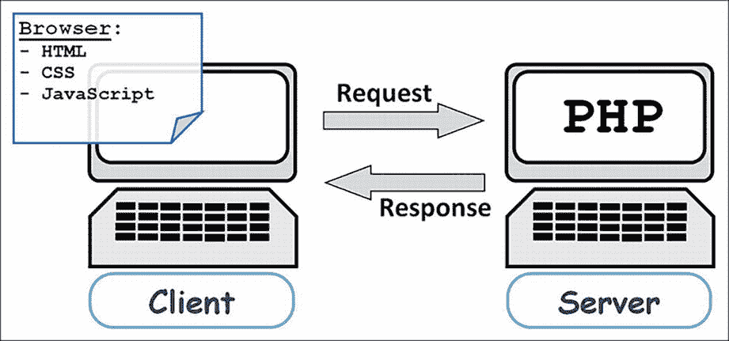

# ISBN 979-8-8688-0257-7

e-ISBN 979-8-8688-0258-4

[`doi.org/10.1007/979-8-8688-0258-4`](https://doi.org/10.1007/979-8-8688-0258-4)

翻译自俄语版本：“Программирование на PHP в примерах и задачах”（阿列克斯·瓦西里耶夫 著），© Alex Vasilev 2021。由 Eksmo Publishing 出版。保留所有权利。

© Alex Vasilev 2024 本作品受版权保护。无论整体还是部分材料，其所有权利均由出版者独家授权，具体包括重印、插图再利用、朗诵、广播、微缩胶片复制或以任何其他物理方式复制的权利，以及以目前已知或今后开发的任何相似或不同方法进行传输、信息存储与检索、电子改编、计算机软件等权利。本出版物中通用描述性名称、注册商标名称、商标、服务标记等的使用，即使未作明确声明，也不意味着这些名称免于相关保护法律和法规的约束，因此可自由使用。出版者、作者与编辑谨慎假定，本书中的建议和信息在出版之日是真实准确的。出版者、作者或编辑对本文所含内容或可能存在的任何错误或遗漏不作任何明示或暗示的担保。出版者对于出版地图中的管辖权主张和机构所属关系保持中立态度。

本 Apress 印记由隶属于施普林格自然的注册公司 APress Media, LLC 出版。

注册公司地址为：1 New York Plaza, New York, NY 10004, U.S.A.

*谨以此书纪念我的父亲。感谢您给予的一切，并为我未能回报的一切致歉。*

## 引言

> *宇宙中有许多事情是你本不该理解的。但这并不意味着它们不真实。*
>
> ——《ALF》（电视剧）

本书讨论的是 PHP 编程语言。PHP 是一门简单、优美且优雅的语言。此外，它在某种意义上也是独特的。PHP 旨在服务器端执行代码。换句话说，仅仅了解 PHP 是不够的，还必须理解它是如何被使用以及用于什么目的。这一点很重要，因为理解语言的功能是有效使用它的关键。

> **注意：** PHP 是一门用于编程和 Web 编程的语言。

### 关于 PHP

PHP 语言用于创建网站和 Web 应用程序。它历史悠久，深受开发者欢迎，并得到大多数托管服务器的支持。

| 详情 |
| --- |
| 托管（Hosting）是一种提供服务、在服务器上提供资源与空间来存储数据和信息（例如网页）的服务。托管服务器（Host Server）是指托管这些信息的服务器。简单而言，托管服务器就是一台计算机（服务器），它托管用户的网页（即预期使用 PHP 的页面）。 |

PHP 的作者是拉斯马斯·勒德尔夫。该项目最初是为了支持个人网页而编写脚本，并命名为 Personal Homepages Tools 或 PHP Tools。后来，它转变为独立且有影响力的软件产品。如今，PHP 这个名称通常与短语 *Hypertext Preprocessor*（超文本预处理器）相关联，这与事实相差不远。

> **注意：** 编写本书时，当前版本为 PHP 8。另一方面，在实践中，语言的最新版本并不会立即投入使用。由于客观和主观因素，这里存在一定的惯性。因此，本书考虑了与最近几个语言版本相关的通用方法。值得注意的是，没有第六版：第五版之后是第七版。原因是尝试发布第六版的尝试非常不成功。

PHP 是一种脚本化和解释型语言。可解释性意味着程序在特定程序（称为*解释器*）的控制下执行。解释器逐行读取代码并执行相应的指令。

一个铃铛图标。PHP 8 标准版

PHP 8 引入了 JIT 编译器（*Just in Time* 的缩写）用于编译 PHP 代码，以加速程序执行。编译时，程序指令会被翻译成处理器级别的指令。

脚本语言通常是高级语言。与常规程序不同，脚本通常包含用于控制现成软件组件的指令。换句话说，脚本语言是一种直观的语言。当然，并非所有情况都如此美好。

| 详情 |
| --- |
| C 语言影响了 PHP 语言的语法。因此，如果你熟悉 C、C++、C# 或 Java 等语言，你会发现许多熟悉的语法结构。 |

当然，PHP 只是众多编程语言中的一种。但它有一个重要的特点，体现在 PHP 代码的使用方式上。

如果你使用任何传统的编程语言，编写和使用程序的过程通常如下：首先，创建程序代码——换句话说，编写一个程序。然后，必须执行该程序。如何执行取决于语言，但最关键的问题是程序是*编译型*还是*解释型*。如果程序是编译型的，特定的编译器程序会将你的程序翻译成机器指令（或类似指令），然后执行这些指令。如果程序是解释型的，特定的解释器程序会读取你的程序并执行代码中的语句。但无论哪种情况，关键在于你所有的操作都在同一台计算机上完成。你在计算机上运行程序并获得结果。你可以对程序执行的结果做任何你想做的事情，但重要的是，只需一台计算机就够了。

对于 PHP 语言，情况则有所不同。要理解这个问题，让我们来看看当你访问一个网页时会发生什么，以及 PHP 在其中的作用。

## 客户端与服务器

概而言之，以下是网站在网络中呈现的示意图。在此场景中，主要“角色”是您用于查看网页的计算机和存储该页面的计算机。第一台计算机（您查看网页所用的计算机）称为*客户端*，而存储网页的计算机称为*服务器*。

这两台计算机通过全球网络建立连接，因此可以相互发送信息。您在客户端计算机上操作并希望查看某个网页。为此，您需要运行一个专门用于查看网页的程序，该程序称为*浏览器*。打开浏览器（例如 Chrome、Opera 或 Edge），在地址栏中输入您要查看的网站地址。浏览器随即向服务器发起请求。服务器接收请求、处理请求，并将响应返回给客户端。响应中包含文档代码，浏览器应将其显示在客户端屏幕上。“交互”的总体方案如图 I-1 所示。

| 详细信息 |
| --- |
| **您可以使用** `php -v` **命令行指令检查 PHP 版本。要获取 PHP 帮助，请使用** `php -h` **命令。通过** `php -i` **命令可获取关于 PHP 的更多信息。** **如果您使用 Windows 操作系统，可以在 Windows 资源管理器的地址栏中输入** `cmd` **指令以切换到终端模式。随后，需在终端窗口中切换到 PHP 目录。例如，如果 PHP 位于** `C:\PHP` **文件夹中，则相应的命令为** `cd C:\PHP`**。另一种方法是先导航至 PHP 目录，然后在资源管理器地址栏中输入** `cmd` **指令。** **许多 Linux 家族操作系统都预装了 PHP。但若未安装，您可以使用** `sudo apt install php` **命令进行安装。** |

示意图展示了计算机设备，以及表示客户端与服务器之间连接的流向。

**图 I-1** 客户端与服务器交互示意图

浏览器处理 HTML 格式的文档（缩写源自超文本标记语言）。文本中包含特殊标记。浏览器“理解”这些标记，并按照文档中嵌入的指令渲染文档。除实际的 HTML 标记外，浏览器显示的文档可能还包含其他指令。例如，文档中可使用 CSS（层叠样式表）进行格式化，也可能包含 JavaScript 脚本。在后一种情况下，浏览器会执行这些脚本。因此，服务器发送一组命令，浏览器负责执行。关键在于，命令是在发出请求的同一台计算机上执行的。

> **注意：** 服务器指示要执行的操作，客户端的浏览器则执行必要的操作。虽方便，但并不总是安全。

那么，PHP 在此方案中位于何处？答案在于服务器处理请求的阶段。当服务器接收到客户端请求时，它会处理该请求，而在处理过程中，可以执行脚本——此处即 PHP 脚本。

| 详细信息 |
| --- |
| 通常，脚本的输出是生成并传递给客户端的 HTML 代码。 |

但这并非全部。许多程序试图通过网络交换信息。客户端上的进程向服务器上的进程发送信号，反之亦然，因此需要知道哪个信号对应哪个进程。为此，我们使用端口。端口是进程用来识别发往自身信号的唯一整数标识符。因此，客户端浏览器的请求与服务器的响应必须通过端口进行同步。也就是说，要有效使用 PHP，需要解决相当多的技术问题。所有这些都将根据实际需要逐步展开介绍。

## 如何执行 PHP 代码

让我们在 PHP 学习之旅中迈出下一步，即关注如何执行用 PHP 编写的程序。如果讨论的是 PHP 代码的“常规”使用方式，则需要一台服务器和一个客户端，也就是两台计算机。脚本（程序）托管在服务器上，您可以通过客户端浏览器访问服务器上的网页来查看程序执行结果。但即便拥有所有这些资源，所描述的策略也并不十分方便，因为您需要在一台计算机（服务器）上编辑程序，而在另一台计算机（客户端）上检查结果。因此，显然您更希望采用更可靠的策略。

另一种方法是“欺骗”浏览器，即制造一种“服务器本身就是客户端”的假象。这涉及使用`本地服务器`。切换到该模式非常简单。这种方法的优势在于，程序及其结果都局限于同一台计算机内。

另一方面，PHP 代码也可以使用解释器来执行——这与大多数其他解释型语言的情况大致相同。这可能是查看程序运行结果的最简单方式。不过，您不应忘记，PHP 程序的编写初衷并非为了在客户端计算机上用解释器执行。因此，其中也会涉及一些技巧。