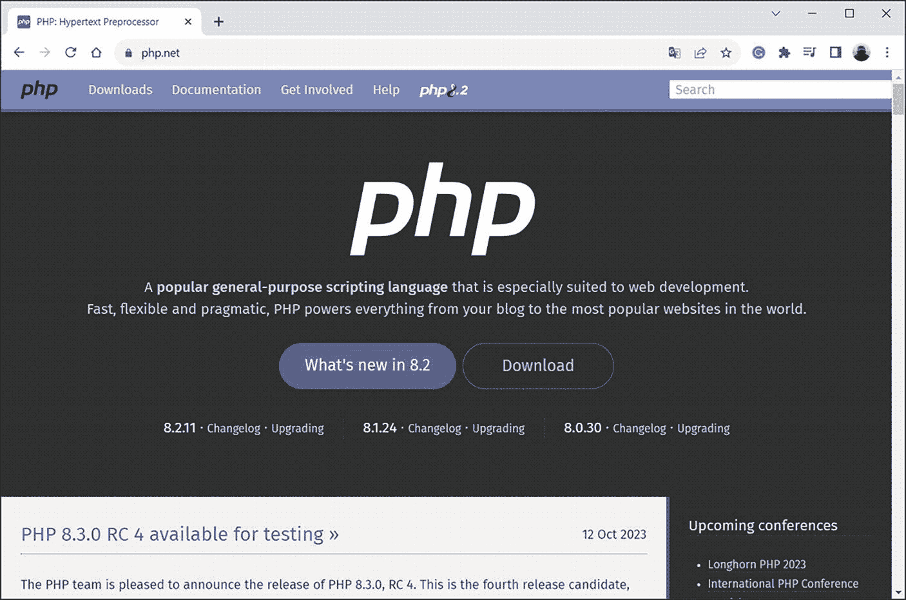
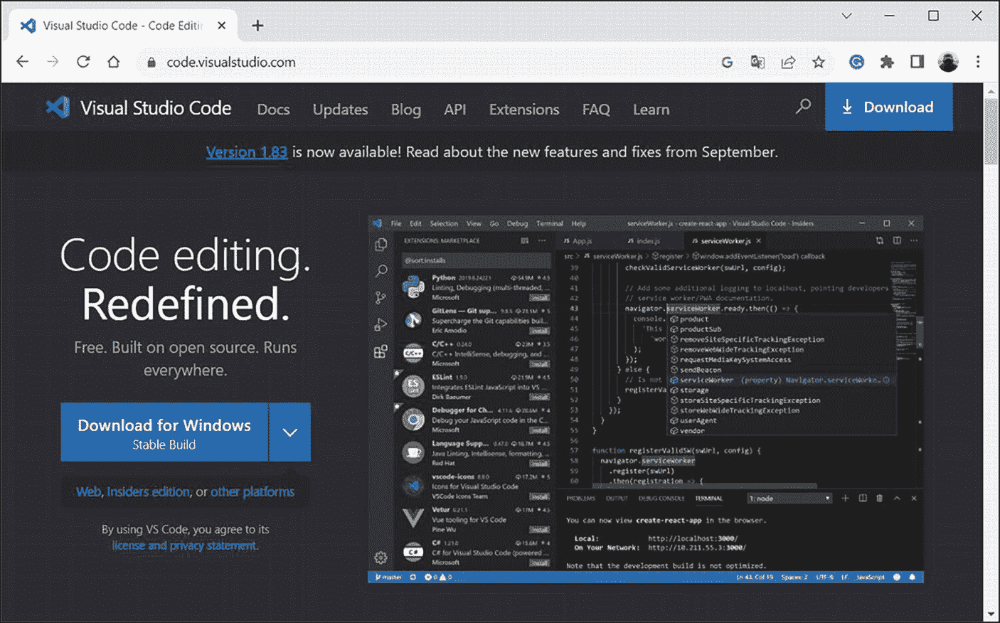
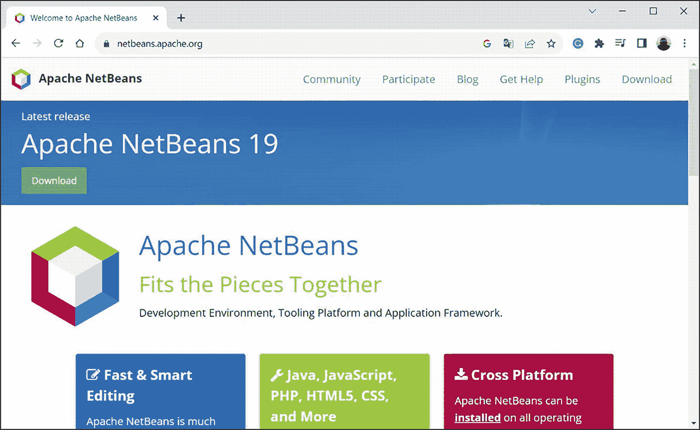

# 软件

本书包含许多示例，在学习这些示例的过程中，需要对程序进行拆解并检查其执行结果。这需要特定的软件。

首先，你需要安装支持 PHP 的软件。为此，请访问 [`www.php.net`](http://www.php.net)，如图 I-2 所示。

**图 I-2** [`www.php.net`](http://www.php.net) 上的 PHP 支持窗口

你应该在该窗口中找到软件下载区域，并下载必要的文件。

> **注意**
>
> 在最简单的情况下，安装过程等同于解压从 [`www.php.net`](http://www.php.net) 下载的压缩包。对于在命令行模式下使用 PHP 解释器（`php.exe` 文件）来说，这很可能就足够了。如果需要使用专门的软件来实现更“舒适”的工作模式，则可能需要进行额外的设置。如果是这样，请查阅 [`www.php.net`](http://www.php.net) 页面上的帮助信息，并参考相关软件产品（例如，代码编辑器）的帮助文档。

一般来说，拥有一个允许你执行 PHP 编写程序的 PHP 解释器就足够了。但是，你还需要在某个地方键入和编辑你的程序。原则上，普通的文本编辑器是一种选择。但更好的选择是安装更高级的、支持 PHP 语法的编辑器（一个“理解” PHP 特殊指令的编辑器）。

> **注意**
>
> 如果需要，很容易找到合适的编辑器来处理 PHP 代码。然而，这种策略主要针对高级用户。因此，这不在你的关注范围之内。

还有其他选择。例如，Visual Studio Code 开发环境（地址是 [`https://code.visualstudio.com`](https://code.visualstudio.com)）就相当方便。在项目页面上打开的浏览器窗口如图 I-3 所示。

| 详情 |
| --- |
| 首次运行 Visual Studio Code 应用程序时，必须先在“自定义”部分确认安装 PHP 支持。 |

**图 I-3** Visual Studio Code 项目支持页面

另一个开发 PHP 程序的好选择是 NetBeans IDE。其安装文件可以从 [`http://netbeans.apache.org`](http://netbeans.apache.org) 下载。图 I-4 显示了在 NetBeans 项目支持页面上打开的浏览器窗口。

| 详情 |
| --- |
| 你可能需要预先在你的计算机上安装 Java 开发工具包 (JDK) 才能使用 NetBeans。 |

**图 I-4** NetBeans 项目支持页面

还有其他有用的软件产品，包括商业产品。但再次强调，安装 PHP 并选择合适的代码编辑器就足够了。

> **注意**
>
> 你将通过示例学习如何使用这些软件（在初级水平上）。