# 1. 第一个程序

> *——我要求恢复地球的臭氧层。*
>
> *——阿尔夫，我们周六之前完不成。*
>
> ——*《天才老爹》*（电视剧）

在本章中，你将创建第一个 PHP 程序。具体来说，你将分析一些简单的代码，并确定如何执行这些代码。本章涉及的编程内容不多，但许多信息对使用 PHP 至关重要。

## 程序代码

PHP 程序是一组由解释器执行的指令。这些指令必须经过适当格式化，并传递给解释器执行。相关计划主要围绕解决以下两个任务展开。

- 编写程序代码
- 启动程序执行

第二个任务比第一个任务复杂得多。

那么，让我们创建你的第一个 PHP 程序。具体来说，我们先明确程序要做什么。按照惯例，第一个程序通常显示一条消息。我们也这样做。你的程序将在输出窗口（终端）中显示一条欢迎消息。程序如清单 1-1 所示。

```
清单 1-1
第一个程序
```

程序以`<?php`语句开始，以`?>`语句结束。这是所有 PHP 程序的标准格式。要执行的命令放在这两个指令之间。在本例中，只有一个命令。它调用了内置函数`print()`，并将`"Hello, PHP!"`作为参数传递。

| 详细信息 |
| --- |
| 函数是一个命名的代码块（命令块），可以通过调用函数（必要时指定函数名及其参数）来执行。函数可以在程序中创建，也可以使用内置函数。在众多内置函数中，有一个`print()`函数。文本值用双引号括起来。此外，文本值也可以用单引号括起来。这两种风格几乎等价，但存在一些重要区别，稍后会讨论。另外值得注意的是，PHP 中的每条命令都以分号结尾。 |

信息图标。

**注意**

坦率地说，`print()`并非严格意义上的函数，而是 PHP 语言的一种特殊语法结构。但由于其属性与函数相似，我们将其视为函数。在所有类似情况下，我们都采用同样的处理方式。

正如你可能猜到的，该命令在终端中显示一条消息。消息文本作为参数传递给`print()`函数。以下是运行程序的结果。

```
程序输出（来自清单 1-1）
Hello, PHP!
```

这个程序并不复杂。剩下的问题只是弄清楚如何运行这个程序。

| 详细信息 |
| --- |
| 调用`print()`函数时，可以不带括号指定参数。也就是说，可以使用`print "Hello, PHP!"`语句来代替`print("Hello, PHP!")`命令。`print()`函数的另一个替代方案是`echo`语句。具体来说，可以使用`echo "Hello, PHP!"`命令来显示消息。 |


## 解释器模式

让我们探讨几种方案，您可以选择最喜欢的一种。

> **注意**
>
> PHP 程序的执行有两种模式。第一种是在客户端计算机上使用解释器执行程序。第二种模式是将 PHP 代码封装在带有 HTML 标记的文档中。在这种情况下，您必须使用外部或本地服务器。实现这种方式比使用解释器执行代码稍复杂一些，但它更“自然”，也更贴近 PHP 的实际应用。

因此，首先要做的是创建一个包含程序的文件，如清单 1-1 所示，并将该文件保存为`.php`扩展名。例如，将文件命名为`hello.php`，放置在`D:\Books\php\codes`文件夹中。接下来，执行该文件。在此阶段，您需要一个解释器，即位于 PHP 安装目录下的`php.exe`文件。假设 PHP 安装在`C:\PHP`文件夹中。启动程序的简单方法是：在终端命令行中，必须执行`php.exe`，并将`hello.php`文件（包含程序的文件）作为参数传递给它。您可以简化操作。您需要在命令行中指定`php.exe`文件的完整路径，并用空格隔开，指定`hello.php`程序的完整路径。相应的命令如下所示。

```
C:\PHP\php.exe D:\Books\php\codes\hello.php
```

不过，指定文件的完整路径并不十分方便。原则上，您可以切换到`php.exe`文件所在的目录，并将包含 PHP 代码的文件保存在同一位置。因此，如果 PHP 安装在`C:\PHP`文件夹中，要切换到该目录，请在命令行中运行以下命令。

> **详情**
>
> 如果需要更改目录和磁盘，请使用`/d`选项。例如，如果需要从`D:\`盘切换到`C:\`盘，命令格式为`cd /d C:\`。

```
cd C:\PHP
```

如果`hello.php`文件与`php.exe`文件位于同一文件夹中，则使用以下命令运行程序。

```
php hello.php
```

在 Windows 操作系统下，如果将 PHP 文件夹的路径添加到`Path`环境变量中，然后切换到程序文件所在的文件夹，也可以使用相同的命令。

> **详情**
>
> 在计算机属性中选择**高级**系统设置项，以获取`Path`环境变量。在**系统属性**窗口中，选择**环境变量**图标。在**环境变量**窗口中，选择**Path**项并修改相应变量的内容。

使用开发环境可以简化代码的测试和执行。我们以 Visual Studio Code 环境为例。图 1-1 显示了打开`hello.php`文件的环境窗口。

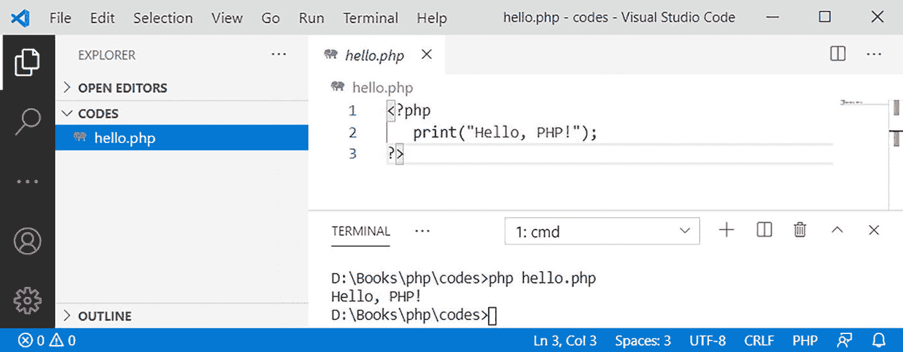

**图 1-1** – 打开了`hello.php`程序文件的 Visual Studio Code 开发环境窗口

在环境窗口中，打开包含程序文件的文件夹。（您可以使用**文件**菜单中的**打开文件夹**命令。）此文件夹中的文件应显示在开发环境窗口左侧的**资源管理器**部分。在这种情况下，选择程序文件。文件内容将显示在窗口的中央部分。您可以在终端中运行程序，终端通过**终端**菜单中的**新建终端**命令打开。在示例中，您在终端命令行中输入以下命令。

```
php hello.php
```

如果您使用 Windows 操作系统，`Path`环境变量必须包含`php.exe`文件的路径。如果没有，您必须指定该文件的完整路径，命令如下所示。

```
C:\PHP\php.exe hello.php
```

如果一切顺利，程序显示的消息应该会出现在终端中。

然而，最舒适且免费的开发方式是使用 NetBeans 开发环境（安装文件的网站位于 [`netbeans.apache.org`](http://netbeans.apache.org)）。NetBeans 环境窗口如图 1-2 所示。

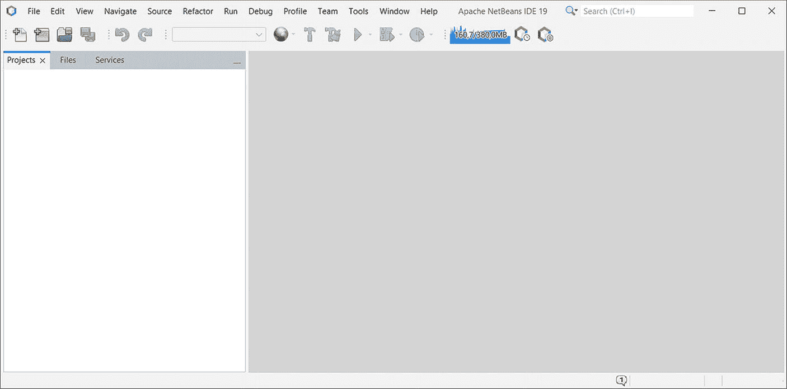

**图 1-2** – NetBeans 窗口

要在此环境中创建新项目，请选择**文件**菜单中的**新建项目**命令，如图 1-3 所示。

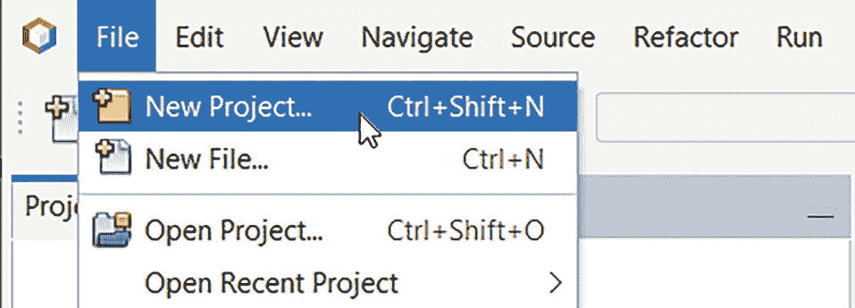

**图 1-3** – 创建新项目

**新建项目**窗口打开，如图 1-4 所示。

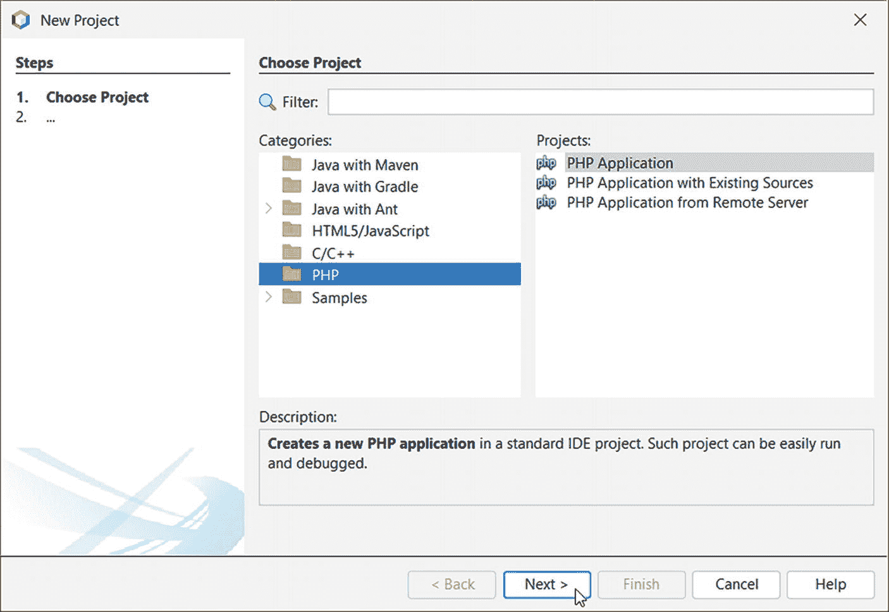

**图 1-4** – 用于创建新项目的**新建项目**窗口

在窗口中，您选择应用程序的类型（必须创建一个 PHP 项目）。随后会出现**新建 PHP 项目**窗口，如图 1-5 所示。

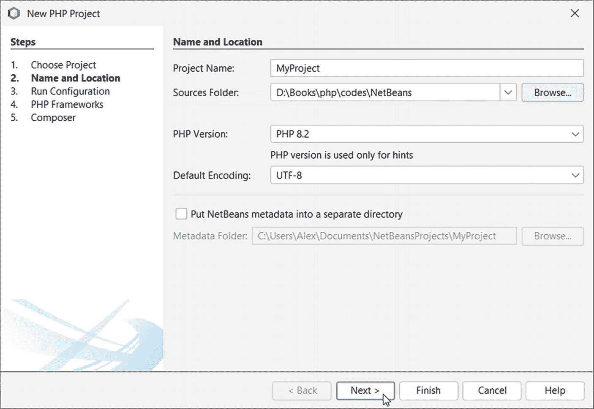

**图 1-5** – 用于设置项目参数的**新建 PHP 项目**窗口

您使用该窗口执行项目设置，例如项目名称（**项目名称**字段）、项目位置（**源文件夹**字段）以及其他一些设置（保持默认值即可）。

在下一个窗口中，选择运行时环境。您关注的是从命令行运行。为此，请在**运行方式**下拉列表中选择**脚本（在命令行中运行）**选项，如图 1-6 所示。

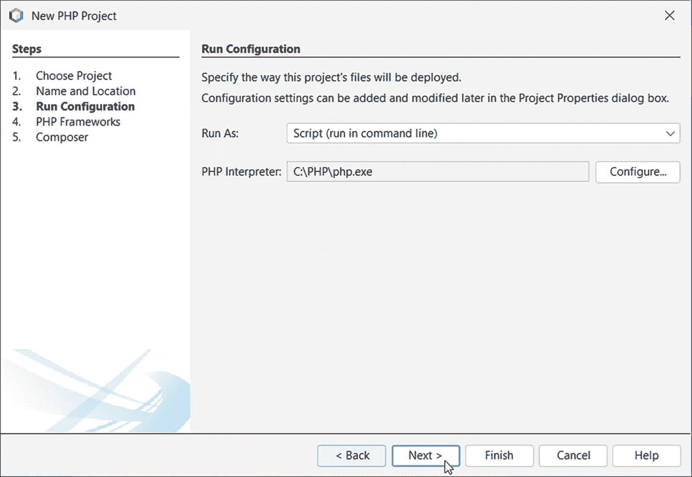

**图 1-6** – 选择运行时环境

**PHP 解释器**字段指定 PHP 解释器的位置（本例中为`C:\PHP\php.exe`）。其他窗口中的设置应保持不变。图 1-7 显示了新创建项目的窗口。

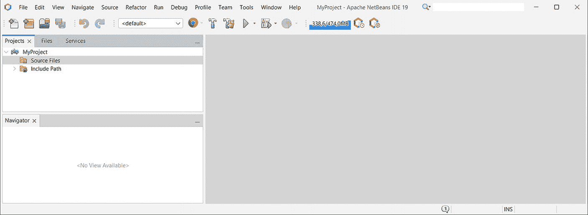


Apache NetBeans IDE 19 环境窗口截图。顶部有十三个菜单：**File**、**Edit**、**View**、**Navigate**、**Source**、**Refactor**、**Run**、**Debug**、**Profile**、**Team**、**Tools**、**Window** 和 **Help**。左侧面板包含三个选项卡：**Projects**、**Files** 和 **Services**。在左侧面板中，`My Project` 下的 `Source Files` 选项被选中。

**图 1-7**  
新创建项目的窗口

如有必要，将 `index.php` 文件添加到 **Projects** 选项卡中的 `Source Files` 文件夹。为此，请从上下文菜单的 **New** 子菜单中选择 **PHP File** 项，如图 1-8 所示。

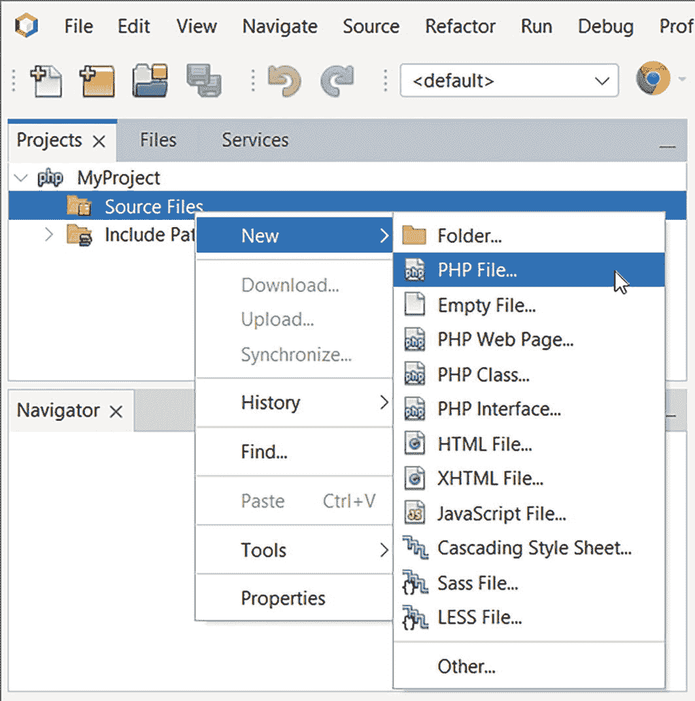

Apache NetBeans IDE 19 环境窗口的裁剪截图。顶部有十三个菜单。左侧面板包含三个选项卡：**Projects**、**Files** 和 **Services**。在左侧面板中，`My Project` 下的 `Source Files` 选项被选中。从 **New** 子菜单中，选中了 **PHP File** 项。

**图 1-8**  
向项目添加文件

在 **New PHP File** 窗口的 **File Name** 字段中输入文件名，如图 1-9 所示。

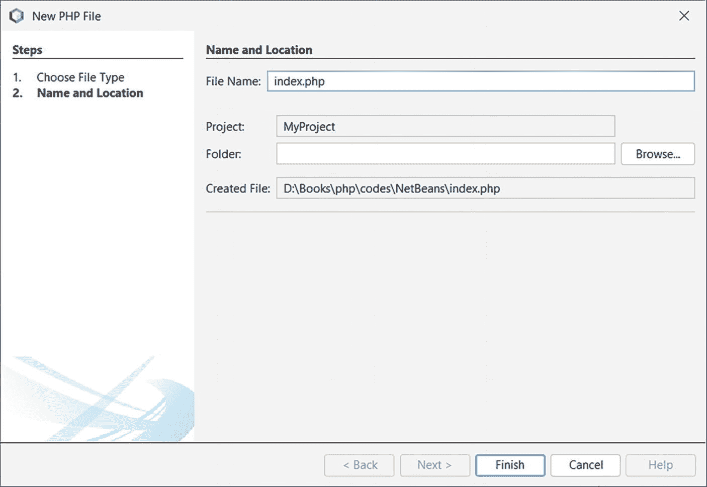

NetBeans 环境中 **New PHP File** 窗口的截图。在两个步骤下，选择了 **Name and Location** 选项。它包括 **File Name**（`index.php`）、**Project**、**Folder** 和 **Created File**。**Finish** 按钮被选中。

**图 1-9**  
包含文件名的 **File Name** 字段

> **注意**  
> 在一些 NetBeans 版本中，`index.php` 文件会被自动创建在项目文件夹中。

`index.php` 文件的代码被输入到编辑器窗口中。图 1-10 展示了这一情况。

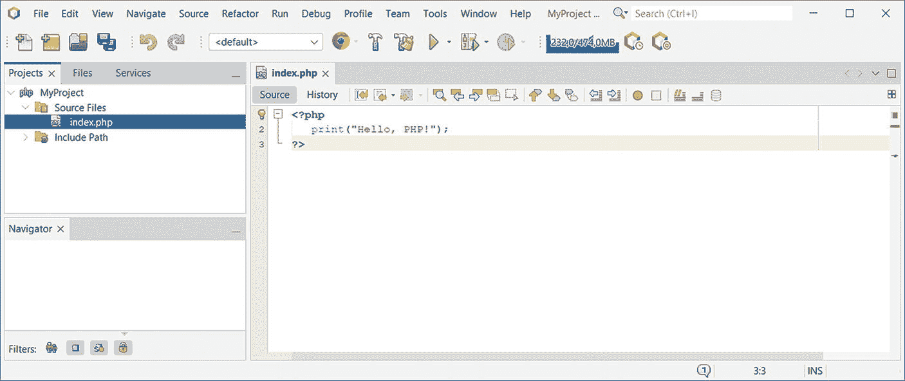

Apache NetBeans IDE 19 环境窗口截图。顶部有十三个菜单：**File**、**Edit**、**View**、**Navigate**、**Source**、**Refactor**、**Run**、**Debug**、**Profile**、**Team**、**Tools**、**Window** 和 **Help**。左侧面板包含三个选项卡：**Projects**、**Files** 和 **Services**。在 `My Project` 下的 `Source Files` 选项中，`index.php` 被选中。

**图 1-10**  
包含代码的 `index.php` 文件

然后，运行代码以执行。为此，请点击工具栏上的绿色大按钮图标，或从 **Run** 菜单中选择 **Run Project** 命令，如图 1-11 所示。

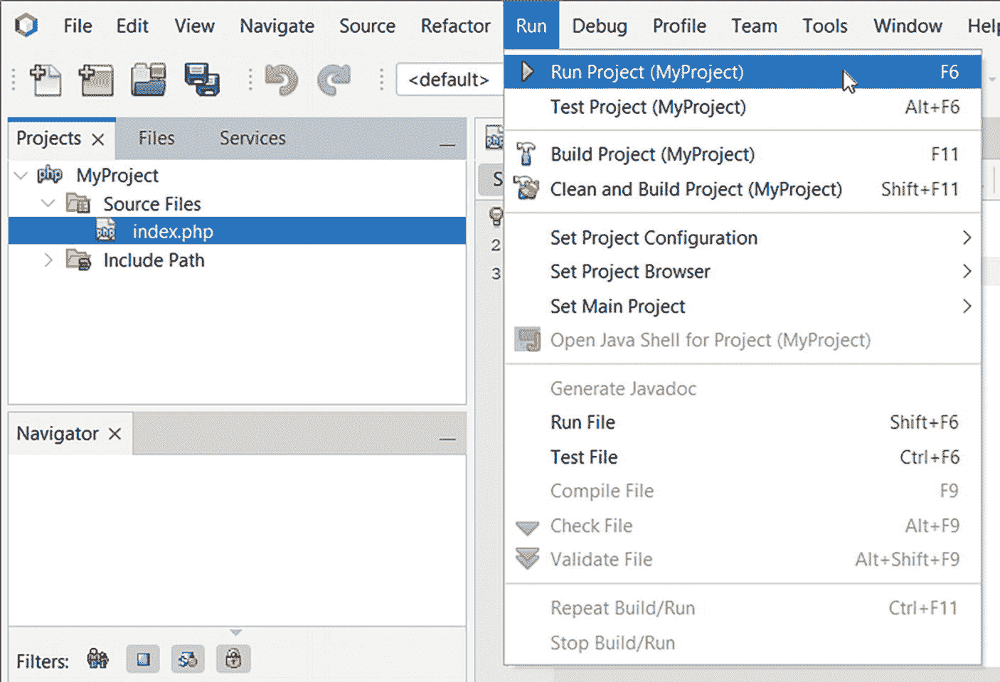

Apache NetBeans IDE 19 环境窗口截图。顶部有十三个菜单：**File**、**Edit**、**View**、**Navigate**、**Source**、**Refactor**、**Run**、**Debug**、**Profile**、**Team**、**Tools**、**Window** 和 **Help**。左侧面板包含三个选项卡：**Projects**、**Files** 和 **Services**。对于 `index.php`，**Run Project** 选项已从 **Run** 菜单中被选中。

**图 1-11**  
运行 PHP 程序

代码执行的结果会显示在 NetBeans IDE 窗口底部的输出区域中（见图 1-12）。

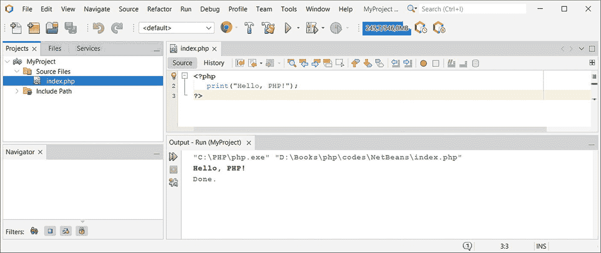

Apache NetBeans IDE 19 环境窗口截图。顶部有十三个菜单：**File**、**Edit**、**View**、**Navigate**、**Source**、**Refactor**、**Run**、**Debug**、**Profile**、**Team**、**Tools**、**Window** 和 **Help**。左侧面板包含三个选项卡：**Projects**、**Files** 和 **Services**。对于 `index.php`，**Run Project** 选项的输出结果为 `Hello, PHP!`。

**图 1-12**  
程序执行的结果

因此，您可以方便地编辑程序代码并运行它。

> **注意**  
> NetBeans 环境拥有简单且用户友好的配置系统。其描述超出了本书的范围。同时，如有必要，您可以自行处理相关的技术问题。


还需要注意的是，有些与 PHP 工作相关的设置需要在一个特殊窗口中进行，该窗口可通过`工具`菜单中的`选项`命令打开。

在 NetBeans 中，你可以创建一个包含 PHP 代码的单个文件，而无需创建项目。为此，请在 NetBeans 开发环境窗口中选择`文件`菜单中的`新建文件`命令（见图 1-13）。

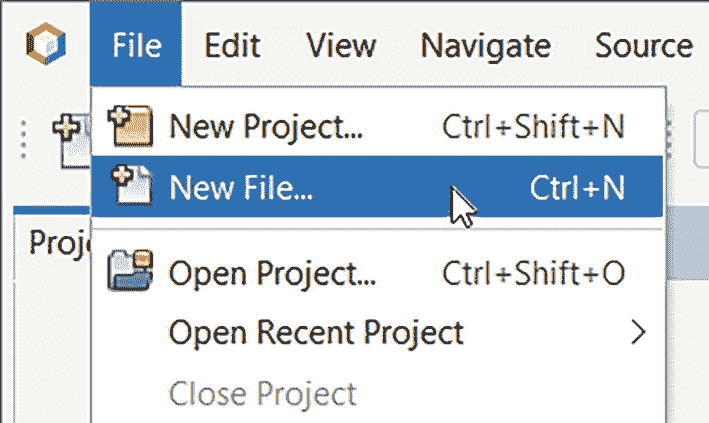

NetBeans 环境窗口的裁剪截图，Apache NetBeans IDE 19。顶部有十三个菜单，分别是`文件`、`编辑`、`视图`、`导航`、`源代码`、`重构`、`运行`、`调试`、`性能分析`、`团队`、`工具`、`窗口`和`帮助`。`文件`菜单下的`新建文件`选项已被选中。

图 1-13

在 NetBeans 中创建文件

此时会打开`新建文件`窗口，在其中选择要创建的文件类型（见图 1-14）。

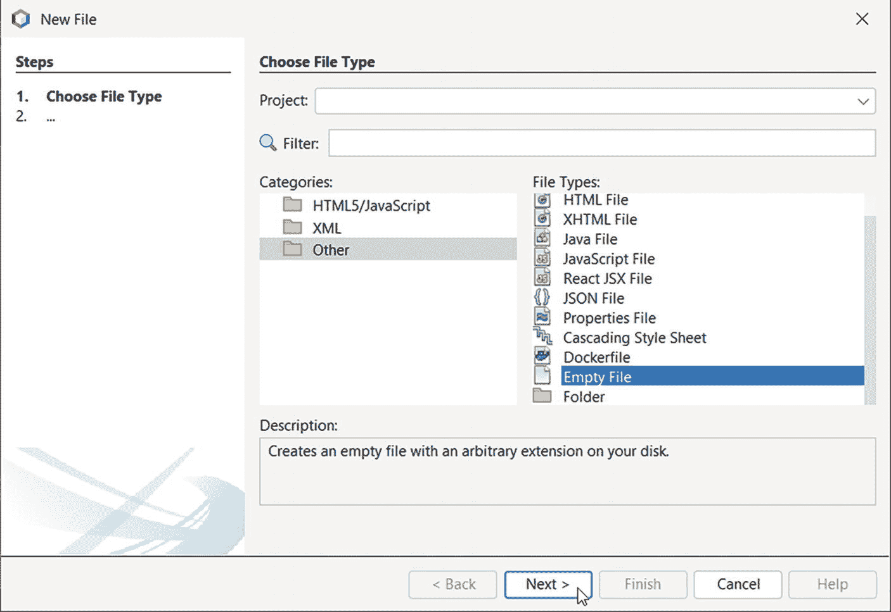

NetBeans 环境中`新建文件`窗口的截图。在两步操作中，`选择文件类型`选项已被选中。类别中选择了`其他`，文件类型中选择了`空文件`。描述显示为“在磁盘上创建一个带有任意扩展名的空文件”。`下一步`按钮已被选中。

图 1-14

选择文件类型

具体来说，请在`类别`部分中选择`其他`，在`文件类型`部分中选择`空文件`。随后，`新建空文件`窗口会出现（见图 1-15）。

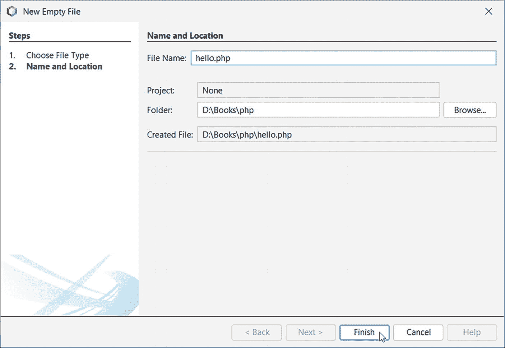

NetBeans 环境中`新建空文件`窗口的截图。在两步操作中，`名称和位置`选项已被选中。它包括`文件名`（为`hello.php`）、`项目`、`文件夹`和`创建的文件`。`完成`按钮已被选中。

图 1-15

确定文件名的窗口

在此窗口中，你需要在`文件名`字段中设置文件名（本例为`hello.php`）。`文件夹`字段指定文件位置（本例为`D:\Books\php`）。这样，一个空文件就创建好了，你可以向其中输入程序，如图 1-16 所示。

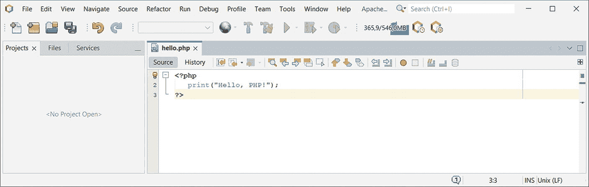

NetBeans 环境窗口的截图，Apache NetBeans IDE 19。顶部有十三个菜单，分别是`文件`、`编辑`、`视图`、`导航`、`源代码`、`重构`、`运行`、`调试`、`性能分析`、`团队`、`工具`、`窗口`和`帮助`。左侧面板有 3 个选项卡，包括`项目`、`文件`和`服务`。`hello.php`中使用了`print`函数。输出显示为`Hello, PHP!`。

图 1-16

NetBeans 窗口中包含程序的该文件

要运行包含代码的文件以执行，请选择`运行`菜单中的`运行文件`命令（见图 1-17）。

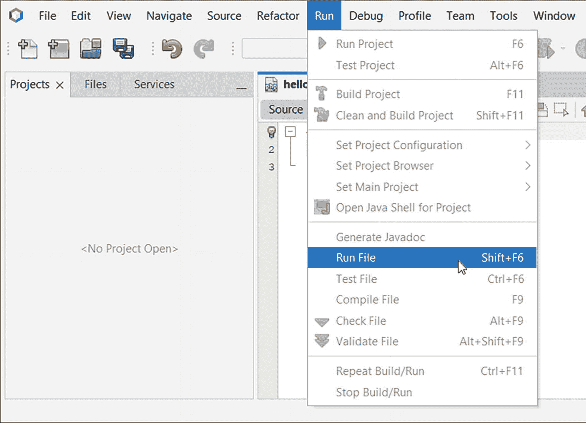

NetBeans 环境窗口的截图，Apache NetBeans IDE 19。顶部有十三个菜单，分别是`文件`、`编辑`、`视图`、`导航`、`源代码`、`重构`、`运行`、`调试`、`性能分析`、`团队`、`工具`、`窗口`和`帮助`。左侧面板有 3 个选项卡，包括`项目`、`文件`和`服务`。已从`运行`菜单中为`hello.php`选择了`运行文件`选项。

图 1-17

运行包含代码的文件以执行

运行程序执行后，结果会出现在开发环境窗口底部的输出区域，如图 1-18 所示。

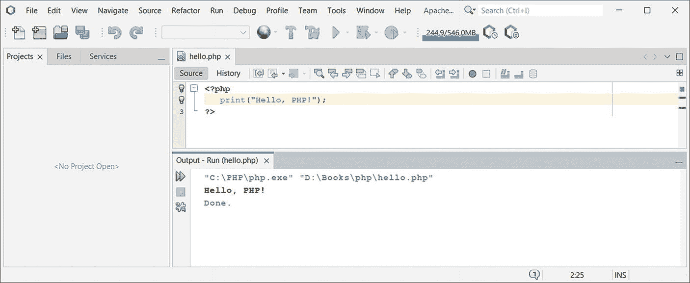

NetBeans 环境窗口的截图，Apache NetBeans IDE 19。顶部有十三个菜单，分别是`文件`、`编辑`、`视图`、`导航`、`源代码`、`重构`、`运行`、`调试`、`性能分析`、`团队`、`工具`、`窗口`和`帮助`。左侧面板有 3 个选项卡，包括`项目`、`文件`和`服务`。来自`运行文件`选项的输出是`hello.php`的`Hello, PHP!`。

图 1-18

从该文件执行程序的结果

一个信息图标。

**注意**

当你运行文件以执行时，会弹出`运行文件`窗口，你只需单击`确定`按钮即可。

| 详情 |
| --- |
| 有时，确保开发环境编辑器的编码、文件写入时的编码以及输出区域的编码保持一致至关重要。你可以更改 NetBeans 环境编辑器的默认编码。为此，请打开 `netbeans.conf` 文件（位于 NetBeans 环境安装文件夹的 `etc` 子文件夹中）。然后，找到 `netbeans_default_options` 参数，并在其值后面用空格追加 `-J-Dfile.encoding=UTF-8`（使用的是 UTF-8 编码）。如果遇到任何问题，建议查阅 NetBeans IDE 帮助。 |

使用什么软件取决于偏好、个人喜好和技术能力。最重要的是验证书中程序代码的运行效果。


## 服务器模式

另一种测试 PHP 程序运行的模式是使用服务器来执行程序。我们可以使用外部或本地计算机作为服务器。我们先从第二种情况开始。

你将把 PHP 代码封装到 HTML 文档中。

## HTML 基础

要创建网页，需要使用一种特殊的文档标记语言。这种标记语言定义了文档的结构以及其各个区块的格式——也就是声明式语言 HTML（超文本标记语言的简称）。相应的文档包含纯文本和称为标签或描述符的特殊指令。这些指令是为浏览器准备的，浏览器会根据这些指令来显示文档。

让我们使用清单 1-2 中所示的 HTML 代码。

```
The First Program
清单 1-2
第一个项目的 HTML 代码
```

此代码必须保存在一个 `.php` 文件中。它是位于 `D:\Books\php\codes` 目录下的 `hi.php` 文件。

## HTML 基础

一个 HTML 文档以 `<!DOCTYPE html>` 声明开头，该声明定义了文档的规范。文档的内容放置在 `<html>` 和 `</html>` 标签之间。文档的元数据放置在由 `<head>` 和 `</head>` 标签定义的区块中。在这种情况下，只有一个元素，由 `<title>` 和 `</title>` 标签（标题元素）分隔。该元素中包含的文本 `The First Program` 用作网页的标题（显示在浏览器的文档标签页上）。

由浏览器渲染的文档内容放置在由 `<body>` 和 `</body>` 标签标记的区块中。其中只有一段与清单 1-1 类似的 PHP 代码。当服务器执行该代码时，文本会被添加到网页文档的相应位置。`print("Hello, PHP!")` 命令用于打印文本。换句话说，文本 `"Hello, PHP!"` 被添加到网页中，这些内容在你用浏览器打开文档时都能看到。但如何打开网页则是另一个问题。

如果你尝试用浏览器打开 `hi.php` 文件，结果可能并不完全是你所期望的。具体来说，文件的代码会显示在浏览器窗口中，如图 1-19 所示。

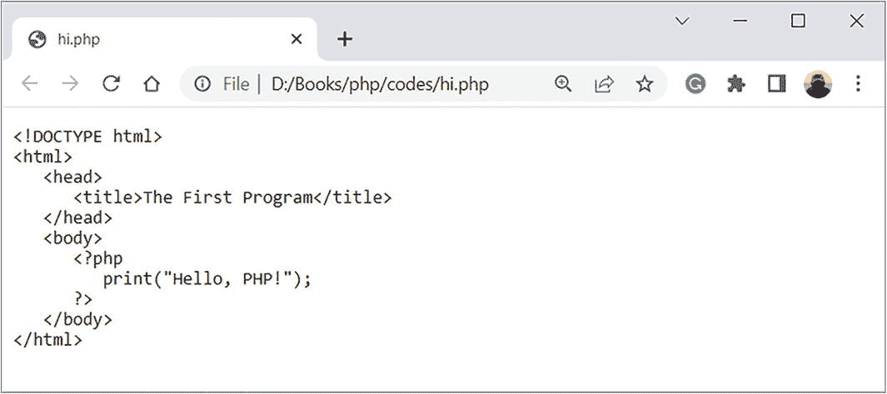

浏览器页面的截图，显示来自路径 `D:\Books\php\codes` 的 `hi.php` 程序。在 head 标签下，标题显示为 `The First Program`。在 body 标签下，显示了针对 `Hello, PHP!` 的 `print` 函数。

图 1-19  
尝试在浏览器中打开 `hi.php` 文件

要获得不同的结果，你需要运行一个本地服务器。为此，使用 `-S` 选项运行 `php.exe`，后跟 `localhost` 关键字，并用冒号分隔，指定本地服务器的端口号。原则上，端口号可以是任意的，但建议大于 5000。

| 详细信息 |
| --- |
| 通常，端口号是 `1` 到 `65535` 之间的一个数字。系统进程会使用主要的端口号。 |

之后，在命令行中指定 `-t` 选项以及你想要标识为本地服务器根目录的文件夹链接。更具体地说，命令如下所示。

```
php -S localhost:6789 -t D:\Books\php\codes
```

该指令使用端口 `6789` 运行本地服务器。服务器的根目录被标识为 `D:\Books\php\codes` 文件夹。如果 `Path` 环境变量包含 `php.exe` 文件的路径，或者命令是从 `php.exe` 文件所在的文件夹执行的，那么这样的命令是正确的。通常，命令可能如下所示。

```
C:\PHP\php.exe -S localhost:6789 -t D:\Books\php\codes
```

这里指定了 `php.exe` 文件的完整路径。

如果一切操作正确，本地服务器就会启动。现在，打开浏览器并在地址栏中输入以下指令。

```
localhost:6789/hi.php
```

结果，在打开 `hi.php` 文件时，你的计算机会模拟服务器的工作。结果应如图 1-20 所示。

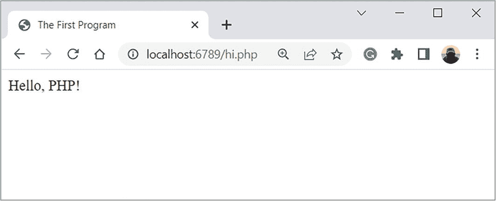

浏览器页面的截图，显示来自路径 `D:\Books\php\codes` 的 `hi.php` 程序的输出。标题是 `The First Program`。输出显示为 `Hello, PHP!`。

图 1-20  
在服务器模式下显示 `hi.php` 文件

> **注意**  
> 所显示文件的路径从启动本地服务器时指定的文件夹开始。在本例中，它是 `D:\Books\php\codes` 文件夹。

你可以使用前面提到的 NetBeans 开发环境来调试嵌入了 PHP 脚本的 HTML 代码。创建新项目的方法与前面讨论的类似。但是，在选择运行时环境（见图 1-6）时，需要在 **Run As** 下拉列表中选择 **PHP Built-in Web Server (running on built-in web server)**，如图 1-21 所示。

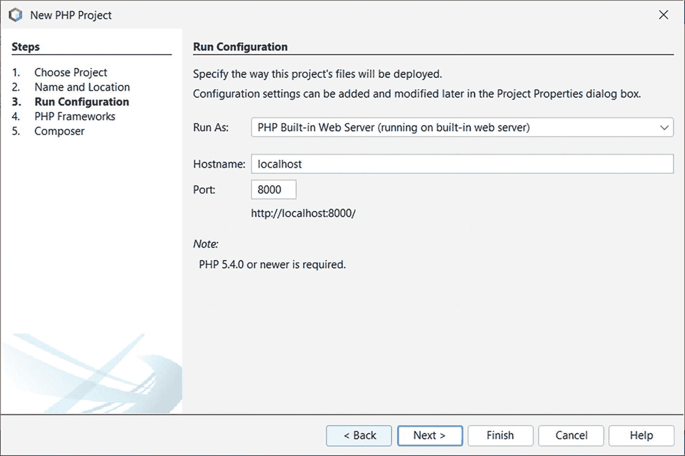

NetBeans 环境中新建 PHP 项目窗口的截图。在五个步骤中，选择了运行配置选项。它包括配置设置为以 PHP 内置 Web 服务器运行，主机名为 `localhost`，端口为 `8000`。提示信息为需要 PHP 5.4.0 或更高版本。选择了“下一步”按钮。

图 1-21  
为 HTML 文档设置运行时环境

**Hostname** 字段包含本地主机的名称，**Port** 字段包含端口号。你可以保留那里的默认值。

结果，你应该创建一个包含 `index.php` 文件的新项目。在该文件中输入 HTML 代码（包含 PHP 脚本），如图 1-22 所示。

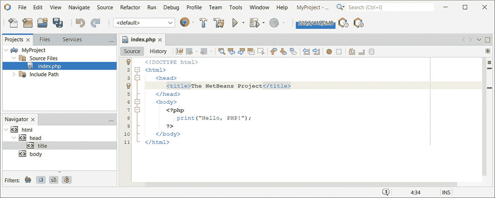

NetBeans 环境窗口的截图，Apache NetBeans IDE 19。顶部有十三个菜单：文件、编辑、视图、导航、源代码、重构、运行、调试、性能、团队、工具、窗口和帮助。左侧面板有 3 个标签，包括项目、文件和服务。`index.php` 程序已打开。标题是 `The NetBeans Project`。

图 1-22  
包含 HTML 代码和 PHP 脚本的项目窗口

> **注意**  
> 除了页面名称外，代码与清单 1-2 中的相同。

当你运行该项目时，会自动打开本地主机上的浏览器。结果如图 1-23 所示。

| 详细信息 |
| --- |
| 你必须考虑以下情况。假设在浏览器的地址栏中输入了某个地址但没有指定文件。在这种情况下，`index.html` 文件，或者像本例中的 `index.php` 文件，会自动在相应目录中打开。运行项目意味着启动一个本地服务器；服务器的根目录被标识为项目文件夹。由于 `index.php` 文件位于那里，它便是被本地服务器打开并处理的文件。 |

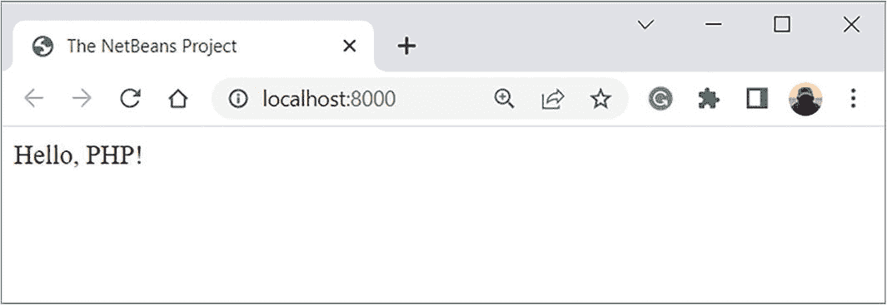

浏览器页面的截图，显示来自本地主机的 `hi.php` 程序的输出。标题是 `The NetBeans Project`。输出显示为 `Hello, PHP!`。

图 1-23  
在本地主机上打开的浏览器


最后，另一种测试 PHP 代码的方法是将相应文件托管在外部服务器上。这是最可靠的测试方式，但它有一个明显的缺点，因为并不是每个人都有这样的条件。不过总的来说，思路很简单：将文件上传到服务器，然后用浏览器打开它。图 1-24 显示了一个浏览器窗口，其中打开了地址为 [`www.vasilev.com.ua/php/hi.php`](http://www.vasilev.com.ua/php/hi.php) 的文档。

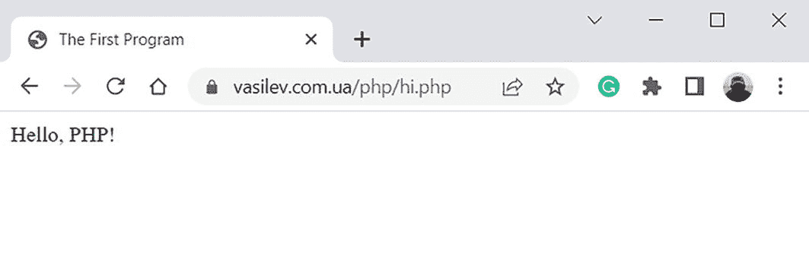

一张浏览器页面的截图，显示了来自地址 `www.vasilev.com.ua/php/hi.php` 的 `hi.php` 程序的输出结果。标题为“第一个程序”。输出内容显示为 `Hello, PHP!`。

图 1-24

在浏览器窗口中打开了页面 [`www.vasilev.com.ua/php/hi.php`](https://www.vasilev.com.ua/php/hi.php)

使用外部服务器的另一个不便之处在于，你需要修改一个不在本地计算机上的文件。

 信息图标。**注意**

在众多提供的选项中，必须选择一种。原则上，使用 PHP 解释器从命令行运行程序代码是一个完全可以接受的选项。它适用于测试除最后一章之外所有章节中的示例。要查看 PHP 脚本的结果，你必须使用本地服务器模式。

## 总结

- 接下来的章节将讨论 PHP 语言的特性。这些章节中涉及的代码功能可以在解释器模式下测试。为此，请将程序保存为扩展名为 `.php` 的文件，然后在命令行中执行相应的指令。

- 开发 PHP 项目的一个好选择是 NetBeans 开发环境。它允许你创建项目，既可以在解释器模式下测试，也可以使用本地服务器进行测试。

- 要测试程序在服务器模式下的执行正确性，可以使用以下模板（将 PHP 代码放在 `<?php` 和 `?>` 指令之间的代码块中）。

  ```
  // 页面标题
  ```

