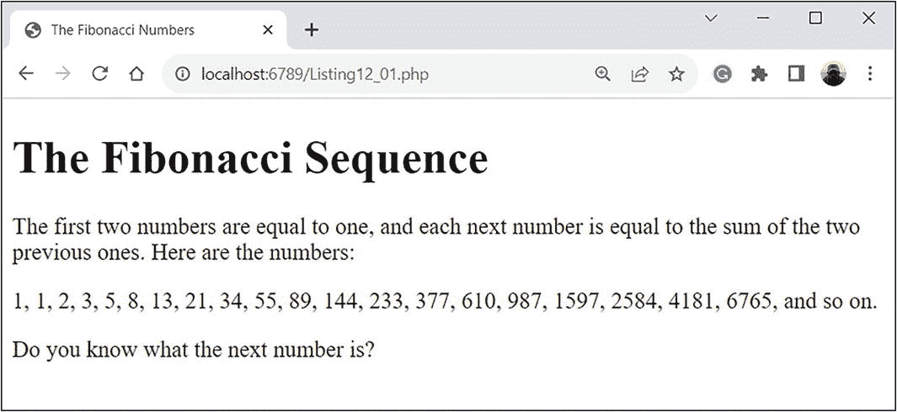
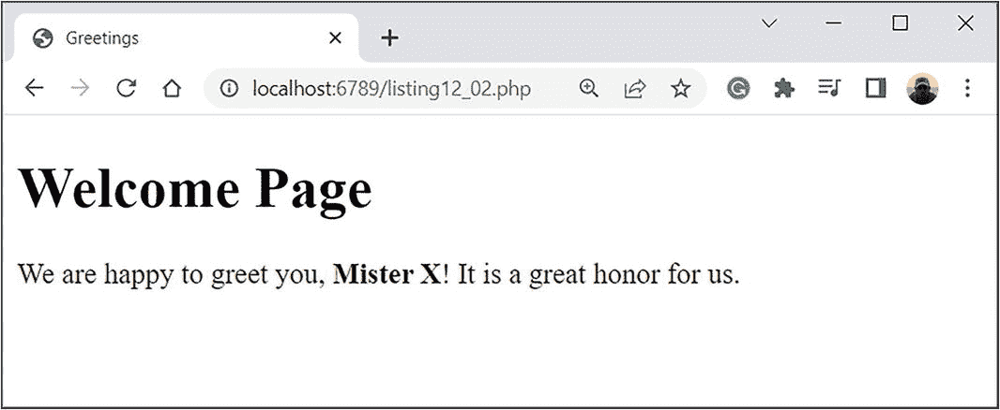
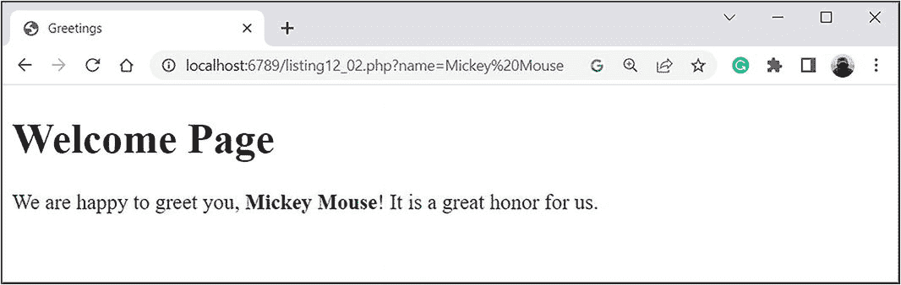
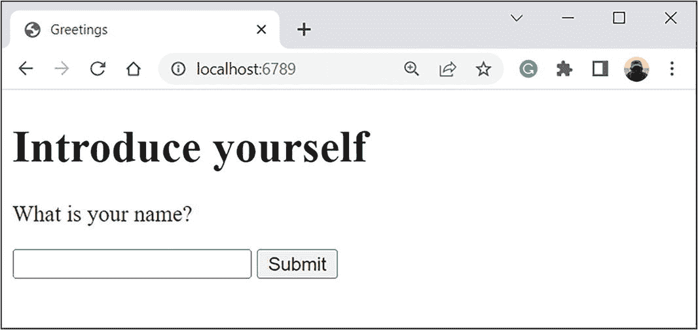
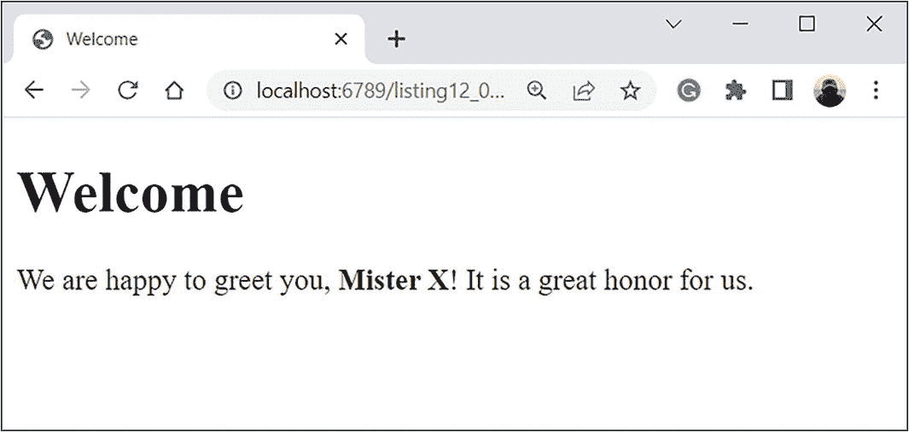
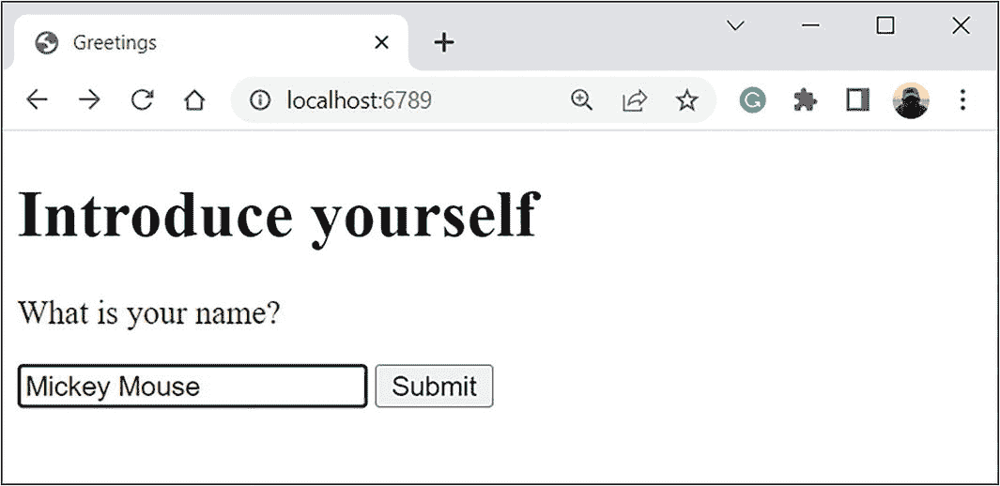
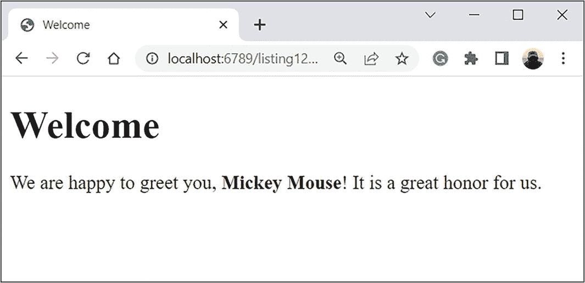

# 10. 错误处理

*我有没有搞砸过什么？嗯，最近呢？*

*—《ALF》电视剧*

即使代码可靠且经过深思熟虑，也不可能总是保证其执行过程中不会发生错误。而原因往往是客观的。例如，用户可能输入了无效的值，或者程序可能找不到它需要运行的文件。在这种情况下，就需要进行错误处理，这也是本章要讨论的内容。


## 异常处理原则

PHP 语言在许多方面都相当民主。这一点同样适用于对错误引发的反应。在大多数编程语言中，错误通常意味着程序终止（除非涉及特殊的错误处理系统），但在 PHP 中，情况并非总是如此严重。即使发生了像错误这样不愉快的事情，也不意味着程序会突然终止。通常，它仅限于一条警告消息，甚至根本没有警告。换句话说，存在着多种不同类型的错误。导致程序终止的错误通常被称为致命错误或*异常*。首先，让我们探讨如何处理这类错误。

异常处理背后的思路非常简单。你必须提供一些在发生异常时要执行的程序代码。在 PHP 中，你可以通过多种不同的方式来实现这个思路。让我们从最简单的情况开始，然后深入探讨这个问题。

> **注意：** 再次强调，在 PHP 的上下文中，错误和异常并不相同。然而，从现在开始，除非会导致误解，否则诸如*异常*和*错误*之类的术语是同义词。

那么，假设有一个代码块，你怀疑它在执行过程中可能会发生错误。你需要做什么？有一个简单的方法。它要求将提到的代码（受控代码）放在一个特殊的块中，该块以 `try` 关键字开头并用花括号括起来。在包含受控代码的 `try` 块之后，放置 `catch` 块，其中包含在发生错误时要执行的代码。以下是整个 `try-catch` 的模板。

```
try{
    // 受控代码
}catch(Error_type $object_name){
    // 处理错误的代码
}
```

`catch` 关键字后面跟着错误类名和括号内用于错误对象的形式标记（与错误对象关联的变量）。

**详情：** 关键在于，当发生错误时，会自动创建一个包含错误信息的对象。这些信息原则上可以用于处理错误。`catch` 块包含错误类的名称（错误类型）和错误对象。你可以使用不同的处理方法来处理不同类型的错误。如果是这样，那么在 `try-catch` 结构中，使用多个 `catch` 块——每个块用于处理特定类型的错误。

> **PHP 8 标准：** 在 PHP 8 中，你可以（如果需要）仅在 `catch` 关键字后的括号内的 `catch` 块描述中指定异常类名，而无需为异常对象指定任何变量。

带有 `try-catch` 结构的代码按如下方式执行。首先，执行受控代码。如果没有错误，则忽略 `catch` 块。如果在执行受控代码时 `try` 块中发生错误，则停止 `try` 块，并执行 `catch` 块。然后，运行 `try-catch` 结构之后的命令。具体情况如清单 10-1 所示。

```
清单 10-1
异常处理原则
```

这个程序很简单。要求用户输入一个表达式来指定 `$x` 变量的值。你丢弃读取字符串中的前导和尾随空格。`$input="\$x=".trim(fgets(STDIN)).";"` 指令构成了一个为 `$x` 变量赋值的命令。相应的字符串被写入 `$input` 变量。当你将 `$input` 变量中的字符串作为参数传递给 `eval()` 函数时，该命令就会被执行。接下来，显示 `$x` 变量的值。所有命令都放在 `try` 块内。关键在于，`eval($input)` 语句可能会因为用户输入的值无效而导致错误。这种错误属于 `ParseError` 类。为了捕获错误，使用 `catch` 块，在其中执行 `echo "There was an error\n"` 命令。

因此，如果在 `try` 块中的代码执行期间没有发生 `ParseError` 类的错误，则忽略 `catch` 块，并显示计算出的 `$x` 变量的值。如果发生错误，则不显示 `$x` 的值，而是执行 `catch` 块中的代码。但无论如何，在 `try-catch` 结构之后都会执行 `echo "The program is over\n"` 命令。

程序的执行结果取决于用户输入的表达式。如果表达式是正确的 PHP 语句，结果如下（用户输入以粗体显示）。

```
程序输出（来自清单 10-1）
变量 $x 的值：3+4*5
$x = 23
程序结束
```

如果用于确定 `$x` 变量值的表达式不正确，结果如下所示。

```
程序输出（来自清单 10-1）
变量 $x 的值：3++4
发生了一个错误
程序结束
```

你可以按照所述方式处理不同类型的错误。

## 异常类

对应于不同类型错误（不同类的异常）的类基于类的继承和接口的实现形成了一个层次结构。为什么这很重要？原因在于，如果 `catch` 块被设计用于处理特定类的错误，那么它也可以处理该类的所有子类的错误。

接下来，让我们讨论与错误处理相关的主要类。但让我们从 `Throwable` 接口开始。它很重要，因为用于错误处理的类直接或间接地实现了该接口。因此，接口中声明的方法对于许多异常类来说是通用的。这些方法在表 10-1 中列出并描述。

**表 10-1** `Throwable` 接口方法

| 方法 | 描述 |
| --- | --- |
| `getMessage()` | 该方法返回与异常关联的消息。 |
| `getCode()` | 该方法返回异常代码。 |
| `getFile()` | 该方法返回一个字符串，其中包含创建异常对象的文件名。 |
| `getLine()` | 该方法的整数结果确定创建异常对象时所执行的行。 |
| `getTrace()` | 返回堆栈跟踪信息（作为数组）。 |
| `getTraceAsString()` | 返回堆栈跟踪信息（作为字符串）。 |
| `getPrevious()` | 返回对前一个异常对象的引用。 |
| `__toString()` | 该方法返回异常对象的字符串表示形式。 |

> **注意：** 在接口中，方法仅被声明。方法的目的根据它们在实现该接口的类中的定义方式给出。

异常类如表 10-2 所示。

**表 10-2** 异常类

| 类 | 描述 |
| --- | --- |
| `ArgumentCountError` | 它继承自 `TypeError` 类。当调用函数或方法时传递的参数少于所需数量时，会抛出此类的异常。 |


### PHP 异常类层次结构

`ArithmeticError` | 它继承自 `Error` 类。当执行数学运算时发生错误会产生此类的异常。

`AssertionError` | 它继承自 `Error` 类。当 `assert()` 语句失败时会抛出此类的异常。

`CompileError` | 它继承自 `Error` 类。由于编译错误可能会抛出此类的异常。

`DivisionByZeroError` | 它继承自 `ArithmeticError` 类。此异常与尝试除以零相关。

`Error` | 它实现了 `Throwable` 接口。它是内置（预定义）异常的父类。

`ErrorException` | 它是一个异常类，是 `Exception` 类的子类。

`Exception` | 它实现了 `Throwable` 接口，是自定义异常类（即用户定义的类）的父类。

`ParseError` | 它继承自 `CompileError` 类。在解释程序时（尝试执行不正确的命令）发生错误可能会抛出此类的异常。

`TypeError` | 它继承自 `Error` 类。如果函数或方法的参数或结果的实际类型与函数/方法描述中指定的类型不匹配，或者传递给函数或方法的参数数量不正确时，可能会抛出此类的异常。

`UnhandledMatchError` | 它继承自 `Error` 类。在执行 `match` 表达式时可能会抛出此异常。

`ValueError` | 它继承自 `Error` 类。如果将错误值的参数传递给函数或方法，则会抛出此类的异常。

除了列出的异常类之外，您还可以创建自己的异常类——通常通过继承 `Exception` 类来实现。自定义类异常用于人为地抛出异常。

### 抛出异常

乍一看可能很奇怪，但异常是可以人为生成的。为什么需要这样做？这里，您需要考虑有一个相对简单方便的机制来捕获和处理不同类的异常。因此，使用异常抛出的方法意味着在不同情况下抛出不同类的异常，然后处理这些异常。

> **注意**
>
> 实际上，这种方案类似于条件语句中使用的方案，只不过使用抛出异常来代替条件。

您使用 `throw` 语句后跟异常对象来抛出异常。异常对象的创建方式与创建任何其他类的对象相同：在 `new` 语句之后，放入类名，以及（如果需要）传递给类构造函数的参数。

> **注意**
>
> 值得一提的是，仅仅创建异常对象并不会导致异常被抛出。

清单 10-2 是一个人为抛出异常的程序。

```
0){
// 抛出异常：
throw new Exception("一个正数");
}
// 如果数字是负数：
if($numbergetMessage();
}
?>
清单 10-2
抛出异常
```

在程序执行期间，系统会提示用户输入一个数字。该数字保存到 `$number` 变量中。以下代码包含在 `try` 块中，并使用两个简化形式的条件语句。第一个条件检查 `$number>0` 条件。如果为真，则 `throw new Exception("一个正数")` 命令会抛出 `Exception` 类的异常。`new Exception("一个正数")` 语句创建了一个 `Exception` 类的匿名对象。传递给类构造函数的字符串描述了抛出的异常。

> **注意**
>
> 匿名对象是其引用不存储在任何变量中的对象。

第二个条件语句测试 `$number<0` 条件。如果条件为真，则 `throw new Exception("一个负数")` 命令会抛出 `Exception` 类的异常。与上一种情况不同，这里为异常使用了另一种描述。`try` 块中的最后一个命令是 `echo "零值"` 语句。

如果在执行代码时抛出了异常，则 `try` 块中的代码会终止，并开始执行 `catch` 块中的代码。该块中有一条单独的 `echo $e->getMessage()` 命令，它会显示与抛出的异常相关联的消息（创建异常对象时传递给构造函数的文本）。`getMessage()` 方法从 `$e` 异常对象中获取消息字符串。

如果在执行 `try` 块中的代码时没有抛出异常，则最终执行 `echo "零值"` 命令，并且 `catch` 块被忽略。

根据用户输入的数字，程序执行时会产生三种可能的结果。如果用户输入一个正数，结果如下所示（用户输入的值以粗体显示）。

```
程序的输出（来自清单 10-2）
输入一个数字: 5
一个正数
```

以下是用户输入负数时的结果。

```
程序的输出（来自清单 10-2）
输入一个数字: -5
一个负数
```

最后，如果用户输入零，程序执行的结果如下。

```
程序的输出（来自清单 10-2）
输入一个数字: 0
零值
```

在这个例子中，您抛出了 `Exception` 类的异常。如前所述，除了内置的异常类之外，您还可以创建自己的异常类。

### 自定义异常

创建自己的异常类的配方很简单：您只需为 `Exception` 类创建一个子类。清单 10-3 中显示了一个示例。

```
error=$error;
}
// 将对象转换为字符串的方法：
function __toString(){
$txt="消息: ".$this->getMessage()."\n";
$txt.=$this->error->__toString();
return $txt;
}
}
// 奇数的类：
class Odd{
// 私有字段：
private $number;
// 构造函数：
function __construct($number){
$this->number=$number;
}
// 将对象转换为字符串的方法：
function __toString(){
return "数字 ".$this->number." 是奇数\n";
}
}
// 偶数的类：
class Even{
// 私有字段：
private $number;
// 构造函数：
function __construct($number){
$this->number=$number;
}
// 将对象转换为字符串的方法：
function __toString(){
return "数字 ".$this->number." 是偶数\n";
}
}
// 循环语句：
for($count=1;$count
清单 10-3
自定义异常
```

程序执行的结果可能如下所示（用户输入的值以粗体显示）。

```
程序的输出（来自清单 10-3）
输入一个数字: 123
消息: 尝试 1
数字 123 是奇数
输入一个数字: 124
消息: 尝试 2
数字 124 是偶数
输入一个数字: 5
消息: 尝试 3
数字 5 是奇数
```


程序通过继承库类`Exception`创建了一个自定义的`MyException`异常类。在该类中，声明了私有字段`$error`。假定该字段被分配了对某个对象的引用。该类有一个包含两个参数的构造函数。第一个参数（记为`$msg`）作为参数传递给父类构造函数（构造函数体中的`parent::__construct($msg)`命令）。第二个参数（记为`$error`）是对某个对象的引用，用于为同名字段赋值（构造函数体中的`$this->error=$error`命令）。  
为了能够将`MyException`类的对象用作字符串，在该类中重写了`__toString()`方法。该方法返回一个字符串，该字符串由文本`"The message: "`、`getMessage()`方法的结果、从`$error`字段引用的对象中调用的`__toString()`方法的结果（`$this->error->__toString()`指令）以及换行指令`"\n"`拼接而成。  
除了`MyException`类，还创建了两个类：`Odd`和`Even`。它们结构相似，但在某些细节上有所不同（即`__toString()`方法返回的结果不同）。每个类都有私有字段`$number`和包含单个参数的构造函数，该参数指定了该字段的值。`__toString()`方法返回一个字符串，其中包含`$number`字段的值以及关于该数字是偶数还是奇数的信息。

描述完类之后，运行循环语句进行三次迭代（使用`$count`变量作为计数器）。对于每次循环，`$msg="attempt ".$count`命令生成包含当前迭代次数的字符串，然后读取一个数字并将其写入`$number`变量。之后，执行`try`块中的受控代码。在条件语句中，检查`$number%2==0`条件，然后抛出`MyException`类的异常。`MyException`类构造函数的第二个参数取决于该条件。它可以是`Even`类的对象（如果数字是偶数）或`Odd`类的对象（如果数字是奇数）。

详细信息：

| 特性 | 说明 |
| --- | --- |
| 抛出异常 | 使用`throw`语句抛出异常。其后跟随`MyException`类的匿名对象。构造函数的第一个参数是写入`$msg`变量的字符串。第二个参数是`Even`或`Odd`类的匿名对象（取决于`$number%2==0`条件）。创建`Even`或`Odd`类的匿名对象时，将存储在`$number`变量中的数字作为参数传递给相应类的构造函数。 |
| 捕获异常 | 异常在`catch`块中处理。要检查的异常类是`MyException`。该块包含单条`echo $e`命令。在这种情况下，会自动从`$e`异常对象调用`__toString()`方法，并且该方法返回的结果会显示在输出窗口中。 |

### 处理不同类的异常

在前面的示例中，抛出异常时，在不同情况下向异常类的构造函数传递了不同的参数。可以更进一步，抛出不同类型的异常，并以不同的方式处理这些异常。实现起来相当简单。在`try`块之后，放置多个`catch`块。每个`catch`块旨在处理特定类的异常。

详细信息：

| 特性 | 说明 |
| --- | --- |
| 异常处理层级 | 如果`catch`块旨在处理某个类的异常，它也会处理其子类的异常。 |

来看一个求解形式为 *Ax* = *B* 的线性方程式的示例。如果参数 *A* 非零，则方程有唯一解 *x* = *B*/*A*。如果参数 *A* 为零，则可能出现两种情况。当参数 *B* 为零时，方程的解为任意数。如果参数 *B* 非零，则方程无解。

检查如列表 10-4 所示的程序。

```
Listing 10-4
Solving the Linear Equation
```

根据用户为参数 *A* 和 *B* 输入的值（以粗体标记），程序执行可能产生以下结果。当为参数 *A* 输入非零值，且参数 *B* 也为非零值时，会发生以下情况。

```
The output of the program (from Listing 10-4)
The equation Ax=B
A = 2.4
B = 12
The root is $x = 5
The problem is solved
```

如果参数 *A* 为非零值且参数 *B* 为零，则程序执行结果如下。

```
The output of the program (from Listing 10-4)
The equation Ax=B
A = 5
B = 0
The root is $x = 0
The problem is solved
```

如果两个参数都为零，结果如下。

```
The output of the program (from Listing 10-4)
The equation Ax=B
A = 0
B = 0
Any number is a root
The problem is solved
```

最后，如果参数 *A* 为零且参数 *B* 非零，结果如下。

```
The output of the program (from Listing 10-4)
The equation Ax=B
A = 0
B = 1
There are no roots
The problem is solved
```

使用了以下策略。程序读取用户为参数输入的值，然后尝试计算方程的解。但在执行代码时，在某些条件下可能会抛出两个自定义类异常之一。这里有一条“主线路”和两个“特殊情况”，通过异常捕获来处理。

`AnyNumberException`和`NoRootsException`异常类继承自`Exception`类，并定义为空体。这意味着这些类复制了`Exception`类，但这些类在形式上是不同的，这对我们来说至关重要。使用这些类来抛出异常。  
读取方程参数的值，并将这些值写入`$A`和`$B`变量。主要计算在`try`块中执行。还使用了简化形式的条件语句。它检查`$A==0`条件。如果条件为真，则执行另一个（内部）条件语句。在那里检查`$B==0`条件。如果为真，则抛出`AnyNumberException`异常。如果条件为假，则抛出`NoRootsException`异常。

> **注意**  
> 因此，如果`$A==0`条件为真，则会抛出`AnyNumberException`或`NoRootsException`异常。在这两种情况下，程序都不会执行外部条件语句之后放置的命令，因为开始处理抛出的异常。

如果条件语句执行期间没有抛出异常，则执行计算方程根的`$x=$B/$A`命令。在这种情况下，计算根并通过`echo "The root is \$x = $x\n"`指令显示。放置在`try`块之后的异常处理块将被忽略。如果抛出异常，则由其中一个`catch`块处理。

程序直接在处理块中执行异常处理，并使用异常类来标识要实现的场景。但也可以采取略有不同的方式，将有关要实现的场景的信息“隐藏”在异常对象中。列表 10-5 中演示了这种方法。

```
getMessage();
}
echo "The problem is solved\n";
?>
Listing 10-5
One More Way to Solve the Equation
```


程序执行的结果与之前的情况相同。然而，执行算法略有变化。主要有两个变化。首先，生成异常时显示的消息与异常对象相关联。此消息可以通过 `getMessage()` 方法检索。其次，你将两个 `catch` 块合并为一个，通过将 `AnyNumberException|NoRootsException` 表达式指定为要处理的异常类（异常类名称由 `|` 运算符分隔）。这样一个块处理 `AnyNumberException` 和 `NoRootsException` 异常。另外，使用两个连续放置的条件语句（以简化形式，带有组合条件）代替了嵌套的条件语句。

详情 |

| --- | --- | --- |

条件 `$A==0&$B==0` 为真，当 `$A==0` 和 `$B==0` 两个条件都为真时。条件 `$A==0&$B!=0` 为真，当 `$A==0` 和 `$B!=0` 两个条件都为真时。|

### 嵌套的 try-catch 构造与 finally 块

`try-catch` 构造可以嵌套。如果在内部 `try-catch` 构造中抛出的异常未被其处理，则该异常会被传递给外部 `try-catch` 构造进行处理。此外，`try-catch` 构造可以包含 `finally` 块，无论是否抛出异常，该块中的命令都会执行。这种情况在代码清单 10-6 中有示例。

```
Listing 10-6
Nested try-catch Constructions
```

在此程序中，提示用户输入颜色名称，根据输入的值，程序显示特定消息。
为了响应不同的情况，使用抛出和处理异常。程序创建了四个自定义异常类：`RedException`、`GreenException`、`BlueException` 和 `OtherException`。每个类都继承 `Exception` 类，并定义为空体。
用户输入的颜色名称被写入 `$color` 变量。
首先，字符串中的字符被转换为小写，这通过 `strtolower()` 函数实现。接下来是包含内部 `try-catch-finally` 构造的外部 `try` 块。在内部 `try` 块中，执行 `switch` 语句，检查 `$color` 变量的值。如果变量值为 `"red"`，则抛出 `RedException` 类的异常。`"green"` 值抛出 `GreenException` 类的异常。如果变量值为 `"blue"`，则抛出 `BlueException` 异常。在所有其他情况下，抛出 `OtherException` 类的异常。
在内部 `try-catch-finally` 构造中，处理 `RedException`、`GreenException` 和 `BlueException` 类的异常。`OtherException` 类的异常在外部 `try-catch` 构造中处理。
让我们讨论代码是如何执行的。首先，读取用户输入的字符串并写入 `$color` 变量，然后在 `switch` 语句中检查变量的值。结果，抛出了四个异常类中的一个。如果是 `RedException`、`GreenException` 或 `BlueException` 类的异常，则在内部 `try-catch-finally` 构造的某个 `catch` 块中处理。然后，执行 `finally` 块，以及 `finally` 块之后的 `echo "You have a good taste\n"` 指令。外部 `catch` 块被忽略，并执行最后一条指令 `echo "The program is over\n"`。
如果抛出了 `OtherException` 类的异常，它不会被内部 `catch` 块捕获，而是传递给外部 `catch` 块进行处理。但在那之前，`finally` 块会被执行。

程序执行的结果取决于用户输入的值（用户输入的值以粗体标记）。颜色名称中的字符大小写无关紧要。具体来说，结果可能如下所示。

```
The output of the program (from Listing 10-6)
Your favorite color: Red
Red is beautiful
Thank you for the answer
You have a good taste
The program is over
```

结果也可能是这样。

```
The output of the program (from Listing 10-6)
Your favorite color: green
Green is wonderful
Thank you for the answer
You have a good taste
The program is over
```

也可能如下所示。

```
The output of the program (from Listing 10-6)
Your favorite color: BLUE
Blue is stylish
Thank you for the answer
You have a good taste
The program is over
```

或者可能如下所示。

```
The output of the program (from Listing 10-6)
Your favorite color: yellow
Thank you for the answer
I don't know this color
The program is over
```

再次强调，有两件事值得一提。第一，如果内部 `try-catch` 构造没有处理异常，该异常会被传递给外部 `try-catch` 构造进行处理。第二，`finally` 块中的代码总是会执行，无论是抛出异常还是没有抛出异常的情况下。

### 重新抛出异常

异常可以在被抛出后再次抛出。在这种情况下，同一个异常对象会被多次使用。让我们再次考虑一个求解线性方程的问题，作为使用这种方法的示例。程序如代码清单 10-7 所示。

```
Listing 10-7
Rethrowing Exceptions
```

程序执行的结果与代码清单 10-4 相同。但代码值得分析。

你使用了异常类 `MyException`。读取 `$A` 和 `$B` 变量的值后，执行受控代码块。它包含内部 `try` 块，如果条件 `$A==0` 为真，则抛出 `MyException` 类的异常。如果条件为假，则执行 `$x=$B/$A` 和 `echo "The root is \$x = $x\n"` 语句。第一条语句计算方程的根。第二条语句显示计算结果。如果抛出异常，这些语句不会执行。如果抛出异常，则在内部 `catch` 块中处理。处理基于检查条件 `$B==0`。如果条件为假，则执行 `echo "There are no roots\n"` 指令。如果条件为真，则 `throw $e` 命令重新抛出之前抛出的异常。这里，`$e` 表示传递给内部 `catch` 块进行处理的异常对象。这次异常被外部 catch 块捕获并处理。特别地，外部 catch 块中执行 `echo "Any number is a root\n"` 命令。最后执行的命令是 `echo "The problem is solved\n"`。

详情 |

| --- | --- | --- |

事实证明，如果方程的一个参数为零，则会抛出自定义类异常。如果在处理此异常时，发现第二个参数也为零，则会重新抛出异常。重新抛出异常意味着你正在使用之前抛出的异常对象。|

## 错误处理函数

在程序执行过程中发生的错误通常不是致命的，不会导致程序终止。这种情况下的典型外部效果是错误或警告消息。不同的技术和方案允许你适当地响应此类情况。但即使错误是致命的，并且未在程序中被捕获（使用 `try-catch` 构造），你仍然可以“对抗”它。

详情 |

| --- | --- | --- |


基本设置（包括如何响应脚本错误）包含在 `php.ini` 初始化文件中，该文件在 PHP 服务器启动时被读取。要管理错误监控模式，你可以使用 `error_reporting()` 函数。其参数是一个常量，用于定义要显示的错误消息。例如，`E_ERROR` 常量对应监控导致程序执行终止的致命错误的模式。`E_WARNING` 常量表示监控非关键警告的模式。`E_ALL` 常量则指定了监控几乎所有错误的模式（即最大控制模式）。

在实践中，你可以使用 `set_exception_handler()` 函数来处理异常。该函数接受一个函数名作为参数，当代码执行过程中发生未捕获的异常时，该函数会被调用。代码在执行完传递给 `set_exception_handler()` 的函数后会停止运行。清单 10-8 中展示了一个简单示例。

```
清单 10-8
用于处理异常的函数
```

以下为程序输出。

```
程序输出（来自清单 10-8）
即将发生错误...
出现了一个错误！
```

在本例中，你定义了 `handler()` 函数，并将该函数的名称（作为字符串）作为参数传递给 `set_exception_handler()` 函数。因此，当使用 `throw new Exception()` 语句抛出异常时，`handler()` 函数会被自动调用，从而终止程序的执行。

一个圆形图标，中心有一个字母 i。注意：还有其他一些函数在处理错误和异常时很有用。例如，你可以使用 `set_error_handler()` 函数来定义错误处理器。你可以使用 `trigger_error()` 函数来抛出错误。此列表并不完整。另一个有趣的功能与错误消息禁用 `@` 运算符有关。该运算符放置在某些表达式之前，如果表达式执行过程中发生错误，则不会显示相应的消息。

 一个钟形图标。**PHP 8 标准** 自 PHP 8 起，`@` 运算符不再隐藏致命错误。

## 总结

*   你可以使用 `try-catch-finally` 结构来处理异常。受控代码放在 `try` 块中。如果执行该代码时抛出异常，则可以在 `catch` 块中处理它。可选的 `finally` 块中的命令始终会被执行。
*   为了处理不同的异常，可以使用多个 `catch` 块。对于每个块，你需要指定要处理的异常类。
*   异常可以被人为地抛出。为此，请使用 `throw` 指令，后跟异常对象。
*   你可以创建自定义异常类。这些类继承自 `Exception` 类。内置的异常类实现了 `Throwable` 接口。
*   `try-catch-finally` 结构可以嵌套，并且异常可以被重新抛出。在这种情况下，抛出的异常对象会被多次使用。
*   特殊的函数和工具允许你设置错误控制模式。其中包括错误消息禁用 `@` 运算符、`error_reporting()` 函数（定义错误控制模式）、`set_exception_handler()` 和 `set_error_handler()` 函数（定义错误处理器），以及 `trigger_error()` 函数（抛出错误）。

## 11. 生成器和迭代器

*哦，我明白。在这个星球上，没有人会说出他们真正的意思。* ——*《家有阿福》*（电视剧）

在本章中，你将熟悉生成器和迭代器。迭代器是一种特殊对象，允许你遍历集合。生成器是一种特定的迭代器。因此，无论哪种情况，你都是在处理集合的遍历。让我们从更简单的问题开始：生成器。


## 熟悉生成器

*生成器函数* 是一种会返回特殊对象作为结果的函数。该对象在属性上类似于数组，但它并非真正的数组。更准确地说，它是一种创建数组假象的绝妙方式。特别是，调用生成器函数的结果可以用于 `foreach` 循环语句中，以便对集合进行迭代。

| 详情 |
| --- |
| 从形式上看，生成器函数返回一个 `Generator` 类的对象。该类实现了 `Iterator` 接口。`Generator` 类的对象不能使用 `new` 语句创建。 |

让我们通过一些简单的例子来考虑创建和使用生成器函数的细节。首先需要知道的是，生成器函数返回的对象可以用来获取一个值序列。特别地，要获取当前值，可以使用 `current()` 方法；要切换到下一个值，则调用 `next()` 方法。

严格来说，“生成器”更适合指代由生成器函数返回的对象。然而，为了方便起见，这个术语也常被用于指代相应的函数。

生成器函数的描述有其自身的特点。因此，要将一个值包含到调用 `current()` 方法时返回的值列表中，需要在函数代码中使用 `yield` 语句，后跟相应的值。示例如清单 11-1 所示。

```
current(),"\n";
// 切换到下一个值：
$color->next();
}
?>
清单 11-1
熟悉生成器
```

程序的执行结果如下。

```
程序输出（来自清单 11-1）
[1] Red
[2] Yellow
[3] Green
```

在这个例子中，我们定义了一个 `colors()` 生成器函数，其中使用了 `yield "Red"`、`yield "Yellow"` 和 `yield "Green"` 命令。这意味着最终得到的生成器对象（即调用 `colors()` 函数时获得的对象）会生成值 `"Red"`、`"Yellow"` 和 `"Green"`。

程序中执行了 `$color=colors()` 命令，该命令将调用 `colors()` 函数的结果写入 `$color` 变量。因此，`$color` 变量指向一个 `Generator` 类的对象。该对象除了其他功能外，还拥有 `current()` 和 `next()` 方法。如果从 `$color` 对象调用 `current()` 方法，会得到值 `"Red"`。之后，如果调用 `next()` 方法，然后再调用 `current()` 方法，会得到值 `"Yellow"`。最后，再次调用 `next()` 和 `current()` 方法会得到值 `"Green"`。所有这些都通过 `for` 循环语句进行了演示，该循环从 `$color` 对象中三次调用了 `current()` 和 `next()` 方法。

| 详情 |
| --- |
| 如果在调用了三次 `next()` 方法之后（即，在迭代完“写入”`$color` 对象的所有值之后）再调用 `current()` 方法，将得到一个空引用。 |

如果每次生成一个新值都必须调用两个方法，那么生成器函数的作用就不大了。清单 11-2 展示了一种使用生成器函数的更好方法。

```
清单 11-2
生成器函数与循环语句
```

程序的结果与前一个案例几乎相同。

```
程序输出（来自清单 11-2）
Red
Yellow
Green
```

`colors()` 生成器函数的代码略有改动。生成的值列表现在通过数组实现，并且在函数体中的 `foreach` 循环语句里调用了 `yield` 语句。此外，我们没有将函数调用的指令写入一个单独的变量，而是直接在 `foreach` 循环语句中将其指定为要迭代的集合。结果是，指定一个包含程序执行时显示值的数组，来代替调用 `color()` 函数。

## 带参数的生成器函数

乍一看，生成器函数的概念可能像是数组方法的不必要复杂化，但事实远非如此。生成器函数允许我们编写优雅且高效的代码。例如，清单 11-3 使用了一个带参数的生成器函数来生成数字序列。

```
清单 11-3
带参数的生成器函数
```

程序的输出如下。

```
程序输出（来自清单 11-3）
[1] 1 3 5 7 9
[2] 3 4 5 6 7 8 9
[3] 10 9 8 7 6 5
```

`numbers()` 函数被描述为带有三个参数（最后一个有默认值）。该函数旨在创建一个生成数字序列的对象。第一个参数 `$count` 指定序列中应包含多少个数字。第二个参数 `$start` 指定序列中的第一个值。第三个参数 `$step`（默认值为 `1`）指定计算序列时的增量。函数的核心是一个循环语句，循环次数由 `$count` 参数决定。用于 `yield $num` 命令中的 `$num` 变量，其初始值由 `$start` 参数定义。每次循环，该变量的值都会增加由 `$step` 参数确定的量。

我们在用于显示数字序列的 `foreach` 循环语句中调用 `numbers()` 函数。因此，`numbers(5,1,2)` 指令表示生成一个包含 `5` 个数字的序列，初始值是 `1`，每个后续数字比前一个多 `2`。`numbers(7,3)` 指令用于创建一个包含 `7` 个数字的序列，从 `3` 开始，每个数字比前一个多 `1`。最后，使用 `numbers(6,10,-1)` 指令，得到包含 `6` 个数字的序列；第一个数字是 `10`，每个后续数字比前一个少 `1`（数字按倒序排列）。

## 基于生成器的数组

如前所述，生成器提供了使用数组的假象。但有时，你可能需要解决一个更简单的任务：基于生成器创建一个数组。原则上，可以使用内置函数 `iterator_to_array()` 来实现。生成器作为参数传递给该函数，函数返回通过迭代生成器“内容”而创建的数组。假设你有一个如下的函数：

```
function nums($n){
for($k=1;$k<=$n;$k++){
yield $k;
}
}
```

那么，以下命令将创建一个包含从 1 到 5 的数字的数组（包含两端），并且对该数组的引用被写入 `$A` 变量。

```
$A=iterator_to_array(nums(5));
```

清单 11-4 创建了一个函数，该函数复制了内置函数 `iterator_to_array()` 的工作。

```
清单 11-4
基于生成器的数组
```

程序的输出如下。

```
程序输出（来自清单 11-4）
Array
(
[0] => 1
[1] => 2
[2] => 3
[3] => 4
[4] => 5
)
```


```markdown
`generator_to_array()`函数旨在基于生成器创建数组。该函数使用一个`Generator`类型的参数进行描述，这意味着只有通过调用生成器函数创建的对象才能作为参数传递给该函数。`$array=[]`命令在函数体中创建一个空数组，然后`foreach`循环语句遍历由传递给函数的`$gen`生成器产生的值。通过`$array[]=$a`命令，下一个接收到的`$a`值被添加到`$array`数组的末尾，该数组最终作为函数的结果返回。

程序还描述了`nums()`函数，它创建自然数序列的生成器。该函数的参数决定序列中数字的数量。因此，当执行`$A=generator_to_array(nums(5))`命令时，会创建一个包含`5`个元素（从`1`到`5`的自然数，包含两端）的数组，并将该数组的引用写入`$A`变量。

## 生成器结果

在生成器函数中，除了使用`yield`指令外，还可以使用`return`语句。尽管如此，其结果与预期一致。

首先，如果在生成器函数代码中执行了`return`语句，则会终止生成器函数的执行，但同时函数的结果是一个`Generator`类的对象（即生成器对象）。如果在`return`语句后指定了一个值，那么可以通过生成器对象使用`getReturn()`方法获取该值。例如，假设在`return`语句后指定了一个数字。在这种情况下，`Generator`类的对象作为生成器函数的结果返回。当从该对象调用`getReturn()`方法时，会得到`return`语句后指定的数字。这种情况在清单 11-5 中进行了说明。

```
getReturn(),"\n";
?>
Listing 11-5
The Generator Result
```

程序执行的一个可能结果如下所示。

```
The output of the program (from Listing 11-5)
4 9 4 1 5
The sum: 23
```

此程序描述了`randoms()`生成器函数，它有一个参数指定生成器对象必须生成多少个随机数。在函数体中，`$sum`变量被初始化为零值，然后运行循环语句。迭代次数由`$n`函数参数决定。`$number=rand(1,9)`命令生成一个范围从`1`到`9`（包含两端）的随机整数，并将该数字写入`$number`变量。

详情 |

内置的`rand()`函数生成随机数。调用此函数时需要两个整数参数，用来定义生成随机数的范围边界。 |

然后，使用`yield $number`命令将生成的值包含在生成的值列表中。接着，通过`$sum+=$number`命令，将`$number`变量的值添加到`$sum`变量的当前值。

函数体中的最后一个命令是`return $sum`语句。这意味着当从生成器对象调用`getReturn()`方法时，会得到`$sum`变量的值，该值是所生成随机数的总和。

详情 |

| --- | --- | --- |

尽管`return`语句形式上返回一个整数，但`randoms()`生成器函数返回一个生成器对象。只有在该对象“被处理完毕”之后——即在该对象被`foreach`循环语句“遍历”之后——才能从生成器对象调用`getReturn()`方法。 |

`$rnd=randoms(5)`命令创建一个生成器对象（用于生成五个数字），并将该对象的引用写入`$rnd`变量。在`foreach`循环语句中使用该对象。最后，利用`$rnd->getReturn()`指令确定生成数字的总和。

## 使用生成器

让我们特别关注与使用生成器相关的几个问题。即，分析几个简单示例，从清单 11-6 开始。

```
Listing 11-6
Reusing a Generator Object
```

程序的输出如下所示。

```
The output of the program (from Listing 11-6)
The first use of the generator object:
100 200 300
The second use of the generator object:
Something is wrong
```

这里一切都很简单。你需要`nums()`生成器函数来生成`100`、`200`和`300`。使用`$nums=nums()`命令创建一个生成器对象，并将其引用写入`$nums`变量。其余代码包含在`try`块中。其中，`foreach`语句两次执行相同的命令块。每次都会使用`$nums`生成器对象。`catch`块旨在通过执行`echo "Something is wrong\n"`命令来处理可能的异常。

程序的输出是什么？第一次你得到数字`100`、`200`和`300`。但随后会得到一个异常。发生这种情况是因为生成器对象是“一次性使用”的对象。它只能被“迭代”一次。之后，必须创建一个新的生成器对象来生成相同的值序列。如果尝试迭代一个已经被迭代过的对象，就会出错。因此，在实践中，通常不将生成器对象的引用写入变量，而是直接使用生成器函数调用指令。上一个示例的一个小变体如清单 11-7 所示。

```
Listing 11-7
Calling a Generator Function
```

程序的输出如下所示。

```
The output of the program (from Listing 11-7)
The first use of the generator object:
100 200 300
The second use of the generator object:
100 200 300
```

程序执行的结果发生了变化。数字`100`、`200`和`300`在两次都显示出来，并且没有抛出异常。程序代码的更改极少。不再使用变量来存储生成器对象的引用，在`foreach`语句中，原本`$nums`变量的位置，现在放置了调用`nums()`函数的指令。这改变了什么？每次调用`nums()`函数时，都会创建一个新的生成器对象，因此在这种情况下，不会重用生成器对象。

生成器对象的另一个意外特性在清单 11-8 中进行了说明。

```
current(),"\n";
?>
Listing 11-8
Peculiarities of Using a Generator Function
```

以下是程序执行的结果。

```
The output of the program (from Listing 11-8)
A generator object is created
A generator function is executed

```


您使用非常简单的生成器函数`gen()`，该函数依次执行`echo "A generator function is executed\n"`命令和`yield 123`语句。这意味着首先显示该消息，然后将数字`123`添加到待生成值的列表中。遍历生成器对象会返回该单一值。

`$gen=gen()`命令创建一个生成器对象，然后执行`echo "A generator object is created\n"`和`echo $gen->current(),"\n"`语句。您可能期望首先看到`A generator function is executed`消息，随后是`A generator object is created`消息。之后，您可能期望显示值`123`。然而，前两条消息的出现顺序不同。原因是执行`$gen=gen()`语句并不会导致执行`gen()`中描述的代码。实际的函数代码仅在从`$gen`对象调用`current()`方法时才开始执行。

`Generator`类的对象具有`rewind()`方法，该方法允许您执行第一个`yield`指令之前的生成器函数代码部分。使用`rewind()`方法修改后的先前程序如清单 11-9 所示。

```
rewind();
echo "A generator object is created\n";
echo $gen->current(),"\n";
?>
Listing 11-9
Generator Object Methods
```

程序的输出如下：

```
The output of the program (from Listing 11-9)
A generator function is executed
A generator object is created

```

在这种情况下，生成器对象一创建就执行`$gen->rewind()`命令。结果，首先显示消息`A generator function is executed`。然后，消息`A generator object is created`也被显示。

## 向生成器传递值

`yield`指令可用于形成生成值的列表，并将值传递给生成器。`yield`关键字等同于使用`send()`方法传递给生成器对象的值。

| 详情 |
|------|
| 您可以从生成器对象调用`send()`方法并向该方法传递一些参数。在相应的生成器函数体中，可以使用`yield`关键字访问该值（`send()`方法的参数）。 |

向生成器对象传递值的示例如清单 11-10 所示。

```
send($num);
}
// The sum:
echo "The sum: ",$nums->getReturn(),"\n";
?>
Listing 11-10
Passing Values to a Generator
```

程序的结果如下（用户输入的数字以粗体标记）：

```
The output of the program (from Listing 11-10)
[1] The number: 2
[2] The number: 3
[3] The number: 5
[4] The number: 1
[5] The number: 4
The sum: 15
```

`nums()`生成器函数有一个单一参数，描述如下。您在函数中定义初始值为零的`$sum`变量。然后进入循环语句。迭代次数由生成器函数参数`$n`决定。每次迭代执行`$number=yield`命令。这意味着生成器接收到的值被写入`$number`变量。然后`$sum+=$number`命令将该值加到`$sum`变量的当前值上。循环语句终止后，`return $sum`命令将`$sum`变量的值作为`getReturn()`方法的结果返回。

生成器对象通过`$nums=nums($n)`命令创建。然后运行循环语句。在每次循环中，读取用户输入的数字并写入`$num`变量。接着，将该值发送给生成器对象，使用`$nums->send($num)`命令完成。读取所有值后，使用`$nums->getReturn()`指令获取用户输入数字总和的结果。

## 迭代器

前面讨论的生成器是*迭代器*的特例。从形式上讲，迭代器是实现了`Iterator`接口的类的对象。在实现`Iterator`接口的类中必须描述的方法列于表 11-1 中。

**表 11-1** `Iterator`接口方法

| 方法 | 描述 |
|------|------|
| `current()` | 该方法返回迭代器的当前值。 |
| `key()` | 该方法返回当前值的键/索引。 |
| `next()` | 该方法移动到迭代器的下一个值。 |
| `rewind()` | 该方法将迭代器设置为生成第一个值的状态。 |
| `valid()` | 该方法用于检查迭代器是否处于有效状态。 |

> **注意**：生成器对象具有相同的方法并不奇怪，因为`Generator`类实现了`Iterator`接口。

要创建迭代器，只需创建一个实现`Iterator`接口的类，然后基于该类创建对象。清单 11-11 描述了自定义迭代器类。

```
max=$max;
$this->rewind();
}
// The methods from Iterator:
public function rewind(){
$this->key=1;
$this->previous=1;
$this->last=1;
}
public function current(){
return $this->previous;
}
public function key(){
return $this->key;
}
public function next(){
++$this->key;
$this->last+=$this->previous;
$this->previous=$this->last-$this->previous;
}
public function valid(){
if($this->keymax) return true;
else return false;
}
// The additional methods:
public function resize($max){
$this->max=$max;
}
}
// Creates an iterator object:
$fibs=new Fibonacci(10);
// Using the iterator:
foreach($fibs as $f){
echo $f," ";
}
echo "\n";
// Changes the number of values:
$fibs->resize(15);
// Using the iterator:
foreach($fibs as $f){
echo $f," ";
}
?>
Listing 11-11
An Iterator
```

程序执行的结果如下：

```
The output of the program (from Listing 11-11)
1 1 2 3 5 8 13 21 34 55
1 1 2 3 5 8 13 21 34 55 89 144 233 377 610
```

## PHP 8 标准

高于 PHP 8 的版本会显示一组警告，因为实现`Iterator`接口的类方法应该带有返回类型声明（在方法参数的大括号之后，用冒号指定）。也就是说，您应该使用如下对`Fibonacci`类的描述（注释已省略，新增的代码块以粗体标记）。

```
class Fibonacci implements Iterator{
private $last;
private $previous;
private $key;
private $max;
function __construct($max){
$this->max=$max;
$this->rewind();
}
public function rewind(): void{
$this->key=1;
$this->previous=1;
$this->last=1;
}
public function current(): mixed{
return $this->previous;
}
public function key(): mixed{
return $this->key;
}
public function next(): void{
++$this->key;
$this->last+=$this->previous;
$this->previous=$this->last-$this->previous;
}
public function valid(): bool{
if($this->keymax) return true;
else return false;
}
public function resize($max){
$this->max=$max;
}
}
```


```markdown
另一种解决方案是在每个方法（来自`Iterator`接口）前添加`#[\ReturnTypeWillChange]`属性。

让我们创建实现`Iterator`接口的`Fibonacci`类。该类的对象设计用于生成斐波那契数列（前两个数字等于 1，之后的每个数字等于前两个数字之和）。该类包含私有字段`$last`和`$previous`，用于存储序列中最后一个和倒数第二个数字。私有字段`$key`用于存储已生成数字的键。`$max`字段包含决定序列生成多少个数字的值。

构造函数有一个指定`$max`字段值的参数。在构造函数体中调用`rewind()`方法。调用该方法时，`$key`、`$previous`和`$last`字段被赋值。

调用`current()`方法时，会返回`$previous`字段的值。`key()`方法返回`$key`字段的值。

调用`next()`方法时，由于`++$this->key`语句，`$key`字段的值增加 1。接着，通过`$this->last+=$this->previous`和`$this->previous=$this->last-$this->previous`命令计算序列中的下一个数字，并分别更新`$previous`和`$last`字段的值。

`valid()`方法用于（自动）检查迭代器是否准备好生成值。在方法体中检查`$this->key<=$this->max`条件。如果当前数字的键未超过为序列设置的最大值，则为真。如果是，则方法返回`true`，否则返回`false`。

详情 |

| --- | --- | --- |

你需要`valid()`方法来确定循环语句中元素的迭代何时结束。

除了`Iterator`接口中的“必需”方法，你还描述了一个“附加”的`resize()`方法，用于更改已创建的迭代器对象中`$max`字段的值。

使用`$fibs=new Fibonacci(10)`命令创建迭代器对象。该对象设计用于生成斐波那契数列中的十个数字。当你将`$fibs`迭代器对象传递给`foreach`语句时，就会发生这种情况。

创建的迭代器对象可以多次使用。为此，只需使用`rewind()`方法将其恢复到初始状态。此外，你可以更改迭代器生成值的数量。因此，在执行`$fibs->resize(15)`命令后，迭代器对象从序列中生成 15 个数字，程序的输出确认了这一点。

总结

*   迭代器是实现了`Iterator`接口的类的对象。迭代器用于模拟序列，特别是用于`foreach`循环语句。

*   如果你创建一个类并在该类中实现`Iterator`接口的方法，那么类对象可以在`foreach`循环语句中用作集合迭代器。

*   你可以创建返回生成器对象作为结果的函数。生成器是实现了`Iterator`接口的`Generator`类的对象。要向生成列表添加值，请使用`yield`语句后跟相应的值。

*   `current()`方法用于获取迭代器的当前值。要切换到下一个要生成的值，请使用`next()`方法。`rewind()`方法将迭代器置于生成第一个值的状态。你可以使用`key()`方法获取生成元素的键。你可以使用`valid()`方法检查迭代器是否准备就绪。

12. 使用 PHP

*为什么你必须不必要地复杂化一切？*

*—* ALF（电视剧）

与大多数其他流行语言不同，PHP 并不“独立”使用。它“在上下文中”使用。PHP 是为创建 Web 程序或脚本而开发的。因此，PHP 是为 Web 编程而设计的。接下来，让我们看一些简单的任务和情况，解释 PHP 代码如何在 Web 开发中使用。

HTML 文档中的脚本
也许最简单的情况是当 PHP 代码包含在带有 HTML 标记的文档中时。当你需要自动生成 HTML 文档的内容时，这种方法很有用。

HTML 基础知识

HTML（*超文本标记语言*的缩写）用于创建 Web 页面。也就是说，实际上，它是带有独特标记或描述符的纯文本，也称为*标签*。这些标签用于显示相应文档的浏览器。也就是说，标签是浏览器显示文档中实际文本的指令。

让我们探索如何创建（使用 PHP 工具）一个包含斐波那契数列列表的文档（前两个数字等于 1，每个后续数字等于前两个数字之和）。在这种情况下，不要显式地在文档中写入数字，而是使用 PHP 代码生成相应的内容。

详情 |

| --- | --- | --- |

带有 HTML 标记的文档通常具有`.html`扩展名。对于浏览器来说，这表明文档包含超文本标记。如果你想将 PHP 代码放入带有 HTML 标记的文档中，相应的文件应保存为`.php`扩展名。

让我们分析清单 12-1 中显示的文档。

```html
<!DOCTYPE html>
<html>
<head>
<title>斐波那契数字</title>
</head>
<body>
<h1>斐波那契数字</h1>
<h2>斐波那契序列</h2>
<p>前两个数字等于 1，每个后续数字等于前两个数字之和。以下是数字：</p>
<?php
class Fibonacci implements Iterator {
    private $last = 1;
    private $previous = 0;
    private $key = 0;
    private $max;

    public function __construct($max) {
        $this->max = $max;
        $this->rewind();
    }

    public function rewind(): void {
        $this->key = 0;
        $this->previous = 0;
        $this->last = 1;
    }

    #[\ReturnTypeWillChange]
    public function current() {
        return $this->previous;
    }

    #[\ReturnTypeWillChange]
    public function key() {
        return $this->key;
    }

    public function next(): void {
        ++$this->key;
        $this->last += $this->previous;
        $this->previous = $this->last - $this->previous;
    }

    public function valid(): bool {
        return $this->key <= $this->max;
    }

    public function resize($max): void {
        $this->max = $max;
    }
}

$fibs = new Fibonacci(20);
foreach ($fibs as $num) {
    echo $num . ', ';
}
echo '等等。';
?>
<p>你知道下一个数字是什么吗？</p>
</body>
</html>
```

**清单 12-1**
*斐波那契数字*

在这里，你处理一个包含 HTML 标记的文档；在该文档中，有一个 PHP 代码块。

详情 |

| --- | --- | --- |

考虑当你尝试打开带 HTML 代码的文档时会发生什么非常重要。你将研究最常见和频繁使用的方案，并以其非常简化的形式进行考虑。
那么，假设有两台计算机：客户端和服务器。它们相互连接。客户端计算机上启动浏览器，并使用该浏览器尝试打开托管在服务器计算机上的文档。当客户端收到文档时，它会根据 HTML 标记进行渲染。
如果你通过客户端浏览器请求服务器上的 PHP 文档，那么该文档将在服务器上作为脚本执行，并将结果返回给浏览器。如果文档同时包含 HTML 标记和 PHP 代码，则现有的 HTML 标记保持“原样”，而 PHP 代码的位置会被其执行结果替换。最终结果是一个旨在由浏览器显示的 HTML 标记文档。你可以说你在处理动态文档，因为其内容可以在处理文档时通过直接执行 PHP 脚本而改变。这就是前面文档的组织方式。它包含“静态”HTML 代码和一个 PHP 代码块，该代码块在执行期间“转换”为超文本标记块。

实际上，在执行 PHP 代码后，浏览器会收到这样一个文档。

```html
<!DOCTYPE html>
<html>
<head>
<title>斐波那契数字</title>
</head>
<body>
<h1>斐波那契数字</h1>
<h2>斐波那契序列</h2>
<p>前两个数字等于 1，每个后续数字等于前两个数字之和。以下是数字：</p>
1, 1, 2, 3, 5, 8, 13, 21, 34, 55, 89, 144, 233, 377, 610, 987, 1597, 2584, 4181, 6765, 等等。
<p>你知道下一个数字是什么吗？</p>
</body>
</html>
```

此代码与清单 12-1 不同，因为在 PHP 块的位置插入了以下 HTML 代码。

```
1, 1, 2, 3, 5, 8, 13, 21, 34, 55, 89, 144, 233, 377, 610, 987, 1597, 2584, 4181, 6765, 等等。
```


这是一个包含 PHP 代码描述的 HTML 文档文本。以下是排版后的 Markdown 格式内容：

这段话虽然通常包含超文本标记的描述符，但它是执行这段代码后得到的结果。

```
任何使用 `echo` 语句显示的内容都会包含在文档中。代码本身很简单。它计算了前 `20` 个斐波那契数（`$n` 变量定义了要计算的数字个数）。具体来说，序列中的最后一个和倒数第二个数字（两个 1）被存储在 `$a` 和 `$b` 变量中。每个循环都会计算一个新的数字。结果会显示在文档中。

一个圆形图标，中心是一个字母 i。

注意

你可以想象成程序直接打印到文档中。

在浏览器窗口中查看文档，会显示如图 12-1 所示的结果。



一张斐波那契数列网页的截图。页面标题是一篇名为“斐波那契数列”的文章。它列出了斐波那契数。

图 12-1  
在浏览器窗口中显示包含 PHP 代码的文档
```

也就是说，一切基本上都比较简单。剩下的唯一问题就是弄清楚如何获得这里展示的结果。

## HTML 基础

要创建带有 HTML 标记的文档，你至少需要对 HTML 有基本的了解。不过，本书并不打算涵盖创建 HTML 文档的所有原则，因为这并非本书的主要目的。另一方面，如果不懂 HTML，就很难理解如何有效使用 PHP 脚本。因此，为了那些不熟悉 HTML 基础的读者，书中提供了一些注释来解释代码中使用的超文本标记。

HTML 文档中的所有描述符都放在尖括号 `<` 和 `>` 中。在尖括号之间，你放入描述符的名称。大多数描述符都是成对出现的：有起始描述符，也有结束描述符。结束描述符在描述符名称前包含一个正斜杠 `/`。起始和结束描述符之间的所有内容就是该描述符的内容。例如，整个 HTML 文档被包含在由 `<html>` 和 `</html>` 标签界定的块中。开头的指令 `<!DOCTYPE html>` 是文档类型声明。

`<html>` 块包含 `<head>` 块和 `<body>` 块。`<head>` 块又包含 `<title>` 块，其内容（放在 `<title>` 和 `</title>` 标签之间的文本）会显示在浏览器窗口的标签页中。`<h1>` 和 `</h1>` 标签定义了第一级标题。段落使用 `<p>` 和 `</p>` 标签定义。你还可以在起始描述符中使用 `attribute="value"` 格式的属性。例如，`<html>` 标签通常包含一个指定文档语言的属性。在这种情况下，起始标签看起来像 `<html lang="en">`。

让我们考虑一下这个问题的技术层面。处理文档时，你假设客户端计算机上的浏览器发起请求，而 PHP 代码在服务器计算机上执行。此外，即使可以将文档放在服务器上，在这种情况下，调试过程也不是最令人愉快的。因此，在开发过程中使用同一台计算机作为客户端和服务器是很自然的。有几种方法可以做到这一点。下面描述的方法似乎是最简单、方便且易于理解的。那就是运行一个本地服务器。

一个圆形图标，中心是一个字母 i。

注意

关于软件以及如何创建 PHP 程序的一些信息，请参阅*引言*和*第* *1* *章*。你可以从中学习如何启动本地服务器以及如何使用 NetBeans 环境。在此，我们对之前获得的知识稍作回顾。

要启动本地服务器，可以使用以下命令。

```
php -S localhost:some_port -t some_folder
```


首先执行`php`（或`php.exe`）指令，然后加上`-S`选项和`localhost:some_port`结构。在`localhost`关键字之后，指定与服务器通信的端口。

详细信息：

| 说明 |
| --- |
| 不同的程序和服务的交互涉及客户端与服务器发送和接收请求。一个唯一的数字标识符将程序与该程序发送的消息匹配，该标识符称为*端口*。许多服务会自动选择端口，但本例中需要显式指定端口。这可以是几乎任意数字，但为了可靠性（避免指定已被占用的端口），建议选择`5000`之后的端口。例如，端口`6789`完全可以接受。 |

端口之后是`-t`选项以及硬盘上作为服务器根目录的文件夹。例如，可以使用以下命令：

```
php -S localhost:6789 -t D:\Books\php\codes
```

在这种情况下，`D:\Books\php\codes`文件夹中的文件被视为位于服务器根目录。与本地服务器的交互通过端口`6789`进行。但如果你先通过命令行切换到`D:\Books\php\codes`文件夹，则使用更简单的命令即可。

详细信息：

| 说明 |
| --- |
| 在 Windows 中，你可以使用资源管理器导航到要作为本地服务器根目录的文件夹，并在地址栏中输入`cmd`命令。在控制台窗口中执行`php -S localhost:6789`命令。你可能还需要指定`php.exe`文件的完整路径。例如，如果`php.exe`文件位于`C:\PHP`文件夹中，命令如下所示：`C:\PHP\php -S localhost:6789`。 |

```
php -S localhost:6789
```

启动本地服务器后，你可以在浏览器窗口中查看文档。如果文件名为`listing12_01.php`，且位于作为本地服务器根目录的`D:\Books\php\codes`文件夹中，则需要在浏览器地址栏中输入以下请求：

```
localhost:6789/listing12_01.php
```

如果`listing12_01.php`文件包含如清单 12-1 所示的代码，结果应如图 12-1 所示。

> 一个圆形图标，中心有一个字母 i。
>
> **注意**
>
> 上述方案可用于测试后续讨论的所有示例。

## 处理请求参数

在浏览器地址栏输入页面地址时，可以指定额外的参数及其值。操作非常简单。在地址之后，放置问号（`?`），后跟参数及其值，格式为`parameter=value`。如果有多个参数，使用`&`符号作为分隔符。

清单 12-2 是一个示例。

```
Greetings

Welcome Page
 We are happy to greet you,

! It is a great honor for us.

Listing 12-2
Handling the Request Parameters
```

首先，我们来看看代码执行的结果，然后进行分析。

因此，启动本地服务器；例如，使用端口`6789`（从包含`listing12_02.php`程序文件的文件夹中执行`php -S localhost:6789`命令），并在浏览器地址栏中输入以下请求：

```
localhost:6789/listing12_02.php
```

结果，浏览器窗口如图 12-2 所示。



> 问候网页的截图。显示欢迎页面。内容为：“我们很高兴欢迎您，Mister X！这对我们来说是莫大的荣幸。”

图 12-2 请求中未传递`name`参数时的浏览器窗口

在这种情况下，浏览器会渲染包含以下 HTML 标记的文档：

```
Greetings

Welcome Page
 We are happy to greet you, 
Mister X! It is a great honor for us.
```

该文档包含一个问候语，其中姓名`Mister X`以粗体显示。

## HTML 基础


一对 `<strong>` 和 `</strong>` 标签曾被用于将文本加粗。

接下来，在浏览器的地址栏中，你输入另一个命令（该命令的重要部分已用粗体标记）。

```
localhost:6789/listing12_02.php?name=Mickey Mouse
```

一个圆形图标中心带有一个字母 i。注意

浏览器地址栏中 `name` 参数值里的空格会自动被替换为 `%20` 指令。

结果如图 12-3 所示。



问候页面的截图。页面显示欢迎页，内容为“我们很高兴问候您，米老鼠！这对我们来说是莫大的荣幸。”

图 12-3
在请求中传递了 `name` 参数时的浏览器窗口

在这种情况下，在请求中将 `name` 参数的值指定为 `Mickey Mouse`。结果，该值显示在欢迎页面上。文档现在具有以下 HTML 标记。

```
问候语

欢迎页
我们很高兴问候您，
米老鼠！这对我们来说是莫大的荣幸。
```

该标记与之前的情况仅在名称上有所不同（`Mickey Mouse` 代替了 `Mister X`）。这一效果是通过清单 12-2 源文档中包含的 PHP 代码实现的。代码相当简单。

```
主要任务通过条件语句解决。
它检查 isset($_GET["name"]) 条件。如果 $_GET 数组中存在键为 "name" 的元素，则该条件为真。
这里，你需要考虑到请求中传递的所有参数都存储在 $_GET 数组中。参数名是元素的键，参数值是元素的值。因此，你可以使用 $_GET["name"] 指令来获取请求中传递的 name 参数值。
然而，问题在于用户可能不会在请求中传递 name 参数的值。因此，你首先检查 $_GET 数组是否包含相应的元素。如果元素存在，则 $name=$_GET["name"] 语句将 name 参数的值赋给 $name 变量。
如果数组中不存在所需元素，则 $name 变量被赋值为 "Mister X"。之后，echo $name 指令将 $name 变量的值写入 HTML 文档。
```

## 使用按钮

通常，在处理 HTML 文档时，会使用*表单*。这些是带有控件的特殊区块，例如按钮、输入字段、选项、单选按钮和下拉列表。接下来，让我们检查另一个示例，其功能与上一个类似，但这次使用一个按钮和一个输入字段。为了理解其工作原理，我们先从结果开始。

假设一个文件夹中有一个 `index.html` 文件。该文件必须使用这个确切名称，因为访问服务器时会自动下载具有此名称的文件（除非在请求中明确指定了文件）。

详细信息 |

| --- | --- | --- |

在运行本地服务器时，应从 `index.html` 文件所在的文件夹中运行类似 `php -S localhost:6789` 的命令。 |

运行本地服务器后，在浏览器的地址栏中输入请求 `localhost:6789`（或指定另一个端口，取决于运行本地服务器时指示的端口）。结果如图 12-4 所示。



问候页面的截图。页面显示标题“介绍一下你自己，你叫什么名字？”下方有一个输入字段和一个提交按钮。

图 12-4
初始浏览器窗口

窗口中包含一个输入字段，其上方有文本 `What is your name?`，以及一个 **提交** 按钮。如果你只是点击按钮（而不填写字段），浏览器窗口的内容将会改变，如图 12-5 所示。




欢迎页面的截图。标题为“欢迎”。内容为：“我们很高兴问候您，X 先生！我们深感荣幸。”

**图 12-5** 在字段为空的情况下点击`Submit`按钮的结果

你也可以反其道而行之——在字段中输入一个名字，然后点击`Submit`按钮，如图 12-6 所示。



问候页面的截图。标题为“介绍一下自己”，并附带问题“你叫什么名字？”。名字被输入为“mickey mouse”，附近有一个提交按钮。

**图 12-6** 提交数据前已填写字段的表单

按下`Submit`按钮后，你会看到如图 12-7 所示的结果。



欢迎页面的截图。标题为“欢迎”。内容为：“我们很高兴问候您，mickey mouse！我们深感荣幸。”

**图 12-7** 在字段已填写的情况下点击`Submit`按钮的结果

因此，在按下`Submit`按钮后，会出现一句问候语。如果提交表单数据时字段为空，问候语中会显示名字`Mister X`。如果字段已填写，问候语则会显示该字段中指定的名字。现在，让我们转向程序代码。我们从`index.html`文件的内容开始。

```
Greetings

Introduce yourself
What is your name?

Submit
```

除了我们已经熟悉的标准 HTML 元素外，该文档还包含一个用`<form>`和`</form>`标签标记的表单块。表单内部有两个元素，即一个输入字段和一个按钮。输入字段是作为`<input>`元素创建的。

## HTML 基础

由于`type`属性的值为`"text"`，可以理解你处理的是一个文本字段。

按钮是使用`<button>`和`</button>`标签创建的。这两个标签之间的文本是按钮的名称。

这里至关重要的是为表单和输入字段指定了哪些属性。具体来说，你为表单使用了三个属性。`method`属性被设置为`"post"`。它定义了表单数据的提交方式。

**详细信息**

| --- | --- | --- |

提交表单数据有两种方法：GET 和 POST。区别在于数据传输的方式。一般而言，GET 方法在不编码的情况下传输数据。使用 GET 方法传输数据的示例已经在处理地址栏请求中传递的参数示例中给出。POST 方法则更安全地传输数据。在此示例中，你使用它向服务器传输数据。

值为`"_self"`的`target`属性意味着服务器发送的响应将显示在表单所在的同一窗口中。

**详细信息**

| --- | --- | --- |

我们来谈谈这个方案。客户端浏览器向服务器发起请求。服务器发送响应——带有表单的页面。页面中有一个`Submit`按钮。当按钮被点击时，表单数据被发送到服务器。服务器处理这些数据（为此会使用一个可以在表单描述中明确指定的脚本），然后向浏览器发送响应（HTML 代码）。该文档（除其他外）可以显示在最初显示带有表单的文档的窗口中。这就是你在示例中使用的方法。

最后，`action`属性定义了处理表单数据的脚本。程序执行后生成的 HTML 代码被发送回浏览器。在此示例中，`action`属性的值为文本`"listing12_03.php"`。这意味着表单数据被传递给`listing12_03.php`文件中编写的程序进行处理。

**详细信息**

| --- | --- | --- |

`listing12_03.php`文件必须与`index.html`文件位于同一文件夹中。如果文件位于另一个文件夹中，那么你应该指定从根目录开始的完整路径（在这种情况下，根目录是`index.html`文件所在的位置）。

提交表单数据意味着将表单控件状态的信息传递给服务器。在处理数据时，需要以某种方式标识这些控件。为此，为控件设置`name`属性。在这种情况下，只有一个控件（不过它也需要被标识）。你将输入字段的`name`属性设置为`"name"`。提交表单数据意味着当点击`Submit`按钮时，服务器会获取输入字段中包含的值。

所以，现在你知道什么被发送到服务器了。问题是服务器接收到的数据是如何被处理的。根据表单`action`属性的值，`listing12_03.php`文件中的程序负责处理表单数据。程序代码如清单 12-3 所示。

```
Welcome

Welcome
We are happy to greet you,

! It is a great honor for us.
```

**清单 12-3** 处理按钮点击

你正在处理的是添加了以下 PHP 块的 HTML 代码。

```
代码执行时，一个文本片段被插入到文档中。但要定义该文本，你需要进行一些操作。
第一步是获取用户在表单输入字段中输入的值。如前所述，你使用 POST 方法发送数据，并且要从中读取文本的字段 name 属性值为"name"。
通过 POST 方法传递的属性会自动存储在$_POST 全局数组中。
name 属性的值（用双引号括起来）是元素的键，而传递的值（输入字段的内容）是数组元素的值。
```

> **注意**
> 一个圆形图标，中心有一个字母“i”。
>
> 在该示例中，`name`属性的值为`"name"`。这可能会引起一些混淆。请注意，`$_POST["name"]`元素的键`"name"`与`name`属性的值`"name"`相关联。如果输入字段的`name`属性值为`"newname"`，那么输入到字段中的值将作为`$_POST["newname"]`元素传递。

该程序使用一个条件语句来检查`empty($_POST["name"])`条件。在这里，`$_POST["name"]`元素作为参数传递给`empty()`函数。该函数检查作为参数传递的文本，以判断其是否为空（用户没有在表单输入字段中输入任何内容）。如果用户将该字段留空，则`$name`变量被设置为`"Mister X"`。如果输入字段不为空，则`$name`变量被赋值为`$_POST["name"]`元素的值——即用户在表单输入字段中输入的值。

一旦`$name`变量的值被确定，它就会被写入文档，并且服务器将其发送给浏览器，从而显示在原始浏览器窗口中。

### 使用多个按钮

通常，你必须在同一个表单中使用多个按钮。当按下不同的按钮时，服务器的响应应该不同。以下示例解释了如何使用 PHP 实现这样的任务。和上一个例子一样，我们从结果开始。

**详细信息**

| --- | --- | --- |

和之前一样，本地服务器是从`index.html`文件所在的文件夹启动的。换句话说，你应该将`index.html`文件放在作为本地服务器根目录的文件夹中。该文件的代码将在后面讨论。

初始浏览器窗口如图 12-8 所示。

**详细信息**

| --- | --- | --- |


