# 要查看窗口，您应在浏览器的地址栏中输入 `localhost`，后跟冒号和运行本地服务器时指定的端口号。例如，可能是 `localhost:6789`。

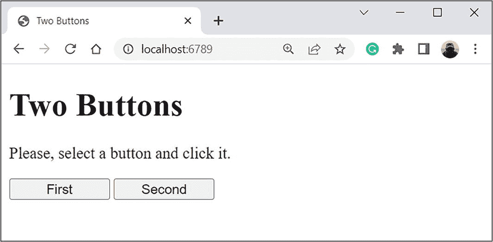

两个按钮网页的截图。标题为“两个按钮”，并显示第一个和第二个按钮。它提示“请选择一个按钮并点击它”。

**图 12-8** 初始浏览器窗口，包含一个表单和两个按钮

该窗口包含一小段文字和两个分别名为**First**和**Second**的按钮。您可以点击其中任意一个。如果您点击**First**按钮，将得到如图 12-9 所示的结果。

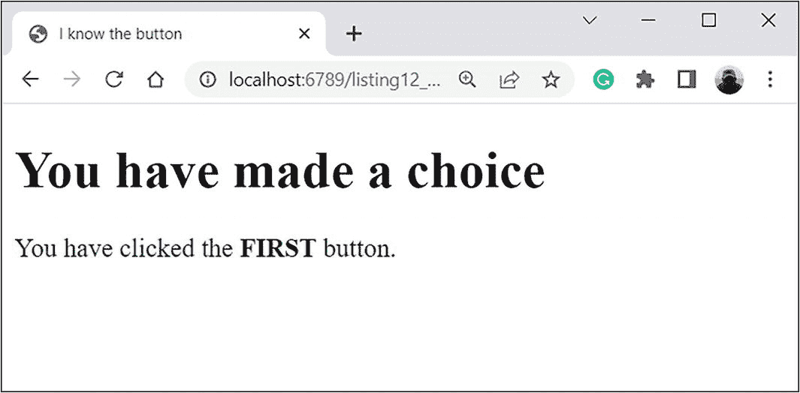

标题为“我知道按钮”的网页截图。内容如下：您已做出选择。您点击了第一个按钮。

**图 12-9** 点击 **First** 按钮后的结果

此时，浏览器窗口会显示一条包含所点击按钮名称的消息。如果您在初始窗口（见图 12-8）中点击**Second**按钮，也会发生同样的操作。但在此情况下，按钮的名称会有所不同，如图 12-10 所示。

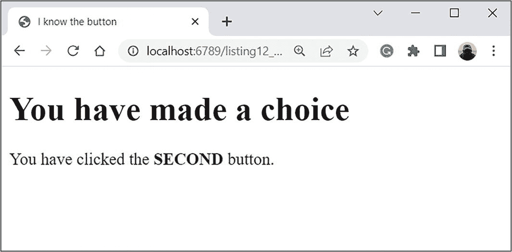

标题为“我知道按钮”的网页截图。内容如下：您已做出选择。您点击了第二个按钮。

**图 12-10** 点击 **Second** 按钮后的结果

因此，当在原始窗口中按下某个按钮时，同一窗口会显示一个新的文档，其中包含被按下按钮的名称（以大写字母和粗体显示）。

首先，分析浏览器启动时打开的 `index.html` 文件的 HTML 代码。

```html
Two Buttons

两个按钮
请选择一个按钮并点击它。

First
Second
```

与之前的案例相比，变化不多，但意义重大。首先，没有输入字段，而是有两个按钮（由 `<button>` 和 `</button>` 标签创建的元素）。每个按钮都通过 `style="width:100px"` 属性进行描述。该属性定义了按钮的宽度为 `100` 像素。这属于“装饰性”设置。第一个按钮的 `name` 属性值为 `"first"`。第二个按钮的 `name` 属性值为 `"second"`。您需要该属性来在 PHP 代码中识别按钮。此外，每个按钮都有一个 `value` 属性值。第一个按钮的值为 `"FIRST"`，第二个按钮的值为 `"SECOND"`。您也会在 PHP 代码中使用这些值。

---

**详情**

| --- | --- | --- |

当您点击一个按钮时，由于本案例使用 POST 方法发送数据，与所点击按钮关联的元素会被添加到 `$_POST` 数组中。键由按钮的 `name` 属性决定，元素的值由按钮的 `value` 属性决定。

表单数据由 `listing12_04.php` 文件中的程序处理（表单的 `action` 属性值为 `"listing12_04.php"`）。该程序的代码如代码清单 12-4 所示。

```html
I know the button

您已做出选择

您点击了

按钮。
```

**代码清单 12-4** 处理按钮点击

这是一个包含一小段 PHP 代码的简单 HTML 代码。

执行代码的结果是，确定与按钮名称关联的文本并将其写入文档。然后，文档被传递给浏览器。

您使用了条件语句，其中测试了 `isset($_POST["first"])` 条件。如果 `$_POST` 数组中存在键为 `"first"` 的元素，则该条件为真。条件为真意味着用户点击了 **First** 按钮，因为该按钮的 `name` 属性值为 `"first"`。元素 `$_POST["first"]` 提供了按钮的 `value` 属性值（因此是 `"FIRST"`）。这就是在执行 `$button=$_POST["first"]` 语句后，`$button` 变量得到值 `"FIRST"` 的原因。

如果 `isset($_POST["first"])` 条件为假，则意味着 `$_POST` 数组中不存在键为 `"first"` 的元素。这反过来表明 **First** 按钮未被点击。如果是这样，那么您必须推断出 **Second** 按钮被点击了。因此，使用 `$button=$_POST["second"]` 命令，将 `$_POST` 数组中键为 `"second"` 的元素值赋给 `$button` 变量。该值就是第二个按钮的 `value` 属性值 `"SECOND"`。

执行条件语句的结果是，`$button` 变量获取了用户所点击按钮的 `value` 属性值。该值会被写入服务器发送给浏览器的文档中。

## 使用列表和复选框

以下示例使用 PHP 处理来自包含下拉列表和复选框的表单的数据。初始阶段的浏览器窗口外观如图 12-11 所示。

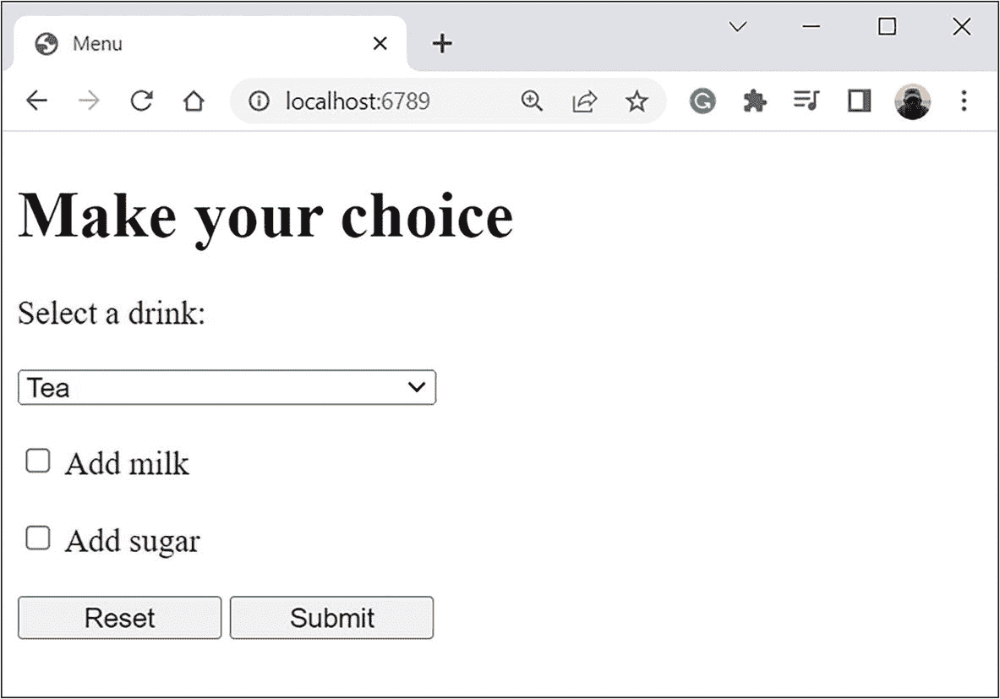

标题为“菜单”的网页截图。内容如下：做出您的选择，有一个选择饮料的字段。已选择茶。下方有添加牛奶和添加糖的选项。底部有重置和提交按钮。

**图 12-11** 包含下拉列表和复选框的表单

---

**详情**

| --- | --- | --- |

您应使用之前的方案：在本地服务器的根目录中放置 `index.html` 文件，其中包含表单描述。

窗口中有一个表单，提示用户选择一种饮料（从下拉列表中）。此外，用户还可以选择是否添加牛奶和糖。展开下拉列表后的窗口如图 12-12 所示。

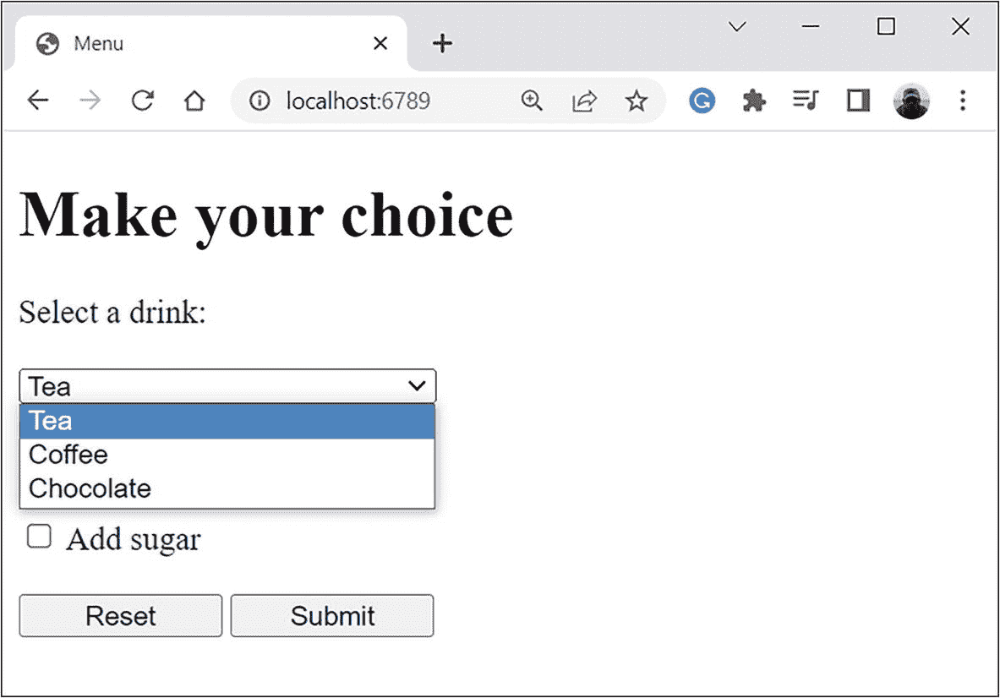

标题为“菜单”的网页截图。内容如下：做出您的选择，有一个选择饮料的字段。下拉列表列出了茶、咖啡和巧克力，其中茶被选中。有添加牛奶和添加糖的选项。底部有重置和提交按钮。

**图 12-12** 展开下拉列表后的窗口

窗口内还有两个按钮：**Reset** 和 **Submit**。点击 **Reset** 按钮可重置表单设置。点击 **Submit** 按钮时，表单数据会被发送到服务器。图 12-13 显示了已进行表单设置的窗口：下拉列表中选择了 **Coffee** 饮料，**Add milk** 复选框被选中，**Add sugar** 复选框未被选中。

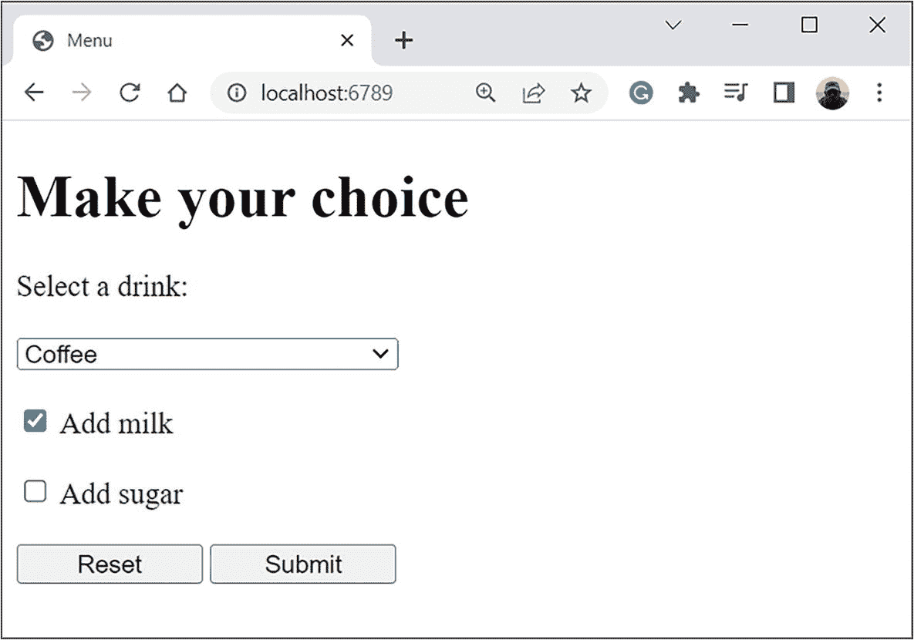

标题为“菜单”的网页截图。内容如下：做出您的选择，有一个选择饮料的字段。已选择咖啡。添加牛奶选项已勾选。底部有重置和提交按钮。

**图 12-13** 表单中的设置

如果您将数据发送到服务器，将得到如图 12-14 所示的结果。

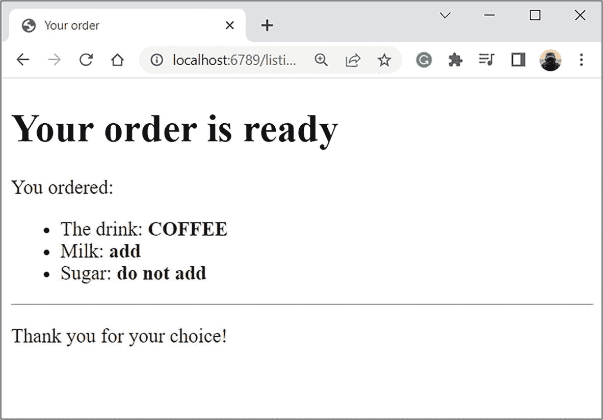

标题为“您的订单”的网页截图。内容如下：您的订单已准备好，您点了：饮料：咖啡，牛奶：添加，糖：不添加，感谢您的订单。


### 图 12-14
处理表单数据的结果

窗口显示了关于订单的信息（所选饮料以及是否需要添加牛奶和糖）。让我们分析一下程序的执行过程如何导致描述的结果。`index.html` 文件包含以下代码。

```
<!DOCTYPE html>
<html>
<head>
<title>菜单</title>
</head>
<body>
<h1>做出你的选择</h1>
<form action="listing12_05.php" method="post">
<p>选择一种饮料：</p>
<select name="drinks">
<option value="Tea">茶</option>
<option value="Coffee">咖啡</option>
<option value="Chocolate">巧克力</option>
</select>
<p><input type="checkbox" name="milk" value="add"> 添加牛奶</p>
<p><input type="checkbox" name="sugar" value="add"> 添加糖</p>
<p><input type="reset" value="重置">
<input type="submit" value="提交"></p>
</form>
</body>
</html>
```

下拉列表是由 `<select>` 和 `</select>` 标签定义的元素。这一次，你使用 `<input>` 元素来实现按钮。

## HTML 基础知识

由 `<select>` 和 `</select>` 标签定义的元素是一个下拉列表。列表项（展开列表时可以看到）由 `<option>` 和 `</option>` 标签创建。这些描述符之间的文本是列表中显示的项的内容。你为三个 `<option>` 元素指定了 `value` 属性。`<select>` 元素的 `name` 属性值为 `"drinks"`。当表单数据提交到服务器时，`$_POST` 数组中有一个键为 `"drinks"` 的元素，该元素的值由下拉列表中选择的 `<option>` 元素的 `value` 属性决定。

复选框是作为 `<input>` 元素创建的，其 `type` 属性设置为 `"checkbox"`。其中一个复选框的 `value` 和 `name` 属性分别为 `"add"` 和 `"milk"`，另一个则为 `"add"` 和 `"sugar"`。假设在提交表单数据时选中了一个复选框。那么，`$_POST` 数组会包含一个元素，其键由该复选框的 `name` 属性值决定，数组元素的值由 `value` 属性决定。

按钮也是作为 `<input>` 元素创建的。第一个按钮的 `type` 属性设置为 `"reset"`，第二个按钮的该属性设置为 `"submit"`。因此，第一个按钮是重置按钮。如果你点击它，所有表单元素的设置将恢复到初始状态。第二个按钮是用于提交表单数据的按钮。按钮的 `name` 属性分别等于 `"rb"` 和 `"sb"`，但这些值并未被使用。`value` 属性决定了按钮上显示的标题。

文本标签用于列表和复选框。标签元素使用 `<label>` 和 `</label>` 标签创建。这些元素的 `for` 属性指定了文本标签所属元素的名称（`name` 属性的值）。

`<br>` 指令是在浏览器窗口中换行的命令。

文档还使用了 HTML 注释。HTML 中的注释以 `<!--` 开头，以 `-->` 结束。

从表单描述中可以看出，数据处理由 `listing12_05.php` 文件中的程序执行。程序代码如列表 12-5 所示。

```
<?php
$drink=$_POST["drinks"];
if (isset($_POST["milk"])) {
  $milk=$_POST["milk"];
} else {
  $milk="不加";
}
if (isset($_POST["sugar"])) {
  $sugar=$_POST["sugar"];
} else {
  $sugar="不加";
}
$txt=<<<MYTEXT
<h2>您的订单</h2>
<p>您的订单已准备就绪</p>
<p>您点了：</p>
<p>饮料：$drink</p>
<p>牛奶：$milk</p>
<p>糖：$sugar</p>
MYTEXT;
// 将文本添加到文档中：
echo $txt;
?>
<p>感谢您的选择！</p>
```

列表 12-5
使用列表和复选框

该 HTML 文档包含一段 PHP 代码，它根据表单数据生成文本，然后将文本添加到文档中。但首先，`$drink=$_POST["drinks"]` 命令将下拉列表中所选元素的 `value` 属性赋值给变量 `$drink`。

> **注意：** 在这种情况下，你不需要检查 `$_POST` 数组中是否包含键为 `"drinks"`（下拉列表的 `name` 属性值）的元素，因为列表中总有一个元素被选中。

接下来是两条类似的条件语句。在第一条中，检查条件 `isset($_POST["milk"])`。如果 `$_POST` 数组包含键为 `"milk"` 的元素（即用于添加牛奶的复选框被选中），则该条件为真。如果是这样，则 `$milk=$_POST["milk"]` 命令将相应复选框的 `value` 属性赋值给变量 `$milk`。否则，执行 `$milk="不加"` 命令。

与添加糖相关的复选框的数据处理方式类似。但现在，检查的是条件 `isset($_POST["sugar"])`。如果条件为真，则执行 `$sugar=$_POST["sugar"]` 命令。如果条件为假，则执行 `$sugar="不加"` 命令。

在定义了 `$drink`、`$milk` 和 `$sugar` 变量的值之后，创建变量 `$txt`，其值是一个多行文本。

## HTML 基础知识

使用 `<ul>` 和 `</ul>` 标签创建无序列表。列表项由 `<li>` 和 `</li>` 标签定义。`<hr>` 指令向文档中添加一条水平线。

`echo $txt` 命令将生成的文本添加到文档中，服务器将该文档返回给浏览器。

## 滑块和单选按钮

下面的例子延续了“烹饪”主题。这次，你将使用滑块和单选按钮等控件。浏览器窗口在初始阶段显示的文档如图 12-15 所示。

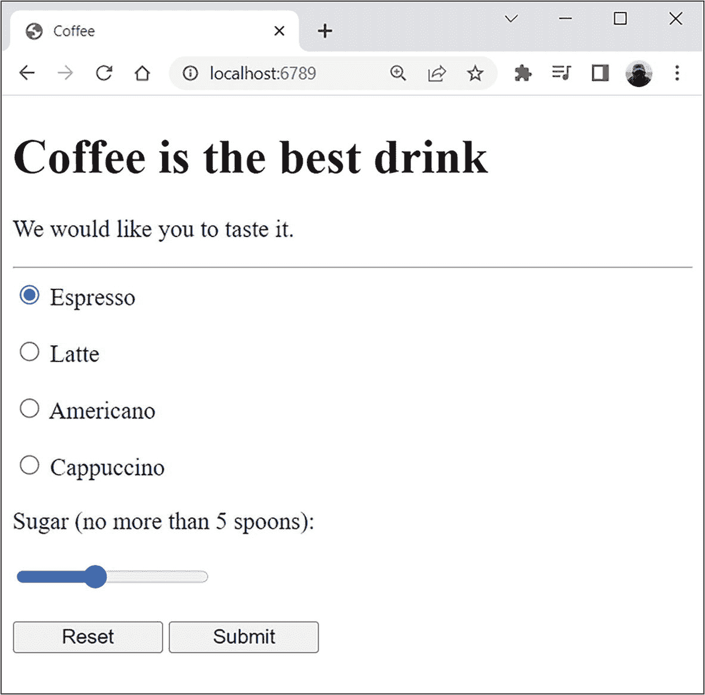

网页截图，标题为咖啡。内容如下。咖啡是最好的饮料。我们希望你品尝一下。选中了浓缩咖啡，糖的滑块设置为不超过 5 勺。底部有重置和提交按钮。

图 12-15
带有滑块和单选按钮的文档

除了文本，文档还包含一组四个单选按钮，上面有咖啡饮料的名称，以及表单底部一个用于选择加入饮料中糖量的滑块。文档中的两个按钮（**重置**和**提交**）允许我们清空表单（重置控件）并将表单数据提交给服务器。服务器发送一个响应，该响应取决于表单设置。例如，如果表单设置与初始文档中提出的设置相同，则结果如图 12-16 所示。

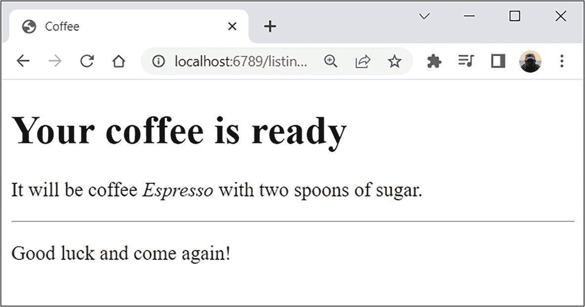

网页截图，标题为咖啡。内容如下。您的咖啡已准备就绪。这将是一杯加了两勺糖的浓缩咖啡。祝您好运，欢迎再次光临，感叹号。

图 12-16
提交表单数据后显示的文档

如果你更改原始文档的设置，结果会有所不同。图 12-17 显示了进行不同设置（与初始版本相比）的文档。

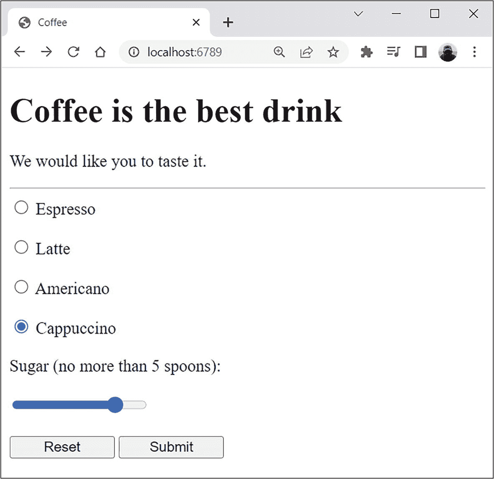

网页截图，标题为咖啡。内容如下。咖啡是最好的饮料。我们希望你品尝一下。选中了卡布奇诺，糖的滑块设置为不超过 5 勺。底部有重置和提交按钮。

图 12-17
在初始文档中更改了表单设置

提交表单数据后，你得到的结果如图 12-18 所示。

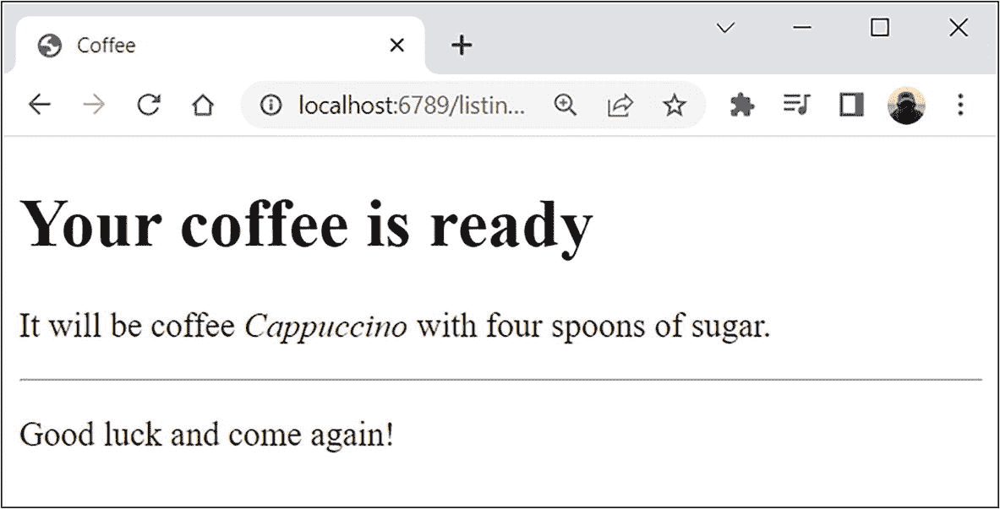

网页截图，标题为咖啡。内容如下。您的咖啡已准备就绪。这将是一杯加了四勺糖的卡布奇诺咖啡。祝您好运，欢迎再次光临，感叹号。

图 12-18
服务器响应取决于表单设置


### 代码分析

接下来，让我们分析代码。本项目使用两个文件。第一个是根目录（本地服务器启动目录）中的`index.html`文件。第二个是同一目录中的`listing12_06.php`文件，用于处理发送到服务器的表单数据。以下是`index.html`文件的代码。

```
<!DOCTYPE html>
<html>
<body>

<h1>Coffee</h1>

<p>Coffee is the best drink</p>
<p>We would like you to taste it.</p>

<form action="listing12_06.php" method="post">
  <p>Espresso</p>
  <p>Latte</p>
  <p>Americano</p>
  <p>Cappuccino</p>
  <p>Sugar (no more than 5 spoons):</p>
</form>

</body>
</html>
```

该文档（尤其是表单）包含许多熟悉的元素。除此之外，还有单选按钮和滑块。单选按钮和滑块被实现为`<input>`元素。

## HTML 基础

对于单选按钮，`type`属性设置为`"radio"`；对于滑块，`type`属性设置为`"range"`。除`type`属性外，还为单选按钮指定了以下属性。所有单选按钮的`name`属性均为`"coffee"`。你需要为`name`属性使用相同的值，因为你需要对单选按钮进行分组。在一个分组内，只能选择一个单选按钮。通过为`name`属性赋予相同值来对单选按钮进行分组。各个单选按钮可以使用`id`属性进行标识。你使用该属性将文本标签与单选按钮绑定。单选按钮还具有`value`属性。通过该属性，在处理请求时，你可以确定提交表单时选择了哪个单选按钮。其中一个单选按钮具有`checked`属性，这意味着相应的单选按钮已被选中（勾选）。

对于滑块，`name`属性的值为`"sugar"`。该属性在处理表单数据时用于确定滑块。滑块的状态由`value`属性定义（初始设置为`"2"`）。`min`和`max`属性分别是滑块的最小值和最大值。`step`属性包含滑块位置的增量。

清单 12-6 是用于处理表单数据的代码。

```
<?php
$coffee=$_POST["coffee"];
function getsugar($sugar) {
    if($sugar == 0) return "no sugar";
    if($sugar == 1) return "a spoon of sugar";
    return "$sugar spoons of sugar";
}
$sugar=getsugar($_POST["sugar"]);
$txt="<h2>Your coffee is ready</h2>
<p>$coffee $sugar.</p>";
// Adding text to the document:
echo $txt;
?>
<p>Good luck and come again!</p>

Listing 12-6
Using a Slider and Radio Buttons
```

思路非常简单。根据表单的设置，形成`$txt`变量，并将其文本值插入到服务器发送给浏览器的文档中。文本包括`$coffee`和`$sugar`变量的值。`$coffee`变量由`$coffee=$_POST["coffee"]`命令确定，即所选单选按钮的`value`属性。`getsugar()`函数确定`$sugar`变量。该函数有一个文本参数（假定为滑块的`value`属性）。根据参数的不同，函数返回一个字符串，其中包含关于在咖啡中放入几勺糖的信息。该函数在`$sugar=getsugar($_POST["sugar"])`命令中使用。此处，要获取滑块的`value`属性，使用`$_POST["sugar"]`指令。在其他所有方面，代码应该清晰易懂。

## HTML 基础

相应的代码块使用`<em>`和`</em>`标签标记，以将文本突出显示为斜体。

## 总结

*   PHP 代码可以添加到 HTML 文档中，由`<?php`和`?>`指令选定。此类代码块允许我们自动生成 HTML 代码片段并将其插入到最终文档中。
*   PHP 脚本可用于处理通过地址栏发出的请求。在地址栏中传递的参数存储在`$_GET`数组中。参数的名称是元素的键，参数的值是元素的值。


