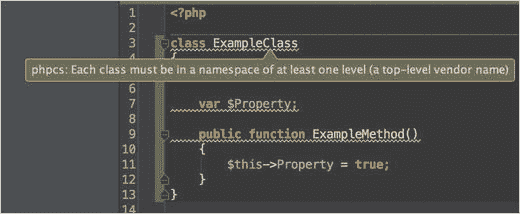
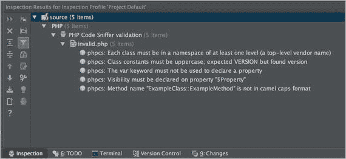

# 三、编程标准

编程标准是如何在任何给定的项目中构建代码的定义集。编程标准适用于从命名约定和空格到变量名、左括号和右括号位置等等的一切。我们使用编程标准作为在整个项目中保持代码统一的一种方式，不管从事这项工作的开发人员有多少。如果您曾经不得不在变量名、类名或方法名等不一致的项目中工作，那么您就会体验到在不符合编程标准的代码中工作是什么感觉。现在想象一下，如果您知道在整个项目中应该以什么样的方式构建代码，那么遵循和编写代码会变得多么容易？

这些年来，有许多 PHP 代码标准的受欢迎程度和流行程度时好时坏。有梨的标准，很详细；Zend 框架标准，由 Zend 推动；在过去五年左右的时间里，我们看到了由一个叫做 PHP-FIG 的开发人员委员会创建的标准。

虽然这一章的重点是 PHP-FIG，但是你选择的标准没有对错之分。从这一章中得到的重要启示是，至少遵循一些标准是很重要的！即使你创造了你自己的，或者决定创造你自己的变体，与已经流行的现有变体有一点偏离，只要选择一个并跟随它。

我们将看看 PHP-FIG 标准团体以及他们开发和推广的标准。我们还将研究一些工具，您可以使用这些工具来帮助在整个项目开发过程中正确使用给定的标准。

## 看一看 PHP-FIG

PHP-FIG ( `php-fig.org`)是 PHP Framework inter operability Group，它是最初在 2009 年 phptek 会议上成立的一个小组，目的是为 PHP 框架创建一个标准团体。它已经从五个创始成员发展到二十个，并且发布了几个标准。

PHP 标准建议是:

*   PSR-0 -自动装弹机标准
*   PSR-1 -基本编程标准
*   PSR-2 -编程风格指南
*   PSR-3 记录器接口
*   PSR-4 -自动装载机标准

在这一章中，我们将看看 PSR-1 和 PSR-2，它们代表 PHP 标准建议 1 和 2。这些标准相当简单，易于遵循，如果您愿意，甚至可以作为创建自己的编程标准的坚实基础。

### PSR-1 `—`基本编程标准

本标准的完整规范见 [`http://www.php-fig.org/psr/psr-1/`](http://www.php-fig.org/psr/psr-1/) 。在撰写本文时，这是当前的标准。本节旨在为您提供该标准的概述以及遵循该标准的一些基本示例。该标准分为以下结构:

*   文件
*   命名空间和类名
*   类常数、属性和方法

#### 文件

本节描述了 PSR-1 下文件的标准定义。

##### PHP 标签

PHP 代码必须使用`<?php`标签或`<?=`格式的短 echo 标签。其他标记都是不可接受的，即使您在 PHP 配置中启用了短标记。

##### 字符编程

PHP 代码必须只使用不带字节顺序标记(BOM)的 UTF-8。在很大程度上，这不是你需要担心的。除非你是在除了用于编程的文本编辑器(如 SublimeText、TextWrangler、Notepad++等)之外的其他工具中编写代码。)或 IDE，它不是应该自动包含的东西。不允许这样做的最大原因是，当用 PHP 包含可能有 BOM 的文件时，或者当您试图设置头时，这可能会导致问题，因为在设置头之前，它将被视为输出。

##### 副作用

这个标准规定 PHP 文件要么声明新的符号(类、函数、常量等)。)或执行有副作用的逻辑，但决不能两者兼而有之。他们使用术语副作用来表示与声明类、函数或方法、常量等不直接相关的执行逻辑。因此，换句话说，一个文件不应该既声明一个函数又执行那个函数，如下面的例子所示，这样可以加强更好的代码分离。

```php
<?php

// Execution of code
myFunction();

// Declaration of function
function myFunction() {
  // Do something here
}

```

#### 命名空间和类名

PSR-1 中命名空间和类名的标准定义如下:

*   命名空间和类必须遵循自动加载 PSR，该标准目前是自动加载标准 PSR-0 或改进的自动加载标准 PSR-4。按照这些标准，一个类总是单独存在于一个文件中(在一个文件中不能声明多个类)，并且它至少包含一个级别的名称空间。
*   必须使用`StudlyCaps`声明类名。

下面是一个类文件的示例:

```php
<?php

namespace Apress\PhpDevTools;

class MyClass
{
  // methods here
}

```

#### 类常数、属性和方法

在这个标准下，术语类是指所有的类、接口和特征。

##### 常数

类常量必须使用下划线作为分隔符全部大写声明。

##### 性能

当涉及到代码中的属性时，标准是相当灵活的。由您决定使用`$StudlyCaps`、`$camelCase`或`$under_score`属性名；如果它们不在彼此的范围内，您可以混合使用它们。因此，如果您的范围是供应商、包、类或方法级别，只要在给定的范围内保持一致即可。然而，我认为最好是找到一个，并在你的所有代码中坚持它。当你在类之间切换时，这将使代码的一致性和可读性变得更加容易。

##### 方法

方法名必须使用`camelCase()`来声明。让我们来看看这个正在使用的标准:

```php
<?php

namespace Apress\PhpDevTools;

class MyClass
{
    const VERSION = '1.0';

    public $myProperty;

    public function myMethod()
    {
        $this->myProperty = true;
    }
}

```

这就概括了 PSR-1 基本编程标准的全部内容。正如您所看到的，它非常简单，容易理解，并且在您第一次通读之后就很容易掌握。现在，让我们看看 PSR-2，这是编程风格指南。

### PSR-2 `—`编程风格指南

本指南是 PSR 协议 1 的延伸和扩展，涵盖了其他编程结构的标准。这是一个比 PSR-1 更长的读数。本指南是通过检查各种 PHP-FIG 成员项目之间的共性而制定的。本标准的完整规范见 [`http://www.php-fig.org/psr/psr-2/`](http://www.php-fig.org/psr/psr-2/) 。与 PSR-1 一样，在撰写本文时，这也是当前的标准。本节旨在为您提供该标准的概述以及遵循该标准的一些基本示例。该标准分为以下结构:

*   一般
*   命名空间和使用声明
*   类、属性和方法
*   控制结构
*   关闭

#### 一般

除了以下规则外，为了符合新 PSR 协议，准则还必须遵循新 PSR 协议中概述的所有规则。

##### 文件

所有 PHP 文件都必须使用 Unix 换行行结尾，必须以一个空行结尾，如果文件只包含 PHP，则必须省略关闭`?>`标记。

##### 线

线条的标准遵循许多规则。前三个规则处理线路长度:

*   线的长度不能有硬性限制。
*   必须有 120 个字符的软限制。
*   每行不应超过 80 个字符，如果超过 80 个字符，则应分成多行。

最后两条规则似乎有点自相矛盾，但我相信它们背后的推理是，一般来说，80 个字符是代码行的主要标准。关于为什么是 80，有很多很多的争论，但是大多数人认为这是所有设备和屏幕尺寸中最可读的长度。120 的软限制更多的是一种视觉提醒，即您已经通过了 80 到 120，这在大多数 ide 和文本编辑器上以各种屏幕尺寸查看也很容易阅读，但是偏离了广泛接受的 80。这里没有硬性限制规则，因为可能偶尔会出现这样的情况，您需要在一行中包含您所需要的内容，并且它超过了 80 和 120 个字符的限制。

其余的行规则是:

*   非空白行的末尾不能有尾随空白。
*   可以添加空行来提高可读性并指示相关的代码块。这真的很有帮助，这样你所有的代码就不会一起运行了。
*   每行只能有一条语句。

##### 刻痕

这条规则规定你必须使用四个空格，并且永远不要使用制表符。我一直支持在制表符上使用空格，几乎任何代码编辑器或 IDE 都可以很容易地将空格映射到您的 tab 键，这使得这条规则更容易遵循。

##### 关键字和 true、false 和 null

这条规则规定所有的关键字都必须小写，常量`true`、`false`和`null`也是如此。

#### 命名空间和使用声明

该标准陈述了关于使用名称空间和名称空间声明的以下内容:

*   在命名空间声明后必须有一个空行。
*   任何使用声明都必须跟在命名空间声明之后。
*   每个声明只能有一个 use 关键字。因此，即使您可以很容易地在 PHP 中用逗号分隔定义多个声明，您也必须每行都有一个声明，并且每个声明都有一个 use 声明。
*   在 use 块之后必须有一个空行。

#### 类、属性和方法

在这些规则中，术语类是指所有的类、接口和特征。

##### 班级

*   `extends`和`implements`关键字必须在与类名相同的行中声明。
*   类的左大括号必须在它自己的行上，右大括号必须出现在类体之后的下一行。
*   工具列表可以拆分成多行，每一行缩进一次。执行此操作时，列表中的第一项必须出现在下一行，并且每行只能有一个接口。

##### 性能

*   必须在类中的所有属性上声明可见性(公共、私有或受保护)。
*   不能使用关键字`var`来声明属性。
*   每个语句不能声明一个以上的属性。
*   属性名不应以单个下划线为前缀来表示受保护或私有的可见性。Pear 编程标准强制实施了这种做法，所以您很有可能见过使用这种方法的代码。

##### 方法

*   可见性(公共、私有或受保护)必须在类中的所有方法上声明，就像属性一样。
*   方法名不应以单个下划线为前缀来表示受保护的或私有的可见性。就像属性一样，您很可能见过这样编写的代码；但是，它不符合新 PSR 协议。
*   方法名不能在方法名后用空格声明，并且左大括号必须在它自己的行上，右大括号必须在方法体后面的下一行上。左括号之后或右括号之前不应使用空格。

##### 方法参数

*   在方法参数列表中，每个逗号前不能有空格，但每个逗号后必须有一个空格。
*   带有默认值的方法参数必须放在参数列表的末尾。
*   您可以将方法参数列表拆分成多行，每一行都缩进一次。使用这种方法时，列表中的第一项必须在下一行，并且每行只能有一个参数。
*   如果使用拆分参数列表，右括号和左大括号必须放在一起，各占一行，中间有一个空格。

##### 抽象、最终和静态

*   如果存在，抽象和最终声明必须在可见性声明之前。
*   如果存在，静态声明必须在可见性声明之后。

##### 方法和函数调用

当调用方法或函数时，方法或函数名和左括号之间不能有空格。左括号之后或右括号之前不得有空格。在参数列表中，每个逗号前不能有空格，但每个逗号后必须有一个空格。

论点单也可以拆分成多行，后续的每一行缩进一次。这样做时，列表中的第一项必须在下一行，并且每行只能有一个参数。

#### 控制结构

控制结构有几个通用的样式规则。它们如下:

*   控制结构关键字后必须有一个空格。
*   左括号之后或右括号之前不得有空格。
*   右括号和左大括号之间必须有一个空格，右大括号必须在正文之后的下一行。
*   结构体必须缩进一次。
*   每个结构的主体必须用大括号括起来。这绝对是一个非常有用的规则，因为它创建了控制结构的一致性并增加了可读性，并且没有大括号，即使它允许用于单行语句或使用 PHP 替代语法时，有时也会导致代码可读性较差。

接下来的几条规则对于下面的控制结构来说基本上都是一样的。让我们来看看它们中每一个的简单例子。

##### 如果，否则，否则

这建立在先前规则的基础上，并声明控制结构应该将`else`和`elseif`放置在与来自先前主体的右括号相同的线上。此外，你应该总是使用`elseif`而不是`else if`，这样关键字都是单个单词。例如，这是一个完全兼容的`if`结构:

```php
<?php

if ($a === true) {

} elseif ($b === true {

} else {

}

```

##### 开关，外壳

`case`语句必须从`switch`关键字、`break`关键字或其他终止关键字(`return, exit, die`等)开始缩进一次。)必须缩进到与`case`正文相同的级别。当在非空的箱体中故意发生跌落时，必须有诸如`// no break`的注释。以下示例是一个兼容的开关结构:

```php
<?php

switch ($a) {
    case 1:
        echo "Here we are.";
        break;
    case 2:
        echo "This is a fall through";
        // no break
    case 3:
        echo "Using a different terminating keyword";
        return 1;
    default: 

        // our default case
        break;
}

```

##### 一边，一边做

`while`和`do while`结构类似于`if`和`switch`结构放置支撑和间隔:

```php
<?php

while ($a < 10) {
    // do something
}

do {
    // something
} while ($a < 10);

```

##### 为

新 PSR 协议文档显示,`for`语句的格式应如下例所示。根据他们列出的内容以及他们控制结构的一般规则，有一点还不清楚，那就是在下面的例子中，在`$i = 0`和`$i < 10`之间是否需要空格。删除空格并使用 PSR-2 验证对 PHP 代码嗅探器运行它将导致它通过验证，因此这由您根据自己的喜好决定。以下两个示例都符合新 PSR 协议:

```php
<?php

for ($i = 0; $i < 10; $i++) {
    // do something
}

for ($j=0; $j<10; $i++) {
    // do something
}

```

##### 为每一个

符合新 PSR 协议的`foreach`语句的结构应如下例所示。与`for`语句不同，如果使用`=>`赋值来分隔键和值对，则需要空格:

```php
<?php

foreach ($array as $a) {
    // do something
}

foreach ($array as $key => $value) {
    // do something
}

```

##### 尝试，抓住(最后)

控制结构规则中的最后一个是`try catch`块。一个`try catch`块应该看起来像下面的例子。PSR-2 标准不包括任何关于`finally`块的内容(PHP 5.5 和更高版本)，但是如果使用它，你应该遵循与`try`块相同的结构:

```php
<?php

try {
    // try something
} catch (ExceptionType $e) {
    // catch exception
} finally {
    // added a finally block
}

```

#### 关闭

闭包，也称为匿名函数，对于 PSR-2 标准有许多规则要遵循。它们非常类似于我们对于函数、方法和控制结构的规则。这主要是因为闭包是匿名函数，所以它们与函数和方法之间的相似性使它们接近相同。新 PSR 协议的规则如下:

*   闭包必须在关键字`function`后和关键字`use`前后各有一个空格。
*   左大括号必须在同一行，右大括号必须在下一行，跟在主体后面，就像函数、方法和控制结构一样。
*   参数列表或变量列表的左括号后不能有空格，参数列表或变量列表的右括号前也不能有空格。同样，这与函数和方法是一样的。
*   参数列表或变量列表中的每个逗号前不能有空格，参数列表或变量列表中的每个逗号后必须有一个空格。
*   带有默认值的闭包参数必须放在参数列表的末尾，就像常规函数和方法一样。

以下是一些符合 PSR 新协议的闭包的例子:

```php
<?php

// Basic closure
$example = function () {
    // function code body
};

// Closure with arguments
$example2 = function ($arg1, $arg2) {
    // function code body
};

// Closure inheriting variables
$example3 = function () use ($var1, $var2) {
    // function code body
};

```

就像函数和方法一样，参数列表和变量列表可以拆分成多行。适用于函数和方法的规则同样适用于闭包。

最后，如果闭包作为参数直接在函数或方法调用中使用，它仍然必须遵循和使用相同的格式规则。例如:

```php
<?php

$myClass->method(
    $arg1,
    function () {
        // function code body
    }
);

```

这些规则总结了 PSR-2 编程风格指南。正如你所看到的，它们建立在 PSR 协议中规定的基本规则之上，并且大多数都建立在彼此的规则之上，有许多共同点。

#### PSR 的遗漏-2

PSR-2 标准有意忽略了许多元素(尽管随着时间的推移，这些项目最终可能会成为规范的一部分)。根据新 PSR 协议规范，这些遗漏包括但不限于以下内容:

*   全局变量和全局常数的声明
*   功能声明
*   操作和分配
*   行间对齐
*   注释和文档块
*   类名前缀和后缀
*   最佳实践

## 用 PHP 代码嗅探器检查编程标准

拥有编程标准是一件很棒的事情，在线资源，例如 PHP-FIG 在 PSR-1 和 PSR-2 上提供的文档，可以帮助你做出正确的选择，使你的代码符合标准。然而，仍然很容易忘记规则或输入错误的东西使其无效，或者也许你是团队的一部分，不可能对每个人的代码进行代码审查以确保他们所有的提交都是符合的。这就是拥有一个每个人都可以轻松运行的代码验证器的好地方，甚至可以将它集成到自动化过程中，以确保所有代码都符合 PSR-1 和 PSR-2，甚至符合您选择的另一种编程标准。

这样的工具是存在的，它被称为 PHP 代码嗅探器，也被 Squizlabs 称为 PHP_CodeSniffer。PHP_CodeSniffer 是一组两个 PHP 脚本。第一个是`phpcs`，当运行时，它将对 PHP 文件(以及 JavaScript 和 CSS)进行标记，以检测是否违反了已定义的编程标准。第二个脚本是`phpcbf`，可以用来自动纠正编程标准违规。

PHP_CodeSniffer 可以通过多种不同的方式安装。您可以下载这两个命令的 Phar 文件，可以使用 Pear 安装，也可以使用 Composer 安装。以下是每种安装方法的步骤。

1.  下载并执行 Phar 文件:

    ```php
    $ curl -OL https://squizlabs.github.io/PHP_CodeSniffer/phpcs.phar

    $ curl -OL https://squizlabs.github.io/PHP_CodeSniffer/phpcbf.phar

    ```

2.  如果您已经安装了 PEAR，您可以使用 Pear 安装程序来安装它。这是通过以下命令完成的:

    ```php
    $ pear install PHP_CodeSniffer

    ```

3.  最后，如果您使用并熟悉 Composer(使用 Composer 在第四章中有介绍)，那么您可以使用下面的命令在系统范围内安装它:

    ```php
    $ composer global require "squizlabs/php_codesniffer=*"

    ```

Note

PHP 代码嗅探器的完整在线文档可以在 [`https://github.com/squizlabs/PHP_CodeSniffer/wiki`](https://github.com/squizlabs/PHP_CodeSniffer/wiki) 找到。

### 使用 PHP_CodeSniffer

一旦你安装了 PHP_CodeSniffer，你可以通过命令行或者直接在一些 ide 中使用它，比如 PHP Storm 或者 NetBeans。从命令行使用它是开始使用它的最快方法。您可以使用它来验证单个文件或整个目录。

Note

PHP_CodeSniffer 的一个先决条件是机器上安装了 PEAR 包管理器。

现在，您可以在本书随附的代码库中的“第三章”分支中找到两个名为`invalid.php`和`valid.php`的文件。我们将针对这些文件测试 PHP_CodeSniffer:

```php
$ phpcs --standard=PSR1,PSR2 invalid.php

FILE: /Apress/source/invalid.php
----------------------------------------------------------------------
FOUND 10 ERRORS AFFECTING 5 LINES
----------------------------------------------------------------------
  3 | ERROR | [ ] Each class must be in a namespace of at least one
    |       |     level (a top-level vendor name)
  3 | ERROR | [x] Opening brace of a class must be on the line after
    |       |     the definition
  4 | ERROR | [ ] Class constants must be uppercase; expected VERSION
    |       |     but found version
  6 | ERROR | [ ] The var keyword must not be used to declare a

    |       |     property
  6 | ERROR | [ ] Visibility must be declared on property "$Property"
  8 | ERROR | [ ] Method name "ExampleClass::ExampleMethod" is not in
    |       |     camel caps format
  8 | ERROR | [ ] Expected "function abc(...)"; found "function abc
    |       |     (...)"
  8 | ERROR | [x] Expected 0 spaces before opening parenthesis; 1
    |       |     found
  8 | ERROR | [x] Opening brace should be on a new line
 11 | ERROR | [x] Expected 1 newline at end of file; 0 found
----------------------------------------------------------------------
PHPCBF CAN FIX THE 4 MARKED SNIFF VIOLATIONS AUTOMATICALLY
----------------------------------------------------------------------

```

从这个输出中我们可以看到，根据 PSR-1 和 PSR-2 标准进行验证时，检测到了十种不同的错误。您可以传入用于验证的不同标准，甚至可以传入由逗号分隔的多个标准，如本例中使用的 PSR1 和 PSR2。此外，在十个错误中，有四个被标记为可以使用 PHP 代码美化和修复工具自动修复，或者被称为`phpcbf`工具。我们现在可以对该文件运行`phpcbf`,并再次尝试验证，看看它是否能修复它:

```php
$ phpcbf --standard=PSR1,PSR2 invalid.php
Changing into directory /Apress/source
Processing invalid.php [PHP => 52 tokens in 11 lines]... DONE in 4ms (4 fixable violations)
        => Fixing file: 0/4 violations remaining [made 3 passes]... DONE in 7ms
Patched 1 file

```

如您所见，`phpcbf`的用法和`phpcs`一样，您可以传入一个标准列表来进行校正，然后传入文件名。现在，再次对文件运行验证程序:

```php
$ phpcs --standard=PSR1,PSR2 invalid.php

FILE: /Apress/source/invalid.php
----------------------------------------------------------------------
FOUND 5 ERRORS AFFECTING 4 LINES
----------------------------------------------------------------------
 3 | ERROR | Each class must be in a namespace of at least one level
   |       | (a top-level vendor name)
 5 | ERROR | Class constants must be uppercase; expected VERSION but
   |       | found version
 7 | ERROR | The var keyword must not be used to declare a property
 7 | ERROR | Visibility must be declared on property "$Property"
 9 | ERROR | Method name "ExampleClass::ExampleMethod" is not in
   |       | camel caps format
----------------------------------------------------------------------

```

在运行`phpcbf`之后运行测试，我们看到它在修复另一个问题时实际上修复了一个额外的问题，所以现在只发现了五个错误。现在，如果我们对我们的`valid.php`文件运行它，这是完全有效的，我们将看到一个有效的结果看起来像什么:

```php
$ phpcs --standard=PSR1,PSR2 valid.php
$

```

对于 100%有效的文件，没有来自`phpcs`的输出，表明它是有效的。现在，如果我们想对我们的整个目录运行它，我们需要做的就是将它指向我们的文件所在的`source`目录。然而，这样做并看到大目录中每个文件的错误可能真的很难通读。

为了帮助解决这个问题，PHP_CodeSniffer 还提供了一个总结报告功能，可以总结每个文件以及在每个文件中发现的错误和警告的数量。它通过传入`-–report=summary`参数来调用。与直接对有效文件运行它一样，如果没有问题，它将不会在摘要中列出:

```php
$ phpcs --report=summary --standard=PSR1,PSR2 source

PHP CODE SNIFFER REPORT SUMMARY
----------------------------------------------------------------------
FILE                                                  ERRORS  WARNINGS
----------------------------------------------------------------------
.../Apress/source/invalid.php             5       0
----------------------------------------------------------------------
A TOTAL OF 5 ERRORS AND 0 WARNINGS WERE FOUND IN 1 FILES
----------------------------------------------------------------------

```

### PHP_CodeSniffer 配置

有许多不同的配置选项和方法来配置 PHP_CodeSniffer。本章不讨论所有这些选项，因此前面列出的在线文档是找到所有可用选项的最佳资源。但是，让我们看看几个不同的选项，以及如何设置它们。

Note

如果需要，PHP_codeSniffer 也可以以批处理模式运行。

可以使用- `config-set`参数更改默认配置。例如，要将默认检查标准更改为 PSR-1 和 PSR-2，而不是`phpcs`默认使用的 PEAR 标准，可以这样设置:

```php
$ phpcs --config-set default_standard PSR1,PSR2
Config value "default_standard" added successfully

```

您也可以使用`phpcs.xml`文件直接在项目中指定默认配置选项。如果您在一个没有任何其他参数的目录中运行`phpcs`,将会用到它。这里有一个例子:

```php
<?xml version="1.0"?>
<ruleset name="Apress_PhpDevTools">
    <description>The default phpcs configuration for Chapter 3.</description>

    <file>invalid.php</file>
    <file>valid.php</file>

    <arg name="report" value="summary"/>

    <rule ref="PSR1"/>
    <rule ref="PSR2"/>
</ruleset>

```

在这个文件中，指定了要检查的文件，以及我们想要使用的规则。使用多个`<rule />`标签指定多个规则。

### PHP_CodeSniffer 自定义标准

如果您有自己的标准，或者已经采用了 PSR-1 和 PSR-2 的大部分标准，但决定偏离这里或那里的规则，您可以创建自己的自定义标准供`phpcs`使用。它基于 PSR-1 和 PSR-2 标准，并且只覆盖您希望偏离的部分。这是使用一个`ruleset.xml`文件完成的，然后使用- `standard`参数与`phpcs`一起使用，就像任何其他编程标准一样。

至少，`ruleset.xml`文件有一个名称和一个描述，格式和我们创建的`phpcs.xml`文件一样。然而，仅仅有名称和描述并不能为`phpcs`提供任何指令来覆盖现有的规则集。对于这个例子，假设我们想要改变标准，不限制方法名为`camelCase`。这可以通过如下配置来实现:

```php
<?xml version="1.0"?>
<ruleset name="Apress PhpDevTools CustomStandard">
    <description>A custom standard based on PSR-1 and PSR-2</description>

    <!-- Don't restrict method names to camelCase -->
    <rule ref="PSR1">
        <exclude name="PSR1.Methods.CamelCapsMethodName"/>
    </rule>

    <!-- Additionally, include the PSR-2 rulesets -->
    <rule ref="PSR2"/>

</ruleset>

```

使用这个规则集，我们看到我们需要做的就是为我们的规则定义一个名称，包括我们的标准所基于的规则集，然后指定我们想要从这些规则集中排除的规则。现在，如果我们对我们的`invalid.php`文件运行验证，我们将看到错误从五个下降到四个，因为方法名冲突已经消失，因为我们的新标准没有将其限制为`camelCase`:

```php
$ phpcs --standard=custom_ruleset.xml invalid.php

FILE: /Apress/source/invalid.php
----------------------------------------------------------------------
FOUND 4 ERRORS AFFECTING 3 LINES
----------------------------------------------------------------------
 3 | ERROR | Each class must be in a namespace of at least one level
   |       | (a top-level vendor name)
 5 | ERROR | Class constants must be uppercase; expected VERSION but
   |       | found version
 7 | ERROR | The var keyword must not be used to declare a property
 7 | ERROR | Visibility must be declared on property "$Property"
----------------------------------------------------------------------

```

### PHP_CodeSniffer IDE 集成

如前所述，一些 ide(如 PHPStorm 和 NetBeans)有办法直接在其中集成 PHP_CodeSniffer。为这些 ide 配置它的确切过程可能会随着它们各自的供应商发布新版本而改变，所以我们在这里不做介绍。在撰写本文时，在线文档中介绍了为 PHPStorm 设置这一功能的步骤。

在我的 PHPStorm 安装中，我配置了 PHP_CodeSniffer 并设置为 PSR-1 和 PSR-2 标准。有了这个配置，如果我写的任何代码偏离了这些标准，我就可以从 PHPStorm 得到即时反馈，在违规的代码行下面有一条黄色的曲线，如图 3-1 所示。



图 3-1。

Real-time PSR violation detection and hits in PHPStorm

您还可以对文件运行验证，并直接在 PHPStorm 中查看检查规则，如图 3-2 所示。



图 3-2。

PHP_CodeSniffer validation results within PHPStorm

## 使用 phpDocumentor 编写代码文档

并非所有的编程标准都提供了关于代码注释的规则。例如，PSR-1 和 PSR-2 没有设置评论规则。然而，同样重要的是建立一个标准，让参与项目的每个人在评论时都遵循这个标准。

可以说，PHP 最流行的格式之一是 DocBlock 格式，它与提供关于类、方法、函数或其他结构元素的信息结合使用。当与 phpDocumentor 项目结合使用时，您可以为整个项目自动生成代码文档，并为所有开发人员提供一个简单的参考。

另一个常用的代码文档工具是 PHPXref ( `phpxref.sourceforge.net`)。通常，PHPDocumentor 和 PHPXref 主要有两个不同的目标:

*   phpDocumentor 主要用于从源代码中生成各种不同格式的真实文档。
*   PHPXref 工具主要用于帮助开发人员浏览大型 PHP 项目的代码文档。

### 安装 phpDocumentor

phpDocumentor 有几种不同的安装方式。可以下载 Phar 文件直接执行，可以用 Pear 安装，也可以用 Composer 安装。以下是每种安装方法的步骤。

*   首先，你要检查梨的先决条件:

    ```php
    http://pear.php.net/manual/en/installation.php

    ```

*   下载并执行 Phar 文件:

    ```php
    $ curl -OL http://www.phpdoc.org/phpDocumentor.phar

    ```

*   如果您已经安装了 PEAR，您可以使用 Pear 安装程序来安装它。这是通过以下命令完成的:

    ```php
    $ pear channel-discover pear.phpdoc.org
    $ pear install phpdoc/phpDocumentor

    ```

*   最后，您可以使用 Composer 通过以下命令在系统范围内安装它:

    ```php
    $ composer global require "phpdocumentor/phpdocumentor:2.*"

    ```

### 使用 phpDocumentor

如前所述，phpDocumentor 应该用于记录代码中的结构元素。phpDocumentor 识别以下结构元素:

*   功能
*   常数
*   班级
*   接口
*   特征
*   类别常数
*   性能
*   方法

要为这些元素中的任何一个创建一个文档块，你必须总是以完全相同的方式格式化它们`—`它们将总是在元素之前，你将总是为每个元素创建一个块，并且在文档块和元素开始之间不应该有其他注释。

DocBlocks 的格式总是包含在名为 DocComment 的注释类型中。文档注释以`/**`开始，以`*/`结束。中间的每一行都应该以一个星号(`*`)开始。以下是我们之前创建的示例类的 DocBlock 示例:

```php
/**
 * Class ExampleClass
 *
 * This is an example of a class that is PSR-1 and PSR-2 compliant. Its only
 * function is to provide an example of how a class and its various properties
 * and methods should be formatted.
 *
 * @package Apress\PhpDevTools
 */
class ExampleClass
{
    const VERSION = '1.0';

    public $exampleProp;

    public function exampleMethod()
    {
        $this->$exampleProp = true;
    }
}

```

正如我们在这个例子中看到的，一个文档块被分成三个不同的部分:

*   Summary——如果可能的话，summary 行应该是一行，并且仅仅是对我们正在记录的元素的快速总结。
*   描述-描述更深入地描述了有助于了解我们元素的信息。如果有和/或需要，此处应包括背景信息或其他文字参考。描述区域还可以利用 Markdown 标记语言来样式化文本，并提供列表甚至代码示例。
*   标签/注释——最后，标签和注释部分提供了一个地方来提供关于我们的元素的有用的、统一的元信息。所有标签和注释都以“at”符号(@)开始，并且各占一行。流行的标签包括方法或函数上可用的参数、返回类型，甚至元素的作者。在前面的例子中，我们使用 package 标签来记录我们的类所属的包。

Note

文档块的每个部分都是可选的；但是，没有摘要行的描述是不存在的。

让我们扩展前面的示例，并为示例类的每个结构元素提供文档块:

```php
<?php

namespace Apress\PhpDevTools;

/**
 * Class ExampleClass
 *
 * This is an example of a class that is PSR-1 and PSR-2 compliant. Its only
 * function is to provide an example of how a class and its various properties
 * and methods should be formatted.
 *

 * @package Apress\PhpDevTools
 * @author Chad Russell <chad@intuitivereason.com>
 */
class ExampleClass
{
    /**
     * Class version constant
     */
    const VERSION = '1.0';

    /**
     * Class example property
     *
     * @var $exampleProp
     */
    public $exampleProp;

    /**
     * Class example method
     *
     * This method is used to show as an example how to format a method that is
     * PSR-1 & PSR-2 compliant.
     *
     * @param bool $value This is used to set our example property.
     */
    public function exampleMethod($value)
    {
        $this->$exampleProp = $value;
    }

    /**
     * Gets the version of our class
     *
     * @return string Version number
     */
    public function classVersion()
    {
        return self::VERSION;
    }
}

```

现在我们已经扩展了我们的示例，您可以看到使用了几个独特的标记，以及如何根据需要将这三个部分混合在一起的示例。关于可供 phpDocumentor 使用的标签的完整列表，请参见位于 [`http://www.phpdoc.org/docs/latest/index.html`](http://www.phpdoc.org/docs/latest/index.html) 的完整 phpDocumentor 在线文档。

### 运行 phpDocumentor

除了在使用 phpDocumentor 和 DocBlock 格式时为您的项目提供漂亮、统一的代码注释之外，您现在还可以轻松地生成代码文档，将您的注释转换为文档资源。一旦安装了 phpDocumentor，只需运行它来生成这个文档。

生成第一组文档只需要三个命令行选项中的两个。选项包括:

*   `-d`–指定您想要记录的项目目录。
*   `-f`–指定项目中要记录的一个或多个文件。
*   `-t`–指定生成和保存文档的目标位置。

对于这个示例，我们将针对之前的一个示例类运行它:

```php
$ phpdoc -f valid.php -t doc

```

这里，我们告诉 phpDocumentor 运行文件`valid.php`，并将文档保存在一个名为`doc`的新文件夹中。如果我们查看新的`doc`文件夹，我们会看到新文档所需的许多不同的文件夹和资产。您可以通过打开在 web 浏览器中生成的`index.html`文件来查看它。我们可以在图 3-3 中看到示例类的页面。


图 3-3。

phpDocumentor-generated class documentation

### 非结构性注释

最后，由于 phpDocumentor 只提供了结构化注释，所以建议您为自己的编程标准建立扩展到非结构化注释的准则。例如，Pear 编程标准提供了一个通用的经验法则，这是一个很好的策略。在他们的建议下，你应该总是注释那些你不想描述的代码段，或者那些你可能会忘记功能的代码段，如果你以后不得不回来的话。

建议您使用 C 风格的注释(`/* */`)或 C++注释(`//`)。不鼓励使用 Perl/Shell 风格的注释(`#`)，即使 PHP 支持它。

## 摘要

在这一章中，我们讨论了为你的项目使用编程标准的好处。我们深入研究了 PHP-FIG PHP 标准建议以及遵循这些标准的一些代码示例。我们介绍了如何使用 PHP_CodeSniffer 工具作为代码的验证器，以确保您和您的团队成员遵循既定的标准。最后，我们讨论了使用 phpDocumentor 项目和 DocBlock 格式的代码注释和文档。

下一章我们将讨论框架。