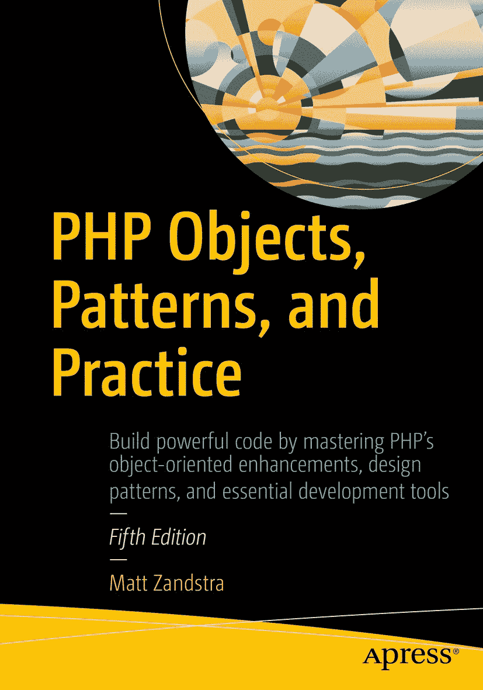

Matt Zandstra《PHP 对象、模式与实践》第 5 版

本书作者引用的任何源代码或其他补充材料，读者均可于 [`www.apress.com`](http://www.apress.com) 获取。有关如何找到本书源代码的详细信息，请访问 [`www.apress.com/source-code/`](http://www.apress.com/source-code/)。读者也可在 SpringerLink 上各章节的“补充材料”部分获取源代码。ISBN 978-1-4842-1995-9 电子书 ISBN 978-1-4842-1996-6 DOI 10.1007/978-1-4842-1996-6 美国国会图书馆控制号：2016961297 © Matt Zandstra 2016 本作品受版权保护。出版商保留所有权利，无论涉及全部或部分材料，特别是翻译权、重印权、插图重用权、朗诵权、广播权、缩微胶片复制权或任何其他物理形式的复制权，以及传输或信息存储与检索权、电子改编权、计算机软件权，或采用目前已知或未来开发的类似或不同方法进行的操作权。本书中可能出现商标名称、徽标和图像。我们不针对每次出现的商标名称、徽标或图像使用商标符号，而仅以编辑方式使用这些名称、徽标和图像，以利于商标所有者，且无意侵犯商标权。本出版物中使用的商品名称、商标、服务标志及类似术语，即使未标明，也不应被视为对其是否受所有权保护的看法表达。尽管本书中的建议和信息在出版时被认为是真实准确的，但作者、编辑和出版商均不对可能出现的任何错误或遗漏承担法律责任。出版商对本书所含内容不作任何明示或暗示的担保。印刷于无酸纸上 本书通过 Springer Science+Business Media New York 在全球图书贸易中发行，地址：233 Spring Street, 6th Floor, New York, NY 10013。电话：1-800-SPRINGER，传真：(201) 348-4505，电子邮件：orders-ny@springer-sbm.com，或访问 www.springer.com。Apress Media, LLC 是一家加利福尼亚有限责任公司，其唯一成员（所有者）是 Springer Science + Business Media Finance Inc (SSBM Finance Inc)。SSBM Finance Inc 是一家特拉华州公司。献给路易丝，她是我全部的意义。