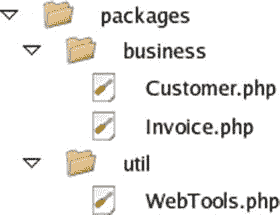

# 5. 对象工具

正如我们所见，PHP 通过类和方法等语言结构支持面向对象编程。该语言还通过专门设计用于处理对象的函数和类提供了更广泛的支持。

在本章中，我们将探讨一些可用于组织、测试和操作对象及类的工具和技术。

本章将涵盖以下工具和技术：

- **命名空间**：将你的代码组织成离散的、类似包的结构
- **包含路径**：为你的库代码设置可访问的中心位置
- **类与对象函数**：用于测试对象、类、属性和方法的函数
- **反射 API**：一套功能强大的内置类，可在运行时提供对类信息的空前访问

## PHP 与包

包是一组相关的类，通常以某种方式组合在一起。包可用于将系统的各个部分相互分离。一些编程语言正式支持包，并为它们提供不同的命名空间。PHP 本身没有包的概念，但从 PHP 5.3 开始，它引入了命名空间。我将在下一节介绍这个特性。我还会简要介绍组织类以形成类似包结构的旧方法。

### PHP 包与命名空间

尽管 PHP 本身不直接支持包的概念，但开发者传统上使用命名方案和文件系统来将他们的代码组织成类似包的结构。

在 PHP 5.3 之前，开发者被迫在全局上下文中为文件命名。换句话说，如果你将一个类命名为 `ShoppingBasket`，它就会立即在整个系统中可用。这引发了两个主要问题。首先，也是最严重的，是命名冲突的可能性。你可能认为这不太可能。毕竟，你只需要记住给所有的类起一个唯一的名称，对吧？问题在于，我们都越来越依赖库代码。当然，这是一件好事，因为它促进了代码复用。但假设你的项目是这样做的：

```
// 清单 05.01
require_once __DIR__ . "/../useful/Outputter.php";
class Outputter
{
// 输出数据
}
```

现在假设你包含了位于 `useful/Outputter.php` 的文件：

```
// 清单 05.02
class Outputter
{
//
}
```

那么，你可以猜到会发生什么，对吧？这是会发生的：

```
PHP Fatal error:  Cannot declare class Outputter because the name is already in use in /var/popp/src/ch05/batch01/useful/Outputter.php on line 4
```

早在引入命名空间之前，就有了针对这个问题的传统变通方法。答案是在类名前面加上包名，这样就能保证类名的唯一性：

```
// 清单 05.03
// my/Outputer.php
require_once __DIR__ . "/../useful/Outputter.php";
class my_Outputter
{
// 输出数据
}
// 清单 05.04
// useful/Outputter.php
class useful_Outputter
{
//
}
```

这里的问题是，随着项目变得越来越复杂，类名变得越来越长。这本身不算一个巨大的问题，但它导致了代码可读性问题，并使你在工作时更难记住所有的类名。大量累积的编码时间就这样浪费在了输入错误上。

如果你在维护遗留代码，你可能仍然会看到遵循此约定的代码。因此，我将在本章稍后部分简要回到处理包的旧方法。

#### 命名空间的救赎

PHP 5.3 引入了命名空间。本质上，命名空间是一个容器，你可以在其中放置你的类、函数和变量。在命名空间内，你可以不加限定地访问这些条目。从外部来看，你必须导入命名空间或引用它，才能访问它所包含的条目。

感到困惑吗？举个例子应该会有帮助。这里我用命名空间重写了前面的例子：

```
// 清单 05.05
namespace my;
require_once __DIR__ . "/../useful/Outputter.php";
class Outputter
{
// 输出数据
}
// 清单 05.06
namespace useful;
class Outputter
{
//
}
```

注意 `namespace` 关键字。正如你所料，这个关键字用于建立命名空间。如果你使用了这个特性，那么命名空间声明必须是该文件中的第一条语句。我创建了两个命名空间：`my` 和 `useful`。然而，通常你会想要更深的命名空间。你会从一个组织或项目标识符开始。然后，你会想通过包来进一步限定它。PHP 允许你声明嵌套命名空间。为此，你只需使用反斜杠字符来分隔每一级：

```
// 清单 05.07
namespace popp\ch05\batch04\util;
class Debug
{
public static function helloWorld()
{
print "hello from Debug\n";
}
}
```

你通常会使用与产品或组织相关的名称来定义一个库。例如，我可能会使用我的一个域名：`getinstance.com`。因为域名对其所有者是唯一的，这是 Java 开发者通常用于其包名的技巧。他们会反转域名，使其从最通用到最具体。或者，我也可以使用我为本书中的代码示例选择的命名空间：`popp`，表示书名。一旦我确定了我的库，我可能会继续定义包。在这种情况下，我使用章节号，然后是一个编号的批处理。这使我可以将示例组组织到离散的容器中。因此，在本章的这一点上，我位于 `popp\ch05\batch04`。最后，我可以按类别进一步组织代码。我选择了 `util`。

那么我该如何调用这个方法呢？实际上，这取决于你从哪里发起调用。如果你在命名空间内部调用该方法，你可以直接调用它：

```
Debug::helloWorld() ;
```

这被称为非限定名称。因为我已经在 `popp\ch05\batch04\util` 命名空间中了，所以我不必在类名前面添加任何路径。如果我是在命名空间上下文之外访问该类，我可以这样做：

```
\popp\ch05\batch04\Debug::helloworld();
```

对于以下代码，我会得到什么输出呢？

```
namespace main;
popp\ch05\batch04\Debug::helloworld();
```

这是一个陷阱问题。实际上，这是我的输出：

```
PHP Fatal error:  Class 'popp\ch05\batch04\Debug' not found in...
```

这是因为我在使用相对命名空间。PHP 在命名空间 `main` 下查找 `popp\ch05\batch04\util`，但没有找到。正如你可以通过使用分隔符来创建绝对的 URL 和文件路径一样，命名空间也是如此。这个版本的例子修复了之前的错误：

```
namespace main;
\popp\ch05\batch04\Debug::helloworld();
```

前导的反斜杠告诉 PHP 从根命名空间开始搜索，而不是从当前命名空间开始。

但是，命名空间不应该是为了帮助你减少输入吗？`Debug` 类的声明当然更短了，但是那些调用和旧的命名约定一样冗长。你可以通过 `use` 关键字来解决这个问题。它允许你在当前命名空间中为其他命名空间设置别名。这里有一个例子：

```
namespace main;
use popp\ch05\batch04\util;
util\Debug::helloWorld();
```


好的，作为高级文档工程师和翻译员，我将严格按照您的注意事项和示例，将给定的英文文本翻译成中文。


`popp\ch05\batch04\util`命名空间被导入，并隐式别名为`util`。请注意，我并没有以反斜杠开头。`use`的参数是从全局空间搜索的，而不是从当前命名空间。如果我不想引用任何命名空间，我可以直接导入`Debug`类：

```
namespace main;
use popp\ch05\batch04\util\Debug;
Debug::helloWorld();
```

这是最常用的约定。但如果调用命名空间中已经存在一个`Debug`类会怎样？下面是这样一个类：

```
// listing 05.08
namespace popp\ch05\batch04;
class Debug
{
    public static function helloWorld()
    {
        print "hello from popp\\ch05\\batch04\\Debug\n";
    }
}
```

以下是来自`popp\ch05\batch04`命名空间的一些调用代码，它引用了两个`Debug`类：

```
namespace popp\ch05\batch04;
use popp\ch05\batch04\util\Debug;
use popp\ch05\batch04\Debug;
Debug::helloWorld();
```

正如您所料，这会导致一个致命错误：

```
PHP Fatal error:  Cannot use popp\ch05\batch04\Debug as Debug because the name is already in use in...
```

所以，我似乎又回到了原点，遇到了类名冲突的问题。幸运的是，这个问题有解决办法。我可以显式地指定别名：

```
namespace main;
use popp\ch05\batch04\Debug as coreDebug;
coreDebug::helloWorld();
```

通过使用`use`的`as`子句，我能够将`Debug`别名改为`coreDebug`。

如果你在某个命名空间中编写代码，并希望访问位于全局（非命名空间）空间中的类，你只需在类名前面加一个反斜杠。下面是一个在全局空间中声明的类：

```
// listing 05.09
class Lister
{
    public static function helloWorld()
    {
        print "hello from global\n";
    }
}
```

以下是一些带命名空间的代码：

```
// listing 05.10
namespace popp\ch05\batch04\util;
class Lister
{
    public static function helloWorld()
    {
        print "hello from " . __NAMESPACE__ . "\n";
    }
}
// listing 05.11
namespace popp\ch05\batch04;
Lister::helloWorld();  // access local
\Lister::helloWorld(); // access global
```

命名空间代码声明了自己的`Lister`类。同一命名空间中的客户端代码使用非限定名称来访问本地版本。用单个反斜杠限定的名称用于访问全局空间中的类。

以下是前面代码片段的输出：

```
hello from popp\ch05\batch04\util
hello from global
```

这很值得展示，因为它演示了`__NAMESPACE__`常量的操作。它会输出当前命名空间，并且在调试中很有用。

你可以使用你已经见过的语法在同一个文件中声明多个命名空间。你也可以使用另一种语法，该语法将大括号与`namespace`关键字一起使用：

```
// listing 05.12
namespace com\getinstance\util {
    class Debug
    {
        public static function helloWorld()
        {
            print "hello from Debug\n";
        }
    }
}
namespace other {
    \com\getinstance\util\Debug::helloWorld();
}
```

如果你必须在同一个文件中组合多个命名空间，那么这是推荐的做法。然而，通常的最佳实践是按文件定义命名空间。

注意

你不能在同一个文件中同时使用大括号和行内命名空间语法。你必须选择一种并全程使用它。

### 使用文件系统模拟包

无论你使用哪个版本的 PHP，你都应该使用文件系统来组织类，这提供了一种包结构。例如，你可以创建`util`和`business`目录，并使用`require_once()`语句包含类文件，如下所示：

```
require_once('business/Customer.php');
require_once('util/WebTools.php');
```

你也可以使用`include_once()`，效果相同。`include()`和`require()`语句之间唯一的区别在于它们对错误的处理方式。使用`require()`调用的文件在遇到错误时会导致整个进程崩溃。通过`include()`调用遇到的相同错误只会生成一个警告并结束被包含文件的执行，让调用代码继续运行。这使得`require()`和`require_once()`成为包含库文件的安全选择，而`include()`和`include_once()`则适用于模板等操作。

注意

`require()`和`require_once()`实际上是语句，而不是函数。这意味着在使用它们时可以省略括号。就个人而言，我仍然喜欢使用括号，但如果你也这样做，就要准备好忍受那些急于指出你错误的人的说教。

图 5-1 从 Nautilus 文件管理器的角度展示了`util`和`business`包。



图 5-1.

使用文件系统组织的 PHP 包

注意

`require_once()`接受一个文件的路径，并将其包含进来，在当前脚本中进行评估。只有当其目标尚未在其他地方被包含时，该函数才会纳入它。这种一次性方法在访问库代码时特别有用，因为它可以防止类或函数的意外重复定义。当同一个文件在单个进程中被脚本的不同部分使用`require()`或`include()`等函数包含时，就可能发生这种重复定义。

习惯上，推荐使用`require()`和`require_once()`，而不是类似的`include()`和`include_once()`函数。这是因为在通过`require()`函数访问的文件中遇到致命错误会使整个脚本崩溃。而通过`include()`函数访问的文件中遇到的相同错误会导致被包含文件停止执行，但只会在调用脚本中生成一个警告。前者更激烈的行为更为安全。

与`require()`相比，使用`require_once()`会带来一些性能开销。如果你需要为系统榨取每一毫秒的性能，你可能需要考虑改用`require()`。像通常情况一样，这是效率与便利性之间的权衡。

就 PHP 而言，这种结构并没有什么特别之处。你只是将库脚本放置在不同的目录中。它确实有助于清晰的组织，并且可以与命名空间或命名约定并行使用。

### PEAR 风格的命名

在命名空间引入之前，开发人员被迫依靠约定来避免类名冲突。正如我们所见，最常见的就是由 PEAR 开发者维护的伪命名空间。

注意

PEAR 代表 PHP 扩展与应用库（PHP Extension and Application Repository）。它是一个官方维护的包和工具档案库，用于扩展 PHP 的功能。核心 PEAR 包包含在 PHP 发行版中，其他包则可以通过一个简单的命令行工具添加。你可以在 [`http://pear.php.net`](http://pear.php.net) 浏览 PEAR 包。

PEAR 使用文件系统来定义其包，正如我所描述的那样。在引入命名空间之前，每个类都根据其包路径进行命名，每个目录名用下划线字符分隔。

例如，PEAR 包含一个名为`XML`的包，它有一个`RPC`子包。`RPC`包包含一个名为`Server.php`的文件。`Server.php`中定义的类并不像你预期的那样叫做`Server`。没有命名空间，这个类迟早会与 PEAR 项目或用户代码中其他地方的另一个`Server`类发生冲突。相反，这个类被命名为`XML_RPC_Server`。这种方法导致类名不够美观。然而，它确实使代码易于阅读，因为类名总是描述其自身的上下文。


### 包含路径

在组织组件时，需要牢记两个视角。第一个视角已经讨论过，即文件和目录在文件系统中的存放位置。但还应考虑组件之间的互相访问方式。到目前为止，本节对包含路径的问题只是浅尝辄止。当包含一个文件时，可以使用当前工作目录的相对路径或文件系统上的绝对路径来引用它。

**注意：** 理解包含路径的工作方式以及引入文件所涉及的问题固然重要，但同样要记住，许多现代系统不再在类级别依赖 `require` 语句。相反，它们结合使用了自动加载和命名空间。我将在下面介绍自动加载，然后在第 15 章和第 16 章中更详细地探讨实用的自动加载建议和工具。

到目前为止，你看到的示例偶尔会指定请求文件与被请求文件之间的固定关系：

```
require_once(__DIR__ . '/../useful/Outputter.php');
```

这种写法虽然可以正常工作，但硬编码了文件之间的关系。调用类所在的目录旁必须始终存在一个 `useful` 目录。

最糟糕的做法或许是曲折的相对路径：

```
require_once('../../projectlib/business/User.php');
```

这样做是有问题的，因为此处指定的路径并非相对于包含此 `require_once` 语句的文件，而是相对于已配置的调用上下文（通常（但并非总是）是当前工作目录）。像这样的路径是制造混乱的根源（根据我的经验，这几乎总是一个信号，表明系统在其他方面也需要大幅改进）。

当然，你也可以使用绝对路径：

```
require_once('/home/john/projectlib/business/User.php');
```

这在单个实例上可以工作——但它很脆弱。通过如此详细地指定路径，你将库文件冻结在特定的上下文中。每当将项目安装到新服务器时，所有 `require` 语句都需要修改以适应新的文件路径。这使得库难以迁移，并且如果不复制副本，项目之间共享库也不现实。在这两种情况下，你都会在众多附加目录中丢失包的概念。这到底是 `business` 包，还是 `projectlib/business` 包？

如果必须手动在代码中包含文件，最简洁的方法是将调用代码与库解耦：

```
business/User.php
```

上述代码片段可以从系统上的任何位置引用。你可以通过包含路径来实现这一点。包含路径是一个目录列表，当试图引入文件时，PHP 会搜索这些目录。你可以通过修改 `include_path` 指令来向此列表添加目录。`include_path` 通常在 PHP 的中央配置文件 `php.ini` 中设置。它定义了一个目录列表，在类 Unix 系统上用冒号分隔，在 Windows 系统上用分号分隔：

```
include_path = ".:/usr/local/lib/php-libraries"
```

如果你使用 Apache，还可以在服务器应用程序的配置文件（通常称为 `httpd.conf`）或按目录的 Apache 配置文件（通常称为 `.htaccess`）中使用以下语法设置 `include_path`：

```
php_value  include_path  value    .:/usr/local/lib/php-libraries
```

**注意：** `.htaccess` 文件在某些托管公司提供的网络空间中特别有用，这些公司对服务器环境的访问权限非常有限。

当你对当前工作目录中不存在的非绝对路径使用像 `fopen()` 或 `require()` 这样的文件系统函数时，会自动搜索包含路径中的目录，从列表中的第一个目录开始（对于 `fopen()`，你必须在参数列表中包含一个标志才能启用此功能）。当找到目标文件时，搜索结束，并且文件函数完成任务。

因此，通过将包目录放在包含目录中，你只需在 `require()` 语句中引用包和文件即可：

```
require_once("business/User.php");
```

你可能需要将一个目录添加到 `include_path`，以便维护自己的库目录。为此，可以编辑 `php.ini` 文件（请记住，对于 PHP 服务器模块，你需要重启服务器才能使更改生效）。

如果你没有操作 `php.ini` 文件所需的权限，可以使用 `set_include_path()` 函数从脚本内部设置包含路径。`set_include_path()` 接受一个包含路径（如同在 `php.ini` 中出现的那样），并且仅更改当前进程的 `include_path` 设置。`php.ini` 文件可能已经为 `include_path` 定义了一个有用的值，因此与其覆盖它，不如使用 `get_include_path()` 函数访问它，并附加你自己的目录。以下是将目录添加到当前包含路径的方法：

```
set_include_path(get_include_path() . PATH_SEPARATOR . "/home/john/phplib/");
```

`PATH_SEPARATOR` 常量在 Unix 系统上解析为冒号，在 Windows 平台上解析为分号。因此，出于可移植性的原因，使用它被认为是最佳实践。


### 自动加载

虽然在引入路径中使用 `require_once` 很简洁，但许多开发者已经彻底摆脱了高层次的 require 语句，转而依赖自动加载。

为此，你应该组织好你的类，让每个类都位于独立的文件中。每个类文件应与其所包含的类名保持固定关系，因此你可以在名为 `ShopProduct.php` 的文件中定义一个 `ShopProduct` 类，并根据类命名空间的元素使用相应的目录。

PHP 5 引入了自动加载功能，以帮助自动引入类文件。默认支持相当基础，但仍然有用。它可以通过调用不带参数的 `spl_autoload_register()` 函数来启用。如果以这种方式启用了自动加载功能，那么当尝试实例化一个未知类时，一个名为 `spl_autoload()` 的特殊函数将被调用。`spl_autoload()` 函数将接收类名，并尝试使用该类名（转换为小写）以及文件扩展名（默认为 `php` 或 `inc`）来引入相应的类文件。

下面是一个简单的例子：

```
spl_autoload_register();
$writer = new Writer();
```

假设我还没有引入包含 `Writer` 对象的文件，这个实例化看起来注定会失败。然而，因为我设置了自动加载，PHP 将尝试引入名为 `writer.php` 或 `writer.inc` 的文件，然后再次尝试实例化。如果这些文件之一存在，并且包含一个名为 `Writer` 的类，那么一切都会正常。

这种默认行为支持命名空间，用目录名替换每个包：

```
spl_autoload_register();
$writer = new util\Writer();
```

上述代码将在名为 `util` 的目录中查找名为 `writer.php`（注意使用小写名称）的文件。

如果我不巧以区分大小写的方式命名了类文件呢？也就是说，如果我保留了类名中的大写字母，那么默认实现将无法找到它。

幸运的是，我可以注册自己的自定义函数来处理不同的约定集。为了利用这一点，我必须将自定义函数的引用传递给 `spl_autoload_register()`。我的自动加载函数应接受一个参数。然后，当 PHP 引擎遇到尝试实例化未知类时，它将调用此函数，并将未知类名作为字符串传递给它。自动加载函数负责定义定位并引入缺失类文件的策略。一旦自动加载函数被调用，PHP 将再次尝试实例化该类。

下面是一个简单的自动加载函数，以及一个要加载的类：

```
// listing 05.13
class Blah
{
public function wave()
{
print "saying hi from root";
}
}
// listing 05.14
$basic = function ($classname) {
$file = __DIR__ . "/" . "{$classname}.php";
if (file_exists($file)) {
require_once($file);
}
};
\spl_autoload_register($basic);
$blah = new Blah();
$blah->wave();
```

初始实例化 `Blah` 失败后，PHP 引擎将发现我已经用 `spl_register_function()` 注册了一个自动加载函数，并将字符串 `"Blah"` 传递给它。我的实现只是尝试引入 `Blah.php` 文件。当然，这仅在文件与声明自动加载函数的文件位于同一目录时才能生效。在实际示例中，我必须将包含路径配置与自动加载逻辑结合起来（这正是 Composer 自动加载实现所做的）。

如果我想提供旧式的支持，我可能会自动化 PEAR 包的引入：

```
// listing 05.15
class util_Blah
{
public function wave()
{
print "saying hi from underscore file";
}
}
// listing 05.16
$underscores = function ($classname) {
$path = str_replace('_', DIRECTORY_SEPARATOR, $classname);
$path = __DIR__ . "/$path";
if (file_exists("{$path}.php")) {
require_once("{$path}.php");
}
};
\spl_autoload_register($underscores);
$blah = new util_Blah();
$blah->wave();
```

如你所见，自动加载函数匹配提供的 `$classname` 中的下划线，并将每个下划线替换为 `DIRECTORY_SEPARATOR` 字符（Unix 系统上为 `/`）。我尝试引入类文件（`util/Blah.php`）。如果类文件存在，并且其中包含的类正确命名，则对象应无错误地实例化。当然，这确实要求程序员遵守命名约定，禁止在类名中使用下划线字符，除非用于分隔包。

命名空间呢？我们已经看到默认的自动加载功能支持命名空间。但如果我们覆盖了默认设置，就需要自己提供命名空间支持。这只需匹配并替换反斜杠字符：

```
// listing 05.17
namespace util;
class LocalPath
{
public function wave()
{
print "hello from ".get_class();
}
}
// listing 05.18
$namespaces = function ($path) {
if (preg_match('/\\\\/', $path)) {
$path = str_replace('\\', DIRECTORY_SEPARATOR, $path);
}
if (file_exists("{$path}.php")) {
require_once("{$path}.php");
}
};
\spl_autoload_register($namespaces);
$obj = new util\LocalPath();
$obj->wave();
```

传递给自动加载函数的值始终规范化为完全限定名称，没有前导反斜杠，因此在实例化时无需担心别名或相对命名空间。

如果我想同时支持 PEAR 风格的类名和命名空间呢？我可以将自动加载实现合并到一个自定义函数中。或者，我可以利用 `spl_autoload_register()` 会堆叠其自动加载函数这一特性：

```
// listing 05.19
\spl_autoload_register($namespaces);
\spl_autoload_register($underscores);
$blah = new util_Blah();
$blah->wave();
$obj = new util\LocalPath();
$obj->wave();
```

当遇到未知类时，PHP 引擎将依次调用自动加载函数，直到实例化成功或所有选项都已用尽。

显然，这种堆叠方式会有一定开销，那么 PHP 为什么支持它呢？在实际项目中，你可能会将命名空间和下划线策略合并到一个函数中。然而，大型系统和第三方库中的组件可能需要注册自己的自动加载机制。堆叠允许系统的多个部分独立注册自动加载策略，而不会相互覆盖。事实上，一个只需要短暂自动加载机制的库，可以在完成后将自定义自动加载函数的名称（如果是匿名函数，则传递其引用）传递给 `spl_autoload_unregister()`，以清理自身！

**注意**

PHP 支持 `__autoload()`，这是一种功能较弱的自动文件包含管理机制。如果你提供了 `__autoload()` 函数的实现，PHP 在找不到类时会调用你的函数。然而，由于这种方法只支持单个自动加载函数且无法堆叠，它可能会在未来的 PHP 版本中被弃用。更多详情请参见 [`www.php.net/spl_autoload_register`](http://www.php.net/spl_autoload_register)。


### 类与对象函数

PHP 提供了一组强大的函数，用于测试类和对象。这有什么用处呢？毕竟，你在脚本中使用的大多数类很可能都是你自己编写的。

实际上，在运行时，你并不总是了解正在使用的类。例如，你可能设计了一个系统，使其能够透明地与第三方附加类一起工作。在这种情况下，你通常只会根据一个类名来实例化对象。PHP 允许你使用字符串来动态引用类，就像这样：

```
// 代码清单 05.20
namespace tasks;
class Task
{
public function doSpeak()
{
print "hello\n";
}
}
// 代码清单 05.21
$classname = "Task";
require_once("tasks/{$classname}.php");
$classname = "tasks\\$classname";
$myObj = new $classname();
$myObj->doSpeak();
```

这个脚本可能从配置文件中获取我赋给 `$classname` 的字符串，或者通过将 Web 请求与目录内容进行比较来获取。然后你可以使用这个字符串来加载类文件并实例化一个对象。请注意，我在这个代码片段中构建了一个命名空间限定。

通常，当你希望系统能够运行用户创建的插件时，你会做类似的事情。在实际项目中做如此冒险的事情之前，你必须检查该类是否存在，它是否具有你期望的方法，等等。

**注意**

即使有安全保障措施，你也应该对动态安装第三方插件代码保持极度谨慎。你绝不应该自动运行用户上传的代码。任何这样安装的插件通常会以与核心代码相同的权限执行，因此恶意的插件作者可能会对你的系统造成严重破坏。

这并不是说插件不是一个好主意。允许第三方开发者增强核心系统可以提供极大的灵活性。为了确保更高的安全性，你可以支持一个用于插件的目录，但要求代码文件由系统管理员安装，可以直接安装，也可以在受密码保护的管理环境中安装。管理员在安装前应亲自检查插件代码，或者从信誉良好的仓库获取插件。这就是流行的博客平台 WordPress 处理插件的方式。

一些类函数已被功能更强大的 Reflection API 取代，我将在本章后面介绍。然而，这些函数由于其简单易用，在某些情况下仍然是首选。

### 查找类

`class_exists()` 函数接受一个表示待检查类的字符串，如果类存在则返回布尔值 `true`，否则返回 `false`。

使用这个函数，我可以让前面的代码片段更安全一些：

```
// 代码清单 05.22
$base = __DIR__;
$classname = "Task";
$path = "{$base}/tasks/{$classname}.php";
if (! file_exists($path)) {
throw new \Exception("No such file as {$path}");
}
require_once($path);
$qclassname = "tasks\\$classname";
if (! class_exists($qclassname)) {
throw new Exception("No such class as $qclassname");
}
$myObj = new $qclassname();
$myObj->doSpeak();
```

当然，你无法确定所涉及的类是否不需要构造函数参数。要达到那种安全级别，你必须求助于本章后面介绍的 Reflection API。尽管如此，`class_exists()` 确实允许你在使用某个类之前检查它是否存在。

**注意**

请记住，如前所述，你应该始终警惕任何来自外部的数据。在使用之前，要先对其测试和处理。对于文件路径，你应该转义或移除点和目录分隔符，以防止不道德的用户更改目录并包含意外的文件。然而，当我描述构建易于扩展系统的方法时，这些技术通常针对的是部署的所有者（以及其隐含的写入权限），而不是其外部用户。

你还可以使用 `get_declared_classes()` 函数获取脚本进程中定义的所有类的数组：

```
print_r(get_declared_classes());
```

这将列出用户定义的类以及内置类。请记住，它只返回函数调用时已声明的类。你稍后可能会运行 `require()` 或 `require_once()`，从而增加脚本中的类的数量。

### 了解对象或类

如你所知，你可以使用类类型提示来约束方法参数的对象类型。但即使有这个工具，你也不一定能确定对象的类型。

有许多基本工具可用于检查对象的类型。首先，你可以使用 `get_class()` 函数检查对象的类。该函数接受任何对象作为参数，并返回其类名作为字符串：

```
// 代码清单 05.23
$product = self::getProduct();
if (get_class($product) === 'popp\ch05\batch05\CdProduct') {
print "\$product is a CdProduct object\n";
}
```

在这个代码片段中，我从 `getProduct()` 函数中获取了一些东西。为了完全确定它是一个 `CdProduct` 对象，我使用了 `get_class()` 方法。

**注意**

我在第 3 章中介绍了 `CdProduct` 和 `BookProduct` 类。

这是 `getProduct()` 函数：

```
// 代码清单 05.24
public static function getProduct()
{
return new CdProduct(
"Exile on Coldharbour Lane",
"The",
"Alabama 3",
10.99,
60.33
);
}
```

`getProduct()` 只是实例化并返回一个 `CdProduct` 对象。我将在本节中充分利用这个函数。

`get_class()` 是一个非常具体的工具。你通常需要更一般性地确认类的类型。你可能想知道一个对象是否属于 `ShopProduct` 家族，但你不关心它的实际类是 `BookProduct` 还是 `CdProduct`。为此，PHP 提供了 `instanceof` 操作符。

**注意**

PHP 4 不支持 `instanceof`。它提供的是 `is_a()` 函数，该函数在 PHP 5.0 中被弃用，但在 PHP 5.3 中恢复使用。

`instanceof` 操作符使用两个操作数：要测试的对象位于关键字左侧，类名或接口名位于右侧。如果对象是给定类型的实例，则解析为 `true`：

```
// 代码清单 05.25
$product = self::getProduct();
if ($product instanceof \popp\ch05\batch05\CdProduct) {
print "\$product is an instance of CdProduct\n";
}
```

### 获取类的完全限定字符串引用

命名空间清理了面向对象 PHP 中许多丑陋之处。我们不再需要容忍长得离谱的类名，或冒着命名冲突的风险（遗留代码除外）。另一方面，由于别名和相对命名空间引用的存在，解析某些类路径以使其完全限定可能是一件繁琐的事情。

以下是一些难以解析的类名示例：

```
namespace mypackage;
use util as u;
use util\db\Querier as q;
class Local {}
// 解析这些：
// 别名化命名空间
//  u\Writer;
// 别名化类
//  q;
// 在本地上下文中引用的类
//  Local
```

弄清楚这些类引用如何解析并不太难，但编写代码来涵盖所有可能性会很麻烦。例如，对于 `u\Writer`，自动解析器需要知道 `u` 是 `util` 的别名，而不是一个独立的命名空间。PHP 5.5 引入了 `ClassName::class` 语法，非常有帮助。换句话说，给定一个类引用，你可以附加作用域解析操作符和 `class` 关键字来获取完全限定的类名：

```
print u\Writer::class . "\n";
print q::class . "\n";
print Local::class . "\n";
```

前面的代码片段输出如下：

```
util\Writer
util\db\Querier
mypackage\Local
```


### 了解方法

你可以使用 `get_class_methods()` 函数获取一个类中所有方法的列表。该函数需要传入一个类名，并返回一个包含该类所有方法名称的数组：

```
print_r(get_class_methods('\\popp\\ch04\\batch02\\BookProduct'));
```

假设 `BookProduct` 类存在，你可能会看到类似如下的输出：

```
Array
(
[0] => __construct
[1] => getNumberOfPages
[2] => getSummaryLine
[3] => getPrice
[4] => setID
[5] => getProducerFirstName
[6] => getProducerMainName
[7] => setDiscount
[8] => getDiscount
[9] => getTitle
[10] => getProducer
[11] => getInstance
)
```

在示例中，我将一个类名传递给 `get_class_methods()`，并使用 `print_r()` 函数打印返回的数组。我也可以将一个对象传递给 `get_class_methods()`，得到的结果相同。返回的列表中只会包含公共方法的名称。

正如你所看到的，你可以将方法名存储在一个字符串变量中，并配合对象动态调用它，如下所示：

```
// listing 05.26
$product = self::getProduct(); // 获取一个对象
$method = "getTitle";          // 定义一个方法名
print $product->$method();     // 调用该方法
```

当然，这可能存在风险。如果该方法不存在会怎样？正如你所料，脚本会报错并失败。你已经遇到过一种测试方法是否存在的方式：

```
if (in_array($method, get_class_methods($product))) {
print $product->$method(); // 调用该方法
}
```

在调用方法之前，我检查了该方法名是否存在于 `get_class_methods()` 返回的数组中。PHP 为此提供了更专门的工具。你可以通过两个函数在一定程度上检查方法名：`is_callable()` 和 `method_exists()`。`is_callable()` 是两者中更复杂的一个。它接受一个代表函数名的字符串变量作为第一个参数，如果该函数存在且可调用，则返回 `true`。要对方法应用同样的测试，你需要传入一个数组来代替函数名。该数组必须包含一个对象或类名作为第一个元素，以及要检查的方法名作为第二个元素。如果该方法在类中存在，该函数将返回 `true`：

```
// listing 05.27
if (in_array($method, get_class_methods($product))) {
print $product->$method(); // 调用该方法
}
```

`is_callable()` 可选地接受第二个参数，一个布尔值。如果将其设置为 `true`，该函数将仅检查给定方法或函数名的语法，而不检查其实际是否存在。

`method_exists()` 函数需要一个对象（或一个类名）和一个方法名，如果给定方法在该对象的类中存在，则返回 `true`：

```
// listing 05.28
if (method_exists($product, $method)) {
print $product->$method(); // 调用该方法
}
```

**警告**

请记住，方法存在并不意味着它可调用。对于 `private` 和 `protected` 方法，以及 `public` 方法，`method_exists()` 都会返回 `true`。

### 了解属性

正如你可以查询类的方法，你也可以查询它的字段。`get_class_vars()` 函数需要一个类名，并返回一个关联数组。返回的数组以字段名作为键，以字段值作为值。让我们将此测试应用于 `CdProduct` 对象。为了便于说明，我们向该类添加一个公共属性 `CdProduct::$coverUrl`：

```
print_r(get_class_vars('\\popp\\ch05\\batch05\\CdProduct'));
```

仅显示公共属性：

```
Array
(
[coverUrl] => cover url
)
```

### 了解继承

类函数也允许我们绘制继承关系图。例如，我们可以使用 `get_parent_class()` 查找一个类的父类。该函数需要一个对象或一个类名，并返回超类的名称（如果有的话）。如果没有这样的类——即我们测试的类没有父类 ——则该函数返回 `false`。

```
print get_parent_class('\\popp\\ch04\\batch02\\BookProduct');
```

如你所料，这将产生父类：`ShopProduct`。

我们还可以使用 `is_subclass_of()` 函数测试一个类是否是另一个类的子类。该函数需要一个子对象（或类名）以及父类的名称。如果第二个参数是第一个参数的超类，则该函数返回 `true`：

```
// listing 05.29
$product = self::getBookProduct(); // 获取一个对象
if (is_subclass_of($product, '\\popp\\ch04\\batch02\\ShopProduct')) {
print "BookProduct is a subclass of ShopProduct\n";
}
```

`is_subclass_of()` 只能告诉你类的继承关系。它不会告诉你一个类是否实现了某个接口。为此，你应该使用 `instanceof` 运算符。或者，你可以使用 SPL（标准 PHP 库）中的一个函数。`class_implements()` 接受一个类名或对象引用，并返回一个接口名称数组：

```
// listing 05.30
if (in_array('someInterface', class_implements($product))) {
print "BookProduct is an interface of someInterface\n";
}
```


### 方法调用

之前你已经见过一个使用字符串动态调用方法的例子：

```
$product = getProduct();   // 获取一个对象
$method = "getTitle";      // 定义一个方法名
print $product->$method(); // 调用方法
```

PHP 也提供了 `call_user_func()` 方法来实现同样的目的。`call_user_func()` 既可以调用方法，也可以调用函数。调用函数时，它只需要一个字符串作为第一个参数：

```
$returnVal = call_user_func("myFunction");
```

调用方法时，它需要一个数组。数组的第一个元素应该是一个对象，第二个元素是要调用的方法名：

```
$returnVal = call_user_func([$myObj, "methodName"]);
```

你可以将目标方法或函数所需的任何参数作为额外的参数传递给 `call_user_func()`，就像这样：

```
// listing 05.31
$product = self::getBookProduct(); // 获取一个 BookProduct 对象
call_user_func([$product, 'setDiscount'], 20);
```

当然，这种动态调用等同于下面这个写法：

```
$product->setDiscount(20);
```

`call_user_func()` 方法并不会给你的编程生活带来翻天覆地的变化，因为你完全可以直接用一个字符串来代替方法名，就像这样：

```
$method = "setDiscount";
$product->$method(20);
```

不过，更令人印象深刻的是与之相关的 `call_user_func_array()` 函数。在选择目标方法或函数方面，它的工作方式与 `call_user_func()` 相同。但关键在于，它接受目标方法所需的任何参数，且这些参数以数组形式提供。

注意

注意——使用 `call_user_func()` 传递给函数或方法的参数不是通过引用传递的。

那么为什么这很有用呢？有时你会以数组形式获得参数。除非你事先知道要处理的参数数量，否则很难将它们传递出去。在第四章中，我介绍了可用于创建委托类的拦截器方法。下面是一个 `__call()` 方法的简单示例：

```
// listing 05.32
public function __call($method, $args)
{
if (method_exists($this->thirdpartyShop, $method)) {
return $this->thirdpartyShop->$method();
}
}
```

如你所见，当客户端代码调用一个未定义的方法时，`__call()` 方法就会被调用。在这个例子中，我在一个名为 `$thirdpartyShop` 的属性中维护了一个对象。如果我在存储的对象中找到了一个与 `$method` 参数匹配的方法，就调用它。我乐观地假设目标方法不需要任何参数，而这正是问题开始的地方。当我编写 `__call()` 方法时，我无法判断每次调用时 `$args` 数组的大小。如果我直接将 `$args` 传递给委托方法，我传递的将是一个单一的数组参数，而不是它可能期望的多个独立参数。`call_user_func_array()` 完美地解决了这个问题：

```
// listing 05.33
public function __call($method, $args)
{
if (method_exists($this->thirdpartyShop, $method)) {
return call_user_func_array(
[
$this->thirdpartyShop,
$method
],
$args
);
}
}
```

### 反射 API

PHP 的反射 API 之于 PHP，就如同 `java.lang.reflect` 包之于 Java。它由一系列用于分析属性、方法和类的内置类组成。它在某些方面与现有的对象函数（如 `get_class_vars()`）类似，但更灵活，并且能提供更详细的信息。它还被设计为能与 PHP 的面向对象特性（如访问控制、接口和抽象类）协同工作，而在这方面，较旧且功能更有限的类函数则无法做到。

### 入门指南

反射 API 不仅可用于检查类。例如，`ReflectionFunction` 类提供有关给定函数的信息，`ReflectionExtension` 则能揭示编译到语言中的扩展的相关信息。表 5-1 列出了该 API 中的一些类。

表 5-1. 反射 API 中的部分类

| 类 | 描述 |
| --- | --- |
| `Reflection` | 提供一个用于汇总类信息的静态 `export()` 方法 |
| `ReflectionClass` | 类信息和工具 |
| `ReflectionMethod` | 类方法信息和工具 |
| `ReflectionParameter` | 方法参数信息 |
| `ReflectionProperty` | 类属性信息 |
| `ReflectionFunction` | 函数信息和工具 |
| `ReflectionExtension` | PHP 扩展信息 |
| `ReflectionException` | 一个错误类 |
| `ReflectionZendExtension` | PHP Zend 扩展信息 |

总的来说，反射 API 中的这些类提供了前所未有的运行时能力，让你能够访问脚本中对象、函数和扩展的相关信息。

反射 API 的强大功能和广泛范围意味着，你通常应该优先使用它，而不是那些类和对象函数。你很快就会发现自己少不了它，尤其是在测试类时。例如，你可能想生成类图或文档，或者你可能想将对象信息保存到数据库，检查对象的访问器（getter 和 setter）方法以提取字段名。根据命名方案在模块类中调用方法，这也是反射的另一个用途。


### 是时候撸起袖子大干一场了

你已经见过一些用于检查类属性的函数。这些函数虽然有用，但往往功能有限。这里有一个能胜任这项工作的工具。`ReflectionClass` 提供了多种方法，可以揭示指定类的几乎所有信息，无论是用户自定义类还是内部类。`ReflectionClass` 的构造函数接受一个类名、接口名（或对象实例）作为其唯一参数：

```
// listing 05.34
$prodclass = new \ReflectionClass('popp\\ch04\\batch02\\CdProduct');
\Reflection::export($prodclass);
```

一旦创建了 `ReflectionClass` 对象，你就可以使用 `Reflection` 实用类来转储关于 `CdProduct` 的信息。`Reflection` 有一个静态方法 `export()`，它可以格式化并转储由 `Reflection` 对象（严格来说，是实现 `Reflector` 接口的类的任何实例）管理的数据。以下是对 `Reflection::export()` 调用所生成输出的节选：

```
Class [  class popp\ch04\batch02\CdProduct extends popp\ch04\batch02\ShopProduct ] {
@@ /var/popp/src/ch04/batch02/CdProduct.php 6-37
- Constants [2] {
Constant [ integer AVAILABLE ] { 0 }
Constant [ integer OUT_OF_STOCK ] { 1 }
}
- Static properties [0] {
}
- Static methods [1] {
Method [  static public method getInstance ] {
@@ /var/popp/src/ch04/batch02/ShopProduct.php 93 - 130
- Parameters [2] {
Parameter #0 [  integer $id ]
Parameter #1 [  PDO $pdo ]
}
- Return [ popp\ch04\batch02\ShopProduct ]
}
}
- Properties [3] {
Property [  private $playLength ]
Property [  public $status ]
Property [  protected $price ]
}
- Methods [11] {
Method [  public method __construct ] {
@@ /var/popp/src/ch04/batch02/CdProduct.php 10 - 24
- Parameters [5] {
Parameter #0 [  string $title ]
Parameter #1 [  string $firstName ]
Parameter #2 [  string $mainName ]
Parameter #3 [  float $price ]
Parameter #4 [  integer $playLength ]
}
}
...
}
```

正如你所见，`Reflection::export()` 提供了对类信息的非凡访问能力。`Reflection::export()` 几乎汇总了 `CdProduct` 每个方面的信息，包括属性和方法的访问控制状态、每个方法所需的参数，以及每个方法在脚本文件中的位置。将其与更成熟的调试函数进行对比。`var_dump()` 函数是一个通用的数据汇总工具。在提取摘要之前，你必须先实例化一个对象，即便如此，它提供的信息也远不及 `Reflection::export()` 的详细程度：

```
// listing 05.35
$cd = new CdProduct("cd1", "bob", "bobbleson", 4, 50);
var_dump($cd);
```

这是输出结果：

```
object(popp\ch04\batch02\CdProduct)#17 (8) {
["playLength":"popp\ch04\batch02\CdProduct":private]=>
int(50)
["status"]=>
NULL
["title":"popp\ch04\batch02\ShopProduct":private]=>
string(3) "cd1"
["producerMainName":"popp\ch04\batch02\ShopProduct":private]=>
string(9) "bobbleson"
["producerFirstName":"popp\ch04\batch02\ShopProduct":private]=>
string(3) "bob"
["price":protected]=>
float(4)
["discount":"popp\ch04\batch02\ShopProduct":private]=>
int(0)
["id":"popp\ch04\batch02\ShopProduct":private]=>
int(0)
}
```

`var_dump()` 及其近亲 `print_r()` 是暴露脚本数据的极其便捷的工具。不过，对于类和函数，反射 API 将事情提升到了一个全新的水平。

### 检查一个类

`Reflection::export()` 方法可以为调试提供大量有用的信息，但我们也可以以更专门化的方式来使用反射 API。让我们直接使用 `Reflection` 类。

你已经看到了如何实例化一个 `ReflectionClass` 对象：

```
$prodclass = new \ReflectionClass('popp\\ch04\\batch02\\CdProduct');
```

接下来，我将在脚本中使用 `ReflectionClass` 对象来调查 `CdProduct`。它是什么类型的类？可以创建它的实例吗？以下是一个解答这些问题的函数：

```
// listing 05.36
// class ClassInfo
public static function getData(\ReflectionClass $class)
{
$details = "";
$name = $class->getName();
if ($class->isUserDefined()) {
$details .= "$name is user defined\n";
}
if ($class->isInternal()) {
$details .= "$name is built-in\n";
}
if ($class->isInterface()) {
$details .= "$name is interface\n";
}
if ($class->isAbstract()) {
$details .= "$name is an abstract class\n";
}
if ($class->isFinal()) {
$details .= "$name is a final class\n";
}
if ($class->isInstantiable()) {
$details .= "$name can be instantiated\n";
} else {
$details .= "$name can not be instantiated\n";
}
if ($class->isCloneable()) {
$details .= "$name can be cloned\n";
} else {
$details .= "$name can not be cloned\n";
}
return $details;
}
// listing 05.37
$prodclass = new \ReflectionClass('popp\\ch04\\batch02\\CdProduct');
print ClassInfo::getData($prodclass);
```

我创建了一个 `ReflectionClass` 对象，通过将 `CdProduct` 类名传递给 `ReflectionClass` 的构造函数，并将其赋值给变量 `$prodclass`。然后将 `$prodclass` 传递给名为 `ClassInfo::classData()` 的方法，该方法演示了一些可用于查询类的方法。

这些方法应该不言自明，但这里还是简要介绍一下其中的一些：

*   `ReflectionClass::getName()` 返回正在检查的类的名称。
*   如果该类是在 PHP 代码中声明的，则 `ReflectionClass::isUserDefined()` 方法返回 `true`；如果该类是内置的，则 `ReflectionClass::isInternal()` 返回 `true`。
*   你可以使用 `ReflectionClass::isAbstract()` 测试一个类是否是抽象的，以及使用 `ReflectionClass::isInterface()` 测试它是否是一个接口。
*   如果你想获取该类的一个实例，可以使用 `ReflectionClass::isInstantiable()` 来测试其可行性。
*   你可以使用 `ReflectionClass::isCloneable()` 方法检查一个类是否可被克隆。
*   你甚至可以检查用户自定义类的源代码。`ReflectionClass` 对象提供了对其类文件的文件名以及该类在文件中的起始行和结束行的访问。

以下是一个快速但简陋的方法，它使用 `ReflectionClass` 来访问一个类的源代码：

```
// listing 05.38
class ReflectionUtil
{
public static function getClassSource(\ReflectionClass $class): string
{
$path  = $class->getFileName();
$lines = file($path);
$from  = $class->getStartLine();
$to    = $class->getEndLine();
$len   = $to - $from + 1;
return implode(array_slice($lines, $from - 1, $len));
}
}
// listing 05.39
print ReflectionUtil::getClassSource(
new \ReflectionClass('popp\\ch04\\batch02\\CdProduct')
);
```

`ReflectionUtil` 是一个简单的类，只有一个静态方法 `ReflectionUtil::getClassSource()`。该方法接受一个 `ReflectionClass` 对象作为其唯一参数，并返回所引用类的源代码。`ReflectionClass::getFileName()` 以绝对路径的形式提供类文件的路径，因此代码应该能够直接打开它。`file()` 获取文件中所有行的数组。`ReflectionClass::getStartLine()` 提供类的起始行；`ReflectionClass::getEndLine()` 找到最后一行。接下来，只需使用 `array_slice()` 提取感兴趣的行即可。

为简洁起见，此代码省略了错误处理。在实际应用中，你需要检查参数和返回码。


### 检查方法

正如使用 `ReflectionClass` 检查类一样，`ReflectionMethod` 对象用于检查方法。

你可以通过两种方式获取 `ReflectionMethod`。首先，你可以从 `ReflectionClass::getMethods()` 获取一个 `ReflectionMethod` 对象数组。其次，如果你需要处理特定方法，`ReflectionClass::getMethod()` 接受一个方法名称并返回相应的 `ReflectionMethod` 对象。

在此，我们使用 `ReflectionClass::getMethods()` 来全面演示 `ReflectionMethod` 类的功能：

```
// listing 05.40
$prodclass = new \ReflectionClass('popp\\ch04\\batch02\\CdProduct');
$methods = $prodclass->getMethods();
foreach ($methods as $method) {
print ClassInfo::methodData($method);
print "\n----\n";
}
// listing 05.41
// class ClassInfo
public static function methodData(\ReflectionMethod $method)
{
$details = "";
$name = $method->getName();
if ($method->isUserDefined()) {
$details .= "$name is user defined\n";
}
if ($method->isInternal()) {
$details .= "$name is built-in\n";
}
if ($method->isAbstract()) {
$details .= "$name is abstract\n";
}
if ($method->isPublic()) {
$details .= "$name is public\n";
}
if ($method->isProtected()) {
$details .= "$name is protected\n";
}
if ($method->isPrivate()) {
$details .= "$name is private\n";
}
if ($method->isStatic()) {
$details .= "$name is static\n";
}
if ($method->isFinal()) {
$details .= "$name is final\n";
}
if ($method->isConstructor()) {
$details .= "$name is the constructor\n";
}
if ($method->returnsReference()) {
$details .= "$name returns a reference (as opposed to a value)\n";
}
return $details;
}
```

这段代码使用 `ReflectionClass::getMethods()` 获取一个 `ReflectionMethod` 对象数组，然后遍历该数组，将每个对象传递给 `methodData()`。

`methodData()` 中使用的方法名称反映了它们的意图：代码检查方法是否为用户定义、内置、抽象、公开、受保护、静态或 final。你还可以检查该方法是否是其类的构造函数，以及它是否返回引用。

有一点需要注意：如果被测试的方法只是返回一个对象，`ReflectionMethod::returnsReference()` 不会返回 `true`，即使在 PHP 5 中对象是通过引用传递和赋值的。相反，只有当被测试的方法被显式声明为返回引用时（通过在方法名称前放置一个 `&` 符号），`ReflectionMethod::returnsReference()` 才会返回 `true`。

如你所料，你可以使用与之前处理 `ReflectionClass` 类似的技术来访问方法的源代码：

```
// listing 05.42
// class ReflectionUtil
public static function getMethodSource(\ReflectionMethod $method): string
{
$path  = $method->getFileName();
$lines = @file($path);
$from  = $method->getStartLine();
$to    = $method->getEndLine();
$len   = $to - $from + 1;
return implode(array_slice($lines, $from - 1, $len));
}
// listing 05.43
$class = new \ReflectionClass('popp\\ch04\\batch02\\CdProduct');
$method = $class->getMethod('getSummaryLine');
print ReflectionUtil::getMethodSource($method);
```

因为 `ReflectionMethod` 为我们提供了 `getFileName()`、`getStartLine()` 和 `getEndLine()` 方法，所以提取方法的源代码变得非常简单。

### 检查方法参数

现在方法签名可以约束对象参数的类型，因此检查方法签名中声明的参数的能力变得非常有用。Reflection API 为此目的提供了 `ReflectionParameter` 类。要获取 `ReflectionParameter` 对象，你需要借助 `ReflectionMethod` 对象。`ReflectionMethod::getParameters()` 方法返回一个 `ReflectionParameter` 对象数组。

`ReflectionParameter` 可以告诉你参数的名称，以及变量是否通过引用传递（即在方法声明中带有前置的 `&`）。它还可以告诉你通过参数类型提示所要求的类，以及该方法是否接受该参数的 `null` 值。

以下是一些 `ReflectionParameter` 方法的使用示例：

```
// listing 05.44
$class = new \ReflectionClass('popp\\ch04\\batch02\\CdProduct');
$method = $class->getMethod("__construct");
$params = $method->getParameters();
foreach ($params as $param) {
print ClassInfo::argData($param) . "\n";
}
// listing 05.45
// class ClassInfo
public function argData(\ReflectionParameter $arg)
{
$details = "";
$declaringclass = $arg->getDeclaringClass();
$name  = $arg->getName();
$class = $arg->getClass();
$position = $arg->getPosition();
$details .= "\$$name has position $position\n";
if (! empty($class)) {
$classname = $class->getName();
$details .= "\$$name must be a $classname object\n";
}
if ($arg->isPassedByReference()) {
$details .= "\$$name is passed by reference\n";
}
if ($arg->isDefaultValueAvailable()) {
$def = $arg->getDefaultValue();
$details .= "\$$name has default: $def\n";
}
if ($arg->allowsNull()) {
$details .= "\$$name can be null\n";
}
return $details;
}
```

通过使用 `ReflectionClass::getMethod()` 方法，代码获取了一个 `ReflectionMethod` 对象。然后它使用 `ReflectionMethod::getParameters()` 获取一个 `ReflectionParameter` 对象数组。`argData()` 函数使用传入的 `ReflectionParameter` 对象来获取有关参数的信息。

首先，它使用 `ReflectionParameter::getName()` 获取参数的变量名。如果提供了类型提示，`ReflectionParameter::getClass()` 方法会返回一个 `ReflectionClass` 对象。代码使用 `isPassedByReference()` 检查参数是否为引用；最后，它查找默认值的可用性，并将其添加到返回字符串中。


### 使用反射 API

掌握了反射 API 的基础知识后，你现在可以实际运用这个 API 了。

设想你正在创建一个能够动态调用 `Module` 对象的类。也就是说，它可以接受由第三方编写的插件，这些插件能够轻松集成到应用程序中，而无需任何硬编码。为了实现这一点，你可以在 `Module` 接口或抽象基类中定义一个 `execute()` 方法，强制所有子类实现该方法。你可以允许系统用户在一个外部 XML 配置文件中列出 `Module` 类。你的系统可以利用这些信息，在依次调用每个 `Module` 对象的 `execute()` 方法之前，先将它们聚合起来。

然而，如果每个 `Module` 需要不同的信息来完成其工作，会发生什么呢？在这种情况下，XML 文件可以为每个 `Module` 提供属性键和值，而每个 `Module` 的创建者可以为每个属性名提供相应的 setter 方法。基于这个前提，你的代码需要确保为正确的属性名调用正确的 setter 方法。

以下是 `Module` 接口和几个实现类的基础代码：

```
// listing 05.46
class Person
{
public $name;
public function __construct(string $name)
{
$this->name = $name;
}
}
// listing 05.47
interface Module
{
public function execute();
}
// listing 05.48
class FtpModule implements Module
{
public function setHost($host)
{
print "FtpModule::setHost(): $host\n";
}
public function setUser($user)
{
print "FtpModule::setUser(): $user\n";
}
public function execute()
{
// do things
}
}
// listing 05.49
class PersonModule implements Module
{
public function setPerson(Person $person)
{
print "PersonModule::setPerson(): {$person->name}\n";
}
public function execute()
{
// do things
}
}
```

在这里，`PersonModule` 和 `FtpModule` 都提供了 `execute()` 方法的空实现。每个类也实现了 setter 方法，这些方法除了报告自己被调用外，不做任何事情。系统规定了所有 setter 方法必须期望一个单一参数：或者是一个字符串，或者是一个可以通过单个字符串参数实例化的对象。`PersonModule::setPerson()` 方法需要一个 `Person` 对象，因此我在示例中包含了一个 `Person` 类。

为了与 `PersonModule` 和 `FtpModule` 配合工作，下一步是创建一个 `ModuleRunner` 类。它将使用一个以模块名索引的多维数组来表示 XML 文件中提供的配置信息。以下是相关代码：

```
// listing 05.50
class ModuleRunner
{
private $configData = [
"popp\\ch05\\batch08\\PersonModule" => ['person' => 'bob'],
"popp\\ch05\\batch08\\FtpModule"    => [
'host' => 'example.com',
'user' => 'anon'
]
];
private $modules = [];
// ...
}
```

`ModuleRunner::$configData` 属性包含了对两个 `Module` 类的引用。对于每个模块元素，代码维护了一个包含一组属性的子数组。`ModuleRunner` 的 `init()` 方法负责创建正确的 `Module` 对象，如下所示：

```
// listing 05.51
// class ModuleRunner
public function init()
{
$interface = new \ReflectionClass('popp\\ch05\\batch08\\Module');
foreach ($this->configData as $modulename => $params) {
$module_class = new \ReflectionClass($modulename);
if (! $module_class->isSubclassOf($interface)) {
throw new Exception("unknown module type: $modulename");
}
$module = $module_class->newInstance();
foreach ($module_class->getMethods() as $method) {
$this->handleMethod($module, $method, $params);
// 我们将在后续的代码清单中介绍 handleMethod()！
}
array_push($this->modules, $module);
}
}
// listing 05.52
$test = new ModuleRunner();
$test->init();
```

`init()` 方法遍历 `ModuleRunner::$configData` 数组，对于每个模块元素，它尝试创建一个 `ReflectionClass` 对象。当以不存在的类名调用 `ReflectionClass` 的构造函数时，会生成一个异常，所以在实际场景中，这里应该包含更多的错误处理。我使用 `ReflectionClass::isSubclassOf()` 方法来确保该模块类属于 `Module` 类型。

在调用每个 `Module` 的 `execute()` 方法之前，必须先创建一个实例。这就是 `ReflectionClass::newInstance()` 的用途。该方法接受任意数量的参数，并将其传递给相关类的构造函数。如果一切正常，它会返回该类的一个实例（对于生产代码，务必进行防御性编程：在创建实例之前，检查每个 `Module` 对象的构造函数是否需要参数）。

`ReflectionClass::getMethods()` 返回该类所有可用的 `ReflectionMethod` 对象数组。对于数组中的每个元素，代码调用 `ModuleRunner::handleMethod()` 方法。然后，它将一个 `Module` 实例、`ReflectionMethod` 对象以及一个要关联到该 `Module` 的属性数组传递给它。`handleMethod()` 验证并调用 `Module` 对象的 setter 方法：

```
// listing 05.53
// class ModuleRunner
public function handleMethod(Module $module, \ReflectionMethod $method, $params)
{
$name = $method->getName();
$args = $method->getParameters();
if (count($args) != 1 || substr($name, 0, 3) != "set") {
return false;
}
$property = strtolower(substr($name, 3));
if (! isset($params[$property])) {
return false;
}
$arg_class = $args[0]->getClass();
if (empty($arg_class)) {
$method->invoke($module, $params[$property]);
} else {
$method->invoke(
$module,
$arg_class->newInstance($params[$property])
);
}
}
```

`handleMethod()` 首先检查该方法是否是有效的 setter。在代码中，一个有效的 setter 方法必须命名为 `setXXXX()`，并且必须声明一个且仅一个参数。

假设参数检查通过，代码接着从方法名中提取属性名：移除方法名开头的 `set`，并将得到的子串转换为小写字符。该字符串用于测试 `$params` 数组参数。这个数组包含了用户提供的、需要关联到该 `Module` 对象的属性。如果 `$params` 数组中不包含该属性，代码放弃并返回 `false`。

如果从模块方法中提取的属性名与 `$params` 数组中的某个元素匹配，就可以继续调用正确的 setter 方法。为此，代码必须检查 setter 方法的第一个（也是唯一一个）必需参数的类型。`ReflectionParameter::getClass()` 方法提供了这个信息。如果该方法返回一个空值，则 setter 期望某种基本类型；否则，它期望一个对象。

要调用这个 setter 方法，我需要一个新的反射 API 方法。`ReflectionMethod::invoke()` 需要一个对象（如果是静态方法则为 `null`）以及任意数量的方法参数，这些参数将传递给它所代表的方法。如果提供的对象与其方法不匹配，`ReflectionMethod::invoke()` 会抛出一个异常。我通过两种方式之一调用这个方法。如果 setter 方法不要求对象参数，我就用用户提供的属性字符串调用 `ReflectionMethod::invoke()`。如果方法需要一个对象，我则使用属性字符串实例化一个正确类型的对象，然后将其传递给 setter。

该示例假设所需的对象可以通过向其构造函数传递单个字符串参数来实例化。当然，最好在调用 `ReflectionClass::newInstance()` 之前检查这一点。

当 `ModuleRunner::init()` 方法执行完毕时，该对象拥有了一系列 `Module` 对象的存储，所有这些对象都已用数据初始化完毕。现在可以为该类添加一个方法，该方法遍历这些 `Module` 对象，并对每个对象调用 `execute()`。


## 摘要

本章介绍了可用于管理库和类的部分技术与工具。我探讨了 PHP 的命名空间特性。你会发现，通过组合包含路径、命名空间、自动加载和文件系统，我们可以为类提供灵活的组织方式。

我们还研究了 PHP 的对象和类函数，接着通过强大的反射 API 将内容提升到更高层次。最后，我们使用`Reflection`类构建了一个简单示例，用以说明反射功能的一种潜在用途。

