# 第 6 章 对象与设计

现在我们已经详细了解了 PHP 对象支持的机制，接下来将暂离细节，思考如何最好地运用之前学到的工具。本章将介绍一些与对象和设计相关的问题，同时还会讨论 UML——一种用于描述面向对象系统的强大图形化语言。

本章涵盖以下主题：

- 设计基础：我所指的设计含义，以及面向对象设计与过程式代码的区别
- 类的作用域：如何决定类中应包含的内容
- 封装：在类接口背后隐藏实现与数据
- 多态：通过通用超类型实现运行时对专用子类型的透明替换
- UML：使用图表描述面向对象架构

## 定义代码设计

代码设计的一个含义涉及系统的定义：即确定系统的需求、范围与目标。系统需要做什么？为谁做？系统的输出是什么？是否满足既定需求？在更微观的层面上，设计可以理解为定义系统参与者并组织其关系的过程。本章关注的是第二层含义：类与对象的定义及配置。

那么什么是参与者？面向对象系统由类组成。确定这些参与者的性质至关重要。类由方法构成（部分情况下），因此在定义类时，必须决定哪些方法应归为一组。但正如你将看到的，类常常通过继承关系组合以符合通用接口。正是这些接口（即类型）应成为设计系统的首要切入点。

你还可以为类定义其他关系：创建由其他类型组成的类、或管理其他类型实例列表的类，以及设计单纯使用其他对象的类。这种组合或使用关系的潜力内置于类中（例如通过方法签名中的类型声明），但实际的对象关系在运行时建立，这能增强设计的灵活性。本章将展示如何对这些关系建模，并在全书后续内容中进一步探讨。

作为设计过程的一部分，你必须判断某个操作应属于当前类型，还是属于该类型使用的另一个类。处处都是选择，这些决定可能导向清晰优雅的设计，也可能让你陷入妥协的困境。

本章将探讨可能影响部分选择的一些问题。

## 面向对象与过程式编程

面向对象设计与传统过程式代码有何不同？人们容易认为主要区别在于面向对象代码包含对象。这种说法既不准确也无益处。在 PHP 中，你经常能发现过程式代码使用对象，也可能遇到包含大段过程式代码的类。类的存在并不能保证面向对象设计——即使在强制大多数操作在类内部完成的 Java 语言中也是如此。

面向对象与过程式代码的一个核心区别在于责任分配方式。过程式代码呈现为一系列顺序命令和方法调用，控制代码往往承担处理不同情况的责任。这种自上而下的控制可能导致项目中出现重复代码和依赖关系。面向对象代码则试图通过将任务处理责任从客户端代码转移到系统对象中，来最小化这些依赖。

本节将构建一个简单问题，分别用面向对象和过程式代码分析以说明这些要点。我的项目是快速构建一个读写配置文件的工具。为聚焦代码结构，示例中将省略实现细节。

我将从过程式方案入手。首先处理这种格式的文本：

```
key:value
```

为此仅需两个函数：

```php
// listing 06.01
function readParams(string $source): array
{
    $params = [];
    // 从$source 读取文本参数
    return $params;
}
function writeParams(array $params, string $source)
{
    // 将文本参数写入$source
}
```

`readParams`函数需要源文件名。它尝试打开文件并逐行读取，寻找键值对，同时构建关联数组，最终将数组返回控制代码。`writeParams`接受关联数组和源文件路径，遍历关联数组并将每个键值对写入文件。以下是使用这些函数的客户端代码：

```php
// listing 06.02
$file = __DIR__ . "/params.txt";
$params = [
    "key1" => "val1",
    "key2" => "val2",
    "key3" => "val3",
];
writeParams($params, $file);
$output = readParams($file);
print_r($output);
```

这段代码相对简洁且易于维护。调用`writeParams()`创建`param.txt`并写入类似以下内容：

```
key1:val1
key2:val2
key3:val3
```

`readParams()`函数解析相同格式。

在实际项目中，需求范围常常会增长和演变。我们通过引入新需求来模拟这种变化：现在代码必须处理如下 XML 结构：

```xml
<params>
    <param>
        <key>my key</key>
        <val>my val</val>
    </param>
</params>
```

如果参数文件以`.xml`结尾，则应使用 XML 模式读取。虽然实现并不困难，但这将增加代码维护难度。现阶段我有两个选择：在控制代码中检查文件扩展名，或在读写函数内部进行判断。此处采用后者：

```php
// listing 06.03
function readParams(string $source): array
{
    $params = [];
    if (preg_match("/\.xml$/i", $source)) {
        // 从$source 读取 XML 参数
    } else {
        // 从$source 读取文本参数
    }
    return $params;
}
function writeParams(array $params, string $source)
{
    if (preg_match("/\.xml$/i", $source)) {
        // 将 XML 参数写入$source
    } else {
        // 将文本参数写入$source
    }
}
```

> 注意


示例代码总是需要在清晰表达意图与保持实用性之间艰难平衡。为了阐明核心观点，往往需要牺牲错误检查和实际适用性。换句话说，这里的示例旨在展示设计和重复性问题，而非演示解析和写入文件数据的最佳实践。因此，我会省略与当前问题无关的实现细节。

如你所见，每个函数中我都不得不对 XML 扩展名进行检测。正是这种重复性可能在未来引发问题。如果要求我增加另一种参数格式，我必须确保 `readParams()` 和 `writeParams()` 这两个函数彼此保持一致。

现在，我将通过一些简单的类来处理相同的问题。首先，我创建一个抽象基类来定义该类型的接口：

```
// listing 06.04
abstract class ParamHandler
{
    protected $source;
    protected $params = [];
    public function __construct(string $source)
    {
        $this->source = $source;
    }
    public function addParam(string $key, string $val)
    {
        $this->params[$key] = $val;
    }
    public function getAllParams(): array
    {
        return $this->params;
    }
    public static function getInstance(string $filename): ParamHandler
    {
        if (preg_match("/\.xml$/i", $filename)) {
            return new XmlParamHandler($filename);
        }
        return new TextParamHandler($filename);
    }
    abstract public function write(): bool;
    abstract public function read(): bool;
}
```

我定义了 `addParam()` 方法，允许用户向受保护的 `$params` 属性添加参数，并通过 `getAllParams()` 方法提供对该数组副本的访问。

我还创建了一个静态方法 `getInstance()`，用于检测文件扩展名，并根据结果返回特定的子类。关键在于，我定义了两个抽象方法 `read()` 和 `write()`，确保任何子类都会支持这个接口。

> **注意**
>
> 在父类中放置用于生成子对象的静态方法确实很方便。然而，这种设计决策也有其后果。`ParamHandler` 类型现在基本上被限制为只能与这个中心条件语句中的具体类协作。如果需要处理另一种格式该怎么办？当然，如果你是 `ParamHandler` 的维护者，你可以随时修改 `getInstance()` 方法。但如果你是一名客户端程序员，修改这个库类可能就没那么容易了（实际上修改并不难，问题在于每次重新安装包含该类的包时，你都必须重新应用你的补丁）。我将在第 9 章讨论对象创建的相关问题。

现在，我将定义子类，同样省略实现细节以保持示例简洁：

```
// listing 06.05
class XmlParamHandler extends ParamHandler
{
    public function write(): bool
    {
        // 写入 XML
        // 使用 $this->params
    }
    public function read(): bool
    {
        // 读取 XML
        // 并填充 $this->params
    }
}
// listing 06.06
class TextParamHandler extends ParamHandler
{
    public function write(): bool
    {
        // 写入文本
        // 使用 $this->params
    }
    public function read(): bool
    {
        // 读取文本
        // 并填充 $this->params
    }
}
```

这些类仅提供了 `write()` 和 `read()` 方法的实现。每个类将根据对应的格式进行写入和读取操作。

客户端代码将根据文件扩展名完全透明地写入文本和 XML 两种格式：

```
// listing 06.07
$test = ParamHandler::getInstance(__DIR__ . "/params.xml");
$test->addParam("key1", "val1");
$test->addParam("key2", "val2");
$test->addParam("key3", "val3");
$test->write(); // 以 XML 格式写入
```

我们也可以从任一文件格式读取：

```
// listing 06.08
$test = ParamHandler::getInstance(__DIR__ . "/params.txt");
$test->read(); // 以文本格式读取
$params = $test->getAllParams();
print_r($params);
```

那么，我们可以从这两种方法中学到什么？

### 职责

在过程式示例中，控制代码负责决定格式——而且不止一次，而是两次。条件代码确实被整理到函数中，但这只是掩盖了单一流程的事实，流程在运行过程中做出决策。对 `readParams()` 和 `writeParams()` 的调用发生在不同的上下文中，因此我们被迫在每个函数中重复文件扩展名检测（或对该检测进行变体处理）。

在面向对象的版本中，这种关于文件格式的选择是在静态方法 `getInstance()` 中做出的，它只检测一次文件扩展名，然后提供正确的子类。客户端代码不承担任何实现职责。它使用提供的对象，但不知道也不关心它属于哪个特定的子类。它只知道自己在操作一个 `ParamHandler` 对象，并且该对象会支持 `write()` 和 `read()` 方法。过程式代码忙于处理细节，而面向对象代码仅与接口协作，不关心实现细节。由于实现职责由对象而非客户端代码承担，因此可以轻松透明地切换对新格式的支持。

### 内聚性

内聚性指的是相邻近的代码过程之间的关联程度。理想情况下，你应该创建共享清晰职责的组件。如果相关例程分散在代码各处，你会发现维护它们更加困难，因为你需要四处查找才能进行修改。

我们的 `ParamHandler` 类将相关过程收集到一个共同的上下文中。用于处理 XML 的方法共享一个上下文，它们可以在此共享数据，并且在必要时，一个方法的变更可以轻松地反映在另一个方法中（例如，如果你需要更改一个 XML 元素名称）。因此可以说 `ParamHandler` 类具有高内聚性。

另一方面，过程式示例将相关过程分离。用于处理 XML 的代码分散在各个函数中。

### 耦合性

当系统代码中离散的部分紧密地相互绑定，以至于一个部分的变更必然导致其他部分的变更时，就会发生紧耦合。紧耦合绝非过程式代码的专属问题，尽管这类代码的顺序性本质使其更容易出现此问题。

你可以在过程式示例中看到这种耦合。`writeParams()` 和 `readParams()` 函数对文件扩展名执行相同的检测，以决定它们应如何处理数据。你对其中一个函数所做的任何逻辑更改，都必须在另一个函数中实现。例如，如果你添加一种新格式，就必须使这两个函数保持一致，以便它们以相同的方式实现新的文件扩展名检测。随着你添加更多与参数相关的函数，这个问题只会变得更糟。

面向对象的示例将各个子类相互解耦，并将它们与客户端代码解耦。如果你需要添加一种新的参数格式，只需创建一个新的子类，并修改静态方法 `getInstance()` 中的单一检测点即可。


### 正交性

将职责明确且独立于更大系统的组件进行巧妙组合，有时被称为正交性。Andrew Hunt 和 David Thomas 在其著作《*程序员修炼之道：从小工到专家*》（Addison-Wesley Professional, 1999）中讨论了这一主题。

人们认为，正交性促进了复用，因为组件可以插入新系统而无需任何特殊配置。此类组件将具有清晰的输入和输出，独立于任何更大的上下文。正交代码使变更更容易，因为修改实现的影响将局限于正在更改的组件。最后，正交代码更安全。错误的影响应限制在有限范围内。高度相互依赖的代码中的错误很容易在更大的系统中引发连锁反应。

在类的上下文中，松耦合和高内聚并非自动实现。毕竟，我们完全可以将整个过程性示例嵌入一个错误设计的类中。那么，我们如何在代码中实现这种平衡呢？我通常从思考系统中应该存在哪些类开始。

### 选择你的类

定义类的边界可能出乎意料地困难，尤其是当它们会随着你构建的任何系统而演化时。

当你对现实世界进行建模时，这似乎很简单。面向对象系统通常包含真实事物的软件表示——`Person`、`Invoice` 和 `Shop` 类比比皆是。这似乎表明，定义类就是找出系统中的事物，然后通过方法赋予它们行为能力。这不是一个糟糕的起点，但它确实有其风险。如果你将类视为一个名词，即一系列动词的主语，那么随着持续的开发和需求变化要求它做越来越多的事情，你可能会发现它变得臃肿不堪。

让我们考虑一下我们在第 3 章中创建的 `ShopProduct` 示例。我们的系统存在是为了向客户提供产品，因此定义 `ShopProduct` 类是一个显而易见的选择。但这是我们需要做的唯一决定吗？我们提供了诸如 `getTitle()` 和 `getPrice()` 这样的方法来访问产品数据。当要求我们提供一种机制来输出用于发票和送货单的摘要信息时，定义一个 `write()` 方法似乎是合理的。当客户要求我们以不同格式提供产品摘要时，我们再次审视我们的类。我们因此在 `write()` 方法之外，又多创建了 `writeXML()` 和 `writeHTML()` 方法。或者，我们向 `write()` 添加条件代码，以便根据选项标志输出不同格式。

无论哪种方式，问题在于 `ShopProduct` 类现在试图做太多事情。它正在努力管理显示策略以及管理产品数据。

你应该如何考虑定义类？最好的方法是将类视为具有一个主要职责，并尽可能使该职责单一且专注。将这个职责用语言表述出来。有人说，你应该能够在 25 个或更少的单词内描述一个类的职责，并且很少使用“和”或“或”这样的词。如果你的句子变得太长或陷入从句的泥潭，那么可能是时候考虑根据你描述的一些职责来定义新的类了。

因此，`ShopProduct` 类负责管理产品数据。如果我们添加用于写入不同格式的方法，我们就开始增加一个新的职责领域：产品显示。正如你在第 3 章中看到的，我们实际上根据这些不同的职责定义了两个类型。`ShopProduct` 类型仍然负责产品数据，而 `ShopProductWriter` 类型则承担了显示产品信息的职责。各个子类细化了这些职责。

> **注意：** 几乎没有完全死板的设计规则。例如，你有时会看到在原本不相关的类中编写保存对象数据的代码。尽管这似乎违反了类应具有单一职责的规则，但这可能是该功能最方便的位置，因为方法必须能够完全访问实例的字段。使用本地方法进行持久化还可以避免我们创建与可保存类平行的持久化类层次结构，从而引入不可避免的耦合。我们将在第 12 章中讨论其他对象持久化策略。避免对设计规则的宗教式遵守；它们不能替代在解决问题之前进行分析。努力理解规则背后的逻辑，并优先考虑该逻辑，而不是规则本身。

### 多态性

多态性，或称类切换，是面向对象系统的一个常见特性。你在本书中已经多次遇到它。

多态性是在公共接口背后维护多个实现。这听起来很复杂，但实际上，你现在应该对此非常熟悉。对多态性的需求通常由代码中大量的条件语句所预示。

当我第一次在第 3 章中创建 `ShopProduct` 类时，我尝试使用一个单一的类来管理书籍和 CD 的功能，此外还有通用产品。为了提供摘要信息，我依赖一个条件语句：

```
// listing 03.31
public function getSummaryLine()
{
$base  = "{$this->title} ( {$this->producerMainName}, ";
$base .= "{$this->producerFirstName} )";
if ($this->type == 'book') {
$base .= ": page count - {$this->numPages}";
} elseif ($this->type == 'cd') {
$base .= ": playing time - {$this->playLength}";
}
return $base;
}
```

这些语句暗示了两个子类的形状：`CdProduct` 和 `BookProduct`。

同理，我过程式参数示例中的条件语句包含了我最终实现的面向对象结构的种子。我在脚本的两个部分重复了相同的条件：

```
// listing 06.03
function readParams(string $source): array
{
$params = [];
if (preg_match("/\.xml$/i", $source)) {
// read XML parameters from $source
} else {
// read text parameters from $source
}
return $params;
}
function writeParams(array $params, string $source)
{
if (preg_match("/\.xml$/i", $source)) {
// write XML parameters to $source
} else {
// write text parameters to $source
}
}
```

每个子句都暗示了我最终产生的其中一个子类：`XmlParamHandler` 和 `TextParamHandler`。这些子类扩展了抽象基类 `ParamHandler` 的 `write()` 和 `read()` 方法：

```
// listing 06.09
// could return XmlParamHandler or TextParamHandler
$test = ParamHandler::getInstance($file);
$test->read();  // could be XmlParamHandler::read() or TextParamHandler::read()
$test->addParam("newkey1", "newval1");
$test->write(); // could be XmlParamHandler::write() or TextParamHandler::write()
```

值得注意的是，多态性并没有消除条件语句。像 `ParamHandler::getInstance()` 这样的方法通常会根据 `switch` 或 `if` 语句来决定返回哪些对象。不过，这些方法倾向于将条件代码集中到一处。

正如你所看到的，PHP 强制执行由抽象类定义的接口。这很有用，因为我们可以确保一个具体的子类将支持与抽象父类定义的完全相同的方法签名。这包括类型声明和访问控制。因此，客户端代码可以互换地处理公共超类的所有子类（只要它仅依赖于父类中定义的功能）。


### 封装

封装简单来说就是向客户端隐藏数据和功能。同样，这也是一个关键的面向对象概念。

在最简单的层面上，通过将属性声明为 `private` 或 `protected`，你就实现了数据的封装。通过向客户端代码隐藏属性，你强制定义了一个接口，并防止对象数据被意外破坏。

多态性则体现了另一种封装。通过将不同的实现置于一个公共接口之后，你向客户端隐藏了这些底层策略。这意味着，在此接口背后所做的任何更改，对整个系统来说都是透明的。你可以添加新类或修改类中的代码而不会引发错误。重要的是接口，而不是其底层的运行机制。这些机制保持得越独立，修改或修复在项目中产生连锁反应的几率就越小。

从某种意义上说，封装是面向对象编程的关键。你的目标应该是让每个部分都尽可能独立于同级部分。类和方法应接收执行其指定任务所必需的信息量，这些任务的范围应有限且清晰界定。

`private`、`protected` 和 `public` 关键字的使用简化了封装。不过，封装也是一种思维状态。PHP 4 并未提供对隐藏数据的正式支持。私有性必须通过文档和命名约定来表明。例如，下划线是标识私有属性的一种常见方式：

```
var $_touchezpas;
```

当然，代码必须被仔细检查，因为私有性并未被严格执行。但有趣的是，错误却很少发生，因为代码的结构和风格已经清楚地表明了哪些属性希望被“单独留下”。

同理，即使在 PHP 5 问世之后，我们也可以打破规则，通过使用 `instanceof` 运算符来发现我们在类切换上下文中使用的对象的确切子类型：

```
function workWithProducts(ShopProduct $prod)
{
if ($prod instanceof CdProduct) {
// 执行 CD 相关操作
} else if ($prod instanceof BookProduct) {
// 执行图书相关操作
}
}
```

你可能有充分的理由这样做，但总体来说，这带有一种略显不确定的味道。通过查询示例中的特定子类型，我正在建立一个依赖关系。尽管子类型的细节被多态性所隐藏，但本来完全有可能改变 `ShopProduct` 的继承层次结构而不会产生不良影响。然而这段代码终结了这种可能性。现在，如果我需要合理化 `CdProduct` 和 `BookProduct` 类，我可能会在 `workWithProducts()` 方法中产生意想不到的副作用。

从这个例子中可以得出两个教训。首先，封装有助于你创建正交的代码。其次，封装的可执行程度并非关键。封装是一种类及其客户端都应遵守的技术。

## 忘记如何实现

如果你和我一样，一提到问题就会让思维飞速运转，寻找可能提供解决方案的机制。你可能会挑选能解决问题的函数，重新审视巧妙的**正则表达式**，追踪 Composer 包。你可能在某个旧项目中有一段可复用的代码，做了些类似的事情。在设计阶段，暂时将所有这些抛诸脑后，你将会受益匪浅。清空你的头脑，不要去想过程和机制。

只思考你系统中的关键参与者：它所需要的**类型**以及它们的**接口**。当然，你对过程的了解会为你的思考提供信息。一个打开文件的类需要一个路径，数据库代码需要管理表名和密码，等等。但请让你的代码中的结构和关系来引导你。你会发现，实现会很容易地落在一个定义良好的接口之后。这样，你就拥有了灵活性，可以在需要时切换、改进或扩展一个实现，而不会影响整个系统。

为了强调接口，要**从抽象基类**而非具体子类的角度思考。例如，在我的参数获取代码中，接口是设计中最重要的方面。我需要一个能读写**名称/值对**的类型。这个类型的核心在于它的职责，而不是实际的持久化介质或存储和检索数据的方式。我围绕抽象的 `ParamHandler` 类来设计系统，只在后期才添加用于实际读写参数的具体策略。通过这种方式，我从一开始就在我的系统中构建了多态性和封装性。这种结构天生适合类切换。

话虽如此，我当然从一开始就知道会有 `ParamHandler` 的文本和 XML 实现，这无疑影响了我的接口。在设计接口时，总是需要进行一定量的脑力权衡。

在 **《设计模式：可复用面向对象软件的基础》** (Addison-Wesley Professional, 1995) 中，四人组用一句话总结了这个原则：“针对接口编程，而非针对实现编程。” 这是一条值得加入你程序员手册的好原则。

## 四个路标

很少有人能在设计阶段就做到绝对正确。我们大多数人都会随着需求的变化或对问题本质理解的加深而修改代码。

在修改代码时，它很容易失控。这里添加一个方法，那里添加一个新类，你的系统会逐渐开始退化。你已经看到，你的代码可以指明自我改进的方向。代码中的这些指向性特征有时被称为**代码坏味**——即代码中的一些特征，它们可能暗示特定的修复方法，或者至少提醒你重新审视你的设计。在本节中，我将把已经提出的一些观点提炼为你在编码时应留意的四个信号。

### 代码重复

重复是代码中的大敌之一。如果你在写一个例程时有一种奇怪的似曾相识感，那么很可能你遇到了问题。

检查一下你系统中重复的实例。也许它们本应归在一起。重复通常意味着紧耦合。如果你更改了一个例程中某些基础性的东西，那么类似的例程是否需要修改？如果是这样，它们很可能属于同一个类。

### 知道太多的类

在方法之间传递参数可能会很麻烦。为什么不直接用全局变量来减轻这种痛苦呢？使用全局变量，每个人都能访问数据。

全局变量有它们的位置，但确实需要对其保持一定的怀疑态度。顺便说一句，这种怀疑程度是相当高的。通过使用全局变量，或者让一个类对其更广泛的领域拥有任何了解，你就把它锚定在了其上下文中，从而降低了它的可复用性，并使其依赖于自身无法控制的代码。请记住，你希望解耦你的类和例程，而不是创建相互依赖。尽量限制一个类对其上下文的了解。我将在本书后面探讨一些实现此目的的策略。

### 万事通

你的类是否试图同时做太多事情？如果是这样，看看你是否能列出这个类的职责。你可能会发现其中一项职责本身就可以构成一个好类的基础。

如果你创建子类，不改变一个过度热心的类可能会导致特定的问题。你通过子类扩展的是哪个职责？如果你需要为一个以上的职责创建子类，你会怎么做？你很可能会最终得到太多的子类，或者过度依赖条件代码。


### 条件语句

在项目中，你完全有理由使用 `if` 和 `switch` 语句。不过，有时候这类结构也可能是在呼唤多态性。

如果你发现自己在类中频繁测试某些条件，尤其是当这些测试在多个方法中都出现时，这可能是你的一个类应该拆分成两个或更多类的信号。要看看条件代码的结构是否暗示了那些可以表达为类的职责。这些新类应当实现一个共享的抽象基类。这样一来，你很可能还需要解决如何将正确的类传递给客户端代码的问题。我将在第 9 章中介绍一些用于创建对象的模式。

### UML

在本书中，到目前为止，我一直让代码自己说话，并使用简短的示例来说明继承和多态等概念。

这样做很有用，因为 PHP 是我们共同的语言：如果你读到这里，说明这门语言是我们共通的。然而，随着我们的示例在规模和复杂性上不断增长，仅用代码来阐述设计的宏观视野就变得有些荒谬了。仅凭几行代码很难看清全貌。

UML 代表统一建模语言（Unified Modeling Language）。通常，在使用这些首字母缩写时，会与定冠词“the”连用。它不仅仅是一种统一的建模语言，它就是统一建模语言。

也许这种权威性的口吻源于这门语言形成的过程。根据 Martin Fowler（《UML Distilled》，Addison-Wesley Professional，1999）的说法，UML 是在面向对象设计社区的权威和精英们经历了多年智力与官僚层面的争论之后，才最终成为标准的。

这场争论的成果是一种用于描述面向对象系统的强大图形语法。在本节中，我们只会触及皮毛，但你会很快发现，一点点 UML（抱歉，是一点点 the UML）就能发挥巨大作用。

尤其是类图，它能够描述结构和模式，使得它们的含义一目了然。这种清晰的呈现方式在代码片段和要点列表中通常很难找到。

### 类图

虽然类图只是 UML 的一个方面，但它们或许是最普遍使用的。由于它们在描述面向对象关系方面特别有用，我将在本书中主要使用它们。

#### 表示类

正如你所料，类是类图的主要组成部分。一个类由一个带有名称的方框表示（见图 6-1）。


图 6-1. 一个类

该类被分为三个部分，名称显示在第一部分。当我们只提供类名而不提供更多信息时，这些分割线是可选的。在设计类图时，我们可能会发现图 6-1 中的详细程度对于某些类来说已经足够。我们没有义务去表示每一个字段和方法，甚至也不需要在类图中画出每一个类。

抽象类通过将类名设为斜体（见图 6-2）或在类名后添加 `{abstract}`（见图 6-3）来表示。第一种方法在两者中更为常见，但第二种方法在做笔记时更有用。

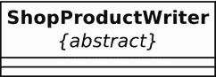

图 6-3. 使用约束定义的抽象类


图 6-2. 一个抽象类

注意：`{abstract}` 这种语法是约束的一个例子。约束在类图中用于描述特定元素应如何使用。大括号内的文本没有特殊结构；它只是简要说明可能适用于该元素的任何条件。

接口的定义方式与类相同，但接口必须包含一个构造型（即 UML 的一种扩展），如图 6-4 所示。

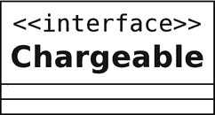

图 6-4. 一个接口

### 属性

广义上讲，属性描述了一个类的特性。属性列在类名正下方的部分中（见图 6-5）。

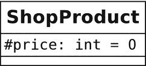

图 6-5. 一个属性

让我们仔细看看示例中的这个属性。开头的符号代表该属性的可见性级别，或称访问控制。表 6-1 显示了可用的三种符号。

表 6-1. 可见性符号

| 符号 | 可见性 | 说明 |
| --- | --- | --- |
| + | 公共（Public） | 对所有代码可用 |
| - | 私有（Private） | 仅对当前类可用 |
| # | 受保护（Protected） | 仅对当前类及其子类可用 |

可见性符号后面跟着属性的名称。在这个例子中，我描述的是 `ShopProduct::$price` 属性。冒号用于分隔属性名称与其类型（以及可选的默认值）。

再次提醒，你只需要包含为了清晰起见所必需的详细信息。

#### 操作

操作描述方法；或者更准确地说，它们描述可以在类的实例上调用的方法。图 6-6 显示了 `ShopProduct` 类中的两个操作。

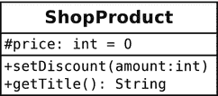

图 6-6. 操作

正如你所见，操作使用的语法与属性类似。可见性符号位于方法名之前。参数列表括在圆括号中。如果有返回类型，则用冒号分隔。参数之间用逗号分隔，并遵循属性语法，即参数名称与其类型之间用冒号分隔。

不出所料，这种语法相对灵活。你可以省略可见性标志和返回类型。参数通常仅由其类型表示，因为参数名称通常并不重要。

#### 描述继承与实现

UML 将继承关系描述为泛化（generalization）。这种关系由一条从子类指向其父类的线表示。这条线末端带有一个空心闭合箭头。

图 6-7 显示了 `ShopProduct` 类与其子类之间的关系。

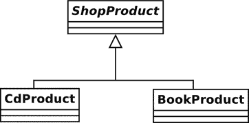

图 6-7. 描述继承

UML 将接口与实现它的类之间的关系描述为实现（realization）。因此，如果 `ShopProduct` 类实现了 `Chargeable` 接口，我们可以将其添加到我们的类图中，如图 6-8 所示。

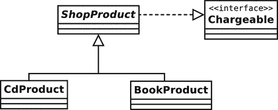

图 6-8. 描述接口实现


##### 关联

继承只是面向对象系统中众多关系中的一种。当一个类属性被声明用于持有另一个类实例（或多个实例）的引用时，就产生了关联。

在图 6-9 中，我们建模了两个类，并在它们之间创建了一个关联。


图 6-9. 类关联

在此阶段，我们对于这种关系的本质还比较模糊。我们只指定了一个`Teacher`对象将持有一个或多个`Pupil`对象的引用，反之亦然。这种关系可能是双向的，也可能不是。

你可以使用箭头来描述关联的方向。如果`Teacher`类拥有一个`Pupil`类的实例，而反过来不成立，那么你应该将关联设为从`Teacher`类指向`Pupil`类的箭头。这种称为单向关联的关系，如图 6-10 所示。


图 6-10. 单向关联

如果每个类都持有对方的引用，你可以使用双箭头来描述双向关系，如图 6-11 所示。


图 6-11. 双向关联

你还可以在关联中指定一个类所引用的另一个类的实例数量。做法是在每个类旁边放置一个数字或范围。你也可以使用星号（`*`）来表示任意数量。在图 6-12 中，可以有一个`Teacher`对象和零个或多个`Pupil`对象。


图 6-12. 定义关联的多重性

在图 6-13 中，关联中可以有一个`Teacher`对象和五到十个`Pupil`对象。

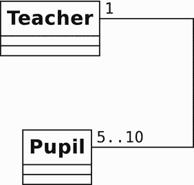

图 6-13. 定义关联的多重性

##### 聚合与组合

聚合和组合与关联类似。它们都描述了一种情况，即一个类持有一个或多个其他类实例的永久引用。不过，在聚合和组合中，被引用的实例构成了引用对象的内在组成部分。

就聚合而言，被包含的对象是容器对象的核心部分，但它们同时也可以被其他对象所包含。聚合关系用一条以空心菱形开头的线来表示。

在图 6-14 中，我定义了两个类：`SchoolClass`和`Pupil`。`SchoolClass`类聚合了`Pupil`。

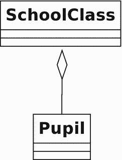

图 6-14. 聚合

学生组成了一个班级，但同一个`Pupil`对象可以同时被不同的`SchoolClass`实例引用。如果我解散了一个班级，我不一定会删除该学生，因为他可能还参加了其他班级。

组合则代表了一种比这更强的关系。在组合中，被包含的对象只能被其容器引用。当容器被删除时，它也应该被删除。组合关系的表示方式与聚合关系相同，只是菱形应该是实心的（见图 6-15）。

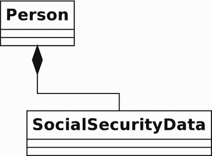

图 6-15. 组合

一个`Person`类持有一个`SocialSecurityData`对象的引用。被包含的实例只能属于包含它的`Person`对象。

##### 描述使用关系

使用关系在 UML 中被描述为依赖关系。它是本节讨论的关系中最短暂的一种，因为它并不描述类之间的永久性链接。

被使用的类可以作为参数传递，或者作为方法调用的结果而被获取。

图 6-16 中的`Report`类使用了一个`ShopProductWriter`对象。使用关系由连接两者的虚线和开口箭头表示。然而，它并不像`ShopProductWriter`对象维护一个`ShopProduct`对象数组那样，将这个引用作为属性来维持。

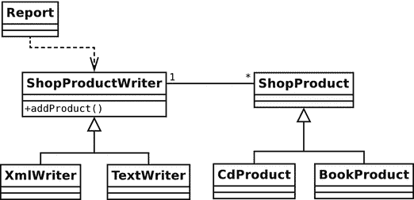

图 6-16. 依赖关系

##### 使用注释

类图可以捕捉系统的结构，但它们无法提供过程感。图 6-16 告诉了我们系统中的类。从图 6-16 中，你知道了`Report`对象使用了一个`ShopProductWriter`，但你不知道其具体机制。在图 6-17 中，我使用注释来稍微澄清一下情况。

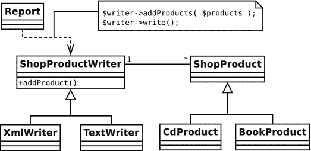

图 6-17. 使用注释澄清依赖关系

如你所见，注释由一个带有折角的方框组成。里面通常会包含一些伪代码片段。

这澄清了图 6-16；现在你可以看到`Report`对象使用`ShopProductWriter`来输出产品数据。这算不上什么惊人的发现，但使用关系并非总是如此显而易见。在某些情况下，即便是注释也可能无法提供足够的信息。幸运的是，你可以对系统中对象的交互以及类的结构进行建模。


### 顺序图

顺序图基于对象而非类，用于逐步模拟系统中的某个过程。

我们来构建一个简单的图表，模拟 `Report` 对象写入产品数据的方式。顺序图从左到右展示系统的参与者（见图 6-18）。


图 6-18. 顺序图中的对象

我仅用类名来标注对象。如果图中同一类有多个独立工作的实例，我会使用 `label:class` 格式（例如 `product1:ShopProduct`）来包含对象名称。

如图 6-19 所示，你所建模过程的生存期从上到下展示。

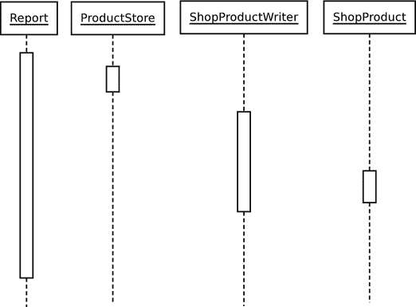

图 6-19. 顺序图中的对象生命线

垂直虚线代表系统中对象的生存期。紧随生命线的较大方框表示过程的焦点。如果从上到下阅读图 6-19，可以看到过程如何在系统对象间流转。若不显示对象间传递的消息，则难以理解。我在图 6-20 中添加了这些消息。

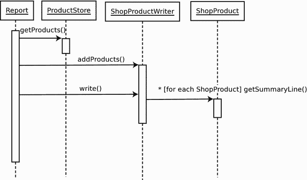

图 6-20. 完整的顺序图

箭头表示从一个对象发送到另一对象的消息。返回值通常隐含不表（尽管可以通过虚线表示，从被调用对象指向消息发起者）。每条消息使用相关的方法调用进行标注。标注方式相当灵活，但有一些语法规则。方括号表示条件：

```
[okToPrint]
write()
```

这段代码片段意味着只有在满足正确条件时，才应执行 `write()` 调用。星号用于表示重复；可选地，可在方括号内进一步说明：

```
*[for each ShopProduct]
write()
```

你可以从上到下解读图 6-20。首先，`Report` 对象从 `ProductStore` 对象获取 `ShopProduct` 对象列表。然后将这些对象传递给 `ShopProductWriter` 对象，该对象存储对它们的引用（不过我们只能从图中推断出这一点）。`ShopProductWriter` 对象为其引用的每个 `ShopProduct` 对象调用 `ShopProduct::getSummaryLine()`，并将结果添加到输出中。

如你所见，顺序图可以建模过程，冻结动态交互的片段，并以惊人的清晰度呈现它们。

> **注意：**  
> 观察图 6-16 和 6-20。注意类图如何展示多态性，显示从 `ShopProductWriter` 和 `ShopProduct` 派生的类。现在注意，当我们对对象间的通信进行建模时，这些细节变得透明。只要可能，我们希望对象与最通用的类型协作，从而隐藏实现细节。

## 总结

本章中，我超越了面向对象编程的具体细节，探讨了一些关键设计问题。我研究了封装、松散耦合和内聚等特性，这些是灵活可复用面向对象系统的基本要素。接着我讲解了 UML，为本书后续使用设计模式奠定了基础。

