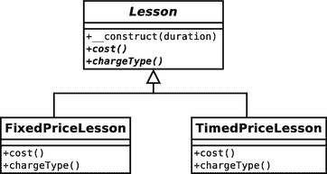
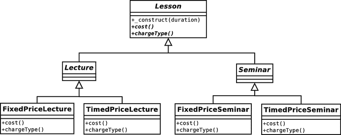
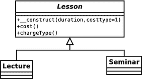
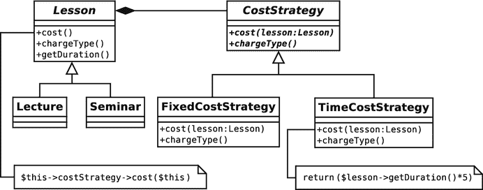
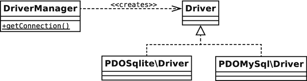
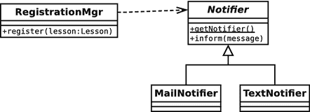

# 8. 一些模式原则

尽管设计模式只是描述问题的解决方案，但它们往往强调那些能促进可重用性和灵活性的解决方案。为了实现这一点，它们展现了一些关键的面向对象设计原则。我们将在本章中见到其中一些原则，并在本书后续部分进行更详细探讨。

本章将涵盖以下主题：

-   组合：如何使用对象聚合实现比单纯继承更大的灵活性
-   解耦：如何降低系统中元素之间的依赖关系
-   接口的力量：模式与多态性
-   模式分类：本书将涵盖的模式类型

## 模式启示录

我最初是在 Java 语言中使用对象。可以想见，某些概念花了些时间才真正理解。不过一旦开窍，进展就快得像顿悟一般。继承和封装的美妙深深震撼了我。我能感受到这是定义和构建系统的一种不同方式。我理解了多态——处理一种类型并在运行时切换实现。当时在我看来，这种理解能解决大部分设计问题，帮助我设计出优美而雅致的系统。

当时桌面上所有书籍都聚焦于语言特性以及 Java 程序员可用的众多 API。除了对多态的简要定义外，几乎没有探讨设计策略的内容。

仅凭语言特性并不能催生面向对象设计。尽管我的项目满足了功能需求，但继承、封装和多态看似许诺的那种设计却始终与我失之交臂。

当我想为每种可能情况都构建新类时，我的继承层次变得又宽又深。我的系统结构使得在层级间传递消息变得困难，要么让中间类过度了解周边环境，要么将它们绑定到应用程序中使其无法在新的上下文中使用。

直到我发现了《设计模式：可复用面向对象软件的基础》（Addison-Wesley Professional，1995 年）——也就是著名的"四人帮"（GoF）著作——我才意识到自己错过了整个设计维度。那时我虽然已经自己发现了某些核心模式，但其他模式还是帮助我形成了全新的思维方式。

我发现自己在设计中过度偏重继承，试图在类中构建过多功能。但在面向对象系统中，功能还能放在哪里呢？

我在组合中找到了答案。软件组件可以通过在运行时组合灵活关系的对象来定义。四人帮将此提炼为一条原则："优先使用组合而非继承"。这些模式描述了在运行时组合对象的方式，能达到仅靠继承树无法企及的灵活性。

### 组合与继承

继承是为应对变化场景或上下文而设计的强大方式。但它可能限制灵活性，特别是当类承担多重职责时。

### 问题所在

如你所知，子类会继承父类的方法和属性（只要它们是受保护或公开元素）。你可以利用这一点来设计提供特定功能的子类。

图 8-1 展示了使用 UML 的简单示例。



图 8-1. 一个父类与两个子类

图 8-1 中的抽象`Lesson`类对大学课程进行建模。它定义了抽象的`cost()`和`chargeType()`方法。图示展示了两个实现类：`FixedPriceLesson`和`TimedPriceLesson`，它们为课程提供不同的计费机制。

使用这种继承方案，我可以在课程实现之间切换。客户端代码只需知道它处理的是`Lesson`对象，因此费用细节是透明的。

但如果引入一组新的特化呢？我需要处理讲座和研讨会。由于它们在组织报名和课程资料方面方式不同，因此需要单独的类。现在我的设计面临两种力量：既要处理定价策略，又要区分讲座和研讨会。

图 8-2 展示了一种简单粗暴的解决方案。



图 8-2. 糟糕的继承结构

图 8-2 展示了明显有缺陷的层次结构。我再也无法通过继承树来管理定价机制，而无需重复大量功能。定价策略在`Lecture`和`Seminar`类族中镜像存在。

此时，我可能会考虑在`Lesson`超类中使用条件语句，消除这些令人遗憾的重复。本质上，我将定价逻辑完全移出继承树，将其上提至超类。这与通常的重构方向相反——通常你会用多态替换条件语句。以下是修改后的`Lesson`类：

```php
// 代码清单 08.01
abstract class Lesson
{
protected $duration;
const     FIXED = 1;
const     TIMED = 2;
private   $costtype;

public function __construct(int $duration, int $costtype = 1)
{
$this->duration = $duration;
$this->costtype = $costtype;
}

public function cost(): int
{
switch ($this->costtype) {
case self::TIMED:
return (5 * $this->duration);
break;
case self::FIXED:
return 30;
break;
default:
$this->costtype = self::FIXED;
return 30;
}
}

public function chargeType(): string
{
switch ($this->costtype) {
case self::TIMED:
return "hourly rate";
break;
case self::FIXED:
return "fixed rate";
break;
default:
$this->costtype = self::FIXED;
return "fixed rate";
}
}

// 更多课程方法...
}

// 代码清单 08.02
class Lecture extends Lesson
{
// 讲座特定实现...
}

// 代码清单 08.03
class Seminar extends Lesson
{
// 研讨会特定实现...
}
```

以下是我使用这些类的方式：

```php
// 代码清单 08.04
$lecture = new Lecture(5, Lesson::FIXED);
print "{$lecture->cost()} ({$lecture->chargeType()})\n";
$seminar = new Seminar(3, Lesson::TIMED);
print "{$seminar->cost()} ({$seminar->chargeType()})\n";
```

输出如下：

```
30 (fixed rate)
15 (hourly rate)
```

你可以在图 8-3 中看到新的类图。



图 8-3. 通过从子类中移除费用计算来改进的继承层次

我让类结构变得更容易管理，但付出了代价。在这段代码中使用条件语句是一种倒退。通常你会尝试用多态替换条件语句，而这里我反其道而行之。如你所见，这迫使我在`chargeType()`和`cost()`方法中重复了相同的条件语句。

我似乎注定了要重复代码。

#### 使用组合

我可以运用策略模式通过组合来摆脱困境。策略模式用于将一组算法转移到独立的类型中。通过移动成本计算，我可以简化`Lesson`类型。如图 8-4 所示。



图 8-4. 将算法移入独立类型

我创建了一个抽象类`CostStrategy`，它定义了抽象方法`cost()`和`chargeType()`。`cost()`方法需要接收一个`Lesson`实例，并据此生成成本数据。我为`CostStrategy`提供了两个实现。`Lesson`对象仅与`CostStrategy`类型交互，而非其具体实现，因此我随时可以通过继承`CostStrategy`来添加新的成本算法，而无需对任何`Lesson`类进行任何修改。

以下是图 8-4 中所示的新`Lesson`类的简化版本：

```php
// 清单 08.05
abstract class Lesson
{
    private $duration;
    private $costStrategy;
    public function __construct(int $duration, CostStrategy $strategy)
    {
        $this->duration = $duration;
        $this->costStrategy = $strategy;
    }
    public function cost(): int
    {
        return $this->costStrategy->cost($this);
    }
    public function chargeType(): string
    {
        return $this->costStrategy->chargeType();
    }
    public function getDuration(): int
    {
        return $this->duration;
    }
    // 更多课程方法...
}
// 清单 08.06
class Lecture extends Lesson
{
    // Lecture 特有的实现 ...
}
// 清单 08.07
class Seminar extends Lesson
{
    // Seminar 特有的实现 ...
}
```

`Lesson`类需要接收一个`CostStrategy`对象并将其存储为属性。`Lesson::cost()`方法直接调用`CostStrategy::cost()`。同样地，`Lesson::chargeType()`调用`CostStrategy::chargeType()`。这种为了完成请求而显式调用另一个对象方法的行为被称为委托。在我的示例中，`CostStrategy`对象是`Lesson`的委托对象。`Lesson`类卸下了成本计算的责任，并将其传递给一个`CostStrategy`实现。以下代码即体现了委托行为：

```php
public function cost(): int
{
    return $this->costStrategy->cost($this);
}
```

以下是`CostStrategy`类及其子类的实现：

```php
// 清单 08.08
abstract class CostStrategy
{
    abstract public function cost(Lesson $lesson): int;
    abstract public function chargeType(): string;
}
// 清单 08.09
class TimedCostStrategy extends CostStrategy
{
    public function cost(Lesson $lesson): int
    {
        return ($lesson->getDuration() * 5);
    }
    public function chargeType(): string
    {
        return "按小时收费";
    }
}
// 清单 08.10
class FixedCostStrategy extends CostStrategy
{
    public function cost(Lesson $lesson): int
    {
        return 30;
    }
    public function chargeType(): string
    {
        return "固定收费";
    }
}
```

我可以在运行时通过向任何`Lesson`对象传递不同的`CostStrategy`对象来改变其计算成本的方式。这种方法使代码变得高度灵活。与其静态地将功能构建到代码结构中，不如动态地组合和重组对象：

```php
// 清单 08.11
$lessons[] = new Seminar(4, new TimedCostStrategy());
$lessons[] = new Lecture(4, new FixedCostStrategy());
foreach ($lessons as $lesson) {
    print "课程费用 {$lesson->cost()}. ";
    print "收费类型: {$lesson->chargeType()}\n";
}
课程费用 20. 收费类型: 按小时收费
课程费用 30. 收费类型: 固定收费
```

如你所见，这种结构的一个效果是，我聚焦了各个类的职责。`CostStrategy`对象仅负责计算成本，而`Lesson`对象负责管理课程数据。

因此，组合可以使你的代码更加灵活，因为对象可以以你仅靠继承层次结构所无法预见的多种方式组合起来，动态地处理任务。不过，这可能会对可读性造成一定影响。由于组合往往会产生更多类型，且关系不像继承关系那样具有可预测的固定性，因此消化系统中的关系可能会稍微困难一些。

## 解耦

你在第 6 章中看到，构建独立的组件是合理的。一个高度相互依赖的类组成的系统将难以维护。在一处进行更改可能需要在系统中级联进行一系列相关更改。

### 问题

可重用性是面向对象设计的关键目标之一，而紧耦合则是其敌人。当你发现对系统某个组件的更改导致大量其他位置的更改时，你就可以诊断出紧耦合。你应该致力于创建独立的组件，以便在不产生意外连锁反应的情况下进行更改。当你更改一个组件时，其独立程度与你的更改导致系统其他部分失败的可能性相关。

你可以在图 8-2 中看到紧耦合的示例。由于成本逻辑在`Lecture`和`Seminar`类型之间是镜像的，因此对`TimedPriceLecture`的更改将需要对`TimedPriceSeminar`中的相同逻辑进行并行更改。如果只更新了一个类而另一个未更新，就会破坏系统——而 PHP 引擎不会发出任何警告。我使用条件语句的第一个解决方案在`cost()`和`chargeType()`方法之间产生了类似的依赖关系。

通过应用策略模式，我将成本算法提炼到`CostStrategy`类型中，将它们置于一个公共接口之后，并且每个算法只实现一次。

另一种耦合发生在系统的许多类被显式嵌入到某个平台或环境中时。例如，假设你正在构建一个与 MySQL 数据库配合使用的系统。你可能会使用`mysqli::query()`等方法与数据库服务器通信。

如果你需要将系统部署在不支持 MySQL 的服务器上，你可能需要将整个项目转换为使用 SQLite。不过，你将被迫在整个代码中进行更改，并且面临维护应用程序的两个并行版本的前景。

这里的问题不在于系统对外部平台的依赖。这种依赖是不可避免的。你需要使用与数据库通信的代码。问题在于此类代码遍布整个项目。与数据库通信并不是系统中大多数类的主要职责，因此最佳策略是将此类代码提取出来，并将其分组到公共接口之后。通过这种方式，你可以提升类的独立性。同时，通过将网关代码集中在一个地方，可以更容易地切换到新平台，而不会影响到你的整个系统。这种将实现隐藏在清晰接口背后的过程被称为封装。Doctrine 数据库库通过`DBAL`（数据库抽象层）项目解决了这个问题。它为多个数据库提供统一的访问入口。

`DriverManager`类提供了一个名为`getConnection()`的静态方法，该方法接受一个参数数组。根据该数组的构成，它会返回`Doctrine\DBAL\Driver`接口的特定实现。你可以在图 8-5 中看到类结构。



图 8-5. DBAL 包将客户端代码与数据库对象解耦

因此，`DBAL`包让你可以将应用程序代码与数据库平台的细节解耦。你应该能够使用 MySQL、SQLite、MSSQL 等运行单个系统，而无需更改任何代码（当然，配置参数除外）。

### 降低耦合度

为了灵活处理数据库代码，应将应用程序逻辑与所使用数据库平台的特性解耦。在自己的项目中，你会看到很多进行这种组件分离的机会。

例如，假设`Lesson`系统必须包含一个注册组件，用于向系统添加新课程。作为注册流程的一部分，当添加课程时，应通知管理员。系统用户无法就应通过邮件还是短信发送此通知达成一致。事实上，他们争论不休，以至于你怀疑他们将来可能想切换为新的通信方式。更麻烦的是，他们希望所有事情都能收到通知，因此对一处通知方式的更改将意味着许多其他地方也要进行类似的修改。

如果你硬编码了对`Mailer`类或`Texter`类的调用，那么你的系统就与特定的通知模式紧密耦合，就像通过使用专用的数据库 API 而与某个数据库平台紧密耦合一样。

以下是将通知程序的实现细节对使用它的系统隐藏的代码：

```
// 清单 08.12
class RegistrationMgr
{
public function register(Lesson $lesson)
{
// 处理此 Lesson
// 现在通知相关人员
$notifier = Notifier::getNotifier();
$notifier->inform("新课程：费用 ({$lesson->cost()})");
}
}
// 清单 08.13
abstract class Notifier
{
public static function getNotifier(): Notifier
{
// 根据配置或其他逻辑获取具体类
if (rand(1, 2) === 1) {
return new MailNotifier();
} else {
return new TextNotifier();
}
}
abstract public function inform($message);
}
// 清单 08.14
class MailNotifier extends Notifier
{
public function inform($message)
{
print "邮件通知：{$message}\n";
}
}
// 清单 08.15
class TextNotifier extends Notifier
{
public function inform($message)
{
print "短信通知：{$message}\n";
}
}
```

我创建了`RegistrationMgr`，作为通知程序（`Notifier`）类的一个示例客户端。`Notifier`类是抽象类，但它实现了一个静态方法`getNotifier()`，该方法会获取一个具体的`Notifier`对象（`TextNotifier`或`MailNotifier`）。在真实项目中，选择哪个`Notifier`将由灵活的机制（例如配置文件）决定。这里我偷了个懒，随机选择。`MailNotifier`和`TextNotifier`所做的只是打印出传递给它们的消息以及一个标识符，以显示哪个被调用了。

请注意，关于应该使用哪个具体`Notifier`的知识如何集中在了`Notifier::getNotifier()`方法中。我可以从系统中的数百个不同位置发送通知消息，而对通知程序的更改只需在一个方法中进行。

以下调用`RegistrationMgr`的代码：

```
// 清单 08.16
$lessons1 = new Seminar(4, new TimedCostStrategy());
$lessons2 = new Lecture(4, new FixedCostStrategy());
$mgr = new RegistrationMgr();
$mgr->register($lessons1);
$mgr->register($lessons2);
```

以下是典型运行的输出：

```
短信通知：新课程：费用 (20)
邮件通知：新课程：费用 (30)
```

图 8-6 展示了这些类。



**图 8-6.** `Notifier` 类将客户端代码与 `Notifier` 的实现分离开来

请注意，图 8-6 中的结构与图 8-5 中由 Doctrine 组件形成的结构有多么相似。

## 面向接口编程，而非面向实现编程

这一原则是本书贯穿始终的主题之一。你在第 6 章（以及上一节）中看到，可以将不同的实现隐藏在超类定义的公共接口之后。然后，客户端代码可以要求超类类型的对象，而非实现类的对象，无需关心它实际获取的是哪个具体实现。

像我从 `Lesson::cost()` 和 `Lesson::chargeType()` 中剔除的那些平行条件语句，通常表明需要用到多态性。它们使得代码难以维护，因为对一个条件表达式的更改必然导致其姊妹条件表达式的相应更改。条件语句有时被称为实现了“模拟继承”。

通过将费用算法放在实现 `CostStrategy` 的独立类中，我消除了重复。这也使得未来如果需要添加新的费用策略时更加容易。

从客户端代码的角度来看，在方法的参数中要求抽象类型或通用类型通常是个好主意。如果要求更具体的类型，可能会限制代码在运行时的灵活性。

当然，话虽如此，你在参数提示中选择的通用程度取决于判断。选择过于通用，你的方法可能会变得不够安全。如果你需要子类型的特定功能，那么接受一个装备不同的兄弟类进入方法可能会有风险。

然而，如果参数提示的选择过于受限，你就会失去多态性的好处。看看这个从 `Lesson` 类修改而来的片段：

```
// 清单 08.17
public function __construct(int $duration, FixedCostStrategy $strategy)
{
$this->duration = $duration;
$this->costStrategy = $strategy;
}
```

此示例中的设计决策引发了两个问题。首先，`Lesson` 对象现在绑定到了特定的费用策略，这限制了我组合动态组件的能力。其次，显式引用 `FixedPriceStrategy` 类迫使我维护该特定实现。

通过要求一个公共接口，我可以将 `Lesson` 对象与任何 `CostStrategy` 实现组合：

```
// 清单 08.18
public function __construct(int $duration, CostStrategy $strategy)
{
$this->duration = $duration;
$this->costStrategy = $strategy;
}
```

换句话说，我将 `Lesson` 类与费用计算的细节解耦了。重要的是接口以及所提供对象会遵守该接口的保证。

当然，面向接口编程通常只是推迟了如何实例化对象的问题。当我说一个 `Lesson` 对象可以在运行时与任何 `CostStrategy` 接口组合时，这引出了一个问题：“但是 `CostStrategy` 对象从何而来？”

当你创建一个抽象超类时，总是存在如何实例化其子类的问题。你根据什么条件选择哪个子类？这在四人组（Gang of Four）模式目录中自成一体，我将在下一章进一步探讨这个主题。

## 变化的概念

一旦设计决策被做出，解释起来很容易，但如何决定从哪里开始呢？

四人帮建议“封装变化的概念”。以我的课程示例来说，变化的概念是成本算法。成本计算不仅是示例中两种可能的策略之一，而且显然是一个有待扩展的候选：特价优惠、留学生费用、首单折扣——各种可能性层出不穷。

我很快确定，为这种变化创建子类是不合适的，于是求助于条件语句。通过将变化因素纳入同一个类，我强调了它适合被封装。

四人帮建议你主动在类中寻找变化元素，并评估它们是否适合被封装成新的类型。一个可疑条件中的每个分支都可以被提取出来，形成一个继承自共同抽象父类的类。这个新类型随后可以被它被提取出来的类（或那些类）所使用。这会带来以下效果：

- 集中职责
- 通过组合提升灵活性
- 使继承层次结构更加紧凑和专注
- 减少重复

那么，如何发现变化？一个标志是继承的误用。这可能包括根据多股力量同时部署继承（例如，讲座/研讨会 和 固定/按时间计费 成本）。也可能包括为某个算法创建子类，而该算法对于该类型的核心职责来说是次要的。另一个适合封装的变化标志，正如你所见，是条件表达式。

## 模式病

有一个问题没有对应的模式，那就是模式的不必要或不恰当使用。这使模式在某些圈子里名声不佳。由于模式解决方案很简洁，人们很容易在认为合适的地方应用它们，无论它们是否真正满足需求。

极限编程方法论提供了两个可能适用于此的原则。第一个是“你并不需要它”（常缩写为 YAGNI）。这通常应用于应用程序特性，但对模式也同样适用。

当我在 PHP 中构建大型环境时，我倾向于将应用程序分层，将应用逻辑与表示层和持久化层分离。我会将各种核心模式和企业模式相互结合使用。

然而，当我被要求为一个小型企业网站构建一个反馈表单时，我可能仅仅在单个页面脚本中使用过程式代码。我并不需要极大的灵活性；我不会在初始版本的基础上进行大量扩展。我不需要使用那些针对大型系统问题的模式。相反，我应用第二个 XP 原则：“做最简单可行的事情。”

当你使用模式目录时，解决方案的结构和过程会印在脑海中，并通过代码示例得到巩固。不过，在应用一个模式之前，要密切关注“问题”或“何时使用”部分，然后阅读该模式的副作用。在某些上下文中，治疗方法可能比疾病本身更糟糕。

## 这些模式

本书并非模式目录。尽管如此，在接下来的章节中，我将介绍当前正在使用的一些关键模式，提供 PHP 实现，并在 PHP 编程的广泛背景下讨论它们。

所描述的模式将来自一些关键目录，包括《设计模式：可复用面向对象软件的基础》、Martin Fowler 的《企业应用架构模式》（Addison-Wesley Professional, 2002）以及 Alur 等人合著的《Core J2EE 模式：最佳实践和设计策略》（Prentice Hall, 2001）。我以四人帮的分类作为起点，将模式分为以下五大类。

### 生成对象的模式

这些模式与对象的实例化有关。鉴于“针对接口编程”这一原则，这是一个重要的类别。如果你在设计中使用抽象父类，那么你必须制定从具体子类实例化对象的策略。正是这些对象会在你的系统中被传递。

### 组织对象和类的模式

这些模式帮助你组织对象的组合关系。更简单地说，这些模式展示了如何组合对象和类。

### 面向任务的模式

这些模式描述了类和对象为达成目标而协作的机制。

### 企业模式

我研究了一些描述典型互联网编程问题及解决方案的模式。这些模式主要借鉴自《企业应用架构模式》和《Core J2EE 模式：最佳实践和设计策略》，涉及表示层和应用逻辑层。

### 数据库模式

考察有助于存储和检索数据，以及在数据库之间和从数据库映射对象的模式。

## 总结

在本章中，我审视了支撑许多设计模式的一些原则。我探讨了如何使用组合在运行时实现对象的组合与重组，从而产生比仅使用继承更灵活的结构。我还向你介绍了解耦，即将软件组件从其上下文中提取出来，使其更具通用性的实践。最后，我重申了接口作为将客户端与实现细节解耦手段的重要性。

在接下来的章节中，我将详细研究一些设计模式。