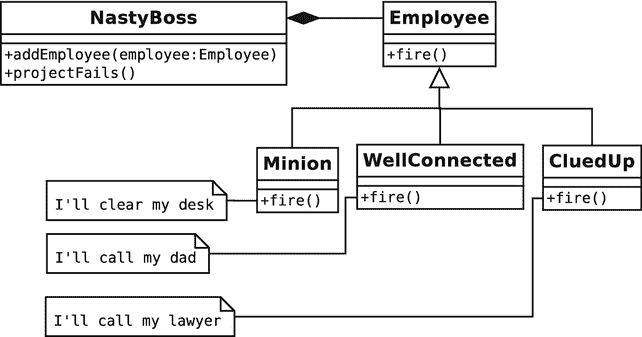
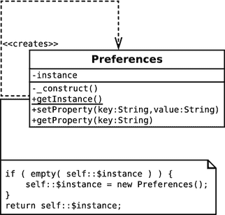
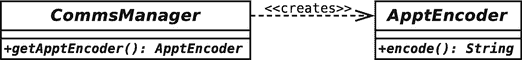
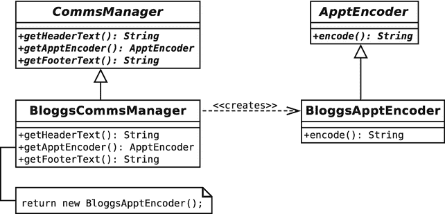
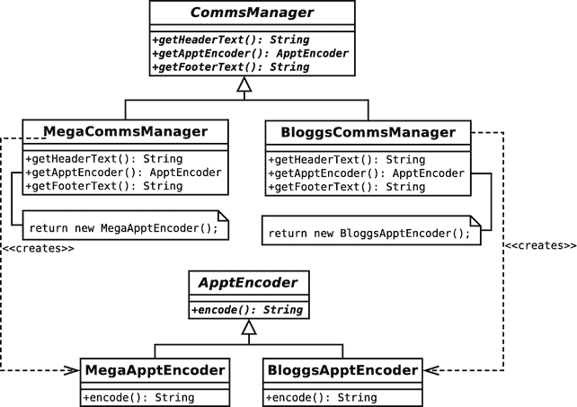
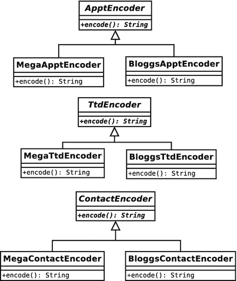
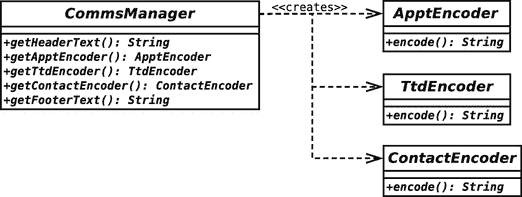
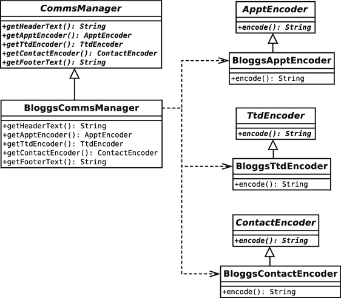
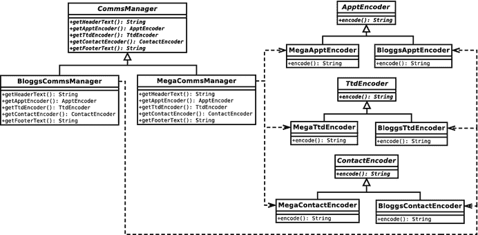
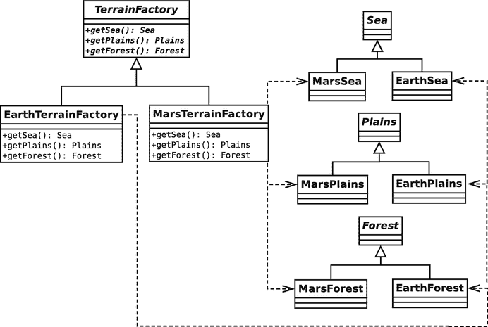

# 9. 生成对象

创建对象是一项复杂的工作。因此，许多面向对象的设计都处理漂亮、干净的抽象类，利用多态性（在运行时切换具体实现）所提供的惊人灵活性。然而，为了实现这种灵活性，我必须设计对象生成的策略。这就是本章要探讨的主题。

本章将涵盖以下模式：

- 单例模式：一个特殊的类，它生成且仅生成一个对象实例
- 工厂方法模式：构建创建者类的继承层次结构
- 抽象工厂模式：将功能相关的产品族创建过程分组
- 原型模式：使用 `clone` 生成对象
- 服务定位器模式：向你的系统请求对象
- 依赖注入模式：让你的系统为你提供对象


## 对象生成中的问题与解决方案

对象创建可能是面向对象设计中的薄弱环节。在上一章中，你看到了一个原则：“针对接口编程，而非针对实现”。为此，我们鼓励你在类中使用抽象超类型。这能使代码更灵活，允许你在运行时使用从不同具体子类实例化的对象。这带来一个副作用，即对象实例化被推迟了。

下面是一个类，它接收一个名称字符串并实例化一个特定对象：

```
// 清单 09.01
abstract class Employee
{
    protected $name;
    public function __construct(string $name)
    {
        $this->name = $name;
    }
    abstract public function fire();
}
// 清单 09.02
class Minion extends Employee
{
    public function fire()
    {
        print "{$this->name}: I'll clear my desk\n";
    }
}
// 清单 09.03
class NastyBoss
{
    private $employees = [];
    public function addEmployee(string $employeeName)
    {
        $this->employees[] = new Minion($employeeName);
    }
    public function projectFails()
    {
        if (count($this->employees) > 0) {
            $emp = array_pop($this->employees);
            $emp->fire();
        }
    }
}
// 清单 09.04
$boss = new NastyBoss();
$boss->addEmployee("harry");
$boss->addEmployee("bob");
$boss->addEmployee("mary");
$boss->projectFails();
mary: I'll clear my desk
```

如你所见，我定义了一个抽象基类 `Employee`，以及一个被压迫的实现类 `Minion`。给定一个名称字符串，`NastyBoss::addEmployee()` 方法会实例化一个新的 `Minion` 对象。每当一个 `NastyBoss` 对象遇到麻烦时（通过 `NastyBoss::projectFails()` 方法），它就会找一个 `Minion` 来解雇。

通过在 `NastyBoss` 类中直接实例化 `Minion` 对象，我们限制了灵活性。如果一个 `NastyBoss` 对象能与任何 `Employee` 类型的实例协作，我们就可以让代码在运行时随着更多 `Employee` 特化类的加入而适应变化。你应该已经对图 9-1 中的多态性感到熟悉。



**图 9-1.** 使用抽象类型实现多态

如果 `NastyBoss` 类不实例化 `Minion` 对象，这些对象从何而来？作者们常常通过限定方法声明中的参数类型，然后巧妙地省略测试环境之外的实例化过程来回避这个问题：

```
// 清单 09.05
class NastyBoss
{
    private $employees = [];
    public function addEmployee(Employee $employee)
    {
        $this->employees[] = $employee;
    }
    public function projectFails()
    {
        if (count($this->employees)) {
            $emp = array_pop($this->employees);
            $emp->fire();
        }
    }
}
// 清单 09.06
// new Employee class...
class CluedUp extends Employee
{
    public function fire()
    {
        print "{$this->name}: I'll call my lawyer\n";
    }
}
// 清单 09.07
$boss = new NastyBoss();
$boss->addEmployee(new Minion("harry"));
$boss->addEmployee(new CluedUp("bob"));
$boss->addEmployee(new Minion("mary"));
$boss->projectFails();
$boss->projectFails();
$boss->projectFails();
mary: I'll clear my desk
bob: I'll call my lawyer
harry: I'll clear my desk
```

尽管这个版本的 `NastyBoss` 类与 `Employee` 类型协作，并因此受益于多态，我仍然没有定义对象创建的策略。实例化对象是件麻烦事，但又不得不做。本章将介绍与具体类协作的类和对象，从而让其他类无需处理这些问题。

如果存在一条原则，那就是“委托对象实例化”。在前面的例子中，我通过要求将 `Employee` 对象传递给 `NastyBoss::addEmployee()` 方法隐式地实现了这一点。然而，我同样可以将此职责委托给一个单独的类或方法，由其负责生成 `Employee` 对象。这里我为 `Employee` 类添加了一个静态方法，实现了对象创建的策略：

```
// 清单 09.08
abstract class Employee
{
    protected $name;
    private static $types = ['Minion', 'CluedUp', 'WellConnected'];
    public static function recruit(string $name)
    {
        $num = rand(1, count(self::$types)) - 1;
        $class = __NAMESPACE__ . "\\".self::$types[$num];
        return new $class($name);
    }
    public function __construct(string $name)
    {
        $this->name = $name;
    }
    abstract public function fire();
}
// 清单 09.09
// new Employee class...
class WellConnected extends Employee
{
    public function fire()
    {
        print "{$this->name}: I'll call my dad\n";
    }
}
```

如你所见，这个方法接收一个名称字符串，并随机实例化一个特定的 `Employee` 子类型。现在，我可以将实例化的细节委托给 `Employee` 类的 `recruit()` 方法：

```
// 清单 09.10
$boss = new NastyBoss();
$boss->addEmployee(Employee::recruit("harry"));
$boss->addEmployee(Employee::recruit("bob"));
$boss->addEmployee(Employee::recruit("mary"));
```

你在第 4 章中已经见过这样一个简单的例子。我在 `ShopProduct` 类中放置了一个名为 `getInstance()` 的静态方法。

> **注意：** 本章中我会频繁使用“工厂”这个词。工厂是一个负责生成对象的类或方法。

`getInstance()` 负责根据数据库查询生成正确的 `ShopProduct` 子类。因此，`ShopProduct` 类扮演了双重角色。它定义了 `ShopProduct` 类型，同时也充当了具体 `ShopProduct` 对象的工厂：

```
public static function getInstance(int $id, PDO $pdo): ShopProduct
{
    $stmt = $pdo->prepare("select * from products where id=?");
    $result = $stmt->execute([$id]);
    $row = $stmt->fetch();
    if (empty($row)) {
        return null;
    }
    if ($row['type'] == "book") {
        // instantiate a BookProduct object
    } elseif ($row['type'] == "cd") {
        // instantiate a CdProduct object
    } else {
        // instantiate a ShopProduct object
    }
    $product->setId($row['id']);
    $product->setDiscount($row['discount']);
    return $product;
}
```

`getInstance()` 方法使用一个大型的 `if/else` 语句来决定实例化哪个子类。这样的条件判断在工厂代码中很常见。尽管你应该尝试从项目中移除大型条件语句，但这样做通常会将条件判断推回到对象生成的那一刻。这通常不是一个严重的问题，因为通过将决策回推至此，你从代码中消除了并行的条件语句。

因此，在本章中，我将探讨一些用于生成对象的经典“四人帮”设计模式。


### 单例模式

全局变量是面向对象程序员最头疼的问题之一。其缘由你现在应该已经很熟悉了。全局变量会将类与其上下文环境绑定，从而破坏封装性（关于这一点，请参考第 6 章“对象与设计”和第 8 章“一些模式原则”）。如果一个类依赖于全局变量，那么在不首先确保新应用程序也定义了相同全局变量的前提下，它几乎无法从一个应用程序中提取出来并在另一个应用程序中使用。

尽管这本身并不可取，但全局变量的无保护特性可能是一个更严重的问题。一旦你开始依赖全局变量，你的某个库声明的一个全局变量与别处声明的另一个全局变量发生冲突，可能只是时间问题。你已经知道，如果不使用命名空间，PHP 很容易发生类名冲突。但全局变量的冲突要糟糕得多。当全局变量冲突时，PHP 不会给你任何警告。你最先察觉到问题将是在你的脚本开始出现异常行为时。更糟糕的是，在你的开发环境中你可能根本注意不到任何问题。然而，通过使用全局变量，你可能会让你的用户在尝试将你的库与其他库一同部署时，暴露在新的、有趣的冲突面前。

尽管如此，全局变量仍然是一种诱惑。这是因为，有时全局访问所带来的固有弊端，似乎也值得付出代价，以便让你所有的类都能访问到一个对象。

正如我提到的，命名空间对此提供了一些保护。你至少可以将变量限定在一个包的作用域内，这意味着第三方库与你的系统发生冲突的可能性更低。即便如此，在命名空间内部仍然存在冲突的风险。

### 问题

设计良好的系统通常通过方法调用来传递对象实例。每个类都保持其相对于更广泛上下文的独立性，并通过清晰的通信线路与系统的其他部分协作。然而，有时你会发现，这迫使你将某些类用作传递它们并不关心的对象的管道，从而以良好设计的名义引入了依赖关系。

想象一个保存应用程序级别信息的 `Preferences` 类。我们可能会使用一个 `Preferences` 对象来存储诸如 DSN 字符串（数据源名称包含数据库的表和用户信息）、URL 根目录、文件路径等数据。这类信息会因不同的安装环境而异。该对象也可以被用作一个公告板，系统内其他不相关的对象可以在此设置或检索消息。

将一个 `Preferences` 对象从一个对象传递到另一个对象并不总是一个好主意。许多本来不使用该对象的类可能被迫接受它，仅仅是为了能将这个对象传递给它们协作的对象。这不过是另一种耦合。

你还需要确保系统中的所有对象都在使用同一个 `Preferences` 对象。你不希望一些对象在一个对象上设置值，而其他对象却从一个完全不同的对象上读取值。

让我们提炼一下这个问题中的核心要素：

*   系统中的任何对象都应该能够访问到一个 `Preferences` 对象。
*   `Preferences` 对象不应存储在可能被覆盖的全局变量中。
*   系统中应该只有一个 `Preferences` 对象在起作用。这意味着对象 Y 可以在这个 `Preferences` 对象中设置一个属性，而对象 Z 可以检索到同一个属性，且两者无需直接通信（假设两者都能访问到这个 `Preferences` 对象）。

### 实现

为了解决这个问题，我可以从控制对象的实例化入手。这里，我创建了一个无法从自身外部实例化的类。这听起来可能有些困难，但其实只需定义一个私有构造函数即可：

```
class Preferences
{
private $props = [];
private function __construct()
{
}
public function setProperty(string $key, string $val)
{
$this->props[$key] = $val;
}
public function getProperty(string $key): string
{
return $this->props[$key];
}
}
```

当然，此时 `Preferences` 类完全无法使用。我将访问限制发挥到了荒谬的程度。因为构造函数被声明为 `private`，没有任何客户端代码能从中实例化一个对象。因此 `setProperty()` 和 `getProperty()` 方法成了摆设。

我可以使用一个静态方法和一个静态属性来协调对象的实例化：

```
// listing 09.11
class Preferences
{
private $props = [];
private static $instance;
private function __construct()
{
}
public static function getInstance()
{
if (empty(self::$instance)) {
self::$instance = new Preferences();
}
return self::$instance;
}
public function setProperty(string $key, string $val)
{
$this->props[$key] = $val;
}
public function getProperty(string $key): string
{
return $this->props[$key];
}
}
```

`$instance` 属性是私有且静态的，所以无法从类外部访问。但 `getInstance()` 方法可以访问它。由于 `getInstance()` 是公有且静态的，它可以通过该类从脚本的任何地方被调用：

```
// listing 09.12
$pref = Preferences::getInstance();
$pref->setProperty("name", "matt");
unset($pref); // 移除引用
$pref2 = Preferences::getInstance();
print $pref2->getProperty("name") ."\n"; // 演示值并未丢失
```

输出结果是我们最初添加到 `Preferences` 对象的唯一值，它可以通过另一个独立的访问点获取：

```
matt
```

静态方法无法访问对象属性，因为根据定义，它是在类上下文中而非对象上下文中调用的。但它可以访问静态属性。当 `getInstance()` 被调用时，我检查 `Preferences::$instance` 属性。如果它为空，我就创建一个 `Preferences` 类的实例并将其存储在属性中。然后我将该实例返回给调用代码。因为静态方法 `getInstance()` 是 `Preferences` 类的一部分，尽管构造函数是私有的，我仍然可以毫无问题地实例化一个 `Preferences` 对象。

图 9-2 展示了单例模式。



**图 9-2.** 单例模式示例

### 结果

那么，单例方法与使用全局变量相比如何呢？首先，坏消息是：单例和全局变量都容易被滥用。由于单例可以从系统的任何地方访问，它们可能会创建难以调试的依赖关系。改变一个单例，使用它的类就可能受到影响。依赖关系本身并不是问题。毕竟，每当我们声明一个方法需要特定类型的参数时，我们就在创建依赖关系。问题在于，单例的全局性使得程序员可以绕过由类接口定义的通信线路。当使用单例时，依赖关系隐藏在方法内部，并未在其签名中声明。这会增加追踪系统内部关系的难度。因此，单例类应该谨慎且有节制地使用。

尽管如此，我认为适度使用单例模式可以改善系统的设计，让你免于在系统中不必要地传递对象而带来的各种别扭。

在面向对象的上下文中，单例模式代表了对全局变量的一种改进。你不能用错误类型的数据覆盖一个单例。


## 工厂方法模式

面向对象设计强调抽象类而非具体实现。也就是说，它侧重于泛化而非特化。当你的代码聚焦于抽象类型时，`工厂方法`模式解决了如何创建对象实例的问题。答案是什么？让专门的类来处理实例化。

### 问题

设想一个个人日程管理项目，它管理`Appointment`对象以及其他对象类型。你的业务团队与另一家公司建立了合作关系，你必须使用一种名为 BloggsCal 的格式与其通信日程数据。不过，业务团队警告你，随着时间的推移，你可能还会遇到更多格式。

仅停留在接口层面，你可以立即识别出两个参与者。你需要一个数据编码器，将你的`Appointment`对象转换为专有格式。我们称这个类为`ApptEncoder`。你需要一个管理器类，用于获取编码器，并可能与其协作与第三方通信。你可以称之为`CommsManager`。使用该模式的术语，`CommsManager`是创建者，而`ApptEncoder`是产品。你可以在图 9-3 中看到这种结构。



图 9-3. 抽象创建者和产品类

然而，你如何获得一个具体的`ApptEncoder`对象呢？

你可以要求将`ApptEncoder`传递给`CommsManager`，但这只是推迟了你的问题，而你希望责任到此为止。这里我直接在`CommsManager`类中实例化了一个`BloggsApptEncoder`对象：

```
// listing 09.13
abstract class ApptEncoder
{
abstract public function encode(): string;
}
// listing 09.14
class BloggsApptEncoder extends ApptEncoder
{
public function encode(): string
{
return "Appointment data encoded in BloggsCal format\n";
}
}
// listing 09.15
class MegaApptEncoder extends ApptEncoder
{
public function encode(): string
{
return "Appointment data encoded in MegaCal format\n";
}
}
// listing 09.16
class CommsManager
{
public function getApptEncoder(): ApptEncoder
{
return new BloggsApptEncoder();
}
}
```

`CommsManager`类负责生成`BloggsApptEncoder`对象。当企业忠诚的潮汐不可避免地转变，我们被要求将系统转换为支持一种名为 MegaCal 的新格式时，我们可以简单地在`CommsManager::getApptEncoder()`方法中添加一个条件判断。毕竟，这是我们过去使用的策略。让我们构建一个新的`CommsManager`实现，它同时处理 BloggsCal 和 MegaCal 格式：

```
// listing 09.17
class CommsManager
{
const BLOGGS = 1;
const MEGA = 2;
private $mode;
public function __construct(int $mode)
{
$this->mode = $mode;
}
public function getApptEncoder(): ApptEncoder
{
switch ($this->mode) {
case (self::MEGA):
return new MegaApptEncoder();
default:
return new BloggsApptEncoder();
}
}
}
// listing 09.18
$man = new CommsManager(CommsManager::MEGA);
print (get_class($man->getApptEncoder())) . "\n";
$man = new CommsManager(CommsManager::BLOGGS);
print (get_class($man->getApptEncoder())) . "\n";
```

我使用常量标志来定义脚本可能运行的两种模式：`MEGA`和`BLOGGS`。我在`getApptEncoder()`方法中使用`switch`语句来测试`$mode`属性，并实例化`ApptEncoder`的适当实现。

这种方法几乎没有问题。条件语句有时被认为是糟糕的"代码坏味道"，但对象创建在某个时刻通常需要条件判断。如果你发现代码中出现了重复的条件语句，就不应该那么乐观了。`CommsManager`类提供了通信日历数据的功能。想象一下，你使用的协议要求你提供页眉和页脚数据来界定每个日程。我可以扩展前面的例子来支持`getHeaderText()`方法：

```
// listing 09.19
class CommsManager
{
const BLOGGS = 1;
const MEGA = 2;
private $mode;
public function __construct(int $mode)
{
$this->mode = $mode;
}
public function getApptEncoder(): ApptEncoder
{
switch ($this->mode) {
case (self::MEGA):
return new MegaApptEncoder();
default:
return new BloggsApptEncoder();
}
}
public function getHeaderText(): string
{
switch ($this->mode) {
case (self::MEGA):
return "MegaCal header\n";
default:
return "BloggsCal header\n";
}
}
}
```

如你所见，支持页眉输出的需求迫使我复制了协议条件测试。随着我添加新协议，这将变得笨重不堪，尤其是如果我还要添加`getFooterText()`方法。

那么，让我们总结一下目前的问题：

-   在运行时之前，我不知道需要生成哪种类型的对象（`BloggsApptEncoder`或`MegaApptEncoder`）
-   我需要能够相对容易地添加新的产品类型（支持 SyncML 只是一笔新业务交易的距离！）
-   每个产品类型都与一个需要其他定制化操作的上下文相关联（例如，`getHeaderText()`、`getFooterText()`）

此外，我使用了条件语句，而你已经看到，这些语句自然可以被多态取代。工厂方法模式使你能够使用继承和多态来封装具体产品的创建。换句话说，你为每个协议创建一个`CommsManager`子类，每个子类都实现`getApptEncoder()`方法。

### 实现

工厂方法模式将创建者类与它们设计要生成的产品类分离开来。创建者是一个工厂类，它定义了一种生成产品对象的方法。如果没有提供默认实现，则由创建者的子类来执行实例化。通常，每个创建者子类实例化一个并行的产品子类。

我可以将`CommsManager`重新定义为抽象类。这样，我就保持了一个灵活的父类，并将所有特定于协议的代码放在具体子类中。你可以在图 9-4 中看到这种变化。



图 9-4. 具体创建者和产品类

以下是一些简化的代码：

```
// listing 09.20
abstract class ApptEncoder
{
abstract public function encode(): string;
}
// listing 09.21
class BloggsApptEncoder extends ApptEncoder
{
public function encode(): string
{
return "Appointment data encode in BloggsCal format\n";
}
}
// listing 09.22
abstract class CommsManager
{
abstract public function getHeaderText(): string;
abstract public function getApptEncoder(): ApptEncoder;
abstract public function getFooterText(): string;
}
// listing 09.23
class BloggsCommsManager extends CommsManager
{
public function getHeaderText(): string
{
return "BloggsCal header\n";
}
public function getApptEncoder(): ApptEncoder
{
return new BloggsApptEncoder();
}
public function getFooterText(): string
{
return "BloggsCal footer\n";
}
}
// listing 09.24
$mgr = new BloggsCommsManager();
print $mgr->getHeaderText();
print $mgr->getApptEncoder()->encode();
print $mgr->getFooterText();
BloggsCal header
Appointment data encode in BloggsCal format
BloggsCal footer
```

因此，当我需要实现 MegaCal 时，支持它只需为我的抽象类编写一个新的实现。图 9-5 显示了 MegaCal 类。



图 9-5. 扩展设计以支持新协议


### 后果

请注意，创建者类与产品层次结构是相互对应的。这是工厂方法模式的一个常见后果，一些人将其视为一种特殊的代码重复而对此并不认同。另一个问题是，该模式可能会鼓励不必要的子类化。如果你子类化一个创建者的唯一理由是部署工厂方法模式，那么你可能需要重新考虑（这就是为什么我在示例中引入了页眉和页脚的约束）。

我的示例中只关注了日程安排。如果我将它扩展到包含待办事项和联系人，就会面临一个新的问题。我需要一个能够一次性处理一组相关实现的结构。工厂方法模式常常与抽象工厂模式一起使用，你将在下一节中看到这一点。

## 抽象工厂模式

在大型应用中，你可能需要能够生成相关类集合的工厂。抽象工厂模式解决了这个问题。

### 问题

让我们再看一下日程组织器示例。我管理着两种编码格式：`BloggsCal` 和 `MegaCal`。我可以水平扩展这个结构，增加更多的编码格式，但我该如何垂直扩展，为不同类型的 PIM 对象添加编码器呢？事实上，我已经在朝着这个模式努力了。

在图 9-6 中，你可以看到我将要处理的并行族。它们是日程安排（`Appt`）、待办事项（`Ttd`）和联系人（`Contact`）。



图 9-6. 三个产品族

`BloggsCal` 类彼此之间没有继承关系（尽管它们可以实现一个通用接口），但它们在功能上是并行的。如果系统当前正在使用 `BloggsTtdEncoder`，那么它也应该使用 `BloggsContactEncoder`。

为了了解如何强制实现这一点，你可以从接口开始，就像我在工厂方法模式中所做的那样（见图 9-7）。



图 9-7. 一个抽象创建者及其抽象产品

### 实现

抽象的 `CommsManager` 类定义了生成三个产品（`ApptEncoder`、`TtdEncoder` 和 `ContactEncoder`）的接口。你需要实现一个具体的创建者，以便为特定族实际生成具体的产品。我在图 9-8 中针对 `BloggsCal` 格式说明了这一点。



图 9-8. 添加一个具体的创建者和一些具体的产品

以下是 `CommsManager` 和 `BloggsCommsManager` 的代码版本：

```
// 清单 09.25
abstract class CommsManager
{
abstract public function getHeaderText(): string;
abstract public function getApptEncoder(): ApptEncoder;
abstract public function getTtdEncoder(): TtdEncoder;
abstract public function getContactEncoder(): ContactEncoder;
abstract public function getFooterText(): string;
}
// 清单 09.26
class BloggsCommsManager extends CommsManager
{
public function getHeaderText(): string
{
return "BloggsCal header\n";
}
public function getApptEncoder(): ApptEncoder
{
return new BloggsApptEncoder();
}
public function getTtdEncoder(): TtdEncoder
{
return new BloggsTtdEncoder();
}
public function getContactEncoder(): ContactEncoder
{
return new BloggsContactEncoder();
}
public function getFooterText(): string
{
return "BloggsCal footer\n";
}
}
```

请注意，我在这个示例中使用了工厂方法模式。`getContactEncoder()` 在 `CommsManager` 中是抽象的，并在 `BloggsCommsManager` 中被实现。设计模式通常以这种方式协同工作，一种模式创造出的上下文有利于另一种模式的应用。在图 9-9 中，我添加了对 `MegaCal` 格式的支持。



图 9-9. 添加具体的创建者和一些具体的产品

### 后果

那么，让我们看看这种模式带来了什么好处：

*   首先，我将系统与实现细节解耦了。在我的示例中，我可以添加或移除任意数量的编码格式，而不会引起连锁反应。
*   我强制将系统中功能相关的元素进行分组。因此，通过使用 `BloggsCommsManager`，我保证了只会使用与 `BloggsCal` 相关的类。
*   添加新产品可能会很麻烦。我不仅需要创建新产品的具体实现，还必须修改抽象的创建者及其每一个具体实现者来支持它。

抽象工厂模式的许多实现都使用了工厂方法模式。这可能是因为大多数示例都是用 Java 或 C++ 编写的。然而，PHP 不必强制为方法规定返回类型（尽管现在它可以做到了），这为我们提供了一些可以利用的灵活性。

与其为每个工厂方法创建单独的方法，不如创建一个单一的 `make()` 方法，它使用一个标志参数来决定返回哪个对象：

```
// 清单 09.27
interface Encoder
{
public function encode(): string;
}
// 清单 09.28
abstract class CommsManager
{
const APPT    = 1;
const TTD     = 2;
const CONTACT = 3;
abstract public function getHeaderText(): string;
abstract public function make(int $flag_int): Encoder;
abstract public function getFooterText(): string;
}
// 清单 09.29
class BloggsCommsManager extends CommsManager
{
public function getHeaderText(): string
{
return "BloggsCal header\n";
}
public function make(int $flag_int): Encoder
{
switch ($flag_int) {
case self::APPT:
return new BloggsApptEncoder();
case self::CONTACT:
return new BloggsContactEncoder();
case self::TTD:
return new BloggsTtdEncoder();
}
}
public function getFooterText(): string
{
return "BloggsCal footer\n";
}
}
```

如你所见，我使得类接口更加紧凑。不过，为此我付出了相当大的代价。在使用工厂方法时，我定义了一个清晰的接口，并强制所有具体的工厂对象都遵守它。而在使用单一的 `make()` 方法时，我必须记住在所有具体的创建者中支持所有产品对象。我同时还引入了并行的条件判断，因为每个具体的创建者都必须实现相同的标志测试。客户端类无法确定具体的创建者是否生成了所有产品，因为 `make()` 的内部实现在每种情况下都是可选择的。

另一方面，我可以构建更灵活的创建者。基类创建者可以提供一个 `make()` 方法，保证每个产品族都有一个默认的实现。具体的子类可以有选择地修改这种行为。具体的创建者类可以在提供自己的实现之后，再调用默认的 `make()` 方法。

你将在下一节看到抽象工厂模式的另一种变体。

### 原型模式

并行继承层次结构的出现可能是工厂方法模式的一个问题。这是一种让某些程序员感到不适的耦合。每次你添加一个产品族，都不得不创建一个关联的具体创建者（例如，`BloggsCal` 编码器由 `BloggsCommsManager` 匹配）。在一个增长迅速、包含众多产品的系统中，维护这种关系很快就会变得令人厌烦。

避免这种依赖关系的一种方法是使用 PHP 的 `clone` 关键字来复制现有的具体产品。这样，具体产品类本身就成为了它们自己生成的基础。这就是原型模式。它允许你用组合替代继承。这反过来又促进了运行时灵活性，并减少了你必须创建的类的数量。


### 问题

想象一下，一款类似《文明》风格的网页游戏，其中的单位在由方块组成的网格上行动。每个方块可以代表海洋、平原或森林。地形类型会限制占据该方块单位的移动和战斗能力。你可能会有一个 `TerrainFactory` 对象，用于提供 `Sea`、`Forest` 和 `Plains` 对象。你决定允许用户在不同环境间进行选择，因此 `Sea` 对象是一个抽象超类，由 `MarsSea` 和 `EarthSea` 实现。`Forest` 和 `Plains` 对象也以类似方式实现。这里的逻辑关系很自然地导向了抽象工厂模式。你拥有不同的产品层级结构（`Sea`、`Plains`、`Forests`），并且存在跨越继承关系的强大家族关联（`Earth`、`Mars`）。图 9-10 展示了一个类图，说明了如何应用抽象工厂模式和工厂方法模式来操作这些产品。



图 9-10. 使用抽象工厂方法处理地形

如你所见，我依靠继承来对工厂将要生成的产品进行地形族群分组。这是一个可行的方案，但它需要庞大的继承层级结构，并且相对缺乏灵活性。当你不想使用平行的继承层级，且需要最大化运行时灵活性时，可以在抽象工厂模式的基础上使用原型模式进行强大的变体应用。

### 实现

当你使用抽象工厂/工厂方法模式时，必须在某个时间点决定使用哪个具体创建者，可能需要通过检查某种偏好标志来实现。既然无论如何都必须这么做，为什么不直接创建一个存储具体产品的工厂类，并在初始化时填充这些产品呢？这样你可以减少几个类，并且正如你将看到的，还能获得其他好处。以下是一些在工厂中使用原型模式的简单代码：

```
class Sea
{
}
class EarthSea extends Sea
{
}
class MarsSea extends Sea
{
}
class Plains
{
}
class EarthPlains extends Plains
{
}
class MarsPlains extends Plains
{
}
class Forest
{
}
class EarthForest extends Forest
{
}
class MarsForest extends Forest
{
}
```

```
class TerrainFactory
{
    private $sea;
    private $forest;
    private $plains;
    public function __construct(Sea $sea, Plains $plains, Forest $forest)
    {
        $this->sea = $sea;
        $this->plains = $plains;
        $this->forest = $forest;
    }
    public function getSea(): Sea
    {
        return clone $this->sea;
    }
    public function getPlains(): Plains
    {
        return clone $this->plains;
    }
    public function getForest(): Forest
    {
        return clone $this->forest;
    }
}
```

```
$factory = new TerrainFactory(
    new EarthSea(),
    new EarthPlains(),
    new EarthForest()
);
print_r($factory->getSea());
print_r($factory->getPlains());
print_r($factory->getForest());
```

```
popp\ch09\batch11\EarthSea Object
(
)
popp\ch09\batch11\EarthPlains Object
(
)
popp\ch09\batch11\EarthForest Object
(
)
```

如你所见，我向一个具体的 `TerrainFactory` 对象中加载了产品对象的实例。当客户端调用 `getSea()` 时，我返回的是初始化时缓存的那个 `Sea` 对象的克隆。这种结构带来了额外的灵活性。想在一个新星球上玩游戏，这个星球有类似地球的海洋和森林，但平原像火星？无需编写新的创建者类——只需更改添加到 `TerrainFactory` 的类组合即可：

```
$factory = new TerrainFactory(
    new EarthSea(),
    new MarsPlains(),
    new EarthForest()
);
```

因此，原型模式让你能够利用组合带来的灵活性。但我们得到的还不止这些。因为你在运行时存储和克隆对象，所以在生成新产品时，你会复制对象的状态。想象一下，`Sea` 对象有一个 `$navigability` 属性。该属性影响海洋方块从船只中消耗的移动能量，并且可以调整以改变游戏的难度级别：

```
class Sea
{
    private $navigability = 0;
    public function __construct(int $navigability)
    {
        $this->navigability = $navigability;
    }
}
```

现在，当我初始化 `TerrainFactory` 对象时，我可以添加一个带有可航行性修饰符的 `Sea` 对象。随后，这个修饰符将对 `TerrainFactory` 提供的所有 `Sea` 对象生效：

```
$factory = new TerrainFactory(
    new EarthSea(-1),
    new EarthPlains(),
    new EarthForest()
);
```

当你想要生成的对象由其他对象组成时，这种灵活性也显而易见。

注意

我在第 4 章中介绍了对象克隆。`clone` 关键字会生成它所应用对象的浅拷贝。这意味着产品对象将拥有与源对象相同的属性。如果源对象的任何属性是对象，那么这些属性将不会被复制到产品中。相反，产品将引用相同的对象属性。你需要通过实现一个 `__clone()` 方法来更改此默认行为，并以任何其他方式自定义对象复制。当使用 `clone` 关键字时，该方法会被自动调用。

也许所有 `Sea` 对象都可以包含 `Resource` 对象（`FishResource`, `OilResource` 等）。根据某个偏好标志，我们可能默认给所有 `Sea` 对象一个 `FishResource`。请记住，如果你的产品引用了其他对象，你应该实现一个 `__clone()` 方法来确保进行深拷贝：

```
class Contained
{
}
class Container
{
    public $contained;
    function __construct()
    {
        $this->contained = new Contained();
    }
    function __clone()
    {
        // 确保克隆后的对象持有的是
        // self::$contained 的克隆，而不是
        // 对它的引用
        $this->contained = clone $this->contained;
    }
}
```


## 推向极致：服务定位器

我承诺本章将处理对象创建的逻辑，摒弃许多面向对象示例中那种偷偷摸摸的推诿责任。然而，这里的一些模式巧妙地避开了对象创建中决策的部分，即便没有避开创建本身。

`单例`模式是无辜的。对象创建的逻辑是内置且明确的。`抽象工厂`模式将产品族的创建分组到不同的具体创建者中。但我们如何决定使用哪个具体创建者呢？`原型`模式向我们提出了类似的问题。这两种模式都处理对象的创建，但它们推迟了应该创建哪个对象或哪组对象的决策。

系统选择的特定具体创建者通常根据某种配置开关的值来决定。这可能位于数据库、配置文件或服务器文件（如 Apache 的目录级配置文件，通常称为`.htaccess`）中，甚至可能硬编码为 PHP 变量或属性。由于 PHP 应用程序必须为每个请求重新配置，你需要脚本初始化尽可能无痛。因此，我经常选择在 PHP 代码中硬编码配置标志。这可以手动完成，也可以通过编写自动生成类文件的脚本来完成。下面是一个包含日历协议类型标志的简单类：

```
// listing 09.35
class Settings
{
static $COMMSTYPE = 'Bloggs';
}
```

现在有了一个标志（尽管不优雅），我可以创建一个使用它来决定在请求时提供哪个`CommsManager`的类。通常会看到`单例`与`抽象工厂`模式结合使用，所以让我们这样做：

```
// listing 09.36
class AppConfig
{
private static $instance;
private $commsManager;
private function __construct()
{
// 只会运行一次
$this->init();
}
private function init()
{
switch (Settings::$COMMSTYPE) {
case 'Mega':
$this->commsManager = new MegaCommsManager();
break;
default:
$this->commsManager = new BloggsCommsManager();
}
}
public static function getInstance(): AppConfig
{
if (empty(self::$instance)) {
self::$instance = new self();
}
return self::$instance;
}
public function getCommsManager(): CommsManager
{
return $this->commsManager;
}
}
```

`AppConfig`类是一个标准的`单例`。因此，我可以在系统的任何地方获取一个`AppConfig`实例，并且始终会得到同一个实例。`init()`方法由类的构造函数调用，因此在进程中只运行一次。它测试`Settings::$COMMSTYPE`属性，并根据其值实例化一个具体的`CommsManager`对象。现在我的脚本可以获取一个`CommsManager`对象并与之协作，无需了解其具体实现或它生成的具体类：

```
$commsMgr = AppConfig::getInstance()->getCommsManager();
$commsMgr->getApptEncoder()->encode();
```

因为`AppConfig`为我们管理了查找和创建组件的工作，它是所谓服务定位器模式的一个实例。这很简洁（我们将在第 12 章更详细地再次看到它），但它确实引入了一种比直接实例化更良性的依赖关系。任何使用其服务的类都必须显式调用这个大型对象，从而将它们绑定到更广泛的系统。因此，有些人更喜欢另一种方法。

## 辉煌的隔离：依赖注入

在上一节中，我使用了一个工厂内的标志和条件语句来决定提供两个`CommsManager`类中的哪一个。这个解决方案并不像它本可以的那样灵活。可提供的类被硬编码在一个单一的定位器中，通过条件语句内置了两个组件的选择。不过，这种不灵活是我演示代码的一个方面，而不是服务定位器本身的问题。我可以使用任意数量的策略来为客户端代码定位、实例化和返回对象。然而，服务定位器经常受到质疑的真正原因是，组件必须显式调用定位器。这感觉有点全局化。而面向对象开发者有理由对所有全局的东西持怀疑态度。

### 问题

每当你使用`new`操作符时，你就在该范围内关闭了多态的可能性。想象一个方法，它部署了一个硬编码的`BloggsApptEncoder`对象，例如：

```
// listing 09.37
class AppointmentMaker
{
public function makeAppointment()
{
$encoder = new BloggsApptEncoder();
return $encoder->encode();
}
}
```

这也许能满足我们初始的需求，但它不允许任何其他`ApptEncoder`实现在运行时被切换进来。这限制了该类可以被使用的方式，并且使得该类更难测试。本章大部分内容正是针对这种不灵活性。但正如我在上一节中指出的，我忽略了一个事实：即使我们使用`原型`或`抽象工厂`模式，实例化也必须在某个地方发生。这里又是一个创建`原型`对象的代码片段：

```
// listing 09.32
$factory = new TerrainFactory(
new EarthSea(),
new EarthPlains(),
new EarthForest()
);
```

这里调用的`原型` `TerrainFactory`类朝着正确的方向迈出了一步——它需要通用类型：`Sea`、`Plains`和`Forest`。该类将决定提供哪些实现的责任留给了客户端代码。但这要如何实现呢？


### 实现

我们的许多代码都调用了工厂类。正如我们所见，这种模式被称为**服务定位器**模式。一个方法将责任委托给它所信任的提供者，由该提供者查找并提供所需类型的实例。而 Prototype（原型）示例则反转了这种模式：它只是期望实例化代码在调用时提供具体的实现。这里并没有什么神奇之处——它仅仅是要求构造函数的签名中包含类型参数，而不是在方法内部直接创建它们。另一种变体是提供 setter 方法，以便客户端可以在调用使用这些对象的方法之前，将它们传入。

因此，让我们按照这种方式来修改 `AppointmentMaker`：

```
// 清单 09.38
class AppointmentMaker2
{
private $encoder;
public function __construct(ApptEncoder $encoder) {
$this->encoder = $encoder;
}
public function makeAppointment()
{
return $this->encoder->encode();
}
}
```

`AppointmentMaker2` 已经放弃了控制权——它不再创建 `BloggsApptEncoder`，而我们则获得了灵活性。但是，实际创建对象的逻辑呢？那些令人畏惧的 `new` 语句又该放在哪里？我们需要一个装配器组件来承担这项工作。通常，这种方法会使用一个配置文件来确定应该实例化哪些实现。有一些工具可以帮助我们完成这项工作，但本书的核心精神是“自己动手做”，所以让我们构建一个非常简单的实现。我将从一个粗粒度的 XML 格式开始，它描述了系统中类之间的关系，以及应该传递给它们构造函数的具体类型：

在本章中，我描述了两个类：`TerrainFactory` 和 `AppointmentMaker2`。我希望 `TerrainFactory` 能够通过一个 `EarthSea` 对象、一个 `MarsPlains` 对象和一个 `EarthForest` 对象来实例化。同时，我也希望 `AppointmentMaker2` 能够接收一个 `BloggsApptEncoder` 对象。

下面是一个极其简单的装配器类，它读取这个配置数据，并按需实例化对象：

```
// 清单 09.39
class ObjectAssembler
{
private $components = [];
public function __construct(string $conf)
{
$this->configure($conf);
}
private function configure(string $conf)
{
$data = simplexml:load_file($conf);
foreach ($data->class as $class) {
$args = [];
$name = (string)$class['name'];
foreach ($class->arg as $arg) {
$argclass = (string)$arg['inst'];
$args[(int)$arg['num']] = $argclass;
}
ksort($args);
$this->components[$name] = function () use ($name, $args) {
$expandedargs = [];
foreach ($args as $arg) {
$expandedargs[] = new $arg();
}
$rclass = new \ReflectionClass($name);
return $rclass->newInstanceArgs($expandedargs);
};
}
}
public function getComponent(string $class)
{
if (! isset($this->components[$class])) {
throw new \Exception("unknown component '$class'");
}
$ret = $this->components[$class]();
return $ret;
}
}
```

这段代码相当简陋，初次阅读时可能会觉得有点难懂，所以让我们简要地梳理一下。大部分实际工作发生在 `configure()` 方法中。该方法接收一个路径，该路径由构造函数传递而来。它使用 `simplexml` 扩展来解析配置 XML。当然，在实际项目中，我们会在此处以及整个代码中添加更多的错误处理。目前，我对正在解析的 XML 相当信任。对于每个 `<class>` 元素，我提取出完全限定的类名，并将其存储在 `$name` 变量中。然后，我获取所有 `<arg>` 子元素，这些子元素都拥有自己的类名。我将这些参数存储在一个名为 `$args` 的数组中，并根据 XML 的 `num` 参数进行排序。我将所有这些打包到一个匿名函数中，并将其存储在 `$components` 属性中。这个函数负责实例化所请求的类及其所有必需的对象，并且仅在调用 `getComponent()` 并传入正确的类名时才会被调用。通过这种方式，`ObjectAssembler` 可以保持非常小的内存占用。注意这里使用了闭包。得益于 `use` 关键字，这个匿名函数可以访问在其创建作用域中声明的 `$name` 和 `$args` 变量。

当然，这确实只是玩具代码。除了改进的错误检查之外，一个健壮的实现还需要处理这样一种可能性：即要注入到组件中的对象本身也可能需要参数。我们可能还需要解决与缓存相关的问题。例如，每次调用都应实例化一个新对象，还是只实例化一次？

**注意**

如果你正在考虑构建一个依赖注入装配器/容器，你应该看看几个可选方案：Pimple（尽管它的名字不太讨喜）和 Symfony DI。你可以在 [`http://pimple.sensiolabs.org/`](http://pimple.sensiolabs.org/) 上找到关于 Pimple 的更多信息；你可以在 [`http://symfony.com/doc/current/components/dependency_injection/introduction.html`](http://symfony.com/doc/current/components/dependency_injection/introduction.html) 上了解更多关于 Symfony DI 组件的信息。

尽管如此，我们现在可以保持组件的灵活性，并动态处理实例化。让我们来试一下 `ObjectAssembler`：

```
// 清单 09.40
$assembler = new ObjectAssembler("src/ch09/batch14/objects.xml");
$apptmaker = $assembler->getComponent("\\popp\\ch09\\batch14\\AppointmentMaker2");
$out = $apptmaker->makeAppointment();
print $out;
```

一旦我们有了一个 `ObjectAssembler`，获取对象就只需要一条语句。`AppointmentMaker2` 类摆脱了之前对 `ApptEncoder` 实例的硬编码依赖。开发人员现在可以使用配置文件来控制运行时使用哪些类，并且在脱离更大系统的情况下独立测试 `AppointmentMaker2`。


### 后果

至此，我们已经看到了两种创建对象的方式。`AppConfig` 类是服务定位器的一个实例（即，一个能够代表其客户端查找组件或服务的类）。使用依赖注入无疑能使客户端代码更加优雅。`AppointmentMaker2` 类完全无需关心对象创建的策略，它只专注于完成自己的本职工作。这当然是类的理想状态。我们希望设计的类能专注于自身职责，尽可能与更广泛的系统隔离。然而，这种纯粹性是有代价的。对象装配器组件隐藏了大量“魔法”。我们必须把它视为一个黑盒，并相信它能为我们凭空创建出对象。只要魔法有效，这倒也无妨。但一旦出现意外行为，调试起来就会非常困难。

相比之下，服务定位器模式更简单，尽管它会把你的组件嵌入到一个更广泛的系统中。如果使用得当，服务定位器并不会让测试变得更困难，也不会使系统变得僵化。可以配置一个服务定位器，使其提供任意组件用于测试或根据配置运行。但是，对服务定位器的硬编码调用会使组件依赖于它。由于调用发生在方法体内部，客户端与目标组件（由服务定位器提供）之间的关系也变得有些模糊。这种关系在依赖注入的例子中是显式的，因为它声明在构造方法的签名中。

那么，我们应该选择哪种方式呢？在某种程度上，这取决于个人偏好。就我个人而言，我倾向于从最简单的解决方案开始，然后根据需要重构为更复杂的方案。因此，我通常选择服务定位器。我可以用几行代码创建一个注册表类，然后根据需求提高它的灵活性。我的组件会比我希望的知道得更多一些，但由于我很少将类从一个系统移至另一个系统，所以并没有因这种“嵌入效应”而遭受太多困扰。当我确实需要将一个基于系统的类移入独立的库时，我发现移除对服务定位器的依赖进行重构也并非特别困难。

依赖注入提供了纯粹性，但它需要另一种形式的“嵌入”。你必须接受装配器的“魔法”。如果你已经在一个提供此功能的框架内工作，那么没有理由不利用它。例如，Symfony 的 `DependencyInjection` 组件就提供了服务定位器（称为“服务容器”）和依赖注入的混合解决方案。服务容器根据配置（或代码，如果你愿意）管理对象的实例化，并为客户端提供一个简单的接口来获取这些对象。服务容器甚至允许使用工厂来创建对象。另一方面，如果你是自己搭建框架，或者使用来自不同框架的组件，你可能会希望保持简单，牺牲一些优雅性。

## 总结

本章涵盖了可用于生成对象的一些技巧。我首先研究了单例模式，它提供对单个实例的全局访问。接着，我探讨了工厂方法模式，该模式将多态性原则应用于对象生成。我将工厂方法与抽象工厂模式结合，以创建能够实例化一组相关对象的创建者类。我还研究了原型模式，并了解了对象克隆如何允许在对象生成中使用组合。最后，我探讨了两种对象创建策略：服务定位器和依赖注入。

