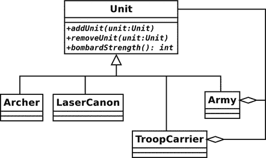
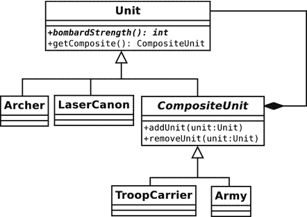
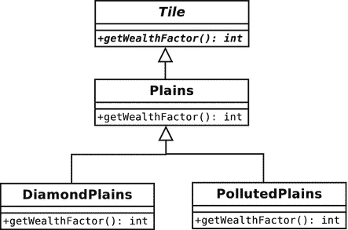
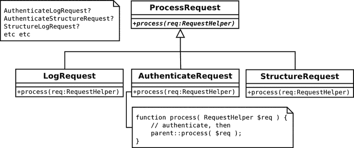
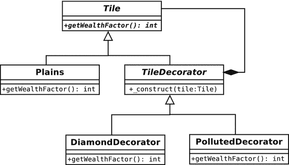

# 10. 灵活对象编程的模式

在介绍了生成对象的策略之后，我们现在可以自由地探讨一些用于组织类和对象的策略。我将特别关注一个原则：组合比继承能提供更大的灵活性。本章讨论的模式同样源自“四人组”的经典目录。

本章将涵盖三个模式：

*   组合模式：组合结构，使得一组对象可以像单个对象一样被使用。
*   装饰器模式：一种灵活的机制，可以在运行时组合对象以扩展功能。
*   外观模式：为复杂或多变的系统创建简单的接口。

## 组织类以实现灵活的对象

早在第 4 章，我曾说过初学者经常混淆对象和类。这其实只说对了一半。事实上，我们中大多数人也偶尔会在 UML 类图前挠头，试图调和图中展示的静态继承结构与对象之间在“图表之外”将要形成的动态关系。

还记得模式原则“优先使用组合而非继承”吗？这个原则提炼了类与对象组织方式之间的张力。为了在我们的项目中构建灵活性，我们如此组织类，使得它们的对象可以在运行时通过组合形成有用的结构。

这是贯穿本章前两个模式的一个共同主题。继承在这两个模式中都很重要，但其重要性部分在于它提供了一种机制，通过这种机制，组合可以用来表示结构和扩展功能。

## 组合模式

组合模式也许是利用继承来服务于组合的最极端的例子。它既简单又令人惊叹地优雅，而且极其有用。但需要提醒的是：它太完美了，你可能会忍不住过度使用这个策略。

组合模式是一种聚合并管理一组相似对象的简单方法，使得单个对象和对象集合对客户端来说是无法区分的。实际上，这个模式非常简单，但也常常让人感到困惑。原因之一在于模式中类的结构与其对象的组织结构之间的相似性。继承层次结构是树状的，从根节点的超类开始，分支成专门化的子类。组合模式所奠定的类继承树，旨在方便地生成和遍历对象树。

如果你还不熟悉这个模式，现在感到困惑是完全正常的。让我们用一个类比来说明，单个实体如何能与事物集合以相同的方式被对待。给定大致上不可再分的原料，比如谷物和肉类（或者大豆，如果你喜欢），我们可以制作一种食品——例如，香肠。然后我们将结果作为一个单一实体来对待。就像我们吃、烹饪、购买或出售肉类一样，我们也可以吃、烹饪、购买或出售由肉类部分组成的香肠。我们可以把香肠和其他复合配料组合成一个馅饼，从而将一个复合体融入一个更大的复合体中。我们对集合的行为方式与对其组成部分的行为方式相同。组合模式帮助我们代码中模拟这种集合与组件之间的关系。


### 问题

管理对象组可能是一项相当复杂的任务，尤其是当这些对象本身还可能包含自己的子对象时。这类问题在编码中非常常见。想想发票，其中包含汇总了额外产品或服务的明细项，或者待办事项列表，其中的项目本身又包含多个子任务。在内容管理中，我们离不开由章节、页面、文章或媒体组件构成的树状结构。从外部管理这些结构很快就会变得令人望而生畏。

让我们回到之前的一个场景。我正在设计一个基于名为《文明》的游戏系统。玩家可以在构成地图的数百个方格上移动单位。单个棋子可以组合成一个群体，进行移动、战斗和防御。这里我定义了几种单位类型：

```
// 代码清单 10.01
abstract class Unit
{
abstract public function bombardStrength(): int;
}
class Archer extends Unit
{
public function bombardStrength(): int
{
return 4;
}
}
class LaserCannonUnit extends Unit
{
public function bombardStrength(): int
{
return 44;
}
}
```

`Unit` 类定义了一个抽象方法 `bombardStrength()`，用于设置单位轰击相邻方格的攻击强度。我在 `Archer` 和 `LaserCannonUnit` 类中都实现了该方法。这些类还会包含关于移动和防御能力的信息，不过我会保持简单。我可以定义一个单独的类来将单位组合在一起，就像这样：

```
// 代码清单 10.02
class Army
{
private $units = [];
public function addUnit(Unit $unit)
{
array_push($this->units, $unit);
}
public function bombardStrength(): int
{
$ret = 0;
foreach ($this->units as $unit) {
$ret += $unit->bombardStrength();
}
return $ret;
}
}
// 代码清单 10.03
$unit1 = new Archer();
$unit2 = new LaserCannonUnit();
$army = new Army();
$army->addUnit($unit1);
$army->addUnit($unit2);
print $army->bombardStrength();
```

`Army` 类有一个 `addUnit()` 方法，该方法接受一个 `Unit` 对象。`Unit` 对象被存储在一个名为 `$units` 的数组属性中。我在 `bombardStrength()` 方法中计算军队的总攻击强度。该方法只是遍历所有聚合的 `Unit` 对象，并调用每个对象的 `bombardStrength()` 方法。

只要问题保持这么简单，这个模型就是完全可以接受的。但如果我要添加一些新的需求呢？假设一个军队应该能够与其他军队合并。每个军队应该保留其自身的标识，以便日后能够从整体中分离出来。大公的英勇部队今天可能与索姆斯将军对敌人暴露侧翼的进攻有共同的目标，但一场国内叛乱随时可能让他的军队匆忙班师回朝。出于这个原因，我不能简单地将每个军队的单位都倒入一个新的部队中。

我可以修改 `Army` 类，使其除了接受 `Unit` 对象外，也接受 `Army` 对象：

```
// 代码清单 10.04
public function addArmy(Army $army)
{
array_push($this->armies, $army);
}
```

然后我需要修改 `bombardStrength()` 方法，使其同时遍历所有军队和单位：

```
// 代码清单 10.05
public function bombardStrength(): int
{
$ret = 0;
foreach ($this->units as $unit) {
$ret += $unit->bombardStrength();
}
foreach ($this->armies as $army) {
$ret += $army->bombardStrength();
}
return $ret;
}
```

目前这种额外的复杂性还不算太成问题。但请记住，我需要在诸如 `defensiveStrength()`、`movementRange()` 等方法中也做类似的事情。我的游戏将功能丰富。业务部门已经在要求一种能容纳最多十个单位的运兵车，以提升它们在某些地形上的移动范围。显然，运兵车与军队类似，因为它也包含单位。它也有自己的特性。我可以进一步修改 `Army` 类来处理 `TroopCarrier` 对象，但我知道未来还会有更多单位组合的需求。很明显，我需要一个更灵活的模型。

让我们重新审视一下我一直在构建的模型。我创建的所有类都有一个共同需求：`bombardStrength()` 方法。实际上，客户端不需要区分军队、单位或运兵车。它们在功能上是相同的。它们都需要移动、攻击和防御。那些包含其他对象的对象需要提供添加和移除它们的方法。这些相似之处引导我们得出一个不可避免的结论：由于容器对象与其所包含的对象共享接口，它们自然适合归属于同一个类型家族。


### 实现

组合模式定义了一个单一的继承层次结构，其中包含两组截然不同的职责。我们已经在示例中看到了这两者。模式中的类必须将支持一组通用操作作为其主要职责。对我们来说，这意味着 `bombardStrength()` 方法。类还必须支持用于添加和移除子对象的方法。

图 10-1 展示了一个类图，说明了应用于我们问题的组合模式。



**图 10-1.** 组合模式

正如你所见，该模型中的所有单元都继承自 `Unit` 类。因此，客户端可以确信，任何 `Unit` 对象都会支持 `bombardStrength()` 方法。所以，一个 `Army` 对象可以像对待一个 `Archer` 对象一样被处理。

`Army` 和 `TroopCarrier` 类是组合体：它们被设计用来容纳 `Unit` 对象。`Archer` 和 `LaserCannon` 类是叶子节点，设计用于支持单元操作，但不包含其他 `Unit` 对象。实际上，关于叶子节点是否应该像组合体一样遵循相同的接口（就像图 10-1 中那样）存在一个问题。图中展示了 `TroopCarrier` 和 `Army` 聚合其他单元，尽管叶子类也被约束要实现 `addUnit()`。我稍后将回到这个问题。以下是抽象的 `Unit` 类：

```
// listing 10.06
abstract class Unit
{
abstract public function addUnit(Unit $unit);
abstract public function removeUnit(Unit $unit);
abstract public function bombardStrength(): int;
}
```

如你所见，我在此为基础功能定义了所有 `Unit` 对象。现在，让我们看看一个组合对象如何实现这些抽象方法：

```
// listing 10.07
class Army extends Unit
{
private $units = [];
public function addUnit(Unit $unit)
{
if (in_array($unit, $this->units, true)) {
return;
}
$this->units[] = $unit;
}
public function removeUnit(Unit $unit)
{
$idx = array_search($unit, $this->units, true);
if (is_int($idx)) {
array_splice($this->units, $idx, 1, []);
}
}
public function bombardStrength(): int
{
$ret = 0;
foreach ($this->units as $unit) {
$ret += $unit->bombardStrength();
}
return $ret;
}
}
```

`addUnit()` 方法在将同一个 `Unit` 对象存储到私有属性 `$units` 数组之前，会检查是否已经添加过它。`removeUnit()` 使用类似的检查来从该属性中移除给定的 `Unit` 对象。

因此，`Army` 对象可以存储任何类型的 `Unit` 对象，包括其他 `Army` 对象，或者像 `Archer` 或 `LaserCannonUnit` 这样的叶子节点。因为所有单元都保证支持 `bombardStrength()` 方法，所以我们的 `Army::bombardStrength()` 方法简单地遍历所有存储在 `$units` 属性中的子 `Unit` 对象，并在每个对象上调用相同的方法。

组合模式的一个问题是添加和移除功能的实现。经典模式将 `add()` 和 `remove()` 方法放在抽象超类中。这确保了模式中的所有类共享一个公共接口。然而，正如你在此所见，这也意味着叶子类必须提供实现：

```
// listing 10.08
class UnitException extends \Exception
{
}
// listing 10.09
class Archer extends Unit
{
public function addUnit(Unit $unit)
{
throw new UnitException(get_class($this) . " is a leaf");
}
public function removeUnit(Unit $unit)
{
throw new UnitException(get_class($this) . " is a leaf");
}
public function bombardStrength(): int
{
return 4;
}
}
```

我不想让 `Archer` 对象有可能添加一个 `Unit` 对象，所以如果调用了 `addUnit()` 或 `removeUnit()` 方法，我会抛出异常。我需要为所有叶子对象都这样做，因此或许可以通过在 `Unit` 中用像前面示例那样的默认实现来替换抽象的 `addUnit()/removeUnit()` 方法，从而改进我的设计：

```
// listing 10.10
abstract class Unit
{
public function addUnit(Unit $unit)
{
throw new UnitException(get_class($this) . " is a leaf");
}
public function removeUnit(Unit $unit)
{
throw new UnitException(get_class($this) . " is a leaf");
}
abstract public function bombardStrength(): int;
}
// listing 10.11
class Archer extends Unit
{
public function bombardStrength(): int
{
return 4;
}
}
```

这消除了叶子类中的重复代码，但缺点是，在编译时，组合体不会被强制要求提供 `addUnit()` 和 `removeUnit()` 的实现，这可能会在后续引发问题。

我将在下一节更详细地探讨组合模式带来的一些问题。在结束本节之前，我们来审视一下它的一些优点：

*   **灵活性**：因为组合模式中的所有内容都共享一个公共超类型，所以非常容易在设计添加新的组合体或叶子节点对象，而无需更改程序的更广泛上下文。
*   **简单性**：使用组合结构的客户端拥有一个直接的接口。客户端无需区分由其他对象组成的对象和叶子节点对象（除了添加新组件时）。对 `Army::bombardStrength()` 的调用可能会在幕后引发一连串的委托调用；但对于客户端来说，这个过程和结果与调用 `Archer::bombardStrength()` 所关联的过程和结果完全相同。
*   **隐式影响范围**：组合模式中的对象被组织成一棵树。每个组合体都持有对其子对象的引用。因此，对树特定部分的操作可能会产生广泛的影响。我们可能将一个 `Army` 对象从其父 `Army` 中移除，并添加到另一个 `Army` 中。这个简单的操作作用于一个对象，但它会改变该 `Army` 对象所引用的 `Unit` 对象及其自身子对象的状态。
*   **显式影响范围**：树结构易于遍历。可以对它们进行迭代以获取信息或执行转换。我们将在下一章讨论访问者模式时研究一个特别强大的技术。

通常，你只有从客户端的角度才能真正看到模式的好处，所以这里有几个军队的例子：

```
// listing 10.12
// create an army
$main_army = new Army();
// add some units
$main_army->addUnit(new Archer());
$main_army->addUnit(new LaserCannonUnit());
// create a new army
$sub_army = new Army();
// add some units
$sub_army->addUnit(new Archer());
$sub_army->addUnit(new Archer());
$sub_army->addUnit(new Archer());
// add the second army to the first
$main_army->addUnit($sub_army);
// all the calculations handled behind the scenes
print "attacking with strength: {$main_army->bombardStrength()}\n";
```

我创建了一个新的 `Army` 对象，并添加了一些原始的 `Unit` 对象。我对第二个 `Army` 对象重复了同样的过程，然后将其添加到第一个 `Army` 对象中。当我在第一个 `Army` 对象上调用 `Unit::bombardStrength()` 时，我所构建的结构的全部复杂性都被完全隐藏起来了。


### 后果

如果你和我一样，在看到 `Archer` 类的代码片段时，心里应该已经敲响了警钟。为什么我们非得在那些根本不需要支持 `addUnit()` 和 `removeUnit()` 方法的叶子类中保留这些冗余的方法呢？答案在于 `Unit` 类型透明性。

如果客户端接收到一个 `Unit` 对象，它会知道 `addUnit()` 方法肯定存在。组合模式的原则——原始（叶子）类与组合类拥有相同的接口——得到了贯彻。但这实际上帮不了你太多，因为你仍然不知道对遇到的任何一个 `Unit` 对象调用 `addUnit()` 方法是否安全。

如果我将这些 add/remove 方法下移到仅适用于组合类的地方，那么当将 `Unit` 对象传递给某个方法时，就会面临一个问题：我默认不知道它是否支持 `addUnit()`。尽管如此，在叶子类中留下这些“陷阱”方法让我感到很不舒服。这没有增加任何价值，反而混淆了系统的设计，因为接口实际上虚报了自身的功能。

将组合类拆分到它们自己的 `CompositeUnit` 子类型中很容易实现。首先，我从 `Unit` 中移除 add/remove 行为：

```
// 清单 10.13
abstract class Unit
{
public function getComposite()
{
return null;
}
abstract public function bombardStrength(): int;
}
```

注意新增的 `getComposite()` 方法。稍后我会回头讨论它。现在，我需要一个新的抽象类来容纳 `addUnit()` 和 `removeUnit()`。我甚至可以提供默认实现：

```
// 清单 10.14
abstract class CompositeUnit extends Unit
{
private $units = [];
public function getComposite(): CompositeUnit
{
return $this;
}
public function addUnit(Unit $unit)
{
if (in_array($unit, $this->units, true)) {
return;
}
$this->units[] = $unit;
}
public function removeUnit(Unit $unit)
{
$idx = array_search($unit, $this->units, true);
if (is_int($idx)) {
array_splice($this->units, $idx, 1, []);
}
}
public function getUnits(): array
{
return $this->units;
}
}
```

`CompositeUnit` 类被声明为抽象类，尽管它本身并没有声明任何抽象方法。不过，它确实扩展了 `Unit`，并且没有实现抽象的 `bombardStrength()` 方法。`Army`（以及任何其他组合类）现在可以扩展 `CompositeUnit`。我示例中的类现在组织方式如图 10-2 所示。



图 10-2. 将 add/remove 方法移出基类

叶子类中那些恼人且无用的 add/remove 方法实现已经消失了，但客户端在使用 `addUnit()` 之前，仍然必须检查它是否拥有一个 `CompositeUnit` 对象。

这就是 `getComposite()` 方法发挥作用的地方。默认情况下，此方法返回 null 值。只有在 `CompositeUnit` 类中，它才返回 `CompositeUnit` 对象。因此，如果此方法调用返回了一个对象，我们就应该能够在该对象上调用 `addUnit()`。下面是一个使用此技术的客户端：

```
// 清单 10.15
class UnitScript
{
public static function joinExisting(
Unit $newUnit,
Unit $occupyingUnit
): CompositeUnit {
$comp = $occupyingUnit->getComposite();
if (! is_null($comp)) {
$comp->addUnit($newUnit);
} else {
$comp = new Army();
$comp->addUnit($occupyingUnit);
$comp->addUnit($newUnit);
}
return $comp;
}
}
```

`joinExisting()` 方法接受两个 `Unit` 对象。第一个是某区块上的新来者，第二个是先前占用者。如果第二个 `Unit` 是一个 `CompositeUnit`，那么第一个将尝试加入它。如果不是，则会创建一个新的 `Army` 来容纳这两个单位。我一开始无法知道 `$occupyingUnit` 参数是否包含一个 `CompositeUnit`。不过，调用 `getComposite()` 可以解决这个问题。如果 `getComposite()` 返回一个对象，我可以直接将新的 `Unit` 对象添加进去。如果不返回，我会创建新的 `Army` 对象并将两者都添加进去。

我可以通过让 `Unit::getComposite()` 方法返回一个预先填充了当前 `Unit` 的 `Army` 对象来进一步简化这个模型。或者，我可以回到之前的模型（该模型在结构上不区分组合对象和叶子对象），并让 `Unit::addUnit()` 做同样的事情：创建一个 `Army` 对象并将两个 `Unit` 对象都添加进去。这很简洁，但它预先假定你提前知道你想用来聚合单位的组合类型。你的业务逻辑将决定你在设计 `getComposite()` 和 `addUnit()` 等方法时能做出何种假设。

这些曲折迂回的做法，体现了组合模式的一个缺点。简单性是通过确保所有类都派生自一个公共基类来实现的。这种简单性的好处有时是以牺牲类型安全为代价的。你的模型变得越复杂，你可能需要进行的**手动**类型检查就越多。假设我有一个 `Cavalry` 对象。如果游戏规则规定你不能把马放上运兵车，我就无法用组合模式自动强制执行这条规则：

```
// 清单 10.16
class TroopCarrier extends CompositeUnit
{
public function addUnit(Unit $unit)
{
if ($unit instanceof Cavalry) {
throw new UnitException("不能把马弄上运兵车");
}
parent::addUnit($unit);
}
public function bombardStrength(): int
{
return 0;
}
}
```

我被迫使用 `instanceof` 运算符来测试传递给 `addUnit()` 的对象的类型。如果你有太多这种特殊情况，该模式的缺点就开始超过其优点。当大多数组件可以互换时，组合模式效果最佳。

另一个需要牢记的问题是一些组合操作的代价。`Army::bombardStrength()` 方法很典型，它会沿着树向下级联调用相同的方法。对于一个拥有大量子部队的大型树来说，单个调用可能会在幕后引发雪崩。`bombardStrength()` 本身开销不大，但如果某些叶子执行了复杂的计算来得出其返回值，会发生什么情况？解决这个问题的一种方法是在父对象中缓存此类方法调用的结果，以便后续调用开销更小。不过，你需要小心，确保缓存的值不会过时。你应该设计策略，在树结构上发生任何操作时清除所有缓存。这可能要求你给子对象提供对其父对象的引用。

最后，关于持久化的一点说明。组合模式很优雅，但它不适合直接存储在关系型数据库中。这是因为，默认情况下，你只能通过引用的级联来访问整个结构。要以自然的方式从数据库构建组合结构，你必须执行多次昂贵的查询。你可以通过为整个树分配一个 ID 来解决这个问题，这样所有组件都可以一次性从数据库中取出。然而，在获取所有对象之后，你仍然需要重新创建父/子引用关系，而这些关系本身也必须存储在数据库中。这并不困难，但有些混乱。

尽管组合模式与关系型数据库配合起来不太自然，但它非常适合存储在 XML 中。这是因为 XML 元素本身通常由子元素树组成。


### 组合模式小结

因此，当你需要以对待个体的方式来对待一组事物时，组合模式就非常有用，无论是因为这个集合本质上就像是一个组件（例如军队和弓箭手），还是因为上下文赋予了集合与组件相同的特征（例如发票中的行项目）。组合以树状结构组织，因此对整体的操作可以影响部分，而部分的数据也可以通过整体透明地获取。组合模式使得此类操作和查询对客户端透明。树结构易于遍历（我们将在下一章看到）。向组合结构中添加新的组件类型也很容易。

在缺点方面，组合模式依赖于其各部分之间的相似性。一旦我们引入复杂的规则，规定哪个组合对象可以包含哪组组件，我们的代码就会变得难以管理。组合模式不太适合存储在关系数据库中，但非常适合 XML 持久化。

## 装饰器模式

组合模式帮助我们创建聚合组件的灵活表示，而装饰器模式则使用类似的结构来帮助我们修改具体组件的功能。同样，这种模式的关键在于运行时组合的重要性。继承是一种在父类特性基础上进行构建的简洁方法。但这种简洁性可能会导致你将变化硬编码到继承层次结构中，从而常常导致不灵活。

### 问题

将所有功能都构建到继承结构中会导致系统中的类数量激增。更糟糕的是，当你试图将类似的修改应用于继承树的不同分支时，你很可能会看到重复代码的出现。

让我们回到游戏示例。这里，我定义了一个 `Tile` 类和一个派生类型：

```
// 代码清单 10.17
abstract class Tile
{
abstract public function getWealthFactor(): int;
}
// 代码清单 10.18
class Plains extends Tile
{
private $wealthfactor = 2;
public function getWealthFactor(): int
{
return $this->wealthfactor;
}
}
```

一个瓷砖代表一个地块，我的单位可能会出现在其上。每个瓷砖都有某些特性。在这个例子中，我定义了一个 `getWealthFactor()` 方法，它会影响某个地块如果被玩家拥有所能产生的收入。如你所见，`Plains` 对象的财富因子为 2。显然，瓷砖还管理其他数据。它们可能还持有图像信息的引用，以便能够绘制棋盘。再次强调，这里我会保持简单。

我需要修改 `Plains` 对象的行为，以处理自然资源和人为破坏的影响。我希望模拟景观中钻石的出现以及污染造成的损害。一种方法是从 `Plains` 对象继承：

```
// 代码清单 10.19
class DiamondPlains extends Plains
{
public function getWealthFactor(): int
{
return parent::getWealthFactor() + 2;
}
}
// 代码清单 10.20
class PollutedPlains extends Plains
{
public function getWealthFactor(): int
{
return parent::getWealthFactor() - 4;
}
}
```

我现在可以非常轻松地获取一个被污染的瓷砖：

```
// 代码清单 10.21
$tile = new PollutedPlains();
print $tile->getWealthFactor();
```

你可以在图 10-3 中看到这个例子的类图。



图 10-3. 在继承树中构建变化

这种结构显然不灵活。我可以得到带有钻石的平原。我也可以得到被污染的平原。但是我能同时得到两者吗？显然不能，除非我愿意制造 `PollutedDiamondPlains` 这种可怕的东西。当我引入 `Forest` 类时，情况只会变得更糟，因为 `Forest` 也可以有钻石和污染。

当然，这是一个极端的例子，但道理是清楚的。完全依赖继承来定义功能会导致大量类出现，并容易产生重复。

现在让我们看一个更常见的例子。严肃的 Web 应用程序在发起任务以形成响应之前，通常需要对请求执行一系列操作。例如，你可能需要验证用户身份，并记录请求。也许你应该处理请求，从原始输入中构建数据结构。最后，你必须执行核心处理。你会遇到同样的问题。

你可以通过派生的 `LogRequest` 类、`StructureRequest` 类和 `AuthenticateRequest` 类中的额外处理来扩展基础 `ProcessRequest` 类的功能。你可以在图 10-4 中看到这个类层次结构。



图 10-4. 更多硬编码的变化

但是，当需要执行日志记录和身份验证，而不需要数据准备时，会发生什么？你需要创建一个 `LogAndAuthenticateProcessor` 类吗？显然，是时候寻找一个更灵活的解决方案了。


### 实现

`Decorator`模式并未单纯依赖继承来解决功能变化问题，而是采用了**组合与委托**的方式。本质上，`Decorator`类持有自身类型的另一个类的实例。`Decorator`会实现一个操作，以便在自身执行操作之前（或之后）调用其所引用的对象的相同操作。通过这种方式，可以在运行时构建一个`Decorator`对象的管道。

让我们重写游戏示例来说明这一点：

```  
abstract class Tile  
{  
    abstract public function getWealthFactor(): int;  
}  

class Plains extends Tile  
{  
    private $wealthfactor = 2;  

    public function getWealthFactor(): int  
    {  
        return $this->wealthfactor;  
    }  
}  

// 代码清单 10.22  
abstract class TileDecorator extends Tile  
{  
    protected $tile;  

    public function __construct(Tile $tile)  
    {  
        $this->tile = $tile;  
    }  
}  
```  

这里，我声明了与之前相同的 `Tile` 和 `Plains` 类，但引入了一个新类 `TileDecorator`。它没有实现 `getWealthFactor()`，因此必须声明为抽象类。我定义了一个构造函数，它需要一个 `Tile` 对象，并将其存储在一个名为 `$tile` 的属性中。我将此属性设为 `protected`，以便子类能够访问它。现在，我将重新定义 `Pollution` 和 `Diamond` 类：

```  
// 代码清单 10.23  
class DiamondDecorator extends TileDecorator  
{  
    public function getWealthFactor(): int  
    {  
        return $this->tile->getWealthFactor() + 2;  
    }  
}  

// 代码清单 10.24  
class PollutionDecorator extends TileDecorator  
{  
    public function getWealthFactor(): int  
    {  
        return $this->tile->getWealthFactor() - 4;  
    }  
}  
```  

这两个类都继承了 `TileDecorator`。这意味着它们持有对一个 `Tile` 对象的引用。当 `getWealthFactor()` 被调用时，每个类在作出自身调整之前，都会调用其 `Tile` 引用上的相同方法。

通过这样使用组合与委托，您可以在运行时轻松组合对象。由于该模式中的所有对象都继承了 `Tile`，客户端无需知道它正在处理哪种组合。它可以确信任何 `Tile` 对象（无论它是否在幕后装饰着另一个对象）都可调用 `getWealthFactor()` 方法：

```  
// 代码清单 10.25  
$tile = new Plains();  
print $tile->getWealthFactor(); // 2  
```  

`Plains` 是一个组件。它简单地返回 2：

```  
// 代码清单 10.26  
$tile = new DiamondDecorator(new Plains());  
print $tile->getWealthFactor(); // 4  
```  

`DiamondDecorator` 持有对 `Plains` 对象的引用。它在添加自己的权重 2 之前调用了 `getWealthFactor()`：

```  
// 代码清单 10.27  
$tile = new PollutionDecorator(new DiamondDecorator(new Plains()));  
print $tile->getWealthFactor(); // 0  
```  

`PollutionDecorator` 持有对 `DiamondDecorator` 对象的引用，而后者拥有自己的 `Tile` 引用。

您可以在图 10-5 中看到此示例的类图。

  

图 10-5. Decorator 模式

这个模型扩展性很强。您可以非常容易地添加新的装饰器和组件。使用大量装饰器，您可以在运行时构建非常灵活的结构。组件类（此例中为 `Plains`）可以通过多种方式被显著修改，而无需将全部的修改内容构建到类层次结构中。用通俗的话说，这意味着您可以有一个被污染且含有钻石的 `Plains` 对象，而无需创建一个 `PollutedDiamondPlains` 对象。

`Decorator` 模式构建的管道对于创建过滤器非常有用。`java.io` 包就大量使用了装饰器类。客户端程序员可以将装饰器对象与核心组件结合，为核心方法（如 `read()`）添加过滤、缓冲、压缩等功能。我的 Web 请求示例也可以发展成一个可配置的管道。这是一个使用 `Decorator` 模式的简单实现：

```  
// 代码清单 10.28  
class RequestHelper  
{  
}  

// 代码清单 10.29  
abstract class ProcessRequest  
{  
    abstract public function process(RequestHelper $req);  
}  

// 代码清单 10.30  
class MainProcess extends ProcessRequest  
{  
    public function process(RequestHelper $req)  
    {  
        print __CLASS__ . ": doing something useful with request\n";  
    }  
}  

// 代码清单 10.31  
abstract class DecorateProcess extends ProcessRequest  
{  
    protected $processrequest;  

    public function __construct(ProcessRequest $pr)  
    {  
        $this->processrequest = $pr;  
    }  
}  
```  

与之前一样，我们定义了一个抽象超类（`ProcessRequest`）、一个具体组件（`MainProcess`）和一个抽象装饰器（`DecorateProcess`）。`MainProcess::process()` 仅报告它已被调用。`DecorateProcess` 代表其子类存储一个 `ProcessRequest` 对象。以下是一些具体的装饰器类：

```  
// 代码清单 10.32  
class LogRequest extends DecorateProcess  
{  
    public function process(RequestHelper $req)  
    {  
        print __CLASS__ . ": logging request\n";  
        $this->processrequest->process($req);  
    }  
}  

// 代码清单 10.33  
class AuthenticateRequest extends DecorateProcess  
{  
    public function process(RequestHelper $req)  
    {  
        print __CLASS__ . ": authenticating request\n";  
        $this->processrequest->process($req);  
    }  
}  

// 代码清单 10.34  
class StructureRequest extends DecorateProcess  
{  
    public function process(RequestHelper $req)  
    {  
        print __CLASS__ . ": structuring request data\n";  
        $this->processrequest->process($req);  
    }  
}  
```  

每个 `process()` 方法在调用所引用的 `ProcessRequest` 对象的 `process()` 方法之前，都会输出一条消息。现在，您可以在运行时组合从这些类实例化的对象，以构建在请求上执行不同操作且顺序各异的过滤器。以下是一些代码，将所有具体类中的对象组合成一个过滤器：

```  
// 代码清单 10.35  
$process = new AuthenticateRequest(new StructureRequest(  
    new LogRequest(  
        new MainProcess()  
    )  
));  
$process->process(new RequestHelper());  
```  

这段代码输出如下内容：

```  
popp\ch10\batch07\AuthenticateRequest: authenticating request  
popp\ch10\batch07\StructureRequest: structuring request data  
popp\ch10\batch07\LogRequest: logging request  
popp\ch10\batch07\MainProcess: doing something useful with request  
```  

**注意**

事实上，这个示例也是一个名为“拦截过滤器”的企业模式实例。拦截过滤器在 Alur 等人所著的 *Core J2EE Patterns: Best Practices and Design Strategies* (Prentice Hall, 2001) 一书中有详细描述。

### 结果

与 `Composite` 模式类似，`Decorator` 也可能令人困惑。重要的是要记住，组合与继承在此同时发挥作用。因此，`LogRequest` 从 `ProcessRequest` 继承了其接口，但它作为另一个 `ProcessRequest` 对象的包装器来运作。

由于装饰器对象构成了对子对象的包装，因此保持接口尽可能精简是有益的。如果您构建了一个功能丰富的基类，那么装饰器就必须将委托应用于其包含对象的所有公共方法。这可以在抽象装饰器类中完成，但它仍然会引入一种可能导致错误的耦合。

一些程序员创建的装饰器与它们所修改的对象并不共享同一类型。只要它们满足这些对象的相同接口，这种策略就能很好地工作。您将能够利用内置的拦截器方法来自动化委托（通过实现 `__call()` 来捕获对不存在方法的调用，并自动调用子对象上的相同方法）。然而，这样做也会失去类类型检查所带来的安全性。在我们迄今为止的示例中，客户端代码可以在其参数列表中要求一个 `Tile` 或 `ProcessRequest` 对象，并且无论该对象是否被大量装饰，都能确信其接口的存在。


## 外观模式

你可能曾需要将第三方系统整合到自己的项目中。无论这些代码是否采用面向对象设计，它们往往都庞大、复杂且令人望而生畏。即使是你自己的代码，对于只需要使用其中少数功能的客户端程序员来说，也可能变成一项挑战。`Facade`模式正是为复杂系统提供简单清晰接口的一种方式。

### 问题所在

系统往往会演化出大量仅对系统本身有用的代码。正如类需要定义清晰的公共接口并将内部实现对外隐藏一样，设计良好的系统也应如此。然而，我们并不总能明确判断系统的哪些部分是为客户端代码设计，哪些部分最好隐藏起来。

当处理子系统（如网络论坛或图库应用程序）时，你可能会发现自己的代码需要深入调用系统逻辑。如果子系统代码随时间变化，而你的代码在多个不同点与其交互，那么随着子系统的演进，你将面临严重的维护问题。

同样，在构建自己的系统时，最好将不同部分组织成独立的层级。通常，你可能有一个负责应用逻辑的层，另一个负责数据库交互，还有一个负责表现层等。你应该尽可能保持这些层的相互独立，这样项目中某一区域的变化对其他区域的影响才能最小化。如果某一层的代码与另一层紧密耦合，那么这一目标就难以实现。

下面是一段故意写得令人困惑的过程式代码，它将从文件获取日志信息并转换为对象数据的简单过程变得异常复杂：

```
// 代码清单 10.36
function getProductFileLines($file)
{
    return file($file);
}
function getProductObjectFromId($id, $productname)
{
    // 某种数据库查询
    return new Product($id, $productname);
}
function getNameFromLine($line)
{
    if (preg_match("/.*-(.*)\s\d+/", $line, $array)) {
        return str_replace('_', ' ', $array[1]);
    }
    return '';
}
function getIDFromLine($line)
{
    if (preg_match("/^(\d{1,3})-/", $line, $array)) {
        return $array[1];
    }
    return -1;
}
class Product
{
    public $id;
    public $name;
    public function __construct($id, $name)
    {
        $this->id = $id;
        $this->name = $name;
    }
}
```

假设这些代码的内部实现远比实际复杂，而且我不得不使用它，而非从头重写。例如，假设我需将包含如下格式行的文件转换为对象数组：

```
234-ladies_jumper 55
532-gents_hat 44
```

为此，我必须调用所有这些函数（请注意，为简洁起见，我并未提取最后的数字，它代表价格）：

```
// 代码清单 10.37
$lines = getProductFileLines(__DIR__ . '/test2.txt');
$objects = [];
foreach ($lines as $line) {
    $id = getIDFromLine($line);
    $name = getNameFromLine($line);
    $objects[$id] = getProductObjectFromID($id, $name);
}
```

如果在整个项目中像这样直接调用这些函数，我的代码就会与所使用的子系统紧密耦合。如果子系统发生变化，或者我决定完全替换它，就会引发问题。我真正需要的是在系统与其余代码之间引入一个网关。

### 实现

下面是一个简单的类，它为你在上一节中看到的过程式代码提供了一个接口：

```
// 代码清单 10.38
class ProductFacade
{
    private $products = [];
    public function __construct(string $file)
    {
        $this->file = $file;
        $this->compile();
    }
    private function compile()
    {
        $lines = getProductFileLines($this->file);
        foreach ($lines as $line) {
            $id = getIDFromLine($line);
            $name = getNameFromLine($line);
            $this->products[$id] = getProductObjectFromID($id, $name);
        }
    }
    public function getProducts(): array
    {
        return $this->products;
    }
    public function getProduct(string $id): \Product
    {
        if (isset($this->products[$id])) {
            return $this->products[$id];
        }
        return null;
    }
}
```

从客户端代码的角度看，从日志文件获取`Product`对象的过程大大简化了：

```
// 代码清单 10.39
$facade = new ProductFacade(__DIR__ . '/test2.txt');
$object = $facade->getProduct("234");
```

### 影响

`Facade`实际上是一个很简单的概念。它只是为某个层或子系统创建一个单一入口点。这带来了诸多好处：有助于将项目中不同区域相互解耦；为客户端程序员提供实现清晰目标的简单方法既实用又便利；通过将子系统的使用集中在一个地方来减少错误——子系统变更时，故障将出现在可预测的位置。在复杂子系统中，客户端代码可能错误地使用内部函数，而`Facade`类也能将此类错误最小化。

尽管`Facade`模式很简单，但人们很容易忘记使用它，尤其是当你对所使用的子系统很熟悉时。当然，这需要权衡。一方面，为复杂系统创建简单接口的好处显而易见。另一方面，人们可能会不加区分地抽象系统，然后再抽象这些抽象层。如果你为了客户端代码的明确利益进行了显著的简化，并且/或者保护它免受可能变更的系统的影响，那么实现`Facade`模式很可能是正确的选择。

## 总结

在本章中，我探讨了在系统中组织类和对象的几种方式。我特别关注了这样一个原则：当继承失败时，组合可用于生成灵活性。在`Composite`和`Decorator`模式中，都使用了继承来促进组合，并定义了一个为客户端代码提供保证的通用接口。

你还看到了委托在这些模式中的有效运用。最后，我介绍了简单但强大的`Facade`模式。`Facade`是许多人多年来一直在使用却没有给它命名的模式之一。`Facade`让你能够为一个层或子系统提供一个清晰的入口点。在 PHP 中，`Facade`模式也用于创建封装过程式代码块的对象包装器。

