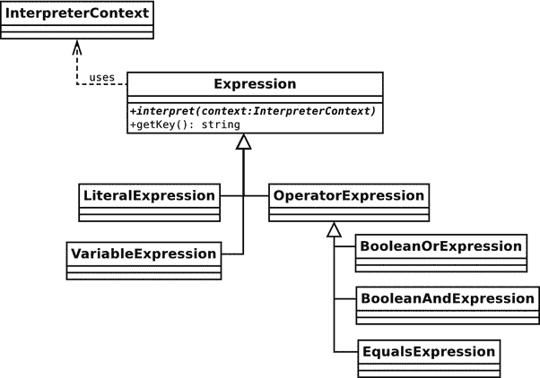
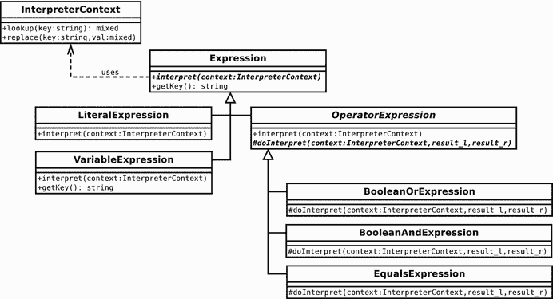
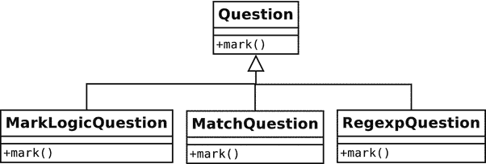
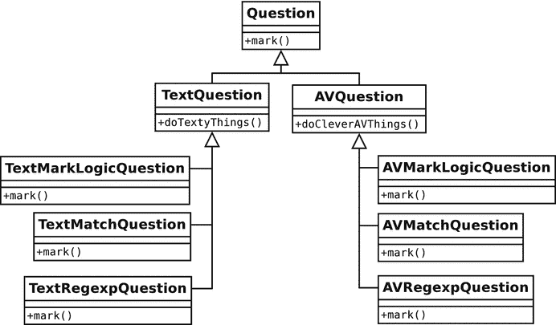
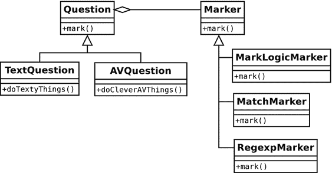
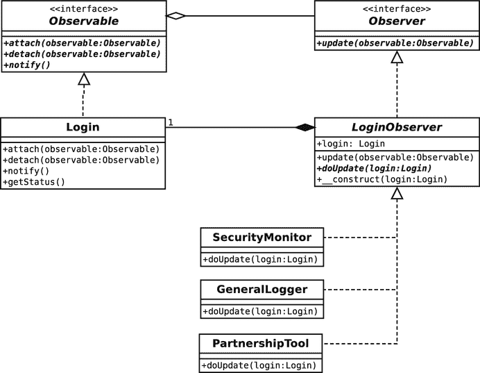
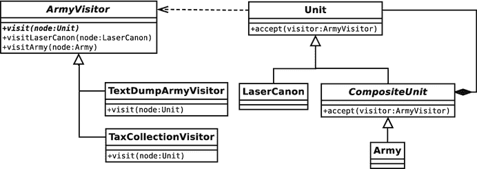
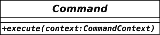
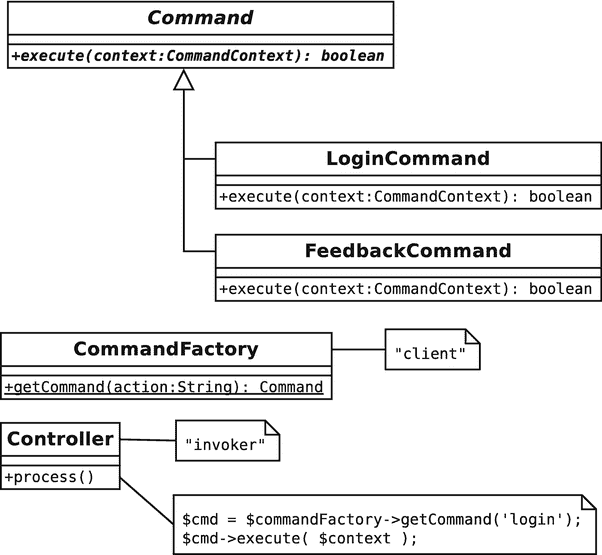

# 11. 执行与表达任务

在本章中，我们将活跃起来。我将介绍帮助你完成任务的模式，无论是解释小语言还是封装算法。

本章将带你了解以下几种模式：

-   **解释器模式**：构建一个可用于创建可脚本化应用程序的小型语言解释器
-   **策略模式**：识别系统中的算法并将其封装到各自的类型中
-   **观察者模式**：创建用于向多个对象通知系统事件的钩子
-   **访问者模式**：将操作应用于对象树中的所有节点
-   **命令模式**：创建可保存和传递的命令对象
-   **空对象模式**：使用无操作对象代替空值。

## 解释器模式

语言是由其他语言编写的（至少最初是这样）。例如，PHP 本身是用 C 语言编写的。同理，虽然听起来有些奇怪，但你可以使用 PHP 定义并运行自己的语言。当然，你创建的任何语言都会比较慢，且有一定局限性。尽管如此，小型语言仍然非常有用，正如你将在本章中看到的那样。

### 问题

当您用 PHP 创建 Web（或命令行）界面时，您赋予了用户访问功能的权利。界面设计需要在功能强大与易于使用之间做出权衡。通常情况下，您赋予用户的功能越多，界面就会变得越杂乱和令人困惑。当然，优秀的界面设计对此大有裨益。但如果 90%的用户只使用您 30%的功能，那么堆砌功能所带来的成本可能就会超过其收益。您可能希望为大多数用户简化您的系统。但那些高级用户——占总用户 10%却使用您系统高级功能的那群人——又该怎么办？或许您可以用一种不同的方式来满足他们的需求。通过向这类用户提供一种领域语言（通常称为 DSL——领域特定语言），您实际上可以扩展应用程序的功能。

当然，您手中恰好就有一种编程语言——那就是 PHP。以下展示了如何让用户为您的系统编写脚本：

```php
$form_input = $_REQUEST['form_input'];
// 包含: "print file_get_contents('/etc/passwd');"
eval($form_input);
```

这种让应用程序具备脚本能力的方法显然是疯狂的。万一原因不够明显，它们归结为两个问题：**安全性**和**复杂性**。安全性问题在示例中已得到充分体现。通过允许用户通过您的脚本来执行 PHP，您实际上是让他们能够访问运行该脚本的服务器。复杂性问题同样是一个巨大的缺陷。无论您的代码多么清晰，普通用户都不太可能轻易地扩展它，更不用说在浏览器窗口中操作了。

不过，一种迷你语言可以同时解决这两个问题。您可以在语言中设计灵活性，降低用户可能造成破坏的可能性，并使功能保持专注。

设想一个用于创建测验的应用程序。制作人设计问题并制定规则，用于评判参赛者提交的答案。要求是测验必须能在无人干预的情况下自动评分，即使某些答案是由用户输入到文本字段中的。

这是一个问题：

```
设计模式小组有多少成员？
```

您可以接受“four”或“4”作为正确答案。您可能会创建一个 Web 界面，允许制作人使用正则 `Expression` 来评判回答：

```
⁴|four$
```

然而，大多数制作人并非因精通正则表达式而被聘用。为了让每个人的生活更轻松，您可能会实现一种更用户友好的评判机制：

```
$input equals "4" or $input equals "four"
```

您提出一种支持变量、名为 `equals` 的操作符以及布尔逻辑（`or` 和 `and`）的语言。程序员喜欢给东西命名，所以我们可以称它为 MarkLogic。它应该易于扩展，因为您预见到会有大量关于更丰富功能的请求。让我们暂时将解析输入的细节放在一边，专注于一种在运行时将这些元素组合在一起以产生答案的机制。正如您所料，这就是**解释器模式**发挥作用的地方。

### 实现

语言由表达式（即，能解析为一个值的对象）组成。如表 11-1 所示，即使是像 MarkLogic 这样的小型语言也需要跟踪大量元素。

**表 11-1。MarkLogic 语法的元素**

| 描述 | EBNF 名称 | 类名 | 示例 |
| --- | --- | --- | --- |
| 变量 | `variable` | `VariableExpression` | `$input` |
| 字符串字面量 | `<stringLiteral>` | `LiteralExpression` | `"four"` |
| 布尔与 | `andExpr` | `BooleanAndExpression` | `$input equals '4' and $other equals '6'` |
| 布尔或 | `orExpr` | `BooleanOrExpression` | `$input equals '4' or $other equals '6'` |
| 相等性测试 | `eqExpr` | `EqualsExpression` | `$input equals '4'` |

表 11-1 列出了 EBNF 名称。那么 EBNF 到底是关于什么的？它是一种可以用来描述语言语法的记法。EBNF 代表**扩展巴科斯-瑙尔范式**。它由一系列行（称为产生式）组成，每一行包含一个名称和一个描述，该描述采用引用其他产生式和终止符（即，不由其他产生式引用构成元素）的形式。以下是一种使用 EBNF 描述我语法的方法：

```
expr     = operand { orExpr | andExpr }
operand  = ( '(' expr ')' | ? string literal ? | variable ) { eqExpr }
orExpr   = 'or' operand
andExpr  = 'and' operand
eqExpr   = 'equals' operand
variable = '$' , ? word ?
```

某些符号具有特殊含义（这应该与正则 `Expression` 记法类似）：例如，`|` 表示或。您可以使用括号对元素进行分组。因此，在示例中，一个表达式（`expr`）由一个操作数（`operand`）后跟零个或多个 `orExpr` 或 `andExpr` 组成。一个操作数可以是括号内的表达式、带引号的字符串（我省略了它的产生式）、或者一个变量后跟零个或多个 `eqExpr` 实例。一旦您掌握了从一个产生式引用到另一个产生式的窍门，EBNF 就变得相当容易阅读。

在图 11-1 中，我将语法元素表示为类。



**图 11-1。组成 MarkLogic 语言的解释器类**

如您所见，`BooleanAndExpression` 及其同级类继承自 `OperatorExpression`。这是因为这些类都对其他的 `Expression` 对象执行操作。`VariableExpression` 和 `LiteralExpression` 则直接处理值。

所有 `Expression` 对象都实现了一个 `interpret()` 方法，该方法定义在抽象基类 `Expression` 中。`interpret()` 方法期望一个 `InterpreterContext` 对象，该对象用作共享数据存储。每个 `Expression` 对象都可以将数据存储在 `InterpreterContext` 对象中。然后 `InterpreterContext` 会被传递给其他 `Expression` 对象。为了能够轻松地从 `InterpreterContext` 中检索数据，`Expression` 基类实现了一个 `getKey()` 方法，该方法返回一个唯一的句柄。让我们通过一个 `Expression` 的实现来看看这在实践中是如何工作的：

```php
// 列表 11.01
abstract class Expression
{
    private static $keycount = 0;
    private $key;
    abstract public function interpret(InterpreterContext $context);
    public function getKey()
    {
        if (! isset($this->key)) {
            self::$keycount++;
            $this->key = self::$keycount;
        }
        return $this->key;
    }
}
// 列表 11.02
class LiteralExpression extends Expression
{
    private $value;
    public function __construct($value)
    {
        $this->value = $value;
    }
    public function interpret(InterpreterContext $context)
    {
        $context->replace($this, $this->value);
    }
}
// 列表 11.03
class InterpreterContext
{
    private $expressionstore = [];
    public function replace(Expression $exp, $value)
    {
        $this->expressionstore[$exp->getKey()] = $value;
    }
    public function lookup(Expression $exp)
    {
        return $this->expressionstore[$exp->getKey()];
    }
}
// 列表 11.04
$context = new InterpreterContext();
$literal = new LiteralExpression('four');
$literal->interpret($context);
print $context->lookup($literal) . "\n";
```

输出结果如下：

```
four
```

我将从 `InterpreterContext` 类开始讲解。正如你所见，它实际上只是一个关联数组 `$expressionstore` 的前端，我用它来存储数据。`replace()` 方法接受一个 `Expression` 对象作为键，以及任意类型的值，然后将这对键值对添加到 `$expressionstore` 中。它还提供了一个用于检索数据的 `lookup()` 方法。

`Expression` 类定义了抽象的 `interpret()` 方法和一个具体的 `getKey()` 方法，后者使用静态计数器值来生成、存储并返回一个标识符。`InterpreterContext::lookup()` 和 `InterpreterContext::replace()` 方法使用该标识符来索引数据。

`LiteralExpression` 类定义了一个接受值参数的构造函数。`interpret()` 方法需要一个 `InterpreterContext` 对象。我简单地调用了 `replace()`，使用 `getKey()` 来定义检索的键，并使用 `$value` 属性。在检查其他 `Expression` 类时，这将成为一个熟悉的模式。`interpret()` 方法总是将其结果写入到 `InterpreterContext` 对象中。

我还包含了一些客户端代码，实例化了一个 `InterpreterContext` 对象和一个 `LiteralExpression` 对象（其值为 `"four"`）。我将 `InterpreterContext` 对象传递给 `LiteralExpression::interpret()`。`interpret()` 方法将键/值对存储在 `InterpreterContext` 中，然后我通过调用 `lookup()` 从中检索值。

这是剩下的终端类。`VariableExpression` 稍微复杂一些：

```php
// 列表 11.05
class VariableExpression extends Expression
{
    private $name;
    private $val;
    public function __construct($name, $val = null)
    {
        $this->name = $name;
        $this->val = $val;
    }
    public function interpret(InterpreterContext $context)
    {
        if (! is_null($this->val)) {
            $context->replace($this, $this->val);
            $this->val = null;
        }
    }
    public function setValue($value)
    {
        $this->val = $value;
    }
    public function getKey()
    {
        return $this->name;
    }
}
// 列表 11.06
$context = new InterpreterContext();
$myvar = new VariableExpression('input', 'four');
$myvar->interpret($context);
print $context->lookup($myvar) . "\n";
// 输出: four
$newvar = new VariableExpression('input');
$newvar->interpret($context);
print $context->lookup($newvar) . "\n";
// 输出: four
$myvar->setValue("five");
$myvar->interpret($context);
print $context->lookup($myvar) . "\n";
// 输出: five
print $context->lookup($newvar) . "\n";
// 输出: five
```

`VariableExpression` 类接受 `name` 和 `value` 两个参数，并将它们存储在属性变量中。我提供了 `setValue()` 方法，以便客户端代码可以随时更改该值。

`interpret()` 方法会检查 `$val` 属性是否具有非空值。如果 `$val` 属性有值，则将其设置到 `InterpreterContext` 中。然后我将 `$val` 属性设置为 `null`。这是为了防止在另一个同名的 `VariableExpression` 实例更改了 `InterpreterContext` 对象中的值后，`interpret()` 被再次调用。这是一个相当有限的变量，只接受字符串值。如果你打算扩展你的语言，你应该考虑让它与其他 `Expression` 对象一起工作，以便能够包含测试和操作的结果。不过，就目前而言，`VariableExpression` 可以完成我需要的工作。请注意，我重写了 `getKey()` 方法，以便变量值链接到变量名，而不是一个任意的静态 ID。

语言中的运算符表达式都与另外两个 `Expression` 对象一起工作以完成其任务。因此，让它们扩展一个公共的超类是合理的。下面是 `OperatorExpression` 类：

```php
// 列表 11.07
abstract class OperatorExpression extends Expression
{
    protected $l_op;
    protected $r_op;
    public function __construct(Expression $l_op, Expression $r_op)
    {
        $this->l_op = $l_op;
        $this->r_op = $r_op;
    }
    public function interpret(InterpreterContext $context)
    {
        $this->l_op->interpret($context);
        $this->r_op->interpret($context);
        $result_l = $context->lookup($this->l_op);
        $result_r = $context->lookup($this->r_op);
        $this->doInterpret($context, $result_l, $result_r);
    }
    abstract protected function doInterpret(
        InterpreterContext $context,
        $result_l,
        $result_r
    );
}
```

`OperatorExpression` 是一个抽象类。它实现了 `interpret()`，但也定义了抽象的 `doInterpret()` 方法。构造函数需要两个 `Expression` 对象 `$l_op` 和 `$r_op`，并将它们存储在属性中。

`interpret()` 方法首先在其两个操作数属性上调用 `interpret()`（如果你读过前一章，可能会注意到我在这里创建了一个组合模式的实例）。操作数执行完毕后，`interpret()` 仍需要获取由此产生的值。它通过对每个属性调用 `InterpreterContext::lookup()` 来实现这一点。然后它调用 `doInterpret()`，将如何处理这些操作结果的决定权交给子类。

> **注**
>
> `doInterpret()` 是模板方法模式的一个实例。在这种模式中，父类既定义又调用一个抽象方法，将具体实现留给子类去提供。这可以简化具体类的开发，因为共享功能由超类处理，而子类则可以专注于清晰、明确的目标。

下面是 `EqualsExpression` 类，它测试两个 `Expression` 对象的相等性：

```php
// 列表 11.08
class EqualsExpression extends OperatorExpression
{
protected function doInterpret(
InterpreterContext $context,
$result_l,
$result_r
) {
$context->replace($this, $result_l == $result_r);
}
}
```

`EqualsExpression` 只实现了 `doInterpret()` 方法，它测试由 `interpret()` 方法传递给它的操作数结果的相等性，并将结果放入 `InterpreterContext` 对象中。

为了结束 `Expression` 类的介绍，这里给出 `BooleanOrExpression` 和 `BooleanAndExpression`：

```php
// 列表 11.09
class BooleanOrExpression extends OperatorExpression
{
protected function doInterpret(
InterpreterContext $context,
$result_l,
$result_r
) {
$context->replace($this, $result_l || $result_r);
}
}
// 列表 11.10
class BooleanAndExpression extends OperatorExpression
{
protected function doInterpret(
InterpreterContext $context,
$result_l,
$result_r
) {
$context->replace($this, $result_l && $result_r);
}
}
```

`BooleanOrExpression` 类并不是测试相等性，而是应用逻辑 `or` 运算，并通过 `InterpreterContext::replace()` 方法存储结果。`BooleanAndExpression` 类则应用逻辑 `and` 运算。

现在我已有足够的代码来执行之前引用的迷你语言片段。再次展示如下：

```
$input equals "4" or $input equals "four"
```

以下是我使用 `Expression` 类构建此语句的方式：

```php
// listing 11.11
$context = new InterpreterContext();
$input = new VariableExpression('input');
$statement = new BooleanOrExpression(
new EqualsExpression($input, new LiteralExpression('four')),
new EqualsExpression($input, new LiteralExpression('4'))
);
```

我实例化了一个名为 `"input"` 的变量，但暂未为其提供值。随后创建了一个 `BooleanOrExpression` 对象，它将比较两个 `EqualsExpression` 对象的结果。第一个 `EqualsExpression` 对象将存储在 `$input` 中的 `VariableExpression` 对象与包含字符串 `"four"` 的 `LiteralExpression` 进行比较；第二个 `EqualsExpression` 将 `$input` 与包含字符串 `"4"` 的 `LiteralExpression` 对象进行比较。

现在语句已准备就绪，我可以为输入变量提供一个值并运行代码：

```php
// listing 11.12
foreach (["four", "4", "52"] as $val) {
    $input->setValue($val);
    print "$val:\n";
    $statement->interpret($context);
    if ($context->lookup($statement)) {
        print "top marks\n\n";
    } else {
        print "dunce hat on\n\n";
    }
}
```

实际上，我使用三个不同的值运行了三次代码。第一次循环，我将临时变量 `$val` 设置为 `"four"`，并通过其 `setValue()` 方法将其赋值给输入的 `VariableExpression` 对象。然后我在最顶层的 `Expression` 对象（即包含语句中所有其他表达式引用的 `BooleanOrExpression` 对象）上调用 `interpret()` 方法。以下是此调用的内部步骤分解：

*   `$statement` 在其 `$l_op` 属性（第一个 `EqualsExpression` 对象）上调用 `interpret()`。

*   第一个 `EqualsExpression` 对象在其 `$l_op` 属性（当前设置为 `"four"` 的输入 `VariableExpression` 对象的引用）上调用 `interpret()`。

*   输入 `VariableExpression` 对象通过调用 `InterpreterContext::replace()` 将其当前值写入提供的 `InterpreterContext` 对象。

*   第一个 `EqualsExpression` 对象在其 `$r_op` 属性（一个负责值为 `"four"` 的 `LiteralExpression` 对象）上调用 `interpret()`。

*   `LiteralExpression` 对象向 `InterpreterContext` 注册其键和值。

*   第一个 `EqualsExpression` 对象从 `InterpreterContext` 对象中检索 `$l_op`（`"four"`）和 `$r_op`（`"four"`）的值。

*   第一个 `EqualsExpression` 对象比较这两个值是否相等，然后将结果（`true`）及其键注册到 `InterpreterContext` 对象。

*   返回树顶，`$statement` 对象（`BooleanOrExpression`）在其 `$r_op` 属性上调用 `interpret()`。此属性以与 `$l_op` 属性相同的方式解析为一个值（本例中为 `false`）。

*   `$statement` 对象从 `InterpreterContext` 对象检索其每个操作数的值，并使用 `||` 进行比较。由于它比较的是 `true` 和 `false`，因此结果为 `true`。此最终结果存储在 `InterpreterContext` 对象中。

这仅仅是循环第一次迭代的全部过程。最终输出如下：

```
four:
top marks
4:
top marks
52:
dunce hat on
```

您可能需要反复阅读本节内容几次，直到理解其过程。对象树与类树之间的经典问题可能会让您感到困惑。`Expression` 类按继承层次结构排列，而 `Expression` 对象则在运行时组合成一个树。在回读代码时，请牢记这一区别。

图 11-2 展示了该示例的完整类图。



图 11-2.

部署的解释器模式

### 解释器模式问题

一旦你为解释器模式实现设置了核心类，扩展就变得容易了。代价是最终可能会创建大量的类。因此，解释器模式最适合应用于规模相对较小的语言。如果你需要一个完整的编程语言，最好寻找第三方工具来使用。

由于解释器类经常执行非常相似的任务，值得密切关注你创建的类，以便提取重复的部分。

许多初次接触解释器模式的人，在最初的兴奋之后，会失望地发现它并不处理解析问题。这意味着你无法立即为用户提供一个友好易用的语言。第 24 章包含一些粗略的代码，用于说明解析迷你语言的一种策略。

## 策略模式

类经常试图做太多事情。这可以理解：你创建一个执行几个相关操作的类；在编码过程中，其中一些操作需要根据情况而变化。同时，你的类需要被拆分成子类。在你意识到之前，你的设计就被竞争力量拉扯得四分五裂了。

### 问题

由于我最近构建了一个标记语言，我继续使用测验示例。测验需要问题，所以你构建了一个`Question`类，并给它一个`mark()`方法。一切顺利，直到你需要支持不同的评分机制。

假设您被要求支持简单的 MarkLogic 语言，通过直接匹配和正则`Expression`进行评分。你的第一反应可能是为这些差异创建子类，如图 11-3 所示。



图 11-3. 根据评分策略定义子类

只要评分是类中唯一变化的方面，这种方法就会很有效。但想象一下，你被要求支持不同类型的问题：基于文本的问题和支持富媒体的问题。当涉及到在一个继承树中整合这些力量时，这就给你带来了问题，如图 11-4 所示。



图 11-4. 根据两种力量定义子类

不仅继承层次结构中的类数量激增，还必然引入了重复。你的评分逻辑在继承层次结构的每个分支上都被重复了。

每当你发现自己在继承树（无论是通过子类化还是重复的条件语句）的兄弟节点之间重复一个算法时，考虑将这些行为抽象成它们自己的类型。

### 实现

与所有最佳模式一样，策略模式简单而强大。当类必须支持一个接口的多种实现时（例如，多种评分机制），最佳方法通常是提取这些实现并将其放入它们自己的类型中，而不是扩展原始类来处理它们。

因此，在示例中，你的评分方法可能会放在一个`Marker`类型中。图 11-5 展示了新的结构。



图 11-5. 将算法提取到它们自己的类型中

还记得四人组原则“优先使用组合而非继承”吗？这是一个极好的例子。通过定义和封装评分算法，你减少了子类化的需求并增加了灵活性。你可以随时添加新的评分策略，而完全无需修改`Question`类。所有`Question`类只知道它们拥有一个可用的`Marker`实例，并且该实例由其接口保证支持`mark()`方法。实现的细节完全是别人的问题。

以下是`Question`类呈现为代码的形式：

```
// 清单 11.13
abstract class Question
{
protected $prompt;
protected $marker;
public function __construct(string $prompt, Marker $marker)
{
$this->prompt = $prompt;
$this->marker = $marker;
}
public function mark(string $response): bool
{
return $this->marker->mark($response);
}
}
// 清单 11.14
class TextQuestion extends Question
{
// 处理文本问题的特定操作
}
// 清单 11.15
class AVQuestion extends Question
{
// 处理视听问题的特定操作
}
```

如你所见，我将`TextQuestion`和`AVQuestion`之间差异的具体性质留给你想象。`Question`基类提供了所有实际功能，存储了一个提示属性和一个`Marker`对象。当使用最终用户的响应调用`Question::mark()`方法时，该方法只是将问题处理委托给它的`Marker`对象。

现在是定义一些简单的`Marker`对象的时候了：

```
// 清单 11.16
abstract class Marker
{
protected $test;
public function __construct(string $test)
{
$this->test = $test;
}
abstract public function mark(string $response): bool;
}
// 清单 11.17
class MarkLogicMarker extends Marker
{
private $engine;
public function __construct(string $test)
{
parent::__construct($test);
$this->engine = new MarkParse($test);
}
public function mark(string $response): bool
{
return $this->engine->evaluate($response);
}
}
// 清单 11.18
class MatchMarker extends Marker
{
public function mark(string $response): bool
{
return ($this->test == $response);
}
}
// 清单 11.19
class RegexpMarker extends Marker
{
public function mark(string $response): bool
{
return (preg_match("$this->test", $response) === 1);
}
}
```

对于`Marker`类本身，应该没什么特别令人惊讶的地方。注意，`MarkParse`对象设计用于配合第 24 章开发的简单解析器。这里的关键在于我定义的结构，而非策略本身的细节。我可以将`RegexpMarker`替换为`MatchMarker`，而对`Question`类没有任何影响。

当然，你仍然必须决定选择具体`Marker`对象的方法。我见过两种实际应用中的解决方案。第一种，生产者使用单选按钮来选择首选的评分策略。第二种，利用评分条件本身的结构；也就是说，匹配语句保持明文形式：

```
five
```

MarkLogic 语句前面加一个冒号：

```
:$input equals 'five'
```

而正则表达式使用正斜杠：

```
/f.ve/
```

下面是一些用来测试这些类的代码：

```
// 清单 11.20
$markers = [
new RegexpMarker("/f.ve/"),
new MatchMarker("five"),
new MarkLogicMarker('$input equals "five"')
];
foreach ($markers as $marker) {
print get_class($marker)."\n";
$question = new TextQuestion("how many beans make five", $marker);
foreach (["five", "four"] as $response) {
print "    response: $response: ";
if ($question->mark($response)) {
print "well done\n";
} else {
print "never mind\n";
}
}
}
```

我构造了三个策略对象，依次使用每个对象来构造一个`TextQuestion`对象。接着用两个示例响应来测试`TextQuestion`对象。

以下是输出结果（包含命名空间）：

```
popp\ch11\batch02\RegexpMarker
response: five: well done
response: four: never mind
popp\ch11\batch02\MatchMarker
response: five: well done
response: four: never mind
popp\ch11\batch02\MarkLogicMarker
response: five: well done
response: five: never mind
```

在这个例子中，我通过`mark()`方法将特定数据（`$response`变量）从客户端传递给策略对象。有时，你可能会遇到这样的情况：在调用策略对象的操作时，并不总是能事先知道它需要多少信息。你可以通过将客户端实例本身传递给策略，来委托其决定获取哪些数据。然后，策略可以查询客户端，以便构建它所需的数据。

### 观察者模式

我曾在之前描述过“正交性”这一美德。作为程序员，我们的目标之一应该是构建那些在修改或移动时对其他组件影响最小的组件。如果每次对一个组件的修改都导致代码库中其他地方产生连锁反应，那么开发任务很快就会变成一个不断产生和消灭 Bug 的螺旋。

当然，正交性往往只是一个梦想。系统中的各个元素必须包含对其他元素的嵌入式引用。不过，你可以采用多种策略来最小化这种依赖。你们已经看到过多态的各种例子，在这些例子中，客户端理解一个组件的接口，但实际的组件可能在运行时发生变化。

在某些情况下，你可能希望在这样的组件之间实现比这更大的分离。考虑一个负责处理用户访问系统的类：

```
// 清单 11.21
class Login
{
    const LOGIN_USER_UNKNOWN = 1;
    const LOGIN_WRONG_PASS = 2;
    const LOGIN_ACCESS = 3;
    private $status = [];
    public function handleLogin(string $user, string $pass, string $ip): bool
    {
        $isvalid=false;
        switch (rand(1, 3)) {
            case 1:
                $this->setStatus(self::LOGIN_ACCESS, $user, $ip);
                $isvalid = true;
                break;
            case 2:
                $this->setStatus(self::LOGIN_WRONG_PASS, $user, $ip);
                $isvalid = false;
                break;
            case 3:
                $this->setStatus(self::LOGIN_USER_UNKNOWN, $user, $ip);
                $isvalid = false;
                break;
        }
        print "returning ".(($isvalid)?"true":"false")."\n";
        return $isvalid;
    }
    private function setStatus(int $status, string $user, string $ip)
    {
        $this->status = [$status, $user, $ip];
    }
    public function getStatus(): array
    {
        return $this->status;
    }
}
```

当然，在真实世界的例子中，`handleLogin()` 方法会针对某个存储机制来验证用户。而在这里，这个类使用 `rand()` 函数模拟了登录过程。调用 `handleLogin()` 有三种可能的结果。状态标志可能被设置为 `LOGIN_ACCESS`、`LOGIN_WRONG_PASS` 或 `LOGIN_USER_UNKNOWN`。

因为 `Login` 类是守护你业务团队宝藏的网关，它在开发期间及之后的几个月里可能会引起很多关注。市场部门可能会打电话给你，要求你记录 IP 地址日志。你可以在你的系统 `Logger` 类中添加一个调用：

```
// 清单 11.22
public function handleLogin(string $user, string $pass, string $ip): bool
{
    switch (rand(1, 3)) {
        case 1:
            $this->setStatus(self::LOGIN_ACCESS, $user, $ip);
            $isvalid = true;
            break;
        case 2:
            $this->setStatus(self::LOGIN_WRONG_PASS, $user, $ip);
            $isvalid = false;
            break;
        case 3:
            $this->setStatus(self::LOGIN_USER_UNKNOWN, $user, $ip);
            $isvalid = false;
            break;
    }
    Logger::logIP($user, $ip, $this->getStatus());
    return $isvalid;
}
```

出于安全考虑，系统管理员可能会要求你提供登录失败的告警通知。再次地，你不得不返回到登录方法中添加一个新的调用：

```
// 清单 11.23
if (! $isvalid) {
    Notifier::mailWarning(
        $user,
        $ip,
        $this->getStatus()
    );
}
```

业务开发团队可能宣布与某个特定 ISP 合作，要求在特定用户登录时设置一个 cookie。诸如此类，不一而足。

这些都是很容易满足的请求，但处理它们会以牺牲你的设计为代价。`Login` 类很快就变得与这个特定系统紧密耦合。你无法在不逐行检查代码并移除所有与旧系统相关的内容的情况下，将它抽取出来放到另一个产品中。当然，这并不太难，但随后你便走上了复制粘贴编码的道路。现在，你的系统中有两个相似但不同的 `Login` 类，你发现对一个类的改进必然需要对另一个类进行相同的修改——直到它们不可避免地、笨拙地变得彼此不一致。

那么，你能做些什么来拯救 `Login` 类呢？观察者模式在这里非常适用。

### 实现

观察者模式的核心是将客户端元素（观察者）从中心类（主题）解耦。当主题知道的事件发生时，观察者需要得到通知。同时，你也不希望主题与它的观察者类之间存在硬编码的关系。

为了实现这一点，你可以允许观察者向主题注册自身。你给 `Login` 类添加三个新方法：`attach()`、`detach()` 和 `notify()`，并通过一个名为 `Observable` 的接口来强制执行：

```
// 清单 11.24
interface Observable
{
    public function attach(Observer $observer);
    public function detach(Observer $observer);
    public function notify();
}
// 清单 11.25
class Login implements Observable
{
    private $observers = [];
    private $storage;
    const LOGIN_USER_UNKNOWN = 1;
    const LOGIN_WRONG_PASS   = 2;
    const LOGIN_ACCESS       = 3;
    public function attach(Observer $observer)
    {
        $this->observers[] = $observer;
    }
    public function detach(Observer $observer)
    {
        $this->observers = array_filter(
            $this->observers,
            function ($a) use ($observer) {
                return (! ($a === $observer ));
            }
        );
    }
    public function notify()
    {
        foreach ($this->observers as $obs) {
            $obs->update($this);
        }
    }
    // ...
}
```

因此，`Login` 类管理一个观察者对象列表。第三方可以通过 `attach()` 方法添加这些观察者，并通过 `detach()` 方法移除它们。调用 `notify()` 方法是为了通知观察者有关趣的事件发生了。该方法简单地遍历观察者列表，并对每个观察者调用 `update()`。

`Login` 类本身从其 `handleLogin()` 方法中调用 `notify()`：

```
// 清单 11.26
public function handleLogin(string $user, string $pass, string $ip)
{
    switch (rand(1, 3)) {
        case 1:
            $this->setStatus(self::LOGIN_ACCESS, $user, $ip);
            $isvalid = true;
            break;
        case 2:
            $this->setStatus(self::LOGIN_WRONG_PASS, $user, $ip);
            $isvalid = false;
            break;
        case 3:
            $this->setStatus(self::LOGIN_USER_UNKNOWN, $user, $ip);
            $isvalid = false;
            break;
    }
    $this->notify();
    return $isvalid;
}
```

以下是 `Observer` 类的接口：

```
// 清单 11.27
interface Observer
{
    public function update(Observable $observable);
}
```

任何实现了这个接口的对象都可以通过 `attach()` 方法添加到 `Login` 类中。下面是一个具体的实例：

```
// 清单 11.28
class LoginAnalytics implements Observer
{
    public function update(Observable $observable)
    {
        // not type safe!
        $status = $observable->getStatus();
        print __CLASS__ . ":    doing something with status info\n";
    }
}
```

注意观察者对象是如何使用 `Observable` 的实例来获取关于该事件的更多信息的。这取决于主题类是否提供可供观察者查询以了解状态的方法。在这个例子中，我定义了一个名为 `getStatus()` 的方法，观察者可以调用它来获取当前状态的快照。

不过，这种添加也揭示了一个问题。通过调用 `Login::getStatus()`，`LoginAnalytics` 类假设了比其安全所能保证的更多的知识。它是在对一个 `Observable` 对象发起这个调用，但并不能保证这个对象同时也必须是 `Login` 对象。我有几个选择。我可以扩展 `Observable` 接口，加入一个 `getStatus()` 声明，并可能将其重命名为类似 `ObservableLogin` 的名字，以表明它特定于 `Login` 类型。

或者，我可以让 `Observable` 接口保持通用，并让 `Observer` 类负责确保它们的主题是正确类型。它们甚至可以自己处理将自己附加到主题上的琐事。由于会有不止一种类型的 `Observer`，并且我打算执行一些对所有观察者都通用的内务管理工作，因此这里提供一个抽象超类来处理这些基础工作：

```
// listing 11.29
abstract class LoginObserver implements Observer
{
private $login;
public function __construct(Login $login)
{
$this->login = $login;
$login->attach($this);
}
public function update(Observable $observable)
{
if ($observable === $this->login) {
$this->doUpdate($observable);
}
}
abstract public function doUpdate(Login $login);
}
```

`LoginObserver`类在其构造函数中需要一个`Login`对象。它存储一个引用并调用`Login::attach()`。当`update()`被调用时，它会检查提供的`Observable`对象是否为正确的引用，然后调用模板方法`doUpdate()`。现在可以创建一套`LoginObserver`对象，它们都能确保与`Login`对象而非任意`Observable`对象配合工作：

```
// listing 11.30
class SecurityMonitor extends LoginObserver
{
public function doUpdate(Login $login)
{
$status = $login->getStatus();
if ($status[0] == Login::LOGIN_WRONG_PASS) {
// send mail to sysadmin
print __CLASS__ . ":    sending mail to sysadmin\n";
}
}
}
// listing 11.31
class GeneralLogger extends LoginObserver
{
public function doUpdate(Login $login)
{
$status = $login->getStatus();
// add login data to log
print __CLASS__ . ":    add login data to log\n";
}
}
// listing 11.32
class PartnershipTool extends LoginObserver
{
public function doUpdate(Login $login)
{
$status = $login->getStatus();
// check $ip address
// set cookie if it matches a list
print __CLASS__ . ":    set cookie if it matches a list\n";
}
}
```

现在创建并附加`LoginObserver`类可以在实例化时一次性完成：

```
$login = new Login();
new SecurityMonitor($login);
new GeneralLogger($login);
new PartnershipTool($login);
```

至此，我在主体类和观察者之间建立了灵活的关系。图 11-6 展示了本例的类图。



**图 11-6. Observer 模式**

PHP 通过内置的 SPL（标准 PHP 库）扩展提供了对 Observer 模式的原生支持。SPL 是一套帮助解决常见面向对象问题的工具集。这套面向对象瑞士军刀中的观察者部分由三个元素组成：`SplObserver`、`SplSubject`和`SplObjectStorage`。`SplObserver`和`SplSubject`是接口，与本节示例中展示的`Observer`和`Observable`接口完全对应。`SplObjectStorage`是一个实用类，旨在提供更好的对象存储和移除功能。以下是 Observer 实现的一个精简版本：

```
// listing 11.33
class Login implements \SplSubject
{
private $storage;
// ...
public function __construct()
{
$this->storage = new \SplObjectStorage();
}
public function attach(\SplObserver $observer)
{
$this->storage->attach($observer);
}
public function detach(\SplObserver $observer)
{
$this->storage->detach($observer);
}
public function notify()
{
foreach ($this->storage as $obs) {
$obs->update($this);
}
}
// ...
}
// listing 11.34
abstract class LoginObserver implements \SplObserver
{
private $login;
public function __construct(Login $login)
{
$this->login = $login;
$login->attach($this);
}
public function update(\SplSubject $subject)
{
if ($subject === $this->login) {
$this->doUpdate($subject);
}
}
abstract public function doUpdate(Login $login);
}
```

就`SplObserver`（原`Observer`）和`SplSubject`（原`Observable`）而言，两者之间没有实质区别——当然，我无需再声明接口，并且必须根据新名称修改类型提示。然而`SplObjectStorage`确实提供了非常有用的服务。你可能注意到，在最初的示例中，我的`Login::detach()`实现使用了`array_filter`（配合匿名函数）来查找和移除`$observers`数组中的参数对象。`SplObjectStorage`类在底层为你完成了这项工作。它实现了`attach()`和`detach()`方法，并且可以像数组一样传递给`foreach`进行迭代。

> **注意**
>
> 你可以在 PHP 文档 [`http://www.php.net/spl`](http://www.php.net/spl) 中了解更多关于 SPL 的信息。特别地，你会发现那里有许多迭代器工具。我在第 13 章“数据库模式”中介绍了 PHP 内置的`Iterator`接口。

在`Observable`类与其`Observer`之间通信的另一种方法，是通过`update()`方法传递特定的状态信息，而不是传递主体类的实例。对于快速解决方案，我通常一开始就采用这种方法。因此，在示例中，`update()`将期望接收状态标志、用户名和 IP 地址（可能以数组形式保证可移植性），而不是`Login`实例。这让你无需在`Login`类中编写状态方法。另一方面，当主体类存储大量状态时，将其实例传递给`update()`可以为观察者提供更大的灵活性。

你还可以通过让`Login`类拒绝与特定观察者类（例如`LoginObserver`）之外的类型合作，来完全锁定类型。如果想这样做，你可能需要考虑在传递给`attach()`方法的对象上进行某种运行时检查；否则，你可能需要重新考虑`Observable`接口本身。

再次强调，我通过运行时的组合构建了一个灵活且可扩展的模型。`Login`类可以从其上下文中提取出来，无需任何限定条件即可放入完全不同的项目中。在那里，它可能与一组不同的观察者配合工作。

## Visitor 模式

如你所见，许多模式旨在运行时构建结构，遵循组合优于继承的原则。无处不在的 Composite 模式就是这方面的一个绝佳例子。当处理对象集合时，你可能需要对结构应用各种操作，这些操作涉及与每个单独组件协作。这样的操作可以内置于组件本身中。毕竟，组件通常最适合相互调用。

然而这种方法并非没有问题。你并不总能预知将来需要对结构执行的所有操作。如果你逐个向类添加新操作的支持，接口可能会被不合适的职责塞满。正如你可能猜到的，Visitor 模式解决了这些问题。

### 问题

回顾上一章的组合模式示例。在游戏中，我创建了一个由组件构成的军队，使得整体与局部可以互换处理。你已经看到操作可以被嵌入组件中。通常，叶对象执行操作，而组合对象则调用其子对象来执行操作：

```
// 代码清单 11.35
class Army extends CompositeUnit
{
public function bombardStrength(): int
{
$strength = 0;
foreach ($this->units() as $unit) {
$strength += $unit->bombardStrength();
}
return $strength;
}
}
// 代码清单 11.36
class LaserCanonUnit extends Unit
{
public function bombardStrength(): int
{
return 44;
}
}
```

当此操作是组合类职责的核心部分时，不会存在问题。然而，还有一些更外围的任务可能并不适合放在接口中。

以下是一个转储叶节点文本信息的操作。它本可以被添加到抽象类 `Unit` 中：

```
// 代码清单 11.37
abstract class Unit
{
// ...
public function textDump($num = 0): string
{
$txtout = "";
$pad = 4*$num;
$txtout .= sprintf("%{$pad}s", "");
$txtout .= get_class($this).": ";
$txtout .= "bombard: ".$this->bombardStrength()."\n";
return $txtout;
}
// ...
}
```

这个方法随后可以在 `CompositeUnit` 类中被重写：

```
// 代码清单 11.38
abstract class CompositeUnit extends Unit
{
// ...
public function textDump($num = 0): string
{
$txtout = parent::textDump($num);
foreach ($this->units as $unit) {
$txtout .= $unit->textDump($num + 1);
}
return $txtout;
}
}
```

我还可以继续创建用于统计树中单元数量的方法、用于将组件保存到数据库的方法，以及用于计算军队消耗食物单位数量的方法。

为什么我要将这些方法包含在组合模式的接口中呢？只有一个真正有说服力的答案。我将这些不同的操作放在这里，是因为在这里操作可以轻松访问组合结构中的相关节点。

尽管容易遍历确实是组合模式的一部分，但这并不意味着每个需要遍历树的操作都应当在组合模式接口中占有一席之地。

因此，以下是需要权衡的因素：我希望充分利用对象结构带来的简便遍历特性，但同时又不希望因此导致接口臃肿。

### 实现

我将从接口开始。在抽象类 `Unit` 中，我定义了一个 `accept()` 方法：

```
// 代码清单 11.39
abstract class Unit
{
// ...
public function accept(ArmyVisitor $visitor)
{
$refthis = new \ReflectionClass(get_class($this));
$method = "visit".$refthis->getShortName();
$visitor->$method($this);
}
protected function setDepth($depth)
{
$this->depth=$depth;
}
public function getDepth()
{
return $this->depth;
}
}
```

如你所见，`accept()` 方法期望接收一个 `ArmyVisitor` 对象作为参数。PHP 允许你动态定义要调用的 `ArmyVisitor` 方法，因此我根据当前类的名称构造了一个方法名，并在传入的 `ArmyVisitor` 对象上调用该方法。如果当前类是 `Army`，则调用 `ArmyVisitor::visitArmy()`。如果当前类是 `TroopCarrier`，则调用 `ArmyVisitor::visitTroopCarrier()`。依此类推。这让我无需在类层次结构中的每个叶节点上都实现 `accept()` 方法。趁此机会，我还添加了两个便捷方法：`getDepth()` 和 `setDepth()`。它们可用于存储和检索单元在树中的深度。`setDepth()` 由单元的父级在将其添加到树时调用，即在 `CompositeUnit::addUnit()` 中：

```php
// 代码清单 11.40
abstract class CompositeUnit extends Unit
{
// ...
public function addUnit(Unit $unit)
{
foreach ($this->units as $thisunit) {
if ($unit === $thisunit) {
return;
}
}
$unit->setDepth($this->depth+1);
$this->units[] = $unit;
}
public function accept(ArmyVisitor $visitor)
{
parent::accept($visitor);
foreach ($this->units as $thisunit) {
$thisunit->accept($visitor);
}
}
}
```

我在这段代码中加入了一个 `accept()` 方法。该方法先调用 `Unit::accept()` 来在传入的 `ArmyVisitor` 对象上执行相关的 `visit()` 方法，然后遍历所有子对象，对每个子对象调用 `accept()`。实际上，由于 `accept()` 覆盖了父类的操作，因此它可以实现两件事：

- 为当前组件调用正确的访问者方法

- 通过 `accept()` 方法将访问者对象传递给当前元素的所有子对象（假设当前组件是组合对象）

我还尚未定义 `ArmyVisitor` 的接口。`accept()` 方法应该已经给出了一些线索。访问者类将为类层次结构中的每个具体类定义 `visit()` 方法。这让我能够为不同的对象提供不同的功能。我版本的该类中还定义了一个默认的 `visit()` 方法，当实现类选择不为特定的 `Unit` 类提供专门处理时，会自动调用该方法：

```php
// 代码清单 11.41
abstract class ArmyVisitor
{
abstract public function visit(Unit $node);
public function visitArcher(Archer $node)
{
$this->visit($node);
}
public function visitCavalry(Cavalry $node)
{
$this->visit($node);
}
public function visitLaserCanonUnit(LaserCanonUnit $node)
{
$this->visit($node);
}
public function visitTroopCarrierUnit(TroopCarrierUnit $node)
{
$this->visit($node);
}
public function visitArmy(Army $node)
{
$this->visit($node);
}
}
```

现在只需提供 `ArmyVisitor` 的具体实现，就一切就绪了。以下是将简单文本转储代码重新实现为 `ArmyVisitor` 对象的样子：

```php
// 代码清单 11.42
class TextDumpArmyVisitor extends ArmyVisitor
{
private $text = "";
public function visit(Unit $node)
{
$txt = "";
$pad = 4*$node->getDepth();
$txt .= sprintf("%{$pad}s", "");
$txt .= get_class($node).": ";
$txt .= "bombard: ".$node->bombardStrength()."\n";
$this->text .= $txt;
}
public function getText()
{
return $this->text;
}
}
```

接下来让我们看一些客户端代码，然后逐步梳理整个过程：

```php
// listing 11.43
$main_army = new Army();
$main_army->addUnit(new Archer());
$main_army->addUnit(new LaserCanonUnit());
$main_army->addUnit(new Cavalry());
$textdump = new TextDumpArmyVisitor();
$main_army->accept($textdump);
print $textdump->getText();
```

这段代码产生如下输出：

```
Tax levied for popp\ch11\batch08\Army: 1
Tax levied for popp\ch11\batch08\Archer: 2
Tax levied for popp\ch11\batch08\LaserCanonUnit: 1
Tax levied for popp\ch11\batch08\Cavalry: 3
TOTAL: 7
```

我创建了一个 `Army` 对象。由于 `Army` 是组合体，它拥有 `addUnit()` 方法，我用它来添加更多 `Unit` 对象。接着我创建了 `TextDumpArmyVisitor` 对象，并将其传递给 `Army::accept()`。`accept()` 方法构造了一个方法调用，并调用 `TextDumpArmyVisitor::visitArmy()`。在本例中，我没有对 `Army` 对象做特殊处理，因此调用被传递给了通用的 `visit()` 方法。`visit()` 方法接收到了 `Army` 对象的引用。它调用其方法（包括新增的 `getDepth()`，该方法告诉任何需要了解的对象当前单元在对象层级中的深度），以生成摘要数据。`visitArmy()` 调用完成后，`Army::accept()` 操作会依次对其子对象调用 `accept()`，并将访问者传递下去。这样，`ArmyVisitor` 类就访问了树中的所有对象。

仅通过添加几个方法，我就创建了一种机制，可以在不破坏组合类接口、也不需要大量重复遍历代码的情况下，将新功能插入其中。

在游戏中的某些格子上，军队需要缴纳税款。税务官会访问军队，对找到的每个单位征收费用。不同类型的单位税率不同。这正是利用访问者类中专用方法的好时机：

```php
// listing 11.44
class TaxCollectionVisitor extends ArmyVisitor
{
    private $due = 0;
    private $report = "";
    public function visit(Unit $node)
    {
        $this->levy($node, 1);
    }
    public function visitArcher(Archer $node)
    {
        $this->levy($node, 2);
    }
    public function visitCavalry(Cavalry $node)
    {
        $this->levy($node, 3);
    }
    public function visitTroopCarrierUnit(TroopCarrierUnit $node)
    {
        $this->levy($node, 5);
    }
    private function levy(Unit $unit, int $amount)
    {
        $this->report .= "Tax levied for " . get_class($unit);
        $this->report .= ": $amount\n";
        $this->due += $amount;
    }
    public function getReport()
    {
        return $this->report;
    }
    public function getTax()
    {
        return $this->due;
    }
}
```

在这个简单的例子中，我没有直接使用传递给各个访问方法的`Unit`对象。不过，我确实利用了这些方法的专有特性，根据发起调用的`Unit`对象的具体类型来征收不同的费用。

以下是一些客户端代码：

```php
// listing 11.45
$main_army = new Army();
$main_army->addUnit(new Archer());
$main_army->addUnit(new LaserCanonUnit());
$main_army->addUnit(new Cavalry());
$taxcollector = new TaxCollectionVisitor();
$main_army->accept($taxcollector);
print $taxcollector->getReport();
print "TOTAL: ";
print $taxcollector->getTax() . "\n";
```

和之前一样，`TaxCollectionVisitor`对象被传递给`Army`对象的`accept()`方法。同样地，`Army`在对其子对象调用`accept()`之前，会先将自身的引用传递给`visitArmy()`方法。各个组件对访问者执行的操作毫不知情。它们只是配合其公共接口，每个组件都尽职尽责地根据自身类型调用对应的方法。

除了`ArmyVisitor`类中定义的方法外，`TaxCollectionVisitor`还提供了两个汇总方法：`getReport()`和`getTax()`。调用它们将获得你期望的数据：

```
Tax levied for popp\ch11\batch08\Army: 1
Tax levied for popp\ch11\batch08\Archer: 2
Tax levied for popp\ch11\batch08\LaserCanonUnit: 1
Tax levied for popp\ch11\batch08\Cavalry: 3
TOTAL: 7
```

图 11-7 展示了本例中的参与者。



**图 11-7.** 访问者模式

### 访问者模式的问题

访问者模式是另一种兼具简洁与强大的模式。然而，在部署此模式时，仍需注意几点。

首先，尽管访问者模式非常适合组合模式，但它实际上可以用于任何对象集合。例如，你可以将其用于一个列表，其中每个对象都存储着对其兄弟对象的引用。

通过将操作外部化，你可能会冒着破坏封装性的风险。也就是说，为了让访问者能够对访问对象执行有用的操作，你可能需要暴露这些对象的内部细节。例如，你会在第一个访问者示例中看到，为了向`TextDumpArmyVisitor`对象提供信息，我被迫在`Unit`接口中添加了一个额外的方法。之前在观察者模式中，你也曾遇到过这个困境。

由于迭代操作与访问者对象执行的操作是分离的，因此你必须放弃一定程度的控制。例如，你很难创建一个在子节点迭代前后都执行某些操作的`visit()`方法。一个解决方法是把迭代的责任移交给访问者对象。但这样做的麻烦在于，你最终可能会在不同的访问者之间重复实现遍历代码。

默认情况下，我倾向于将遍历逻辑保留在被访问的类内部，但将其外部化也能为你带来一个明显的优势：你可以根据不同的访问者，以不同的方式遍历被访问的类。

## 命令模式

近年来，我完成的 Web 项目几乎都会用到这个模式。命令对象最初是在图形用户界面设计的背景下提出的，但它同样适用于良好的企业应用设计，有助于分离控制器（请求和调度处理）与领域模型（应用逻辑）层级。简单来说，命令模式让系统组织得更好，也更容易扩展。

### 问题

所有系统都必须决定如何响应用户的请求。在 PHP 中，这种决策过程通常由分散的接触点页面来处理。通过选择一个页面（例如`feedback.php`），用户清楚地表明了她所需的功能和界面。越来越多的 PHP 开发者倾向于采用单点接触的方法（我将在下一章讨论）。然而，无论是哪种情况，请求的接收者都必须将任务委托给更关注应用逻辑的层级。当用户可以向不同页面发出请求时，这种委托尤为重要。否则，项目中难免会出现重复代码。

那么，假设你的项目有一系列任务需要执行。特别是，系统必须允许某些用户登录，另一些用户提交反馈。你可以创建`login.php`和`feedback.php`页面来处理这些任务，实例化专门的类来完成工作。不幸的是，系统中的用户界面很少能与系统设计要完成的任务完美对应。例如，你可能需要在每个页面上都提供登录和反馈功能。如果页面必须处理许多不同的任务，那么你应该考虑将任务封装起来。这样做可以让你轻松地向系统添加新任务，并在系统的各层之间建立起一道边界。这就引出了命令模式。

### 实现

命令对象的接口可以非常简单。它只需要一个方法：`execute()`。

在图 11-8 中，我将`Command`表示为一个抽象类。在如此简单的层面上，它也可以被定义为一个接口。我倾向于为此目的使用抽象类，因为我经常发现基类还可以为其派生对象提供有用的通用功能。



图 11-8. Command 类

命令模式中最多还有三个其他参与者：**客户端**，负责实例化命令对象；**调用者**，负责部署对象；以及**接收者**，命令在其上执行。

接收者可以由客户端在命令的构造函数中传入，也可以从某种工厂对象中获取。我倾向于后一种方法，保持构造函数没有参数。这样，所有`Command`对象都能以完全相同的方式实例化。

以下是抽象基类：

```
// listing 11.46
abstract class Command
{
abstract public function execute(CommandContext $context): bool;
}
```

这是一个具体的`Command`类：

```
// listing 11.47
class LoginCommand extends Command
{
public function execute(CommandContext $context): bool
{
$manager = Registry::getAccessManager();
$user = $context->get('username');
$pass = $context->get('pass');
$user_obj = $manager->login($user, $pass);
if (is_null($user_obj)) {
$context->setError($manager->getError());
return false;
}
$context->addParam("user", $user_obj);
return true;
}
}
```

`LoginCommand`设计用于与`AccessManager`对象协同工作。`AccessManager`是一个虚构的类，负责处理用户登录系统的具体细节。请注意，`Command::execute()`方法需要一个`CommandContext`对象——这在 Alur 等人所著的《Core J2EE Patterns: Best Practices and Design Strategies》（Prentice Hall, 2001）中被称为`RequestHelper`。这是一种机制，通过它可以将请求数据传递给`Command`对象，并将响应回传到视图层。以这种方式使用对象很有用，因为可以在不破坏接口的情况下向命令传递不同的参数。`CommandContext`本质上是一个围绕关联数组变量的对象封装，尽管它经常被扩展以执行额外的辅助任务。以下是一个简单的`CommandContext`实现：

```
// listing 11.48
class CommandContext
{
private $params = [];
private $error = "";
public function __construct()
{
$this->params = $_REQUEST;
}
public function addParam(string $key, $val)
{
$this->params[$key] = $val;
}
public function get(string $key): string
{
if (isset($this->params[$key])) {
return $this->params[$key];
}
return null;
}
public function setError($error): string
{
$this->error = $error;
}
public function getError(): string
{
return $this->error;
}
}
```

因此，借助`CommandContext`对象，`LoginCommand`可以访问请求数据：提交的用户名和密码。我使用`Registry`（一个简单的类，具有用于生成通用对象的静态方法）来返回`LoginCommand`需要与之协作的`AccessManager`对象。如果`AccessManager`报告错误，命令会将错误消息存储到`CommandContext`对象中，供表示层使用，并返回`false`。如果一切顺利，`LoginCommand`只返回`true`。请注意，`Command`对象本身不执行太多逻辑。它们检查输入、处理错误状况、缓存数据，并调用其他对象来执行操作。如果你发现应用程序逻辑渗透到命令类中，这通常是应该考虑重构的信号。此类代码容易引发重复，因为它不可避免地会在命令之间复制和粘贴。你至少应该审视一下这些功能属于何处。最好将其下移到业务对象中，或者可能放入外观层。在示例中，我还缺少客户端（生成命令对象的类）和调用者（处理已生成命令的类）。在 Web 项目中，选择实例化哪个命令的最简单方法是使用请求本身中的参数。这是一个简化的客户端：

```php
// listing 11.49
class CommandFactory
{
private static $dir = 'commands';
public static function getCommand(string $action = 'Default'): Command
{
if (preg_match('/\W/', $action)) {
throw new Exception("illegal characters in action");
}
$class = __NAMESPACE__ . "\\commands\\" . UCFirst(strtolower($action)) . "Command";
if (! class_exists($class)) {
throw new CommandNotFoundException("no '$class' class located");
}
$cmd = new $class();
return $cmd;
}
}
```

`CommandFactory`类只是查找特定的类。完全限定的类名是通过使用`CommandFactory`类自身的命名空间、字符串`'\commands\'`以及`CommandContext`对象的`$action`参数构造的。最后一项本应从请求传递到系统中。得益于 Composer 的自动加载机制，我们无需担心显式引用类文件。如果类存在，则实例化一个对象并返回给调用者。我可以在此处添加更多错误检查，确保找到的类属于`Command`家族，并且其构造函数不期望任何参数；不过，这个版本足以满足我的需求。这种方法的优势在于，你可以随时在正确的命名空间下创建一个可发现的`Command`对象，系统会立即支持它。

调用者现在非常简单：

```php
// listing 11.50
class Controller
{
private $context;
public function __construct()
{
$this->context = new CommandContext();
}
public function getContext(): CommandContext
{
return $this->context;
}
public function process()
{
$action = $this->context->get('action');
$action = ( is_null($action) ) ? "default" : $action;
$cmd = CommandFactory::getCommand($action);
if (! $cmd->execute($this->context)) {
// 处理失败情况
} else {
// 成功
// 分发视图
}
}
}
```

以下是调用该类的代码：

```php
// listing 11.51
$controller = new Controller();
$context = $controller->getContext();
$context->addParam('action', 'login' );
$context->addParam('username', 'bob' );
$context->addParam('pass', 'tiddles' );
$controller->process();
print $context->getError();
```

在调用`Controller::process()`之前，通过设置控制器构造函数中实例化的`CommandContext`对象上的参数来模拟一个 Web 请求。`process()`方法获取`"action"`参数（如果没有 action 参数，则回退到字符串`"default"`）。该方法然后将对象实例化委托给`CommandFactory`对象。它在返回的命令上调用`execute()`。请注意控制器如何对命令的内部细节一无所知。正是这种独立于命令执行细节的特性，使得你能够在对此框架影响相对较小的情况下添加新的`Command`类。

这是另一个`Command`类：

```php
// listing 11.52
class FeedbackCommand extends Command
{
public function execute(CommandContext $context): bool
{
$msgSystem = Registry::getMessageSystem();
$email = $context->get('email');
$msg   = $context->get('msg');
$topic = $context->get('topic');
$result = $msgSystem->send($email, $msg, $topic);
if (! $result) {
$context->setError($msgSystem->getError());
return false;
}
return true;
}
}
```

> **注意**
>
> 我将在第 12 章中返回到 Command 模式，并提供一个更完整的`Command`工厂类的实现。这里呈现的执行命令的框架是另一个你将会遇到的模式的简化版本：Front Controller。

此类将响应于`"feedback"`动作字符串而运行，不需要在控制器或`CommandFactory`类中进行任何更改。

图 11-9 展示了`Command`模式的参与者。



**图 11-9.** Command 模式参与者

## Null Object 模式

程序员面临的一半问题似乎都与类型有关。这就是 PHP 越来越支持方法声明和返回的类型检查的原因之一。如果处理包含错误类型的变量是一个问题，那么处理一个根本不包含任何类型的变量至少同样糟糕。这种情况经常发生，因为许多函数在无法生成有用值时会返回`null`。你可以通过在项目中使用 Null Object 模式来避免将这个问题强加给自己和他人。正如你将看到的，本章中的其他模式试图完成工作，而 Null Object 则旨在尽可能地优雅地什么都不做。

### 问题

如果你的方法负责查找一个对象，有时除了承认失败之外别无他法。调用代码提供的信息可能已过时，或者资源可能不可用。如果失败是灾难性的，你可能会选择抛出异常。但通常，你会希望宽容一些。在这种情况下，返回一个`null`值可能看起来像是向客户端发出失败信号的好方法。

问题在于你的方法正在违反其契约。如果它承诺返回一个具有特定方法的对象，那么返回`null`会迫使客户端代码适应意外的情况。

让我们再次回到我们的游戏。假设一个名为`TileForces`的类跟踪特定瓦片上的单位信息。我们的游戏维护系统中关于单位的本地保存信息，一个名为`UnitAcquisition`的组件负责将这些元数据转换为一个对象数组。

这是`TileForces`的构造函数：

```php
// listing 11.53
class TileForces
{
private $units = [];
private $x;
private $y;
function __construct(int $x, int $y, UnitAcquisition $acq)
{
$this->x = $x;
$this->y = $x;
$this->units = $acq->getUnits($this->x, $this->y);
}
// ...
}
```

`TileForces`对象几乎不做任何事情，只是将工作委托给提供的`UnitAcquisition`对象以获取一个`Unit`对象数组。让我们构建一个假的`UnitAcquisition`对象：

```
// listing 11.54
class UnitAcquisition
{
function getUnits(int $x, int $y): array
{
// 1\. looks up x and y in local data and gets a list of unit ids
// 2\. goes off to a data source and gets full unit data
// here's some fake data
$army = new Army();
$army->addUnit(new Archer());
$found = [
new Cavalry(),
null,
new LaserCanonUnit(),
$army
];
return $found;
}
}
```

在这个类中，我隐藏了获取`Unit`数据的过程。当然，在一个真实系统中，这里会执行一些实际的查找。我满足于直接实例化几个对象。但请注意，我在`$found`数组中嵌入了一个隐蔽的`null`值。例如，如果我们的网络游戏客户端持有的元数据与服务器上数据的状态不一致，就可能发生这种情况。

凭借其`Unit`对象数组，`TileForces`可以提供一些功能：

```
// listing 11.55
// TileForces
public function firepower(): int
{
$power = 0;
foreach($this->units as $unit) {
$power += $unit->bombardStrength();
}
return $power;
}
```

让我们运行这段代码：

```
// listing 11.56
$acquirer = new UnitAcquisition();
$tileforces = new TileForces(4, 2, $acquirer);
$power = $tileforces->firepower();
print "power is {$power}\n";
```

由于那个潜伏的`null`，这段代码会导致一个错误：

```
Error: Call to a member function bombardStrength() on null
```

`TileForces::firepower()`遍历其`$units`数组，在每个`Unit`上调用`bombardStrength()`。尝试在`null`值上调用方法当然会导致错误。

最显而易见的解决方案是在处理每个数组元素之前对其进行检查：

```
// listing 11.57
// TileForces
public function firepower(): int
{
$power = 0;
foreach ($this->units as $unit) {
if (! is_null($unit)) {
$power += $unit->bombardStrength();
}
}
return $power;
}
```

单独来看，这不算什么大问题。但想象一下，如果`TileForces`在其`$units`属性中的元素上执行各种操作。一旦我们开始在多个地方重复进行`is_null()`检查，我们就会再次看到一种特定的代码坏味。通常，解决客户端代码中重复片段的方法是用多态性替换多个条件语句。我们在这里也可以这样做。

### 实现

空对象模式让我们可以将“什么都不做”这一行为委托给一个预期类型的类。在这个例子中，我将创建一个`NullUnit`类。

```
// 清单 11.58
class NullUnit extends Unit
{
public function bombardStrength(): int
{
return 0;
}
public function getHealth(): int
{
return 0;
}
public function getDepth(): int {
return 0;
}
}
```

这个`Unit`的实现遵循了接口，但确实什么也不做。现在，我可以修改`UnitAcquisition`，让它创建一个`NullUnit`而不是返回`null`：

```
// 清单 11.59
public function getUnits(int $x, int $y): array
{
$army = new Army();
$army->addUnit(new Archer());
$found = [
new Cavalry(),
new NullUnit(),
new LaserCanonUnit(),
$army
];
return $found;
}
```

`TileForces`中的客户端代码可以随意调用`NullUnit`对象上的任何方法，而不会出现任何问题或错误：

```
// 清单 11.60
// TileForces
public function firepower(): int {
$power = 0;
foreach($this->units as $unit) {
$power += $unit->bombardStrength();
}
return $power;
}
```

审视任何一个大型项目，数一数那些因返回空值的方法而被迫对程序员施加的不优雅检查的数量。如果我们更多使用空对象，又有多少这种检查可以省去呢？

当然，有时你需要知道自己正在处理的是一个空对象。最显而易见的方式是使用`instanceof`运算符来测试对象。但这甚至比原始的`is_null()`调用更不优雅。

或许最简洁的解决方案是，在基类（返回`false`）和空对象（返回`true`）中都添加一个`isNull()`方法：

```
// 清单 11.61
if (! $unit->isNull()) {
// 执行某些操作
} else {
print "null - 无操作\n";
}
```

这样我们就两全其美了。`NullUnit`对象的任何方法都可以安全调用。并且，任何`Unit`对象都可以被查询其空状态。

## 总结

在本章中，我结束了对“四人帮”模式的探讨，并着重强调了如何将事情付诸实践。我首先向你展示了如何设计一个迷你语言，并用解释器模式构建其引擎。

在策略模式中，你遇到了另一种使用组合来增加灵活性、减少重复子类化需求的方法。通过观察者模式，你学会了如何解决向不同且变化的组件通知系统事件的问题。你还重温了组合模式示例；并通过访问者模式，学习了如何访问树中的每个组件并对其应用多种操作。你还看到了命令模式如何帮助你构建可扩展的分层系统。最后，你借助空对象模式省去了大量空值检查工作。

在下一章中，我将进一步超越“四人帮”模式，探讨一些专门面向企业级编程的模式。