# 12. 企业模式

PHP 首先是为 Web 设计的语言。并且，由于它对对象的广泛支持，我们可以利用在其他面向对象语言（特别是 Java）背景下孵化出的模式。

我在本章中开发了一个示例，并用它来说明我所涵盖的模式。但请记住，选择使用某个模式，并不意味着你必须使用所有与之配合良好的模式。也不要觉得这里呈现的实现方式是部署这些模式的唯一途径。相反，你应该利用这里的示例来帮助你理解所描述模式的精髓，并可以自由地为你的项目提取所需内容。

由于要涵盖的材料很多，这是本书最长、最复杂的章节之一，一口气读完可能颇有挑战。本章分为引言和两个主要部分。这些分界线可以作为不错的暂停点。

我还会在“架构概述”部分描述各个独立的模式。尽管这些模式在某种程度上相互依赖，但你应该能够直接跳转到任何一个特定模式，并独立地学习它，然后从容地转向相关模式。

本章将涵盖几个关键主题：

*   架构概述：介绍通常构成企业应用的分层
*   注册表模式：管理应用数据
*   表示层：用于管理和响应用户请求并向用户展示数据的工具
*   业务逻辑层：触及系统的真正目的，即解决业务问题

## 架构概述

由于要覆盖的内容很多，让我们先概述一下即将讨论的模式，然后介绍构建分层应用的方法。

### 诸模式

我将在本章中探讨几个模式。你可以从头到尾阅读，也可以挑选那些符合你需求或引起你兴趣的模式来深入研读：

*   注册表：此模式对于使数据在进程内所有类中可用非常有用。通过谨慎使用序列化，它还可以跨会话甚至跨应用实例存储信息。
*   前端控制器：用于较大的系统，在这些系统中你知道需要尽可能灵活地管理许多不同的视图和命令。
*   应用控制器：创建一个类来管理视图逻辑和命令选择。
*   模板视图：创建仅管理显示和用户界面的页面，以尽可能少的原始代码将动态信息整合到显示标记中。
*   页面控制器：比前端控制器更轻量但灵活性稍差，页面控制器满足同样的需求。如果你想要快速获得结果，并且你的系统不太可能在复杂性上大幅增长，可以使用此模式来管理请求和处理视图逻辑。
*   事务脚本：当你想要快速完成任务，且只需最少的预先规划时，可以依赖过程化的库代码来处理应用逻辑。此模式的可扩展性不佳。
*   领域模型：与事务脚本处于对立面，使用此模式为你的业务参与者和流程构建基于对象的模型。

> **注**  
> 命令模式在此处不单独描述（我在第 11 章中已经介绍过）；不过，它会在前端控制器和应用控制器模式中再次出现。


## 应用与分层

本章中的许多（实际上，大多数）模式旨在促进应用程序中多个不同层的独立运行。正如类代表了责任的专门化一样，企业系统的各层也是如此，尽管其粒度更粗。图 12-1 展示了一个系统中各层的典型分解。

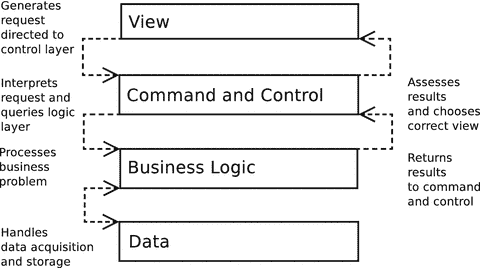

图 12-1. 典型企业系统中的层级（或称层）

图 12-1 所示的结构并非一成不变：其中某些层可以合并，并且根据系统的复杂程度，可以采用不同的通信策略。尽管如此，图 12-1 展示了一个强调灵活性和可重用性的模型，许多企业应用在很大程度上都遵循它。

-   **视图层**包含系统用户实际看到并与之交互的界面。它负责呈现用户请求的结果，并提供向系统发起下一个请求的机制。
-   **命令与控制层**处理来自用户的请求。基于此分析，它将履行请求所需的任何处理委托给业务逻辑层。然后，它选择最适合向用户呈现结果的视图。在实践中，此层与视图层通常会合并为一个单独的表示层。即便如此，显示的角色也应与请求处理和业务逻辑调用的角色严格分离。
-   **业务逻辑层**负责处理请求的业务。它执行所有必要的计算并组织结果数据。
-   **数据层**将系统的其余部分与保存和获取持久化信息的机制隔离开来。在某些系统中，命令与控制层使用数据层来获取其需要处理的业务对象。在其他系统中，数据层则被尽可能地隐藏起来。

那么，以这种方式划分系统有何意义呢？与本书中许多其他内容一样，答案在于解耦。通过保持业务逻辑独立于视图层，您可以在几乎不需要重写的情况下为系统添加新的界面。

设想一个用于管理活动列表的系统（到本章结束时，这将会是一个非常熟悉的例子）。最终用户自然需要一个流畅的 HTML 界面。维护系统的管理员可能需要一个命令行界面，以便集成到自动化系统中。同时，您可能正在开发适用于手机和其他手持设备的系统版本。您甚至可能开始考虑使用 `SOAP` 或 `RESTful API`。

如果您最初将系统的基础逻辑与 HTML 视图层结合在一起（这仍然是一种常见的策略），那么这些需求将会触发一次立即的重写。相反，如果您创建了一个分层的系统，则无需重新考虑业务逻辑层和数据层，就能轻松添加新的呈现策略。

同样，持久化策略也可能会发生变化。您应该能够切换存储模型，同时对系统中的其他层产生最小的影响。

测试是创建具有独立层系统的另一个充分理由。众所周知，Web 应用程序很难测试。在一个分层不充分的系统中，自动化测试必须在一端处理 HTML 界面，同时在另一端冒着触发对数据库进行随机查询的风险，即使它们的关注点并不在这两个领域。尽管任何测试都比没有好，但这样的测试必然是杂乱无章的。相反，在分层系统中，面向其他层的类通常被编写为继承自抽象超类或实现接口。这个超类型随后可以支持多态性。在测试环境中，整个层可以被一组虚拟对象（通常称为“桩”对象或“模拟”对象）替换。通过这种方式，您可以例如使用一个假的数据层来测试业务逻辑。您可以在第 18 章中阅读更多关于测试的内容。

即使您认为测试是给懦夫准备的，并且您的系统永远只会有单一界面，分层也仍然是有用的。通过创建具有明确职责的层，您可以构建一个各部分更易于扩展和调试的系统。通过将具有相同类型责任的代码集中在一个地方（例如，避免将数据库调用或显示策略分散在整个系统中），您可以限制代码重复。对此类系统进行添加相对容易，因为您的更改往往表现为整洁的纵向扩展，而不是混乱的横向扩展。

在分层系统中，一个新功能可能需要一个新的界面组件、额外的请求处理、更多的业务逻辑以及对存储机制的修改。这就是纵向变更。在非分层系统中，您添加了功能后，可能会想起有五个独立的页面引用了您修改过的数据库表。还是六个？您的界面可能被调用的地方可能有几十处，因此您需要遍历整个系统来为此添加代码。这就是横向修改。

当然，在现实中，您永远无法完全摆脱这类横向依赖，尤其是在处理界面中的导航元素时。然而，分层系统可以帮助最大限度地减少横向修改的需求。

**注意**

尽管这些模式中的许多已经存在了一段时间（毕竟，模式反映了久经考验的实践），但它们的名称和边界要么来源于 Martin Fowler 关于企业模式的关键著作《企业应用架构模式》（Addison-Wesley Professional, 2002），要么来源于 Alur 等人颇具影响力的《Core J2EE 模式：最佳实践与设计策略》（Prentice Hall, 2001）。为了保持一致性，在两个来源出现分歧时，我倾向于使用 Fowler 的命名约定。

本章中的所有示例都围绕一个虚构的列表系统展开，该系统有一个听起来很奇特的名称“Woo”，它大致代表“外面有什么”。

该系统的参与者包括场地（例如，剧院、俱乐部或电影院）、空间（例如，1 号屏幕或楼上舞台）和活动（例如，《漫长的美好星期五》或《认真的重要性》）。

我将介绍的操作包括创建场地、为场地添加空间，以及列出系统中的所有场地。

请记住，本章的目的是说明关键的企业设计模式，而不是构建一个可工作的系统。鉴于设计模式相互依赖的特性，这些示例中的大多数与代码示例在很大程度上重叠，充分利用了本章其他地方讨论的基础。由于此代码主要用于演示企业模式，其中大部分并不满足生产系统所要求的所有标准。特别是，我会在可能妨碍清晰度的地方省略错误检查。您应将示例视为说明其所实现模式的手段，而不是作为框架或应用程序中的构建块。

## 我们在开始之前偷个懒

本书中的大多数模式在企业架构的各层中都能找到自然的位置。但有些模式非常基础，以至于它们独立于这种结构之外。`注册表`模式就是一个很好的例子。实际上，`注册表`是一种突破分层所设定的约束的强大方式。它是一个例外，允许规则得以顺畅运行。


### 注册表（Registry）

`Registry`模式旨在提供对系统级对象的访问。如今，全局变量几乎被普遍视为不良设计。但与其他“罪恶”一样，全局数据具有致命的吸引力，以至于面向对象的架构师认为有必要为其换一个新名称来重新发明它。你在第 9 章遇到过`Singleton`模式，但单例对象确实避免了困扰全局变量的所有弊端。特别是，你不会意外覆盖单例。因此，单例是一种低脂的全局变量。尽管如此，你仍应对单例对象保持警惕，因为它们会诱使你将类锚定到系统中，从而引入耦合。

话虽如此，单例有时非常有用，以至于许多程序员（包括我）都无法舍弃它。

### 问题

如你所见，许多企业系统被划分为多个层，每个层仅通过严格定义的通道与相邻层通信。这种层分离赋予了应用程序灵活性。你可以替换或独立开发每一层，而对系统的其余部分影响最小。但问题是：当你在某一层获取的信息，稍后需要在另一个非相邻层中使用时，该怎么办？

假设我在`ApplicationHelper`类中获取配置数据：

```
// listing 12.01
class ApplicationHelper
{
public function getOptions(): array
{
$optionfile = __DIR__ . "/data/woo_options.xml";
if (! file_exists($optionfile)) {
throw new AppException("Could not find options file");
}
$options = simplexml:load_file($optionfile);
$dsn = (string) $options->dsn;
// 现在我们要如何处理这个数据？
// ...
}
}
```

获取信息很容易，但我要如何将其传递到稍后需要它的数据层？以及其他所有需要分发到整个系统的配置信息呢？

一种答案是：将这些信息在系统中从一个对象传递到另一个对象：从负责处理请求的控制器对象，到业务逻辑层的对象，最后到负责与数据库通信的对象。

这完全可行。实际上，你可以直接传递`ApplicationHelper`对象本身，或者传递一个更专门的`Context`对象。无论哪种方式，上下文信息都会通过系统各层传输到需要它的对象。

但权衡是，为了做到这一点，你必须修改所有中继上下文对象的接口，无论它们是否需要使用它。显然，这在某种程度上破坏了松耦合。

`Registry`模式提供了一种替代方案，但它也自有其后果。

注册表就是一个通过静态方法（或通过单例上的实例方法）提供对数据（通常但不仅仅是对象）访问的类。因此，系统中的每个对象都可以访问这些对象。

术语“Registry”源自 Fowler 的《企业应用架构模式》；但与其他模式一样，其实现无处不在。在《程序员修炼之道：从小工到专家》（Addison-Wesley Professional, 1999）中，David Hunt 和 David Thomas 将注册表类比作警局的事件公告板。一班警探将证据和草图留在公告板上，然后由另一班新警探取用。我也见过`Registry`模式被称为白板或黑板。

### 实现

图 12-2 展示了一个存储并提供`Request`对象的`Registry`对象。

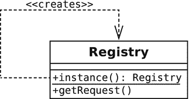

图 12-2. 一个简单的注册表

这是该类的代码形式：

```
// listing 12.02
class Registry
{
private static $instance = null;
private $request;
private function __construct()
{
}
public static function instance(): self
{
if (is_null(self::$instance)) {
self::$instance = new self();
}
return self::$instance;
}
public function getRequest(): Request
{
if (is_null($this->request)) {
$this->request = new Request();
}
return $this->request;
}
}
// listing 12.03
class Request
{
}
```

然后你可以从系统的任何部分访问同一个`Request`对象：

```
// listing 12.04
$reg = Registry::instance();
print_r($reg->getRequest());
```

如你所见，`Registry`只是一个单例（如果需要复习单例类，请参见第 9 章）。代码通过`instance()`方法创建并返回`Registry`类的唯一实例。然后可以用它来获取`Request`对象。

我曾有过不顾风险使用基于键的系统的经历，如下所示：

```
// listing 12.05
class Registry
{
private static $instance=null;
private $values = [];
private function __construct()
{
}
public static function instance(): self
{
if (is_null(self::$instance)) {
self::$instance = new self();
}
return self::$instance;
}
public function get(string $key)
{
if (isset($this->values[$key])) {
return $this->values[$key];
}
return null;
}
public function set(string $key, $value)
{
$this->values[$key] = $value;
}
}
```

这里的好处是，你不需要为每个要存储和提供的对象创建方法。但缺点是，你通过后门重新引入了全局变量。使用任意字符串作为存储对象的键意味着，没有什么能阻止系统的一部分在添加对象时覆盖键/值对。我发现，在开发期间使用这种类似映射的结构很有用，然后在我明确需要存储和检索的数据后，再转向使用显式命名的方法。

注意

`Registry`模式并不是管理系统所需服务的唯一方式。在第 10 章中，我们介绍了一种类似的策略，名为依赖注入，它被用在像 Symfony 这样的流行框架中。

你也可以使用注册表对象作为系统中常见对象的工厂。`Registry`类不存储提供的对象，而是创建一个实例并缓存引用。它可能还在后台做一些设置工作，比如从配置文件中检索数据或组合多个对象：

```
// listing 12.06
// class Registry
private $treeBuilder = null;
private $conf = null;
// ...
public function treeBuilder(): TreeBuilder
{
if (is_null($this->treeBuilder)) {
$this->treeBuilder = new TreeBuilder($this->conf()->get('treedir'));
}
return $this->treeBuilder;
}
public function conf(): Conf
{
if (is_null($this->conf)) {
$this->conf = new Conf();
}
return $this->conf;
}
```

`TreeBuilder`和`Conf`只是用来演示要点的哑类。需要`TreeBuilder`对象的客户端类可以简单地调用`Registry::treeBuilder()`，而无需关心初始化的复杂性。这些复杂性可能包括应用程序级数据（如哑`Conf`对象），系统中的大多数类应该与它们隔离。

注册表对象也有助于测试。静态方法`instance()`可用于提供`Registry`类的子类，并预装入虚拟对象。以下是我可能如何修改`instance()`以实现这一点：


```
// listing 12.07
// class Registry
private static $testmode = false;
// ...
public static function testMode(bool $mode = true)
{
self::$instance = null;
self::$testmode = $mode;
}
public static function instance(): self
{
if (is_null(self::$instance)) {
if (self::$testmode) {
self::$instance = new MockRegistry();
} else {
self::$instance = new self();
}
}
return self::$instance;
}
```

当您需要全面测试系统时，可以使用测试模式切换为伪造的注册表。它可以提供桩（stub，用于模拟真实测试环境的对象）或模拟对象（mock，既能分析对其发起的调用，又能评估调用正确性的类似对象）：

```
// listing 12.08
Registry::testMode();
$mockreg = Registry::instance();
```

您可以在第 18 章中了解更多关于模拟对象和桩对象的内容。

### 注册表、作用域与 PHP

"作用域"（scope）一词通常用于描述对象或值在代码结构上下文中的可见性。变量的生命周期也可以从时间维度来衡量。从这个意义上讲，您可以考虑三种作用域级别。标准的是 HTTP 请求覆盖的时间段。PHP 还内置支持会话变量。这些变量会在请求结束时被序列化并保存到文件系统或数据库中，然后在下一个请求开始时恢复。存储在 Cookie 中或通过查询字符串传递的会话 ID 用于跟踪会话所有者。因此，您可以将某些变量视为具有会话作用域。您可以通过在请求之间存储一些对象来利用这一点，从而省去一次数据库查询。显然，您需要小心，避免最终出现同一个对象的多个版本，因此当您检查一个也存在于数据库中的对象并将其存入会话时，可能需要考虑一种锁定策略。

在其他语言中（尤其是 Java 和运行在 `ModPerl` Apache 模块上的 Perl），存在"应用程序作用域"（application scope）的概念。处于该作用域内的变量适用于应用程序的所有实例。这对 PHP 来说相当陌生；但在大型应用中，能够访问一个应用级全局空间来获取配置变量，可能会被认为是有用的。

在本书的先前版本中，我演示了会话作用域和应用作用域注册表类的示例；但自从我第一次编写那段示例代码以来的大约十年间，我从未需要过除请求作用域注册表之外的任何其他类型。这种按请求处理的方式存在初始化成本，但您通常会使用缓存策略来管理它。

### 影响

`Registry` 对象使其数据全局可访问。这意味着任何作为注册表客户端的类都会表现出一种未在其接口中声明的依赖关系。如果您开始依赖 `Registry` 对象来处理系统中的大量数据，这可能会成为一个严重的问题。最好谨慎使用 `Registry` 对象，仅将其用于一组明确定义的数据项。

### 表示层

当请求到达您的系统时，您必须解释其所携带的需求，调用所需的任何业务逻辑，最后返回一个响应。对于简单的脚本，整个过程通常完全在视图本身内部完成，只有重量级的逻辑和持久化代码被分离到库中。

> **注意：** 视图是视图层中的单个元素。它可以是一个 PHP 页面（或由多个组合视图元素构成的集合），其主要职责是显示数据，并提供用户生成新请求的机制。也可以是一个像 `Twig` 这样的系统中的模板。

随着系统规模的增长，这种默认策略会变得越来越不可行，因为请求处理、业务逻辑调用和视图分发逻辑必然会在各个视图之间重复。

在本节中，我将探讨管理表示层这三项关键职责的策略。由于视图层与命令控制层之间的界限通常相当模糊，因此将它们统一放在"表示层"这个通用术语下一起讨论是合理的。

### 前端控制器

这种模式与传统的、具有多个入口点的 PHP 应用程序截然相反。前端控制器模式为所有传入请求提供一个中心访问点，最终委托视图来执行向用户呈现结果的任务。这是 Java 企业社区中的一个关键模式。`Core J2EE Patterns: Best Practices and Design Strategies` 对此有非常详细的介绍，该书至今仍是最具影响力的企业模式资源之一。这种模式在 PHP 社区中并非普遍受欢迎，部分原因在于初始化有时会带来开销。

我编写的大多数系统都倾向于使用前端控制器。也就是说，我可能不会从一开始就部署完整的模式，但我清楚如果未来需要它提供的灵活性，应该如何将项目演进为前端控制器实现所需采取的步骤。

### 问题所在

当请求在系统的多个点被处理时，很难避免代码中的重复。您可能需要验证用户身份、将术语翻译成不同语言，或者仅仅是访问通用数据。当一个请求跨视图需要执行通用操作时，您可能会发现自己反复复制粘贴代码。这会使修改变得困难，因为一个简单的改动可能需要在系统的多个位置进行部署。因此，代码的某些部分很容易与其他部分变得不一致。当然，第一步可能是将通用操作集中到库代码中，但您仍然需要在系统各处分布调用这些库函数或方法。

另一个可能出现在控制分散在各视图中的系统里的问题，是难以管理视图到视图的流转。在一个复杂系统中，根据输入以及在逻辑层执行的操作是否成功，一个视图中的提交可能导致任意数量的结果页面。视图之间的转发可能会变得混乱，特别是当同一个视图可能在不同流程中被使用时。


### 实现

核心而言，前端控制器模式为每个请求定义了一个统一的入口点。它处理请求，并据此选择要执行的操作。这些操作通常被封装在专门的 `command` 对象中，这些对象遵循命令模式进行组织。

图 12-3 展示了前端控制器实现的概览。

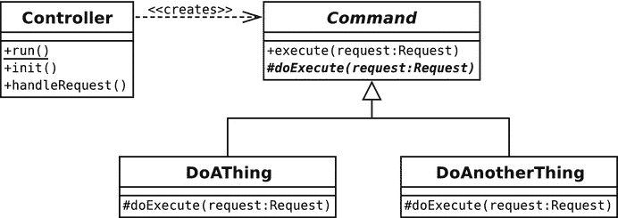

图 12-3. 一个 `Controller` 类与命令层次结构

实际上，你可能会部署一些辅助类来简化流程，但我们先从核心参与者开始。下面是一个简单的 `Controller` 类：

```
// 清单 12.09
class Controller
{
private $reg;
private function __construct()
{
$this->reg = Registry::instance();
}
public static function run()
{
$instance = new Controller();
$instance->init();
$instance->handleRequest();
}
private function init()
{
$this->reg->getApplicationHelper()->init();
}
private function handleRequest()
{
$request = $reg->getRequest();
$resolver = new CommandResolver();
$cmd = $resolver->getCommand($request);
$cmd->execute($request);
}
}
```

虽然代码已简化且缺乏错误处理，但 `Controller` 类本身并无更多内容。控制器位于系统的顶端，将工作委派给其他类。正是这些其他类完成了大部分实际工作。`run()` 只是一个便捷方法，用于调用 `init()` 和 `handleRequest()`。它是静态方法，且构造函数是私有的，因此客户端代码唯一的选择就是启动整个系统的执行。我通常在一个名为 `index.php` 的文件中实现这一点，该文件只包含几行代码：

```
// 清单 12.10
require_once(__DIR__ . "/../../../vendor/autoload.php");
use \popp\ch12\batch05\Controller;
Controller::run();
```

请注意那个看起来不太美观的 `require` 语句。它的存在仅仅是为了让系统其余部分无需显式包含文件。`autoload.php` 脚本由 Composer 自动生成，它管理着按需加载类文件的逻辑。如果你对此不太理解，也不必担心；我们会在第 16 章更详细地探讨自动加载。

在 PHP 中，`init()` 和 `handleRequest()` 方法之间的区别实际上只是类别上的。在某些语言中，`init()` 仅在应用程序启动时运行，而 `handleRequest()` 或其等效方法则为每个用户请求运行。即使每次请求都会调用 `init()`，此类也遵循了设置与请求处理之间的区分。

`init()` 方法通过 `Registry` 类（由 Controller 的 `$reg` 属性引用）调用一个名为 `ApplicationHelper` 的类。`ApplicationHelper` 类管理整个应用程序的配置数据。`Controller::init()` 调用了 `ApplicationHelper` 中的一个方法（也称为 `init()`），该方法会初始化应用程序所用的数据。

`handleRequest()` 方法使用 `CommandResolver` 来获取一个 `Command` 对象，然后通过调用 `Command::execute()` 来执行该对象。

##### ApplicationHelper

`ApplicationHelper` 类对于前端控制器并非必需。不过，大多数实现都需要获取基本配置数据，因此我需要为此制定一个策略。下面是一个简单的 `ApplicationHelper`：

```
// 清单 12.11
class ApplicationHelper
{
private $config = __DIR__ . "/data/woo_options.ini";
private $reg;
public function __construct()
{
$this->reg = Registry::instance();
}
public function init()
{
$this->setupOptions();
if (isset($_SERVER['REQUEST_METHOD'])) {
$request = new HttpRequest();
} else {
$request = new CliRequest();
}
$this->reg->setRequest($request);
}
private function setupOptions()
{
if (! file_exists($this->config)) {
throw new AppException("Could not find options file");
}
$options = parse_ini_file($this->config, true);
$conf = new Conf($options['config']);
$this->reg->setConf($conf);
$commands = new Conf($options['commands']);
$this->reg->setCommands($commands);
}
}
```

这个类简单地读取一个配置文件，并将各种对象添加到注册表中，从而使整个系统能够访问它们。`init()` 方法调用了一个私有方法 `setupOptions()`，它读取一个 `.ini` 文件，然后将两个数组（每个数组都封装在名为 `Conf` 的类实例中）传递给 `Registry` 对象。`Conf` 类只有 `get()` 和 `set()` 方法——尽管更复杂的配置类可能会管理文件的搜索和解析以及数据管理。其中一个 `Conf` 数组用于存放通用配置值，并通过 `Registry::setConf()` 传入。另一个数组用于将 URL 路径映射到 `Command` 类，我通过 `Registry::setCommands()` 传入。

`init()` 方法还会尝试判断应用程序是在 Web 环境还是命令行环境中运行（通过检查 `$_SERVER['REQUEST_METHOD']` 是否存在）。根据测试结果，它会将一个特定的 `Request` 子类传递给 `Registry` 对象。

由于 `Registry` 类几乎只负责存储和提供对象，其源代码清单并不令人兴奋。但为了完整性，以下是 `ApplicationHelper` 使用或间接涉及的额外 `Registry` 方法：

```
// 清单 12.12
// 必须由某个更智能的组件初始化
public function setRequest(Request $request)
{
$this->request = $request;
}
public function getRequest(): Request
{
if (is_null($this->request)) {
throw new \Exception("No Request set");
}
return $this->request;
}
public function getApplicationHelper(): ApplicationHelper
{
if (is_null($this->applicationHelper)) {
$this->applicationHelper = new ApplicationHelper();
}
return $this->applicationHelper;
}
public function setConf(Conf $conf)
{
$this->conf = $conf;
}
public function getConf(): Conf
{
if (is_null($this->conf)) {
$this->conf = new Conf();
}
return $this->conf;
}
public function setCommands(Conf $commands)
{
$this->commands = $commands;
}
public function getCommands(): Conf
{
return $this->commands;
}
```

以下是一个简单的配置文件：

```
[config]
dsn=sqlite:/var/popp/src/ch12/batch05/data/woo.db
[commands]
/=\popp\ch12\batch05\DefaultCommand
```


##### `CommandResolver`

控制器需要决定如何解释 HTTP 请求，以便调用正确的代码来处理该请求。虽然你可以轻松地将此逻辑放在 `Controller` 类本身中，但我更倾向于为此使用专门的类。这样，在必要时可以轻松地重构为多态形式。

前端控制器通常通过运行 `Command` 对象来调用应用程序逻辑（我在第 11 章介绍了 `Command` 模式）。`Command` 是根据请求 URL 选择的（使用 URL 路径，或者较少见的 GET 参数）。无论哪种方式，最终都会得到一个可用于选择 `Command` 的令牌或模式。不止有一种方法可以使用 URL 来选择命令。例如，你可以根据配置文件或数据结构来测试令牌（逻辑策略）。或者，你可以直接在文件系统上针对类文件进行测试（物理策略）。

上一章中你看到了一个使用物理策略的命令工厂示例。这次，我将采用逻辑方法，将 URL 片段映射到 `Command` 类：

```php
// listing 12.13
class CommandResolver
{
private static $refcmd = null;
private static $defaultcmd = DefaultCommand::class;
public function __construct()
{
// 可以将其设置为可配置
self::$refcmd = new \ReflectionClass(Command::class);
}
public function getCommand(Request $request): Command
{
$reg = Registry::instance();
$commands = $reg->getCommands();
$path = $request->getPath();
$class = $commands->get($path);
if (is_null($class)) {
$request->addFeedback("路径 '$path' 不匹配");
return new self::$defaultcmd();
}
if (! class_exists($class)) {
$request->addFeedback("类 '$class' 未找到");
return new self::$defaultcmd();
}
$refclass = new \ReflectionClass($class);
if (! $refclass->isSubClassOf(self::$refcmd)) {
$request->addFeedback("命令 '$refclass' 不是一个 Command");
return new self::$defaultcmd();
}
return $refclass->newInstance();
}
}
```

这个简单的类从注册表中获取一个 `Conf` 对象，并使用 URL 路径（由 `Request::getPath()` 方法提供）来尝试获取一个类名。如果找到类名，并且该类存在且扩展了 `Command` 基类，则实例化并返回它。

如果这些条件中的任何一个不满足，`getCommand()` 方法会通过提供一个默认的 `Command` 对象来优雅降级。

更复杂的实现（例如，Silex 和 Symfony 中路由逻辑所使用的实现）将允许在这些路径中使用通配符。

你可能会问，为什么这段代码会信任它找到的 `Command` 类不需要参数：

```php
return $refclass->newInstance();
```

答案在于 `Command` 类本身的签名：

```php
// listing 12.14
abstract class Command
{
final public function __construct()
{
}
public function execute(Request $request)
{
$this->doExecute($request);
}
abstract public function doExecute(Request $request);
}
```

通过将构造函数方法声明为 `final`，我使得子类无法重写它。因此，没有 `Command` 类需要为其构造函数提供参数。

在创建命令类时，你应该小心，尽可能让它们不包含应用程序逻辑。一旦它们开始处理应用程序类型的事情，你会发现它们变成了一种混乱的事务脚本，重复代码很快就会渗入。命令是一种中继站：它们应该解释请求、调用领域层来操作一些对象，然后为表示层存放数据。一旦它们开始做比这更复杂的事情，可能就是重构的时候了。好消息是重构相对容易。发现命令试图做太多事情并不难，解决方案通常也很明确：将该功能下移到辅助类或领域类中。

##### `Request`

请求由 PHP 为我们神奇地处理，并整齐地打包在超全局数组中。你可能已经注意到，我仍然使用一个类来表示请求。一个 `Request` 对象被传递给 `CommandResolver`，然后再传递给 `Command`。

我为什么不让这些类直接查询 `$_REQUEST`、`$_POST` 或 `$_GET` 数组呢？当然可以这样做，但通过将请求操作集中在一个地方，我开启了新的可能性。

例如，你可以对传入的请求应用过滤器。或者，如下一个示例所示，你可以从 HTTP 请求之外的其他地方收集请求参数，从而允许从命令行或测试脚本运行应用程序。

`Request` 对象也是一个有用的存储库，用于存放需要传递给视图层的数据。实际上，许多系统为此目的提供了单独的 `Response` 对象，但这里我们会保持精简。

下面是一个简单的 `Request` 超类：

```php
// listing 12.15
abstract class Request
{
protected $properties;
protected $feedback = [];
protected $path = "/";
public function __construct()
{
$this->init();
}
abstract public function init();
public function setPath(string $path)
{
$this->path = $path;
}
public function getPath(): string
{
return $this->path;
}
public function getProperty(string $key)
{
if (isset($this->properties[$key])) {
return $this->properties[$key];
}
return null;
}
public function setProperty(string $key, $val)
{
$this->properties[$key] = $val;
}
public function addFeedback(string $msg)
{
array_push($this->feedback, $msg);
}
public function getFeedback(): array
{
return $this->feedback;
}
public function getFeedbackString($separator = "\n"): string
{
return implode($separator, $this->feedback);
}
public function clearFeedback()
{
$this->feedback = [];
}
}
```

如你所见，这个类的大部分内容都用于设置和获取属性的机制。`init()` 方法负责填充私有的 `$properties` 数组，这将在子类中处理。值得注意的是，这个示例实现忽略了请求方法——在现实世界中你绝不会想这样做。一个完整的实现应该管理 `GET`、`POST` 和 `PUT` 数组，并提供一个统一的查询机制。一旦你有了一个 `Request` 对象，你应该能够通过 `getProperty()` 方法访问参数，该方法接受一个键字符串并返回对应的值（存储在 `$properties` 数组中）。你也可以通过 `setProperty()` 添加数据。

该类还管理一个 `$feedback` 数组。这是一个简单的通道，控制器类可以通过它向用户传递消息。在更完整的实现中，我们很可能需要区分错误消息和信息性消息。

你可能记得 `ApplicationHelper` 实例化了 `HttpRequest` 和 `CliRequest` 中的一个。以下是第一个：

```php
// listing 12.16
class HttpRequest extends Request
{
public function init()
{
// 我们为了方便忽略了 POST/GET 等区别
// 在现实世界中不要这样做！
$this->properties = $_REQUEST;
$this->path = $_SERVER['PATH_INFO'];
$this->path = (empty($this->path)) ? "/" : $this->path;
}
}
```

`CliRequest` 从命令行获取参数对，形式为 `key=value`，并将它们分解为属性。它还会检测带有 `path:` 前缀的参数，并将提供的值赋给对象的 `$path` 属性：

```php
// listing 12.17
class CliRequest extends Request
{
public function init()
{
$args = $_SERVER['argv'];
foreach ($args as $arg) {
if (preg_match("/^path:(\S+)/", $arg, $matches)) {
$this->path = $matches[1];
} else {
if (strpos($arg, '=')) {
list($key, $val) = explode("=", $arg);
$this->setProperty($key, $val);
}
}
}
$this->path = (empty($this->path)) ? "/" : $this->path ;
}
}
```


##### 一个命令

你已经见过`Command`基类，第 11 章已经详细介绍了命令模式，因此无需再深入探讨命令。不过，让我们用一个简单具体的`Command`对象来做个收尾：

```
// 清单 12.18
class DefaultCommand extends Command
{
public function doExecute(Request $request)
{
$request->addFeedback("欢迎来到 WOO");
include(__DIR__ . "/main.php");
}
}
```

这个`Command`对象是在未收到对某个特定`Command`的明确请求时，由`CommandResolver`提供的。

你可能已经注意到，抽象基类自己实现了`execute()`方法，该方法会向下调用其子类的`doExecute()`实现。这样一来，我们只需修改基类，就能为所有命令添加设置和清理代码。

`execute()`方法接收一个`Request`对象，该对象提供了对用户输入以及`setFeedback()`方法的访问。`DefaultCommand`利用这一点来设置一条欢迎消息。

最后，该命令通过调用`include()`将控制权分发到视图。将命令到视图的映射嵌入到`Command`类中是最简单的分发机制；但对于小型系统来说，它可能完全够用。更灵活的策略可以在“应用程序控制器”部分找到。

文件`main.php`包含一些 HTML 代码以及对`Request`对象的一次调用，用于检查是否有任何反馈（稍后我将更详细地介绍视图）。现在，所有组件都已就位，可以运行系统了。以下是输出：

```

Woo! 这是 WOO！

欢迎来到 WOO

```

如你所见，默认命令设置的反馈消息已经出现在输出中。让我们回顾一下得出这一结果的完整流程。

##### 概述

本节中介绍的类的细节可能会掩盖前端控制器模式的简洁性。图 12-4 展示了一个说明请求生命周期的时序图。

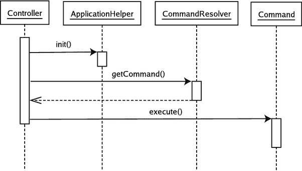

图 12-4. 运行中的前端控制器

如你所见，前端控制器将初始化工作委托给`ApplicationHelper`对象（该对象可以使用缓存来缩短任何昂贵的设置过程）。然后，`Controller`从`CommandResolver`对象获取一个`Command`对象。最后，它调用`Command::execute()`来启动应用程序逻辑。

在此模式实现中，`Command`自身负责将任务委托给视图层。你可以在下一节中看到对此的改进。

### 影响

前端控制器并非为胆小者设计。它确实需要在看到收益之前投入大量的前期开发工作。如果你的项目需要快速交付，或者项目规模小到前端控制器框架比系统其余部分还要重，那么这是一个严重的缺点。

话虽如此，一旦你在一个项目中成功部署了前端控制器，你会发现你可以用惊人的速度将其复用于其他项目。你可以将其大部分功能抽象到库代码中，从而有效地为自己构建一个可重用的框架。

所有配置信息必须在每次请求时加载，这是另一个缺点。所有方法在某种程度上都会受到这个问题的影响，但前端控制器通常需要额外的信息，例如命令和视图的逻辑映射。

通过缓存此类数据，可以大大减轻这种开销。最高效的做法是将这些数据作为原生 PHP 代码添加到你的系统中。如果你是系统的唯一维护者，这没问题；但如果你有非技术用户，你可能需要提供一个配置文件。不过，你仍然可以通过创建一个系统来使原生 PHP 方法自动化，该系统读取配置文件，然后构建 PHP 数据结构，并将其写入缓存文件。一旦创建了原生 PHP 缓存，系统会优先使用它而不是配置文件，直到进行更改并需要重建缓存。

从好的方面来看，前端控制器集中了系统的表示逻辑。这意味着你可以在一个地方（好吧，至少是在一组类中）控制请求的处理方式和视图的选择方式。这减少了重复，并降低了出现 Bug 的可能性。

前端控制器还具有很强的可扩展性。一旦你有了一个核心并使其运行，你就可以非常轻松地添加新的`Command`类和视图。

在本示例中，命令处理它们自己的视图分发。如果你将前端控制器模式与一个有助于视图（以及可能的命令）选择的对象结合使用，那么该模式就能对导航进行出色的控制，而当表示控制分散在整个系统中时，这种控制很难优雅地维护。我将在下一节介绍这样一个对象。

### 应用程序控制器

允许命令调用它们自己的视图对于较小的系统来说是可以接受的，但这并不理想。最好尽可能地将你的命令与视图层解耦。

应用程序控制器负责将请求映射到命令，并将命令映射到视图。这种解耦意味着在无需更改代码库的情况下，切换不同的视图集变得更加容易。它还允许系统所有者更改应用程序的流程，同样无需触及任何内部代码。通过支持命令解析的逻辑系统，该模式也使得同一个命令在系统中的不同上下文中使用变得更加容易。

### 问题

记住示例问题的性质。管理员需要能够向系统添加一个场地，并将一个空间与之关联。因此，系统可能支持`AddVenue`和`AddSpace`命令。根据到目前为止的示例，这些命令将使用从路径（`/addvenue`）到类（`AddVenue`）的直接映射进行选择。

广义上讲，对`AddVenue`命令的成功调用应会导致对`AddSpace`命令的初始调用。这种关系可能被硬编码到类本身中，即`AddVenue`在成功时调用`AddSpace`。然后，`AddSpace`可能包含一个视图，该视图包含用于将空间添加到场地的表单。

两个命令都可能与至少两个不同的视图相关联：一个用于呈现输入表单的核心视图，以及一个错误或“感谢”屏幕。根据已经讨论过的逻辑，`Command`类本身会包含这些视图（通过使用条件测试来决定在何种情况下显示哪个视图）。

只要命令始终以相同的方式被使用，这种程度的硬编码是可以接受的。但是，如果我希望在某些情况下为`AddVenue`设置一个特殊的视图，并且我希望更改一个命令导致另一个命令的逻辑（例如，一个流程可能在成功的场地添加和开始空间添加之间包含一个额外的屏幕），那么它就开始失效了。如果你的每个命令只使用一次，与其他命令保持一种关系，并且只使用一个视图，那么你应该对命令之间的关系及其视图进行硬编码。否则，你应该继续阅读。

一个应用程序控制器类可以接管这个逻辑，从而释放`Command`类的压力，让它们专注于自己的工作：处理输入、调用应用程序逻辑以及处理任何结果。


### 实现

一如既往，该模式的关键在于接口。应用控制器是一个类（或一组类），前端控制器可使用它根据用户请求获取命令，并在命令执行后找到要呈现的正确视图。图 12-5 展示了这种关系的基本框架。

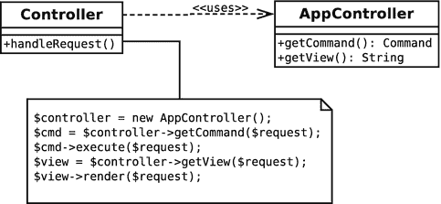

图 12-5.

应用控制器模式

与本章中的所有模式一样，其目标是为客户端代码尽可能简化操作——因此前端控制器类十分精简。然而，在接口背后，我必须部署一个实现。这里介绍的方法只是其中一种实现方式。当你阅读本节时，请记住，该模式的本质在于参与者（应用控制器、命令和视图）之间的交互方式，而非本实现的具体细节。

让我们从使用应用控制器的代码开始。

### 前端控制器

以下是 `FrontController` 与 `AppController` 类协同工作的一种方式（已简化并去除了错误处理）：

```
// 列表 12.19
// 控制器
private function __construct()
{
$this->reg = Registry::instance();
}
public function handleRequest()
{
$request = $this->reg->getRequest();
$controller = new AppController();
$cmd = $controller->getCommand($request);
$cmd->execute($request);
$view = $controller->getView($request);
$view->render($request);
}
```

与上一示例相比，主要区别在于，除了将类名从 `CommandResolver` 改为 `AppController`（诚然，这在某种程度上只是外观上的改动），我们现在还同时获取了 `ViewComponent` 和 `Command` 对象。请注意，此代码使用注册表对象来获取 `Request` 对象。我们也可以将 `AppController` 对象存储在 `Registry` 中——即使其他组件在其他地方并未使用它。避免直接实例化的类通常更灵活且更易于测试。

那么，`AppController` 是根据什么逻辑知道哪个视图与哪个命令相关联的呢？与面向对象代码一样，接口比实现更重要。不过，让我们来填充一种可能的方法。

##### 实现概述

一个 `Command` 类可能会根据操作的不同阶段来要求显示不同的视图。`AddVenue` 命令的默认视图可能是一个数据输入表单。如果用户添加了错误类型的数据，可能会再次显示该表单，或者显示一个错误页面。如果一切顺利，并且在系统中成功创建了场地，那么我可能希望转发到一连串 `Command` 对象中的下一个：或许是 `AddSpace`。

`Command` 对象通过设置状态标志来告知系统其当前状态。以下是这个最小实现所识别的标志（在 `Command` 父类中作为属性设置）：

```
// 列表 12.20
const CMD_DEFAULT = 0;
const CMD_OK = 1;
const CMD_ERROR = 2;
const CMD_INSUFFICIENT_DATA = 3;
```

应用控制器使用 `Request` 对象查找并实例化正确的 `Command` 类。一旦命令执行完毕，它将与一个状态相关联。可以将这种“命令+状态”的组合与一个数据结构进行比较，以确定接下来应该执行哪个命令，或者——如果没有更多命令需要执行——应该提供哪个视图。

##### 配置文件

系统的所有者可以通过设置一组配置指令来决定命令和视图协同工作的方式。以下是一个摘录：

这个 XML 片段展示了一种策略，用于将命令的执行流程及其与视图的关系从 `Command` 类本身中抽象出来。所有指令都包含在一个 `control` 元素中。

每个 `command` 元素都定义了描述基本命令映射的 `path` 和 `class` 属性。然而，视图的逻辑更为复杂。`command` 顶级下的 `view` 元素定义了一个默认关系。换句话说，如果没有匹配更具体的条件，该 `view` 将用于该命令。`status` 元素则定义了这些具体条件。它们的 `value` 属性应与你之前看到的某个命令状态相匹配。例如，当命令执行产生 `CMD_OK` 状态时，如果在 XML 文档中定义了对应的状态，则将使用相应的 `view` 元素。

`view` 元素定义了一个 `name` 属性。该值用于构建一个指向模板文件的路径，随后可包含该模板文件。

`command` 或 `status` 元素可能包含一个 `forward` 元素来代替 `view`。WOO 系统将 `forward` 视为一种特殊的 `view`，它不会渲染模板，而是使用新的路径重新调用应用程序。

让我们根据上述解释来梳理一下这段 XML 的片段：

当使用 `/addvenue` 路径调用系统时，将调用 `AddVenue` 命令。然后它会生成一个状态值——`CMD_DEFAULT`、`CMD_OK`、`CMD_ERROR` 或 `CMD_INSUFFICIENT_DATA` 中的一个。对于除 `CMD_OK` 之外的任何状态，都将调用 `addvenue` 模板。但是，如果命令返回 `CMD_OK` 状态，则条件匹配。`status` 元素可以简单地包含另一个视图来替换默认视图。然而，这里 `forward` 元素开始发挥作用。通过转发到另一个 `command`，配置文件将处理视图的所有责任委托给了新元素。然后，系统将在新请求中从 `/addspace` 路径重新开始。


##### 解析配置文件

得益于 SimpleXML 扩展，我们无需执行任何实际的解析工作——这已由该扩展代为处理。剩下要做的只是遍历 SimpleXML 数据结构，构建我们自己的数据。以下是名为 `ViewComponentCompiler` 的类，它正是执行此操作的：

```php
// 代码清单 12.21
class ViewComponentCompiler
{
private static $defaultcmd = DefaultCommand::class;
public function parseFile($file)
{
$options = \simplexml:load_file($file);
return $this->parse($options);
}
public function parse(\SimpleXMLElement $options): Conf
{
$conf = new Conf();
foreach ($options->control->command as $command) {
$path = (string)$command['path'];
$cmdstr = (string)$command['class'];
$path = (empty($path)) ? "/" : $path;
$cmdstr = (empty($cmdstr)) ? self::$defaultcmd : $cmdstr;
$pathobj = new ComponentDescriptor($path, $cmdstr);
$this->processView($pathobj, 0, $command);
if (isset($command->status) && isset($command->status['value'])) {
foreach ($command->status as $statusel) {
$status = (string)$statusel['value'];
$statusval = constant(Command::class . "::" . $status);
if (is_null($statusval)) {
throw new AppException("未知状态: {$status}");
}
$this->processView($pathobj, $statusval, $statusel);
}
}
$conf->set($path, $pathobj);
}
return $conf;
}
public function processView(ComponentDescriptor $pathobj, int $statusval, \SimpleXMLElement $el)
{
if (isset($el->view) && isset($el->view['name'])) {
$pathobj->setView($statusval, new TemplateViewComponent((string)$el->view['name']));
}
if (isset($el->forward) && isset($el->forward['path'])) {
$pathobj->setView($statusval, new ForwardViewComponent((string)$el->forward['path']));
}
}
}
```

这里的实际操作发生在 `parse()` 方法中，该方法接收一个用于遍历的 `SimpleXMLElement` 对象。首先，我实例化一个 `Conf` 对象（请记住，这只是一个对数组的包装）。然后，我遍历 XML 中的命令元素。对于每个命令，我提取 `path` 和 `class` 属性的值，并将这些数据传递给 `ComponentDescriptor` 对象的构造函数。该对象将管理与一个 `command` 元素相关的信息包——你很快会看到这个类。

接着，我调用一个名为 `processView()` 的私有方法，向它传递 `ComponentDescriptor` 对象、一个值为零的整数（因为我们在处理默认状态），以及对当前 XML 元素（即当前为 `command`）的引用。根据在 XML 片段中找到的内容，`processView()` 会创建一个 `TemplateViewComponent` 或 `ForwardViewComponent`，并将其传递给 `ComponentDescriptor::setView()`。当然，它也可能不匹配任何内容而根本不进行调用——但这可能是不明智的。或许在一个更完整的实现中，我们会将其视为一个错误条件。

回到 `parse()` 方法中，我开始处理 `status` 属性。我再次调用 `processView()`——但这次传入的整数对应于 `status` 元素的 `value` 属性中的字符串。换句话说，字符串 `CMD_OK` 变为 1，`CMD_ERROR` 变为 2，以此类推。PHP 的 `constant()` 方法提供了一种简洁的方式来进行这种转换。因此，这次我向 `processView()` 传递一个非零整数，以及 `status` XML 元素。

`processView()` 再次用找到的任何 `ViewComponent` 对象填充 `ComponentDescriptor`。

最后，我将 `ComponentDescriptor` 对象存储在 `Conf` 对象中，以命令组件的 `path` 值作为索引。

循环完成后，我返回 `Conf` 对象。

你可能需要再读一遍才能跟上这个流程；但本质上，这个过程非常简单：`ViewComponentCompiler` 构建一个由 `ComponentDescriptor` 对象组成的数组（如前所述，包装在 `Conf` 对象中）。每个 `ComponentDescriptor` 对象维护关于一个路径和一个 `Command` 类的信息，以及一个按状态值索引的 `ViewComponent` 对象数组（0 表示默认视图）。

尽管有这些繁琐的工作，但重要的是要记住，高层过程相当简单。我们正在构建潜在请求与命令及视图之间的关系。图 12-6 展示了这个初始化过程。

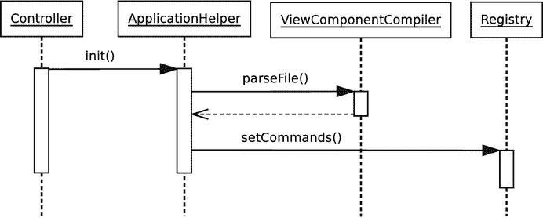

**图 12-6.** 编译命令和视图


## 管理组件数据

你已经看到，编译后的`ComponentDescriptor`对象存储在`Conf`对象中——本质上是一个关联数组的 getter 和 setter。这里的键是系统能够识别的路径：例如`/`或`/addvenue`。

那么，让我们来看看负责管理命令、视图和转发信息的`ComponentDescriptor`类：

```
// 代码清单 12.22
class ComponentDescriptor
{
private $path;
private static $refcmd;
private $cmdstr;
public function __construct(string $path, string $cmdstr)
{
self::$refcmd = new \ReflectionClass(Command::class);
$this->path = $path;
$this->cmdstr = $cmdstr;
}
public function getCommand(): Command
{
return $this->resolveCommand($this->cmdstr);
}
public function setView(int $status, ViewComponent $view)
{
$this->views[$status] = $view;
}
public function getView(Request $request): ViewComponent
{
$status = $request->getCmdStatus();
$status = (is_null($status)) ? 0 : $status;
if (isset($this->views[$status])) {
return $this->views[$status];
}
if (isset($this->views[0])) {
return $this->views[0];
}
throw new AppException("no view found");
}
public function resolveCommand(string $class): Command
{
if (is_null($class)) {
throw new AppException("unknown class '$class'");
}
if (! class_exists($class)) {
throw new AppException("class '$class' not found");
}
$refclass = new \ReflectionClass($class);
if (! $refclass->isSubClassOf(self::$refcmd)) {
throw new AppException("command '$class' is not a Command");
}
return $refclass->newInstance();
}
}
```

这里展示了数据的存储和检索，但实际做的还不止这些。命令信息（`Command`的完整类名）通过构造函数添加，并且仅在调用`getCommand()`时才被延迟转换为`Command`对象。这个实例化和检查过程发生在私有方法`resolveCommand()`中。这里的代码看起来很熟悉——实际上它是从本章前面`CommandResolver`中的等效功能借鉴而来的（嗯……受到其启发）。

获取视图则更容易。请记住，每个视图组件都是通过`setView()`方法存储的。现在我们看到，`ViewComponent`对象实际上是在一个名为`$views`的数组属性中管理的，并以一个整数（即`Command`状态值）作为索引。当客户端代码调用`getView()`方法时，我们会收到一个`Request`对象，其中可能已缓存了`Command`状态。我们通过一个新的便捷方法`Request::getCmdStatus()`获取这个值。有了它，只需在`$views`数组中查找对应的`ViewComponent`元素即可。如果没有匹配项，则返回索引为零的默认视图。

通过这种方式，这个小小的类提供了 XML 文件中`command`元素所隐含的所有逻辑。

由于大部分实际工作都由辅助类完成，应用控制器本身相对较薄。让我们来看一下：

```
// 代码清单 12.23
class AppController
{
private static $defaultcmd = DefaultCommand::class;
private static $defaultview = "fallback";
public function getCommand(Request $request): Command
{
try {
$descriptor = $this->getDescriptor($request);
$cmd = $descriptor->getCommand();
} catch (AppException $e) {
$request->addFeedback($e->getMessage());
return new self::$defaultcmd();
}
return $cmd;
}
public function getView(Request $request): ViewComponent
{
try {
$descriptor = $this->getDescriptor($request);
$view = $descriptor->getView($request);
} catch (AppException $e) {
return new TemplateViewComponent(self::$defaultview);
}
return $view;
}
private function getDescriptor(Request $request): ComponentDescriptor
{
$reg = Registry::instance();
$commands = $reg->getCommands();
$path = $request->getPath();
$descriptor = $commands->get($path);
if (is_null($descriptor)) {
throw new AppException("no descriptor for {$path}", 404);
}
return $descriptor;
}
}
```

这个类中没有太多实际逻辑，因为大部分复杂性都被下放到了各种辅助类中。`getCommand()`和`getView()`都调用一个私有方法`getDescriptor()`来获取当前请求的`ComponentDescriptor`。`getDescriptor()`方法从`Request`对象中获取当前路径，并用它从一个`Conf`对象中提取出`ComponentDescriptor`对象，该`Conf`对象也由注册表存储，并通过`getCommands()`返回。请记住，这个`ComponentDescriptor`对象数组之前是由`ViewComponentCompiler`对象填充的，其键是潜在的路径。

一旦`getCommand()`和`getView()`获得了`ComponentDescriptor`对象，每个方法就可以调用其对应的方法了。在`getCommand()`中，我们调用`ComponentDescriptor::getCommand()`；在`getView()`中，我们调用`ComponentDescriptor::getView()`。

在继续之前，还有几个细节需要收尾。既然`Command`对象不再调用视图，我们需要一种渲染模板的机制。这由`TemplateViewComponent`对象处理。这些对象实现了一个接口`ViewComponent`：

```
// 代码清单 12.24
interface ViewComponent
{
public function render(Request $request);
}
```

为什么需要这个接口？我们将转发和模板显示都视为视图处理过程。下面是`TemplateViewDisplay`：

```
// 代码清单 12.25
class TemplateViewComponent implements ViewComponent
{
private $name = null;
public function __construct(string $name)
{
$this->name = $name;
}
public function render(Request $request)
{
$reg = Registry::instance();
$conf = $reg->getConf();
$path = $conf->get("templatepath");
if (is_null($path)) {
throw new AppException("no template directory");
}
$fullpath = "{$path}/{$this->name}.php";
if (! file_exists($fullpath)) {
throw new AppException("no template at {$fullpath}");
}
include($fullpath);
}
}
```

这个类在实例化时接收一个名称——然后在`render()`方法中，将该名称与路径配置值结合使用，以包含一个模板。

下面是`ForwardViewComponent`：

```
// 代码清单 12.26
class ForwardViewComponent implements ViewComponent
{
private $path = null;
public function __construct($path)
{
$this->path = $path;
}
public function render(Request $request)
{
$request->forward($this->path);
}
}
```

这个类只是对传入的`Request`对象调用`forward()`方法。`forward()`方法的实现取决于`Request`子类型。对于`HttpRequest`，它只是设置 Location 头的问题：

```
// 代码清单 12.27
// HttpRequest
public function forward(string $path)
{
header("Location: {$path}");
exit;
}
```

对于`CliRequest`，我们不能依赖服务器来处理转发，因此必须采用不同的方法：

```
// 代码清单 12.28
// CliRequest
public function forward(string $path)
{
// 将新路径附加到参数列表末尾
// 最后出现的参数获胜
$_SERVER['argv'][] = "path:{$path}";
Registry::reset();
Controller::run();
}
```

我们利用了一个事实：当解析参数数组以获取路径时，最终找到的匹配项会被设置到`Request`上。我们只需添加一个路径参数，清除注册表，然后重新运行控制器。

这让我们回到了原点，现在正是进行总结的好时机！

应用控制器获取视图和命令的策略可能差异很大；关键在于这些策略对更广泛的系统是隐藏的。图 12-7 展示了前端控制器类使用应用控制器首先获取`Command`对象，然后获取视图的高级过程。

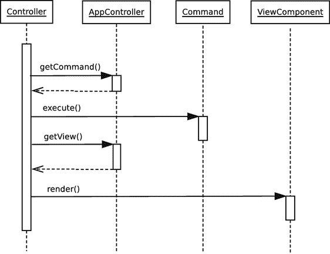

**图 12-7.** 使用应用控制器获取命令和视图

请注意，图 12-7 中渲染的视图可能是`ForwardViewComponent`（它将使用新路径重新启动整个过程），也可能是`TemplateViewComponent`（它将包含一个模板文件）。


请记住，图 12-7 中获取`Command`和`ViewComponent`对象所需的数据是由我们的老朋友`ApplicationHelper`编译的。提醒一下，以下是实现该功能的高级代码：

```
// 代码清单 12.29
private function setupOptions()
{
//...
$vcfile = $conf->get("viewcomponentfile");
$cparse = new ViewComponentCompiler();
$commandandviewdata = $cparse->parseFile($vcfile);
$reg->setCommands($commandandviewdata);
}
```

### `Command`类

既然命令不再负责调用模板，那么简要审视其基类和实现是值得的。我们已经看到`Command`类中的新状态，但还有一点内务处理需要注意：

```
// 代码清单 12.30
abstract class Command
{
const CMD_DEFAULT = 0;
const CMD_OK = 1;
const CMD_ERROR = 2;
const CMD_INSUFFICIENT_DATA = 3;
final public function __construct()
{
}
public function execute(Request $request)
{
$status = $this->doExecute($request);
$request->setCmdStatus($status);
}
abstract public function doExecute(Request $request): int;
}
```

这是一个模板方法模式的典型示例：`execute()`方法调用抽象的`doExecute()`方法，并将返回值缓存在`Request`对象中。稍后，`ComponentDescriptor`将利用这个返回值来选择正确的视图返回。

### 具体命令示例

以下是一个简单的`AddVenue`命令的实现：

```
// 代码清单 12.31
class AddVenue extends Command
{
public function doExecute(Request $request): int
{
$name = $request->getProperty("venue_name");
if (is_null($name)) {
$request->addFeedback("未提供名称");
return self::CMD_INSUFFICIENT_DATA;
} else {
// 执行某些操作
$request->addFeedback("已添加'{$name}'");
return self::CMD_OK;
}
return self::CMD_DEFAULT;
}
}
```

实际上，这段代码缺少构建`Venue`对象并将其保存到数据库的功能代码，但我们稍后会处理这些。目前最重要的是：该命令会根据不同情况返回不同的状态。正如我们所见，不同状态会导致应用程序控制器选择并返回不同的视图。因此，如果使用示例 XML，当返回`CMD_OK`时，转发机制将触发到`/addspace`的转发。这只适用于`/addvenue`的情况。如果导致该命令被调用的请求使用路径`/quickaddvenue`，则不会发生转发，而是显示`quickaddvenue`视图。不过，`AddVenue`命令对此一无所知——它只专注于自己的核心职责。

### 影响与后果

由于需要大量工作来获取和应用描述命令与请求、命令与命令、命令与视图之间关系的元数据，构建一个功能完备的应用程序控制器模式实例可能会很繁琐。

因此，我通常只在应用程序明确告诉我需要时，才会实现类似的功能。当我发现自己不得不在命令中添加条件判断，以便根据不同情况调用不同视图或执行其他命令时，我通常会听到这个提示。大约在这个时候，我会感到命令流程和显示逻辑开始失控。

当然，应用程序控制器可以使用各种机制来建立命令与视图之间的关联，而不仅仅是我这里采用的方法。即使你最初在所有情况下都使用请求字符串、命令名称和视图之间的固定关系，构建一个应用程序控制器来封装这种关系仍然有益。当你必须重构以适应更复杂的场景时，这将为你提供相当大的灵活性。

### 页面控制器

尽管我非常喜欢前端控制器模式，但它并不总是正确的选择。前期设计投入往往更适合大型系统，而对于那些需要快速交付成果的简单项目来说，反而可能成为负担。页面控制器模式可能你已经很熟悉了，因为它是一种常见策略。尽管如此，探讨其中一些问题仍然很有价值。

### 问题所在

同样的问题在于，你需要管理请求、领域逻辑和表示层之间的关系。这几乎是企业项目的永恒课题。然而，不同之处在于你所面临的约束条件。

如果你的项目相对简单，前期大量设计可能威胁到截止日期，且不会带来巨大的附加值，那么页面控制器是管理请求和视图的不错选择。

假设你想展示一个页面，显示 Woo 系统中所有场地的列表。即使完成了数据库检索代码，如果没有已经部署好的前端控制器，要实现这个简单的结果也是一项艰巨的任务。

视图是场地列表；请求同样也是场地列表。除非出现错误，否则请求不会像复杂任务中那样导向新的视图。这里最简单有效的做法是将视图与控制器关联起来——通常将它们放在同一个页面中。


### 实现

尽管页面控制器项目的实际实现可能变得相当复杂，但其模式本身很简单。控制权与一个视图或一组视图相关联。在最简单的情况下，这意味着控制权位于视图本身，尽管它可以被抽象出来，尤其是当一个视图与其他视图紧密关联时（即，当你在不同情况下可能需要转发到不同页面时）。

以下是页面控制器最简单的形式：

```
findAll();
} catch (\Exception $e) {
include('error.php');
exit(0);
}
// 默认页面跟在后面
?>

场地

场地

getName(); ?>

```

该文档包含两个元素。视图元素负责显示，而控制器元素管理请求并调用应用程序逻辑。即使视图和控制器位于同一页面，它们也是严格分离的。

这个例子非常简单（除了后台的数据库操作外，你将在下一章中了解更多）。页面顶部的 PHP 代码块尝试获取一个 `Venue` 对象列表，并将其存储在 `$venues` 全局变量中。

如果发生错误，页面通过 `include()` 将处理委托给名为 `error.php` 的页面，然后使用 `exit()` 终止当前页面的任何进一步处理。我同样可以使用 HTTP 转发。如果没有包含发生，则会显示页面底部的 HTML（视图）。

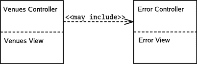

**图 12-8.** 嵌入在视图中的页面控制器

这可以作为快速测试，但任何具有规模或复杂性的系统可能需要比这更多的支持。

页面控制器代码之前是隐式地与视图分离的。在这里，我从一个基本的页面控制器基类开始，明确地进行了分离：

```
// 清单 12.33
abstract class PageController
{
abstract public function process();
public function __construct()
{
$this->reg = Registry::instance();
}
public function init()
{
if (isset($_SERVER['REQUEST_METHOD'])) {
$request = new HttpRequest();
} else {
$request = new CliRequest();
}
$this->reg->setRequest($request);
}
public function forward(string $resource)
{
$request = $this->getRequest();
$request->forward($resource);
}
public function render(string $resource, Request $request)
{
include($resource);
}
public function getRequest()
{
return $this->reg->getRequest();
}
}
```

这个类使用了一些你已经见过的工具——特别是 `Request` 和 `Registry` 类。`PageController` 类的主要作用是提供对 `Request` 对象的访问，并管理视图的包含。在真实项目中，随着更多子类发现需要通用功能，这个用途列表会迅速增长。

子类可以存在于视图内部，并像之前一样默认显示它。或者，它可以独立于视图。我认为后一种方法更清晰，所以我选择这条路径。下面是一个尝试向系统添加新场地的 `PageController`：

```
// 清单 12.34
class AddVenueController extends PageController
{
public function process()
{
$request = $this->getRequest();
try {
$name = $request->getProperty('venue_name');
if (is_null($request->getProperty('submitted'))) {
$request->addFeedback("为场地选择一个名称");
$this->render(__DIR__ . '/view/add_venue.php', $request);
} elseif (is_null($name)) {
$request->addFeedback("名称是必填字段");
$this->render(__DIR__ . '/view/add_venue.php', $request);
return;
} else {
// 添加到数据库
$this->forward('listvenues.php');
}
} catch (Exception $e) {
$this->render(__DIR__.'/view/error.php', $request);
}
}
}
```

`AddVenueController` 类只实现了 `process()` 方法。`process()` 负责检查用户的提交。如果用户尚未提交表单，或表单填写不正确，则会包含默认视图 (`add_venue.php`)，提供反馈并呈现表单。如果我成功添加了新用户，则该方法会调用 `forward()` 将用户发送到 `ListVenues` 页面控制器。

请注意我用于视图的格式。我倾向于通过使用全小写文件名来命名视图文件，而类文件则使用驼峰命名法（将单词连在一起，并使用大写字母表示边界），以区分它们。

你可能已经注意到 `AddVenueController` 类内部没有任何东西会导致它被运行。我可以将运行代码放在同一个文件中，但这会使测试变得困难（因为仅仅包含该类就会执行其方法）。出于这个原因，我为每个页面创建了一个运行脚本。以下是 `addvenue.php`：

```
// 清单 12.35
$addvenue = new AddVenueController();
$addvenue->init();
$addvenue->process();
```

以下是与 `AddVenueController` 类关联的视图：

```

添加场地

添加场地

getFeedbackString("");
?>

```

正如你所看到的，视图除了显示数据和提供生成新请求的机制外，不做任何事情。请求是发送给 `PageController`（通过 `/addvenue.php` 运行脚本）的，而不是返回到视图。请记住，负责处理请求的是 `PageController` 类。

你可以在图 12-9 中看到这个更复杂版本的页面控制器模式的概览。

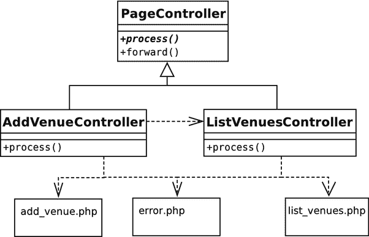

**图 12-9.** 页面控制器类层次结构及其包含关系


### 后果

这种方法的一大优点是，任何有网络经验的人都能立刻理解其含义。我请求`venues.php`，得到的就是这个文件。即便是错误信息，也符合预期范围，因为“服务器错误”和“页面未找到”页面已是日常现实。

如果你将视图与页面控制器类分离，情况会稍微复杂一些，但参与者之间近乎一一对应的关系仍然足够清晰。

页面控制器在完成处理后，会包含其视图。但在某些情况下，它会将请求转发给另一个页面控制器。例如，当`AddVenue`成功添加一个场地后，它不再需要显示添加表单，而是委托给`ListVenues`。

这一操作由`PageController`中的`forward()`方法处理，该方法与我们之前看到的`ForwardViewComponent`类似，只是简单地在`Request`上调用`forward()`。

尽管页面控制器类可能会委托给`Command`对象，但这样做的好处不如前端控制器那样显著。前端控制器类需要分析请求的目的，而页面控制器类已经知道这一点。你通常会放在`Command`中的轻量级请求检查和逻辑层调用，同样可以轻松地放在页面控制器类中，并且你还能从中受益，因为不需要一个选择`Command`对象的机制。

重复可能是一个问题，但使用公共超类可以消除大量重复。你还可以节省启动时间，因为可以避免加载当前上下文中不需要的数据。当然，你也可以在前端控制器中做到这一点，但找出哪些需要、哪些不需要的过程会复杂得多。

该模式的真正缺点在于视图路径复杂的情况——特别是当同一个视图在不同时间以不同方式被使用时（添加和编辑屏幕就是一个很好的例子）。你可能会发现自己在条件判断和状态检查中陷入混乱，难以对整个系统有一个清晰的概览。

不过，从页面控制器开始并转向前端控制器模式也并非不可能。如果你使用了`PageController`超类，这一点尤其明显。根据经验法则，如果我估计一个系统需要不到一周左右的时间完成，并且未来不需要增加更多阶段，我会选择页面控制器，并受益于其快速开发周期。如果我在构建一个需要随时间增长并具有复杂视图逻辑的大型项目，我会每次都选择前端控制器。

### 模板视图与视图助手

在 PHP 中，`模板视图`几乎是默认的机制，因为我可以在其中混入表示标记（HTML）和系统代码（原生 PHP）。正如我之前所说，这既是福音也是诅咒，因为将它们轻松结合在一起的能力，诱惑着人们将应用逻辑和显示逻辑放在同一个地方——这可能会带来灾难性的后果。

因此，在 PHP 中编写视图很大程度上是一个自律的问题。如果严格来说不属于显示范畴，就要对任何代码保持高度警惕。

为此，视图助手模式（Alur 等人提出）提供了一个助手类，它可以专用于某个视图，也可以在多个视图之间共享，以帮助处理任何需要超过少量代码的任务。

### 问题

如今，在显示页面中直接嵌入 SQL 查询和其他业务逻辑的情况越来越少见，但依然存在。我在之前的章节中已经详细讨论过这种特殊的弊端，所以这里简要带过。

包含过多代码的网页会让网站制作人员难以处理，因为表示组件会与循环和条件判断纠缠在一起。

表示层中的业务逻辑会迫使你只能使用该界面。如果不移植大量应用程序代码，你就无法轻松切换为新视图。

将视图与逻辑分离的系统也更易于测试。这是因为测试可以仅针对逻辑层的功能进行，而无需受到表示层干扰噪音的影响。

安全问题也经常出现在将逻辑嵌入表示层的系统中。在这类系统中，由于处理用户输入的数据库查询和代码往往散落在表格、表单和列表中，因此很难识别潜在的危险。

由于许多操作会在不同视图中重复出现，将应用程序代码嵌入模板的系统容易陷入重复的困境，因为相同的代码结构会从一个页面粘贴到另一个页面。一旦发生这种情况，错误和维护噩梦便会接踵而至。

为了防止这种情况发生，你应该在其他地方处理应用程序的处理逻辑，并让视图仅管理显示。这通常通过使视图成为数据的被动接收者来实现。如果视图确实需要查询系统，最好提供一个视图助手对象来替视图完成任何复杂的工作。


### 实现

一旦你构建了更广泛的框架，视图层就不再是一个巨大的编程挑战。当然，它仍然是一个重大的设计和信息架构问题，但这已是另一本书的内容！

“模板视图”（`Template View`）这个命名源于福勒。它是大多数企业程序员使用的主要模式。在某些语言中，实现可能涉及构建一个标签翻译系统，将标签转换为系统设置的值。在 PHP 中你也有这个选择，可以使用像优秀的 Twig 这样的模板引擎。不过，我更喜欢谨慎地使用 PHP 已有的功能。

为了让视图有东西可用，它必须能够获取数据。我倾向于定义一个视图可以使用的“视图助手”（`View Helper`）。

下面是一个简单的 `ViewHelper` 类：

```php
// listing 12.37
class ViewHelper
{
    public function sponsorList()
    {
        // 执行一些复杂的操作来获取赞助商列表
        return "鲍勃的鞋业帝国";
    }
}
```

目前这个类只提供了一个赞助商列表字符串。我们假设获取或格式化这些数据涉及相对复杂的过程，而这些过程不应嵌入到模板本身。随着应用程序的发展，你可以扩展它来提供额外的功能。如果你发现在视图中需要编写超过几行的代码，那么这些代码很可能应该放在 `View Helper` 中。在大型应用中，你可以在继承层次结构中提供多个 `ViewHelper` 对象，以便为系统的不同部分提供不同的工具。

我可能会从某种工厂（比如注册表）中获取一个 `ViewHelper`。从模板的角度看，最简单的方法是在 `render()` 方法中使辅助实例可用：

```php
// listing 12.38
public function render(string $resource, Request $request)
{
    $vh = new ViewHelper();
    // 现在模板将拥有 $vh 变量
    include($resource);
}
```

下面是一个使用此 `View Helper` 的简单视图：

```php
<?php
// 场馆
?>
场馆

由以下机构自豪赞助：<?php echo $vh->sponsorList(); ?>

列出场馆
```

视图（`list_venues.php`）通过 `$vh` 变量获得了一个 `ViewHelper` 实例。它调用了 `sponsorList()` 方法并打印结果。

显然，这个示例并没有从视图中完全消除代码，但它确实严格限制了所需编码的数量和类型。该页面包含一个简单的打印语句，并且随着复杂性的增加，不可避免会需要其他方法调用，但设计师应该能够轻松地处理此类代码。

稍微棘手一点的是 `if` 语句和循环。这些很难委托给 `View Helper`，因为它们通常与格式化输出紧密相关。我倾向于将简单的条件语句和循环（在构建显示数据行的表格时非常常见）保留在 `模板视图` 中；但为了尽可能保持它们的简洁，我会在可能的情况下将测试子句等内容委托出去。

### 结果

数据传递给视图层的方式有些令人不安，因为视图并没有一个固定的接口来保证其环境。我倾向于将每个视图视为与整个系统签订了一份契约。视图实际上是在对应用程序说：“如果我被调用，那么我有权访问对象 `This`、对象 `That` 和对象 `TheOther`。” 应用程序有责任确保这一点成立。

你可以通过在辅助类中提供访问器方法使视图更加严格，但我一直发现通过 `Request`、`Response` 或 `Context` 对象为视图层动态注册对象更加容易。

虽然模板通常本质上是被动的，由上次请求产生的数据填充，但有时视图可能需要发起辅助请求。`View Helper` 是提供此功能的好地方，它将获取数据所需的任何机制知识对视图本身隐藏起来。即使是 `View Helper` 也应尽可能少做工作，将任务委托给命令，或通过外观（Facade）与领域层联系。

> **注意**  
> 你在第 10 章中看到了 `Facade` 模式。Alur 等人在 `Session Facade` 模式中探讨了 Facade 在企业编程中的一种用途（该模式旨在限制细粒度的网络事务）。福勒还描述了一种称为 `Service Layer` 的模式，它为访问层内的复杂性提供了一个简单的入口点。

## 业务逻辑层

如果说控制层编排与外部世界的通信并组织系统对其作出响应，那么逻辑层则负责处理应用程序的业务。这一层应尽可能远离因分析查询字符串、构建 HTML 表格和编写反馈消息而产生的噪音和干扰。业务逻辑是关于完成需要完成的事情——即应用程序的真正目的。其他一切都是为了支持这些任务而存在的。

在经典的面向对象应用程序中，业务逻辑层通常由模拟系统旨在解决的问题的类组成。正如你将看到的，这是一个灵活的设计决策，但也需要大量的前期规划。

那么，让我们从让系统快速启动并运行的最快方法开始。

### 事务脚本

`事务脚本`模式（《企业应用架构模式》）描述了许多系统自行演化的方式。它简单、直观且有效，尽管随着系统规模的增大，其效果会减弱。事务脚本内联处理请求，而不是委托给专门的对象。它是典型的快速解决方案。这也是一种难以分类的模式，因为它结合了本章中来自其他层的元素。我选择将其作为业务逻辑层的一部分来介绍，因为该模式的动机是实现系统的业务目标。

### 问题

每个请求都必须以某种方式处理。正如你所看到的，许多系统提供一个评估和过滤传入数据的层。但理想情况下，这一层随后应调用旨在完成请求的类。这些类可以被分解以表示系统中的力量和职责，也许可以使用外观接口。然而，这种方法需要一定数量的精心设计。对于某些项目（通常是范围小、性质紧急的项目），这种开发开销可能是不可接受的。在这种情况下，你可能需要将业务逻辑构建到一组过程化操作中。每个操作都将被精心设计以处理特定的请求。

因此，问题在于需要提供一种快速有效的机制来实现系统的目标，而无需在复杂设计上进行可能代价高昂的投资。

这种模式的最大好处是你能快速获得结果。每个脚本接收输入并操作数据库以确保一个结果。除了将相关方法组织在同一个类中，并保持 `事务脚本` 类位于它们自己的层（即尽可能独立于命令、控制和视图层）之外，几乎不需要前期设计。

虽然业务逻辑层类往往与表示层清晰分离，但它们通常更深入地嵌入在数据层中。这是因为检索和存储数据是此类类经常执行的任务的关键。你将在本章后面看到将逻辑对象与数据库解耦的机制。不过，`事务脚本` 类通常对数据库了如指掌（尽管它们可以使用网关类来处理实际查询的细节）。


### 实现

让我们回到我的事件列表示例。在本例中，系统支持三个关系数据库表：`venue`（场地）、`space`（空间）和`event`（事件）。一个`venue`（场地）可以有多个`spaces`（空间）（例如，一个剧院可以有多个舞台，一个舞蹈俱乐部可以有多个房间）。每个`space`（空间）都会举办许多事件。下面是模式定义：

```sql
CREATE TABLE 'venue' (
'id' int(11) NOT NULL auto_increment,
'name' text,
PRIMARY KEY  ('id')
)
CREATE TABLE 'space' (
'id' int(11) NOT NULL auto_increment,
'venue' int(11) default NULL,
'name' text,
PRIMARY KEY  ('id')
)
CREATE TABLE 'event' (
'id' int(11) NOT NULL auto_increment,
'space' int(11) default NULL,
'start' mediumtext,
'duration' int(11) default NULL,
'name' text,
PRIMARY KEY  ('id')
)
```

显然，系统需要提供添加场地和事件的机制。每一项操作都代表一个独立的事务。我可以为每个方法创建独立的类（并按照你在第 11 章遇到的**命令模式**来组织我的类）。不过，在本例中，我打算将这些方法放在同一个类中，尽管它属于继承层次结构的一部分。你可以在图 12-10 中看到其结构。

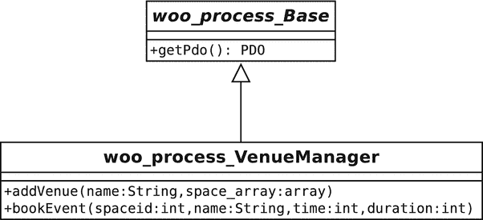

**图 12-10.** 一个事务脚本类及其父类

那么，为什么这个示例要包含一个抽象父类呢？在一个任意大小的脚本中，我可能会向这个层次结构中添加更多具体类。由于其中大多数类至少会共享一些核心功能，因此将这些功能放在一个共同的父类中是合理的。

实际上，这本身就是一个模式（Fowler 将其命名为**层超类型**）。当同一层中的类具有共同特征时，将它们归为一个类型，并将实用操作放在基类中，是很有意义的。在本章的其余部分，你会经常看到这种做法。

在本例中，基类获取一个`PDO`对象，并将其存储在一个属性中。它还提供了用于缓存数据库语句和执行查询的方法：

```php
// listing 12.40
abstract class Base
{
    private $pdo;
    private $config = __DIR__ . "/data/woo_options.ini";
    private $stmts = [];
    public function __construct()
    {
        $reg = Registry::instance();
        $options = parse_ini_file($this->config, true);
        $conf = new Conf($options['config']);
        $reg->setConf($conf);
        $dsn = $reg->getDSN();
        if (is_null($dsn)) {
            throw new AppException("No DSN");
        }
        $this->pdo = new \PDO($dsn);
        $this->pdo->setAttribute(\PDO::ATTR_ERRMODE, \PDO::ERRMODE_EXCEPTION);
    }
    public function getPdo(): \PDO
    {
        return $this->pdo;
    }
}
```

我使用`Registry`类获取`DSN`字符串，并将其传递给`PDO`构造函数。我通过一个 getter 方法`getPdo()`提供`PDO`对象。实际上，很多此类工作都可以推回到`Registry`对象本身——你会在本章和下一章的其他地方看到我采用这种策略。

下面是`VenueManager`类的开头部分，它设置了我的 SQL 语句：

```php
// listing 12.41
class VenueManager extends Base
{
    private $addvenue = "INSERT INTO venue
    ( name )
    VALUES( ? )";
    private $addspace  = "INSERT INTO space
    ( name, venue )
    VALUES( ?, ? )";
    private $addevent =  "INSERT INTO event
    ( name, space, start, duration )
    VALUES( ?, ?, ?, ? )";
    // ...
```

这里没有什么新内容。这些是事务脚本将使用的 SQL 语句。它们按照`PDO`类的`prepare()`方法接受的格式构建。问号是占位符，用于替换将传递给`execute()`的值。现在是时候定义第一个旨在满足特定业务需求的方法了：

```php
// listing 12.42
// VenueManager
public function addVenue(string $name, array $spaces): array
{
    $pdo = $this->getPdo();
    $ret = [];
    $ret['venue'] = [$name];
    $stmt = $pdo->prepare($this->addvenue);
    $stmt->execute($ret['venue']);
    $vid = $pdo->lastInsertId();
    $ret['spaces'] = [];
    $stmt = $pdo->prepare($this->addspace);
    foreach ($spaces as $spacename) {
        $values = [$spacename, $vid];
        $stmt->execute($values);
        $sid = $pdo->lastInsertId();
        array_unshift($values, $sid);
        $ret['spaces'][] = $values;
    }
    return $ret;
}
```

如你所见，`addVenue()`需要一个场地名称和一个空间名称数组。它使用这些数据填充`venue`和`space`表。它还创建了一个包含此信息以及每行新生成的 ID 值的数据结构。

如果此处出现错误，请记住，会抛出一个异常。我没有在这里捕获任何异常，因此`prepare()`抛出的任何异常也会由此方法抛出。这正是我想要的结果，尽管我应该明确说明，此方法会在我文档中抛出异常。

创建`venue`行后，我遍历`$spaces`，为每个元素在`space`表中添加一行。请注意，我在创建的每个`space`行中都包含了场地 ID 作为外键，将该行与场地关联起来。

第二个事务脚本同样简单明了：

```php
// listing 12.43
// VenueManager
public function bookEvent(int $spaceid, string $name, int $time, int $duration)
{
    $pdo = $this->getPdo();
    $stmt = $pdo->prepare($this->addevent);
    $stmt->execute([$name, $spaceid, $time, $duration]);
}
```

此脚本的目的是向`events`表中添加一个事件，并与一个空间关联。

#### 结论

**事务脚本模式**是一种快速获得良好效果的有效方法。这也是许多程序员多年来一直在使用、却未曾想到需要给它命名的模式之一。通过一些好的辅助方法（比如我添加到基类中的那些），你可以专注于应用程序逻辑，而不会过多陷入数据库操作的繁琐细节中。

我还曾在不太受欢迎的场景中看到过事务脚本模式。我原本以为我正在编写一个比通常适合此模式要复杂得多、对象密集得多的应用程序。随着最后期限的压力开始显现，我发现自己将越来越多的逻辑放入原本打算作为**领域模型**（见下一节）的薄外观层中。虽然结果不如我期望的那么优雅，但我不得不承认，应用程序并没有因为其隐式的重新设计而受到影响。

在大多数情况下，对于小项目，当你确信它不会发展成一个大型项目时，你会选择事务脚本方法。这种方法扩展性不佳，因为随着脚本不可避免地相互交叉，重复常常会开始出现。当然，你可以在一定程度上将其分解出来，但可能无法完全消除。

在我的示例中，我决定将数据库代码嵌入到事务脚本类本身。但正如你所见，代码希望将数据库工作与应用程序逻辑分离。我可以完全将其从类中提取出来，创建一个网关类，其作用是代表系统处理数据库交互。

### 领域模型

**领域模型**是纯粹的逻辑引擎，本章中的许多其他模式都致力于创建、培育和保护它。它是你项目中各种力量的抽象表示。它就像一种形式平面，你的业务问题在其中自由展现其本质，不受数据库和网页等讨厌的物质问题的干扰。

如果这听起来有点花哨，那让我们回到现实。领域模型是系统中真实世界参与者的表示。正是在领域模型中，“对象即事物”的经验法则比其他地方更为真实。在其他地方，对象往往承担职责。而在领域模型中，它们通常描述一组属性，并带有代理功能。它们是那些“做事情的东西”。


### 问题

如果你一直在使用事务脚本，你可能会发现随着不同脚本需要执行相同任务，重复代码会成为一个问题。虽然可以在一定程度上进行抽象，但随着时间的推移，很容易陷入剪切-粘贴式编码。

你可以使用领域模型来提取并封装系统中的参与者和处理过程。与其编写脚本来向数据库添加空间数据，然后再关联事件数据，不如创建 `Space` 和 `Event` 类。预订某个空间中的事件可以简化为调用 `Space::bookEvent()`。检查时间冲突这样的任务则变成 `Event::intersects()`，以此类推。

显然，对于像 Woo 这样简单的示例，事务脚本已经足够。但随着领域逻辑变得复杂，领域模型的替代方案会越来越有吸引力。复杂的逻辑可以更轻松地处理，并且在建模应用领域时，你需要的条件代码也会更少。

### 实现

领域模型的设计可以相对简单。与此主题相关的大多数复杂性都体现在旨在保持模型纯净的模式上——也就是说，将其与应用中的其他层分离开来。

将领域模型的参与者与表示层分离，很大程度上只需要确保它们保持独立。然而，将参与者与数据层分离则要棘手得多。尽管理想情况是仅从模型所代表和解决的问题角度来考虑领域模型，但数据库的实际情况却难以回避。

领域模型类通常与关系数据库中的表直接映射，这无疑让开发更轻松。例如，图 12-11 展示了一个类图，描绘了 Woo 系统中的部分参与者。

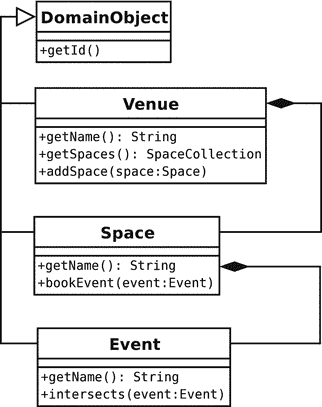

图 12-11.

领域模型的一个片段

图 12-11 中的对象镜像了为事务脚本示例建立的表结构。这种直接关联使系统更易于管理，但并非总是可行，尤其是当你使用的数据库模式先于应用存在时。这种关联本身也可能成为问题的根源。如果不小心，你最终可能是在对数据库建模，而不是在解决你试图应对的问题和驱动力。

领域模型经常镜像数据库结构，但这并不意味着它的类应该了解数据库的任何信息。通过将模型与数据库分离，你可以让整个层更易于测试，并且不太容易受到模式变更，甚至存储机制变更的影响。这也让每个类的职责聚焦于其核心任务。

以下是一个简化的 `Venue` 对象及其父类：

```php
// listing 12.44
abstract class DomainObject
{
    private $id;
    public function __construct(int $id)
    {
        $this->id = $id;
    }
    public function getId(): int
    {
        return $this->id;
    }
    public static function getCollection(string $type): Collection
    {
        // 虚拟实现
        return Collection::getCollection($type);
    }
    public function markDirty()
    {
        // 下一章再讲！
    }
}
// listing 12.45
class Venue extends DomainObject
{
    private $name;
    private $spaces;
    public function __construct(int $id, string $name)
    {
        $this->name = $name;
        $this->spaces = self::getCollection(Space::class);
        parent::__construct($id);
    }
    public function setSpaces(SpaceCollection $spaces)
    {
        $this->spaces = $spaces;
    }
    public function getSpaces(): SpaceCollection
    {
        return $this->spaces;
    }
    public function addSpace(Space $space)
    {
        $this->spaces->add($space);
        $space->setVenue($this);
    }
    public function setName(string $name)
    {
        $this->name = $name;
        $this->markDirty();
    }
    public function getName(): string
    {
        return $this->name;
    }
}
```

这个类与那些设计为无需持久化的类有几点不同。我没有使用数组，而是使用 `SpaceCollection` 类型的对象来存储 `Venue` 可能包含的任何 `Space` 对象（不过，即使不涉及数据库，也有人会认为类型安全的数组也是个优点）。由于这个类使用特殊的集合对象而非 `Space` 对象数组，构造函数需要在启动时实例化一个空集合。它通过调用层超类型上的静态方法来实现这一点：

```php
$this->spaces = self::getCollection(Space::class);
```

我将在下一章回到这个系统的集合对象以及如何获取它们的话题。不过目前，超类只是返回一个空数组。

**注意**：在本章及下一章中，我将讨论对 `Venue` 和 `Space` 对象的修改。这些是简单的领域对象，它们共享一个共同的功能核心。如果你正在跟随编码，你应该能够将我所讨论的概念应用到任何一个类上。例如，`Space` 类可能不维护 `Space` 对象的集合，但它可能会以完全相同的方式管理 `Event` 对象。

我期望构造函数中有一个 `$id` 参数，我会将它传递给超类进行存储。`$id` 参数代表数据库中某行的唯一 ID，这一点不足为奇。另外请注意，我调用了超类上的一个方法 `markDirty()`（当你遇到工作单元模式时将会涉及这一点）。

### 结果

领域模型的设计需要和你需要模拟的业务流程一样简单或复杂。其美妙之处在于，在设计模型时，你可以专注于问题中的驱动力，而在其他层（理论上）处理持久化和表示层等问题。

在实践中，我认为大多数开发者在设计领域模型时，至少会考虑数据库。没有人愿意设计出这样的结构——当需要将对象存入数据库或从数据库中取出时，会迫使你（或者更糟，你的同事）编写弯弯绕绕的复杂代码。

这种领域模型与数据层之间的分离在设计上代价不菲。虽然可以将数据库代码直接放在模型中（尽管你可能想设计一个网关来处理实际的 SQL），但对于相对简单的模型，特别是当每个类大体上映射到一个表时，这种方法可以真正带来好处，省去了为设计一个外部系统来协调对象与数据库之间的巨大设计开销。

## 总结

我在这里涵盖了非常多的内容（尽管我也省略了很多）。你不应该被本章中大量的代码所吓倒。模式应该用在合适的环境中，并在有用时进行组合。使用本章中描述的那些你认为符合项目需求的模式，不要觉得在开始一个项目之前必须先构建一个完整的框架。另一方面，这里有足够的材料可以作为框架的基础，或者同样很有可能，为你可能选择部署的一些预构建框架的架构提供一些见解。

而且还有更多内容！我把你留在了持久化的边缘，只给出了一些关于集合和映射器的诱人提示。在下一章中，我将介绍一些用于处理数据库以及将你的对象与数据存储细节隔离开来的模式。


