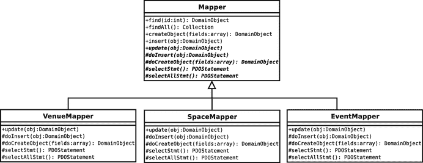
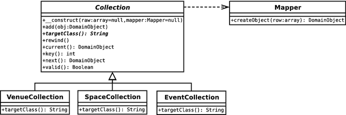
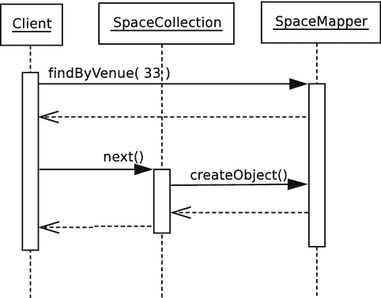
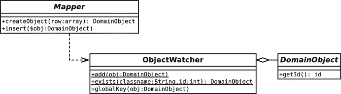
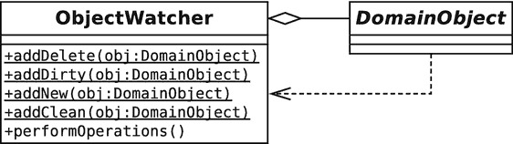
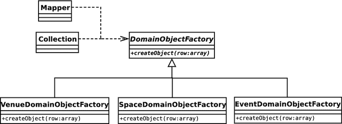
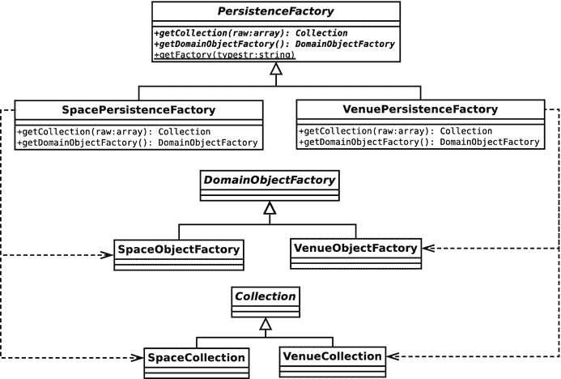
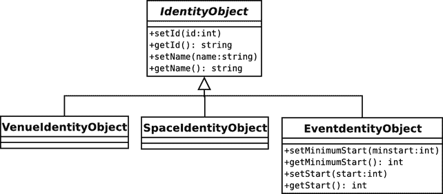
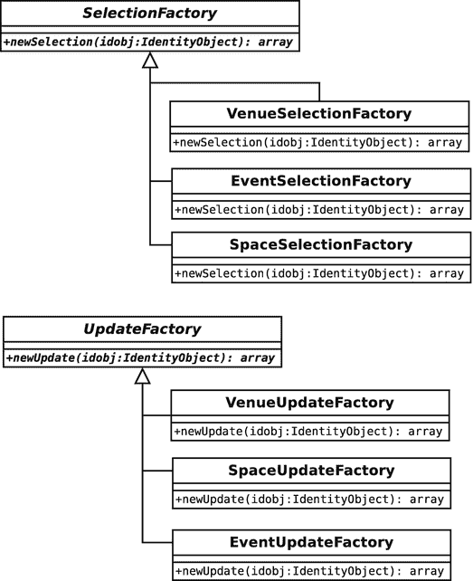
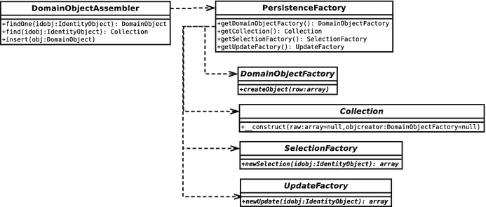

# 13. 数据库模式

大多数具有一定复杂度的网络应用都会在不同程度上处理数据持久化问题。商店必须记录其商品和客户信息；游戏必须记住玩家和游戏状态；社交网站必须追踪你那 238 位朋友以及你对 80、90 年代男孩组合那种令人费解的喜爱。无论是什么应用，它很可能都在幕后进行着数据记录。在本章中，我将探讨一些有助于解决这类问题的模式。

本章将涵盖以下内容：

*   数据层接口：定义存储层与系统其他部分之间接触点的模式
*   对象监控：追踪对象、避免重复，以及自动化保存和插入操作
*   灵活查询：允许客户端开发者无需考虑底层数据库即可构建查询
*   创建已发现对象列表：构建可迭代的集合
*   管理数据库组件：抽象工厂模式的有益回归

## 数据层

在与客户讨论时，通常占据主导地位的是表示层。字体、颜色和易用性是主要的讨论话题。而在开发者之间，数据库往往显得举足轻重。我们关心的并非数据库本身；除非运气极差，否则我们可以信任它能完成自己的工作。不，真正引发问题的是我们用来将数据库表的行列结构转换为数据结构的机制。在本章中，我将探讨一些能够帮助完成这一过程的代码。

这里介绍的内容并非全部位于数据层本身。更确切地说，我将一些有助于解决持久化问题的模式归为一组。所有这些模式都由 Clifton Nock、Martin Fowler 以及 Alur 等人分别或共同描述过。

## 数据映射器

如果你认为我在第 12 章的“领域模型”部分对从数据库保存和检索`Venue`对象的问题轻描淡写，那么这里或许能找到一些答案。数据映射器模式在某些地方被称为数据访问对象。首先，它由 Alur 等人在《Core J2EE Patterns: Best Practices and Design Strategies》（Prentice Hall, 2001）中提及。此外，Martin Fowler 在《Patterns of Enterprise Application Architecture》（Addison-Wesley Professional, 2002）中也有涉及。请注意，数据访问对象与数据映射器模式并非完全一致，因为它会生成数据传输对象；但由于这些对象经过加工后即可成为真正的对象，因此这两种模式非常接近。

正如你可能想象的那样，数据映射器是一个负责处理从数据库到对象转换的类。

### 问题

对象的组织方式与关系型数据库中的表不同。如你所知，数据库表是由行和列组成的网格。一行可以通过外键与另一个（或同一个）表中的另一行相关联。相比之下，对象之间的关联方式更为有机。一个对象可能包含另一个对象，不同的数据结构会以不同的方式组织相同的对象，在运行时通过新的关系组合和重组对象。关系型数据库针对管理大量表格化数据进行了优化，而类和对象则封装了更小、更集中的信息块。

这种类与关系型数据库之间的脱节通常被称为对象关系阻抗不匹配（或简称为阻抗不匹配）。

那么，如何进行转换呢？一个答案是将这一问题的责任赋予一个类（或一组类），从而有效地向领域模型隐藏数据库，并管理转换过程中不可避免的粗糙边缘。

### 实现

尽管通过细致的编程，有可能创建一个单一的`Mapper`类来服务多个对象，但通常的做法是为领域模型中的主要类各自创建一个独立的`Mapper`。

图 13-1 显示了三个具体的`Mapper`类和一个抽象超类。



图 13-1.

Mapper 类

实际上，由于`Space`对象从属于`Venue`对象，因此可以将`SpaceMapper`类纳入`VenueMapper`中。为了本练习的目的，我将保持它们分离。

如图所示，这些类提供了保存和加载数据的常见操作。基类存储了通用功能，而将处理特定于对象操作的职责委托给其子类。通常，这些操作包括实际的对象生成以及为数据库操作构建查询。

基类通常在操作前后执行一些内务处理，这就是为什么使用模板方法进行显式委托（例如，从像`insert()`这样的具体方法调用到像`doInsert()`这样的抽象方法）。实现决定了基类中的哪些方法由此具体化，你将在本章后面看到这一点。

以下是一个简化的`Mapper`基类版本：

```
// 清单 13.01
abstract class Mapper
{
    protected $pdo;
    public function __construct()
    {
        $reg = Registry::instance();
        $this->pdo = $reg->getPdo();
    }
    public function find(int $id): DomainObject
    {
        $this->selectstmt()->execute([$id]);
        $row = $this->selectstmt()->fetch();
        $this->selectstmt()->closeCursor();
        if (! is_array($row)) {
            return null;
        }
        if (! isset($row['id'])) {
            return null;
        }
        $object = $this->createObject($row);
        return $object;
    }
    public function createObject(array $raw): DomainObject
    {
        $obj = $this->doCreateObject($raw);
        return $obj;
    }
    public function insert(DomainObject $obj)
    {
        $this->doInsert($obj);
    }
    abstract public function update(DomainObject $object);
    abstract protected function doCreateObject(array $raw): DomainObject;
    abstract protected function doInsert(DomainObject $object);
    abstract protected function selectStmt(): \PDOStatement;
    abstract protected function targetClass(): string;
}
```

构造函数使用`Registry`来获取一个 PDO 对象。对于这样的类，注册表确实展示了其价值。从控制层到`Mapper`，并不总是存在一条可以传递数据的合理路径。另一种管理映射器创建的方式是将它交给`Registry`类本身。映射器不会实例化，而是期望在构造函数参数中提供一个 PDO 对象：

```
abstract class Mapper
{
    protected $pdo;
    function __construct(\PDO $pdo)
    {
        $this->pdo = $pdo;
    }
}
```

客户端代码会通过`Registry`的某个方法（例如`getVenueMapper()`）获取一个新的`VenueMapper`。这会实例化一个映射器，同时生成 PDO 对象。对于后续请求，该方法会返回缓存的映射器。由于这种方法允许映射器忽略配置的复杂性（即使使用注册表作为外观），因此我通常选择后者。

回到`Mapper`类，`insert()`方法除了委托给`doInsert()`之外不做其他事情。如果不是因为我知道这里使用的实现将来会派上用场，我会将其抽象为一个`insert()`方法。


`find()` 负责调用预处理语句（由实现子类提供）并获取行数据，最后通过调用`createObject()`完成。将数组转换为对象的具体细节因情况而异，因此实现由抽象方法`doCreateObject()`处理。同样地，`createObject()`似乎除了委托给子类实现外什么也没做；我很快会添加一些内务处理逻辑，使这种模板方法模式的使用变得值得。

子类还将实现自定义方法，根据特定条件查找数据（例如，我需要定位属于`Venue`对象的`Space`对象）。

你可以从子类的角度查看以下过程：

```
// listing 13.02
class VenueMapper extends Mapper
{
private $selectStmt;
private $updateStmt;
private $insertStmt;
public function __construct()
{
parent::__construct();
$this->selectStmt = $this->pdo->prepare(
"SELECT * FROM venue WHERE id=?"
);
$this->updateStmt = $this->pdo->prepare(
"UPDATE venue SET name=?, id=? WHERE id=?"
);
$this->insertStmt = $this->pdo->prepare(
"INSERT INTO venue ( name ) VALUES( ? )"
);
}
protected function targetClass(): string
{
return Venue::class;
}
public function getCollection(array $raw): Collection
{
return new VenueCollection($raw, $this);
}
protected function doCreateObject(array $raw): DomainObject
{
$obj = new Venue(
(int)$raw['id'],
$raw['name']
);
return $obj;
}
protected function doInsert(DomainObject $object)
{
$values = [$object->getName()];
$this->insertStmt->execute($values);
$id = $this->pdo->lastInsertId();
$object->setId((int)$id);
}
public function update(DomainObject $object)
{
$values = [
$object->getName(),
$object->getId(),
$object->getId()
];
$this->updateStmt->execute($values);
}
public function selectStmt(): \PDOStatement
{
return $this->selectStmt;
}
}
```

同样地，这个类去掉了部分尚未添加的功能特性，但依然能完成其工作。构造函数准备了一些后续使用的 SQL 语句。

父类`Mapper`实现了`find()`方法，该方法调用`selectStmt()`获取准备好的`SELECT`语句。假设一切顺利，`Mapper`会调用`VenueMapper::doCreateObject()`。在这里，我使用关联数组生成`Venue`对象。

从客户端的角度来看，这个过程非常简单：

```
// listing 13.03
$mapper = new VenueMapper();
$venue = $mapper->find(2);
print_r($venue);
```

调用`print_r()`是确认`find()`是否成功的快速方法。在我的系统中（假设`venue`表中存在 ID 为`2`的行），该代码片段的输出如下：

```
popp\ch13\batch01\Venue Object
(
[name:popp\ch13\batch01\Venue:private] => The Likey Lounge
[spaces:popp\ch13\batch01\Venue:private] =>
[id:popp\ch13\batch01\DomainObject:private] => 2
)
```

`doInsert()`和`update()`方法逆转了`find()`建立的过程。它们各自接受一个`DomainObject`，从中提取行数据，并使用提取的信息调用`PDOStatement::execute()`。注意，`doInsert()`方法会为传入的对象设置 ID。请记住，在 PHP 中对象通过引用传递，因此客户端代码会通过其自身的引用看到这一变化。

另一件需要注意的事情是，`doInsert()`和`update()`并非真正类型安全。它们会无报错地接受任何`DomainObject`子类。如果传入了错误类型的对象，应执行`instanceof`测试并抛出`Exception`。

以下是插入和更新的客户端视角：

```
// listing 13.04
$mapper = new VenueMapper();
$venue = new Venue(-1, "The Likey Lounge");
// add the object to the database
$mapper->insert($venue);
// find the object again – just to prove it works!
$venue = $mapper->find($venue->getId());
print_r($venue);
// alter our object
$venue->setName("The Bibble Beer Likey Lounge");
// call update to enter the amended data
$mapper->update($venue);
// once again, go back to the database to prove it worked
$venue = $mapper->find($venue->getId());
print_r($venue);
```


### 处理多行数据

`find()` 方法非常直接，因为它只需返回单个对象。但如果需要从数据库中获取大量数据，你该怎么办？你的第一反应可能是返回一个对象数组。这确实可行，但这种方法存在一个主要问题。

如果返回数组，集合中的每个对象都必须先实例化。如果结果集包含 1,000 个对象，这可能会造成不必要的性能开销。另一种方案是直接返回数组，让调用代码自行处理对象实例化。这虽然可行，但却违背了 `Mapper` 类的根本目的。

有一种方法可以让你两者兼得：使用内置的 `Iterator` 接口。

`Iterator` 接口要求实现类定义用于查询列表的方法。如果这样做了，你的类就可以像数组一样在 `foreach` 循环中使用。

表 13-1 显示了 `Iterator` 接口要求实现的方法。

**表 13-1. Iterator 接口定义的方法**

| 名称 | 描述 |
| --- | --- |
| `rewind()` | 将指针发送到列表开头 |
| `current()` | 返回当前指针位置的元素 |
| `key()` | 返回当前键（即指针值） |
| `next()` | 返回当前指针指向的元素并将指针前移 |
| `valid()` | 确认当前指针位置是否存在元素 |

为了实现一个 `Iterator`，你需要实现其方法，并跟踪在数据集中的位置。如何获取数据、排序或以其他方式过滤数据，对客户端来说是不可见的。

下面是一个 `Iterator` 的实现，它包装了一个数组，同时在构造函数中接受了一个 `Mapper` 对象，原因稍后便会明了：

```php
// listing 13.05
abstract class Collection implements \Iterator
{
    protected $mapper;
    protected $total = 0;
    protected $raw = [];
    private $pointer = 0;
    private $objects = [];

    public function __construct(array $raw = [], Mapper $mapper = null)
    {
        $this->raw = $raw;
        $this->total = count($raw);
        if (count($raw) && is_null($mapper)) {
            throw new AppException("need Mapper to generate objects");
        }
        $this->mapper = $mapper;
    }

    public function add(DomainObject $object)
    {
        $class = $this->targetClass();
        if (! ($object instanceof $class)) {
            throw new AppException("This is a {$class} collection");
        }
        $this->notifyAccess();
        $this->objects[$this->total] = $object;
        $this->total++;
    }

    abstract public function targetClass(): string;

    protected function notifyAccess()
    {
        // deliberately left blank!
    }

    private function getRow($num)
    {
        $this->notifyAccess();
        if ($num >= $this->total || $num < 0) {
            return null;
        }
        if (isset($this->objects[$num])) {
            return $this->objects[$num];
        }
        if (isset($this->raw[$num])) {
            $this->objects[$num] = $this->mapper->createObject($this->raw[$num]);
            return $this->objects[$num];
        }
    }

    public function rewind()
    {
        $this->pointer = 0;
    }

    public function current()
    {
        return $this->getRow($this->pointer);
    }

    public function key()
    {
        return $this->pointer;
    }

    public function next()
    {
        $row = $this->getRow($this->pointer);
        if (! is_null($row)) {
            $this->pointer++;
        }
    }

    public function valid()
    {
        return (! is_null($this->current()));
    }
}
```

构造函数可以不带参数调用，也可以带两个参数（一个是最终可能转换为对象的原始数据，另一个是 `Mapper` 引用）。

假设客户端设置了 `$raw` 参数（这通常由 `Mapper` 对象完成），该参数会与提供的数据集大小一同存储在属性中。如果提供了原始数据，则同时需要提供一个 `Mapper` 实例，因为正是它将负责把每一行数据转换为对象。

如果未向构造函数传递任何参数，则该类初始化为空；但请注意，`add()` 方法可用于向集合中添加元素。

该类维护了两个数组：`$objects` 和 `$raw`。如果客户端请求某个特定元素，`getRow()` 方法会首先在 `$objects` 中查找是否已有其实例化对象。如果有，则直接返回。否则，该方法会在 `$raw` 中查找对应的行数据。`$raw` 数据仅在同时存在 `Mapper` 对象时才存在，因此相关行的数据可以被传递给之前遇到的 `Mapper::createObject()` 方法。该方法返回一个 `DomainObject` 对象，该对象会被缓存在 `$objects` 数组中并附上相关的索引。新创建的 `DomainObject` 对象随后被返回给用户。

该类的其余部分是对 `$pointer` 属性的简单操作以及对 `getRow()` 的调用。不过，`notifyAccess()` 方法除外，当你接触到懒加载模式时，它将变得非常重要。

你可能已经注意到，`Collection` 类是抽象的。你需要为每个领域类提供具体的实现：

```php
// listing 13.06
class VenueCollection extends Collection
{
    public function targetClass(): string
    {
        return Venue::class;
    }
}
```

`VenueCollection` 类简单地继承了 `Collection` 并实现了 `targetClass()` 方法。这结合父类 `add()` 方法中的类型检查，确保了只有 `Venue` 对象才能被添加到集合中。如果你想更加安全，也可以在构造函数中提供额外的检查。

显然，这个类只应与 `VenueMapper` 协同工作。但在实际应用中，这是一个相当类型安全的集合，尤其是在领域模型方面。

当然，`Event` 和 `Space` 对象也有对应的并行类。

图 13-2 展示了一些 `Collection` 类。



**图 13-2.** 使用集合管理多行数据

由于领域模型需要实例化 `Collection` 对象，并且我可能需要在某个时刻（特别是为了测试目的）切换实现，因此我在注册表中提供了便捷的 getter 方法，用于获取空集合。随着系统的发展，你可能将此职责委托给专门的工厂。但在开发过程中，我倾向于从最简单的方法开始，并默认使用注册表来完成大部分对象的创建。下面是我如何获取一个空的 `VenueCollection` 对象：

```php
// listing 13.07
$reg = Registry::instance();
$collection = $reg->getVenueCollection();
$collection->add(new Venue(-1, "Loud and Thumping"));
$collection->add(new Venue(-1, "Eeezy"));
$collection->add(new Venue(-1, "Duck and Badger"));
foreach ($collection as $venue) {
    print $venue->getName() . "\n";
}
```

使用我在此构建的实现，你无法对该集合做更多其他操作；然而，添加 `elementAt()`、`deleteAt()`、`count()` 以及类似的方法是一个简单的任务。（而且很有趣，享受其中吧！）

注意，我使用了 `::class` 语法来获取类的完全限定字符串表示。这个特性自 PHP 5.5 起才可用。在此之前，我必须小心地自己提供完整的 `namespace` 路径。


### 使用生成器替代迭代器接口

虽然实现 `Iterator` 接口并不困难，但过程可能较为繁琐。从 PHP 5.5 开始，你可以使用一种更简单（且通常更节省内存）的机制——生成器。生成器是一种能返回多个值的函数，通常配合循环使用。生成器函数使用 `yield` 关键字替代 `return`。当 PHP 处理器在函数中遇到 `yield` 时，会向调用代码返回一个 `Generator` 类型的 `Iterator` 对象。这个新对象可以像任何 `Iterator` 一样被处理。巧妙之处在于，使用 `yield` 产生值的循环会继续运行，但仅在 `Generator` 被请求其 `next()` 值时才会执行。实际上，其流程如下：

- 客户端代码调用一个生成器函数（包含 `yield` 关键字的函数）
- 生成器函数包含一个循环或重复过程，通过 `yield` 返回多个值。遇到 `yield` 时，PHP 处理器会创建一个 `Generator` 对象并将其返回给客户端代码
- 生成器函数中的重复过程在此处暂时冻结
- 客户端代码获取此 `Generator` 对象，并将其视为任何 `Iterator`——通常传递给 `foreach`
- 每次 `foreach` 迭代时，`Generator` 对象都会从生成器函数中获取下一个值

因此，我可以将此功能用于我的 `Collection` 基类。由于生成器函数（或方法）返回的是 `Generator`，`Collection` 本身将不再可迭代——相反，我会使用一个生成器方法作为工厂：

```php
// src/ch13/batch01/GenCollection.php
// listing 13.08
abstract class GenCollection
{
protected $mapper;
protected $total = 0;
protected $raw = [];
private $result;
private $pointer = 0;
private $objects = [];
public function __construct(array $raw = [], Mapper $mapper = null)
{
$this->raw = $raw;
$this->total = count($raw);
if (count($raw) && is_null($mapper)) {
throw new AppException("need Mapper to generate objects");
}
$this->mapper = $mapper;
}
public function add(DomainObject $object)
{
$class = $this->targetClass();
if (! ($object instanceof $class )) {
throw new AppException("This is a {$class} collection");
}
$this->notifyAccess();
$this->objects[$this->total] = $object;
$this->total++;
}
public function getGenerator()
{
for ($x = 0; $x < $this->total; $x++) {
yield $this->getRow($x);
}
}
abstract public function targetClass(): string;
protected function notifyAccess()
{
// deliberately left blank!
}
private function getRow($num)
{
$this->notifyAccess();
if ($num >= $this->total || $num < 0) {
return null;
}
if (isset($this->objects[$num])) {
return $this->objects[$num];
}
if (isset($this->raw[$num])) {
$this->objects[$num] = $this->mapper->createObject($this->raw[$num]);
return $this->objects[$num];
}
}
}
```

如你所见，这使得基类更加紧凑。我能够去掉 `current()` 和 `reset()` 等方法。唯一的缺点是 `Collection` 本身不能再直接迭代。相反，客户端代码必须调用 `getGenerator()` 并迭代由 `yield` 导致的 `Generator` 返回对象，如下所示：

```php
// listing 13.09
$genvencoll = new GenVenueCollection();
$genvencoll->add(new Venue(-1, "Loud and Thumping"));
$genvencoll->add(new Venue(-1, "Eeezy"));
$genvencoll->add(new Venue(-1, "Duck and Badger"));
$gen = $genvencoll->getGenerator();
foreach ($gen as $wrapper) {
print_r($wrapper);
}
```

由于我更倾向于不为系统添加这一额外层级，在本例中我将坚持使用已实现的 `Iterator` 版本。然而，对于以最少设置创建轻量级迭代器而言，生成器确实是更好的选择。

### 获取集合对象

我们已经看到，我决定使用 `Registry` 作为集合的工厂。同时，我也用它来提供 `Mapper` 对象。代码如下：

```php
// listing 13.10
public function getVenueMapper(): VenueMapper
{
return new VenueMapper();
}
public function getSpaceMapper(): SpaceMapper
{
return new SpaceMapper();
}
public function getEventMapper(): EventMapper
{
return new EventMapper();
}
public function getVenueCollection(): VenueCollection
{
return new VenueCollection();
}
public function getSpaceCollection(): SpaceCollection
{
return new SpaceCollection();
}
public function getEventCollection(): EventCollection
{
return new EventCollection();
}
```

我开始触及 `Registry` 的适用边界。再增加几个 getter 方法，就该重构这段代码以改用抽象工厂模式了。不过我把这个任务留给你（如果需要复习，请回顾第 9 章）。

既然访问 `Mapper` 和 `Collection` 类如此简单，`Venue` 类就可以扩展以管理 `Space` 对象的持久化。该类提供了将单个 `Space` 对象添加至其 `SpaceCollection` 或切换为全新 `SpaceCollection` 的方法：

```php
// listing 13.11
// Venue
public function getSpaces(): SpaceCollection
{
if (is_null($this->spaces)) {
$reg = Registry::instance();
$this->spaces = $reg->getSpaceCollection();
}
return $this->spaces;
}
public function setSpaces(SpaceCollection $spaces)
{
$this->spaces = $spaces;
}
public function addSpace(Space $space)
{
$this->getSpaces()->add($space);
$space->setVenue($this);
}
```

`setSpaces()` 操作目前默认集合中的所有 `Space` 对象都指向当前 `Venue`。虽然很容易在该方法中添加检查，但此处保持简单。请注意，我仅在调用 `getSpaces()` 时才实例化 `$spaces` 属性。稍后，我将演示如何扩展这种延迟实例化以限制数据库请求。

`VenueMapper` 需要为它创建的每个 `Venue` 对象设置一个 `SpaceCollection`：

```php
// listing 13.12
// VenueMapper
protected function doCreateObject(array $array): DomainObject
{
$obj = new Venue(
(int)$array['id'],
$array['name']
);
$spacemapper = new SpaceMapper();
$spacecollection = $spacemapper->findByVenue($array['id']);
$obj->setSpaces($spacecollection);
return $obj;
}
```

`VenueMapper::doCreateObject()` 方法获取一个 `SpaceMapper`，并从中获取一个 `SpaceCollection`。如你所见，`SpaceMapper` 类实现了 `findByVenue()` 方法。这引出了生成多个对象的查询。为简洁起见，我从 `woo\mapper\Mapper` 的原始代码中省略了 `Mapper::findAll()` 方法。以下是恢复后的代码：

```php
// listing 13.13
// Mapper
public function findAll(): Collection
{
$this->selectAllStmt()->execute([]);
return $this->getCollection(
$this->selectAllStmt()->fetchAll()
);
}
abstract protected function selectAllStmt(): \PDOStatement;
abstract protected function getCollection(array $raw): Collection;
```

该方法调用了一个子方法：`selectAllStmt()`。与 `selectStmt()` 类似，该方法应包含一个预处理语句对象，用于获取表中的所有行。以下是 `SpaceMapper` 类中创建的 `PDOStatement` 对象：

```php
// listing 13.14
// SpaceMapper::__construct()
$this->selectAllStmt = $this->pdo->prepare(
"SELECT * FROM space"
);
$this->findByVenueStmt = $this->pdo->prepare(
"SELECT * FROM space where venue=?"
);
```

我还包含了另一个语句 `$findByVenueStmt`，用于查找特定 `Venue` 的 `Space` 对象。

`findAll()` 方法调用了另一个新方法 `getCollection()`，并将查询到的数据传递给它。以下是 `SpaceMapper::getCollection()`：


```
// listing 13.15
public function getCollection(array $raw): Collection
{
return new SpaceCollection($raw, $this);
}
```

`Mapper`类的完整版本应将`getCollection()`和`selectAllStmt()`声明为抽象方法，以便所有映射器都能返回包含其持久化领域对象的集合。然而，为了获取属于某个`Venue`的`Space`对象，我需要一个更受限的集合。你已经看到了用于获取数据的预编译语句；现在，这里是生成集合的`SpaceMapper::findByVenue()`方法：

```
// listing 13.16
public function findByVenue($vid): Collection
{
$this->findByVenueStmt->execute([$vid]);
return new SpaceCollection($this->findByVenueStmt->fetchAll(), $this);
}
```

`findByVenue()`方法与`findAll()`相同，区别仅在于使用的 SQL 语句。回到`VenueMapper`中，生成的集合通过`Venue::setSpaces()`设置在`Venue`对象上。

因此，`Venue`对象现在从数据库中全新获取，并附带一个类型安全的列表中包含的所有`Space`对象。该列表中的所有对象在请求之前都不会被实例化。

图 13-3 展示了客户端类获取`SpaceCollection`的过程，以及`SpaceCollection`类如何与`SpaceMapper::createObject()`交互，将其原始数据转换为对象返回给客户端。



图 13-3. 获取 `SpaceCollection` 并使用它获取 `Space` 对象

### 后果

我将`Space`对象添加到`Venue`对象的方法的缺点是必须进行两次数据库查询。在大多数情况下，我认为这是值得付出的代价。此外，请注意，`VenueMapper::doCreateObject()`中获取正确填充的`SpaceCollection`的工作可以移到`Venue::getSpaces()`中，这样二次数据库连接只会在需要时发生。以下是该方法可能的样子：

```
// listing 13.17
// Venue
public function getSpaces2()
{
if (is_null($this->spaces)) {
$reg = Registry::instance();
$finder = $reg->getSpaceMapper();
$this->spaces = $finder->findByVenue($this->getId());
}
return $this->spaces;
}
```

然而，如果效率成为问题，应该很容易完全抽离`SpaceMapper`，并使用 SQL 联接一次性检索所有需要的数据。

当然，你的代码可能会因此变得不那么可移植，但效率优化总是有代价的！

最终，`Mapper`类的粒度会有所不同。如果一个对象类型仅由另一个对象类型存储，那么你可能只考虑为容器创建`Mapper`。

该模式的最大优势在于它在领域层和数据库之间实现了强解耦。`Mapper`对象在幕后承担压力，并能适应各种复杂的关系结构。

该模式最大的缺点可能是创建具体`Mapper`类所需的大量繁琐工作。然而，存在大量可自动生成的样板代码。一种生成`Mapper`类通用方法的巧妙方式是通过`反射`。你可以查询领域对象，发现其`setter`和`getter`方法（或许结合参数命名约定），并生成基础的`Mapper`类以供修改。本章中所有`Mapper`类最初都是这样生成的。

使用映射器时需要注意的一个问题是一次性加载过多对象的风险。不过，`Iterator`实现在这里有所帮助。因为`Collection`对象最初只保存行数据，所以只有在访问特定`Venue`并将其从数组转换为对象时，才会进行二次请求（获取`Space`对象）。这种惰性加载形式甚至可以进一步增强，你将在后续内容中看到。

你应该注意涟漪加载。在创建映射器时，请意识到使用另一个映射器来获取对象属性可能只是冰山一角。这个二级映射器在构建自身对象时可能又会用到更多映射器。如果不小心，你可能会发现表面上的简单查找操作会触发数十个其他类似操作。

你还应该注意数据库应用程序为构建高效查询所设定的任何指导原则，并准备好进行优化（必要时针对不同数据库进行）。适用于多种数据库应用程序的 SQL 语句很好；但快速的应用更好。尽管引入条件语句（或策略类）来管理同一查询的不同版本是一件苦差事，且在前一种情况下可能显得丑陋，但不要忘记所有这些杂乱的优化都被整洁地隐藏在客户端代码之外。

## 身份映射

你还记得 PHP 4 中按值传递错误的噩梦吗？当两个你本以为指向同一个对象的变量，结果却指向不同但巧妙地相似的变量时，那随之而来的混乱？好吧，这个噩梦又回来了。

### 问题

以下是为测试数据映射器示例而创建的一些测试代码：

```
// listing 13.18
$mapper = new VenueMapper();
$venue = new Venue(-1, "The Likey Lounge");
$mapper->insert($venue);
$venue = $mapper->find($venue->getId());
print_r($venue);
$venue->setName("The Bibble Beer Likey Lounge");
$mapper->update($venue);
$venue = $mapper->find($venue->getId());
print_r($venue);
```

这段代码的目的是演示你添加到数据库中的对象也可以通过`Mapper`提取，并且是相同的。相同，也就是说，除了不是同一个对象之外，其他所有方面都相同。我在设计这个问题时作弊了，将新的`Venue`对象赋值给了旧的变量。不幸的是，你并不总是能够对情况有那样的控制。同一个对象可能在单个`请求`中被多次引用。如果你修改了它的一个版本并保存到数据库，你能确保该对象的另一个版本（可能已经存储在`Collection`对象中）不会覆盖你的更改吗？

重复对象在系统中不仅存在风险，还代表了相当大的开销。一些常用对象可能在一次处理中被加载三到四次，而除了其中一次之外，所有其他数据库查询都是完全多余的。

幸运的是，解决这个问题相对简单。


### 实现

身份映射本质上是一个对象，其任务是跟踪系统中的所有对象，从而帮助确保本应是一个对象的事物不会变成两个。

实际上，`Identity Map` 本身并不会主动阻止这种情况发生。它的作用是管理关于对象的信息。下面是一个简单的 `Identity Map`：

```
// 清单 13.19
class ObjectWatcher
{
private $all = [];
private static $instance = null;
private function __construct()
{
}
public static function instance(): self
{
if (is_null(self::$instance)) {
self::$instance = new ObjectWatcher();
}
return self::$instance;
}
public function globalKey(DomainObject $obj): string
{
$key = get_class($obj) . "." . $obj->getId();
return $key;
}
public static function add(DomainObject $obj)
{
$inst = self::instance();
$inst->all[$inst->globalKey($obj)] = $obj;
}
public static function exists($classname, $id)
{
$inst = self::instance();
$key = "{$classname}.{$id}";
if (isset($inst->all[$key])) {
return $inst->all[$key];
}
return null;
}
}
```

图 13-4 展示了 `Identity Map` 对象如何与你见过的其他类进行集成。



**图 13-4.** 身份映射

使用 `Identity Map` 的主要技巧，很明显，在于标识对象。这意味着你需要以某种方式标记每个对象。这里你可以采取多种不同的策略。系统所有对象已经使用的数据库表键并不合适，因为 ID 并不能保证在所有表中都是唯一的。

你也可以使用数据库来维护一个全局键表。每当你创建一个对象时，你都会递增键表的运行总数，并将该全局键与对象关联到其自身的行中。这种开销相对较小，而且很容易实现。

如你所见，我选择了一种完全更简单的方法。我将对象的类名与其表 ID 拼接起来。不可能有两个 ID 为 4 的 `popp\ch13\batch03\Event` 类型的对象，所以我的键 `popp\ch13\batch03\Event.4` 对于我的目的来说足够安全。

`globalKey()` 方法处理了这方面的细节。该类提供了一个 `add()` 方法用于添加新对象。每个对象都用其唯一键标记在一个数组属性 `$all` 中。

`exists()` 方法接受一个类名和一个 `$id`，而不是一个对象。我不希望为了检查某个对象是否已经存在而去实例化它！该方法从这些数据构建一个键，并检查它是否索引了 `$all` 属性中的一个元素。如果找到了一个对象，则会相应地返回一个引用。

只有一个类中我将 `ObjectWatcher` 类用作 `Identity Map`。`Mapper` 类提供了生成对象的功能，因此在那里添加检查是合理的：

```
// 清单 13.20
// Mapper
public function find(int $id): DomainObject
{
$old = $this->getFromMap($id);
if (! is_null($old)) {
return $old;
}
// 处理数据库
return $object;
}
abstract protected function targetClass(): string;
private function getFromMap($id)
{
return ObjectWatcher::exists(
$this->targetClass(),
$id
);
}
private function addToMap(DomainObject $obj)
{
ObjectWatcher::add($obj);
}
public function createObject($raw)
{
$old = $this->getFromMap($raw['id']);
if (! is_null($old)) {
return $old;
}
$obj = $this->doCreateObject($raw);
$this->addToMap($obj);
return $obj;
}
public function insert(DomainObject $obj)
{
$this->doInsert($obj);
$this->addToMap($obj);
}
```

该类提供了两个便捷方法：`addToMap()` 和 `getFromMap()`。这些方法省去了我记忆 `ObjectWatcher` 静态调用完整语法的麻烦。更重要的是，它们会调用子类实现（例如 `VenueMapper`）来获取当前等待实例化的类的名称。

这是通过调用 `targetClass()` 来实现的，这是一个抽象方法，由所有具体的 `Mapper` 类实现。它应该返回该 `Mapper` 设计用来生成的类的名称。下面是 `SpaceMapper` 类对 `targetClass()` 的实现：

```
// 清单 13.21
// SpaceMapper
protected function targetClass(): string
{
return Space::class;
}
```

`find()` 和 `createObject()` 都首先通过将对象 ID 传递给 `getFromMap()` 来检查现有对象。如果找到对象，则将其返回给客户端，并结束方法执行。然而，如果该对象尚不存在任何版本，则继续执行对象实例化。在 `createObject()` 中，新对象会被传递给 `addToMap()`，以防止将来发生任何冲突。

那么，为什么我要在 `find()` 和 `createObject()` 中都调用 `getFromMap()`，从而两次经历这个过程的某个部分呢？答案在于 `Collections`。当它们生成对象时，是通过调用 `createObject()` 来完成的。我需要确保 `Collection` 对象封装的行不是过时的，同时确保将对象的最新版本返回给用户。

### 后果

只要你在所有从数据库生成或向数据库添加对象的场景中都使用 `Identity Map`，那么你进程中出现重复对象的可能性几乎为零。

当然，这仅在你的进程内有效。不同的进程不可避免地会同时访问同一对象的多个版本。仔细考虑并发访问可能导致的数据库损坏的可能性非常重要。如果存在严重问题，你可能需要考虑锁定策略。你也可以考虑将对象存储在共享内存中，或者使用像 Memcached 这样的外部对象缓存系统。你可以在 [`http://danga.com/memcached/`](http://danga.com/memcached/) 了解 Memcached，并在 [`http://www.php.net/memcache`](http://www.php.net/memcache) 了解 PHP 对它的支持。

## 工作单元

你何时保存你的对象？在我发现 `Unit of Work` 模式（由 David Rice 在 Martin Fowler 的《企业应用架构模式》一书中撰写）之前，我是在命令执行完成后从表示层发出保存指令的。事实证明，这是一个代价高昂的设计决策。

`Unit of Work` 模式可以帮助你只保存那些需要保存的对象。

### 问题所在

有一天，我将 SQL 语句回显到浏览器窗口以追踪一个问题，结果大吃一惊。我发现自己在同一个请求中一遍又一遍地保存相同的数据。我有一套精巧的复合命令系统，这意味着一个命令可能会触发多个其他命令，而每个命令都会清理自己的状态。

我不仅两次保存了同一个对象，我还保存了那些不需要保存的对象。

那么，这个问题在某些方面与 `Identity Map` 所解决的问题类似。那个问题涉及不必要的对象加载；而这个问题则处于流程的另一端。正如这些问题互为补充一样，这些解决方案也是如此。


### 实现

要确定需要执行哪些数据库操作，你需要跟踪对象发生的各种事件。最合适的做法可能是在对象自身内部进行跟踪。

你还需要维护一个列表，记录已安排执行每种数据库操作（即插入、更新、删除）的对象。我在这里只介绍插入和更新操作。哪里是存储对象列表的好地方呢？碰巧我已经有了一个 `ObjectWatcher` 对象，因此我可以进一步对其进行开发：

```
// listing 13.22
// ObjectWatcher
private $all = [];
private $dirty = [];
private $new = [];
private $delete = []; // 本例中未使用
private static $instance = null;
public static function addDelete(DomainObject $obj)
{
$inst = self::instance();
$inst->delete[$self->globalKey($obj)] = $obj;
}
public static function addDirty(DomainObject $obj)
{
$inst = self::instance();
if (! in_array($obj, $inst->new, true)) {
$inst->dirty[$inst->globalKey($obj)] = $obj;
}
}
public static function addNew(DomainObject $obj)
{
$inst = self::instance();
// 我们还没有获取到 id
$inst->new[] = $obj;
}
public static function addClean(DomainObject $obj)
{
$inst  = self::instance();
unset($inst->delete[$inst->globalKey($obj)]);
unset($inst->dirty[$inst->globalKey($obj)]);
$inst->new = array_filter(
$inst->new,
function ($a) use ($obj) {
return !($a === $obj);
}
);
}
public function performOperations()
{
foreach ($this->dirty as $key => $obj) {
$obj->getFinder()->update($obj);
}
foreach ($this->new as $key => $obj) {
$obj->getFinder()->insert($obj);
print "inserting " . $obj->getName() . "\n";
}
$this->dirty = [];
$this->new = [];
}
```

`ObjectWatcher` 类仍然是一个标识映射，并继续通过 `$all` 属性执行其跟踪系统中所有对象的功能。此示例只是向该类添加了更多功能。

你可以在图 13-5 中看到 `ObjectWatcher` 类的工作单元特性。



图 13-5.

ObjectWatcher 类中的工作单元特性

当一个对象从数据库中提取出来后被修改，则称其为“**脏的**”。脏对象会存储在 `$dirty` 数组属性中（通过 `addDirty()` 方法），直到需要更新数据库时为止。客户端代码可能出于自身原因决定某个脏对象不应被更新。它可以通过将该脏对象标记为“干净的”（使用 `addClean()` 方法）来确保这一点。正如你所料，新创建的对象应被添加到 `$new` 数组中（通过 `addNew()` 方法）。此数组中的对象被安排插入到数据库中。在这些示例中我没有实现删除功能，但其原理应该足够清晰。

`addDirty()` 和 `addNew()` 方法各自将一个对象添加到其对应的数组属性中。然而，`addClean()` 则是将给定的对象从 `$dirty` 数组中移除，将其标记为不再等待更新。

当最终需要处理存储在这些数组中的所有对象时，应调用 `performOperations()` 方法（可能从控制器类或其辅助类中调用）。此方法会遍历 `$dirty` 和 `$new` 数组，对对象执行更新或插入操作。

现在，`ObjectWatcher` 类提供了一种更新和插入对象的机制。这段代码仍然缺少一种将对象添加到 `ObjectWatcher` 对象的方法。

由于这些对象是操作的对象，因此它们最适合执行这种通知操作。以下是我可以添加到 `DomainObject` 类中的一些实用方法——请特别注意构造函数方法：

```
// listing 13.23
abstract class DomainObject
{
private $id;
public function __construct(int $id)
{
$this->id = $id;
if ($id markNew();
}
}
abstract public function getFinder(): Mapper;
public function getId(): int
{
return $this->id;
}
public function setId(int $id)
{
$this->id = $id;
}
public function markNew()
{
ObjectWatcher::addNew($this);
}
public function markDeleted()
{
ObjectWatcher::addDelete($this);
}
public function markDirty()
{
ObjectWatcher::addDirty($this);
}
public function markClean()
{
ObjectWatcher::addClean($this);
}
}
```

如你所见，如果构造函数方法没有接收到 `$id` 属性，它会将当前对象标记为新的（通过调用 `markNew()`）。这可以说是某种魔法，应谨慎对待。就目前而言，这段代码无需对象创建者的任何干预，就将一个新对象排入插入数据库的队列。想象一下，一个新加入团队的编码人员编写了一个临时脚本来测试某些领域行为。那里没有持久化代码的痕迹，所以一切都应该足够安全，对吧？现在想象这些测试对象（可能带有有趣的临时名称）进入了持久化存储。魔法虽好，但清晰度更佳。或许更好的做法是要求客户端代码向构造函数传递某种标志，以便将新对象排入插入队列。

我还需要向 `Mapper` 类添加一些代码：

```
// listing 13.24
// Mapper
public function createObject($raw): DomainObject
{
$old = $this->getFromMap($raw['id']);
if (! is_null($old)) {
return $old;
}
$obj = $this->doCreateObject($raw);
$this->addToMap($obj);
return $obj;
}
```

剩下唯一要做的就是向领域模型类中的方法添加 `markDirty()` 调用。记住，脏对象是指从数据库检索出来后被修改过的对象。这是此模式中唯一带有一些瑕疵的方面。显然，确保所有改变了对象状态的方法都被标记为脏对象非常重要，但这项任务的手动特性意味着人为错误的可能性非常真实。

以下是 `Space` 对象中调用 `markDirty()` 的一些方法：

```
// listing 13.25
// Space
public function setVenue(Venue $venue)
{
$this->venue = $venue;
$this->markDirty();
}
public function setName(string $name)
{
$this->name = $name;
$this->markDirty();
}
```

以下是一些用于将新的 `Venue` 和 `Space` 添加到数据库的代码，取自一个 `Command` 类：

```
// listing 13.26
$venue = new Venue(-1, "The Green Trees");
$venue->addSpace(
new Space(-1, 'The Space Upstairs')
);
$venue->addSpace(
new Space(-1, 'The Bar Stage')
);
// 这可以从控制器或辅助类中调用
ObjectWatcher::instance()->performOperations();
```

我在 `ObjectWatcher` 中添加了一些调试代码，以便你看到请求结束时的输出：

```
inserting The Green Trees
inserting The Space Upstairs
inserting The Bar Stage
```

因为通常由高级控制器对象调用 `performOperations()` 方法，所以在大多数情况下，你只需创建或修改一个对象，而工作单元类 (`ObjectWatcher`) 会在请求结束时恰好执行一次其工作。

### 结果

此模式非常有用，但有几个需要注意的问题。你需要确保所有修改操作确实会将相关对象标记为脏对象。如果未能做到这一点，可能会导致难以发现的错误。

你可能想了解测试修改对象的其他方法。反射听起来是一个不错的选择，但你应该研究一下此类测试对性能的影响——此模式旨在提高效率，而不是削弱它。

### 延迟加载

**延迟加载** 是那些大多数 Web 程序员自己很快就能掌握的核心模式之一，这仅仅是因为它是一个避免大规模数据库命中的基本机制，而这是我们都想做的事情。


### 问题

在本章主导的示例中，我建立了 `Venue`、`Space` 和 `Event` 对象之间的关系。当创建一个 `Venue` 对象时，它会自动获得一个 `SpaceCollection` 对象。如果我要列出某个 `Venue` 中的每一个 `Space` 对象，这将自动触发一次数据库请求，以获取与该 `Space` 关联的所有 `Events`。这些事件存储在一个 `EventCollection` 对象中。即使我不想查看任何事件，我也已经毫无理由地多次访问了数据库。面对众多场所，每个场所有两三个空间，每个空间管理着数十甚至上百个事件，这是一个代价高昂的过程。

显然，在某些情况下，我们需要限制这种自动包含集合的行为。

以下是 `SpaceMapper` 中获取 `Event` 数据的代码：

```
// listing 13.27
// SpaceMapper
protected function doCreateObject(array $raw): DomainObject
{
    $obj = new Space((int)$raw['id'], $raw['name']);
    $venmapper = new VenueMapper();
    $venue = $venmapper->find((int)$raw['venue']);
    $obj->setVenue($venue);
    $eventmapper = new EventMapper();
    $eventcollection = $eventmapper->findBySpaceId((int)$raw['id']);
    $obj->setEvents($eventcollection);
    return $obj;
}
```

`doCreateObject()` 方法首先获取与该空间关联的 `Venue` 对象。这通常代价不高，因为它几乎肯定已经存储在 `ObjectWatcher` 对象中了。然后，该方法调用 `EventMapper::findBySpaceId()` 方法。这正是系统可能遇到问题的环节。

### 实现

你可能知道，延迟加载是指在客户端实际请求某个属性之前，推迟对该属性的获取。

实现这一点最简单的方法是在包含对象中显式地进行延迟处理。以下是我在 `Space` 对象中可能采用的做法：

```
// listing 13.28
// Space
public function getEvents2()
{
    if (is_null($this->events)) {
        $this->events = $this->getFinder()->findBySpaceId($this->getId());
    }
    return $this->events;
}
```

这个方法会检查 `$events` 属性是否已设置。如果没有，该方法会获取一个查找器（即 `Mapper`）并使用自身的 `$id` 属性来获取与之关联的 `EventCollection`。显然，为了让这个方法能节省一次可能不必要的数据库查询，我还需要修改 `SpaceMapper` 的代码，使其不再像上一个例子中那样自动预加载 `EventCollection` 对象！

这种方法虽然有点杂乱，但能正常工作。能把这种杂乱清理干净岂不更好？

这就让我们回到了构成 `Collection` 对象的 `Iterator` 实现上。我已经在那个接口背后隐藏了一个秘密（即当客户端访问时，原始数据可能尚未用于实例化领域对象）。也许我可以隐藏更多。

这里的想法是创建一个`EventCollection` 对象，它将数据库访问推迟到收到请求时进行。这意味着，客户端对象（例如 `Space`）最初完全不需要知道它持有一个空的 `Collection`。对于客户端而言，它持有的是一个完全正常的 `EventCollection`。

以下是 `DeferredEventCollection` 对象：

```
// listing 13.29
class DeferredEventCollection extends EventCollection
{
    private $stmt;
    private $valueArray;
    private $run = false;

    public function __construct(
        Mapper $mapper,
        \PDOStatement $stmt_handle,
        array $valueArray
    ) {
        parent::__construct([], $mapper);
        $this->stmt = $stmt_handle;
        $this->valueArray = $valueArray;
    }

    public function notifyAccess()
    {
        if (! $this->run) {
            $this->stmt->execute($this->valueArray);
            $this->raw = $this->stmt->fetchAll();
            $this->total = count($this->raw);
        }
        $this->run = true;
    }
}
```

如你所见，这个类继承自标准的 `EventCollection`。它的构造函数需要 `Mapper` 和 `PDOStatement` 对象，以及一个与预处理语句参数匹配的术语数组。最初，这个类除了存储其属性并等待之外，什么也不做。没有对数据库发起任何查询。

你可能还记得，`Collection` 基类定义了一个空的 `notifyAccess()` 方法，我在“数据映射器”一节中提到过。这个方法会在任何由外部世界调用而触发的方法中被调用。

`DeferredEventCollection` 重写了这个方法。现在，如果有人试图访问这个 `Collection`，该类就知道是时候结束伪装并获取一些真实数据了。它通过调用 `PDOStatement::execute()` 方法来实现这一点。结合 `PDOStatement::fetch()`，这会生成一个适合传递给 `Mapper::createObject()` 的字段数组。

以下是在 `EventMapper` 中实例化 `DeferredEventCollection` 的方法：

```
// listing 13.30
// EventMapper
public function findBySpaceId(int $sid)
{
    return new DeferredEventCollection(
        $this,
        $this->selectBySpaceStmt,
        [$sid]
    );
}
```

### 影响

无论你是否显式地向领域类中添加延迟加载逻辑，养成延迟加载的习惯都是好的。

除了类型安全之外，为你的属性使用集合而非数组的一个特别好处是，这为你提供了在需要时重构以支持延迟加载的机会。

## 领域对象工厂

数据映射器模式非常简洁，但它也有一些缺点。特别是，`Mapper` 类承担了过多的职责。它构建 SQL 语句；将数组转换为对象；当然，还将对象转换回数组，准备将数据添加到数据库。这种多功能性使得 `Mapper` 类既方便又强大。然而，这在一定程度上会降低灵活性。当映射器必须处理多种不同类型的查询，或者其他类需要共享 `Mapper` 的功能时，这一点尤为明显。在本章的剩余部分，我将分解数据映射器模式，将其拆解为一组更具针对性的模式。这些粒度更细的模式组合起来，可以共同承担数据映射器所管理的总体职责，并且它们中的部分或全部可以与数据映射器模式结合使用。这些模式由 Clifton Nock 在 *《数据访问模式》*（Addison Wesley，2003 年）中明确定义，我在重叠之处沿用了他的命名。

让我们从一个核心功能开始：领域对象的生成。

### 问题

你已经遇到过一种情况，其中 `Mapper` 类暴露出一个天然的薄弱点。`createObject()` 方法当然由 `Mapper` 内部使用，但 `Collection` 对象也需要它来按需创建领域对象。这要求我们在创建 `Collection` 对象时传递一个 `Mapper` 引用。虽然允许回调（如你在访问者和观察者模式中所见）本身并无不妥，但将创建领域对象的职责迁移到其自己的类型中会更简洁。这样，`Mapper` 和 `Collection` 类就可以共同享用它。

领域对象工厂在 *《数据访问模式》* 中有所描述。


### 实现

设想一组 `Mapper` 类，它们被广泛组织，每个类各自对应一个领域对象。领域对象工厂模式要求你从每个 `Mapper` 中提取出 `createObject()` 方法，并将其放置在平行层级结构中的单独类里。图 13-6 展示了这些新类。



图 13-6. 领域对象工厂类

领域对象工厂类承担单一的核心职责，因此它们往往比较简单：

```php
// 清单 13.31
abstract class DomainObjectFactory
{
    abstract public function createObject(array $row): DomainObject;
}
```

以下是一个具体实现：

```php
// 清单 13.32
class VenueObjectFactory extends DomainObjectFactory
{
    public function createObject(array $row): DomainObject
    {
        $obj = new Venue((int)$row['id'], $row['name']);
        return $obj;
    }
}
```

当然，你可能还想缓存对象，以防止重复并减少不必要的数据库查询，就像我在 `Mapper` 类中所做的那样。你可以将 `addToMap()` 和 `getFromMap()` 方法移到这里，或者在 `ObjectWatcher` 与你的 `createObject()` 方法之间建立观察者关系。具体细节由你决定。请记住，防止领域对象的克隆在你的系统中泛滥，是你的责任！

### 影响

领域对象工厂将数据库行数据与对象字段数据解耦。你可以在 `createObject()` 方法中进行任意数量的调整。这一过程对客户端是透明的，客户端的职责是提供原始数据。

通过将此功能从 `Mapper` 类中分离出来，它便可供其他组件使用。例如，这是一个经过修改的 `Collection` 实现：

```php
// 清单 13.33
abstract class Collection implements \Iterator
{
    protected $dofact = null;
    protected $total = 0;
    protected $raw = [];
    private $result;
    private $pointer = 0;
    private $objects = [];

    // Collection
    public function __construct(array $raw = [], DomainObjectFactory $dofact = null)
    {
        if (count($raw) && ! is_null($dofact)) {
            $this->raw = $raw;
            $this->total = count($raw);
        }
        $this->dofact = $dofact;
    }

    // ...
```

`DomainObjectFactory` 可用于按需生成对象：

```php
// 清单 13.34
private function getRow(int $num)
{
    // ...
    if (isset($this->raw[$num])) {
        $this->objects[$num] = $this->dofact->createObject($this->raw[$num]);
        return $this->objects[$num];
    }
}
```

由于领域对象工厂与数据库解耦，它们可以更有效地用于测试。例如，我可以创建一个模拟的 `DomainObjectFactory` 来测试 `Collection` 代码。这比模拟整个 `Mapper` 对象要容易得多（你可以在第 18 章中了解更多关于模拟对象与桩对象的内容）。

将单体组件分解为可组合部件的一个普遍影响是类的不可避免的激增。由此可能带来的混淆不容低估。即使每个组件及其与同级组件的关系都逻辑清晰、定义明确，我仍然常常觉得梳理包含数十个名称相似组件的包颇具挑战。

情况在好转之前还会变得更糟。我已经看到 Data Mapper 中出现了另一条断层线。`Mapper::getCollection()` 方法虽然方便，但其他类可能也希望获取某个领域类型的 `Collection` 对象，而无需通过面向数据库的类。因此，我有两个相关的抽象组件：`Collection` 和 `DomainObjectFactory`。根据我正在处理的领域对象，我将需要一组不同的具体实现：例如 `VenueCollection` 和 `VenueObjectFactory`，或者 `SpaceCollection` 和 `SpaceObjectFactory`。这个问题自然地将我们引向了抽象工厂模式。图 13-7 展示了 `PersistenceFactory` 类。我将用它来组织构成接下来几个模式的各种组件。



图 13-7. 使用抽象工厂模式来组织相关组件

## 标识对象

这里介绍的映射器实现在定位领域对象方面存在一定的僵化性。查找单个对象没有问题，查找所有相关的领域对象也同样容易。然而，介于两者之间的任何情况，都需要你添加专门的方法来构建查询（`EventMapper::findBySpaceId()` 就是一个例子）。

标识对象（Alur 等人也称之为数据传输对象）封装了查询条件，从而将系统与数据库语法解耦。

### 问题

很难预先知道你或其他客户端开发者需要从数据库中搜索什么。领域对象越复杂，查询中可能需要使用的筛选条件就越多。你可以通过逐个案例地向 `Mapper` 类添加更多方法来在一定程度上解决这个问题。当然，这不太灵活，并且可能涉及重复工作，因为你需要在单个 `Mapper` 类内部以及整个系统的映射器之间，编写许多相似但又有细微差别的查询。

标识对象以这样一种方式封装了数据库查询的条件方面，使得不同的组合可以在运行时进行合并。例如，给定一个名为 `Person` 的领域对象，客户端可以调用标识对象上的方法来指定：男性、年龄在 30 岁以上 40 岁以下、身高不足 6 英尺。该类应设计为允许灵活组合条件（也许你对目标的身高不感兴趣，或者你想要移除年龄下限）。标识对象在一定程度上限制了客户端开发者的选择。如果你尚未编写代码来容纳 `income` 字段，那么在不做调整的情况下，它就无法被纳入查询。然而，应用不同条件组合的能力确实在灵活性方面向前迈进了一步。让我们看看这是如何实现的。


### 实现

标识对象通常由一组可调用的方法组成，用于构建查询条件。设置好对象的状态后，你可以将其传递给负责构建 SQL 语句的方法。

图 13-8 展示了一组典型的 `IdentityObject` 类。



图 13-8. 使用标识对象管理查询条件

你可以使用一个基类来管理通用操作，并确保你的条件对象共享同一类型。以下是一个比图 13-8 中显示的类更简单的实现：

```php
// listing 13.35
class IdentityObject
{
private $name = null;
public function setName(string $name)
{
$this->name = $name;
}
public function getName(): string
{
return $this->name;
}
}
// listing 13.36
class EventIdentityObject extends IdentityObject
{
private $start = null;
private $minstart = null;
public function setMinimumStart(int $minstart)
{
$this->minstart = $minstart;
}
public function getMinimumStart()
{
return $this->minstart;
}
public function setStart(int $start)
{
$this->start = $start;
}
public function getStart()
{
return $this->start;
}
}
```

这里没有任何过于复杂的地方。这些类只是存储提供的数据，并在请求时返回。以下是一些可能使用 `SpaceIdentityObject` 来构建 `WHERE` 子句的代码：

```php
$idobj = new EventIdentityObject();
$idobj->setMinimumStart(time());
$idobj->setName("A Fine Show");
$comps = [];
$name = $idobj->getName();
if (! is_null($name)) {
$comps[] = "name = '{$name}'";
}
$minstart = $idobj->getMinimumStart();
if (! is_null($minstart)) {
$comps[] = "start > {$minstart}";
}
$start = $idobj->getStart();
if (! is_null($start)) {
$comps[] = "start = '{$start}'";
}
$clause = " WHERE " . implode(" and ", $comps);
print "{$clause}\n";
```

这种模型运行良好，但并不符合我懒惰的本性。对于一个大型领域对象，你需要构建的 getter 和 setter 方法数量之多令人望而却步。接着，按照这种模型，你还得编写代码来输出 `WHERE` 子句中的每个条件。我甚至懒得在示例代码中处理所有情况（比如我没有写 `setMaximumStart()` 方法），所以你可以想象我在现实中构建标识对象时有多么“愉悦”。

幸运的是，有多种策略可以实现数据收集和 SQL 生成的自动化。例如，过去我曾在基类中填充字段名的关联数组。这些数组本身按比较类型索引：大于、等于、小于或等于。子类提供便捷方法，将数据添加到底层结构中。然后，SQL 构建器可以遍历该结构，动态构建其查询语句。我确信实现这样一个系统只是举手之劳，因此我将在此探讨其一种变体。

我将使用一种流式接口（fluent interface）。这是一种 setter 方法返回对象实例的类，允许用户以流畅、类似自然语言的方式链式调用对象。这既能满足我的懒惰，同时我希望也能为客户端程序员提供一种灵活的定义条件的方式。

我从创建 `woo\mapper\Field` 类开始，这个类旨在存储每个最终将出现在 `WHERE` 子句中的字段的比较数据：

```php
// listing 13.37
class Field
{
protected $name = null;
protected $operator = null;
protected $comps = [];
protected $incomplete = false;
// 设置字段名称（例如 age）
public function __construct(string  $name)
{
$this->name = $name;
}
// 添加测试的操作符和值
// 例如 > 40，并将其添加到 $comps 属性中
public function addTest(string $operator, $value)
{
$this->comps[] = [
'name' => $this->name,
'operator' => $operator,
'value' => $value
];
}
// comps 是一个数组，以便我们可以用多种方式测试同一个字段
public function getComps(): array
{
return $this->comps;
}
// 如果 $comps 不包含元素，则意味着我们没有
// 比较数据，该字段还不能用于查询
public function isIncomplete(): bool
{
return empty($this->comps);
}
}
```

这个简单的类接收并存储一个字段名。通过 `addTest()` 方法，该类构建了一个包含 `operator` 和 `value` 元素的数组。这允许我们为一个字段维护多个比较测试。现在，这是新的 `IdentityObject` 类：

```php
// listing 13.38
class IdentityObject
{
protected $currentfield = null;
protected $fields = [];
private $enforce = [];
// 标识对象可以从空开始，也可以从一个字段开始
public function __construct(string $field = null, array $enforce = null)
{
if (! is_null($enforce)) {
$this->enforce = $enforce;
}
if (! is_null($field)) {
$this->field($field);
}
}
// 此对象被约束的字段名
public function getObjectFields()
{
return $this->enforce;
}
// 启动一个新字段。
// 如果当前字段未完成（即只有 age 而不是 age > 40），则会抛出错误
// 此方法返回当前对象的引用
// 以支持流式语法
public function field(string $fieldname): self
{
if (! $this->isVoid() && $this->currentfield->isIncomplete()) {
throw new \Exception("Incomplete field");
}
$this->enforceField($fieldname);
if (isset($this->fields[$fieldname])) {
$this->currentfield=$this->fields[$fieldname];
} else {
$this->currentfield = new Field($fieldname);
$this->fields[$fieldname]=$this->currentfield;
}
return $this;
}
// 标识对象是否已经有字段
public function isVoid(): bool
{
return empty($this->fields);
}
// 给定的字段名是否合法？
public function enforceField(string $fieldname)
{
if (! in_array($fieldname, $this->enforce) && ! empty($this->enforce) ) {
$forcelist = implode(', ', $this->enforce);
throw new \Exception("{$fieldname} not a legal field ($forcelist)");
}
}
// 为当前字段添加相等操作符
// 即 'age' 变为 age=40
// 返回当前对象的引用（通过 operator()）
public function eq($value): self
{
return $this->operator("=", $value);
}
// 小于
public function lt($value): self
{
return $this->operator("<", $value);
}
// 大于
public function gt($value): self
{
return $this->operator(">", $value);
}
// 为操作符方法执行实际工作
// 获取当前字段并向其添加操作符和测试值
private function operator(string $symbol, $value): self
{
if ($this->isVoid()) {
throw new \Exception("no object field defined");
}
$this->currentfield->addTest($symbol, $value);
return $this;
}
// 返回迄今为止构建的所有比较结果，以关联数组形式
public function getComps(): array
{
$ret = [];
foreach ($this->fields as $field) {
$ret = array_merge($ret, $field->getComps());
}
return $ret;
}
}
```

要理解这里发生了什么，最简单的方法是从一些客户端代码开始，然后反向推导：

```php
// listing 13.39
$idobj = new IdentityObject();
$idobj->field("name")
->eq("The Good Show")
->field("start")
->gt(time())
->lt(time() + (24 * 60 * 60));
```


## 创建标识对象与查询工厂

首先创建 `IdentityObject`。调用 `field()` 方法会生成一个 `Field` 对象，并将其赋值为 `$currentfield` 属性。请注意，`field()` 返回的是对 `identity` 对象的引用，这使得我们可以在 `field()` 调用之后继续追加方法调用。比较方法 `eq()`、`gt()` 等均会调用 `operator()` 方法，该方法会检查是否存在当前可操作的 `Field` 对象；若存在，则传入操作符符号和提供的值。同样地，`eq()` 返回对象引用，以便可以添加新的测试条件或再次调用 `add()` 来开始处理新字段。

请注意客户端代码的表述方式几乎像句子一样：字段 `"name"` 等于 `"The Good Show"`，且字段 `"start"` 大于当前时间，但距离当前时间不超过一天。

当然，去掉那些硬编码的方法也会损失一些安全性，这正是 `$enforce` 数组的设计目的。子类可以通过一组约束条件来调用基类：

```
// 清单 13.40
class EventIdentityObject extends IdentityObject
{
    public function __construct(string $field = null)
    {
        parent::__construct(
            $field,
            ['name', 'id', 'start', 'duration', 'space']
        );
    }
}
```

现在 `EventIdentityObject` 类强制执行一组字段。如果尝试使用随机字段名称，会发生以下情况：

```
PHP Fatal error:  Uncaught exception 'Exception' with message 'banana not a legal field (name, id, start, duration, space)'...
```

### 影响

标识对象允许客户端开发者无需引用数据库查询即可定义搜索条件。它们还省去了为各种用户可能需要的查找操作而构建特殊查询方法的麻烦。

标识对象的部分意义在于屏蔽用户对数据库细节的感知。因此，重要的是：如果你构建了类似上述示例中流畅接口的自动化解决方案，所使用的标签应明确指向领域对象，而非底层列名。当两者不一致时，应构建别名机制进行映射。

当使用专门化的实体对象（每个领域对象对应一个实体对象）时，很适合使用抽象工厂（如上一节描述的 `PersistenceFactory`）来统一提供这些实体对象及其他领域对象相关的对象。

现在既然能够表示搜索条件，我就可以利用它来构建查询本身。

## 选择工厂与更新工厂模式

之前我已经从 `Mapper` 类中剥离出部分职责。有了这些模式，`Mapper` 不再需要创建对象或集合。由于查询条件由标识对象处理，它也无需再管理 `find()` 方法的多种变体。下一步就是将查询创建的职责剥离出去。

### 问题

任何与数据库交互的系统都必须生成查询，但系统本身是围绕领域对象和业务规则而非数据库来组织的。本章的许多模式都可以说是为了弥合表格数据库与更有机、树状结构的领域之间的鸿沟。然而，存在一个翻译的环节——即领域数据被转换为数据库能理解的形式。正是在这个环节中实现了真正的解耦。

### 实现

当然，你之前已经在数据映射器模式中见过部分功能。不过在这种专门化场景下，我可以利用标识对象模式提供的额外功能。这将使查询生成更加动态，因为潜在的变化数量实在太大了。

图 13-9 展示了我简单的选择和更新工厂。



**图 13-9.** 选择和更新工厂

选择和更新工厂通常也是按系统中领域对象的平行结构来组织的（可能通过标识对象作为中介）。正因如此，它们也是我 `PersistenceFactory` 的候选对象：这个抽象工厂我将其维护为领域对象持久化工具的一站式服务。以下是更新工厂基类的实现：

```
// 清单 13.41
abstract class UpdateFactory
{
    abstract public function newUpdate(DomainObject $obj): array;

    protected function buildStatement(string $table, array $fields, array $conditions = null): array
    {
        $terms = array();
        if (! is_null($conditions)) {
            $query  = "UPDATE {$table} SET ";
            $query .= implode(" = ?,", array_keys($fields)) . " = ?";
            $terms  = array_values($fields);
            $cond   = [];
            $query .= " WHERE ";
            foreach ($conditions as $key => $val) {
                $cond[] = "$key = ?";
                $terms[] = $val;
            }
            $query .= implode(" AND ", $cond);
        } else {
            $query  = "INSERT INTO {$table} (";
            $query .= implode(",", array_keys($fields));
            $query .= ") VALUES (";
            foreach ($fields as $name => $value) {
                $terms[] = $value;
                $qs[] = '?';
            }
            $query .= implode(",", $qs);
            $query .= ")";
        }
        return array($query, $terms);
    }
}
```

从接口角度来说，这个类只定义了 `newUpdate()` 方法。该方法将返回一个包含查询字符串和待应用参数列表的数组。`buildStatement()` 方法负责构建更新查询的通用工作，而针对具体领域对象的特定工作则由子类处理。`buildStatement()` 接受表名、字段及其值的关联数组，以及类似的条件关联数组。该方法将这些信息组合成查询语句。以下是一个具体的 `UpdateFactory` 类：

```
// 清单 13.42
class VenueUpdateFactory extends UpdateFactory
{
    public function newUpdate(DomainObject $obj): array
    {
        // 注意：已移除类型检查
        $id = $obj->getId();
        $cond = null;
        $values['name'] = $obj->getName();
        if ($id > -1) {
            $cond['id'] = $id;
        }
        return $this->buildStatement("venue", $values, $cond);
    }
}
```

在这个实现中，我直接操作 `DomainObject`。在需要一次更新多个对象的系统中，我可能会使用标识对象来定义要操作的对象集合。这将构成 `$cond` 数组的基础，而此处该数组仅包含 `id` 数据。

`newUpdate()` 方法提取生成查询所需的数据。这是对象数据转换为数据库信息的过程。

请注意，`newUpdate()` 方法可以接受任何 `DomainObject`。这样做是为了让所有 `UpdateFactory` 类能共享同一接口。建议添加进一步的类型检查，以确保不会传入错误的对象类型。

以下是测试 `VenueUpdateFactory` 类的快速代码：

```
// 清单 13.43
$vuf = new VenueUpdateFactory();
print_r($vuf->newUpdate(new Venue(334, "The Happy Hairband")));
Array
(
    [0] => UPDATE venue SET name = ? WHERE id = ?
    [1] => Array
        (
            [0] => The Happy Hairband
            [1] => 334
        )
)
```

你可以看到 `SelectionFactory` 类也有类似的结构。以下是其基类：


```
// listing 13.44
abstract class SelectionFactory
{
abstract public function newSelection(IdentityObject $obj): array;
public function buildWhere(IdentityObject $obj): array
{
if ($obj->isVoid()) {
return ["", []];
}
$compstrings = [];
$values = [];
foreach ($obj->getComps() as $comp) {
$compstrings[] = "{$comp['name']} {$comp['operator']} ?";
$values[] = $comp['value'];
}
$where = "WHERE " . implode(" AND ", $compstrings);
return [$where, $values];
}
}
```

再次强调，该类以抽象类的形式定义了公共接口。`newSelection()` 方法期望接收一个 `IdentityObject` 参数。同样需要接收 `IdentityObject` 参数但仅限内部使用的工具方法是 `buildWhere()`。它利用 `IdentityObject::getComps()` 方法获取构建 `WHERE` 子句所需的信息，同时构建一个值列表，并将两者以两个元素的数组形式返回。

这是一个具体的 `SelectionFactory` 类：

```
// listing 13.45
class VenueSelectionFactory extends SelectionFactory
{
public function newSelection(IdentityObject $obj): array
{
$fields = implode(',', $obj->getObjectFields());
$core = "SELECT $fields FROM venue";
list($where, $values) = $this->buildWhere($obj);
return [$core . " " . $where, $values];
}
}
```

它构建了 SQL 语句的核心部分，然后调用 `buildWhere()` 来添加条件子句。实际上，在我的测试代码中，不同具体的 `SelectionFactory` 之间的唯一区别就是表名。如果我发现不久之后并不需要独特的特化实现，我将重构掉这些子类，并使用一个单一的具体 `SelectionFactory`。此时它将从 `PersistenceFactory` 中查询表名。

下面是一些客户端代码：

```
// listing 13.46
$vio = new VenueIdentityObject();
$vio->field("name")->eq("The Happy Hairband");
$vsf = new VenueSelectionFactory();
print_r($vsf->newSelection($vio));
Array
(
[0] => SELECT name,id FROM venue WHERE name = ?
[1] => Array
(
[0] => The Happy Hairband
)
)
```

### 影响

使用通用的身份对象实现使得使用单一的参数化 `SelectionFactory` 类变得更加容易。如果你选择硬编码的身份对象——即由一组 getter 和 setter 方法构成的身份对象——你更可能不得不为每个领域对象构建一个单独的 `SelectionFactory`。

查询工厂与身份对象结合的最大好处之一是你可以生成的查询范围。这也可能带来缓存方面的棘手问题。这些方法会即时生成查询，且很难判断何时你在重复劳动。或许值得构建一种比较身份对象的方法，这样你就可以无需费力地返回缓存的字符串。在更高层面上，也可以考虑类似的数据库语句池化。

我在本章后半部分提出的模式组合的另一个问题是：它们虽然灵活，但并非那般灵活。我的意思是，它们被设计成在限定范围内极具适应性。然而，这里留给异常情况的空间并不多。相反，`Mapper` 类虽然创建和维护起来更麻烦，但非常包容你需要在它们简洁的 API 背后执行的任何性能调整或数据操作。这些更优雅的模式面临的问题是，由于职责聚焦且强调组合，很难绕开精妙的设计去执行一些笨拙但强大的操作。

幸运的是，我并未失去更高层次的接口——仍然存在一个控制器层，在必要时我可以在那里截断精巧的设计。

## 数据映射器还剩下什么？

那么，我已经从`数据映射器`中剥离了对象、查询和集合的生成，更不用说条件语句的管理了。它还能剩下什么呢？嗯，需要一个非常类似于映射器的退化形态。我仍然需要一个位于我所创建的其他对象之上并协调其活动的对象。它可以帮助处理缓存职责并管理数据库连接（尽管面向数据库的工作可以进一步委托）。克利夫顿·诺克将这些数据层控制器称为领域对象组装器。

以下是一个示例：

```
// listing 13.47
class DomainObjectAssembler
{
protected $pdo = null;
public function __construct(PersistenceFactory $factory)
{
$this->factory = $factory;
$reg = Registry::instance();
$this->pdo = $reg->getPdo();
}
public function getStatement(string $str): \PDOStatement
{
if (! isset($this->statements[$str])) {
$this->statements[$str] = $this->pdo->prepare($str);
}
return $this->statements[$str];
}
public function findOne(IdentityObject $idobj): DomainObject
{
$collection = $this->find($idobj);
return $collection->next();
}
public function find(IdentityObject $idobj): Collection
{
$selfact = $this->factory->getSelectionFactory();
list ($selection, $values) = $selfact->newSelection($idobj);
$stmt = $this->getStatement($selection);
$stmt->execute($values);
$raw = $stmt->fetchAll();
return $this->factory->getCollection($raw);
}
public function insert(DomainObject $obj)
{
$upfact = $this->factory->getUpdateFactory();
list($update, $values) = $upfact->newUpdate($obj);
$stmt = $this->getStatement($update);
$stmt->execute($values);
if ($obj->getId() setId((int)$this->pdo->lastInsertId());
}
$obj->markClean();
}
}
```

如你所见，这不是一个抽象类。它本身并未分解成特化类，而是使用 `PersistenceFactory` 来确保为当前领域对象获取正确的组件。

图 13-10 展示了我在分解 `Mapper` 时构建的高级参与者。



图 13-10. 本章开发的部分持久化类

除了建立数据库连接和执行查询之外，该类还管理 `SelectionFactory` 和 `UpdateFactory` 对象。在查询的情况下，它还与 `Collection` 类协同工作来生成返回值。

从客户端的角度来看，创建 `DomainObjectAssembler` 很容易。只需获取正确的具体 `PersistenceFactory` 对象并将其传递给构造函数即可：

```
// listing 13.48
$factory = PersistenceFactory::getFactory(Venue::class);
$finder = new DomainObjectAssembler($factory);
```

当然，这里的“客户端”不太可能指最终用户。我们可以通过在 `PersistenceFactory` 自身中添加一个 `getFinder()` 方法，将前面的示例转换为一行代码，从而让更高级别的类甚至免受这种复杂性的影响，如下所示：

```
$finder = PersistenceFactory::getFinder(Venue::class);
```

不过，我把这个留给你去实现。

然后，客户端程序员可以继续获取 `Venue` 对象的集合：

```
// listing 13.49
$idobj = $factory->getIdentityObject()
->field('name')
->eq('The Eyeball Inn');
$collection = $finder->find($idobj);
foreach ($collection as $venue) {
print $venue->getName()."\n";
}
```


## 摘要

一如既往，你所选择的模式将取决于问题的本质。我自然而然倾向于使用与标识对象配合的`Data Mapper`。我喜欢简洁的自动化解决方案，但也需要知道，在需要时我能脱离系统手动操作，同时保持干净的接口和松耦合的数据库层。例如，我可能需要优化一条 SQL 查询，或者使用连接来跨多个表获取数据。即使你使用基于复杂模式的第三方框架，也可能会发现其提供的花哨的对象关系映射并不能完全满足你的需求。衡量一个优秀框架和良好自研系统的一个标准，就是你能轻松地在其中植入自己的代码，而又不损害系统的整体完整性。我热爱优雅、设计精美的解决方案，但同时也是一个实用主义者！

在本章中，我再次涵盖了很多内容。以下是我们讨论过的模式及其使用方法的快速概述：

- `Data Mapper`：创建专门的类，用于将领域模型对象与关系数据库之间进行映射
- `Identity Map`：跟踪系统中所有对象，以防止重复实例化和不必要地访问数据库
- `Unit of Work`：自动化将对象保存到数据库的过程，确保只更新已更改的对象，只插入新创建的对象
- `Lazy Load`：延迟对象创建甚至数据库查询，直到真正需要时才执行
- `Domain Object Factory`：封装对象创建功能
- `Identity Object`：允许客户端构建查询条件，而无需引用底层数据库
- `Query (Selection and Update) Factory`：封装构建 SQL 查询的逻辑
- `Domain Object Assembler`：构建一个控制器，管理数据存储和检索的高级过程

在下一章中，我们将暂时从代码中解脱出来，介绍一些有助于项目成功的更广泛的实践。

