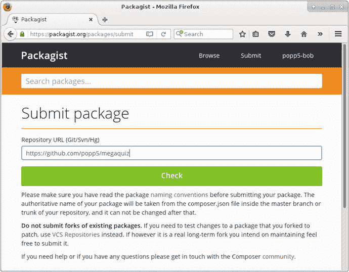
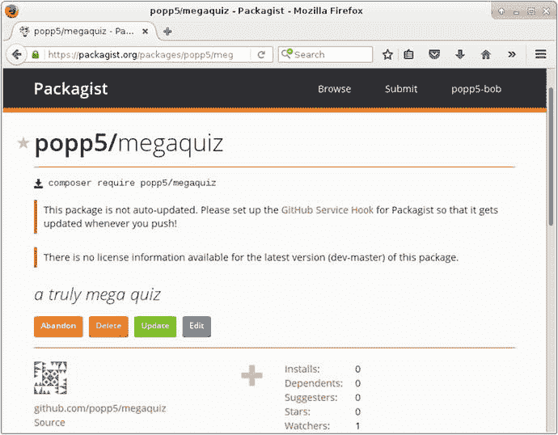
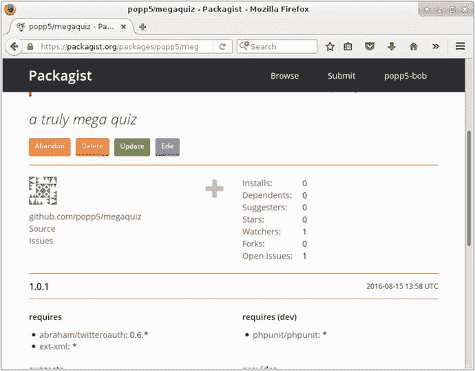

# 15. PHP 标准

除非你是律师或卫生检查员，否则标准这个话题可能不会让你心跳加速。然而，标准帮助我们实现的目标是值得兴奋的。标准促进了互操作性，这让我们能够接触到大量兼容的工具和框架组件。

本章将涵盖标准的几个重要方面：

- 为什么需要标准：什么是标准以及它们为何重要
- PHP 标准建议：它们的起源和目的
- PSR-1：基础编码标准
- PSR-2：编码风格指南
- PSR-4：自动加载


## 为什么需要标准？

设计模式天生具备互操作性。其核心思想在于：用设计模式描述的问题会提出特定解决方案，进而产生架构层面的影响，这些影响又可以被新模式妥善处理。模式还能通过提供共享词汇表，帮助开发者实现协作。面向对象系统往往推崇"友好共处"的原则。

不过，随着我们越来越多地共享彼此的组件，这种非正式的互操作性倾向有时并不够用。正如我们所看到的，`Composer`（或我们选择的包管理工具）允许我们在项目中混用各种工具。这些组件可能是独立的库，也可能是更大框架中的一部分。无论如何，一旦部署到系统中，它们必须能够与任意数量的其他组件协同工作。通过遵循核心标准，我们能降低代码出现兼容性问题的可能性。

从某种意义来说，标准本身的性质不如"被遵守"这个事实重要。例如我个人并不喜欢`PSR-2`风格指南的每个方面——但在包括本书在内的大多数情况下，我依然采用了该标准。我希望团队的其他开发者能更容易地处理我的代码，因为他们会看到熟悉的格式。而对于自动加载等其他标准，如果未能遵守通用标准，组件之间可能完全无法协同工作，除非借助额外的中间件。

标准或许不是编程中最令人兴奋的部分，但其核心存在一个有趣的矛盾点。表面上看，标准似乎限制了创造力——毕竟标准告诉你什么能做、什么不能做，你必须遵守。你可能认为这根本不是创新的土壤。然而，互联网之所以能给我们的生活带来如此蓬勃的创造力，恰恰是因为这个网络之网中的每个节点都遵循开放标准。困在围墙花园里的专有系统，无论其代码多么精妙或界面多么流畅，其范围和寿命必然受限。而拥有共享协议的互联网，确保了任何网站都能链接到其他网站。大多数浏览器支持标准的`HTML`、`CSS`和`JavaScript`。虽然我们在这些标准下构建的界面并非总是最令人惊艳的（尽管限制已比过去少得多），但遵守标准能最大化我们工作的覆盖范围。

善用标准能促进开放、协作，最终激发创造力。即便标准本身就施加了某些限制，这一点依然成立。

## 什么是 PHP 标准建议？

在 2009 年 PHP Tek 大会上，一群框架开发者组建了名为"PHP 框架互操作组"（`PHP-Fig`）的组织。此后，其他关键组件的开发者纷纷加入。他们的目标是制定标准，使各自系统能更好地共存。

该组织对标准提案进行投票，提案从草案（Draft）阶段，经由审核（Review）阶段，最终进入已接受（Accepted）状态。

表 15-1 列出了撰写本书时已接受的标准。

**表 15-1.** 已接受的 PHP 标准建议

| PSR 编号 | 名称 | 描述 |
| --- | --- | --- |
| 1 | 基础编码标准 | PHP 标签和基本命名约定等基础规范 |
| 2 | 编码风格指南 | 代码格式化，包括花括号位置、参数列表等规则 |
| 3 | 日志接口 | 日志级别与日志记录器行为的规则 |
| 4 | 自动加载标准 | 类与命名空间的命名约定，及其到文件系统的映射 |
| 6 | 缓存接口 | 缓存管理规则，包括数据类型、缓存项生命周期、错误处理等 |
| 7 | HTTP 消息接口 | HTTP 请求与响应的约定 |

但这并非全部。还有一些草案提案正在制定中，包括内联文档标准（`PSR-5`）、另一个风格指南（`PSR-12`），以及超媒体链接标准（`PSR-13`）。

### 为什么特别选择 PSR？

那么，为什么选这个标准而非另一个？恰巧`PSR`的创建者——PHP 框架互操作组——拥有非常优秀的血统，因此这些标准本身也合情合理。但更关键的是，这些标准正是主流框架和组件正在采纳的。如果你正在使用`Composer`为项目添加功能，你已经在使用符合`PSR`标准的代码。通过采用其自动加载约定和风格指南，你很可能正在构建能与其他人和组件协作的代码。

**注意**  
没有任何一套标准天生优于其他。当你决定是否采纳某个标准时，可能基于对该建议价值的判断。或者，你会根据工作环境做出务实的选择。例如，如果你在 WordPress 社区工作，可能需要采用核心贡献者手册中定义的标准（[`https://make.wordpress.org/core/handbook/best-practices/coding-standards/php/`](https://make.wordpress.org/core/handbook/best-practices/coding-standards/php/)）。这种选择恰恰体现了标准的意义——促进人与软件的协作。

`PSR`是可靠的选择，因为它们得到了关键框架和组件项目的支持（包括`Phing`、`Composer`、`PEAR`、`Symfony`和`Zend 2`）。和模式一样，标准也具有传染性——你可能已经在受益于它们。

### PSR 为谁而设计？

表面上看，`PSR`是为框架创建者设计的。但`PHP-Fig`组织的成员迅速扩展，涵盖了工具和框架的创建者，这表明标准具有广泛的相关性。话虽如此，如果你不创建日志记录器，可能无需过多关注`PSR-3`的细节（只需确保使用的日志工具本身符合标准即可）。另一方面，如果你读过本书其他章节，那么你很可能既在创建工具，也在使用工具。因此，无论是在当前标准还是未来标准中，你都很可能找到与自己相关的内容。

此外，还有一些与我们所有人都相关的标准。例如风格指南虽然并不耀眼，但对每个程序员都很重要。而指导自动加载的规则虽然主要适用于创建自动加载器的人（目前最主流的大概是`Composer`的自动加载器），但它们也从根本上影响我们如何组织类、包和文件。

基于这些原因，本章剩余部分将重点讨论编码风格和自动加载。


## 代码风格

我常常发现，诸如“你的花括号放错位置了”这类拉取请求评论格外令人恼火。这种意见往往显得吹毛求疵，且极易陷入“琐碎定律”的讨论。

**注意**：如果你还没遇到过，“bike-shedding”（琐碎定律）这个动词指的是某些审查者倾向于批评项目中不重要的部分。其隐含意义是，这些部分之所以被挑出来，是因为它们符合评论者的能力范围。因此，面对一座摩天大楼的评估，某位经理可能不会关注那座庞大而复杂的玻璃与钢铁之塔，而是聚焦于后面更容易理解的车棚。维基百科上对这个词的来历有详细的介绍：[`https://en.wikipedia.org/wiki/Law_of_triviality`](https://en.wikipedia.org/wiki/Law_of_triviality)

然而，我逐渐意识到，遵循统一的代码风格有助于提升代码质量。这主要关乎可读性（无论特定规则背后的理由是什么）。如果一个团队在缩进、花括号位置、参数列表等方面遵守相同的规则，那么开发者就能快速评估同事的代码并为其做出贡献。

因此，在本书的这一版中，我承诺编辑所有代码示例，使其符合 PSR-1 和 PSR-2 规范。我还请我的同事兼技术编辑 Paul Tregoing 监督我执行这一点。这是个在规划阶段很容易做出的承诺——实际执行起来却比我预想的要费力得多。这让我学到了关于代码风格的第一课：如果可能，尽早为你的项目采纳一套标准。按照代码风格进行重构很可能会占用资源，并使得跨越“大重构时期”的代码差异难以审查。

那么，我究竟需要做出哪些改动呢？让我们从基础开始。

### PSR-1 基本编码标准

这是 PHP 代码的基本原则。你可以在 [`http://www.php-fig.org/psr/psr-1/`](http://www.php-fig.org/psr/psr-1/) 找到详细内容。我们来逐一分解。

#### 开始与结束标签

首先，PHP 代码段应以 `<?php` 或 `<?=` 作为开始。换言之，不应使用短标签 `<?` 或其他任何变体。代码段只能以 `?>` 作为结束（或者，正如我们将在下一节中看到的，也可以完全不使用结束标签）。

#### 副作用

一个 PHP 文件应声明类、接口、函数等，或者执行某个操作（例如读取或写入文件、向浏览器发送输出）；但不应同时做这两件事。如果你习惯使用 `require_once()` 来引入其他类文件，这马上就会让你犯难，因为引入另一个文件这一行为本身就是一个副作用。正如模式催生模式一样，标准往往也要求其他标准。处理类依赖关系的正确方式是通过符合 PSR-4 规范的自动加载器。

那么，你声明的类在其方法中写入文件是否合法？这是完全可以接受的，因为这种效果并非由文件的引入所触发。换句话说，这是一种执行效果，而不是副作用。

那么，哪种文件可能执行操作而不是声明类呢？想想启动应用程序的那个脚本。

以下是一个因其被引入而直接执行操作的代码清单：

```
// 清单 15.01
// index.php
namespace popp\ch15\batch01;
require_once(__DIR__ . "/../../../vendor/autoload.php");
$tree = new Tree();
print "loaded " . get_class($tree) . "\n";
```

以下是一个声明了类且无副作用的 PHP 文件：

```
// 清单 15.02
// Tree.php
namespace popp\ch15\batch01;
class Tree
{
}
```

**注意**：在其他章节中，为了专注于代码本身，我通常会省略 `namespace` 声明和 `use` 指令。由于本章是关于类文件的格式化机制，我将在适当的地方包含 `namespace` 和 `use` 语句。

#### 命名

类必须使用大驼峰式（也称为“Studly Caps”）命名法进行声明。换句话说，类名应以大写字母开头。名称的其余部分应为小写，除非名称由多个单词组成。在这种情况下，每个单词的首字母应大写，如下所示：

```
class MyClassName
```

属性可以使用任何方式命名，但要求保持一致。我倾向于使用驼峰式命名法，这与大驼峰式类似，但首字母小写：

```
private $myPropertyName
```

方法必须使用驼峰式命名法：

```
public function myMethodName()
```

类常量必须全部大写，单词之间用下划线分隔：

```
const MY_NAME_IS = 'matt';
```


## 更多规则与示例

类、命名空间和文件应遵循 PSR-4 自动加载标准进行声明。不过我们会在本章稍后部分再讨论这一标准。PHP 文档应保存为 UTF-8 编码的文件。

最后，对于 PSR-1，我们先来展示一个完全错误的例子——然后再纠正它。下面是一个违反了所有规则的类文件：

```php
<?php

class read_conf
{
const mode = 1;
const mode_db = 2;
public $conf_file;
public $confValues;
function read_conf()
{
// 实现代码
}
}
```

你能找出所有问题吗？首先，我使用了短开标签。同时我还未能声明`namespace`（尽管我们尚未详细讨论这一要求）。在命名类时，我使用了下划线和小写字母，而非驼峰式大小写。对于常量名，我使用了两种格式，而这两种格式都不是标准要求——即所有字母大写，单词之间用下划线分隔。虽然我的两个属性名都是合法的，但我未能保持命名一致；具体来说，我对`$conf_file`使用了蛇形命名法，而对`$confValues`使用了驼峰命名法。在命名方法`read_conf()`时，我使用了下划线而非驼峰命名法。

现在我们来修正这些问题：

```php
<?php
// 代码清单 15.04
namespace popp\ch15\batch01;
class ConfReader {
const MODE_FILE = 1;
const MODE_DB = 2;
private $confFile;
private $confValues = [];
function readConf() {
// 实现代码
}
}
```

### PSR-2 编码风格指南

编码风格指南（PSR-2）建立在 PSR-1 基础之上。让我们直接开始，了解其中的一些规则。

#### PHP 文档的开头与结尾

我们已经看到 PSR-1 要求 PHP 代码块以`<?php`开头。PSR-2 规定纯 PHP 文件不应包含结束标签`?>`，而应以一个空行结尾。很容易就会在文件末尾加上结束标签，然后意外多出一个换行符。这可能导致格式错误，以及在设置 HTTP 头部时出错（在内容已发送至浏览器后，无法再设置头部）。

`namespace`声明后应紧跟一个空行，`use`声明块后也应跟一个空行。同一行内不得出现多个`use`声明：

```php
// 代码清单 15.05
namespace popp\ch15\batch01;
use popp\ch10\batch06\DiamondDecorator;
use popp\ch10\batch06\DiamondPlains;
// 开始类定义
```

#### 类的开始与结束

`class`关键字、类名以及`extends`和`implements`必须放在同一行。如果一个类实现了多个接口，每个接口名可以包含在类声明的同一行，也可以缩进后单独成行。如果选择将接口名放在多行，第一个接口名必须单独成行，而不是紧跟在`implements`关键字之后。类的大括号应在类声明之后另起一行开始，并在其单独一行结束（紧随类内容之后）。因此，一个类声明可能如下所示：

```php
// 代码清单 15.06
class EarthGame extends Game implements
Playable,
Savable
{
// 类主体
}
```

不过，你也可以将接口名放在同一行：

```php
class EarthGame extends Game implements Playable, Savable
{
// 类主体
}
```

#### 属性声明

属性必须声明可见性（`public`、`private`或`protected`）。不允许使用`var`关键字。我们已经在 PSR-1 部分涵盖了属性名的格式。你可以使用蛇形命名法、驼峰命名法或大驼峰命名法——但必须保持一致。

#### 方法的开始与结束

所有方法必须声明可见性（`public`、`private`或`protected`）。可见性关键字必须放在`abstract`或`final`之后，`static`之前。带有默认值的方法参数应放在参数列表的末尾。

##### 单行声明

方法大括号应在方法名后另起一行开始，并在其单独一行结束（紧随方法代码之后）。方法参数列表的开头和结尾不应有空格（即应紧贴括号）。对于每个参数，逗号应紧跟前一个参数名（或默认值），然后后面跟一个空格。让我们通过一个示例来澄清：

```php
// 代码清单 15.07
final public static function generateTile(int $diamondCount, bool $polluted = false)
{
// 实现代码
}
```

##### 多行声明

当参数较多时，单行方法声明就不太实用了。在这种情况下，你可以拆开参数列表，使每个参数（包括类型、参数变量、默认值和逗号）缩进后单独成行。此时，关闭括号应放在参数列表之后的行，并与方法声明的开头对齐。左大括号应跟随在关闭括号的同一行，之间用空格分隔。方法体应从新行开始。再次说明，这听起来比实际复杂。一个例子应该能让它更清晰：

```php
// 代码清单 15.08
public function __construct(
int $size,
string $name,
bool $wraparound = false,
bool $aliens = false
) {
// 实现代码
}
```

#### 行与缩进

缩进应使用四个空格，而不是制表符。值得检查一下编辑器设置——你可以配置好的编辑器，在按下`Tab`键时使用空格而非制表符。此外，应在每行字符数达到 120 之前换行。

#### 方法调用与函数调用

方法名与左括号之间不要留空格。在方法调用中，你可以对参数列表应用与方法声明中相同的规则。换句话说，对于单行调用，左括号后和右括号前不留空格。每个参数后紧跟逗号，然后是一个空格，再是下一个参数。如果需要在多行中调用方法，每个参数应缩进单独成行，右括号放在新的一行：

```php
// 代码清单 15.09
$earthgame = new EarthGame(
5,
"earth",
true,
true
);
$earthgame::generateTile(5, true);
```

#### 控制流

控制流关键字（`if`、`for`、`while`等）后必须跟一个空格。但是，左括号后不能有空格。同样，右括号前也不能有空格。因此，括号内的内容应紧贴括号。与类声明和（单行）函数声明不同，控制流块的左大括号应放在右括号的同一行。右大括号应单独成行。这里有一个简单示例：

```php
// 代码清单 15.10
$tile = [];
for ($x = 0; $x < $diamondcount; $x++) {
if ($polluted) {
$tile[] = new PollutionDecorator(new DiamondDecorator(new Plains()));
} else {
$tile[] = new DiamondDecorator(new Plains());
}
}
```

注意`for`和`if`后的空格。`for`和`if`语句紧贴其括号。在两种情况下，右括号后都跟一个空格，然后是控制流主体的左大括号。

### 检查与修复你的代码

即使本章涵盖了 PSR-2 中的每一条指令，也很难全部记住。毕竟，我们还有其他事情要考虑——比如我们系统的设计和实现。因此，既然我们已经认同编码标准的重要性，如何在不过多占用时间或精力的情况下遵守它们呢？当然是使用工具。


`PHP_CodeSniffer` 允许你检测甚至修复编码规范违规行为——并不仅仅是 PSR 规范。你可以按照 [`https://github.com/squizlabs/PHP_CodeSniffer`](https://github.com/squizlabs/PHP_CodeSniffer) 上的说明获取它。这里有 Composer 和 PEAR 选项，但以下是下载 PHP 归档文件的方法：

```
curl -OL https://squizlabs.github.io/PHP_CodeSniffer/phpcs.phar
curl -OL https://squizlabs.github.io/PHP_CodeSniffer/phpcbf.phar
```

为什么需要两个下载？第一个是用于`phpcs`，它诊断和报告违规行为。第二个是用于`phpcbf`，它可以修复很多违规行为。让我们来测试一下这两个工具。首先，这里有一段格式混乱的代码：

```
// listing 15.11
namespace popp\ch15\batch01;
class ebookParser {
function __construct(string $path , $format=0 ) {
if ($format>1)
$this->setFormat( 1 );
}
function setformat(int $format) {
// do something with $format
}
}
```

与其在这里逐一介绍问题，不如让`PHP_CodeSniffer`为我们完成这项工作：

```
$ php phpcs.phar --standard=PSR2 src/ch15/batch01/phpcsBroken.php

FOUND 14 ERRORS AFFECTING 6 LINES

 3 | ERROR | [x] There must be one blank line after the namespace
   |       |     declaration
 4 | ERROR | [ ] Class name "ebookParser" is not in camel caps
   |       |     format
 4 | ERROR | [x] Opening brace of a class must be on the line after
   |       |     the definition
 6 | ERROR | [ ] Visibility must be declared on method "__construct"
 6 | ERROR | [x] Expected 0 spaces between argument "$path" and
   |       |     comma; 1 found
 6 | ERROR | [x] Incorrect spacing between argument "$format" and
   |       |     equals sign; expected 1 but found 0
 6 | ERROR | [x] Incorrect spacing between default value and equals
   |       |     sign for argument "$format"; expected 1 but found 0
 6 | ERROR | [x] Expected 0 spaces between argument "$format" and
   |       |     closing bracket; 1 found
 6 | ERROR | [x] Opening brace should be on a new line
 7 | ERROR | [x] Inline control structures are not allowed
 8 | ERROR | [x] Space after opening parenthesis of function call
   |       |     prohibited
 8 | ERROR | [x] Expected 0 spaces before closing bracket; 1 found
11 | ERROR | [ ] Visibility must be declared on method "setformat"
11 | ERROR | [x] Opening brace should be on a new line

PHPCBF CAN FIX THE 11 MARKED SNIFF VIOLATIONS AUTOMATICALLY
```

对于只有几行代码来说，问题数量多得吓人。幸运的是，正如输出所示，我们可以不费吹灰之力就解决其中的许多问题：

```
$ php phpcbf.phar --standard=PSR2 src/ch15/batch01/EbookParser.php
```

```
Processing EbookParser.php [PHP => 83 tokens in 15 lines]... DONE in 11ms (11 fixable violations)
=> Fixing file: 0/11 violations remaining [made 4 passes]... DONE in 17ms
Patched 1 file
```

现在，如果我们再次运行`phpcs`，会发现情况已经大为改善：

```
$ php phpcs.phar --standard=PSR2 src/ch15/batch01/EbookParser.php

FOUND 3 ERRORS AFFECTING 3 LINES

 5 | ERROR | Class name "ebookParser" is not in camel caps format
 8 | ERROR | Visibility must be declared on method "__construct"
15 | ERROR | Visibility must be declared on method "setformat"
```

我会继续添加可见性声明，然后修改类的名称——这项工作很快就能完成！现在，我拥有了一份风格合规的代码文件：

```
// listing 15.12
namespace popp\ch15\batch01;
class EbookParser
{
    public function __construct(string $path, $format = 0)
    {
        if ($format > 1) {
            $this->setFormat(1);
        }
    }
    private function setformat(int $format)
    {
        // do something with $format
    }
}
```

## PSR-4 自动加载

我们在第 5 章中了解了 PHP 对自动加载的支持。在该章中，我们看到了如何使用 `spl_autoload_register()` 函数，根据尚未加载的类的名称来自动引入文件。虽然这很强大，但它也是一种幕后魔法。这在单个项目中是可以的，但如果多个组件融合在一起，并且都使用不同的约定来加载类文件，就会导致极大的混乱。

自动加载标准（PSR-4）要求框架遵循一套共同的规则，从而为这种魔法增添了一些纪律性。

这对开发者来说是个好消息。这意味着我们或多或少可以忽略引入文件的机制，而专注于类依赖关系。

### 对我们来说重要的规则

PSR-4 的主要目的是为自动加载器开发者定义规则。然而，这些规则不可避免地决定了我们必须声明命名空间和类的方式。以下是一些基础知识。

一个完全限定类名（即类的名称，包括其命名空间）必须包含一个初始的“供应商”命名空间。因此，一个类必须至少有一个命名空间。

假设我们的供应商命名空间是`popp`。我们可以这样声明一个类：

```
// listing 15.13
namespace popp;
class Services
{
}
```

这个类的完全限定类名是`popp\Services`。

路径中的初始命名空间必须对应一个或多个基目录。我们可以利用这一点，将一组子命名空间映射到一个起始目录。例如，如果我们只想使用`popp\library`命名空间（而不使用`popp`命名空间下的其他任何东西），那么我们可以将其映射到一个顶层目录，这样就不用维护一个空的`popp/`目录了。

让我们创建一个`composer.json`文件来执行这个映射：

```
{
    "autoload": {
        "psr-4": {
            "popp\\library\\": "mylib"
        }
    }
}
```

注意，我甚至不需要将基目录命名为`"library"`。这是将`popp\library`映射到`mylib`目录的一个任意映射。现在，我可以在`mylib`目录下创建一个类文件：

```
// listing 15.14
// mylib/LibraryCatalogue.php
namespace popp\library;
use popp\library\inventory\Book;
class LibraryCatalogue
{
    private $books = [];
    public function addBook(Book $book)
    {
        $this->books[] = $book;
    }
}
```

为了能够被找到，`LibraryCatalogue`类必须放在一个名称完全相同的文件中（显然还需要添加`.php`扩展名）。

在将基目录（`mylib`）与初始命名空间（`popp\library`）关联之后，后续的目录和子命名空间之间必须存在直接关系。碰巧，我在`LibraryCatalogue`类中已经引用了一个名为`popp\library\inventory\Book`的类。因此，该类文件应放置在`mylib/inventory`目录下：

```
// listing 15.15
// mylib/library/inventory/Book.php
namespace popp\library\inventory;
class Book
{
    // implementation
}
```

还记得那条规则吗？路径中的初始命名空间必须对应一个或多个基目录。到目前为止，我们在`popp\library`和`mylib`之间建立了一对一的关系。实际上，我们完全可以将`popp\library`命名空间映射到多个基目录。让我们在映射中添加一个名为`additional`的目录；以下是`composer.json`的修改：

```
{
    "autoload": {
        "psr-4": {
            "popp\\library\\": ["mylib", "additional"]
        }
    }
}
```

现在，我可以创建`additional/inventory`目录和一个位于其中的类：

```
// listing 15.16
// additional/inventory/Ebook.php
namespace popp\library\inventory;
class Ebook extends Book
{
    // implementation
}
```

接下来，让我们创建一个顶级的运行脚本`index.php`来实例化这些类。


```php
// listing 15.17
// index.php
require_once("vendor/autoload.php");
use popp\library\LibraryCatalogue;
// will be found under mylib/
use popp\library\inventory\Book;
// will be found under additional/
use popp\library\inventory\Ebook;
$catalogue = new LibraryCatalogue();
$catalogue->addBook(new Book());
$catalogue->addBook(new Ebook());
```

**注意**  
你必须使用 Composer 生成自动加载文件 `vendor/autoload.php`，并且在访问你在 `composer.json` 中声明的逻辑之前，必须以某种方式包含该文件。你可以通过运行命令 `composer install` 来实现。你可以在第 15 章了解更多关于 Composer 的信息。

还记得关于副作用的规则吗？一个 PHP 文件应该声明类、接口、函数等；或者执行一个动作。但是，它不应该同时做这两件事。此脚本属于执行动作的类别。关键在于，它调用了 `require_once()` 来包含使用 `composer.json` 文件中的配置生成的自动加载代码。正因为如此，所有的类都被定位到了，尽管 `Ebook` 被放置在了一个与其余代码完全不同的独立基础目录中。

为什么要为同一个核心命名空间维护两个独立的目录？一个可能的原因是，你想将单元测试与生产代码分开管理。你也可以管理不会随系统每个版本一起发布的插件和扩展。

**注意**  
请务必关注 [`http://www.php-fig.org/psr/`](http://www.php-fig.org/psr/) 上的所有 PSR 标准。这是一个快速发展的领域，你很可能会发现与你相关的标准正在制定中。

## 总结

在本章中，我稍微纠结了一下标准可能不那么激动人心的可能性——然后论证了它们的力量。标准帮助我们解决了集成问题，这样我们就可以继续做更了不起的事情。我介绍了 PSR-1 和 PSR-2，即基本编码规范和更广泛的编码风格标准。接着，我讨论了 PSR-4，即自动加载器的标准。最后，我通过一个基于 Composer 的示例，展示了在实际操作中符合 PSR-4 的自动加载。

## 16. PHP 使用和创建组件
### 使用 Composer

程序员渴望生成可重用的代码。这是面向对象编程的伟大目标之一。我们喜欢将有用的功能从特定上下文的混乱中抽象出来，将一个特定的解决方案变成一个可以反复使用的工具。从另一个角度来看，如果程序员热爱可重用，他们就讨厌重复。通过创建可以复用的库，程序员避免在多个项目中实现类似的解决方案。

然而，即使我们在自己的代码中避免了重复，还有一个更广泛的问题。对于你创建的每一个工具，有多少其他程序员也实现了相同的解决方案？这造成了史诗般的浪费：程序员之间进行协作，集中精力将一个单一的工具做得更好，而不是产生大量同一主题的变体，难道不是更明智吗？

为了做到这一点，我们需要获取现有的库。但随后我们需要的包很可能还需要其他库才能工作。因此，我们需要一个能够处理下载和安装包，以及管理它们依赖关系的工具。这就是 Composer 的用武之地；它做了所有这些，甚至更多。

本章将涵盖几个关键问题：

*   **安装**：下载和设置 Composer
*   **需求**：使用 `composer.json` 获取包
*   **版本**：指定版本，以便在不破坏系统的情况下获取最新代码
*   **Packagist**：配置代码以供公共访问
*   **私有仓库**：利用私有仓库使用 Composer

## 什么是 Composer？

严格来说，Composer 是一个依赖管理器，而不是包管理器。这似乎是因为它在本地处理组件关系，而不是像 Yum 和 Apt 那样集中处理。如果你认为这是一个过于细微的区别，你可能是对的。无论我们如何定义它，Composer 允许你指定包。它将包下载到本地目录（`vendor`），查找并下载所有依赖项，然后通过一个自动加载器使所有这些代码对你的项目可用。

和往常一样，我们需要从获取工具开始。

## 安装 Composer

你可以从 [`https://getcomposer.org/download/`](https://getcomposer.org/download/) 下载 Composer。你会在那里找到一个安装程序机制，但 `phar` 文件应该能满足大多数用途：

```
$ wget https://getcomposer.org/download/1.2.0/composer.phar .
$ chmod 755 composer.phar
$ sudo mv composer.phar /usr/bin/composer
```

我下载了归档文件并运行 `chmod` 来确保它是可执行的。然后我把它复制到一个中心位置，这样我就可以从系统的任何地方轻松运行它。现在我可以测试这个命令了：

```
$ composer --version
Composer version 1.2.0 2016-07-19 01:28:52
```

## 安装一个（一组）包

我为什么要做那个带括号的花哨操作？因为包总会衍生出其他包——有时会衍生出很多包。

不过，让我们从一个独立的库开始。假设我们正在构建一个需要与 Twitter 通信的应用程序。稍加研究，我找到了 `abraham/twitteroath` 包。为了安装它，我需要生成一个名为 `composer.json` 的 JSON 文件，然后定义一个 `require` 元素：

```
{
"require": {
"abraham/twitteroauth": "0.6.*"
}
}
```

我开始时，目录除了 `composer.json` 文件外是空的。但是，一旦我运行 Composer 命令，我们就会看到变化：

```
$ composer install
Loading composer repositories with package information
Updating dependencies (including require-dev)
- Installing abraham/twitteroauth (0.6.4)
Downloading: 100%
Writing lock file
Generating autoload files
```

那么生成了什么呢？让我们看看：

```
$ ls
composer.json  composer.lock  vendor
```

Composer 将包安装到 `vendor/` 中。它还会生成一个名为 `composer.lock` 的文件。这个文件指定了所有已安装包的精确版本。如果你使用版本控制，你应该提交这个文件。如果另一个开发者运行 `composer install` 并且 `composer.lock` 文件存在，那么她系统上安装的包版本将与指定版本完全相同。通过这种方式，团队可以保持同步，并且你可以确保生产环境与开发和测试环境完全匹配。你可以通过运行以下片段来覆盖锁定文件：

```
composer update
```

这将生成一个新的锁文件。通常，你会运行此命令以保持与新的包版本同步（如果你像我所做的那样使用了通配符或范围）。

## 从命令行安装包

如你所见，我可以使用编辑器创建 `composer.json` 文件。但你也可以让 Composer 为你做这件事。如果你需要从一个单一包开始，这尤其有用。当你在命令行上调用 `composer require` 时，Composer 会下载指定的包并将其安装到 `vendor/` 中。它还会生成一个 `composer.json` 文件，然后你可以编辑和扩展该文件：

```
$ composer require abraham/twitteroauth
Using version ⁰.6.4 for abraham/twitteroauth
./composer.json has been created
Loading composer repositories with package information
Updating dependencies (including require-dev)
- Installing abraham/twitteroauth (0.6.4)
Loading from cache
Writing lock file
Generating autoload files
```


Composer 被设计为支持语义化版本号。本质上，这涉及用三个由点分隔的数字来定义包版本：主版本号、次版本号和补丁版本号。如果你修复了一个错误，没有添加任何功能，并且没有破坏向后兼容性，你应该增加补丁版本号。如果你添加了新功能，但没有破坏向后兼容性，你应该增加中间的次版本号。如果你的新版本破坏了向后兼容性（换句话说，如果突然切换到这个新版本会导致客户端代码出现问题），那么你应该增加第一个主版本号。

> **注意**
> 你可以在 [`https://semver.org`](https://semver.org) 阅读更多关于语义化版本约定的内容。

在 `composer.json` 文件中指定版本时，你应该牢记这一点：如果你的范围或通配符过于宽松，你可能会发现系统在更新时出现问题。

表 16-1 展示了部分可以用 Composer 指定版本的方式。

**表 16-1. Composer 和包版本**

| 类型 | 示例 | 说明 |
| :--- | :--- | :--- |
| 精确版本 | `1.2.2` | 仅安装给定的版本 |
| 通配符 | `1.2.*` | 安装指定数字的精确版本，但寻找与通配符匹配的最新可用版本 |
| 范围 | `1.0.0 - 1.1.7` | 安装一个不低于第一个数字且不高于最后一个数字的版本 |
| 比较 | `>1.2.0 <=1.2.2` | 使用 `<`、`<=`、`>` 和 `>=` 来指定复杂的范围。你可以用空格（等同于“且”）或 `\|\|`（指定“或”）组合这些指令。 |
| 波浪号（主版本） | `~1.3` | 给定的数字是最小值，并且指定的最后一个数字可以增加。所以对于 `~1.3`，`1.3` 是最小值，并且不能匹配 `2.0.0` 或更高版本 |
| 脱字符 | `¹.3` | 将匹配到下一个破坏性变更之前（但不包括该变更）。因此，虽然 `~1.3.1` 不会匹配 1.4 及更高版本，但 `¹.3.1` 将匹配从 1.3.1 到 2.0.0 之前（不包括 2.0.0）的所有版本。这通常是最有用的快捷方式 |

### `require-dev`

很多时候，你在开发过程中需要一些在生产环境下不必要的包。例如，你希望本地运行测试，但你的公开网站上不太可能需要 PHPUnit。

Composer 通过支持单独的 `require-dev` 元素来解决这个问题。你可以像在 `require` 元素中一样，在这里添加包：

```json
{
  "require-dev": {
    "phpunit/phpunit": "*"
  },
  "require": {
    "abraham/twitteroauth": "0.6.*",
    "ext-xml": "*"
  }
}
```

现在，当我们运行 `composer install` 时，PHPUnit 和各种依赖包会被下载并安装：

```
$ composer install
Loading composer repositories with package information
Updating dependencies (including require-dev)
- Installing abraham/twitteroauth (0.6.4)
Loading from cache
- Installing symfony/yaml (v3.1.3)
Downloading: 100%
- Installing sebastian/version (2.0.0)
Downloading: 100%
....
- Installing phpspec/prophecy (v1.6.1)
Downloading: 100%
- Installing myclabs/deep-copy (1.5.1)
Loading from cache
- Installing phpunit/phpunit (5.5.0)
Downloading: 100%
sebastian/global-state suggests installing ext-uopz (*)
phpunit/phpunit-mock-objects suggests installing ext-soap (*)
phpunit/php-code-coverage suggests installing ext-xdebug (>=2.4.0)
phpunit/phpunit suggests installing phpunit/php-invoker (~1.1)
Writing lock file
Generating autoload files
```

然而，如果你是在生产环境下安装，你可以向 `composer install` 传递 `--no-dev` 标志，Composer 将只下载在 `require` 元素中指定的包：

```
$ composer install --no-dev
Loading composer repositories with package information
Updating dependencies
- Installing abraham/twitteroauth (0.6.4)
Loading from cache
Writing lock file
Generating autoload files
```

> **注意**
> 当你运行 `composer install` 命令时，Composer 会创建一个名为 `composer.lock` 的文件。这会记录你在 `vendor/` 目录下安装的每个文件的精确版本。如果你在 `composer.json` 旁边有一个 `composer.lock` 文件的情况下运行 `composer install`，Composer 将会获取它记录的包版本（如果这些版本不存在的话）。这很有用，因为你可以将 `composer.lock` 文件提交到你的版本控制仓库，从而确保你的团队将下载你所安装的所有包的相同版本。如果你需要覆盖 `composer.lock`，无论是为了获取包的最新版本，还是因为你更改了 `composer.json`，你都应该运行 `composer update` 来覆盖这个锁定文件。

### Composer 和自动加载

我们在第 15 章已经详细介绍了自动加载。但为了完整起见，值得在这里简要回顾一下。Composer 会生成一个名为 `autoload.php` 的文件，该文件负责处理它下载的包的类加载。你也可以通过引入 `autoload.php`（通常使用 `require_once()`）来为你自己的代码利用此功能。完成此操作后，只要你的目录和文件名与你的命名空间和类名一致，你在系统中声明的任何类在代码中被访问时都会自动找到。

换句话说，一个名为 `popp5/megaquiz/command/CommandContext` 的类必须放在 `popp5/megaquiz/command/` 目录下的 `CommandContext.php` 文件中。

如果你想进行一些调整（比如省略一个或两个冗余的前导目录，或者向搜索路径中添加一个测试目录），那么你可以使用 `autoload` 元素将命名空间映射到你的文件结构，如下所示：

```json
"autoload": {
  "psr-4": {
    "popp5\\megaquiz\\": ["src", "test"]
  }
}
```

现在，只要包含了 `autoload.php`，我的类就很容易被发现。得益于我的 `autoload` 配置，`popp5/megaquiz/command/CommandContext` 类现在可以在 `src/command/CommandContext.php` 中找到。不仅如此，因为我引用了多个目标（`test` 以及 `src`），我还可以在 `test/` 目录下创建属于 `popp5\megaquiz\` 命名空间的测试类。

请参阅第 15 章的“PSR-4 自动加载”部分，以了解一个更深入的示例。

### 创建你自己的包

如果你过去使用过 PEAR，你可能会期望在这里看到关于创建包的部分涉及一个全新的包文件。实际上，我们在本章中一直在创建一个包。我们只需要添加一些更多信息，然后找到一种方式让我们的代码对其他人可用。

#### 添加包信息

要创建一个可用的包，你实际上不需要添加太多信息，但你绝对需要一个 `name`，这样你的包才能被找到。我还将包含 `description` 和 `authors` 元素，以及创建一个名为 `megaquiz` 的虚构产品，你会在其他章节偶尔看到它：

```json
"name": "popp5/megaquiz",
"description": "一个真正宏大的测验",
"authors": [
  {
    "name": "马特·赞斯特拉",
    "email": "matt@getinstance.com"
  }
],
```

这些字段大部分应该是不言自明的。唯一可能例外的是那个前导的命名空间——这里指的是 `popp5`——它与实际的包名之间用一个正斜杠分隔。这被称为供应商名称。正如你所料，当你的包被安装时，供应商名称会成为 `vendor/` 下的一个顶级目录。这通常是包所有者在 Github 或 Bitbucket 中使用的组织名称。

完成所有这些设置后，你就可以将你的包提交到你选择的版本控制托管服务了。如果你不确定这涉及什么，你可以在第 17 章中了解更多关于这个主题的内容。


Composer 支持 `version` 字段，但更佳实践是使用 Git 中的标签来追踪包的版本。Composer 会自动识别此信息。

请记住，你不应推送 `vendor` 目录（至少通常不应如此——该规则存在一些有争议的例外）。然而，将生成的 `composer.lock` 文件与 `composer.json` 一起追踪通常是个好主意。

## 平台包

虽然你不能使用 Composer 安装系统级包，但可以指定系统级需求，这样你的包只会在满足其要求的系统上安装。

平台包通过单个键来指定，但在少数情况下，该键会使用破折号进一步按类型细分。我在表 16-2 中列出了可用的类型。

**表 16-2. 平台包**

| 类型 | 示例 | 描述 |
| --- | --- | --- |
| PHP | `"php": "7.*"` | PHP 版本 |
| 扩展 | `"ext-xml": ">2"` | PHP 扩展 |
| 库 | `"lib-iconv": "∼2"` | PHP 使用的系统库 |
| HHVM | `"hhvm": "∼2"` | HHVM 版本（HHVM 是一个支持 PHP 扩展版本的虚拟机） |

让我们来试一下：

```json
{
"require": {
"abraham/twitteroauth": "0.6.*",
"ext-xml": "*",
"ext-gd": "*"
}
}
```

在上述代码中，我指定了包需要 `xml` 和 `gd` 扩展。现在运行 `update`：

```
$ composer update
Loading composer repositories with package information
Updating dependencies (including require-dev)
Your requirements could not be resolved to an installable set of packages.
Problem 1
- The requested PHP extension ext-gd * is missing from your system. Install or enable PHP's gd extension.
```

看起来我已经为 XML 做好了准备；然而，图像处理包 GD 并未安装在我的系统上，因此 Composer 抛出了一个错误。

## 通过 Packagist 分发

如果你一直在学习本章，你可能会好奇我们安装的包到底来自哪里。这感觉很像魔法，但（正如你所料）幕后有一个包仓库。它叫做 Packagist，可以在 [`packagist.org`](https://packagist.org) 找到。只要你的代码位于公共 Git 仓库中，就可以通过 Packagist 提供。

让我们试一下。我已经将我的 `megaquiz` 项目推送到了 GitHub，所以现在我需要告诉 Packagist 我的仓库。注册后，我只需添加仓库的 URL。你可以在图 16-1 中看到这一点。



**图 16-1. 向 Packagist 添加包**

添加 `megaquiz` 后，Packagist 会定位仓库，检查 `composer.json` 文件，并显示一个控制面板。你可以在图 16-2 中看到这一点。



**图 16-2. 包控制面板**

Packagist 告诉我尚未设置许可证信息。我可以随时通过在 `composer.json` 文件中添加 `license` 元素来修复此问题：

```json
"license": "Apache-2.0",
```

Packagist 也没有找到任何版本信息。我将通过在 GitHub 仓库中添加一个标签来修复此问题：

```
$ git tag -a '1.0.1' -m '1.0.1'
$ git push –tags
```

> **注意：** 如果你认为我跳过这些 Git 内容是在作弊，那你是对的。我将在第 17 章中详细讨论 Git 和 GitHub。

现在 Packagist 知道了我的版本号。你可以在图 16-3 中确认这一点。



**图 16-3. Packagist 识别了版本**

现在，任何人都可以从另一个包中包含 `megaquiz`。这是一个最小的 `composer.json` 文件：

```json
{
"require": {
"popp5/megaquiz": "*"
}
}
```

我指定了供应商名称和包名称。冒险地，我乐于接受任何版本。让我们继续安装：

```
$ composer install
Loading composer repositories with package information
Installing dependencies (including require-dev)
- Installing abraham/twitteroauth (0.6.4)
Loading from cache
- Installing popp5/megaquiz (1.0.1)
Downloading: 100%
Writing lock file
Generating autoload files
```

请注意，我设置 `megaquiz` 时指定的依赖项也会被下载。

### 保持私有

当然，你并不总想将代码发布给全世界。有时你只需与一小部分授权用户共享。

这是我用于内部项目的一个名为 `getinstance/api_util` 的私有包：

```json
{
"name": "getinstance/api_util",
"description": "core getinstance api code",
"authors": [
{
"name": "matt zandstra",
"email": "matt@getinstance.com"
}
],
"require": {
"silex/silex": "∼1.3",
"bshaffer/oauth2-server-php": "∼1.8"
},
"require-dev": {
"phpunit/phpunit": "∼4.3.0"
},
"autoload": {
"psr-4": {
"getinstance\\api_util\\": ["src" , "test/functional"]
}
}
}
```

这托管在一个私有 Bitbucket 仓库中，因此无法通过 Packagist 获取。那么我该如何将其包含到项目中呢？我只需要告诉 Composer 在哪里查找。我可以通过创建或添加到 `repositories` 元素来实现：

```json
{
"repositories": [
{
"type": "vcs",
"url": "git@bitbucket.org:getinstance/api_util.git"
}
],
"require": {
"popp5/megaquiz": "*",
"getinstance/api_util": "v1.0.3"
}
}
```

所以现在，只要我有权访问 `getinstance/api_util`，就可以一次性安装我的私有包和 `megaquiz`：

```
$ composer install
Loading composer repositories with package information
Installing dependencies (including require-dev)
- Installing abraham/twitteroauth (0.6.4)
Loading from cache
- Installing popp5/megaquiz (1.0.1)
Loading from cache
...
- Installing silex/silex (v1.3.5)
Loading from cache
- Installing getinstance/api_util (v1.0.3)
Cloning 3cf2988875b824936e6421d0810ceea90b76d139
...
Writing lock file
Generating autoload files
```

## 总结

你应该从本章中了解到利用 Composer 包为项目增添能力是多么容易。通过 `composer.json` 文件，你还可以让其他用户访问你的代码，无论是通过 Packagist 公开访问，还是通过指定自己的仓库。这种方法为用户自动化了依赖项下载，并允许第三方包使用你的包而无需捆绑。

