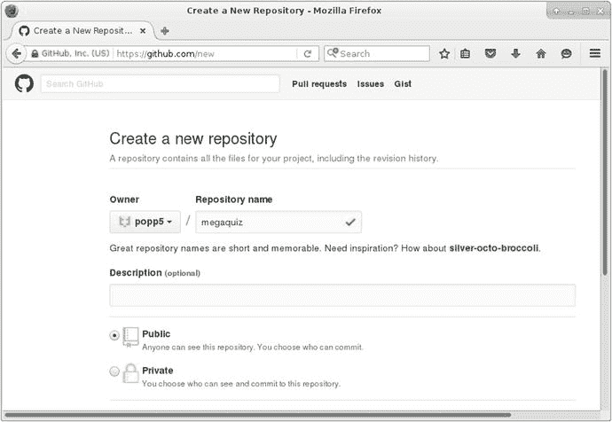
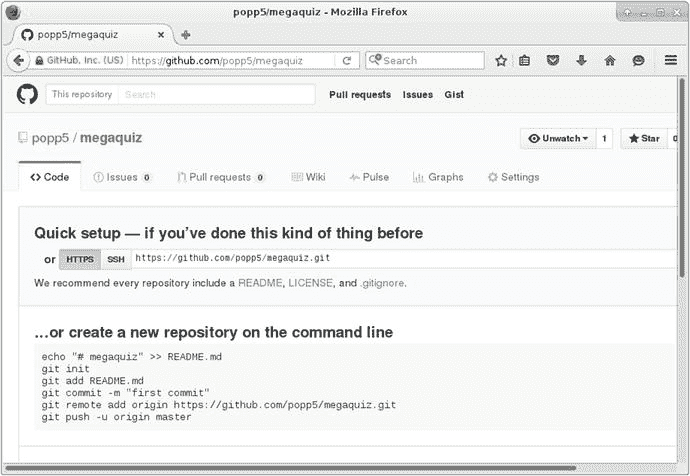
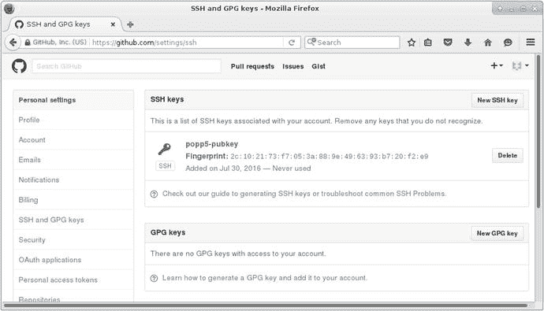

# 17. 使用 Git 进行版本控制

所有灾难都有其临界点，即秩序最终崩溃、事态彻底失控的那一刻。你是否曾在这样的项目中挣扎？你能识别出那个关键时刻吗？

或许，当你做了“一点点改动”后，却发现一切轰然倒塌（更糟的是，你还不确定如何回到你刚刚摧毁的稳定状态）。也可能是当你发现团队的三名成员正在处理同一组类，并乐呵呵地覆盖彼此的工作时。又或者，当你发现你已经实现过两次的 bug 修复，不知何故再次从代码库中消失时。如果有一个工具能帮你管理协作工作，允许你拍摄项目快照、在必要时回滚、然后合并多个开发分支，那该多好？在本章中，我们将介绍 Git，一个能做到这一切，甚至更多的工具。

本章将涵盖使用 Git 的以下方面：

*   **基本配置：** 探索设置 Git 的一些技巧

*   **导入：** 开始一个新项目

*   **提交更改：** 将你的工作保存到仓库

*   **更新：** 将其他人的工作与你的工作合并

*   **分支：** 维护并行的开发分支

## 为什么使用版本控制？

## 如果还没体验过，版本控制将改变你的人生

如果还没体验过，版本控制将改变你的人生（哪怕只是你作为开发者的人生）。有多少次，你在项目中达到一个稳定状态，深吸一口气，然后再次一头扎进开发的混乱中？当需要展示你的工作进行到哪一步时，回退到稳定版本又有多么容易？当然，你可能在项目达到稳定状态时保存过一份快照，大概是通过复制你的开发目录。现在想象一下，你的同事正在同一个代码库上工作。他也许和你一样保存了一份稳定的代码副本。区别在于，他的副本是他工作的快照，而不是你的。当然，他也有一个混乱的开发目录。这样一来，你就需要协调项目的四个版本。现在再想象一下，一个项目有四名程序员和一名网页 UI 开发者。你的脸色看起来有点苍白。或许你想躺下休息一会儿？

`Git` 的存在正是为了解决这个问题。使用 `Git`，你所有的开发者都可以从一个中央仓库克隆他们自己的代码库副本。每当他们的代码达到一个稳定点，他们就可以从服务器拉取最新代码，并将其与自己的近期工作合并。当他们准备好，并且修复了所有冲突之后，就可以将新的稳定成果推回共享仓库。

`Git` 是一个分布式版本控制系统。这意味着，一旦获取了一个分支，用户就可以提交到自己的本地仓库，无需网络连接。这样做有许多好处。它意味着日常操作更快，你也能够轻松地在飞机、火车和汽车上工作。但最终，你可以与队友共享一个权威仓库。

每个开发者都能将自己的工作合并到一个中央仓库，这一事实意味着协调多个开发分支变得极其容易。更棒的是，你可以根据日期或标签来签出代码库的某个版本。因此，当你的代码达到一个稳定点，例如适合作为工作进展展示给客户时，你可以用一个自定义标签来标记它。然后，当你的客户突然冲进你的办公室，想要给投资者留下好印象时，你就可以使用那个标签签出正确的代码库。

等等！还有更多！你还可以同时管理多个开发分支。如果这听起来不必要地复杂，想象一个成熟的项目。你已经发布了第一个版本，并且正深入开发版本 2。在这期间，版本 1.n 就消失了吗？当然不。你的用户一直在发现错误并请求增强功能。你可能距离发布版本 2 还有几个月的时间，那么你在哪里进行修改和测试呢？`Git` 允许你维护代码库的不同分支。因此，你可以为当前生产代码的版本 1.n 创建一个错误修复分支。在关键时刻，这个分支可以合并回版本 2 的代码（主干），这样你的新版本就能从版本 1.n 的改进中受益。

**注意**：`Git` 并不是唯一可用的版本控制系统。你可能还想了解一下 `Subversion`（[`subversion.apache.org/`](http://subversion.apache.org/)）或 `Mercurial`（[`mercurial.selenic.com/`](http://mercurial.selenic.com/)）。本章必然只是对一个宏大主题的简要介绍。幸运的是，Scott Chacon 所著的 *Pro Git*（Apress, 2014）对这个主题进行了深入而清晰的阐述。不仅如此，你还可以在 [`git-scm.com/book/en/v2`](https://git-scm.com/book/en/v2) 在线阅读其网页版本。

让我们继续，实际看看其中一些特性。

## 获取 Git

如果你使用的是类 Unix 操作系统（例如 Linux 或 FreeBSD），可能已经装好了 `Git` 并可供使用。

**注意**：我将在命令行输入的指令用粗体显示，以区别于它们可能产生的输出。

尝试在命令行输入：

```
$ git help
```

你应该会看到一些用法信息，确认你已经准备好可以开始了。如果你尚未安装 `Git`，应查阅你的发行版文档。你几乎肯定可以通过某种简单的安装机制（如 `Yum` 或 `Apt`）来获取，或者直接从 [`git-scm.com/downloads`](http://git-scm.com/downloads) 获取 `Git`。

**注意**：在本章中，我用粗体文本表示命令行输入。美元符号（`$`）代表命令提示符。

## 使用在线 Git 仓库

你可能已经注意到，这本书常常独辟蹊径。我几乎从不主张你应该重新发明轮子；相反，你至少应该在购买现成的轮子之前，了解一下轮子的构造原理。因此，我将在下一节介绍设置和维护你自己的中央 git 仓库的机制。不过，我们还是现实一点。你几乎肯定会使用一个专门的主机来管理你的仓库。有很多这样的服务可供选择，其中最大的两个可能是 `Bitbucket`（[`bitbucket.org`](https://bitbucket.org)）和 `GitHub`（[`github.org`](https://github.org)）。

那么，你应该选择哪一个呢？根据经验法则，`GitHub` 可能是开源项目的标准。初创公司通常选择 `Bitbucket`，因为它提供免费的私有仓库，并且只随着团队规模增长而收费。这看起来不错；毕竟，如果你的团队在增长，那么你很可能要么获得了融资，要么看到了收入。如果真是这样，那么恭喜你！

差不多通过抛硬币的方式，我决定为我的项目注册 `GitHub`。图 17-1 展示了我接下来的选择，即在公共仓库和私有仓库之间做出决定。我选择创建一个公共项目（因为我比较抠门）。



**图 17-1.** 开始一个 GitHub 项目

此时，`GitHub` 提供了一些有用的指导来导入我的项目。你可以在图 17-2 中看到这些指导。



**图 17-2.** GitHub 的导入指引

不过，我还没准备好运行这些命令。当我向服务器推送文件时，`GitHub` 需要能够验证我的身份。为此，它需要我的公钥。我将在下一节“配置 Git 服务器”中描述生成此类密钥的一种方法。一旦我有了公钥，就可以从 `GitHub` 的用户设置界面中的 `SSH and GPG keys` 链接添加它。

你可以在图 17-3 中看到 `GitHub` 的 SSH 和 GPG 密钥设置界面。



**图 17-3.** 添加 SSH 密钥

现在，我准备好开始向我的仓库添加文件了。不过，在我们深入之前，应该先退一步，花些时间走一走“自己动手”的路线。

## 配置 Git 服务器

`Git` 与传统版本控制系统在两个方面有显著不同。首先，在底层，它存储的是文件的快照，而不是提交之间文件所做的更改。其次，对用户来说更明显的是，它在你的系统本地运行，直到你选择推送到或拉取自远程仓库。这意味着你不依赖互联网连接就能继续工作。

你并不需要一个单一的远程仓库才能使用 `Git`；但在实践中，如果你与团队合作，拥有一个共享的权威来源几乎总是有意义的。

在本节中，我将介绍启动并运行一个远程 `Git` 服务器所需的步骤。我假设对一台 Linux 机器拥有 root 访问权限。

### 创建远程仓库

## 创建 Git 仓库

为了创建一个 Git 仓库，首先必须创建一个包含目录。我通过 SSH 登录到一台新配置的远程服务器。我打算在`/var/git`下创建我的仓库。一般来说，只有 root 用户才能在那里创建和修改目录，因此我使用`sudo`运行以下命令：

```
$ sudo mkdir -p /var/git/megaquiz
$ cd /var/git/megaquiz/
```

我创建了`/var/git`（作为我仓库的父目录）和一个名为`megaquiz`的示例项目子目录。现在我可以准备这个目录本身了：

```
$ sudo git init --bare
Initialized empty Git repository in /var/git/megaquiz/
```

`--bare`标志告诉 Git 初始化一个没有工作目录的仓库。如果你试图推送到一个没有以这种方式创建的仓库，Git 会报错。

目前，只有 root 用户才能在`/var/git`下进行操作。我可以创建一个名为`git`的用户和组，并将其设为该目录的所有者来改变这一情况：

```
$ sudo adduser git
$ sudo chown -R git:git /var/git
```

### 为本地用户准备仓库

尽管这是一台指定的远程服务器，我也应该确保本地用户能够提交到仓库。如果不小心，这可能会导致所有权和权限问题（特别是对于拥有`sudo`权限的用户推送代码时）。

```
$ sudo chmod -R g+rws /var/git
```

这赋予了`git`组的成员对`/var/git`的写权限，并使此处创建的所有文件和目录都继承`git`组。现在，只要我确保他们是`git`组的成员，本地用户就能写入该仓库。不仅如此，任何创建的文件也将对该组的其他成员可写。

你可以像这样将本地用户添加到`git`组：

```
$ sudo usermod -aG git bob
```

现在用户`bob`是`git`组的成员。

### 为用户提供访问权限

上一节中提到的用户`bob`的所有者可以登录到服务器并从其 shell 中与仓库交互。不过，通常你不会希望为所有用户提供 shell 访问权限。无论如何，大多数用户会更倾向于利用 Git 的分布式特性，并在本地处理他们克隆的数据。

授予用户 SSH 访问权限的一种方法是通过公钥认证。为此，你首先需要获取用户的公共 SSH 密钥。用户可能已经拥有此密钥——在 Linux 机器上，他可能会在配置目录`.ssh`中的一个名为`id_rsa.pub`的文件中找到它。否则，他可以轻松生成一个新密钥。在类 Unix 机器上，只需运行`ssh-keygen`命令并复制它生成的值即可：

```
$ ssh-keygen
$ cat .ssh/id_rsa.pub
```

作为仓库管理员，我会要求你提供此密钥的副本。一旦我拿到了它，就必须将其添加到仓库服务器上`git`用户的 SSH 设置中。这只需将公钥粘贴到`.ssh/authorized_keys`文件中即可。在我设置第一个密钥时，可能需要创建`.ssh`配置目录（我从`git`用户的主目录运行这些命令）：

```
$ mkdir .ssh
$ chmod 0700 .ssh
```