# 创建 `authorized_keys` 文件并粘贴用户的公钥：
```
$ vi .ssh/authorized_keys
$ chmod 0700 .ssh/authorized_keys
```

> **注意**
> SSH 访问失败的一个常见原因是创建了权限过于宽松的配置文件。SSH 配置环境应仅对帐户所有者可读和可写。 Michael Stahnke 所著的《Pro OpenSSH》（Apress，2005 年）对 SSH 有全面的介绍。

### 关闭 `git` 用户的 Shell 访问

任何服务器的开放程度都不应超过其实际需求。您可能希望允许用户访问 Git 命令，但很可能不希望他们做更多的事情。

你可以通过查看 `/etc/passwd` 文件来查看 Linux 服务器上某个用户关联的 shell。以下是我远程服务器上 `git` 帐户的相关行：

```
git:x:1001:1001::/home/git:/bin/bash
```

Git 提供了一个名为 `git-shell` 的特殊 shell，它只允许用户执行选定的命令。我可以通过编辑 `/etc/passwd` 来启用此程序用于登录：

```
git:x:1001:1001::/home/git:/usr/bin/git-shell
```

现在，如果我尝试通过 SSH 登录，系统会提示我并登出：

```
$ ssh git@poppch17.vagrant.internal
Last login: Sat Jul 30 11:58:27 2016 from 192.168.33.1
fatal: What do you think I am? A shell?
Connection to poppch17.vagrant.internal closed.
```

## 开始一个项目

现在，我已经有了一个远程 Git 服务器，并且可以从我的本地帐户访问它，是时候将我正在开发的工作添加到位于 `/var/git/megaquiz` 的仓库中了。

在开始之前，我会仔细检查我的文件和目录，并删除可能找到的任何临时项目。未做此检查是一个常见的麻烦。需要注意的临时项目包括自动生成的文件，例如 composer 包、构建目录、安装程序日志等。

> **注意**
> 你可以通过在仓库中放置一个名为 `.gitignore` 的文件来指定要忽略的文件和模式。在 Linux 系统上，`man gitignore` 命令应提供文件名通配符的示例，你可以修改这些示例以排除构建过程、编辑器和 IDE 创建的各种锁文件和临时目录。本文也可在 [`http://git-scm.com/docs/gitignore`](http://git-scm.com/docs/gitignore) 在线获取。

在进一步操作之前，我应该向 Git 注册我的身份——这有助于追踪仓库中谁做了什么：

```
$ git config --global user.name "matt z"
$ git config --global user.email "matt@getinstance.com"
```

现在我已经建立了个人详细信息，并确保我的项目是干净的，我可以设置它并将其代码推送到服务器：

```
$ cd megaquiz
$ git init
Initialized empty Git repository in /home/mattz/work/megaquiz/.git/
```

现在是时候添加我的文件了：

```
$ git add .
```

Git 现在正在跟踪 `megaquiz` 下的所有文件和目录。被跟踪的文件可以处于三种状态：未修改、已修改或已暂存。你可以通过运行命令 `git status` 来检查：

```
$ git status
On branch master
Initial commit
Changes to be committed:
(use "git rm --cached ..." to unstage)
new file:   command/Command.php
new file:   command/CommandContext.php
new file:   command/FeedbackCommand.php
new file:   command/LoginCommand.php
new file:   main.php
new file:   quizobjects/User.php
new file:   quiztools/AccessManager.php
new file:   quiztools/ReceiverFactory.php
```

得益于我之前的 `git add` 命令，我所有的文件都已暂存，准备提交。我现在可以继续执行 `commit` 命令：

```
$ git commit -m 'my first commit'
[master (root-commit) f147d21] my first commit
8 files changed, 235 insertions(+)
create mode 100755 command/Command.php
create mode 100755 command/CommandContext.php
create mode 100755 command/FeedbackCommand.php
create mode 100755 command/LoginCommand.php
create mode 100755 main.php
create mode 100755 quizobjects/User.php
create mode 100755 quiztools/AccessManager.php
create mode 100644 quiztools/ReceiverFactory.php
```

我通过 `-m` 标志添加了一条消息。如果我省略了它，Git 将启动一个编辑器，我可以用它来添加我的检入消息。

如果你习惯于 CVS 和 Subversion 等版本控制系统，你可能会认为我们已经完成了。尽管我可以愉快地从这里继续编辑、添加、提交和分支，但如果我想使用中央仓库共享此代码，我还需要考虑一个额外的阶段。正如我们将在本章后面看到的，Git 允许我们管理多个项目分支。得益于这个特性，我可以为每个版本维护一个分支，但同时也将我的高风险尖端开发安全地隔离在生产代码之外。当我们开始时，Git 会建立一个名为 `master` 的单一分支。我可以用命令 `git branch` 确认我的分支状态：

```
$ git branch -a
* master
```

`-a` 标志指定 Git 应该向我们展示所有分支（默认是省略远程分支）。输出显示了 `master` 分支。

事实上，我还没有做任何事情来关联我的本地仓库和远程服务器。是时候纠正这一点了：

```
$ git remote add origin git@poppch17.vagrant.internal:/var/git/megaquiz
```

考虑到它完成的工作，这个命令出奇地安静。实际上，它相当于告诉 Git “将昵称 `origin` 与给定的服务器位置关联起来。此外，在本地分支 `master` 和远程等效分支之间建立一个跟踪关系。”

为了确认所有这些，我向 Git 检查远程句柄 `origin` 是否已建立：

```
$ git remote -v
origin git@poppch17.vagrant.internal:/var/git/megaquiz (fetch)
origin git@poppch17.vagrant.internal:/var/git/megaquiz (push)
```

当然，如果你使用了像 GitHub 这样的服务，你会使用与你等效的 `git remote add` 步骤，如图 17-2 所示。对我来说，这看起来像这样：

```
$ git remote add origin git@github.com:popp5/megaquiz.git
```

然而，我仍然没有向我的 Git 服务器发送任何实际文件，所以这是我的下一步：

```
$ git push origin master
Counting objects: 12, done.
Delta compression using up to 2 threads.
Compressing objects: 100% (9/9), done.
Writing objects: 100% (12/12), 2.65 KiB, done.
Total 12 (delta 1), reused 0 (delta 0)
To git@poppch17.vagrant.internal:/var/git/megaquiz
* [new branch]      master -> master
```

现在我可以再次运行 `git branch` 命令来确认 `master` 分支的远程版本已经出现：

```
$ git branch -a
* master
remotes/origin/master
```

> **注意**
> 我已经建立了一个所谓的跟踪分支。这是一个与远程分支相关联的本地分支。

## 克隆仓库

为了本章的目的，我虚构了一位名叫 Bob 的团队成员。Bob 和我一起在 MegaQuiz 项目上工作。自然，他想要自己的一份代码。我已经将他的公钥添加到了 Git 服务器，所以他可以开始了。在平行的 GitHub 世界中，我邀请了 Bob 加入我的项目，他已经将自己的公钥添加到了他的帐户。效果是一样的；Bob 可以使用命令 `git clone` 获取仓库：

```
$ git clone git@github.com:popp5/megaquiz.git
remote: Counting objects: 14, done.
remote: Compressing objects: 100% (12/12), done.
remote: Total 14 (delta 1), reused 14 (delta 1), pack-reused 0
Receiving objects: 100% (14/14), done.
Resolving deltas: 100% (1/1), done.
```

现在，我们俩都可以在本地进行开发，并在准备好后，互相分享我们的代码。

## 更新与提交

Bob 当然是一位出色且有才华的伙伴。除了一点，一个常见且非常烦人的特质：他无法不去动别人的代码。

Bob 聪明且好奇，很容易被闪亮的新开发方向所兴奋，并且他非常渴望帮助优化新代码。结果，无论我走到哪里，我似乎都能看到 Bob 的手笔。Bob 在我的文档中加了东西，他还实现了一个我在喝咖啡时提到的想法。我可能不得不干掉 Bob。然而，在此期间，我必须处理这样一个事实：我正开发的代码需要与 Bob 的输入合并。

这里有一个名为 `quizobjects/User.php` 的文件。目前，它只包含最简单的骨架：

```
namespace popp\ch17\megaquiz\quizobjects;
class User
{
}
```

我决定添加一些文档。我首先在我的版本文件中添加一个文件注释：

```
namespace popp\ch17\megaquiz\quizobjects;
/**
* @license   http://www.example.com Borsetshire Open License
* @package  quizobjects
*/
class User
{
}
```

记住文件可以处于三种状态：未修改、已修改和已暂存。`User.php` 文件现在已经从未修改变为已修改。我可以使用 `git status` 命令看到这一点：

```
$ git status
On branch master
Your branch is up-to-date with 'origin/master'.
Changes not staged for commit:
  (use "git add <file>..." to update what will be committed)
  (use "git checkout -- <file>..." to discard changes in working directory)
modified:   quizobjects/User.php
no changes added to commit (use "git add" and/or "git commit -a")
```

`User.php` 已被修改，但尚未暂存以进行提交。我可以使用 `git add` 命令更改此状态：

```
$ git add quizobjects/User.php
$ git status
On branch master
Your branch is up-to-date with 'origin/master'.
Changes to be committed:
  (use "git reset HEAD <file>..." to unstage)
modified:   quizobjects/User.php
```

现在我准备提交：

```
$ git commit -m'added documentation' quizobjects/User.php
[master 97472c4] added documentation
1 file changed, 5 insertions(+)
```

Git 提交只影响我的本地仓库。如果我相信世界已经准备好接受我的更改，我必须将我的代码推送到远程仓库：

```
$ git push origin master
Counting objects: 6, done.
Delta compression using up to 4 threads.
Compressing objects: 100% (5/5), done.
Writing objects: 100% (6/6), 670 bytes | 0 bytes/s, done.
Total 6 (delta 2), reused 0 (delta 0)
To git@github.com:popp5/megaquiz.git
   715fc2f..04d75b4  master -> master
```

与此同时，Bob 在自己的沙盒中工作，一如既往地热心，并且他创建了一个类注释：

```
namespace popp\ch17\megaquiz\quizobjects;
/**
* @package  quizobjects
*/
class User
{
}
```

现在轮到 Bob 执行 `add`、`commit` 和 `push` 了。因为这部分的添加和提交通常一起运行，Git 允许你将它们合并到一个命令中：

```
$ git commit -a -m'my great documentation'
[master 161c6c5] my great documentation
1 files changed, 4 insertions(+), 0 deletions(-)
```

所以我们现在有两个不同的 `User.php` 版本。一个是我刚刚推送到远程仓库的版本，另一个是 Bob 的版本，已提交但尚未推送。让我们看看当 Bob 尝试将他的本地版本推送到远程仓库时会发生什么：

```
$ git push origin master
To git@github.com:popp5/megaquiz.git
 ! [rejected]        master -> master (non-fast-forward)
error: failed to push some refs to 'git@github.com:popp5/megaquiz.git'
To prevent you from losing history, non-fast-forward updates were rejected
Merge the remote changes before pushing again.  See the 'Note about
fast-forwards' section of 'git push --help' for details.
```

如你所见，如果有更新需要应用，Git 不会让你推送。Bob 必须首先拉取我的 `User.php` 文件版本：

```
$ git pull origin master
remote: Counting objects: 6, done.
remote: Compressing objects: 100% (3/3), done.
remote: Total 6 (delta 2), reused 6 (delta 2), pack-reused 0
Unpacking objects: 100% (6/6), done.
From github.com:popp5/megaquiz
 * branch            master     -> FETCH_HEAD
Auto-merging quizobjects/User.php
CONFLICT (content): Merge conflict in quizobjects/User.php
Automatic merge failed; fix conflicts and then commit the result.
```

只要更改不重叠，Git 会乐意地将来自两个源的数据合并到同一个文件中。Git 无法处理影响相同行的更改。它如何决定哪个优先？是仓库覆盖 Bob 的更改，还是反过来？是让两个更改共存？哪个应该放在前面？Git 别无选择，只能报告冲突，让 Bob 解决问题。

这是 Bob 打开文件时看到的：

```
namespace popp\ch17\megaquiz\quizobjects;
/**
<<<<<<< HEAD
* @package  quizobjects
=======
* @license   http://www.example.com Borsetshire Open License
* @package  quizobjects
>>>>>>> 04d75b41c8d972438bd803042f1117e12d2869eb
*/
class User
{
}
```

Git 包含了 Bob 的注释和冲突的更改，以及告诉他每个部分来源的元数据。冲突信息由一行等号分隔。Bob 的输入由一行小于号后跟 "HEAD" 表示。远程更改包含在分界线的另一侧。

现在 Bob 已经识别出冲突，他可以编辑文件以解决冲突：

```
namespace popp\ch17\megaquiz\quizobjects;
/**
* @license   http://www.example.com Borsetshire Open License
* @package   quizobjects
*/
class User
{
}
```

接下来，Bob 通过暂存文件来解决冲突：

```
$ git add quizobjects/User.php
$ git commit -m'documentation merged'
[master 89e5e46] documentation merged
```

现在，终于，他可以推送到远程仓库了：

```
$ git push origin master
```

## 添加和删除文件与目录

项目在开发过程中会改变形态。版本控制软件必须考虑到这一点，允许用户添加新文件并删除那些会碍事的无用文件。

### 添加文件

你已经多次看到 `add` 子命令了。我在项目设置期间使用它将我的代码添加到空的 `megaquiz` 仓库，随后，用于暂存文件以进行提交。通过对未跟踪的文件或目录运行 `git add`，你要求 Git 跟踪它——并将其暂存以进行提交。这里我向项目添加了一个名为 `Question.php` 的文档：

```
$ touch quizobjects/Question.php
$ git add quizobjects/Question.php
```

在现实场景中，我可能会首先向 `Question.php` 添加一些内容。这里，我仅限于使用标准的 `touch` 命令创建一个空文件。一旦我添加了一个文档，我仍然必须调用 `commit` 子命令来完成添加：

```
$ git commit -m'initial checkin'
[master 02cf67c] initial checkin
1 file changed, 0 insertions(+), 0 deletions(-)
create mode 100644 quizobjects/Question.php
```

`Question.php` 现在已经在本地仓库中了。

### 删除文件

如果我发现自己过于草率并且需要删除该文档，那么了解到我可以使用名为 `rm` 的子命令也就不足为奇了：

```
$ git rm quizobjects/Question.php
rm 'quizobjects/Question.php'
`

同样，需要执行一次 `commit` 来完成这项工作。像往常一样，我可以通过运行 `git status` 来确认：

```
$ git status
On branch master
Your branch is ahead of 'origin/master' by 1 commit.
  (use "git push" to publish your local commits)
Changes to be committed:
  (use "git reset HEAD <file>..." to unstage)
deleted:    quizobjects/Question.php
$ git commit -m'removed Question'
[master fd4d64e] removed Question
1 file changed, 0 insertions(+), 0 deletions(-)
delete mode 100644 quizobjects/Question.php
```

### 添加目录

你也可以使用 `add` 和 `rm` 来添加和删除目录。假设 Bob 想创建一个新目录：

```
$ mkdir resources
$ touch resources/blah.gif
$ git add resources/
$ git status
On branch master
Your branch is ahead of 'origin/master' by 2 commits.
  (use "git push" to publish your local commits)
Changes to be committed:
  (use "git reset HEAD <file>..." to unstage)
new file:   resources/blah.gif
```

注意 `resources` 的内容是如何自动添加到仓库的。现在 Bob 可以像往常一样提交，然后将全部内容推送到远程仓库。

### 删除目录

正如你所料，你可以使用 `rm` 子命令来删除目录。然而，在这种情况下，我必须通过向子命令传递 `-r` 标志来告知 Git 我希望它删除目录的内容。在这里，我强烈反对 Bob 添加 `resources` 目录的决定：

```
$ git rm -r resources/
rm 'resources/blah.gif'
```

## 标记发布版本

一切顺利的话，项目最终会达到一个就绪状态，你会想要发布或部署它。每当你进行发布时，都应该在仓库中留下一个书签，这样你就可以随时重新访问该版本的代码。正如你所料，你可以使用 `git tag` 命令在代码中创建一个标签：

```
$ git tag -a 'version1.0' -m 'release 1.0'
```

你可以通过运行不带参数的 `git tag` 来查看与你的仓库关联的标签：

```
$ git tag
version1.0
```

到目前为止，我们一直在本地操作。为了将标签放到远程仓库上，我们必须对 `git push` 子命令使用 `--tags` 标志：

```
$ git push origin --tags
Counting objects: 1, done.
Writing objects: 100% (1/1), 168 bytes | 0 bytes/s, done.
Total 1 (delta 0), reused 0 (delta 0)
To git@github.com:popp5/megaquiz.git
 * [new tag]         version1.0 -> version1.0
```

使用 `--tags` 标志会导致所有本地标签被推送到远程仓库。

当然，你在 GitHub 仓库上执行的任何操作都可以在该网站上被追踪。你可以在图 17-4 中看到我的发布标签。

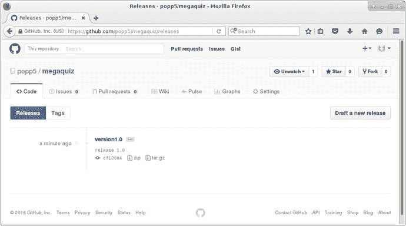

*图 17-4. 在 GitHub 上查看标签*

一旦你可以用标签为代码添加书签，就很自然地会想知道如何重新访问旧版本。然而，要做到这一点，你应该首先花些时间研究分支——这是 Git 特别擅长的事情。

## 分支项目

一旦我的项目发布，我就可以把它打包收好，然后去做些新的事情，对吧？毕竟，它写得如此优雅，不可能有 bug，更不用说它的规格如此详尽，没有一个用户可能要求任何新功能了！

与此同时，回到现实世界，我必须在至少两个层面上继续使用代码库。大概现在快到收到 bug 报告的时候了，而版本 1.2.0 的功能愿望清单将因对精彩新功能的需求而膨胀。我该如何协调这些力量？我需要修复报告的 bug，同时我也需要推进主要开发。我可以在开发过程中修复 bug，并在下一个版本稳定后一次性发布所有内容。但是这样一来，用户可能需要等待很长时间才能看到任何问题得到解决。这显然是不可接受的。另一方面，我可以边开发边发布。在这种情况下，我有发布破损代码的风险。显然，我的开发需要两条线索。我将继续向项目的主分支（通常称为主干）添加新的、有风险的功能，但我现在应该为我的新版本创建一个分支，在这个分支上我只能添加错误修复。

> **注意**
> 这种管理分支的方式绝非唯一的方法。开发者们不断地争论组织分支和管理发布与错误修复的最佳方式。最流行的方法之一是 git-flow（在 [`http://danielkummer.github.io/git-flow-cheatsheet/`](http://danielkummer.github.io/git-flow-cheatsheet/) 上有简洁的描述）。在这种实践中，`master` 是发布分支。新代码放在 `develop` 分支上，并在发布时合并到 `master`。每个活跃的开发单元都有自己的功能分支，在稳定后合并到 `develop`。

我可以使用 `git checkout` 命令创建并切换到一个新分支。首先，让我们快速查看一下我的分支状态：

```
$ git branch -a
* master
remotes/origin/master
```

如你所见，我有一个单一的分支：`master`，以及它的远程等效分支。现在，我将创建并切换到一个新分支：

```
$ git checkout -b megaquiz-branch1.0
Switched to a new branch 'megaquiz-branch1.0'
```

为了跟踪我对分支的使用，我将使用一个特定的文件作为示例：`command/FeedbackCommand.php`。看来我创建 bug 修复分支的时间刚刚好。用户开始报告他们无法使用系统中的反馈机制。我找到了这个 bug：

```
//...
$result = $msgSystem->despatch($email, $msg, $topic);
if (! $user) {
$this->context->setError($msgSystem->getError());
//...
```

实际上，我应该测试 `$result` 而不是 `$user`。以下是我的编辑：

```
//...
$result = $msgSystem->dispatch($email, $msg, $topic);
if (! $result) {
$this->context->setError($msgSystem->getError());
//...
```

因为我在分支 `megaquiz-branch1.0` 上工作，我可以提交这个更改：

```
$ git add command/FeedbackCommand.php
$ git commit -m'bugfix'
[megaquiz-branch1.0 d69dfc1] bugfix
1 file changed, 1 insertion(+), 1 deletion(-)
```

当然，这个提交是本地的。我需要使用 `git push` 命令将这个分支放到远程仓库上：

```
$ git push origin megaquiz-branch1.0
Counting objects: 4, done.
Delta compression using up to 4 threads.
Compressing objects: 100% (4/4), done.
Writing objects: 100% (4/4), 440 bytes | 0 bytes/s, done.
Total 4 (delta 2), reused 0 (delta 0)
To git@github.com:popp5/megaquiz.git
 * [new branch]      megaquiz-branch1.0 -> megaquiz-branch1.0
```

那 Bob 呢？他不可避免地会想要参与进来并修复一些 bug。首先，他调用了 `git pull`，它会友好地告诉他关于新分支（以及我最近的其他活动）的信息：

```
$ git pull
remote: Counting objects: 11, done.
remote: Compressing objects: 100% (7/7), done.
remote: Total 11 (delta 4), reused 11 (delta 4), pack-reused 0
Unpacking objects: 100% (11/11), done.
From github.com:popp5/megaquiz
   f6ab532..cf120a4  master     -> origin/master
 * [new branch]      megaquiz-branch1.0 -> origin/megaquiz-branch1.0
 * [new tag]         version1.0 -> version1.0
Updating f6ab532..cf120a4
Fast-forward
 0 files changed, 0 insertions(+), 0 deletions(-)
 delete mode 100644 resources/blah.gif
```

现在 Bob 可以切换到一个会跟踪远程分支的本地分支了：

```
$ git checkout megaquiz-branch1.0
Branch megaquiz-branch1.0 set up to track remote branch megaquiz-branch1.0 from origin.
Switched to a new branch 'megaquiz-branch1.0'
```

Bob 现在可以开始工作了。他可以添加并提交他自己的修复；当他推送时，这些修复将会出现在远程分支上。

与此同时，我想要在主干上添加一些尖端增强功能——也就是我的 `master` 分支。让我们从我的本地仓库的角度再看一下我的分支状态：

```
$ git branch -a
* master
  megaquiz-branch1.0
remotes/origin/master
remotes/origin/megaquiz-branch1.0
```

我可以通过调用 `git checkout` 来切换到一个已有的分支：

```
$ git checkout master
Switched to branch 'master'
Your branch is up-to-date with 'origin/master'.
```

现在当我查看 `command/FeedbackCommand.php` 时，我发现我的 bug 修复神奇地消失了。当然，它仍然存储在 `megaquiz-branch1.0` 下。稍后，我可以将这个修复合并到 `master` 分支，所以不用担心。相反，我可以专注于添加新代码：

```
class FeedbackCommand extends Command
{
    public function execute(CommandContext $context)
    {
        // new development
        // goes here
        $msgSystem = ReceiverFactory::getMessageSystem();
        $email = $context->get('email');
        // ...
```

我在这里所做的只是添加一个注释来模拟向代码中添加内容。我现在可以提交并推送这个：

```
$ git commit -am'new development on master'
$ git push origin master
```

所以我现在有了并行分支。当然，迟早我会希望我的 master 分支能够受益于我在 `megaquiz-branch1.0` 上提交的 bug 修复。

我可以在命令行上做到这一点，但首先让我们暂停一下，看看 GitHub 和 BitBucket 等类似服务支持的一项功能。拉取请求（通常缩写为 PR）允许我在合并分支之前请求代码审查。所以在 `megaquiz-branch1.0` 合并到 `master` 之前，我可以请 Bob 检查我的工作。正如你在图 17-5 中看到的，GitHub 检测到了这个分支，并给了我创建拉取请求的机会。

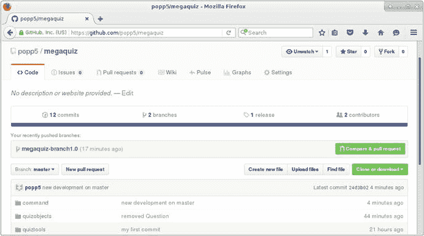

*图 17-5. GitHub 使创建拉取请求变得容易*

我点击按钮并在提交拉取请求前添加了一条评论。你可以在图 17-6 中看到结果。

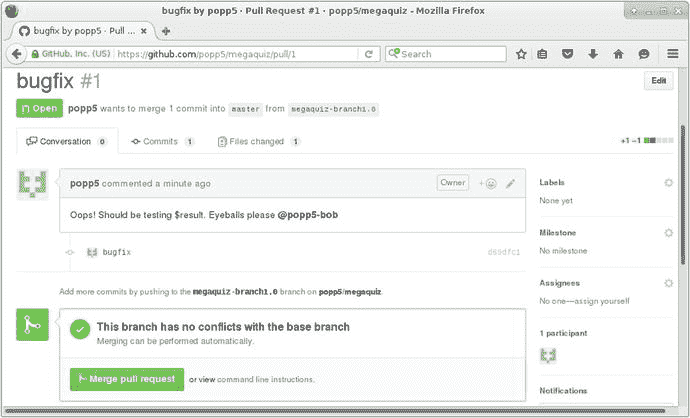

*图 17-6. 创建拉取请求*

现在 Bob 可以检查我的更改并添加他可能有的任何评论。GitHub 向他精确地显示了更改了什么。你可以在图 17-7 中看到 Bob 的评论。

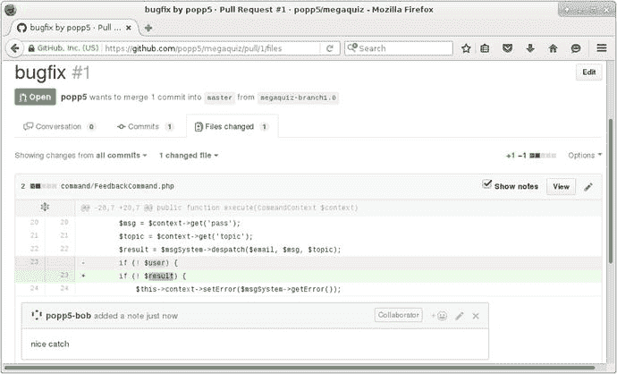

*图 17-7. 拉取请求所涵盖的更改*

一旦 Bob 批准了我的拉取请求，我可以直接从浏览器合并，或者我可以返回命令行。这非常简单。Git 提供了一个名为 `merge` 的子命令：

```
$ git checkout master
Already on 'master'
Your branch is up-to-date with 'origin/master'.
```

事实上，我已经在 master 分支上了——但确认一下也无妨。现在我来执行实际的合并操作：

```
$ git merge megaquiz-branch1.0
Auto-merging command/FeedbackCommand.php
Merge made by the 'recursive' strategy.
 command/FeedbackCommand.php | 2 +-
 1 file changed, 1 insertion(+), 1 deletion(-)
```

> **注意**
> 合并还是不合并？这个选择并不总是像看起来那么简单。例如，在某些情况下，你的错误修复可能是一种临时工作，会被主干上更彻底的重构所取代，或者由于规范的变化而不再适用。这必然是一个需要根据判断做出的决定。然而，在我工作过的大多数团队中，都倾向于尽可能地合并到主干，同时将分支上的工作保持在最低限度。对我们来说，新功能通常出现在主干上，并通过“尽早发布，经常发布”的策略快速到达用户手中。

现在，当我查看主干中的 `FeedbackCommand` 版本时，我确认所有更改都已合并：

```
public function execute(CommandContext $context)
{
    // new development
    // goes here
    $msgSystem = ReceiverFactory::getMessageSystem();
    $email = $context->get('email');
    $msg = $context->get('pass');
    $topic = $context->get('topic');
    $result = $msgSystem->despatch($email, $msg, $topic);
    if (! $result) {
        $this->context->setError($msgSystem->getError());
        return false;
    }
```

`execute()` 方法现在既包含了我模拟的主干开发内容，也包含了 bug 修复。

当我第一次“发布” MegaQuiz 1.0 版本时，我创建了一个分支，这就是我们一直在处理的那个。但请记住，我在那个阶段也创建了一个标签。我当时承诺会向你展示如何访问这个标签。事实上，你已经看到了如何访问。你可以基于该标签创建一个本地分支，方式与 Bob 建立他的本地版 bug 修复分支完全相同。区别在于这个新分支是全新的。它不跟踪任何现有的远程分支：

```
$ git checkout -b new-version1.0-branch version1.0
Switched to a new branch 'new-version1.0-branch'
```

但是，我现在有了这个新分支，我可以像你之前看到的那样推送它并分享它。

## 总结

Git 包含了数量庞大的工具，每一个都有令人望而生畏的选项和功能范围。我只能在现有的篇幅内提供一个简短的介绍。尽管如此，即使你只使用我在本章中介绍的功能，你也应该能在自己的工作中看到好处，无论是通过防止数据丢失，还是通过改进协作工作。

在本章中，我们简要介绍了 Git 的基础知识。我简要地看了一下配置，然后导入了一个项目。我检出了、提交了并更新了代码，然后向你展示了如何标记和导出一个版本。我以对分支的简要介绍结束了本章，展示了它们在项目中维护并发开发和错误修复分支方面的实用性。

有一个问题我在一定程度上忽略了。我们确立了开发者应该检出自己项目版本的准则。然而，总的来说，项目是不会原地运行的。为了测试他们的更改，开发者需要在本地部署代码。有时，这就像复制几个目录一样简单。但更常见的是，部署必须处理一系列配置问题。在下一章中，我们将研究一些自动化此过程的技术。

# 18. 使用 PHPUnit 进行测试

系统中每个组件的持续平稳运行都依赖于其同层组件的操作和接口的一致性。因此，从定义上讲，开发会破坏系统。当你改进你的类和包时，你必须记住修改任何与它们一起工作的代码。对于某些更改，这可能会产生连锁反应，影响距离你最初更改的代码很远的组件。敏锐的警惕和对系统依赖关系的百科全书式的了解有助于解决这个问题。当然，尽管这些是优秀的品质，但系统很快就会变得过于复杂，以至于无法轻易预测所有不期望的影响，尤其是因为系统通常结合了多个开发者的工作。为了解决这个问题，定期测试每个组件是一个好主意。当然，这是一个重复且复杂的任务；因此，它非常适合自动化。

在 PHP 程序员可用的测试解决方案中，PHPUnit 可能是最普遍的，当然也是功能最全的工具。在本章中，你将学到以下关于 PHPUnit 的知识：

* **安装：** 使用 PEAR 安装 PHPUnit
* **编写测试：** 创建测试用例并使用断言方法
* **处理异常：** 确认失败的策略
* **运行多个测试：** 将测试收集到测试套件中
* **构建断言逻辑：** 使用约束
* **模拟组件：** 模拟对象和桩模块
* **测试 Web 应用程序：** 使用和不使用额外工具进行测试

## 功能测试和单元测试

在任何项目中，测试都是必不可少的。即使你没有将这个过程正式化，你必定也发现自己已经形成了一套非正式的操作列表，用它们来全面检验你的系统。这个过程很快就会变得令人厌倦，这可能导致你对项目持一种听天由命的态度。

一种测试方法从项目的接口开始，模拟用户可能使用系统的各种方式。当手动测试时，这可能是你会采用的方式，尽管有各种框架用于自动化这个过程。这些功能测试有时被称为验收测试，因为成功执行的一系列操作可以用作项目阶段签收的标准。使用这种方法，你通常将系统视为一个黑盒——你的测试会刻意忽略那些协作构成被测试系统的隐藏组件。

功能测试从外部进行操作，而单元测试则从内部向外进行。单元测试倾向于关注类，测试方法被分组到测试用例中。每个测试用例对一个类进行严格的检验，检查每个方法是否按预期执行，并且是否按预期失败。目标是尽可能在脱离其更广泛上下文的隔离环境中测试每个组件。这通常会为你提供一个发人深省的结论，让你了解解耦系统各部分的使命是否成功。

测试可以作为构建过程的一部分运行，直接从命令行运行，甚至通过网页运行。在本章中，我将重点介绍命令行。

单元测试是确保系统设计质量的好方法。测试揭示了类和函数的职责。一些程序员甚至提倡测试优先的方法。他们说，你应该在开始编写类之前就编写测试。这确立了类的用途，确保了清晰的接口以及简短、集中的方法。就个人而言，我从未追求过这种纯度的水平——这不符合我的编码风格。尽管如此，我尝试在进行编码的同时编写测试。维护一个测试框架为我提供了重构代码所需的安全感。我可以拆除并替换整个包，因为我知道我很有可能会在系统其他地方捕获到意外的错误。

## 手动测试

在上一节中，我说测试在每个项目中都是必不可少的。我本可以这样说：测试在每个项目中都是不可避免的。我们都会测试。可悲的是，我们经常丢弃这些出色的工作。

那么，让我们创建一些类来测试。这是一个存储和检索用户信息的类。为了演示起见，它生成数组，而不是你通常期望使用的 `User` 对象：

```php
//
```


### 每个 Vagrant 开发环境都需要一个 box。你可以在 https://atlas.hashicorp.com/search 上搜索 box。

`config.vm.box = "bento/centos-6.7"`

到目前为止，我只完成了配置生成。接下来，我必须运行至关重要的 `vagrant up` 命令。如果你经常使用 Vagrant，很快就会发现这个命令非常熟悉。它会通过下载并配置你的新 box（如有必要）来启动 Vagrant 会话，然后启动它：

```
$ vagrant up
```

由于我是第一次使用 `bento/centos-6.7` 虚拟机运行此命令，Vagrant 会先下载 box：

```
Bringing machine 'default' up with 'virtualbox' provider...
==> default: Box 'bento/centos-6.7' could not be found. Attempting to find and install...
default: Box Provider: virtualbox
default: Box Version: >= 0
==> default: Loading metadata for box 'bento/centos-6.7'
default: URL: https://atlas.hashicorp.com/bento/centos-6.7
==> default: Adding box 'bento/centos-6.7' (v2.2.7) for provider: virtualbox
default: Downloading: https://atlas.hashicorp.com/bento/boxes/centos-6.7/versions/2.2.7/providers/virtualbox.box
==> default: Successfully added box 'bento/centos-6.7' (v2.2.7) for 'virtualbox'!
```

Vagrant 会存储这个 box（如果你运行的是 Linux，则存储在 `~/.vagrant.d/boxes/` 下），这样你就不必在自己的系统上再次下载它——即使你运行多个虚拟机也是如此。然后它会配置并启动虚拟机（过程中会提供大量详细信息）。一旦完成，我可以通过登录到我的新机器来测试它：

```
$ vagrant ssh
$ pwd
/home/vagrant
$ cat /etc/redhat-release
CentOS release 6.7 (Final)
```

我们进来了！那么我们得到了什么？嗯，我们拥有了一台某种程度上类似于生产环境的机器。还有别的吗？实际上，还有很多。我之前说过，我希望在本地机器上编辑文件，但在类似生产环境中运行它们。让我们来设置一下。

## 将本地目录挂载到 Vagrant Box 上

我们来整理一些示例文件。我在一个名为 `infrastructure` 的目录中运行了我的第一个 `vagrant init` 和 `vagrant up` 命令。我将重新启用我在第 18 章中使用的 `webwoo` 项目（这是我为第 12 章开发的系统的一个精简版）。综合来看，我的开发环境看起来像这样：

```
ch20/
infrastructure/
Vagrantfile
webwoo/
AddVenue.php
index.php
Main.php
AddSpace.php
```

我们的挑战是搭建环境，以便我们可以在本地处理 `webwoo` 文件，但使用 CentOS box 上安装的软件栈透明地运行它们。根据我们的配置，Vagrant 会尝试将主机上的目录挂载到 guest box 中。事实上，Vagrant 已经为我们挂载了一个目录。让我们检查一下：

```
$ vagrant ssh
Last login: Tue Jul  5 15:36:19 2016 from 10.0.2.2
$ ls -a /vagrant
.  ..   .vagrant  Vagrantfile
```

因此，Vagrant 已将 `infrastructure` 目录挂载为 box 上的 `/vagrant`。当我们编写脚本来配置 box 时，这会很方便。不过现在，让我们专注于挂载 `webwoo` 目录。我们可以通过编辑 `Vagrantfile` 来实现：

```
config.vm.synced_folder "../webwoo", "/var/www/poppch20"
```

通过这个指令，我告诉 Vagrant 将 `webwoo` 目录挂载到 guest box 上的 `/var/www/poppch20`。为了使其生效，我需要重新启动 box。这里有一个新命令（应在主机系统上运行，而不是在虚拟机内部）：

```
$ vagrant reload
```

虚拟机关闭并干净地重新启动。Vagrant 挂载了 `infrastructure`（`/vagrant`）和 `webwoo`（`/var/www/poppch20`）目录。以下是命令输出的摘录：

```
==> default: Mounting shared folders...
default: /vagrant => /home/mattz/ch20/infrastructure
default: /var/www/poppch20 => /home/mattz/ch20/webwoo
```

我可以快速登录以确认 `/var/www/poppch20` 已就位。


```
$ vagrant ssh
Last login: Thu Jul  7 15:25:16 2016 from 10.0.2.2
$ ls /var/www/poppch20/
AddSpace.php  AddVenue.php  index.php  Main.php
```

现在，我可以在本地机器上运行一个惊艳的 IDE，并将改动内容无缝同步到虚拟机中！

当然，将文件放到 CentOS 虚拟机上并不等同于运行系统。典型的 Vagrant 盒子预装的内容并不多。设计思路是让开发者根据需求和场景自行定制环境。

下一步就是配置我们的虚拟机。

## 配置（Provisioning）

再次强调，配置过程由 `Vagrantfile` 文档驱动。Vagrant 支持多种用于配置虚拟机的工具，包括 Chef（[`https://www.chef.io/chef/`](https://www.chef.io/chef/)）、Puppet（[`https://puppet.com`](https://puppet.com)）和 Ansible（[`https://www.ansible.com`](https://www.ansible.com)）。这些工具都值得研究。不过，在本示例中，我将使用传统的 shell 脚本。

我再次从 `Vagrantfile` 开始：

```
config.vm.provision "shell", path: "setup.sh"
```

这段代码的含义应该相当清晰。我告诉 Vagrant 使用 shell 脚本来配置虚拟机，并指定 `setup.sh` 为要执行的脚本。

当然，shell 脚本的内容取决于你的需求。我将从设置几个变量和安装一些软件包开始：

```
#!/bin/bash
VAGRANTDIR=/vagrant
SERVERDIR=/var/www/poppch20/
sudo rpm -Uvh https://mirror.webtatic.com/yum/el6/latest.rpm
sudo yum install -y patch
sudo yum install -y vim
sudo yum -q -y install mysql-server
sudo yum -q -y install httpd;
sudo yum -q -y install php70w
sudo yum -q -y install php70w-mysql
sudo yum -q -y install php70w-xml
sudo yum -q -y install php70w-dom
```

PHP 7 在 CentOS 6 上默认不可用。不过，通过安装 `webtatic.com` 提供的 yum 仓库，就可以获取名为 `php70w` 的软件包及其一系列相关扩展。我将脚本写入名为 `setup.sh` 的文件中，并将其放置在 `Vagrantfile` 所在的 infrastructure 目录中。

现在，如何启动配置过程呢？如果在我运行 `vagrant up` 时，`config.vm.provision` 指令和 `setup.sh` 脚本都已经就位，那么配置过程就会自动进行。由于目前并非如此，我需要手动运行它：

```
$ vagrant provision
```

当 `setup.sh` 脚本在 Vagrant 虚拟机内运行时，终端上会输出大量信息。让我们检查一下是否成功了：

```
$ vagrant ssh
$ php -v
PHP 7.0.7 (cli) (built: May 28 2016 08:26:36) ( NTS )
Copyright (c) 1997-2016 The PHP Group
Zend Engine v3.0.0, Copyright (c) 1998-2016 Zend Technologies
```

## 设置 Web 服务器

当然，即便安装了 MySQL 和 Apache，系统也还不能直接运行。首先，我们应该配置 Apache。最简单的方法是创建一个配置文件，并将其复制到 Apache 的 `conf.d` 目录中。我们把这个文件命名为 `poppch20.conf`，并放入 infrastructure 目录：

```
NameVirtualHost *:80

ServerAdmin matt@getinstance.com
DocumentRoot /var/www/poppch20
ServerName poppch20.vagrant.internal
ErrorLog logs/poppch20-error_log
CustomLog logs/poppch20-access_log common

AllowOverride all

```

稍后我会再回到这个主机名。暂且放下这个诱人的细节，这段配置足以告知 Apache 关于 `/var/www/poppch20` 目录的信息并设置日志。当然，我还需要更新 `setup.sh`，以便在配置时复制该配置文件：

```
sudo cp $VAGRANTDIR/poppch20.conf /etc/httpd/conf.d/
sudo service httpd restart
sudo /sbin/chkconfig httpd on
```

我将配置文件复制到位，然后重启 Web 服务器以便加载新的配置。我还运行了 `chkconfig` 来确保服务器在开机时自动启动。

做出这些更改后，我可以重新运行此脚本：

```
$ vagrant provision
```

需要注意的是，我们之前编写的设置脚本中的部分内容也会被重新执行。在创建配置脚本时，必须确保它能够重复执行而不会造成严重问题。幸运的是，Yum 会检测到我指定的软件包已经安装，只会发出无害的抱怨——部分原因是我预先使用了 `-q` 标志，这会让抱怨信息相对安静。

## 设置 MySQL

对于许多应用程序，你需要确保数据库已创建并准备好接受连接。下面是我对设置脚本的一个简单补充：

```
sudo service mysqld start
/usr/bin/mysqladmin -s -u root password 'vagrant' || echo "** unable to create pass - probably already done"
echo "CREATE DATABASE IF NOT EXISTS poppch20_vagrant" | mysql -u root -pvagrant

### install data here if needed
#
echo "GRANT ALL PRIVILEGES  ON poppch20_vagrant.* TO
'vagrant'@'localhost' IDENTIFIED BY 'vagrant'
WITH GRANT OPTION" | mysql -u root -pvagrant
echo "FLUSH PRIVILEGES" | mysql -u root -pvagrant
sudo /sbin/chkconfig mysqld on
```

我启动 MySQL。然后运行 `mysqladmin` 命令来创建 root 密码。由于密码在首次运行后就已经设置，之后运行该命令会失败，因此我使用 `-s` 标志来抑制错误信息，并在命令失败时打印一条自定义消息。接着，我创建了一个数据库、一个用户和对应的密码。最后，我运行 `chkconfig` 来确保 MySQL 守护进程在开机时自动启动。

完成这些设置后，我可以再次进行配置，然后测试数据库：

```
$ vagrant provision
```


## 大量输出
```
$ vagrant ssh
$ mysql -uvagrant -pvagrant poppch20_vagrant
欢迎使用 MySQL 监视器。命令以 ; 或 \g 结束。
您的 MySQL 连接 ID 是 9
服务器版本：5.1.73 来源发行版
版权所有 (c) 2000, 2013, Oracle 和/或其关联公司。保留所有权利。
Oracle 是 Oracle 公司和/或其关联公司的注册商标。其他名称可能是其各自所有者的商标。
输入 'help;' 或 '\h' 获取帮助。输入 '\c' 清除当前输入语句。
mysql>
```

我们现在已经有一个正在运行的数据库和一个 Web 服务器。是时候看看代码如何运行了。

## 配置主机名

我们已经多次登录到新的类生产开发环境，因此网络方面基本已经就绪。虽然我已经配置了 Web 服务器，但尚未使用它。这是因为我们仍然需要为虚拟机配置一个主机名。因此，让我们在 `Vagrantfile` 中添加一个：

```
config.vm.hostname = "poppch20.vagrant.internal"
config.vm.network :private_network, ip: "192.168.33.148"
```

我虚构了一个主机名，并使用 `config.vm.hostname` 指令将其添加。我还使用 `config.vm.network` 配置了私有网络，并分配了一个静态 IP 地址。你应该为此使用私有地址空间——一个以 `192.168` 开头且未使用的 IP 地址应该可以正常工作。

由于这是一个虚构的主机名，我们必须配置操作系统来处理名称解析。在类 Unix 系统上，这意味着要编辑系统文件 `/etc/hosts`。在这种情况下，我会添加以下内容：

```
192.168.33.148  poppch20.vagrant.internal
```

这不算太麻烦，但我们的目标是为团队实现一键安装，因此最好能有一种方法来自动化这一步骤。幸运的是，Vagrant 支持插件，而 `hostmanager` 插件恰好满足我们的需求。

你可以使用以下命令查看已安装的插件：

```
$ vagrant plugin list
vagrant-login (1.0.1, 系统)
vagrant-share (1.1.5, 系统)
```

要添加插件，只需运行 `vagrant plugin install` 命令：

```
$ vagrant plugin install vagrant-hostmanager
正在安装 'vagrant-hostmanager' 插件。这可能需要几分钟...
已安装插件 'vagrant-hostmanager (1.8.2)'！
```

然后，你可以显式地告诉插件更新 `/etc/hosts`，如下所示：

```
$ vagrant hostmanager
[默认] 正在更新 /etc/hosts 文件...
```

为了使这个过程对团队成员自动生效，我们应在 `Vagrantfile` 中显式启用 hostmanager：

```
config.hostmanager.enabled = true
```

完成配置更改后，我们应该运行 `vagrant reload` 来应用它们。然后就是见证真相的时刻！我们的系统能在浏览器中运行吗？如图 20-2 所示，系统应该能正常工作。

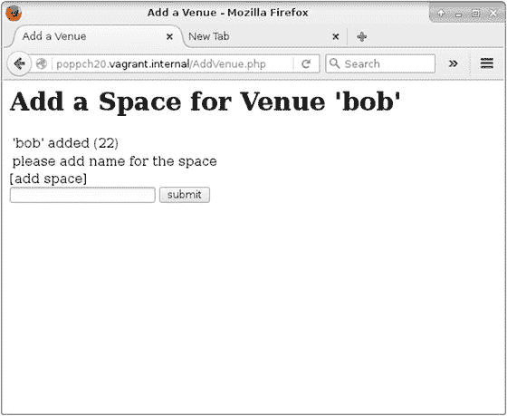

图 20-2. 在 Vagrant 盒子上访问已配置的系统

## 总结

因此，我们从零开始构建了一个完全可用的开发环境。考虑到这花费了一整章的篇幅，如果说 Vagrant 快速又简单，似乎有点自欺欺人。对此有两个答案。首先，一旦你这样做过几次，搭建另一个 Vagrant 环境就会变得非常简单——肯定比手动管理多个依赖栈要容易得多。

但更重要的是，真正的速度和效率提升并不在于设置 Vagrant 的那个人。想象一下，一位新开发人员加入你的项目，预计需要花费数天时间进行下载、编辑配置文件以及翻阅 Wiki。想象一下告诉她：“安装 Vagrant 和 VirtualBox。检出代码。从基础设施目录运行 `vagrant up`。”然后就可以了！将其与你经历或听说过的某些痛苦的上手流程进行比较。

当然，本章仅触及了皮毛。当你需要配置 Vagrant 为你做更多事情时，官方站点 [`www.vagrantup.com`](https://www.vagrantup.com) 将为你提供所需的所有支持。

表 20-1 快速回顾了我们在本章中遇到的 Vagrant 命令。

表 20-1. 一些 Vagrant 命令

| 命令 | 描述 |
| --- | --- |
| `vagrant up` | 启动虚拟机，如果尚未配置则进行配置 |
| `vagrant reload` | 关闭系统并重新启动 |
| `vagrant plugin list` | 列出已安装的插件 |
| `vagrant plugin install <plugin-name>` | 安装一个插件 |
| `vagrant provision` | 再次运行配置步骤（如果你更新了配置脚本，这会很有用） |
| `vagrant halt` | 正常关闭虚拟机 |
| `vagrant init` | 创建一个新的 `Vagrantfile` 文档 |
| `vagrant destroy` | 销毁虚拟机。别担心，你总是可以再次运行 `vagrant up` 重新开始！ |

## 小结

在本章中，我介绍了 Vagrant，这个应用程序能让你在不牺牲创作工具的情况下，在类似生产的开发环境中工作。我涵盖了安装、发行版选择以及初始设置——包括挂载你的开发目录。当我们有一个可以操作的虚拟机后，我接着讲解了配置过程——包括包安装以及数据库和 Web 服务器配置。最后，我探讨了主机名管理，并向你展示了我们的系统在浏览器中运行的情况！

## 21. 持续集成

在前几章中，你看到了大量旨在支持良好管理项目的工具。单元测试、文档编写、构建和版本控制都非常有用。但是工具，尤其是测试，有时会令人烦恼。

即使你的测试只需要几分钟就能运行完，你也常常因为过于专注于编码而不愿去管它们。不仅如此，你还有客户和同事在等待新功能。继续编码的诱惑始终存在。但缺陷在刚产生时修复要容易得多。这是因为你更有可能知道是哪个更改导致了问题，并且能更好地想出快速修复方案。

在本章中，我将介绍持续集成，这是一种自动化测试和构建的做法，并将你最近几章遇到的各种工具和技术整合在一起。

本章将涵盖以下主题：

- 定义持续集成
- 为 CI 准备项目
- 了解 Jenkins：一个 CI 服务器
- 使用专门插件为 PHP 项目定制 Jenkins

### 什么是持续集成？

在过去糟糕的日子里，集成是你完成有趣工作后才做的事情。它也是你意识到还有多少工作要做的阶段。集成是将项目的所有部分打包成可以发布和部署的包的过程。这不光彩，而且实际上很难。

集成也与质量保证紧密相关。如果产品不适合其用途，你就不能发布它。这意味着需要测试。大量的测试。如果你在集成阶段之前没有进行多少测试，那可能也意味着会出现令人讨厌的意外。很多意外。

你从第 18 章知道，尽早并经常测试是最佳实践。你从第 15 章和 19 章知道，应该从一开始就考虑部署进行设计。我们大多数人都接受这是理想状态，但现实中又有多少次能真正做到呢？


如果你实践测试导向开发（我更喜欢用这个术语而非测试先行开发，因为它更好地反映了我所见过的多数优秀项目的实际情况），那么编写测试并不像你想象的那么困难。毕竟，你在编码时本来就要编写测试。每当你开发一个组件，你都会创建代码片段，也许是在类文件的底部，这些代码片段实例化对象并调用其方法。如果你收集起这些在开发过程中用来测试组件的、原本会被丢弃的代码片段，你就拥有了一个测试用例。将它们放入一个类中，然后添加到你的测试套件中即可。

奇怪的是，人们往往回避的是运行测试。随着时间的推移，测试运行时间越来越长。与已知问题相关的失败逐渐出现，使得诊断新问题变得困难。此外，你怀疑是别人提交的代码破坏了测试，而你没有时间去处理别人的错误而耽误自己的工作。最好只运行与你工作相关的几个测试，而不是运行整个测试套件。

不运行测试，因此也无法修复测试可能揭示的问题，这使得问题越来越难以解决。查找错误的最大开销通常是诊断，而不是修复。很多时候，修复只需几分钟，而找出测试失败的原因却可能需要几个小时。然而，如果测试在提交后的几分钟或几小时内就失败了，你更有可能知道问题出在哪里。

软件构建也存在类似的问题。如果你不经常安装你的项目，你可能会发现，尽管一切在你的开发机上运行正常，但安装后的实例却会因一个模糊的错误信息而崩溃。两次构建之间的时间间隔越长，失败的原因对你来说就可能越模糊。

通常是一些简单的问题：未声明对系统上某个库的依赖，或者你忘记检入的一些类文件。如果你在场，这些问题很容易修复。但如果构建失败发生在你外出时呢？负责构建和发布项目的团队成员，无论运气多差，都不会了解你的设置，也无法轻易访问那些缺失的文件。

集成问题会随着项目中参与的人数增加而放大。你可能喜欢并尊重团队中的所有成员，但我们都清楚，他们不运行测试的可能性比你大得多。然后他们在周五下午 4 点提交了一周的工作成果，就在你正要宣布项目可以发布的时候。

持续集成（CI）通过自动化构建和测试过程，减少了其中一些问题。

CI 既是一套实践，也是一套工具。作为一种实践，它要求频繁提交项目代码（至少每天一次）。每次提交后，都应该运行测试并构建任何包。你已经看到了一些 CI 所需的工具，特别是 `PHPUnit` 和 `Phing`。然而，仅有单个工具是不够的。需要一个更高级别的系统来协调和自动化整个过程。

如果没有这个更高级别的系统，即 CI 服务器，CI 实践很可能就会屈从于我们跳过繁琐工作的自然倾向。毕竟，我们更愿意编写代码。

拥有这样的系统能带来明显的好处。首先，你的项目会频繁地构建和测试。这是 CI 的最终目标和好处。而由于它是自动化的，还增加了另外两个维度。测试和构建发生在与开发不同的线程中。它在后台运行，不需要你停止工作来运行测试。此外，与测试一样，CI 能鼓励良好的设计。为了能在远程位置自动安装，你从一开始就不得不考虑安装的便利性。

我不知道有多少次遇到这样的项目，其安装过程是只有少数开发人员才知道的秘密。“你没设置 URL 重写？”一位老手带着几乎不加掩饰的轻蔑问道。“说真的，重写规则在 Wiki 里，你知道吧。把它们粘贴到 Apache 配置文件中就行了。”用 CI 的思路进行开发意味着让系统更易于测试和安装。这可能意味着前期要做更多工作，但会让我们的后续工作更轻松。轻松得多。

所以，首先，我将打下一些昂贵的基础。事实上，你会发现，在接下来的大部分章节中，你已经遇到了这些准备步骤。

## 为项目准备 CI

首先，当然，我需要一个可以持续集成的项目。我是个懒人，所以我将寻找一些已经编写了测试的代码。最明显的候选者是我在第 18 章中为说明 `PHPUnit` 而创建的项目。我将它命名为 `userthing`，因为它是一个东西，里面有一个 `User` 对象。

首先，这是我项目目录的分解结构：

```
$ find src/ test/
src/
src/persist
src/persist/UserStore.php
src/util
src/util/Validator.php
src/domain
src/domain/User.php
test/
test/persist
test/persist/UserStoreTest.php
test/util
test/util/ValidatorTest.php
```

如你所见，我稍微整理了一下结构，添加了一些包目录。在代码中，我通过使用命名空间来支持包结构。

现在我已经有了一个项目，应该将其添加到版本控制系统中。

## CI 与版本控制

版本控制对于 CI 来说是必不可少的。CI 系统需要能够在不需人工干预的情况下获取项目的最新版本（至少，一切设置好之后是这样）。

对于这个例子，我将使用我在 BitBucket 上设置的一个仓库。我将配置本地开发机上的代码，添加并提交，然后推送到远程服务器：

```
$ cd path/to/userthing
$ git init
$ git remote add origin git@bitbucket.org:getinstance/userthing.git
$ git add build.xml composer.json src/ test/
$ git commit -m 'initial commit'
$ git push -u origin master
```

我导航到我的开发目录并初始化了它。然后我添加了 `origin` 远程仓库，并将代码推送过去。我喜欢通过执行一次全新的克隆来确认一切正常：

```
$ git clone git@bitbucket.org:getinstance/userthing.git
Cloning into 'userthing'...
X11 forwarding request failed on channel 0
remote: Counting objects: 16, done.
remote: Compressing objects: 100% (11/11), done.
remote: Total 16 (delta 0), reused 0 (delta 0)
Receiving objects: 100% (16/16), done.
```

检查连接...完成。现在，我有一个 `userthing` 仓库和一个本地克隆。是时候自动化构建和测试了。

### Phing

我们在第 19 章中遇到过 `Phing`。以下是安装该工具的一种方法：

```
$ sudo pear channel-discover pear.phing.info
$ sudo pear install phing/phing
```

不过，我将使用 `Composer`。这是我的 `composer.json` 文件中的 `require-dev` 指令：

```
"require-dev": {
"phing/phing": "2.*"
}
```

我将使用这个重要的构建工具作为我项目 CI 环境的粘合剂，所以我将在打算用于测试的服务器上运行此安装（或者，你当然可以尝试使用 `Vagrant` 和 `VirtualBox` 在虚拟服务器上进行测试）。我将定义用于构建和测试代码，以及运行你将在本章中遇到的各种其他质量保证工具的目标。

> **注意**
>
> 在安装包时，请务必检查 `PEAR` 的输出。你可能会遇到错误消息，提示你在安装目标之前需要获取依赖项。`pear` 应用程序很有帮助，会准确地告诉你需要做什么来安装依赖项，但如果你不检查应用程序的命令行输出，很容易忽略还需要你做更多工作这一事实。

让我们构建一个示例任务：


我设置了四个属性。`build` 指的是我在生成包之前可能用于整理文件的目录。`test` 指向测试目录。`src` 指的是源目录。`version` 定义了包的版本号。

`build` 目标将 `src` 和 `test` 目录复制到构建环境中。在一个更复杂的项目中，我可能还会在此阶段执行转换、生成配置文件并组装二进制资源。此目标是项目的默认目标。

`clean` 目标会移除 build 目录及其包含的所有内容。让我们运行一次构建：

```
$ vendor/bin/phing
Buildfile: /var/popp/src/ch21/build.xml
userthing > build:
[mkdir] Created dir: /var/popp/src/ch21/build
[copy] Created 4 empty directories in /var/popp/src/ch21/build/src
[copy] Copying 3 files to /var/popp/src/ch21/build/src
[copy] Created 3 empty directories in /var/popp/src/ch21/build/test
[copy] Copying 2 files to /var/popp/src/ch21/build/test
BUILD FINISHED
Total time: 1.8206 second
```

## 单元测试

单元测试是持续集成的关键。成功构建一个包含损坏代码的项目是毫无意义的。我在第 18 章介绍了如何使用 PHPUnit 进行单元测试。然而，如果你不是按顺序阅读，你可能需要先安装这个非常有用的工具。以下是全局安装 PHPUnit 的一种方法：

```
$ wget https://phar.phpunit.de/phpunit.phar
$ chmod 755 phpunit.phar
$ sudo mv phpunit.phar /usr/local/bin/phpunit
```

你也可以使用 Composer 安装 PHPUnit：

```
"require-dev": {
"phing/phing": "2.*",
"phpunit/phpunit": "5.4.*"
}
```

同样，这也是我在示例中采用的方法。由于 PHPUnit 将安装在 `vendor/` 目录下，我的开发目录将保持独立于更广泛的系统。

我已经将测试目录与源代码的其他部分分离开来，因此我需要设置自动加载规则，以便 PHP 在测试期间能够找到系统中所有的类。这是我完整的 `composer.json`：

```
{
"require-dev": {
"phing/phing": "2.*",
"phpunit/phpunit": "5.4.*"
},
"autoload": {
"psr-4": {
"userthing\\": ["src/", "test/"]
}
}
}
```

同样在第 18 章中，我为本章将要处理的 `userthing` 代码的一个版本编写了测试。这里我（从 `src` 目录内）再次运行它们，以确保我的重组没有破坏任何东西：

```
$ vendor/bin/phpunit test/
PHPUnit 5.4.6 by Sebastian Bergmann and contributors.
...... 6 / 6 (100%)
Time: 378 ms, Memory: 4.00MB
OK (6 tests, 5 assertions)
```

这确认了我的测试是有效的。然而，我想用 Phing 来调用它们。

Phing 提供了一个 `exec` 任务，我们可以用它来调用 `phpunit` 命令。但是，如果有专门的工具可用，最好还是使用它。有一个内置的任务可以完成这项工作：

因为这些是单元测试而非功能测试，我们可以针对本地的 `src/` 目录运行它们，而不需要安装一个实例（带有可用的数据库或 Web 服务器）。在众多其他属性中，`phpunit` 任务接受一个 `printsummary` 属性，该属性会导致输出测试过程的概要。

此任务的许多功能是使用嵌套元素配置的。`formatter` 元素管理测试信息的生成方式。在这种情况下，我选择输出基本的、人类可读的数据。`batchtest` 允许你使用嵌套的 `fileset` 元素定义多个测试文件。

> **注意**
>
> `phpunit` 任务高度可配置。Phing 手册提供了完整文档，地址为 [`https://www.phing.info/docs/guide/stable/PHPUnitTask.html`](https://www.phing.info/docs/guide/stable/PHPUnitTask.html)。

在这里，我使用 Phing 运行测试：

```
$ vendor/bin/phing test
Buildfile: /var/poppch21/build.xml
userthing > build:
userthing > test:
[phpunit] Testsuite: userthing\persist\UserStoreTest
[phpunit] Tests run: 4, Failures: 0, Errors: 0, Incomplete: 0, Skipped: 0, Time elapsed: 0.01105 s
[phpunit] Testsuite: userthing\util\ValidatorTest
[phpunit] Tests run: 2, Failures: 0, Errors: 0, Incomplete: 0, Skipped: 0, Time elapsed: 0.00864 s
[phpunit] Total tests run: 6, Failures: 0, Errors: 0, Incomplete: 0, Skipped: 0, Time elapsed: 0.02641 s
BUILD FINISHED
Total time: 0.5815 seconds
BUILD FINISHED
Total time: 1.0921 second
```

## 文档

透明性是持续集成的原则之一。因此，在持续集成环境中查看构建时，能够检查文档是否是最新的，并且是否涵盖了最新的类和方法，这一点很重要。你可以像这样通过 PEAR 安装 phpDocumentor：

```
$ pear channel-discover pear.phpdoc.org
$ pear install phpdoc/phpdocumentor
```

或者，你可以再次使用 Composer：

```
"require-dev": {
"phing/phing": "2.*",
"phpunit/phpunit": "5.4.*",
"phpdocumentor/phpdocumentor": "2.*"
}
```

我最好调用一下这个工具以确认，这次从 `build` 目录开始：

```
$ ./vendor/bin/phpdoc --directory=src --target=docs --title=userthing
```

这会生成一些相当简陋的文档。一旦它发布在持续集成服务器上，我确信我会因受到鞭策而编写一些真正的内联文档。

我想再次将其添加到我的 `build.xml` 文件中。有一个名为 `phpdoc2` 的任务，旨在与 PHPDocumentor 集成：

同样，我的 `doc` 目标依赖于 `build` 目标。我创建了 `reports/docs` 输出目录，然后调用了 `phpdoc2` 任务。`phpdoc2` 接受一个嵌套的 `fileset` 元素，该元素指定了要生成文档的文件。

> **注意**
>
> `PhpDocumentor2Task` 的完整文档可在 [`https://www.phing.info/docs/guide/stable/PhpDocumentor2Task.html`](https://www.phing.info/docs/guide/stable/PhpDocumentor2Task.html) 获取。

## 代码覆盖率

如果测试不适用于你编写的代码，那么依赖测试是没有意义的。PHPUnit 包含报告代码覆盖率的能力。以下是 PHPUnit 使用信息的一个摘录：

```
--coverage-html     Generate code coverage report in HTML format.
--coverage-clover  Write code coverage data in Clover XML format.
```

要使用此功能，你必须安装 Xdebug 扩展。你可以在此处找到更多相关信息：[`http://pecl.php.net/package/Xdebug`](http://pecl.php.net/package/Xdebug)（安装信息在 [`http://xdebug.org/docs/install`](http://xdebug.org/docs/install)）。你也可以直接使用 Linux 发行版的包管理系统进行安装。例如，在 Fedora 中，这应该可行：

```
$ yum install php-pecl-xdebug
```

或者，如果你使用的是特定版本的仓库，你可能会这样做：

```
$ sudo yum -y install php70w-pecl-xdebug
```

这里我从 `src/` 目录运行启用了代码覆盖率的 PHPUnit：

```
$ ./vendor/bin/phpunit --whitelist src/ --coverage-html coverage test
PHPUnit 5.4.6 by Sebastian Bergmann and contributors.
......                                                              6 / 6 (100%)
Time: 1.84 seconds, Memory: 6.00MB
OK (6 tests, 5 assertions)
Generating code coverage report in HTML format ... done
```

现在你可以在浏览器中查看报告了（见图 21-1）。

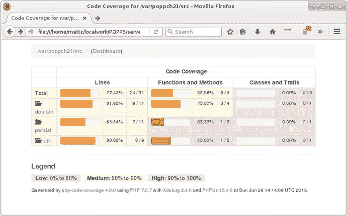

**图 21-1.** 代码覆盖率报告

需要注意的是，实现完全覆盖率并不等同于充分测试了一个系统。另一方面，了解测试中的任何缺口是有好处的。正如你从图 21-2 中看到的，我还有一些工作要做。

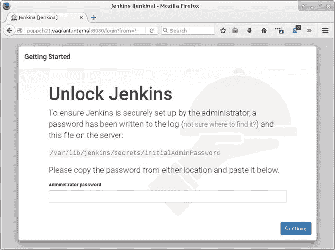

**图 21-2.** 安装屏幕


确认可以从命令行检查覆盖率后，我需要将此功能添加到构建文档中。

我已创建一个名为`citest`的新任务。该任务的大部分内容是对您已经见过的`test`任务的复现。

我首先创建一个`reports`目录，并在其中创建一个`coverage`子目录。

我使用`coverage-setup`任务为`coverage`功能提供配置信息。我通过`database`属性指定原始覆盖率数据的存储位置。嵌套的`fileset`元素定义了需要进行覆盖率分析的文件。

我在`phpunit`任务中添加了两个`formatter`元素。类型为`xml`的`formatter`将生成一个名为`testreport.xml`的文件，其中包含测试结果。`clover`格式化器将生成覆盖率信息，格式也为 XML。最后，在`citest`目标中，我部署了`coverage-report`任务。该任务会获取已有的覆盖率信息，生成一个新的 XML 文件，然后输出一个 HTML 报告。

**注意**

`CoverageReportTask`元素的文档位于[`https://www.phing.info/docs/guide/stable/CoverageReportTask.html`](https://www.phing.info/docs/guide/stable/CoverageReportTask.html)。

**编码标准**

我在第 16 章详细讨论了编码标准。虽然个人风格被共享标准限制可能令人不快，但这可以使项目更易于整个团队协作。因此，许多团队会强制执行一套标准。然而，仅靠人工检查很难执行，所以自动化此过程是有意义的。

我将再次使用`Composer`。这次我将配置它来安装`PHP_CodeSniffer`：

```
"require-dev": {
"phing/phing": "2.*",
"phpunit/phpunit": "5.4.*",
"phpdocumentor/phpdocumentor": "2.*",
"squizlabs/php_codesniffer": "2.*"
}
```

现在，我将把`PSR2`编码标准应用于我的代码：

```
$ vendor/bin/phpcs—standard=PSR2 src/util/Validator.php
FILE: /var/poppch21/src/util/Validator.php

FOUND 6 ERRORS AFFECTING 4 LINES

 8 | ERROR | [x] Opening brace of a class must be on the line after
   |       |     the definition
11 | ERROR | [ ] Visibility must be declared on method "__construct"
11 | ERROR | [x] Opening brace should be on a new line
15 | ERROR | [ ] Visibility must be declared on method
   |       |     "validateUser"
15 | ERROR | [x] Opening brace should be on a new line
26 | ERROR | [x] Function closing brace must go on the next line
   |       |     following the body; found 1 blank lines before
   |       |     brace

PHPCBF CAN FIX THE 4 MARKED SNIFF VIOLATIONS AUTOMATICALLY

Time: 358ms; Memory: 4Mb
```

显然，我需要稍微清理一下我的代码！

自动化工具的好处之一是其非个人性。如果你的团队决定强制执行一套编码约定，可以说，由一个没有幽默感的脚本纠正你的风格，总比一个同样没有幽默感的同事来做同样的事情要好。

正如您现在可能预料到的，我想向我的构建文件中添加一个`CodeSniffer`目标：

`phpcodesniffer`任务将为我完成这项工作。我使用`standard`属性来指定`PSR2`规则。我使用嵌套的`fileset`元素定义要检查的文件。我定义了一个`formatter`元素，其`type`属性为`checkstyle`。这将在`reports`目录中生成一个 XML 文件。

因此，我拥有许多可以用来监控项目的实用工具。当然，如果我独自一人，即使有了方便的`Phing`构建文件，我很快也会对运行它们失去兴趣。事实上，我可能会回归到旧有的集成阶段思路，只在接近发布时才拿出这些工具，到那时它们作为预警系统的有效性已经无关紧要了。我需要的是一个持续集成（CI）服务器来为我运行这些工具。

`Jenkins`（原名`Hudson`）是一个开源持续集成服务器。虽然它是用`Java`编写的，但`Jenkins`很容易与`PHP`工具一起使用。这是因为持续集成服务器独立于它所构建的项目，负责启动并监控各种命令的结果。`Jenkins`还能很好地与`PHP`集成，因为它设计为支持插件，并且有一个非常活跃的开发者社区致力于扩展服务器的核心功能。

**注意**

为什么选择`Jenkins`？`Jenkins`非常易于使用和扩展。它已经很成熟，并且拥有活跃的用户社区。它是免费且开源的。支持与`PHP`集成的插件（包括您能想到的大多数构建和测试工具）都是可用的。然而，市面上有很多 CI 服务器解决方案。本书的先前版本侧重于`CruiseControl`（[`http://cruisecontrol.sourceforge.net/`](http://cruisecontrol.sourceforge.net/)），它仍然是一个不错的选择。

**安装 Jenkins**

`Jenkins`是一个`Java`系统，因此您需要安装`Java`。具体安装方法因系统而异。在`Fedora`发行版上，您可能会这样做：

```
$ yum install java-1.7.0
```

或者，您可以直接从[`www.java.com`](http://www.java.com)获取`Java`。

您可以通过在命令行中运行它来确认是否已安装`Java`：

```
$ java -version
java version "1.7.0_101"
OpenJDK Runtime Environment (rhel-2.6.6.4.el6_8-x86_64 u101-b00)
OpenJDK 64-Bit Server VM (build 24.95-b01, mixed mode)
```

您可以从项目主页[`http://jenkins-ci.org/`](http://jenkins-ci.org/)获取`Jenkins`。它可以通过`Java Web Archive`（`WAR`）文件安装，或者主页上也提供了适用于大多数发行版的本地软件包链接。我将使用`Fedora`的安装选项：

```
$ wget -O /etc/yum.repos.d/jenkins.repo http://pkg.jenkins-ci.org/redhat/jenkins.repo
$ rpm --import http://pkg.jenkins-ci.org/redhat/jenkins-ci.org.key
$ yum install jenkins
```

`Jenkins`网站为大多数发行版提供了安装说明。

安装`Jenkins`后，您可以直接通过`Java`像这样运行它：

```
$ sudo java -jar /usr/lib/jenkins/jenkins.war
```

但是，如果这样做，您以后可能会遇到问题。最好使用启动脚本，它将以`jenkins`用户身份运行`Jenkins`。以`Fedora`为例，您可以像这样启动`Jenkins`：

```
$ service jenkins start
```

您还可以在[`https://wiki.jenkins-ci.org/display/JENKINS/JenkinsLinuxStartupScript`](https://wiki.jenkins-ci.org/display/JENKINS/JenkinsLinuxStartupScript)找到一个通用的启动脚本。

默认情况下，`Jenkins`运行在`8080`端口，因此您可以通过启动浏览器并访问`http://yourhost:8080/`来检查是否准备就绪。您应该会看到图 21-2 所示的屏幕。

图 21-2 中的说明非常清晰。我从`/var/lib/jenkins/secrets/initialAdminPassword`获取密码，并将其输入到提供的框中。然后我面临一个选择：安装流行的插件还是自己选择？我选择了最流行的插件，我知道这将使我获得对`Git`等功能支持。如果您想要一个精简的系统，您可能只选择您需要的插件。之后，在完成安装前，需要创建一个用户名和密码。

**安装 Jenkins 插件**

`Jenkins`高度可定制，为了与我本章描述的功能集成，我需要相当多的插件。在`Jenkins`的 Web 界面中，我点击`Manage Jenkins`，然后点击`Manage Plugins`。在`Available`选项卡下，我找到了一个很长的列表。我勾选了所有希望添加到`Jenkins`的插件对应的`Install`列中的复选框。

表 21-1 描述了我将要使用的插件。

**表 21-1. 一些 Jenkins 插件**

| 插件 | 描述 |
| :--- | :--- |
| | |


好的，作为高级文档工程师和翻译员，我已按照您的要求，严格遵循格式规范并翻译内容，以下是翻译结果。


| --- | --- | --- | --- | --- |

## Git 插件

允许与 Git 仓库交互。

## xUnit 插件

与包括 `PHPUnit` 在内的 xUnit 工具系列集成。

## Phing 插件

调用 `Phing` 目标。

## Clover PHP 插件

访问由 `PHPUnit` 生成的 `clover` XML 文件和 HTML 文件，并生成报告。

## HTML Publisher 插件

集成 HTML 报告。用于 `PHPDocumentor` 输出。

## Checkstyle 插件

访问由 `PHPCodeSniffer` 生成的 XML 文件，并生成报告。

你可以看到 Jenkins 插件页面如图 21-3 所示。

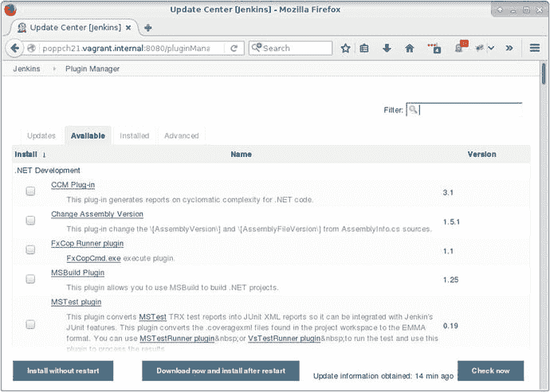

**图 21-3.** Jenkins 插件界面

安装了这些插件后，我几乎准备好创建和配置我的项目了。

## 设置 Git 公钥

在使用 Git 插件之前，我需要确保能够访问一个 Git 仓库。在章节 17 中，我描述了生成公钥以访问远程 Git 仓库的过程。我们需要在这里重复此过程。但是 Jenkins 的“家”在哪里呢？

这个位置是可配置的，但 Jenkins 自然会提示你。我点击 `Manage Jenkins`，然后点击 `Configure System`。我在那里找到了 Jenkins 的主目录。当然，我也可以检查 `/etc/passwd` 文件中关于 `jenkins` 用户的信息。在我的例子中，目录是 `/var/lib/jenkins`。

现在我需要配置一个 `.ssh` 目录：

```
$ sudo su jenkins -s /bin/bash
$ cd ∼
$ mkdir .ssh
$ chmod 0700 .ssh
$ ssh-keygen
```

我切换到 `jenkins` 用户，并指定要使用的 shell（因为 shell 访问默认可能被禁用）。我进入该用户的主目录。`ssh-keygen` 命令生成 SSH 密钥。当提示输入密码时，我直接按回车键，这样 Jenkins 将仅通过其密钥进行身份验证。我确保生成在 `.ssh/id_rsa` 的文件对组和其他用户都不可读：

```
$ chmod 0600 .ssh/id_rsa
```

现在我可以从 `.ssh/id_rsa.pub` 获取公钥，并将其添加到我的远程 Git 仓库。更多信息请参见章节 17。

我还没完全完成。我需要确保我的 Git 服务器是一个 SSH 已知主机。我可以将此设置与 Git 配置的命令行测试结合进行。我确保在执行此操作时仍然以 `jenkins` 用户登录：

```
$ cd /tmp
$ git clone git@bitbucket.org:getinstance/userthing.git
```

系统会提示我确认我的 Git 主机，然后它会被添加到 `jenkins` 用户的 `.ssh/known_hosts` 文件中。这可以防止 Jenkins 稍后建立 Git 连接时出现问题。

## 安装项目

在 Jenkins 仪表盘页面上，我点击 `New Item`。在这个新页面上，我终于可以创建我的 `userthing` 项目了。你可以在图 21-4 中看到设置界面。

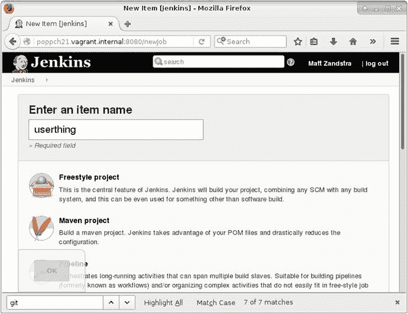

**图 21-4.** 项目设置界面

我选择 `Freestyle project` 并点击 `OK`。这会将我带到项目配置界面。我的首要任务是连接到远程 Git 仓库。我在 `Source Code Manager` 部分中选择 **Git** 单选按钮，并添加我的仓库。你可以在图 21-5 中看到这一点。

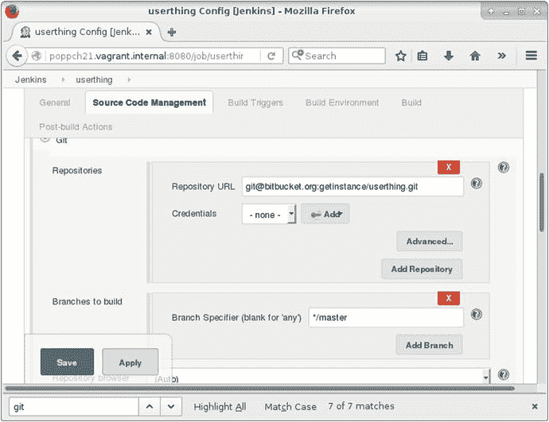

**图 21-5.** 设置版本控制仓库

如果一切顺利，我应该能够访问我的源代码。我可以通过保存并从仪表盘页面选择 `Build` 来检查这一点。然而，为了看到一些有意义的操作，我还应该设置 `Phing`。如果你已经集中安装了 `Phing`，这很简单。但是，如果你使用的是 `Composer`，事情就会稍微复杂一些。你必须告诉 Jenkins 在哪里可以找到 `Phing` 可执行文件。你可以通过从主菜单选择 `Manage Jenkins`，然后选择 `Global Tool Configuration` 来实现。因为我安装了 **Phing** 插件，所以我会在那里找到一个该工具的配置区域。在图 21-6 中，我添加了 `phing` 脚本位置的路径（或者至少是运行 `Composer` 后它最终所在的位置）。

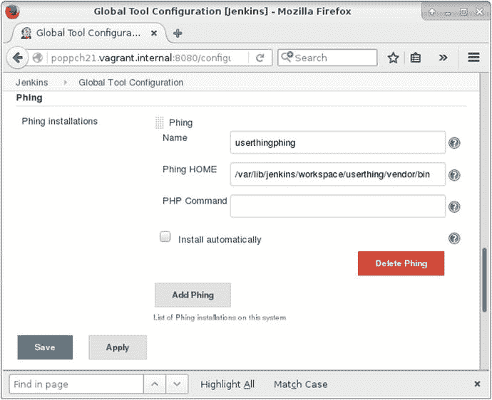

**图 21-6.** 指定 `Phing` 的位置

完成这一步后，我可以为我的项目配置 `Phing`。我返回到 `userthing` 项目区域和 `Configure` 菜单。我滚动到 `Build` 部分，并从 `Add build step` 下拉菜单中选择两个项目。首先，我选择 `Execute shell`。我需要确保 Jenkins 运行 `composer install`，否则我项目所依赖的工具都不会被安装。图 21-7 显示了该配置。

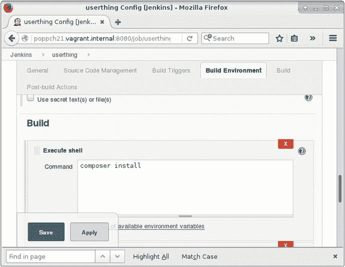

**图 21-7.** 设置 shell 执行

我从 `Add build step` 下拉菜单中选择的下一个项目是 `Invoke Phing targets`。在这里，我可以将我的 `Phing` 目标添加到文本字段中。你可以在图 21-8 中看到这一步。

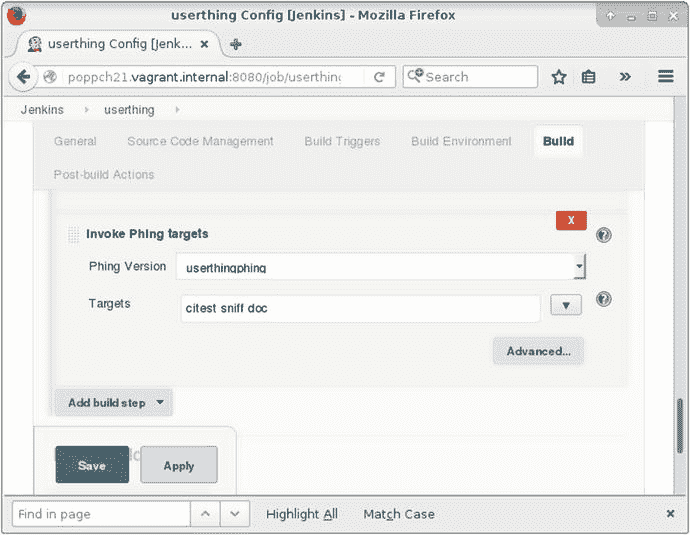

**图 21-8.** 配置 `Phing`

## 运行首次构建

我保存配置界面并点击 `Build Now` 来运行构建和测试过程。这是决定性的时刻！一个构建链接应该会出现在屏幕的 `Build History` 区域。我点击那个链接，然后点击 `Console Output` 来确认构建是否按预期进行。你可以在图 21-9 中看到输出（尽管来自稍后的构建）。

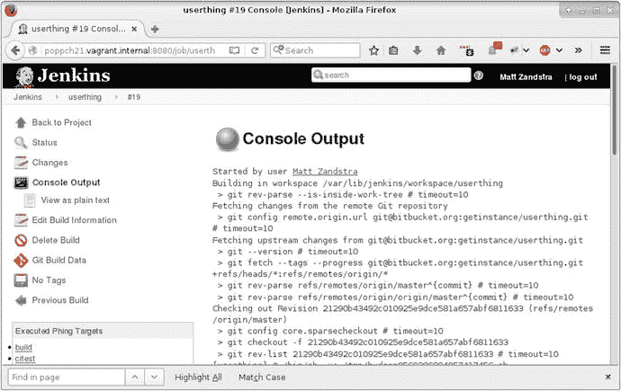

**图 21-9.** 控制台输出

Jenkins 从 Git 服务器检出 `userthing` 代码，并运行所有构建和测试目标。

## 配置报告

多亏了我的构建文件，`Phing` 将报告保存到 `build/reports` 目录，并将文档保存到 `build/docs` 目录。我激活的插件可以从项目配置界面的 `Add post-build action` 下拉菜单中进行配置。

图 21-10 显示了其中一些配置项。

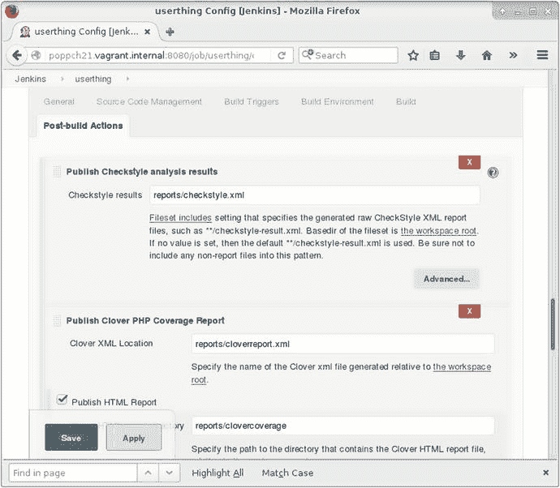

**图 21-10.** 配置报告插件项

为了避免让你看一个接一个的截图，将配置项压缩到一个表格中会更清晰。表 21-2 显示了一些构建后操作字段以及我在 `Phing` 构建文件中设置的相应值。

**表 21-2.** 报告配置

| 配置项 | Phing 任务 | 字段 | 值 |
| :--- | :--- | :--- | :--- |
| 发布 Checkstyle 分析结果 | `phpcodesniffer` | Checkstyle 结果 | `reports/checkstyle.xml` |
| 发布 Clover PHP 覆盖率报告 | `phpunit` | Clover XML 位置 | `reports/cloverreport.xml` |
| | | Clover HTML 报告目录 | `reports/clovercoverage/` |
| 发布 HTML 报告 | `phpdoc2` | 要存档的 HTML 目录 | `reports/docs` |
| | | 索引页面 | `index.html` |
| 发布 Junit 测试结果报告 | `phpunit` | 测试报告 XML 文件 | `reports/testreport.xml` |
| 电子邮件通知 | | 收件人 | `someone@somemail.com` |


在构建项目构建文件时，你遇到了表 21-2 中的所有配置值。除了最后一个，其他都已经介绍过了。`E-mail Notification`字段允许你定义当构建失败时，所有将收到通知的开发人员列表。

完成所有设置后，我可以返回到项目屏幕并再次运行构建。图 21-11 显示了我新增强的输出。

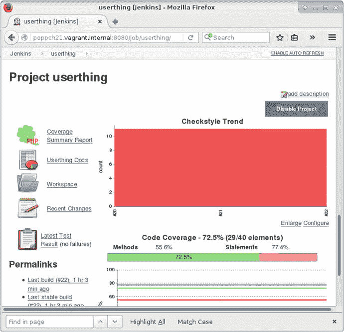

图 21-11. 显示趋势信息的项目屏幕

随着时间的推移，项目屏幕将绘制测试性能、覆盖率和样式合规性的趋势。此外，还有指向最新 API 文档、详细测试结果和完整覆盖率信息的链接。

### 触发构建

如果团队中的某人必须记住手动点击以启动每次构建，那么所有这些丰富的信息几乎都没用。自然，Jenkins 提供了可以自动触发构建的机制。

你可以设置 Jenkins 按固定时间间隔构建，或者按指定时间间隔轮询版本控制仓库。时间间隔可以使用 cron 格式设置，这种格式提供了精细但有些神秘的调度控制。幸运的是，Jenkins 为这种格式提供了良好的在线帮助，并且如果你不需要精确调度，还有一些简单的别名。这些别名包括`@hourly`、`@midnight`、`@daily`、`@weekly`和`@monthly`。在图 21-12 中，我将构建配置为每天运行一次，或者每次仓库发生变化时运行，这基于每小时进行一次的变更轮询。

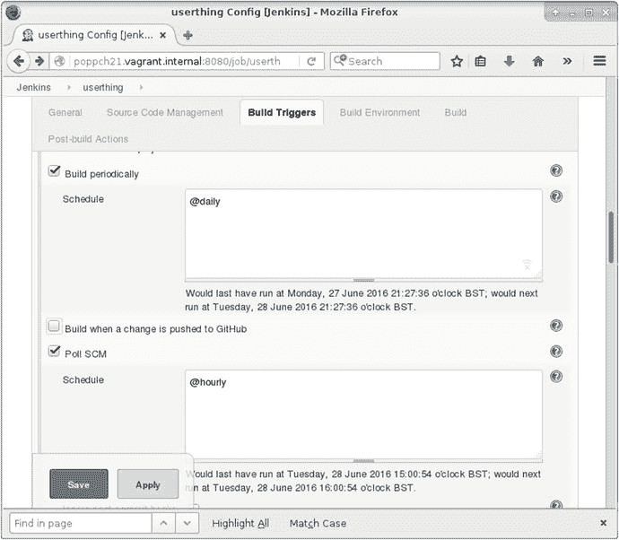

图 21-12. 调度构建

### 测试失败

到目前为止，一切似乎进展顺利，即使`userthing`短期内不会赢得任何代码合规徽章。但测试在失败时才算成功，所以我最好破坏一些东西，以确保 Jenkins 报告它。

下面是命名空间`userthing\util`中名为`Validate`的类的一部分：

```
public function validateUser(string $mail, string $pass): boolean
{
// make it always fail
return false;
$user = $this->store->getUser($mail);
if (is_null($user)) {
return null;
}
if ($user->getPass() == $pass) {
return true;
}
$this->store->notifyPasswordFailure($mail);
return false;
}
```

看到我如何破坏这个方法了吗？就目前而言，`validateUser()`将始终返回`false`。

以下是应该因此出错的测试。它在`test/util/ValidatorTest.php`中：

```
public function testValidateCorrectPass()
{
$this->assertTrue(
$this->validator->validateUser("bob@example.com", "12345"),
"Expecting successful validation"
);
}
```

做好更改后，我只需要提交并等待。果然，不久之后，项目状态显示一个带有黄色图标的构建。一旦我点击构建链接，就会发现更多细节。你可以在图 21-13 中看到该屏幕。

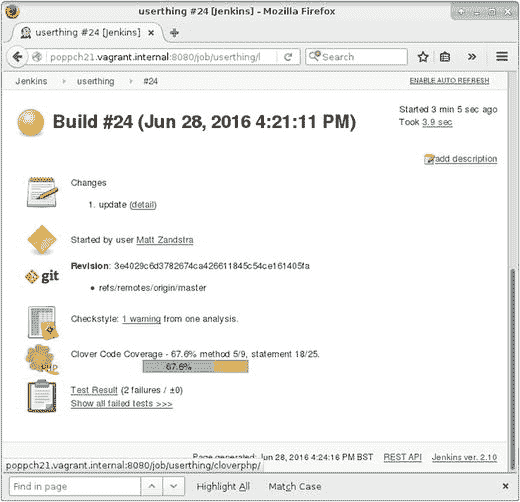

图 21-13. 不稳定的构建

## 总结

在本章中，我汇集了你在前几章中看到的许多工具，并通过 Jenkins 将它们粘合在一起。我准备了一个用于持续集成的小项目，应用了一系列工具，包括 PHPUnit（用于测试和代码覆盖率）、PHP_CodeSniffer、phpDocumentor 和 Git。然后，我设置了 Jenkins，并向你展示了如何向系统添加一个项目。我让系统接受考验，最后，向你展示了如何扩展 Jenkins，以便它可以通过电子邮件提醒你，并测试构建和安装。

## 22. 对象、模式、实践

从对象基础到设计模式原则，再到工具和技术，本书一直聚焦于一个目标：成功的 PHP 项目。

在本章中，我将回顾书中涵盖的一些主题和观点：

*   **PHP 和对象**：PHP 如何继续增强其对面向对象编程的支持，以及如何利用这些特性
*   **对象与设计**：总结一些面向对象设计原则
*   **模式**：它们的酷炫之处
*   **模式原则**：回顾构成许多模式基础的面向对象指导原则
*   **工作中的工具**：重新审视我所描述的工具，并了解一些我尚未提及的工具

### 对象

正如你在第 2 章中所看到的，很长一段时间里，对象在 PHP 世界中几乎是事后才考虑的事情。在 PHP 3 中，支持是非常初级的，对象几乎不比花哨的关联数组强多少。尽管对于 PHP 4 的对象爱好者来说，情况有了根本性的改善，但仍然存在重大问题。其中至少包括，默认情况下，对象是通过引用赋值和传递的。

PHP 5 的引入最终将对象推到了舞台中央。你仍然可以在不声明类的情况下使用 PHP 编程，但该语言最终为面向对象设计进行了优化。PHP 7 进一步完善了这一点，引入了期待已久的特性，如标量类型声明和返回类型声明。可能是出于向后兼容的原因，一些流行的框架本质上仍然是过程式的（尤其是 WordPress）；然而，总的来说，今天大多数新的 PHP 项目都是面向对象的。

在第 3、4 和 5 章中，我详细介绍了 PHP 的面向对象支持。以下是 PHP 自版本 5 以来引入的一些新特性：反射、异常、私有和保护方法和属性、`__toString()`方法、`static`修饰符、抽象类和方法、final 方法和属性、接口、迭代器、拦截器方法、类型声明、`const`修饰符、引用传递、`__clone()`、`__construct()`方法、后期静态绑定、命名空间和匿名类。这个不完整列表的冗长程度揭示了 PHP 的未来与面向对象编程紧密相连的程度。

Zend Engine 2 和 PHP 5 使面向对象设计成为 PHP 项目的核心，向新一批开发者开放了该语言，并为现有爱好者开辟了新的可能性。

在第 6 章中，我探讨了对象可以为项目设计带来的好处。由于对象和设计是本书的核心主题之一，因此值得详细回顾一些结论。

#### 选择

没有法律规定你只能使用类和对象进行开发。设计良好的面向对象代码提供了一个干净的接口，可以从任何客户端代码（无论是过程式的还是面向对象的）访问。即使你无意编写对象（如果你还在读这本书，这不太可能），你也很可能会发现自己在使用它们，哪怕只是作为 Composer 包的客户端。

#### 封装与委托

对象各司其职，在幕后完成分配给它们的任务。它们提供一个接口，通过该接口传递请求和结果。任何不需要暴露的数据以及实现的具体细节都隐藏在幕后。

这赋予了面向对象和过程式项目不同的形态。面向对象项目中的控制器通常出奇地简洁，仅包含少量获取对象的实例化和将数据从一组调用传递到另一组的调用。

另一方面，过程式项目往往更具干预性。控制逻辑更大程度地深入到实现中，引用变量、衡量返回值，并根据情况在不同的操作路径上切换。

## 解耦


## 解耦

解耦是指消除组件之间的相互依赖关系，这样一来，修改一个组件时无需连带修改其他组件。设计良好的对象是自包含的。也就是说，它们无需在自身之外去回忆上一次调用时获知的细节。

通过维护状态的内部表示，对象减少了对全局变量的需求——全局变量是导致紧密耦合的 notorious 原因。使用全局变量时，你会将系统的一个部分与另一个部分绑定在一起。如果一个组件（无论是函数、类还是代码块）引用了全局变量，那么另一个组件就有可能意外地使用相同的变量名，并用其值替换第一个组件的值。还有可能，第三个组件会依赖第一个组件设定的变量值。改变第一个组件的工作方式，就可能导致第三个组件无法工作。面向对象设计的目标就是减少这种相互依赖，使每个组件尽可能自给自足。

紧密耦合的另一个原因是代码重复。当你必须在项目的不同部分重复使用同一个算法时，你就会发现紧密耦合。当你需要修改这个算法时会发生什么？显然，你必须记得修改它出现的每一个地方。如果忘了这么做，你的系统就会陷入麻烦。

代码重复的一个常见原因是并行条件语句。如果你的项目需要根据特定情况（例如，在 Linux 上运行）以一种方式执行，而根据替代情况（例如，在 Windows 上运行）以另一种方式执行，你经常会发现相同的 `if`/`else` 子句在系统的不同部分反复出现。如果你添加了一个新的情况及其处理策略（例如 MacOS），就必须确保所有条件语句都得到更新。

面向对象编程提供了一种处理此问题的技术。你可以用多态来替代条件语句。多态，也称为类切换，是根据情况透明地使用不同子类。由于每个子类都支持与公共超类相同的接口，客户端代码既不知道也不关心它具体在使用哪个实现。

条件代码并非从面向对象系统中被驱逐；它只是被最小化并集中化。必须使用某种条件代码来确定哪些特定的子类型应被提供给客户端。不过，这个判断通常只发生一次，而且在一个地方，从而减少了耦合。

## 可重用性

封装促进了*解耦*，而解耦又促进了*重用*。那些自给自足且仅通过公共接口与更大系统通信的组件，通常可以不经修改地从一个系统移植到另一个系统中使用。

事实上，这比你想象的要罕见。即使是**高度正交**的代码也可能是特定于项目的。例如，在创建一组用于管理特定网站内容的类时，值得在规划阶段花一些时间，看看哪些特性是你的客户所特有的，哪些可能构成未来以内容管理为核心的项目的基础。

另一个关于重用的建议：集中管理那些可能用于多个项目的类。换句话说，不要将一份可重用的类复制到一个新项目中。这会在宏观层面上导致紧密耦合，因为你最终会不可避免地在一个项目中修改了该类，却忘了在另一个项目中做同样的修改。更好的做法是在一个可由多个项目共享的中心仓库中管理公共类。

## 美学

这并不会说服那些尚未被说服的人，但对我来说，面向对象的代码在美学上是令人愉悦的。实现的杂乱被隐藏在清晰的接口之后，使对象在其客户端看来简单明了。

我热爱多态的简洁与优雅，一个 API 允许你操作截然不同的对象，而这些对象却能以可互换且透明的方式执行——就像积木一样，对象可以被整齐地堆叠或相互嵌合。

当然，也有人认为事实恰恰相反。面向对象的代码可能表现为类的爆炸式增长，它们彼此之间解耦得如此彻底，以至于理清它们之间的关系都可能令人头疼。这本身就是一种代码坏味道。人们常常忍不住去构建生产工厂的工厂，再为这些工厂构建工厂，直到你的代码像一间镜厅。有时候，做最简单有效的事情，然后注入刚好足够的优雅以用于测试和灵活性，才是明智之举。让问题空间来决定你的解决方案，而不是受制于一份最佳实践清单。

> **注**
>
> 生搬硬套所谓的“最佳实践”在项目管理中也常常是一个问题。每当一种技术或流程的使用开始变得像例行公事，被自动且不灵活地应用时，就值得花点时间审视一下当前方法背后的推理。你可能正在从使用工具滑向货物崇拜的领域。
>
> 同样值得一提的是，一个漂亮的解决方案并不总是最好的或最高效的。有时一个快速的脚本或几次系统调用就能完成工作，而你却忍不住使用一个功能齐全的面向对象解决方案。

### 模式

最近，一位 Java 程序员申请了我参与的一家公司的一个职位。在他的求职信中，他为自己只使用模式（设计模式）几年而道歉。这种认为设计模式是最近才被发现——一种变革性的进步——的假设，足以证明它们所带来的兴奋感。事实上，这位经验丰富的程序员很可能使用模式的时间比他以为的要长得多。

模式描述了常见问题和经过验证的解决方案。模式命名、整理并组织现实世界中的最佳实践。它们不是某项发明的组件，也不是教条中的条款。如果一个模式描述的不是在其诞生时已经普遍的做法，那它就不会有效。

请记住，**模式语言**的概念起源于建筑学领域。在人们提出用模式来描述解决空间和功能问题的方法之前，人们建造庭院和拱门已有数千年之久。

话虽如此，设计模式确实常常激起类似于宗教或政治争端那样的情绪。信徒们在走廊里徘徊，眼中带着传教士般的光芒，腋下夹着一本《四人帮》的书。他们与未入门者搭话，像背诵信条一样脱口而出一连串模式的名字。难怪一些批评者认为设计模式不过是炒作。

在像 Perl 和 PHP 这样的语言中，模式也因其与面向对象编程的紧密联系而备受争议。在对象是一种设计选择而非理所当然的环境中，将自己与设计模式联系起来无异于宣示一种偏好，这不仅是因为模式会衍生出更多模式，对象也会衍生出更多对象。

### 模式带给我们的好处

我在第 7 章中介绍了模式。让我们重申一下模式能带给我们的一些好处。

#### 经过验证的

首先，正如我所指出的，模式是特定问题的成熟解决方案。将模式与食谱进行类比是有风险的：食谱可以盲目遵循，而模式本质上是“半生不熟的”（马丁·福勒语），需要更周全的处理。尽管如此，食谱和模式共有一个重要特征：它们在定稿之前都经过了充分的尝试和验证。

#### 模式暗示其他模式


### 模式与设计原则

模式具有相互契合的沟槽与曲线，某些模式拼合时会发出令人愉悦的咔嗒声。使用模式解决问题必然会引发连锁反应，这些后果可能成为催生互补模式的先决条件。当然，在选用相关模式时务必确保解决的是真实需求与问题，而非构建精巧却无用的互锁代码塔——编程领域同样存在建造建筑愚行的诱惑。

### 通用词汇表

模式是构建描述问题与解决方案通用词汇表的手段。命名至关重要——它代替了描述过程，使我们能快速覆盖大量领域。当然，命名对尚未掌握这套词汇的人来说也会模糊含义，这也是模式有时令人恼火的原因之一。

### 模式推动设计

如后续章节所述，恰当运用模式可促进优秀设计。但需注意重要警示：模式并非魔法粉尘。

### 模式与设计原则

设计模式本质上关注优秀设计。善用之可助你构建松耦合的灵活代码。然而模式批评者指出，初学者容易过度使用模式，这个观点确有道理。由于模式实现会形成优美精巧的结构，人们容易忘记优秀设计始终在于"适用性"。请记住：模式的存在是为了解决问题。

初学模式时，我曾将`AbstractFactory`遍布整个代码。当需要生成对象时，`AbstractFactory`确实帮了忙。但实际上，我是在偷懒并为自己制造不必要的工作。我需要生成的对象集合确实相关，但尚未存在替代实现。经典的`AbstractFactory`模式适用于根据场景生成多种对象集合的情况。要使其生效，需为每类对象创建工厂类，再创建服务类来调用工厂类——仅描述这个过程就令人疲惫。

如果当时创建基础工厂类，待发现需要生成并行对象集时再重构为`AbstractFactory`，代码会更加简洁。

使用模式并不保证优质设计。开发时最好记住同一原则的两种表述：KISS（"保持简单，笨蛋"）和"做最简单可行的事"。极限编程还提供另一个相关缩写：YAGNI（"你不需要它"），意思是不应实现非必要功能。

结束这些警示后，我可以恢复热情洋溢的语调。正如第 9 章所述，模式往往体现可泛化并应用于所有代码的原则体系。

#### 优先使用组合而非继承

继承关系功能强大。我们利用继承支持运行时类切换（多态），这正是本书探讨的许多模式与技术的核心。但设计时若仅依赖继承，会产生易复制且缺乏灵活性的结构。

#### 避免紧密耦合

本章已讨论过此问题，但为完整性仍需提及。一个组件的变化可能要求项目其他部分相应调整，这是无法回避的事实。但可通过避免重复（示例中的平行条件语句）和过度使用全局变量（或单例）来最小化影响。同时当抽象类型可促进多态时，应尽量减少具体子类的使用，这点引出了另一个原则。

#### 针对接口编程，而非实现

为软件组件设计清晰定义的公共接口，使各组件职责透明化。若在抽象超类中定义接口，并让客户端类要求使用此抽象类型，即可将客户端与具体实现解耦。

但需谨记 YAGNI 原则。若开始仅需某个类型的单一实现，则无立即创建抽象超类的必要。完全可以在具体类中定义清晰接口。当发现单一实现试图同时处理多项任务时，可将该具体类重设为两个子类的抽象父类。客户端代码无需调整，仍继续使用单一类型。

判断是否需要拆分实现并将所得类隐藏在抽象父类后的经典标志，是具体实现中条件语句的出现。

#### 封装变化的概念

若发现子类泛滥成灾，应考虑将导致子类化的原因提取为独立类型。尤其当这种分层是为了实现与类型主要目的无关的辅助功能时。

例如给定`UpdatableThing`类型，可能会创建`FtpUpdatableThing`、`HttpUpdatableThing`和`FileSystemUpdatableThing`子类。但该类型的核心职责是"可更新的东西"——存储与检索机制只是附属功能。`Ftp`、`Http`和`FileSystem`是真正变化的部分，应归入独立类型——命名为`UpdateMechanism`。该类型将拥有不同实现的子类。如此即可无限扩展更新机制而不影响`UpdatableThing`类型，使其保持核心职责聚焦。

注意这里我用动态运行时结构替代了静态编译时结构，这（看似偶然地）将我们带回了第一个原则："优先使用组合而非继承"。

### 实践

本书这部分（及第 14 章介绍）讨论的问题，常被教材和程序员忽视。作为程序员，我发现这些工具和技术对项目成功的重要性至少与设计相当。诸如文档和自动化构建等问题，其本质震撼力虽不及`Composite`模式等奇迹，但同样关键。

> **注：** 让我们重温`Composite`之美：简单的继承树，其对象可在运行时组合成同样具备树状结构，但灵活性与复杂度高出数个量级的结构。多个对象共享统一接口对外呈现。简单与复杂、多元与单一的交织，足以令人心跳加速——这不仅是软件设计，更是诗篇。


### 文档、构建、测试与版本控制

尽管文档、构建、测试和版本控制这类议题比设计模式更为实际，但它们的重要性丝毫不减。在现实世界中，如果多个开发者无法方便地贡献代码或理解源码，一个绝妙的设计也无法存活。没有自动化测试，系统将变得难以维护和扩展。没有构建工具，没人会费心部署你的工作成果。随着 PHP 用户群体的扩大，我们作为开发者确保质量和易部署性的责任也随之增加。

一个项目存在于两种模式之中。它既是代码与功能的结构，也是一组文件和目录、一个合作基础、一系列源和目标、以及一个需要转换的对象。从这个意义上说，项目的外部系统与它的内部代码同样重要。构建、测试、文档和版本控制的机制所需的细节关注，与这些机制所支持的代码本身相同。请以对待系统本身同样的热忱来关注这个元系统。

### 测试

虽然测试是从外部应用于项目的框架组成部分，但它与代码本身紧密集成。因为完全解耦既不可能也不可取，测试框架是监控变更影响的有力手段。更改某个方法的返回类型可能会影响其他地方的客户端代码，导致在变更数周或数月后出现错误。测试框架让你有几分机会捕捉到这类错误（测试越好，几率越高）。

测试同样是改进面向对象设计的工具。先测试（或至少同时测试）有助于你专注于类的接口，并仔细思考每个方法的职责和行为。我在第 18 章中介绍了用于测试的 `PHPUnit`。

### 标准

我天性爱唱反调。我讨厌被命令去做什么。像*合规*这样的词会立刻在我心中激起战或逃的反应。但矛盾的是，标准实际上推动了创新。这是因为它们促进了互操作性。互联网的兴起部分得益于其核心内建了开放标准。网站可以互相链接，Web 服务器可以在任何领域复用，因为协议是众所周知且被遵循的。一个孤岛中的解决方案可能优于广泛接受和应用的标准，但如果孤岛被烧毁了呢？如果它被收购，新所有者决定收费访问呢？当一些人认为隔壁的孤岛更好时会发生什么？我在第 16 章中讨论了 PSR（PHP 标准建议）。我特别关注了自动加载的标准，这些标准极大地改善了 PHP 开发者包含类的方式。我还介绍了 `PSR-2`（编码风格标准）。程序员对于大括号的位置和参数列表的排列有强烈的感受，但同意遵守一套共同规则能带来可读且一致的代码，并允许我们使用工具检查和重新格式化源文件。本着这种精神，我重新格式化了本版中的所有代码示例以符合 `PSR-2`。

### 版本控制

协作是困难的。让我们面对现实：人本身就很难搞。程序员则更糟。一旦你理清了团队中的角色和任务，你最不想处理的就是源代码本身的冲突。正如你在第 17 章中看到的，`Git`（以及类似的工具如 `CVS` 和 `Subversion`）使你能够将多个程序员的工作合并到一个仓库中。当冲突不可避免时，`Git` 会标记出问题并引导你到源码位置进行修复。

即使你是单兵作战的程序员，版本控制也是必需的。`Git` 支持分支，这样你可以同时维护一个软件版本并开发下一个版本，将稳定版本的缺陷修复合并到开发分支中。

`Git` 还提供了项目中每项提交的记录。这意味着你可以按日期或标签回滚到任意时刻。相信我，这总有一天会拯救你的项目。

## 自动化构建

没有自动化构建的版本控制作用有限。任何具有一定复杂度的项目都需要花费精力来部署。各种文件需要被移动到系统上的不同位置，配置文件需要被转换以匹配当前平台和数据库的正确值，数据库表需要被设置或转换。我介绍了两种用于安装的工具。第一个是 `Composer`（见第 15 章），它非常适合独立的包和小型应用。我介绍的第二个构建工具是 `Phing`（见第 19 章），这是一个功能强大且灵活的工具，足以自动化部署最庞大、最错综复杂的项目。

自动化构建将部署从一项杂务转变为在命令行敲入一两行命令的事情。你只需付出很少的努力，就可以从构建工具中调用测试框架并生成文档输出。如果开发者自身的需求还不足以打动你，那就想想当用户发现每次你发布新版本时，他们不再需要花费整个下午来复制文件和修改配置字段时，他们那令人无比感激的欢呼声吧。

## 持续集成

仅仅能测试和构建一个项目是不够的；你必须一直这么做。随着项目复杂度的增长以及你管理多个分支，这一点变得越来越重要。你应该构建和测试你用于发布小缺陷修复的稳定分支、一两个实验性的开发分支以及你的主树干。如果你试图手动完成所有这些，即使有构建和测试工具的帮助，你永远也腾不出手来进行编码。当然，所有程序员都讨厌那样，因此构建和测试不可避免地会被偷工减料。

在第 20 章中，我探讨了持续集成——这是一种实践和一套工具，旨在尽可能自动化构建和测试流程。

## 我遗漏的内容

由于时间和篇幅限制，我不得不从本书中省略一些工具类别，尽管如此，它们对于任何项目都极其有用。在大多数情况下，手头的任务有不止一个好工具可用，因此，尽管我会建议一两个，但你在做出选择之前，可能希望花些时间与其他开发者交流，并用你喜爱的搜索引擎深入挖掘。

如果你的项目有不止一个开发者，或者哪怕只有一个活跃的客户，那么你将需要一个工具来跟踪缺陷和任务。与版本控制一样，缺陷跟踪器是那种一旦你在项目上尝试过就无法想象不用的生产力工具。跟踪器允许用户报告项目问题，但同样常被用作描述所需功能并将实现任务分配给团队成员的手段。

你可以随时获取开放任务的概览，并根据产品、任务负责人、版本号和优先级缩小搜索范围。每个任务都有自己的页面，你可以在其中讨论任何正在处理的问题。讨论记录和任务状态变更可以通过邮件抄送给团队成员，因此无需一直访问跟踪器的 URL 也能轻松掌握进展。


市面上有许多工具可供选择。不过，即便经历了这么多时间，我通常还是会回到那个历史悠久的 Bugzilla（`http://www.bugzilla.org`）。Bugzilla 是一款免费且开源的工具，拥有大多数开发者可能需要的所有功能。它是一个可下载的产品，因此你需要在自有服务器上运行它。它的界面看起来仍有些 Web 1.0 的风格，但这并不影响它的实用性。如果你不想自行托管追踪器，或者你更喜欢（并能负担得起）更美观的界面，那么可以考虑 Atlassian 的 SAAS 解决方案 Jira（`https://www.atlassian.com/software/jira`）。

对于高级任务追踪和项目规划（尤其是如果你对使用看板系统感兴趣），你还可以看看 Trello（`http://www.trello.com`）。

追踪器通常只是你为了共享项目信息而想使用的协作工具套件中的一部分。你可以花些钱使用集成解决方案，例如 Basecamp（`https://basecamp.com/`）或 Atlassian 工具（`https://www.atlassian.com/`）。或者，你也可以选择使用各种工具自行拼凑一个工具生态系统。例如，为了促进团队内部的沟通，你很可能需要一个聊天或消息传递机制。在撰写本文时，最流行的此类工具或许是 Slack（`https://www.slack.com`）。Slack 是一个基于 Web 的多房间聊天环境。如果你像我一样守旧，你可能会立刻想到 IRC（互联网中继聊天）——没错，用 Slack 能做的事情，用 IRC 几乎都能做到。但 Slack 的优势在于它基于浏览器、易于使用，并且内置了与其他服务的集成。Slack 是免费的，除非你需要高级功能。

说到守旧，你也可以考虑为你的项目使用邮件列表。我最喜欢的邮件列表软件是 Mailman（`http://www.gnu.org/software/mailman/`），它是免费的，安装相对简单，而且可配置性极高。

对于需要协作编辑的文本文件和电子表格，Google Docs（`https://docs.google.com/`）可能是最简单的解决方案。

你的代码并不像你想象的那么清晰。初次接触代码库的陌生人可能会面临一项艰巨的任务。即使是作为代码的作者，你最终也会忘记代码是如何组合在一起的。对于内联文档，你应该看看 phpDocumentor（`https://www.phpdoc.org/`），它允许你边写代码边生成文档，并自动生成带超链接的输出。phpDocumentor 的输出在面向对象的上下文中特别有用，因为它允许用户在各个类之间点击跳转。由于类通常包含在各自的文件中，直接阅读源码可能需要跨越多个源文件，追踪复杂的线索。

虽然内联文档很重要，但项目也会产生大量书面材料。这包括使用说明、关于未来方向的咨询、客户资产、会议记录和聚会公告。在项目的生命周期中，这些材料是动态变化的，通常需要一种机制来让人们协作处理它们的演变。

维基（wiki 在夏威夷语中显然意为“非常快”）是创建协作式超链接文档网络的完美工具。只需点击一下按钮，就可以创建或编辑页面，并且系统会自动为与页面名称匹配的单词生成超链接。维基是另一种看似简单、必要且显而易见的工具，你肯定会觉得自己很可能先想到了这个主意，只是没抽出时间把它付诸实践而已。有很多维基可供选择。我在 PhpWiki 和 DokuWiki 上有过良好的体验。你可以从 `http://phpwiki.sourceforge.net` 下载 PhpWiki，而 DokuWiki 可以在 `http://wiki.splitbrain.org/wiki:dokuwiki` 找到。

## 总结

在本章中，我总结了全书，重新审视了构成这本书的核心主题。虽然我没有在此解决诸如单个模式或对象函数等具体问题，但本章应该能作为本书关注点的一个合理总结。

我们永远没有足够的空间或时间来涵盖所有想要讨论的内容。尽管如此，我希望这本书能够论证一个观点：PHP 正在走向成熟。它如今已是全球最流行的编程语言之一。我希望 PHP 仍然是爱好者们最喜欢的语言，也希望许多新的 PHP 程序员会惊喜地发现，仅凭少量代码他们就能走多远。但同时，越来越多的专业团队正在使用 PHP 构建大型系统。这类项目需要的不仅仅是一种“只管去做”的方法。通过其扩展层，PHP 一直是一种多功能语言，为数百种应用程序和库提供了入口。另一方面，它的面向对象支持使你能够访问一套不同的工具。一旦你开始以对象的方式思考，你就可以借鉴其他程序员来之不易的经验。你可以导航和部署那些不仅参考了 PHP，还参考了 Smalltalk、C++、C# 或 Java 而开发出来的模式语言。我们负有责任，以精心的设计和良好的实践来迎接这一挑战。未来是可复用的。

## 23. 附录 A：参考书目

### 书籍

Alexander, Christopher, Sara Ishikawa, Murray Silverstein, Max Jacobson, Ingrid Fiksdahl-King, and Shlomo Angel. *A Pattern Language: Towns, Buildings, Construction*. Oxford, UK: Oxford University Press, 1977.

Alur, Deepak, John Crupi, and Dan Malks. *Core J2EE Patterns: Best Practices and Design Strategies*. Englewood Cliffs, NJ: Prentice Hall PTR, 2001.

Beck, Kent. *Extreme Programming Explained: Embrace Change*. Reading, MA: Addison-Wesley, 1999.

Chacon, Scott. *Pro Git*. New York, NY: Apress, 2009.

Fogel, Karl, and Moshe Bar. *Open Source Development with CVS, Third Edition*. Scottsdale, AZ: Paraglyph Press, 2003.

Fowler, Martin, and Kendall Scott. *UML Distilled, Second Edition: A Brief Guide to the Standard Object Modeling Language*. Reading, MA: Addison-Wesley Professional, 1999.

Fowler, Martin, Kent Beck, John Brant, William Opdyke, and Don Roberts. *Refactoring: Improving the Design of Existing Code*. Reading, MA: Addison-Wesley Professional, 1999.

Fowler, Martin. *Patterns of Enterprise Application Architecture*. Reading, MA: Addison-Wesley Professional, 2002.

Gamma, Erich, Richard Helm, Ralph Johnson, and John Vlissides. *Design Patterns: Elements of Reusable Object-Oriented Software*. Reading, MA: Addison-Wesley Professional, 1995.

Hunt, Andrew, and David Thomas. *The Pragmatic Programmer: From Journeyman to Master*. Reading, MA: Addison-Wesley Professional, 2000.

Kerievsky, Joshua. *Refactoring to Patterns*. Reading, MA: Addison-Wesley Professional, 2004.

Metsker, Steven John. *Building Parsers with Java*. Reading, MA: Addison-Wesley Professional, 2001.

Nock, Clifton. *Data Access Patterns: Database Interactions in Object-Oriented Applications*. Reading, MA: Addison-Wesley Professional, 2003.


Shalloway, Alan, 与 James R. Trott. *设计模式解析：面向对象设计的新视角*. Reading, MA: Addison Wesley, 2001.

Stelting, Stephen, 与 Olav Maasen. *应用 Java 模式*. Palo Alto, CA: Sun Microsystems Press, 2002.

## 文章

Beck, Kent, 与 Erich Gamma. “受测试感染的：程序员热爱编写测试。” [`http://junit.sourceforge.net/doc/testinfected/testing.htm`](http://junit.sourceforge.net/doc/testinfected/testing.htm)

Collins-Sussman, Ben, Brian W. Fitzpatrick, C. Michael Pilato. “Subversion 版本控制。” [`http://svnbook.red-bean.com/`](http://svnbook.red-bean.com/)

Lerdorf, Rasmus. “PHP/FI 简史。” [`http://www.php.net//manual/phpfi2.php#history`](http://www.php.net//manual/phpfi2.php#history)

Gutmans, Andi. “Zend 公司的 Andi Gutmans 谈 PHP 6，以及苹果如何成为移动未来‘最大障碍’。” [`http://venturebeat.com/2012/10/24/zends-andi-gutmans-on-php-6-being-a-developer-ceo-and-how-apple-is-the-biggest-barrier-to-the-future-of-mobile/`](http://venturebeat.com/2012/10/24/zends-andi-gutmans-on-php-6-being-a-developer-ceo-and-how-apple-is-the-biggest-barrier-to-the-future-of-mobile/)

Suraski, Zeev. “PHP 的面向对象演进。” [`http://www.devx.com/webdev/Article/10007/0/page/1`](http://www.devx.com/webdev/Article/10007/0/page/1)

```
Wikipedia. "琐碎定律。" https://en.wikipedia.org/wiki/Law_of_triviality
```

## 网站

Ansible: [`https://www.ansible.com`](https://www.ansible.com)

Basecamp: [`https://basecamp.com/`](https://basecamp.com/)

Bugzilla: [`http://www.bugzilla.org`](http://www.bugzilla.org)

BitBucket: [`https://bitbucket.org`](https://bitbucket.org)

Composer: [`https://getcomposer.org/download/`](https://getcomposer.org/download/)

Chef: [`https://www.chef.io/chef/`](https://www.chef.io/chef/)

CruiseControl: [`http://cruisecontrol.sourceforge.net/`](http://cruisecontrol.sourceforge.net/)

CVS: [`http://www.cvshome.org/`](http://www.cvshome.org/)

CvsGui: [`http://www.wincvs.org/`](http://www.wincvs.org/)

CVSNT: [`http://www.cvsnt.org/wiki`](http://www.cvsnt.org/wiki)

DokuWiki: [`http://wiki.splitbrain.org/wiki:dokuwiki`](http://wiki.splitbrain.org/wiki:dokuwiki)

Foswiki: [`http://foswiki.org/`](http://foswiki.org/)

Eclipse: [`http://www.eclipse.org/`](http://www.eclipse.org/)

Java: [`http://www.java.com`](http://www.java.com)

Jenkins: [`http://jenkins-ci.org/`](http://jenkins-ci.org/)

Jira: [`https://www.atlassian.com/software/jira`](https://www.atlassian.com/software/jira)

GNU: [`http://www.gnu.org/`](http://www.gnu.org/)

Git: [`http://git-scm.com/`](http://git-scm.com/)

```
Github: https://github.org
```

Git Flow 速查表: [`http://danielkummer.github.io/git-flow-cheatsheet/`](http://danielkummer.github.io/git-flow-cheatsheet/)

Google Code: [`http://code.google.com`](http://code.google.com)

Hashicorp Vagrant 盒子搜索: [`https://atlas.hashicorp.com/search`](https://atlas.hashicorp.com/search)

Mailman: [`http://www.gnu.org/software/mailman/`](http://www.gnu.org/software/mailman/)

Martin Fowler: [`http://www.martinfowler.com/`](http://www.martinfowler.com/)

Memcached: [`http://danga.com/memcached/`](http://danga.com/memcached/)

Mercurial: [`http://mercurial.selenic.com`](http://mercurial.selenic.com)

OpenPear: [`http://openpear.org/`](http://openpear.org/)

Packagist: [`https://packagist.org`](https://packagist.org)

Phing: [`http://phing.info`](http://phing.info)

PHPUnit: [`http://www.phpunit.de`](http://www.phpunit.de)

PhpWiki: [`http://phpwiki.sourceforge.net`](http://phpwiki.sourceforge.net)

Pimple: [`http://pimple.sensiolabs.org/`](http://pimple.sensiolabs.org/)

PEAR: [`http://pear.php.net`](http://pear.php.net)

PECL: [`http://pecl.php.net/`](http://pecl.php.net/)

Phing: [`http://phing.info/`](http://phing.info/)

PHP: [`http://www.php.net`](http://www.php.net)

PhpWiki: [`http://phpwiki.sourceforge.net`](http://phpwiki.sourceforge.net)

PHPDocumentor: [`http://www.phpdoc.org/`](http://www.phpdoc.org/)

PHP_CodeSniffer: [`https://github.com/squizlabs/PHP_CodeSniffer`](https://github.com/squizlabs/PHP_CodeSniffer)

Pirum: [`http://pirum.sensiolabs.org`](http://pirum.sensiolabs.org)

波特兰模式仓库的 Wiki (Ward Cunningham): [`http://www.c2.com/cgi/wiki`](http://www.c2.com/cgi/wiki)

Pro Git: [`https://git-scm.com/book/en/v2`](https://git-scm.com/book/en/v2)

PSR: [`http://www.php-fig.org/psr/`](http://www.php-fig.org/psr/)

Pyrus: [`http://pear2.php.net`](http://pear2.php.net)

RapidSVN: [`http://rapidsvn.tigris.org/`](http://rapidsvn.tigris.org/)

Trello: [`http://www.trello.com`](http://www.trello.com)

QDB: [`http://www.bash.org`](http://www.bash.org)

Selenium: [`http://seleniumhq.org/`](http://seleniumhq.org/)

语义化版本: [`https://semver.org`](https://semver.org)

Slack: [`https://www.slack.com`](https://www.slack.com)

SPL: [`http://www.php.net/spl`](http://www.php.net/spl)

Subversion: [`http://subversion.apache.org/`](http://subversion.apache.org/)

Wordpress 编码标准: [`https://make.wordpress.org/core/handbook/best-practices/coding-standards/php/`](https://make.wordpress.org/core/handbook/best-practices/coding-standards/php/)

Vagrant: [`https://www.vagrantup.com/downloads.html`](https://www.vagrantup.com/downloads.html)

Virtualbox: [`https://www.virtualbox.org/wiki/Downloads`](https://www.virtualbox.org/wiki/Downloads)

Ximbiot—CVS Wiki: [`http://ximbiot.com/cvs/wiki/`](http://ximbiot.com/cvs/wiki/)

Xdebug: [`http://xdebug.org/`](http://xdebug.org/)

Xinc: [`http://code.google.com/p/xinc/`](http://code.google.com/p/xinc/)

Zend: [`http://www.zen`](http://www.zen)`d.com`

## 附录 B：一个简单的解析器

第 11 章讨论的解释器模式并未涵盖解析。没有解析器的解释器是非常不完整的，除非你说服用户编写 PHP 代码来调用该解释器！有一些第三方解析器可用于配合解释器模式，这在实际项目中可能是最佳选择。然而，本附录介绍了一个简单的面向对象解析器，旨在配合第 11 章中构建的 MarkLogic 解释器一起工作。请注意，这些示例仅用于概念验证，不适合在实际场景中使用。

**注意**

该解析器代码的接口和整体结构基于 Steven Metsker 的《用 Java 构建解析器》（Addison-Wesley Professional, 2001）。然而，极度简化的实现责任在我，任何错误都应归咎于我。Steven 慷慨允许我使用他最初的概念。

### 扫描器

要解析一条语句，首先必须将其分解为一组单词和字符（称为词法单元）。以下类使用多个正则表达式来定义词法单元。它还提供了一个便捷的结果栈，我将在本节后面使用它。以下是 `Scanner` 类：


```php
// 清单 24.01
class Scanner
{
// 令牌类型
const WORD         = 1;
const QUOTE        = 2;
const APOS         = 3;
const WHITESPACE   = 6;
const EOL          = 8;
const CHAR         = 9;
const EOF          = 0;
const SOF          = -1;
protected $line_no    = 1;
protected $char_no    = 0;
protected $token      = null;
protected $token_type = -1;
// Reader 提供对原始字符数据的访问。Context 存储
// 结果数据
public function __construct(Reader $r, Context $context)
{
$this->r = $r;
$this->context = $context;
}
public function getContext(): Context
{
return $this->context;
}
// 跳过所有空白字符
public function eatWhiteSpace(): int
{
$ret = 0;
if ($this->token_type != self::WHITESPACE &&
$this->token_type != self::EOL
) {
return $ret;
}
while ($this->nextToken() == self::WHITESPACE ||
$this->token_type == self::EOL
) {
$ret++;
}
return $ret;
}
// 获取令牌的字符串表示形式
// 可以是当前令牌，也可以是 $int 参数表示的令牌
public function getTypeString(int $int = -1): string
{
if ($int < 0) {
$int = $this->tokenType();
}
if ($int < 0) {
return '';
}
$resolve = [
self::WORD =>      'WORD',
self::QUOTE =>      'QUOTE',
self::APOS =>       'APOS',
self::WHITESPACE => 'WHITESPACE',
self::EOL =>        'EOL',
self::CHAR =>       'CHAR',
self::EOF =>        'EOF'
];
return $resolve[$int];
}
// 当前令牌类型（用整数表示）
public function tokenType(): int
{
return $this->token_type;
}
// 获取当前令牌的内容
public function token()
{
return $this->token;
}
// 如果当前令牌是一个单词则返回 true
public function isWord(): bool
{
return ($this->token_type == self::WORD);
}
// 如果当前令牌是一个引号字符则返回 true
public function isQuote(): bool
{
return ($this->token_type == self::APOS || $this->token_type == self::QUOTE);
}
// 源文件当前行号
public function lineNo(): int
{
return $this->line_no;
}
// 源文件当前字符位置
public function charNo(): int
{
return $this->char_no;
}
// 克隆此对象
public function __clone()
{
$this->r = clone($this->r);
}
// 移动到源文件中的下一个令牌。设置当前
// 令牌，并跟踪行号和字符位置
public function nextToken(): int
{
$this->token = null;
$type;
while (! is_bool($char = $this->getChar())) {
if ($this->isEolChar($char)) {
$this->token = $this->manageEolChars($char);
$this->line_no++;
$this->char_no = 0;
$type = self::EOL;
return ($this->token_type = self::EOL);
} elseif ($this->isWordChar($char)) {
$this->token = $this->eatWordChars($char);
$type = self::WORD;
} elseif ($this->isSpaceChar($char)) {
$this->token = $char;
$type = self::WHITESPACE;
} elseif ($char == "'") {
$this->token = $char;
$type = self::APOS;
} elseif ($char == '"') {
$this->token = $char;
$type = self::QUOTE;
} else {
$type = self::CHAR;
$this->token = $char;
}
$this->char_no += strlen($this->token());
return ($this->token_type = $type);
}
return ($this->token_type = self::EOF);
}
// 返回下一个令牌的令牌类型和令牌内容（数组形式）
public function peekToken(): array
{
$state = $this->getState();
$type = $this->nextToken();
$token = $this->token();
$this->setState($state);
return [$type, $token];
}
// 获取一个 ScannerState 对象，用于存储解析器在
// 源文件中的当前位置，以及当前令牌的相关数据
public function getState(): ScannerState
{
$state = new ScannerState();
$state->line_no      = $this->line_no;
$state->char_no      = $this->char_no;
$state->token        = $this->token;
$state->token_type   = $this->token_type;
$state->r            = clone($this->r);
$state->context      = clone($this->context);
return $state;
}
// 使用 ScannerState 对象恢复扫描器的
// 状态
public function setState(ScannerState $state)
{
$this->line_no      = $state->line_no;
$this->char_no      = $state->char_no;
$this->token        = $state->token;
$this->token_type   = $state->token_type;
$this->r            = $state->r;
$this->context      = $state->context;
}
// 从源文件获取下一个字符
// 如果没有剩余字符则返回布尔值
private function getChar()
{
return $this->r->getChar();
}
// 获取所有连续单词字符，直到字符不再属于单词字符为止
private function eatWordChars(string $char): string
{
$val = $char;
while ($this->isWordChar($char = $this->getChar())) {
$val .= $char;
}
if ($char) {
$this->pushBackChar();
}
return $val;
}
// 获取所有连续空白字符，直到字符不再属于空白字符为止
private function eatSpaceChars(string $char): string
{
$val = $char;
while ($this->isSpaceChar($char = $this->getChar())) {
$val .= $char;
}
$this->pushBackChar();
return $val;
}
// 在源文件中回退一个字符
private function pushBackChar()
{
$this->r->pushBackChar();
}
// 参数是否为单词字符
private function isWordChar($char): bool
{
if (is_bool($char)) {
return false;
}
return (preg_match("/[A-Za-z0-9_\-]/", $char) === 1);
}
// 参数是否为空白字符
private function isSpaceChar($char): bool
{
return (preg_match("/\t| /", $char) === 1);
}
// 参数是否为换行字符
private function isEolChar($char): bool
{
$check = preg_match("/\n|\r/", $char);
return ($check === 1);
}
// 处理 \n、\r 或 \r\n 换行符
private function manageEolChars(string $char): string
{
if ($char == "\r") {
$next_char=$this->getChar();
if ($next_char == "\n") {
return "{$char}{$next_char}";
} else {
$this->pushBackChar();
}
}
return $char;
}
public function getPos(): int
{
return $this->r->getPos();
}
}
// 清单 24.02
class ScannerState
{
public $line_no;
public $char_no;
public $token;
public $token_type;
public $r;
}
```

好的，作为高级文档工程师和翻译员，我将遵循您提供的注意事项和示例，将给定的英文文本翻译成中文。


首先，我为感兴趣的标记设置常量。我将匹配字符、单词、空白和引号字符。我在专用于每种标记的方法中测试这些类型：`isWordChar()`、`isSpaceChar()` 等等。这个类的核心是 `nextToken()` 方法。它尝试匹配给定字符串中的下一个标记。`Scanner` 存储一个 `Context` 对象。`Parser` 对象在遍历目标文本时使用它来共享结果。

请注意，还有第二个类：`ScannerState`。`Scanner` 的设计使得 `Parser` 对象可以保存状态、进行尝试，并在发现走入死胡同时进行恢复。`getState()` 方法填充并返回一个 `ScannerState` 对象。`setState()` 使用 `ScannerState` 对象在需要时恢复状态。

以下是 `Context` 类：

```
// listing 24.03
class Context
{
public $resultstack = [];
public function pushResult($mixed)
{
array_push($this->resultstack, $mixed);
}
public function popResult()
{
return array_pop($this->resultstack);
}
public function resultCount(): int
{
return count($this->resultstack);
}
public function peekResult()
{
if (empty($this->resultstack)) {
throw new Exception("empty resultstack");
}
return $this->resultstack[count($this->resultstack) -1];
}
}
```

如您所见，这只是一个简单的栈，一个方便解析器使用的通知板。它执行的工作类似于解释器模式中使用的上下文类，但并非同一个类。

请注意，`Scanner` 本身并不直接处理文件或字符串。相反，它需要一个 `Reader` 对象。这使我能够轻松地切换不同的数据源。以下是 `Reader` 接口及其一个实现 `StringReader`：

```
// listing 24.04
interface Reader
{
public function getChar();
public function getPos(): int;
public function pushBackChar();
}
// listing 24.05
class StringReader implements Reader
{
private $in;
private $pos;
public function __construct($in)
{
$this->in = $in;
$this->pos = 0;
}
public function getChar()
{
if ($this->pos >= strlen($this->in)) {
return false;
}
$char = substr($this->in, $this->pos, 1);
$this->pos++;
return $char;
}
public function getPos(): int
{
return $this->pos;
}
public function pushBackChar()
{
$this->pos--;
}
public function string()
{
return $this->in;
}
}
```

它只是每次从一个字符串中读取一个字符。当然，我可以轻松地提供一个基于文件的版本。

也许了解 `Scanner` 如何被使用的最佳方式就是实际使用它。以下是一些将示例语句分解为标记的代码：

```
// listing 24.06
$context = new Context();
$user_in = "\$input equals '4' or \$input equals 'four'";
$reader = new StringReader($user_in);
$scanner = new Scanner($reader, $context);
while ($scanner->nextToken() != Scanner::EOF) {
print $scanner->token();
print "   {$scanner->charNo()}";
print "   {$scanner->getTypeString()}\n";
}
```

我初始化了一个 `Scanner` 对象，然后通过重复调用 `nextToken()` 来遍历给定字符串中的标记。`token()` 方法返回当前匹配到的输入部分。`char_no()` 告诉我当前在字符串中的位置，而 `getTypeString()` 返回表示当前标记的常量标志的字符串版本。输出应如下所示：

```
$       1       CHAR
input   6       WORD
7       WHITESPACE
equals  13      WORD
14      WHITESPACE
'       15      APOS
4       16      WORD
'       17      APOS
18      WHITESPACE
or      20      WORD
21      WHITESPACE
$       22      CHAR
input   27      WORD
28      WHITESPACE
equals  34      WORD
35      WHITESPACE
'       36      APOS
four    40      WORD
'       41      APOS
```

当然，我可以匹配比这更细粒度的标记，但这对于我的目的来说已经足够好了。分解字符串是容易的部分。如何用代码构建一个语法呢？

## 解析器

一种方法是构建一个 `Parser` 对象的树。以下是我将要使用的抽象 `Parser` 类：

```
// listing 24.07
abstract class Parser
{
const GIP_RESPECTSPACE = 1;
protected $respectSpace = false;
protected static $debug = false;
protected $discard = false;
protected $name;
private static $count=0;
public function __construct(string $name = null, $options = [])
{
if (is_null($name)) {
self::$count++;
$this->name = get_class($this) . " (" . self::$count . ")";
} else {
$this->name = $name;
}
if (isset($options[self::GIP_RESPECTSPACE])) {
$this->respectSpace=true;
}
}
protected function next(Scanner $scanner)
{
$scanner->nextToken();
if (! $this->respectSpace) {
$scanner->eatWhiteSpace();
}
}
public function spaceSignificant(bool $bool)
{
$this->respectSpace = $bool;
}
public static function setDebug(bool $bool)
{
self::$debug = $bool;
}
public function setHandler(Handler $handler)
{
$this->handler = $handler;
}
final public function scan(Scanner $scanner): bool
{
if ($scanner->tokenType() == Scanner::SOF) {
$scanner->nextToken();
}
$ret = $this->doScan($scanner);
if ($ret && ! $this->discard && $this->term()) {
$this->push($scanner);
}
if ($ret) {
$this->invokeHandler($scanner);
}
if ($this->term() && $ret) {
$this->next($scanner);
}
$this->report("::scan returning $ret");
return $ret;
}
public function discard()
{
$this->discard = true;
}
abstract public function trigger(Scanner $scanner): bool;
public function term(): bool
{
return true;
}
protected function invokeHandler(Scanner $scanner)
{
if (! empty($this->handler)) {
$this->report("calling handler: " . get_class($this->handler));
$this->handler->handleMatch($this, $scanner);
}
}
protected function report($msg)
{
if (self::$debug) {
print "name}> " . get_class($this) . ": $msg\n";
}
}
protected function push(Scanner $scanner)
{
$context = $scanner->getContext();
$context->pushResult($scanner->token());
}
abstract protected function doScan(Scanner $scan): bool;
}
```

这个类的起点是 `scan()` 方法。大部分逻辑都位于此处。`scan()` 接收一个 `Scanner` 对象作为参数。`Parser` 做的第一件事是委托给具体的子类，调用抽象方法 `doScan()`。`doScan()` 返回 `true` 或 `false`；您将在本节的后面看到一个具体的例子。

如果 `doScan()` 报告成功，并且其他一些条件也满足，那么解析的结果会被推送到 `Context` 对象的结果栈中。`Scanner` 对象持有 `Context`，而 `Parser` 对象使用这个 `Context` 来通信结果。成功解析的实际推送发生在 `Parser::push()` 方法中：

```
protected function push(Scanner $scanner)
{
$context = $scanner->getContext();
$context->pushResult($scanner->token());
}
```

除了解析失败之外，还有两个条件可能会阻止结果被推送到扫描器的栈中。首先，客户端代码可以通过调用 `discard()` 方法来请求解析器丢弃一个成功的匹配。这会将一个名为 `$discard` 的属性切换为 `true`。其次，只有终端解析器（即不是由其他解析器组成的解析器）才应将结果推送到它们的栈中。组合解析器（`CollectionParser` 的实例，下文中常称为集合解析器）将让它们成功的子解析器推送结果。我使用 `term()` 方法来测试一个解析器是否是终端的，该方法在集合解析器中被重写为返回 `false`。

如果具体的解析器在其匹配中成功，那么我会调用另一个方法：`invokeHandler()`。该方法被传递了 `Scanner` 对象。如果一个 `Handler`（即实现了 `Handler` 接口的对象）已经通过 `setHandler()` 方法附加到了 `Parser` 上，那么它的 `handleMatch()` 方法就会在此处被调用。我使用处理器来让一个成功的语法实际执行一些操作，您稍后将看到这一点。


在`scan()`方法中，我调用`Scanner`对象（通过`next()`方法）来推进其位置，即调用它的`nextToken()`和`eatWhiteSpace()`方法。最后，我返回由`doScan()`提供的值。

除了`doScan()`，注意抽象方法`trigger()`。该方法用于决定解析器是否应尝试匹配。如果`trigger()`返回`false`，则解析条件不满足。让我们看一个具体的终端解析器——`Parser`。`CharacterParse`用于匹配特定字符：

```php
// listing 24.08
class CharacterParse extends Parser
{
private $char;
public function __construct($char, $name = null, $options = null)
{
parent::__construct($name, $options);
$this->char = $char;
}
public function trigger(Scanner $scanner): bool
{
return ($scanner->token() == $this->char);
}
protected function doScan(Scanner $scanner): bool
{
return ($this->trigger($scanner));
}
}
```

构造函数接受一个待匹配字符和一个可选的解析器名称（用于调试）。`trigger()`方法仅检查扫描器是否指向与目标字符匹配的字符令牌。由于不需要进一步扫描，`doScan()`方法直接调用`trigger()`。

如您所见，终端匹配相对简单。现在来看集合解析器。首先定义一个通用父类，然后创建具体示例：

```php
// listing 24.09
abstract class CollectionParse extends Parser
{
protected $parsers = [];
public function add(Parser $p): Parser
{
if (is_null($p)) {
throw new Exception("argument is null");
}
$this->parsers[]= $p;
return $p;
}
public function term(): bool
{
return false;
}
}
// listing 24.10
class SequenceParse extends CollectionParse
{
public function trigger(Scanner $scanner): bool
{
if (empty($this->parsers)) {
return false;
}
return $this->parsers[0]->trigger($scanner);
}
protected function doScan(Scanner $scanner): bool
{
$start_state = $scanner->getState();
foreach ($this->parsers as $parser) {
if (! ($parser->trigger($scanner) && $parser->scan($scanner))) {
$scanner->setState($start_state);
return false;
}
}
return true;
}
}
```

抽象类`CollectionParse`实现了用于聚合`Parser`对象的`add()`方法，并覆盖`term()`使其返回`false`。

`SequenceParse::trigger()`方法仅测试其包含的第一个子`Parser`，并调用其`trigger()`方法。调用方`Parser`会先调用`CollectionParse::trigger()`以判断是否值得调用`CollectionParse::scan()`。如果调用`CollectionParse::scan()`，则会执行`doScan()`，并依次调用所有`Parser`子对象的`trigger()`和`scan()`方法。任何一次失败都会导致`CollectionParse::doScan()`报告失败。

解析的一个问题在于需要尝试不同的可能性。一个`SequenceParse`对象在其每个聚合解析器中可能包含一个完整的解析器树。这些解析器会将`Scanner`向前推进一个或多个令牌，并将结果注册到`Context`对象中。如果`Parser`列表中的最后一个子元素返回`false`，那么`SequenceParse`该如何处理由更早成功匹配的子元素留在`Context`中的结果？序列是“全有或全无”的，因此除了回滚`Context`对象和`Scanner`的状态外别无选择。我通过在`doScan()`开始时保存状态，并在失败返回`false`之前调用`setState()`来实现这一点。当然，如果返回`true`，则无需回滚。

为完整起见，以下是其余所有`Parser`类：

```php
// listing 24.11
class RepetitionParse extends CollectionParse
{
private $min;
private $max;
public function __construct($min = 0, $max = 0, $name = null, $options = null)
{
parent::__construct($name, $options);
if ($max  0) {
throw new Exception(
"maximum ( $max ) larger than minimum ( $min )"
);
}
$this->min = $min;
$this->max = $max;
}
public function trigger(Scanner $scanner): bool
{
return true;
}
protected function doScan(Scanner $scanner): bool
{
$start_state = $scanner->getState();
if (empty($this->parsers)) {
return true;
}
$parser = $this->parsers[0];
$count = 0;
while (true) {
if ($this->max > 0 && $count >= $this->max) {
return true;
}
if (! $parser->trigger($scanner)) {
if ($this->min == 0 || $count >= $this->min) {
return true;
} else {
$scanner->setState($start_state);
return false;
}
}
if (! $parser->scan($scanner)) {
if ($this->min == 0 || $count >= $this->min) {
return true;
} else {
$scanner->setState($start_state);
return false;
}
}
$count++;
}
return true;
}
}
// 此解析器匹配两个子解析器中的任意一个
// listing 24.12
class AlternationParse extends CollectionParse
{
public function trigger(Scanner $scanner): bool
{
foreach ($this->parsers as $parser) {
if ($parser->trigger($scanner)) {
return true;
}
}
return false;
}
protected function doScan(Scanner $scanner): bool
{
$type = $scanner->tokenType();
foreach ($this->parsers as $parser) {
$start_state = $scanner->getState();
if ($type == $parser->trigger($scanner) && $parser->scan($scanner)) {
return true;
}
}
$scanner->setState($start_state);
return false;
}
}
// 此终端解析器匹配字符串字面量
// listing 24.13
class StringLiteralParse extends Parser
{
public function trigger(Scanner $scanner): bool
{
return (
$scanner->tokenType() == Scanner::APOS ||
$scanner->tokenType() == Scanner::QUOTE
);
}
protected function push(Scanner $scanner)
{
return;
}
protected function doScan(Scanner $scanner): bool
{
$quotechar = $scanner->tokenType();
$ret = false;
$string = "";
while ($token = $scanner->nextToken()) {
if ($token == $quotechar) {
$ret = true;
break;
}
$string .= $scanner->token();
}
if ($string && ! $this->discard) {
$scanner->getContext()->pushResult($string);
}
return $ret;
}
}
// 此终端解析器匹配单词令牌
// listing 24.14
class WordParse extends Parser
{
public function __construct($word = null, $name = null, $options = [])
{
parent::__construct($name, $options);
$this->word = $word;
}
public function trigger(Scanner $scanner): bool
{
if ($scanner->tokenType() != Scanner::WORD) {
return false;
}
if (is_null($this->word)) {
return true;
}
return ($this->word == $scanner->token());
}
protected function doScan(Scanner $scanner): bool
{
return ($this->trigger($scanner));
}
}
```

通过组合终端和非终端`Parser`对象，可以构建一个相当复杂的解析器。您可以在图 24-1 中看到此示例使用的所有`Parser`类。

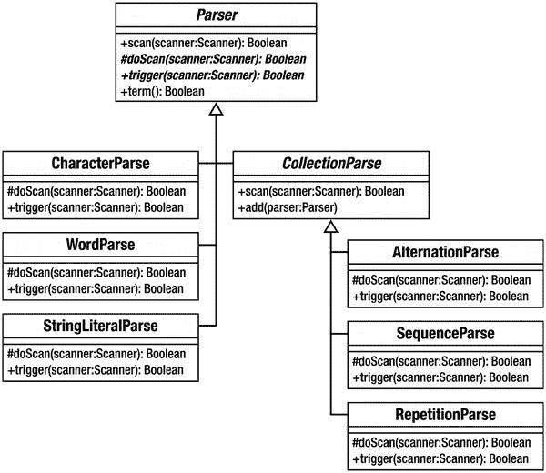

图 24-1. Parser 类

这种组合模式设计的理念是，客户端可以用接近 EBNF 记法的代码构建语法。表 24-1 展示了这些类与 EBNF 片段之间的对应关系。

表 24-1. 组合解析器与 EBNF

| 类 | EBNF 示例 | 描述 |
|---|---|---|
| `AlternationParse` | `orExpr &#124; andExpr` | 匹配其中一个 |
| `SequenceParse` | `'and' operand` | 列表（所有项按顺序匹配） |
| `RepetitionParse` | `( eqExpr )*` | 零个或多个匹配 |

现在来构建一些客户端代码以实现迷你语言。提醒一下，以下是第 11 章中介绍的 EBNF 片段：


以下是根据您的要求排版后的 Markdown 文档：

```
expr     = operand { orExpr | andExpr }
operand  = ( '(' expr ')' | ? 字符串字面量 ? | variable ) { eqExpr }
orExpr   = 'or' operand
andExpr  = 'and' operand
eqExpr   = 'equals' operand
variable = '$' , ? 单词 ?
```

这个简单的类根据这段片段构建语法，并执行它：

```php
// listing 24.15
class MarkParse
{
private $expression;
private $operand;
private $interpreter;
private $context;
public function __construct($statement)
{
$this->compile($statement);
}
public function evaluate($input)
{
$icontext = new InterpreterContext();
$prefab = new VariableExpression('input', $input);
// 向 Context 添加 input 变量
$prefab->interpret($icontext);
$this->interpreter->interpret($icontext);
$result = $icontext->lookup($this->interpreter);
return $result;
}
public function compile($statementStr)
{
// 构建解析树
$context = new Context();
$scanner = new Scanner(new StringReader($statementStr), $context);
$statement = $this->expression();
$scanresult = $statement->scan($scanner);
if (! $scanresult || $scanner->tokenType() != Scanner::EOF) {
$msg  = "";
$msg .= " line: {$scanner->line_no()} ";
$msg .= " char: {$scanner->char_no()}";
$msg .= " token: {$scanner->token()}\n";
throw new Exception($msg);
}
$this->interpreter = $scanner->getContext()->popResult();
}
public function expression(): Parser
{
if (! isset($this->expression)) {
$this->expression = new SequenceParse();
$this->expression->add($this->operand());
$bools = new RepetitionParse();
$whichbool = new AlternationParse();
$whichbool->add($this->orExpr());
$whichbool->add($this->andExpr());
$bools->add($whichbool);
$this->expression->add($bools);
}
return $this->expression;
}
public function orExpr(): Parser
{
$or = new SequenceParse();
$or->add(new WordParse('or'))->discard();
$or->add($this->operand());
$or->setHandler(new BooleanOrHandler());
return $or;
}
public function andExpr(): Parser
{
$and = new SequenceParse();
$and->add(new WordParse('and'))->discard();
$and->add($this->operand());
$and->setHandler(new BooleanAndHandler());
return $and;
}
public function operand(): Parser
{
if (! isset($this->operand)) {
$this->operand = new SequenceParse();
$comp = new AlternationParse();
$exp = new SequenceParse();
$exp->add(new CharacterParse('('))->discard();
$exp->add($this->expression());
$exp->add(new CharacterParse(')'))->discard();
$comp->add($exp);
$comp->add(new StringLiteralParse())
->setHandler(new StringLiteralHandler());
$comp->add($this->variable());
$this->operand->add($comp);
$this->operand->add(new RepetitionParse())->add($this->eqExpr());
}
return $this->operand;
}
public function eqExpr(): Parser
{
$equals = new SequenceParse();
$equals->add(new WordParse('equals'))->discard();
$equals->add($this->operand());
$equals->setHandler(new EqualsHandler());
return $equals;
}
public function variable(): Parser
{
$variable = new SequenceParse();
$variable->add(new CharacterParse('$'))->discard();
$variable->add(new WordParse());
$variable->setHandler(new VariableHandler());
return $variable;
}
}
```

这个类看似复杂，但实际上它只是在构建前面已经定义好的语法。大多数方法都与产生式名称（即 EBNF 中每条产生式行开头的名称，例如 `eqExpr` 和 `andExpr`）类似。如果查看 `expression()` 方法，您会发现它构建的规则与之前 EBNF 中定义的规则相同：

```php
// expr     = operand { orExpr | andExpr }
public function expression()
{
if (! isset($this->expression)) {
$this->expression = new SequenceParse();
$this->expression->add($this->operand());
$bools = new RepetitionParse();
$whichbool = new AlternationParse();
$whichbool->add($this->orExpr());
$whichbool->add($this->andExpr());
$bools->add($whichbool);
$this->expression->add($bools);
}
return $this->expression;
}
```

在代码和 EBNF 表示法中，我定义了一个序列，该序列包含一个对 `operand` 的引用，后跟零个或多个 `orExpr` 与 `andExpr` 之间的交替实例。请注意，我将此方法返回的 `Parser` 存储在一个属性变量中。这是为了防止无限循环，因为从 `expression()` 调用的方法本身也会引用 `expression()`。

唯一执行了超出构建语法范围操作的方法是 `compile()` 和 `evaluate()`。`compile()` 可以直接调用，也可以通过构造函数自动调用，构造函数接受一条语句字符串，并使用它创建一个 `Scanner` 对象。它调用 `expression()` 方法，该方法返回一个由构成语法的 `Parser` 对象组成的树。然后它调用 `Parser::scan()`，并将 `Scanner` 对象传递给它。如果原始代码无法解析，`compile()` 方法会抛出一个异常。否则，它会检索编译结果，该结果作为 `Scanner` 对象的 `Context` 存在。您很快就会看到，这应该是一个 `Expression` 对象。此结果存储在一个名为 `$interpreter` 的属性中。

`evaluate()` 方法使一个值对 `Expression` 树可用。它通过预定义一个名为 `input` 的 `VariableExpression` 对象，并将其注册到随后传递给主 `Expression` 对象的 `Context` 对象中来实现这一点。与 PHP 中的 `$_REQUEST` 等变量一样，这个 `$input` 变量始终对 MarkLogic 编码器可用。

注意

有关 `VariableExpression` 类的更多信息，请参见第 11 章，该类是解释器模式示例的一部分。

`evaluate()` 方法调用 `Expression::interpret()` 方法来生成最终结果。请记住，您需要从 `Context` 对象中检索解释器结果。

到目前为止，您已经了解了如何解析文本以及如何构建语法。您还在第 11 章中了解了如何使用解释器模式来组合 `Expression` 对象并处理查询。然而，您还没有看到如何将这两个过程联系起来。如何从解析树得到解释器？答案在于可以使用 `Parser::setHandler()` 与 `Parser` 对象关联的 `Handler` 对象。让我们看看管理变量的方法。我在 `variable()` 方法中将一个 `VariableHandler` 与 `Parser` 关联起来：

```php
$variable->setHandler(new VariableHandler());
```

这是 `Handler` 接口：

```php
// listing 24.16
interface Handler
{
public function handleMatch(
Parser $parser,
Scanner $scanner
);
}
```

这是 `VariableHandler`：

```php
// listing 24.17
class VariableHandler implements Handler
{
public function handleMatch(Parser $parser, Scanner $scanner)
{
$varname = $scanner->getContext()->popResult();
$scanner->getContext()->pushResult(new VariableExpression($varname));
}
}
```

如果与 `VariableHandler` 关联的 `Parser` 在一次扫描操作中匹配成功，则调用 `handleMatch()`。根据定义，栈上的最后一个项目将是变量的名称。我将其移除，并用一个同名的新 `VariableExpression` 对象替换。创建 `EqualsExpression` 对象、`LiteralExpression` 对象等也采用了类似的原理。

以下是其余的处理程序：


```php
// 清单 24.18
class StringLiteralHandler implements Handler
{
public function handleMatch(Parser $parser, Scanner $scanner)
{
$value = $scanner->getContext()->popResult();
$scanner->getContext()->pushResult(new LiteralExpression($value));
}
}
// 清单 24.19
class EqualsHandler implements Handler
{
public function handleMatch(Parser $parser, Scanner $scanner)
{
$comp1 = $scanner->getContext()->popResult();
$comp2 = $scanner->getContext()->popResult();
$scanner->getContext()->pushResult(new EqualsExpression($comp1, $comp2));
}
}
// 清单 24.20
class BooleanOrHandler implements Handler
{
public function handleMatch(Parser $parser, Scanner $scanner)
{
$comp1 = $scanner->getContext()->popResult();
$comp2 = $scanner->getContext()->popResult();
$scanner->getContext()->pushResult(new BooleanOrExpression($comp1, $comp2));
}
}
// 清单 24.21
class BooleanAndHandler implements Handler
{
public function handleMatch(Parser $parser, Scanner $scanner)
{
$comp1 = $scanner->getContext()->popResult();
$comp2 = $scanner->getContext()->popResult();
$scanner->getContext()->pushResult(new BooleanAndExpression($comp1, $comp2));
}
}
```

请记住，你还需要手头有第 11 章的**解释器模式**示例，然后你可以像这样使用 `MarkParse` 类：

```
$input      = 'five';
$statement = "( \$input equals 'five')";
$engine = new MarkParse($statement);
$result = $engine->evaluate($input);
print "input: $input evaluating: $statement\n";
if ($result) {
print "true!\n";
} else {
print "false!\n";
}
```

这应该会输出以下结果：

```
input: five evaluating: ( $input equals 'five')
true!
```

## 索引

### A

- 抽象工厂模式（Abstract Factory pattern）
- `add()` 方法
- `addClean()` 方法
- `addDirty()` 方法
- `addNew()` 方法
- `addTest()` 方法
- `addToMap()` 方法
- `addUnit()` 方法
- `addUser()` 方法
- 匿名类（anonymous classes）
- Ant
- `ApplicationRegistry::instance()` 方法

### B

- BinaryCloud
- `bombardStrength()` 方法
- `BooleanAndExpression`
- Bugzilla
- 构建文档撰写（Build document composing）
- `build.xml`
    - copy 任务
        - overwrite 属性
        - tofile 属性
    - delete 任务
    - echo 任务，msg 属性
    - fileset 数据类型
        - excludes 属性
        - fileset 元素属性
        - filterchain 元素
        - includes 属性
        - patternset 元素
    - input 任务
    - phing 命令
    - project 元素
    - property 元素
        - additional 属性
        - condition 任务
        - dbname
        - dbpass
        - -D 标志
        - `${env.DBPASS}`
        - if 属性
        - name（名称）
        - override 属性
        - propertyfile 选项
        - target 元素属性
        - unless 属性
        - value（值）
    - targets（目标）
        - default 属性
        - description 属性
        - housekeeping 函数
        - main 目标
        - name 属性
        - projecthelp
        - runfirst
        - runsecond
        - -v 标志
    - XML 注释
- `buildStatement()` 方法
- 业务逻辑层（Business Logic Layer）
    - 领域模型（domain model）
        - 类图
        - 复制粘贴编码（cut-and-paste coding）
        - 静态方法（static method）
        - Venue 对象
    - 事务脚本（transaction script）
        - 后果
        - 数据库表
        - `prepare()` 方法
        - 超类（superclass）
        - VenueManager 类

### C

- `calculateTax()` 方法
- `chargeType()` 方法
- 代码设计（Code design）
- 命令模式（Command pattern）
    - 抽象基类
    - AccessManager 类
    - AccessManager 对象
    - 客户端编码
    - 具体命令类（concrete Command class）
    - Command 类
    - CommandContext 实现
    - CommandFactory 类
    - LoginCommand 类
    - `login.php`/`feedback.php` 页面
    - 参与者
    - 联系点页面（point-of-contact pages）
    - `process()` 方法
    - 重构（refactoring）
    - Registry 类
- Composer
    - 自动加载（autoload）
    - 定义
    - 安装（installation）
    - 包（packages）
        - 安装
        - `.json` 文件
        - 平台包（platform packages）
        - require-dev
        - 供应商名称（vendor name）
        - 版本（versions）
    - packagist
    - `composer.json` 文件
        - 安装
        - 包控制面板（package control panel）
        - 版本
    - 私有包（private package）
- 组合模式（Composite pattern）
    - 抽象方法（abstract methods）
    - 添加/删除方法（add/remove methods）
    - Archer 和 LaserCannonUnit 类
    - Army 和 TroopCarrier 类
    - 类图
    - CompositeUnit 类
    - 显示访问（explicit reach）
    - 灵活性（flexibility）
    - 隐式访问（implicit reach）
    - 继承层次结构（inheritance hierarchies）
    - 简洁性（simplicity）
    - 部队运载器（troop carriers）
    - 单位类型（unit types）
- Condition 任务
- `constant()` 方法
- 构造方法（Constructor method）
- 持续集成（Continuous integration, CI）
    - 抽象 `cost()` 方法
    - 检查覆盖率（check coverage）
    - 代码覆盖率（code coverage）
    - `create()` 方法
    - `createObject()` 方法
    - 创建（creation）
    - CVS
    - 定义
    - 安装 phpDocumentor
    - Jenkins
        - 构建链接
        - 定义
        - Fedora 发行版
        - Git 公钥
        - 插件（plugins）
        - 项目安装
        - 报告配置
        - 触发构建（triggering builds）
    - phing
    - PHP_CodeSniffer 任务
    - `testreport.xml`
    - 类型 xml
    - 单元测试（unit tests）
    - 版本控制（version control）

### D

- 数据库模式（Database Pattern）
    - 领域对象工厂（domain object factory）
    - 类（classes）
    - 集合实现（Collection implementation）
```


`createObject()` 方法

数据库解耦

按需对象

`PersistenceFactory` 类

标识对象

类

客户端代码

结论

`EventIdentityObject` 类

`IdentityObject` 类

问题

`WHERE` 子句

延迟加载

结论

`DeferredEventCollection` 方法

`doCreateObject()` 方法

`EventCollection` 对象

`notifyAccess()` 方法

`SpaceCollection` 对象

`SpaceMapper` 代码

`Space` 对象

选择与更新工厂

基类

`buildStatement()` 方法

类图

结论

`newUpdate()` 方法

`PersistenceFactory`

问题

`SelectionFactory` 类

`newUpdate()` 方法

`UpdateFactory` 类

`VenueUpdateFactory` 类

工作单元

`addClean()` 方法

`addDirty()` 方法

`addNew()` 方法

结论

构造函数方法

数据库操作

`DomainObject` 类

`Mapper` 类

`markDirty()`

`ObjectWatcher` 类

`ObjectWatcher` 对象

`performOperations()` 方法

`SQL` 语句

Venue 和 Space

数据层

数据映射器

基类

子类

`Collection` 类

`Collection` 对象获取

`Collection` 类

`findAll()` 方法

`findByVenue()` 方法

`setSpaces()` 操作

`SpaceCollection`

`SpaceMapper` 类

结论

`doCreateObject()` 方法

`doInsert()` 方法

`DomainObjectAssembler` 类

`find()` 方法

生成器函数

`getFinder()` 方法

`getVenueMapper()` 方法

`insert()` 方法

插入与更新

`Iterator` 实现

`Iterator` 接口

`Mapper` 类

持久化类

`Registry` 类

`$raw` 参数

关系数据库

`selectStmt()`

`Update()` 方法

Venue 对象

`VenueCollection` 类

`VenueCollection` 对象

装饰器模式

类图

类层次结构

组合与委托

结论

`DecorateProcess`

`DiamondDecorator`

`getWealthFactor()` 方法

硬编码变体

实现

`Plains` 对象

Pollution 和 Diamond 类

`PollutionDecorator`

`Tile` 类

`defensiveStrength()` 方法

依赖注入模式

设计模式

抽象工厂

抽象工厂模式

优势

书籍，列表

协作

通用词汇表

补充模式

结论

定义

定义

四人组格式

半成品性质

刻板方法

语言无关性

名称

细微差别的解决方案

过度使用

模式语言

PHP

流行框架

问题定义

促进良好设计

识别与情境问题

递归下降解析器

经过验证的技术

词汇表定义

网站列表

设计模式原则

组合与继承

抽象类

暴力解决方案

子类

类图

`CostStrategy` 实现

`Lesson` 类

策略模式

概念

数据库模式

解耦

客户端代码

`DBAL` 包

封装

实现

`Lesson` 系统

`Mailer` 类

`MySQL` 数据库

`RegistrationMgr`

可重用性

紧耦合

企业模式

极限编程

接口能力

对象与类

模式分类

启示

面向任务模式

`doCreateObject()` 方法

`doInsert()` 方法

`dointerpret()` 方法

领域特定语言（DSL）

E

封装

企业模式

架构概览

业务逻辑层

表示层

注册表模式

企业系统

应用控制器

架构概览

业务逻辑层

命令与控制层

数据层

领域模型

前端控制器

HTML 接口

页面控制器

参与者

表示层

见“表示层”

注册表模式

`ApplicationHelper` 类

代码类

配置文件

结论

`instance()` 方法

基于键的系统

PHP

`Registry` 对象

作用域

单例

静态 `instance()` 方法

权衡

`TreeBuilder`

SOAP/RESTful API

模板视图

测试

事务脚本

视图层

易出错方法

`EventMapper::findBySpaceId()` 方法

`execute()` 方法

`exists()` 方法

`expectException()` 方法

扩展巴科斯-瑙尔范式（EBNF）

极限编程（XP）

F

外观模式

结论

实现

过程化代码

子系统

工厂方法模式

致命错误

`FilterChain` 元素

`build/lib/Config.php`

PHP 注释

`replacetokens`

`src/lib/Config.php`

`StripPhpComments`

`todir` 属性

XSLT 转换

`findAll()` 方法

`findByVenue()` 方法

`findElement()` 方法

灵活对象编程

组合模式

装饰器模式

外观模式

`forward()` 方法

G

`generateId()` 方法

`getApptEncoder()` 方法

`getCommand()` 方法

`getComposite()` 方法

`getDepth()` 方法

`getDescriptor()` 方法

`getFinder()` 方法

`getFooterText()` 方法


