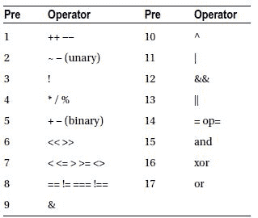
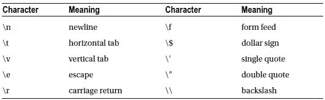

# 第三章：运算符


运算符用于对值进行操作。它们可以分为五种类型：算术运算符、赋值运算符、比较运算符、逻辑运算符和位运算符。

## 算术运算符


```markdown

## 算术运算符

算术运算符包括四种基本算术运算，以及用于获取除法余数的取模运算符（`%`）。

```
$x = 4 + 2; // 6 // 加法
$x = 4 - 2; // 2 // 减法
$x = 4 * 2; // 8 // 乘法
$x = 4 / 2; // 2 // 除法
$x = 4 % 2; // 0 // 取模（除法余数）
```

## 赋值运算符

第二组是赋值运算符。最重要的是赋值运算符（`=`）本身，它将一个值赋给一个变量。

## 复合赋值运算符

赋值运算符和算术运算符的一个常见用法是对一个变量进行操作，然后将结果保存回同一个变量。这些操作可以通过复合赋值运算符来简化。

```
$x = 0;
$x += 5; // $x = $x+5;
$x -= 5; // $x = $x-5;
$x *= 5; // $x = $x*5;
$x /= 5; // $x = $x/5;
$x %= 5; // $x = $x%5;
```

## 递增和递减运算符

另一个常见操作是将变量递增或递减 1。这可以通过递增（`++`）和递减（`--`）运算符来简化。

```
$x++; // $x += 1;
$x--; // $x -= 1;
```

这两个运算符都可以放在变量的前面或后面。

```
$x++; // 后置递增
$x--; // 后置递减
++$x; // 前置递增
--$x; // 前置递减
```

无论使用哪种方式，对变量的结果都是相同的。区别在于，后置运算符在修改变量之前返回原始值，而前置运算符先修改变量，然后返回值。

```
$x = 5; $y = $x++; // $x=6, $y=5
$x = 5; $y = ++$x; // $x=6, $y=6
```

## 比较运算符

比较运算符比较两个值并返回 `true` 或 `false`。它们主要用于指定条件，这些条件是指计算结果为 `true` 或 `false` 的表达式。

```
$x = (2 == 3);  // false // 等于
$x = (2 != 3);  // true  // 不等于
$x = (2 <> 3);  // true  // 不等于（另一种写法）
$x = (2 === 3); // false // 全等于
$x = (2 !== 3); // true  // 不全等于
$x = (2 > 3);   // false // 大于
$x = (2 < 3);   // true  // 小于
$x = (2 >= 3);  // false // 大于或等于
$x = (2 <= 3);  // true  // 小于或等于
```

全等运算符（`===`）用于比较操作数的值和数据类型。如果两个操作数的值相同且类型相同，则返回 `true`。同样，不全等运算符（`!==`）如果操作数的值不相同或类型不相同，则返回 `true`。换句话说，相等运算符会执行类型转换，而全等运算符则不会。

```
$x = (1 ==  "1"); // true  （值相同）
$x = (1 === "1"); // false （类型不同）
```

## 逻辑运算符

逻辑运算符通常与比较运算符一起使用。逻辑与（`&&`）如果左侧和右侧都为真，则计算结果为 `true`，逻辑或（`||`）如果左侧或右侧为真，则计算结果为 `true`。逻辑非（`!`）运算符用于反转布尔结果。请注意，对于“逻辑与”和“逻辑或”，如果结果已由左侧确定，则不会计算运算符的右侧。

```
$x = (true && false); // false // 逻辑与
$x = (true || false); // true  // 逻辑或
$x = !(true);         // false // 逻辑非
```

## 位运算符

位运算符可以操作数字的二进制位。例如，异或运算符（`^`）会打开运算符一侧设置的位，但不会打开两侧都设置的位。

```
$x = 5 & 4;  // 101 & 100 = 100 (4) // 按位与
$x = 5 | 4;  // 101 | 100 = 101 (5) // 按位或
$x = 5 ^ 4;  // 101 ^ 100 = 001 (1) // 按位异或（exclusive or）
$x = 4 << 1; // 100 << 1  =1000 (8) // 左移
$x = 4 >> 1; // 100 >> 1  =  10 (2) // 右移
$x = ~4;     // ~00000100 = 11111011 (-5) // 按位取反
```

这些位运算符与算术运算符一样，也有简写的赋值运算符。

```
$x=5; $x &= 4;  // 101 & 100 = 100 (4) // 按位与赋值
$x=5; $x |= 4;  // 101 | 100 = 101 (5) // 按位或赋值
$x=5; $x ^= 4;  // 101 ^ 100 = 001 (1) // 按位异或赋值
$x=5; $x <<= 1; // 101 << 1  =1010 (10)// 左移赋值
$x=5; $x >>= 1; // 101 >> 1  =  10 (2) // 右移赋值
```

## 运算符优先级

在 PHP 中，表达式通常从左到右计算。然而，当一个表达式包含多个运算符时，这些运算符的优先级决定了它们被计算的顺序。



例如，逻辑与（`&&`）的绑定优先级低于关系运算符，而关系运算符的绑定优先级又低于算术运算符。

```
$x = 2+3 > 1*4 && 5/5 == 1; // true
```

为了更清晰，可以使用括号来指定表达式的哪一部分将被首先计算。括号在所有运算符中优先级最高。

```
$x = ((2+3) > (1*4)) && ((5/5) == 1); // true
```

## 额外的逻辑运算符

在优先级表中，请特别注意最后三个运算符：`and`、`or` 和 `xor`。`and` 和 `or` 运算符的工作方式与逻辑运算符 `&&` 和 `||` 相同。唯一的区别是它们的优先级较低。

```
// 等同于：$a = (true && false);
$a = true && false; // $a 为 false

// 等同于：($a = true) and false;
$a = true and false; // $a 为 true
```

`xor` 运算符是位运算符 `^` 的布尔版本。如果只有一个操作数为真，则计算结果为 `true`。

```
$a = (true xor true); // false
```

# 第四章


# 字符串

字符串是可以存储在变量中的一系列字符。在 PHP 中，字符串通常由单引号分隔。

```
$a = 'Hello';
```

## 字符串连接

PHP 有两个字符串运算符。点号（`.`）被称为连接运算符，它将两个字符串合并为一个。它还有一个配套的赋值运算符（`.=`），它将右侧字符串追加到左侧字符串变量。

```
$b = $a . ' World'; // Hello World
$a .= ' World';     // Hello World
```

## 分隔字符串

PHP 字符串可以用四种不同的方式分隔。有两种单行表示法：双引号（`" "`）和单引号（`' '`）。它们之间的区别在于，变量在单引号字符串中不会被解析，而在双引号字符串中则会被解析。

```
$c = 'World';
echo "Hello $c"; // "Hello World"
echo 'Hello $c'; // "Hello $c"
```

单引号字符串通常更受青睐，除非需要解析变量，主要是因为字符串解析会带来非常小的性能开销。然而，双引号字符串被认为更易于阅读，这使得选择更多是出于个人偏好。

除了单引号和双引号字符串外，还有两种多行表示法：heredoc 和 nowdoc。这些表示法主要用于包含较大的文本块。

### Heredoc 字符串

heredoc 语法由 `<<<` 运算符后跟一个标识符和一个换行符组成。然后包含字符串，接着是一个包含该标识符的换行符以关闭字符串。与双引号字符串一样，变量在 heredoc 字符串内部会被解析。

```
$s = <<<LABEL
Heredoc（可解析）
LABEL;
```

### Nowdoc 字符串

nowdoc 字符串的语法与 heredoc 字符串相同，只是初始标识符用单引号括起来。变量不会在 nowdoc 字符串内部被解析。

```
$s = <<<'LABEL'
Nowdoc（不可解析）
LABEL;
```

## 转义字符

转义字符用于编写特殊字符，例如反斜杠或双引号。PHP 中可用的转义字符表如下所示。



例如，换行符在文本中用转义字符 `\n` 表示。

```
$s = "Hello\nWorld";
```

请注意，此字符不同于 `<br>` HTML 标签，后者在网页上创建换行。

```
echo "Hello<br>World";
```

```


当使用单引号或 `nowdoc` 定界符时，唯一可用的转义字符是反斜杠（`\\`）和单引号（`\'`）。

```
$s = 'It\'s'; // "It's"
```

仅在单引号之前或字符串末尾才需要转义反斜杠。

### 字符引用

字符串中的字符可以通过在字符串变量后的方括号中指定所需字符的索引（从零开始）来引用。这既可用于访问单个字符，也可用于修改单个字符。

```
$s = 'Hello';
$s[0] = 'J';
echo $s; // "Jello"
```

`strlen`函数用于获取字符串参数的长度。例如，这可用于修改字符串的最后一个字符。

```
$s[strlen($s)-1] = 'y';
echo $s; // "Jelly"
```

### 字符串比较

比较两个字符串的方法是直接使用等于运算符。这不会像某些其他语言那样比较内存地址。

```
$a = 'test';
$b = 'test';
$c = ($a == $b); // true
```

## 第五章


## 数组

数组用于在单个变量中存储一组值。PHP 中的数组由键值对组成。键可以是整数（数值数组）、字符串（关联数组）或两者的组合（混合数组）。值可以是任何数据类型。

## 数值数组

数值数组使用数字索引存储数组中的每个元素。使用`array`构造函数创建数组。此构造函数接受一个值列表，这些值被分配给数组的元素。

```
$a = array(1,2,3);
```

从 PHP 5.4 开始，可以使用更短的语法，其中数组构造函数被方括号取代。

```
$a = [1,2,3];
```

创建数组后，可以通过将所需元素的索引放在方括号中来引用其元素。请注意，索引从零开始。

```
$a[0] = 1;
$a[1] = 2;
$a[2] = 3;
```

数组中元素的数量是自动处理的。向数组添加新元素就像为其赋值一样简单。

```
$a[3] = 4;
```

也可以省略索引，将值添加到数组的末尾。如果变量尚未包含数组，此语法也会构造一个新数组。

```
$a[] = 5; // $a[4]
```

要检索数组中元素的值，请在方括号内指定该元素的索引。

```
echo "$a[0] $a[1] $a[2] $a[3]"; // "1 2 3 4"
```

## 关联数组

在关联数组中，键是字符串而不是数字索引，这为元素赋予了名称而不是数字。创建数组时，使用双箭头运算符（`=>`）来指示哪个键对应哪个值。

```
$b = array('one' => 'a', 'two' => 'b', 'three' => 'c');
```

关联数组中的元素使用元素名称进行引用。它们不能使用数字索引引用。

```
$b['one']   = 'a';
$b['two']   = 'b';
$b['three'] = 'c';

echo $b['one'] . $b['two'] . $b['three']; // "abc"
```

双箭头运算符也可以与数值数组一起使用，以决定值将放置在哪个元素中。

```
$c = array(0 => 0, 1 => 1, 2 => 2);
```

并非所有键都必须指定。如果键未指定，则该值将被分配给跟随先前使用的最大整数键之后的元素。

```
$e = array(5 => 5, 6);
```

## 混合数组

PHP 不区分关联数组和数值数组，因此每种数组的元素可以组合在同一个数组中。

```
$d = array(0 => 1, 'foo' => 'bar');
```

只需确保使用相同的键访问元素即可。

```
echo $d[0] . $d['foo']; // "1bar"
```

## 多维数组

多维数组是包含其他数组的数组。例如，可以按以下方式构建二维数组。

```
$a = array(array('00', '01'), array('10', '11'));
```

创建后，可以使用两组方括号修改元素。

```
$a[0][0] = '00';
$a[0][1] = '01';
$a[1][0] = '10';
$a[1][1] = '11';
```

它们也以相同的方式被访问。

```
echo $a[0][0] . $a[0][1] . $a[1][0] . $a[1][1];
```


### 键可以被赋予一个字符串名称，从而构成多维关联数组，也称为哈希表。

```
$b = array('one' => array('00', '01'));
echo $b['one'][0] . $b['one'][1]; // "0001"
```

通过添加额外的方括号对，多维数组可以拥有两个以上的维度。

```
$c[][][][] = "0000"; // 四维数组
```

