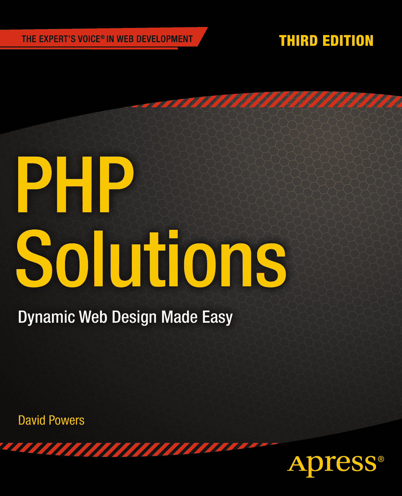

戴维·鲍尔斯

**《PHP 解决方案：动态网页设计轻松入门》** 第三版

ISBN 978-1-4842-0636-2 电子版 ISBN 978-1-4842-0635-5 DOI 10.1007/978-1-4842-0635-5

© Apress 2014

**出版人：** 海因茨·温海默  
**主编：** 本·雷诺-克拉克  
**技术审校：** 保罗·米尔伯恩

**编辑委员会：** 史蒂夫·安格林、马克·贝克纳、埃文·白金汉、加里·康奈尔、路易丝·科里根、吉姆·德沃尔夫、乔纳森·格尼克、罗伯特·哈钦森、米歇尔·洛曼、詹姆斯·马卡姆、马修·穆迪、杰夫·奥尔森、杰弗里·佩珀、道格拉斯·庞迪克、本·雷诺-克拉克、多米尼克·谢克沙夫特、格温南·斯皮林、马特·韦德、史蒂夫·韦斯

**协调编辑：** 克里斯汀·里基茨  
**文字编辑：** 艾普丽尔·罗多  
**排版：** SPi Global  
**索引编制：** SPi Global  
**美工：** SPi Global  
**封面设计：** 安娜·伊什琴科

本书通过 Springer Science+Business Media New York 在全球图书贸易中发行，地址：233 Spring Street, 6th Floor, New York, NY 10013。电话：1-800-SPRINGER，传真：(201) 348-4505，电子邮件：`orders-ny@springer-sbm.com`，或访问 [www.springeronline.com](http://www.springeronline.com/)。

Apress Media, LLC 是一家加利福尼亚州有限责任公司，其唯一成员（所有者）为 Springer Science + Business Media Finance Inc (SSBM Finance Inc)。SSBM Finance Inc 是一家特拉华州公司。

如需了解翻译相关信息，请发送电子邮件至 `rights@apress.com`，或访问 [www.apress.com](http://www.apress.com/)。

Apress 及 friends of ED 的图书可进行学术、企业或推广用途的大宗购买。大多数图书也提供电子版和授权许可。更多信息，请参考我们的特别大宗销售–电子书授权网页，网址为 [www.apress.com/bulk-sales](http://www.apress.com/bulk-sales)。

本文中作者引用的任何源代码或其他补充材料，读者可访问 [www.apress.com](http://www.apress.com/) 获取。有关如何找到您所购图书源代码的详细信息，请访问 [www.apress.com/source-code/](http://www.apress.com/source-code/)。

本作品受版权保护。出版商保留所有权利，无论涉及材料的全部或部分，特别是翻译、重印、插图复用、朗诵、广播、微缩胶片复制或以任何其他物理方式复制，以及信息存储检索、电子改编、计算机软件，或现在已知或未来开发的类似或不同方法的权利。

与本法律保留条款的例外情况包括：与评论或学术分析相关的简短摘录，或专门为在计算机系统上输入并执行而提供的材料，仅供作品购买者独家使用。对本出版物或其部分的复制，仅允许根据出版商所在地现行版权法的规定进行，并且必须始终从 Springer 获得使用许可。使用许可可通过 Copyright Clearance Center 的 RightsLink 获取。违反行为将根据相应的版权法予以起诉。

本书中可能出现商标名称、标识和图像。我们并未在每次出现商标名称、标识或图像时使用商标符号，而是仅以编辑方式使用这些名称、标识和图像，以维护商标所有者的利益，并无意侵犯商标权。

本出版物中使用的商品名称、商标、服务标记及类似术语，即使未明确标识，也不应被视为关于其是否受所有权保护的表述。

尽管本书中的建议和信息在出版时被认为是真实准确的，但作者、编辑和出版商均不对可能出现的任何错误或遗漏承担法律责任。出版商对本书所含材料不作任何明示或暗示的保证。

本出版物中使用通用描述性名称、注册名称、商标、服务标记等，即使未作明确声明，也不意味着这些名称不受相关保护性法律和法规的约束，因此可自由通用。

出版商、作者和编辑可假定本书中的建议和信息在出版时是真实准确的。出版商、作者和编辑均不对本书所含材料或可能存在的任何错误或遗漏作出明示或暗示的保证。

本书采用无酸纸印刷

**关于作者**

  
大卫·鲍尔斯（David Powers）撰写了一系列极为成功的网络开发书籍和视频培训课程，尤其专注于 PHP 和网络标准，包括 lynda.com 在线培训库中的《PHP 入门》与《PHP 代码诊所》。作为一名专业作家，他涉足电子媒体领域已超过 40 年，最初在 BBC 广播和电视台工作，近年则专注于互联网领域。他清晰的写作风格不仅在英语世界备受推崇——他的多部著作已被翻译成西班牙语、波兰语、中文等多种语言。大卫原本对计算机只有轻微兴趣，但这一切在 1987 年几乎一夜之间转变为热忱：当时他被派驻日本担任 BBC 驻东京记者。由于楼道里没有企业 IT 部门，他被迫自学如何亲手修理所有设备。在不摆弄电脑内部构造的时候，他便为 BBC 电视和广播报道日本泡沫经济的兴起与崩溃。离开 BBC 独立工作后，他曾参与多个项目，包括为一家国际咨询公司的日本客户开发在线双语经济政治分析数据库。此外，他还在牛津布鲁克斯大学教授研究生级别的网络媒体课程。

不敲键盘写书或构思 PHP 及其他编程语言的新用法时，大卫最爱去他钟爱的寿司餐厅。他还翻译过多部日本戏剧。

## 关于技术审校者

保罗·米尔本（Paul Milbourne）已在华盛顿-巴尔的摩大都会区担任软件开发人员超过十年。他的职业旅程让他有机会与华盛顿红皮队、巴尔的摩乌鸦队、Zynga 游戏公司等众多客户合作。

大多数情况下，保罗凭借处理突发问题和应对边缘案例而成就了体面的事业。这段经历使他通过多个行业和平台接触到开发的方方面面。

保罗还曾是一名厨师，一位热忱的音乐家，同时也是一名活跃的视觉艺术家。

