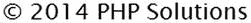
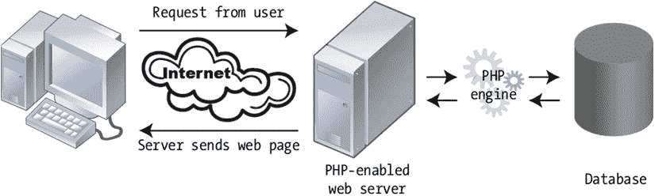

# 1. 什么是 PHP——以及我为何要关心它？

PHP 的官方全称是 PHP：超文本预处理器。这个拗口的名称给人一种印象，仿佛它只是极客或书呆子的专属。这完全是大错特错。几年前，在 PHP 通用邮件列表（[`http://news.php.net/php.general`](http://news.php.net/php.general)）上曾有过一场轻松有趣的讨论，建议将 PHP 的全称改为"积极快乐的人们"或"相当快乐的程序员"。本书旨在帮助你实际运用 PHP——并在此过程中，让你理解究竟是什么让 PHP 程序员如此快乐。

PHP 是一种脚本语言，它能通过以下方式让网站"活"起来：

- 将网站上的反馈直接发送到你的邮箱
- 通过网页上传文件
- 从大图片生成缩略图
- 读写文件
- 动态显示和更新信息
- 使用数据库来显示和存储信息
- 使网站具备可搜索性
- 还有更多……

通过阅读本书，你将能够实现所有这些功能。PHP 易于学习；它不依赖特定平台，因此相同的代码可以在 Windows、Mac OS X 和 Linux 上运行，而且你开发 PHP 所需的所有软件都是开源的，因此完全免费。

在本章中，你将了解以下内容：

- PHP 如何成长为动态网站最广泛使用的技术
- PHP 如何让网页变得动态
- PHP 学习起来有多难——或者多容易
- PHP 是否安全
- 编写 PHP 需要哪些软件

## PHP 的发展历程

PHP 现在是创建动态网站最广泛使用的技术，但它始于 1995 年，当时的目标相当谦逊——而且名字也不同。它最初被称为个人主页工具（PHP Tools）。其主要目标之一是通过收集在线表单的信息并在网页上显示来创建一个留言簿。三年内，开发团队决定从名称中去掉"个人主页"，因为它听起来像是爱好者的玩物，无法体现此后添加的一系列复杂功能。

PHP 多年来持续发展，不断添加新功能。根据 W3Techs（[`http://w3techs.com/technologies/details/pl-php/all/all`](http://w3techs.com/technologies/details/pl-php/all/all)）的数据，在其定期调查的 1000 万个网站中，超过 80% 使用 PHP 来创建动态内容。它是驱动诸如 Drupal（[`http://drupal.org/`](http://drupal.org/)）、Joomla!（[`www.joomla.org`](http://www.joomla.org/)）和 WordPress（[`http://wordpress.org/`](http://wordpress.org/)）等广受欢迎的内容管理系统（CMS）的语言。它同时驱动着一些访问量最高的网站，包括 Facebook（[`www.facebook.com`](http://www.facebook.com/)）和 Wikipedia（[`www.wikipedia.org`](http://www.wikipedia.org/)）。

不过，该语言的一大魅力在于，它始终不忘初心。PHP 的原始创建者拉斯马斯·勒德尔夫曾将其描述为"一种非常对程序员友好的脚本语言，既适合编程经验很少或完全没有经验的人，也适合需要快速完成工作的资深 Web 开发人员"。你无需学习大量理论知识就能开始编写有用的脚本，同时又能确信自己正在使用一种有能力开发工业级应用的技术。

注意

在撰写本书时，当前版本是 PHP 5.6。本书中的代码假设你至少使用 PHP 5.4，该版本移除了几个过时的功能，例如"魔术引号"。如果你有虚拟主机方案，请确保服务器至少运行 PHP 5.4。

PHP 的下一个主要版本将被称为 PHP 7。决定跳过 PHP 6 是为了避免与一个因过于雄心勃勃而在 2010 年被放弃的版本混淆。本书的重点在于现在就能工作的代码，而不是那些可能在未来的某个不确定时间才能工作的东西。不过，我完全预期本书中的大部分（如果不是全部）代码和技术在 PHP 7 中仍能继续工作。

## PHP 如何让页面变得动态

PHP 最初被设计为嵌入在网页的 HTML 中，这也仍然是它通常的使用方式。例如，如果你想在版权声明中显示当前年份，可以在页脚中放入以下代码：

```
<p>&copy; <?php echo date('Y'); ?> PHP Solutions</p>
```

在启用了 PHP 的 Web 服务器上，`<?php` 和 `?>` 标签之间的代码会被自动处理，并显示如下年份：



这只是一个简单的例子，但它说明了使用 PHP 的一些优势：

- 任何在元旦午夜钟声敲响后访问你网站的用户，都会看到正确的年份。
- 日期由 Web 服务器计算，因此不受用户计算机时钟设置错误的影响。

虽然像这样将 PHP 代码嵌入 HTML 很方便，但这样做很重复且容易导致错误。这也可能使你的网页难以维护，特别是当你开始使用更复杂的 PHP 代码时。因此，通常的做法是将大量动态代码存储在单独的文件中，然后使用 PHP 从不同的组件来构建你的页面。这些单独的文件——通常称为包含文件——可以只包含 PHP、只包含 HTML，或者两者混合。

举个简单的例子，你可以将网站导航菜单放在一个包含文件中，然后使用 PHP 将其包含在每个页面中。每当你需要对菜单进行任何更改时，只需编辑一个文件，即包含文件，这些更改就会自动反映在每个包含该菜单的页面中。想象一下，对于一个有几十个页面的网站来说，这能节省多少时间！

对于普通的 HTML 页面，内容由 Web 开发人员在设计时确定并上传到 Web 服务器。当有人访问该页面时，Web 服务器只是简单地发送 HTML 和其他资源，如图片和样式表。这是一个简单的事务——浏览器发出请求，服务器发回固定内容。当你使用 PHP 构建网页时，发生的事情要多得多。图 1-1 展示了这一过程。



图 1-1. Web 服务器根据请求动态构建每个 PHP 页面

当访问一个由 PHP 驱动的网站时，会触发以下一系列事件：

1. 浏览器向 Web 服务器发送请求。
2. Web 服务器将请求交给嵌入在服务器中的 PHP 引擎。
3. PHP 引擎处理代码。在许多情况下，它可能还会在构建页面之前查询数据库。
4. 服务器将完成后的页面发送回浏览器。

这个过程通常只需要几分之一秒，因此访问 PHP 网站的访客几乎感觉不到任何延迟。因为每个页面都是单独构建的，PHP 网站可以对用户输入做出响应，在用户登录时显示不同的内容，或者显示数据库搜索的结果。

### 创建能够自主思考的页面

PHP 是一种服务器端语言。PHP 代码保留在 Web 服务器上。处理完毕后，服务器只发送脚本的输出。通常这个输出是 HTML，但 PHP 也可以用来生成其他 Web 语言，例如 JSON（JavaScript 对象表示法）。

PHP 使你能够基于条件选择，将逻辑引入到网页中。一些决策是基于 PHP 从服务器收集的信息做出的：日期、时间、星期几、页面 URL 中的信息等等。如果是星期三，它会显示星期三的电视节目表。在其他时候，决策则基于用户输入，PHP 会从在线表单中提取这些输入。如果你注册了某个网站，它会显示个性化信息——诸如此类。


