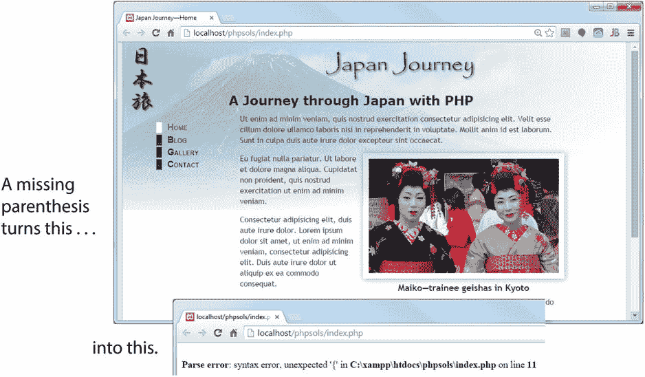

# PHP 的学习与使用难度如何？

PHP 并不算什么高深学问，但别指望五分钟就能成为专家。新手面临的最大冲击或许是：`PHP` 对错误的容忍度远低于浏览器对待 `HTML`。如果你在 `HTML` 中遗漏了结束标签，大多数浏览器仍能渲染页面。但如果在 `PHP` 中遗漏了闭合引号、分号或花括号，你就会看到像图 1-2 那样毫不妥协的错误信息。这一点影响所有编程语言，如 `JavaScript` 和 `C#`，而不仅仅是 `PHP`。

图 1-2. 像 `PHP` 这样的服务器端语言对大多数编码错误零容忍

如果你是那种使用 Adobe Dreamweaver 等可视化设计工具、从不查看底层代码的网页设计师或开发者，那么是时候重新考虑你的方法了。将 `PHP` 与结构混乱的 `HTML` 混合使用很可能会导致问题。`PHP` 使用循环来执行重复性任务，例如显示数据库搜索结果。循环会重复执行同一段代码——通常是 `PHP` 和 `HTML` 的混合——直到所有结果都显示完毕。如果你将循环放在错误的位置，或者 `HTML` 结构糟糕，你的页面很可能会像纸牌屋一样崩溃。

如果你还没有这个习惯，建议使用万维网联盟（W3C）的标记验证服务（[`http://validator.w3.org/unicorn`](http://validator.w3.org/unicorn)）来检查你的页面。

注意：W3C 是一个制定 `HTML` 和 `CSS` 等标准的国际组织，旨在确保网络的长期发展。它由万维网发明者蒂姆·伯纳斯-李领导。要了解 W3C 的使命，请参阅 [`www.w3.org/Consortium/mission`](http://www.w3.org/Consortium/mission)。

## 我可以直接复制粘贴代码吗？

复制本书中的代码没有任何问题。代码的作用就在于此。我将本书编排为一系列实践项目。我会解释代码的用途及其存在的理由。即使你不完全理解所有细节，这也足以让你有充分的信心，知道哪些部分可以根据自己的需求进行调整，哪些部分最好保留原样。但要充分利用本书，你需要开始尝试使用书中介绍的工具，然后提出自己的解决方案。

`PHP` 是一个功能强大的工具箱。它有数千个内置函数，可以执行各种任务，例如将文本转换为大写、从全尺寸图像生成缩略图，或者连接数据库。真正的力量来自于以不同的方式组合这些函数，并添加你自己的条件逻辑。

## PHP 的安全性如何？

`PHP` 就像你家里的电或厨房刀具：使用得当，非常安全；使用不当，则可能造成巨大破坏。本书第一版的写作灵感之一，源于当时一波利用电子邮件脚本漏洞的攻击，这些攻击将网站变成了垃圾邮件中继站。解决方案其实相当简单，你将在第 5 章中学到，但即使在十年后，我仍然看到有人使用相同的不安全技术，使他们的网站暴露在攻击之下。

`PHP` 并不危险，也并非每个人都需要成为安全专家才能使用它。重要的是理解 `PHP` 安全的基本原则：在*处理用户输入之前始终对其进行检查*。你会发现这是贯穿本书的一个永恒主题。大多数安全风险只需极少的努力就能消除。

保护自己最好的方法就是理解你正在使用的代码。

## 编写 PHP 需要什么软件？

严格来说，编写 `PHP` 脚本不需要任何特殊软件。`PHP` 代码是纯文本，可以在任何文本编辑器中创建，例如 Windows 上的 `Notepad` 或 Mac OS X 上的 `TextEdit`。话虽如此，但如果你使用具备加快开发流程功能的程序，你的生活将会轻松得多。目前有许多可用选项——既有免费的，也有付费的。

### 选择 PHP 编辑器时应关注什么

如果你的代码有错误，你的页面很可能永远无法到达浏览器，你只会看到一条错误信息。你应该选择一个具备以下功能的脚本编辑器：

- `PHP` 语法检查：过去这只有昂贵的专用程序中才有，但现在许多免费程序也具备此功能。语法检查器会在你键入代码时进行监控并高亮显示错误，从而节省大量时间并减少挫败感。

- `PHP` 语法着色：代码会根据其扮演的角色以不同颜色高亮显示。如果你的代码出现了意想不到的颜色，这肯定是你犯错的一个迹象。

- `PHP` 代码提示：`PHP` 有如此多的内置函数，即使是经验丰富的用户也可能难以记住所有用法。许多脚本编辑器会自动显示工具提示，提醒你某段特定代码的工作方式。

- 行号：快速定位特定行能极大简化故障排除过程。

- “花括号匹配”功能：圆括号 `()`、方括号 `[]` 和花括号 `{}` 必须始终成对出现。很容易忘记关闭一对。所有优秀的脚本编辑器都能帮助找到匹配的括号、方括号或花括号。

你当前用于构建网页的程序可能已经具备这些功能。例如，Adobe Dreamweaver CS5 及更高版本就具备这些功能（[`www.adobe.com/products/dreamweaver/`](http://www.adobe.com/products/dreamweaver/)）。它还内置了 `PHP` 文档。

即使你不打算大量进行 `PHP` 开发，如果你的网页开发程序不支持语法检查，你也应考虑使用专用的脚本编辑器。以下专用脚本编辑器具备所有基本功能，如语法检查和代码提示。这不是一个详尽的列表，而是基于个人经验的推荐。

- PhpStorm（[`www.jetbrains.com/phpstorm/`](http://www.jetbrains.com/phpstorm/)）：虽然这是一个专用的 `PHP` 编辑程序，但它也对 `HTML`、`CSS` 和 `JavaScript` 有出色的支持。这是我目前最喜欢的 `PHP` 开发程序。

- Sublime Text（[`www.sublimetext.com/`](http://www.sublimetext.com/)）：如果你是 Sublime Text 的粉丝，有用于 `PHP` 语法着色、语法检查和文档的插件可用。

- Zend Studio（[`www.zend.com/en/products/studio/`](http://www.zend.com/en/products/studio/)）：如果你对 `PHP` 开发非常认真，Zend Studio 是 `PHP` 功能最全面的集成开发环境（IDE）。它由 Zend 公司创建，该公司的运营者正是 `PHP` 开发的主要贡献者。Zend Studio 可在 Windows、Mac OS X 和 Linux 上运行。它过去价格高昂，但现在对个人开发者的价格更为亲民，并且包含 12 个月的免费升级和技术支持。

- PHP Development Tools（[`www.eclipse.org/pdt/`](http://www.eclipse.org/pdt/)）：`PDT` 实际上是 Zend Studio 的精简版，其优点是免费。它运行在 Eclipse 上，这是一个支持多种计算机语言的开源 IDE。如果你曾使用 Eclipse 处理其他语言，你会发现它相对容易上手。`PDT` 可在 Windows、Mac OS X 和 Linux 上运行，既可以作为 Eclipse 插件获取，也可以作为自动安装 Eclipse 和 `PDT` 插件的集成包使用。

- Komodo Edit（[`http://komodoide.com/komodo-edit/`](http://komodoide.com/komodo-edit/)）：这是一个免费的、为 `PHP` 及其他多种流行计算机语言设计的开源 IDE。它适用于 Windows、Mac OS X 和 Linux。它是 Komodo IDE（一款具有更高级功能的付费程序）的精简版。